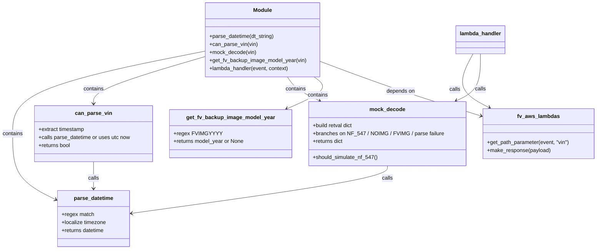

# Diagram: mocks/mock_apis/decode_vin.py


> Auto-generated by Obscura crawlers

## Diagram 1



### SVG

<svg id="container" width="1770.2734375" xmlns="http://www.w3.org/2000/svg" class="classDiagram" height="746" viewBox="0 0 1770.2734375 746" role="graphics-document document" aria-roledescription="class"><style>#container{font-family:"trebuchet ms",verdana,arial,sans-serif;font-size:16px;fill:#333;}@keyframes edge-animation-frame{from{stroke-dashoffset:0;}}@keyframes dash{to{stroke-dashoffset:0;}}#container .edge-animation-slow{stroke-dasharray:9,5!important;stroke-dashoffset:900;animation:dash 50s linear infinite;stroke-linecap:round;}#container .edge-animation-fast{stroke-dasharray:9,5!important;stroke-dashoffset:900;animation:dash 20s linear infinite;stroke-linecap:round;}#container .error-icon{fill:#552222;}#container .error-text{fill:#552222;stroke:#552222;}#container .edge-thickness-normal{stroke-width:1px;}#container .edge-thickness-thick{stroke-width:3.5px;}#container .edge-pattern-solid{stroke-dasharray:0;}#container .edge-thickness-invisible{stroke-width:0;fill:none;}#container .edge-pattern-dashed{stroke-dasharray:3;}#container .edge-pattern-dotted{stroke-dasharray:2;}#container .marker{fill:#333333;stroke:#333333;}#container .marker.cross{stroke:#333333;}#container svg{font-family:"trebuchet ms",verdana,arial,sans-serif;font-size:16px;}#container p{margin:0;}#container g.classGroup text{fill:#9370DB;stroke:none;font-family:"trebuchet ms",verdana,arial,sans-serif;font-size:10px;}#container g.classGroup text .title{font-weight:bolder;}#container .nodeLabel,#container .edgeLabel{color:#131300;}#container .edgeLabel .label rect{fill:#ECECFF;}#container .label text{fill:#131300;}#container .labelBkg{background:#ECECFF;}#container .edgeLabel .label span{background:#ECECFF;}#container .classTitle{font-weight:bolder;}#container .node rect,#container .node circle,#container .node ellipse,#container .node polygon,#container .node path{fill:#ECECFF;stroke:#9370DB;stroke-width:1px;}#container .divider{stroke:#9370DB;stroke-width:1;}#container g.clickable{cursor:pointer;}#container g.classGroup rect{fill:#ECECFF;stroke:#9370DB;}#container g.classGroup line{stroke:#9370DB;stroke-width:1;}#container .classLabel .box{stroke:none;stroke-width:0;fill:#ECECFF;opacity:0.5;}#container .classLabel .label{fill:#9370DB;font-size:10px;}#container .relation{stroke:#333333;stroke-width:1;fill:none;}#container .dashed-line{stroke-dasharray:3;}#container .dotted-line{stroke-dasharray:1 2;}#container #compositionStart,#container .composition{fill:#333333!important;stroke:#333333!important;stroke-width:1;}#container #compositionEnd,#container .composition{fill:#333333!important;stroke:#333333!important;stroke-width:1;}#container #dependencyStart,#container .dependency{fill:#333333!important;stroke:#333333!important;stroke-width:1;}#container #dependencyStart,#container .dependency{fill:#333333!important;stroke:#333333!important;stroke-width:1;}#container #extensionStart,#container .extension{fill:transparent!important;stroke:#333333!important;stroke-width:1;}#container #extensionEnd,#container .extension{fill:transparent!important;stroke:#333333!important;stroke-width:1;}#container #aggregationStart,#container .aggregation{fill:transparent!important;stroke:#333333!important;stroke-width:1;}#container #aggregationEnd,#container .aggregation{fill:transparent!important;stroke:#333333!important;stroke-width:1;}#container #lollipopStart,#container .lollipop{fill:#ECECFF!important;stroke:#333333!important;stroke-width:1;}#container #lollipopEnd,#container .lollipop{fill:#ECECFF!important;stroke:#333333!important;stroke-width:1;}#container .edgeTerminals{font-size:11px;line-height:initial;}#container .classTitleText{text-anchor:middle;font-size:18px;fill:#333;}#container .label-icon{display:inline-block;height:1em;overflow:visible;vertical-align:-0.125em;}#container .node .label-icon path{fill:currentColor;stroke:revert;stroke-width:revert;}#container :root{--mermaid-font-family:"trebuchet ms",verdana,arial,sans-serif;}</style><g><defs><marker id="container_class-aggregationStart" class="marker aggregation class" refX="18" refY="7" markerWidth="190" markerHeight="240" orient="auto"><path d="M 18,7 L9,13 L1,7 L9,1 Z"></path></marker></defs><defs><marker id="container_class-aggregationEnd" class="marker aggregation class" refX="1" refY="7" markerWidth="20" markerHeight="28" orient="auto"><path d="M 18,7 L9,13 L1,7 L9,1 Z"></path></marker></defs><defs><marker id="container_class-extensionStart" class="marker extension class" refX="18" refY="7" markerWidth="190" markerHeight="240" orient="auto"><path d="M 1,7 L18,13 V 1 Z"></path></marker></defs><defs><marker id="container_class-extensionEnd" class="marker extension class" refX="1" refY="7" markerWidth="20" markerHeight="28" orient="auto"><path d="M 1,1 V 13 L18,7 Z"></path></marker></defs><defs><marker id="container_class-compositionStart" class="marker composition class" refX="18" refY="7" markerWidth="190" markerHeight="240" orient="auto"><path d="M 18,7 L9,13 L1,7 L9,1 Z"></path></marker></defs><defs><marker id="container_class-compositionEnd" class="marker composition class" refX="1" refY="7" markerWidth="20" markerHeight="28" orient="auto"><path d="M 18,7 L9,13 L1,7 L9,1 Z"></path></marker></defs><defs><marker id="container_class-dependencyStart" class="marker dependency class" refX="6" refY="7" markerWidth="190" markerHeight="240" orient="auto"><path d="M 5,7 L9,13 L1,7 L9,1 Z"></path></marker></defs><defs><marker id="container_class-dependencyEnd" class="marker dependency class" refX="13" refY="7" markerWidth="20" markerHeight="28" orient="auto"><path d="M 18,7 L9,13 L14,7 L9,1 Z"></path></marker></defs><defs><marker id="container_class-lollipopStart" class="marker lollipop class" refX="13" refY="7" markerWidth="190" markerHeight="240" orient="auto"><circle stroke="black" fill="transparent" cx="7" cy="7" r="6"></circle></marker></defs><defs><marker id="container_class-lollipopEnd" class="marker lollipop class" refX="1" refY="7" markerWidth="190" markerHeight="240" orient="auto"><circle stroke="black" fill="transparent" cx="7" cy="7" r="6"></circle></marker></defs><g class="root"><g class="clusters"></g><g class="edgePaths"><path d="M612.502,152.868L516.9,171.89C421.298,190.912,230.094,228.956,134.493,270.145C38.891,311.333,38.891,355.667,38.891,400C38.891,444.333,38.891,488.667,60.408,521.586C81.926,554.506,124.961,576.012,146.479,586.764L167.996,597.517" id="id_Module_parse_datetime_1" class="edge-thickness-normal edge-pattern-solid relation" style=";;;" data-edge="true" data-et="edge" data-id="id_Module_parse_datetime_1" data-points="W3sieCI6NjEyLjUwMTk1MzEyNSwieSI6MTUyLjg2ODQ1NDI4OTMyMjg0fSx7IngiOjM4Ljg5MDYyNSwieSI6MjY3fSx7IngiOjM4Ljg5MDYyNSwieSI6NDAwfSx7IngiOjM4Ljg5MDYyNSwieSI6NTMzfSx7IngiOjE3My4zNjMyODEyNSwieSI6NjAwLjE5OTQ0ODI2MjUxMDl9XQ==" marker-end="url(#container_class-dependencyEnd)"></path><path d="M612.502,169.214L557.256,185.512C502.009,201.81,391.516,234.405,336.27,257.869C281.023,281.333,281.023,295.667,281.023,302.833L281.023,310" id="id_Module_can_parse_vin_2" class="edge-thickness-normal edge-pattern-solid relation" style=";;;" data-edge="true" data-et="edge" data-id="id_Module_can_parse_vin_2" data-points="W3sieCI6NjEyLjUwMTk1MzEyNSwieSI6MTY5LjIxNDI5NjAwMzAyMX0seyJ4IjoyODEuMDIzNDM3NSwieSI6MjY3fSx7IngiOjI4MS4wMjM0Mzc1LCJ5IjozMTZ9XQ==" marker-end="url(#container_class-dependencyEnd)"></path><path d="M854.428,230L858.411,236.167C862.395,242.333,870.363,254.667,886.033,266.56C901.703,278.453,925.076,289.907,936.762,295.633L948.449,301.36" id="id_Module_mock_decode_3" class="edge-thickness-normal edge-pattern-solid relation" style=";;;" data-edge="true" data-et="edge" data-id="id_Module_mock_decode_3" data-points="W3sieCI6ODU0LjQyNzczNDM3NSwieSI6MjMwfSx7IngiOjg3OC4zMzAwNzgxMjUsInkiOjI2N30seyJ4Ijo5NTMuODM2Nzg5MjM4NzIxOCwieSI6MzA0fV0=" marker-end="url(#container_class-dependencyEnd)"></path><path d="M935.598,230L944.091,236.167C952.584,242.333,969.57,254.667,956.208,270.592C942.845,286.518,899.134,306.036,877.278,315.795L855.422,325.554" id="id_Module_get_fv_backup_image_model_year_4" class="edge-thickness-normal edge-pattern-solid relation" style=";;;" data-edge="true" data-et="edge" data-id="id_Module_get_fv_backup_image_model_year_4" data-points="W3sieCI6OTM1LjU5NzY1NjI1LCJ5IjoyMzB9LHsieCI6OTg2LjU1NjY0MDYyNSwieSI6MjY3fSx7IngiOjg0OS45NDM1NTAyODE5NTQ5LCJ5IjozMjh9XQ==" marker-end="url(#container_class-dependencyEnd)"></path><path d="M952.939,183.813L989.352,197.677C1025.764,211.542,1098.589,239.271,1177.04,266.309C1255.49,293.348,1339.566,319.695,1381.604,332.869L1423.642,346.043" id="id_Module_fv_aws_lambdas_5" class="edge-thickness-normal edge-pattern-solid relation" style=";;;" data-edge="true" data-et="edge" data-id="id_Module_fv_aws_lambdas_5" data-points="W3sieCI6OTUyLjkzOTQ1MzEyNSwieSI6MTgzLjgxMjk4MDE4NzAyNDgzfSx7IngiOjExNzEuNDE0MDYyNSwieSI6MjY3fSx7IngiOjE0MjkuMzY3MTg3NSwieSI6MzQ3LjgzNzA4ODU3OTYzMzN9XQ==" marker-end="url(#container_class-dependencyEnd)"></path><path d="M1149.746,496L1149.746,502.167C1149.746,508.333,1149.746,520.667,1023.893,544.363C898.039,568.059,646.333,603.118,520.48,620.647L394.626,638.177" id="id_mock_decode_parse_datetime_6" class="edge-thickness-normal edge-pattern-solid relation" style=";;;" data-edge="true" data-et="edge" data-id="id_mock_decode_parse_datetime_6" data-points="W3sieCI6MTE0OS43NDYwOTM3NSwieSI6NDk2fSx7IngiOjExNDkuNzQ2MDkzNzUsInkiOjUzM30seyJ4IjozODguNjgzNTkzNzUsInkiOjYzOS4wMDQ1NTk0OTYwMjc0fV0=" marker-end="url(#container_class-dependencyEnd)"></path><path d="M281.023,484L281.023,492.167C281.023,500.333,281.023,516.667,281.023,530C281.023,543.333,281.023,553.667,281.023,558.833L281.023,564" id="id_can_parse_vin_parse_datetime_7" class="edge-thickness-normal edge-pattern-solid relation" style=";;;" data-edge="true" data-et="edge" data-id="id_can_parse_vin_parse_datetime_7" data-points="W3sieCI6MjgxLjAyMzQzNzUsInkiOjQ4NH0seyJ4IjoyODEuMDIzNDM3NSwieSI6NTMzfSx7IngiOjI4MS4wMjM0Mzc1LCJ5Ijo1NzB9XQ==" marker-end="url(#container_class-dependencyEnd)"></path><path d="M1403.16,161L1393.689,178.667C1384.219,196.333,1365.278,231.667,1373.059,258.53C1380.839,285.392,1415.339,303.785,1432.59,312.981L1449.84,322.177" id="id_lambda_handler_fv_aws_lambdas_8" class="edge-thickness-normal edge-pattern-solid relation" style=";;;" data-edge="true" data-et="edge" data-id="id_lambda_handler_fv_aws_lambdas_8" data-points="W3sieCI6MTQwMy4xNTk1NzU1OTEyMTYzLCJ5IjoxNjF9LHsieCI6MTM0Ni4zMzc4OTA2MjUsInkiOjI2N30seyJ4IjoxNDU1LjEzNDczNjI1NDY5OTIsInkiOjMyNX1d" marker-end="url(#container_class-dependencyEnd)"></path><path d="M1425.674,161L1425.674,178.667C1425.674,196.333,1425.674,231.667,1413.781,255.066C1401.888,278.465,1378.103,289.93,1366.21,295.662L1354.317,301.395" id="id_lambda_handler_mock_decode_9" class="edge-thickness-normal edge-pattern-solid relation" style=";;;" data-edge="true" data-et="edge" data-id="id_lambda_handler_mock_decode_9" data-points="W3sieCI6MTQyNS42NzM4MjgxMjUsInkiOjE2MX0seyJ4IjoxNDI1LjY3MzgyODEyNSwieSI6MjY3fSx7IngiOjEzNDguOTExOTc3MjA4NjQ2NywieSI6MzA0fV0=" marker-end="url(#container_class-dependencyEnd)"></path></g><g class="edgeLabels"><g class="edgeLabel" transform="translate(38.890625, 400)"><g class="label" data-id="id_Module_parse_datetime_1" transform="translate(-30.890625, -12)"><foreignObject width="61.78125" height="24"><div xmlns="http://www.w3.org/1999/xhtml" class="labelBkg" style="display: table-cell; white-space: nowrap; line-height: 1.5; max-width: 200px; text-align: center;"><span class="edgeLabel"><p>contains</p></span></div></foreignObject></g></g><g class="edgeLabel" transform="translate(281.0234375, 267)"><g class="label" data-id="id_Module_can_parse_vin_2" transform="translate(-30.890625, -12)"><foreignObject width="61.78125" height="24"><div xmlns="http://www.w3.org/1999/xhtml" class="labelBkg" style="display: table-cell; white-space: nowrap; line-height: 1.5; max-width: 200px; text-align: center;"><span class="edgeLabel"><p>contains</p></span></div></foreignObject></g></g><g class="edgeLabel" transform="translate(878.330078125, 267)"><g class="label" data-id="id_Module_mock_decode_3" transform="translate(-30.890625, -12)"><foreignObject width="61.78125" height="24"><div xmlns="http://www.w3.org/1999/xhtml" class="labelBkg" style="display: table-cell; white-space: nowrap; line-height: 1.5; max-width: 200px; text-align: center;"><span class="edgeLabel"><p>contains</p></span></div></foreignObject></g></g><g class="edgeLabel" transform="translate(947.00147, 284.66204)"><g class="label" data-id="id_Module_get_fv_backup_image_model_year_4" transform="translate(-30.890625, -12)"><foreignObject width="61.78125" height="24"><div xmlns="http://www.w3.org/1999/xhtml" class="labelBkg" style="display: table-cell; white-space: nowrap; line-height: 1.5; max-width: 200px; text-align: center;"><span class="edgeLabel"><p>contains</p></span></div></foreignObject></g></g><g class="edgeLabel" transform="translate(1188.8513, 272.46446)"><g class="label" data-id="id_Module_fv_aws_lambdas_5" transform="translate(-42.9453125, -12)"><foreignObject width="85.890625" height="24"><div xmlns="http://www.w3.org/1999/xhtml" class="labelBkg" style="display: table-cell; white-space: nowrap; line-height: 1.5; max-width: 200px; text-align: center;"><span class="edgeLabel"><p>depends on</p></span></div></foreignObject></g></g><g class="edgeLabel" transform="translate(1149.74609375, 533)"><g class="label" data-id="id_mock_decode_parse_datetime_6" transform="translate(-16.4453125, -12)"><foreignObject width="32.890625" height="24"><div xmlns="http://www.w3.org/1999/xhtml" class="labelBkg" style="display: table-cell; white-space: nowrap; line-height: 1.5; max-width: 200px; text-align: center;"><span class="edgeLabel"><p>calls</p></span></div></foreignObject></g></g><g class="edgeLabel" transform="translate(281.0234375, 533)"><g class="label" data-id="id_can_parse_vin_parse_datetime_7" transform="translate(-16.4453125, -12)"><foreignObject width="32.890625" height="24"><div xmlns="http://www.w3.org/1999/xhtml" class="labelBkg" style="display: table-cell; white-space: nowrap; line-height: 1.5; max-width: 200px; text-align: center;"><span class="edgeLabel"><p>calls</p></span></div></foreignObject></g></g><g class="edgeLabel" transform="translate(1347.67127, 267.71083)"><g class="label" data-id="id_lambda_handler_fv_aws_lambdas_8" transform="translate(-16.4453125, -12)"><foreignObject width="32.890625" height="24"><div xmlns="http://www.w3.org/1999/xhtml" class="labelBkg" style="display: table-cell; white-space: nowrap; line-height: 1.5; max-width: 200px; text-align: center;"><span class="edgeLabel"><p>calls</p></span></div></foreignObject></g></g><g class="edgeLabel" transform="translate(1425.673828125, 267)"><g class="label" data-id="id_lambda_handler_mock_decode_9" transform="translate(-16.4453125, -12)"><foreignObject width="32.890625" height="24"><div xmlns="http://www.w3.org/1999/xhtml" class="labelBkg" style="display: table-cell; white-space: nowrap; line-height: 1.5; max-width: 200px; text-align: center;"><span class="edgeLabel"><p>calls</p></span></div></foreignObject></g></g></g><g class="nodes"><g class="node default" id="classId-Module-0" transform="translate(782.720703125, 119)"><g class="basic label-container"><path d="M-170.21875 -111 L170.21875 -111 L170.21875 111 L-170.21875 111" stroke="none" stroke-width="0" fill="#ECECFF" style=""></path><path d="M-170.21875 -111 C-34.57710493388788 -111, 101.06454013222424 -111, 170.21875 -111 M-170.21875 -111 C-56.62269910582634 -111, 56.973351788347316 -111, 170.21875 -111 M170.21875 -111 C170.21875 -54.42066918353703, 170.21875 2.1586616329259414, 170.21875 111 M170.21875 -111 C170.21875 -57.0732736440082, 170.21875 -3.146547288016393, 170.21875 111 M170.21875 111 C77.186497331445 111, -15.845755337110006 111, -170.21875 111 M170.21875 111 C62.150154625219244 111, -45.91844074956151 111, -170.21875 111 M-170.21875 111 C-170.21875 27.898738522836823, -170.21875 -55.202522954326355, -170.21875 -111 M-170.21875 111 C-170.21875 59.258941219364985, -170.21875 7.51788243872997, -170.21875 -111" stroke="#9370DB" stroke-width="1.3" fill="none" stroke-dasharray="0 0" style=""></path></g><g class="annotation-group text" transform="translate(0, -87)"></g><g class="label-group text" transform="translate(-27.09375, -87)"><g class="label" style="font-weight: bolder" transform="translate(0,-12)"><foreignObject width="54.1875" height="24"><div xmlns="http://www.w3.org/1999/xhtml" style="display: table-cell; white-space: nowrap; line-height: 1.5; max-width: 104px; text-align: center;"><span class="nodeLabel markdown-node-label" style=""><p>Module</p></span></div></foreignObject></g></g><g class="members-group text" transform="translate(-158.21875, -39)"></g><g class="methods-group text" transform="translate(-158.21875, -9)"><g class="label" style="" transform="translate(0,-12)"><foreignObject width="196.765625" height="24"><div xmlns="http://www.w3.org/1999/xhtml" style="display: table-cell; white-space: nowrap; line-height: 1.5; max-width: 254px; text-align: center;"><span class="nodeLabel markdown-node-label" style=""><p>+parse_datetime(dt_string)</p></span></div></foreignObject></g><g class="label" style="" transform="translate(0,12)"><foreignObject width="143.46875" height="24"><div xmlns="http://www.w3.org/1999/xhtml" style="display: table-cell; white-space: nowrap; line-height: 1.5; max-width: 201px; text-align: center;"><span class="nodeLabel markdown-node-label" style=""><p>+can_parse_vin(vin)</p></span></div></foreignObject></g><g class="label" style="" transform="translate(0,36)"><foreignObject width="140.265625" height="24"><div xmlns="http://www.w3.org/1999/xhtml" style="display: table-cell; white-space: nowrap; line-height: 1.5; max-width: 198px; text-align: center;"><span class="nodeLabel markdown-node-label" style=""><p>+mock_decode(vin)</p></span></div></foreignObject></g><g class="label" style="" transform="translate(0,60)"><foreignObject width="289.34375" height="24"><div xmlns="http://www.w3.org/1999/xhtml" style="display: table-cell; white-space: nowrap; line-height: 1.5; max-width: 347px; text-align: center;"><span class="nodeLabel markdown-node-label" style=""><p>+get_fv_backup_image_model_year(vin)</p></span></div></foreignObject></g><g class="label" style="" transform="translate(0,84)"><foreignObject width="240.1875" height="24"><div xmlns="http://www.w3.org/1999/xhtml" style="display: table-cell; white-space: nowrap; line-height: 1.5; max-width: 298px; text-align: center;"><span class="nodeLabel markdown-node-label" style=""><p>+lambda_handler(event, context)</p></span></div></foreignObject></g></g><g class="divider" style=""><path d="M-170.21875 -63 C-42.7407096654691 -63, 84.7373306690618 -63, 170.21875 -63 M-170.21875 -63 C-56.12333135612111 -63, 57.97208728775777 -63, 170.21875 -63" stroke="#9370DB" stroke-width="1.3" fill="none" stroke-dasharray="0 0" style=""></path></g><g class="divider" style=""><path d="M-170.21875 -39 C-58.96059385435615 -39, 52.297562291287704 -39, 170.21875 -39 M-170.21875 -39 C-94.67892202599451 -39, -19.13909405198902 -39, 170.21875 -39" stroke="#9370DB" stroke-width="1.3" fill="none" stroke-dasharray="0 0" style=""></path></g></g><g class="node default" id="classId-parse_datetime-1" transform="translate(281.0234375, 654)"><g class="basic label-container"><path d="M-107.66015625 -84 L107.66015625 -84 L107.66015625 84 L-107.66015625 84" stroke="none" stroke-width="0" fill="#ECECFF" style=""></path><path d="M-107.66015625 -84 C-50.75588022547399 -84, 6.148395799052025 -84, 107.66015625 -84 M-107.66015625 -84 C-27.39896677027437 -84, 52.86222270945126 -84, 107.66015625 -84 M107.66015625 -84 C107.66015625 -18.024703190181697, 107.66015625 47.95059361963661, 107.66015625 84 M107.66015625 -84 C107.66015625 -17.33157791492532, 107.66015625 49.33684417014936, 107.66015625 84 M107.66015625 84 C28.39544477514937 84, -50.86926669970126 84, -107.66015625 84 M107.66015625 84 C62.02311373890222 84, 16.386071227804436 84, -107.66015625 84 M-107.66015625 84 C-107.66015625 41.00613199629668, -107.66015625 -1.9877360074066388, -107.66015625 -84 M-107.66015625 84 C-107.66015625 43.19389788051267, -107.66015625 2.3877957610253446, -107.66015625 -84" stroke="#9370DB" stroke-width="1.3" fill="none" stroke-dasharray="0 0" style=""></path></g><g class="annotation-group text" transform="translate(0, -60)"></g><g class="label-group text" transform="translate(-57.3828125, -60)"><g class="label" style="font-weight: bolder" transform="translate(0,-12)"><foreignObject width="114.765625" height="24"><div xmlns="http://www.w3.org/1999/xhtml" style="display: table-cell; white-space: nowrap; line-height: 1.5; max-width: 163px; text-align: center;"><span class="nodeLabel markdown-node-label" style=""><p>parse_datetime</p></span></div></foreignObject></g></g><g class="members-group text" transform="translate(-95.66015625, -12)"><g class="label" style="" transform="translate(0,-12)"><foreignObject width="96.03125" height="24"><div xmlns="http://www.w3.org/1999/xhtml" style="display: table-cell; white-space: nowrap; line-height: 1.5; max-width: 153px; text-align: center;"><span class="nodeLabel markdown-node-label" style=""><p>+regex match</p></span></div></foreignObject></g><g class="label" style="" transform="translate(0,12)"><foreignObject width="133.9375" height="24"><div xmlns="http://www.w3.org/1999/xhtml" style="display: table-cell; white-space: nowrap; line-height: 1.5; max-width: 191px; text-align: center;"><span class="nodeLabel markdown-node-label" style=""><p>+localize timezone</p></span></div></foreignObject></g><g class="label" style="" transform="translate(0,36)"><foreignObject width="130.015625" height="24"><div xmlns="http://www.w3.org/1999/xhtml" style="display: table-cell; white-space: nowrap; line-height: 1.5; max-width: 187px; text-align: center;"><span class="nodeLabel markdown-node-label" style=""><p>+returns datetime</p></span></div></foreignObject></g></g><g class="methods-group text" transform="translate(-95.66015625, 84)"></g><g class="divider" style=""><path d="M-107.66015625 -36 C-56.45128578400753 -36, -5.2424153180150626 -36, 107.66015625 -36 M-107.66015625 -36 C-36.01347755809674 -36, 35.63320113380652 -36, 107.66015625 -36" stroke="#9370DB" stroke-width="1.3" fill="none" stroke-dasharray="0 0" style=""></path></g><g class="divider" style=""><path d="M-107.66015625 60 C-33.04068568610052 60, 41.57878487779897 60, 107.66015625 60 M-107.66015625 60 C-24.671113155699643 60, 58.31792993860071 60, 107.66015625 60" stroke="#9370DB" stroke-width="1.3" fill="none" stroke-dasharray="0 0" style=""></path></g></g><g class="node default" id="classId-can_parse_vin-2" transform="translate(281.0234375, 400)"><g class="basic label-container"><path d="M-176.2421875 -84 L176.2421875 -84 L176.2421875 84 L-176.2421875 84" stroke="none" stroke-width="0" fill="#ECECFF" style=""></path><path d="M-176.2421875 -84 C-79.73935393663085 -84, 16.763479626738302 -84, 176.2421875 -84 M-176.2421875 -84 C-89.75528442851432 -84, -3.2683813570286304 -84, 176.2421875 -84 M176.2421875 -84 C176.2421875 -48.16070991931837, 176.2421875 -12.321419838636743, 176.2421875 84 M176.2421875 -84 C176.2421875 -46.707879019456655, 176.2421875 -9.41575803891331, 176.2421875 84 M176.2421875 84 C84.99340416686401 84, -6.255379166271979 84, -176.2421875 84 M176.2421875 84 C85.11875370987991 84, -6.004680080240178 84, -176.2421875 84 M-176.2421875 84 C-176.2421875 48.40751564511578, -176.2421875 12.815031290231559, -176.2421875 -84 M-176.2421875 84 C-176.2421875 35.87950334328648, -176.2421875 -12.24099331342704, -176.2421875 -84" stroke="#9370DB" stroke-width="1.3" fill="none" stroke-dasharray="0 0" style=""></path></g><g class="annotation-group text" transform="translate(0, -60)"></g><g class="label-group text" transform="translate(-52.125, -60)"><g class="label" style="font-weight: bolder" transform="translate(0,-12)"><foreignObject width="104.25" height="24"><div xmlns="http://www.w3.org/1999/xhtml" style="display: table-cell; white-space: nowrap; line-height: 1.5; max-width: 153px; text-align: center;"><span class="nodeLabel markdown-node-label" style=""><p>can_parse_vin</p></span></div></foreignObject></g></g><g class="members-group text" transform="translate(-164.2421875, -12)"><g class="label" style="" transform="translate(0,-12)"><foreignObject width="139.859375" height="24"><div xmlns="http://www.w3.org/1999/xhtml" style="display: table-cell; white-space: nowrap; line-height: 1.5; max-width: 197px; text-align: center;"><span class="nodeLabel markdown-node-label" style=""><p>+extract timestamp</p></span></div></foreignObject></g><g class="label" style="" transform="translate(0,12)"><foreignObject width="276.359375" height="24"><div xmlns="http://www.w3.org/1999/xhtml" style="display: table-cell; white-space: nowrap; line-height: 1.5; max-width: 334px; text-align: center;"><span class="nodeLabel markdown-node-label" style=""><p>+calls parse_datetime or uses utc now</p></span></div></foreignObject></g><g class="label" style="" transform="translate(0,36)"><foreignObject width="97.640625" height="24"><div xmlns="http://www.w3.org/1999/xhtml" style="display: table-cell; white-space: nowrap; line-height: 1.5; max-width: 155px; text-align: center;"><span class="nodeLabel markdown-node-label" style=""><p>+returns bool</p></span></div></foreignObject></g></g><g class="methods-group text" transform="translate(-164.2421875, 84)"></g><g class="divider" style=""><path d="M-176.2421875 -36 C-78.89440334044694 -36, 18.453380819106115 -36, 176.2421875 -36 M-176.2421875 -36 C-94.90470358188517 -36, -13.567219663770345 -36, 176.2421875 -36" stroke="#9370DB" stroke-width="1.3" fill="none" stroke-dasharray="0 0" style=""></path></g><g class="divider" style=""><path d="M-176.2421875 60 C-78.3889162880277 60, 19.464354923944597 60, 176.2421875 60 M-176.2421875 60 C-78.93943155311737 60, 18.363324393765254 60, 176.2421875 60" stroke="#9370DB" stroke-width="1.3" fill="none" stroke-dasharray="0 0" style=""></path></g></g><g class="node default" id="classId-mock_decode-3" transform="translate(1149.74609375, 400)"><g class="basic label-container"><path d="M-229.62109375 -96 L229.62109375 -96 L229.62109375 96 L-229.62109375 96" stroke="none" stroke-width="0" fill="#ECECFF" style=""></path><path d="M-229.62109375 -96 C-116.84481260763397 -96, -4.068531465267938 -96, 229.62109375 -96 M-229.62109375 -96 C-62.20639716176606 -96, 105.20829942646787 -96, 229.62109375 -96 M229.62109375 -96 C229.62109375 -31.495135749961406, 229.62109375 33.00972850007719, 229.62109375 96 M229.62109375 -96 C229.62109375 -53.31641967680104, 229.62109375 -10.63283935360208, 229.62109375 96 M229.62109375 96 C98.54428075246003 96, -32.53253224507995 96, -229.62109375 96 M229.62109375 96 C65.42916333105072 96, -98.76276708789857 96, -229.62109375 96 M-229.62109375 96 C-229.62109375 39.310062525495894, -229.62109375 -17.37987494900821, -229.62109375 -96 M-229.62109375 96 C-229.62109375 38.4035496914206, -229.62109375 -19.1929006171588, -229.62109375 -96" stroke="#9370DB" stroke-width="1.3" fill="none" stroke-dasharray="0 0" style=""></path></g><g class="annotation-group text" transform="translate(0, -72)"></g><g class="label-group text" transform="translate(-50.4609375, -72)"><g class="label" style="font-weight: bolder" transform="translate(0,-12)"><foreignObject width="100.921875" height="24"><div xmlns="http://www.w3.org/1999/xhtml" style="display: table-cell; white-space: nowrap; line-height: 1.5; max-width: 150px; text-align: center;"><span class="nodeLabel markdown-node-label" style=""><p>mock_decode</p></span></div></foreignObject></g></g><g class="members-group text" transform="translate(-217.62109375, -24)"><g class="label" style="" transform="translate(0,-12)"><foreignObject width="122.4375" height="24"><div xmlns="http://www.w3.org/1999/xhtml" style="display: table-cell; white-space: nowrap; line-height: 1.5; max-width: 180px; text-align: center;"><span class="nodeLabel markdown-node-label" style=""><p>+build retval dict</p></span></div></foreignObject></g><g class="label" style="" transform="translate(0,12)"><foreignObject width="384.78125" height="24"><div xmlns="http://www.w3.org/1999/xhtml" style="display: table-cell; white-space: nowrap; line-height: 1.5; max-width: 442px; text-align: center;"><span class="nodeLabel markdown-node-label" style=""><p>+branches on NF_547 / NOIMG / FVIMG / parse failure</p></span></div></foreignObject></g><g class="label" style="" transform="translate(0,36)"><foreignObject width="92.265625" height="24"><div xmlns="http://www.w3.org/1999/xhtml" style="display: table-cell; white-space: nowrap; line-height: 1.5; max-width: 150px; text-align: center;"><span class="nodeLabel markdown-node-label" style=""><p>+returns dict</p></span></div></foreignObject></g></g><g class="methods-group text" transform="translate(-217.62109375, 72)"><g class="label" style="" transform="translate(0,-12)"><foreignObject width="192.765625" height="24"><div xmlns="http://www.w3.org/1999/xhtml" style="display: table-cell; white-space: nowrap; line-height: 1.5; max-width: 250px; text-align: center;"><span class="nodeLabel markdown-node-label" style=""><p>+should_simulate_nf_547()</p></span></div></foreignObject></g></g><g class="divider" style=""><path d="M-229.62109375 -48 C-73.676993438562 -48, 82.26710687287601 -48, 229.62109375 -48 M-229.62109375 -48 C-93.51581790948308 -48, 42.58945793103385 -48, 229.62109375 -48" stroke="#9370DB" stroke-width="1.3" fill="none" stroke-dasharray="0 0" style=""></path></g><g class="divider" style=""><path d="M-229.62109375 48 C-104.82881358455514 48, 19.96346658088973 48, 229.62109375 48 M-229.62109375 48 C-131.32351914143368 48, -33.025944532867356 48, 229.62109375 48" stroke="#9370DB" stroke-width="1.3" fill="none" stroke-dasharray="0 0" style=""></path></g></g><g class="node default" id="classId-get_fv_backup_image_model_year-4" transform="translate(688.6953125, 400)"><g class="basic label-container"><path d="M-181.4296875 -72 L181.4296875 -72 L181.4296875 72 L-181.4296875 72" stroke="none" stroke-width="0" fill="#ECECFF" style=""></path><path d="M-181.4296875 -72 C-96.22244036172872 -72, -11.01519322345743 -72, 181.4296875 -72 M-181.4296875 -72 C-85.57383146404834 -72, 10.282024571903321 -72, 181.4296875 -72 M181.4296875 -72 C181.4296875 -16.424910765357254, 181.4296875 39.15017846928549, 181.4296875 72 M181.4296875 -72 C181.4296875 -33.20993829869516, 181.4296875 5.580123402609686, 181.4296875 72 M181.4296875 72 C45.37241133196994 72, -90.68486483606011 72, -181.4296875 72 M181.4296875 72 C61.95963174849746 72, -57.510424003005085 72, -181.4296875 72 M-181.4296875 72 C-181.4296875 30.494097957801856, -181.4296875 -11.011804084396289, -181.4296875 -72 M-181.4296875 72 C-181.4296875 21.746726051549643, -181.4296875 -28.506547896900713, -181.4296875 -72" stroke="#9370DB" stroke-width="1.3" fill="none" stroke-dasharray="0 0" style=""></path></g><g class="annotation-group text" transform="translate(0, -48)"></g><g class="label-group text" transform="translate(-126.296875, -48)"><g class="label" style="font-weight: bolder" transform="translate(0,-12)"><foreignObject width="252.59375" height="24"><div xmlns="http://www.w3.org/1999/xhtml" style="display: table-cell; white-space: nowrap; line-height: 1.5; max-width: 300px; text-align: center;"><span class="nodeLabel markdown-node-label" style=""><p>get_fv_backup_image_model_year</p></span></div></foreignObject></g></g><g class="members-group text" transform="translate(-169.4296875, 0)"><g class="label" style="" transform="translate(0,-12)"><foreignObject width="129.71875" height="24"><div xmlns="http://www.w3.org/1999/xhtml" style="display: table-cell; white-space: nowrap; line-height: 1.5; max-width: 187px; text-align: center;"><span class="nodeLabel markdown-node-label" style=""><p>+regex FVIMGYYYY</p></span></div></foreignObject></g><g class="label" style="" transform="translate(0,12)"><foreignObject width="212.5625" height="24"><div xmlns="http://www.w3.org/1999/xhtml" style="display: table-cell; white-space: nowrap; line-height: 1.5; max-width: 270px; text-align: center;"><span class="nodeLabel markdown-node-label" style=""><p>+returns model_year or None</p></span></div></foreignObject></g></g><g class="methods-group text" transform="translate(-169.4296875, 72)"></g><g class="divider" style=""><path d="M-181.4296875 -24 C-79.12446796560901 -24, 23.18075156878197 -24, 181.4296875 -24 M-181.4296875 -24 C-66.67516106363982 -24, 48.07936537272036 -24, 181.4296875 -24" stroke="#9370DB" stroke-width="1.3" fill="none" stroke-dasharray="0 0" style=""></path></g><g class="divider" style=""><path d="M-181.4296875 48 C-51.39960026583586 48, 78.63048696832828 48, 181.4296875 48 M-181.4296875 48 C-40.648228050116984 48, 100.13323139976603 48, 181.4296875 48" stroke="#9370DB" stroke-width="1.3" fill="none" stroke-dasharray="0 0" style=""></path></g></g><g class="node default" id="classId-fv_aws_lambdas-5" transform="translate(1595.8203125, 400)"><g class="basic label-container"><path d="M-166.453125 -75 L166.453125 -75 L166.453125 75 L-166.453125 75" stroke="none" stroke-width="0" fill="#ECECFF" style=""></path><path d="M-166.453125 -75 C-90.51234579994538 -75, -14.571566599890758 -75, 166.453125 -75 M-166.453125 -75 C-83.23602079849219 -75, -0.01891659698438275 -75, 166.453125 -75 M166.453125 -75 C166.453125 -34.9858705454155, 166.453125 5.028258909168997, 166.453125 75 M166.453125 -75 C166.453125 -16.05156750119788, 166.453125 42.89686499760424, 166.453125 75 M166.453125 75 C41.171664045209795 75, -84.10979690958041 75, -166.453125 75 M166.453125 75 C37.49905458889586 75, -91.45501582220828 75, -166.453125 75 M-166.453125 75 C-166.453125 40.508858905356426, -166.453125 6.017717810712853, -166.453125 -75 M-166.453125 75 C-166.453125 17.212530030637474, -166.453125 -40.57493993872505, -166.453125 -75" stroke="#9370DB" stroke-width="1.3" fill="none" stroke-dasharray="0 0" style=""></path></g><g class="annotation-group text" transform="translate(0, -51)"></g><g class="label-group text" transform="translate(-60.0625, -51)"><g class="label" style="font-weight: bolder" transform="translate(0,-12)"><foreignObject width="120.125" height="24"><div xmlns="http://www.w3.org/1999/xhtml" style="display: table-cell; white-space: nowrap; line-height: 1.5; max-width: 168px; text-align: center;"><span class="nodeLabel markdown-node-label" style=""><p>fv_aws_lambdas</p></span></div></foreignObject></g></g><g class="members-group text" transform="translate(-154.453125, -3)"></g><g class="methods-group text" transform="translate(-154.453125, 27)"><g class="label" style="" transform="translate(0,-12)"><foreignObject width="248.84375" height="24"><div xmlns="http://www.w3.org/1999/xhtml" style="display: table-cell; white-space: nowrap; line-height: 1.5; max-width: 306px; text-align: center;"><span class="nodeLabel markdown-node-label" style=""><p>+get_path_parameter(event, "vin")</p></span></div></foreignObject></g><g class="label" style="" transform="translate(0,12)"><foreignObject width="189.59375" height="24"><div xmlns="http://www.w3.org/1999/xhtml" style="display: table-cell; white-space: nowrap; line-height: 1.5; max-width: 247px; text-align: center;"><span class="nodeLabel markdown-node-label" style=""><p>+make_response(payload)</p></span></div></foreignObject></g></g><g class="divider" style=""><path d="M-166.453125 -27 C-57.65957170563591 -27, 51.133981588728176 -27, 166.453125 -27 M-166.453125 -27 C-75.97989211855783 -27, 14.493340762884344 -27, 166.453125 -27" stroke="#9370DB" stroke-width="1.3" fill="none" stroke-dasharray="0 0" style=""></path></g><g class="divider" style=""><path d="M-166.453125 -3 C-94.40724839536067 -3, -22.361371790721336 -3, 166.453125 -3 M-166.453125 -3 C-47.41228808598255 -3, 71.6285488280349 -3, 166.453125 -3" stroke="#9370DB" stroke-width="1.3" fill="none" stroke-dasharray="0 0" style=""></path></g></g><g class="node default" id="classId-lambda_handler-6" transform="translate(1425.673828125, 119)"><g class="basic label-container"><path d="M-71.9765625 -42 L71.9765625 -42 L71.9765625 42 L-71.9765625 42" stroke="none" stroke-width="0" fill="#ECECFF" style=""></path><path d="M-71.9765625 -42 C-18.875885407201352 -42, 34.224791685597296 -42, 71.9765625 -42 M-71.9765625 -42 C-40.75579505507153 -42, -9.53502761014306 -42, 71.9765625 -42 M71.9765625 -42 C71.9765625 -15.464790275280272, 71.9765625 11.070419449439456, 71.9765625 42 M71.9765625 -42 C71.9765625 -10.759356437592594, 71.9765625 20.481287124814813, 71.9765625 42 M71.9765625 42 C36.56337785243967 42, 1.1501932048793435 42, -71.9765625 42 M71.9765625 42 C28.721980161455626 42, -14.532602177088748 42, -71.9765625 42 M-71.9765625 42 C-71.9765625 20.740688413399067, -71.9765625 -0.5186231732018669, -71.9765625 -42 M-71.9765625 42 C-71.9765625 19.683012116581903, -71.9765625 -2.633975766836194, -71.9765625 -42" stroke="#9370DB" stroke-width="1.3" fill="none" stroke-dasharray="0 0" style=""></path></g><g class="annotation-group text" transform="translate(0, -18)"></g><g class="label-group text" transform="translate(-59.9765625, -18)"><g class="label" style="font-weight: bolder" transform="translate(0,-12)"><foreignObject width="119.953125" height="24"><div xmlns="http://www.w3.org/1999/xhtml" style="display: table-cell; white-space: nowrap; line-height: 1.5; max-width: 170px; text-align: center;"><span class="nodeLabel markdown-node-label" style=""><p>lambda_handler</p></span></div></foreignObject></g></g><g class="members-group text" transform="translate(-59.9765625, 30)"></g><g class="methods-group text" transform="translate(-59.9765625, 60)"></g><g class="divider" style=""><path d="M-71.9765625 6 C-16.572794853833173 6, 38.830972792333654 6, 71.9765625 6 M-71.9765625 6 C-36.391263206655836 6, -0.8059639133116718 6, 71.9765625 6" stroke="#9370DB" stroke-width="1.3" fill="none" stroke-dasharray="0 0" style=""></path></g><g class="divider" style=""><path d="M-71.9765625 24 C-39.90356399819852 24, -7.830565496397043 24, 71.9765625 24 M-71.9765625 24 C-17.15532131589091 24, 37.66591986821818 24, 71.9765625 24" stroke="#9370DB" stroke-width="1.3" fill="none" stroke-dasharray="0 0" style=""></path></g></g></g></g></g></svg>

## Diagram 2

```mermaid
flowchart LR
    Start([start])
    A[Receive vin]
    B{vin[11] == "A"?}
    C[Replace 'A' with 'T' in timestamp\nparse_datetime(vin[3:])]
    C2{vin_creation_ts + 2h > now?}
    C2a[return {}]
    C2b[return {Make,Model,ModelYear:2025,ImageURL:gmc URL}]
    D{vin endswith "NOIMG"?}
    D1[update retval: Make=Test Vehicle\nModel=Without Image\nImageURL=invalid_image_url]
    E[get_fv_backup_image_model_year(vin) -> model_year?]
    E1[set retval.ModelYear = model_year\nset ImageURL = None]
    F{not can_parse_vin(vin)?}
    F1[set retval.Model = None\nset ImageURL = None]
    G[return retval]
    Start --> A --> B
    B -- yes --> C --> C2
    C2 -- true --> C2a --> G
    C2 -- false --> C2b --> G
    B -- no --> D
    D -- yes --> D1 --> G
    D -- no --> E
    E -- yes --> E1 --> G
    E -- no --> F
    F -- yes --> F1 --> G
    F -- no --> G
```

> SVG rendering failed for this diagram.
