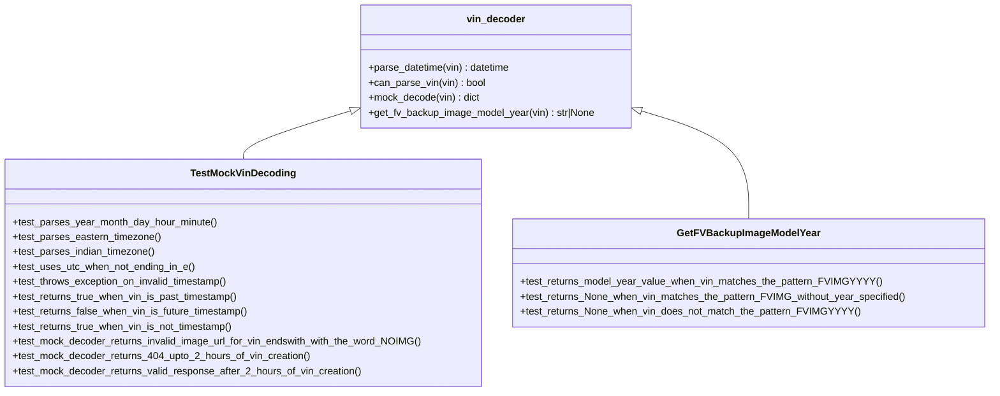

# Diagram: mocks/tests/test_mock_vin_decoder.py


> Auto-generated by Obscura crawlers

## Diagram 1

```mermaid
flowchart TD
    VIN_Input[VIN string] --> ParseDatetime[/parse_datetime(vin)/]
    ParseDatetime --> |matches YYYYMMDDTHHMM with no TZ suffix| Use_UTC[Set tz=UTC]
    ParseDatetime --> |ends with E| Use_Eastern[Set tz=America/New_York]
    ParseDatetime --> |ends with I| Use_Indian[Set tz=Asia/Kolkata]
    ParseDatetime --> |invalid format| RaiseError{{ValueError}}
    Use_UTC --> ConstructDateTime[Construct localized datetime]
    Use_Eastern --> ConstructDateTime
    Use_Indian --> ConstructDateTime
    ConstructDateTime --> ReturnDateTime[Return datetime object]
```

> SVG rendering failed for this diagram.

## Diagram 2

```mermaid
flowchart TD
    VIN_Input2[VIN string] --> CanParseVin[/can_parse_vin(vin)/]
    CanParseVin --> |contains valid past timestamp| CanParseTrue1[True]
    CanParseVin --> |contains valid future timestamp| CanParseFalse[False]
    CanParseVin --> |no timestamp present| CanParseTrue2[True]
```

> SVG rendering failed for this diagram.

## Diagram 3

```mermaid
flowchart TD
    VIN_Mock[VIN string] --> MockDecode[/mock_decode(vin)/]
    MockDecode --> |endswith "NOIMG"| ReturnNoImg[Return ImageURL -> fail URL; Make="Test Vehicle"; Model="Without Image"]
    MockDecode --> |timestamp within 2 hours (Z)| Return404[Return {} (simulate 404/unavailable)]
    MockDecode --> |timestamp older than 2 hours| ReturnValid[Return full vehicle dict with Make/Model/ModelYear/ImageURL]
```

> SVG rendering failed for this diagram.

## Diagram 4



### SVG

<svg id="container" width="1581.921875" xmlns="http://www.w3.org/2000/svg" class="classDiagram" height="630" viewBox="0 0 1581.921875 630" role="graphics-document document" aria-roledescription="class"><style>#container{font-family:"trebuchet ms",verdana,arial,sans-serif;font-size:16px;fill:#333;}@keyframes edge-animation-frame{from{stroke-dashoffset:0;}}@keyframes dash{to{stroke-dashoffset:0;}}#container .edge-animation-slow{stroke-dasharray:9,5!important;stroke-dashoffset:900;animation:dash 50s linear infinite;stroke-linecap:round;}#container .edge-animation-fast{stroke-dasharray:9,5!important;stroke-dashoffset:900;animation:dash 20s linear infinite;stroke-linecap:round;}#container .error-icon{fill:#552222;}#container .error-text{fill:#552222;stroke:#552222;}#container .edge-thickness-normal{stroke-width:1px;}#container .edge-thickness-thick{stroke-width:3.5px;}#container .edge-pattern-solid{stroke-dasharray:0;}#container .edge-thickness-invisible{stroke-width:0;fill:none;}#container .edge-pattern-dashed{stroke-dasharray:3;}#container .edge-pattern-dotted{stroke-dasharray:2;}#container .marker{fill:#333333;stroke:#333333;}#container .marker.cross{stroke:#333333;}#container svg{font-family:"trebuchet ms",verdana,arial,sans-serif;font-size:16px;}#container p{margin:0;}#container g.classGroup text{fill:#9370DB;stroke:none;font-family:"trebuchet ms",verdana,arial,sans-serif;font-size:10px;}#container g.classGroup text .title{font-weight:bolder;}#container .nodeLabel,#container .edgeLabel{color:#131300;}#container .edgeLabel .label rect{fill:#ECECFF;}#container .label text{fill:#131300;}#container .labelBkg{background:#ECECFF;}#container .edgeLabel .label span{background:#ECECFF;}#container .classTitle{font-weight:bolder;}#container .node rect,#container .node circle,#container .node ellipse,#container .node polygon,#container .node path{fill:#ECECFF;stroke:#9370DB;stroke-width:1px;}#container .divider{stroke:#9370DB;stroke-width:1;}#container g.clickable{cursor:pointer;}#container g.classGroup rect{fill:#ECECFF;stroke:#9370DB;}#container g.classGroup line{stroke:#9370DB;stroke-width:1;}#container .classLabel .box{stroke:none;stroke-width:0;fill:#ECECFF;opacity:0.5;}#container .classLabel .label{fill:#9370DB;font-size:10px;}#container .relation{stroke:#333333;stroke-width:1;fill:none;}#container .dashed-line{stroke-dasharray:3;}#container .dotted-line{stroke-dasharray:1 2;}#container #compositionStart,#container .composition{fill:#333333!important;stroke:#333333!important;stroke-width:1;}#container #compositionEnd,#container .composition{fill:#333333!important;stroke:#333333!important;stroke-width:1;}#container #dependencyStart,#container .dependency{fill:#333333!important;stroke:#333333!important;stroke-width:1;}#container #dependencyStart,#container .dependency{fill:#333333!important;stroke:#333333!important;stroke-width:1;}#container #extensionStart,#container .extension{fill:transparent!important;stroke:#333333!important;stroke-width:1;}#container #extensionEnd,#container .extension{fill:transparent!important;stroke:#333333!important;stroke-width:1;}#container #aggregationStart,#container .aggregation{fill:transparent!important;stroke:#333333!important;stroke-width:1;}#container #aggregationEnd,#container .aggregation{fill:transparent!important;stroke:#333333!important;stroke-width:1;}#container #lollipopStart,#container .lollipop{fill:#ECECFF!important;stroke:#333333!important;stroke-width:1;}#container #lollipopEnd,#container .lollipop{fill:#ECECFF!important;stroke:#333333!important;stroke-width:1;}#container .edgeTerminals{font-size:11px;line-height:initial;}#container .classTitleText{text-anchor:middle;font-size:18px;fill:#333;}#container .label-icon{display:inline-block;height:1em;overflow:visible;vertical-align:-0.125em;}#container .node .label-icon path{fill:currentColor;stroke:revert;stroke-width:revert;}#container :root{--mermaid-font-family:"trebuchet ms",verdana,arial,sans-serif;}</style><g><defs><marker id="container_class-aggregationStart" class="marker aggregation class" refX="18" refY="7" markerWidth="190" markerHeight="240" orient="auto"><path d="M 18,7 L9,13 L1,7 L9,1 Z"></path></marker></defs><defs><marker id="container_class-aggregationEnd" class="marker aggregation class" refX="1" refY="7" markerWidth="20" markerHeight="28" orient="auto"><path d="M 18,7 L9,13 L1,7 L9,1 Z"></path></marker></defs><defs><marker id="container_class-extensionStart" class="marker extension class" refX="18" refY="7" markerWidth="190" markerHeight="240" orient="auto"><path d="M 1,7 L18,13 V 1 Z"></path></marker></defs><defs><marker id="container_class-extensionEnd" class="marker extension class" refX="1" refY="7" markerWidth="20" markerHeight="28" orient="auto"><path d="M 1,1 V 13 L18,7 Z"></path></marker></defs><defs><marker id="container_class-compositionStart" class="marker composition class" refX="18" refY="7" markerWidth="190" markerHeight="240" orient="auto"><path d="M 18,7 L9,13 L1,7 L9,1 Z"></path></marker></defs><defs><marker id="container_class-compositionEnd" class="marker composition class" refX="1" refY="7" markerWidth="20" markerHeight="28" orient="auto"><path d="M 18,7 L9,13 L1,7 L9,1 Z"></path></marker></defs><defs><marker id="container_class-dependencyStart" class="marker dependency class" refX="6" refY="7" markerWidth="190" markerHeight="240" orient="auto"><path d="M 5,7 L9,13 L1,7 L9,1 Z"></path></marker></defs><defs><marker id="container_class-dependencyEnd" class="marker dependency class" refX="13" refY="7" markerWidth="20" markerHeight="28" orient="auto"><path d="M 18,7 L9,13 L14,7 L9,1 Z"></path></marker></defs><defs><marker id="container_class-lollipopStart" class="marker lollipop class" refX="13" refY="7" markerWidth="190" markerHeight="240" orient="auto"><circle stroke="black" fill="transparent" cx="7" cy="7" r="6"></circle></marker></defs><defs><marker id="container_class-lollipopEnd" class="marker lollipop class" refX="1" refY="7" markerWidth="190" markerHeight="240" orient="auto"><circle stroke="black" fill="transparent" cx="7" cy="7" r="6"></circle></marker></defs><g class="root"><g class="clusters"></g><g class="edgePaths"><path d="M559.939,178.8L531.595,187.5C503.251,196.2,446.563,213.6,418.219,226.467C389.875,239.333,389.875,247.667,389.875,251.833L389.875,256" id="id_vin_decoder_TestMockVinDecoding_1" class="edge-thickness-normal edge-pattern-solid relation" style=";;;" data-edge="true" data-et="edge" data-id="id_vin_decoder_TestMockVinDecoding_1" data-points="W3sieCI6NTc2LjQyOTY4NzUsInkiOjE3My43Mzc4NzIxNTExNTIxfSx7IngiOjM4OS44NzUsInkiOjIzMX0seyJ4IjozODkuODc1LCJ5IjoyNTZ9XQ==" marker-start="url(#container_class-extensionStart)"></path><path d="M1027.772,178.8L1056.116,187.5C1084.46,196.2,1141.148,213.6,1169.492,242.467C1197.836,271.333,1197.836,311.667,1197.836,331.833L1197.836,352" id="id_vin_decoder_GetFVBackupImageModelYear_2" class="edge-thickness-normal edge-pattern-solid relation" style=";;;" data-edge="true" data-et="edge" data-id="id_vin_decoder_GetFVBackupImageModelYear_2" data-points="W3sieCI6MTAxMS4yODEyNSwieSI6MTczLjczNzg3MjE1MTE1MjF9LHsieCI6MTE5Ny44MzU5Mzc1LCJ5IjoyMzF9LHsieCI6MTE5Ny44MzU5Mzc1LCJ5IjozNTJ9XQ==" marker-start="url(#container_class-extensionStart)"></path></g><g class="edgeLabels"><g class="edgeLabel"><g class="label" data-id="id_vin_decoder_TestMockVinDecoding_1" transform="translate(0, 0)"><foreignObject width="0" height="0"><div xmlns="http://www.w3.org/1999/xhtml" class="labelBkg" style="display: table-cell; white-space: nowrap; line-height: 1.5; max-width: 200px; text-align: center;"><span class="edgeLabel"></span></div></foreignObject></g></g><g class="edgeLabel"><g class="label" data-id="id_vin_decoder_GetFVBackupImageModelYear_2" transform="translate(0, 0)"><foreignObject width="0" height="0"><div xmlns="http://www.w3.org/1999/xhtml" class="labelBkg" style="display: table-cell; white-space: nowrap; line-height: 1.5; max-width: 200px; text-align: center;"><span class="edgeLabel"></span></div></foreignObject></g></g></g><g class="nodes"><g class="node default" id="classId-vin_decoder-0" transform="translate(793.85546875, 107)"><g class="basic label-container"><path d="M-217.42578125 -99 L217.42578125 -99 L217.42578125 99 L-217.42578125 99" stroke="none" stroke-width="0" fill="#ECECFF" style=""></path><path d="M-217.42578125 -99 C-70.51046778804783 -99, 76.40484567390433 -99, 217.42578125 -99 M-217.42578125 -99 C-124.31628160591252 -99, -31.206781961825044 -99, 217.42578125 -99 M217.42578125 -99 C217.42578125 -51.241934345777715, 217.42578125 -3.483868691555429, 217.42578125 99 M217.42578125 -99 C217.42578125 -21.477483282083583, 217.42578125 56.045033435832835, 217.42578125 99 M217.42578125 99 C59.97235108180956 99, -97.48107908638087 99, -217.42578125 99 M217.42578125 99 C119.04638085599615 99, 20.666980461992296 99, -217.42578125 99 M-217.42578125 99 C-217.42578125 38.13432424894663, -217.42578125 -22.731351502106733, -217.42578125 -99 M-217.42578125 99 C-217.42578125 42.80467349895214, -217.42578125 -13.390653002095718, -217.42578125 -99" stroke="#9370DB" stroke-width="1.3" fill="none" stroke-dasharray="0 0" style=""></path></g><g class="annotation-group text" transform="translate(0, -75)"></g><g class="label-group text" transform="translate(-44.9609375, -75)"><g class="label" style="font-weight: bolder" transform="translate(0,-12)"><foreignObject width="89.921875" height="24"><div xmlns="http://www.w3.org/1999/xhtml" style="display: table-cell; white-space: nowrap; line-height: 1.5; max-width: 140px; text-align: center;"><span class="nodeLabel markdown-node-label" style=""><p>vin_decoder</p></span></div></foreignObject></g></g><g class="members-group text" transform="translate(-205.42578125, -27)"></g><g class="methods-group text" transform="translate(-205.42578125, 3)"><g class="label" style="" transform="translate(0,-12)"><foreignObject width="230.796875" height="24"><div xmlns="http://www.w3.org/1999/xhtml" style="display: table-cell; white-space: nowrap; line-height: 1.5; max-width: 288px; text-align: center;"><span class="nodeLabel markdown-node-label" style=""><p>+parse_datetime(vin) : datetime</p></span></div></foreignObject></g><g class="label" style="" transform="translate(0,12)"><foreignObject width="188.671875" height="24"><div xmlns="http://www.w3.org/1999/xhtml" style="display: table-cell; white-space: nowrap; line-height: 1.5; max-width: 246px; text-align: center;"><span class="nodeLabel markdown-node-label" style=""><p>+can_parse_vin(vin) : bool</p></span></div></foreignObject></g><g class="label" style="" transform="translate(0,36)"><foreignObject width="180.09375" height="24"><div xmlns="http://www.w3.org/1999/xhtml" style="display: table-cell; white-space: nowrap; line-height: 1.5; max-width: 238px; text-align: center;"><span class="nodeLabel markdown-node-label" style=""><p>+mock_decode(vin) : dict</p></span></div></foreignObject></g><g class="label" style="" transform="translate(0,60)"><foreignObject width="365.890625" height="24"><div xmlns="http://www.w3.org/1999/xhtml" style="display: table-cell; white-space: nowrap; line-height: 1.5; max-width: 423px; text-align: center;"><span class="nodeLabel markdown-node-label" style=""><p>+get_fv_backup_image_model_year(vin) : str|None</p></span></div></foreignObject></g></g><g class="divider" style=""><path d="M-217.42578125 -51 C-111.92695763371066 -51, -6.428134017421314 -51, 217.42578125 -51 M-217.42578125 -51 C-93.6260611166713 -51, 30.17365901665741 -51, 217.42578125 -51" stroke="#9370DB" stroke-width="1.3" fill="none" stroke-dasharray="0 0" style=""></path></g><g class="divider" style=""><path d="M-217.42578125 -27 C-115.6372637600392 -27, -13.848746270078408 -27, 217.42578125 -27 M-217.42578125 -27 C-84.13052614251797 -27, 49.16472896496407 -27, 217.42578125 -27" stroke="#9370DB" stroke-width="1.3" fill="none" stroke-dasharray="0 0" style=""></path></g></g><g class="node default" id="classId-TestMockVinDecoding-1" transform="translate(389.875, 439)"><g class="basic label-container"><path d="M-381.875 -183 L381.875 -183 L381.875 183 L-381.875 183" stroke="none" stroke-width="0" fill="#ECECFF" style=""></path><path d="M-381.875 -183 C-182.12273303296624 -183, 17.629533934067524 -183, 381.875 -183 M-381.875 -183 C-226.60462595325964 -183, -71.33425190651928 -183, 381.875 -183 M381.875 -183 C381.875 -45.759984382156006, 381.875 91.48003123568799, 381.875 183 M381.875 -183 C381.875 -108.06963141432497, 381.875 -33.13926282864995, 381.875 183 M381.875 183 C214.71861850743838 183, 47.56223701487676 183, -381.875 183 M381.875 183 C136.53292280602005 183, -108.8091543879599 183, -381.875 183 M-381.875 183 C-381.875 67.11536815188153, -381.875 -48.76926369623695, -381.875 -183 M-381.875 183 C-381.875 88.20937688602474, -381.875 -6.5812462279505155, -381.875 -183" stroke="#9370DB" stroke-width="1.3" fill="none" stroke-dasharray="0 0" style=""></path></g><g class="annotation-group text" transform="translate(0, -159)"></g><g class="label-group text" transform="translate(-79.9375, -159)"><g class="label" style="font-weight: bolder" transform="translate(0,-12)"><foreignObject width="159.875" height="24"><div xmlns="http://www.w3.org/1999/xhtml" style="display: table-cell; white-space: nowrap; line-height: 1.5; max-width: 208px; text-align: center;"><span class="nodeLabel markdown-node-label" style=""><p>TestMockVinDecoding</p></span></div></foreignObject></g></g><g class="members-group text" transform="translate(-369.875, -111)"></g><g class="methods-group text" transform="translate(-369.875, -81)"><g class="label" style="" transform="translate(0,-12)"><foreignObject width="329.625" height="24"><div xmlns="http://www.w3.org/1999/xhtml" style="display: table-cell; white-space: nowrap; line-height: 1.5; max-width: 387px; text-align: center;"><span class="nodeLabel markdown-node-label" style=""><p>+test_parses_year_month_day_hour_minute()</p></span></div></foreignObject></g><g class="label" style="" transform="translate(0,12)"><foreignObject width="238.75" height="24"><div xmlns="http://www.w3.org/1999/xhtml" style="display: table-cell; white-space: nowrap; line-height: 1.5; max-width: 296px; text-align: center;"><span class="nodeLabel markdown-node-label" style=""><p>+test_parses_eastern_timezone()</p></span></div></foreignObject></g><g class="label" style="" transform="translate(0,36)"><foreignObject width="230.734375" height="24"><div xmlns="http://www.w3.org/1999/xhtml" style="display: table-cell; white-space: nowrap; line-height: 1.5; max-width: 288px; text-align: center;"><span class="nodeLabel markdown-node-label" style=""><p>+test_parses_indian_timezone()</p></span></div></foreignObject></g><g class="label" style="" transform="translate(0,60)"><foreignObject width="293.5625" height="24"><div xmlns="http://www.w3.org/1999/xhtml" style="display: table-cell; white-space: nowrap; line-height: 1.5; max-width: 351px; text-align: center;"><span class="nodeLabel markdown-node-label" style=""><p>+test_uses_utc_when_not_ending_in_e()</p></span></div></foreignObject></g><g class="label" style="" transform="translate(0,84)"><foreignObject width="350.875" height="24"><div xmlns="http://www.w3.org/1999/xhtml" style="display: table-cell; white-space: nowrap; line-height: 1.5; max-width: 408px; text-align: center;"><span class="nodeLabel markdown-node-label" style=""><p>+test_throws_exception_on_invalid_timestamp()</p></span></div></foreignObject></g><g class="label" style="" transform="translate(0,108)"><foreignObject width="365.734375" height="24"><div xmlns="http://www.w3.org/1999/xhtml" style="display: table-cell; white-space: nowrap; line-height: 1.5; max-width: 423px; text-align: center;"><span class="nodeLabel markdown-node-label" style=""><p>+test_returns_true_when_vin_is_past_timestamp()</p></span></div></foreignObject></g><g class="label" style="" transform="translate(0,132)"><foreignObject width="382.578125" height="24"><div xmlns="http://www.w3.org/1999/xhtml" style="display: table-cell; white-space: nowrap; line-height: 1.5; max-width: 440px; text-align: center;"><span class="nodeLabel markdown-node-label" style=""><p>+test_returns_false_when_vin_is_future_timestamp()</p></span></div></foreignObject></g><g class="label" style="" transform="translate(0,156)"><foreignObject width="359.09375" height="24"><div xmlns="http://www.w3.org/1999/xhtml" style="display: table-cell; white-space: nowrap; line-height: 1.5; max-width: 416px; text-align: center;"><span class="nodeLabel markdown-node-label" style=""><p>+test_returns_true_when_vin_is_not_timestamp()</p></span></div></foreignObject></g><g class="label" style="" transform="translate(0,180)"><foreignObject width="659.8125" height="24"><div xmlns="http://www.w3.org/1999/xhtml" style="display: table-cell; white-space: nowrap; line-height: 1.5; max-width: 717px; text-align: center;"><span class="nodeLabel markdown-node-label" style=""><p>+test_mock_decoder_returns_invalid_image_url_for_vin_endswith_with_the_word_NOIMG()</p></span></div></foreignObject></g><g class="label" style="" transform="translate(0,204)"><foreignObject width="478.515625" height="24"><div xmlns="http://www.w3.org/1999/xhtml" style="display: table-cell; white-space: nowrap; line-height: 1.5; max-width: 536px; text-align: center;"><span class="nodeLabel markdown-node-label" style=""><p>+test_mock_decoder_returns_404_upto_2_hours_of_vin_creation()</p></span></div></foreignObject></g><g class="label" style="" transform="translate(0,228)"><foreignObject width="563.078125" height="24"><div xmlns="http://www.w3.org/1999/xhtml" style="display: table-cell; white-space: nowrap; line-height: 1.5; max-width: 620px; text-align: center;"><span class="nodeLabel markdown-node-label" style=""><p>+test_mock_decoder_returns_valid_response_after_2_hours_of_vin_creation()</p></span></div></foreignObject></g></g><g class="divider" style=""><path d="M-381.875 -135 C-101.97094788802411 -135, 177.93310422395177 -135, 381.875 -135 M-381.875 -135 C-81.59822612955332 -135, 218.67854774089335 -135, 381.875 -135" stroke="#9370DB" stroke-width="1.3" fill="none" stroke-dasharray="0 0" style=""></path></g><g class="divider" style=""><path d="M-381.875 -111 C-89.48050971479228 -111, 202.91398057041545 -111, 381.875 -111 M-381.875 -111 C-192.93800806794434 -111, -4.001016135888676 -111, 381.875 -111" stroke="#9370DB" stroke-width="1.3" fill="none" stroke-dasharray="0 0" style=""></path></g></g><g class="node default" id="classId-GetFVBackupImageModelYear-2" transform="translate(1197.8359375, 439)"><g class="basic label-container"><path d="M-376.0859375 -87 L376.0859375 -87 L376.0859375 87 L-376.0859375 87" stroke="none" stroke-width="0" fill="#ECECFF" style=""></path><path d="M-376.0859375 -87 C-128.43061373633975 -87, 119.2247100273205 -87, 376.0859375 -87 M-376.0859375 -87 C-164.43156334893197 -87, 47.22281080213605 -87, 376.0859375 -87 M376.0859375 -87 C376.0859375 -21.75646997665359, 376.0859375 43.48706004669282, 376.0859375 87 M376.0859375 -87 C376.0859375 -40.652712797520806, 376.0859375 5.694574404958388, 376.0859375 87 M376.0859375 87 C82.9460145131045 87, -210.193908473791 87, -376.0859375 87 M376.0859375 87 C168.22594376371015 87, -39.6340499725797 87, -376.0859375 87 M-376.0859375 87 C-376.0859375 24.103421507486715, -376.0859375 -38.79315698502657, -376.0859375 -87 M-376.0859375 87 C-376.0859375 17.497230604653197, -376.0859375 -52.005538790693606, -376.0859375 -87" stroke="#9370DB" stroke-width="1.3" fill="none" stroke-dasharray="0 0" style=""></path></g><g class="annotation-group text" transform="translate(0, -63)"></g><g class="label-group text" transform="translate(-108.734375, -63)"><g class="label" style="font-weight: bolder" transform="translate(0,-12)"><foreignObject width="217.46875" height="24"><div xmlns="http://www.w3.org/1999/xhtml" style="display: table-cell; white-space: nowrap; line-height: 1.5; max-width: 265px; text-align: center;"><span class="nodeLabel markdown-node-label" style=""><p>GetFVBackupImageModelYear</p></span></div></foreignObject></g></g><g class="members-group text" transform="translate(-364.0859375, -15)"></g><g class="methods-group text" transform="translate(-364.0859375, 15)"><g class="label" style="" transform="translate(0,-12)"><foreignObject width="571.40625" height="24"><div xmlns="http://www.w3.org/1999/xhtml" style="display: table-cell; white-space: nowrap; line-height: 1.5; max-width: 629px; text-align: center;"><span class="nodeLabel markdown-node-label" style=""><p>+test_returns_model_year_value_when_vin_matches_the_pattern_FVIMGYYYY()</p></span></div></foreignObject></g><g class="label" style="" transform="translate(0,12)"><foreignObject width="619.4375" height="24"><div xmlns="http://www.w3.org/1999/xhtml" style="display: table-cell; white-space: nowrap; line-height: 1.5; max-width: 677px; text-align: center;"><span class="nodeLabel markdown-node-label" style=""><p>+test_returns_None_when_vin_matches_the_pattern_FVIMG_without_year_specified()</p></span></div></foreignObject></g><g class="label" style="" transform="translate(0,36)"><foreignObject width="538.609375" height="24"><div xmlns="http://www.w3.org/1999/xhtml" style="display: table-cell; white-space: nowrap; line-height: 1.5; max-width: 596px; text-align: center;"><span class="nodeLabel markdown-node-label" style=""><p>+test_returns_None_when_vin_does_not_match_the_pattern_FVIMGYYYY()</p></span></div></foreignObject></g></g><g class="divider" style=""><path d="M-376.0859375 -39 C-172.55340302647616 -39, 30.979131447047678 -39, 376.0859375 -39 M-376.0859375 -39 C-149.68262502565452 -39, 76.72068744869097 -39, 376.0859375 -39" stroke="#9370DB" stroke-width="1.3" fill="none" stroke-dasharray="0 0" style=""></path></g><g class="divider" style=""><path d="M-376.0859375 -15 C-77.8683728676354 -15, 220.3491917647292 -15, 376.0859375 -15 M-376.0859375 -15 C-91.2244738813094 -15, 193.6369897373812 -15, 376.0859375 -15" stroke="#9370DB" stroke-width="1.3" fill="none" stroke-dasharray="0 0" style=""></path></g></g></g></g></g></svg>
