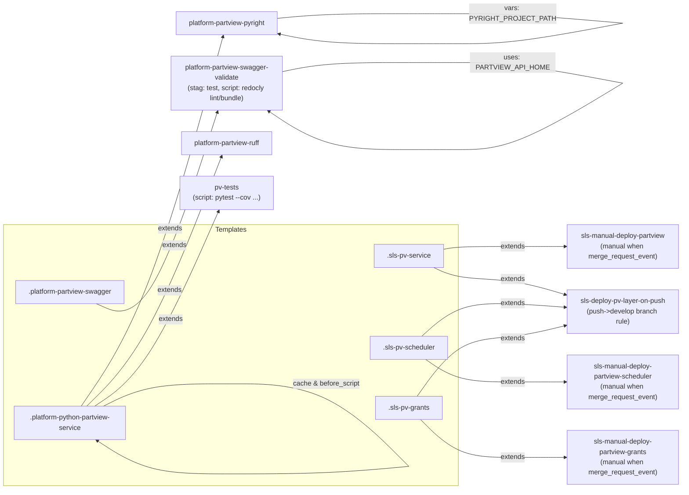

# Diagram: partview_core/partview_service/.gitlab-ci.yml

> Auto-generated by Obscura crawlers

## Mermaid

### SVG

<svg id="container" width="1596.40625" xmlns="http://www.w3.org/2000/svg" class="flowchart" height="1141.050048828125" viewBox="0 0 1596.40625 1141.050048828125" role="graphics-document document" aria-roledescription="flowchart-v2"><g><marker id="container_flowchart-v2-pointEnd" class="marker flowchart-v2" viewBox="0 0 10 10" refX="5" refY="5" markerUnits="userSpaceOnUse" markerWidth="8" markerHeight="8" orient="auto"><path d="M 0 0 L 10 5 L 0 10 z" class="arrowMarkerPath" style="stroke-width: 1; stroke-dasharray: 1, 0;"></path></marker><marker id="container_flowchart-v2-pointStart" class="marker flowchart-v2" viewBox="0 0 10 10" refX="4.5" refY="5" markerUnits="userSpaceOnUse" markerWidth="8" markerHeight="8" orient="auto"><path d="M 0 5 L 10 10 L 10 0 z" class="arrowMarkerPath" style="stroke-width: 1; stroke-dasharray: 1, 0;"></path></marker><marker id="container_flowchart-v2-circleEnd" class="marker flowchart-v2" viewBox="0 0 10 10" refX="11" refY="5" markerUnits="userSpaceOnUse" markerWidth="11" markerHeight="11" orient="auto"><circle cx="5" cy="5" r="5" class="arrowMarkerPath" style="stroke-width: 1; stroke-dasharray: 1, 0;"></circle></marker><marker id="container_flowchart-v2-circleStart" class="marker flowchart-v2" viewBox="0 0 10 10" refX="-1" refY="5" markerUnits="userSpaceOnUse" markerWidth="11" markerHeight="11" orient="auto"><circle cx="5" cy="5" r="5" class="arrowMarkerPath" style="stroke-width: 1; stroke-dasharray: 1, 0;"></circle></marker><marker id="container_flowchart-v2-crossEnd" class="marker cross flowchart-v2" viewBox="0 0 11 11" refX="12" refY="5.2" markerUnits="userSpaceOnUse" markerWidth="11" markerHeight="11" orient="auto"><path d="M 1,1 l 9,9 M 10,1 l -9,9" class="arrowMarkerPath" style="stroke-width: 2; stroke-dasharray: 1, 0;"></path></marker><marker id="container_flowchart-v2-crossStart" class="marker cross flowchart-v2" viewBox="0 0 11 11" refX="-1" refY="5.2" markerUnits="userSpaceOnUse" markerWidth="11" markerHeight="11" orient="auto"><path d="M 1,1 l 9,9 M 10,1 l -9,9" class="arrowMarkerPath" style="stroke-width: 2; stroke-dasharray: 1, 0;"></path></marker><g class="root"><g class="clusters"><g class="cluster" id="Templates" data-look="classic"><rect style="" x="8" y="524" width="1070.40625" height="609.0500000007451"></rect><g class="cluster-label" transform="translate(506.015625, 524)"><foreignObject width="74.375" height="24">

Templates

</foreignObject></g></g></g><g class="edgePaths"><path d="M189.02,947.525L215.268,908.183C241.516,868.842,294.012,790.158,349.409,646.38C404.807,502.601,463.105,293.727,492.255,189.29L521.404,84.853" id="L_PYTHON_PYRIGHT_0" class="edge-thickness-normal edge-pattern-solid edge-thickness-normal edge-pattern-solid flowchart-link" style=";" data-edge="true" data-et="edge" data-id="L_PYTHON_PYRIGHT_0" data-points="W3sieCI6MTg5LjAyMDAxMzQwNjU4Mjg1LCJ5Ijo5NDcuNTI1MDAwMDAwMzcyNX0seyJ4IjozNDYuNTA3ODEyNSwieSI6NzExLjQ3NDk5OTk5OTYyNzV9LHsieCI6NTIyLjQ3OTY1NjQyNzA0NjIsInkiOjgxfV0=" marker-end="url(#container_flowchart-v2-pointEnd)"></path><path d="M202.529,947.525L226.526,923.85C250.522,900.175,298.515,852.825,351.103,755.692C403.69,658.559,460.873,511.643,489.464,438.186L518.056,364.728" id="L_PYTHON_RUFF_0" class="edge-thickness-normal edge-pattern-solid edge-thickness-normal edge-pattern-solid flowchart-link" style=";" data-edge="true" data-et="edge" data-id="L_PYTHON_RUFF_0" data-points="W3sieCI6MjAyLjUyOTQzNzY1NTE4MTE0LCJ5Ijo5NDcuNTI1MDAwMDAwMzcyNX0seyJ4IjozNDYuNTA3ODEyNSwieSI6ODA1LjQ3NDk5OTk5OTYyNzV9LHsieCI6NTE5LjUwNjY2NzA3NTM5MzQsInkiOjM2MX1d" marker-end="url(#container_flowchart-v2-pointEnd)"></path><path d="M224.143,947.525L244.537,934.517C264.931,921.508,305.72,895.492,353.588,819.682C401.456,743.872,456.403,618.268,483.877,555.466L511.351,492.665" id="L_PYTHON_PVTESTS_0" class="edge-thickness-normal edge-pattern-solid edge-thickness-normal edge-pattern-solid flowchart-link" style=";" data-edge="true" data-et="edge" data-id="L_PYTHON_PVTESTS_0" data-points="W3sieCI6MjI0LjE0MzE0MTI4NTM4NjEyLCJ5Ijo5NDcuNTI1MDAwMDAwMzcyNX0seyJ4IjozNDYuNTA3ODEyNSwieSI6ODY5LjQ3NDk5OTk5OTYyNzV9LHsieCI6NTEyLjk1NDI4NzE2Njk3OTMsInkiOjQ4OX1d" marker-end="url(#container_flowchart-v2-pointEnd)"></path><path d="M252.46,714.475L268.135,721.308C283.809,728.142,315.159,741.808,357.779,666.196C400.399,590.584,454.291,425.693,481.237,343.248L508.183,260.802" id="L_SWAGGER_SWAGVALIDATE_0" class="edge-thickness-normal edge-pattern-solid edge-thickness-normal edge-pattern-solid flowchart-link" style=";" data-edge="true" data-et="edge" data-id="L_SWAGGER_SWAGVALIDATE_0" data-points="W3sieCI6MjUyLjQ2MDA1ODU5Mzc1LCJ5Ijo3MTQuNDc0OTk5OTk5NjI3NX0seyJ4IjozNDYuNTA3ODEyNSwieSI6NzU1LjQ3NDk5OTk5OTYyNzV9LHsieCI6NTA5LjQyNTIyOTcyNDE1MDM3LCJ5IjoyNTd9XQ==" marker-end="url(#container_flowchart-v2-pointEnd)"></path><path d="M1043.008,581.627L1048.908,580.522C1054.807,579.418,1066.607,577.209,1093.34,576.104C1120.073,575,1161.74,575,1202.74,575C1243.74,575,1284.073,575,1304.24,575L1324.406,575" id="L_SLS_SERVICE_SLS_MANUAL_SERVICE_0" class="edge-thickness-normal edge-pattern-solid edge-thickness-normal edge-pattern-solid flowchart-link" style=";" data-edge="true" data-et="edge" data-id="L_SLS_SERVICE_SLS_MANUAL_SERVICE_0" data-points="W3sieCI6MTA0My4wMDc4MTI1LCJ5Ijo1ODEuNjI2OTExMzE0OTg0N30seyJ4IjoxMDc4LjQwNjI1LCJ5Ijo1NzV9LHsieCI6MTIwMy40MDYyNSwieSI6NTc1fSx7IngiOjEzMjguNDA2MjUsInkiOjU3NX1d" marker-end="url(#container_flowchart-v2-pointEnd)"></path><path d="M1000.814,838.525L1013.746,847.271C1026.678,856.017,1052.542,873.508,1086.308,882.254C1120.073,891,1161.74,891,1202.74,891C1243.74,891,1284.073,891,1304.24,891L1324.406,891" id="L_SLS_SCHED_SLS_MANUAL_SCHED_0" class="edge-thickness-normal edge-pattern-solid edge-thickness-normal edge-pattern-solid flowchart-link" style=";" data-edge="true" data-et="edge" data-id="L_SLS_SCHED_SLS_MANUAL_SCHED_0" data-points="W3sieCI6MTAwMC44MTQxNDY1NDc4NDM2LCJ5Ijo4MzguNTI1MDAwMDAwMzcyNX0seyJ4IjoxMDc4LjQwNjI1LCJ5Ijo4OTF9LHsieCI6MTIwMy40MDYyNSwieSI6ODkxfSx7IngiOjEzMjguNDA2MjUsInkiOjg5MX1d" marker-end="url(#container_flowchart-v2-pointEnd)"></path><path d="M988.368,978.525L1003.374,993.271C1018.381,1008.017,1048.393,1037.508,1084.233,1052.254C1120.073,1067,1161.74,1067,1202.74,1067C1243.74,1067,1284.073,1067,1304.24,1067L1324.406,1067" id="L_SLS_GRANTS_SLS_MANUAL_GRANTS_0" class="edge-thickness-normal edge-pattern-solid edge-thickness-normal edge-pattern-solid flowchart-link" style=";" data-edge="true" data-et="edge" data-id="L_SLS_GRANTS_SLS_MANUAL_GRANTS_0" data-points="W3sieCI6OTg4LjM2Nzc1NzQ5NjMsInkiOjk3OC41MjUwMDAwMDAzNzI1fSx7IngiOjEwNzguNDA2MjUsInkiOjEwNjd9LHsieCI6MTIwMy40MDYyNSwieSI6MTA2N30seyJ4IjoxMzI4LjQwNjI1LCJ5IjoxMDY3fV0=" marker-end="url(#container_flowchart-v2-pointEnd)"></path><path d="M1019.648,624L1029.441,628.5C1039.234,633,1058.82,642,1089.447,646.5C1120.073,651,1161.74,651,1202.767,657.019C1243.795,663.037,1284.184,675.075,1304.378,681.094L1324.573,687.112" id="L_SLS_SERVICE_SLS_PUSH_0" class="edge-thickness-normal edge-pattern-solid edge-thickness-normal edge-pattern-solid flowchart-link" style=";" data-edge="true" data-et="edge" data-id="L_SLS_SERVICE_SLS_PUSH_0" data-points="W3sieCI6MTAxOS42NDg0Mzc1LCJ5Ijo2MjR9LHsieCI6MTA3OC40MDYyNSwieSI6NjUxfSx7IngiOjEyMDMuNDA2MjUsInkiOjY1MX0seyJ4IjoxMzI4LjQwNjI1LCJ5Ijo2ODguMjU0OTAxOTYwNzg0M31d" marker-end="url(#container_flowchart-v2-pointEnd)"></path><path d="M991.399,784.525L1005.901,771.692C1020.402,758.858,1049.404,733.192,1084.738,720.358C1120.073,707.525,1161.74,707.525,1202.742,709.065C1243.743,710.606,1284.081,713.686,1304.249,715.227L1324.418,716.767" id="L_SLS_SCHED_SLS_PUSH_0" class="edge-thickness-normal edge-pattern-solid edge-thickness-normal edge-pattern-solid flowchart-link" style=";" data-edge="true" data-et="edge" data-id="L_SLS_SCHED_SLS_PUSH_0" data-points="W3sieCI6OTkxLjM5OTQ4OTE4MjY5MjMsInkiOjc4NC41MjUwMDAwMDAzNzI1fSx7IngiOjEwNzguNDA2MjUsInkiOjcwNy41MjUwMDAwMDAzNzI1fSx7IngiOjEyMDMuNDA2MjUsInkiOjcwNy41MjUwMDAwMDAzNzI1fSx7IngiOjEzMjguNDA2MjUsInkiOjcxNy4wNzE1Njg2Mjc2NDA5fV0=" marker-end="url(#container_flowchart-v2-pointEnd)"></path><path d="M980.477,924.525L996.798,902.025C1013.12,879.525,1045.763,834.525,1082.918,812.025C1120.073,789.525,1161.74,789.525,1202.759,784.576C1243.778,779.626,1284.15,769.727,1304.335,764.778L1324.521,759.828" id="L_SLS_GRANTS_SLS_PUSH_0" class="edge-thickness-normal edge-pattern-solid edge-thickness-normal edge-pattern-solid flowchart-link" style=";" data-edge="true" data-et="edge" data-id="L_SLS_GRANTS_SLS_PUSH_0" data-points="W3sieCI6OTgwLjQ3NjU2MjUsInkiOjkyNC41MjUwMDAwMDAzNzI1fSx7IngiOjEwNzguNDA2MjUsInkiOjc4OS41MjUwMDAwMDAzNzI1fSx7IngiOjEyMDMuNDA2MjUsInkiOjc4OS41MjUwMDAwMDAzNzI1fSx7IngiOjEzMjguNDA2MjUsInkiOjc1OC44NzU0OTAxOTYyNjg0fV0=" marker-end="url(#container_flowchart-v2-pointEnd)"></path><path d="M654.961,42.262L673.167,40.552C691.372,38.841,727.784,35.421,778.764,33.71C829.744,32,895.292,32,928.066,32L960.841,32" id="PYRIGHT-cyclic-special-1" class="edge-thickness-normal edge-pattern-solid edge-thickness-normal edge-pattern-solid flowchart-link" style=";" data-edge="true" data-et="edge" data-id="PYRIGHT-cyclic-special-1" data-points="W3sieCI6NjU0Ljk2MDkzNzUsInkiOjQyLjI2MjAxODM0ODYyMzg1NX0seyJ4Ijo3NjQuMTk1MzEyNSwieSI6MzJ9LHsieCI6OTYwLjg0MDYyNDk5OTI1NDksInkiOjMyfV0="></path><path d="M960.941,32L980.518,32C1000.096,32,1039.251,32,1079.662,32C1120.073,32,1161.74,32,1225.065,35.666C1288.39,39.332,1373.373,46.664,1415.865,50.33L1458.356,53.996" id="PYRIGHT-cyclic-special-mid" class="edge-thickness-normal edge-pattern-solid edge-thickness-normal edge-pattern-solid flowchart-link" style=";" data-edge="true" data-et="edge" data-id="PYRIGHT-cyclic-special-mid" data-points="W3sieCI6OTYwLjk0MDYyNTAwMDc0NTEsInkiOjMyfSx7IngiOjEwNzguNDA2MjUsInkiOjMyfSx7IngiOjEyMDMuNDA2MjUsInkiOjMyfSx7IngiOjE0NTguMzU2MjQ5OTk5MjU1LCJ5Ijo1My45OTU2ODYyNzQ0NDU1MjV9XQ=="></path><path d="M1458.356,54.01L1415.865,62.754C1373.373,71.499,1288.39,88.987,1225.065,97.731C1161.74,106.475,1120.073,106.475,1079.654,106.475C1039.234,106.475,1000.063,106.475,947.694,106.475C895.326,106.475,829.76,106.475,778.681,102.375C727.601,98.275,691.006,90.075,672.709,85.975L654.411,81.875" id="PYRIGHT-cyclic-special-2" class="edge-thickness-normal edge-pattern-solid edge-thickness-normal edge-pattern-solid flowchart-link" style=";" data-edge="true" data-et="edge" data-id="PYRIGHT-cyclic-special-2" data-points="W3sieCI6MTQ1OC4zNTYyNDk5OTkyNTUsInkiOjU0LjAxMDI4OTIxNTgzOTUyfSx7IngiOjEyMDMuNDA2MjUsInkiOjEwNi40NzQ5OTk5OTk2Mjc0N30seyJ4IjoxMDc4LjQwNjI1LCJ5IjoxMDYuNDc0OTk5OTk5NjI3NDd9LHsieCI6OTYwLjg5MDYyNSwieSI6MTA2LjQ3NDk5OTk5OTYyNzQ3fSx7IngiOjc2NC4xOTUzMTI1LCJ5IjoxMDYuNDc0OTk5OTk5NjI3NDd9LHsieCI6NjUwLjUwODI3MDMwODE0NDYsInkiOjgxfV0=" marker-end="url(#container_flowchart-v2-pointEnd)"></path><path d="M247.148,947.525L263.708,939.85C280.268,932.175,313.388,916.825,360.524,909.15C407.66,901.475,468.813,901.475,499.389,901.475L529.966,901.475" id="PYTHON-cyclic-special-1" class="edge-thickness-normal edge-pattern-solid edge-thickness-normal edge-pattern-solid flowchart-link" style=";" data-edge="true" data-et="edge" data-id="PYTHON-cyclic-special-1" data-points="W3sieCI6MjQ3LjE0ODIwMzI2MjA0OTQ0LCJ5Ijo5NDcuNTI1MDAwMDAwMzcyNX0seyJ4IjozNDYuNTA3ODEyNSwieSI6OTAxLjQ3NDk5OTk5OTYyNzV9LHsieCI6NTI5Ljk2NTYyNDk5OTI1NDksInkiOjkwMS40NzQ5OTk5OTk2Mjc1fV0="></path><path d="M530.066,901.475L569.087,901.475C608.109,901.475,686.152,901.475,757.948,932.555C829.744,963.634,895.292,1025.793,928.066,1056.873L960.841,1087.953" id="PYTHON-cyclic-special-mid" class="edge-thickness-normal edge-pattern-solid edge-thickness-normal edge-pattern-solid flowchart-link" style=";" data-edge="true" data-et="edge" data-id="PYTHON-cyclic-special-mid" data-points="W3sieCI6NTMwLjA2NTYyNTAwMDc0NTEsInkiOjkwMS40NzQ5OTk5OTk2Mjc1fSx7IngiOjc2NC4xOTUzMTI1LCJ5Ijo5MDEuNDc0OTk5OTk5NjI3NX0seyJ4Ijo5NjAuODQwNjI0OTk5MjU0OSwieSI6MTA4Ny45NTI1ODUyOTUzOTd9XQ=="></path><path d="M960.841,1088.004L928.066,1090.925C895.292,1093.845,829.744,1099.685,757.94,1102.605C686.135,1105.525,608.076,1105.525,538.461,1105.525C468.846,1105.525,407.677,1105.525,357.091,1092.554C306.504,1079.584,266.501,1053.643,246.499,1040.672L226.497,1027.701" id="PYTHON-cyclic-special-2" class="edge-thickness-normal edge-pattern-solid edge-thickness-normal edge-pattern-solid flowchart-link" style=";" data-edge="true" data-et="edge" data-id="PYTHON-cyclic-special-2" data-points="W3sieCI6OTYwLjg0MDYyNDk5OTI1NDksInkiOjEwODguMDA0NDU0ODU5NjYwN30seyJ4Ijo3NjQuMTk1MzEyNSwieSI6MTEwNS41MjUwMDAwMDAzNzI1fSx7IngiOjUzMC4wMTU2MjUsInkiOjExMDUuNTI1MDAwMDAwMzcyNX0seyJ4IjozNDYuNTA3ODEyNSwieSI6MTEwNS41MjUwMDAwMDAzNzI1fSx7IngiOjIyMy4xNDEyMTU4NjEzNDQ1MywieSI6MTAyNS41MjUwMDAwMDAzNzI1fV0=" marker-end="url(#container_flowchart-v2-pointEnd)"></path><path d="M660.016,164.87L677.379,160.979C694.742,157.088,729.469,149.307,779.606,145.416C829.744,141.525,895.292,141.525,928.066,141.525L960.841,141.525" id="SWAGVALIDATE-cyclic-special-1" class="edge-thickness-normal edge-pattern-solid edge-thickness-normal edge-pattern-solid flowchart-link" style=";" data-edge="true" data-et="edge" data-id="SWAGVALIDATE-cyclic-special-1" data-points="W3sieCI6NjYwLjAxNTYyNSwieSI6MTY0Ljg2OTU5MTMyNjMxMTg4fSx7IngiOjc2NC4xOTUzMTI1LCJ5IjoxNDEuNTI1MDAwMDAwMzcyNTN9LHsieCI6OTYwLjg0MDYyNDk5OTI1NDksInkiOjE0MS41MjUwMDAwMDAzNzI1M31d"></path><path d="M960.941,141.525L980.518,141.525C1000.096,141.525,1039.251,141.525,1079.662,141.525C1120.073,141.525,1161.74,141.525,1225.065,150.269C1288.39,159.013,1373.373,176.501,1415.865,185.246L1458.356,193.99" id="SWAGVALIDATE-cyclic-special-mid" class="edge-thickness-normal edge-pattern-solid edge-thickness-normal edge-pattern-solid flowchart-link" style=";" data-edge="true" data-et="edge" data-id="SWAGVALIDATE-cyclic-special-mid" data-points="W3sieCI6OTYwLjk0MDYyNTAwMDc0NTEsInkiOjE0MS41MjUwMDAwMDAzNzI1M30seyJ4IjoxMDc4LjQwNjI1LCJ5IjoxNDEuNTI1MDAwMDAwMzcyNTN9LHsieCI6MTIwMy40MDYyNSwieSI6MTQxLjUyNTAwMDAwMDM3MjUzfSx7IngiOjE0NTguMzU2MjQ5OTk5MjU1LCJ5IjoxOTMuOTg5NzEwNzg0MTYwNDh9XQ=="></path><path d="M1458.356,194.03L1415.865,219.859C1373.373,245.687,1288.39,297.343,1225.065,323.172C1161.74,349,1120.073,349,1079.654,349C1039.234,349,1000.063,349,947.694,349C895.326,349,829.76,349,774.368,334.035C718.975,319.069,673.754,289.138,651.144,274.173L628.534,259.208" id="SWAGVALIDATE-cyclic-special-2" class="edge-thickness-normal edge-pattern-solid edge-thickness-normal edge-pattern-solid flowchart-link" style=";" data-edge="true" data-et="edge" data-id="SWAGVALIDATE-cyclic-special-2" data-points="W3sieCI6MTQ1OC4zNTYyNDk5OTkyNTUsInkiOjE5NC4wMzAzOTIxNTczMTU2Mn0seyJ4IjoxMjAzLjQwNjI1LCJ5IjozNDl9LHsieCI6MTA3OC40MDYyNSwieSI6MzQ5fSx7IngiOjk2MC44OTA2MjUsInkiOjM0OX0seyJ4Ijo3NjQuMTk1MzEyNSwieSI6MzQ5fSx7IngiOjYyNS4xOTgzMzY2OTM1NDg0LCJ5IjoyNTd9XQ==" marker-end="url(#container_flowchart-v2-pointEnd)"></path></g><g class="edgeLabels"><g class="edgeLabel" transform="translate(396.3509, 532.8963)"><g class="label" data-id="L_PYTHON_PYRIGHT_0" transform="translate(-28.5078125, -12)"><foreignObject width="57.015625" height="24">

extends

</foreignObject></g></g><g class="edgeLabel" transform="translate(396.3264, 677.47926)"><g class="label" data-id="L_PYTHON_RUFF_0" transform="translate(-28.5078125, -12)"><foreignObject width="57.015625" height="24">

extends

</foreignObject></g></g><g class="edgeLabel" transform="translate(400.64578, 745.72265)"><g class="label" data-id="L_PYTHON_PVTESTS_0" transform="translate(-28.5078125, -12)"><foreignObject width="57.015625" height="24">

extends

</foreignObject></g></g><g class="edgeLabel" transform="translate(412.03024, 554.99742)"><g class="label" data-id="L_SWAGGER_SWAGVALIDATE_0" transform="translate(-28.5078125, -12)"><foreignObject width="57.015625" height="24">

extends

</foreignObject></g></g><g class="edgeLabel" transform="translate(1203.40625, 575)"><g class="label" data-id="L_SLS_SERVICE_SLS_MANUAL_SERVICE_0" transform="translate(-28.5078125, -12)"><foreignObject width="57.015625" height="24">

extends

</foreignObject></g></g><g class="edgeLabel" transform="translate(1203.40625, 891)"><g class="label" data-id="L_SLS_SCHED_SLS_MANUAL_SCHED_0" transform="translate(-28.5078125, -12)"><foreignObject width="57.015625" height="24">

extends

</foreignObject></g></g><g class="edgeLabel" transform="translate(1203.40625, 1067)"><g class="label" data-id="L_SLS_GRANTS_SLS_MANUAL_GRANTS_0" transform="translate(-28.5078125, -12)"><foreignObject width="57.015625" height="24">

extends

</foreignObject></g></g><g class="edgeLabel" transform="translate(1203.40625, 651)"><g class="label" data-id="L_SLS_SERVICE_SLS_PUSH_0" transform="translate(-28.5078125, -12)"><foreignObject width="57.015625" height="24">

extends

</foreignObject></g></g><g class="edgeLabel" transform="translate(1203.40625, 707.5250000003725)"><g class="label" data-id="L_SLS_SCHED_SLS_PUSH_0" transform="translate(-28.5078125, -12)"><foreignObject width="57.015625" height="24">

extends

</foreignObject></g></g><g class="edgeLabel" transform="translate(1203.40625, 789.5250000003725)"><g class="label" data-id="L_SLS_GRANTS_SLS_PUSH_0" transform="translate(-28.5078125, -12)"><foreignObject width="57.015625" height="24">

extends

</foreignObject></g></g><g class="edgeLabel"><g class="label" data-id="PYRIGHT-cyclic-special-1" transform="translate(0, 0)"><foreignObject width="0" height="0">

</foreignObject></g></g><g class="edgeLabel" transform="translate(1203.40625, 32)"><g class="label" data-id="PYRIGHT-cyclic-special-mid" transform="translate(-100, -24)"><foreignObject width="200" height="48">

vars: PYRIGHT_PROJECT_PATH

</foreignObject></g></g><g class="edgeLabel"><g class="label" data-id="PYRIGHT-cyclic-special-2" transform="translate(0, 0)"><foreignObject width="0" height="0">

</foreignObject></g></g><g class="edgeLabel"><g class="label" data-id="PYTHON-cyclic-special-1" transform="translate(0, 0)"><foreignObject width="0" height="0">

</foreignObject></g></g><g class="edgeLabel" transform="translate(764.1953125, 901.4749999996275)"><g class="label" data-id="PYTHON-cyclic-special-mid" transform="translate(-79.1796875, -12)"><foreignObject width="158.359375" height="24">

cache &amp; before_script

</foreignObject></g></g><g class="edgeLabel"><g class="label" data-id="PYTHON-cyclic-special-2" transform="translate(0, 0)"><foreignObject width="0" height="0">

</foreignObject></g></g><g class="edgeLabel"><g class="label" data-id="SWAGVALIDATE-cyclic-special-1" transform="translate(0, 0)"><foreignObject width="0" height="0">

</foreignObject></g></g><g class="edgeLabel" transform="translate(1203.40625, 141.52500000037253)"><g class="label" data-id="SWAGVALIDATE-cyclic-special-mid" transform="translate(-96.6484375, -12)"><foreignObject width="193.296875" height="24">

uses: PARTVIEW_API_HOME

</foreignObject></g></g><g class="edgeLabel"><g class="label" data-id="SWAGVALIDATE-cyclic-special-2" transform="translate(0, 0)"><foreignObject width="0" height="0">

</foreignObject></g></g></g><g class="nodes"><g class="node default" id="flowchart-PYTHON-0" transform="translate(163, 986.5250000003725)"><rect class="basic label-container" style="" x="-130" y="-39" width="260" height="78"></rect><g class="label" style="" transform="translate(-100, -24)"><rect></rect><foreignObject width="200" height="48">

.platform-python-partview-service

</foreignObject></g></g><g class="node default" id="flowchart-SWAGGER-1" transform="translate(163, 675.4749999996275)"><rect class="basic label-container" style="" x="-130" y="-39" width="260" height="78"></rect><g class="label" style="" transform="translate(-100, -24)"><rect></rect><foreignObject width="200" height="48">

.platform-partview-swagger

</foreignObject></g></g><g class="node default" id="flowchart-SLS_SERVICE-2" transform="translate(960.890625, 597)"><rect class="basic label-container" style="" x="-82.1171875" y="-27" width="164.234375" height="54"></rect><g class="label" style="" transform="translate(-52.1171875, -12)"><rect></rect><foreignObject width="104.234375" height="24">

.sls-pv-service

</foreignObject></g></g><g class="node default" id="flowchart-SLS_SCHED-3" transform="translate(960.890625, 811.5250000003725)"><rect class="basic label-container" style="" x="-92.515625" y="-27" width="185.03125" height="54"></rect><g class="label" style="" transform="translate(-62.515625, -12)"><rect></rect><foreignObject width="125.03125" height="24">

.sls-pv-scheduler

</foreignObject></g></g><g class="node default" id="flowchart-SLS_GRANTS-4" transform="translate(960.890625, 951.5250000003725)"><rect class="basic label-container" style="" x="-79.3515625" y="-27" width="158.703125" height="54"></rect><g class="label" style="" transform="translate(-49.3515625, -12)"><rect></rect><foreignObject width="98.703125" height="24">

.sls-pv-grants

</foreignObject></g></g><g class="node default" id="flowchart-PYRIGHT-5" transform="translate(530.015625, 54)"><rect class="basic label-container" style="" x="-124.9453125" y="-27" width="249.890625" height="54"></rect><g class="label" style="" transform="translate(-94.9453125, -12)"><rect></rect><foreignObject width="189.890625" height="24">

platform-partview-pyright

</foreignObject></g></g><g class="node default" id="flowchart-RUFF-6" transform="translate(530.015625, 334)"><rect class="basic label-container" style="" x="-112.3125" y="-27" width="224.625" height="54"></rect><g class="label" style="" transform="translate(-82.3125, -12)"><rect></rect><foreignObject width="164.625" height="24">

platform-partview-ruff

</foreignObject></g></g><g class="node default" id="flowchart-PVTESTS-7" transform="translate(530.015625, 450)"><rect class="basic label-container" style="" x="-130" y="-39" width="260" height="78"></rect><g class="label" style="" transform="translate(-100, -24)"><rect></rect><foreignObject width="200" height="48">

pv-tests\n(script: pytest --cov ...)

</foreignObject></g></g><g class="node default" id="flowchart-SWAGVALIDATE-8" transform="translate(530.015625, 194)"><rect class="basic label-container" style="" x="-130" y="-63" width="260" height="126"></rect><g class="label" style="" transform="translate(-100, -48)"><rect></rect><foreignObject width="200" height="96">

platform-partview-swagger-validate\n(stag: test, script: redocly lint/bundle)

</foreignObject></g></g><g class="node default" id="flowchart-SLS_MANUAL_SERVICE-9" transform="translate(1458.40625, 575)"><rect class="basic label-container" style="" x="-130" y="-51" width="260" height="102"></rect><g class="label" style="" transform="translate(-100, -36)"><rect></rect><foreignObject width="200" height="72">

sls-manual-deploy-partview\n(manual when merge_request_event)

</foreignObject></g></g><g class="node default" id="flowchart-SLS_MANUAL_SCHED-10" transform="translate(1458.40625, 891)"><rect class="basic label-container" style="" x="-130" y="-63" width="260" height="126"></rect><g class="label" style="" transform="translate(-100, -48)"><rect></rect><foreignObject width="200" height="96">

sls-manual-deploy-partview-scheduler\n(manual when merge_request_event)

</foreignObject></g></g><g class="node default" id="flowchart-SLS_MANUAL_GRANTS-11" transform="translate(1458.40625, 1067)"><rect class="basic label-container" style="" x="-130" y="-63" width="260" height="126"></rect><g class="label" style="" transform="translate(-100, -48)"><rect></rect><foreignObject width="200" height="96">

sls-manual-deploy-partview-grants\n(manual when merge_request_event)

</foreignObject></g></g><g class="node default" id="flowchart-SLS_PUSH-12" transform="translate(1458.40625, 727)"><rect class="basic label-container" style="" x="-130" y="-51" width="260" height="102"></rect><g class="label" style="" transform="translate(-100, -36)"><rect></rect><foreignObject width="200" height="72">

sls-deploy-pv-layer-on-push\n(push-&gt;develop branch rule)

</foreignObject></g></g><g class="label edgeLabel" id="PYRIGHT---PYRIGHT---1" transform="translate(960.890625, 32)"><rect width="0.1" height="0.1"></rect><g class="label" style="" transform="translate(0, 0)"><rect></rect><foreignObject width="0" height="0">

</foreignObject></g></g><g class="label edgeLabel" id="PYRIGHT---PYRIGHT---2" transform="translate(1458.40625, 54)"><rect width="0.1" height="0.1"></rect><g class="label" style="" transform="translate(0, 0)"><rect></rect><foreignObject width="0" height="0">

</foreignObject></g></g><g class="label edgeLabel" id="PYTHON---PYTHON---1" transform="translate(530.015625, 901.4749999996275)"><rect width="0.1" height="0.1"></rect><g class="label" style="" transform="translate(0, 0)"><rect></rect><foreignObject width="0" height="0">

</foreignObject></g></g><g class="label edgeLabel" id="PYTHON---PYTHON---2" transform="translate(960.890625, 1088)"><rect width="0.1" height="0.1"></rect><g class="label" style="" transform="translate(0, 0)"><rect></rect><foreignObject width="0" height="0">

</foreignObject></g></g><g class="label edgeLabel" id="SWAGVALIDATE---SWAGVALIDATE---1" transform="translate(960.890625, 141.52500000037253)"><rect width="0.1" height="0.1"></rect><g class="label" style="" transform="translate(0, 0)"><rect></rect><foreignObject width="0" height="0">

</foreignObject></g></g><g class="label edgeLabel" id="SWAGVALIDATE---SWAGVALIDATE---2" transform="translate(1458.40625, 194)"><rect width="0.1" height="0.1"></rect><g class="label" style="" transform="translate(0, 0)"><rect></rect><foreignObject width="0" height="0">

</foreignObject></g></g></g></g></g></svg>
