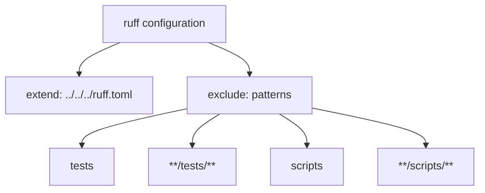

# Diagram: partview_core/partview_service/.ruff.toml

> Auto-generated by Obscura crawlers

## Mermaid

### SVG

<svg id="container" width="691.86328125" xmlns="http://www.w3.org/2000/svg" class="flowchart" height="278" viewBox="0 0 691.86328125 278" role="graphics-document document" aria-roledescription="flowchart-v2"><g><marker id="container_flowchart-v2-pointEnd" class="marker flowchart-v2" viewBox="0 0 10 10" refX="5" refY="5" markerUnits="userSpaceOnUse" markerWidth="8" markerHeight="8" orient="auto"><path d="M 0 0 L 10 5 L 0 10 z" class="arrowMarkerPath" style="stroke-width: 1; stroke-dasharray: 1, 0;"></path></marker><marker id="container_flowchart-v2-pointStart" class="marker flowchart-v2" viewBox="0 0 10 10" refX="4.5" refY="5" markerUnits="userSpaceOnUse" markerWidth="8" markerHeight="8" orient="auto"><path d="M 0 5 L 10 10 L 10 0 z" class="arrowMarkerPath" style="stroke-width: 1; stroke-dasharray: 1, 0;"></path></marker><marker id="container_flowchart-v2-circleEnd" class="marker flowchart-v2" viewBox="0 0 10 10" refX="11" refY="5" markerUnits="userSpaceOnUse" markerWidth="11" markerHeight="11" orient="auto"><circle cx="5" cy="5" r="5" class="arrowMarkerPath" style="stroke-width: 1; stroke-dasharray: 1, 0;"></circle></marker><marker id="container_flowchart-v2-circleStart" class="marker flowchart-v2" viewBox="0 0 10 10" refX="-1" refY="5" markerUnits="userSpaceOnUse" markerWidth="11" markerHeight="11" orient="auto"><circle cx="5" cy="5" r="5" class="arrowMarkerPath" style="stroke-width: 1; stroke-dasharray: 1, 0;"></circle></marker><marker id="container_flowchart-v2-crossEnd" class="marker cross flowchart-v2" viewBox="0 0 11 11" refX="12" refY="5.2" markerUnits="userSpaceOnUse" markerWidth="11" markerHeight="11" orient="auto"><path d="M 1,1 l 9,9 M 10,1 l -9,9" class="arrowMarkerPath" style="stroke-width: 2; stroke-dasharray: 1, 0;"></path></marker><marker id="container_flowchart-v2-crossStart" class="marker cross flowchart-v2" viewBox="0 0 11 11" refX="-1" refY="5.2" markerUnits="userSpaceOnUse" markerWidth="11" markerHeight="11" orient="auto"><path d="M 1,1 l 9,9 M 10,1 l -9,9" class="arrowMarkerPath" style="stroke-width: 2; stroke-dasharray: 1, 0;"></path></marker><g class="root"><g class="clusters"></g><g class="edgePaths"><path d="M180.421,62L170.244,66.167C160.067,70.333,139.713,78.667,129.536,86.333C119.359,94,119.359,101,119.359,104.5L119.359,108" id="L_Config_Extend_0" class="edge-thickness-normal edge-pattern-solid edge-thickness-normal edge-pattern-solid flowchart-link" style=";" data-edge="true" data-et="edge" data-id="L_Config_Extend_0" data-points="W3sieCI6MTgwLjQyMDgyMzMxNzMwNzY4LCJ5Ijo2Mn0seyJ4IjoxMTkuMzU5Mzc1LCJ5Ijo4N30seyJ4IjoxMTkuMzU5Mzc1LCJ5IjoxMTJ9XQ==" marker-end="url(#container_flowchart-v2-pointEnd)"></path><path d="M312.314,62L322.49,66.167C332.667,70.333,353.021,78.667,363.198,86.333C373.375,94,373.375,101,373.375,104.5L373.375,108" id="L_Config_Exclude_0" class="edge-thickness-normal edge-pattern-solid edge-thickness-normal edge-pattern-solid flowchart-link" style=";" data-edge="true" data-et="edge" data-id="L_Config_Exclude_0" data-points="W3sieCI6MzEyLjMxMzU1MTY4MjY5MjMsInkiOjYyfSx7IngiOjM3My4zNzUsInkiOjg3fSx7IngiOjM3My4zNzUsInkiOjExMn1d" marker-end="url(#container_flowchart-v2-pointEnd)"></path><path d="M280.719,159.589L257.158,164.824C233.598,170.059,186.477,180.53,162.916,189.265C139.355,198,139.355,205,139.355,208.5L139.355,212" id="L_Exclude_E1_0" class="edge-thickness-normal edge-pattern-solid edge-thickness-normal edge-pattern-solid flowchart-link" style=";" data-edge="true" data-et="edge" data-id="L_Exclude_E1_0" data-points="W3sieCI6MjgwLjcxODc1LCJ5IjoxNTkuNTg4NTU5MzE0OTYxMDN9LHsieCI6MTM5LjM1NTQ2ODc1LCJ5IjoxOTF9LHsieCI6MTM5LjM1NTQ2ODc1LCJ5IjoyMTZ9XQ==" marker-end="url(#container_flowchart-v2-pointEnd)"></path><path d="M331.697,166L325.265,170.167C318.833,174.333,305.969,182.667,299.537,190.333C293.105,198,293.105,205,293.105,208.5L293.105,212" id="L_Exclude_E2_0" class="edge-thickness-normal edge-pattern-solid edge-thickness-normal edge-pattern-solid flowchart-link" style=";" data-edge="true" data-et="edge" data-id="L_Exclude_E2_0" data-points="W3sieCI6MzMxLjY5NjU4OTU0MzI2OTIsInkiOjE2Nn0seyJ4IjoyOTMuMTA1NDY4NzUsInkiOjE5MX0seyJ4IjoyOTMuMTA1NDY4NzUsInkiOjIxNn1d" marker-end="url(#container_flowchart-v2-pointEnd)"></path><path d="M415.053,166L421.485,170.167C427.917,174.333,440.781,182.667,447.213,190.333C453.645,198,453.645,205,453.645,208.5L453.645,212" id="L_Exclude_E3_0" class="edge-thickness-normal edge-pattern-solid edge-thickness-normal edge-pattern-solid flowchart-link" style=";" data-edge="true" data-et="edge" data-id="L_Exclude_E3_0" data-points="W3sieCI6NDE1LjA1MzQxMDQ1NjczMDgsInkiOjE2Nn0seyJ4Ijo0NTMuNjQ0NTMxMjUsInkiOjE5MX0seyJ4Ijo0NTMuNjQ0NTMxMjUsInkiOjIxNn1d" marker-end="url(#container_flowchart-v2-pointEnd)"></path><path d="M466.031,158.466L491.842,163.888C517.652,169.31,569.273,180.155,595.084,189.078C620.895,198,620.895,205,620.895,208.5L620.895,212" id="L_Exclude_E4_0" class="edge-thickness-normal edge-pattern-solid edge-thickness-normal edge-pattern-solid flowchart-link" style=";" data-edge="true" data-et="edge" data-id="L_Exclude_E4_0" data-points="W3sieCI6NDY2LjAzMTI1LCJ5IjoxNTguNDY1NjM1NjAzMjUxfSx7IngiOjYyMC44OTQ1MzEyNSwieSI6MTkxfSx7IngiOjYyMC44OTQ1MzEyNSwieSI6MjE2fV0=" marker-end="url(#container_flowchart-v2-pointEnd)"></path></g><g class="edgeLabels"><g class="edgeLabel"><g class="label" data-id="L_Config_Extend_0" transform="translate(0, 0)"><foreignObject width="0" height="0">

</foreignObject></g></g><g class="edgeLabel"><g class="label" data-id="L_Config_Exclude_0" transform="translate(0, 0)"><foreignObject width="0" height="0">

</foreignObject></g></g><g class="edgeLabel"><g class="label" data-id="L_Exclude_E1_0" transform="translate(0, 0)"><foreignObject width="0" height="0">

</foreignObject></g></g><g class="edgeLabel"><g class="label" data-id="L_Exclude_E2_0" transform="translate(0, 0)"><foreignObject width="0" height="0">

</foreignObject></g></g><g class="edgeLabel"><g class="label" data-id="L_Exclude_E3_0" transform="translate(0, 0)"><foreignObject width="0" height="0">

</foreignObject></g></g><g class="edgeLabel"><g class="label" data-id="L_Exclude_E4_0" transform="translate(0, 0)"><foreignObject width="0" height="0">

</foreignObject></g></g></g><g class="nodes"><g class="node default" id="flowchart-Config-0" transform="translate(246.3671875, 35)"><rect class="basic label-container" style="" x="-93.25" y="-27" width="186.5" height="54"></rect><g class="label" style="" transform="translate(-63.25, -12)"><rect></rect><foreignObject width="126.5" height="24">

ruff configuration

</foreignObject></g></g><g class="node default" id="flowchart-Extend-1" transform="translate(119.359375, 139)"><rect class="basic label-container" style="" x="-111.359375" y="-27" width="222.71875" height="54"></rect><g class="label" style="" transform="translate(-81.359375, -12)"><rect></rect><foreignObject width="162.71875" height="24">

extend: ../../../ruff.toml

</foreignObject></g></g><g class="node default" id="flowchart-Exclude-3" transform="translate(373.375, 139)"><rect class="basic label-container" style="" x="-92.65625" y="-27" width="185.3125" height="54"></rect><g class="label" style="" transform="translate(-62.65625, -12)"><rect></rect><foreignObject width="125.3125" height="24">

exclude: patterns

</foreignObject></g></g><g class="node default" id="flowchart-E1-5" transform="translate(139.35546875, 243)"><rect class="basic label-container" style="" x="-47.4921875" y="-27" width="94.984375" height="54"></rect><g class="label" style="" transform="translate(-17.4921875, -12)"><rect></rect><foreignObject width="34.984375" height="24">

tests

</foreignObject></g></g><g class="node default" id="flowchart-E2-7" transform="translate(293.10546875, 243)"><rect class="basic label-container" style="" x="-56.2578125" y="-27" width="112.515625" height="54"></rect><g class="label" style="" transform="translate(-26.2578125, -12)"><rect></rect><foreignObject width="52.515625" height="24">

<strong>/tests/</strong>

</foreignObject></g></g><g class="node default" id="flowchart-E3-9" transform="translate(453.64453125, 243)"><rect class="basic label-container" style="" x="-54.28125" y="-27" width="108.5625" height="54"></rect><g class="label" style="" transform="translate(-24.28125, -12)"><rect></rect><foreignObject width="48.5625" height="24">

scripts

</foreignObject></g></g><g class="node default" id="flowchart-E4-11" transform="translate(620.89453125, 243)"><rect class="basic label-container" style="" x="-62.96875" y="-27" width="125.9375" height="54"></rect><g class="label" style="" transform="translate(-32.96875, -12)"><rect></rect><foreignObject width="65.9375" height="24">

<strong>/scripts/</strong>

</foreignObject></g></g></g></g></g></svg>
