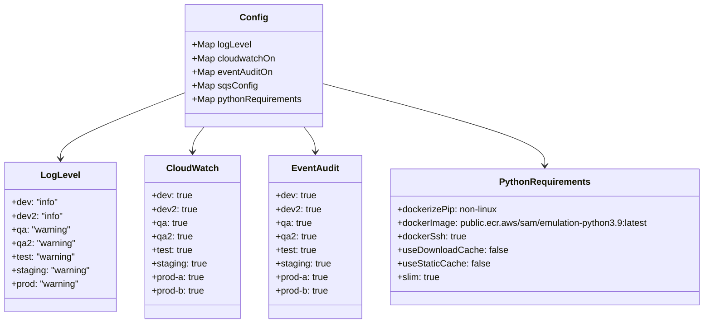

# Diagram: partview_core/partview_service/config.cat.yml

> Auto-generated by Obscura crawlers

## Diagram 1

### SVG

<svg id="container" width="1241.4453125" xmlns="http://www.w3.org/2000/svg" class="classDiagram" height="570" viewBox="0 0 1241.4453125 570" role="graphics-document document" aria-roledescription="class"><g><defs><marker id="container_class-aggregationStart" class="marker aggregation class" refX="18" refY="7" markerWidth="190" markerHeight="240" orient="auto"><path d="M 18,7 L9,13 L1,7 L9,1 Z"></path></marker></defs><defs><marker id="container_class-aggregationEnd" class="marker aggregation class" refX="1" refY="7" markerWidth="20" markerHeight="28" orient="auto"><path d="M 18,7 L9,13 L1,7 L9,1 Z"></path></marker></defs><defs><marker id="container_class-extensionStart" class="marker extension class" refX="18" refY="7" markerWidth="190" markerHeight="240" orient="auto"><path d="M 1,7 L18,13 V 1 Z"></path></marker></defs><defs><marker id="container_class-extensionEnd" class="marker extension class" refX="1" refY="7" markerWidth="20" markerHeight="28" orient="auto"><path d="M 1,1 V 13 L18,7 Z"></path></marker></defs><defs><marker id="container_class-compositionStart" class="marker composition class" refX="18" refY="7" markerWidth="190" markerHeight="240" orient="auto"><path d="M 18,7 L9,13 L1,7 L9,1 Z"></path></marker></defs><defs><marker id="container_class-compositionEnd" class="marker composition class" refX="1" refY="7" markerWidth="20" markerHeight="28" orient="auto"><path d="M 18,7 L9,13 L1,7 L9,1 Z"></path></marker></defs><defs><marker id="container_class-dependencyStart" class="marker dependency class" refX="6" refY="7" markerWidth="190" markerHeight="240" orient="auto"><path d="M 5,7 L9,13 L1,7 L9,1 Z"></path></marker></defs><defs><marker id="container_class-dependencyEnd" class="marker dependency class" refX="13" refY="7" markerWidth="20" markerHeight="28" orient="auto"><path d="M 18,7 L9,13 L14,7 L9,1 Z"></path></marker></defs><defs><marker id="container_class-lollipopStart" class="marker lollipop class" refX="13" refY="7" markerWidth="190" markerHeight="240" orient="auto"><circle stroke="black" fill="transparent" cx="7" cy="7" r="6"></circle></marker></defs><defs><marker id="container_class-lollipopEnd" class="marker lollipop class" refX="1" refY="7" markerWidth="190" markerHeight="240" orient="auto"><circle stroke="black" fill="transparent" cx="7" cy="7" r="6"></circle></marker></defs><g class="root"><g class="clusters"></g><g class="edgePaths"><path d="M321.455,163.754L285.452,177.962C249.449,192.169,177.443,220.585,141.44,239.959C105.438,259.333,105.438,269.667,105.438,274.833L105.438,280" id="id_Config_LogLevel_1" class="edge-thickness-normal edge-pattern-solid relation" style=";;;" data-edge="true" data-et="edge" data-id="id_Config_LogLevel_1" data-points="W3sieCI6MzIxLjQ1NTA3ODEyNSwieSI6MTYzLjc1NDE4MjYyNzM5MTJ9LHsieCI6MTA1LjQzNzUsInkiOjI0OX0seyJ4IjoxMDUuNDM3NSwieSI6Mjg2fV0=" marker-end="url(#container_class-dependencyEnd)"></path><path d="M355.702,224L352.354,228.167C349.007,232.333,342.312,240.667,338.965,248C335.617,255.333,335.617,261.667,335.617,264.833L335.617,268" id="id_Config_CloudWatch_2" class="edge-thickness-normal edge-pattern-solid relation" style=";;;" data-edge="true" data-et="edge" data-id="id_Config_CloudWatch_2" data-points="W3sieCI6MzU1LjcwMTcwMDU0MDQxMzUsInkiOjIyNH0seyJ4IjozMzUuNjE3MTg3NSwieSI6MjQ5fSx7IngiOjMzNS42MTcxODc1LCJ5IjoyNzR9XQ==" marker-end="url(#container_class-dependencyEnd)"></path><path d="M529.232,224L532.579,228.167C535.927,232.333,542.622,240.667,545.969,248C549.316,255.333,549.316,261.667,549.316,264.833L549.316,268" id="id_Config_EventAudit_3" class="edge-thickness-normal edge-pattern-solid relation" style=";;;" data-edge="true" data-et="edge" data-id="id_Config_EventAudit_3" data-points="W3sieCI6NTI5LjIzMTg5MzIwOTU4NjUsInkiOjIyNH0seyJ4Ijo1NDkuMzE2NDA2MjUsInkiOjI0OX0seyJ4Ijo1NDkuMzE2NDA2MjUsInkiOjI3NH1d" marker-end="url(#container_class-dependencyEnd)"></path><path d="M563.479,147.288L629.042,164.24C694.605,181.192,825.732,215.096,891.296,239.215C956.859,263.333,956.859,277.667,956.859,284.833L956.859,292" id="id_Config_PythonRequirements_4" class="edge-thickness-normal edge-pattern-solid relation" style=";;;" data-edge="true" data-et="edge" data-id="id_Config_PythonRequirements_4" data-points="W3sieCI6NTYzLjQ3ODUxNTYyNSwieSI6MTQ3LjI4ODQ3MzU4NjQ4ODkyfSx7IngiOjk1Ni44NTkzNzUsInkiOjI0OX0seyJ4Ijo5NTYuODU5Mzc1LCJ5IjoyOTh9XQ==" marker-end="url(#container_class-dependencyEnd)"></path></g><g class="edgeLabels"><g class="edgeLabel"><g class="label" data-id="id_Config_LogLevel_1" transform="translate(0, 0)"><foreignObject width="0" height="0">

</foreignObject></g></g><g class="edgeLabel"><g class="label" data-id="id_Config_CloudWatch_2" transform="translate(0, 0)"><foreignObject width="0" height="0">

</foreignObject></g></g><g class="edgeLabel"><g class="label" data-id="id_Config_EventAudit_3" transform="translate(0, 0)"><foreignObject width="0" height="0">

</foreignObject></g></g><g class="edgeLabel"><g class="label" data-id="id_Config_PythonRequirements_4" transform="translate(0, 0)"><foreignObject width="0" height="0">

</foreignObject></g></g></g><g class="nodes"><g class="node default" id="classId-Config-0" transform="translate(442.466796875, 116)"><g class="basic label-container"><path d="M-121.01171875 -108 L121.01171875 -108 L121.01171875 108 L-121.01171875 108" stroke="none" stroke-width="0" fill="#ECECFF" style=""></path><path d="M-121.01171875 -108 C-34.76067849563732 -108, 51.490361758725356 -108, 121.01171875 -108 M-121.01171875 -108 C-54.64632344406081 -108, 11.719071861878376 -108, 121.01171875 -108 M121.01171875 -108 C121.01171875 -58.97292015742847, 121.01171875 -9.945840314856937, 121.01171875 108 M121.01171875 -108 C121.01171875 -27.934590570584362, 121.01171875 52.130818858831276, 121.01171875 108 M121.01171875 108 C29.044640082380752 108, -62.922438585238496 108, -121.01171875 108 M121.01171875 108 C24.479729562583117 108, -72.05225962483377 108, -121.01171875 108 M-121.01171875 108 C-121.01171875 39.97265527078325, -121.01171875 -28.0546894584335, -121.01171875 -108 M-121.01171875 108 C-121.01171875 57.564509979130314, -121.01171875 7.129019958260628, -121.01171875 -108" stroke="#9370DB" stroke-width="1.3" fill="none" stroke-dasharray="0 0" style=""></path></g><g class="annotation-group text" transform="translate(0, -84)"></g><g class="label-group text" transform="translate(-22.9296875, -84)"><g class="label" style="font-weight: bolder" transform="translate(0,-12)"><foreignObject width="45.859375" height="24">

Config

</foreignObject></g></g><g class="members-group text" transform="translate(-109.01171875, -36)"><g class="label" style="" transform="translate(0,-12)"><foreignObject width="102.59375" height="24">

+Map logLevel

</foreignObject></g><g class="label" style="" transform="translate(0,12)"><foreignObject width="146.359375" height="24">

+Map cloudwatchOn

</foreignObject></g><g class="label" style="" transform="translate(0,36)"><foreignObject width="142.015625" height="24">

+Map eventAuditOn

</foreignObject></g><g class="label" style="" transform="translate(0,60)"><foreignObject width="112.28125" height="24">

+Map sqsConfig

</foreignObject></g><g class="label" style="" transform="translate(0,84)"><foreignObject width="195.09375" height="24">

+Map pythonRequirements

</foreignObject></g></g><g class="methods-group text" transform="translate(-109.01171875, 108)"></g><g class="divider" style=""><path d="M-121.01171875 -60 C-42.216124212498315 -60, 36.57947032500337 -60, 121.01171875 -60 M-121.01171875 -60 C-58.74049736983234 -60, 3.5307240103353195 -60, 121.01171875 -60" stroke="#9370DB" stroke-width="1.3" fill="none" stroke-dasharray="0 0" style=""></path></g><g class="divider" style=""><path d="M-121.01171875 84 C-59.569327149896885 84, 1.873064450206229 84, 121.01171875 84 M-121.01171875 84 C-69.13396186314651 84, -17.25620497629302 84, 121.01171875 84" stroke="#9370DB" stroke-width="1.3" fill="none" stroke-dasharray="0 0" style=""></path></g></g><g class="node default" id="classId-LogLevel-1" transform="translate(105.4375, 418)"><g class="basic label-container"><path d="M-97.4375 -132 L97.4375 -132 L97.4375 132 L-97.4375 132" stroke="none" stroke-width="0" fill="#ECECFF" style=""></path><path d="M-97.4375 -132 C-31.139836818757615 -132, 35.15782636248477 -132, 97.4375 -132 M-97.4375 -132 C-49.527373027888444 -132, -1.6172460557768886 -132, 97.4375 -132 M97.4375 -132 C97.4375 -62.6804485446354, 97.4375 6.639102910729207, 97.4375 132 M97.4375 -132 C97.4375 -28.775040588609585, 97.4375 74.44991882278083, 97.4375 132 M97.4375 132 C50.06914428077473 132, 2.7007885615494587 132, -97.4375 132 M97.4375 132 C47.01175280393579 132, -3.4139943921284157 132, -97.4375 132 M-97.4375 132 C-97.4375 26.611042498723933, -97.4375 -78.77791500255213, -97.4375 -132 M-97.4375 132 C-97.4375 60.66067271726412, -97.4375 -10.67865456547176, -97.4375 -132" stroke="#9370DB" stroke-width="1.3" fill="none" stroke-dasharray="0 0" style=""></path></g><g class="annotation-group text" transform="translate(0, -108)"></g><g class="label-group text" transform="translate(-32.078125, -108)"><g class="label" style="font-weight: bolder" transform="translate(0,-12)"><foreignObject width="64.15625" height="24">

LogLevel

</foreignObject></g></g><g class="members-group text" transform="translate(-85.4375, -60)"><g class="label" style="" transform="translate(0,-12)"><foreignObject width="83.265625" height="24">

+dev: "info"

</foreignObject></g><g class="label" style="" transform="translate(0,12)"><foreignObject width="90.96875" height="24">

+dev2: "info"

</foreignObject></g><g class="label" style="" transform="translate(0,36)"><foreignObject width="104.859375" height="24">

+qa: "warning"

</foreignObject></g><g class="label" style="" transform="translate(0,60)"><foreignObject width="112.78125" height="24">

+qa2: "warning"

</foreignObject></g><g class="label" style="" transform="translate(0,84)"><foreignObject width="114.078125" height="24">

+test: "warning"

</foreignObject></g><g class="label" style="" transform="translate(0,108)"><foreignObject width="138.796875" height="24">

+staging: "warning"

</foreignObject></g><g class="label" style="" transform="translate(0,132)"><foreignObject width="120.703125" height="24">

+prod: "warning"

</foreignObject></g></g><g class="methods-group text" transform="translate(-85.4375, 132)"></g><g class="divider" style=""><path d="M-97.4375 -84 C-31.039277249297626 -84, 35.35894550140475 -84, 97.4375 -84 M-97.4375 -84 C-46.85197270382456 -84, 3.7335545923508846 -84, 97.4375 -84" stroke="#9370DB" stroke-width="1.3" fill="none" stroke-dasharray="0 0" style=""></path></g><g class="divider" style=""><path d="M-97.4375 108 C-19.970693885080365 108, 57.49611222983927 108, 97.4375 108 M-97.4375 108 C-44.865705796646544 108, 7.706088406706911 108, 97.4375 108" stroke="#9370DB" stroke-width="1.3" fill="none" stroke-dasharray="0 0" style=""></path></g></g><g class="node default" id="classId-CloudWatch-2" transform="translate(335.6171875, 418)"><g class="basic label-container"><path d="M-82.7421875 -144 L82.7421875 -144 L82.7421875 144 L-82.7421875 144" stroke="none" stroke-width="0" fill="#ECECFF" style=""></path><path d="M-82.7421875 -144 C-30.82696684939031 -144, 21.08825380121938 -144, 82.7421875 -144 M-82.7421875 -144 C-48.59594289581563 -144, -14.449698291631265 -144, 82.7421875 -144 M82.7421875 -144 C82.7421875 -48.214640961291494, 82.7421875 47.57071807741701, 82.7421875 144 M82.7421875 -144 C82.7421875 -64.71647109518197, 82.7421875 14.567057809636054, 82.7421875 144 M82.7421875 144 C31.812782445282977 144, -19.116622609434046 144, -82.7421875 144 M82.7421875 144 C18.645992041367904 144, -45.45020341726419 144, -82.7421875 144 M-82.7421875 144 C-82.7421875 30.368838779117638, -82.7421875 -83.26232244176472, -82.7421875 -144 M-82.7421875 144 C-82.7421875 75.12091625454921, -82.7421875 6.24183250909843, -82.7421875 -144" stroke="#9370DB" stroke-width="1.3" fill="none" stroke-dasharray="0 0" style=""></path></g><g class="annotation-group text" transform="translate(0, -120)"></g><g class="label-group text" transform="translate(-43.21875, -120)"><g class="label" style="font-weight: bolder" transform="translate(0,-12)"><foreignObject width="86.4375" height="24">

CloudWatch

</foreignObject></g></g><g class="members-group text" transform="translate(-70.7421875, -72)"><g class="label" style="" transform="translate(0,-12)"><foreignObject width="72.21875" height="24">

+dev: true

</foreignObject></g><g class="label" style="" transform="translate(0,12)"><foreignObject width="79.90625" height="24">

+dev2: true

</foreignObject></g><g class="label" style="" transform="translate(0,36)"><foreignObject width="64.328125" height="24">

+qa: true

</foreignObject></g><g class="label" style="" transform="translate(0,60)"><foreignObject width="72.25" height="24">

+qa2: true

</foreignObject></g><g class="label" style="" transform="translate(0,84)"><foreignObject width="73.546875" height="24">

+test: true

</foreignObject></g><g class="label" style="" transform="translate(0,108)"><foreignObject width="98.265625" height="24">

+staging: true

</foreignObject></g><g class="label" style="" transform="translate(0,132)"><foreignObject width="95.078125" height="24">

+prod-a: true

</foreignObject></g><g class="label" style="" transform="translate(0,156)"><foreignObject width="96.125" height="24">

+prod-b: true

</foreignObject></g></g><g class="methods-group text" transform="translate(-70.7421875, 144)"></g><g class="divider" style=""><path d="M-82.7421875 -96 C-22.97821514880568 -96, 36.78575720238864 -96, 82.7421875 -96 M-82.7421875 -96 C-43.06114624410415 -96, -3.380104988208302 -96, 82.7421875 -96" stroke="#9370DB" stroke-width="1.3" fill="none" stroke-dasharray="0 0" style=""></path></g><g class="divider" style=""><path d="M-82.7421875 120 C-48.33324602447834 120, -13.924304548956684 120, 82.7421875 120 M-82.7421875 120 C-37.68036542435166 120, 7.3814566512966735 120, 82.7421875 120" stroke="#9370DB" stroke-width="1.3" fill="none" stroke-dasharray="0 0" style=""></path></g></g><g class="node default" id="classId-EventAudit-3" transform="translate(549.31640625, 418)"><g class="basic label-container"><path d="M-80.95703125 -144 L80.95703125 -144 L80.95703125 144 L-80.95703125 144" stroke="none" stroke-width="0" fill="#ECECFF" style=""></path><path d="M-80.95703125 -144 C-42.36460151112404 -144, -3.772171772248086 -144, 80.95703125 -144 M-80.95703125 -144 C-29.438282974221593 -144, 22.080465301556814 -144, 80.95703125 -144 M80.95703125 -144 C80.95703125 -78.66933546249979, 80.95703125 -13.338670924999576, 80.95703125 144 M80.95703125 -144 C80.95703125 -51.270213017345995, 80.95703125 41.45957396530801, 80.95703125 144 M80.95703125 144 C45.64587173141745 144, 10.334712212834901 144, -80.95703125 144 M80.95703125 144 C30.797264607333823 144, -19.362502035332355 144, -80.95703125 144 M-80.95703125 144 C-80.95703125 42.22451823449296, -80.95703125 -59.55096353101408, -80.95703125 -144 M-80.95703125 144 C-80.95703125 84.82533153462542, -80.95703125 25.65066306925084, -80.95703125 -144" stroke="#9370DB" stroke-width="1.3" fill="none" stroke-dasharray="0 0" style=""></path></g><g class="annotation-group text" transform="translate(0, -120)"></g><g class="label-group text" transform="translate(-39.6484375, -120)"><g class="label" style="font-weight: bolder" transform="translate(0,-12)"><foreignObject width="79.296875" height="24">

EventAudit

</foreignObject></g></g><g class="members-group text" transform="translate(-68.95703125, -72)"><g class="label" style="" transform="translate(0,-12)"><foreignObject width="72.21875" height="24">

+dev: true

</foreignObject></g><g class="label" style="" transform="translate(0,12)"><foreignObject width="79.90625" height="24">

+dev2: true

</foreignObject></g><g class="label" style="" transform="translate(0,36)"><foreignObject width="64.328125" height="24">

+qa: true

</foreignObject></g><g class="label" style="" transform="translate(0,60)"><foreignObject width="72.25" height="24">

+qa2: true

</foreignObject></g><g class="label" style="" transform="translate(0,84)"><foreignObject width="73.546875" height="24">

+test: true

</foreignObject></g><g class="label" style="" transform="translate(0,108)"><foreignObject width="98.265625" height="24">

+staging: true

</foreignObject></g><g class="label" style="" transform="translate(0,132)"><foreignObject width="95.078125" height="24">

+prod-a: true

</foreignObject></g><g class="label" style="" transform="translate(0,156)"><foreignObject width="96.125" height="24">

+prod-b: true

</foreignObject></g></g><g class="methods-group text" transform="translate(-68.95703125, 144)"></g><g class="divider" style=""><path d="M-80.95703125 -96 C-21.088111700787373 -96, 38.780807848425255 -96, 80.95703125 -96 M-80.95703125 -96 C-30.660615138332645 -96, 19.63580097333471 -96, 80.95703125 -96" stroke="#9370DB" stroke-width="1.3" fill="none" stroke-dasharray="0 0" style=""></path></g><g class="divider" style=""><path d="M-80.95703125 120 C-27.709292223310776 120, 25.53844680337845 120, 80.95703125 120 M-80.95703125 120 C-18.41086120137976 120, 44.13530884724048 120, 80.95703125 120" stroke="#9370DB" stroke-width="1.3" fill="none" stroke-dasharray="0 0" style=""></path></g></g><g class="node default" id="classId-PythonRequirements-4" transform="translate(956.859375, 418)"><g class="basic label-container"><path d="M-276.5859375 -120 L276.5859375 -120 L276.5859375 120 L-276.5859375 120" stroke="none" stroke-width="0" fill="#ECECFF" style=""></path><path d="M-276.5859375 -120 C-144.81325991884012 -120, -13.040582337680235 -120, 276.5859375 -120 M-276.5859375 -120 C-151.8800193956326 -120, -27.174101291265174 -120, 276.5859375 -120 M276.5859375 -120 C276.5859375 -60.073658262917625, 276.5859375 -0.1473165258352509, 276.5859375 120 M276.5859375 -120 C276.5859375 -55.5021133918879, 276.5859375 8.995773216224194, 276.5859375 120 M276.5859375 120 C102.63240826771622 120, -71.32112096456757 120, -276.5859375 120 M276.5859375 120 C89.05064877369233 120, -98.48463995261534 120, -276.5859375 120 M-276.5859375 120 C-276.5859375 32.29857596786286, -276.5859375 -55.40284806427428, -276.5859375 -120 M-276.5859375 120 C-276.5859375 50.0105979004489, -276.5859375 -19.9788041991022, -276.5859375 -120" stroke="#9370DB" stroke-width="1.3" fill="none" stroke-dasharray="0 0" style=""></path></g><g class="annotation-group text" transform="translate(0, -96)"></g><g class="label-group text" transform="translate(-76.890625, -96)"><g class="label" style="font-weight: bolder" transform="translate(0,-12)"><foreignObject width="153.78125" height="24">

PythonRequirements

</foreignObject></g></g><g class="members-group text" transform="translate(-264.5859375, -48)"><g class="label" style="" transform="translate(0,-12)"><foreignObject width="179.1875" height="24">

+dockerizePip: non-linux

</foreignObject></g><g class="label" style="" transform="translate(0,12)"><foreignObject width="452.28125" height="24">

+dockerImage: public.ecr.aws/sam/emulation-python3.9:latest

</foreignObject></g><g class="label" style="" transform="translate(0,36)"><foreignObject width="121.125" height="24">

+dockerSsh: true

</foreignObject></g><g class="label" style="" transform="translate(0,60)"><foreignObject width="191.8125" height="24">

+useDownloadCache: false

</foreignObject></g><g class="label" style="" transform="translate(0,84)"><foreignObject width="160.28125" height="24">

+useStaticCache: false

</foreignObject></g><g class="label" style="" transform="translate(0,108)"><foreignObject width="76.4375" height="24">

+slim: true

</foreignObject></g></g><g class="methods-group text" transform="translate(-264.5859375, 120)"></g><g class="divider" style=""><path d="M-276.5859375 -72 C-61.40836736021447 -72, 153.76920277957106 -72, 276.5859375 -72 M-276.5859375 -72 C-134.49003430491558 -72, 7.605868890168836 -72, 276.5859375 -72" stroke="#9370DB" stroke-width="1.3" fill="none" stroke-dasharray="0 0" style=""></path></g><g class="divider" style=""><path d="M-276.5859375 96 C-84.13918140265221 96, 108.30757469469557 96, 276.5859375 96 M-276.5859375 96 C-154.29786718646844 96, -32.009796872936874 96, 276.5859375 96" stroke="#9370DB" stroke-width="1.3" fill="none" stroke-dasharray="0 0" style=""></path></g></g></g></g></g></svg>

## Diagram 2

```mermaid
flowchart LR
    subgraph prod["prod"]
        direction TB
        p1["post-full-asn-order-consumer\nmax=150"]
        p2["part-to-container-consumer\nmax=150"]
        p3["package-container-event-consumer\nmax=50"]
        p4["package-container-exception-consumer\nmax=50"]
        p5["event-scheduler-sqs-consumer\nmax=50"]
        p6["last-mile-package-eta\nmax=10"]
        p7["partview_open_search_data_sync_consumer\nmax=100"]
        p8["event-replay-sqs-consumer\nmax=100"]
        p9["package-container-asn-consumer\nmax=50"]
        p10["trip-leg-consumer\nmax=20"]
        p11["trip-leg-to-container-consumer\nmax=20"]
        p12["pv-shipment-asn-event-handler\nmax=10"]
    end
    subgraph staging["staging"]
        direction TB
        s1["post-full-asn-order-consumer\nmax=50"]
        s2["part-to-container-consumer\nmax=50"]
        s3["package-container-exception-consumer\nmax=50"]
        s4["event-scheduler-sqs-consumer\nmax=5"]
        s5["last-mile-package-eta\nmax=10"]
        s6["package-container-event-consumer\nmax=50"]
        s7["partview_open_search_data_sync_consumer\nmax=100"]
        s8["event-replay-sqs-consumer\nmax=5"]
        s9["package-container-asn-consumer\nmax=50"]
        s10["trip-leg-consumer\nmax=50"]
        s11["trip-leg-to-container-consumer\nmax=50"]
        s12["pv-shipment-asn-event-handler\nmax=10"]
    end
    subgraph dev["dev"]
        direction TB
        d1["post-full-asn-order-consumer\nmax=10"]
        d2["part-to-container-consumer\nmax=10"]
        d3["package-container-exception-consumer\nmax=10"]
        d4["event-scheduler-sqs-consumer\nmax=5"]
        d5["last-mile-package-eta\nmax=10"]
        d6["package-container-event-consumer\nmax=10"]
        d7["partview_open_search_data_sync_consumer\nmax=10"]
        d8["event-replay-sqs-consumer\nmax=5"]
        d9["package-container-asn-consumer\nmax=10"]
        d10["trip-leg-consumer\nmax=5"]
        d11["trip-leg-to-container-consumer\nmax=5"]
        d12["pv-shipment-asn-event-handler\nmax=10"]
    end
    prod -->|contains| p1
    prod --> p2
    prod --> p3
    prod --> p4
    prod --> p5
    prod --> p6
    prod --> p7
    prod --> p8
    prod --> p9
    prod --> p10
    prod --> p11
    prod --> p12
    staging --> s1
    staging --> s2
    staging --> s3
    staging --> s4
    staging --> s5
    staging --> s6
    staging --> s7
    staging --> s8
    staging --> s9
    staging --> s10
    staging --> s11
    staging --> s12
    dev --> d1
    dev --> d2
    dev --> d3
    dev --> d4
    dev --> d5
    dev --> d6
    dev --> d7
    dev --> d8
    dev --> d9
    dev --> d10
    dev --> d11
    dev --> d12
```

### SVG

<svg id="container" width="838.703125" xmlns="http://www.w3.org/2000/svg" class="flowchart" height="4316" viewBox="0 0 838.703125 4316" role="graphics-document document" aria-roledescription="flowchart-v2"><g><marker id="container_flowchart-v2-pointEnd" class="marker flowchart-v2" viewBox="0 0 10 10" refX="5" refY="5" markerUnits="userSpaceOnUse" markerWidth="8" markerHeight="8" orient="auto"><path d="M 0 0 L 10 5 L 0 10 z" class="arrowMarkerPath" style="stroke-width: 1; stroke-dasharray: 1, 0;"></path></marker><marker id="container_flowchart-v2-pointStart" class="marker flowchart-v2" viewBox="0 0 10 10" refX="4.5" refY="5" markerUnits="userSpaceOnUse" markerWidth="8" markerHeight="8" orient="auto"><path d="M 0 5 L 10 10 L 10 0 z" class="arrowMarkerPath" style="stroke-width: 1; stroke-dasharray: 1, 0;"></path></marker><marker id="container_flowchart-v2-circleEnd" class="marker flowchart-v2" viewBox="0 0 10 10" refX="11" refY="5" markerUnits="userSpaceOnUse" markerWidth="11" markerHeight="11" orient="auto"><circle cx="5" cy="5" r="5" class="arrowMarkerPath" style="stroke-width: 1; stroke-dasharray: 1, 0;"></circle></marker><marker id="container_flowchart-v2-circleStart" class="marker flowchart-v2" viewBox="0 0 10 10" refX="-1" refY="5" markerUnits="userSpaceOnUse" markerWidth="11" markerHeight="11" orient="auto"><circle cx="5" cy="5" r="5" class="arrowMarkerPath" style="stroke-width: 1; stroke-dasharray: 1, 0;"></circle></marker><marker id="container_flowchart-v2-crossEnd" class="marker cross flowchart-v2" viewBox="0 0 11 11" refX="12" refY="5.2" markerUnits="userSpaceOnUse" markerWidth="11" markerHeight="11" orient="auto"><path d="M 1,1 l 9,9 M 10,1 l -9,9" class="arrowMarkerPath" style="stroke-width: 2; stroke-dasharray: 1, 0;"></path></marker><marker id="container_flowchart-v2-crossStart" class="marker cross flowchart-v2" viewBox="0 0 11 11" refX="-1" refY="5.2" markerUnits="userSpaceOnUse" markerWidth="11" markerHeight="11" orient="auto"><path d="M 1,1 l 9,9 M 10,1 l -9,9" class="arrowMarkerPath" style="stroke-width: 2; stroke-dasharray: 1, 0;"></path></marker><g class="root"><g class="clusters"><g class="cluster" id="dev" data-look="classic"><rect style="" x="8" y="8" width="822.703125" height="1404"></rect><g class="cluster-label" transform="translate(406.296875, 8)"><foreignObject width="26.109375" height="24">

dev

</foreignObject></g></g><g class="cluster" id="staging" data-look="classic"><rect style="" x="8" y="1432" width="822.703125" height="1428"></rect><g class="cluster-label" transform="translate(393.2421875, 1432)"><foreignObject width="52.21875" height="24">

staging

</foreignObject></g></g><g class="cluster" id="prod" data-look="classic"><rect style="" x="8" y="2880" width="822.703125" height="1428"></rect><g class="cluster-label" transform="translate(402.2890625, 2880)"><foreignObject width="34.125" height="24">

prod

</foreignObject></g></g></g><g class="edgePaths"><path d="M178.03,3645Z" id="L_prod_p1_0" class="edge-thickness-normal edge-pattern-solid edge-thickness-normal edge-pattern-solid flowchart-link" style=";" data-edge="true" data-et="edge" data-id="L_prod_p1_0" data-points="W3sieCI6MTUxLjk3MDI2ODMxMDM2OTgyLCJ5IjozNjQ1fSx7IngiOjMzLCJ5Ijo0MDY1LjY2NjY2NjY2NjY2NjV9LHsieCI6MzMsInkiOjQxNzAuODMzMzMzMzMzMzMzfSx7IngiOjE2MywieSI6NDI3Nn0seyJ4IjoyOTMsInkiOjQxNzAuODMzMzMzMzMzMzMzfSx7IngiOjI5MywieSI6NDA2NS42NjY2NjY2NjY2NjY1fSx7IngiOjE3NC4wMjk3MzE2ODk2MzAxOCwieSI6MzY0NX1d" marker-end="url(#container_flowchart-v2-pointEnd)"></path><path d="M448.352,2954Z" id="L_prod_p2_0" class="edge-thickness-normal edge-pattern-solid edge-thickness-normal edge-pattern-solid flowchart-link" style=";" data-edge="true" data-et="edge" data-id="L_prod_p2_0" data-points="W3sieCI6MTcyLjI3MTQ3MjM5MjYzODAzLCJ5IjozNTY3fSx7IngiOjMxOCwieSI6Mjk1NH0seyJ4Ijo0NDQuMzUxNTYyNSwieSI6Mjk1NH1d" marker-end="url(#container_flowchart-v2-pointEnd)"></path><path d="M448.352,3082Z" id="L_prod_p3_0" class="edge-thickness-normal edge-pattern-solid edge-thickness-normal edge-pattern-solid flowchart-link" style=";" data-edge="true" data-et="edge" data-id="L_prod_p3_0" data-points="W3sieCI6MTc0LjUzNjI1OTU0MTk4NDcyLCJ5IjozNTY3fSx7IngiOjMxOCwieSI6MzA4Mn0seyJ4Ijo0NDQuMzUxNTYyNSwieSI6MzA4Mn1d" marker-end="url(#container_flowchart-v2-pointEnd)"></path><path d="M448.352,3222Z" id="L_prod_p4_0" class="edge-thickness-normal edge-pattern-solid edge-thickness-normal edge-pattern-solid flowchart-link" style=";" data-edge="true" data-et="edge" data-id="L_prod_p4_0" data-points="W3sieCI6MTc4Ljc0MjE4NzUsInkiOjM1Njd9LHsieCI6MzE4LCJ5IjozMjIyfSx7IngiOjQ0NC4zNTE1NjI1LCJ5IjozMjIyfV0=" marker-end="url(#container_flowchart-v2-pointEnd)"></path><path d="M448.352,3362Z" id="L_prod_p5_0" class="edge-thickness-normal edge-pattern-solid edge-thickness-normal edge-pattern-solid flowchart-link" style=";" data-edge="true" data-et="edge" data-id="L_prod_p5_0" data-points="W3sieCI6MTg3Ljc3NDU5MDE2MzkzNDQyLCJ5IjozNTY3fSx7IngiOjMxOCwieSI6MzM2Mn0seyJ4Ijo0NDQuMzUxNTYyNSwieSI6MzM2Mn1d" marker-end="url(#container_flowchart-v2-pointEnd)"></path><path d="M448.352,3490Z" id="L_prod_p6_0" class="edge-thickness-normal edge-pattern-solid edge-thickness-normal edge-pattern-solid flowchart-link" style=";" data-edge="true" data-et="edge" data-id="L_prod_p6_0" data-points="W3sieCI6MjE1LjExMjA2ODk2NTUxNzI0LCJ5IjozNTY3fSx7IngiOjMxOCwieSI6MzQ5MH0seyJ4Ijo0NDQuMzUxNTYyNSwieSI6MzQ5MH1d" marker-end="url(#container_flowchart-v2-pointEnd)"></path><path d="M347,3606Z" id="L_prod_p7_0" class="edge-thickness-normal edge-pattern-solid edge-thickness-normal edge-pattern-solid flowchart-link" style=";" data-edge="true" data-et="edge" data-id="L_prod_p7_0" data-points="W3sieCI6MjkzLCJ5IjozNjA2fSx7IngiOjMxOCwieSI6MzYwNn0seyJ4IjozNDMsInkiOjM2MDZ9XQ==" marker-end="url(#container_flowchart-v2-pointEnd)"></path><path d="M448.352,3722Z" id="L_prod_p8_0" class="edge-thickness-normal edge-pattern-solid edge-thickness-normal edge-pattern-solid flowchart-link" style=";" data-edge="true" data-et="edge" data-id="L_prod_p8_0" data-points="W3sieCI6MjE1LjExMjA2ODk2NTUxNzI0LCJ5IjozNjQ1fSx7IngiOjMxOCwieSI6MzcyMn0seyJ4Ijo0NDQuMzUxNTYyNSwieSI6MzcyMn1d" marker-end="url(#container_flowchart-v2-pointEnd)"></path><path d="M448.352,3850Z" id="L_prod_p9_0" class="edge-thickness-normal edge-pattern-solid edge-thickness-normal edge-pattern-solid flowchart-link" style=";" data-edge="true" data-et="edge" data-id="L_prod_p9_0" data-points="W3sieCI6MTg3Ljc3NDU5MDE2MzkzNDQyLCJ5IjozNjQ1fSx7IngiOjMxOCwieSI6Mzg1MH0seyJ4Ijo0NDQuMzUxNTYyNSwieSI6Mzg1MH1d" marker-end="url(#container_flowchart-v2-pointEnd)"></path><path d="M448.352,3978Z" id="L_prod_p10_0" class="edge-thickness-normal edge-pattern-solid edge-thickness-normal edge-pattern-solid flowchart-link" style=";" data-edge="true" data-et="edge" data-id="L_prod_p10_0" data-points="W3sieCI6MTc5LjI1LCJ5IjozNjQ1fSx7IngiOjMxOCwieSI6Mzk3OH0seyJ4Ijo0NDQuMzUxNTYyNSwieSI6Mzk3OH1d" marker-end="url(#container_flowchart-v2-pointEnd)"></path><path d="M448.352,4106Z" id="L_prod_p11_0" class="edge-thickness-normal edge-pattern-solid edge-thickness-normal edge-pattern-solid flowchart-link" style=";" data-edge="true" data-et="edge" data-id="L_prod_p11_0" data-points="W3sieCI6MTc1LjA5LCJ5IjozNjQ1fSx7IngiOjMxOCwieSI6NDEwNn0seyJ4Ijo0NDQuMzUxNTYyNSwieSI6NDEwNn1d" marker-end="url(#container_flowchart-v2-pointEnd)"></path><path d="M448.352,4234Z" id="L_prod_p12_0" class="edge-thickness-normal edge-pattern-solid edge-thickness-normal edge-pattern-solid flowchart-link" style=";" data-edge="true" data-et="edge" data-id="L_prod_p12_0" data-points="W3sieCI6MTcyLjYyNTc5NjE3ODM0Mzk2LCJ5IjozNjQ1fSx7IngiOjMxOCwieSI6NDIzNH0seyJ4Ijo0NDQuMzUxNTYyNSwieSI6NDIzNH1d" marker-end="url(#container_flowchart-v2-pointEnd)"></path><path d="M178.192,2197Z" id="L_staging_s1_0" class="edge-thickness-normal edge-pattern-solid edge-thickness-normal edge-pattern-solid flowchart-link" style=";" data-edge="true" data-et="edge" data-id="L_staging_s1_0" data-points="W3sieCI6MTUxLjgwNzk0NzAxOTg2NzU2LCJ5IjoyMTk3fSx7IngiOjMzLCJ5IjoyNjExfSx7IngiOjMzLCJ5IjoyNzE0LjV9LHsieCI6MTYzLCJ5IjoyODE4fSx7IngiOjI5MywieSI6MjcxNC41fSx7IngiOjI5MywieSI6MjYxMX0seyJ4IjoxNzQuMTkyMDUyOTgwMTMyNDQsInkiOjIxOTd9XQ==" marker-end="url(#container_flowchart-v2-pointEnd)"></path><path d="M448.352,1506Z" id="L_staging_s2_0" class="edge-thickness-normal edge-pattern-solid edge-thickness-normal edge-pattern-solid flowchart-link" style=";" data-edge="true" data-et="edge" data-id="L_staging_s2_0" data-points="W3sieCI6MTcyLjI3MTQ3MjM5MjYzODAzLCJ5IjoyMTE5fSx7IngiOjMxOCwieSI6MTUwNn0seyJ4Ijo0NDQuMzUxNTYyNSwieSI6MTUwNn1d" marker-end="url(#container_flowchart-v2-pointEnd)"></path><path d="M448.352,1646Z" id="L_staging_s3_0" class="edge-thickness-normal edge-pattern-solid edge-thickness-normal edge-pattern-solid flowchart-link" style=";" data-edge="true" data-et="edge" data-id="L_staging_s3_0" data-points="W3sieCI6MTc0LjgwNjY0MDYyNSwieSI6MjExOX0seyJ4IjozMTgsInkiOjE2NDZ9LHsieCI6NDQ0LjM1MTU2MjUsInkiOjE2NDZ9XQ==" marker-end="url(#container_flowchart-v2-pointEnd)"></path><path d="M448.352,1786Z" id="L_staging_s4_0" class="edge-thickness-normal edge-pattern-solid edge-thickness-normal edge-pattern-solid flowchart-link" style=";" data-edge="true" data-et="edge" data-id="L_staging_s4_0" data-points="W3sieCI6MTc5LjI1LCJ5IjoyMTE5fSx7IngiOjMxOCwieSI6MTc4Nn0seyJ4Ijo0NDQuMzUxNTYyNSwieSI6MTc4Nn1d" marker-end="url(#container_flowchart-v2-pointEnd)"></path><path d="M448.352,1914Z" id="L_staging_s5_0" class="edge-thickness-normal edge-pattern-solid edge-thickness-normal edge-pattern-solid flowchart-link" style=";" data-edge="true" data-et="edge" data-id="L_staging_s5_0" data-points="W3sieCI6MTg3Ljc3NDU5MDE2MzkzNDQyLCJ5IjoyMTE5fSx7IngiOjMxOCwieSI6MTkxNH0seyJ4Ijo0NDQuMzUxNTYyNSwieSI6MTkxNH1d" marker-end="url(#container_flowchart-v2-pointEnd)"></path><path d="M448.352,2042Z" id="L_staging_s6_0" class="edge-thickness-normal edge-pattern-solid edge-thickness-normal edge-pattern-solid flowchart-link" style=";" data-edge="true" data-et="edge" data-id="L_staging_s6_0" data-points="W3sieCI6MjE1LjExMjA2ODk2NTUxNzI0LCJ5IjoyMTE5fSx7IngiOjMxOCwieSI6MjA0Mn0seyJ4Ijo0NDQuMzUxNTYyNSwieSI6MjA0Mn1d" marker-end="url(#container_flowchart-v2-pointEnd)"></path><path d="M347,2158Z" id="L_staging_s7_0" class="edge-thickness-normal edge-pattern-solid edge-thickness-normal edge-pattern-solid flowchart-link" style=";" data-edge="true" data-et="edge" data-id="L_staging_s7_0" data-points="W3sieCI6MjkzLCJ5IjoyMTU4fSx7IngiOjMxOCwieSI6MjE1OH0seyJ4IjozNDMsInkiOjIxNTh9XQ==" marker-end="url(#container_flowchart-v2-pointEnd)"></path><path d="M448.352,2274Z" id="L_staging_s8_0" class="edge-thickness-normal edge-pattern-solid edge-thickness-normal edge-pattern-solid flowchart-link" style=";" data-edge="true" data-et="edge" data-id="L_staging_s8_0" data-points="W3sieCI6MjE1LjExMjA2ODk2NTUxNzI0LCJ5IjoyMTk3fSx7IngiOjMxOCwieSI6MjI3NH0seyJ4Ijo0NDQuMzUxNTYyNSwieSI6MjI3NH1d" marker-end="url(#container_flowchart-v2-pointEnd)"></path><path d="M448.352,2402Z" id="L_staging_s9_0" class="edge-thickness-normal edge-pattern-solid edge-thickness-normal edge-pattern-solid flowchart-link" style=";" data-edge="true" data-et="edge" data-id="L_staging_s9_0" data-points="W3sieCI6MTg3Ljc3NDU5MDE2MzkzNDQyLCJ5IjoyMTk3fSx7IngiOjMxOCwieSI6MjQwMn0seyJ4Ijo0NDQuMzUxNTYyNSwieSI6MjQwMn1d" marker-end="url(#container_flowchart-v2-pointEnd)"></path><path d="M448.352,2530Z" id="L_staging_s10_0" class="edge-thickness-normal edge-pattern-solid edge-thickness-normal edge-pattern-solid flowchart-link" style=";" data-edge="true" data-et="edge" data-id="L_staging_s10_0" data-points="W3sieCI6MTc5LjI1LCJ5IjoyMTk3fSx7IngiOjMxOCwieSI6MjUzMH0seyJ4Ijo0NDQuMzUxNTYyNSwieSI6MjUzMH1d" marker-end="url(#container_flowchart-v2-pointEnd)"></path><path d="M448.352,2658Z" id="L_staging_s11_0" class="edge-thickness-normal edge-pattern-solid edge-thickness-normal edge-pattern-solid flowchart-link" style=";" data-edge="true" data-et="edge" data-id="L_staging_s11_0" data-points="W3sieCI6MTc1LjA5LCJ5IjoyMTk3fSx7IngiOjMxOCwieSI6MjY1OH0seyJ4Ijo0NDQuMzUxNTYyNSwieSI6MjY1OH1d" marker-end="url(#container_flowchart-v2-pointEnd)"></path><path d="M448.352,2786Z" id="L_staging_s12_0" class="edge-thickness-normal edge-pattern-solid edge-thickness-normal edge-pattern-solid flowchart-link" style=";" data-edge="true" data-et="edge" data-id="L_staging_s12_0" data-points="W3sieCI6MTcyLjYyNTc5NjE3ODM0Mzk2LCJ5IjoyMTk3fSx7IngiOjMxOCwieSI6Mjc4Nn0seyJ4Ijo0NDQuMzUxNTYyNSwieSI6Mjc4Nn1d" marker-end="url(#container_flowchart-v2-pointEnd)"></path><path d="M178.782,773Z" id="L_dev_d1_0" class="edge-thickness-normal edge-pattern-solid edge-thickness-normal edge-pattern-solid flowchart-link" style=";" data-edge="true" data-et="edge" data-id="L_dev_d1_0" data-points="W3sieCI6MTUxLjIxODQzNTMyMTQ1NjI0LCJ5Ijo3NzN9LHsieCI6MzMsInkiOjExNjQuMzMzMzMzMzMzMzMzM30seyJ4IjozMywieSI6MTI2Mi4xNjY2NjY2NjY2NjY3fSx7IngiOjE2MywieSI6MTM2MH0seyJ4IjoyOTMsInkiOjEyNjIuMTY2NjY2NjY2NjY2N30seyJ4IjoyOTMsInkiOjExNjQuMzMzMzMzMzMzMzMzM30seyJ4IjoxNzQuNzgxNTY0Njc4NTQzNzYsInkiOjc3M31d" marker-end="url(#container_flowchart-v2-pointEnd)"></path><path d="M448.352,82Z" id="L_dev_d2_0" class="edge-thickness-normal edge-pattern-solid edge-thickness-normal edge-pattern-solid flowchart-link" style=";" data-edge="true" data-et="edge" data-id="L_dev_d2_0" data-points="W3sieCI6MTcyLjI3MTQ3MjM5MjYzODAzLCJ5Ijo2OTV9LHsieCI6MzE4LCJ5Ijo4Mn0seyJ4Ijo0NDQuMzUxNTYyNSwieSI6ODJ9XQ==" marker-end="url(#container_flowchart-v2-pointEnd)"></path><path d="M448.352,222Z" id="L_dev_d3_0" class="edge-thickness-normal edge-pattern-solid edge-thickness-normal edge-pattern-solid flowchart-link" style=";" data-edge="true" data-et="edge" data-id="L_dev_d3_0" data-points="W3sieCI6MTc0LjgwNjY0MDYyNSwieSI6Njk1fSx7IngiOjMxOCwieSI6MjIyfSx7IngiOjQ0NC4zNTE1NjI1LCJ5IjoyMjJ9XQ==" marker-end="url(#container_flowchart-v2-pointEnd)"></path><path d="M448.352,362Z" id="L_dev_d4_0" class="edge-thickness-normal edge-pattern-solid edge-thickness-normal edge-pattern-solid flowchart-link" style=";" data-edge="true" data-et="edge" data-id="L_dev_d4_0" data-points="W3sieCI6MTc5LjI1LCJ5Ijo2OTV9LHsieCI6MzE4LCJ5IjozNjJ9LHsieCI6NDQ0LjM1MTU2MjUsInkiOjM2Mn1d" marker-end="url(#container_flowchart-v2-pointEnd)"></path><path d="M448.352,490Z" id="L_dev_d5_0" class="edge-thickness-normal edge-pattern-solid edge-thickness-normal edge-pattern-solid flowchart-link" style=";" data-edge="true" data-et="edge" data-id="L_dev_d5_0" data-points="W3sieCI6MTg3Ljc3NDU5MDE2MzkzNDQyLCJ5Ijo2OTV9LHsieCI6MzE4LCJ5Ijo0OTB9LHsieCI6NDQ0LjM1MTU2MjUsInkiOjQ5MH1d" marker-end="url(#container_flowchart-v2-pointEnd)"></path><path d="M448.352,618Z" id="L_dev_d6_0" class="edge-thickness-normal edge-pattern-solid edge-thickness-normal edge-pattern-solid flowchart-link" style=";" data-edge="true" data-et="edge" data-id="L_dev_d6_0" data-points="W3sieCI6MjE1LjExMjA2ODk2NTUxNzI0LCJ5Ijo2OTV9LHsieCI6MzE4LCJ5Ijo2MTh9LHsieCI6NDQ0LjM1MTU2MjUsInkiOjYxOH1d" marker-end="url(#container_flowchart-v2-pointEnd)"></path><path d="M351.469,734Z" id="L_dev_d7_0" class="edge-thickness-normal edge-pattern-solid edge-thickness-normal edge-pattern-solid flowchart-link" style=";" data-edge="true" data-et="edge" data-id="L_dev_d7_0" data-points="W3sieCI6MjkzLCJ5Ijo3MzR9LHsieCI6MzE4LCJ5Ijo3MzR9LHsieCI6MzQ3LjQ2ODc1LCJ5Ijo3MzR9XQ==" marker-end="url(#container_flowchart-v2-pointEnd)"></path><path d="M448.352,850Z" id="L_dev_d8_0" class="edge-thickness-normal edge-pattern-solid edge-thickness-normal edge-pattern-solid flowchart-link" style=";" data-edge="true" data-et="edge" data-id="L_dev_d8_0" data-points="W3sieCI6MjE1LjExMjA2ODk2NTUxNzI0LCJ5Ijo3NzN9LHsieCI6MzE4LCJ5Ijo4NTB9LHsieCI6NDQ0LjM1MTU2MjUsInkiOjg1MH1d" marker-end="url(#container_flowchart-v2-pointEnd)"></path><path d="M448.352,978Z" id="L_dev_d9_0" class="edge-thickness-normal edge-pattern-solid edge-thickness-normal edge-pattern-solid flowchart-link" style=";" data-edge="true" data-et="edge" data-id="L_dev_d9_0" data-points="W3sieCI6MTg3Ljc3NDU5MDE2MzkzNDQyLCJ5Ijo3NzN9LHsieCI6MzE4LCJ5Ijo5Nzh9LHsieCI6NDQ0LjM1MTU2MjUsInkiOjk3OH1d" marker-end="url(#container_flowchart-v2-pointEnd)"></path><path d="M451.031,1094Z" id="L_dev_d10_0" class="edge-thickness-normal edge-pattern-solid edge-thickness-normal edge-pattern-solid flowchart-link" style=";" data-edge="true" data-et="edge" data-id="L_dev_d10_0" data-points="W3sieCI6MTc5Ljc5MTY2NjY2NjY2NjY2LCJ5Ijo3NzN9LHsieCI6MzE4LCJ5IjoxMDk0fSx7IngiOjQ0Ny4wMzEyNSwieSI6MTA5NH1d" marker-end="url(#container_flowchart-v2-pointEnd)"></path><path d="M448.352,1210Z" id="L_dev_d11_0" class="edge-thickness-normal edge-pattern-solid edge-thickness-normal edge-pattern-solid flowchart-link" style=";" data-edge="true" data-et="edge" data-id="L_dev_d11_0" data-points="W3sieCI6MTc1LjY5OTU3OTgzMTkzMjc3LCJ5Ijo3NzN9LHsieCI6MzE4LCJ5IjoxMjEwfSx7IngiOjQ0NC4zNTE1NjI1LCJ5IjoxMjEwfV0=" marker-end="url(#container_flowchart-v2-pointEnd)"></path><path d="M448.352,1338Z" id="L_dev_d12_0" class="edge-thickness-normal edge-pattern-solid edge-thickness-normal edge-pattern-solid flowchart-link" style=";" data-edge="true" data-et="edge" data-id="L_dev_d12_0" data-points="W3sieCI6MTczLjAwODI3ODE0NTY5NTM2LCJ5Ijo3NzN9LHsieCI6MzE4LCJ5IjoxMzM4fSx7IngiOjQ0NC4zNTE1NjI1LCJ5IjoxMzM4fV0=" marker-end="url(#container_flowchart-v2-pointEnd)"></path></g><g class="edgeLabels"><g class="edgeLabel" transform="translate(174.02973168963018, 3645)"><g class="label" data-id="L_prod_p1_0" transform="translate(-30.890625, -12)"><foreignObject width="61.78125" height="24">

contains

</foreignObject></g></g><g class="edgeLabel"><g class="label" data-id="L_prod_p2_0" transform="translate(0, 0)"><foreignObject width="0" height="0">

</foreignObject></g></g><g class="edgeLabel"><g class="label" data-id="L_prod_p3_0" transform="translate(0, 0)"><foreignObject width="0" height="0">

</foreignObject></g></g><g class="edgeLabel"><g class="label" data-id="L_prod_p4_0" transform="translate(0, 0)"><foreignObject width="0" height="0">

</foreignObject></g></g><g class="edgeLabel"><g class="label" data-id="L_prod_p5_0" transform="translate(0, 0)"><foreignObject width="0" height="0">

</foreignObject></g></g><g class="edgeLabel"><g class="label" data-id="L_prod_p6_0" transform="translate(0, 0)"><foreignObject width="0" height="0">

</foreignObject></g></g><g class="edgeLabel"><g class="label" data-id="L_prod_p7_0" transform="translate(0, 0)"><foreignObject width="0" height="0">

</foreignObject></g></g><g class="edgeLabel"><g class="label" data-id="L_prod_p8_0" transform="translate(0, 0)"><foreignObject width="0" height="0">

</foreignObject></g></g><g class="edgeLabel"><g class="label" data-id="L_prod_p9_0" transform="translate(0, 0)"><foreignObject width="0" height="0">

</foreignObject></g></g><g class="edgeLabel"><g class="label" data-id="L_prod_p10_0" transform="translate(0, 0)"><foreignObject width="0" height="0">

</foreignObject></g></g><g class="edgeLabel"><g class="label" data-id="L_prod_p11_0" transform="translate(0, 0)"><foreignObject width="0" height="0">

</foreignObject></g></g><g class="edgeLabel"><g class="label" data-id="L_prod_p12_0" transform="translate(0, 0)"><foreignObject width="0" height="0">

</foreignObject></g></g><g class="edgeLabel"><g class="label" data-id="L_staging_s1_0" transform="translate(0, 0)"><foreignObject width="0" height="0">

</foreignObject></g></g><g class="edgeLabel"><g class="label" data-id="L_staging_s2_0" transform="translate(0, 0)"><foreignObject width="0" height="0">

</foreignObject></g></g><g class="edgeLabel"><g class="label" data-id="L_staging_s3_0" transform="translate(0, 0)"><foreignObject width="0" height="0">

</foreignObject></g></g><g class="edgeLabel"><g class="label" data-id="L_staging_s4_0" transform="translate(0, 0)"><foreignObject width="0" height="0">

</foreignObject></g></g><g class="edgeLabel"><g class="label" data-id="L_staging_s5_0" transform="translate(0, 0)"><foreignObject width="0" height="0">

</foreignObject></g></g><g class="edgeLabel"><g class="label" data-id="L_staging_s6_0" transform="translate(0, 0)"><foreignObject width="0" height="0">

</foreignObject></g></g><g class="edgeLabel"><g class="label" data-id="L_staging_s7_0" transform="translate(0, 0)"><foreignObject width="0" height="0">

</foreignObject></g></g><g class="edgeLabel"><g class="label" data-id="L_staging_s8_0" transform="translate(0, 0)"><foreignObject width="0" height="0">

</foreignObject></g></g><g class="edgeLabel"><g class="label" data-id="L_staging_s9_0" transform="translate(0, 0)"><foreignObject width="0" height="0">

</foreignObject></g></g><g class="edgeLabel"><g class="label" data-id="L_staging_s10_0" transform="translate(0, 0)"><foreignObject width="0" height="0">

</foreignObject></g></g><g class="edgeLabel"><g class="label" data-id="L_staging_s11_0" transform="translate(0, 0)"><foreignObject width="0" height="0">

</foreignObject></g></g><g class="edgeLabel"><g class="label" data-id="L_staging_s12_0" transform="translate(0, 0)"><foreignObject width="0" height="0">

</foreignObject></g></g><g class="edgeLabel"><g class="label" data-id="L_dev_d1_0" transform="translate(0, 0)"><foreignObject width="0" height="0">

</foreignObject></g></g><g class="edgeLabel"><g class="label" data-id="L_dev_d2_0" transform="translate(0, 0)"><foreignObject width="0" height="0">

</foreignObject></g></g><g class="edgeLabel"><g class="label" data-id="L_dev_d3_0" transform="translate(0, 0)"><foreignObject width="0" height="0">

</foreignObject></g></g><g class="edgeLabel"><g class="label" data-id="L_dev_d4_0" transform="translate(0, 0)"><foreignObject width="0" height="0">

</foreignObject></g></g><g class="edgeLabel"><g class="label" data-id="L_dev_d5_0" transform="translate(0, 0)"><foreignObject width="0" height="0">

</foreignObject></g></g><g class="edgeLabel"><g class="label" data-id="L_dev_d6_0" transform="translate(0, 0)"><foreignObject width="0" height="0">

</foreignObject></g></g><g class="edgeLabel"><g class="label" data-id="L_dev_d7_0" transform="translate(0, 0)"><foreignObject width="0" height="0">

</foreignObject></g></g><g class="edgeLabel"><g class="label" data-id="L_dev_d8_0" transform="translate(0, 0)"><foreignObject width="0" height="0">

</foreignObject></g></g><g class="edgeLabel"><g class="label" data-id="L_dev_d9_0" transform="translate(0, 0)"><foreignObject width="0" height="0">

</foreignObject></g></g><g class="edgeLabel"><g class="label" data-id="L_dev_d10_0" transform="translate(0, 0)"><foreignObject width="0" height="0">

</foreignObject></g></g><g class="edgeLabel"><g class="label" data-id="L_dev_d11_0" transform="translate(0, 0)"><foreignObject width="0" height="0">

</foreignObject></g></g><g class="edgeLabel"><g class="label" data-id="L_dev_d12_0" transform="translate(0, 0)"><foreignObject width="0" height="0">

</foreignObject></g></g></g><g class="nodes"><g class="node default" id="flowchart-p1-0" transform="translate(163, 3606)"><rect class="basic label-container" style="" x="-130" y="-39" width="260" height="78"></rect><g class="label" style="" transform="translate(-100, -24)"><rect></rect><foreignObject width="200" height="48">

post-full-asn-order-consumer\nmax=150

</foreignObject></g></g><g class="node default" id="flowchart-p2-1" transform="translate(574.3515625, 2954)"><rect class="basic label-container" style="" x="-130" y="-39" width="260" height="78"></rect><g class="label" style="" transform="translate(-100, -24)"><rect></rect><foreignObject width="200" height="48">

part-to-container-consumer\nmax=150

</foreignObject></g></g><g class="node default" id="flowchart-p3-2" transform="translate(574.3515625, 3082)"><rect class="basic label-container" style="" x="-130" y="-39" width="260" height="78"></rect><g class="label" style="" transform="translate(-100, -24)"><rect></rect><foreignObject width="200" height="48">

package-container-event-consumer\nmax=50

</foreignObject></g></g><g class="node default" id="flowchart-p4-3" transform="translate(574.3515625, 3222)"><rect class="basic label-container" style="" x="-130" y="-51" width="260" height="102"></rect><g class="label" style="" transform="translate(-100, -36)"><rect></rect><foreignObject width="200" height="72">

package-container-exception-consumer\nmax=50

</foreignObject></g></g><g class="node default" id="flowchart-p5-4" transform="translate(574.3515625, 3362)"><rect class="basic label-container" style="" x="-130" y="-39" width="260" height="78"></rect><g class="label" style="" transform="translate(-100, -24)"><rect></rect><foreignObject width="200" height="48">

event-scheduler-sqs-consumer\nmax=50

</foreignObject></g></g><g class="node default" id="flowchart-p6-5" transform="translate(574.3515625, 3490)"><rect class="basic label-container" style="" x="-130" y="-39" width="260" height="78"></rect><g class="label" style="" transform="translate(-100, -24)"><rect></rect><foreignObject width="200" height="48">

last-mile-package-eta\nmax=10

</foreignObject></g></g><g class="node default" id="flowchart-p7-6" transform="translate(574.3515625, 3606)"><rect class="basic label-container" style="" x="-231.3515625" y="-27" width="462.703125" height="54"></rect><g class="label" style="" transform="translate(-201.3515625, -12)"><rect></rect><foreignObject width="402.703125" height="24">

partview_open_search_data_sync_consumer\nmax=100

</foreignObject></g></g><g class="node default" id="flowchart-p8-7" transform="translate(574.3515625, 3722)"><rect class="basic label-container" style="" x="-130" y="-39" width="260" height="78"></rect><g class="label" style="" transform="translate(-100, -24)"><rect></rect><foreignObject width="200" height="48">

event-replay-sqs-consumer\nmax=100

</foreignObject></g></g><g class="node default" id="flowchart-p9-8" transform="translate(574.3515625, 3850)"><rect class="basic label-container" style="" x="-130" y="-39" width="260" height="78"></rect><g class="label" style="" transform="translate(-100, -24)"><rect></rect><foreignObject width="200" height="48">

package-container-asn-consumer\nmax=50

</foreignObject></g></g><g class="node default" id="flowchart-p10-9" transform="translate(574.3515625, 3978)"><rect class="basic label-container" style="" x="-130" y="-39" width="260" height="78"></rect><g class="label" style="" transform="translate(-100, -24)"><rect></rect><foreignObject width="200" height="48">

trip-leg-consumer\nmax=20

</foreignObject></g></g><g class="node default" id="flowchart-p11-10" transform="translate(574.3515625, 4106)"><rect class="basic label-container" style="" x="-130" y="-39" width="260" height="78"></rect><g class="label" style="" transform="translate(-100, -24)"><rect></rect><foreignObject width="200" height="48">

trip-leg-to-container-consumer\nmax=20

</foreignObject></g></g><g class="node default" id="flowchart-p12-11" transform="translate(574.3515625, 4234)"><rect class="basic label-container" style="" x="-130" y="-39" width="260" height="78"></rect><g class="label" style="" transform="translate(-100, -24)"><rect></rect><foreignObject width="200" height="48">

pv-shipment-asn-event-handler\nmax=10

</foreignObject></g></g><g class="node default" id="flowchart-s1-12" transform="translate(163, 2158)"><rect class="basic label-container" style="" x="-130" y="-39" width="260" height="78"></rect><g class="label" style="" transform="translate(-100, -24)"><rect></rect><foreignObject width="200" height="48">

post-full-asn-order-consumer\nmax=50

</foreignObject></g></g><g class="node default" id="flowchart-s2-13" transform="translate(574.3515625, 1506)"><rect class="basic label-container" style="" x="-130" y="-39" width="260" height="78"></rect><g class="label" style="" transform="translate(-100, -24)"><rect></rect><foreignObject width="200" height="48">

part-to-container-consumer\nmax=50

</foreignObject></g></g><g class="node default" id="flowchart-s3-14" transform="translate(574.3515625, 1646)"><rect class="basic label-container" style="" x="-130" y="-51" width="260" height="102"></rect><g class="label" style="" transform="translate(-100, -36)"><rect></rect><foreignObject width="200" height="72">

package-container-exception-consumer\nmax=50

</foreignObject></g></g><g class="node default" id="flowchart-s4-15" transform="translate(574.3515625, 1786)"><rect class="basic label-container" style="" x="-130" y="-39" width="260" height="78"></rect><g class="label" style="" transform="translate(-100, -24)"><rect></rect><foreignObject width="200" height="48">

event-scheduler-sqs-consumer\nmax=5

</foreignObject></g></g><g class="node default" id="flowchart-s5-16" transform="translate(574.3515625, 1914)"><rect class="basic label-container" style="" x="-130" y="-39" width="260" height="78"></rect><g class="label" style="" transform="translate(-100, -24)"><rect></rect><foreignObject width="200" height="48">

last-mile-package-eta\nmax=10

</foreignObject></g></g><g class="node default" id="flowchart-s6-17" transform="translate(574.3515625, 2042)"><rect class="basic label-container" style="" x="-130" y="-39" width="260" height="78"></rect><g class="label" style="" transform="translate(-100, -24)"><rect></rect><foreignObject width="200" height="48">

package-container-event-consumer\nmax=50

</foreignObject></g></g><g class="node default" id="flowchart-s7-18" transform="translate(574.3515625, 2158)"><rect class="basic label-container" style="" x="-231.3515625" y="-27" width="462.703125" height="54"></rect><g class="label" style="" transform="translate(-201.3515625, -12)"><rect></rect><foreignObject width="402.703125" height="24">

partview_open_search_data_sync_consumer\nmax=100

</foreignObject></g></g><g class="node default" id="flowchart-s8-19" transform="translate(574.3515625, 2274)"><rect class="basic label-container" style="" x="-130" y="-39" width="260" height="78"></rect><g class="label" style="" transform="translate(-100, -24)"><rect></rect><foreignObject width="200" height="48">

event-replay-sqs-consumer\nmax=5

</foreignObject></g></g><g class="node default" id="flowchart-s9-20" transform="translate(574.3515625, 2402)"><rect class="basic label-container" style="" x="-130" y="-39" width="260" height="78"></rect><g class="label" style="" transform="translate(-100, -24)"><rect></rect><foreignObject width="200" height="48">

package-container-asn-consumer\nmax=50

</foreignObject></g></g><g class="node default" id="flowchart-s10-21" transform="translate(574.3515625, 2530)"><rect class="basic label-container" style="" x="-130" y="-39" width="260" height="78"></rect><g class="label" style="" transform="translate(-100, -24)"><rect></rect><foreignObject width="200" height="48">

trip-leg-consumer\nmax=50

</foreignObject></g></g><g class="node default" id="flowchart-s11-22" transform="translate(574.3515625, 2658)"><rect class="basic label-container" style="" x="-130" y="-39" width="260" height="78"></rect><g class="label" style="" transform="translate(-100, -24)"><rect></rect><foreignObject width="200" height="48">

trip-leg-to-container-consumer\nmax=50

</foreignObject></g></g><g class="node default" id="flowchart-s12-23" transform="translate(574.3515625, 2786)"><rect class="basic label-container" style="" x="-130" y="-39" width="260" height="78"></rect><g class="label" style="" transform="translate(-100, -24)"><rect></rect><foreignObject width="200" height="48">

pv-shipment-asn-event-handler\nmax=10

</foreignObject></g></g><g class="node default" id="flowchart-d1-24" transform="translate(163, 734)"><rect class="basic label-container" style="" x="-130" y="-39" width="260" height="78"></rect><g class="label" style="" transform="translate(-100, -24)"><rect></rect><foreignObject width="200" height="48">

post-full-asn-order-consumer\nmax=10

</foreignObject></g></g><g class="node default" id="flowchart-d2-25" transform="translate(574.3515625, 82)"><rect class="basic label-container" style="" x="-130" y="-39" width="260" height="78"></rect><g class="label" style="" transform="translate(-100, -24)"><rect></rect><foreignObject width="200" height="48">

part-to-container-consumer\nmax=10

</foreignObject></g></g><g class="node default" id="flowchart-d3-26" transform="translate(574.3515625, 222)"><rect class="basic label-container" style="" x="-130" y="-51" width="260" height="102"></rect><g class="label" style="" transform="translate(-100, -36)"><rect></rect><foreignObject width="200" height="72">

package-container-exception-consumer\nmax=10

</foreignObject></g></g><g class="node default" id="flowchart-d4-27" transform="translate(574.3515625, 362)"><rect class="basic label-container" style="" x="-130" y="-39" width="260" height="78"></rect><g class="label" style="" transform="translate(-100, -24)"><rect></rect><foreignObject width="200" height="48">

event-scheduler-sqs-consumer\nmax=5

</foreignObject></g></g><g class="node default" id="flowchart-d5-28" transform="translate(574.3515625, 490)"><rect class="basic label-container" style="" x="-130" y="-39" width="260" height="78"></rect><g class="label" style="" transform="translate(-100, -24)"><rect></rect><foreignObject width="200" height="48">

last-mile-package-eta\nmax=10

</foreignObject></g></g><g class="node default" id="flowchart-d6-29" transform="translate(574.3515625, 618)"><rect class="basic label-container" style="" x="-130" y="-39" width="260" height="78"></rect><g class="label" style="" transform="translate(-100, -24)"><rect></rect><foreignObject width="200" height="48">

package-container-event-consumer\nmax=10

</foreignObject></g></g><g class="node default" id="flowchart-d7-30" transform="translate(574.3515625, 734)"><rect class="basic label-container" style="" x="-226.8828125" y="-27" width="453.765625" height="54"></rect><g class="label" style="" transform="translate(-196.8828125, -12)"><rect></rect><foreignObject width="393.765625" height="24">

partview_open_search_data_sync_consumer\nmax=10

</foreignObject></g></g><g class="node default" id="flowchart-d8-31" transform="translate(574.3515625, 850)"><rect class="basic label-container" style="" x="-130" y="-39" width="260" height="78"></rect><g class="label" style="" transform="translate(-100, -24)"><rect></rect><foreignObject width="200" height="48">

event-replay-sqs-consumer\nmax=5

</foreignObject></g></g><g class="node default" id="flowchart-d9-32" transform="translate(574.3515625, 978)"><rect class="basic label-container" style="" x="-130" y="-39" width="260" height="78"></rect><g class="label" style="" transform="translate(-100, -24)"><rect></rect><foreignObject width="200" height="48">

package-container-asn-consumer\nmax=10

</foreignObject></g></g><g class="node default" id="flowchart-d10-33" transform="translate(574.3515625, 1094)"><rect class="basic label-container" style="" x="-127.3203125" y="-27" width="254.640625" height="54"></rect><g class="label" style="" transform="translate(-97.3203125, -12)"><rect></rect><foreignObject width="194.640625" height="24">

trip-leg-consumer\nmax=5

</foreignObject></g></g><g class="node default" id="flowchart-d11-34" transform="translate(574.3515625, 1210)"><rect class="basic label-container" style="" x="-130" y="-39" width="260" height="78"></rect><g class="label" style="" transform="translate(-100, -24)"><rect></rect><foreignObject width="200" height="48">

trip-leg-to-container-consumer\nmax=5

</foreignObject></g></g><g class="node default" id="flowchart-d12-35" transform="translate(574.3515625, 1338)"><rect class="basic label-container" style="" x="-130" y="-39" width="260" height="78"></rect><g class="label" style="" transform="translate(-100, -24)"><rect></rect><foreignObject width="200" height="48">

pv-shipment-asn-event-handler\nmax=10

</foreignObject></g></g></g></g></g></svg>
