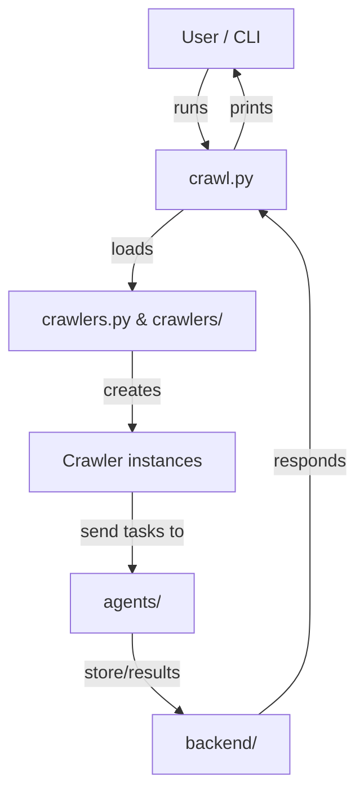
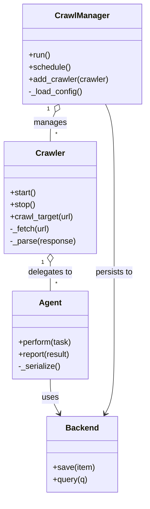

# Diagram: partview_core/partview_service/config/config.dev.yml

> Auto-generated by Obscura crawlers

## Diagram 1

### SVG

<svg id="container" width="326.46875" xmlns="http://www.w3.org/2000/svg" class="flowchart" height="710" viewBox="0 0 326.46875 710" role="graphics-document document" aria-roledescription="flowchart-v2"><g><marker id="container_flowchart-v2-pointEnd" class="marker flowchart-v2" viewBox="0 0 10 10" refX="5" refY="5" markerUnits="userSpaceOnUse" markerWidth="8" markerHeight="8" orient="auto"><path d="M 0 0 L 10 5 L 0 10 z" class="arrowMarkerPath" style="stroke-width: 1; stroke-dasharray: 1, 0;"></path></marker><marker id="container_flowchart-v2-pointStart" class="marker flowchart-v2" viewBox="0 0 10 10" refX="4.5" refY="5" markerUnits="userSpaceOnUse" markerWidth="8" markerHeight="8" orient="auto"><path d="M 0 5 L 10 10 L 10 0 z" class="arrowMarkerPath" style="stroke-width: 1; stroke-dasharray: 1, 0;"></path></marker><marker id="container_flowchart-v2-circleEnd" class="marker flowchart-v2" viewBox="0 0 10 10" refX="11" refY="5" markerUnits="userSpaceOnUse" markerWidth="11" markerHeight="11" orient="auto"><circle cx="5" cy="5" r="5" class="arrowMarkerPath" style="stroke-width: 1; stroke-dasharray: 1, 0;"></circle></marker><marker id="container_flowchart-v2-circleStart" class="marker flowchart-v2" viewBox="0 0 10 10" refX="-1" refY="5" markerUnits="userSpaceOnUse" markerWidth="11" markerHeight="11" orient="auto"><circle cx="5" cy="5" r="5" class="arrowMarkerPath" style="stroke-width: 1; stroke-dasharray: 1, 0;"></circle></marker><marker id="container_flowchart-v2-crossEnd" class="marker cross flowchart-v2" viewBox="0 0 11 11" refX="12" refY="5.2" markerUnits="userSpaceOnUse" markerWidth="11" markerHeight="11" orient="auto"><path d="M 1,1 l 9,9 M 10,1 l -9,9" class="arrowMarkerPath" style="stroke-width: 2; stroke-dasharray: 1, 0;"></path></marker><marker id="container_flowchart-v2-crossStart" class="marker cross flowchart-v2" viewBox="0 0 11 11" refX="-1" refY="5.2" markerUnits="userSpaceOnUse" markerWidth="11" markerHeight="11" orient="auto"><path d="M 1,1 l 9,9 M 10,1 l -9,9" class="arrowMarkerPath" style="stroke-width: 2; stroke-dasharray: 1, 0;"></path></marker><g class="root"><g class="clusters"></g><g class="edgePaths"><path d="M191.751,62L188.977,68.167C186.203,74.333,180.654,86.667,180.381,98.392C180.107,110.117,185.109,121.235,187.609,126.793L190.11,132.352" id="L_U_CrawlPy_0" class="edge-thickness-normal edge-pattern-solid edge-thickness-normal edge-pattern-solid flowchart-link" style=";" data-edge="true" data-et="edge" data-id="L_U_CrawlPy_0" data-points="W3sieCI6MTkxLjc1MTQwMzgwODU5Mzc1LCJ5Ijo2Mn0seyJ4IjoxNzUuMTA1NDY4NzUsInkiOjk5fSx7IngiOjE5MS43NTE0MDM4MDg1OTM3NSwieSI6MTM2fV0=" marker-end="url(#container_flowchart-v2-pointEnd)"></path><path d="M169.73,190L161.926,196.167C154.122,202.333,138.514,214.667,130.71,226.333C122.906,238,122.906,249,122.906,254.5L122.906,260" id="L_CrawlPy_CrawlersModule_0" class="edge-thickness-normal edge-pattern-solid edge-thickness-normal edge-pattern-solid flowchart-link" style=";" data-edge="true" data-et="edge" data-id="L_CrawlPy_CrawlersModule_0" data-points="W3sieCI6MTY5LjcyOTg1ODM5ODQzNzUsInkiOjE5MH0seyJ4IjoxMjIuOTA2MjUsInkiOjIyN30seyJ4IjoxMjIuOTA2MjUsInkiOjI2NH1d" marker-end="url(#container_flowchart-v2-pointEnd)"></path><path d="M122.906,318L122.906,324.167C122.906,330.333,122.906,342.667,122.906,354.333C122.906,366,122.906,377,122.906,382.5L122.906,388" id="L_CrawlersModule_CrawlerInstances_0" class="edge-thickness-normal edge-pattern-solid edge-thickness-normal edge-pattern-solid flowchart-link" style=";" data-edge="true" data-et="edge" data-id="L_CrawlersModule_CrawlerInstances_0" data-points="W3sieCI6MTIyLjkwNjI1LCJ5IjozMTh9LHsieCI6MTIyLjkwNjI1LCJ5IjozNTV9LHsieCI6MTIyLjkwNjI1LCJ5IjozOTJ9XQ==" marker-end="url(#container_flowchart-v2-pointEnd)"></path><path d="M122.906,446L122.906,452.167C122.906,458.333,122.906,470.667,122.906,482.333C122.906,494,122.906,505,122.906,510.5L122.906,516" id="L_CrawlerInstances_Agents_0" class="edge-thickness-normal edge-pattern-solid edge-thickness-normal edge-pattern-solid flowchart-link" style=";" data-edge="true" data-et="edge" data-id="L_CrawlerInstances_Agents_0" data-points="W3sieCI6MTIyLjkwNjI1LCJ5Ijo0NDZ9LHsieCI6MTIyLjkwNjI1LCJ5Ijo0ODN9LHsieCI6MTIyLjkwNjI1LCJ5Ijo1MjB9XQ==" marker-end="url(#container_flowchart-v2-pointEnd)"></path><path d="M122.906,574L122.906,580.167C122.906,586.333,122.906,598.667,130.187,610.587C137.468,622.507,152.03,634.013,159.311,639.767L166.591,645.52" id="L_Agents_Backend_0" class="edge-thickness-normal edge-pattern-solid edge-thickness-normal edge-pattern-solid flowchart-link" style=";" data-edge="true" data-et="edge" data-id="L_Agents_Backend_0" data-points="W3sieCI6MTIyLjkwNjI1LCJ5Ijo1NzR9LHsieCI6MTIyLjkwNjI1LCJ5Ijo2MTF9LHsieCI6MTY5LjcyOTg1ODM5ODQzNzUsInkiOjY0OH1d" marker-end="url(#container_flowchart-v2-pointEnd)"></path><path d="M238.067,648L245.871,641.833C253.675,635.667,269.283,623.333,277.087,606.5C284.891,589.667,284.891,568.333,284.891,547C284.891,525.667,284.891,504.333,284.891,483C284.891,461.667,284.891,440.333,284.891,419C284.891,397.667,284.891,376.333,284.891,355C284.891,333.667,284.891,312.333,284.891,291C284.891,269.667,284.891,248.333,277.61,231.913C270.329,215.493,255.767,203.987,248.486,198.233L241.205,192.48" id="L_Backend_CrawlPy_0" class="edge-thickness-normal edge-pattern-solid edge-thickness-normal edge-pattern-solid flowchart-link" style=";" data-edge="true" data-et="edge" data-id="L_Backend_CrawlPy_0" data-points="W3sieCI6MjM4LjA2NzAxNjYwMTU2MjUsInkiOjY0OH0seyJ4IjoyODQuODkwNjI1LCJ5Ijo2MTF9LHsieCI6Mjg0Ljg5MDYyNSwieSI6NTQ3fSx7IngiOjI4NC44OTA2MjUsInkiOjQ4M30seyJ4IjoyODQuODkwNjI1LCJ5Ijo0MTl9LHsieCI6Mjg0Ljg5MDYyNSwieSI6MzU1fSx7IngiOjI4NC44OTA2MjUsInkiOjI5MX0seyJ4IjoyODQuODkwNjI1LCJ5IjoyMjd9LHsieCI6MjM4LjA2NzAxNjYwMTU2MjUsInkiOjE5MH1d" marker-end="url(#container_flowchart-v2-pointEnd)"></path><path d="M216.045,136L218.82,129.833C221.594,123.667,227.143,111.333,227.416,99.608C227.69,87.883,222.688,76.765,220.187,71.207L217.687,65.648" id="L_CrawlPy_U_0" class="edge-thickness-normal edge-pattern-solid edge-thickness-normal edge-pattern-solid flowchart-link" style=";" data-edge="true" data-et="edge" data-id="L_CrawlPy_U_0" data-points="W3sieCI6MjE2LjA0NTQ3MTE5MTQwNjI1LCJ5IjoxMzZ9LHsieCI6MjMyLjY5MTQwNjI1LCJ5Ijo5OX0seyJ4IjoyMTYuMDQ1NDcxMTkxNDA2MjUsInkiOjYyfV0=" marker-end="url(#container_flowchart-v2-pointEnd)"></path></g><g class="edgeLabels"><g class="edgeLabel" transform="translate(175.10546875, 99)"><g class="label" data-id="L_U_CrawlPy_0" transform="translate(-16.171875, -12)"><foreignObject width="32.34375" height="24">

runs

</foreignObject></g></g><g class="edgeLabel" transform="translate(122.90625, 227)"><g class="label" data-id="L_CrawlPy_CrawlersModule_0" transform="translate(-19.7734375, -12)"><foreignObject width="39.546875" height="24">

loads

</foreignObject></g></g><g class="edgeLabel" transform="translate(122.90625, 355)"><g class="label" data-id="L_CrawlersModule_CrawlerInstances_0" transform="translate(-26.171875, -12)"><foreignObject width="52.34375" height="24">

creates

</foreignObject></g></g><g class="edgeLabel" transform="translate(122.90625, 483)"><g class="label" data-id="L_CrawlerInstances_Agents_0" transform="translate(-47.8828125, -12)"><foreignObject width="95.765625" height="24">

send tasks to

</foreignObject></g></g><g class="edgeLabel" transform="translate(122.90625, 611)"><g class="label" data-id="L_Agents_Backend_0" transform="translate(-46.875, -12)"><foreignObject width="93.75" height="24">

store/results

</foreignObject></g></g><g class="edgeLabel" transform="translate(284.890625, 419)"><g class="label" data-id="L_Backend_CrawlPy_0" transform="translate(-33.578125, -12)"><foreignObject width="67.15625" height="24">

responds

</foreignObject></g></g><g class="edgeLabel" transform="translate(232.69140625, 99)"><g class="label" data-id="L_CrawlPy_U_0" transform="translate(-21.4140625, -12)"><foreignObject width="42.828125" height="24">

prints

</foreignObject></g></g></g><g class="nodes"><g class="node default" id="flowchart-U-0" transform="translate(203.8984375, 35)"><rect class="basic label-container" style="" x="-65.671875" y="-27" width="131.34375" height="54"></rect><g class="label" style="" transform="translate(-35.671875, -12)"><rect></rect><foreignObject width="71.34375" height="24">

User / CLI

</foreignObject></g></g><g class="node default" id="flowchart-CrawlPy-1" transform="translate(203.8984375, 163)"><rect class="basic label-container" style="" x="-59.6328125" y="-27" width="119.265625" height="54"></rect><g class="label" style="" transform="translate(-29.6328125, -12)"><rect></rect><foreignObject width="59.265625" height="24">

crawl.py

</foreignObject></g></g><g class="node default" id="flowchart-CrawlersModule-3" transform="translate(122.90625, 291)"><rect class="basic label-container" style="" x="-114.90625" y="-27" width="229.8125" height="54"></rect><g class="label" style="" transform="translate(-84.90625, -12)"><rect></rect><foreignObject width="169.8125" height="24">

crawlers.py &amp; crawlers/

</foreignObject></g></g><g class="node default" id="flowchart-CrawlerInstances-5" transform="translate(122.90625, 419)"><rect class="basic label-container" style="" x="-93.40625" y="-27" width="186.8125" height="54"></rect><g class="label" style="" transform="translate(-63.40625, -12)"><rect></rect><foreignObject width="126.8125" height="24">

Crawler instances

</foreignObject></g></g><g class="node default" id="flowchart-Agents-7" transform="translate(122.90625, 547)"><rect class="basic label-container" style="" x="-58.140625" y="-27" width="116.28125" height="54"></rect><g class="label" style="" transform="translate(-28.140625, -12)"><rect></rect><foreignObject width="56.28125" height="24">

agents/

</foreignObject></g></g><g class="node default" id="flowchart-Backend-9" transform="translate(203.8984375, 675)"><rect class="basic label-container" style="" x="-64.8671875" y="-27" width="129.734375" height="54"></rect><g class="label" style="" transform="translate(-34.8671875, -12)"><rect></rect><foreignObject width="69.734375" height="24">

backend/

</foreignObject></g></g></g></g></g></svg>

## Diagram 2

### SVG

<svg id="container" width="287.69921875" xmlns="http://www.w3.org/2000/svg" class="classDiagram" height="982" viewBox="0 0 287.69921875 982" role="graphics-document document" aria-roledescription="class"><g><defs><marker id="container_class-aggregationStart" class="marker aggregation class" refX="18" refY="7" markerWidth="190" markerHeight="240" orient="auto"><path d="M 18,7 L9,13 L1,7 L9,1 Z"></path></marker></defs><defs><marker id="container_class-aggregationEnd" class="marker aggregation class" refX="1" refY="7" markerWidth="20" markerHeight="28" orient="auto"><path d="M 18,7 L9,13 L1,7 L9,1 Z"></path></marker></defs><defs><marker id="container_class-extensionStart" class="marker extension class" refX="18" refY="7" markerWidth="190" markerHeight="240" orient="auto"><path d="M 1,7 L18,13 V 1 Z"></path></marker></defs><defs><marker id="container_class-extensionEnd" class="marker extension class" refX="1" refY="7" markerWidth="20" markerHeight="28" orient="auto"><path d="M 1,1 V 13 L18,7 Z"></path></marker></defs><defs><marker id="container_class-compositionStart" class="marker composition class" refX="18" refY="7" markerWidth="190" markerHeight="240" orient="auto"><path d="M 18,7 L9,13 L1,7 L9,1 Z"></path></marker></defs><defs><marker id="container_class-compositionEnd" class="marker composition class" refX="1" refY="7" markerWidth="20" markerHeight="28" orient="auto"><path d="M 18,7 L9,13 L1,7 L9,1 Z"></path></marker></defs><defs><marker id="container_class-dependencyStart" class="marker dependency class" refX="6" refY="7" markerWidth="190" markerHeight="240" orient="auto"><path d="M 5,7 L9,13 L1,7 L9,1 Z"></path></marker></defs><defs><marker id="container_class-dependencyEnd" class="marker dependency class" refX="13" refY="7" markerWidth="20" markerHeight="28" orient="auto"><path d="M 18,7 L9,13 L14,7 L9,1 Z"></path></marker></defs><defs><marker id="container_class-lollipopStart" class="marker lollipop class" refX="13" refY="7" markerWidth="190" markerHeight="240" orient="auto"><circle stroke="black" fill="transparent" cx="7" cy="7" r="6"></circle></marker></defs><defs><marker id="container_class-lollipopEnd" class="marker lollipop class" refX="1" refY="7" markerWidth="190" markerHeight="240" orient="auto"><circle stroke="black" fill="transparent" cx="7" cy="7" r="6"></circle></marker></defs><g class="root"><g class="clusters"></g><g class="edgePaths"><path d="M108.932,221.651L107.283,225.209C105.634,228.768,102.337,235.884,100.688,245.609C99.039,255.333,99.039,267.667,99.039,273.833L99.039,280" id="id_CrawlManager_Crawler_1" class="edge-thickness-normal edge-pattern-solid relation" style=";;;" data-edge="true" data-et="edge" data-id="id_CrawlManager_Crawler_1" data-points="W3sieCI6MTE2LjE4NDA4MjAzMTI1LCJ5IjoyMDZ9LHsieCI6OTkuMDM5MDYyNSwieSI6MjQzfSx7IngiOjk5LjAzOTA2MjUsInkiOjI4MH1d" marker-start="url(#container_class-aggregationStart)"></path><path d="M99.039,519.25L99.039,522.542C99.039,525.833,99.039,532.417,99.039,541.875C99.039,551.333,99.039,563.667,99.039,569.833L99.039,576" id="id_Crawler_Agent_2" class="edge-thickness-normal edge-pattern-solid relation" style=";;;" data-edge="true" data-et="edge" data-id="id_Crawler_Agent_2" data-points="W3sieCI6OTkuMDM5MDYyNSwieSI6NTAyfSx7IngiOjk5LjAzOTA2MjUsInkiOjUzOX0seyJ4Ijo5OS4wMzkwNjI1LCJ5Ijo1NzZ9XQ==" marker-start="url(#container_class-aggregationStart)"></path><path d="M99.039,750L99.039,756.167C99.039,762.333,99.039,774.667,102.019,786.128C104.998,797.59,110.957,808.181,113.936,813.476L116.916,818.771" id="id_Agent_Backend_3" class="edge-thickness-normal edge-pattern-solid relation" style=";;;" data-edge="true" data-et="edge" data-id="id_Agent_Backend_3" data-points="W3sieCI6OTkuMDM5MDYyNSwieSI6NzUwfSx7IngiOjk5LjAzOTA2MjUsInkiOjc4N30seyJ4IjoxMTkuODU4MDE0Nzg3OTQ2NDMsInkiOjgyNH1d" marker-end="url(#container_class-dependencyEnd)"></path><path d="M207.933,206L210.791,212.167C213.648,218.333,219.363,230.667,222.221,261.5C225.078,292.333,225.078,341.667,225.078,391C225.078,440.333,225.078,489.667,225.078,535C225.078,580.333,225.078,621.667,225.078,663C225.078,704.333,225.078,745.667,222.099,771.628C219.119,797.59,213.16,808.181,210.181,813.476L207.201,818.771" id="id_CrawlManager_Backend_4" class="edge-thickness-normal edge-pattern-solid relation" style=";;;" data-edge="true" data-et="edge" data-id="id_CrawlManager_Backend_4" data-points="W3sieCI6MjA3LjkzMzEwNTQ2ODc1LCJ5IjoyMDZ9LHsieCI6MjI1LjA3ODEyNSwieSI6MjQzfSx7IngiOjIyNS4wNzgxMjUsInkiOjM5MX0seyJ4IjoyMjUuMDc4MTI1LCJ5Ijo1Mzl9LHsieCI6MjI1LjA3ODEyNSwieSI6NjYzfSx7IngiOjIyNS4wNzgxMjUsInkiOjc4N30seyJ4IjoyMDQuMjU5MTcyNzEyMDUzNTYsInkiOjgyNH1d" marker-end="url(#container_class-dependencyEnd)"></path></g><g class="edgeLabels"><g class="edgeLabel" transform="translate(99.0390625, 243)"><g class="label" data-id="id_CrawlManager_Crawler_1" transform="translate(-32.296875, -12)"><foreignObject width="64.59375" height="24">

manages

</foreignObject></g></g><g class="edgeLabel" transform="translate(99.0390625, 539)"><g class="label" data-id="id_Crawler_Agent_2" transform="translate(-44.59375, -12)"><foreignObject width="89.1875" height="24">

delegates to

</foreignObject></g></g><g class="edgeLabel" transform="translate(99.0390625, 787)"><g class="label" data-id="id_Agent_Backend_3" transform="translate(-16.4921875, -12)"><foreignObject width="32.984375" height="24">

uses

</foreignObject></g></g><g class="edgeLabel" transform="translate(225.078125, 539)"><g class="label" data-id="id_CrawlManager_Backend_4" transform="translate(-37.9921875, -12)"><foreignObject width="75.984375" height="24">

persists to

</foreignObject></g></g><g class="edgeTerminals" transform="translate(95.21663682810873, 215.5716342272829)"><g class="inner" transform="translate(0, 0)"><foreignObject style="width: 9px; height: 12px;">
1
</foreignObject></g></g><g class="edgeTerminals" transform="translate(84.03906125000005, 519.4999989285715)"><g class="inner" transform="translate(0, 0)"><foreignObject style="width: 9px; height: 12px;">
1
</foreignObject></g></g><g class="edgeTerminals" transform="translate(109.03906124999996, 257.4999989285714)"><g class="inner" transform="translate(0, 0)"></g><foreignObject style="width: 9px; height: 12px;">
*
</foreignObject></g><g class="edgeTerminals" transform="translate(109.03906124999996, 553.4999989285715)"><g class="inner" transform="translate(0, 0)"></g><foreignObject style="width: 9px; height: 12px;">
*
</foreignObject></g></g><g class="nodes"><g class="node default" id="classId-Crawler-0" transform="translate(99.0390625, 391)"><g class="basic label-container"><path d="M-91.0390625 -111 L91.0390625 -111 L91.0390625 111 L-91.0390625 111" stroke="none" stroke-width="0" fill="#ECECFF" style=""></path><path d="M-91.0390625 -111 C-45.054941764587014 -111, 0.9291789708259728 -111, 91.0390625 -111 M-91.0390625 -111 C-41.6792287640872 -111, 7.680604971825602 -111, 91.0390625 -111 M91.0390625 -111 C91.0390625 -31.097517868779093, 91.0390625 48.804964262441814, 91.0390625 111 M91.0390625 -111 C91.0390625 -23.344906184021127, 91.0390625 64.31018763195775, 91.0390625 111 M91.0390625 111 C48.30457232953199 111, 5.570082159063986 111, -91.0390625 111 M91.0390625 111 C19.382434476487433 111, -52.274193547025135 111, -91.0390625 111 M-91.0390625 111 C-91.0390625 43.56558703468738, -91.0390625 -23.868825930625235, -91.0390625 -111 M-91.0390625 111 C-91.0390625 26.61271078279661, -91.0390625 -57.77457843440678, -91.0390625 -111" stroke="#9370DB" stroke-width="1.3" fill="none" stroke-dasharray="0 0" style=""></path></g><g class="annotation-group text" transform="translate(0, -87)"></g><g class="label-group text" transform="translate(-27.734375, -87)"><g class="label" style="font-weight: bolder" transform="translate(0,-12)"><foreignObject width="55.46875" height="24">

Crawler

</foreignObject></g></g><g class="members-group text" transform="translate(-79.0390625, -39)"></g><g class="methods-group text" transform="translate(-79.0390625, -9)"><g class="label" style="" transform="translate(0,-12)"><foreignObject width="52.15625" height="24">

+start()

</foreignObject></g><g class="label" style="" transform="translate(0,12)"><foreignObject width="50.21875" height="24">

+stop()

</foreignObject></g><g class="label" style="" transform="translate(0,36)"><foreignObject width="127.453125" height="24">

+crawl_target(url)

</foreignObject></g><g class="label" style="" transform="translate(0,60)"><foreignObject width="80.203125" height="24">

-_fetch(url)

</foreignObject></g><g class="label" style="" transform="translate(0,84)"><foreignObject width="130.34375" height="24">

-_parse(response)

</foreignObject></g></g><g class="divider" style=""><path d="M-91.0390625 -63 C-30.138973124778943 -63, 30.761116250442115 -63, 91.0390625 -63 M-91.0390625 -63 C-19.612663020072517 -63, 51.813736459854965 -63, 91.0390625 -63" stroke="#9370DB" stroke-width="1.3" fill="none" stroke-dasharray="0 0" style=""></path></g><g class="divider" style=""><path d="M-91.0390625 -39 C-22.4565693405668 -39, 46.1259238188664 -39, 91.0390625 -39 M-91.0390625 -39 C-30.4467808056232 -39, 30.145500888753602 -39, 91.0390625 -39" stroke="#9370DB" stroke-width="1.3" fill="none" stroke-dasharray="0 0" style=""></path></g></g><g class="node default" id="classId-CrawlManager-1" transform="translate(162.05859375, 107)"><g class="basic label-container"><path d="M-117.640625 -99 L117.640625 -99 L117.640625 99 L-117.640625 99" stroke="none" stroke-width="0" fill="#ECECFF" style=""></path><path d="M-117.640625 -99 C-41.90471648304454 -99, 33.831192033910924 -99, 117.640625 -99 M-117.640625 -99 C-25.37777768844387 -99, 66.88506962311226 -99, 117.640625 -99 M117.640625 -99 C117.640625 -40.245988984231225, 117.640625 18.50802203153755, 117.640625 99 M117.640625 -99 C117.640625 -37.055913543977, 117.640625 24.888172912046002, 117.640625 99 M117.640625 99 C52.38054446023547 99, -12.87953607952906 99, -117.640625 99 M117.640625 99 C64.35197663093749 99, 11.063328261874986 99, -117.640625 99 M-117.640625 99 C-117.640625 36.711208182380304, -117.640625 -25.577583635239392, -117.640625 -99 M-117.640625 99 C-117.640625 22.51890965189061, -117.640625 -53.96218069621878, -117.640625 -99" stroke="#9370DB" stroke-width="1.3" fill="none" stroke-dasharray="0 0" style=""></path></g><g class="annotation-group text" transform="translate(0, -75)"></g><g class="label-group text" transform="translate(-51.59375, -75)"><g class="label" style="font-weight: bolder" transform="translate(0,-12)"><foreignObject width="103.1875" height="24">

CrawlManager

</foreignObject></g></g><g class="members-group text" transform="translate(-105.640625, -27)"></g><g class="methods-group text" transform="translate(-105.640625, 3)"><g class="label" style="" transform="translate(0,-12)"><foreignObject width="43.21875" height="24">

+run()

</foreignObject></g><g class="label" style="" transform="translate(0,12)"><foreignObject width="83.78125" height="24">

+schedule()

</foreignObject></g><g class="label" style="" transform="translate(0,36)"><foreignObject width="159.6875" height="24">

+add_crawler(crawler)

</foreignObject></g><g class="label" style="" transform="translate(0,60)"><foreignObject width="107.34375" height="24">

-_load_config()

</foreignObject></g></g><g class="divider" style=""><path d="M-117.640625 -51 C-24.02137974214304 -51, 69.59786551571392 -51, 117.640625 -51 M-117.640625 -51 C-69.9169676595256 -51, -22.193310319051207 -51, 117.640625 -51" stroke="#9370DB" stroke-width="1.3" fill="none" stroke-dasharray="0 0" style=""></path></g><g class="divider" style=""><path d="M-117.640625 -27 C-56.27156825850533 -27, 5.097488482989334 -27, 117.640625 -27 M-117.640625 -27 C-52.92645549714325 -27, 11.787714005713497 -27, 117.640625 -27" stroke="#9370DB" stroke-width="1.3" fill="none" stroke-dasharray="0 0" style=""></path></g></g><g class="node default" id="classId-Agent-2" transform="translate(99.0390625, 663)"><g class="basic label-container"><path d="M-76.0703125 -87 L76.0703125 -87 L76.0703125 87 L-76.0703125 87" stroke="none" stroke-width="0" fill="#ECECFF" style=""></path><path d="M-76.0703125 -87 C-34.33432613058837 -87, 7.401660238823254 -87, 76.0703125 -87 M-76.0703125 -87 C-31.725077833626116 -87, 12.620156832747767 -87, 76.0703125 -87 M76.0703125 -87 C76.0703125 -30.727736722048654, 76.0703125 25.544526555902692, 76.0703125 87 M76.0703125 -87 C76.0703125 -20.01497836381982, 76.0703125 46.97004327236036, 76.0703125 87 M76.0703125 87 C30.16157747532842 87, -15.747157549343157 87, -76.0703125 87 M76.0703125 87 C31.741704208529335 87, -12.58690408294133 87, -76.0703125 87 M-76.0703125 87 C-76.0703125 48.211699536812624, -76.0703125 9.423399073625248, -76.0703125 -87 M-76.0703125 87 C-76.0703125 43.147528346650105, -76.0703125 -0.7049433066997892, -76.0703125 -87" stroke="#9370DB" stroke-width="1.3" fill="none" stroke-dasharray="0 0" style=""></path></g><g class="annotation-group text" transform="translate(0, -63)"></g><g class="label-group text" transform="translate(-21.078125, -63)"><g class="label" style="font-weight: bolder" transform="translate(0,-12)"><foreignObject width="42.15625" height="24">

Agent

</foreignObject></g></g><g class="members-group text" transform="translate(-64.0703125, -15)"></g><g class="methods-group text" transform="translate(-64.0703125, 15)"><g class="label" style="" transform="translate(0,-12)"><foreignObject width="107.0625" height="24">

+perform(task)

</foreignObject></g><g class="label" style="" transform="translate(0,12)"><foreignObject width="105.234375" height="24">

+report(result)

</foreignObject></g><g class="label" style="" transform="translate(0,36)"><foreignObject width="84.09375" height="24">

-_serialize()

</foreignObject></g></g><g class="divider" style=""><path d="M-76.0703125 -39 C-39.976576232472226 -39, -3.882839964944452 -39, 76.0703125 -39 M-76.0703125 -39 C-15.34824647687364 -39, 45.37381954625272 -39, 76.0703125 -39" stroke="#9370DB" stroke-width="1.3" fill="none" stroke-dasharray="0 0" style=""></path></g><g class="divider" style=""><path d="M-76.0703125 -15 C-29.18961432433266 -15, 17.69108385133468 -15, 76.0703125 -15 M-76.0703125 -15 C-24.438487059807642 -15, 27.193338380384716 -15, 76.0703125 -15" stroke="#9370DB" stroke-width="1.3" fill="none" stroke-dasharray="0 0" style=""></path></g></g><g class="node default" id="classId-Backend-3" transform="translate(162.05859375, 899)"><g class="basic label-container"><path d="M-69.21875 -75 L69.21875 -75 L69.21875 75 L-69.21875 75" stroke="none" stroke-width="0" fill="#ECECFF" style=""></path><path d="M-69.21875 -75 C-15.382378748958217 -75, 38.453992502083565 -75, 69.21875 -75 M-69.21875 -75 C-21.73506390159119 -75, 25.74862219681762 -75, 69.21875 -75 M69.21875 -75 C69.21875 -25.731207849841276, 69.21875 23.537584300317448, 69.21875 75 M69.21875 -75 C69.21875 -15.609635462038668, 69.21875 43.780729075922665, 69.21875 75 M69.21875 75 C18.544759435531148 75, -32.129231128937704 75, -69.21875 75 M69.21875 75 C14.305738603259812 75, -40.60727279348038 75, -69.21875 75 M-69.21875 75 C-69.21875 24.640821140421977, -69.21875 -25.718357719156046, -69.21875 -75 M-69.21875 75 C-69.21875 26.039740393656942, -69.21875 -22.920519212686116, -69.21875 -75" stroke="#9370DB" stroke-width="1.3" fill="none" stroke-dasharray="0 0" style=""></path></g><g class="annotation-group text" transform="translate(0, -51)"></g><g class="label-group text" transform="translate(-31.296875, -51)"><g class="label" style="font-weight: bolder" transform="translate(0,-12)"><foreignObject width="62.59375" height="24">

Backend

</foreignObject></g></g><g class="members-group text" transform="translate(-57.21875, -3)"></g><g class="methods-group text" transform="translate(-57.21875, 27)"><g class="label" style="" transform="translate(0,-12)"><foreignObject width="83.140625" height="24">

+save(item)

</foreignObject></g><g class="label" style="" transform="translate(0,12)"><foreignObject width="69.578125" height="24">

+query(q)

</foreignObject></g></g><g class="divider" style=""><path d="M-69.21875 -27 C-15.800699149580971 -27, 37.61735170083806 -27, 69.21875 -27 M-69.21875 -27 C-17.804337882902672 -27, 33.610074234194656 -27, 69.21875 -27" stroke="#9370DB" stroke-width="1.3" fill="none" stroke-dasharray="0 0" style=""></path></g><g class="divider" style=""><path d="M-69.21875 -3 C-15.748394861864163 -3, 37.72196027627167 -3, 69.21875 -3 M-69.21875 -3 C-31.99234689745068 -3, 5.234056205098639 -3, 69.21875 -3" stroke="#9370DB" stroke-width="1.3" fill="none" stroke-dasharray="0 0" style=""></path></g></g></g></g></g></svg>
