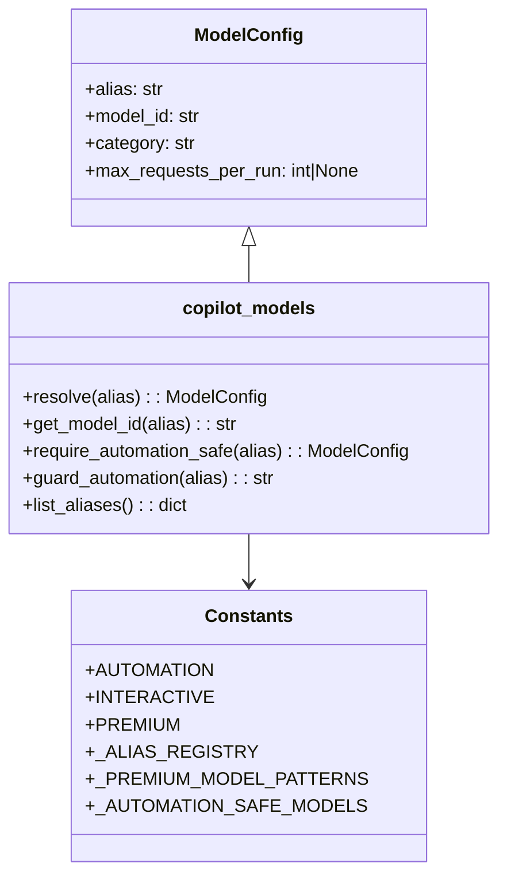

# Diagram: partview_core/partview_service/config/config.dev2.yml


> Auto-generated by Obscura crawlers

## Diagram 1



### SVG

<svg id="container" width="441.1796875" xmlns="http://www.w3.org/2000/svg" class="classDiagram" height="770" viewBox="0 0 441.1796875 770" role="graphics-document document" aria-roledescription="class"><style>#container{font-family:"trebuchet ms",verdana,arial,sans-serif;font-size:16px;fill:#333;}@keyframes edge-animation-frame{from{stroke-dashoffset:0;}}@keyframes dash{to{stroke-dashoffset:0;}}#container .edge-animation-slow{stroke-dasharray:9,5!important;stroke-dashoffset:900;animation:dash 50s linear infinite;stroke-linecap:round;}#container .edge-animation-fast{stroke-dasharray:9,5!important;stroke-dashoffset:900;animation:dash 20s linear infinite;stroke-linecap:round;}#container .error-icon{fill:#552222;}#container .error-text{fill:#552222;stroke:#552222;}#container .edge-thickness-normal{stroke-width:1px;}#container .edge-thickness-thick{stroke-width:3.5px;}#container .edge-pattern-solid{stroke-dasharray:0;}#container .edge-thickness-invisible{stroke-width:0;fill:none;}#container .edge-pattern-dashed{stroke-dasharray:3;}#container .edge-pattern-dotted{stroke-dasharray:2;}#container .marker{fill:#333333;stroke:#333333;}#container .marker.cross{stroke:#333333;}#container svg{font-family:"trebuchet ms",verdana,arial,sans-serif;font-size:16px;}#container p{margin:0;}#container g.classGroup text{fill:#9370DB;stroke:none;font-family:"trebuchet ms",verdana,arial,sans-serif;font-size:10px;}#container g.classGroup text .title{font-weight:bolder;}#container .nodeLabel,#container .edgeLabel{color:#131300;}#container .edgeLabel .label rect{fill:#ECECFF;}#container .label text{fill:#131300;}#container .labelBkg{background:#ECECFF;}#container .edgeLabel .label span{background:#ECECFF;}#container .classTitle{font-weight:bolder;}#container .node rect,#container .node circle,#container .node ellipse,#container .node polygon,#container .node path{fill:#ECECFF;stroke:#9370DB;stroke-width:1px;}#container .divider{stroke:#9370DB;stroke-width:1;}#container g.clickable{cursor:pointer;}#container g.classGroup rect{fill:#ECECFF;stroke:#9370DB;}#container g.classGroup line{stroke:#9370DB;stroke-width:1;}#container .classLabel .box{stroke:none;stroke-width:0;fill:#ECECFF;opacity:0.5;}#container .classLabel .label{fill:#9370DB;font-size:10px;}#container .relation{stroke:#333333;stroke-width:1;fill:none;}#container .dashed-line{stroke-dasharray:3;}#container .dotted-line{stroke-dasharray:1 2;}#container #compositionStart,#container .composition{fill:#333333!important;stroke:#333333!important;stroke-width:1;}#container #compositionEnd,#container .composition{fill:#333333!important;stroke:#333333!important;stroke-width:1;}#container #dependencyStart,#container .dependency{fill:#333333!important;stroke:#333333!important;stroke-width:1;}#container #dependencyStart,#container .dependency{fill:#333333!important;stroke:#333333!important;stroke-width:1;}#container #extensionStart,#container .extension{fill:transparent!important;stroke:#333333!important;stroke-width:1;}#container #extensionEnd,#container .extension{fill:transparent!important;stroke:#333333!important;stroke-width:1;}#container #aggregationStart,#container .aggregation{fill:transparent!important;stroke:#333333!important;stroke-width:1;}#container #aggregationEnd,#container .aggregation{fill:transparent!important;stroke:#333333!important;stroke-width:1;}#container #lollipopStart,#container .lollipop{fill:#ECECFF!important;stroke:#333333!important;stroke-width:1;}#container #lollipopEnd,#container .lollipop{fill:#ECECFF!important;stroke:#333333!important;stroke-width:1;}#container .edgeTerminals{font-size:11px;line-height:initial;}#container .classTitleText{text-anchor:middle;font-size:18px;fill:#333;}#container .label-icon{display:inline-block;height:1em;overflow:visible;vertical-align:-0.125em;}#container .node .label-icon path{fill:currentColor;stroke:revert;stroke-width:revert;}#container :root{--mermaid-font-family:"trebuchet ms",verdana,arial,sans-serif;}</style><g><defs><marker id="container_class-aggregationStart" class="marker aggregation class" refX="18" refY="7" markerWidth="190" markerHeight="240" orient="auto"><path d="M 18,7 L9,13 L1,7 L9,1 Z"></path></marker></defs><defs><marker id="container_class-aggregationEnd" class="marker aggregation class" refX="1" refY="7" markerWidth="20" markerHeight="28" orient="auto"><path d="M 18,7 L9,13 L1,7 L9,1 Z"></path></marker></defs><defs><marker id="container_class-extensionStart" class="marker extension class" refX="18" refY="7" markerWidth="190" markerHeight="240" orient="auto"><path d="M 1,7 L18,13 V 1 Z"></path></marker></defs><defs><marker id="container_class-extensionEnd" class="marker extension class" refX="1" refY="7" markerWidth="20" markerHeight="28" orient="auto"><path d="M 1,1 V 13 L18,7 Z"></path></marker></defs><defs><marker id="container_class-compositionStart" class="marker composition class" refX="18" refY="7" markerWidth="190" markerHeight="240" orient="auto"><path d="M 18,7 L9,13 L1,7 L9,1 Z"></path></marker></defs><defs><marker id="container_class-compositionEnd" class="marker composition class" refX="1" refY="7" markerWidth="20" markerHeight="28" orient="auto"><path d="M 18,7 L9,13 L1,7 L9,1 Z"></path></marker></defs><defs><marker id="container_class-dependencyStart" class="marker dependency class" refX="6" refY="7" markerWidth="190" markerHeight="240" orient="auto"><path d="M 5,7 L9,13 L1,7 L9,1 Z"></path></marker></defs><defs><marker id="container_class-dependencyEnd" class="marker dependency class" refX="13" refY="7" markerWidth="20" markerHeight="28" orient="auto"><path d="M 18,7 L9,13 L14,7 L9,1 Z"></path></marker></defs><defs><marker id="container_class-lollipopStart" class="marker lollipop class" refX="13" refY="7" markerWidth="190" markerHeight="240" orient="auto"><circle stroke="black" fill="transparent" cx="7" cy="7" r="6"></circle></marker></defs><defs><marker id="container_class-lollipopEnd" class="marker lollipop class" refX="1" refY="7" markerWidth="190" markerHeight="240" orient="auto"><circle stroke="black" fill="transparent" cx="7" cy="7" r="6"></circle></marker></defs><g class="root"><g class="clusters"></g><g class="edgePaths"><path d="M220.59,217.25L220.59,218.542C220.59,219.833,220.59,222.417,220.59,227.875C220.59,233.333,220.59,241.667,220.59,245.833L220.59,250" id="id_ModelConfig_copilot_models_1" class="edge-thickness-normal edge-pattern-solid relation" style=";;;" data-edge="true" data-et="edge" data-id="id_ModelConfig_copilot_models_1" data-points="W3sieCI6MjIwLjU4OTg0Mzc1LCJ5IjoyMDB9LHsieCI6MjIwLjU4OTg0Mzc1LCJ5IjoyMjV9LHsieCI6MjIwLjU4OTg0Mzc1LCJ5IjoyNTB9XQ==" marker-start="url(#container_class-extensionStart)"></path><path d="M220.59,472L220.59,476.167C220.59,480.333,220.59,488.667,220.59,496C220.59,503.333,220.59,509.667,220.59,512.833L220.59,516" id="id_copilot_models_Constants_2" class="edge-thickness-normal edge-pattern-solid relation" style=";;;" data-edge="true" data-et="edge" data-id="id_copilot_models_Constants_2" data-points="W3sieCI6MjIwLjU4OTg0Mzc1LCJ5Ijo0NzJ9LHsieCI6MjIwLjU4OTg0Mzc1LCJ5Ijo0OTd9LHsieCI6MjIwLjU4OTg0Mzc1LCJ5Ijo1MjJ9XQ==" marker-end="url(#container_class-dependencyEnd)"></path></g><g class="edgeLabels"><g class="edgeLabel"><g class="label" data-id="id_ModelConfig_copilot_models_1" transform="translate(0, 0)"><foreignObject width="0" height="0"><div xmlns="http://www.w3.org/1999/xhtml" class="labelBkg" style="display: table-cell; white-space: nowrap; line-height: 1.5; max-width: 200px; text-align: center;"><span class="edgeLabel"></span></div></foreignObject></g></g><g class="edgeLabel"><g class="label" data-id="id_copilot_models_Constants_2" transform="translate(0, 0)"><foreignObject width="0" height="0"><div xmlns="http://www.w3.org/1999/xhtml" class="labelBkg" style="display: table-cell; white-space: nowrap; line-height: 1.5; max-width: 200px; text-align: center;"><span class="edgeLabel"></span></div></foreignObject></g></g></g><g class="nodes"><g class="node default" id="classId-ModelConfig-0" transform="translate(220.58984375, 104)"><g class="basic label-container"><path d="M-157.7890625 -96 L157.7890625 -96 L157.7890625 96 L-157.7890625 96" stroke="none" stroke-width="0" fill="#ECECFF" style=""></path><path d="M-157.7890625 -96 C-94.4699247620745 -96, -31.15078702414901 -96, 157.7890625 -96 M-157.7890625 -96 C-71.18630056497643 -96, 15.41646137004713 -96, 157.7890625 -96 M157.7890625 -96 C157.7890625 -36.45557968313106, 157.7890625 23.088840633737874, 157.7890625 96 M157.7890625 -96 C157.7890625 -32.395796844724835, 157.7890625 31.20840631055033, 157.7890625 96 M157.7890625 96 C33.880970881718454 96, -90.02712073656309 96, -157.7890625 96 M157.7890625 96 C43.14953337039134 96, -71.48999575921732 96, -157.7890625 96 M-157.7890625 96 C-157.7890625 48.64382366406018, -157.7890625 1.2876473281203573, -157.7890625 -96 M-157.7890625 96 C-157.7890625 46.82162356263715, -157.7890625 -2.3567528747257, -157.7890625 -96" stroke="#9370DB" stroke-width="1.3" fill="none" stroke-dasharray="0 0" style=""></path></g><g class="annotation-group text" transform="translate(0, -72)"></g><g class="label-group text" transform="translate(-45.484375, -72)"><g class="label" style="font-weight: bolder" transform="translate(0,-12)"><foreignObject width="90.96875" height="24"><div xmlns="http://www.w3.org/1999/xhtml" style="display: table-cell; white-space: nowrap; line-height: 1.5; max-width: 140px; text-align: center;"><span class="nodeLabel markdown-node-label" style=""><p>ModelConfig</p></span></div></foreignObject></g></g><g class="members-group text" transform="translate(-145.7890625, -24)"><g class="label" style="" transform="translate(0,-12)"><foreignObject width="69.015625" height="24"><div xmlns="http://www.w3.org/1999/xhtml" style="display: table-cell; white-space: nowrap; line-height: 1.5; max-width: 127px; text-align: center;"><span class="nodeLabel markdown-node-label" style=""><p>+alias: str</p></span></div></foreignObject></g><g class="label" style="" transform="translate(0,12)"><foreignObject width="103.921875" height="24"><div xmlns="http://www.w3.org/1999/xhtml" style="display: table-cell; white-space: nowrap; line-height: 1.5; max-width: 162px; text-align: center;"><span class="nodeLabel markdown-node-label" style=""><p>+model_id: str</p></span></div></foreignObject></g><g class="label" style="" transform="translate(0,36)"><foreignObject width="97.46875" height="24"><div xmlns="http://www.w3.org/1999/xhtml" style="display: table-cell; white-space: nowrap; line-height: 1.5; max-width: 156px; text-align: center;"><span class="nodeLabel markdown-node-label" style=""><p>+category: str</p></span></div></foreignObject></g><g class="label" style="" transform="translate(0,60)"><foreignObject width="246.09375" height="24"><div xmlns="http://www.w3.org/1999/xhtml" style="display: table-cell; white-space: nowrap; line-height: 1.5; max-width: 303px; text-align: center;"><span class="nodeLabel markdown-node-label" style=""><p>+max_requests_per_run: int|None</p></span></div></foreignObject></g></g><g class="methods-group text" transform="translate(-145.7890625, 96)"></g><g class="divider" style=""><path d="M-157.7890625 -48 C-43.52885372986481 -48, 70.73135504027039 -48, 157.7890625 -48 M-157.7890625 -48 C-83.33514752047452 -48, -8.881232540949043 -48, 157.7890625 -48" stroke="#9370DB" stroke-width="1.3" fill="none" stroke-dasharray="0 0" style=""></path></g><g class="divider" style=""><path d="M-157.7890625 72 C-59.61287460749456 72, 38.56331328501088 72, 157.7890625 72 M-157.7890625 72 C-85.08319168469876 72, -12.377320869397522 72, 157.7890625 72" stroke="#9370DB" stroke-width="1.3" fill="none" stroke-dasharray="0 0" style=""></path></g></g><g class="node default" id="classId-copilot_models-1" transform="translate(220.58984375, 361)"><g class="basic label-container"><path d="M-212.58984375 -111 L212.58984375 -111 L212.58984375 111 L-212.58984375 111" stroke="none" stroke-width="0" fill="#ECECFF" style=""></path><path d="M-212.58984375 -111 C-83.69747376946808 -111, 45.19489621106385 -111, 212.58984375 -111 M-212.58984375 -111 C-105.22886233794247 -111, 2.132119074115053 -111, 212.58984375 -111 M212.58984375 -111 C212.58984375 -59.550034947728136, 212.58984375 -8.100069895456272, 212.58984375 111 M212.58984375 -111 C212.58984375 -44.63873418219649, 212.58984375 21.722531635607027, 212.58984375 111 M212.58984375 111 C82.72702191947846 111, -47.13579991104308 111, -212.58984375 111 M212.58984375 111 C68.1883029073698 111, -76.2132379352604 111, -212.58984375 111 M-212.58984375 111 C-212.58984375 36.540230893265786, -212.58984375 -37.91953821346843, -212.58984375 -111 M-212.58984375 111 C-212.58984375 61.34596433976176, -212.58984375 11.691928679523514, -212.58984375 -111" stroke="#9370DB" stroke-width="1.3" fill="none" stroke-dasharray="0 0" style=""></path></g><g class="annotation-group text" transform="translate(0, -87)"></g><g class="label-group text" transform="translate(-56.5234375, -87)"><g class="label" style="font-weight: bolder" transform="translate(0,-12)"><foreignObject width="113.046875" height="24"><div xmlns="http://www.w3.org/1999/xhtml" style="display: table-cell; white-space: nowrap; line-height: 1.5; max-width: 162px; text-align: center;"><span class="nodeLabel markdown-node-label" style=""><p>copilot_models</p></span></div></foreignObject></g></g><g class="members-group text" transform="translate(-200.58984375, -39)"></g><g class="methods-group text" transform="translate(-200.58984375, -9)"><g class="label" style="" transform="translate(0,-12)"><foreignObject width="214.453125" height="24"><div xmlns="http://www.w3.org/1999/xhtml" style="display: table-cell; white-space: nowrap; line-height: 1.5; max-width: 272px; text-align: center;"><span class="nodeLabel markdown-node-label" style=""><p>+resolve(alias) : : ModelConfig</p></span></div></foreignObject></g><g class="label" style="" transform="translate(0,12)"><foreignObject width="191.25" height="24"><div xmlns="http://www.w3.org/1999/xhtml" style="display: table-cell; white-space: nowrap; line-height: 1.5; max-width: 249px; text-align: center;"><span class="nodeLabel markdown-node-label" style=""><p>+get_model_id(alias) : : str</p></span></div></foreignObject></g><g class="label" style="" transform="translate(0,36)"><foreignObject width="344.65625" height="24"><div xmlns="http://www.w3.org/1999/xhtml" style="display: table-cell; white-space: nowrap; line-height: 1.5; max-width: 403px; text-align: center;"><span class="nodeLabel markdown-node-label" style=""><p>+require_automation_safe(alias) : : ModelConfig</p></span></div></foreignObject></g><g class="label" style="" transform="translate(0,60)"><foreignObject width="225.703125" height="24"><div xmlns="http://www.w3.org/1999/xhtml" style="display: table-cell; white-space: nowrap; line-height: 1.5; max-width: 284px; text-align: center;"><span class="nodeLabel markdown-node-label" style=""><p>+guard_automation(alias) : : str</p></span></div></foreignObject></g><g class="label" style="" transform="translate(0,84)"><foreignObject width="146.671875" height="24"><div xmlns="http://www.w3.org/1999/xhtml" style="display: table-cell; white-space: nowrap; line-height: 1.5; max-width: 204px; text-align: center;"><span class="nodeLabel markdown-node-label" style=""><p>+list_aliases() : : dict</p></span></div></foreignObject></g></g><g class="divider" style=""><path d="M-212.58984375 -63 C-104.3532358319759 -63, 3.8833720860482117 -63, 212.58984375 -63 M-212.58984375 -63 C-47.82424519639423 -63, 116.94135335721154 -63, 212.58984375 -63" stroke="#9370DB" stroke-width="1.3" fill="none" stroke-dasharray="0 0" style=""></path></g><g class="divider" style=""><path d="M-212.58984375 -39 C-104.22731908319602 -39, 4.135205583607956 -39, 212.58984375 -39 M-212.58984375 -39 C-73.34155261417567 -39, 65.90673852164866 -39, 212.58984375 -39" stroke="#9370DB" stroke-width="1.3" fill="none" stroke-dasharray="0 0" style=""></path></g></g><g class="node default" id="classId-Constants-2" transform="translate(220.58984375, 642)"><g class="basic label-container"><path d="M-140.64453125 -120 L140.64453125 -120 L140.64453125 120 L-140.64453125 120" stroke="none" stroke-width="0" fill="#ECECFF" style=""></path><path d="M-140.64453125 -120 C-28.99996719478625 -120, 82.6445968604275 -120, 140.64453125 -120 M-140.64453125 -120 C-43.28185791423435 -120, 54.0808154215313 -120, 140.64453125 -120 M140.64453125 -120 C140.64453125 -62.626710770084685, 140.64453125 -5.25342154016937, 140.64453125 120 M140.64453125 -120 C140.64453125 -41.597259324269345, 140.64453125 36.80548135146131, 140.64453125 120 M140.64453125 120 C82.41447839120963 120, 24.18442553241927 120, -140.64453125 120 M140.64453125 120 C75.08631478397598 120, 9.528098317951958 120, -140.64453125 120 M-140.64453125 120 C-140.64453125 41.47528056382269, -140.64453125 -37.049438872354614, -140.64453125 -120 M-140.64453125 120 C-140.64453125 25.35817316745107, -140.64453125 -69.28365366509786, -140.64453125 -120" stroke="#9370DB" stroke-width="1.3" fill="none" stroke-dasharray="0 0" style=""></path></g><g class="annotation-group text" transform="translate(0, -96)"></g><g class="label-group text" transform="translate(-36.5390625, -96)"><g class="label" style="font-weight: bolder" transform="translate(0,-12)"><foreignObject width="73.078125" height="24"><div xmlns="http://www.w3.org/1999/xhtml" style="display: table-cell; white-space: nowrap; line-height: 1.5; max-width: 122px; text-align: center;"><span class="nodeLabel markdown-node-label" style=""><p>Constants</p></span></div></foreignObject></g></g><g class="members-group text" transform="translate(-128.64453125, -48)"><g class="label" style="" transform="translate(0,-12)"><foreignObject width="101.90625" height="24"><div xmlns="http://www.w3.org/1999/xhtml" style="display: table-cell; white-space: nowrap; line-height: 1.5; max-width: 159px; text-align: center;"><span class="nodeLabel markdown-node-label" style=""><p>+AUTOMATION</p></span></div></foreignObject></g><g class="label" style="" transform="translate(0,12)"><foreignObject width="98.40625" height="24"><div xmlns="http://www.w3.org/1999/xhtml" style="display: table-cell; white-space: nowrap; line-height: 1.5; max-width: 156px; text-align: center;"><span class="nodeLabel markdown-node-label" style=""><p>+INTERACTIVE</p></span></div></foreignObject></g><g class="label" style="" transform="translate(0,36)"><foreignObject width="75.734375" height="24"><div xmlns="http://www.w3.org/1999/xhtml" style="display: table-cell; white-space: nowrap; line-height: 1.5; max-width: 133px; text-align: center;"><span class="nodeLabel markdown-node-label" style=""><p>+PREMIUM</p></span></div></foreignObject></g><g class="label" style="" transform="translate(0,60)"><foreignObject width="130.1875" height="24"><div xmlns="http://www.w3.org/1999/xhtml" style="display: table-cell; white-space: nowrap; line-height: 1.5; max-width: 188px; text-align: center;"><span class="nodeLabel markdown-node-label" style=""><p>+_ALIAS_REGISTRY</p></span></div></foreignObject></g><g class="label" style="" transform="translate(0,84)"><foreignObject width="220.75" height="24"><div xmlns="http://www.w3.org/1999/xhtml" style="display: table-cell; white-space: nowrap; line-height: 1.5; max-width: 278px; text-align: center;"><span class="nodeLabel markdown-node-label" style=""><p>+_PREMIUM_MODEL_PATTERNS</p></span></div></foreignObject></g><g class="label" style="" transform="translate(0,108)"><foreignObject width="218.328125" height="24"><div xmlns="http://www.w3.org/1999/xhtml" style="display: table-cell; white-space: nowrap; line-height: 1.5; max-width: 276px; text-align: center;"><span class="nodeLabel markdown-node-label" style=""><p>+_AUTOMATION_SAFE_MODELS</p></span></div></foreignObject></g></g><g class="methods-group text" transform="translate(-128.64453125, 120)"></g><g class="divider" style=""><path d="M-140.64453125 -72 C-62.33630666583073 -72, 15.971917918338534 -72, 140.64453125 -72 M-140.64453125 -72 C-50.245683736832106 -72, 40.15316377633579 -72, 140.64453125 -72" stroke="#9370DB" stroke-width="1.3" fill="none" stroke-dasharray="0 0" style=""></path></g><g class="divider" style=""><path d="M-140.64453125 96 C-71.93917309014685 96, -3.233814930293704 96, 140.64453125 96 M-140.64453125 96 C-72.05365336235886 96, -3.4627754747177164 96, 140.64453125 96" stroke="#9370DB" stroke-width="1.3" fill="none" stroke-dasharray="0 0" style=""></path></g></g></g></g></g></svg>

## Diagram 2

```mermaid
flowchart TD
    A[Crawl Repo Start] --> B{Is directory?}
    B -- No --> Z[Error exit]
    B -- Yes --> C[Walk filesystem]
    C --> D[Filter SKIP_DIRS/SKIP_FILES/extensions]
    D --> E[Collect FileEntry objects]
    E --> F{Files to process?}
    F -- No --> G[Write INDEX.md and finish]
    F -- Yes --> H[Init semaphores (_copilot_sem/_kroki_sem)]
    H --> I[ThreadPoolExecutor workers]
    I --> J[For each FileEntry run generate_stub]
    J --> K[_run_copilot_for_mermaid(code)]
    K --> L[split_mermaid_diagrams(raw)]
    L --> M[Try render with mmdc]
    M -- success --> N[Embed SVG]
    M -- fail --> O[Render with Kroki]
    O -- success --> N
    O -- fail --> P[Include Mermaid only, note failure]
    N --> Q[Write Markdown .md file]
    P --> Q
    Q --> R[Update progress counter]
    R --> S[All futures complete]
    S --> G
```

> SVG rendering failed for this diagram.
