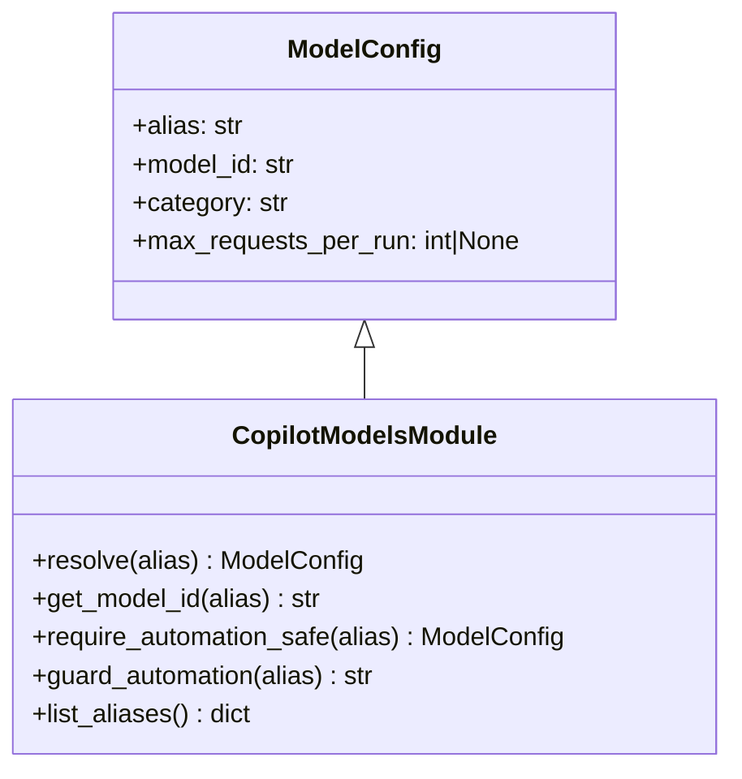

# Diagram: partview_core/partview_service/config/config.prod-a.yml


> Auto-generated by Obscura crawlers

## Diagram 1



### SVG

<svg id="container" width="456.3125" xmlns="http://www.w3.org/2000/svg" class="classDiagram" height="480" viewBox="0 0 456.3125 480" role="graphics-document document" aria-roledescription="class"><style>#container{font-family:"trebuchet ms",verdana,arial,sans-serif;font-size:16px;fill:#333;}@keyframes edge-animation-frame{from{stroke-dashoffset:0;}}@keyframes dash{to{stroke-dashoffset:0;}}#container .edge-animation-slow{stroke-dasharray:9,5!important;stroke-dashoffset:900;animation:dash 50s linear infinite;stroke-linecap:round;}#container .edge-animation-fast{stroke-dasharray:9,5!important;stroke-dashoffset:900;animation:dash 20s linear infinite;stroke-linecap:round;}#container .error-icon{fill:#552222;}#container .error-text{fill:#552222;stroke:#552222;}#container .edge-thickness-normal{stroke-width:1px;}#container .edge-thickness-thick{stroke-width:3.5px;}#container .edge-pattern-solid{stroke-dasharray:0;}#container .edge-thickness-invisible{stroke-width:0;fill:none;}#container .edge-pattern-dashed{stroke-dasharray:3;}#container .edge-pattern-dotted{stroke-dasharray:2;}#container .marker{fill:#333333;stroke:#333333;}#container .marker.cross{stroke:#333333;}#container svg{font-family:"trebuchet ms",verdana,arial,sans-serif;font-size:16px;}#container p{margin:0;}#container g.classGroup text{fill:#9370DB;stroke:none;font-family:"trebuchet ms",verdana,arial,sans-serif;font-size:10px;}#container g.classGroup text .title{font-weight:bolder;}#container .nodeLabel,#container .edgeLabel{color:#131300;}#container .edgeLabel .label rect{fill:#ECECFF;}#container .label text{fill:#131300;}#container .labelBkg{background:#ECECFF;}#container .edgeLabel .label span{background:#ECECFF;}#container .classTitle{font-weight:bolder;}#container .node rect,#container .node circle,#container .node ellipse,#container .node polygon,#container .node path{fill:#ECECFF;stroke:#9370DB;stroke-width:1px;}#container .divider{stroke:#9370DB;stroke-width:1;}#container g.clickable{cursor:pointer;}#container g.classGroup rect{fill:#ECECFF;stroke:#9370DB;}#container g.classGroup line{stroke:#9370DB;stroke-width:1;}#container .classLabel .box{stroke:none;stroke-width:0;fill:#ECECFF;opacity:0.5;}#container .classLabel .label{fill:#9370DB;font-size:10px;}#container .relation{stroke:#333333;stroke-width:1;fill:none;}#container .dashed-line{stroke-dasharray:3;}#container .dotted-line{stroke-dasharray:1 2;}#container #compositionStart,#container .composition{fill:#333333!important;stroke:#333333!important;stroke-width:1;}#container #compositionEnd,#container .composition{fill:#333333!important;stroke:#333333!important;stroke-width:1;}#container #dependencyStart,#container .dependency{fill:#333333!important;stroke:#333333!important;stroke-width:1;}#container #dependencyStart,#container .dependency{fill:#333333!important;stroke:#333333!important;stroke-width:1;}#container #extensionStart,#container .extension{fill:transparent!important;stroke:#333333!important;stroke-width:1;}#container #extensionEnd,#container .extension{fill:transparent!important;stroke:#333333!important;stroke-width:1;}#container #aggregationStart,#container .aggregation{fill:transparent!important;stroke:#333333!important;stroke-width:1;}#container #aggregationEnd,#container .aggregation{fill:transparent!important;stroke:#333333!important;stroke-width:1;}#container #lollipopStart,#container .lollipop{fill:#ECECFF!important;stroke:#333333!important;stroke-width:1;}#container #lollipopEnd,#container .lollipop{fill:#ECECFF!important;stroke:#333333!important;stroke-width:1;}#container .edgeTerminals{font-size:11px;line-height:initial;}#container .classTitleText{text-anchor:middle;font-size:18px;fill:#333;}#container .label-icon{display:inline-block;height:1em;overflow:visible;vertical-align:-0.125em;}#container .node .label-icon path{fill:currentColor;stroke:revert;stroke-width:revert;}#container :root{--mermaid-font-family:"trebuchet ms",verdana,arial,sans-serif;}</style><g><defs><marker id="container_class-aggregationStart" class="marker aggregation class" refX="18" refY="7" markerWidth="190" markerHeight="240" orient="auto"><path d="M 18,7 L9,13 L1,7 L9,1 Z"></path></marker></defs><defs><marker id="container_class-aggregationEnd" class="marker aggregation class" refX="1" refY="7" markerWidth="20" markerHeight="28" orient="auto"><path d="M 18,7 L9,13 L1,7 L9,1 Z"></path></marker></defs><defs><marker id="container_class-extensionStart" class="marker extension class" refX="18" refY="7" markerWidth="190" markerHeight="240" orient="auto"><path d="M 1,7 L18,13 V 1 Z"></path></marker></defs><defs><marker id="container_class-extensionEnd" class="marker extension class" refX="1" refY="7" markerWidth="20" markerHeight="28" orient="auto"><path d="M 1,1 V 13 L18,7 Z"></path></marker></defs><defs><marker id="container_class-compositionStart" class="marker composition class" refX="18" refY="7" markerWidth="190" markerHeight="240" orient="auto"><path d="M 18,7 L9,13 L1,7 L9,1 Z"></path></marker></defs><defs><marker id="container_class-compositionEnd" class="marker composition class" refX="1" refY="7" markerWidth="20" markerHeight="28" orient="auto"><path d="M 18,7 L9,13 L1,7 L9,1 Z"></path></marker></defs><defs><marker id="container_class-dependencyStart" class="marker dependency class" refX="6" refY="7" markerWidth="190" markerHeight="240" orient="auto"><path d="M 5,7 L9,13 L1,7 L9,1 Z"></path></marker></defs><defs><marker id="container_class-dependencyEnd" class="marker dependency class" refX="13" refY="7" markerWidth="20" markerHeight="28" orient="auto"><path d="M 18,7 L9,13 L14,7 L9,1 Z"></path></marker></defs><defs><marker id="container_class-lollipopStart" class="marker lollipop class" refX="13" refY="7" markerWidth="190" markerHeight="240" orient="auto"><circle stroke="black" fill="transparent" cx="7" cy="7" r="6"></circle></marker></defs><defs><marker id="container_class-lollipopEnd" class="marker lollipop class" refX="1" refY="7" markerWidth="190" markerHeight="240" orient="auto"><circle stroke="black" fill="transparent" cx="7" cy="7" r="6"></circle></marker></defs><g class="root"><g class="clusters"></g><g class="edgePaths"><path d="M228.156,217.25L228.156,218.542C228.156,219.833,228.156,222.417,228.156,227.875C228.156,233.333,228.156,241.667,228.156,245.833L228.156,250" id="id_ModelConfig_CopilotModelsModule_1" class="edge-thickness-normal edge-pattern-solid relation" style=";;;" data-edge="true" data-et="edge" data-id="id_ModelConfig_CopilotModelsModule_1" data-points="W3sieCI6MjI4LjE1NjI1LCJ5IjoyMDB9LHsieCI6MjI4LjE1NjI1LCJ5IjoyMjV9LHsieCI6MjI4LjE1NjI1LCJ5IjoyNTB9XQ==" marker-start="url(#container_class-extensionStart)"></path></g><g class="edgeLabels"><g class="edgeLabel"><g class="label" data-id="id_ModelConfig_CopilotModelsModule_1" transform="translate(0, 0)"><foreignObject width="0" height="0"><div xmlns="http://www.w3.org/1999/xhtml" class="labelBkg" style="display: table-cell; white-space: nowrap; line-height: 1.5; max-width: 200px; text-align: center;"><span class="edgeLabel"></span></div></foreignObject></g></g></g><g class="nodes"><g class="node default" id="classId-ModelConfig-0" transform="translate(228.15625, 104)"><g class="basic label-container"><path d="M-157.7890625 -96 L157.7890625 -96 L157.7890625 96 L-157.7890625 96" stroke="none" stroke-width="0" fill="#ECECFF" style=""></path><path d="M-157.7890625 -96 C-70.67376982259208 -96, 16.441522854815844 -96, 157.7890625 -96 M-157.7890625 -96 C-83.2456408808432 -96, -8.702219261686395 -96, 157.7890625 -96 M157.7890625 -96 C157.7890625 -57.168023553741804, 157.7890625 -18.33604710748361, 157.7890625 96 M157.7890625 -96 C157.7890625 -20.645386126363945, 157.7890625 54.70922774727211, 157.7890625 96 M157.7890625 96 C43.80500456956008 96, -70.17905336087983 96, -157.7890625 96 M157.7890625 96 C63.13448656611669 96, -31.520089367766616 96, -157.7890625 96 M-157.7890625 96 C-157.7890625 41.348817353791674, -157.7890625 -13.302365292416653, -157.7890625 -96 M-157.7890625 96 C-157.7890625 31.918387756334795, -157.7890625 -32.16322448733041, -157.7890625 -96" stroke="#9370DB" stroke-width="1.3" fill="none" stroke-dasharray="0 0" style=""></path></g><g class="annotation-group text" transform="translate(0, -72)"></g><g class="label-group text" transform="translate(-45.484375, -72)"><g class="label" style="font-weight: bolder" transform="translate(0,-12)"><foreignObject width="90.96875" height="24"><div xmlns="http://www.w3.org/1999/xhtml" style="display: table-cell; white-space: nowrap; line-height: 1.5; max-width: 140px; text-align: center;"><span class="nodeLabel markdown-node-label" style=""><p>ModelConfig</p></span></div></foreignObject></g></g><g class="members-group text" transform="translate(-145.7890625, -24)"><g class="label" style="" transform="translate(0,-12)"><foreignObject width="69.015625" height="24"><div xmlns="http://www.w3.org/1999/xhtml" style="display: table-cell; white-space: nowrap; line-height: 1.5; max-width: 127px; text-align: center;"><span class="nodeLabel markdown-node-label" style=""><p>+alias: str</p></span></div></foreignObject></g><g class="label" style="" transform="translate(0,12)"><foreignObject width="103.921875" height="24"><div xmlns="http://www.w3.org/1999/xhtml" style="display: table-cell; white-space: nowrap; line-height: 1.5; max-width: 162px; text-align: center;"><span class="nodeLabel markdown-node-label" style=""><p>+model_id: str</p></span></div></foreignObject></g><g class="label" style="" transform="translate(0,36)"><foreignObject width="97.46875" height="24"><div xmlns="http://www.w3.org/1999/xhtml" style="display: table-cell; white-space: nowrap; line-height: 1.5; max-width: 156px; text-align: center;"><span class="nodeLabel markdown-node-label" style=""><p>+category: str</p></span></div></foreignObject></g><g class="label" style="" transform="translate(0,60)"><foreignObject width="246.09375" height="24"><div xmlns="http://www.w3.org/1999/xhtml" style="display: table-cell; white-space: nowrap; line-height: 1.5; max-width: 303px; text-align: center;"><span class="nodeLabel markdown-node-label" style=""><p>+max_requests_per_run: int|None</p></span></div></foreignObject></g></g><g class="methods-group text" transform="translate(-145.7890625, 96)"></g><g class="divider" style=""><path d="M-157.7890625 -48 C-54.228977104443175 -48, 49.33110829111365 -48, 157.7890625 -48 M-157.7890625 -48 C-72.65961698782273 -48, 12.46982852435454 -48, 157.7890625 -48" stroke="#9370DB" stroke-width="1.3" fill="none" stroke-dasharray="0 0" style=""></path></g><g class="divider" style=""><path d="M-157.7890625 72 C-93.78522504816081 72, -29.781387596321622 72, 157.7890625 72 M-157.7890625 72 C-60.255410552893196 72, 37.27824139421361 72, 157.7890625 72" stroke="#9370DB" stroke-width="1.3" fill="none" stroke-dasharray="0 0" style=""></path></g></g><g class="node default" id="classId-CopilotModelsModule-1" transform="translate(228.15625, 361)"><g class="basic label-container"><path d="M-220.15625 -111 L220.15625 -111 L220.15625 111 L-220.15625 111" stroke="none" stroke-width="0" fill="#ECECFF" style=""></path><path d="M-220.15625 -111 C-75.05666597028949 -111, 70.04291805942103 -111, 220.15625 -111 M-220.15625 -111 C-100.2602038717388 -111, 19.63584225652241 -111, 220.15625 -111 M220.15625 -111 C220.15625 -65.5315013730463, 220.15625 -20.06300274609258, 220.15625 111 M220.15625 -111 C220.15625 -58.164874549442544, 220.15625 -5.329749098885088, 220.15625 111 M220.15625 111 C103.95462234155495 111, -12.247005316890096 111, -220.15625 111 M220.15625 111 C126.39241269614081 111, 32.62857539228162 111, -220.15625 111 M-220.15625 111 C-220.15625 66.28983958563337, -220.15625 21.579679171266747, -220.15625 -111 M-220.15625 111 C-220.15625 48.28453588708938, -220.15625 -14.430928225821233, -220.15625 -111" stroke="#9370DB" stroke-width="1.3" fill="none" stroke-dasharray="0 0" style=""></path></g><g class="annotation-group text" transform="translate(0, -87)"></g><g class="label-group text" transform="translate(-79.75, -87)"><g class="label" style="font-weight: bolder" transform="translate(0,-12)"><foreignObject width="159.5" height="24"><div xmlns="http://www.w3.org/1999/xhtml" style="display: table-cell; white-space: nowrap; line-height: 1.5; max-width: 208px; text-align: center;"><span class="nodeLabel markdown-node-label" style=""><p>CopilotModelsModule</p></span></div></foreignObject></g></g><g class="members-group text" transform="translate(-208.15625, -39)"></g><g class="methods-group text" transform="translate(-208.15625, -9)"><g class="label" style="" transform="translate(0,-12)"><foreignObject width="206.375" height="24"><div xmlns="http://www.w3.org/1999/xhtml" style="display: table-cell; white-space: nowrap; line-height: 1.5; max-width: 264px; text-align: center;"><span class="nodeLabel markdown-node-label" style=""><p>+resolve(alias) : ModelConfig</p></span></div></foreignObject></g><g class="label" style="" transform="translate(0,12)"><foreignObject width="183.171875" height="24"><div xmlns="http://www.w3.org/1999/xhtml" style="display: table-cell; white-space: nowrap; line-height: 1.5; max-width: 241px; text-align: center;"><span class="nodeLabel markdown-node-label" style=""><p>+get_model_id(alias) : str</p></span></div></foreignObject></g><g class="label" style="" transform="translate(0,36)"><foreignObject width="336.5625" height="24"><div xmlns="http://www.w3.org/1999/xhtml" style="display: table-cell; white-space: nowrap; line-height: 1.5; max-width: 395px; text-align: center;"><span class="nodeLabel markdown-node-label" style=""><p>+require_automation_safe(alias) : ModelConfig</p></span></div></foreignObject></g><g class="label" style="" transform="translate(0,60)"><foreignObject width="217.625" height="24"><div xmlns="http://www.w3.org/1999/xhtml" style="display: table-cell; white-space: nowrap; line-height: 1.5; max-width: 276px; text-align: center;"><span class="nodeLabel markdown-node-label" style=""><p>+guard_automation(alias) : str</p></span></div></foreignObject></g><g class="label" style="" transform="translate(0,84)"><foreignObject width="138.578125" height="24"><div xmlns="http://www.w3.org/1999/xhtml" style="display: table-cell; white-space: nowrap; line-height: 1.5; max-width: 196px; text-align: center;"><span class="nodeLabel markdown-node-label" style=""><p>+list_aliases() : dict</p></span></div></foreignObject></g></g><g class="divider" style=""><path d="M-220.15625 -63 C-122.0822712235545 -63, -24.008292447109 -63, 220.15625 -63 M-220.15625 -63 C-55.727718953743704 -63, 108.70081209251259 -63, 220.15625 -63" stroke="#9370DB" stroke-width="1.3" fill="none" stroke-dasharray="0 0" style=""></path></g><g class="divider" style=""><path d="M-220.15625 -39 C-58.682690383785115 -39, 102.79086923242977 -39, 220.15625 -39 M-220.15625 -39 C-87.67822455307811 -39, 44.79980089384378 -39, 220.15625 -39" stroke="#9370DB" stroke-width="1.3" fill="none" stroke-dasharray="0 0" style=""></path></g></g></g></g></g></svg>

## Diagram 2

```mermaid
flowchart TD
    A[Start: crawl_repo(repo_path)] --> B[Walk filesystem]
    B --> C{File passes filters?}
    C -- No --> D[Increment skip counters]
    C -- Yes --> E[Create FileEntry and add to result.files]
    E --> F[return CrawlResult]
    F --> G[write_output(result, output_dir)]
    G --> H{dry_run?}
    H -- True --> I[Print dry-run summary]
    H -- False --> J[For each FileEntry: generate_stub -> write .md]
    J --> K[generate_index(result)]
    K --> L[Finish: wrote files]
```

> SVG rendering failed for this diagram.
