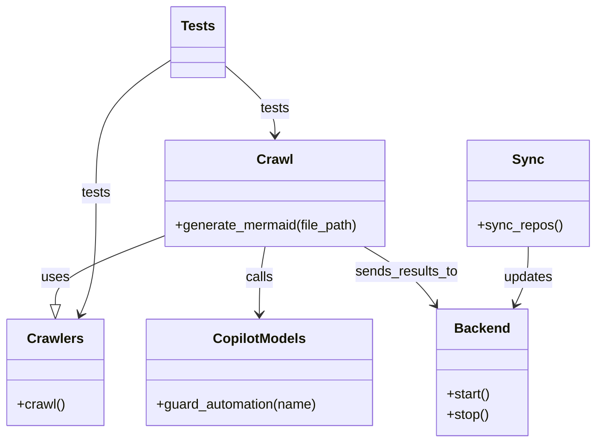

# Diagram: partview_core/partview_service/config/config.prod-b.yml

> Auto-generated by Obscura crawlers

## Mermaid

### SVG

<svg id="container" width="701.416015625" xmlns="http://www.w3.org/2000/svg" class="classDiagram" height="524" viewBox="0 0 701.416015625 524" role="graphics-document document" aria-roledescription="class"><g><defs><marker id="container_class-aggregationStart" class="marker aggregation class" refX="18" refY="7" markerWidth="190" markerHeight="240" orient="auto"><path d="M 18,7 L9,13 L1,7 L9,1 Z"></path></marker></defs><defs><marker id="container_class-aggregationEnd" class="marker aggregation class" refX="1" refY="7" markerWidth="20" markerHeight="28" orient="auto"><path d="M 18,7 L9,13 L1,7 L9,1 Z"></path></marker></defs><defs><marker id="container_class-extensionStart" class="marker extension class" refX="18" refY="7" markerWidth="190" markerHeight="240" orient="auto"><path d="M 1,7 L18,13 V 1 Z"></path></marker></defs><defs><marker id="container_class-extensionEnd" class="marker extension class" refX="1" refY="7" markerWidth="20" markerHeight="28" orient="auto"><path d="M 1,1 V 13 L18,7 Z"></path></marker></defs><defs><marker id="container_class-compositionStart" class="marker composition class" refX="18" refY="7" markerWidth="190" markerHeight="240" orient="auto"><path d="M 18,7 L9,13 L1,7 L9,1 Z"></path></marker></defs><defs><marker id="container_class-compositionEnd" class="marker composition class" refX="1" refY="7" markerWidth="20" markerHeight="28" orient="auto"><path d="M 18,7 L9,13 L1,7 L9,1 Z"></path></marker></defs><defs><marker id="container_class-dependencyStart" class="marker dependency class" refX="6" refY="7" markerWidth="190" markerHeight="240" orient="auto"><path d="M 5,7 L9,13 L1,7 L9,1 Z"></path></marker></defs><defs><marker id="container_class-dependencyEnd" class="marker dependency class" refX="13" refY="7" markerWidth="20" markerHeight="28" orient="auto"><path d="M 18,7 L9,13 L14,7 L9,1 Z"></path></marker></defs><defs><marker id="container_class-lollipopStart" class="marker lollipop class" refX="13" refY="7" markerWidth="190" markerHeight="240" orient="auto"><circle stroke="black" fill="transparent" cx="7" cy="7" r="6"></circle></marker></defs><defs><marker id="container_class-lollipopEnd" class="marker lollipop class" refX="1" refY="7" markerWidth="190" markerHeight="240" orient="auto"><circle stroke="black" fill="transparent" cx="7" cy="7" r="6"></circle></marker></defs><g class="root"><g class="clusters"></g><g class="edgePaths"><path d="M191.398,279.763L170.158,287.969C148.917,296.175,106.435,312.588,85.194,326.085C63.953,339.583,63.953,350.167,63.953,355.458L63.953,360.75" id="id_Crawl_Crawlers_1" class="edge-thickness-normal edge-pattern-solid relation" style=";;;" data-edge="true" data-et="edge" data-id="id_Crawl_Crawlers_1" data-points="W3sieCI6MTkxLjM5ODQzNzUsInkiOjI3OS43NjI4NjkxNzI4NDE1M30seyJ4Ijo2My45NTMxMjUsInkiOjMyOX0seyJ4Ijo2My45NTMxMjUsInkiOjM3OH1d" marker-end="url(#container_class-extensionEnd)"></path><path d="M311.298,292L310.173,298.167C309.048,304.333,306.797,316.667,305.672,330C304.547,343.333,304.547,357.667,304.547,364.833L304.547,372" id="id_Crawl_CopilotModels_2" class="edge-thickness-normal edge-pattern-solid relation" style=";;;" data-edge="true" data-et="edge" data-id="id_Crawl_CopilotModels_2" data-points="W3sieCI6MzExLjI5NzkyOTY4NzUsInkiOjI5Mn0seyJ4IjozMDQuNTQ2ODc1LCJ5IjozMjl9LHsieCI6MzA0LjU0Njg3NSwieSI6Mzc4fV0=" marker-end="url(#container_class-dependencyEnd)"></path><path d="M428.623,292L438.982,298.167C449.341,304.333,470.059,316.667,484.094,328.176C498.128,339.686,505.479,350.371,509.155,355.714L512.83,361.057" id="id_Crawl_Backend_3" class="edge-thickness-normal edge-pattern-solid relation" style=";;;" data-edge="true" data-et="edge" data-id="id_Crawl_Backend_3" data-points="W3sieCI6NDI4LjYyMzEyNSwieSI6MjkyfSx7IngiOjQ5MC43NzczNDM3NSwieSI6MzI5fSx7IngiOjUxNi4yMzA5NzQ0Njk4NjYsInkiOjM2Nn1d" marker-end="url(#container_class-dependencyEnd)"></path><path d="M623.111,292L623.111,298.167C623.111,304.333,623.111,316.667,620.51,328.103C617.909,339.54,612.706,350.08,610.105,355.35L607.503,360.62" id="id_Sync_Backend_4" class="edge-thickness-normal edge-pattern-solid relation" style=";;;" data-edge="true" data-et="edge" data-id="id_Sync_Backend_4" data-points="W3sieCI6NjIzLjExMTMyODEyNSwieSI6MjkyfSx7IngiOjYyMy4xMTEzMjgxMjUsInkiOjMyOX0seyJ4Ijo2MDQuODQ3NDgxODYzODM5MywieSI6MzY2fV0=" marker-end="url(#container_class-dependencyEnd)"></path><path d="M261.967,76.737L272.104,85.447C282.242,94.158,302.518,111.579,312.655,125.456C322.793,139.333,322.793,149.667,322.793,154.833L322.793,160" id="id_Tests_Crawl_5" class="edge-thickness-normal edge-pattern-solid relation" style=";;;" data-edge="true" data-et="edge" data-id="id_Tests_Crawl_5" data-points="W3sieCI6MjYxLjk2Njc5Njg3NSwieSI6NzYuNzM2NjU0Mjc1MDkyOTV9LHsieCI6MzIyLjc5Mjk2ODc1LCJ5IjoxMjl9LHsieCI6MzIyLjc5Mjk2ODc1LCJ5IjoxNjZ9XQ==" marker-end="url(#container_class-dependencyEnd)"></path><path d="M199.732,70.435L184.869,80.196C170.006,89.957,140.279,109.478,125.416,135.906C110.553,162.333,110.553,195.667,110.553,229C110.553,262.333,110.553,295.667,107.539,319.577C104.525,343.487,98.498,357.974,95.484,365.217L92.47,372.46" id="id_Tests_Crawlers_6" class="edge-thickness-normal edge-pattern-solid relation" style=";;;" data-edge="true" data-et="edge" data-id="id_Tests_Crawlers_6" data-points="W3sieCI6MTk5LjczMjQyMTg3NSwieSI6NzAuNDM0OTI2NjEzODQ1OTZ9LHsieCI6MTEwLjU1MjczNDM3NSwieSI6MTI5fSx7IngiOjExMC41NTI3MzQzNzUsInkiOjIyOX0seyJ4IjoxMTAuNTUyNzM0Mzc1LCJ5IjozMjl9LHsieCI6OTAuMTY1NDA1MjczNDM3NSwieSI6Mzc4fV0=" marker-end="url(#container_class-dependencyEnd)"></path></g><g class="edgeLabels"><g class="edgeLabel" transform="translate(63.953125, 329)"><g class="label" data-id="id_Crawl_Crawlers_1" transform="translate(-16.4921875, -12)"><foreignObject width="32.984375" height="24">

uses

</foreignObject></g></g><g class="edgeLabel" transform="translate(304.546875, 329)"><g class="label" data-id="id_Crawl_CopilotModels_2" transform="translate(-16.4453125, -12)"><foreignObject width="32.890625" height="24">

calls

</foreignObject></g></g><g class="edgeLabel" transform="translate(478.99509, 321.9861)"><g class="label" data-id="id_Crawl_Backend_3" transform="translate(-61.15625, -12)"><foreignObject width="122.3125" height="24">

sends_results_to

</foreignObject></g></g><g class="edgeLabel" transform="translate(623.111328125, 329)"><g class="label" data-id="id_Sync_Backend_4" transform="translate(-29.4140625, -12)"><foreignObject width="58.828125" height="24">

updates

</foreignObject></g></g><g class="edgeLabel" transform="translate(322.79296875, 129)"><g class="label" data-id="id_Tests_Crawl_5" transform="translate(-17.4921875, -12)"><foreignObject width="34.984375" height="24">

tests

</foreignObject></g></g><g class="edgeLabel" transform="translate(110.552734375, 229)"><g class="label" data-id="id_Tests_Crawlers_6" transform="translate(-17.4921875, -12)"><foreignObject width="34.984375" height="24">

tests

</foreignObject></g></g></g><g class="nodes"><g class="node default" id="classId-Crawl-0" transform="translate(322.79296875, 229)"><g class="basic label-container"><path d="M-131.39453125 -63 L131.39453125 -63 L131.39453125 63 L-131.39453125 63" stroke="none" stroke-width="0" fill="#ECECFF" style=""></path><path d="M-131.39453125 -63 C-59.358081344214824 -63, 12.678368561570352 -63, 131.39453125 -63 M-131.39453125 -63 C-49.98720023066096 -63, 31.42013078867808 -63, 131.39453125 -63 M131.39453125 -63 C131.39453125 -24.982920143529697, 131.39453125 13.034159712940607, 131.39453125 63 M131.39453125 -63 C131.39453125 -13.12835602477751, 131.39453125 36.74328795044498, 131.39453125 63 M131.39453125 63 C53.4438921862332 63, -24.5067468775336 63, -131.39453125 63 M131.39453125 63 C71.41691478049097 63, 11.43929831098194 63, -131.39453125 63 M-131.39453125 63 C-131.39453125 21.459519599843816, -131.39453125 -20.08096080031237, -131.39453125 -63 M-131.39453125 63 C-131.39453125 24.35057878639863, -131.39453125 -14.298842427202743, -131.39453125 -63" stroke="#9370DB" stroke-width="1.3" fill="none" stroke-dasharray="0 0" style=""></path></g><g class="annotation-group text" transform="translate(0, -39)"></g><g class="label-group text" transform="translate(-20.1484375, -39)"><g class="label" style="font-weight: bolder" transform="translate(0,-12)"><foreignObject width="40.296875" height="24">

Crawl

</foreignObject></g></g><g class="members-group text" transform="translate(-119.39453125, 9)"></g><g class="methods-group text" transform="translate(-119.39453125, 39)"><g class="label" style="" transform="translate(0,-12)"><foreignObject width="218.640625" height="24">

+generate_mermaid(file_path)

</foreignObject></g></g><g class="divider" style=""><path d="M-131.39453125 -15 C-68.7838288111385 -15, -6.173126372276997 -15, 131.39453125 -15 M-131.39453125 -15 C-36.59584345081748 -15, 58.20284434836503 -15, 131.39453125 -15" stroke="#9370DB" stroke-width="1.3" fill="none" stroke-dasharray="0 0" style=""></path></g><g class="divider" style=""><path d="M-131.39453125 9 C-55.64390756633199 9, 20.10671611733602 9, 131.39453125 9 M-131.39453125 9 C-71.09514150590093 9, -10.795751761801839 9, 131.39453125 9" stroke="#9370DB" stroke-width="1.3" fill="none" stroke-dasharray="0 0" style=""></path></g></g><g class="node default" id="classId-Crawlers-1" transform="translate(63.953125, 441)"><g class="basic label-container"><path d="M-55.953125 -63 L55.953125 -63 L55.953125 63 L-55.953125 63" stroke="none" stroke-width="0" fill="#ECECFF" style=""></path><path d="M-55.953125 -63 C-25.996353675670168 -63, 3.9604176486596643 -63, 55.953125 -63 M-55.953125 -63 C-15.126633422430366 -63, 25.699858155139268 -63, 55.953125 -63 M55.953125 -63 C55.953125 -28.571203371528128, 55.953125 5.857593256943744, 55.953125 63 M55.953125 -63 C55.953125 -18.379064566242583, 55.953125 26.241870867514834, 55.953125 63 M55.953125 63 C19.095729506936287 63, -17.761665986127426 63, -55.953125 63 M55.953125 63 C25.59545800826639 63, -4.762208983467218 63, -55.953125 63 M-55.953125 63 C-55.953125 17.319039604492772, -55.953125 -28.361920791014455, -55.953125 -63 M-55.953125 63 C-55.953125 20.855047240645, -55.953125 -21.28990551871, -55.953125 -63" stroke="#9370DB" stroke-width="1.3" fill="none" stroke-dasharray="0 0" style=""></path></g><g class="annotation-group text" transform="translate(0, -39)"></g><g class="label-group text" transform="translate(-31.5, -39)"><g class="label" style="font-weight: bolder" transform="translate(0,-12)"><foreignObject width="63" height="24">

Crawlers

</foreignObject></g></g><g class="members-group text" transform="translate(-43.953125, 9)"></g><g class="methods-group text" transform="translate(-43.953125, 39)"><g class="label" style="" transform="translate(0,-12)"><foreignObject width="56.40625" height="24">

+crawl()

</foreignObject></g></g><g class="divider" style=""><path d="M-55.953125 -15 C-14.653204509959792 -15, 26.646715980080415 -15, 55.953125 -15 M-55.953125 -15 C-20.431063684310402 -15, 15.090997631379196 -15, 55.953125 -15" stroke="#9370DB" stroke-width="1.3" fill="none" stroke-dasharray="0 0" style=""></path></g><g class="divider" style=""><path d="M-55.953125 9 C-27.37547644022886 9, 1.2021721195422828 9, 55.953125 9 M-55.953125 9 C-22.868138771265116 9, 10.216847457469768 9, 55.953125 9" stroke="#9370DB" stroke-width="1.3" fill="none" stroke-dasharray="0 0" style=""></path></g></g><g class="node default" id="classId-Sync-2" transform="translate(623.111328125, 229)"><g class="basic label-container"><path d="M-70.3046875 -63 L70.3046875 -63 L70.3046875 63 L-70.3046875 63" stroke="none" stroke-width="0" fill="#ECECFF" style=""></path><path d="M-70.3046875 -63 C-16.79184401033138 -63, 36.72099947933724 -63, 70.3046875 -63 M-70.3046875 -63 C-23.420163676253765 -63, 23.46436014749247 -63, 70.3046875 -63 M70.3046875 -63 C70.3046875 -18.186223549435198, 70.3046875 26.627552901129604, 70.3046875 63 M70.3046875 -63 C70.3046875 -18.168990571528724, 70.3046875 26.662018856942552, 70.3046875 63 M70.3046875 63 C37.03878798071873 63, 3.7728884614374607 63, -70.3046875 63 M70.3046875 63 C27.217435953684074 63, -15.869815592631852 63, -70.3046875 63 M-70.3046875 63 C-70.3046875 14.782711472367637, -70.3046875 -33.434577055264725, -70.3046875 -63 M-70.3046875 63 C-70.3046875 13.817409951915266, -70.3046875 -35.36518009616947, -70.3046875 -63" stroke="#9370DB" stroke-width="1.3" fill="none" stroke-dasharray="0 0" style=""></path></g><g class="annotation-group text" transform="translate(0, -39)"></g><g class="label-group text" transform="translate(-17.09375, -39)"><g class="label" style="font-weight: bolder" transform="translate(0,-12)"><foreignObject width="34.1875" height="24">

Sync

</foreignObject></g></g><g class="members-group text" transform="translate(-58.3046875, 9)"></g><g class="methods-group text" transform="translate(-58.3046875, 39)"><g class="label" style="" transform="translate(0,-12)"><foreignObject width="99.515625" height="24">

+sync_repos()

</foreignObject></g></g><g class="divider" style=""><path d="M-70.3046875 -15 C-14.829268536264799 -15, 40.6461504274704 -15, 70.3046875 -15 M-70.3046875 -15 C-30.57935677877601 -15, 9.14597394244798 -15, 70.3046875 -15" stroke="#9370DB" stroke-width="1.3" fill="none" stroke-dasharray="0 0" style=""></path></g><g class="divider" style=""><path d="M-70.3046875 9 C-40.80966196499917 9, -11.314636429998345 9, 70.3046875 9 M-70.3046875 9 C-36.571554485096065 9, -2.838421470192131 9, 70.3046875 9" stroke="#9370DB" stroke-width="1.3" fill="none" stroke-dasharray="0 0" style=""></path></g></g><g class="node default" id="classId-Backend-3" transform="translate(567.826171875, 441)"><g class="basic label-container"><path d="M-53.7265625 -75 L53.7265625 -75 L53.7265625 75 L-53.7265625 75" stroke="none" stroke-width="0" fill="#ECECFF" style=""></path><path d="M-53.7265625 -75 C-26.161954544011508 -75, 1.402653411976985 -75, 53.7265625 -75 M-53.7265625 -75 C-17.011244614265877 -75, 19.704073271468246 -75, 53.7265625 -75 M53.7265625 -75 C53.7265625 -34.70815147082328, 53.7265625 5.583697058353437, 53.7265625 75 M53.7265625 -75 C53.7265625 -30.044170554432775, 53.7265625 14.91165889113445, 53.7265625 75 M53.7265625 75 C15.26009603887217 75, -23.20637042225566 75, -53.7265625 75 M53.7265625 75 C20.705994631099706 75, -12.314573237800587 75, -53.7265625 75 M-53.7265625 75 C-53.7265625 19.138199088998093, -53.7265625 -36.723601822003815, -53.7265625 -75 M-53.7265625 75 C-53.7265625 27.773703424472806, -53.7265625 -19.452593151054387, -53.7265625 -75" stroke="#9370DB" stroke-width="1.3" fill="none" stroke-dasharray="0 0" style=""></path></g><g class="annotation-group text" transform="translate(0, -51)"></g><g class="label-group text" transform="translate(-31.296875, -51)"><g class="label" style="font-weight: bolder" transform="translate(0,-12)"><foreignObject width="62.59375" height="24">

Backend

</foreignObject></g></g><g class="members-group text" transform="translate(-41.7265625, -3)"></g><g class="methods-group text" transform="translate(-41.7265625, 27)"><g class="label" style="" transform="translate(0,-12)"><foreignObject width="52.15625" height="24">

+start()

</foreignObject></g><g class="label" style="" transform="translate(0,12)"><foreignObject width="50.21875" height="24">

+stop()

</foreignObject></g></g><g class="divider" style=""><path d="M-53.7265625 -27 C-31.446191869225306 -27, -9.165821238450611 -27, 53.7265625 -27 M-53.7265625 -27 C-17.141773919822903 -27, 19.443014660354194 -27, 53.7265625 -27" stroke="#9370DB" stroke-width="1.3" fill="none" stroke-dasharray="0 0" style=""></path></g><g class="divider" style=""><path d="M-53.7265625 -3 C-16.55982095405045 -3, 20.606920591899097 -3, 53.7265625 -3 M-53.7265625 -3 C-30.028280886804374 -3, -6.329999273608749 -3, 53.7265625 -3" stroke="#9370DB" stroke-width="1.3" fill="none" stroke-dasharray="0 0" style=""></path></g></g><g class="node default" id="classId-CopilotModels-4" transform="translate(304.546875, 441)"><g class="basic label-container"><path d="M-134.640625 -63 L134.640625 -63 L134.640625 63 L-134.640625 63" stroke="none" stroke-width="0" fill="#ECECFF" style=""></path><path d="M-134.640625 -63 C-41.65751818767683 -63, 51.32558862464634 -63, 134.640625 -63 M-134.640625 -63 C-62.66783390182053 -63, 9.304957196358941 -63, 134.640625 -63 M134.640625 -63 C134.640625 -23.847554054698293, 134.640625 15.304891890603415, 134.640625 63 M134.640625 -63 C134.640625 -32.98845600660697, 134.640625 -2.9769120132139335, 134.640625 63 M134.640625 63 C72.45967382778863 63, 10.278722655577283 63, -134.640625 63 M134.640625 63 C75.51044555432446 63, 16.38026610864891 63, -134.640625 63 M-134.640625 63 C-134.640625 20.14928865357364, -134.640625 -22.701422692852717, -134.640625 -63 M-134.640625 63 C-134.640625 32.60073540276192, -134.640625 2.20147080552384, -134.640625 -63" stroke="#9370DB" stroke-width="1.3" fill="none" stroke-dasharray="0 0" style=""></path></g><g class="annotation-group text" transform="translate(0, -39)"></g><g class="label-group text" transform="translate(-52.65625, -39)"><g class="label" style="font-weight: bolder" transform="translate(0,-12)"><foreignObject width="105.3125" height="24">

CopilotModels

</foreignObject></g></g><g class="members-group text" transform="translate(-122.640625, 9)"></g><g class="methods-group text" transform="translate(-122.640625, 39)"><g class="label" style="" transform="translate(0,-12)"><foreignObject width="192.625" height="24">

+guard_automation(name)

</foreignObject></g></g><g class="divider" style=""><path d="M-134.640625 -15 C-70.87580514503806 -15, -7.1109852900761155 -15, 134.640625 -15 M-134.640625 -15 C-41.786333702289056 -15, 51.06795759542189 -15, 134.640625 -15" stroke="#9370DB" stroke-width="1.3" fill="none" stroke-dasharray="0 0" style=""></path></g><g class="divider" style=""><path d="M-134.640625 9 C-43.907135308430796 9, 46.82635438313841 9, 134.640625 9 M-134.640625 9 C-60.576683862075924 9, 13.487257275848151 9, 134.640625 9" stroke="#9370DB" stroke-width="1.3" fill="none" stroke-dasharray="0 0" style=""></path></g></g><g class="node default" id="classId-Tests-5" transform="translate(230.849609375, 50)"><g class="basic label-container"><path d="M-31.1171875 -42 L31.1171875 -42 L31.1171875 42 L-31.1171875 42" stroke="none" stroke-width="0" fill="#ECECFF" style=""></path><path d="M-31.1171875 -42 C-15.76499761850365 -42, -0.41280773700729867 -42, 31.1171875 -42 M-31.1171875 -42 C-12.704112013495415 -42, 5.70896347300917 -42, 31.1171875 -42 M31.1171875 -42 C31.1171875 -12.518893005399814, 31.1171875 16.96221398920037, 31.1171875 42 M31.1171875 -42 C31.1171875 -14.857153974704037, 31.1171875 12.285692050591926, 31.1171875 42 M31.1171875 42 C14.375756487030447 42, -2.365674525939106 42, -31.1171875 42 M31.1171875 42 C6.415903122802256 42, -18.28538125439549 42, -31.1171875 42 M-31.1171875 42 C-31.1171875 25.106580754828943, -31.1171875 8.213161509657887, -31.1171875 -42 M-31.1171875 42 C-31.1171875 17.052316145858686, -31.1171875 -7.8953677082826275, -31.1171875 -42" stroke="#9370DB" stroke-width="1.3" fill="none" stroke-dasharray="0 0" style=""></path></g><g class="annotation-group text" transform="translate(0, -18)"></g><g class="label-group text" transform="translate(-19.1171875, -18)"><g class="label" style="font-weight: bolder" transform="translate(0,-12)"><foreignObject width="38.234375" height="24">

Tests

</foreignObject></g></g><g class="members-group text" transform="translate(-19.1171875, 30)"></g><g class="methods-group text" transform="translate(-19.1171875, 60)"></g><g class="divider" style=""><path d="M-31.1171875 6 C-15.700105713700593 6, -0.2830239274011852 6, 31.1171875 6 M-31.1171875 6 C-13.541692536398052 6, 4.033802427203895 6, 31.1171875 6" stroke="#9370DB" stroke-width="1.3" fill="none" stroke-dasharray="0 0" style=""></path></g><g class="divider" style=""><path d="M-31.1171875 24 C-14.861294696320368 24, 1.3945981073592648 24, 31.1171875 24 M-31.1171875 24 C-14.286724373223691 24, 2.543738753552617 24, 31.1171875 24" stroke="#9370DB" stroke-width="1.3" fill="none" stroke-dasharray="0 0" style=""></path></g></g></g></g></g></svg>
