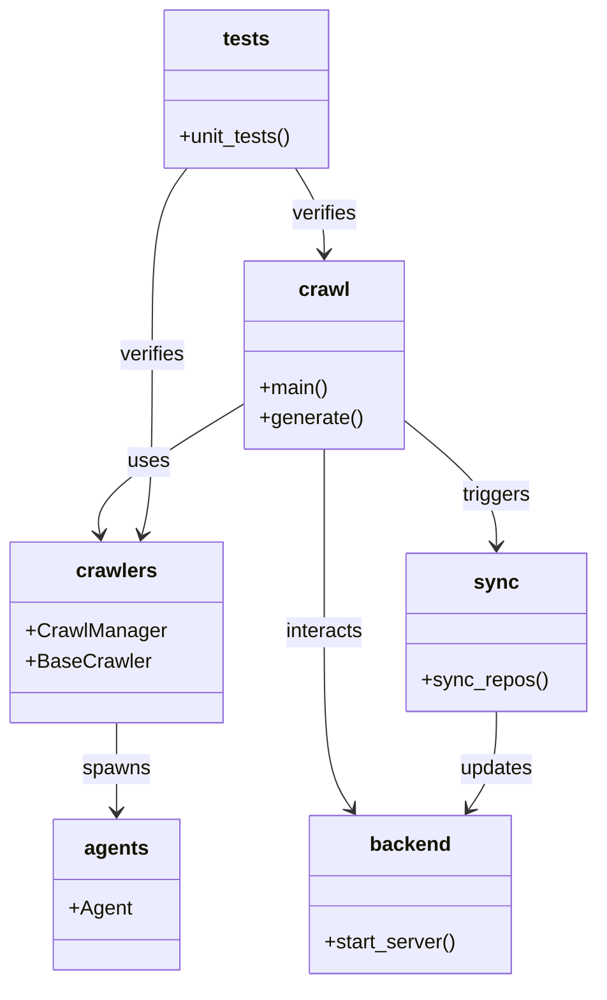

# Diagram: partview_core/partview_service/config/config.qa.yml

> Auto-generated by Obscura crawlers

## Mermaid

### SVG

<svg id="container" width="468.345703125" xmlns="http://www.w3.org/2000/svg" class="classDiagram" height="784" viewBox="0 0 468.345703125 784" role="graphics-document document" aria-roledescription="class"><g><defs><marker id="container_class-aggregationStart" class="marker aggregation class" refX="18" refY="7" markerWidth="190" markerHeight="240" orient="auto"><path d="M 18,7 L9,13 L1,7 L9,1 Z"></path></marker></defs><defs><marker id="container_class-aggregationEnd" class="marker aggregation class" refX="1" refY="7" markerWidth="20" markerHeight="28" orient="auto"><path d="M 18,7 L9,13 L1,7 L9,1 Z"></path></marker></defs><defs><marker id="container_class-extensionStart" class="marker extension class" refX="18" refY="7" markerWidth="190" markerHeight="240" orient="auto"><path d="M 1,7 L18,13 V 1 Z"></path></marker></defs><defs><marker id="container_class-extensionEnd" class="marker extension class" refX="1" refY="7" markerWidth="20" markerHeight="28" orient="auto"><path d="M 1,1 V 13 L18,7 Z"></path></marker></defs><defs><marker id="container_class-compositionStart" class="marker composition class" refX="18" refY="7" markerWidth="190" markerHeight="240" orient="auto"><path d="M 18,7 L9,13 L1,7 L9,1 Z"></path></marker></defs><defs><marker id="container_class-compositionEnd" class="marker composition class" refX="1" refY="7" markerWidth="20" markerHeight="28" orient="auto"><path d="M 18,7 L9,13 L1,7 L9,1 Z"></path></marker></defs><defs><marker id="container_class-dependencyStart" class="marker dependency class" refX="6" refY="7" markerWidth="190" markerHeight="240" orient="auto"><path d="M 5,7 L9,13 L1,7 L9,1 Z"></path></marker></defs><defs><marker id="container_class-dependencyEnd" class="marker dependency class" refX="13" refY="7" markerWidth="20" markerHeight="28" orient="auto"><path d="M 18,7 L9,13 L14,7 L9,1 Z"></path></marker></defs><defs><marker id="container_class-lollipopStart" class="marker lollipop class" refX="13" refY="7" markerWidth="190" markerHeight="240" orient="auto"><circle stroke="black" fill="transparent" cx="7" cy="7" r="6"></circle></marker></defs><defs><marker id="container_class-lollipopEnd" class="marker lollipop class" refX="1" refY="7" markerWidth="190" markerHeight="240" orient="auto"><circle stroke="black" fill="transparent" cx="7" cy="7" r="6"></circle></marker></defs><g class="root"><g class="clusters"></g><g class="edgePaths"><path d="M191.193,321.529L171.284,333.774C151.375,346.02,111.557,370.51,92.515,387.935C73.473,405.361,75.207,415.722,76.074,420.902L76.941,426.082" id="id_crawl_crawlers_1" class="edge-thickness-normal edge-pattern-solid relation" style=";;;" data-edge="true" data-et="edge" data-id="id_crawl_crawlers_1" data-points="W3sieCI6MTkxLjE5MzM1OTM3NSwieSI6MzIxLjUyOTM5MzQ2ODExODJ9LHsieCI6NzEuNzM4MjgxMjUsInkiOjM5NX0seyJ4Ijo3Ny45MzE5MDk0MDM2Njk3MiwieSI6NDMyfV0=" marker-end="url(#container_class-dependencyEnd)"></path><path d="M253.838,358L253.838,364.167C253.838,370.333,253.838,382.667,253.838,407C253.838,431.333,253.838,467.667,253.838,504C253.838,540.333,253.838,576.667,257.486,600.174C261.133,623.682,268.429,634.364,272.077,639.704L275.724,645.045" id="id_crawl_backend_2" class="edge-thickness-normal edge-pattern-solid relation" style=";;;" data-edge="true" data-et="edge" data-id="id_crawl_backend_2" data-points="W3sieCI6MjUzLjgzNzg5MDYyNSwieSI6MzU4fSx7IngiOjI1My44Mzc4OTA2MjUsInkiOjM5NX0seyJ4IjoyNTMuODM3ODkwNjI1LCJ5Ijo1MDR9LHsieCI6MjUzLjgzNzg5MDYyNSwieSI6NjEzfSx7IngiOjI3OS4xMDg0NTcwMzEyNSwieSI6NjUwfV0=" marker-end="url(#container_class-dependencyEnd)"></path><path d="M316.482,334.364L328.808,344.47C341.133,354.576,365.785,374.788,378.11,391.561C390.436,408.333,390.436,421.667,390.436,428.333L390.436,435" id="id_crawl_sync_3" class="edge-thickness-normal edge-pattern-solid relation" style=";;;" data-edge="true" data-et="edge" data-id="id_crawl_sync_3" data-points="W3sieCI6MzE2LjQ4MjQyMTg3NSwieSI6MzM0LjM2Mzg5MzczNDQ1MDV9LHsieCI6MzkwLjQzNTU0Njg3NSwieSI6Mzk1fSx7IngiOjM5MC40MzU1NDY4NzUsInkiOjQ0MX1d" marker-end="url(#container_class-dependencyEnd)"></path><path d="M89.984,576L89.984,582.167C89.984,588.333,89.984,600.667,89.984,612.5C89.984,624.333,89.984,635.667,89.984,641.333L89.984,647" id="id_crawlers_agents_4" class="edge-thickness-normal edge-pattern-solid relation" style=";;;" data-edge="true" data-et="edge" data-id="id_crawlers_agents_4" data-points="W3sieCI6ODkuOTg0Mzc1LCJ5Ijo1NzZ9LHsieCI6ODkuOTg0Mzc1LCJ5Ijo2MTN9LHsieCI6ODkuOTg0Mzc1LCJ5Ijo2NTN9XQ==" marker-end="url(#container_class-dependencyEnd)"></path><path d="M390.436,567L390.436,574.667C390.436,582.333,390.436,597.667,386.788,610.674C383.14,623.682,375.844,634.364,372.197,639.704L368.549,645.045" id="id_sync_backend_5" class="edge-thickness-normal edge-pattern-solid relation" style=";;;" data-edge="true" data-et="edge" data-id="id_sync_backend_5" data-points="W3sieCI6MzkwLjQzNTU0Njg3NSwieSI6NTY3fSx7IngiOjM5MC40MzU1NDY4NzUsInkiOjYxM30seyJ4IjozNjUuMTY0OTgwNDY4NzUsInkiOjY1MH1d" marker-end="url(#container_class-dependencyEnd)"></path><path d="M230.907,134L234.729,140.167C238.551,146.333,246.194,158.667,250.016,170C253.838,181.333,253.838,191.667,253.838,196.833L253.838,202" id="id_tests_crawl_6" class="edge-thickness-normal edge-pattern-solid relation" style=";;;" data-edge="true" data-et="edge" data-id="id_tests_crawl_6" data-points="W3sieCI6MjMwLjkwNzI4NTE1NjI1LCJ5IjoxMzR9LHsieCI6MjUzLjgzNzg5MDYyNSwieSI6MTcxfSx7IngiOjI1My44Mzc4OTA2MjUsInkiOjIwOH1d" marker-end="url(#container_class-dependencyEnd)"></path><path d="M145.032,134L140.448,140.167C135.864,146.333,126.695,158.667,122.111,183.5C117.527,208.333,117.527,245.667,117.527,283C117.527,320.333,117.527,357.667,116.214,381.53C114.901,405.394,112.274,415.789,110.961,420.986L109.648,426.183" id="id_tests_crawlers_7" class="edge-thickness-normal edge-pattern-solid relation" style=";;;" data-edge="true" data-et="edge" data-id="id_tests_crawlers_7" data-points="W3sieCI6MTQ1LjAzMTY0MDYyNSwieSI6MTM0fSx7IngiOjExNy41MjczNDM3NSwieSI6MTcxfSx7IngiOjExNy41MjczNDM3NSwieSI6MjgzfSx7IngiOjExNy41MjczNDM3NSwieSI6Mzk1fSx7IngiOjEwOC4xNzc4OTU2NDIyMDE4MywieSI6NDMyfV0=" marker-end="url(#container_class-dependencyEnd)"></path></g><g class="edgeLabels"><g class="edgeLabel" transform="translate(115.48852, 368.0915)"><g class="label" data-id="id_crawl_crawlers_1" transform="translate(-16.4921875, -12)"><foreignObject width="32.984375" height="24">

uses

</foreignObject></g></g><g class="edgeLabel" transform="translate(253.837890625, 504)"><g class="label" data-id="id_crawl_backend_2" transform="translate(-31.6875, -12)"><foreignObject width="63.375" height="24">

interacts

</foreignObject></g></g><g class="edgeLabel" transform="translate(390.435546875, 395)"><g class="label" data-id="id_crawl_sync_3" transform="translate(-27.4921875, -12)"><foreignObject width="54.984375" height="24">

triggers

</foreignObject></g></g><g class="edgeLabel" transform="translate(89.984375, 613)"><g class="label" data-id="id_crawlers_agents_4" transform="translate(-26.8828125, -12)"><foreignObject width="53.765625" height="24">

spawns

</foreignObject></g></g><g class="edgeLabel" transform="translate(390.435546875, 613)"><g class="label" data-id="id_sync_backend_5" transform="translate(-29.4140625, -12)"><foreignObject width="58.828125" height="24">

updates

</foreignObject></g></g><g class="edgeLabel" transform="translate(253.837890625, 171)"><g class="label" data-id="id_tests_crawl_6" transform="translate(-26.3046875, -12)"><foreignObject width="52.609375" height="24">

verifies

</foreignObject></g></g><g class="edgeLabel" transform="translate(117.52734375, 283)"><g class="label" data-id="id_tests_crawlers_7" transform="translate(-26.3046875, -12)"><foreignObject width="52.609375" height="24">

verifies

</foreignObject></g></g></g><g class="nodes"><g class="node default" id="classId-crawl-0" transform="translate(253.837890625, 283)"><g class="basic label-container"><path d="M-62.64453125 -75 L62.64453125 -75 L62.64453125 75 L-62.64453125 75" stroke="none" stroke-width="0" fill="#ECECFF" style=""></path><path d="M-62.64453125 -75 C-32.044142336292964 -75, -1.443753422585921 -75, 62.64453125 -75 M-62.64453125 -75 C-33.530109108949986 -75, -4.415686967899973 -75, 62.64453125 -75 M62.64453125 -75 C62.64453125 -42.19939205915066, 62.64453125 -9.398784118301322, 62.64453125 75 M62.64453125 -75 C62.64453125 -15.638182041526782, 62.64453125 43.723635916946435, 62.64453125 75 M62.64453125 75 C21.846939972559227 75, -18.950651304881546 75, -62.64453125 75 M62.64453125 75 C23.856408785671384 75, -14.931713678657232 75, -62.64453125 75 M-62.64453125 75 C-62.64453125 25.907130645502477, -62.64453125 -23.185738708995046, -62.64453125 -75 M-62.64453125 75 C-62.64453125 30.632970720057706, -62.64453125 -13.734058559884588, -62.64453125 -75" stroke="#9370DB" stroke-width="1.3" fill="none" stroke-dasharray="0 0" style=""></path></g><g class="annotation-group text" transform="translate(0, -51)"></g><g class="label-group text" transform="translate(-19.4765625, -51)"><g class="label" style="font-weight: bolder" transform="translate(0,-12)"><foreignObject width="38.953125" height="24">

crawl

</foreignObject></g></g><g class="members-group text" transform="translate(-50.64453125, -3)"></g><g class="methods-group text" transform="translate(-50.64453125, 27)"><g class="label" style="" transform="translate(0,-12)"><foreignObject width="54.65625" height="24">

+main()

</foreignObject></g><g class="label" style="" transform="translate(0,12)"><foreignObject width="81.8125" height="24">

+generate()

</foreignObject></g></g><g class="divider" style=""><path d="M-62.64453125 -27 C-13.398110337672769 -27, 35.84831057465446 -27, 62.64453125 -27 M-62.64453125 -27 C-13.0195262290407 -27, 36.6054787919186 -27, 62.64453125 -27" stroke="#9370DB" stroke-width="1.3" fill="none" stroke-dasharray="0 0" style=""></path></g><g class="divider" style=""><path d="M-62.64453125 -3 C-26.236599093600375 -3, 10.171333062799249 -3, 62.64453125 -3 M-62.64453125 -3 C-25.794615824504895 -3, 11.05529960099021 -3, 62.64453125 -3" stroke="#9370DB" stroke-width="1.3" fill="none" stroke-dasharray="0 0" style=""></path></g></g><g class="node default" id="classId-crawlers-1" transform="translate(89.984375, 504)"><g class="basic label-container"><path d="M-81.984375 -72 L81.984375 -72 L81.984375 72 L-81.984375 72" stroke="none" stroke-width="0" fill="#ECECFF" style=""></path><path d="M-81.984375 -72 C-28.188242052471132 -72, 25.607890895057736 -72, 81.984375 -72 M-81.984375 -72 C-42.34322590510308 -72, -2.702076810206165 -72, 81.984375 -72 M81.984375 -72 C81.984375 -14.649043124677412, 81.984375 42.701913750645176, 81.984375 72 M81.984375 -72 C81.984375 -34.49848120006747, 81.984375 3.003037599865067, 81.984375 72 M81.984375 72 C30.646899419188784 72, -20.69057616162243 72, -81.984375 72 M81.984375 72 C39.717093428938504 72, -2.550188142122991 72, -81.984375 72 M-81.984375 72 C-81.984375 21.40487941075468, -81.984375 -29.190241178490638, -81.984375 -72 M-81.984375 72 C-81.984375 22.59244898304477, -81.984375 -26.815102033910463, -81.984375 -72" stroke="#9370DB" stroke-width="1.3" fill="none" stroke-dasharray="0 0" style=""></path></g><g class="annotation-group text" transform="translate(0, -48)"></g><g class="label-group text" transform="translate(-30.828125, -48)"><g class="label" style="font-weight: bolder" transform="translate(0,-12)"><foreignObject width="61.65625" height="24">

crawlers

</foreignObject></g></g><g class="members-group text" transform="translate(-69.984375, 0)"><g class="label" style="" transform="translate(0,-12)"><foreignObject width="109.140625" height="24">

+CrawlManager

</foreignObject></g><g class="label" style="" transform="translate(0,12)"><foreignObject width="96.390625" height="24">

+BaseCrawler

</foreignObject></g></g><g class="methods-group text" transform="translate(-69.984375, 72)"></g><g class="divider" style=""><path d="M-81.984375 -24 C-18.189289119773157 -24, 45.605796760453686 -24, 81.984375 -24 M-81.984375 -24 C-26.08276143358006 -24, 29.81885213283988 -24, 81.984375 -24" stroke="#9370DB" stroke-width="1.3" fill="none" stroke-dasharray="0 0" style=""></path></g><g class="divider" style=""><path d="M-81.984375 48 C-48.10621255189326 48, -14.228050103786515 48, 81.984375 48 M-81.984375 48 C-18.884307116118848 48, 44.215760767762305 48, 81.984375 48" stroke="#9370DB" stroke-width="1.3" fill="none" stroke-dasharray="0 0" style=""></path></g></g><g class="node default" id="classId-sync-2" transform="translate(390.435546875, 504)"><g class="basic label-container"><path d="M-69.91015625 -63 L69.91015625 -63 L69.91015625 63 L-69.91015625 63" stroke="none" stroke-width="0" fill="#ECECFF" style=""></path><path d="M-69.91015625 -63 C-30.933427649485687 -63, 8.043300951028627 -63, 69.91015625 -63 M-69.91015625 -63 C-36.3477649636419 -63, -2.7853736772838005 -63, 69.91015625 -63 M69.91015625 -63 C69.91015625 -13.580512806283416, 69.91015625 35.83897438743317, 69.91015625 63 M69.91015625 -63 C69.91015625 -24.04150314407768, 69.91015625 14.91699371184464, 69.91015625 63 M69.91015625 63 C28.2576116656669 63, -13.3949329186662 63, -69.91015625 63 M69.91015625 63 C28.481067898900186 63, -12.948020452199628 63, -69.91015625 63 M-69.91015625 63 C-69.91015625 31.46884573808539, -69.91015625 -0.06230852382922336, -69.91015625 -63 M-69.91015625 63 C-69.91015625 20.36410506205982, -69.91015625 -22.27178987588036, -69.91015625 -63" stroke="#9370DB" stroke-width="1.3" fill="none" stroke-dasharray="0 0" style=""></path></g><g class="annotation-group text" transform="translate(0, -39)"></g><g class="label-group text" transform="translate(-16.3046875, -39)"><g class="label" style="font-weight: bolder" transform="translate(0,-12)"><foreignObject width="32.609375" height="24">

sync

</foreignObject></g></g><g class="members-group text" transform="translate(-57.91015625, 9)"></g><g class="methods-group text" transform="translate(-57.91015625, 39)"><g class="label" style="" transform="translate(0,-12)"><foreignObject width="99.515625" height="24">

+sync_repos()

</foreignObject></g></g><g class="divider" style=""><path d="M-69.91015625 -15 C-27.19515742531111 -15, 15.519841399377782 -15, 69.91015625 -15 M-69.91015625 -15 C-25.020265212019886 -15, 19.869625825960227 -15, 69.91015625 -15" stroke="#9370DB" stroke-width="1.3" fill="none" stroke-dasharray="0 0" style=""></path></g><g class="divider" style=""><path d="M-69.91015625 9 C-23.871680178329612 9, 22.166795893340776 9, 69.91015625 9 M-69.91015625 9 C-25.42101094997139 9, 19.06813435005722 9, 69.91015625 9" stroke="#9370DB" stroke-width="1.3" fill="none" stroke-dasharray="0 0" style=""></path></g></g><g class="node default" id="classId-backend-3" transform="translate(322.13671875, 713)"><g class="basic label-container"><path d="M-80.3046875 -63 L80.3046875 -63 L80.3046875 63 L-80.3046875 63" stroke="none" stroke-width="0" fill="#ECECFF" style=""></path><path d="M-80.3046875 -63 C-31.937917867147448 -63, 16.428851765705105 -63, 80.3046875 -63 M-80.3046875 -63 C-45.32558663998563 -63, -10.34648577997126 -63, 80.3046875 -63 M80.3046875 -63 C80.3046875 -33.7674118799204, 80.3046875 -4.534823759840812, 80.3046875 63 M80.3046875 -63 C80.3046875 -33.64212124096841, 80.3046875 -4.284242481936808, 80.3046875 63 M80.3046875 63 C19.577827471034922 63, -41.149032557930155 63, -80.3046875 63 M80.3046875 63 C24.677970479821035 63, -30.94874654035793 63, -80.3046875 63 M-80.3046875 63 C-80.3046875 26.409640096821157, -80.3046875 -10.180719806357686, -80.3046875 -63 M-80.3046875 63 C-80.3046875 37.58586316273011, -80.3046875 12.171726325460206, -80.3046875 -63" stroke="#9370DB" stroke-width="1.3" fill="none" stroke-dasharray="0 0" style=""></path></g><g class="annotation-group text" transform="translate(0, -39)"></g><g class="label-group text" transform="translate(-31.0625, -39)"><g class="label" style="font-weight: bolder" transform="translate(0,-12)"><foreignObject width="62.125" height="24">

backend

</foreignObject></g></g><g class="members-group text" transform="translate(-68.3046875, 9)"></g><g class="methods-group text" transform="translate(-68.3046875, 39)"><g class="label" style="" transform="translate(0,-12)"><foreignObject width="105.546875" height="24">

+start_server()

</foreignObject></g></g><g class="divider" style=""><path d="M-80.3046875 -15 C-17.245953484026344 -15, 45.81278053194731 -15, 80.3046875 -15 M-80.3046875 -15 C-16.741574128470447 -15, 46.82153924305911 -15, 80.3046875 -15" stroke="#9370DB" stroke-width="1.3" fill="none" stroke-dasharray="0 0" style=""></path></g><g class="divider" style=""><path d="M-80.3046875 9 C-41.15099293444934 9, -1.997298368898683 9, 80.3046875 9 M-80.3046875 9 C-40.19319732116565 9, -0.08170714233129672 9, 80.3046875 9" stroke="#9370DB" stroke-width="1.3" fill="none" stroke-dasharray="0 0" style=""></path></g></g><g class="node default" id="classId-agents-4" transform="translate(89.984375, 713)"><g class="basic label-container"><path d="M-48.73046875 -60 L48.73046875 -60 L48.73046875 60 L-48.73046875 60" stroke="none" stroke-width="0" fill="#ECECFF" style=""></path><path d="M-48.73046875 -60 C-15.32294876800929 -60, 18.08457121398142 -60, 48.73046875 -60 M-48.73046875 -60 C-25.589731453025795 -60, -2.44899415605159 -60, 48.73046875 -60 M48.73046875 -60 C48.73046875 -31.05885434099093, 48.73046875 -2.11770868198186, 48.73046875 60 M48.73046875 -60 C48.73046875 -13.987558396097079, 48.73046875 32.02488320780584, 48.73046875 60 M48.73046875 60 C21.480489645644198 60, -5.769489458711604 60, -48.73046875 60 M48.73046875 60 C23.277801162678365 60, -2.1748664246432696 60, -48.73046875 60 M-48.73046875 60 C-48.73046875 21.602015983008144, -48.73046875 -16.795968033983712, -48.73046875 -60 M-48.73046875 60 C-48.73046875 15.642492796804014, -48.73046875 -28.715014406391973, -48.73046875 -60" stroke="#9370DB" stroke-width="1.3" fill="none" stroke-dasharray="0 0" style=""></path></g><g class="annotation-group text" transform="translate(0, -36)"></g><g class="label-group text" transform="translate(-24.5234375, -36)"><g class="label" style="font-weight: bolder" transform="translate(0,-12)"><foreignObject width="49.046875" height="24">

agents

</foreignObject></g></g><g class="members-group text" transform="translate(-36.73046875, 12)"><g class="label" style="" transform="translate(0,-12)"><foreignObject width="48.9375" height="24">

+Agent

</foreignObject></g></g><g class="methods-group text" transform="translate(-36.73046875, 60)"></g><g class="divider" style=""><path d="M-48.73046875 -12 C-19.54622412734375 -12, 9.638020495312503 -12, 48.73046875 -12 M-48.73046875 -12 C-27.93298904188361 -12, -7.135509333767217 -12, 48.73046875 -12" stroke="#9370DB" stroke-width="1.3" fill="none" stroke-dasharray="0 0" style=""></path></g><g class="divider" style=""><path d="M-48.73046875 36 C-21.470651631613837 36, 5.789165486772326 36, 48.73046875 36 M-48.73046875 36 C-16.730524513603495 36, 15.26941972279301 36, 48.73046875 36" stroke="#9370DB" stroke-width="1.3" fill="none" stroke-dasharray="0 0" style=""></path></g></g><g class="node default" id="classId-tests-5" transform="translate(191.86328125, 71)"><g class="basic label-container"><path d="M-66.24609375 -63 L66.24609375 -63 L66.24609375 63 L-66.24609375 63" stroke="none" stroke-width="0" fill="#ECECFF" style=""></path><path d="M-66.24609375 -63 C-23.210586397372474 -63, 19.824920955255052 -63, 66.24609375 -63 M-66.24609375 -63 C-25.762141407871766 -63, 14.721810934256467 -63, 66.24609375 -63 M66.24609375 -63 C66.24609375 -26.310149895194, 66.24609375 10.379700209611997, 66.24609375 63 M66.24609375 -63 C66.24609375 -15.538308239112673, 66.24609375 31.923383521774653, 66.24609375 63 M66.24609375 63 C35.38227487884889 63, 4.518456007697772 63, -66.24609375 63 M66.24609375 63 C34.89644489216376 63, 3.546796034327521 63, -66.24609375 63 M-66.24609375 63 C-66.24609375 36.38528392277396, -66.24609375 9.770567845547916, -66.24609375 -63 M-66.24609375 63 C-66.24609375 22.194971789189772, -66.24609375 -18.610056421620456, -66.24609375 -63" stroke="#9370DB" stroke-width="1.3" fill="none" stroke-dasharray="0 0" style=""></path></g><g class="annotation-group text" transform="translate(0, -39)"></g><g class="label-group text" transform="translate(-18.1796875, -39)"><g class="label" style="font-weight: bolder" transform="translate(0,-12)"><foreignObject width="36.359375" height="24">

tests

</foreignObject></g></g><g class="members-group text" transform="translate(-54.24609375, 9)"></g><g class="methods-group text" transform="translate(-54.24609375, 39)"><g class="label" style="" transform="translate(0,-12)"><foreignObject width="90.3125" height="24">

+unit_tests()

</foreignObject></g></g><g class="divider" style=""><path d="M-66.24609375 -15 C-31.950457434049255 -15, 2.3451788819014894 -15, 66.24609375 -15 M-66.24609375 -15 C-37.68367982985339 -15, -9.121265909706786 -15, 66.24609375 -15" stroke="#9370DB" stroke-width="1.3" fill="none" stroke-dasharray="0 0" style=""></path></g><g class="divider" style=""><path d="M-66.24609375 9 C-28.953857374820963 9, 8.338379000358074 9, 66.24609375 9 M-66.24609375 9 C-30.056553798469373 9, 6.132986153061253 9, 66.24609375 9" stroke="#9370DB" stroke-width="1.3" fill="none" stroke-dasharray="0 0" style=""></path></g></g></g></g></g></svg>
