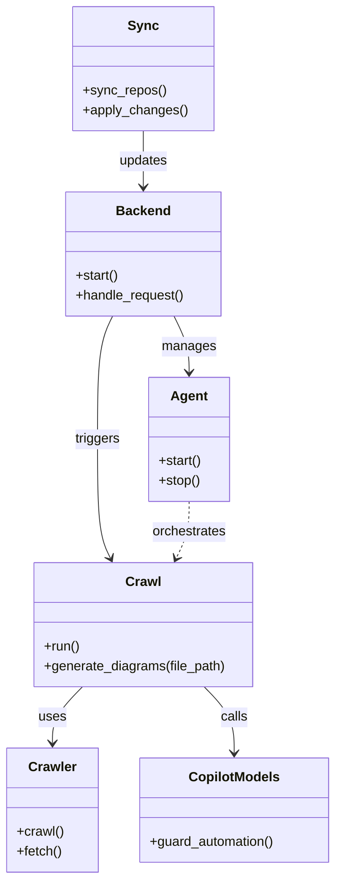

# Diagram: partview_core/partview_service/config/config.qa2.yml


> Auto-generated by Obscura crawlers

## Diagram 1



### SVG

<svg id="container" width="402.921875" xmlns="http://www.w3.org/2000/svg" class="classDiagram" height="1062" viewBox="0 0 402.921875 1062" role="graphics-document document" aria-roledescription="class"><style>#container{font-family:"trebuchet ms",verdana,arial,sans-serif;font-size:16px;fill:#333;}@keyframes edge-animation-frame{from{stroke-dashoffset:0;}}@keyframes dash{to{stroke-dashoffset:0;}}#container .edge-animation-slow{stroke-dasharray:9,5!important;stroke-dashoffset:900;animation:dash 50s linear infinite;stroke-linecap:round;}#container .edge-animation-fast{stroke-dasharray:9,5!important;stroke-dashoffset:900;animation:dash 20s linear infinite;stroke-linecap:round;}#container .error-icon{fill:#552222;}#container .error-text{fill:#552222;stroke:#552222;}#container .edge-thickness-normal{stroke-width:1px;}#container .edge-thickness-thick{stroke-width:3.5px;}#container .edge-pattern-solid{stroke-dasharray:0;}#container .edge-thickness-invisible{stroke-width:0;fill:none;}#container .edge-pattern-dashed{stroke-dasharray:3;}#container .edge-pattern-dotted{stroke-dasharray:2;}#container .marker{fill:#333333;stroke:#333333;}#container .marker.cross{stroke:#333333;}#container svg{font-family:"trebuchet ms",verdana,arial,sans-serif;font-size:16px;}#container p{margin:0;}#container g.classGroup text{fill:#9370DB;stroke:none;font-family:"trebuchet ms",verdana,arial,sans-serif;font-size:10px;}#container g.classGroup text .title{font-weight:bolder;}#container .nodeLabel,#container .edgeLabel{color:#131300;}#container .edgeLabel .label rect{fill:#ECECFF;}#container .label text{fill:#131300;}#container .labelBkg{background:#ECECFF;}#container .edgeLabel .label span{background:#ECECFF;}#container .classTitle{font-weight:bolder;}#container .node rect,#container .node circle,#container .node ellipse,#container .node polygon,#container .node path{fill:#ECECFF;stroke:#9370DB;stroke-width:1px;}#container .divider{stroke:#9370DB;stroke-width:1;}#container g.clickable{cursor:pointer;}#container g.classGroup rect{fill:#ECECFF;stroke:#9370DB;}#container g.classGroup line{stroke:#9370DB;stroke-width:1;}#container .classLabel .box{stroke:none;stroke-width:0;fill:#ECECFF;opacity:0.5;}#container .classLabel .label{fill:#9370DB;font-size:10px;}#container .relation{stroke:#333333;stroke-width:1;fill:none;}#container .dashed-line{stroke-dasharray:3;}#container .dotted-line{stroke-dasharray:1 2;}#container #compositionStart,#container .composition{fill:#333333!important;stroke:#333333!important;stroke-width:1;}#container #compositionEnd,#container .composition{fill:#333333!important;stroke:#333333!important;stroke-width:1;}#container #dependencyStart,#container .dependency{fill:#333333!important;stroke:#333333!important;stroke-width:1;}#container #dependencyStart,#container .dependency{fill:#333333!important;stroke:#333333!important;stroke-width:1;}#container #extensionStart,#container .extension{fill:transparent!important;stroke:#333333!important;stroke-width:1;}#container #extensionEnd,#container .extension{fill:transparent!important;stroke:#333333!important;stroke-width:1;}#container #aggregationStart,#container .aggregation{fill:transparent!important;stroke:#333333!important;stroke-width:1;}#container #aggregationEnd,#container .aggregation{fill:transparent!important;stroke:#333333!important;stroke-width:1;}#container #lollipopStart,#container .lollipop{fill:#ECECFF!important;stroke:#333333!important;stroke-width:1;}#container #lollipopEnd,#container .lollipop{fill:#ECECFF!important;stroke:#333333!important;stroke-width:1;}#container .edgeTerminals{font-size:11px;line-height:initial;}#container .classTitleText{text-anchor:middle;font-size:18px;fill:#333;}#container .label-icon{display:inline-block;height:1em;overflow:visible;vertical-align:-0.125em;}#container .node .label-icon path{fill:currentColor;stroke:revert;stroke-width:revert;}#container :root{--mermaid-font-family:"trebuchet ms",verdana,arial,sans-serif;}</style><g><defs><marker id="container_class-aggregationStart" class="marker aggregation class" refX="18" refY="7" markerWidth="190" markerHeight="240" orient="auto"><path d="M 18,7 L9,13 L1,7 L9,1 Z"></path></marker></defs><defs><marker id="container_class-aggregationEnd" class="marker aggregation class" refX="1" refY="7" markerWidth="20" markerHeight="28" orient="auto"><path d="M 18,7 L9,13 L1,7 L9,1 Z"></path></marker></defs><defs><marker id="container_class-extensionStart" class="marker extension class" refX="18" refY="7" markerWidth="190" markerHeight="240" orient="auto"><path d="M 1,7 L18,13 V 1 Z"></path></marker></defs><defs><marker id="container_class-extensionEnd" class="marker extension class" refX="1" refY="7" markerWidth="20" markerHeight="28" orient="auto"><path d="M 1,1 V 13 L18,7 Z"></path></marker></defs><defs><marker id="container_class-compositionStart" class="marker composition class" refX="18" refY="7" markerWidth="190" markerHeight="240" orient="auto"><path d="M 18,7 L9,13 L1,7 L9,1 Z"></path></marker></defs><defs><marker id="container_class-compositionEnd" class="marker composition class" refX="1" refY="7" markerWidth="20" markerHeight="28" orient="auto"><path d="M 18,7 L9,13 L1,7 L9,1 Z"></path></marker></defs><defs><marker id="container_class-dependencyStart" class="marker dependency class" refX="6" refY="7" markerWidth="190" markerHeight="240" orient="auto"><path d="M 5,7 L9,13 L1,7 L9,1 Z"></path></marker></defs><defs><marker id="container_class-dependencyEnd" class="marker dependency class" refX="13" refY="7" markerWidth="20" markerHeight="28" orient="auto"><path d="M 18,7 L9,13 L14,7 L9,1 Z"></path></marker></defs><defs><marker id="container_class-lollipopStart" class="marker lollipop class" refX="13" refY="7" markerWidth="190" markerHeight="240" orient="auto"><circle stroke="black" fill="transparent" cx="7" cy="7" r="6"></circle></marker></defs><defs><marker id="container_class-lollipopEnd" class="marker lollipop class" refX="1" refY="7" markerWidth="190" markerHeight="240" orient="auto"><circle stroke="black" fill="transparent" cx="7" cy="7" r="6"></circle></marker></defs><g class="root"><g class="clusters"></g><g class="edgePaths"><path d="M98.155,830L92.141,836.167C86.127,842.333,74.099,854.667,68.084,866C62.07,877.333,62.07,887.667,62.07,892.833L62.07,898" id="id_Crawl_Crawler_1" class="edge-thickness-normal edge-pattern-solid relation" style=";;;" data-edge="true" data-et="edge" data-id="id_Crawl_Crawler_1" data-points="W3sieCI6OTguMTU1Mzc4MDY5MTk2NDMsInkiOjgzMH0seyJ4Ijo2Mi4wNzAzMTI1LCJ5Ijo4Njd9LHsieCI6NjIuMDcwMzEyNSwieSI6OTA0fV0=" marker-end="url(#container_class-dependencyEnd)"></path><path d="M244.446,830L250.46,836.167C256.475,842.333,268.503,854.667,274.517,868C280.531,881.333,280.531,895.667,280.531,902.833L280.531,910" id="id_Crawl_CopilotModels_2" class="edge-thickness-normal edge-pattern-solid relation" style=";;;" data-edge="true" data-et="edge" data-id="id_Crawl_CopilotModels_2" data-points="W3sieCI6MjQ0LjQ0NjE4NDQzMDgwMzU2LCJ5Ijo4MzB9LHsieCI6MjgwLjUzMTI1LCJ5Ijo4Njd9LHsieCI6MjgwLjUzMTI1LCJ5Ijo5MTZ9XQ==" marker-end="url(#container_class-dependencyEnd)"></path><path d="M134.099,382L131.04,388.167C127.981,394.333,121.864,406.667,118.805,431.5C115.746,456.333,115.746,493.667,115.746,531C115.746,568.333,115.746,605.667,118.361,629.604C120.975,653.542,126.204,664.083,128.818,669.354L131.433,674.625" id="id_Backend_Crawl_3" class="edge-thickness-normal edge-pattern-solid relation" style=";;;" data-edge="true" data-et="edge" data-id="id_Backend_Crawl_3" data-points="W3sieCI6MTM0LjA5ODk4MTU4NDgyMTQ0LCJ5IjozODJ9LHsieCI6MTE1Ljc0NjA5Mzc1LCJ5Ijo0MTl9LHsieCI6MTE1Ljc0NjA5Mzc1LCJ5Ijo1MzF9LHsieCI6MTE1Ljc0NjA5Mzc1LCJ5Ijo2NDN9LHsieCI6MTM0LjA5ODk4MTU4NDgyMTQ0LCJ5Ijo2ODB9XQ==" marker-end="url(#container_class-dependencyEnd)"></path><path d="M208.503,382L211.561,388.167C214.62,394.333,220.738,406.667,223.797,418C226.855,429.333,226.855,439.667,226.855,444.833L226.855,450" id="id_Backend_Agent_4" class="edge-thickness-normal edge-pattern-solid relation" style=";;;" data-edge="true" data-et="edge" data-id="id_Backend_Agent_4" data-points="W3sieCI6MjA4LjUwMjU4MDkxNTE3ODU2LCJ5IjozODJ9LHsieCI6MjI2Ljg1NTQ2ODc1LCJ5Ijo0MTl9LHsieCI6MjI2Ljg1NTQ2ODc1LCJ5Ijo0NTZ9XQ==" marker-end="url(#container_class-dependencyEnd)"></path><path d="M171.301,158L171.301,164.167C171.301,170.333,171.301,182.667,171.301,194C171.301,205.333,171.301,215.667,171.301,220.833L171.301,226" id="id_Sync_Backend_5" class="edge-thickness-normal edge-pattern-solid relation" style=";;;" data-edge="true" data-et="edge" data-id="id_Sync_Backend_5" data-points="W3sieCI6MTcxLjMwMDc4MTI1LCJ5IjoxNTh9LHsieCI6MTcxLjMwMDc4MTI1LCJ5IjoxOTV9LHsieCI6MTcxLjMwMDc4MTI1LCJ5IjoyMzJ9XQ==" marker-end="url(#container_class-dependencyEnd)"></path><path d="M226.855,606L226.855,612.167C226.855,618.333,226.855,630.667,224.241,642.104C221.627,653.542,216.398,664.083,213.783,669.354L211.169,674.625" id="id_Agent_Crawl_6" class="edge-thickness-normal edge-pattern-dashed relation" style=";;;" data-edge="true" data-et="edge" data-id="id_Agent_Crawl_6" data-points="W3sieCI6MjI2Ljg1NTQ2ODc1LCJ5Ijo2MDZ9LHsieCI6MjI2Ljg1NTQ2ODc1LCJ5Ijo2NDN9LHsieCI6MjA4LjUwMjU4MDkxNTE3ODU2LCJ5Ijo2ODB9XQ==" marker-end="url(#container_class-dependencyEnd)"></path></g><g class="edgeLabels"><g class="edgeLabel" transform="translate(62.0703125, 867)"><g class="label" data-id="id_Crawl_Crawler_1" transform="translate(-16.4921875, -12)"><foreignObject width="32.984375" height="24"><div xmlns="http://www.w3.org/1999/xhtml" class="labelBkg" style="display: table-cell; white-space: nowrap; line-height: 1.5; max-width: 200px; text-align: center;"><span class="edgeLabel"><p>uses</p></span></div></foreignObject></g></g><g class="edgeLabel" transform="translate(280.53125, 867)"><g class="label" data-id="id_Crawl_CopilotModels_2" transform="translate(-16.4453125, -12)"><foreignObject width="32.890625" height="24"><div xmlns="http://www.w3.org/1999/xhtml" class="labelBkg" style="display: table-cell; white-space: nowrap; line-height: 1.5; max-width: 200px; text-align: center;"><span class="edgeLabel"><p>calls</p></span></div></foreignObject></g></g><g class="edgeLabel" transform="translate(115.74609375, 531)"><g class="label" data-id="id_Backend_Crawl_3" transform="translate(-27.4921875, -12)"><foreignObject width="54.984375" height="24"><div xmlns="http://www.w3.org/1999/xhtml" class="labelBkg" style="display: table-cell; white-space: nowrap; line-height: 1.5; max-width: 200px; text-align: center;"><span class="edgeLabel"><p>triggers</p></span></div></foreignObject></g></g><g class="edgeLabel" transform="translate(226.85546875, 419)"><g class="label" data-id="id_Backend_Agent_4" transform="translate(-32.296875, -12)"><foreignObject width="64.59375" height="24"><div xmlns="http://www.w3.org/1999/xhtml" class="labelBkg" style="display: table-cell; white-space: nowrap; line-height: 1.5; max-width: 200px; text-align: center;"><span class="edgeLabel"><p>manages</p></span></div></foreignObject></g></g><g class="edgeLabel" transform="translate(171.30078125, 195)"><g class="label" data-id="id_Sync_Backend_5" transform="translate(-29.4140625, -12)"><foreignObject width="58.828125" height="24"><div xmlns="http://www.w3.org/1999/xhtml" class="labelBkg" style="display: table-cell; white-space: nowrap; line-height: 1.5; max-width: 200px; text-align: center;"><span class="edgeLabel"><p>updates</p></span></div></foreignObject></g></g><g class="edgeLabel" transform="translate(226.85546875, 643)"><g class="label" data-id="id_Agent_Crawl_6" transform="translate(-45.046875, -12)"><foreignObject width="90.09375" height="24"><div xmlns="http://www.w3.org/1999/xhtml" class="labelBkg" style="display: table-cell; white-space: nowrap; line-height: 1.5; max-width: 200px; text-align: center;"><span class="edgeLabel"><p>orchestrates</p></span></div></foreignObject></g></g></g><g class="nodes"><g class="node default" id="classId-Crawl-0" transform="translate(171.30078125, 755)"><g class="basic label-container"><path d="M-131.91015625 -75 L131.91015625 -75 L131.91015625 75 L-131.91015625 75" stroke="none" stroke-width="0" fill="#ECECFF" style=""></path><path d="M-131.91015625 -75 C-59.29023668615932 -75, 13.329682877681364 -75, 131.91015625 -75 M-131.91015625 -75 C-29.03175094174331 -75, 73.84665436651338 -75, 131.91015625 -75 M131.91015625 -75 C131.91015625 -27.237887864271826, 131.91015625 20.524224271456347, 131.91015625 75 M131.91015625 -75 C131.91015625 -26.382126937609236, 131.91015625 22.235746124781528, 131.91015625 75 M131.91015625 75 C51.328362070884765 75, -29.25343210823047 75, -131.91015625 75 M131.91015625 75 C51.47177494168818 75, -28.966606366623637 75, -131.91015625 75 M-131.91015625 75 C-131.91015625 36.20679113650146, -131.91015625 -2.586417726997084, -131.91015625 -75 M-131.91015625 75 C-131.91015625 38.5662857584561, -131.91015625 2.1325715169121935, -131.91015625 -75" stroke="#9370DB" stroke-width="1.3" fill="none" stroke-dasharray="0 0" style=""></path></g><g class="annotation-group text" transform="translate(0, -51)"></g><g class="label-group text" transform="translate(-20.1484375, -51)"><g class="label" style="font-weight: bolder" transform="translate(0,-12)"><foreignObject width="40.296875" height="24"><div xmlns="http://www.w3.org/1999/xhtml" style="display: table-cell; white-space: nowrap; line-height: 1.5; max-width: 89px; text-align: center;"><span class="nodeLabel markdown-node-label" style=""><p>Crawl</p></span></div></foreignObject></g></g><g class="members-group text" transform="translate(-119.91015625, -3)"></g><g class="methods-group text" transform="translate(-119.91015625, 27)"><g class="label" style="" transform="translate(0,-12)"><foreignObject width="43.21875" height="24"><div xmlns="http://www.w3.org/1999/xhtml" style="display: table-cell; white-space: nowrap; line-height: 1.5; max-width: 101px; text-align: center;"><span class="nodeLabel markdown-node-label" style=""><p>+run()</p></span></div></foreignObject></g><g class="label" style="" transform="translate(0,12)"><foreignObject width="219.671875" height="24"><div xmlns="http://www.w3.org/1999/xhtml" style="display: table-cell; white-space: nowrap; line-height: 1.5; max-width: 277px; text-align: center;"><span class="nodeLabel markdown-node-label" style=""><p>+generate_diagrams(file_path)</p></span></div></foreignObject></g></g><g class="divider" style=""><path d="M-131.91015625 -27 C-52.346745608073704 -27, 27.216665033852593 -27, 131.91015625 -27 M-131.91015625 -27 C-58.06503226913898 -27, 15.780091711722037 -27, 131.91015625 -27" stroke="#9370DB" stroke-width="1.3" fill="none" stroke-dasharray="0 0" style=""></path></g><g class="divider" style=""><path d="M-131.91015625 -3 C-43.38833516104259 -3, 45.13348592791482 -3, 131.91015625 -3 M-131.91015625 -3 C-73.0297453638262 -3, -14.149334477652388 -3, 131.91015625 -3" stroke="#9370DB" stroke-width="1.3" fill="none" stroke-dasharray="0 0" style=""></path></g></g><g class="node default" id="classId-Crawler-1" transform="translate(62.0703125, 979)"><g class="basic label-container"><path d="M-54.0703125 -75 L54.0703125 -75 L54.0703125 75 L-54.0703125 75" stroke="none" stroke-width="0" fill="#ECECFF" style=""></path><path d="M-54.0703125 -75 C-23.051591753669893 -75, 7.967128992660214 -75, 54.0703125 -75 M-54.0703125 -75 C-14.78152099595981 -75, 24.50727050808038 -75, 54.0703125 -75 M54.0703125 -75 C54.0703125 -35.03893880792554, 54.0703125 4.922122384148921, 54.0703125 75 M54.0703125 -75 C54.0703125 -31.704352792728464, 54.0703125 11.591294414543071, 54.0703125 75 M54.0703125 75 C18.45735169100655 75, -17.1556091179869 75, -54.0703125 75 M54.0703125 75 C21.6430160010364 75, -10.784280497927199 75, -54.0703125 75 M-54.0703125 75 C-54.0703125 15.728112430881517, -54.0703125 -43.54377513823697, -54.0703125 -75 M-54.0703125 75 C-54.0703125 29.366925624449195, -54.0703125 -16.26614875110161, -54.0703125 -75" stroke="#9370DB" stroke-width="1.3" fill="none" stroke-dasharray="0 0" style=""></path></g><g class="annotation-group text" transform="translate(0, -51)"></g><g class="label-group text" transform="translate(-27.734375, -51)"><g class="label" style="font-weight: bolder" transform="translate(0,-12)"><foreignObject width="55.46875" height="24"><div xmlns="http://www.w3.org/1999/xhtml" style="display: table-cell; white-space: nowrap; line-height: 1.5; max-width: 105px; text-align: center;"><span class="nodeLabel markdown-node-label" style=""><p>Crawler</p></span></div></foreignObject></g></g><g class="members-group text" transform="translate(-42.0703125, -3)"></g><g class="methods-group text" transform="translate(-42.0703125, 27)"><g class="label" style="" transform="translate(0,-12)"><foreignObject width="56.40625" height="24"><div xmlns="http://www.w3.org/1999/xhtml" style="display: table-cell; white-space: nowrap; line-height: 1.5; max-width: 114px; text-align: center;"><span class="nodeLabel markdown-node-label" style=""><p>+crawl()</p></span></div></foreignObject></g><g class="label" style="" transform="translate(0,12)"><foreignObject width="54.59375" height="24"><div xmlns="http://www.w3.org/1999/xhtml" style="display: table-cell; white-space: nowrap; line-height: 1.5; max-width: 112px; text-align: center;"><span class="nodeLabel markdown-node-label" style=""><p>+fetch()</p></span></div></foreignObject></g></g><g class="divider" style=""><path d="M-54.0703125 -27 C-22.89514160188794 -27, 8.280029296224122 -27, 54.0703125 -27 M-54.0703125 -27 C-11.535272070103936 -27, 30.999768359792128 -27, 54.0703125 -27" stroke="#9370DB" stroke-width="1.3" fill="none" stroke-dasharray="0 0" style=""></path></g><g class="divider" style=""><path d="M-54.0703125 -3 C-18.10087144708904 -3, 17.868569605821918 -3, 54.0703125 -3 M-54.0703125 -3 C-15.961583493983284 -3, 22.147145512033433 -3, 54.0703125 -3" stroke="#9370DB" stroke-width="1.3" fill="none" stroke-dasharray="0 0" style=""></path></g></g><g class="node default" id="classId-Sync-2" transform="translate(171.30078125, 83)"><g class="basic label-container"><path d="M-83.1015625 -75 L83.1015625 -75 L83.1015625 75 L-83.1015625 75" stroke="none" stroke-width="0" fill="#ECECFF" style=""></path><path d="M-83.1015625 -75 C-32.89810934820685 -75, 17.305343803586297 -75, 83.1015625 -75 M-83.1015625 -75 C-24.234135584809067 -75, 34.633291330381866 -75, 83.1015625 -75 M83.1015625 -75 C83.1015625 -29.013767512830974, 83.1015625 16.972464974338052, 83.1015625 75 M83.1015625 -75 C83.1015625 -39.76841554724732, 83.1015625 -4.536831094494644, 83.1015625 75 M83.1015625 75 C26.445403130226865 75, -30.21075623954627 75, -83.1015625 75 M83.1015625 75 C27.638848868368903 75, -27.823864763262193 75, -83.1015625 75 M-83.1015625 75 C-83.1015625 29.246975921224873, -83.1015625 -16.506048157550254, -83.1015625 -75 M-83.1015625 75 C-83.1015625 16.978483113788158, -83.1015625 -41.043033772423684, -83.1015625 -75" stroke="#9370DB" stroke-width="1.3" fill="none" stroke-dasharray="0 0" style=""></path></g><g class="annotation-group text" transform="translate(0, -51)"></g><g class="label-group text" transform="translate(-17.09375, -51)"><g class="label" style="font-weight: bolder" transform="translate(0,-12)"><foreignObject width="34.1875" height="24"><div xmlns="http://www.w3.org/1999/xhtml" style="display: table-cell; white-space: nowrap; line-height: 1.5; max-width: 84px; text-align: center;"><span class="nodeLabel markdown-node-label" style=""><p>Sync</p></span></div></foreignObject></g></g><g class="members-group text" transform="translate(-71.1015625, -3)"></g><g class="methods-group text" transform="translate(-71.1015625, 27)"><g class="label" style="" transform="translate(0,-12)"><foreignObject width="99.515625" height="24"><div xmlns="http://www.w3.org/1999/xhtml" style="display: table-cell; white-space: nowrap; line-height: 1.5; max-width: 157px; text-align: center;"><span class="nodeLabel markdown-node-label" style=""><p>+sync_repos()</p></span></div></foreignObject></g><g class="label" style="" transform="translate(0,12)"><foreignObject width="125.109375" height="24"><div xmlns="http://www.w3.org/1999/xhtml" style="display: table-cell; white-space: nowrap; line-height: 1.5; max-width: 182px; text-align: center;"><span class="nodeLabel markdown-node-label" style=""><p>+apply_changes()</p></span></div></foreignObject></g></g><g class="divider" style=""><path d="M-83.1015625 -27 C-31.084191284494672 -27, 20.933179931010656 -27, 83.1015625 -27 M-83.1015625 -27 C-25.804981589745402 -27, 31.491599320509195 -27, 83.1015625 -27" stroke="#9370DB" stroke-width="1.3" fill="none" stroke-dasharray="0 0" style=""></path></g><g class="divider" style=""><path d="M-83.1015625 -3 C-24.353415569795814 -3, 34.39473136040837 -3, 83.1015625 -3 M-83.1015625 -3 C-31.806423166083178 -3, 19.488716167833644 -3, 83.1015625 -3" stroke="#9370DB" stroke-width="1.3" fill="none" stroke-dasharray="0 0" style=""></path></g></g><g class="node default" id="classId-Backend-3" transform="translate(171.30078125, 307)"><g class="basic label-container"><path d="M-93.6328125 -75 L93.6328125 -75 L93.6328125 75 L-93.6328125 75" stroke="none" stroke-width="0" fill="#ECECFF" style=""></path><path d="M-93.6328125 -75 C-28.327324314865052 -75, 36.978163870269896 -75, 93.6328125 -75 M-93.6328125 -75 C-20.500459856298875 -75, 52.63189278740225 -75, 93.6328125 -75 M93.6328125 -75 C93.6328125 -36.520661833431284, 93.6328125 1.9586763331374328, 93.6328125 75 M93.6328125 -75 C93.6328125 -39.364595099904456, 93.6328125 -3.7291901998089116, 93.6328125 75 M93.6328125 75 C38.264021556445655 75, -17.10476938710869 75, -93.6328125 75 M93.6328125 75 C19.979667957004324 75, -53.67347658599135 75, -93.6328125 75 M-93.6328125 75 C-93.6328125 15.10744730247498, -93.6328125 -44.78510539505004, -93.6328125 -75 M-93.6328125 75 C-93.6328125 21.41930585825324, -93.6328125 -32.16138828349352, -93.6328125 -75" stroke="#9370DB" stroke-width="1.3" fill="none" stroke-dasharray="0 0" style=""></path></g><g class="annotation-group text" transform="translate(0, -51)"></g><g class="label-group text" transform="translate(-31.296875, -51)"><g class="label" style="font-weight: bolder" transform="translate(0,-12)"><foreignObject width="62.59375" height="24"><div xmlns="http://www.w3.org/1999/xhtml" style="display: table-cell; white-space: nowrap; line-height: 1.5; max-width: 112px; text-align: center;"><span class="nodeLabel markdown-node-label" style=""><p>Backend</p></span></div></foreignObject></g></g><g class="members-group text" transform="translate(-81.6328125, -3)"></g><g class="methods-group text" transform="translate(-81.6328125, 27)"><g class="label" style="" transform="translate(0,-12)"><foreignObject width="52.15625" height="24"><div xmlns="http://www.w3.org/1999/xhtml" style="display: table-cell; white-space: nowrap; line-height: 1.5; max-width: 110px; text-align: center;"><span class="nodeLabel markdown-node-label" style=""><p>+start()</p></span></div></foreignObject></g><g class="label" style="" transform="translate(0,12)"><foreignObject width="131.96875" height="24"><div xmlns="http://www.w3.org/1999/xhtml" style="display: table-cell; white-space: nowrap; line-height: 1.5; max-width: 189px; text-align: center;"><span class="nodeLabel markdown-node-label" style=""><p>+handle_request()</p></span></div></foreignObject></g></g><g class="divider" style=""><path d="M-93.6328125 -27 C-20.42867737231792 -27, 52.77545775536416 -27, 93.6328125 -27 M-93.6328125 -27 C-34.63574979240285 -27, 24.361312915194304 -27, 93.6328125 -27" stroke="#9370DB" stroke-width="1.3" fill="none" stroke-dasharray="0 0" style=""></path></g><g class="divider" style=""><path d="M-93.6328125 -3 C-27.85762744103893 -3, 37.91755761792214 -3, 93.6328125 -3 M-93.6328125 -3 C-50.39569318433079 -3, -7.158573868661577 -3, 93.6328125 -3" stroke="#9370DB" stroke-width="1.3" fill="none" stroke-dasharray="0 0" style=""></path></g></g><g class="node default" id="classId-Agent-4" transform="translate(226.85546875, 531)"><g class="basic label-container"><path d="M-48.6171875 -75 L48.6171875 -75 L48.6171875 75 L-48.6171875 75" stroke="none" stroke-width="0" fill="#ECECFF" style=""></path><path d="M-48.6171875 -75 C-23.678232385708004 -75, 1.2607227285839926 -75, 48.6171875 -75 M-48.6171875 -75 C-14.669575874119218 -75, 19.278035751761564 -75, 48.6171875 -75 M48.6171875 -75 C48.6171875 -31.079276139421815, 48.6171875 12.84144772115637, 48.6171875 75 M48.6171875 -75 C48.6171875 -44.95215370855076, 48.6171875 -14.90430741710152, 48.6171875 75 M48.6171875 75 C14.4815242047573 75, -19.6541390904854 75, -48.6171875 75 M48.6171875 75 C13.651962864659232 75, -21.313261770681535 75, -48.6171875 75 M-48.6171875 75 C-48.6171875 23.754965004793746, -48.6171875 -27.490069990412508, -48.6171875 -75 M-48.6171875 75 C-48.6171875 18.412945166196877, -48.6171875 -38.174109667606245, -48.6171875 -75" stroke="#9370DB" stroke-width="1.3" fill="none" stroke-dasharray="0 0" style=""></path></g><g class="annotation-group text" transform="translate(0, -51)"></g><g class="label-group text" transform="translate(-21.078125, -51)"><g class="label" style="font-weight: bolder" transform="translate(0,-12)"><foreignObject width="42.15625" height="24"><div xmlns="http://www.w3.org/1999/xhtml" style="display: table-cell; white-space: nowrap; line-height: 1.5; max-width: 91px; text-align: center;"><span class="nodeLabel markdown-node-label" style=""><p>Agent</p></span></div></foreignObject></g></g><g class="members-group text" transform="translate(-36.6171875, -3)"></g><g class="methods-group text" transform="translate(-36.6171875, 27)"><g class="label" style="" transform="translate(0,-12)"><foreignObject width="52.15625" height="24"><div xmlns="http://www.w3.org/1999/xhtml" style="display: table-cell; white-space: nowrap; line-height: 1.5; max-width: 110px; text-align: center;"><span class="nodeLabel markdown-node-label" style=""><p>+start()</p></span></div></foreignObject></g><g class="label" style="" transform="translate(0,12)"><foreignObject width="50.21875" height="24"><div xmlns="http://www.w3.org/1999/xhtml" style="display: table-cell; white-space: nowrap; line-height: 1.5; max-width: 108px; text-align: center;"><span class="nodeLabel markdown-node-label" style=""><p>+stop()</p></span></div></foreignObject></g></g><g class="divider" style=""><path d="M-48.6171875 -27 C-29.00358359081237 -27, -9.389979681624737 -27, 48.6171875 -27 M-48.6171875 -27 C-21.088804268733846 -27, 6.439578962532309 -27, 48.6171875 -27" stroke="#9370DB" stroke-width="1.3" fill="none" stroke-dasharray="0 0" style=""></path></g><g class="divider" style=""><path d="M-48.6171875 -3 C-22.26811279784082 -3, 4.080961904318357 -3, 48.6171875 -3 M-48.6171875 -3 C-15.54496138232539 -3, 17.52726473534922 -3, 48.6171875 -3" stroke="#9370DB" stroke-width="1.3" fill="none" stroke-dasharray="0 0" style=""></path></g></g><g class="node default" id="classId-CopilotModels-5" transform="translate(280.53125, 979)"><g class="basic label-container"><path d="M-114.390625 -63 L114.390625 -63 L114.390625 63 L-114.390625 63" stroke="none" stroke-width="0" fill="#ECECFF" style=""></path><path d="M-114.390625 -63 C-33.24806965745442 -63, 47.894485685091155 -63, 114.390625 -63 M-114.390625 -63 C-26.616822024315383 -63, 61.156980951369235 -63, 114.390625 -63 M114.390625 -63 C114.390625 -35.867769321772315, 114.390625 -8.735538643544636, 114.390625 63 M114.390625 -63 C114.390625 -26.169714249394318, 114.390625 10.660571501211365, 114.390625 63 M114.390625 63 C29.147163218916006 63, -56.09629856216799 63, -114.390625 63 M114.390625 63 C46.14124309285259 63, -22.10813881429482 63, -114.390625 63 M-114.390625 63 C-114.390625 21.7354855295709, -114.390625 -19.529028940858197, -114.390625 -63 M-114.390625 63 C-114.390625 34.00510813374983, -114.390625 5.010216267499665, -114.390625 -63" stroke="#9370DB" stroke-width="1.3" fill="none" stroke-dasharray="0 0" style=""></path></g><g class="annotation-group text" transform="translate(0, -39)"></g><g class="label-group text" transform="translate(-52.65625, -39)"><g class="label" style="font-weight: bolder" transform="translate(0,-12)"><foreignObject width="105.3125" height="24"><div xmlns="http://www.w3.org/1999/xhtml" style="display: table-cell; white-space: nowrap; line-height: 1.5; max-width: 154px; text-align: center;"><span class="nodeLabel markdown-node-label" style=""><p>CopilotModels</p></span></div></foreignObject></g></g><g class="members-group text" transform="translate(-102.390625, 9)"></g><g class="methods-group text" transform="translate(-102.390625, 39)"><g class="label" style="" transform="translate(0,-12)"><foreignObject width="152.125" height="24"><div xmlns="http://www.w3.org/1999/xhtml" style="display: table-cell; white-space: nowrap; line-height: 1.5; max-width: 209px; text-align: center;"><span class="nodeLabel markdown-node-label" style=""><p>+guard_automation()</p></span></div></foreignObject></g></g><g class="divider" style=""><path d="M-114.390625 -15 C-67.38538149190568 -15, -20.380137983811352 -15, 114.390625 -15 M-114.390625 -15 C-41.00791898751025 -15, 32.3747870249795 -15, 114.390625 -15" stroke="#9370DB" stroke-width="1.3" fill="none" stroke-dasharray="0 0" style=""></path></g><g class="divider" style=""><path d="M-114.390625 9 C-31.3942970816272 9, 51.6020308367456 9, 114.390625 9 M-114.390625 9 C-62.30057824118352 9, -10.210531482367045 9, 114.390625 9" stroke="#9370DB" stroke-width="1.3" fill="none" stroke-dasharray="0 0" style=""></path></g></g></g></g></g></svg>

## Diagram 2

```mermaid
flowchart TD
    A[User/Trigger] -->|start crawl| B[Crawl.run()]
    B --> C{Read source files}
    C -->|has diagrams| D[Generate Mermaid via CopilotModels]
    C -->|no diagrams| E[Parse code structure]
    D --> F[Clean & split diagrams]
    E --> F
    F --> G[Persist diagrams (repos/docs)]
    G --> H[Sync.apply_changes()]
    H --> I[Backend.notify()]
```

> SVG rendering failed for this diagram.
