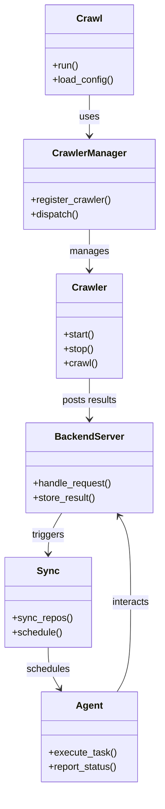
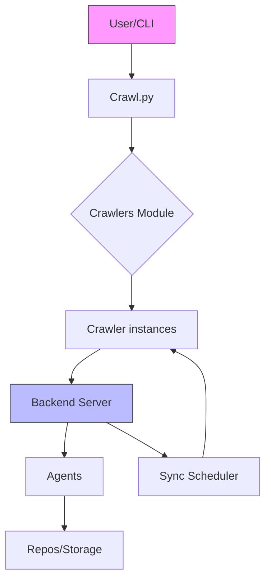

# Diagram: partview_core/partview_service/config/config.staging.yml

> Auto-generated by Obscura crawlers

## Diagram 1

### SVG

<svg id="container" width="262.9375" xmlns="http://www.w3.org/2000/svg" class="classDiagram" height="1310" viewBox="0 0 262.9375 1310" role="graphics-document document" aria-roledescription="class"><g><defs><marker id="container_class-aggregationStart" class="marker aggregation class" refX="18" refY="7" markerWidth="190" markerHeight="240" orient="auto"><path d="M 18,7 L9,13 L1,7 L9,1 Z"></path></marker></defs><defs><marker id="container_class-aggregationEnd" class="marker aggregation class" refX="1" refY="7" markerWidth="20" markerHeight="28" orient="auto"><path d="M 18,7 L9,13 L1,7 L9,1 Z"></path></marker></defs><defs><marker id="container_class-extensionStart" class="marker extension class" refX="18" refY="7" markerWidth="190" markerHeight="240" orient="auto"><path d="M 1,7 L18,13 V 1 Z"></path></marker></defs><defs><marker id="container_class-extensionEnd" class="marker extension class" refX="1" refY="7" markerWidth="20" markerHeight="28" orient="auto"><path d="M 1,1 V 13 L18,7 Z"></path></marker></defs><defs><marker id="container_class-compositionStart" class="marker composition class" refX="18" refY="7" markerWidth="190" markerHeight="240" orient="auto"><path d="M 18,7 L9,13 L1,7 L9,1 Z"></path></marker></defs><defs><marker id="container_class-compositionEnd" class="marker composition class" refX="1" refY="7" markerWidth="20" markerHeight="28" orient="auto"><path d="M 18,7 L9,13 L1,7 L9,1 Z"></path></marker></defs><defs><marker id="container_class-dependencyStart" class="marker dependency class" refX="6" refY="7" markerWidth="190" markerHeight="240" orient="auto"><path d="M 5,7 L9,13 L1,7 L9,1 Z"></path></marker></defs><defs><marker id="container_class-dependencyEnd" class="marker dependency class" refX="13" refY="7" markerWidth="20" markerHeight="28" orient="auto"><path d="M 18,7 L9,13 L14,7 L9,1 Z"></path></marker></defs><defs><marker id="container_class-lollipopStart" class="marker lollipop class" refX="13" refY="7" markerWidth="190" markerHeight="240" orient="auto"><circle stroke="black" fill="transparent" cx="7" cy="7" r="6"></circle></marker></defs><defs><marker id="container_class-lollipopEnd" class="marker lollipop class" refX="1" refY="7" markerWidth="190" markerHeight="240" orient="auto"><circle stroke="black" fill="transparent" cx="7" cy="7" r="6"></circle></marker></defs><g class="root"><g class="clusters"></g><g class="edgePaths"><path d="M146.801,158L146.801,164.167C146.801,170.333,146.801,182.667,146.801,194C146.801,205.333,146.801,215.667,146.801,220.833L146.801,226" id="id_Crawl_CrawlerManager_1" class="edge-thickness-normal edge-pattern-solid relation" style=";;;" data-edge="true" data-et="edge" data-id="id_Crawl_CrawlerManager_1" data-points="W3sieCI6MTQ2LjgwMDc4MTI1LCJ5IjoxNTh9LHsieCI6MTQ2LjgwMDc4MTI1LCJ5IjoxOTV9LHsieCI6MTQ2LjgwMDc4MTI1LCJ5IjoyMzJ9XQ==" marker-end="url(#container_class-dependencyEnd)"></path><path d="M146.801,382L146.801,388.167C146.801,394.333,146.801,406.667,146.801,418C146.801,429.333,146.801,439.667,146.801,444.833L146.801,450" id="id_CrawlerManager_Crawler_2" class="edge-thickness-normal edge-pattern-solid relation" style=";;;" data-edge="true" data-et="edge" data-id="id_CrawlerManager_Crawler_2" data-points="W3sieCI6MTQ2LjgwMDc4MTI1LCJ5IjozODJ9LHsieCI6MTQ2LjgwMDc4MTI1LCJ5Ijo0MTl9LHsieCI6MTQ2LjgwMDc4MTI1LCJ5Ijo0NTZ9XQ==" marker-end="url(#container_class-dependencyEnd)"></path><path d="M146.801,630L146.801,636.167C146.801,642.333,146.801,654.667,146.801,666C146.801,677.333,146.801,687.667,146.801,692.833L146.801,698" id="id_Crawler_BackendServer_3" class="edge-thickness-normal edge-pattern-solid relation" style=";;;" data-edge="true" data-et="edge" data-id="id_Crawler_BackendServer_3" data-points="W3sieCI6MTQ2LjgwMDc4MTI1LCJ5Ijo2MzB9LHsieCI6MTQ2LjgwMDc4MTI1LCJ5Ijo2Njd9LHsieCI6MTQ2LjgwMDc4MTI1LCJ5Ijo3MDR9XQ==" marker-end="url(#container_class-dependencyEnd)"></path><path d="M100.933,854L97.161,860.167C93.39,866.333,85.847,878.667,82.076,890C78.305,901.333,78.305,911.667,78.305,916.833L78.305,922" id="id_BackendServer_Sync_4" class="edge-thickness-normal edge-pattern-solid relation" style=";;;" data-edge="true" data-et="edge" data-id="id_BackendServer_Sync_4" data-points="W3sieCI6MTAwLjkzMjg2MTMyODEyNSwieSI6ODU0fSx7IngiOjc4LjMwNDY4NzUsInkiOjg5MX0seyJ4Ijo3OC4zMDQ2ODc1LCJ5Ijo5Mjh9XQ==" marker-end="url(#container_class-dependencyEnd)"></path><path d="M192.669,1152L196.44,1145.833C200.211,1139.667,207.754,1127.333,211.526,1102.5C215.297,1077.667,215.297,1040.333,215.297,1003C215.297,965.667,215.297,928.333,212.047,904.353C208.798,880.373,202.298,869.746,199.049,864.432L195.799,859.119" id="id_Agent_BackendServer_5" class="edge-thickness-normal edge-pattern-solid relation" style=";;;" data-edge="true" data-et="edge" data-id="id_Agent_BackendServer_5" data-points="W3sieCI6MTkyLjY2ODcwMTE3MTg3NSwieSI6MTE1Mn0seyJ4IjoyMTUuMjk2ODc1LCJ5IjoxMTE1fSx7IngiOjIxNS4yOTY4NzUsInkiOjEwMDN9LHsieCI6MjE1LjI5Njg3NSwieSI6ODkxfSx7IngiOjE5Mi42Njg3MDExNzE4NzUsInkiOjg1NH1d" marker-end="url(#container_class-dependencyEnd)"></path><path d="M78.305,1078L78.305,1084.167C78.305,1090.333,78.305,1102.667,81.554,1114.147C84.804,1125.627,91.303,1136.254,94.553,1141.568L97.802,1146.881" id="id_Sync_Agent_6" class="edge-thickness-normal edge-pattern-solid relation" style=";;;" data-edge="true" data-et="edge" data-id="id_Sync_Agent_6" data-points="W3sieCI6NzguMzA0Njg3NSwieSI6MTA3OH0seyJ4Ijo3OC4zMDQ2ODc1LCJ5IjoxMTE1fSx7IngiOjEwMC45MzI4NjEzMjgxMjUsInkiOjExNTJ9XQ==" marker-end="url(#container_class-dependencyEnd)"></path></g><g class="edgeLabels"><g class="edgeLabel" transform="translate(146.80078125, 195)"><g class="label" data-id="id_Crawl_CrawlerManager_1" transform="translate(-16.4921875, -12)"><foreignObject width="32.984375" height="24">

uses

</foreignObject></g></g><g class="edgeLabel" transform="translate(146.80078125, 419)"><g class="label" data-id="id_CrawlerManager_Crawler_2" transform="translate(-32.296875, -12)"><foreignObject width="64.59375" height="24">

manages

</foreignObject></g></g><g class="edgeLabel" transform="translate(146.80078125, 667)"><g class="label" data-id="id_Crawler_BackendServer_3" transform="translate(-46.4765625, -12)"><foreignObject width="92.953125" height="24">

posts results

</foreignObject></g></g><g class="edgeLabel" transform="translate(78.3046875, 891)"><g class="label" data-id="id_BackendServer_Sync_4" transform="translate(-27.4921875, -12)"><foreignObject width="54.984375" height="24">

triggers

</foreignObject></g></g><g class="edgeLabel" transform="translate(215.296875, 1003)"><g class="label" data-id="id_Agent_BackendServer_5" transform="translate(-31.6875, -12)"><foreignObject width="63.375" height="24">

interacts

</foreignObject></g></g><g class="edgeLabel" transform="translate(78.3046875, 1115)"><g class="label" data-id="id_Sync_Agent_6" transform="translate(-36.453125, -12)"><foreignObject width="72.90625" height="24">

schedules

</foreignObject></g></g></g><g class="nodes"><g class="node default" id="classId-Crawl-0" transform="translate(146.80078125, 83)"><g class="basic label-container"><path d="M-73.06640625 -75 L73.06640625 -75 L73.06640625 75 L-73.06640625 75" stroke="none" stroke-width="0" fill="#ECECFF" style=""></path><path d="M-73.06640625 -75 C-42.33419035731698 -75, -11.601974464633955 -75, 73.06640625 -75 M-73.06640625 -75 C-43.18809565553073 -75, -13.309785061061461 -75, 73.06640625 -75 M73.06640625 -75 C73.06640625 -32.24884782337393, 73.06640625 10.502304353252143, 73.06640625 75 M73.06640625 -75 C73.06640625 -31.31300931481666, 73.06640625 12.373981370366678, 73.06640625 75 M73.06640625 75 C26.733608789391262 75, -19.599188671217476 75, -73.06640625 75 M73.06640625 75 C40.80029959987803 75, 8.534192949756061 75, -73.06640625 75 M-73.06640625 75 C-73.06640625 34.99303920153991, -73.06640625 -5.013921596920184, -73.06640625 -75 M-73.06640625 75 C-73.06640625 30.02465103917025, -73.06640625 -14.950697921659497, -73.06640625 -75" stroke="#9370DB" stroke-width="1.3" fill="none" stroke-dasharray="0 0" style=""></path></g><g class="annotation-group text" transform="translate(0, -51)"></g><g class="label-group text" transform="translate(-20.1484375, -51)"><g class="label" style="font-weight: bolder" transform="translate(0,-12)"><foreignObject width="40.296875" height="24">

Crawl

</foreignObject></g></g><g class="members-group text" transform="translate(-61.06640625, -3)"></g><g class="methods-group text" transform="translate(-61.06640625, 27)"><g class="label" style="" transform="translate(0,-12)"><foreignObject width="43.21875" height="24">

+run()

</foreignObject></g><g class="label" style="" transform="translate(0,12)"><foreignObject width="101.984375" height="24">

+load_config()

</foreignObject></g></g><g class="divider" style=""><path d="M-73.06640625 -27 C-20.044200711650056 -27, 32.97800482669989 -27, 73.06640625 -27 M-73.06640625 -27 C-23.668350368878613 -27, 25.729705512242774 -27, 73.06640625 -27" stroke="#9370DB" stroke-width="1.3" fill="none" stroke-dasharray="0 0" style=""></path></g><g class="divider" style=""><path d="M-73.06640625 -3 C-37.1669579163005 -3, -1.2675095826009937 -3, 73.06640625 -3 M-73.06640625 -3 C-40.670737456202396 -3, -8.275068662404792 -3, 73.06640625 -3" stroke="#9370DB" stroke-width="1.3" fill="none" stroke-dasharray="0 0" style=""></path></g></g><g class="node default" id="classId-Crawler-1" transform="translate(146.80078125, 543)"><g class="basic label-container"><path d="M-54.0703125 -87 L54.0703125 -87 L54.0703125 87 L-54.0703125 87" stroke="none" stroke-width="0" fill="#ECECFF" style=""></path><path d="M-54.0703125 -87 C-19.793854140377455 -87, 14.48260421924509 -87, 54.0703125 -87 M-54.0703125 -87 C-25.25560768805685 -87, 3.5590971238863034 -87, 54.0703125 -87 M54.0703125 -87 C54.0703125 -34.41484898822221, 54.0703125 18.17030202355558, 54.0703125 87 M54.0703125 -87 C54.0703125 -47.323985213983875, 54.0703125 -7.647970427967749, 54.0703125 87 M54.0703125 87 C25.298609050024506 87, -3.4730943999509876 87, -54.0703125 87 M54.0703125 87 C27.046838201560462 87, 0.023363903120923624 87, -54.0703125 87 M-54.0703125 87 C-54.0703125 31.394030894259174, -54.0703125 -24.21193821148165, -54.0703125 -87 M-54.0703125 87 C-54.0703125 45.54508201016664, -54.0703125 4.090164020333276, -54.0703125 -87" stroke="#9370DB" stroke-width="1.3" fill="none" stroke-dasharray="0 0" style=""></path></g><g class="annotation-group text" transform="translate(0, -63)"></g><g class="label-group text" transform="translate(-27.734375, -63)"><g class="label" style="font-weight: bolder" transform="translate(0,-12)"><foreignObject width="55.46875" height="24">

Crawler

</foreignObject></g></g><g class="members-group text" transform="translate(-42.0703125, -15)"></g><g class="methods-group text" transform="translate(-42.0703125, 15)"><g class="label" style="" transform="translate(0,-12)"><foreignObject width="52.15625" height="24">

+start()

</foreignObject></g><g class="label" style="" transform="translate(0,12)"><foreignObject width="50.21875" height="24">

+stop()

</foreignObject></g><g class="label" style="" transform="translate(0,36)"><foreignObject width="56.40625" height="24">

+crawl()

</foreignObject></g></g><g class="divider" style=""><path d="M-54.0703125 -39 C-17.056370826358084 -39, 19.957570847283833 -39, 54.0703125 -39 M-54.0703125 -39 C-27.515344377312285 -39, -0.9603762546245704 -39, 54.0703125 -39" stroke="#9370DB" stroke-width="1.3" fill="none" stroke-dasharray="0 0" style=""></path></g><g class="divider" style=""><path d="M-54.0703125 -15 C-15.492111368850928 -15, 23.086089762298144 -15, 54.0703125 -15 M-54.0703125 -15 C-13.405219776825476 -15, 27.25987294634905 -15, 54.0703125 -15" stroke="#9370DB" stroke-width="1.3" fill="none" stroke-dasharray="0 0" style=""></path></g></g><g class="node default" id="classId-CrawlerManager-2" transform="translate(146.80078125, 307)"><g class="basic label-container"><path d="M-108.13671875 -75 L108.13671875 -75 L108.13671875 75 L-108.13671875 75" stroke="none" stroke-width="0" fill="#ECECFF" style=""></path><path d="M-108.13671875 -75 C-35.15367669319349 -75, 37.82936536361302 -75, 108.13671875 -75 M-108.13671875 -75 C-42.93096844619879 -75, 22.27478185760242 -75, 108.13671875 -75 M108.13671875 -75 C108.13671875 -27.496681434142737, 108.13671875 20.006637131714527, 108.13671875 75 M108.13671875 -75 C108.13671875 -33.61190622969854, 108.13671875 7.776187540602919, 108.13671875 75 M108.13671875 75 C64.20434548905958 75, 20.271972228119154 75, -108.13671875 75 M108.13671875 75 C27.772676567694475 75, -52.59136561461105 75, -108.13671875 75 M-108.13671875 75 C-108.13671875 20.689994001038208, -108.13671875 -33.620011997923584, -108.13671875 -75 M-108.13671875 75 C-108.13671875 15.44864161922304, -108.13671875 -44.10271676155392, -108.13671875 -75" stroke="#9370DB" stroke-width="1.3" fill="none" stroke-dasharray="0 0" style=""></path></g><g class="annotation-group text" transform="translate(0, -51)"></g><g class="label-group text" transform="translate(-59.1796875, -51)"><g class="label" style="font-weight: bolder" transform="translate(0,-12)"><foreignObject width="118.359375" height="24">

CrawlerManager

</foreignObject></g></g><g class="members-group text" transform="translate(-96.13671875, -3)"></g><g class="methods-group text" transform="translate(-96.13671875, 27)"><g class="label" style="" transform="translate(0,-12)"><foreignObject width="133.09375" height="24">

+register_crawler()

</foreignObject></g><g class="label" style="" transform="translate(0,12)"><foreignObject width="80.515625" height="24">

+dispatch()

</foreignObject></g></g><g class="divider" style=""><path d="M-108.13671875 -27 C-33.77944710055017 -27, 40.577824548899656 -27, 108.13671875 -27 M-108.13671875 -27 C-60.49826337159969 -27, -12.859807993199382 -27, 108.13671875 -27" stroke="#9370DB" stroke-width="1.3" fill="none" stroke-dasharray="0 0" style=""></path></g><g class="divider" style=""><path d="M-108.13671875 -3 C-53.403909037018146 -3, 1.328900675963709 -3, 108.13671875 -3 M-108.13671875 -3 C-50.79954186280009 -3, 6.537635024399819 -3, 108.13671875 -3" stroke="#9370DB" stroke-width="1.3" fill="none" stroke-dasharray="0 0" style=""></path></g></g><g class="node default" id="classId-Sync-3" transform="translate(78.3046875, 1003)"><g class="basic label-container"><path d="M-70.3046875 -75 L70.3046875 -75 L70.3046875 75 L-70.3046875 75" stroke="none" stroke-width="0" fill="#ECECFF" style=""></path><path d="M-70.3046875 -75 C-29.452403244274556 -75, 11.399881011450887 -75, 70.3046875 -75 M-70.3046875 -75 C-41.970177396152486 -75, -13.635667292304973 -75, 70.3046875 -75 M70.3046875 -75 C70.3046875 -36.202826147208505, 70.3046875 2.59434770558299, 70.3046875 75 M70.3046875 -75 C70.3046875 -29.498976872097458, 70.3046875 16.002046255805084, 70.3046875 75 M70.3046875 75 C14.77939818658259 75, -40.74589112683482 75, -70.3046875 75 M70.3046875 75 C30.531756271938846 75, -9.241174956122308 75, -70.3046875 75 M-70.3046875 75 C-70.3046875 44.87700160832779, -70.3046875 14.754003216655576, -70.3046875 -75 M-70.3046875 75 C-70.3046875 34.11209200227812, -70.3046875 -6.7758159954437645, -70.3046875 -75" stroke="#9370DB" stroke-width="1.3" fill="none" stroke-dasharray="0 0" style=""></path></g><g class="annotation-group text" transform="translate(0, -51)"></g><g class="label-group text" transform="translate(-17.09375, -51)"><g class="label" style="font-weight: bolder" transform="translate(0,-12)"><foreignObject width="34.1875" height="24">

Sync

</foreignObject></g></g><g class="members-group text" transform="translate(-58.3046875, -3)"></g><g class="methods-group text" transform="translate(-58.3046875, 27)"><g class="label" style="" transform="translate(0,-12)"><foreignObject width="99.515625" height="24">

+sync_repos()

</foreignObject></g><g class="label" style="" transform="translate(0,12)"><foreignObject width="83.78125" height="24">

+schedule()

</foreignObject></g></g><g class="divider" style=""><path d="M-70.3046875 -27 C-40.18529007583316 -27, -10.065892651666317 -27, 70.3046875 -27 M-70.3046875 -27 C-38.407511756726116 -27, -6.510336013452232 -27, 70.3046875 -27" stroke="#9370DB" stroke-width="1.3" fill="none" stroke-dasharray="0 0" style=""></path></g><g class="divider" style=""><path d="M-70.3046875 -3 C-40.996186881118916 -3, -11.687686262237833 -3, 70.3046875 -3 M-70.3046875 -3 C-23.57627904810878 -3, 23.15212940378244 -3, 70.3046875 -3" stroke="#9370DB" stroke-width="1.3" fill="none" stroke-dasharray="0 0" style=""></path></g></g><g class="node default" id="classId-BackendServer-4" transform="translate(146.80078125, 779)"><g class="basic label-container"><path d="M-105.56640625 -75 L105.56640625 -75 L105.56640625 75 L-105.56640625 75" stroke="none" stroke-width="0" fill="#ECECFF" style=""></path><path d="M-105.56640625 -75 C-53.144009982903235 -75, -0.7216137158064697 -75, 105.56640625 -75 M-105.56640625 -75 C-31.49055376840802 -75, 42.58529871318396 -75, 105.56640625 -75 M105.56640625 -75 C105.56640625 -20.8926528973416, 105.56640625 33.2146942053168, 105.56640625 75 M105.56640625 -75 C105.56640625 -21.04012966132907, 105.56640625 32.91974067734186, 105.56640625 75 M105.56640625 75 C37.111843370405865 75, -31.34271950918827 75, -105.56640625 75 M105.56640625 75 C32.84210334651118 75, -39.88219955697764 75, -105.56640625 75 M-105.56640625 75 C-105.56640625 37.57085221356182, -105.56640625 0.14170442712364206, -105.56640625 -75 M-105.56640625 75 C-105.56640625 36.91491062069048, -105.56640625 -1.1701787586190449, -105.56640625 -75" stroke="#9370DB" stroke-width="1.3" fill="none" stroke-dasharray="0 0" style=""></path></g><g class="annotation-group text" transform="translate(0, -51)"></g><g class="label-group text" transform="translate(-55.1640625, -51)"><g class="label" style="font-weight: bolder" transform="translate(0,-12)"><foreignObject width="110.328125" height="24">

BackendServer

</foreignObject></g></g><g class="members-group text" transform="translate(-93.56640625, -3)"></g><g class="methods-group text" transform="translate(-93.56640625, 27)"><g class="label" style="" transform="translate(0,-12)"><foreignObject width="131.96875" height="24">

+handle_request()

</foreignObject></g><g class="label" style="" transform="translate(0,12)"><foreignObject width="104.796875" height="24">

+store_result()

</foreignObject></g></g><g class="divider" style=""><path d="M-105.56640625 -27 C-47.9524777920467 -27, 9.6614506659066 -27, 105.56640625 -27 M-105.56640625 -27 C-21.726156161578544 -27, 62.11409392684291 -27, 105.56640625 -27" stroke="#9370DB" stroke-width="1.3" fill="none" stroke-dasharray="0 0" style=""></path></g><g class="divider" style=""><path d="M-105.56640625 -3 C-30.824044523490272 -3, 43.918317203019456 -3, 105.56640625 -3 M-105.56640625 -3 C-42.20930652213618 -3, 21.147793205727638 -3, 105.56640625 -3" stroke="#9370DB" stroke-width="1.3" fill="none" stroke-dasharray="0 0" style=""></path></g></g><g class="node default" id="classId-Agent-5" transform="translate(146.80078125, 1227)"><g class="basic label-container"><path d="M-80.6875 -75 L80.6875 -75 L80.6875 75 L-80.6875 75" stroke="none" stroke-width="0" fill="#ECECFF" style=""></path><path d="M-80.6875 -75 C-40.33210834939283 -75, 0.02328330121433453 -75, 80.6875 -75 M-80.6875 -75 C-47.49911499791642 -75, -14.310729995832844 -75, 80.6875 -75 M80.6875 -75 C80.6875 -17.329394734662706, 80.6875 40.34121053067459, 80.6875 75 M80.6875 -75 C80.6875 -24.67034673122709, 80.6875 25.659306537545817, 80.6875 75 M80.6875 75 C23.326600635238414 75, -34.03429872952317 75, -80.6875 75 M80.6875 75 C46.49893424371934 75, 12.31036848743868 75, -80.6875 75 M-80.6875 75 C-80.6875 34.783265167093084, -80.6875 -5.433469665813831, -80.6875 -75 M-80.6875 75 C-80.6875 42.49837600412534, -80.6875 9.99675200825068, -80.6875 -75" stroke="#9370DB" stroke-width="1.3" fill="none" stroke-dasharray="0 0" style=""></path></g><g class="annotation-group text" transform="translate(0, -51)"></g><g class="label-group text" transform="translate(-21.078125, -51)"><g class="label" style="font-weight: bolder" transform="translate(0,-12)"><foreignObject width="42.15625" height="24">

Agent

</foreignObject></g></g><g class="members-group text" transform="translate(-68.6875, -3)"></g><g class="methods-group text" transform="translate(-68.6875, 27)"><g class="label" style="" transform="translate(0,-12)"><foreignObject width="111.875" height="24">

+execute_task()

</foreignObject></g><g class="label" style="" transform="translate(0,12)"><foreignObject width="116.296875" height="24">

+report_status()

</foreignObject></g></g><g class="divider" style=""><path d="M-80.6875 -27 C-35.21011368247526 -27, 10.26727263504948 -27, 80.6875 -27 M-80.6875 -27 C-34.11894498828544 -27, 12.449610023429116 -27, 80.6875 -27" stroke="#9370DB" stroke-width="1.3" fill="none" stroke-dasharray="0 0" style=""></path></g><g class="divider" style=""><path d="M-80.6875 -3 C-18.40316267347999 -3, 43.88117465304002 -3, 80.6875 -3 M-80.6875 -3 C-39.55807042717281 -3, 1.5713591456543838 -3, 80.6875 -3" stroke="#9370DB" stroke-width="1.3" fill="none" stroke-dasharray="0 0" style=""></path></g></g></g></g></g></svg>

## Diagram 2

### SVG

<svg id="container" width="374.515625" xmlns="http://www.w3.org/2000/svg" class="flowchart" height="813.421875" viewBox="0 0 374.515625 813.421875" role="graphics-document document" aria-roledescription="flowchart-v2"><g><marker id="container_flowchart-v2-pointEnd" class="marker flowchart-v2" viewBox="0 0 10 10" refX="5" refY="5" markerUnits="userSpaceOnUse" markerWidth="8" markerHeight="8" orient="auto"><path d="M 0 0 L 10 5 L 0 10 z" class="arrowMarkerPath" style="stroke-width: 1; stroke-dasharray: 1, 0;"></path></marker><marker id="container_flowchart-v2-pointStart" class="marker flowchart-v2" viewBox="0 0 10 10" refX="4.5" refY="5" markerUnits="userSpaceOnUse" markerWidth="8" markerHeight="8" orient="auto"><path d="M 0 5 L 10 10 L 10 0 z" class="arrowMarkerPath" style="stroke-width: 1; stroke-dasharray: 1, 0;"></path></marker><marker id="container_flowchart-v2-circleEnd" class="marker flowchart-v2" viewBox="0 0 10 10" refX="11" refY="5" markerUnits="userSpaceOnUse" markerWidth="11" markerHeight="11" orient="auto"><circle cx="5" cy="5" r="5" class="arrowMarkerPath" style="stroke-width: 1; stroke-dasharray: 1, 0;"></circle></marker><marker id="container_flowchart-v2-circleStart" class="marker flowchart-v2" viewBox="0 0 10 10" refX="-1" refY="5" markerUnits="userSpaceOnUse" markerWidth="11" markerHeight="11" orient="auto"><circle cx="5" cy="5" r="5" class="arrowMarkerPath" style="stroke-width: 1; stroke-dasharray: 1, 0;"></circle></marker><marker id="container_flowchart-v2-crossEnd" class="marker cross flowchart-v2" viewBox="0 0 11 11" refX="12" refY="5.2" markerUnits="userSpaceOnUse" markerWidth="11" markerHeight="11" orient="auto"><path d="M 1,1 l 9,9 M 10,1 l -9,9" class="arrowMarkerPath" style="stroke-width: 2; stroke-dasharray: 1, 0;"></path></marker><marker id="container_flowchart-v2-crossStart" class="marker cross flowchart-v2" viewBox="0 0 11 11" refX="-1" refY="5.2" markerUnits="userSpaceOnUse" markerWidth="11" markerHeight="11" orient="auto"><path d="M 1,1 l 9,9 M 10,1 l -9,9" class="arrowMarkerPath" style="stroke-width: 2; stroke-dasharray: 1, 0;"></path></marker><g class="root"><g class="clusters"></g><g class="edgePaths"><path d="M186.461,62L186.461,66.167C186.461,70.333,186.461,78.667,186.461,86.333C186.461,94,186.461,101,186.461,104.5L186.461,108" id="L_A_B_0" class="edge-thickness-normal edge-pattern-solid edge-thickness-normal edge-pattern-solid flowchart-link" style=";" data-edge="true" data-et="edge" data-id="L_A_B_0" data-points="W3sieCI6MTg2LjQ2MDkzNzUsInkiOjYyfSx7IngiOjE4Ni40NjA5Mzc1LCJ5Ijo4N30seyJ4IjoxODYuNDYwOTM3NSwieSI6MTEyfV0=" marker-end="url(#container_flowchart-v2-pointEnd)"></path><path d="M186.461,166L186.461,170.167C186.461,174.333,186.461,182.667,186.461,190.333C186.461,198,186.461,205,186.461,208.5L186.461,212" id="L_B_C_0" class="edge-thickness-normal edge-pattern-solid edge-thickness-normal edge-pattern-solid flowchart-link" style=";" data-edge="true" data-et="edge" data-id="L_B_C_0" data-points="W3sieCI6MTg2LjQ2MDkzNzUsInkiOjE2Nn0seyJ4IjoxODYuNDYwOTM3NSwieSI6MTkxfSx7IngiOjE4Ni40NjA5Mzc1LCJ5IjoyMTZ9XQ==" marker-end="url(#container_flowchart-v2-pointEnd)"></path><path d="M186.461,389.422L186.461,393.589C186.461,397.755,186.461,406.089,186.461,413.755C186.461,421.422,186.461,428.422,186.461,431.922L186.461,435.422" id="L_C_D_0" class="edge-thickness-normal edge-pattern-solid edge-thickness-normal edge-pattern-solid flowchart-link" style=";" data-edge="true" data-et="edge" data-id="L_C_D_0" data-points="W3sieCI6MTg2LjQ2MDkzNzUsInkiOjM4OS40MjE4NzV9LHsieCI6MTg2LjQ2MDkzNzUsInkiOjQxNC40MjE4NzV9LHsieCI6MTg2LjQ2MDkzNzUsInkiOjQzOS40MjE4NzV9XQ==" marker-end="url(#container_flowchart-v2-pointEnd)"></path><path d="M142.44,493.422L135.647,497.589C128.853,501.755,115.266,510.089,108.473,517.755C101.68,525.422,101.68,532.422,101.68,535.922L101.68,539.422" id="L_D_E_0" class="edge-thickness-normal edge-pattern-solid edge-thickness-normal edge-pattern-solid flowchart-link" style=";" data-edge="true" data-et="edge" data-id="L_D_E_0" data-points="W3sieCI6MTQyLjQzOTkwMzg0NjE1Mzg0LCJ5Ijo0OTMuNDIxODc1fSx7IngiOjEwMS42Nzk2ODc1LCJ5Ijo1MTguNDIxODc1fSx7IngiOjEwMS42Nzk2ODc1LCJ5Ijo1NDMuNDIxODc1fV0=" marker-end="url(#container_flowchart-v2-pointEnd)"></path><path d="M96.487,597.422L95.686,601.589C94.885,605.755,93.282,614.089,92.481,621.755C91.68,629.422,91.68,636.422,91.68,639.922L91.68,643.422" id="L_E_F_0" class="edge-thickness-normal edge-pattern-solid edge-thickness-normal edge-pattern-solid flowchart-link" style=";" data-edge="true" data-et="edge" data-id="L_E_F_0" data-points="W3sieCI6OTYuNDg3Mzc5ODA3NjkyMywieSI6NTk3LjQyMTg3NX0seyJ4Ijo5MS42Nzk2ODc1LCJ5Ijo2MjIuNDIxODc1fSx7IngiOjkxLjY3OTY4NzUsInkiOjY0Ny40MjE4NzV9XQ==" marker-end="url(#container_flowchart-v2-pointEnd)"></path><path d="M91.68,701.422L91.68,705.589C91.68,709.755,91.68,718.089,91.68,725.755C91.68,733.422,91.68,740.422,91.68,743.922L91.68,747.422" id="L_F_G_0" class="edge-thickness-normal edge-pattern-solid edge-thickness-normal edge-pattern-solid flowchart-link" style=";" data-edge="true" data-et="edge" data-id="L_F_G_0" data-points="W3sieCI6OTEuNjc5Njg3NSwieSI6NzAxLjQyMTg3NX0seyJ4Ijo5MS42Nzk2ODc1LCJ5Ijo3MjYuNDIxODc1fSx7IngiOjkxLjY3OTY4NzUsInkiOjc1MS40MjE4NzV9XQ==" marker-end="url(#container_flowchart-v2-pointEnd)"></path><path d="M150.893,597.422L158.488,601.589C166.082,605.755,181.272,614.089,195.091,622.073C208.911,630.058,221.361,637.694,227.586,641.512L233.811,645.331" id="L_E_H_0" class="edge-thickness-normal edge-pattern-solid edge-thickness-normal edge-pattern-solid flowchart-link" style=";" data-edge="true" data-et="edge" data-id="L_E_H_0" data-points="W3sieCI6MTUwLjg5MzAyODg0NjE1Mzg0LCJ5Ijo1OTcuNDIxODc1fSx7IngiOjE5Ni40NjA5Mzc1LCJ5Ijo2MjIuNDIxODc1fSx7IngiOjIzNy4yMjExNTM4NDYxNTM4NCwieSI6NjQ3LjQyMTg3NX1d" marker-end="url(#container_flowchart-v2-pointEnd)"></path><path d="M286.434,647.422L287.236,643.255C288.037,639.089,289.64,630.755,290.441,617.922C291.242,605.089,291.242,587.755,291.242,570.422C291.242,553.089,291.242,535.755,283.443,523.218C275.645,510.681,260.047,502.941,252.248,499.07L244.45,495.2" id="L_H_D_0" class="edge-thickness-normal edge-pattern-solid edge-thickness-normal edge-pattern-solid flowchart-link" style=";" data-edge="true" data-et="edge" data-id="L_H_D_0" data-points="W3sieCI6Mjg2LjQzNDQ5NTE5MjMwNzcsInkiOjY0Ny40MjE4NzV9LHsieCI6MjkxLjI0MjE4NzUsInkiOjYyMi40MjE4NzV9LHsieCI6MjkxLjI0MjE4NzUsInkiOjU3MC40MjE4NzV9LHsieCI6MjkxLjI0MjE4NzUsInkiOjUxOC40MjE4NzV9LHsieCI6MjQwLjg2NjU4NjUzODQ2MTU1LCJ5Ijo0OTMuNDIxODc1fV0=" marker-end="url(#container_flowchart-v2-pointEnd)"></path></g><g class="edgeLabels"><g class="edgeLabel"><g class="label" data-id="L_A_B_0" transform="translate(0, 0)"><foreignObject width="0" height="0">

</foreignObject></g></g><g class="edgeLabel"><g class="label" data-id="L_B_C_0" transform="translate(0, 0)"><foreignObject width="0" height="0">

</foreignObject></g></g><g class="edgeLabel"><g class="label" data-id="L_C_D_0" transform="translate(0, 0)"><foreignObject width="0" height="0">

</foreignObject></g></g><g class="edgeLabel"><g class="label" data-id="L_D_E_0" transform="translate(0, 0)"><foreignObject width="0" height="0">

</foreignObject></g></g><g class="edgeLabel"><g class="label" data-id="L_E_F_0" transform="translate(0, 0)"><foreignObject width="0" height="0">

</foreignObject></g></g><g class="edgeLabel"><g class="label" data-id="L_F_G_0" transform="translate(0, 0)"><foreignObject width="0" height="0">

</foreignObject></g></g><g class="edgeLabel"><g class="label" data-id="L_E_H_0" transform="translate(0, 0)"><foreignObject width="0" height="0">

</foreignObject></g></g><g class="edgeLabel"><g class="label" data-id="L_H_D_0" transform="translate(0, 0)"><foreignObject width="0" height="0">

</foreignObject></g></g></g><g class="nodes"><g class="node default" id="flowchart-A-0" transform="translate(186.4609375, 35)"><rect class="basic label-container" style="fill:#f9f !important;stroke:#333 !important;stroke-width:1px !important" x="-60.7890625" y="-27" width="121.578125" height="54"></rect><g class="label" style="" transform="translate(-30.7890625, -12)"><rect></rect><foreignObject width="61.578125" height="24">

User/CLI

</foreignObject></g></g><g class="node default" id="flowchart-B-1" transform="translate(186.4609375, 139)"><rect class="basic label-container" style="" x="-60.171875" y="-27" width="120.34375" height="54"></rect><g class="label" style="" transform="translate(-30.171875, -12)"><rect></rect><foreignObject width="60.34375" height="24">

Crawl.py

</foreignObject></g></g><g class="node default" id="flowchart-C-3" transform="translate(186.4609375, 302.7109375)"><polygon points="86.7109375,0 173.421875,-86.7109375 86.7109375,-173.421875 0,-86.7109375" class="label-container" transform="translate(-86.2109375, 86.7109375)"></polygon><g class="label" style="" transform="translate(-59.7109375, -12)"><rect></rect><foreignObject width="119.421875" height="24">

Crawlers Module

</foreignObject></g></g><g class="node default" id="flowchart-D-5" transform="translate(186.4609375, 466.421875)"><rect class="basic label-container" style="" x="-93.40625" y="-27" width="186.8125" height="54"></rect><g class="label" style="" transform="translate(-63.40625, -12)"><rect></rect><foreignObject width="126.8125" height="24">

Crawler instances

</foreignObject></g></g><g class="node default" id="flowchart-E-7" transform="translate(101.6796875, 570.421875)"><rect class="basic label-container" style="fill:#bbf !important;stroke:#333 !important;stroke-width:1px !important" x="-86.1796875" y="-27" width="172.359375" height="54"></rect><g class="label" style="" transform="translate(-56.1796875, -12)"><rect></rect><foreignObject width="112.359375" height="24">

Backend Server

</foreignObject></g></g><g class="node default" id="flowchart-F-9" transform="translate(91.6796875, 674.421875)"><rect class="basic label-container" style="" x="-54.2890625" y="-27" width="108.578125" height="54"></rect><g class="label" style="" transform="translate(-24.2890625, -12)"><rect></rect><foreignObject width="48.578125" height="24">

Agents

</foreignObject></g></g><g class="node default" id="flowchart-G-11" transform="translate(91.6796875, 778.421875)"><rect class="basic label-container" style="" x="-83.6796875" y="-27" width="167.359375" height="54"></rect><g class="label" style="" transform="translate(-53.6796875, -12)"><rect></rect><foreignObject width="107.359375" height="24">

Repos/Storage

</foreignObject></g></g><g class="node default" id="flowchart-H-13" transform="translate(281.2421875, 674.421875)"><rect class="basic label-container" style="" x="-85.2734375" y="-27" width="170.546875" height="54"></rect><g class="label" style="" transform="translate(-55.2734375, -12)"><rect></rect><foreignObject width="110.546875" height="24">

Sync Scheduler

</foreignObject></g></g></g></g></g></svg>
