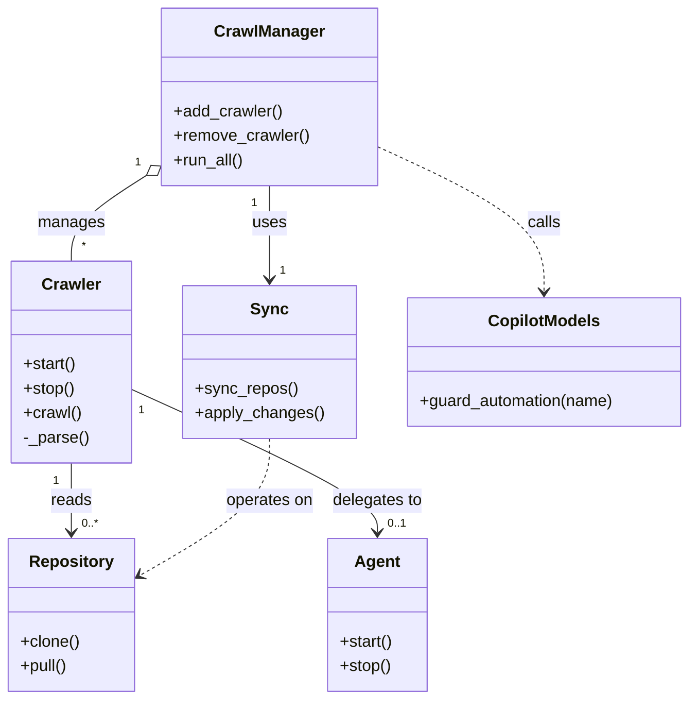

# Diagram: partview_core/partview_service/config/config.staging1.yml

> Auto-generated by Obscura crawlers

## Mermaid

### SVG

<svg id="container" width="670.29296875" xmlns="http://www.w3.org/2000/svg" class="classDiagram" height="686" viewBox="0 0 670.29296875 686" role="graphics-document document" aria-roledescription="class"><g><defs><marker id="container_class-aggregationStart" class="marker aggregation class" refX="18" refY="7" markerWidth="190" markerHeight="240" orient="auto"><path d="M 18,7 L9,13 L1,7 L9,1 Z"></path></marker></defs><defs><marker id="container_class-aggregationEnd" class="marker aggregation class" refX="1" refY="7" markerWidth="20" markerHeight="28" orient="auto"><path d="M 18,7 L9,13 L1,7 L9,1 Z"></path></marker></defs><defs><marker id="container_class-extensionStart" class="marker extension class" refX="18" refY="7" markerWidth="190" markerHeight="240" orient="auto"><path d="M 1,7 L18,13 V 1 Z"></path></marker></defs><defs><marker id="container_class-extensionEnd" class="marker extension class" refX="1" refY="7" markerWidth="20" markerHeight="28" orient="auto"><path d="M 1,1 V 13 L18,7 Z"></path></marker></defs><defs><marker id="container_class-compositionStart" class="marker composition class" refX="18" refY="7" markerWidth="190" markerHeight="240" orient="auto"><path d="M 18,7 L9,13 L1,7 L9,1 Z"></path></marker></defs><defs><marker id="container_class-compositionEnd" class="marker composition class" refX="1" refY="7" markerWidth="20" markerHeight="28" orient="auto"><path d="M 18,7 L9,13 L1,7 L9,1 Z"></path></marker></defs><defs><marker id="container_class-dependencyStart" class="marker dependency class" refX="6" refY="7" markerWidth="190" markerHeight="240" orient="auto"><path d="M 5,7 L9,13 L1,7 L9,1 Z"></path></marker></defs><defs><marker id="container_class-dependencyEnd" class="marker dependency class" refX="13" refY="7" markerWidth="20" markerHeight="28" orient="auto"><path d="M 18,7 L9,13 L14,7 L9,1 Z"></path></marker></defs><defs><marker id="container_class-lollipopStart" class="marker lollipop class" refX="13" refY="7" markerWidth="190" markerHeight="240" orient="auto"><circle stroke="black" fill="transparent" cx="7" cy="7" r="6"></circle></marker></defs><defs><marker id="container_class-lollipopEnd" class="marker lollipop class" refX="1" refY="7" markerWidth="190" markerHeight="240" orient="auto"><circle stroke="black" fill="transparent" cx="7" cy="7" r="6"></circle></marker></defs><g class="root"><g class="clusters"></g><g class="edgePaths"><path d="M141.223,172.056L129.172,179.88C117.121,187.704,93.02,203.352,80.969,217.343C68.918,231.333,68.918,243.667,68.918,249.833L68.918,256" id="id_CrawlManager_Crawler_1" class="edge-thickness-normal edge-pattern-solid relation" style=";;;" data-edge="true" data-et="edge" data-id="id_CrawlManager_Crawler_1" data-points="W3sieCI6MTU1LjY5MTQwNjI1LCJ5IjoxNjIuNjYzMTA3OTQ3ODA1NDZ9LHsieCI6NjguOTE3OTY4NzUsInkiOjIxOX0seyJ4Ijo2OC45MTc5Njg3NSwieSI6MjU2fV0=" marker-start="url(#container_class-aggregationStart)"></path><path d="M259.91,182L259.91,188.167C259.91,194.333,259.91,206.667,259.91,222C259.91,237.333,259.91,255.667,259.91,264.833L259.91,274" id="id_CrawlManager_Sync_2" class="edge-thickness-normal edge-pattern-solid relation" style=";;;" data-edge="true" data-et="edge" data-id="id_CrawlManager_Sync_2" data-points="W3sieCI6MjU5LjkxMDE1NjI1LCJ5IjoxODJ9LHsieCI6MjU5LjkxMDE1NjI1LCJ5IjoyMTl9LHsieCI6MjU5LjkxMDE1NjI1LCJ5IjoyODB9XQ==" marker-end="url(#container_class-dependencyEnd)"></path><path d="M68.918,454L68.918,460.167C68.918,466.333,68.918,478.667,68.918,490C68.918,501.333,68.918,511.667,68.918,516.833L68.918,522" id="id_Crawler_Repository_3" class="edge-thickness-normal edge-pattern-solid relation" style=";;;" data-edge="true" data-et="edge" data-id="id_Crawler_Repository_3" data-points="W3sieCI6NjguOTE3OTY4NzUsInkiOjQ1NH0seyJ4Ijo2OC45MTc5Njg3NSwieSI6NDkxfSx7IngiOjY4LjkxNzk2ODc1LCJ5Ijo1Mjh9XQ==" marker-end="url(#container_class-dependencyEnd)"></path><path d="M126.809,381.343L166.973,399.619C207.137,417.895,287.465,454.448,327.629,477.89C367.793,501.333,367.793,511.667,367.793,516.833L367.793,522" id="id_Crawler_Agent_4" class="edge-thickness-normal edge-pattern-solid relation" style=";;;" data-edge="true" data-et="edge" data-id="id_Crawler_Agent_4" data-points="W3sieCI6MTI2LjgwODU5Mzc1LCJ5IjozODEuMzQyNTM0NTA0MzkxNX0seyJ4IjozNjcuNzkyOTY4NzUsInkiOjQ5MX0seyJ4IjozNjcuNzkyOTY4NzUsInkiOjUyOH1d" marker-end="url(#container_class-dependencyEnd)"></path><path d="M364.129,143.267L391.383,155.889C418.637,168.511,473.145,193.756,500.398,217.545C527.652,241.333,527.652,263.667,527.652,274.833L527.652,286" id="id_CrawlManager_CopilotModels_5" class="edge-thickness-normal edge-pattern-dashed relation" style=";;;" data-edge="true" data-et="edge" data-id="id_CrawlManager_CopilotModels_5" data-points="W3sieCI6MzY0LjEyODkwNjI1LCJ5IjoxNDMuMjY3MDQ3OTQxNDA4MTh9LHsieCI6NTI3LjY1MjM0Mzc1LCJ5IjoyMTl9LHsieCI6NTI3LjY1MjM0Mzc1LCJ5IjoyOTJ9XQ==" marker-end="url(#container_class-dependencyEnd)"></path><path d="M259.91,430L259.91,440.167C259.91,450.333,259.91,470.667,239.094,493.04C218.277,515.414,176.644,539.828,155.828,552.035L135.012,564.242" id="id_Sync_Repository_6" class="edge-thickness-normal edge-pattern-dashed relation" style=";;;" data-edge="true" data-et="edge" data-id="id_Sync_Repository_6" data-points="W3sieCI6MjU5LjkxMDE1NjI1LCJ5Ijo0MzB9LHsieCI6MjU5LjkxMDE1NjI1LCJ5Ijo0OTF9LHsieCI6MTI5LjgzNTkzNzUsInkiOjU2Ny4yNzcwMDc0MDM3NzE0fV0=" marker-end="url(#container_class-dependencyEnd)"></path></g><g class="edgeLabels"><g class="edgeLabel" transform="translate(68.91796875, 219)"><g class="label" data-id="id_CrawlManager_Crawler_1" transform="translate(-32.296875, -12)"><foreignObject width="64.59375" height="24">

manages

</foreignObject></g></g><g class="edgeLabel" transform="translate(259.91015625, 219)"><g class="label" data-id="id_CrawlManager_Sync_2" transform="translate(-16.4921875, -12)"><foreignObject width="32.984375" height="24">

uses

</foreignObject></g></g><g class="edgeLabel" transform="translate(68.91796875, 491)"><g class="label" data-id="id_Crawler_Repository_3" transform="translate(-20.0078125, -12)"><foreignObject width="40.015625" height="24">

reads

</foreignObject></g></g><g class="edgeLabel" transform="translate(367.79296875, 491)"><g class="label" data-id="id_Crawler_Agent_4" transform="translate(-44.59375, -12)"><foreignObject width="89.1875" height="24">

delegates to

</foreignObject></g></g><g class="edgeLabel" transform="translate(527.65234375, 219)"><g class="label" data-id="id_CrawlManager_CopilotModels_5" transform="translate(-16.4453125, -12)"><foreignObject width="32.890625" height="24">

calls

</foreignObject></g></g><g class="edgeLabel" transform="translate(259.91015625, 491)"><g class="label" data-id="id_Sync_Repository_6" transform="translate(-43.2890625, -12)"><foreignObject width="86.578125" height="24">

operates on

</foreignObject></g></g><g class="edgeTerminals" transform="translate(132.8454436991978, 159.61156023386562)"><g class="inner" transform="translate(0, 0)"><foreignObject style="width: 9px; height: 12px;">
1
</foreignObject></g></g><g class="edgeTerminals" transform="translate(244.9101581250001, 199.50000160714288)"><g class="inner" transform="translate(0, 0)"><foreignObject style="width: 9px; height: 12px;">
1
</foreignObject></g></g><g class="edgeTerminals" transform="translate(53.91796937500001, 471.50000053571426)"><g class="inner" transform="translate(0, 0)"><foreignObject style="width: 9px; height: 12px;">
1
</foreignObject></g></g><g class="edgeTerminals" transform="translate(136.5244047255225, 402.2435657659572)"><g class="inner" transform="translate(0, 0)"><foreignObject style="width: 9px; height: 12px;">
1
</foreignObject></g></g><g class="edgeTerminals" transform="translate(78.91796937499998, 233.5000005357143)"><g class="inner" transform="translate(0, 0)"></g><foreignObject style="width: 9px; height: 12px;">
*
</foreignObject></g><g class="edgeTerminals" transform="translate(269.9101581249999, 257.50000160714285)"><g class="inner" transform="translate(0, 0)"></g><foreignObject style="width: 9px; height: 12px;">
1
</foreignObject></g><g class="edgeTerminals" transform="translate(78.91796937499998, 505.50000053571426)"><g class="inner" transform="translate(0, 0)"></g><foreignObject style="width: 36px; height: 12px;">
0..*
</foreignObject></g><g class="edgeTerminals" transform="translate(377.792969375, 505.5000005357143)"><g class="inner" transform="translate(0, 0)"></g><foreignObject style="width: 36px; height: 12px;">
0..1
</foreignObject></g></g><g class="nodes"><g class="node default" id="classId-Crawler-0" transform="translate(68.91796875, 355)"><g class="basic label-container"><path d="M-57.890625 -99 L57.890625 -99 L57.890625 99 L-57.890625 99" stroke="none" stroke-width="0" fill="#ECECFF" style=""></path><path d="M-57.890625 -99 C-25.214714006411654 -99, 7.461196987176692 -99, 57.890625 -99 M-57.890625 -99 C-22.79502276591343 -99, 12.30057946817314 -99, 57.890625 -99 M57.890625 -99 C57.890625 -51.37026997121446, 57.890625 -3.7405399424289243, 57.890625 99 M57.890625 -99 C57.890625 -36.69866774180879, 57.890625 25.60266451638242, 57.890625 99 M57.890625 99 C24.194016647029542 99, -9.502591705940915 99, -57.890625 99 M57.890625 99 C31.96188247332403 99, 6.033139946648063 99, -57.890625 99 M-57.890625 99 C-57.890625 57.83849973206856, -57.890625 16.676999464137126, -57.890625 -99 M-57.890625 99 C-57.890625 21.4340523766936, -57.890625 -56.1318952466128, -57.890625 -99" stroke="#9370DB" stroke-width="1.3" fill="none" stroke-dasharray="0 0" style=""></path></g><g class="annotation-group text" transform="translate(0, -75)"></g><g class="label-group text" transform="translate(-27.734375, -75)"><g class="label" style="font-weight: bolder" transform="translate(0,-12)"><foreignObject width="55.46875" height="24">

Crawler

</foreignObject></g></g><g class="members-group text" transform="translate(-45.890625, -27)"></g><g class="methods-group text" transform="translate(-45.890625, 3)"><g class="label" style="" transform="translate(0,-12)"><foreignObject width="52.15625" height="24">

+start()

</foreignObject></g><g class="label" style="" transform="translate(0,12)"><foreignObject width="50.21875" height="24">

+stop()

</foreignObject></g><g class="label" style="" transform="translate(0,36)"><foreignObject width="56.40625" height="24">

+crawl()

</foreignObject></g><g class="label" style="" transform="translate(0,60)"><foreignObject width="64.046875" height="24">

-_parse()

</foreignObject></g></g><g class="divider" style=""><path d="M-57.890625 -51 C-27.577358735860813 -51, 2.735907528278375 -51, 57.890625 -51 M-57.890625 -51 C-17.393610921737675 -51, 23.10340315652465 -51, 57.890625 -51" stroke="#9370DB" stroke-width="1.3" fill="none" stroke-dasharray="0 0" style=""></path></g><g class="divider" style=""><path d="M-57.890625 -27 C-24.46323011803387 -27, 8.96416476393226 -27, 57.890625 -27 M-57.890625 -27 C-23.196853678951406 -27, 11.496917642097188 -27, 57.890625 -27" stroke="#9370DB" stroke-width="1.3" fill="none" stroke-dasharray="0 0" style=""></path></g></g><g class="node default" id="classId-CrawlManager-1" transform="translate(259.91015625, 95)"><g class="basic label-container"><path d="M-104.21875 -87 L104.21875 -87 L104.21875 87 L-104.21875 87" stroke="none" stroke-width="0" fill="#ECECFF" style=""></path><path d="M-104.21875 -87 C-33.01390731299642 -87, 38.190935374007154 -87, 104.21875 -87 M-104.21875 -87 C-53.271316213031504 -87, -2.323882426063008 -87, 104.21875 -87 M104.21875 -87 C104.21875 -28.259169591616832, 104.21875 30.481660816766336, 104.21875 87 M104.21875 -87 C104.21875 -43.53873653334901, 104.21875 -0.07747306669801901, 104.21875 87 M104.21875 87 C44.44201305326918 87, -15.334723893461643 87, -104.21875 87 M104.21875 87 C43.2862599686337 87, -17.6462300627326 87, -104.21875 87 M-104.21875 87 C-104.21875 41.90524191429663, -104.21875 -3.189516171406737, -104.21875 -87 M-104.21875 87 C-104.21875 35.98882404621557, -104.21875 -15.022351907568861, -104.21875 -87" stroke="#9370DB" stroke-width="1.3" fill="none" stroke-dasharray="0 0" style=""></path></g><g class="annotation-group text" transform="translate(0, -63)"></g><g class="label-group text" transform="translate(-51.59375, -63)"><g class="label" style="font-weight: bolder" transform="translate(0,-12)"><foreignObject width="103.1875" height="24">

CrawlManager

</foreignObject></g></g><g class="members-group text" transform="translate(-92.21875, -15)"></g><g class="methods-group text" transform="translate(-92.21875, 15)"><g class="label" style="" transform="translate(0,-12)"><foreignObject width="106.828125" height="24">

+add_crawler()

</foreignObject></g><g class="label" style="" transform="translate(0,12)"><foreignObject width="132.84375" height="24">

+remove_crawler()

</foreignObject></g><g class="label" style="" transform="translate(0,36)"><foreignObject width="69.140625" height="24">

+run_all()

</foreignObject></g></g><g class="divider" style=""><path d="M-104.21875 -39 C-49.08949209765659 -39, 6.039765804686823 -39, 104.21875 -39 M-104.21875 -39 C-39.98652556904973 -39, 24.245698861900536 -39, 104.21875 -39" stroke="#9370DB" stroke-width="1.3" fill="none" stroke-dasharray="0 0" style=""></path></g><g class="divider" style=""><path d="M-104.21875 -15 C-47.15081753242694 -15, 9.917114935146117 -15, 104.21875 -15 M-104.21875 -15 C-61.483122041920275 -15, -18.74749408384055 -15, 104.21875 -15" stroke="#9370DB" stroke-width="1.3" fill="none" stroke-dasharray="0 0" style=""></path></g></g><g class="node default" id="classId-Sync-2" transform="translate(259.91015625, 355)"><g class="basic label-container"><path d="M-83.1015625 -75 L83.1015625 -75 L83.1015625 75 L-83.1015625 75" stroke="none" stroke-width="0" fill="#ECECFF" style=""></path><path d="M-83.1015625 -75 C-40.3129459494201 -75, 2.4756706011598055 -75, 83.1015625 -75 M-83.1015625 -75 C-45.64112365333825 -75, -8.180684806676496 -75, 83.1015625 -75 M83.1015625 -75 C83.1015625 -44.69174034483497, 83.1015625 -14.38348068966993, 83.1015625 75 M83.1015625 -75 C83.1015625 -17.47183234159776, 83.1015625 40.05633531680448, 83.1015625 75 M83.1015625 75 C42.85317508496064 75, 2.6047876699212793 75, -83.1015625 75 M83.1015625 75 C41.894199843854224 75, 0.6868371877084485 75, -83.1015625 75 M-83.1015625 75 C-83.1015625 42.00505393185297, -83.1015625 9.01010786370594, -83.1015625 -75 M-83.1015625 75 C-83.1015625 29.97056465533373, -83.1015625 -15.058870689332537, -83.1015625 -75" stroke="#9370DB" stroke-width="1.3" fill="none" stroke-dasharray="0 0" style=""></path></g><g class="annotation-group text" transform="translate(0, -51)"></g><g class="label-group text" transform="translate(-17.09375, -51)"><g class="label" style="font-weight: bolder" transform="translate(0,-12)"><foreignObject width="34.1875" height="24">

Sync

</foreignObject></g></g><g class="members-group text" transform="translate(-71.1015625, -3)"></g><g class="methods-group text" transform="translate(-71.1015625, 27)"><g class="label" style="" transform="translate(0,-12)"><foreignObject width="99.515625" height="24">

+sync_repos()

</foreignObject></g><g class="label" style="" transform="translate(0,12)"><foreignObject width="125.109375" height="24">

+apply_changes()

</foreignObject></g></g><g class="divider" style=""><path d="M-83.1015625 -27 C-43.51857235596532 -27, -3.9355822119306367 -27, 83.1015625 -27 M-83.1015625 -27 C-37.478471506410045 -27, 8.14461948717991 -27, 83.1015625 -27" stroke="#9370DB" stroke-width="1.3" fill="none" stroke-dasharray="0 0" style=""></path></g><g class="divider" style=""><path d="M-83.1015625 -3 C-22.227335477336318 -3, 38.646891545327364 -3, 83.1015625 -3 M-83.1015625 -3 C-48.5549214335186 -3, -14.008280367037202 -3, 83.1015625 -3" stroke="#9370DB" stroke-width="1.3" fill="none" stroke-dasharray="0 0" style=""></path></g></g><g class="node default" id="classId-CopilotModels-3" transform="translate(527.65234375, 355)"><g class="basic label-container"><path d="M-134.640625 -63 L134.640625 -63 L134.640625 63 L-134.640625 63" stroke="none" stroke-width="0" fill="#ECECFF" style=""></path><path d="M-134.640625 -63 C-51.313725812518584 -63, 32.01317337496283 -63, 134.640625 -63 M-134.640625 -63 C-33.096695301657405 -63, 68.44723439668519 -63, 134.640625 -63 M134.640625 -63 C134.640625 -37.52151525199001, 134.640625 -12.04303050398002, 134.640625 63 M134.640625 -63 C134.640625 -27.33518481220854, 134.640625 8.329630375582923, 134.640625 63 M134.640625 63 C59.58506637290958 63, -15.47049225418084 63, -134.640625 63 M134.640625 63 C75.12581914047438 63, 15.611013280948754 63, -134.640625 63 M-134.640625 63 C-134.640625 18.436561973187473, -134.640625 -26.126876053625054, -134.640625 -63 M-134.640625 63 C-134.640625 18.729640213975564, -134.640625 -25.54071957204887, -134.640625 -63" stroke="#9370DB" stroke-width="1.3" fill="none" stroke-dasharray="0 0" style=""></path></g><g class="annotation-group text" transform="translate(0, -39)"></g><g class="label-group text" transform="translate(-52.65625, -39)"><g class="label" style="font-weight: bolder" transform="translate(0,-12)"><foreignObject width="105.3125" height="24">

CopilotModels

</foreignObject></g></g><g class="members-group text" transform="translate(-122.640625, 9)"></g><g class="methods-group text" transform="translate(-122.640625, 39)"><g class="label" style="" transform="translate(0,-12)"><foreignObject width="192.625" height="24">

+guard_automation(name)

</foreignObject></g></g><g class="divider" style=""><path d="M-134.640625 -15 C-51.599441260576654 -15, 31.44174247884669 -15, 134.640625 -15 M-134.640625 -15 C-32.558367238803825 -15, 69.52389052239235 -15, 134.640625 -15" stroke="#9370DB" stroke-width="1.3" fill="none" stroke-dasharray="0 0" style=""></path></g><g class="divider" style=""><path d="M-134.640625 9 C-48.17306822382652 9, 38.29448855234696 9, 134.640625 9 M-134.640625 9 C-29.654097028545095 9, 75.33243094290981 9, 134.640625 9" stroke="#9370DB" stroke-width="1.3" fill="none" stroke-dasharray="0 0" style=""></path></g></g><g class="node default" id="classId-Agent-4" transform="translate(367.79296875, 603)"><g class="basic label-container"><path d="M-48.6171875 -75 L48.6171875 -75 L48.6171875 75 L-48.6171875 75" stroke="none" stroke-width="0" fill="#ECECFF" style=""></path><path d="M-48.6171875 -75 C-10.381211718578832 -75, 27.854764062842335 -75, 48.6171875 -75 M-48.6171875 -75 C-13.156606511555289 -75, 22.303974476889422 -75, 48.6171875 -75 M48.6171875 -75 C48.6171875 -38.184080812310526, 48.6171875 -1.3681616246210524, 48.6171875 75 M48.6171875 -75 C48.6171875 -43.48020004801099, 48.6171875 -11.960400096021985, 48.6171875 75 M48.6171875 75 C22.06099986081282 75, -4.495187778374358 75, -48.6171875 75 M48.6171875 75 C26.28443631990744 75, 3.9516851398148773 75, -48.6171875 75 M-48.6171875 75 C-48.6171875 34.00341151201334, -48.6171875 -6.993176975973327, -48.6171875 -75 M-48.6171875 75 C-48.6171875 20.797124457670883, -48.6171875 -33.405751084658235, -48.6171875 -75" stroke="#9370DB" stroke-width="1.3" fill="none" stroke-dasharray="0 0" style=""></path></g><g class="annotation-group text" transform="translate(0, -51)"></g><g class="label-group text" transform="translate(-21.078125, -51)"><g class="label" style="font-weight: bolder" transform="translate(0,-12)"><foreignObject width="42.15625" height="24">

Agent

</foreignObject></g></g><g class="members-group text" transform="translate(-36.6171875, -3)"></g><g class="methods-group text" transform="translate(-36.6171875, 27)"><g class="label" style="" transform="translate(0,-12)"><foreignObject width="52.15625" height="24">

+start()

</foreignObject></g><g class="label" style="" transform="translate(0,12)"><foreignObject width="50.21875" height="24">

+stop()

</foreignObject></g></g><g class="divider" style=""><path d="M-48.6171875 -27 C-15.571206927869746 -27, 17.47477364426051 -27, 48.6171875 -27 M-48.6171875 -27 C-11.358457416227957 -27, 25.900272667544087 -27, 48.6171875 -27" stroke="#9370DB" stroke-width="1.3" fill="none" stroke-dasharray="0 0" style=""></path></g><g class="divider" style=""><path d="M-48.6171875 -3 C-11.428439291043397 -3, 25.760308917913207 -3, 48.6171875 -3 M-48.6171875 -3 C-23.289063343255858 -3, 2.039060813488284 -3, 48.6171875 -3" stroke="#9370DB" stroke-width="1.3" fill="none" stroke-dasharray="0 0" style=""></path></g></g><g class="node default" id="classId-Repository-5" transform="translate(68.91796875, 603)"><g class="basic label-container"><path d="M-60.91796875 -75 L60.91796875 -75 L60.91796875 75 L-60.91796875 75" stroke="none" stroke-width="0" fill="#ECECFF" style=""></path><path d="M-60.91796875 -75 C-33.97023886413986 -75, -7.02250897827971 -75, 60.91796875 -75 M-60.91796875 -75 C-17.970591291295882 -75, 24.976786167408235 -75, 60.91796875 -75 M60.91796875 -75 C60.91796875 -32.78089829373146, 60.91796875 9.438203412537078, 60.91796875 75 M60.91796875 -75 C60.91796875 -29.070107713836016, 60.91796875 16.859784572327968, 60.91796875 75 M60.91796875 75 C21.399587827972006 75, -18.118793094055988 75, -60.91796875 75 M60.91796875 75 C25.352287471827836 75, -10.213393806344328 75, -60.91796875 75 M-60.91796875 75 C-60.91796875 26.1507217299313, -60.91796875 -22.698556540137403, -60.91796875 -75 M-60.91796875 75 C-60.91796875 28.030002079264918, -60.91796875 -18.939995841470164, -60.91796875 -75" stroke="#9370DB" stroke-width="1.3" fill="none" stroke-dasharray="0 0" style=""></path></g><g class="annotation-group text" transform="translate(0, -51)"></g><g class="label-group text" transform="translate(-39.7734375, -51)"><g class="label" style="font-weight: bolder" transform="translate(0,-12)"><foreignObject width="79.546875" height="24">

Repository

</foreignObject></g></g><g class="members-group text" transform="translate(-48.91796875, -3)"></g><g class="methods-group text" transform="translate(-48.91796875, 27)"><g class="label" style="" transform="translate(0,-12)"><foreignObject width="58.0625" height="24">

+clone()

</foreignObject></g><g class="label" style="" transform="translate(0,12)"><foreignObject width="46.546875" height="24">

+pull()

</foreignObject></g></g><g class="divider" style=""><path d="M-60.91796875 -27 C-28.102903998778075 -27, 4.71216075244385 -27, 60.91796875 -27 M-60.91796875 -27 C-23.400212510577525 -27, 14.11754372884495 -27, 60.91796875 -27" stroke="#9370DB" stroke-width="1.3" fill="none" stroke-dasharray="0 0" style=""></path></g><g class="divider" style=""><path d="M-60.91796875 -3 C-24.879495599945514 -3, 11.158977550108972 -3, 60.91796875 -3 M-60.91796875 -3 C-22.076375565242955 -3, 16.76521761951409 -3, 60.91796875 -3" stroke="#9370DB" stroke-width="1.3" fill="none" stroke-dasharray="0 0" style=""></path></g></g></g></g></g></svg>
