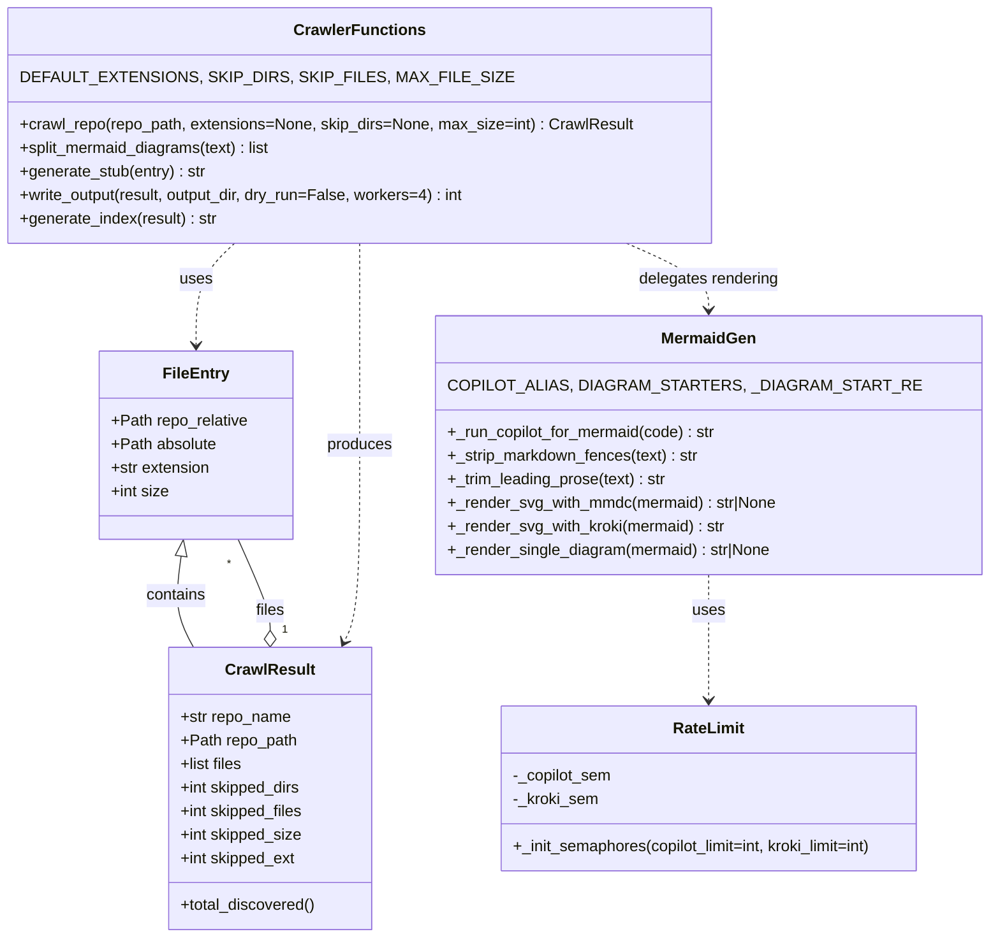

# Diagram: partview_core/partview_service/config/config.test.yml

> Auto-generated by Obscura crawlers

## Mermaid

### SVG

<svg id="container" width="955.99609375" xmlns="http://www.w3.org/2000/svg" class="classDiagram" height="956" viewBox="0 0 955.99609375 956" role="graphics-document document" aria-roledescription="class"><g><defs><marker id="container_class-aggregationStart" class="marker aggregation class" refX="18" refY="7" markerWidth="190" markerHeight="240" orient="auto"><path d="M 18,7 L9,13 L1,7 L9,1 Z"></path></marker></defs><defs><marker id="container_class-aggregationEnd" class="marker aggregation class" refX="1" refY="7" markerWidth="20" markerHeight="28" orient="auto"><path d="M 18,7 L9,13 L1,7 L9,1 Z"></path></marker></defs><defs><marker id="container_class-extensionStart" class="marker extension class" refX="18" refY="7" markerWidth="190" markerHeight="240" orient="auto"><path d="M 1,7 L18,13 V 1 Z"></path></marker></defs><defs><marker id="container_class-extensionEnd" class="marker extension class" refX="1" refY="7" markerWidth="20" markerHeight="28" orient="auto"><path d="M 1,1 V 13 L18,7 Z"></path></marker></defs><defs><marker id="container_class-compositionStart" class="marker composition class" refX="18" refY="7" markerWidth="190" markerHeight="240" orient="auto"><path d="M 18,7 L9,13 L1,7 L9,1 Z"></path></marker></defs><defs><marker id="container_class-compositionEnd" class="marker composition class" refX="1" refY="7" markerWidth="20" markerHeight="28" orient="auto"><path d="M 18,7 L9,13 L1,7 L9,1 Z"></path></marker></defs><defs><marker id="container_class-dependencyStart" class="marker dependency class" refX="6" refY="7" markerWidth="190" markerHeight="240" orient="auto"><path d="M 5,7 L9,13 L1,7 L9,1 Z"></path></marker></defs><defs><marker id="container_class-dependencyEnd" class="marker dependency class" refX="13" refY="7" markerWidth="20" markerHeight="28" orient="auto"><path d="M 18,7 L9,13 L14,7 L9,1 Z"></path></marker></defs><defs><marker id="container_class-lollipopStart" class="marker lollipop class" refX="13" refY="7" markerWidth="190" markerHeight="240" orient="auto"><circle stroke="black" fill="transparent" cx="7" cy="7" r="6"></circle></marker></defs><defs><marker id="container_class-lollipopEnd" class="marker lollipop class" refX="1" refY="7" markerWidth="190" markerHeight="240" orient="auto"><circle stroke="black" fill="transparent" cx="7" cy="7" r="6"></circle></marker></defs><g class="root"><g class="clusters"></g><g class="edgePaths"><path d="M204.385,566.931L202.563,576.276C200.741,585.621,197.097,604.31,198.207,619.822C199.316,635.333,205.18,647.667,208.111,653.833L211.043,660" id="id_FileEntry_CrawlResult_1" class="edge-thickness-normal edge-pattern-solid relation" style=";;;" data-edge="true" data-et="edge" data-id="id_FileEntry_CrawlResult_1" data-points="W3sieCI6MjA3LjY4NTYyNzc3MzY2ODY0LCJ5Ijo1NTB9LHsieCI6MTkzLjQ1MzEyNSwieSI6NjIzfSx7IngiOjIxMS4wNDI4MTc2Nzk1NTgwMywieSI6NjYwfV0=" marker-start="url(#container_class-extensionStart)"></path><path d="M279.5,642.75L279.5,639.458C279.5,636.167,279.5,629.583,275.677,614.125C271.855,598.667,264.21,574.333,260.387,562.167L256.564,550" id="id_CrawlResult_FileEntry_2" class="edge-thickness-normal edge-pattern-solid relation" style=";;;" data-edge="true" data-et="edge" data-id="id_CrawlResult_FileEntry_2" data-points="W3sieCI6Mjc5LjUsInkiOjY2MH0seyJ4IjoyNzkuNSwieSI6NjIzfSx7IngiOjI1Ni41NjQzMjU5OTg1MjA3LCJ5Ijo1NTB9XQ==" marker-start="url(#container_class-aggregationStart)"></path><path d="M258.543,248L253.186,254.167C247.829,260.333,237.116,272.667,231.759,290C226.402,307.333,226.402,329.667,226.402,340.833L226.402,352" id="id_CrawlerFunctions_FileEntry_3" class="edge-thickness-normal edge-pattern-dashed relation" style=";;;" data-edge="true" data-et="edge" data-id="id_CrawlerFunctions_FileEntry_3" data-points="W3sieCI6MjU4LjU0MjU5NTU0MTQwMTMsInkiOjI0OH0seyJ4IjoyMjYuNDAyMzQzNzUsInkiOjI4NX0seyJ4IjoyMjYuNDAyMzQzNzUsInkiOjM1OH1d" marker-end="url(#container_class-dependencyEnd)"></path><path d="M385.852,248L387.037,254.167C388.223,260.333,390.594,272.667,391.779,307C392.965,341.333,392.965,397.667,392.965,454C392.965,510.333,392.965,566.667,389.63,600.153C386.296,633.639,379.626,644.278,376.292,649.597L372.957,654.916" id="id_CrawlerFunctions_CrawlResult_4" class="edge-thickness-normal edge-pattern-dashed relation" style=";;;" data-edge="true" data-et="edge" data-id="id_CrawlerFunctions_CrawlResult_4" data-points="W3sieCI6Mzg1Ljg1MTUxMjczODg1MzUsInkiOjI0OH0seyJ4IjozOTIuOTY0ODQzNzUsInkiOjI4NX0seyJ4IjozOTIuOTY0ODQzNzUsInkiOjQ1NH0seyJ4IjozOTIuOTY0ODQzNzUsInkiOjYyM30seyJ4IjozNjkuNzcwMzcyOTI4MTc2OCwieSI6NjYwfV0=" marker-end="url(#container_class-dependencyEnd)"></path><path d="M624.135,248L637.565,254.167C650.996,260.333,677.857,272.667,691.288,284C704.719,295.333,704.719,305.667,704.719,310.833L704.719,316" id="id_CrawlerFunctions_MermaidGen_5" class="edge-thickness-normal edge-pattern-dashed relation" style=";;;" data-edge="true" data-et="edge" data-id="id_CrawlerFunctions_MermaidGen_5" data-points="W3sieCI6NjI0LjEzNDc1MzE4NDcxMzQsInkiOjI0OH0seyJ4Ijo3MDQuNzE4NzUsInkiOjI4NX0seyJ4Ijo3MDQuNzE4NzUsInkiOjMyMn1d" marker-end="url(#container_class-dependencyEnd)"></path><path d="M704.719,586L704.719,592.167C704.719,598.333,704.719,610.667,704.719,632C704.719,653.333,704.719,683.667,704.719,698.833L704.719,714" id="id_MermaidGen_RateLimit_6" class="edge-thickness-normal edge-pattern-dashed relation" style=";;;" data-edge="true" data-et="edge" data-id="id_MermaidGen_RateLimit_6" data-points="W3sieCI6NzA0LjcxODc1LCJ5Ijo1ODZ9LHsieCI6NzA0LjcxODc1LCJ5Ijo2MjN9LHsieCI6NzA0LjcxODc1LCJ5Ijo3MjB9XQ==" marker-end="url(#container_class-dependencyEnd)"></path></g><g class="edgeLabels"><g class="edgeLabel" transform="translate(196.64948, 606.60556)"><g class="label" data-id="id_FileEntry_CrawlResult_1" transform="translate(-30.890625, -12)"><foreignObject width="61.78125" height="24">

contains

</foreignObject></g></g><g class="edgeLabel" transform="translate(279.5, 623)"><g class="label" data-id="id_CrawlResult_FileEntry_2" transform="translate(-15.0078125, -12)"><foreignObject width="30.015625" height="24">

files

</foreignObject></g></g><g class="edgeLabel" transform="translate(226.40234375, 285)"><g class="label" data-id="id_CrawlerFunctions_FileEntry_3" transform="translate(-16.4921875, -12)"><foreignObject width="32.984375" height="24">

uses

</foreignObject></g></g><g class="edgeLabel" transform="translate(392.96484375, 454)"><g class="label" data-id="id_CrawlerFunctions_CrawlResult_4" transform="translate(-33.4765625, -12)"><foreignObject width="66.953125" height="24">

produces

</foreignObject></g></g><g class="edgeLabel" transform="translate(704.71875, 285)"><g class="label" data-id="id_CrawlerFunctions_MermaidGen_5" transform="translate(-72.390625, -12)"><foreignObject width="144.78125" height="24">

delegates rendering

</foreignObject></g></g><g class="edgeLabel" transform="translate(704.71875, 623)"><g class="label" data-id="id_MermaidGen_RateLimit_6" transform="translate(-16.4921875, -12)"><foreignObject width="32.984375" height="24">

uses

</foreignObject></g></g><g class="edgeTerminals" transform="translate(294.5, 642.5)"><g class="inner" transform="translate(0, 0)"><foreignObject style="width: 9px; height: 12px;">
1
</foreignObject></g></g><g class="edgeTerminals" transform="translate(242.49948994277258, 566.1914786959888)"><g class="inner" transform="translate(0, 0)"></g><foreignObject style="width: 9px; height: 12px;">
*
</foreignObject></g></g><g class="nodes"><g class="node default" id="classId-FileEntry-0" transform="translate(226.40234375, 454)"><g class="basic label-container"><path d="M-98.0859375 -96 L98.0859375 -96 L98.0859375 96 L-98.0859375 96" stroke="none" stroke-width="0" fill="#ECECFF" style=""></path><path d="M-98.0859375 -96 C-21.721834219968613 -96, 54.64226906006277 -96, 98.0859375 -96 M-98.0859375 -96 C-26.62613265348044 -96, 44.83367219303912 -96, 98.0859375 -96 M98.0859375 -96 C98.0859375 -32.57149822332314, 98.0859375 30.85700355335372, 98.0859375 96 M98.0859375 -96 C98.0859375 -33.862003932901864, 98.0859375 28.275992134196272, 98.0859375 96 M98.0859375 96 C45.01409812039405 96, -8.057741259211895 96, -98.0859375 96 M98.0859375 96 C51.0128893796097 96, 3.9398412592194063 96, -98.0859375 96 M-98.0859375 96 C-98.0859375 31.588486295724522, -98.0859375 -32.823027408550956, -98.0859375 -96 M-98.0859375 96 C-98.0859375 48.43592288076083, -98.0859375 0.871845761521655, -98.0859375 -96" stroke="#9370DB" stroke-width="1.3" fill="none" stroke-dasharray="0 0" style=""></path></g><g class="annotation-group text" transform="translate(0, -72)"></g><g class="label-group text" transform="translate(-31.859375, -72)"><g class="label" style="font-weight: bolder" transform="translate(0,-12)"><foreignObject width="63.71875" height="24">

FileEntry

</foreignObject></g></g><g class="members-group text" transform="translate(-86.0859375, -24)"><g class="label" style="" transform="translate(0,-12)"><foreignObject width="140.3125" height="24">

+Path repo_relative

</foreignObject></g><g class="label" style="" transform="translate(0,12)"><foreignObject width="107.78125" height="24">

+Path absolute

</foreignObject></g><g class="label" style="" transform="translate(0,36)"><foreignObject width="102.328125" height="24">

+str extension

</foreignObject></g><g class="label" style="" transform="translate(0,60)"><foreignObject width="59.484375" height="24">

+int size

</foreignObject></g></g><g class="methods-group text" transform="translate(-86.0859375, 96)"></g><g class="divider" style=""><path d="M-98.0859375 -48 C-24.52909162948403 -48, 49.02775424103194 -48, 98.0859375 -48 M-98.0859375 -48 C-31.55785064994008 -48, 34.97023620011984 -48, 98.0859375 -48" stroke="#9370DB" stroke-width="1.3" fill="none" stroke-dasharray="0 0" style=""></path></g><g class="divider" style=""><path d="M-98.0859375 72 C-27.71360737117385 72, 42.6587227576523 72, 98.0859375 72 M-98.0859375 72 C-45.664930498960366 72, 6.756076502079267 72, 98.0859375 72" stroke="#9370DB" stroke-width="1.3" fill="none" stroke-dasharray="0 0" style=""></path></g></g><g class="node default" id="classId-CrawlResult-1" transform="translate(279.5, 804)"><g class="basic label-container"><path d="M-103.0078125 -144 L103.0078125 -144 L103.0078125 144 L-103.0078125 144" stroke="none" stroke-width="0" fill="#ECECFF" style=""></path><path d="M-103.0078125 -144 C-51.48459301254016 -144, 0.038626474919681186 -144, 103.0078125 -144 M-103.0078125 -144 C-31.545474307647623 -144, 39.91686388470475 -144, 103.0078125 -144 M103.0078125 -144 C103.0078125 -59.716131943656876, 103.0078125 24.567736112686248, 103.0078125 144 M103.0078125 -144 C103.0078125 -57.55369680583459, 103.0078125 28.89260638833082, 103.0078125 144 M103.0078125 144 C24.374971607172142 144, -54.257869285655715 144, -103.0078125 144 M103.0078125 144 C53.276821325910994 144, 3.5458301518219884 144, -103.0078125 144 M-103.0078125 144 C-103.0078125 39.22435259647236, -103.0078125 -65.55129480705529, -103.0078125 -144 M-103.0078125 144 C-103.0078125 64.76104437084669, -103.0078125 -14.47791125830662, -103.0078125 -144" stroke="#9370DB" stroke-width="1.3" fill="none" stroke-dasharray="0 0" style=""></path></g><g class="annotation-group text" transform="translate(0, -120)"></g><g class="label-group text" transform="translate(-43.28125, -120)"><g class="label" style="font-weight: bolder" transform="translate(0,-12)"><foreignObject width="86.5625" height="24">

CrawlResult

</foreignObject></g></g><g class="members-group text" transform="translate(-91.0078125, -72)"><g class="label" style="" transform="translate(0,-12)"><foreignObject width="113.4375" height="24">

+str repo_name

</foreignObject></g><g class="label" style="" transform="translate(0,12)"><foreignObject width="118.96875" height="24">

+Path repo_path

</foreignObject></g><g class="label" style="" transform="translate(0,36)"><foreignObject width="64.6875" height="24">

+list files

</foreignObject></g><g class="label" style="" transform="translate(0,60)"><foreignObject width="124.859375" height="24">

+int skipped_dirs

</foreignObject></g><g class="label" style="" transform="translate(0,84)"><foreignObject width="127.375" height="24">

+int skipped_files

</foreignObject></g><g class="label" style="" transform="translate(0,108)"><foreignObject width="125.265625" height="24">

+int skipped_size

</foreignObject></g><g class="label" style="" transform="translate(0,132)"><foreignObject width="119.484375" height="24">

+int skipped_ext

</foreignObject></g></g><g class="methods-group text" transform="translate(-91.0078125, 120)"><g class="label" style="" transform="translate(0,-12)"><foreignObject width="138.734375" height="24">

+total_discovered()

</foreignObject></g></g><g class="divider" style=""><path d="M-103.0078125 -96 C-49.22185019212157 -96, 4.564112115756856 -96, 103.0078125 -96 M-103.0078125 -96 C-39.21401626748217 -96, 24.579779965035655 -96, 103.0078125 -96" stroke="#9370DB" stroke-width="1.3" fill="none" stroke-dasharray="0 0" style=""></path></g><g class="divider" style=""><path d="M-103.0078125 96 C-34.70875977585747 96, 33.590292948285054 96, 103.0078125 96 M-103.0078125 96 C-38.75622497146813 96, 25.495362557063743 96, 103.0078125 96" stroke="#9370DB" stroke-width="1.3" fill="none" stroke-dasharray="0 0" style=""></path></g></g><g class="node default" id="classId-CrawlerFunctions-2" transform="translate(362.78125, 128)"><g class="basic label-container"><path d="M-354.78125 -120 L354.78125 -120 L354.78125 120 L-354.78125 120" stroke="none" stroke-width="0" fill="#ECECFF" style=""></path><path d="M-354.78125 -120 C-98.97333322427818 -120, 156.83458355144364 -120, 354.78125 -120 M-354.78125 -120 C-130.69139287960778 -120, 93.39846424078445 -120, 354.78125 -120 M354.78125 -120 C354.78125 -58.60569204944274, 354.78125 2.7886159011145253, 354.78125 120 M354.78125 -120 C354.78125 -54.9041482136673, 354.78125 10.191703572665403, 354.78125 120 M354.78125 120 C199.49747399303232 120, 44.21369798606463 120, -354.78125 120 M354.78125 120 C115.8082506988442 120, -123.16474860231159 120, -354.78125 120 M-354.78125 120 C-354.78125 31.33250834020616, -354.78125 -57.33498331958768, -354.78125 -120 M-354.78125 120 C-354.78125 43.55349589336625, -354.78125 -32.89300821326751, -354.78125 -120" stroke="#9370DB" stroke-width="1.3" fill="none" stroke-dasharray="0 0" style=""></path></g><g class="annotation-group text" transform="translate(0, -96)"></g><g class="label-group text" transform="translate(-62.859375, -96)"><g class="label" style="font-weight: bolder" transform="translate(0,-12)"><foreignObject width="125.71875" height="24">

CrawlerFunctions

</foreignObject></g></g><g class="members-group text" transform="translate(-342.78125, -48)"><g class="label" style="" transform="translate(0,-12)"><foreignObject width="436.09375" height="24">

DEFAULT_EXTENSIONS, SKIP_DIRS, SKIP_FILES, MAX_FILE_SIZE

</foreignObject></g></g><g class="methods-group text" transform="translate(-342.78125, 0)"><g class="label" style="" transform="translate(0,-12)"><foreignObject width="622.703125" height="24">

+crawl_repo(repo_path, extensions=None, skip_dirs=None, max_size=int) : CrawlResult

</foreignObject></g><g class="label" style="" transform="translate(0,12)"><foreignObject width="260.59375" height="24">

+split_mermaid_diagrams(text) : list

</foreignObject></g><g class="label" style="" transform="translate(0,36)"><foreignObject width="191.546875" height="24">

+generate_stub(entry) : str

</foreignObject></g><g class="label" style="" transform="translate(0,60)"><foreignObject width="459.59375" height="24">

+write_output(result, output_dir, dry_run=False, workers=4) : int

</foreignObject></g><g class="label" style="" transform="translate(0,84)"><foreignObject width="203.015625" height="24">

+generate_index(result) : str

</foreignObject></g></g><g class="divider" style=""><path d="M-354.78125 -72 C-147.070393178105 -72, 60.640463643789985 -72, 354.78125 -72 M-354.78125 -72 C-210.74059644308605 -72, -66.6999428861721 -72, 354.78125 -72" stroke="#9370DB" stroke-width="1.3" fill="none" stroke-dasharray="0 0" style=""></path></g><g class="divider" style=""><path d="M-354.78125 -24 C-142.05025076735865 -24, 70.6807484652827 -24, 354.78125 -24 M-354.78125 -24 C-132.46891861934216 -24, 89.84341276131568 -24, 354.78125 -24" stroke="#9370DB" stroke-width="1.3" fill="none" stroke-dasharray="0 0" style=""></path></g></g><g class="node default" id="classId-MermaidGen-3" transform="translate(704.71875, 454)"><g class="basic label-container"><path d="M-243.27734375 -132 L243.27734375 -132 L243.27734375 132 L-243.27734375 132" stroke="none" stroke-width="0" fill="#ECECFF" style=""></path><path d="M-243.27734375 -132 C-135.30944839236912 -132, -27.34155303473827 -132, 243.27734375 -132 M-243.27734375 -132 C-135.7306872854788 -132, -28.184030820957616 -132, 243.27734375 -132 M243.27734375 -132 C243.27734375 -64.03517820489058, 243.27734375 3.9296435902188307, 243.27734375 132 M243.27734375 -132 C243.27734375 -37.340367587309814, 243.27734375 57.31926482538037, 243.27734375 132 M243.27734375 132 C136.9701102992417 132, 30.66287684848342 132, -243.27734375 132 M243.27734375 132 C127.60910971916311 132, 11.94087568832623 132, -243.27734375 132 M-243.27734375 132 C-243.27734375 77.24770439357319, -243.27734375 22.495408787146374, -243.27734375 -132 M-243.27734375 132 C-243.27734375 39.17142294313395, -243.27734375 -53.657154113732105, -243.27734375 -132" stroke="#9370DB" stroke-width="1.3" fill="none" stroke-dasharray="0 0" style=""></path></g><g class="annotation-group text" transform="translate(0, -108)"></g><g class="label-group text" transform="translate(-46.3046875, -108)"><g class="label" style="font-weight: bolder" transform="translate(0,-12)"><foreignObject width="92.609375" height="24">

MermaidGen

</foreignObject></g></g><g class="members-group text" transform="translate(-231.27734375, -60)"><g class="label" style="" transform="translate(0,-12)"><foreignObject width="416.25" height="24">

COPILOT_ALIAS, DIAGRAM_STARTERS, _DIAGRAM_START_RE

</foreignObject></g></g><g class="methods-group text" transform="translate(-231.27734375, -12)"><g class="label" style="" transform="translate(0,-12)"><foreignObject width="276.25" height="24">

+_run_copilot_for_mermaid(code) : str

</foreignObject></g><g class="label" style="" transform="translate(0,12)"><foreignObject width="257.453125" height="24">

+_strip_markdown_fences(text) : str

</foreignObject></g><g class="label" style="" transform="translate(0,36)"><foreignObject width="225.578125" height="24">

+_trim_leading_prose(text) : str

</foreignObject></g><g class="label" style="" transform="translate(0,60)"><foreignObject width="337.875" height="24">

+_render_svg_with_mmdc(mermaid) : str|None

</foreignObject></g><g class="label" style="" transform="translate(0,84)"><foreignObject width="284.359375" height="24">

+_render_svg_with_kroki(mermaid) : str

</foreignObject></g><g class="label" style="" transform="translate(0,108)"><foreignObject width="332.03125" height="24">

+_render_single_diagram(mermaid) : str|None

</foreignObject></g></g><g class="divider" style=""><path d="M-243.27734375 -84 C-142.0910281972345 -84, -40.90471264446899 -84, 243.27734375 -84 M-243.27734375 -84 C-107.94876298283191 -84, 27.379817784336183 -84, 243.27734375 -84" stroke="#9370DB" stroke-width="1.3" fill="none" stroke-dasharray="0 0" style=""></path></g><g class="divider" style=""><path d="M-243.27734375 -36 C-77.0117167165204 -36, 89.2539103169592 -36, 243.27734375 -36 M-243.27734375 -36 C-52.34255464461927 -36, 138.59223446076146 -36, 243.27734375 -36" stroke="#9370DB" stroke-width="1.3" fill="none" stroke-dasharray="0 0" style=""></path></g></g><g class="node default" id="classId-RateLimit-4" transform="translate(704.71875, 804)"><g class="basic label-container"><path d="M-219.11328125 -84 L219.11328125 -84 L219.11328125 84 L-219.11328125 84" stroke="none" stroke-width="0" fill="#ECECFF" style=""></path><path d="M-219.11328125 -84 C-73.84334482088985 -84, 71.42659160822029 -84, 219.11328125 -84 M-219.11328125 -84 C-48.94437268740495 -84, 121.2245358751901 -84, 219.11328125 -84 M219.11328125 -84 C219.11328125 -35.76634258228236, 219.11328125 12.467314835435275, 219.11328125 84 M219.11328125 -84 C219.11328125 -26.96599309796784, 219.11328125 30.06801380406432, 219.11328125 84 M219.11328125 84 C89.80816132906551 84, -39.496958591868975 84, -219.11328125 84 M219.11328125 84 C131.21932017151664 84, 43.325359093033285 84, -219.11328125 84 M-219.11328125 84 C-219.11328125 44.13052781950772, -219.11328125 4.261055639015439, -219.11328125 -84 M-219.11328125 84 C-219.11328125 33.490454644472344, -219.11328125 -17.019090711055313, -219.11328125 -84" stroke="#9370DB" stroke-width="1.3" fill="none" stroke-dasharray="0 0" style=""></path></g><g class="annotation-group text" transform="translate(0, -60)"></g><g class="label-group text" transform="translate(-35.0703125, -60)"><g class="label" style="font-weight: bolder" transform="translate(0,-12)"><foreignObject width="70.140625" height="24">

RateLimit

</foreignObject></g></g><g class="members-group text" transform="translate(-207.11328125, -12)"><g class="label" style="" transform="translate(0,-12)"><foreignObject width="101.8125" height="24">

-_copilot_sem

</foreignObject></g><g class="label" style="" transform="translate(0,12)"><foreignObject width="87.65625" height="24">

-_kroki_sem

</foreignObject></g></g><g class="methods-group text" transform="translate(-207.11328125, 60)"><g class="label" style="" transform="translate(0,-12)"><foreignObject width="379.15625" height="24">

+_init_semaphores(copilot_limit=int, kroki_limit=int)

</foreignObject></g></g><g class="divider" style=""><path d="M-219.11328125 -36 C-79.11014132022689 -36, 60.892998609546225 -36, 219.11328125 -36 M-219.11328125 -36 C-74.7022291415825 -36, 69.70882296683499 -36, 219.11328125 -36" stroke="#9370DB" stroke-width="1.3" fill="none" stroke-dasharray="0 0" style=""></path></g><g class="divider" style=""><path d="M-219.11328125 36 C-55.690218914503475 36, 107.73284342099305 36, 219.11328125 36 M-219.11328125 36 C-94.60568787024405 36, 29.90190550951189 36, 219.11328125 36" stroke="#9370DB" stroke-width="1.3" fill="none" stroke-dasharray="0 0" style=""></path></g></g></g></g></g></svg>
