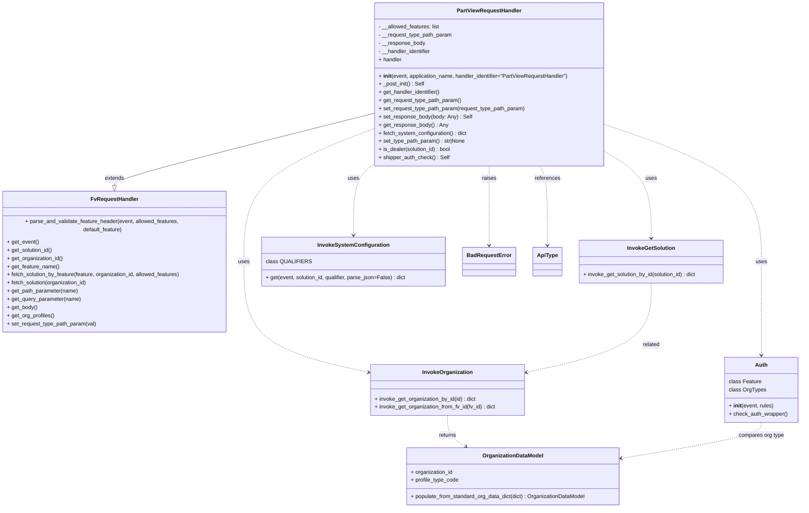

# Diagram: partview_core/partview_service/partview_service/api/PartViewRequestHandler.py


> Auto-generated by Obscura crawlers

## Diagram 1



### SVG

<svg id="container" width="2352.9921875" xmlns="http://www.w3.org/2000/svg" class="classDiagram" height="1468" viewBox="0 0 2352.9921875 1468" role="graphics-document document" aria-roledescription="class"><style>#container{font-family:"trebuchet ms",verdana,arial,sans-serif;font-size:16px;fill:#333;}@keyframes edge-animation-frame{from{stroke-dashoffset:0;}}@keyframes dash{to{stroke-dashoffset:0;}}#container .edge-animation-slow{stroke-dasharray:9,5!important;stroke-dashoffset:900;animation:dash 50s linear infinite;stroke-linecap:round;}#container .edge-animation-fast{stroke-dasharray:9,5!important;stroke-dashoffset:900;animation:dash 20s linear infinite;stroke-linecap:round;}#container .error-icon{fill:#552222;}#container .error-text{fill:#552222;stroke:#552222;}#container .edge-thickness-normal{stroke-width:1px;}#container .edge-thickness-thick{stroke-width:3.5px;}#container .edge-pattern-solid{stroke-dasharray:0;}#container .edge-thickness-invisible{stroke-width:0;fill:none;}#container .edge-pattern-dashed{stroke-dasharray:3;}#container .edge-pattern-dotted{stroke-dasharray:2;}#container .marker{fill:#333333;stroke:#333333;}#container .marker.cross{stroke:#333333;}#container svg{font-family:"trebuchet ms",verdana,arial,sans-serif;font-size:16px;}#container p{margin:0;}#container g.classGroup text{fill:#9370DB;stroke:none;font-family:"trebuchet ms",verdana,arial,sans-serif;font-size:10px;}#container g.classGroup text .title{font-weight:bolder;}#container .nodeLabel,#container .edgeLabel{color:#131300;}#container .edgeLabel .label rect{fill:#ECECFF;}#container .label text{fill:#131300;}#container .labelBkg{background:#ECECFF;}#container .edgeLabel .label span{background:#ECECFF;}#container .classTitle{font-weight:bolder;}#container .node rect,#container .node circle,#container .node ellipse,#container .node polygon,#container .node path{fill:#ECECFF;stroke:#9370DB;stroke-width:1px;}#container .divider{stroke:#9370DB;stroke-width:1;}#container g.clickable{cursor:pointer;}#container g.classGroup rect{fill:#ECECFF;stroke:#9370DB;}#container g.classGroup line{stroke:#9370DB;stroke-width:1;}#container .classLabel .box{stroke:none;stroke-width:0;fill:#ECECFF;opacity:0.5;}#container .classLabel .label{fill:#9370DB;font-size:10px;}#container .relation{stroke:#333333;stroke-width:1;fill:none;}#container .dashed-line{stroke-dasharray:3;}#container .dotted-line{stroke-dasharray:1 2;}#container #compositionStart,#container .composition{fill:#333333!important;stroke:#333333!important;stroke-width:1;}#container #compositionEnd,#container .composition{fill:#333333!important;stroke:#333333!important;stroke-width:1;}#container #dependencyStart,#container .dependency{fill:#333333!important;stroke:#333333!important;stroke-width:1;}#container #dependencyStart,#container .dependency{fill:#333333!important;stroke:#333333!important;stroke-width:1;}#container #extensionStart,#container .extension{fill:transparent!important;stroke:#333333!important;stroke-width:1;}#container #extensionEnd,#container .extension{fill:transparent!important;stroke:#333333!important;stroke-width:1;}#container #aggregationStart,#container .aggregation{fill:transparent!important;stroke:#333333!important;stroke-width:1;}#container #aggregationEnd,#container .aggregation{fill:transparent!important;stroke:#333333!important;stroke-width:1;}#container #lollipopStart,#container .lollipop{fill:#ECECFF!important;stroke:#333333!important;stroke-width:1;}#container #lollipopEnd,#container .lollipop{fill:#ECECFF!important;stroke:#333333!important;stroke-width:1;}#container .edgeTerminals{font-size:11px;line-height:initial;}#container .classTitleText{text-anchor:middle;font-size:18px;fill:#333;}#container .label-icon{display:inline-block;height:1em;overflow:visible;vertical-align:-0.125em;}#container .node .label-icon path{fill:currentColor;stroke:revert;stroke-width:revert;}#container :root{--mermaid-font-family:"trebuchet ms",verdana,arial,sans-serif;}</style><g><defs><marker id="container_class-aggregationStart" class="marker aggregation class" refX="18" refY="7" markerWidth="190" markerHeight="240" orient="auto"><path d="M 18,7 L9,13 L1,7 L9,1 Z"></path></marker></defs><defs><marker id="container_class-aggregationEnd" class="marker aggregation class" refX="1" refY="7" markerWidth="20" markerHeight="28" orient="auto"><path d="M 18,7 L9,13 L1,7 L9,1 Z"></path></marker></defs><defs><marker id="container_class-extensionStart" class="marker extension class" refX="18" refY="7" markerWidth="190" markerHeight="240" orient="auto"><path d="M 1,7 L18,13 V 1 Z"></path></marker></defs><defs><marker id="container_class-extensionEnd" class="marker extension class" refX="1" refY="7" markerWidth="20" markerHeight="28" orient="auto"><path d="M 1,1 V 13 L18,7 Z"></path></marker></defs><defs><marker id="container_class-compositionStart" class="marker composition class" refX="18" refY="7" markerWidth="190" markerHeight="240" orient="auto"><path d="M 18,7 L9,13 L1,7 L9,1 Z"></path></marker></defs><defs><marker id="container_class-compositionEnd" class="marker composition class" refX="1" refY="7" markerWidth="20" markerHeight="28" orient="auto"><path d="M 18,7 L9,13 L1,7 L9,1 Z"></path></marker></defs><defs><marker id="container_class-dependencyStart" class="marker dependency class" refX="6" refY="7" markerWidth="190" markerHeight="240" orient="auto"><path d="M 5,7 L9,13 L1,7 L9,1 Z"></path></marker></defs><defs><marker id="container_class-dependencyEnd" class="marker dependency class" refX="13" refY="7" markerWidth="20" markerHeight="28" orient="auto"><path d="M 18,7 L9,13 L14,7 L9,1 Z"></path></marker></defs><defs><marker id="container_class-lollipopStart" class="marker lollipop class" refX="13" refY="7" markerWidth="190" markerHeight="240" orient="auto"><circle stroke="black" fill="transparent" cx="7" cy="7" r="6"></circle></marker></defs><defs><marker id="container_class-lollipopEnd" class="marker lollipop class" refX="1" refY="7" markerWidth="190" markerHeight="240" orient="auto"><circle stroke="black" fill="transparent" cx="7" cy="7" r="6"></circle></marker></defs><g class="root"><g class="clusters"></g><g class="edgePaths"><path d="M1100.414,333.703L973.85,365.586C847.285,397.468,594.156,461.234,467.592,496.409C341.027,531.583,341.027,538.167,341.027,541.458L341.027,544.75" id="id_PartViewRequestHandler_FvRequestHandler_1" class="edge-thickness-normal edge-pattern-solid relation" style=";;;" data-edge="true" data-et="edge" data-id="id_PartViewRequestHandler_FvRequestHandler_1" data-points="W3sieCI6MTEwMC40MTQwNjI1LCJ5IjozMzMuNzAyNjQ2OTE5ODYwNn0seyJ4IjozNDEuMDI3MzQzNzUsInkiOjUyNX0seyJ4IjozNDEuMDI3MzQzNzUsInkiOjU2Mn1d" marker-end="url(#container_class-extensionEnd)"></path><path d="M1780.836,366.191L1857.024,392.659C1933.212,419.127,2085.589,472.064,2161.777,537.199C2237.965,602.333,2237.965,679.667,2237.965,757C2237.965,834.333,2237.965,911.667,2237.965,955.5C2237.965,999.333,2237.965,1009.667,2237.965,1014.833L2237.965,1020" id="id_PartViewRequestHandler_Auth_2" class="edge-thickness-normal edge-pattern-dashed relation" style=";;;" data-edge="true" data-et="edge" data-id="id_PartViewRequestHandler_Auth_2" data-points="W3sieCI6MTc4MC44MzU5Mzc1LCJ5IjozNjYuMTkxMDQ1NDE5NTgzN30seyJ4IjoyMjM3Ljk2NDg0Mzc1LCJ5Ijo1MjV9LHsieCI6MjIzNy45NjQ4NDM3NSwieSI6NzU3fSx7IngiOjIyMzcuOTY0ODQzNzUsInkiOjk4OX0seyJ4IjoyMjM3Ljk2NDg0Mzc1LCJ5IjoxMDI2fV0=" marker-end="url(#container_class-dependencyEnd)"></path><path d="M1780.836,447.755L1802.762,460.629C1824.689,473.503,1868.542,499.252,1890.468,539.293C1912.395,579.333,1912.395,633.667,1912.395,660.833L1912.395,688" id="id_PartViewRequestHandler_InvokeGetSolution_3" class="edge-thickness-normal edge-pattern-dashed relation" style=";;;" data-edge="true" data-et="edge" data-id="id_PartViewRequestHandler_InvokeGetSolution_3" data-points="W3sieCI6MTc4MC44MzU5Mzc1LCJ5Ijo0NDcuNzU1MjI2NzQ3NzAwMjV9LHsieCI6MTkxMi4zOTQ1MzEyNSwieSI6NTI1fSx7IngiOjE5MTIuMzk0NTMxMjUsInkiOjY5NH1d" marker-end="url(#container_class-dependencyEnd)"></path><path d="M1100.414,379.788L1037.936,403.99C975.458,428.192,850.503,476.596,788.025,539.465C725.547,602.333,725.547,679.667,725.547,757C725.547,834.333,725.547,911.667,785.588,963.79C845.63,1015.913,965.713,1042.827,1025.754,1056.283L1085.796,1069.74" id="id_PartViewRequestHandler_InvokeOrganization_4" class="edge-thickness-normal edge-pattern-dashed relation" style=";;;" data-edge="true" data-et="edge" data-id="id_PartViewRequestHandler_InvokeOrganization_4" data-points="W3sieCI6MTEwMC40MTQwNjI1LCJ5IjozNzkuNzg3NTk5Njk0MDg5NH0seyJ4Ijo3MjUuNTQ2ODc1LCJ5Ijo1MjV9LHsieCI6NzI1LjU0Njg3NSwieSI6NzU3fSx7IngiOjcyNS41NDY4NzUsInkiOjk4OX0seyJ4IjoxMDkxLjY1MDM5MDYyNSwieSI6MTA3MS4wNTIyNjIyNjI0OTI4fV0=" marker-end="url(#container_class-dependencyEnd)"></path><path d="M1100.414,487.224L1091.46,493.52C1082.507,499.816,1064.599,512.408,1055.645,544.371C1046.691,576.333,1046.691,627.667,1046.691,653.333L1046.691,679" id="id_PartViewRequestHandler_InvokeSystemConfiguration_5" class="edge-thickness-normal edge-pattern-dashed relation" style=";;;" data-edge="true" data-et="edge" data-id="id_PartViewRequestHandler_InvokeSystemConfiguration_5" data-points="W3sieCI6MTEwMC40MTQwNjI1LCJ5Ijo0ODcuMjI0MTUxNDM3MzI1OX0seyJ4IjoxMDQ2LjY5MTQwNjI1LCJ5Ijo1MjV9LHsieCI6MTA0Ni42OTE0MDYyNSwieSI6Njg1fV0=" marker-end="url(#container_class-dependencyEnd)"></path><path d="M1583.91,488L1587.592,494.167C1591.273,500.333,1598.637,512.667,1602.318,549.5C1606,586.333,1606,647.667,1606,678.333L1606,709" id="id_PartViewRequestHandler_ApiType_6" class="edge-thickness-normal edge-pattern-dashed relation" style=";;;" data-edge="true" data-et="edge" data-id="id_PartViewRequestHandler_ApiType_6" data-points="W3sieCI6MTU4My45MTAxOTg1NTU5NTY2LCJ5Ijo0ODh9LHsieCI6MTYwNiwieSI6NTI1fSx7IngiOjE2MDYsInkiOjcxNX1d" marker-end="url(#container_class-dependencyEnd)"></path><path d="M1440.625,488L1440.625,494.167C1440.625,500.333,1440.625,512.667,1440.625,549.5C1440.625,586.333,1440.625,647.667,1440.625,678.333L1440.625,709" id="id_PartViewRequestHandler_BadRequestError_7" class="edge-thickness-normal edge-pattern-dashed relation" style=";;;" data-edge="true" data-et="edge" data-id="id_PartViewRequestHandler_BadRequestError_7" data-points="W3sieCI6MTQ0MC42MjUsInkiOjQ4OH0seyJ4IjoxNDQwLjYyNSwieSI6NTI1fSx7IngiOjE0NDAuNjI1LCJ5Ijo3MTV9XQ==" marker-end="url(#container_class-dependencyEnd)"></path><path d="M1318.971,1197L1318.971,1206.667C1318.971,1216.333,1318.971,1235.667,1327.918,1250.967C1336.866,1266.268,1354.762,1277.535,1363.709,1283.169L1372.657,1288.803" id="id_InvokeOrganization_OrganizationDataModel_8" class="edge-thickness-normal edge-pattern-dashed relation" style=";;;" data-edge="true" data-et="edge" data-id="id_InvokeOrganization_OrganizationDataModel_8" data-points="W3sieCI6MTMxOC45NzA3MDMxMjUsInkiOjExOTd9LHsieCI6MTMxOC45NzA3MDMxMjUsInkiOjEyNTV9LHsieCI6MTM3Ny43MzQ2MDA5ODE0MDUsInkiOjEyOTJ9XQ==" marker-end="url(#container_class-dependencyEnd)"></path><path d="M1912.395,820L1912.395,848.167C1912.395,876.333,1912.395,932.667,1852.353,974.29C1792.312,1015.913,1672.229,1042.827,1612.187,1056.283L1552.146,1069.74" id="id_InvokeGetSolution_InvokeOrganization_9" class="edge-thickness-normal edge-pattern-dashed relation" style=";;;" data-edge="true" data-et="edge" data-id="id_InvokeGetSolution_InvokeOrganization_9" data-points="W3sieCI6MTkxMi4zOTQ1MzEyNSwieSI6ODIwfSx7IngiOjE5MTIuMzk0NTMxMjUsInkiOjk4OX0seyJ4IjoxNTQ2LjI5MTAxNTYyNSwieSI6MTA3MS4wNTIyNjIyNjI0OTI4fV0=" marker-end="url(#container_class-dependencyEnd)"></path><path d="M2237.965,1218L2237.965,1224.167C2237.965,1230.333,2237.965,1242.667,2170.358,1260.088C2102.751,1277.51,1967.538,1300.02,1899.931,1311.275L1832.325,1322.53" id="id_Auth_OrganizationDataModel_10" class="edge-thickness-normal edge-pattern-dashed relation" style=";;;" data-edge="true" data-et="edge" data-id="id_Auth_OrganizationDataModel_10" data-points="W3sieCI6MjIzNy45NjQ4NDM3NSwieSI6MTIxOH0seyJ4IjoyMjM3Ljk2NDg0Mzc1LCJ5IjoxMjU1fSx7IngiOjE4MjYuNDA2MjUsInkiOjEzMjMuNTE1NjgyNjA3MjQ2OH1d" marker-end="url(#container_class-dependencyEnd)"></path></g><g class="edgeLabels"><g class="edgeLabel" transform="translate(341.02734375, 525)"><g class="label" data-id="id_PartViewRequestHandler_FvRequestHandler_1" transform="translate(-28.5078125, -12)"><foreignObject width="57.015625" height="24"><div xmlns="http://www.w3.org/1999/xhtml" class="labelBkg" style="display: table-cell; white-space: nowrap; line-height: 1.5; max-width: 200px; text-align: center;"><span class="edgeLabel"><p>extends</p></span></div></foreignObject></g></g><g class="edgeLabel" transform="translate(2237.96484375, 757)"><g class="label" data-id="id_PartViewRequestHandler_Auth_2" transform="translate(-16.4921875, -12)"><foreignObject width="32.984375" height="24"><div xmlns="http://www.w3.org/1999/xhtml" class="labelBkg" style="display: table-cell; white-space: nowrap; line-height: 1.5; max-width: 200px; text-align: center;"><span class="edgeLabel"><p>uses</p></span></div></foreignObject></g></g><g class="edgeLabel" transform="translate(1912.39453125, 525)"><g class="label" data-id="id_PartViewRequestHandler_InvokeGetSolution_3" transform="translate(-16.4921875, -12)"><foreignObject width="32.984375" height="24"><div xmlns="http://www.w3.org/1999/xhtml" class="labelBkg" style="display: table-cell; white-space: nowrap; line-height: 1.5; max-width: 200px; text-align: center;"><span class="edgeLabel"><p>uses</p></span></div></foreignObject></g></g><g class="edgeLabel" transform="translate(725.546875, 757)"><g class="label" data-id="id_PartViewRequestHandler_InvokeOrganization_4" transform="translate(-16.4921875, -12)"><foreignObject width="32.984375" height="24"><div xmlns="http://www.w3.org/1999/xhtml" class="labelBkg" style="display: table-cell; white-space: nowrap; line-height: 1.5; max-width: 200px; text-align: center;"><span class="edgeLabel"><p>uses</p></span></div></foreignObject></g></g><g class="edgeLabel" transform="translate(1046.69140625, 525)"><g class="label" data-id="id_PartViewRequestHandler_InvokeSystemConfiguration_5" transform="translate(-16.4921875, -12)"><foreignObject width="32.984375" height="24"><div xmlns="http://www.w3.org/1999/xhtml" class="labelBkg" style="display: table-cell; white-space: nowrap; line-height: 1.5; max-width: 200px; text-align: center;"><span class="edgeLabel"><p>uses</p></span></div></foreignObject></g></g><g class="edgeLabel" transform="translate(1606, 525)"><g class="label" data-id="id_PartViewRequestHandler_ApiType_6" transform="translate(-37.828125, -12)"><foreignObject width="75.65625" height="24"><div xmlns="http://www.w3.org/1999/xhtml" class="labelBkg" style="display: table-cell; white-space: nowrap; line-height: 1.5; max-width: 200px; text-align: center;"><span class="edgeLabel"><p>references</p></span></div></foreignObject></g></g><g class="edgeLabel" transform="translate(1440.625, 525)"><g class="label" data-id="id_PartViewRequestHandler_BadRequestError_7" transform="translate(-21.25, -12)"><foreignObject width="42.5" height="24"><div xmlns="http://www.w3.org/1999/xhtml" class="labelBkg" style="display: table-cell; white-space: nowrap; line-height: 1.5; max-width: 200px; text-align: center;"><span class="edgeLabel"><p>raises</p></span></div></foreignObject></g></g><g class="edgeLabel" transform="translate(1318.970703125, 1255)"><g class="label" data-id="id_InvokeOrganization_OrganizationDataModel_8" transform="translate(-26.265625, -12)"><foreignObject width="52.53125" height="24"><div xmlns="http://www.w3.org/1999/xhtml" class="labelBkg" style="display: table-cell; white-space: nowrap; line-height: 1.5; max-width: 200px; text-align: center;"><span class="edgeLabel"><p>returns</p></span></div></foreignObject></g></g><g class="edgeLabel" transform="translate(1912.39453125, 989)"><g class="label" data-id="id_InvokeGetSolution_InvokeOrganization_9" transform="translate(-25.78125, -12)"><foreignObject width="51.5625" height="24"><div xmlns="http://www.w3.org/1999/xhtml" class="labelBkg" style="display: table-cell; white-space: nowrap; line-height: 1.5; max-width: 200px; text-align: center;"><span class="edgeLabel"><p>related</p></span></div></foreignObject></g></g><g class="edgeLabel" transform="translate(2237.96484375, 1255)"><g class="label" data-id="id_Auth_OrganizationDataModel_10" transform="translate(-67.1015625, -12)"><foreignObject width="134.203125" height="24"><div xmlns="http://www.w3.org/1999/xhtml" class="labelBkg" style="display: table-cell; white-space: nowrap; line-height: 1.5; max-width: 200px; text-align: center;"><span class="edgeLabel"><p>compares org type</p></span></div></foreignObject></g></g></g><g class="nodes"><g class="node default" id="classId-PartViewRequestHandler-0" transform="translate(1440.625, 248)"><g class="basic label-container"><path d="M-340.2109375 -240 L340.2109375 -240 L340.2109375 240 L-340.2109375 240" stroke="none" stroke-width="0" fill="#ECECFF" style=""></path><path d="M-340.2109375 -240 C-117.127452712593 -240, 105.956032074814 -240, 340.2109375 -240 M-340.2109375 -240 C-144.97067851360387 -240, 50.269580472792256 -240, 340.2109375 -240 M340.2109375 -240 C340.2109375 -75.25666196684259, 340.2109375 89.48667606631483, 340.2109375 240 M340.2109375 -240 C340.2109375 -109.8949344365717, 340.2109375 20.210131126856595, 340.2109375 240 M340.2109375 240 C117.07340174402711 240, -106.06413401194578 240, -340.2109375 240 M340.2109375 240 C76.58543870966128 240, -187.04006008067745 240, -340.2109375 240 M-340.2109375 240 C-340.2109375 53.27968453883494, -340.2109375 -133.44063092233012, -340.2109375 -240 M-340.2109375 240 C-340.2109375 75.82919309349236, -340.2109375 -88.34161381301527, -340.2109375 -240" stroke="#9370DB" stroke-width="1.3" fill="none" stroke-dasharray="0 0" style=""></path></g><g class="annotation-group text" transform="translate(0, -216)"></g><g class="label-group text" transform="translate(-91.359375, -216)"><g class="label" style="font-weight: bolder" transform="translate(0,-12)"><foreignObject width="182.71875" height="24"><div xmlns="http://www.w3.org/1999/xhtml" style="display: table-cell; white-space: nowrap; line-height: 1.5; max-width: 231px; text-align: center;"><span class="nodeLabel markdown-node-label" style=""><p>PartViewRequestHandler</p></span></div></foreignObject></g></g><g class="members-group text" transform="translate(-328.2109375, -168)"><g class="label" style="" transform="translate(0,-12)"><foreignObject width="181.765625" height="24"><div xmlns="http://www.w3.org/1999/xhtml" style="display: table-cell; white-space: nowrap; line-height: 1.5; max-width: 239px; text-align: center;"><span class="nodeLabel markdown-node-label" style=""><p>- __allowed_features: list</p></span></div></foreignObject></g><g class="label" style="" transform="translate(0,12)"><foreignObject width="217.828125" height="24"><div xmlns="http://www.w3.org/1999/xhtml" style="display: table-cell; white-space: nowrap; line-height: 1.5; max-width: 275px; text-align: center;"><span class="nodeLabel markdown-node-label" style=""><p>- __request_type_path_param</p></span></div></foreignObject></g><g class="label" style="" transform="translate(0,36)"><foreignObject width="137.765625" height="24"><div xmlns="http://www.w3.org/1999/xhtml" style="display: table-cell; white-space: nowrap; line-height: 1.5; max-width: 195px; text-align: center;"><span class="nodeLabel markdown-node-label" style=""><p>- __response_body</p></span></div></foreignObject></g><g class="label" style="" transform="translate(0,60)"><foreignObject width="157.296875" height="24"><div xmlns="http://www.w3.org/1999/xhtml" style="display: table-cell; white-space: nowrap; line-height: 1.5; max-width: 215px; text-align: center;"><span class="nodeLabel markdown-node-label" style=""><p>- __handler_identifier</p></span></div></foreignObject></g><g class="label" style="" transform="translate(0,84)"><foreignObject width="68.765625" height="24"><div xmlns="http://www.w3.org/1999/xhtml" style="display: table-cell; white-space: nowrap; line-height: 1.5; max-width: 127px; text-align: center;"><span class="nodeLabel markdown-node-label" style=""><p>+ handler</p></span></div></foreignObject></g></g><g class="methods-group text" transform="translate(-328.2109375, -24)"><g class="label" style="" transform="translate(0,-12)"><foreignObject width="565.0625" height="24"><div xmlns="http://www.w3.org/1999/xhtml" style="display: table-cell; white-space: nowrap; line-height: 1.5; max-width: 655px; text-align: center;"><span class="nodeLabel markdown-node-label" style=""><p>+ <strong>init</strong>(event, application_name, handler_identifier="PartViewRequestHandler")</p></span></div></foreignObject></g><g class="label" style="" transform="translate(0,12)"><foreignObject width="135.3125" height="24"><div xmlns="http://www.w3.org/1999/xhtml" style="display: table-cell; white-space: nowrap; line-height: 1.5; max-width: 194px; text-align: center;"><span class="nodeLabel markdown-node-label" style=""><p>+ _post_init() : Self</p></span></div></foreignObject></g><g class="label" style="" transform="translate(0,36)"><foreignObject width="183.609375" height="24"><div xmlns="http://www.w3.org/1999/xhtml" style="display: table-cell; white-space: nowrap; line-height: 1.5; max-width: 241px; text-align: center;"><span class="nodeLabel markdown-node-label" style=""><p>+ get_handler_identifier()</p></span></div></foreignObject></g><g class="label" style="" transform="translate(0,60)"><foreignObject width="244.140625" height="24"><div xmlns="http://www.w3.org/1999/xhtml" style="display: table-cell; white-space: nowrap; line-height: 1.5; max-width: 302px; text-align: center;"><span class="nodeLabel markdown-node-label" style=""><p>+ get_request_type_path_param()</p></span></div></foreignObject></g><g class="label" style="" transform="translate(0,84)"><foreignObject width="434.203125" height="24"><div xmlns="http://www.w3.org/1999/xhtml" style="display: table-cell; white-space: nowrap; line-height: 1.5; max-width: 492px; text-align: center;"><span class="nodeLabel markdown-node-label" style=""><p>+ set_request_type_path_param(request_type_path_param)</p></span></div></foreignObject></g><g class="label" style="" transform="translate(0,108)"><foreignObject width="274.03125" height="24"><div xmlns="http://www.w3.org/1999/xhtml" style="display: table-cell; white-space: nowrap; line-height: 1.5; max-width: 333px; text-align: center;"><span class="nodeLabel markdown-node-label" style=""><p>+ set_response_body(body: Any) : Self</p></span></div></foreignObject></g><g class="label" style="" transform="translate(0,132)"><foreignObject width="202.703125" height="24"><div xmlns="http://www.w3.org/1999/xhtml" style="display: table-cell; white-space: nowrap; line-height: 1.5; max-width: 260px; text-align: center;"><span class="nodeLabel markdown-node-label" style=""><p>+ get_response_body() : Any</p></span></div></foreignObject></g><g class="label" style="" transform="translate(0,156)"><foreignObject width="261.671875" height="24"><div xmlns="http://www.w3.org/1999/xhtml" style="display: table-cell; white-space: nowrap; line-height: 1.5; max-width: 319px; text-align: center;"><span class="nodeLabel markdown-node-label" style=""><p>+ fetch_system_configuration() : dict</p></span></div></foreignObject></g><g class="label" style="" transform="translate(0,180)"><foreignObject width="256.515625" height="24"><div xmlns="http://www.w3.org/1999/xhtml" style="display: table-cell; white-space: nowrap; line-height: 1.5; max-width: 314px; text-align: center;"><span class="nodeLabel markdown-node-label" style=""><p>+ set_type_path_param() : str|None</p></span></div></foreignObject></g><g class="label" style="" transform="translate(0,204)"><foreignObject width="215.859375" height="24"><div xmlns="http://www.w3.org/1999/xhtml" style="display: table-cell; white-space: nowrap; line-height: 1.5; max-width: 274px; text-align: center;"><span class="nodeLabel markdown-node-label" style=""><p>+ is_dealer(solution_id) : bool</p></span></div></foreignObject></g><g class="label" style="" transform="translate(0,228)"><foreignObject width="207.140625" height="24"><div xmlns="http://www.w3.org/1999/xhtml" style="display: table-cell; white-space: nowrap; line-height: 1.5; max-width: 266px; text-align: center;"><span class="nodeLabel markdown-node-label" style=""><p>+ shipper_auth_check() : Self</p></span></div></foreignObject></g></g><g class="divider" style=""><path d="M-340.2109375 -192 C-97.77318647670964 -192, 144.66456454658072 -192, 340.2109375 -192 M-340.2109375 -192 C-176.94541801073643 -192, -13.679898521472865 -192, 340.2109375 -192" stroke="#9370DB" stroke-width="1.3" fill="none" stroke-dasharray="0 0" style=""></path></g><g class="divider" style=""><path d="M-340.2109375 -48 C-150.4713417021779 -48, 39.26825409564418 -48, 340.2109375 -48 M-340.2109375 -48 C-177.76020160151566 -48, -15.309465703031321 -48, 340.2109375 -48" stroke="#9370DB" stroke-width="1.3" fill="none" stroke-dasharray="0 0" style=""></path></g></g><g class="node default" id="classId-FvRequestHandler-1" transform="translate(341.02734375, 757)"><g class="basic label-container"><path d="M-333.02734375 -195 L333.02734375 -195 L333.02734375 195 L-333.02734375 195" stroke="none" stroke-width="0" fill="#ECECFF" style=""></path><path d="M-333.02734375 -195 C-132.78837762541713 -195, 67.45058849916575 -195, 333.02734375 -195 M-333.02734375 -195 C-181.59297665427587 -195, -30.158609558551746 -195, 333.02734375 -195 M333.02734375 -195 C333.02734375 -114.10176383989213, 333.02734375 -33.20352767978426, 333.02734375 195 M333.02734375 -195 C333.02734375 -110.93359587155244, 333.02734375 -26.867191743104883, 333.02734375 195 M333.02734375 195 C128.7632177225192 195, -75.50090830496163 195, -333.02734375 195 M333.02734375 195 C176.07425371642984 195, 19.121163682859674 195, -333.02734375 195 M-333.02734375 195 C-333.02734375 82.41348541119376, -333.02734375 -30.173029177612477, -333.02734375 -195 M-333.02734375 195 C-333.02734375 63.7548214284034, -333.02734375 -67.4903571431932, -333.02734375 -195" stroke="#9370DB" stroke-width="1.3" fill="none" stroke-dasharray="0 0" style=""></path></g><g class="annotation-group text" transform="translate(0, -171)"></g><g class="label-group text" transform="translate(-66.7890625, -171)"><g class="label" style="font-weight: bolder" transform="translate(0,-12)"><foreignObject width="133.578125" height="24"><div xmlns="http://www.w3.org/1999/xhtml" style="display: table-cell; white-space: nowrap; line-height: 1.5; max-width: 183px; text-align: center;"><span class="nodeLabel markdown-node-label" style=""><p>FvRequestHandler</p></span></div></foreignObject></g></g><g class="members-group text" transform="translate(-321.02734375, -123)"></g><g class="methods-group text" transform="translate(-321.02734375, -93)"><g class="label" style="" transform="translate(0,-12)"><foreignObject width="575.265625" height="24"><div xmlns="http://www.w3.org/1999/xhtml" style="display: table-cell; white-space: nowrap; line-height: 1.5; max-width: 633px; text-align: center;"><span class="nodeLabel markdown-node-label" style=""><p>+ parse_and_validate_feature_header(event, allowed_features, default_feature)</p></span></div></foreignObject></g><g class="label" style="" transform="translate(0,12)"><foreignObject width="93.5" height="24"><div xmlns="http://www.w3.org/1999/xhtml" style="display: table-cell; white-space: nowrap; line-height: 1.5; max-width: 151px; text-align: center;"><span class="nodeLabel markdown-node-label" style=""><p>+ get_event()</p></span></div></foreignObject></g><g class="label" style="" transform="translate(0,36)"><foreignObject width="135.703125" height="24"><div xmlns="http://www.w3.org/1999/xhtml" style="display: table-cell; white-space: nowrap; line-height: 1.5; max-width: 193px; text-align: center;"><span class="nodeLabel markdown-node-label" style=""><p>+ get_solution_id()</p></span></div></foreignObject></g><g class="label" style="" transform="translate(0,60)"><foreignObject width="165.90625" height="24"><div xmlns="http://www.w3.org/1999/xhtml" style="display: table-cell; white-space: nowrap; line-height: 1.5; max-width: 223px; text-align: center;"><span class="nodeLabel markdown-node-label" style=""><p>+ get_organization_id()</p></span></div></foreignObject></g><g class="label" style="" transform="translate(0,84)"><foreignObject width="153.640625" height="24"><div xmlns="http://www.w3.org/1999/xhtml" style="display: table-cell; white-space: nowrap; line-height: 1.5; max-width: 211px; text-align: center;"><span class="nodeLabel markdown-node-label" style=""><p>+ get_feature_name()</p></span></div></foreignObject></g><g class="label" style="" transform="translate(0,108)"><foreignObject width="517.453125" height="24"><div xmlns="http://www.w3.org/1999/xhtml" style="display: table-cell; white-space: nowrap; line-height: 1.5; max-width: 575px; text-align: center;"><span class="nodeLabel markdown-node-label" style=""><p>+ fetch_solution_by_feature(feature, organization_id, allowed_features)</p></span></div></foreignObject></g><g class="label" style="" transform="translate(0,132)"><foreignObject width="239.96875" height="24"><div xmlns="http://www.w3.org/1999/xhtml" style="display: table-cell; white-space: nowrap; line-height: 1.5; max-width: 297px; text-align: center;"><span class="nodeLabel markdown-node-label" style=""><p>+ fetch_solution(organization_id)</p></span></div></foreignObject></g><g class="label" style="" transform="translate(0,156)"><foreignObject width="210.75" height="24"><div xmlns="http://www.w3.org/1999/xhtml" style="display: table-cell; white-space: nowrap; line-height: 1.5; max-width: 268px; text-align: center;"><span class="nodeLabel markdown-node-label" style=""><p>+ get_path_parameter(name)</p></span></div></foreignObject></g><g class="label" style="" transform="translate(0,180)"><foreignObject width="218.390625" height="24"><div xmlns="http://www.w3.org/1999/xhtml" style="display: table-cell; white-space: nowrap; line-height: 1.5; max-width: 276px; text-align: center;"><span class="nodeLabel markdown-node-label" style=""><p>+ get_query_parameter(name)</p></span></div></foreignObject></g><g class="label" style="" transform="translate(0,204)"><foreignObject width="89.765625" height="24"><div xmlns="http://www.w3.org/1999/xhtml" style="display: table-cell; white-space: nowrap; line-height: 1.5; max-width: 147px; text-align: center;"><span class="nodeLabel markdown-node-label" style=""><p>+ get_body()</p></span></div></foreignObject></g><g class="label" style="" transform="translate(0,228)"><foreignObject width="139.6875" height="24"><div xmlns="http://www.w3.org/1999/xhtml" style="display: table-cell; white-space: nowrap; line-height: 1.5; max-width: 197px; text-align: center;"><span class="nodeLabel markdown-node-label" style=""><p>+ get_org_profiles()</p></span></div></foreignObject></g><g class="label" style="" transform="translate(0,252)"><foreignObject width="264.390625" height="24"><div xmlns="http://www.w3.org/1999/xhtml" style="display: table-cell; white-space: nowrap; line-height: 1.5; max-width: 322px; text-align: center;"><span class="nodeLabel markdown-node-label" style=""><p>+ set_request_type_path_param(val)</p></span></div></foreignObject></g></g><g class="divider" style=""><path d="M-333.02734375 -147 C-130.75934651896833 -147, 71.50865071206334 -147, 333.02734375 -147 M-333.02734375 -147 C-84.95349265490034 -147, 163.1203584401993 -147, 333.02734375 -147" stroke="#9370DB" stroke-width="1.3" fill="none" stroke-dasharray="0 0" style=""></path></g><g class="divider" style=""><path d="M-333.02734375 -123 C-117.27837708392073 -123, 98.47058958215854 -123, 333.02734375 -123 M-333.02734375 -123 C-170.8154027032554 -123, -8.603461656510774 -123, 333.02734375 -123" stroke="#9370DB" stroke-width="1.3" fill="none" stroke-dasharray="0 0" style=""></path></g></g><g class="node default" id="classId-Auth-2" transform="translate(2237.96484375, 1122)"><g class="basic label-container"><path d="M-107.02734375 -96 L107.02734375 -96 L107.02734375 96 L-107.02734375 96" stroke="none" stroke-width="0" fill="#ECECFF" style=""></path><path d="M-107.02734375 -96 C-24.599298437425972 -96, 57.828746875148056 -96, 107.02734375 -96 M-107.02734375 -96 C-43.45471190216687 -96, 20.11791994566626 -96, 107.02734375 -96 M107.02734375 -96 C107.02734375 -45.127425449172875, 107.02734375 5.745149101654249, 107.02734375 96 M107.02734375 -96 C107.02734375 -44.71210539259715, 107.02734375 6.575789214805695, 107.02734375 96 M107.02734375 96 C38.247637865550445 96, -30.53206801889911 96, -107.02734375 96 M107.02734375 96 C29.93643157713177 96, -47.15448059573646 96, -107.02734375 96 M-107.02734375 96 C-107.02734375 30.823875519381545, -107.02734375 -34.35224896123691, -107.02734375 -96 M-107.02734375 96 C-107.02734375 25.421883683154164, -107.02734375 -45.15623263369167, -107.02734375 -96" stroke="#9370DB" stroke-width="1.3" fill="none" stroke-dasharray="0 0" style=""></path></g><g class="annotation-group text" transform="translate(0, -72)"></g><g class="label-group text" transform="translate(-17.0078125, -72)"><g class="label" style="font-weight: bolder" transform="translate(0,-12)"><foreignObject width="34.015625" height="24"><div xmlns="http://www.w3.org/1999/xhtml" style="display: table-cell; white-space: nowrap; line-height: 1.5; max-width: 84px; text-align: center;"><span class="nodeLabel markdown-node-label" style=""><p>Auth</p></span></div></foreignObject></g></g><g class="members-group text" transform="translate(-95.02734375, -24)"><g class="label" style="" transform="translate(0,-12)"><foreignObject width="93.890625" height="24"><div xmlns="http://www.w3.org/1999/xhtml" style="display: table-cell; white-space: nowrap; line-height: 1.5; max-width: 144px; text-align: center;"><span class="nodeLabel markdown-node-label" style=""><p>class Feature</p></span></div></foreignObject></g><g class="label" style="" transform="translate(0,12)"><foreignObject width="106.359375" height="24"><div xmlns="http://www.w3.org/1999/xhtml" style="display: table-cell; white-space: nowrap; line-height: 1.5; max-width: 156px; text-align: center;"><span class="nodeLabel markdown-node-label" style=""><p>class OrgTypes</p></span></div></foreignObject></g></g><g class="methods-group text" transform="translate(-95.02734375, 48)"><g class="label" style="" transform="translate(0,-12)"><foreignObject width="131.8125" height="24"><div xmlns="http://www.w3.org/1999/xhtml" style="display: table-cell; white-space: nowrap; line-height: 1.5; max-width: 222px; text-align: center;"><span class="nodeLabel markdown-node-label" style=""><p>+ <strong>init</strong>(event, rules)</p></span></div></foreignObject></g><g class="label" style="" transform="translate(0,12)"><foreignObject width="173.046875" height="24"><div xmlns="http://www.w3.org/1999/xhtml" style="display: table-cell; white-space: nowrap; line-height: 1.5; max-width: 230px; text-align: center;"><span class="nodeLabel markdown-node-label" style=""><p>+ check_auth_wrapper()</p></span></div></foreignObject></g></g><g class="divider" style=""><path d="M-107.02734375 -48 C-53.06829541396959 -48, 0.8907529220608268 -48, 107.02734375 -48 M-107.02734375 -48 C-35.926462078031804 -48, 35.17441959393639 -48, 107.02734375 -48" stroke="#9370DB" stroke-width="1.3" fill="none" stroke-dasharray="0 0" style=""></path></g><g class="divider" style=""><path d="M-107.02734375 24 C-33.3252058342302 24, 40.37693208153959 24, 107.02734375 24 M-107.02734375 24 C-44.443482660391965 24, 18.14037842921607 24, 107.02734375 24" stroke="#9370DB" stroke-width="1.3" fill="none" stroke-dasharray="0 0" style=""></path></g></g><g class="node default" id="classId-InvokeGetSolution-3" transform="translate(1912.39453125, 757)"><g class="basic label-container"><path d="M-215.30078125 -63 L215.30078125 -63 L215.30078125 63 L-215.30078125 63" stroke="none" stroke-width="0" fill="#ECECFF" style=""></path><path d="M-215.30078125 -63 C-71.82885286196844 -63, 71.64307552606311 -63, 215.30078125 -63 M-215.30078125 -63 C-122.40365536180155 -63, -29.50652947360311 -63, 215.30078125 -63 M215.30078125 -63 C215.30078125 -21.507211978088463, 215.30078125 19.985576043823073, 215.30078125 63 M215.30078125 -63 C215.30078125 -16.033975378605632, 215.30078125 30.932049242788736, 215.30078125 63 M215.30078125 63 C64.88945436867803 63, -85.52187251264394 63, -215.30078125 63 M215.30078125 63 C105.95721907049716 63, -3.3863431090056793 63, -215.30078125 63 M-215.30078125 63 C-215.30078125 23.41481099414596, -215.30078125 -16.17037801170808, -215.30078125 -63 M-215.30078125 63 C-215.30078125 22.478368471540577, -215.30078125 -18.043263056918846, -215.30078125 -63" stroke="#9370DB" stroke-width="1.3" fill="none" stroke-dasharray="0 0" style=""></path></g><g class="annotation-group text" transform="translate(0, -39)"></g><g class="label-group text" transform="translate(-67.8515625, -39)"><g class="label" style="font-weight: bolder" transform="translate(0,-12)"><foreignObject width="135.703125" height="24"><div xmlns="http://www.w3.org/1999/xhtml" style="display: table-cell; white-space: nowrap; line-height: 1.5; max-width: 184px; text-align: center;"><span class="nodeLabel markdown-node-label" style=""><p>InvokeGetSolution</p></span></div></foreignObject></g></g><g class="members-group text" transform="translate(-203.30078125, 9)"></g><g class="methods-group text" transform="translate(-203.30078125, 39)"><g class="label" style="" transform="translate(0,-12)"><foreignObject width="338.75" height="24"><div xmlns="http://www.w3.org/1999/xhtml" style="display: table-cell; white-space: nowrap; line-height: 1.5; max-width: 396px; text-align: center;"><span class="nodeLabel markdown-node-label" style=""><p>+ invoke_get_solution_by_id(solution_id) : dict</p></span></div></foreignObject></g></g><g class="divider" style=""><path d="M-215.30078125 -15 C-110.97506025785589 -15, -6.649339265711774 -15, 215.30078125 -15 M-215.30078125 -15 C-86.28906359717271 -15, 42.72265405565457 -15, 215.30078125 -15" stroke="#9370DB" stroke-width="1.3" fill="none" stroke-dasharray="0 0" style=""></path></g><g class="divider" style=""><path d="M-215.30078125 9 C-70.86795213664197 9, 73.56487697671605 9, 215.30078125 9 M-215.30078125 9 C-105.02728676133754 9, 5.246207727324929 9, 215.30078125 9" stroke="#9370DB" stroke-width="1.3" fill="none" stroke-dasharray="0 0" style=""></path></g></g><g class="node default" id="classId-InvokeOrganization-4" transform="translate(1318.970703125, 1122)"><g class="basic label-container"><path d="M-227.3203125 -75 L227.3203125 -75 L227.3203125 75 L-227.3203125 75" stroke="none" stroke-width="0" fill="#ECECFF" style=""></path><path d="M-227.3203125 -75 C-114.69977134242092 -75, -2.0792301848418333 -75, 227.3203125 -75 M-227.3203125 -75 C-78.63185634672661 -75, 70.05659980654679 -75, 227.3203125 -75 M227.3203125 -75 C227.3203125 -18.510400983031488, 227.3203125 37.979198033937024, 227.3203125 75 M227.3203125 -75 C227.3203125 -40.23795247378476, 227.3203125 -5.475904947569518, 227.3203125 75 M227.3203125 75 C90.68736280374483 75, -45.945586892510335 75, -227.3203125 75 M227.3203125 75 C110.65360669018506 75, -6.013099119629885 75, -227.3203125 75 M-227.3203125 75 C-227.3203125 18.738697269399687, -227.3203125 -37.52260546120063, -227.3203125 -75 M-227.3203125 75 C-227.3203125 15.542918150527456, -227.3203125 -43.91416369894509, -227.3203125 -75" stroke="#9370DB" stroke-width="1.3" fill="none" stroke-dasharray="0 0" style=""></path></g><g class="annotation-group text" transform="translate(0, -51)"></g><g class="label-group text" transform="translate(-71.046875, -51)"><g class="label" style="font-weight: bolder" transform="translate(0,-12)"><foreignObject width="142.09375" height="24"><div xmlns="http://www.w3.org/1999/xhtml" style="display: table-cell; white-space: nowrap; line-height: 1.5; max-width: 190px; text-align: center;"><span class="nodeLabel markdown-node-label" style=""><p>InvokeOrganization</p></span></div></foreignObject></g></g><g class="members-group text" transform="translate(-215.3203125, -3)"></g><g class="methods-group text" transform="translate(-215.3203125, 27)"><g class="label" style="" transform="translate(0,-12)"><foreignObject width="300.8125" height="24"><div xmlns="http://www.w3.org/1999/xhtml" style="display: table-cell; white-space: nowrap; line-height: 1.5; max-width: 358px; text-align: center;"><span class="nodeLabel markdown-node-label" style=""><p>+ invoke_get_organization_by_id(id) : dict</p></span></div></foreignObject></g><g class="label" style="" transform="translate(0,12)"><foreignObject width="359.59375" height="24"><div xmlns="http://www.w3.org/1999/xhtml" style="display: table-cell; white-space: nowrap; line-height: 1.5; max-width: 417px; text-align: center;"><span class="nodeLabel markdown-node-label" style=""><p>+ invoke_get_organization_from_fv_id(fv_id) : dict</p></span></div></foreignObject></g></g><g class="divider" style=""><path d="M-227.3203125 -27 C-48.22252850864666 -27, 130.87525548270668 -27, 227.3203125 -27 M-227.3203125 -27 C-91.11002822538217 -27, 45.10025604923567 -27, 227.3203125 -27" stroke="#9370DB" stroke-width="1.3" fill="none" stroke-dasharray="0 0" style=""></path></g><g class="divider" style=""><path d="M-227.3203125 -3 C-65.77159231860182 -3, 95.77712786279636 -3, 227.3203125 -3 M-227.3203125 -3 C-57.000403865655244 -3, 113.31950476868951 -3, 227.3203125 -3" stroke="#9370DB" stroke-width="1.3" fill="none" stroke-dasharray="0 0" style=""></path></g></g><g class="node default" id="classId-InvokeSystemConfiguration-5" transform="translate(1046.69140625, 757)"><g class="basic label-container"><path d="M-269.65234375 -72 L269.65234375 -72 L269.65234375 72 L-269.65234375 72" stroke="none" stroke-width="0" fill="#ECECFF" style=""></path><path d="M-269.65234375 -72 C-100.01182864893957 -72, 69.62868645212086 -72, 269.65234375 -72 M-269.65234375 -72 C-83.05506160647548 -72, 103.54222053704905 -72, 269.65234375 -72 M269.65234375 -72 C269.65234375 -29.55299239098985, 269.65234375 12.8940152180203, 269.65234375 72 M269.65234375 -72 C269.65234375 -25.92471704580285, 269.65234375 20.1505659083943, 269.65234375 72 M269.65234375 72 C104.64424045502793 72, -60.36386283994415 72, -269.65234375 72 M269.65234375 72 C110.42869273470342 72, -48.794958280593164 72, -269.65234375 72 M-269.65234375 72 C-269.65234375 30.362552849531653, -269.65234375 -11.274894300936694, -269.65234375 -72 M-269.65234375 72 C-269.65234375 42.00452253609032, -269.65234375 12.009045072180633, -269.65234375 -72" stroke="#9370DB" stroke-width="1.3" fill="none" stroke-dasharray="0 0" style=""></path></g><g class="annotation-group text" transform="translate(0, -48)"></g><g class="label-group text" transform="translate(-100.2734375, -48)"><g class="label" style="font-weight: bolder" transform="translate(0,-12)"><foreignObject width="200.546875" height="24"><div xmlns="http://www.w3.org/1999/xhtml" style="display: table-cell; white-space: nowrap; line-height: 1.5; max-width: 247px; text-align: center;"><span class="nodeLabel markdown-node-label" style=""><p>InvokeSystemConfiguration</p></span></div></foreignObject></g></g><g class="members-group text" transform="translate(-257.65234375, 0)"><g class="label" style="" transform="translate(0,-12)"><foreignObject width="122.59375" height="24"><div xmlns="http://www.w3.org/1999/xhtml" style="display: table-cell; white-space: nowrap; line-height: 1.5; max-width: 173px; text-align: center;"><span class="nodeLabel markdown-node-label" style=""><p>class QUALIFIERS</p></span></div></foreignObject></g></g><g class="methods-group text" transform="translate(-257.65234375, 48)"><g class="label" style="" transform="translate(0,-12)"><foreignObject width="415.03125" height="24"><div xmlns="http://www.w3.org/1999/xhtml" style="display: table-cell; white-space: nowrap; line-height: 1.5; max-width: 473px; text-align: center;"><span class="nodeLabel markdown-node-label" style=""><p>+ get(event, solution_id, qualifier, parse_json=False) : dict</p></span></div></foreignObject></g></g><g class="divider" style=""><path d="M-269.65234375 -24 C-141.13937602746148 -24, -12.626408304922961 -24, 269.65234375 -24 M-269.65234375 -24 C-116.17847736575519 -24, 37.29538901848963 -24, 269.65234375 -24" stroke="#9370DB" stroke-width="1.3" fill="none" stroke-dasharray="0 0" style=""></path></g><g class="divider" style=""><path d="M-269.65234375 24 C-59.47771755432686 24, 150.69690864134628 24, 269.65234375 24 M-269.65234375 24 C-113.8041306742717 24, 42.04408240145659 24, 269.65234375 24" stroke="#9370DB" stroke-width="1.3" fill="none" stroke-dasharray="0 0" style=""></path></g></g><g class="node default" id="classId-OrganizationDataModel-6" transform="translate(1511.14453125, 1376)"><g class="basic label-container"><path d="M-315.26171875 -84 L315.26171875 -84 L315.26171875 84 L-315.26171875 84" stroke="none" stroke-width="0" fill="#ECECFF" style=""></path><path d="M-315.26171875 -84 C-108.53848019154466 -84, 98.18475836691067 -84, 315.26171875 -84 M-315.26171875 -84 C-179.16106849567973 -84, -43.06041824135946 -84, 315.26171875 -84 M315.26171875 -84 C315.26171875 -47.46915385222006, 315.26171875 -10.93830770444012, 315.26171875 84 M315.26171875 -84 C315.26171875 -31.22914996633807, 315.26171875 21.54170006732386, 315.26171875 84 M315.26171875 84 C134.43707329627344 84, -46.38757215745312 84, -315.26171875 84 M315.26171875 84 C154.63429775294807 84, -5.993123244103856 84, -315.26171875 84 M-315.26171875 84 C-315.26171875 39.28709534679596, -315.26171875 -5.425809306408084, -315.26171875 -84 M-315.26171875 84 C-315.26171875 20.23449325282261, -315.26171875 -43.53101349435478, -315.26171875 -84" stroke="#9370DB" stroke-width="1.3" fill="none" stroke-dasharray="0 0" style=""></path></g><g class="annotation-group text" transform="translate(0, -60)"></g><g class="label-group text" transform="translate(-86.1328125, -60)"><g class="label" style="font-weight: bolder" transform="translate(0,-12)"><foreignObject width="172.265625" height="24"><div xmlns="http://www.w3.org/1999/xhtml" style="display: table-cell; white-space: nowrap; line-height: 1.5; max-width: 220px; text-align: center;"><span class="nodeLabel markdown-node-label" style=""><p>OrganizationDataModel</p></span></div></foreignObject></g></g><g class="members-group text" transform="translate(-303.26171875, -12)"><g class="label" style="" transform="translate(0,-12)"><foreignObject width="124.984375" height="24"><div xmlns="http://www.w3.org/1999/xhtml" style="display: table-cell; white-space: nowrap; line-height: 1.5; max-width: 182px; text-align: center;"><span class="nodeLabel markdown-node-label" style=""><p>+ organization_id</p></span></div></foreignObject></g><g class="label" style="" transform="translate(0,12)"><foreignObject width="141.421875" height="24"><div xmlns="http://www.w3.org/1999/xhtml" style="display: table-cell; white-space: nowrap; line-height: 1.5; max-width: 199px; text-align: center;"><span class="nodeLabel markdown-node-label" style=""><p>+ profile_type_code</p></span></div></foreignObject></g></g><g class="methods-group text" transform="translate(-303.26171875, 60)"><g class="label" style="" transform="translate(0,-12)"><foreignObject width="520.390625" height="24"><div xmlns="http://www.w3.org/1999/xhtml" style="display: table-cell; white-space: nowrap; line-height: 1.5; max-width: 578px; text-align: center;"><span class="nodeLabel markdown-node-label" style=""><p>+ populate_from_standard_org_data_dict(dict) : OrganizationDataModel</p></span></div></foreignObject></g></g><g class="divider" style=""><path d="M-315.26171875 -36 C-87.70524657253597 -36, 139.85122560492806 -36, 315.26171875 -36 M-315.26171875 -36 C-87.94251642842988 -36, 139.37668589314023 -36, 315.26171875 -36" stroke="#9370DB" stroke-width="1.3" fill="none" stroke-dasharray="0 0" style=""></path></g><g class="divider" style=""><path d="M-315.26171875 36 C-183.71908743079106 36, -52.17645611158213 36, 315.26171875 36 M-315.26171875 36 C-72.36486201344698 36, 170.53199472310604 36, 315.26171875 36" stroke="#9370DB" stroke-width="1.3" fill="none" stroke-dasharray="0 0" style=""></path></g></g><g class="node default" id="classId-BadRequestError-7" transform="translate(1440.625, 757)"><g class="basic label-container"><path d="M-74.28125 -42 L74.28125 -42 L74.28125 42 L-74.28125 42" stroke="none" stroke-width="0" fill="#ECECFF" style=""></path><path d="M-74.28125 -42 C-24.30424503021699 -42, 25.67275993956602 -42, 74.28125 -42 M-74.28125 -42 C-41.706217448230596 -42, -9.131184896461193 -42, 74.28125 -42 M74.28125 -42 C74.28125 -22.17617914911684, 74.28125 -2.352358298233682, 74.28125 42 M74.28125 -42 C74.28125 -20.648188476882705, 74.28125 0.7036230462345898, 74.28125 42 M74.28125 42 C16.061236081212044 42, -42.15877783757591 42, -74.28125 42 M74.28125 42 C44.31079078322898 42, 14.340331566457962 42, -74.28125 42 M-74.28125 42 C-74.28125 15.883849772197891, -74.28125 -10.232300455604218, -74.28125 -42 M-74.28125 42 C-74.28125 11.319124098764846, -74.28125 -19.36175180247031, -74.28125 -42" stroke="#9370DB" stroke-width="1.3" fill="none" stroke-dasharray="0 0" style=""></path></g><g class="annotation-group text" transform="translate(0, -18)"></g><g class="label-group text" transform="translate(-62.28125, -18)"><g class="label" style="font-weight: bolder" transform="translate(0,-12)"><foreignObject width="124.5625" height="24"><div xmlns="http://www.w3.org/1999/xhtml" style="display: table-cell; white-space: nowrap; line-height: 1.5; max-width: 174px; text-align: center;"><span class="nodeLabel markdown-node-label" style=""><p>BadRequestError</p></span></div></foreignObject></g></g><g class="members-group text" transform="translate(-62.28125, 30)"></g><g class="methods-group text" transform="translate(-62.28125, 60)"></g><g class="divider" style=""><path d="M-74.28125 6 C-32.791676901650995 6, 8.69789619669801 6, 74.28125 6 M-74.28125 6 C-31.445143352413893 6, 11.390963295172213 6, 74.28125 6" stroke="#9370DB" stroke-width="1.3" fill="none" stroke-dasharray="0 0" style=""></path></g><g class="divider" style=""><path d="M-74.28125 24 C-28.222093341383562 24, 17.837063317232875 24, 74.28125 24 M-74.28125 24 C-23.155079026285136 24, 27.971091947429727 24, 74.28125 24" stroke="#9370DB" stroke-width="1.3" fill="none" stroke-dasharray="0 0" style=""></path></g></g><g class="node default" id="classId-ApiType-8" transform="translate(1606, 757)"><g class="basic label-container"><path d="M-41.09375 -42 L41.09375 -42 L41.09375 42 L-41.09375 42" stroke="none" stroke-width="0" fill="#ECECFF" style=""></path><path d="M-41.09375 -42 C-24.48832421894051 -42, -7.882898437881018 -42, 41.09375 -42 M-41.09375 -42 C-21.722753082438956 -42, -2.351756164877912 -42, 41.09375 -42 M41.09375 -42 C41.09375 -10.978468670180671, 41.09375 20.043062659638657, 41.09375 42 M41.09375 -42 C41.09375 -21.702149944168138, 41.09375 -1.4042998883362756, 41.09375 42 M41.09375 42 C20.666407722263138 42, 0.23906544452627543 42, -41.09375 42 M41.09375 42 C11.863496408191093 42, -17.366757183617814 42, -41.09375 42 M-41.09375 42 C-41.09375 10.990966273725583, -41.09375 -20.018067452548834, -41.09375 -42 M-41.09375 42 C-41.09375 17.878980804128545, -41.09375 -6.242038391742909, -41.09375 -42" stroke="#9370DB" stroke-width="1.3" fill="none" stroke-dasharray="0 0" style=""></path></g><g class="annotation-group text" transform="translate(0, -18)"></g><g class="label-group text" transform="translate(-29.09375, -18)"><g class="label" style="font-weight: bolder" transform="translate(0,-12)"><foreignObject width="58.1875" height="24"><div xmlns="http://www.w3.org/1999/xhtml" style="display: table-cell; white-space: nowrap; line-height: 1.5; max-width: 107px; text-align: center;"><span class="nodeLabel markdown-node-label" style=""><p>ApiType</p></span></div></foreignObject></g></g><g class="members-group text" transform="translate(-29.09375, 30)"></g><g class="methods-group text" transform="translate(-29.09375, 60)"></g><g class="divider" style=""><path d="M-41.09375 6 C-22.861278246318467 6, -4.628806492636933 6, 41.09375 6 M-41.09375 6 C-15.124706952604669 6, 10.844336094790663 6, 41.09375 6" stroke="#9370DB" stroke-width="1.3" fill="none" stroke-dasharray="0 0" style=""></path></g><g class="divider" style=""><path d="M-41.09375 24 C-14.674471965911838 24, 11.744806068176324 24, 41.09375 24 M-41.09375 24 C-9.4897257268927 24, 22.1142985462146 24, 41.09375 24" stroke="#9370DB" stroke-width="1.3" fill="none" stroke-dasharray="0 0" style=""></path></g></g></g></g></g></svg>

## Diagram 2

```mermaid
flowchart TD
    A[Incoming Event] --> B[PartViewRequestHandler.__init__]
    B --> C{parse_and_validate_feature_header}
    C --> D[set_request_type_path_param <- set_type_path_param()]
    D --> E[FvRequestHandler.__init__ (super)]
    E --> F[_post_init]
    F --> G{get_organization_id() present?}
    G -- no --> H[__set_dealer_solution_id_for_shipper_actor()]
    G -- yes --> I[Loop allowed_features]
    I --> J[fetch_solution_by_feature(feature, org_id,...)]
    J --> K{get_solution_id() found?}
    K -- yes --> L[used_feature set -> break]
    K -- no --> I
    L --> M{solution_id present?}
    M -- no --> N[fetch_solution_by_feature(og_feature_id,...)]
    M --> O[if still no solution -> raise BadRequestError]
    H --> P[return self from _post_init]
    O --> P
    P --> Q[Normal handler ready]
    Q --> R[shipper_auth_check() -> Auth(...).check_auth_wrapper()]
    R --> S[Authorized or raises]
```

> SVG rendering failed for this diagram.
