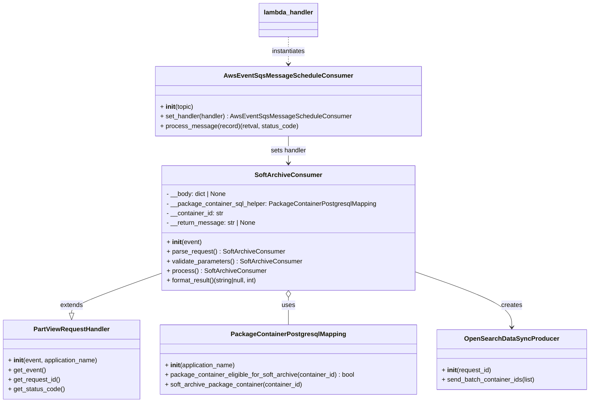
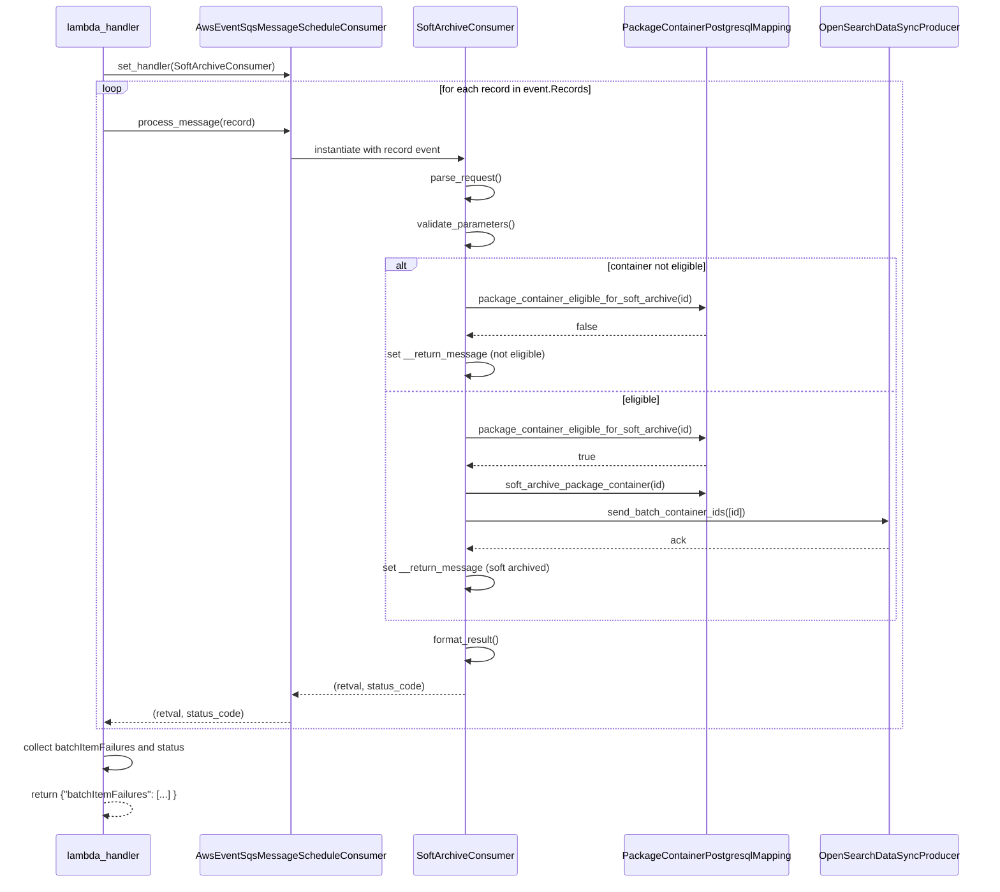

# Diagram: partview_core/partview_service/partview_service/api/archive/soft_archive/soft_archive_consumer.py

> Auto-generated by Obscura crawlers

## Diagram 1

### SVG

<svg id="container" width="1465.703125" xmlns="http://www.w3.org/2000/svg" class="classDiagram" height="1006" viewBox="0 0 1465.703125 1006" role="graphics-document document" aria-roledescription="class"><g><defs><marker id="container_class-aggregationStart" class="marker aggregation class" refX="18" refY="7" markerWidth="190" markerHeight="240" orient="auto"><path d="M 18,7 L9,13 L1,7 L9,1 Z"></path></marker></defs><defs><marker id="container_class-aggregationEnd" class="marker aggregation class" refX="1" refY="7" markerWidth="20" markerHeight="28" orient="auto"><path d="M 18,7 L9,13 L1,7 L9,1 Z"></path></marker></defs><defs><marker id="container_class-extensionStart" class="marker extension class" refX="18" refY="7" markerWidth="190" markerHeight="240" orient="auto"><path d="M 1,7 L18,13 V 1 Z"></path></marker></defs><defs><marker id="container_class-extensionEnd" class="marker extension class" refX="1" refY="7" markerWidth="20" markerHeight="28" orient="auto"><path d="M 1,1 V 13 L18,7 Z"></path></marker></defs><defs><marker id="container_class-compositionStart" class="marker composition class" refX="18" refY="7" markerWidth="190" markerHeight="240" orient="auto"><path d="M 18,7 L9,13 L1,7 L9,1 Z"></path></marker></defs><defs><marker id="container_class-compositionEnd" class="marker composition class" refX="1" refY="7" markerWidth="20" markerHeight="28" orient="auto"><path d="M 18,7 L9,13 L1,7 L9,1 Z"></path></marker></defs><defs><marker id="container_class-dependencyStart" class="marker dependency class" refX="6" refY="7" markerWidth="190" markerHeight="240" orient="auto"><path d="M 5,7 L9,13 L1,7 L9,1 Z"></path></marker></defs><defs><marker id="container_class-dependencyEnd" class="marker dependency class" refX="13" refY="7" markerWidth="20" markerHeight="28" orient="auto"><path d="M 18,7 L9,13 L14,7 L9,1 Z"></path></marker></defs><defs><marker id="container_class-lollipopStart" class="marker lollipop class" refX="13" refY="7" markerWidth="190" markerHeight="240" orient="auto"><circle stroke="black" fill="transparent" cx="7" cy="7" r="6"></circle></marker></defs><defs><marker id="container_class-lollipopEnd" class="marker lollipop class" refX="1" refY="7" markerWidth="190" markerHeight="240" orient="auto"><circle stroke="black" fill="transparent" cx="7" cy="7" r="6"></circle></marker></defs><g class="root"><g class="clusters"></g><g class="edgePaths"><path d="M406.477,681.654L368.549,695.212C330.622,708.769,254.768,735.885,216.841,752.734C178.914,769.583,178.914,776.167,178.914,779.458L178.914,782.75" id="id_SoftArchiveConsumer_PartViewRequestHandler_1" class="edge-thickness-normal edge-pattern-solid relation" style=";;;" data-edge="true" data-et="edge" data-id="id_SoftArchiveConsumer_PartViewRequestHandler_1" data-points="W3sieCI6NDA2LjQ3NjU2MjUsInkiOjY4MS42NTM5NDI3MTMyNjk4fSx7IngiOjE3OC45MTQwNjI1LCJ5Ijo3NjN9LHsieCI6MTc4LjkxNDA2MjUsInkiOjgwMH1d" marker-end="url(#container_class-extensionEnd)"></path><path d="M718.824,743.25L718.824,746.542C718.824,749.833,718.824,756.417,718.824,767.875C718.824,779.333,718.824,795.667,718.824,803.833L718.824,812" id="id_SoftArchiveConsumer_PackageContainerPostgresqlMapping_2" class="edge-thickness-normal edge-pattern-solid relation" style=";;;" data-edge="true" data-et="edge" data-id="id_SoftArchiveConsumer_PackageContainerPostgresqlMapping_2" data-points="W3sieCI6NzE4LjgyNDIxODc1LCJ5Ijo3MjZ9LHsieCI6NzE4LjgyNDIxODc1LCJ5Ijo3NjN9LHsieCI6NzE4LjgyNDIxODc1LCJ5Ijo4MTJ9XQ==" marker-start="url(#container_class-aggregationStart)"></path><path d="M1031.172,678.827L1071.437,692.855C1111.702,706.884,1192.232,734.942,1232.497,758.138C1272.762,781.333,1272.762,799.667,1272.762,808.833L1272.762,818" id="id_SoftArchiveConsumer_OpenSearchDataSyncProducer_3" class="edge-thickness-normal edge-pattern-solid relation" style=";;;" data-edge="true" data-et="edge" data-id="id_SoftArchiveConsumer_OpenSearchDataSyncProducer_3" data-points="W3sieCI6MTAzMS4xNzE4NzUsInkiOjY3OC44MjY1MzMwNTg3ODM4fSx7IngiOjEyNzIuNzYxNzE4NzUsInkiOjc2M30seyJ4IjoxMjcyLjc2MTcxODc1LCJ5Ijo4MjR9XQ==" marker-end="url(#container_class-dependencyEnd)"></path><path d="M718.824,92L718.824,98.167C718.824,104.333,718.824,116.667,718.824,128C718.824,139.333,718.824,149.667,718.824,154.833L718.824,160" id="id_lambda_handler_AwsEventSqsMessageScheduleConsumer_4" class="edge-thickness-normal edge-pattern-dashed relation" style=";;;" data-edge="true" data-et="edge" data-id="id_lambda_handler_AwsEventSqsMessageScheduleConsumer_4" data-points="W3sieCI6NzE4LjgyNDIxODc1LCJ5Ijo5Mn0seyJ4Ijo3MTguODI0MjE4NzUsInkiOjEyOX0seyJ4Ijo3MTguODI0MjE4NzUsInkiOjE2Nn1d" marker-end="url(#container_class-dependencyEnd)"></path><path d="M718.824,340L718.824,346.167C718.824,352.333,718.824,364.667,718.824,376C718.824,387.333,718.824,397.667,718.824,402.833L718.824,408" id="id_AwsEventSqsMessageScheduleConsumer_SoftArchiveConsumer_5" class="edge-thickness-normal edge-pattern-solid relation" style=";;;" data-edge="true" data-et="edge" data-id="id_AwsEventSqsMessageScheduleConsumer_SoftArchiveConsumer_5" data-points="W3sieCI6NzE4LjgyNDIxODc1LCJ5IjozNDB9LHsieCI6NzE4LjgyNDIxODc1LCJ5IjozNzd9LHsieCI6NzE4LjgyNDIxODc1LCJ5Ijo0MTR9XQ==" marker-end="url(#container_class-dependencyEnd)"></path></g><g class="edgeLabels"><g class="edgeLabel" transform="translate(178.9140625, 763)"><g class="label" data-id="id_SoftArchiveConsumer_PartViewRequestHandler_1" transform="translate(-28.5078125, -12)"><foreignObject width="57.015625" height="24">

extends

</foreignObject></g></g><g class="edgeLabel" transform="translate(718.82421875, 763)"><g class="label" data-id="id_SoftArchiveConsumer_PackageContainerPostgresqlMapping_2" transform="translate(-16.4921875, -12)"><foreignObject width="32.984375" height="24">

uses

</foreignObject></g></g><g class="edgeLabel" transform="translate(1272.76171875, 763)"><g class="label" data-id="id_SoftArchiveConsumer_OpenSearchDataSyncProducer_3" transform="translate(-26.171875, -12)"><foreignObject width="52.34375" height="24">

creates

</foreignObject></g></g><g class="edgeLabel" transform="translate(718.82421875, 129)"><g class="label" data-id="id_lambda_handler_AwsEventSqsMessageScheduleConsumer_4" transform="translate(-42.9140625, -12)"><foreignObject width="85.828125" height="24">

instantiates

</foreignObject></g></g><g class="edgeLabel" transform="translate(718.82421875, 377)"><g class="label" data-id="id_AwsEventSqsMessageScheduleConsumer_SoftArchiveConsumer_5" transform="translate(-45.109375, -12)"><foreignObject width="90.21875" height="24">

sets handler

</foreignObject></g></g></g><g class="nodes"><g class="node default" id="classId-SoftArchiveConsumer-0" transform="translate(718.82421875, 570)"><g class="basic label-container"><path d="M-312.34765625 -156 L312.34765625 -156 L312.34765625 156 L-312.34765625 156" stroke="none" stroke-width="0" fill="#ECECFF" style=""></path><path d="M-312.34765625 -156 C-164.42441569873526 -156, -16.50117514747052 -156, 312.34765625 -156 M-312.34765625 -156 C-96.22835386426217 -156, 119.89094852147565 -156, 312.34765625 -156 M312.34765625 -156 C312.34765625 -79.25561739829284, 312.34765625 -2.5112347965856827, 312.34765625 156 M312.34765625 -156 C312.34765625 -54.64803730324816, 312.34765625 46.70392539350368, 312.34765625 156 M312.34765625 156 C186.80392762624962 156, 61.26019900249926 156, -312.34765625 156 M312.34765625 156 C99.15777660747824 156, -114.03210303504352 156, -312.34765625 156 M-312.34765625 156 C-312.34765625 32.43750378248818, -312.34765625 -91.12499243502364, -312.34765625 -156 M-312.34765625 156 C-312.34765625 76.34575759359129, -312.34765625 -3.308484812817426, -312.34765625 -156" stroke="#9370DB" stroke-width="1.3" fill="none" stroke-dasharray="0 0" style=""></path></g><g class="annotation-group text" transform="translate(0, -132)"></g><g class="label-group text" transform="translate(-78.5859375, -132)"><g class="label" style="font-weight: bolder" transform="translate(0,-12)"><foreignObject width="157.171875" height="24">

SoftArchiveConsumer

</foreignObject></g></g><g class="members-group text" transform="translate(-300.34765625, -84)"><g class="label" style="" transform="translate(0,-12)"><foreignObject width="152.40625" height="24">

- __body: dict | None

</foreignObject></g><g class="label" style="" transform="translate(0,12)"><foreignObject width="522.109375" height="24">

- __package_container_sql_helper: PackageContainerPostgresqlMapping

</foreignObject></g><g class="label" style="" transform="translate(0,36)"><foreignObject width="144.6875" height="24">

- __container_id: str

</foreignObject></g><g class="label" style="" transform="translate(0,60)"><foreignObject width="223.734375" height="24">

- __return_message: str | None

</foreignObject></g></g><g class="methods-group text" transform="translate(-300.34765625, 36)"><g class="label" style="" transform="translate(0,-12)"><foreignObject width="87.390625" height="24">

+ <strong>init</strong>(event)

</foreignObject></g><g class="label" style="" transform="translate(0,12)"><foreignObject width="293.234375" height="24">

+ parse_request() : SoftArchiveConsumer

</foreignObject></g><g class="label" style="" transform="translate(0,36)"><foreignObject width="338.15625" height="24">

+ validate_parameters() : SoftArchiveConsumer

</foreignObject></g><g class="label" style="" transform="translate(0,60)"><foreignObject width="245.171875" height="24">

+ process() : SoftArchiveConsumer

</foreignObject></g><g class="label" style="" transform="translate(0,84)"><foreignObject width="235.8125" height="24">

+ format_result()(string|null, int)

</foreignObject></g></g><g class="divider" style=""><path d="M-312.34765625 -108 C-147.3607977888425 -108, 17.62606067231502 -108, 312.34765625 -108 M-312.34765625 -108 C-181.5470853875271 -108, -50.74651452505418 -108, 312.34765625 -108" stroke="#9370DB" stroke-width="1.3" fill="none" stroke-dasharray="0 0" style=""></path></g><g class="divider" style=""><path d="M-312.34765625 12 C-114.65152941091125 12, 83.0445974281775 12, 312.34765625 12 M-312.34765625 12 C-124.29587976418037 12, 63.75589672163926 12, 312.34765625 12" stroke="#9370DB" stroke-width="1.3" fill="none" stroke-dasharray="0 0" style=""></path></g></g><g class="node default" id="classId-PartViewRequestHandler-1" transform="translate(178.9140625, 899)"><g class="basic label-container"><path d="M-170.9140625 -99 L170.9140625 -99 L170.9140625 99 L-170.9140625 99" stroke="none" stroke-width="0" fill="#ECECFF" style=""></path><path d="M-170.9140625 -99 C-41.17199617479875 -99, 88.5700701504025 -99, 170.9140625 -99 M-170.9140625 -99 C-97.0014085280991 -99, -23.08875455619821 -99, 170.9140625 -99 M170.9140625 -99 C170.9140625 -49.843135313127604, 170.9140625 -0.6862706262552081, 170.9140625 99 M170.9140625 -99 C170.9140625 -51.10026651225649, 170.9140625 -3.2005330245129784, 170.9140625 99 M170.9140625 99 C97.38912502206317 99, 23.864187544126338 99, -170.9140625 99 M170.9140625 99 C35.208652795318244 99, -100.49675690936351 99, -170.9140625 99 M-170.9140625 99 C-170.9140625 37.656443798076545, -170.9140625 -23.68711240384691, -170.9140625 -99 M-170.9140625 99 C-170.9140625 40.96267253654673, -170.9140625 -17.074654926906547, -170.9140625 -99" stroke="#9370DB" stroke-width="1.3" fill="none" stroke-dasharray="0 0" style=""></path></g><g class="annotation-group text" transform="translate(0, -75)"></g><g class="label-group text" transform="translate(-91.359375, -75)"><g class="label" style="font-weight: bolder" transform="translate(0,-12)"><foreignObject width="182.71875" height="24">

PartViewRequestHandler

</foreignObject></g></g><g class="members-group text" transform="translate(-158.9140625, -27)"></g><g class="methods-group text" transform="translate(-158.9140625, 3)"><g class="label" style="" transform="translate(0,-12)"><foreignObject width="226.46875" height="24">

+ <strong>init</strong>(event, application_name)

</foreignObject></g><g class="label" style="" transform="translate(0,12)"><foreignObject width="93.5" height="24">

+ get_event()

</foreignObject></g><g class="label" style="" transform="translate(0,36)"><foreignObject width="131.140625" height="24">

+ get_request_id()

</foreignObject></g><g class="label" style="" transform="translate(0,60)"><foreignObject width="140.515625" height="24">

+ get_status_code()

</foreignObject></g></g><g class="divider" style=""><path d="M-170.9140625 -51 C-61.550454912565755 -51, 47.81315267486849 -51, 170.9140625 -51 M-170.9140625 -51 C-82.88508722254483 -51, 5.143888054910349 -51, 170.9140625 -51" stroke="#9370DB" stroke-width="1.3" fill="none" stroke-dasharray="0 0" style=""></path></g><g class="divider" style=""><path d="M-170.9140625 -27 C-47.21219934140075 -27, 76.4896638171985 -27, 170.9140625 -27 M-170.9140625 -27 C-76.20584598971044 -27, 18.50237052057912 -27, 170.9140625 -27" stroke="#9370DB" stroke-width="1.3" fill="none" stroke-dasharray="0 0" style=""></path></g></g><g class="node default" id="classId-PackageContainerPostgresqlMapping-2" transform="translate(718.82421875, 899)"><g class="basic label-container"><path d="M-318.99609375 -87 L318.99609375 -87 L318.99609375 87 L-318.99609375 87" stroke="none" stroke-width="0" fill="#ECECFF" style=""></path><path d="M-318.99609375 -87 C-86.74447533324175 -87, 145.5071430835165 -87, 318.99609375 -87 M-318.99609375 -87 C-151.26918757631597 -87, 16.457718597368057 -87, 318.99609375 -87 M318.99609375 -87 C318.99609375 -19.551433761371754, 318.99609375 47.89713247725649, 318.99609375 87 M318.99609375 -87 C318.99609375 -37.33917970875475, 318.99609375 12.321640582490502, 318.99609375 87 M318.99609375 87 C136.3572400072703 87, -46.281613735459416 87, -318.99609375 87 M318.99609375 87 C113.00165535265845 87, -92.99278304468311 87, -318.99609375 87 M-318.99609375 87 C-318.99609375 39.27481485916267, -318.99609375 -8.450370281674665, -318.99609375 -87 M-318.99609375 87 C-318.99609375 48.848067069623944, -318.99609375 10.696134139247889, -318.99609375 -87" stroke="#9370DB" stroke-width="1.3" fill="none" stroke-dasharray="0 0" style=""></path></g><g class="annotation-group text" transform="translate(0, -63)"></g><g class="label-group text" transform="translate(-135.8515625, -63)"><g class="label" style="font-weight: bolder" transform="translate(0,-12)"><foreignObject width="271.703125" height="24">

PackageContainerPostgresqlMapping

</foreignObject></g></g><g class="members-group text" transform="translate(-306.99609375, -15)"></g><g class="methods-group text" transform="translate(-306.99609375, 15)"><g class="label" style="" transform="translate(0,-12)"><foreignObject width="177.984375" height="24">

+ <strong>init</strong>(application_name)

</foreignObject></g><g class="label" style="" transform="translate(0,12)"><foreignObject width="478.140625" height="24">

+ package_container_eligible_for_soft_archive(container_id) : bool

</foreignObject></g><g class="label" style="" transform="translate(0,36)"><foreignObject width="345.1875" height="24">

+ soft_archive_package_container(container_id)

</foreignObject></g></g><g class="divider" style=""><path d="M-318.99609375 -39 C-126.68918243757321 -39, 65.61772887485358 -39, 318.99609375 -39 M-318.99609375 -39 C-142.89386659423909 -39, 33.20836056152183 -39, 318.99609375 -39" stroke="#9370DB" stroke-width="1.3" fill="none" stroke-dasharray="0 0" style=""></path></g><g class="divider" style=""><path d="M-318.99609375 -15 C-133.81257750582233 -15, 51.370938738355335 -15, 318.99609375 -15 M-318.99609375 -15 C-122.66480452576852 -15, 73.66648469846297 -15, 318.99609375 -15" stroke="#9370DB" stroke-width="1.3" fill="none" stroke-dasharray="0 0" style=""></path></g></g><g class="node default" id="classId-OpenSearchDataSyncProducer-3" transform="translate(1272.76171875, 899)"><g class="basic label-container"><path d="M-184.94140625 -75 L184.94140625 -75 L184.94140625 75 L-184.94140625 75" stroke="none" stroke-width="0" fill="#ECECFF" style=""></path><path d="M-184.94140625 -75 C-93.41484244992847 -75, -1.888278649856943 -75, 184.94140625 -75 M-184.94140625 -75 C-91.57855641788021 -75, 1.7842934142395848 -75, 184.94140625 -75 M184.94140625 -75 C184.94140625 -25.31181597449993, 184.94140625 24.376368051000142, 184.94140625 75 M184.94140625 -75 C184.94140625 -24.971537684165064, 184.94140625 25.056924631669872, 184.94140625 75 M184.94140625 75 C74.61022922704164 75, -35.720947795916715 75, -184.94140625 75 M184.94140625 75 C108.68327523726227 75, 32.42514422452453 75, -184.94140625 75 M-184.94140625 75 C-184.94140625 18.17304185649317, -184.94140625 -38.65391628701366, -184.94140625 -75 M-184.94140625 75 C-184.94140625 37.064525826045404, -184.94140625 -0.8709483479091915, -184.94140625 -75" stroke="#9370DB" stroke-width="1.3" fill="none" stroke-dasharray="0 0" style=""></path></g><g class="annotation-group text" transform="translate(0, -51)"></g><g class="label-group text" transform="translate(-110.9765625, -51)"><g class="label" style="font-weight: bolder" transform="translate(0,-12)"><foreignObject width="221.953125" height="24">

OpenSearchDataSyncProducer

</foreignObject></g></g><g class="members-group text" transform="translate(-172.94140625, -3)"></g><g class="methods-group text" transform="translate(-172.94140625, 27)"><g class="label" style="" transform="translate(0,-12)"><foreignObject width="124.71875" height="24">

+ <strong>init</strong>(request_id)

</foreignObject></g><g class="label" style="" transform="translate(0,12)"><foreignObject width="234.90625" height="24">

+ send_batch_container_ids(list)

</foreignObject></g></g><g class="divider" style=""><path d="M-184.94140625 -27 C-78.72392322865194 -27, 27.493559792696118 -27, 184.94140625 -27 M-184.94140625 -27 C-79.0884713773935 -27, 26.764463495212993 -27, 184.94140625 -27" stroke="#9370DB" stroke-width="1.3" fill="none" stroke-dasharray="0 0" style=""></path></g><g class="divider" style=""><path d="M-184.94140625 -3 C-69.37418793456546 -3, 46.19303038086909 -3, 184.94140625 -3 M-184.94140625 -3 C-102.56257491893828 -3, -20.183743587876563 -3, 184.94140625 -3" stroke="#9370DB" stroke-width="1.3" fill="none" stroke-dasharray="0 0" style=""></path></g></g><g class="node default" id="classId-AwsEventSqsMessageScheduleConsumer-4" transform="translate(718.82421875, 253)"><g class="basic label-container"><path d="M-322.99609375 -87 L322.99609375 -87 L322.99609375 87 L-322.99609375 87" stroke="none" stroke-width="0" fill="#ECECFF" style=""></path><path d="M-322.99609375 -87 C-83.02843076132106 -87, 156.93923222735788 -87, 322.99609375 -87 M-322.99609375 -87 C-190.6363137035309 -87, -58.276533657061805 -87, 322.99609375 -87 M322.99609375 -87 C322.99609375 -43.162608088041765, 322.99609375 0.6747838239164707, 322.99609375 87 M322.99609375 -87 C322.99609375 -33.47710091820757, 322.99609375 20.045798163584863, 322.99609375 87 M322.99609375 87 C181.76596561965388 87, 40.53583748930777 87, -322.99609375 87 M322.99609375 87 C79.64624384526212 87, -163.70360605947576 87, -322.99609375 87 M-322.99609375 87 C-322.99609375 34.97579708746674, -322.99609375 -17.048405825066524, -322.99609375 -87 M-322.99609375 87 C-322.99609375 18.453425443597666, -322.99609375 -50.09314911280467, -322.99609375 -87" stroke="#9370DB" stroke-width="1.3" fill="none" stroke-dasharray="0 0" style=""></path></g><g class="annotation-group text" transform="translate(0, -63)"></g><g class="label-group text" transform="translate(-149.3984375, -63)"><g class="label" style="font-weight: bolder" transform="translate(0,-12)"><foreignObject width="298.796875" height="24">

AwsEventSqsMessageScheduleConsumer

</foreignObject></g></g><g class="members-group text" transform="translate(-310.99609375, -15)"></g><g class="methods-group text" transform="translate(-310.99609375, 15)"><g class="label" style="" transform="translate(0,-12)"><foreignObject width="83.59375" height="24">

+ <strong>init</strong>(topic)

</foreignObject></g><g class="label" style="" transform="translate(0,12)"><foreignObject width="472.59375" height="24">

+ set_handler(handler) : AwsEventSqsMessageScheduleConsumer

</foreignObject></g><g class="label" style="" transform="translate(0,36)"><foreignObject width="341.21875" height="24">

+ process_message(record)(retval, status_code)

</foreignObject></g></g><g class="divider" style=""><path d="M-322.99609375 -39 C-189.01774849000628 -39, -55.03940323001257 -39, 322.99609375 -39 M-322.99609375 -39 C-155.95442391930573 -39, 11.08724591138855 -39, 322.99609375 -39" stroke="#9370DB" stroke-width="1.3" fill="none" stroke-dasharray="0 0" style=""></path></g><g class="divider" style=""><path d="M-322.99609375 -15 C-100.08649687815591 -15, 122.82309999368817 -15, 322.99609375 -15 M-322.99609375 -15 C-173.6280804175728 -15, -24.26006708514558 -15, 322.99609375 -15" stroke="#9370DB" stroke-width="1.3" fill="none" stroke-dasharray="0 0" style=""></path></g></g><g class="node default" id="classId-lambda_handler-5" transform="translate(718.82421875, 50)"><g class="basic label-container"><path d="M-71.9765625 -42 L71.9765625 -42 L71.9765625 42 L-71.9765625 42" stroke="none" stroke-width="0" fill="#ECECFF" style=""></path><path d="M-71.9765625 -42 C-34.6432829825499 -42, 2.689996534900203 -42, 71.9765625 -42 M-71.9765625 -42 C-39.34942795729523 -42, -6.722293414590453 -42, 71.9765625 -42 M71.9765625 -42 C71.9765625 -23.627563155799074, 71.9765625 -5.255126311598147, 71.9765625 42 M71.9765625 -42 C71.9765625 -22.52437222520745, 71.9765625 -3.048744450414901, 71.9765625 42 M71.9765625 42 C40.66391252941853 42, 9.351262558837064 42, -71.9765625 42 M71.9765625 42 C35.43332260215206 42, -1.1099172956958796 42, -71.9765625 42 M-71.9765625 42 C-71.9765625 23.62336064452411, -71.9765625 5.246721289048217, -71.9765625 -42 M-71.9765625 42 C-71.9765625 13.682023296604878, -71.9765625 -14.635953406790243, -71.9765625 -42" stroke="#9370DB" stroke-width="1.3" fill="none" stroke-dasharray="0 0" style=""></path></g><g class="annotation-group text" transform="translate(0, -18)"></g><g class="label-group text" transform="translate(-59.9765625, -18)"><g class="label" style="font-weight: bolder" transform="translate(0,-12)"><foreignObject width="119.953125" height="24">

lambda_handler

</foreignObject></g></g><g class="members-group text" transform="translate(-59.9765625, 30)"></g><g class="methods-group text" transform="translate(-59.9765625, 60)"></g><g class="divider" style=""><path d="M-71.9765625 6 C-41.18358750203623 6, -10.390612504072458 6, 71.9765625 6 M-71.9765625 6 C-24.707111482291033 6, 22.562339535417934 6, 71.9765625 6" stroke="#9370DB" stroke-width="1.3" fill="none" stroke-dasharray="0 0" style=""></path></g><g class="divider" style=""><path d="M-71.9765625 24 C-36.573753983040056 24, -1.1709454660801129 24, 71.9765625 24 M-71.9765625 24 C-33.40869765586746 24, 5.159167188265073 24, 71.9765625 24" stroke="#9370DB" stroke-width="1.3" fill="none" stroke-dasharray="0 0" style=""></path></g></g></g></g></g></svg>

## Diagram 2

### SVG

<svg id="container" width="1695" xmlns="http://www.w3.org/2000/svg" height="1478" viewBox="-105 -10 1695 1478" role="graphics-document document" aria-roledescription="sequence"><g><rect x="1300" y="1392" fill="#eaeaea" stroke="#666" width="240" height="65" name="ES" rx="3" ry="3" class="actor actor-bottom"></rect><text x="1420" y="1424.5" dominant-baseline="central" alignment-baseline="central" class="actor actor-box" style="text-anchor: middle; font-size: 16px; font-weight: 400;"><tspan x="1420" dy="0">OpenSearchDataSyncProducer</tspan></text></g><g><rect x="963" y="1392" fill="#eaeaea" stroke="#666" width="287" height="65" name="DB" rx="3" ry="3" class="actor actor-bottom"></rect><text x="1106.5" y="1424.5" dominant-baseline="central" alignment-baseline="central" class="actor actor-box" style="text-anchor: middle; font-size: 16px; font-weight: 400;"><tspan x="1106.5" dy="0">PackageContainerPostgresqlMapping</tspan></text></g><g><rect x="604.5" y="1392" fill="#eaeaea" stroke="#666" width="176" height="65" name="Consumer" rx="3" ry="3" class="actor actor-bottom"></rect><text x="692.5" y="1424.5" dominant-baseline="central" alignment-baseline="central" class="actor actor-box" style="text-anchor: middle; font-size: 16px; font-weight: 400;"><tspan x="692.5" dy="0">SoftArchiveConsumer</tspan></text></g><g><rect x="239.5" y="1392" fill="#eaeaea" stroke="#666" width="315" height="65" name="SQS" rx="3" ry="3" class="actor actor-bottom"></rect><text x="397" y="1424.5" dominant-baseline="central" alignment-baseline="central" class="actor actor-box" style="text-anchor: middle; font-size: 16px; font-weight: 400;"><tspan x="397" dy="0">AwsEventSqsMessageScheduleConsumer</tspan></text></g><g><rect x="0" y="1392" fill="#eaeaea" stroke="#666" width="150" height="65" name="Lambda" rx="3" ry="3" class="actor actor-bottom"></rect><text x="75" y="1424.5" dominant-baseline="central" alignment-baseline="central" class="actor actor-box" style="text-anchor: middle; font-size: 16px; font-weight: 400;"><tspan x="75" dy="0">lambda_handler</tspan></text></g><g><line id="actor4" x1="1420" y1="65" x2="1420" y2="1392" class="actor-line 200" stroke-width="0.5px" stroke="#999" name="ES"></line><g id="root-4"><rect x="1300" y="0" fill="#eaeaea" stroke="#666" width="240" height="65" name="ES" rx="3" ry="3" class="actor actor-top"></rect><text x="1420" y="32.5" dominant-baseline="central" alignment-baseline="central" class="actor actor-box" style="text-anchor: middle; font-size: 16px; font-weight: 400;"><tspan x="1420" dy="0">OpenSearchDataSyncProducer</tspan></text></g></g><g><line id="actor3" x1="1106.5" y1="65" x2="1106.5" y2="1392" class="actor-line 200" stroke-width="0.5px" stroke="#999" name="DB"></line><g id="root-3"><rect x="963" y="0" fill="#eaeaea" stroke="#666" width="287" height="65" name="DB" rx="3" ry="3" class="actor actor-top"></rect><text x="1106.5" y="32.5" dominant-baseline="central" alignment-baseline="central" class="actor actor-box" style="text-anchor: middle; font-size: 16px; font-weight: 400;"><tspan x="1106.5" dy="0">PackageContainerPostgresqlMapping</tspan></text></g></g><g><line id="actor2" x1="692.5" y1="65" x2="692.5" y2="1392" class="actor-line 200" stroke-width="0.5px" stroke="#999" name="Consumer"></line><g id="root-2"><rect x="604.5" y="0" fill="#eaeaea" stroke="#666" width="176" height="65" name="Consumer" rx="3" ry="3" class="actor actor-top"></rect><text x="692.5" y="32.5" dominant-baseline="central" alignment-baseline="central" class="actor actor-box" style="text-anchor: middle; font-size: 16px; font-weight: 400;"><tspan x="692.5" dy="0">SoftArchiveConsumer</tspan></text></g></g><g><line id="actor1" x1="397" y1="65" x2="397" y2="1392" class="actor-line 200" stroke-width="0.5px" stroke="#999" name="SQS"></line><g id="root-1"><rect x="239.5" y="0" fill="#eaeaea" stroke="#666" width="315" height="65" name="SQS" rx="3" ry="3" class="actor actor-top"></rect><text x="397" y="32.5" dominant-baseline="central" alignment-baseline="central" class="actor actor-box" style="text-anchor: middle; font-size: 16px; font-weight: 400;"><tspan x="397" dy="0">AwsEventSqsMessageScheduleConsumer</tspan></text></g></g><g><line id="actor0" x1="75" y1="65" x2="75" y2="1392" class="actor-line 200" stroke-width="0.5px" stroke="#999" name="Lambda"></line><g id="root-0"><rect x="0" y="0" fill="#eaeaea" stroke="#666" width="150" height="65" name="Lambda" rx="3" ry="3" class="actor actor-top"></rect><text x="75" y="32.5" dominant-baseline="central" alignment-baseline="central" class="actor actor-box" style="text-anchor: middle; font-size: 16px; font-weight: 400;"><tspan x="75" dy="0">lambda_handler</tspan></text></g></g><g></g><defs><symbol id="computer" width="24" height="24"><path transform="scale(.5)" d="M2 2v13h20v-13h-20zm18 11h-16v-9h16v9zm-10.228 6l.466-1h3.524l.467 1h-4.457zm14.228 3h-24l2-6h2.104l-1.33 4h18.45l-1.297-4h2.073l2 6zm-5-10h-14v-7h14v7z"></path></symbol></defs><defs><symbol id="database" fill-rule="evenodd" clip-rule="evenodd"><path transform="scale(.5)" d="M12.258.001l.256.004.255.005.253.008.251.01.249.012.247.015.246.016.242.019.241.02.239.023.236.024.233.027.231.028.229.031.225.032.223.034.22.036.217.038.214.04.211.041.208.043.205.045.201.046.198.048.194.05.191.051.187.053.183.054.18.056.175.057.172.059.168.06.163.061.16.063.155.064.15.066.074.033.073.033.071.034.07.034.069.035.068.035.067.035.066.035.064.036.064.036.062.036.06.036.06.037.058.037.058.037.055.038.055.038.053.038.052.038.051.039.05.039.048.039.047.039.045.04.044.04.043.04.041.04.04.041.039.041.037.041.036.041.034.041.033.042.032.042.03.042.029.042.027.042.026.043.024.043.023.043.021.043.02.043.018.044.017.043.015.044.013.044.012.044.011.045.009.044.007.045.006.045.004.045.002.045.001.045v17l-.001.045-.002.045-.004.045-.006.045-.007.045-.009.044-.011.045-.012.044-.013.044-.015.044-.017.043-.018.044-.02.043-.021.043-.023.043-.024.043-.026.043-.027.042-.029.042-.03.042-.032.042-.033.042-.034.041-.036.041-.037.041-.039.041-.04.041-.041.04-.043.04-.044.04-.045.04-.047.039-.048.039-.05.039-.051.039-.052.038-.053.038-.055.038-.055.038-.058.037-.058.037-.06.037-.06.036-.062.036-.064.036-.064.036-.066.035-.067.035-.068.035-.069.035-.07.034-.071.034-.073.033-.074.033-.15.066-.155.064-.16.063-.163.061-.168.06-.172.059-.175.057-.18.056-.183.054-.187.053-.191.051-.194.05-.198.048-.201.046-.205.045-.208.043-.211.041-.214.04-.217.038-.22.036-.223.034-.225.032-.229.031-.231.028-.233.027-.236.024-.239.023-.241.02-.242.019-.246.016-.247.015-.249.012-.251.01-.253.008-.255.005-.256.004-.258.001-.258-.001-.256-.004-.255-.005-.253-.008-.251-.01-.249-.012-.247-.015-.245-.016-.243-.019-.241-.02-.238-.023-.236-.024-.234-.027-.231-.028-.228-.031-.226-.032-.223-.034-.22-.036-.217-.038-.214-.04-.211-.041-.208-.043-.204-.045-.201-.046-.198-.048-.195-.05-.19-.051-.187-.053-.184-.054-.179-.056-.176-.057-.172-.059-.167-.06-.164-.061-.159-.063-.155-.064-.151-.066-.074-.033-.072-.033-.072-.034-.07-.034-.069-.035-.068-.035-.067-.035-.066-.035-.064-.036-.063-.036-.062-.036-.061-.036-.06-.037-.058-.037-.057-.037-.056-.038-.055-.038-.053-.038-.052-.038-.051-.039-.049-.039-.049-.039-.046-.039-.046-.04-.044-.04-.043-.04-.041-.04-.04-.041-.039-.041-.037-.041-.036-.041-.034-.041-.033-.042-.032-.042-.03-.042-.029-.042-.027-.042-.026-.043-.024-.043-.023-.043-.021-.043-.02-.043-.018-.044-.017-.043-.015-.044-.013-.044-.012-.044-.011-.045-.009-.044-.007-.045-.006-.045-.004-.045-.002-.045-.001-.045v-17l.001-.045.002-.045.004-.045.006-.045.007-.045.009-.044.011-.045.012-.044.013-.044.015-.044.017-.043.018-.044.02-.043.021-.043.023-.043.024-.043.026-.043.027-.042.029-.042.03-.042.032-.042.033-.042.034-.041.036-.041.037-.041.039-.041.04-.041.041-.04.043-.04.044-.04.046-.04.046-.039.049-.039.049-.039.051-.039.052-.038.053-.038.055-.038.056-.038.057-.037.058-.037.06-.037.061-.036.062-.036.063-.036.064-.036.066-.035.067-.035.068-.035.069-.035.07-.034.072-.034.072-.033.074-.033.151-.066.155-.064.159-.063.164-.061.167-.06.172-.059.176-.057.179-.056.184-.054.187-.053.19-.051.195-.05.198-.048.201-.046.204-.045.208-.043.211-.041.214-.04.217-.038.22-.036.223-.034.226-.032.228-.031.231-.028.234-.027.236-.024.238-.023.241-.02.243-.019.245-.016.247-.015.249-.012.251-.01.253-.008.255-.005.256-.004.258-.001.258.001zm-9.258 20.499v.01l.001.021.003.021.004.022.005.021.006.022.007.022.009.023.01.022.011.023.012.023.013.023.015.023.016.024.017.023.018.024.019.024.021.024.022.025.023.024.024.025.052.049.056.05.061.051.066.051.07.051.075.051.079.052.084.052.088.052.092.052.097.052.102.051.105.052.11.052.114.051.119.051.123.051.127.05.131.05.135.05.139.048.144.049.147.047.152.047.155.047.16.045.163.045.167.043.171.043.176.041.178.041.183.039.187.039.19.037.194.035.197.035.202.033.204.031.209.03.212.029.216.027.219.025.222.024.226.021.23.02.233.018.236.016.24.015.243.012.246.01.249.008.253.005.256.004.259.001.26-.001.257-.004.254-.005.25-.008.247-.011.244-.012.241-.014.237-.016.233-.018.231-.021.226-.021.224-.024.22-.026.216-.027.212-.028.21-.031.205-.031.202-.034.198-.034.194-.036.191-.037.187-.039.183-.04.179-.04.175-.042.172-.043.168-.044.163-.045.16-.046.155-.046.152-.047.148-.048.143-.049.139-.049.136-.05.131-.05.126-.05.123-.051.118-.052.114-.051.11-.052.106-.052.101-.052.096-.052.092-.052.088-.053.083-.051.079-.052.074-.052.07-.051.065-.051.06-.051.056-.05.051-.05.023-.024.023-.025.021-.024.02-.024.019-.024.018-.024.017-.024.015-.023.014-.024.013-.023.012-.023.01-.023.01-.022.008-.022.006-.022.006-.022.004-.022.004-.021.001-.021.001-.021v-4.127l-.077.055-.08.053-.083.054-.085.053-.087.052-.09.052-.093.051-.095.05-.097.05-.1.049-.102.049-.105.048-.106.047-.109.047-.111.046-.114.045-.115.045-.118.044-.12.043-.122.042-.124.042-.126.041-.128.04-.13.04-.132.038-.134.038-.135.037-.138.037-.139.035-.142.035-.143.034-.144.033-.147.032-.148.031-.15.03-.151.03-.153.029-.154.027-.156.027-.158.026-.159.025-.161.024-.162.023-.163.022-.165.021-.166.02-.167.019-.169.018-.169.017-.171.016-.173.015-.173.014-.175.013-.175.012-.177.011-.178.01-.179.008-.179.008-.181.006-.182.005-.182.004-.184.003-.184.002h-.37l-.184-.002-.184-.003-.182-.004-.182-.005-.181-.006-.179-.008-.179-.008-.178-.01-.176-.011-.176-.012-.175-.013-.173-.014-.172-.015-.171-.016-.17-.017-.169-.018-.167-.019-.166-.02-.165-.021-.163-.022-.162-.023-.161-.024-.159-.025-.157-.026-.156-.027-.155-.027-.153-.029-.151-.03-.15-.03-.148-.031-.146-.032-.145-.033-.143-.034-.141-.035-.14-.035-.137-.037-.136-.037-.134-.038-.132-.038-.13-.04-.128-.04-.126-.041-.124-.042-.122-.042-.12-.044-.117-.043-.116-.045-.113-.045-.112-.046-.109-.047-.106-.047-.105-.048-.102-.049-.1-.049-.097-.05-.095-.05-.093-.052-.09-.051-.087-.052-.085-.053-.083-.054-.08-.054-.077-.054v4.127zm0-5.654v.011l.001.021.003.021.004.021.005.022.006.022.007.022.009.022.01.022.011.023.012.023.013.023.015.024.016.023.017.024.018.024.019.024.021.024.022.024.023.025.024.024.052.05.056.05.061.05.066.051.07.051.075.052.079.051.084.052.088.052.092.052.097.052.102.052.105.052.11.051.114.051.119.052.123.05.127.051.131.05.135.049.139.049.144.048.147.048.152.047.155.046.16.045.163.045.167.044.171.042.176.042.178.04.183.04.187.038.19.037.194.036.197.034.202.033.204.032.209.03.212.028.216.027.219.025.222.024.226.022.23.02.233.018.236.016.24.014.243.012.246.01.249.008.253.006.256.003.259.001.26-.001.257-.003.254-.006.25-.008.247-.01.244-.012.241-.015.237-.016.233-.018.231-.02.226-.022.224-.024.22-.025.216-.027.212-.029.21-.03.205-.032.202-.033.198-.035.194-.036.191-.037.187-.039.183-.039.179-.041.175-.042.172-.043.168-.044.163-.045.16-.045.155-.047.152-.047.148-.048.143-.048.139-.05.136-.049.131-.05.126-.051.123-.051.118-.051.114-.052.11-.052.106-.052.101-.052.096-.052.092-.052.088-.052.083-.052.079-.052.074-.051.07-.052.065-.051.06-.05.056-.051.051-.049.023-.025.023-.024.021-.025.02-.024.019-.024.018-.024.017-.024.015-.023.014-.023.013-.024.012-.022.01-.023.01-.023.008-.022.006-.022.006-.022.004-.021.004-.022.001-.021.001-.021v-4.139l-.077.054-.08.054-.083.054-.085.052-.087.053-.09.051-.093.051-.095.051-.097.05-.1.049-.102.049-.105.048-.106.047-.109.047-.111.046-.114.045-.115.044-.118.044-.12.044-.122.042-.124.042-.126.041-.128.04-.13.039-.132.039-.134.038-.135.037-.138.036-.139.036-.142.035-.143.033-.144.033-.147.033-.148.031-.15.03-.151.03-.153.028-.154.028-.156.027-.158.026-.159.025-.161.024-.162.023-.163.022-.165.021-.166.02-.167.019-.169.018-.169.017-.171.016-.173.015-.173.014-.175.013-.175.012-.177.011-.178.009-.179.009-.179.007-.181.007-.182.005-.182.004-.184.003-.184.002h-.37l-.184-.002-.184-.003-.182-.004-.182-.005-.181-.007-.179-.007-.179-.009-.178-.009-.176-.011-.176-.012-.175-.013-.173-.014-.172-.015-.171-.016-.17-.017-.169-.018-.167-.019-.166-.02-.165-.021-.163-.022-.162-.023-.161-.024-.159-.025-.157-.026-.156-.027-.155-.028-.153-.028-.151-.03-.15-.03-.148-.031-.146-.033-.145-.033-.143-.033-.141-.035-.14-.036-.137-.036-.136-.037-.134-.038-.132-.039-.13-.039-.128-.04-.126-.041-.124-.042-.122-.043-.12-.043-.117-.044-.116-.044-.113-.046-.112-.046-.109-.046-.106-.047-.105-.048-.102-.049-.1-.049-.097-.05-.095-.051-.093-.051-.09-.051-.087-.053-.085-.052-.083-.054-.08-.054-.077-.054v4.139zm0-5.666v.011l.001.02.003.022.004.021.005.022.006.021.007.022.009.023.01.022.011.023.012.023.013.023.015.023.016.024.017.024.018.023.019.024.021.025.022.024.023.024.024.025.052.05.056.05.061.05.066.051.07.051.075.052.079.051.084.052.088.052.092.052.097.052.102.052.105.051.11.052.114.051.119.051.123.051.127.05.131.05.135.05.139.049.144.048.147.048.152.047.155.046.16.045.163.045.167.043.171.043.176.042.178.04.183.04.187.038.19.037.194.036.197.034.202.033.204.032.209.03.212.028.216.027.219.025.222.024.226.021.23.02.233.018.236.017.24.014.243.012.246.01.249.008.253.006.256.003.259.001.26-.001.257-.003.254-.006.25-.008.247-.01.244-.013.241-.014.237-.016.233-.018.231-.02.226-.022.224-.024.22-.025.216-.027.212-.029.21-.03.205-.032.202-.033.198-.035.194-.036.191-.037.187-.039.183-.039.179-.041.175-.042.172-.043.168-.044.163-.045.16-.045.155-.047.152-.047.148-.048.143-.049.139-.049.136-.049.131-.051.126-.05.123-.051.118-.052.114-.051.11-.052.106-.052.101-.052.096-.052.092-.052.088-.052.083-.052.079-.052.074-.052.07-.051.065-.051.06-.051.056-.05.051-.049.023-.025.023-.025.021-.024.02-.024.019-.024.018-.024.017-.024.015-.023.014-.024.013-.023.012-.023.01-.022.01-.023.008-.022.006-.022.006-.022.004-.022.004-.021.001-.021.001-.021v-4.153l-.077.054-.08.054-.083.053-.085.053-.087.053-.09.051-.093.051-.095.051-.097.05-.1.049-.102.048-.105.048-.106.048-.109.046-.111.046-.114.046-.115.044-.118.044-.12.043-.122.043-.124.042-.126.041-.128.04-.13.039-.132.039-.134.038-.135.037-.138.036-.139.036-.142.034-.143.034-.144.033-.147.032-.148.032-.15.03-.151.03-.153.028-.154.028-.156.027-.158.026-.159.024-.161.024-.162.023-.163.023-.165.021-.166.02-.167.019-.169.018-.169.017-.171.016-.173.015-.173.014-.175.013-.175.012-.177.01-.178.01-.179.009-.179.007-.181.006-.182.006-.182.004-.184.003-.184.001-.185.001-.185-.001-.184-.001-.184-.003-.182-.004-.182-.006-.181-.006-.179-.007-.179-.009-.178-.01-.176-.01-.176-.012-.175-.013-.173-.014-.172-.015-.171-.016-.17-.017-.169-.018-.167-.019-.166-.02-.165-.021-.163-.023-.162-.023-.161-.024-.159-.024-.157-.026-.156-.027-.155-.028-.153-.028-.151-.03-.15-.03-.148-.032-.146-.032-.145-.033-.143-.034-.141-.034-.14-.036-.137-.036-.136-.037-.134-.038-.132-.039-.13-.039-.128-.041-.126-.041-.124-.041-.122-.043-.12-.043-.117-.044-.116-.044-.113-.046-.112-.046-.109-.046-.106-.048-.105-.048-.102-.048-.1-.05-.097-.049-.095-.051-.093-.051-.09-.052-.087-.052-.085-.053-.083-.053-.08-.054-.077-.054v4.153zm8.74-8.179l-.257.004-.254.005-.25.008-.247.011-.244.012-.241.014-.237.016-.233.018-.231.021-.226.022-.224.023-.22.026-.216.027-.212.028-.21.031-.205.032-.202.033-.198.034-.194.036-.191.038-.187.038-.183.04-.179.041-.175.042-.172.043-.168.043-.163.045-.16.046-.155.046-.152.048-.148.048-.143.048-.139.049-.136.05-.131.05-.126.051-.123.051-.118.051-.114.052-.11.052-.106.052-.101.052-.096.052-.092.052-.088.052-.083.052-.079.052-.074.051-.07.052-.065.051-.06.05-.056.05-.051.05-.023.025-.023.024-.021.024-.02.025-.019.024-.018.024-.017.023-.015.024-.014.023-.013.023-.012.023-.01.023-.01.022-.008.022-.006.023-.006.021-.004.022-.004.021-.001.021-.001.021.001.021.001.021.004.021.004.022.006.021.006.023.008.022.01.022.01.023.012.023.013.023.014.023.015.024.017.023.018.024.019.024.02.025.021.024.023.024.023.025.051.05.056.05.06.05.065.051.07.052.074.051.079.052.083.052.088.052.092.052.096.052.101.052.106.052.11.052.114.052.118.051.123.051.126.051.131.05.136.05.139.049.143.048.148.048.152.048.155.046.16.046.163.045.168.043.172.043.175.042.179.041.183.04.187.038.191.038.194.036.198.034.202.033.205.032.21.031.212.028.216.027.22.026.224.023.226.022.231.021.233.018.237.016.241.014.244.012.247.011.25.008.254.005.257.004.26.001.26-.001.257-.004.254-.005.25-.008.247-.011.244-.012.241-.014.237-.016.233-.018.231-.021.226-.022.224-.023.22-.026.216-.027.212-.028.21-.031.205-.032.202-.033.198-.034.194-.036.191-.038.187-.038.183-.04.179-.041.175-.042.172-.043.168-.043.163-.045.16-.046.155-.046.152-.048.148-.048.143-.048.139-.049.136-.05.131-.05.126-.051.123-.051.118-.051.114-.052.11-.052.106-.052.101-.052.096-.052.092-.052.088-.052.083-.052.079-.052.074-.051.07-.052.065-.051.06-.05.056-.05.051-.05.023-.025.023-.024.021-.024.02-.025.019-.024.018-.024.017-.023.015-.024.014-.023.013-.023.012-.023.01-.023.01-.022.008-.022.006-.023.006-.021.004-.022.004-.021.001-.021.001-.021-.001-.021-.001-.021-.004-.021-.004-.022-.006-.021-.006-.023-.008-.022-.01-.022-.01-.023-.012-.023-.013-.023-.014-.023-.015-.024-.017-.023-.018-.024-.019-.024-.02-.025-.021-.024-.023-.024-.023-.025-.051-.05-.056-.05-.06-.05-.065-.051-.07-.052-.074-.051-.079-.052-.083-.052-.088-.052-.092-.052-.096-.052-.101-.052-.106-.052-.11-.052-.114-.052-.118-.051-.123-.051-.126-.051-.131-.05-.136-.05-.139-.049-.143-.048-.148-.048-.152-.048-.155-.046-.16-.046-.163-.045-.168-.043-.172-.043-.175-.042-.179-.041-.183-.04-.187-.038-.191-.038-.194-.036-.198-.034-.202-.033-.205-.032-.21-.031-.212-.028-.216-.027-.22-.026-.224-.023-.226-.022-.231-.021-.233-.018-.237-.016-.241-.014-.244-.012-.247-.011-.25-.008-.254-.005-.257-.004-.26-.001-.26.001z"></path></symbol></defs><defs><symbol id="clock" width="24" height="24"><path transform="scale(.5)" d="M12 2c5.514 0 10 4.486 10 10s-4.486 10-10 10-10-4.486-10-10 4.486-10 10-10zm0-2c-6.627 0-12 5.373-12 12s5.373 12 12 12 12-5.373 12-12-5.373-12-12-12zm5.848 12.459c.202.038.202.333.001.372-1.907.361-6.045 1.111-6.547 1.111-.719 0-1.301-.582-1.301-1.301 0-.512.77-5.447 1.125-7.445.034-.192.312-.181.343.014l.985 6.238 5.394 1.011z"></path></symbol></defs><defs><marker id="arrowhead" refX="7.9" refY="5" markerUnits="userSpaceOnUse" markerWidth="12" markerHeight="12" orient="auto-start-reverse"><path d="M -1 0 L 10 5 L 0 10 z"></path></marker></defs><defs><marker id="crosshead" markerWidth="15" markerHeight="8" orient="auto" refX="4" refY="4.5"><path fill="none" stroke="#000000" stroke-width="1pt" d="M 1,2 L 6,7 M 6,2 L 1,7" style="stroke-dasharray: 0, 0;"></path></marker></defs><defs><marker id="filled-head" refX="15.5" refY="7" markerWidth="20" markerHeight="28" orient="auto"><path d="M 18,7 L9,13 L14,7 L9,1 Z"></path></marker></defs><defs><marker id="sequencenumber" refX="15" refY="15" markerWidth="60" markerHeight="40" orient="auto"><circle cx="15" cy="15" r="6"></circle></marker></defs><g><line x1="550" y1="420" x2="1431" y2="420" class="loopLine"></line><line x1="1431" y1="420" x2="1431" y2="1032" class="loopLine"></line><line x1="550" y1="1032" x2="1431" y2="1032" class="loopLine"></line><line x1="550" y1="420" x2="550" y2="1032" class="loopLine"></line><line x1="550" y1="644" x2="1431" y2="644" class="loopLine" style="stroke-dasharray: 3, 3;"></line><polygon points="550,420 600,420 600,433 591.6,440 550,440" class="labelBox"></polygon><text x="575" y="433" text-anchor="middle" dominant-baseline="middle" alignment-baseline="middle" class="labelText" style="font-size: 16px; font-weight: 400;">alt</text><text x="1015.5" y="438" text-anchor="middle" class="loopText" style="font-size: 16px; font-weight: 400;"><tspan x="1015.5">[container not eligible]</tspan></text><text x="990.5" y="662" text-anchor="middle" class="loopText" style="font-size: 16px; font-weight: 400;">[eligible]</text></g><g><line x1="64" y1="123" x2="1441" y2="123" class="loopLine"></line><line x1="1441" y1="123" x2="1441" y2="1216" class="loopLine"></line><line x1="64" y1="1216" x2="1441" y2="1216" class="loopLine"></line><line x1="64" y1="123" x2="64" y2="1216" class="loopLine"></line><polygon points="64,123 114,123 114,136 105.6,143 64,143" class="labelBox"></polygon><text x="89" y="136" text-anchor="middle" dominant-baseline="middle" alignment-baseline="middle" class="labelText" style="font-size: 16px; font-weight: 400;">loop</text><text x="777.5" y="141" text-anchor="middle" class="loopText" style="font-size: 16px; font-weight: 400;"><tspan x="777.5">[for each record in event.Records]</tspan></text></g><text x="235" y="80" text-anchor="middle" dominant-baseline="middle" alignment-baseline="middle" class="messageText" dy="1em" style="font-size: 16px; font-weight: 400;">set_handler(SoftArchiveConsumer)</text><line x1="76" y1="113" x2="393" y2="113" class="messageLine0" stroke-width="2" stroke="none" marker-end="url(#arrowhead)" style="fill: none;"></line><text x="235" y="173" text-anchor="middle" dominant-baseline="middle" alignment-baseline="middle" class="messageText" dy="1em" style="font-size: 16px; font-weight: 400;">process_message(record)</text><line x1="76" y1="206" x2="393" y2="206" class="messageLine0" stroke-width="2" stroke="none" marker-end="url(#arrowhead)" style="fill: none;"></line><text x="543" y="221" text-anchor="middle" dominant-baseline="middle" alignment-baseline="middle" class="messageText" dy="1em" style="font-size: 16px; font-weight: 400;">instantiate with record event</text><line x1="398" y1="254" x2="688.5" y2="254" class="messageLine0" stroke-width="2" stroke="none" marker-end="url(#arrowhead)" style="fill: none;"></line><text x="694" y="269" text-anchor="middle" dominant-baseline="middle" alignment-baseline="middle" class="messageText" dy="1em" style="font-size: 16px; font-weight: 400;">parse_request()</text><path d="M 693.5,302 C 753.5,292 753.5,332 693.5,322" class="messageLine0" stroke-width="2" stroke="none" marker-end="url(#arrowhead)" style="fill: none;"></path><text x="694" y="347" text-anchor="middle" dominant-baseline="middle" alignment-baseline="middle" class="messageText" dy="1em" style="font-size: 16px; font-weight: 400;">validate_parameters()</text><path d="M 693.5,380 C 753.5,370 753.5,410 693.5,400" class="messageLine0" stroke-width="2" stroke="none" marker-end="url(#arrowhead)" style="fill: none;"></path><text x="898" y="470" text-anchor="middle" dominant-baseline="middle" alignment-baseline="middle" class="messageText" dy="1em" style="font-size: 16px; font-weight: 400;">package_container_eligible_for_soft_archive(id)</text><line x1="693.5" y1="503" x2="1102.5" y2="503" class="messageLine0" stroke-width="2" stroke="none" marker-end="url(#arrowhead)" style="fill: none;"></line><text x="901" y="518" text-anchor="middle" dominant-baseline="middle" alignment-baseline="middle" class="messageText" dy="1em" style="font-size: 16px; font-weight: 400;">false</text><line x1="1105.5" y1="551" x2="696.5" y2="551" class="messageLine1" stroke-width="2" stroke="none" marker-end="url(#arrowhead)" style="stroke-dasharray: 3, 3; fill: none;"></line><text x="694" y="566" text-anchor="middle" dominant-baseline="middle" alignment-baseline="middle" class="messageText" dy="1em" style="font-size: 16px; font-weight: 400;">set __return_message (not eligible)</text><path d="M 693.5,599 C 753.5,589 753.5,629 693.5,619" class="messageLine0" stroke-width="2" stroke="none" marker-end="url(#arrowhead)" style="fill: none;"></path><text x="898" y="689" text-anchor="middle" dominant-baseline="middle" alignment-baseline="middle" class="messageText" dy="1em" style="font-size: 16px; font-weight: 400;">package_container_eligible_for_soft_archive(id)</text><line x1="693.5" y1="722" x2="1102.5" y2="722" class="messageLine0" stroke-width="2" stroke="none" marker-end="url(#arrowhead)" style="fill: none;"></line><text x="901" y="737" text-anchor="middle" dominant-baseline="middle" alignment-baseline="middle" class="messageText" dy="1em" style="font-size: 16px; font-weight: 400;">true</text><line x1="1105.5" y1="770" x2="696.5" y2="770" class="messageLine1" stroke-width="2" stroke="none" marker-end="url(#arrowhead)" style="stroke-dasharray: 3, 3; fill: none;"></line><text x="898" y="785" text-anchor="middle" dominant-baseline="middle" alignment-baseline="middle" class="messageText" dy="1em" style="font-size: 16px; font-weight: 400;">soft_archive_package_container(id)</text><line x1="693.5" y1="818" x2="1102.5" y2="818" class="messageLine0" stroke-width="2" stroke="none" marker-end="url(#arrowhead)" style="fill: none;"></line><text x="1055" y="833" text-anchor="middle" dominant-baseline="middle" alignment-baseline="middle" class="messageText" dy="1em" style="font-size: 16px; font-weight: 400;">send_batch_container_ids([id])</text><line x1="693.5" y1="866" x2="1416" y2="866" class="messageLine0" stroke-width="2" stroke="none" marker-end="url(#arrowhead)" style="fill: none;"></line><text x="1058" y="881" text-anchor="middle" dominant-baseline="middle" alignment-baseline="middle" class="messageText" dy="1em" style="font-size: 16px; font-weight: 400;">ack</text><line x1="1419" y1="914" x2="696.5" y2="914" class="messageLine1" stroke-width="2" stroke="none" marker-end="url(#arrowhead)" style="stroke-dasharray: 3, 3; fill: none;"></line><text x="694" y="929" text-anchor="middle" dominant-baseline="middle" alignment-baseline="middle" class="messageText" dy="1em" style="font-size: 16px; font-weight: 400;">set __return_message (soft archived)</text><path d="M 693.5,962 C 753.5,952 753.5,992 693.5,982" class="messageLine0" stroke-width="2" stroke="none" marker-end="url(#arrowhead)" style="fill: none;"></path><text x="694" y="1047" text-anchor="middle" dominant-baseline="middle" alignment-baseline="middle" class="messageText" dy="1em" style="font-size: 16px; font-weight: 400;">format_result()</text><path d="M 693.5,1080 C 753.5,1070 753.5,1110 693.5,1100" class="messageLine0" stroke-width="2" stroke="none" marker-end="url(#arrowhead)" style="fill: none;"></path><text x="546" y="1125" text-anchor="middle" dominant-baseline="middle" alignment-baseline="middle" class="messageText" dy="1em" style="font-size: 16px; font-weight: 400;">(retval, status_code)</text><line x1="691.5" y1="1158" x2="401" y2="1158" class="messageLine1" stroke-width="2" stroke="none" marker-end="url(#arrowhead)" style="stroke-dasharray: 3, 3; fill: none;"></line><text x="238" y="1173" text-anchor="middle" dominant-baseline="middle" alignment-baseline="middle" class="messageText" dy="1em" style="font-size: 16px; font-weight: 400;">(retval, status_code)</text><line x1="396" y1="1206" x2="79" y2="1206" class="messageLine1" stroke-width="2" stroke="none" marker-end="url(#arrowhead)" style="stroke-dasharray: 3, 3; fill: none;"></line><text x="76" y="1231" text-anchor="middle" dominant-baseline="middle" alignment-baseline="middle" class="messageText" dy="1em" style="font-size: 16px; font-weight: 400;">collect batchItemFailures and status</text><path d="M 76,1264 C 136,1254 136,1294 76,1284" class="messageLine0" stroke-width="2" stroke="none" marker-end="url(#arrowhead)" style="fill: none;"></path><text x="76" y="1309" text-anchor="middle" dominant-baseline="middle" alignment-baseline="middle" class="messageText" dy="1em" style="font-size: 16px; font-weight: 400;">return {"batchItemFailures": [...] }</text><path d="M 76,1342 C 136,1332 136,1372 76,1362" class="messageLine1" stroke-width="2" stroke="none" marker-end="url(#arrowhead)" style="stroke-dasharray: 3, 3; fill: none;"></path></svg>
