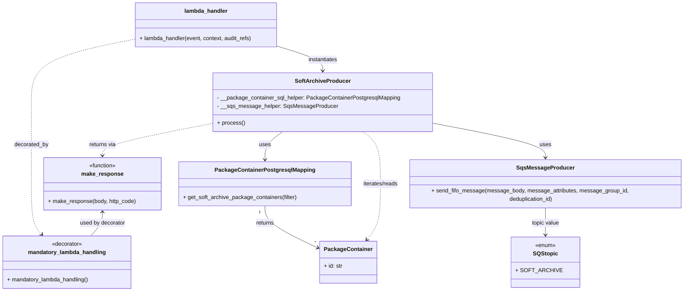

# Diagram: partview_core/partview_service/partview_service/api/archive/soft_archive/soft_archive_producer.py

> Auto-generated by Obscura crawlers

## Mermaid

### SVG

<svg id="container" width="1969.328125" xmlns="http://www.w3.org/2000/svg" class="classDiagram" height="832" viewBox="0 0 1969.328125 832" role="graphics-document document" aria-roledescription="class"><g><defs><marker id="container_class-aggregationStart" class="marker aggregation class" refX="18" refY="7" markerWidth="190" markerHeight="240" orient="auto"><path d="M 18,7 L9,13 L1,7 L9,1 Z"></path></marker></defs><defs><marker id="container_class-aggregationEnd" class="marker aggregation class" refX="1" refY="7" markerWidth="20" markerHeight="28" orient="auto"><path d="M 18,7 L9,13 L1,7 L9,1 Z"></path></marker></defs><defs><marker id="container_class-extensionStart" class="marker extension class" refX="18" refY="7" markerWidth="190" markerHeight="240" orient="auto"><path d="M 1,7 L18,13 V 1 Z"></path></marker></defs><defs><marker id="container_class-extensionEnd" class="marker extension class" refX="1" refY="7" markerWidth="20" markerHeight="28" orient="auto"><path d="M 1,1 V 13 L18,7 Z"></path></marker></defs><defs><marker id="container_class-compositionStart" class="marker composition class" refX="18" refY="7" markerWidth="190" markerHeight="240" orient="auto"><path d="M 18,7 L9,13 L1,7 L9,1 Z"></path></marker></defs><defs><marker id="container_class-compositionEnd" class="marker composition class" refX="1" refY="7" markerWidth="20" markerHeight="28" orient="auto"><path d="M 18,7 L9,13 L1,7 L9,1 Z"></path></marker></defs><defs><marker id="container_class-dependencyStart" class="marker dependency class" refX="6" refY="7" markerWidth="190" markerHeight="240" orient="auto"><path d="M 5,7 L9,13 L1,7 L9,1 Z"></path></marker></defs><defs><marker id="container_class-dependencyEnd" class="marker dependency class" refX="13" refY="7" markerWidth="20" markerHeight="28" orient="auto"><path d="M 18,7 L9,13 L14,7 L9,1 Z"></path></marker></defs><defs><marker id="container_class-lollipopStart" class="marker lollipop class" refX="13" refY="7" markerWidth="190" markerHeight="240" orient="auto"><circle stroke="black" fill="transparent" cx="7" cy="7" r="6"></circle></marker></defs><defs><marker id="container_class-lollipopEnd" class="marker lollipop class" refX="1" refY="7" markerWidth="190" markerHeight="240" orient="auto"><circle stroke="black" fill="transparent" cx="7" cy="7" r="6"></circle></marker></defs><g class="root"><g class="clusters"></g><g class="edgePaths"><path d="M804.154,376L795.748,382.167C787.341,388.333,770.528,400.667,762.121,414C753.715,427.333,753.715,441.667,753.715,448.833L753.715,456" id="id_SoftArchiveProducer_PackageContainerPostgresqlMapping_1" class="edge-thickness-normal edge-pattern-solid relation" style=";;;" data-edge="true" data-et="edge" data-id="id_SoftArchiveProducer_PackageContainerPostgresqlMapping_1" data-points="W3sieCI6ODA0LjE1NDQ1ODI5MDI4OTMsInkiOjM3Nn0seyJ4Ijo3NTMuNzE0ODQzNzUsInkiOjQxM30seyJ4Ijo3NTMuNzE0ODQzNzUsInkiOjQ2Mn1d" marker-end="url(#container_class-dependencyEnd)"></path><path d="M1229.213,350.08L1285.284,360.567C1341.354,371.053,1453.495,392.027,1509.566,409.68C1565.637,427.333,1565.637,441.667,1565.637,448.833L1565.637,456" id="id_SoftArchiveProducer_SqsMessageProducer_2" class="edge-thickness-normal edge-pattern-solid relation" style=";;;" data-edge="true" data-et="edge" data-id="id_SoftArchiveProducer_SqsMessageProducer_2" data-points="W3sieCI6MTIyOS4yMTI4OTA2MjUsInkiOjM1MC4wODAxNzUzMzYzNzg0fSx7IngiOjE1NjUuNjM2NzE4NzUsInkiOjQxM30seyJ4IjoxNTY1LjYzNjcxODc1LCJ5Ijo0NjJ9XQ==" marker-end="url(#container_class-dependencyEnd)"></path><path d="M753.715,588L753.715,596.167C753.715,604.333,753.715,620.667,779.341,640.962C804.968,661.258,856.22,685.516,881.847,697.645L907.473,709.774" id="id_PackageContainerPostgresqlMapping_PackageContainer_3" class="edge-thickness-normal edge-pattern-solid relation" style=";;;" data-edge="true" data-et="edge" data-id="id_PackageContainerPostgresqlMapping_PackageContainer_3" data-points="W3sieCI6NzUzLjcxNDg0Mzc1LCJ5Ijo1ODh9LHsieCI6NzUzLjcxNDg0Mzc1LCJ5Ijo2Mzd9LHsieCI6OTEyLjg5NjQ4NDM3NSwieSI6NzEyLjM0MTE4NTQwNDA2MjV9XQ==" marker-end="url(#container_class-dependencyEnd)"></path><path d="M1565.637,588L1565.637,596.167C1565.637,604.333,1565.637,620.667,1565.637,634.5C1565.637,648.333,1565.637,659.667,1565.637,665.333L1565.637,671" id="id_SqsMessageProducer_SQStopic_4" class="edge-thickness-normal edge-pattern-solid relation" style=";;;" data-edge="true" data-et="edge" data-id="id_SqsMessageProducer_SQStopic_4" data-points="W3sieCI6MTU2NS42MzY3MTg3NSwieSI6NTg4fSx7IngiOjE1NjUuNjM2NzE4NzUsInkiOjYzN30seyJ4IjoxNTY1LjYzNjcxODc1LCJ5Ijo2Nzd9XQ==" marker-end="url(#container_class-dependencyEnd)"></path><path d="M1033.178,376L1041.584,382.167C1049.991,388.333,1066.804,400.667,1075.211,425.5C1083.617,450.333,1083.617,487.667,1083.617,525C1083.617,562.333,1083.617,599.667,1077.04,626.232C1070.463,652.796,1057.308,668.593,1050.731,676.491L1044.154,684.389" id="id_SoftArchiveProducer_PackageContainer_5" class="edge-thickness-normal edge-pattern-dashed relation" style=";;;" data-edge="true" data-et="edge" data-id="id_SoftArchiveProducer_PackageContainer_5" data-points="W3sieCI6MTAzMy4xNzc1NzI5NTk3MTA3LCJ5IjozNzZ9LHsieCI6MTA4My42MTcxODc1LCJ5Ijo0MTN9LHsieCI6MTA4My42MTcxODc1LCJ5Ijo1MjV9LHsieCI6MTA4My42MTcxODc1LCJ5Ijo2Mzd9LHsieCI6MTA0MC4zMTQzODMzNzA1MzU4LCJ5Ijo2ODl9XQ==" marker-end="url(#container_class-dependencyEnd)"></path><path d="M382.25,112.286L333.672,122.071C285.094,131.857,187.938,151.429,139.359,181.381C90.781,211.333,90.781,251.667,90.781,292C90.781,332.333,90.781,372.667,90.781,411.5C90.781,450.333,90.781,487.667,90.781,525C90.781,562.333,90.781,599.667,95.677,623.758C100.573,647.849,110.365,658.697,115.261,664.122L120.157,669.546" id="id_lambda_handler_mandatory_lambda_handling_6" class="edge-thickness-normal edge-pattern-dashed relation" style=";;;" data-edge="true" data-et="edge" data-id="id_lambda_handler_mandatory_lambda_handling_6" data-points="W3sieCI6MzgyLjI1LCJ5IjoxMTIuMjg1NjE2NDg2ODYyOTJ9LHsieCI6OTAuNzgxMjUsInkiOjE3MX0seyJ4Ijo5MC43ODEyNSwieSI6MjkyfSx7IngiOjkwLjc4MTI1LCJ5Ijo0MTN9LHsieCI6OTAuNzgxMjUsInkiOjUyNX0seyJ4Ijo5MC43ODEyNSwieSI6NjM3fSx7IngiOjEyNC4xNzcwMDE5NTMxMjUsInkiOjY3NH1d" marker-end="url(#container_class-dependencyEnd)"></path><path d="M792.148,132.831L813.235,139.192C834.321,145.554,876.493,158.277,897.58,169.805C918.666,181.333,918.666,191.667,918.666,196.833L918.666,202" id="id_lambda_handler_SoftArchiveProducer_7" class="edge-thickness-normal edge-pattern-solid relation" style=";;;" data-edge="true" data-et="edge" data-id="id_lambda_handler_SoftArchiveProducer_7" data-points="W3sieCI6NzkyLjE0ODQzNzUsInkiOjEzMi44MzA5OTUwNDQ1MTY4NH0seyJ4Ijo5MTguNjY2MDE1NjI1LCJ5IjoxNzF9LHsieCI6OTE4LjY2NjAxNTYyNSwieSI6MjA4fV0=" marker-end="url(#container_class-dependencyEnd)"></path><path d="M608.119,352.054L555.593,362.212C503.066,372.369,398.014,392.685,345.487,408.009C292.961,423.333,292.961,433.667,292.961,438.833L292.961,444" id="id_SoftArchiveProducer_make_response_8" class="edge-thickness-normal edge-pattern-dashed relation" style=";;;" data-edge="true" data-et="edge" data-id="id_SoftArchiveProducer_make_response_8" data-points="W3sieCI6NjA4LjExOTE0MDYyNSwieSI6MzUyLjA1NDEyNjQzODYxMTQzfSx7IngiOjI5Mi45NjA5Mzc1LCJ5Ijo0MTN9LHsieCI6MjkyLjk2MDkzNzUsInkiOjQ1MH1d" marker-end="url(#container_class-dependencyEnd)"></path><path d="M292.961,606L292.961,611.167C292.961,616.333,292.961,626.667,287.395,638C281.829,649.333,270.697,661.667,265.131,667.833L259.565,674" id="id_make_response_mandatory_lambda_handling_9" class="edge-thickness-normal edge-pattern-solid relation" style=";;;" data-edge="true" data-et="edge" data-id="id_make_response_mandatory_lambda_handling_9" data-points="W3sieCI6MjkyLjk2MDkzNzUsInkiOjYwMH0seyJ4IjoyOTIuOTYwOTM3NSwieSI6NjM3fSx7IngiOjI1OS41NjUxODU1NDY4NzUsInkiOjY3NH1d" marker-start="url(#container_class-dependencyStart)"></path></g><g class="edgeLabels"><g class="edgeLabel" transform="translate(753.71484375, 413)"><g class="label" data-id="id_SoftArchiveProducer_PackageContainerPostgresqlMapping_1" transform="translate(-16.4921875, -12)"><foreignObject width="32.984375" height="24">

uses

</foreignObject></g></g><g class="edgeLabel" transform="translate(1565.63671875, 413)"><g class="label" data-id="id_SoftArchiveProducer_SqsMessageProducer_2" transform="translate(-16.4921875, -12)"><foreignObject width="32.984375" height="24">

uses

</foreignObject></g></g><g class="edgeLabel" transform="translate(753.71484375, 637)"><g class="label" data-id="id_PackageContainerPostgresqlMapping_PackageContainer_3" transform="translate(-26.265625, -12)"><foreignObject width="52.53125" height="24">

returns

</foreignObject></g></g><g class="edgeLabel" transform="translate(1565.63671875, 637)"><g class="label" data-id="id_SqsMessageProducer_SQStopic_4" transform="translate(-39.8359375, -12)"><foreignObject width="79.671875" height="24">

topic value

</foreignObject></g></g><g class="edgeLabel" transform="translate(1083.6171875, 525)"><g class="label" data-id="id_SoftArchiveProducer_PackageContainer_5" transform="translate(-51.328125, -12)"><foreignObject width="102.65625" height="24">

iterates/reads

</foreignObject></g></g><g class="edgeLabel" transform="translate(90.78125, 413)"><g class="label" data-id="id_lambda_handler_mandatory_lambda_handling_6" transform="translate(-49.375, -12)"><foreignObject width="98.75" height="24">

decorated_by

</foreignObject></g></g><g class="edgeLabel" transform="translate(918.666015625, 171)"><g class="label" data-id="id_lambda_handler_SoftArchiveProducer_7" transform="translate(-42.9140625, -12)"><foreignObject width="85.828125" height="24">

instantiates

</foreignObject></g></g><g class="edgeLabel" transform="translate(292.9609375, 413)"><g class="label" data-id="id_SoftArchiveProducer_make_response_8" transform="translate(-38.9296875, -12)"><foreignObject width="77.859375" height="24">

returns via

</foreignObject></g></g><g class="edgeLabel" transform="translate(292.9609375, 637)"><g class="label" data-id="id_make_response_mandatory_lambda_handling_9" transform="translate(-65.6015625, -12)"><foreignObject width="131.203125" height="24">

used by decorator

</foreignObject></g></g><g class="edgeTerminals" transform="translate(738.7148418750002, 605.4999983928572)"><g class="inner" transform="translate(0, 0)"><foreignObject style="width: 9px; height: 12px;">
1
</foreignObject></g></g><g class="edgeTerminals" transform="translate(898.4958177448516, 686.2965321581846)"><g class="inner" transform="translate(0, 0)"></g><foreignObject style="width: 9px; height: 12px;">
*
</foreignObject></g></g><g class="nodes"><g class="node default" id="classId-SoftArchiveProducer-0" transform="translate(918.666015625, 292)"><g class="basic label-container"><path d="M-310.546875 -84 L310.546875 -84 L310.546875 84 L-310.546875 84" stroke="none" stroke-width="0" fill="#ECECFF" style=""></path><path d="M-310.546875 -84 C-68.60326729352334 -84, 173.3403404129533 -84, 310.546875 -84 M-310.546875 -84 C-164.21401289285734 -84, -17.88115078571468 -84, 310.546875 -84 M310.546875 -84 C310.546875 -37.35840294175478, 310.546875 9.283194116490435, 310.546875 84 M310.546875 -84 C310.546875 -21.43996901663764, 310.546875 41.12006196672472, 310.546875 84 M310.546875 84 C132.22786084721812 84, -46.09115330556375 84, -310.546875 84 M310.546875 84 C181.26547599392302 84, 51.98407698784604 84, -310.546875 84 M-310.546875 84 C-310.546875 31.29895431527615, -310.546875 -21.402091369447703, -310.546875 -84 M-310.546875 84 C-310.546875 21.669528051962416, -310.546875 -40.66094389607517, -310.546875 -84" stroke="#9370DB" stroke-width="1.3" fill="none" stroke-dasharray="0 0" style=""></path></g><g class="annotation-group text" transform="translate(0, -60)"></g><g class="label-group text" transform="translate(-74.984375, -60)"><g class="label" style="font-weight: bolder" transform="translate(0,-12)"><foreignObject width="149.96875" height="24">

SoftArchiveProducer

</foreignObject></g></g><g class="members-group text" transform="translate(-298.546875, -12)"><g class="label" style="" transform="translate(0,-12)"><foreignObject width="522.109375" height="24">

- __package_container_sql_helper: PackageContainerPostgresqlMapping

</foreignObject></g><g class="label" style="" transform="translate(0,12)"><foreignObject width="337.5" height="24">

- __sqs_message_helper: SqsMessageProducer

</foreignObject></g></g><g class="methods-group text" transform="translate(-298.546875, 60)"><g class="label" style="" transform="translate(0,-12)"><foreignObject width="77.96875" height="24">

+ process()

</foreignObject></g></g><g class="divider" style=""><path d="M-310.546875 -36 C-121.7352121108762 -36, 67.07645077824759 -36, 310.546875 -36 M-310.546875 -36 C-67.11462548381229 -36, 176.31762403237542 -36, 310.546875 -36" stroke="#9370DB" stroke-width="1.3" fill="none" stroke-dasharray="0 0" style=""></path></g><g class="divider" style=""><path d="M-310.546875 36 C-78.86641623064187 36, 152.81404253871625 36, 310.546875 36 M-310.546875 36 C-129.82450493213452 36, 50.89786513573097 36, 310.546875 36" stroke="#9370DB" stroke-width="1.3" fill="none" stroke-dasharray="0 0" style=""></path></g></g><g class="node default" id="classId-PackageContainerPostgresqlMapping-1" transform="translate(753.71484375, 525)"><g class="basic label-container"><path d="M-243.57421875 -63 L243.57421875 -63 L243.57421875 63 L-243.57421875 63" stroke="none" stroke-width="0" fill="#ECECFF" style=""></path><path d="M-243.57421875 -63 C-88.35856086564647 -63, 66.85709701870707 -63, 243.57421875 -63 M-243.57421875 -63 C-93.81960154151571 -63, 55.93501566696858 -63, 243.57421875 -63 M243.57421875 -63 C243.57421875 -34.46683721461832, 243.57421875 -5.933674429236639, 243.57421875 63 M243.57421875 -63 C243.57421875 -27.246683799756156, 243.57421875 8.506632400487689, 243.57421875 63 M243.57421875 63 C144.67842832878858 63, 45.7826379075772 63, -243.57421875 63 M243.57421875 63 C53.9682565567237 63, -135.6377056365526 63, -243.57421875 63 M-243.57421875 63 C-243.57421875 24.385297108565297, -243.57421875 -14.229405782869406, -243.57421875 -63 M-243.57421875 63 C-243.57421875 26.823911992877974, -243.57421875 -9.352176014244051, -243.57421875 -63" stroke="#9370DB" stroke-width="1.3" fill="none" stroke-dasharray="0 0" style=""></path></g><g class="annotation-group text" transform="translate(0, -39)"></g><g class="label-group text" transform="translate(-135.8515625, -39)"><g class="label" style="font-weight: bolder" transform="translate(0,-12)"><foreignObject width="271.703125" height="24">

PackageContainerPostgresqlMapping

</foreignObject></g></g><g class="members-group text" transform="translate(-231.57421875, 9)"></g><g class="methods-group text" transform="translate(-231.57421875, 39)"><g class="label" style="" transform="translate(0,-12)"><foreignObject width="327.296875" height="24">

+ get_soft_archive_package_containers(filter)

</foreignObject></g></g><g class="divider" style=""><path d="M-243.57421875 -15 C-102.271070556398 -15, 39.032077637204 -15, 243.57421875 -15 M-243.57421875 -15 C-113.62138008582193 -15, 16.33145857835615 -15, 243.57421875 -15" stroke="#9370DB" stroke-width="1.3" fill="none" stroke-dasharray="0 0" style=""></path></g><g class="divider" style=""><path d="M-243.57421875 9 C-130.01683443297512 9, -16.459450115950233 9, 243.57421875 9 M-243.57421875 9 C-50.26503616827176 9, 143.04414641345647 9, 243.57421875 9" stroke="#9370DB" stroke-width="1.3" fill="none" stroke-dasharray="0 0" style=""></path></g></g><g class="node default" id="classId-SqsMessageProducer-2" transform="translate(1565.63671875, 525)"><g class="basic label-container"><path d="M-395.69140625 -63 L395.69140625 -63 L395.69140625 63 L-395.69140625 63" stroke="none" stroke-width="0" fill="#ECECFF" style=""></path><path d="M-395.69140625 -63 C-194.5611970428867 -63, 6.569012164226592 -63, 395.69140625 -63 M-395.69140625 -63 C-113.37855829525745 -63, 168.9342896594851 -63, 395.69140625 -63 M395.69140625 -63 C395.69140625 -15.800218765685507, 395.69140625 31.399562468628986, 395.69140625 63 M395.69140625 -63 C395.69140625 -15.680027845561106, 395.69140625 31.639944308877787, 395.69140625 63 M395.69140625 63 C105.96600508908932 63, -183.75939607182136 63, -395.69140625 63 M395.69140625 63 C124.22182882255049 63, -147.24774860489902 63, -395.69140625 63 M-395.69140625 63 C-395.69140625 25.164912937044924, -395.69140625 -12.670174125910151, -395.69140625 -63 M-395.69140625 63 C-395.69140625 12.83199384416217, -395.69140625 -37.33601231167566, -395.69140625 -63" stroke="#9370DB" stroke-width="1.3" fill="none" stroke-dasharray="0 0" style=""></path></g><g class="annotation-group text" transform="translate(0, -39)"></g><g class="label-group text" transform="translate(-77.4453125, -39)"><g class="label" style="font-weight: bolder" transform="translate(0,-12)"><foreignObject width="154.890625" height="24">

SqsMessageProducer

</foreignObject></g></g><g class="members-group text" transform="translate(-383.69140625, 9)"></g><g class="methods-group text" transform="translate(-383.69140625, 39)"><g class="label" style="" transform="translate(0,-12)"><foreignObject width="689.9375" height="24">

+ send_fifo_message(message_body, message_attributes, message_group_id, deduplication_id)

</foreignObject></g></g><g class="divider" style=""><path d="M-395.69140625 -15 C-140.28295427952816 -15, 115.12549769094369 -15, 395.69140625 -15 M-395.69140625 -15 C-135.71772607328086 -15, 124.25595410343828 -15, 395.69140625 -15" stroke="#9370DB" stroke-width="1.3" fill="none" stroke-dasharray="0 0" style=""></path></g><g class="divider" style=""><path d="M-395.69140625 9 C-106.34242499507036 9, 183.00655625985928 9, 395.69140625 9 M-395.69140625 9 C-136.7090773034439 9, 122.27325164311219 9, 395.69140625 9" stroke="#9370DB" stroke-width="1.3" fill="none" stroke-dasharray="0 0" style=""></path></g></g><g class="node default" id="classId-PackageContainer-3" transform="translate(990.349609375, 749)"><g class="basic label-container"><path d="M-77.453125 -60 L77.453125 -60 L77.453125 60 L-77.453125 60" stroke="none" stroke-width="0" fill="#ECECFF" style=""></path><path d="M-77.453125 -60 C-34.348244249311186 -60, 8.756636501377628 -60, 77.453125 -60 M-77.453125 -60 C-38.51503751114004 -60, 0.42304997771992703 -60, 77.453125 -60 M77.453125 -60 C77.453125 -14.29306780179342, 77.453125 31.41386439641316, 77.453125 60 M77.453125 -60 C77.453125 -18.45295508929584, 77.453125 23.094089821408318, 77.453125 60 M77.453125 60 C35.218052452346484 60, -7.017020095307032 60, -77.453125 60 M77.453125 60 C25.870738706481042 60, -25.711647587037916 60, -77.453125 60 M-77.453125 60 C-77.453125 31.48784092792799, -77.453125 2.9756818558559814, -77.453125 -60 M-77.453125 60 C-77.453125 17.466804901925308, -77.453125 -25.066390196149385, -77.453125 -60" stroke="#9370DB" stroke-width="1.3" fill="none" stroke-dasharray="0 0" style=""></path></g><g class="annotation-group text" transform="translate(0, -36)"></g><g class="label-group text" transform="translate(-65.453125, -36)"><g class="label" style="font-weight: bolder" transform="translate(0,-12)"><foreignObject width="130.90625" height="24">

PackageContainer

</foreignObject></g></g><g class="members-group text" transform="translate(-65.453125, 12)"><g class="label" style="" transform="translate(0,-12)"><foreignObject width="53.8125" height="24">

+ id: str

</foreignObject></g></g><g class="methods-group text" transform="translate(-65.453125, 60)"></g><g class="divider" style=""><path d="M-77.453125 -12 C-46.061879402401885 -12, -14.67063380480377 -12, 77.453125 -12 M-77.453125 -12 C-33.98930954656242 -12, 9.474505906875166 -12, 77.453125 -12" stroke="#9370DB" stroke-width="1.3" fill="none" stroke-dasharray="0 0" style=""></path></g><g class="divider" style=""><path d="M-77.453125 36 C-20.46347348452361 36, 36.52617803095278 36, 77.453125 36 M-77.453125 36 C-34.86211193602074 36, 7.7289011279585225 36, 77.453125 36" stroke="#9370DB" stroke-width="1.3" fill="none" stroke-dasharray="0 0" style=""></path></g></g><g class="node default" id="classId-SQStopic-4" transform="translate(1565.63671875, 749)"><g class="basic label-container"><path d="M-86.7734375 -72 L86.7734375 -72 L86.7734375 72 L-86.7734375 72" stroke="none" stroke-width="0" fill="#ECECFF" style=""></path><path d="M-86.7734375 -72 C-40.1140160962513 -72, 6.545405307497404 -72, 86.7734375 -72 M-86.7734375 -72 C-44.477298544972385 -72, -2.1811595899447696 -72, 86.7734375 -72 M86.7734375 -72 C86.7734375 -43.05639943027697, 86.7734375 -14.112798860553944, 86.7734375 72 M86.7734375 -72 C86.7734375 -39.63744179953389, 86.7734375 -7.274883599067778, 86.7734375 72 M86.7734375 72 C43.48895991649251 72, 0.20448233298502316 72, -86.7734375 72 M86.7734375 72 C26.370463580877235 72, -34.03251033824553 72, -86.7734375 72 M-86.7734375 72 C-86.7734375 29.05351086937233, -86.7734375 -13.892978261255337, -86.7734375 -72 M-86.7734375 72 C-86.7734375 32.47510841789294, -86.7734375 -7.049783164214119, -86.7734375 -72" stroke="#9370DB" stroke-width="1.3" fill="none" stroke-dasharray="0 0" style=""></path></g><g class="annotation-group text" transform="translate(-29.53125, -48)"><g class="label" style="" transform="translate(0,-12)"><foreignObject width="59.0625" height="24">

«enum»

</foreignObject></g></g><g class="label-group text" transform="translate(-33.15625, -24)"><g class="label" style="font-weight: bolder" transform="translate(0,-12)"><foreignObject width="66.3125" height="24">

SQStopic

</foreignObject></g></g><g class="members-group text" transform="translate(-74.7734375, 24)"><g class="label" style="" transform="translate(0,-12)"><foreignObject width="116.390625" height="24">

+ SOFT_ARCHIVE

</foreignObject></g></g><g class="methods-group text" transform="translate(-74.7734375, 72)"></g><g class="divider" style=""><path d="M-86.7734375 0 C-41.90706965924148 0, 2.959298181517042 0, 86.7734375 0 M-86.7734375 0 C-18.770288467758647 0, 49.232860564482706 0, 86.7734375 0" stroke="#9370DB" stroke-width="1.3" fill="none" stroke-dasharray="0 0" style=""></path></g><g class="divider" style=""><path d="M-86.7734375 48 C-22.050467471869297 48, 42.672502556261406 48, 86.7734375 48 M-86.7734375 48 C-38.95998400801327 48, 8.853469483973456 48, 86.7734375 48" stroke="#9370DB" stroke-width="1.3" fill="none" stroke-dasharray="0 0" style=""></path></g></g><g class="node default" id="classId-make_response-5" transform="translate(292.9609375, 525)"><g class="basic label-container"><path d="M-167.1796875 -75 L167.1796875 -75 L167.1796875 75 L-167.1796875 75" stroke="none" stroke-width="0" fill="#ECECFF" style=""></path><path d="M-167.1796875 -75 C-69.1128297079217 -75, 28.95402808415659 -75, 167.1796875 -75 M-167.1796875 -75 C-53.616990939645774 -75, 59.94570562070845 -75, 167.1796875 -75 M167.1796875 -75 C167.1796875 -16.796711851549148, 167.1796875 41.406576296901704, 167.1796875 75 M167.1796875 -75 C167.1796875 -44.86653640624668, 167.1796875 -14.733072812493361, 167.1796875 75 M167.1796875 75 C61.178841207717426 75, -44.82200508456515 75, -167.1796875 75 M167.1796875 75 C57.81041940304456 75, -51.558848693910875 75, -167.1796875 75 M-167.1796875 75 C-167.1796875 39.356140736343704, -167.1796875 3.7122814726874083, -167.1796875 -75 M-167.1796875 75 C-167.1796875 22.32300466925173, -167.1796875 -30.35399066149654, -167.1796875 -75" stroke="#9370DB" stroke-width="1.3" fill="none" stroke-dasharray="0 0" style=""></path></g><g class="annotation-group text" transform="translate(-39.484375, -51)"><g class="label" style="" transform="translate(0,-12)"><foreignObject width="78.96875" height="24">

«function»

</foreignObject></g></g><g class="label-group text" transform="translate(-57.46875, -27)"><g class="label" style="font-weight: bolder" transform="translate(0,-12)"><foreignObject width="114.9375" height="24">

make_response

</foreignObject></g></g><g class="members-group text" transform="translate(-155.1796875, 21)"></g><g class="methods-group text" transform="translate(-155.1796875, 51)"><g class="label" style="" transform="translate(0,-12)"><foreignObject width="252.890625" height="24">

+ make_response(body, http_code)

</foreignObject></g></g><g class="divider" style=""><path d="M-167.1796875 -3 C-72.56527327949766 -3, 22.04914094100468 -3, 167.1796875 -3 M-167.1796875 -3 C-52.49557953956791 -3, 62.18852842086417 -3, 167.1796875 -3" stroke="#9370DB" stroke-width="1.3" fill="none" stroke-dasharray="0 0" style=""></path></g><g class="divider" style=""><path d="M-167.1796875 21 C-49.75846751587342 21, 67.66275246825316 21, 167.1796875 21 M-167.1796875 21 C-82.98838073095168 21, 1.202926038096649 21, 167.1796875 21" stroke="#9370DB" stroke-width="1.3" fill="none" stroke-dasharray="0 0" style=""></path></g></g><g class="node default" id="classId-mandatory_lambda_handling-6" transform="translate(191.87109375, 749)"><g class="basic label-container"><path d="M-183.87109375 -75 L183.87109375 -75 L183.87109375 75 L-183.87109375 75" stroke="none" stroke-width="0" fill="#ECECFF" style=""></path><path d="M-183.87109375 -75 C-52.921442844184185 -75, 78.02820806163163 -75, 183.87109375 -75 M-183.87109375 -75 C-94.89152030065699 -75, -5.911946851313985 -75, 183.87109375 -75 M183.87109375 -75 C183.87109375 -36.74845065703742, 183.87109375 1.503098685925167, 183.87109375 75 M183.87109375 -75 C183.87109375 -28.656596839198443, 183.87109375 17.686806321603115, 183.87109375 75 M183.87109375 75 C74.451226637425 75, -34.96864047515001 75, -183.87109375 75 M183.87109375 75 C87.75358910580697 75, -8.363915538386067 75, -183.87109375 75 M-183.87109375 75 C-183.87109375 36.73372030148608, -183.87109375 -1.532559397027839, -183.87109375 -75 M-183.87109375 75 C-183.87109375 44.42846993171257, -183.87109375 13.856939863425133, -183.87109375 -75" stroke="#9370DB" stroke-width="1.3" fill="none" stroke-dasharray="0 0" style=""></path></g><g class="annotation-group text" transform="translate(-44.0625, -51)"><g class="label" style="" transform="translate(0,-12)"><foreignObject width="88.125" height="24">

«decorator»

</foreignObject></g></g><g class="label-group text" transform="translate(-107.4296875, -27)"><g class="label" style="font-weight: bolder" transform="translate(0,-12)"><foreignObject width="214.859375" height="24">

mandatory_lambda_handling

</foreignObject></g></g><g class="members-group text" transform="translate(-171.87109375, 21)"></g><g class="methods-group text" transform="translate(-171.87109375, 51)"><g class="label" style="" transform="translate(0,-12)"><foreignObject width="236.3125" height="24">

+ mandatory_lambda_handling()

</foreignObject></g></g><g class="divider" style=""><path d="M-183.87109375 -3 C-46.46437292090343 -3, 90.94234790819314 -3, 183.87109375 -3 M-183.87109375 -3 C-42.371637316266 -3, 99.127819117468 -3, 183.87109375 -3" stroke="#9370DB" stroke-width="1.3" fill="none" stroke-dasharray="0 0" style=""></path></g><g class="divider" style=""><path d="M-183.87109375 21 C-69.84551629172627 21, 44.18006116654746 21, 183.87109375 21 M-183.87109375 21 C-53.88795777473149 21, 76.09517820053702 21, 183.87109375 21" stroke="#9370DB" stroke-width="1.3" fill="none" stroke-dasharray="0 0" style=""></path></g></g><g class="node default" id="classId-lambda_handler-7" transform="translate(587.19921875, 71)"><g class="basic label-container"><path d="M-204.94921875 -63 L204.94921875 -63 L204.94921875 63 L-204.94921875 63" stroke="none" stroke-width="0" fill="#ECECFF" style=""></path><path d="M-204.94921875 -63 C-122.53503948325724 -63, -40.12086021651447 -63, 204.94921875 -63 M-204.94921875 -63 C-110.1553045434626 -63, -15.361390336925211 -63, 204.94921875 -63 M204.94921875 -63 C204.94921875 -31.081671402788977, 204.94921875 0.8366571944220453, 204.94921875 63 M204.94921875 -63 C204.94921875 -28.560387245409785, 204.94921875 5.879225509180429, 204.94921875 63 M204.94921875 63 C80.03165035902242 63, -44.88591803195516 63, -204.94921875 63 M204.94921875 63 C95.15684955662279 63, -14.635519636754424 63, -204.94921875 63 M-204.94921875 63 C-204.94921875 20.922307347439713, -204.94921875 -21.155385305120575, -204.94921875 -63 M-204.94921875 63 C-204.94921875 31.300468240358708, -204.94921875 -0.3990635192825849, -204.94921875 -63" stroke="#9370DB" stroke-width="1.3" fill="none" stroke-dasharray="0 0" style=""></path></g><g class="annotation-group text" transform="translate(0, -39)"></g><g class="label-group text" transform="translate(-59.9765625, -39)"><g class="label" style="font-weight: bolder" transform="translate(0,-12)"><foreignObject width="119.953125" height="24">

lambda_handler

</foreignObject></g></g><g class="members-group text" transform="translate(-192.94921875, 9)"></g><g class="methods-group text" transform="translate(-192.94921875, 39)"><g class="label" style="" transform="translate(0,-12)"><foreignObject width="325.921875" height="24">

+ lambda_handler(event, context, audit_refs)

</foreignObject></g></g><g class="divider" style=""><path d="M-204.94921875 -15 C-110.36195452178478 -15, -15.774690293569563 -15, 204.94921875 -15 M-204.94921875 -15 C-68.58384498697649 -15, 67.78152877604703 -15, 204.94921875 -15" stroke="#9370DB" stroke-width="1.3" fill="none" stroke-dasharray="0 0" style=""></path></g><g class="divider" style=""><path d="M-204.94921875 9 C-65.64491470902925 9, 73.6593893319415 9, 204.94921875 9 M-204.94921875 9 C-50.50403251604422 9, 103.94115371791156 9, 204.94921875 9" stroke="#9370DB" stroke-width="1.3" fill="none" stroke-dasharray="0 0" style=""></path></g></g></g></g></g></svg>
