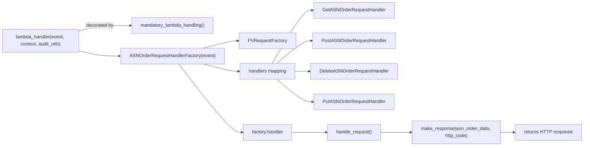

# Diagram: partview_core/partview_service/partview_service/api/asn_order/asn_order.py

> Auto-generated by Obscura crawlers

## Mermaid

### SVG

<svg id="container" width="1979.03125" xmlns="http://www.w3.org/2000/svg" class="flowchart" height="498" viewBox="0 0 1979.03125 498" role="graphics-document document" aria-roledescription="flowchart-v2"><g><marker id="container_flowchart-v2-pointEnd" class="marker flowchart-v2" viewBox="0 0 10 10" refX="5" refY="5" markerUnits="userSpaceOnUse" markerWidth="8" markerHeight="8" orient="auto"><path d="M 0 0 L 10 5 L 0 10 z" class="arrowMarkerPath" style="stroke-width: 1; stroke-dasharray: 1, 0;"></path></marker><marker id="container_flowchart-v2-pointStart" class="marker flowchart-v2" viewBox="0 0 10 10" refX="4.5" refY="5" markerUnits="userSpaceOnUse" markerWidth="8" markerHeight="8" orient="auto"><path d="M 0 5 L 10 10 L 10 0 z" class="arrowMarkerPath" style="stroke-width: 1; stroke-dasharray: 1, 0;"></path></marker><marker id="container_flowchart-v2-circleEnd" class="marker flowchart-v2" viewBox="0 0 10 10" refX="11" refY="5" markerUnits="userSpaceOnUse" markerWidth="11" markerHeight="11" orient="auto"><circle cx="5" cy="5" r="5" class="arrowMarkerPath" style="stroke-width: 1; stroke-dasharray: 1, 0;"></circle></marker><marker id="container_flowchart-v2-circleStart" class="marker flowchart-v2" viewBox="0 0 10 10" refX="-1" refY="5" markerUnits="userSpaceOnUse" markerWidth="11" markerHeight="11" orient="auto"><circle cx="5" cy="5" r="5" class="arrowMarkerPath" style="stroke-width: 1; stroke-dasharray: 1, 0;"></circle></marker><marker id="container_flowchart-v2-crossEnd" class="marker cross flowchart-v2" viewBox="0 0 11 11" refX="12" refY="5.2" markerUnits="userSpaceOnUse" markerWidth="11" markerHeight="11" orient="auto"><path d="M 1,1 l 9,9 M 10,1 l -9,9" class="arrowMarkerPath" style="stroke-width: 2; stroke-dasharray: 1, 0;"></path></marker><marker id="container_flowchart-v2-crossStart" class="marker cross flowchart-v2" viewBox="0 0 11 11" refX="-1" refY="5.2" markerUnits="userSpaceOnUse" markerWidth="11" markerHeight="11" orient="auto"><path d="M 1,1 l 9,9 M 10,1 l -9,9" class="arrowMarkerPath" style="stroke-width: 2; stroke-dasharray: 1, 0;"></path></marker><g class="root"><g class="clusters"></g><g class="edgePaths"><path d="M268,105.589L280.055,102.491C292.109,99.393,316.219,93.196,345.151,90.098C374.083,87,407.839,87,424.716,87L441.594,87" id="L_LambdaHandler_Decorator_0" class="edge-thickness-normal edge-pattern-solid edge-thickness-normal edge-pattern-solid flowchart-link" style=";" data-edge="true" data-et="edge" data-id="L_LambdaHandler_Decorator_0" data-points="W3sieCI6MjY4LCJ5IjoxMDUuNTg4OTI1Nzg1Nzc0OTZ9LHsieCI6MzQwLjMyODEyNSwieSI6ODd9LHsieCI6NDQ1LjU5Mzc1LCJ5Ijo4N31d" marker-end="url(#container_flowchart-v2-pointEnd)"></path><path d="M268,172.411L280.055,175.509C292.109,178.607,316.219,184.804,339.661,187.902C363.104,191,385.88,191,397.268,191L408.656,191" id="L_LambdaHandler_Factory_0" class="edge-thickness-normal edge-pattern-solid edge-thickness-normal edge-pattern-solid flowchart-link" style=";" data-edge="true" data-et="edge" data-id="L_LambdaHandler_Factory_0" data-points="W3sieCI6MjY4LCJ5IjoxNzIuNDExMDc0MjE0MjI1MDR9LHsieCI6MzQwLjMyODEyNSwieSI6MTkxfSx7IngiOjQxMi42NTYyNSwieSI6MTkxfV0=" marker-end="url(#container_flowchart-v2-pointEnd)"></path><path d="M691.479,164L707.503,159.833C723.527,155.667,755.576,147.333,775.409,143.167C795.242,139,802.859,139,806.668,139L810.477,139" id="L_Factory_FVFactory_0" class="edge-thickness-normal edge-pattern-solid edge-thickness-normal edge-pattern-solid flowchart-link" style=";" data-edge="true" data-et="edge" data-id="L_Factory_FVFactory_0" data-points="W3sieCI6NjkxLjQ3ODY2NTg2NTM4NDYsInkiOjE2NH0seyJ4Ijo3ODcuNjI1LCJ5IjoxMzl9LHsieCI6ODE0LjQ3NjU2MjUsInkiOjEzOX1d" marker-end="url(#container_flowchart-v2-pointEnd)"></path><path d="M691.479,218L707.503,222.167C723.527,226.333,755.576,234.667,775.101,238.833C794.625,243,801.625,243,805.125,243L808.625,243" id="L_Factory_HandlerMap_0" class="edge-thickness-normal edge-pattern-solid edge-thickness-normal edge-pattern-solid flowchart-link" style=";" data-edge="true" data-et="edge" data-id="L_Factory_HandlerMap_0" data-points="W3sieCI6NjkxLjQ3ODY2NTg2NTM4NDYsInkiOjIxOH0seyJ4Ijo3ODcuNjI1LCJ5IjoyNDN9LHsieCI6ODEyLjYyNSwieSI6MjQzfV0=" marker-end="url(#container_flowchart-v2-pointEnd)"></path><path d="M924.129,216L941.652,185.833C959.174,155.667,994.22,95.333,1017.077,65.167C1039.935,35,1050.604,35,1055.939,35L1061.273,35" id="L_HandlerMap_GET_0" class="edge-thickness-normal edge-pattern-solid edge-thickness-normal edge-pattern-solid flowchart-link" style=";" data-edge="true" data-et="edge" data-id="L_HandlerMap_GET_0" data-points="W3sieCI6OTI0LjEyODcxODQ0OTUxOTMsInkiOjIxNn0seyJ4IjoxMDI5LjI2NTYyNSwieSI6MzV9LHsieCI6MTA2NS4yNzM0Mzc1LCJ5IjozNX1d" marker-end="url(#container_flowchart-v2-pointEnd)"></path><path d="M939.812,216L954.721,203.167C969.63,190.333,999.448,164.667,1019.124,151.833C1038.799,139,1048.333,139,1053.1,139L1057.867,139" id="L_HandlerMap_POST_0" class="edge-thickness-normal edge-pattern-solid edge-thickness-normal edge-pattern-solid flowchart-link" style=";" data-edge="true" data-et="edge" data-id="L_HandlerMap_POST_0" data-points="W3sieCI6OTM5LjgxMjEyNDM5OTAzODUsInkiOjIxNn0seyJ4IjoxMDI5LjI2NTYyNSwieSI6MTM5fSx7IngiOjEwNjEuODY3MTg3NSwieSI6MTM5fV0=" marker-end="url(#container_flowchart-v2-pointEnd)"></path><path d="M1004.266,243L1008.432,243C1012.599,243,1020.932,243,1028.599,243C1036.266,243,1043.266,243,1046.766,243L1050.266,243" id="L_HandlerMap_DELETE_0" class="edge-thickness-normal edge-pattern-solid edge-thickness-normal edge-pattern-solid flowchart-link" style=";" data-edge="true" data-et="edge" data-id="L_HandlerMap_DELETE_0" data-points="W3sieCI6MTAwNC4yNjU2MjUsInkiOjI0M30seyJ4IjoxMDI5LjI2NTYyNSwieSI6MjQzfSx7IngiOjEwNTQuMjY1NjI1LCJ5IjoyNDN9XQ==" marker-end="url(#container_flowchart-v2-pointEnd)"></path><path d="M939.812,270L954.721,282.833C969.63,295.667,999.448,321.333,1019.745,334.167C1040.042,347,1050.818,347,1056.206,347L1061.594,347" id="L_HandlerMap_PUT_0" class="edge-thickness-normal edge-pattern-solid edge-thickness-normal edge-pattern-solid flowchart-link" style=";" data-edge="true" data-et="edge" data-id="L_HandlerMap_PUT_0" data-points="W3sieCI6OTM5LjgxMjEyNDM5OTAzODUsInkiOjI3MH0seyJ4IjoxMDI5LjI2NTYyNSwieSI6MzQ3fSx7IngiOjEwNjUuNTkzNzUsInkiOjM0N31d" marker-end="url(#container_flowchart-v2-pointEnd)"></path><path d="M608.408,218L638.278,256.833C668.147,295.667,727.886,373.333,763.056,412.167C798.227,451,808.828,451,814.129,451L819.43,451" id="L_Factory_HandlerInstance_0" class="edge-thickness-normal edge-pattern-solid edge-thickness-normal edge-pattern-solid flowchart-link" style=";" data-edge="true" data-et="edge" data-id="L_Factory_HandlerInstance_0" data-points="W3sieCI6NjA4LjQwODIzMzE3MzA3NywieSI6MjE4fSx7IngiOjc4Ny42MjUsInkiOjQ1MX0seyJ4Ijo4MjMuNDI5Njg3NSwieSI6NDUxfV0=" marker-end="url(#container_flowchart-v2-pointEnd)"></path><path d="M993.461,451L999.428,451C1005.396,451,1017.331,451,1035.941,451C1054.552,451,1079.839,451,1092.482,451L1105.125,451" id="L_HandlerInstance_HandleReq_0" class="edge-thickness-normal edge-pattern-solid edge-thickness-normal edge-pattern-solid flowchart-link" style=";" data-edge="true" data-et="edge" data-id="L_HandlerInstance_HandleReq_0" data-points="W3sieCI6OTkzLjQ2MDkzNzUsInkiOjQ1MX0seyJ4IjoxMDI5LjI2NTYyNSwieSI6NDUxfSx7IngiOjExMDkuMTI1LCJ5Ijo0NTF9XQ==" marker-end="url(#container_flowchart-v2-pointEnd)"></path><path d="M1293.109,451L1306.419,451C1319.729,451,1346.349,451,1363.159,451C1379.969,451,1386.969,451,1390.469,451L1393.969,451" id="L_HandleReq_Response_0" class="edge-thickness-normal edge-pattern-solid edge-thickness-normal edge-pattern-solid flowchart-link" style=";" data-edge="true" data-et="edge" data-id="L_HandleReq_Response_0" data-points="W3sieCI6MTI5My4xMDkzNzUsInkiOjQ1MX0seyJ4IjoxMzcyLjk2ODc1LCJ5Ijo0NTF9LHsieCI6MTM5Ny45Njg3NSwieSI6NDUxfV0=" marker-end="url(#container_flowchart-v2-pointEnd)"></path><path d="M1696.984,451L1701.151,451C1705.318,451,1713.651,451,1721.318,451C1728.984,451,1735.984,451,1739.484,451L1742.984,451" id="L_Response_LambdaHandlerDone_0" class="edge-thickness-normal edge-pattern-solid edge-thickness-normal edge-pattern-solid flowchart-link" style=";" data-edge="true" data-et="edge" data-id="L_Response_LambdaHandlerDone_0" data-points="W3sieCI6MTY5Ni45ODQzNzUsInkiOjQ1MX0seyJ4IjoxNzIxLjk4NDM3NSwieSI6NDUxfSx7IngiOjE3NDYuOTg0Mzc1LCJ5Ijo0NTF9XQ==" marker-end="url(#container_flowchart-v2-pointEnd)"></path></g><g class="edgeLabels"><g class="edgeLabel" transform="translate(340.328125, 87)"><g class="label" data-id="L_LambdaHandler_Decorator_0" transform="translate(-47.328125, -12)"><foreignObject width="94.65625" height="24">

decorated by

</foreignObject></g></g><g class="edgeLabel"><g class="label" data-id="L_LambdaHandler_Factory_0" transform="translate(0, 0)"><foreignObject width="0" height="0">

</foreignObject></g></g><g class="edgeLabel"><g class="label" data-id="L_Factory_FVFactory_0" transform="translate(0, 0)"><foreignObject width="0" height="0">

</foreignObject></g></g><g class="edgeLabel"><g class="label" data-id="L_Factory_HandlerMap_0" transform="translate(0, 0)"><foreignObject width="0" height="0">

</foreignObject></g></g><g class="edgeLabel"><g class="label" data-id="L_HandlerMap_GET_0" transform="translate(0, 0)"><foreignObject width="0" height="0">

</foreignObject></g></g><g class="edgeLabel"><g class="label" data-id="L_HandlerMap_POST_0" transform="translate(0, 0)"><foreignObject width="0" height="0">

</foreignObject></g></g><g class="edgeLabel"><g class="label" data-id="L_HandlerMap_DELETE_0" transform="translate(0, 0)"><foreignObject width="0" height="0">

</foreignObject></g></g><g class="edgeLabel"><g class="label" data-id="L_HandlerMap_PUT_0" transform="translate(0, 0)"><foreignObject width="0" height="0">

</foreignObject></g></g><g class="edgeLabel"><g class="label" data-id="L_Factory_HandlerInstance_0" transform="translate(0, 0)"><foreignObject width="0" height="0">

</foreignObject></g></g><g class="edgeLabel"><g class="label" data-id="L_HandlerInstance_HandleReq_0" transform="translate(0, 0)"><foreignObject width="0" height="0">

</foreignObject></g></g><g class="edgeLabel"><g class="label" data-id="L_HandleReq_Response_0" transform="translate(0, 0)"><foreignObject width="0" height="0">

</foreignObject></g></g><g class="edgeLabel"><g class="label" data-id="L_Response_LambdaHandlerDone_0" transform="translate(0, 0)"><foreignObject width="0" height="0">

</foreignObject></g></g></g><g class="nodes"><g class="node default" id="flowchart-LambdaHandler-0" transform="translate(138, 139)"><rect class="basic label-container" style="" x="-130" y="-39" width="260" height="78"></rect><g class="label" style="" transform="translate(-100, -24)"><rect></rect><foreignObject width="200" height="48">

lambda_handler(event, context, audit_refs)

</foreignObject></g></g><g class="node default" id="flowchart-Decorator-1" transform="translate(587.640625, 87)"><rect class="basic label-container" style="" x="-142.046875" y="-27" width="284.09375" height="54"></rect><g class="label" style="" transform="translate(-112.046875, -12)"><rect></rect><foreignObject width="224.09375" height="24">

mandatory_lambda_handling()

</foreignObject></g></g><g class="node default" id="flowchart-Factory-2" transform="translate(587.640625, 191)"><rect class="basic label-container" style="" x="-174.984375" y="-27" width="349.96875" height="54"></rect><g class="label" style="" transform="translate(-144.984375, -12)"><rect></rect><foreignObject width="289.96875" height="24">

ASNOrderRequestHandlerFactory(event)

</foreignObject></g></g><g class="node default" id="flowchart-FVFactory-3" transform="translate(908.4453125, 139)"><rect class="basic label-container" style="" x="-93.96875" y="-27" width="187.9375" height="54"></rect><g class="label" style="" transform="translate(-63.96875, -12)"><rect></rect><foreignObject width="127.9375" height="24">

FVRequestFactory

</foreignObject></g></g><g class="node default" id="flowchart-HandlerMap-4" transform="translate(908.4453125, 243)"><rect class="basic label-container" style="" x="-95.8203125" y="-27" width="191.640625" height="54"></rect><g class="label" style="" transform="translate(-65.8203125, -12)"><rect></rect><foreignObject width="131.640625" height="24">

handlers mapping

</foreignObject></g></g><g class="node default" id="flowchart-GET-5" transform="translate(1201.1171875, 35)"><rect class="basic label-container" style="" x="-135.84375" y="-27" width="271.6875" height="54"></rect><g class="label" style="" transform="translate(-105.84375, -12)"><rect></rect><foreignObject width="211.6875" height="24">

GetASNOrderRequestHandler

</foreignObject></g></g><g class="node default" id="flowchart-POST-6" transform="translate(1201.1171875, 139)"><rect class="basic label-container" style="" x="-139.25" y="-27" width="278.5" height="54"></rect><g class="label" style="" transform="translate(-109.25, -12)"><rect></rect><foreignObject width="218.5" height="24">

PostASNOrderRequestHandler

</foreignObject></g></g><g class="node default" id="flowchart-DELETE-7" transform="translate(1201.1171875, 243)"><rect class="basic label-container" style="" x="-146.8515625" y="-27" width="293.703125" height="54"></rect><g class="label" style="" transform="translate(-116.8515625, -12)"><rect></rect><foreignObject width="233.703125" height="24">

DeleteASNOrderRequestHandler

</foreignObject></g></g><g class="node default" id="flowchart-PUT-8" transform="translate(1201.1171875, 347)"><rect class="basic label-container" style="" x="-135.5234375" y="-27" width="271.046875" height="54"></rect><g class="label" style="" transform="translate(-105.5234375, -12)"><rect></rect><foreignObject width="211.046875" height="24">

PutASNOrderRequestHandler

</foreignObject></g></g><g class="node default" id="flowchart-HandlerInstance-9" transform="translate(908.4453125, 451)"><rect class="basic label-container" style="" x="-85.015625" y="-27" width="170.03125" height="54"></rect><g class="label" style="" transform="translate(-55.015625, -12)"><rect></rect><foreignObject width="110.03125" height="24">

factory.handler

</foreignObject></g></g><g class="node default" id="flowchart-HandleReq-10" transform="translate(1201.1171875, 451)"><rect class="basic label-container" style="" x="-91.9921875" y="-27" width="183.984375" height="54"></rect><g class="label" style="" transform="translate(-61.9921875, -12)"><rect></rect><foreignObject width="123.984375" height="24">

handle_request()

</foreignObject></g></g><g class="node default" id="flowchart-Response-11" transform="translate(1547.4765625, 451)"><rect class="basic label-container" style="" x="-149.5078125" y="-39" width="299.015625" height="78"></rect><g class="label" style="" transform="translate(-119.5078125, -24)"><rect></rect><foreignObject width="239.015625" height="48">

make_response(asn_order_data, http_code)

</foreignObject></g></g><g class="node default" id="flowchart-LambdaHandlerDone-35" transform="translate(1859.0078125, 451)"><rect class="basic label-container" style="" x="-112.0234375" y="-27" width="224.046875" height="54"></rect><g class="label" style="" transform="translate(-82.0234375, -12)"><rect></rect><foreignObject width="164.046875" height="24">

returns HTTP response

</foreignObject></g></g></g></g></g></svg>
