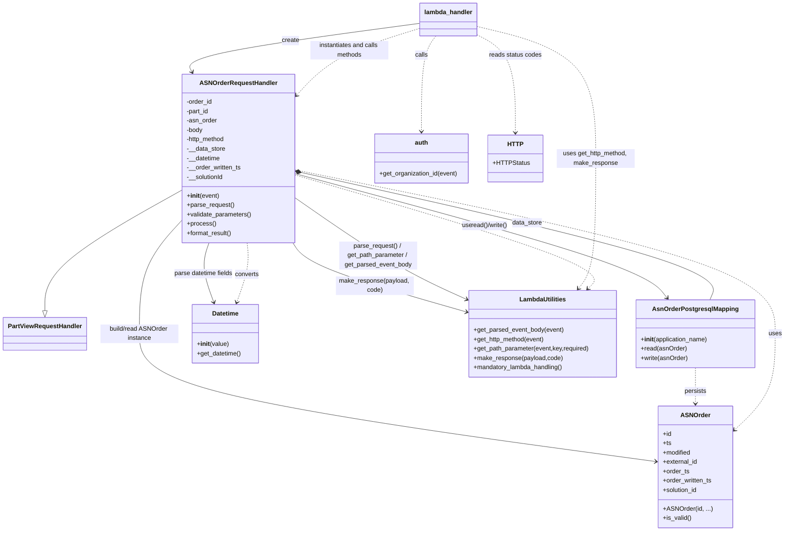

# Diagram: partview_core/partview_service/partview_service/api/asn_order/asn_order_handler.py

> Auto-generated by Obscura crawlers

## Mermaid

### SVG

<svg id="container" width="2002.7578125" xmlns="http://www.w3.org/2000/svg" class="classDiagram" height="1360" viewBox="0 0 2002.7578125 1360" role="graphics-document document" aria-roledescription="class"><g><defs><marker id="container_class-aggregationStart" class="marker aggregation class" refX="18" refY="7" markerWidth="190" markerHeight="240" orient="auto"><path d="M 18,7 L9,13 L1,7 L9,1 Z"></path></marker></defs><defs><marker id="container_class-aggregationEnd" class="marker aggregation class" refX="1" refY="7" markerWidth="20" markerHeight="28" orient="auto"><path d="M 18,7 L9,13 L1,7 L9,1 Z"></path></marker></defs><defs><marker id="container_class-extensionStart" class="marker extension class" refX="18" refY="7" markerWidth="190" markerHeight="240" orient="auto"><path d="M 1,7 L18,13 V 1 Z"></path></marker></defs><defs><marker id="container_class-extensionEnd" class="marker extension class" refX="1" refY="7" markerWidth="20" markerHeight="28" orient="auto"><path d="M 1,1 V 13 L18,7 Z"></path></marker></defs><defs><marker id="container_class-compositionStart" class="marker composition class" refX="18" refY="7" markerWidth="190" markerHeight="240" orient="auto"><path d="M 18,7 L9,13 L1,7 L9,1 Z"></path></marker></defs><defs><marker id="container_class-compositionEnd" class="marker composition class" refX="1" refY="7" markerWidth="20" markerHeight="28" orient="auto"><path d="M 18,7 L9,13 L1,7 L9,1 Z"></path></marker></defs><defs><marker id="container_class-dependencyStart" class="marker dependency class" refX="6" refY="7" markerWidth="190" markerHeight="240" orient="auto"><path d="M 5,7 L9,13 L1,7 L9,1 Z"></path></marker></defs><defs><marker id="container_class-dependencyEnd" class="marker dependency class" refX="13" refY="7" markerWidth="20" markerHeight="28" orient="auto"><path d="M 18,7 L9,13 L14,7 L9,1 Z"></path></marker></defs><defs><marker id="container_class-lollipopStart" class="marker lollipop class" refX="13" refY="7" markerWidth="190" markerHeight="240" orient="auto"><circle stroke="black" fill="transparent" cx="7" cy="7" r="6"></circle></marker></defs><defs><marker id="container_class-lollipopEnd" class="marker lollipop class" refX="1" refY="7" markerWidth="190" markerHeight="240" orient="auto"><circle stroke="black" fill="transparent" cx="7" cy="7" r="6"></circle></marker></defs><g class="root"><g class="clusters"></g><g class="edgePaths"><path d="M469.77,484.828L410.035,517.857C350.299,550.885,230.829,616.943,171.094,668.763C111.359,720.583,111.359,758.167,111.359,776.958L111.359,795.75" id="id_ASNOrderRequestHandler_PartViewRequestHandler_1" class="edge-thickness-normal edge-pattern-solid relation" style=";;;" data-edge="true" data-et="edge" data-id="id_ASNOrderRequestHandler_PartViewRequestHandler_1" data-points="W3sieCI6NDY5Ljc2OTUzMTI1LCJ5Ijo0ODQuODI3ODI4NDYwMDM5fSx7IngiOjExMS4zNTkzNzUsInkiOjY4M30seyJ4IjoxMTEuMzU5Mzc1LCJ5Ijo4MTN9XQ==" marker-end="url(#container_class-extensionEnd)"></path><path d="M771.734,441.746L951.032,481.955C1130.33,522.164,1488.926,602.582,1662.304,656.958C1835.681,711.333,1823.841,739.667,1817.921,753.833L1812.001,768" id="id_ASNOrderRequestHandler_AsnOrderPostgresqlMapping_2" class="edge-thickness-normal edge-pattern-solid relation" style=";;;" data-edge="true" data-et="edge" data-id="id_ASNOrderRequestHandler_AsnOrderPostgresqlMapping_2" data-points="W3sieCI6NzU0LjkwMjM0Mzc1LCJ5Ijo0MzcuOTcxNjI5Mzg4OTI5N30seyJ4IjoxODQ3LjUyMTQ4NDM3NSwieSI6NjgzfSx7IngiOjE4MTIuMDAwODk3MDc0ODU0NywieSI6NzY4fV0=" marker-start="url(#container_class-compositionStart)"></path><path d="M754.902,434.911L958.796,476.259C1162.69,517.608,1570.478,600.304,1774.372,670.319C1978.266,740.333,1978.266,797.667,1978.266,851C1978.266,904.333,1978.266,953.667,1960.766,995.002C1943.266,1036.338,1908.266,1069.676,1890.766,1086.345L1873.266,1103.014" id="id_ASNOrderRequestHandler_ASNOrder_3" class="edge-thickness-normal edge-pattern-dashed relation" style=";;;" data-edge="true" data-et="edge" data-id="id_ASNOrderRequestHandler_ASNOrder_3" data-points="W3sieCI6NzU0LjkwMjM0Mzc1LCJ5Ijo0MzQuOTExMzY3MDI5MDk1MzV9LHsieCI6MTk3OC4yNjU2MjUsInkiOjY4M30seyJ4IjoxOTc4LjI2NTYyNSwieSI6ODU1fSx7IngiOjE5NzguMjY1NjI1LCJ5IjoxMDAzfSx7IngiOjE4NjguOTIxODc1LCJ5IjoxMTA3LjE1MTc2MTA5OTY1MTF9XQ==" marker-end="url(#container_class-dependencyEnd)"></path><path d="M1775.645,942L1775.645,952.167C1775.645,962.333,1775.645,982.667,1775.645,998C1775.645,1013.333,1775.645,1023.667,1775.645,1028.833L1775.645,1034" id="id_AsnOrderPostgresqlMapping_ASNOrder_4" class="edge-thickness-normal edge-pattern-dashed relation" style=";;;" data-edge="true" data-et="edge" data-id="id_AsnOrderPostgresqlMapping_ASNOrder_4" data-points="W3sieCI6MTc3NS42NDQ1MzEyNSwieSI6OTQyfSx7IngiOjE3NzUuNjQ0NTMxMjUsInkiOjEwMDN9LHsieCI6MTc3NS42NDQ1MzEyNSwieSI6MTA0MH1d" marker-end="url(#container_class-dependencyEnd)"></path><path d="M630.921,622L631.796,632.167C632.671,642.333,634.42,662.667,629.642,688.063C624.864,713.458,613.559,743.917,607.906,759.146L602.253,774.375" id="id_ASNOrderRequestHandler_Datetime_5" class="edge-thickness-normal edge-pattern-dashed relation" style=";;;" data-edge="true" data-et="edge" data-id="id_ASNOrderRequestHandler_Datetime_5" data-points="W3sieCI6NjMwLjkyMTI4MjcxNjYwNjUsInkiOjYyMn0seyJ4Ijo2MzYuMTY5OTIxODc1LCJ5Ijo2ODN9LHsieCI6NjAwLjE2NTAxNjM1MTc0NDIsInkiOjc4MH1d" marker-end="url(#container_class-dependencyEnd)"></path><path d="M754.902,447.883L888.289,487.069C1021.676,526.255,1288.451,604.628,1412.402,653.273C1536.354,701.917,1517.483,720.835,1508.048,730.293L1498.612,739.752" id="id_ASNOrderRequestHandler_LambdaUtilities_6" class="edge-thickness-normal edge-pattern-dashed relation" style=";;;" data-edge="true" data-et="edge" data-id="id_ASNOrderRequestHandler_LambdaUtilities_6" data-points="W3sieCI6NzU0LjkwMjM0Mzc1LCJ5Ijo0NDcuODgyODgxNTIwNTkzMDZ9LHsieCI6MTU1NS4yMjQ2MDkzNzUsInkiOjY4M30seyJ4IjoxNDk0LjM3NDkyMDUxMjM1NDcsInkiOjc0NH1d" marker-end="url(#container_class-dependencyEnd)"></path><path d="M1115.245,92L1109.3,100.167C1103.354,108.333,1091.463,124.667,1085.518,165.5C1079.572,206.333,1079.572,271.667,1079.572,304.333L1079.572,337" id="id_lambda_handler_auth_7" class="edge-thickness-normal edge-pattern-dashed relation" style=";;;" data-edge="true" data-et="edge" data-id="id_lambda_handler_auth_7" data-points="W3sieCI6MTExNS4yNDUzNDI1NDgwNzcsInkiOjkyfSx7IngiOjEwNzkuNTcyMjY1NjI1LCJ5IjoxNDF9LHsieCI6MTA3OS41NzIyNjU2MjUsInkiOjM0M31d" marker-end="url(#container_class-dependencyEnd)"></path><path d="M1073.846,72.475L1037.271,83.896C1000.696,95.317,927.546,118.158,875.063,146.995C822.581,175.831,790.765,210.662,774.857,228.077L758.949,245.493" id="id_lambda_handler_ASNOrderRequestHandler_8" class="edge-thickness-normal edge-pattern-dashed relation" style=";;;" data-edge="true" data-et="edge" data-id="id_lambda_handler_ASNOrderRequestHandler_8" data-points="W3sieCI6MTA3My44NDU3MDMxMjUsInkiOjcyLjQ3NTI0OTY0ODE0Njl9LHsieCI6ODU0LjM5NjQ4NDM3NSwieSI6MTQxfSx7IngiOjc1NC45MDIzNDM3NSwieSI6MjQ5LjkyMjk0MzQ3ODQzNjI4fV0=" marker-end="url(#container_class-dependencyEnd)"></path><path d="M1217.799,67.564L1267.954,79.803C1318.11,92.043,1418.421,116.521,1468.577,172.927C1518.732,229.333,1518.732,317.667,1518.732,408C1518.732,498.333,1518.732,590.667,1511.365,646.214C1503.999,701.76,1489.265,720.521,1481.898,729.901L1474.531,739.281" id="id_lambda_handler_LambdaUtilities_9" class="edge-thickness-normal edge-pattern-dashed relation" style=";;;" data-edge="true" data-et="edge" data-id="id_lambda_handler_LambdaUtilities_9" data-points="W3sieCI6MTIxNy43OTg4MjgxMjUsInkiOjY3LjU2NDE5NjMwMjMwOTc0fSx7IngiOjE1MTguNzMyNDIxODc1LCJ5IjoxNDF9LHsieCI6MTUxOC43MzI0MjE4NzUsInkiOjQwNn0seyJ4IjoxNTE4LjczMjQyMTg3NSwieSI6NjgzfSx7IngiOjE0NzAuODI0NzI5NzQyMDA1NywieSI6NzQ0fV0=" marker-end="url(#container_class-dependencyEnd)"></path><path d="M1217.799,88.192L1234.386,96.993C1250.973,105.794,1284.148,123.397,1300.735,165.365C1317.322,207.333,1317.322,273.667,1317.322,306.833L1317.322,340" id="id_lambda_handler_HTTP_10" class="edge-thickness-normal edge-pattern-dashed relation" style=";;;" data-edge="true" data-et="edge" data-id="id_lambda_handler_HTTP_10" data-points="W3sieCI6MTIxNy43OTg4MjgxMjUsInkiOjg4LjE5MTY0NTQwODE2MzI3fSx7IngiOjEzMTcuMzIyMjY1NjI1LCJ5IjoxNDF9LHsieCI6MTMxNy4zMjIyNjU2MjUsInkiOjM0Nn1d" marker-end="url(#container_class-dependencyEnd)"></path><path d="M1073.846,59.69L973.188,73.242C872.53,86.793,671.214,113.897,574.472,134.734C477.731,155.572,485.563,170.143,489.479,177.429L493.395,184.715" id="id_lambda_handler_ASNOrderRequestHandler_11" class="edge-thickness-normal edge-pattern-solid relation" style=";;;" data-edge="true" data-et="edge" data-id="id_lambda_handler_ASNOrderRequestHandler_11" data-points="W3sieCI6MTA3My44NDU3MDMxMjUsInkiOjU5LjY5MDI0NDU0Mzc4MTIyNn0seyJ4Ijo0NjkuODk4NDM3NSwieSI6MTQxfSx7IngiOjQ5Ni4yMzU5Mzc1LCJ5IjoxOTB9XQ==" marker-end="url(#container_class-dependencyEnd)"></path><path d="M754.902,506.033L796.938,535.527C838.973,565.022,923.044,624.011,995.114,667.225C1067.185,710.44,1127.254,737.879,1157.289,751.599L1187.324,765.319" id="id_ASNOrderRequestHandler_LambdaUtilities_12" class="edge-thickness-normal edge-pattern-solid relation" style=";;;" data-edge="true" data-et="edge" data-id="id_ASNOrderRequestHandler_LambdaUtilities_12" data-points="W3sieCI6NzU0LjkwMjM0Mzc1LCJ5Ijo1MDYuMDMyODQwNzM4NzQzNDZ9LHsieCI6MTAwNy4xMTUyMzQzNzUsInkiOjY4M30seyJ4IjoxMTkyLjc4MTI1LCJ5Ijo3NjcuODEyMDU0ODc5Nzg4M31d" marker-end="url(#container_class-dependencyEnd)"></path><path d="M469.77,556.374L449.761,577.479C429.753,598.583,389.736,640.791,369.727,690.562C349.719,740.333,349.719,797.667,349.719,851C349.719,904.333,349.719,953.667,570.836,1008.262C791.953,1062.857,1234.187,1122.713,1455.304,1152.642L1676.421,1182.57" id="id_ASNOrderRequestHandler_ASNOrder_13" class="edge-thickness-normal edge-pattern-solid relation" style=";;;" data-edge="true" data-et="edge" data-id="id_ASNOrderRequestHandler_ASNOrder_13" data-points="W3sieCI6NDY5Ljc2OTUzMTI1LCJ5Ijo1NTYuMzc0MzcxNTYwMzE1NH0seyJ4IjozNDkuNzE4NzUsInkiOjY4M30seyJ4IjozNDkuNzE4NzUsInkiOjg1NX0seyJ4IjozNDkuNzE4NzUsInkiOjEwMDN9LHsieCI6MTY4Mi4zNjcxODc1LCJ5IjoxMTgzLjM3NDg0OTY3Mjc3Mjh9XQ==" marker-end="url(#container_class-dependencyEnd)"></path><path d="M754.902,444.407L902.512,484.172C1050.122,523.938,1345.341,603.469,1503.459,656.615C1661.577,709.76,1682.594,736.521,1693.103,749.901L1703.611,763.281" id="id_ASNOrderRequestHandler_AsnOrderPostgresqlMapping_14" class="edge-thickness-normal edge-pattern-solid relation" style=";;;" data-edge="true" data-et="edge" data-id="id_ASNOrderRequestHandler_AsnOrderPostgresqlMapping_14" data-points="W3sieCI6NzU0LjkwMjM0Mzc1LCJ5Ijo0NDQuNDA2ODc1NDczNjkwODN9LHsieCI6MTY0MC41NjA1NDY4NzUsInkiOjY4M30seyJ4IjoxNzA3LjMxNzE2NzA2MDMxOTcsInkiOjc2OH1d" marker-end="url(#container_class-dependencyEnd)"></path><path d="M531.353,622L527.541,632.167C523.729,642.333,516.106,662.667,517.947,688.063C519.788,713.458,531.094,743.917,536.747,759.146L542.399,774.375" id="id_ASNOrderRequestHandler_Datetime_15" class="edge-thickness-normal edge-pattern-solid relation" style=";;;" data-edge="true" data-et="edge" data-id="id_ASNOrderRequestHandler_Datetime_15" data-points="W3sieCI6NTMxLjM1MjY5MDY1ODg0NDcsInkiOjYyMn0seyJ4Ijo1MDguNDgyNDIxODc1LCJ5Ijo2ODN9LHsieCI6NTQ0LjQ4NzMyNzM5ODI1NTgsInkiOjc4MH1d" marker-end="url(#container_class-dependencyEnd)"></path><path d="M748.626,622L755.041,632.167C761.456,642.333,774.285,662.667,847.35,692.051C920.416,721.435,1053.716,759.87,1120.366,779.087L1187.016,798.304" id="id_ASNOrderRequestHandler_LambdaUtilities_16" class="edge-thickness-normal edge-pattern-solid relation" style=";;;" data-edge="true" data-et="edge" data-id="id_ASNOrderRequestHandler_LambdaUtilities_16" data-points="W3sieCI6NzQ4LjYyNTkzMDczMTA0NywieSI6NjIyfSx7IngiOjc4Ny4xMTUyMzQzNzUsInkiOjY4M30seyJ4IjoxMTkyLjc4MTI1LCJ5Ijo3OTkuOTY2NzU3Nzk2NTEzMX1d" marker-end="url(#container_class-dependencyEnd)"></path></g><g class="edgeLabels"><g class="edgeLabel"><g class="label" data-id="id_ASNOrderRequestHandler_PartViewRequestHandler_1" transform="translate(0, 0)"><foreignObject width="0" height="0">

</foreignObject></g></g><g class="edgeLabel" transform="translate(1346.15727, 570.56516)"><g class="label" data-id="id_ASNOrderRequestHandler_AsnOrderPostgresqlMapping_2" transform="translate(-38.8671875, -12)"><foreignObject width="77.734375" height="24">

data_store

</foreignObject></g></g><g class="edgeLabel" transform="translate(1978.265625, 855)"><g class="label" data-id="id_ASNOrderRequestHandler_ASNOrder_3" transform="translate(-16.4921875, -12)"><foreignObject width="32.984375" height="24">

uses

</foreignObject></g></g><g class="edgeLabel" transform="translate(1775.64453125, 1003)"><g class="label" data-id="id_AsnOrderPostgresqlMapping_ASNOrder_4" transform="translate(-28.4375, -12)"><foreignObject width="56.875" height="24">

persists

</foreignObject></g></g><g class="edgeLabel" transform="translate(628.82024, 702.8006)"><g class="label" data-id="id_ASNOrderRequestHandler_Datetime_5" transform="translate(-30.9453125, -12)"><foreignObject width="61.890625" height="24">

converts

</foreignObject></g></g><g class="edgeLabel" transform="translate(1196.39713, 577.58436)"><g class="label" data-id="id_ASNOrderRequestHandler_LambdaUtilities_6" transform="translate(-16.4921875, -12)"><foreignObject width="32.984375" height="24">

uses

</foreignObject></g></g><g class="edgeLabel" transform="translate(1079.572265625, 141)"><g class="label" data-id="id_lambda_handler_auth_7" transform="translate(-16.4453125, -12)"><foreignObject width="32.890625" height="24">

calls

</foreignObject></g></g><g class="edgeLabel" transform="translate(893.71195, 128.72343)"><g class="label" data-id="id_lambda_handler_ASNOrderRequestHandler_8" transform="translate(-100, -24)"><foreignObject width="200" height="48">

instantiates and calls methods

</foreignObject></g></g><g class="edgeLabel" transform="translate(1518.732421875, 406)"><g class="label" data-id="id_lambda_handler_LambdaUtilities_9" transform="translate(-100, -24)"><foreignObject width="200" height="48">

uses get_http_method, make_response

</foreignObject></g></g><g class="edgeLabel" transform="translate(1317.322265625, 141)"><g class="label" data-id="id_lambda_handler_HTTP_10" transform="translate(-67.65625, -12)"><foreignObject width="135.3125" height="24">

reads status codes

</foreignObject></g></g><g class="edgeLabel" transform="translate(744.30592, 104.05637)"><g class="label" data-id="id_lambda_handler_ASNOrderRequestHandler_11" transform="translate(-22.4375, -12)"><foreignObject width="44.875" height="24">

create

</foreignObject></g></g><g class="edgeLabel" transform="translate(964.55446, 653.13689)"><g class="label" data-id="id_ASNOrderRequestHandler_LambdaUtilities_12" transform="translate(-100, -36)"><foreignObject width="200" height="72">

parse_request() / get_path_parameter / get_parsed_event_body

</foreignObject></g></g><g class="edgeLabel" transform="translate(349.71875, 855)"><g class="label" data-id="id_ASNOrderRequestHandler_ASNOrder_13" transform="translate(-100, -24)"><foreignObject width="200" height="48">

build/read ASNOrder instance

</foreignObject></g></g><g class="edgeLabel" transform="translate(1640.560546875, 683)"><g class="label" data-id="id_ASNOrderRequestHandler_AsnOrderPostgresqlMapping_14" transform="translate(-48.84375, -12)"><foreignObject width="97.6875" height="24">

read()/write()

</foreignObject></g></g><g class="edgeLabel" transform="translate(515.14988, 700.96264)"><g class="label" data-id="id_ASNOrderRequestHandler_Datetime_15" transform="translate(-76.7421875, -12)"><foreignObject width="153.484375" height="24">

parse datetime fields

</foreignObject></g></g><g class="edgeLabel" transform="translate(955.29598, 731.492)"><g class="label" data-id="id_ASNOrderRequestHandler_LambdaUtilities_16" transform="translate(-100, -24)"><foreignObject width="200" height="48">

make_response(payload, code)

</foreignObject></g></g></g><g class="nodes"><g class="node default" id="classId-ASNOrderRequestHandler-0" transform="translate(612.3359375, 406)"><g class="basic label-container"><path d="M-142.56640625 -216 L142.56640625 -216 L142.56640625 216 L-142.56640625 216" stroke="none" stroke-width="0" fill="#ECECFF" style=""></path><path d="M-142.56640625 -216 C-43.3305321853574 -216, 55.9053418792852 -216, 142.56640625 -216 M-142.56640625 -216 C-78.01674015354725 -216, -13.467074057094493 -216, 142.56640625 -216 M142.56640625 -216 C142.56640625 -89.78049173705598, 142.56640625 36.439016525888036, 142.56640625 216 M142.56640625 -216 C142.56640625 -74.70165508477203, 142.56640625 66.59668983045594, 142.56640625 216 M142.56640625 216 C67.90087418229594 216, -6.764657885408127 216, -142.56640625 216 M142.56640625 216 C72.99519506646084 216, 3.423983882921675 216, -142.56640625 216 M-142.56640625 216 C-142.56640625 110.47721878206718, -142.56640625 4.954437564134366, -142.56640625 -216 M-142.56640625 216 C-142.56640625 121.30767308996863, -142.56640625 26.615346179937262, -142.56640625 -216" stroke="#9370DB" stroke-width="1.3" fill="none" stroke-dasharray="0 0" style=""></path></g><g class="annotation-group text" transform="translate(0, -192)"></g><g class="label-group text" transform="translate(-94.5859375, -192)"><g class="label" style="font-weight: bolder" transform="translate(0,-12)"><foreignObject width="189.171875" height="24">

ASNOrderRequestHandler

</foreignObject></g></g><g class="members-group text" transform="translate(-130.56640625, -144)"><g class="label" style="" transform="translate(0,-12)"><foreignObject width="67.078125" height="24">

-order_id

</foreignObject></g><g class="label" style="" transform="translate(0,12)"><foreignObject width="58.859375" height="24">

-part_id

</foreignObject></g><g class="label" style="" transform="translate(0,36)"><foreignObject width="79.109375" height="24">

-asn_order

</foreignObject></g><g class="label" style="" transform="translate(0,60)"><foreignObject width="42.75" height="24">

-body

</foreignObject></g><g class="label" style="" transform="translate(0,84)"><foreignObject width="101.390625" height="24">

-http_method

</foreignObject></g><g class="label" style="" transform="translate(0,108)"><foreignObject width="99.0625" height="24">

-__data_store

</foreignObject></g><g class="label" style="" transform="translate(0,132)"><foreignObject width="86.578125" height="24">

-__datetime

</foreignObject></g><g class="label" style="" transform="translate(0,156)"><foreignObject width="140.375" height="24">

-__order_written_ts

</foreignObject></g><g class="label" style="" transform="translate(0,180)"><foreignObject width="95.765625" height="24">

-__solutionId

</foreignObject></g></g><g class="methods-group text" transform="translate(-130.56640625, 96)"><g class="label" style="" transform="translate(0,-12)"><foreignObject width="83.140625" height="24">

+<strong>init</strong>(event)

</foreignObject></g><g class="label" style="" transform="translate(0,12)"><foreignObject width="121.796875" height="24">

+parse_request()

</foreignObject></g><g class="label" style="" transform="translate(0,36)"><foreignObject width="166.546875" height="24">

+validate_parameters()

</foreignObject></g><g class="label" style="" transform="translate(0,60)"><foreignObject width="73.734375" height="24">

+process()

</foreignObject></g><g class="label" style="" transform="translate(0,84)"><foreignObject width="117.015625" height="24">

+format_result()

</foreignObject></g></g><g class="divider" style=""><path d="M-142.56640625 -168 C-31.04464822943534 -168, 80.47710979112932 -168, 142.56640625 -168 M-142.56640625 -168 C-71.40007389856838 -168, -0.2337415471367592 -168, 142.56640625 -168" stroke="#9370DB" stroke-width="1.3" fill="none" stroke-dasharray="0 0" style=""></path></g><g class="divider" style=""><path d="M-142.56640625 72 C-56.172917989632424 72, 30.220570270735152 72, 142.56640625 72 M-142.56640625 72 C-30.36152041899807 72, 81.84336541200386 72, 142.56640625 72" stroke="#9370DB" stroke-width="1.3" fill="none" stroke-dasharray="0 0" style=""></path></g></g><g class="node default" id="classId-PartViewRequestHandler-1" transform="translate(111.359375, 855)"><g class="basic label-container"><path d="M-103.359375 -42 L103.359375 -42 L103.359375 42 L-103.359375 42" stroke="none" stroke-width="0" fill="#ECECFF" style=""></path><path d="M-103.359375 -42 C-24.271076168154792 -42, 54.817222663690416 -42, 103.359375 -42 M-103.359375 -42 C-51.54709430682188 -42, 0.26518638635623404 -42, 103.359375 -42 M103.359375 -42 C103.359375 -14.17801449621226, 103.359375 13.64397100757548, 103.359375 42 M103.359375 -42 C103.359375 -24.769668920756413, 103.359375 -7.539337841512825, 103.359375 42 M103.359375 42 C30.652690362166382 42, -42.053994275667236 42, -103.359375 42 M103.359375 42 C32.02280117826905 42, -39.3137726434619 42, -103.359375 42 M-103.359375 42 C-103.359375 8.945939636329328, -103.359375 -24.108120727341344, -103.359375 -42 M-103.359375 42 C-103.359375 9.815443864786694, -103.359375 -22.369112270426612, -103.359375 -42" stroke="#9370DB" stroke-width="1.3" fill="none" stroke-dasharray="0 0" style=""></path></g><g class="annotation-group text" transform="translate(0, -18)"></g><g class="label-group text" transform="translate(-91.359375, -18)"><g class="label" style="font-weight: bolder" transform="translate(0,-12)"><foreignObject width="182.71875" height="24">

PartViewRequestHandler

</foreignObject></g></g><g class="members-group text" transform="translate(-91.359375, 30)"></g><g class="methods-group text" transform="translate(-91.359375, 60)"></g><g class="divider" style=""><path d="M-103.359375 6 C-28.89309729761058 6, 45.57318040477884 6, 103.359375 6 M-103.359375 6 C-55.283648228339324 6, -7.207921456678648 6, 103.359375 6" stroke="#9370DB" stroke-width="1.3" fill="none" stroke-dasharray="0 0" style=""></path></g><g class="divider" style=""><path d="M-103.359375 24 C-25.1585653657649 24, 53.0422442684702 24, 103.359375 24 M-103.359375 24 C-56.15109916729269 24, -8.942823334585384 24, 103.359375 24" stroke="#9370DB" stroke-width="1.3" fill="none" stroke-dasharray="0 0" style=""></path></g></g><g class="node default" id="classId-AsnOrderPostgresqlMapping-2" transform="translate(1775.64453125, 855)"><g class="basic label-container"><path d="M-151.12890625 -87 L151.12890625 -87 L151.12890625 87 L-151.12890625 87" stroke="none" stroke-width="0" fill="#ECECFF" style=""></path><path d="M-151.12890625 -87 C-34.09831329741678 -87, 82.93227965516644 -87, 151.12890625 -87 M-151.12890625 -87 C-53.192194931268446 -87, 44.74451638746311 -87, 151.12890625 -87 M151.12890625 -87 C151.12890625 -46.64590093426503, 151.12890625 -6.291801868530058, 151.12890625 87 M151.12890625 -87 C151.12890625 -27.086816925956605, 151.12890625 32.82636614808679, 151.12890625 87 M151.12890625 87 C51.56003892967203 87, -48.008828390655935 87, -151.12890625 87 M151.12890625 87 C72.53928486104792 87, -6.0503365279041645 87, -151.12890625 87 M-151.12890625 87 C-151.12890625 36.02624128822393, -151.12890625 -14.947517423552142, -151.12890625 -87 M-151.12890625 87 C-151.12890625 21.08641197164357, -151.12890625 -44.82717605671286, -151.12890625 -87" stroke="#9370DB" stroke-width="1.3" fill="none" stroke-dasharray="0 0" style=""></path></g><g class="annotation-group text" transform="translate(0, -63)"></g><g class="label-group text" transform="translate(-104.5234375, -63)"><g class="label" style="font-weight: bolder" transform="translate(0,-12)"><foreignObject width="209.046875" height="24">

AsnOrderPostgresqlMapping

</foreignObject></g></g><g class="members-group text" transform="translate(-139.12890625, -15)"></g><g class="methods-group text" transform="translate(-139.12890625, 15)"><g class="label" style="" transform="translate(0,-12)"><foreignObject width="173.734375" height="24">

+<strong>init</strong>(application_name)

</foreignObject></g><g class="label" style="" transform="translate(0,12)"><foreignObject width="117.515625" height="24">

+read(asnOrder)

</foreignObject></g><g class="label" style="" transform="translate(0,36)"><foreignObject width="121.40625" height="24">

+write(asnOrder)

</foreignObject></g></g><g class="divider" style=""><path d="M-151.12890625 -39 C-60.0166798322622 -39, 31.095546585475603 -39, 151.12890625 -39 M-151.12890625 -39 C-31.24056427519605 -39, 88.6477776996079 -39, 151.12890625 -39" stroke="#9370DB" stroke-width="1.3" fill="none" stroke-dasharray="0 0" style=""></path></g><g class="divider" style=""><path d="M-151.12890625 -15 C-46.08010453236187 -15, 58.968697185276255 -15, 151.12890625 -15 M-151.12890625 -15 C-84.27267528590238 -15, -17.41644432180476 -15, 151.12890625 -15" stroke="#9370DB" stroke-width="1.3" fill="none" stroke-dasharray="0 0" style=""></path></g></g><g class="node default" id="classId-ASNOrder-3" transform="translate(1775.64453125, 1196)"><g class="basic label-container"><path d="M-93.27734375 -156 L93.27734375 -156 L93.27734375 156 L-93.27734375 156" stroke="none" stroke-width="0" fill="#ECECFF" style=""></path><path d="M-93.27734375 -156 C-25.24460764535715 -156, 42.7881284592857 -156, 93.27734375 -156 M-93.27734375 -156 C-51.88316652137901 -156, -10.48898929275802 -156, 93.27734375 -156 M93.27734375 -156 C93.27734375 -60.492813250632466, 93.27734375 35.01437349873507, 93.27734375 156 M93.27734375 -156 C93.27734375 -67.03104844395668, 93.27734375 21.937903112086644, 93.27734375 156 M93.27734375 156 C36.347480053255744 156, -20.582383643488512 156, -93.27734375 156 M93.27734375 156 C44.70676293570438 156, -3.8638178785912345 156, -93.27734375 156 M-93.27734375 156 C-93.27734375 71.96471153408136, -93.27734375 -12.07057693183728, -93.27734375 -156 M-93.27734375 156 C-93.27734375 90.60289677215945, -93.27734375 25.205793544318908, -93.27734375 -156" stroke="#9370DB" stroke-width="1.3" fill="none" stroke-dasharray="0 0" style=""></path></g><g class="annotation-group text" transform="translate(0, -132)"></g><g class="label-group text" transform="translate(-35.5234375, -132)"><g class="label" style="font-weight: bolder" transform="translate(0,-12)"><foreignObject width="71.046875" height="24">

ASNOrder

</foreignObject></g></g><g class="members-group text" transform="translate(-81.27734375, -84)"><g class="label" style="" transform="translate(0,-12)"><foreignObject width="22.078125" height="24">

+id

</foreignObject></g><g class="label" style="" transform="translate(0,12)"><foreignObject width="21.15625" height="24">

+ts

</foreignObject></g><g class="label" style="" transform="translate(0,36)"><foreignObject width="72.609375" height="24">

+modified

</foreignObject></g><g class="label" style="" transform="translate(0,60)"><foreignObject width="89.765625" height="24">

+external_id

</foreignObject></g><g class="label" style="" transform="translate(0,84)"><foreignObject width="67.46875" height="24">

+order_ts

</foreignObject></g><g class="label" style="" transform="translate(0,108)"><foreignObject width="127.03125" height="24">

+order_written_ts

</foreignObject></g><g class="label" style="" transform="translate(0,132)"><foreignObject width="90.21875" height="24">

+solution_id

</foreignObject></g></g><g class="methods-group text" transform="translate(-81.27734375, 108)"><g class="label" style="" transform="translate(0,-12)"><foreignObject width="121.921875" height="24">

+ASNOrder(id, ...)

</foreignObject></g><g class="label" style="" transform="translate(0,12)"><foreignObject width="72.796875" height="24">

+is_valid()

</foreignObject></g></g><g class="divider" style=""><path d="M-93.27734375 -108 C-39.02257300844894 -108, 15.232197733102126 -108, 93.27734375 -108 M-93.27734375 -108 C-48.07516213384273 -108, -2.8729805176854626 -108, 93.27734375 -108" stroke="#9370DB" stroke-width="1.3" fill="none" stroke-dasharray="0 0" style=""></path></g><g class="divider" style=""><path d="M-93.27734375 84 C-27.05311677298951 84, 39.17111020402098 84, 93.27734375 84 M-93.27734375 84 C-54.74623621015796 84, -16.21512867031592 84, 93.27734375 84" stroke="#9370DB" stroke-width="1.3" fill="none" stroke-dasharray="0 0" style=""></path></g></g><g class="node default" id="classId-Datetime-4" transform="translate(572.326171875, 855)"><g class="basic label-container"><path d="M-85.78515625 -75 L85.78515625 -75 L85.78515625 75 L-85.78515625 75" stroke="none" stroke-width="0" fill="#ECECFF" style=""></path><path d="M-85.78515625 -75 C-24.36920666621574 -75, 37.04674291756852 -75, 85.78515625 -75 M-85.78515625 -75 C-49.09392961148285 -75, -12.402702972965699 -75, 85.78515625 -75 M85.78515625 -75 C85.78515625 -38.772994175381875, 85.78515625 -2.54598835076375, 85.78515625 75 M85.78515625 -75 C85.78515625 -28.404150211638502, 85.78515625 18.191699576722996, 85.78515625 75 M85.78515625 75 C41.36480304086822 75, -3.055550168263565 75, -85.78515625 75 M85.78515625 75 C23.998045324549352 75, -37.789065600901296 75, -85.78515625 75 M-85.78515625 75 C-85.78515625 41.07441257646789, -85.78515625 7.148825152935785, -85.78515625 -75 M-85.78515625 75 C-85.78515625 40.037967894494955, -85.78515625 5.075935788989909, -85.78515625 -75" stroke="#9370DB" stroke-width="1.3" fill="none" stroke-dasharray="0 0" style=""></path></g><g class="annotation-group text" transform="translate(0, -51)"></g><g class="label-group text" transform="translate(-33.3984375, -51)"><g class="label" style="font-weight: bolder" transform="translate(0,-12)"><foreignObject width="66.796875" height="24">

Datetime

</foreignObject></g></g><g class="members-group text" transform="translate(-73.78515625, -3)"></g><g class="methods-group text" transform="translate(-73.78515625, 27)"><g class="label" style="" transform="translate(0,-12)"><foreignObject width="81.671875" height="24">

+<strong>init</strong>(value)

</foreignObject></g><g class="label" style="" transform="translate(0,12)"><foreignObject width="114.171875" height="24">

+get_datetime()

</foreignObject></g></g><g class="divider" style=""><path d="M-85.78515625 -27 C-46.90875679507945 -27, -8.032357340158896 -27, 85.78515625 -27 M-85.78515625 -27 C-50.76175225058468 -27, -15.738348251169356 -27, 85.78515625 -27" stroke="#9370DB" stroke-width="1.3" fill="none" stroke-dasharray="0 0" style=""></path></g><g class="divider" style=""><path d="M-85.78515625 -3 C-34.38208950246818 -3, 17.020977245063634 -3, 85.78515625 -3 M-85.78515625 -3 C-43.4093620976602 -3, -1.0335679453203994 -3, 85.78515625 -3" stroke="#9370DB" stroke-width="1.3" fill="none" stroke-dasharray="0 0" style=""></path></g></g><g class="node default" id="classId-LambdaUtilities-5" transform="translate(1383.6484375, 855)"><g class="basic label-container"><path d="M-190.8671875 -111 L190.8671875 -111 L190.8671875 111 L-190.8671875 111" stroke="none" stroke-width="0" fill="#ECECFF" style=""></path><path d="M-190.8671875 -111 C-92.45314837454062 -111, 5.9608907509187645 -111, 190.8671875 -111 M-190.8671875 -111 C-87.27141920650612 -111, 16.324349086987752 -111, 190.8671875 -111 M190.8671875 -111 C190.8671875 -29.206741121743562, 190.8671875 52.586517756512876, 190.8671875 111 M190.8671875 -111 C190.8671875 -38.66445080131167, 190.8671875 33.67109839737665, 190.8671875 111 M190.8671875 111 C57.755871957011095 111, -75.35544358597781 111, -190.8671875 111 M190.8671875 111 C91.02559806142565 111, -8.815991377148691 111, -190.8671875 111 M-190.8671875 111 C-190.8671875 32.983911068911524, -190.8671875 -45.03217786217695, -190.8671875 -111 M-190.8671875 111 C-190.8671875 43.40982369228519, -190.8671875 -24.180352615429626, -190.8671875 -111" stroke="#9370DB" stroke-width="1.3" fill="none" stroke-dasharray="0 0" style=""></path></g><g class="annotation-group text" transform="translate(0, -87)"></g><g class="label-group text" transform="translate(-57.9375, -87)"><g class="label" style="font-weight: bolder" transform="translate(0,-12)"><foreignObject width="115.875" height="24">

LambdaUtilities

</foreignObject></g></g><g class="members-group text" transform="translate(-178.8671875, -39)"></g><g class="methods-group text" transform="translate(-178.8671875, -9)"><g class="label" style="" transform="translate(0,-12)"><foreignObject width="232.265625" height="24">

+get_parsed_event_body(event)

</foreignObject></g><g class="label" style="" transform="translate(0,12)"><foreignObject width="184.5" height="24">

+get_http_method(event)

</foreignObject></g><g class="label" style="" transform="translate(0,36)"><foreignObject width="299.796875" height="24">

+get_path_parameter(event,key,required)

</foreignObject></g><g class="label" style="" transform="translate(0,60)"><foreignObject width="228.234375" height="24">

+make_response(payload,code)

</foreignObject></g><g class="label" style="" transform="translate(0,84)"><foreignObject width="232.078125" height="24">

+mandatory_lambda_handling()

</foreignObject></g></g><g class="divider" style=""><path d="M-190.8671875 -63 C-41.03572991943054 -63, 108.79572766113893 -63, 190.8671875 -63 M-190.8671875 -63 C-57.285311982508006 -63, 76.29656353498399 -63, 190.8671875 -63" stroke="#9370DB" stroke-width="1.3" fill="none" stroke-dasharray="0 0" style=""></path></g><g class="divider" style=""><path d="M-190.8671875 -39 C-91.88265293680317 -39, 7.101881626393663 -39, 190.8671875 -39 M-190.8671875 -39 C-90.9235347337799 -39, 9.020118032440195 -39, 190.8671875 -39" stroke="#9370DB" stroke-width="1.3" fill="none" stroke-dasharray="0 0" style=""></path></g></g><g class="node default" id="classId-auth-6" transform="translate(1079.572265625, 406)"><g class="basic label-container"><path d="M-121.33984375 -63 L121.33984375 -63 L121.33984375 63 L-121.33984375 63" stroke="none" stroke-width="0" fill="#ECECFF" style=""></path><path d="M-121.33984375 -63 C-43.1299290622796 -63, 35.0799856254408 -63, 121.33984375 -63 M-121.33984375 -63 C-57.65693446938667 -63, 6.025974811226661 -63, 121.33984375 -63 M121.33984375 -63 C121.33984375 -34.03825939151736, 121.33984375 -5.076518783034722, 121.33984375 63 M121.33984375 -63 C121.33984375 -31.33097939020203, 121.33984375 0.3380412195959366, 121.33984375 63 M121.33984375 63 C48.99670047689814 63, -23.346442796203718 63, -121.33984375 63 M121.33984375 63 C53.10538128521267 63, -15.129081179574655 63, -121.33984375 63 M-121.33984375 63 C-121.33984375 17.004956789904107, -121.33984375 -28.990086420191787, -121.33984375 -63 M-121.33984375 63 C-121.33984375 35.763387763643294, -121.33984375 8.526775527286588, -121.33984375 -63" stroke="#9370DB" stroke-width="1.3" fill="none" stroke-dasharray="0 0" style=""></path></g><g class="annotation-group text" transform="translate(0, -39)"></g><g class="label-group text" transform="translate(-16.6640625, -39)"><g class="label" style="font-weight: bolder" transform="translate(0,-12)"><foreignObject width="33.328125" height="24">

auth

</foreignObject></g></g><g class="members-group text" transform="translate(-109.33984375, 9)"></g><g class="methods-group text" transform="translate(-109.33984375, 39)"><g class="label" style="" transform="translate(0,-12)"><foreignObject width="202.015625" height="24">

+get_organization_id(event)

</foreignObject></g></g><g class="divider" style=""><path d="M-121.33984375 -15 C-54.60185450793526 -15, 12.136134734129485 -15, 121.33984375 -15 M-121.33984375 -15 C-45.12155966471545 -15, 31.096724420569103 -15, 121.33984375 -15" stroke="#9370DB" stroke-width="1.3" fill="none" stroke-dasharray="0 0" style=""></path></g><g class="divider" style=""><path d="M-121.33984375 9 C-41.5808794777665 9, 38.178084794467 9, 121.33984375 9 M-121.33984375 9 C-69.35988081585374 9, -17.379917881707485 9, 121.33984375 9" stroke="#9370DB" stroke-width="1.3" fill="none" stroke-dasharray="0 0" style=""></path></g></g><g class="node default" id="classId-lambda_handler-7" transform="translate(1145.822265625, 50)"><g class="basic label-container"><path d="M-71.9765625 -42 L71.9765625 -42 L71.9765625 42 L-71.9765625 42" stroke="none" stroke-width="0" fill="#ECECFF" style=""></path><path d="M-71.9765625 -42 C-30.770896205731283 -42, 10.434770088537434 -42, 71.9765625 -42 M-71.9765625 -42 C-31.101492349191112 -42, 9.773577801617776 -42, 71.9765625 -42 M71.9765625 -42 C71.9765625 -16.276022232329865, 71.9765625 9.44795553534027, 71.9765625 42 M71.9765625 -42 C71.9765625 -20.124275441806443, 71.9765625 1.7514491163871142, 71.9765625 42 M71.9765625 42 C24.46904340333908 42, -23.038475693321843 42, -71.9765625 42 M71.9765625 42 C15.533667985113595 42, -40.90922652977281 42, -71.9765625 42 M-71.9765625 42 C-71.9765625 23.16999668569475, -71.9765625 4.339993371389497, -71.9765625 -42 M-71.9765625 42 C-71.9765625 16.877765658192455, -71.9765625 -8.24446868361509, -71.9765625 -42" stroke="#9370DB" stroke-width="1.3" fill="none" stroke-dasharray="0 0" style=""></path></g><g class="annotation-group text" transform="translate(0, -18)"></g><g class="label-group text" transform="translate(-59.9765625, -18)"><g class="label" style="font-weight: bolder" transform="translate(0,-12)"><foreignObject width="119.953125" height="24">

lambda_handler

</foreignObject></g></g><g class="members-group text" transform="translate(-59.9765625, 30)"></g><g class="methods-group text" transform="translate(-59.9765625, 60)"></g><g class="divider" style=""><path d="M-71.9765625 6 C-38.716983847661226 6, -5.457405195322451 6, 71.9765625 6 M-71.9765625 6 C-37.8059018077443 6, -3.635241115488597 6, 71.9765625 6" stroke="#9370DB" stroke-width="1.3" fill="none" stroke-dasharray="0 0" style=""></path></g><g class="divider" style=""><path d="M-71.9765625 24 C-39.137082692324846 24, -6.297602884649692 24, 71.9765625 24 M-71.9765625 24 C-33.45871165781139 24, 5.059139184377216 24, 71.9765625 24" stroke="#9370DB" stroke-width="1.3" fill="none" stroke-dasharray="0 0" style=""></path></g></g><g class="node default" id="classId-HTTP-8" transform="translate(1317.322265625, 406)"><g class="basic label-container"><path d="M-66.41015625 -60 L66.41015625 -60 L66.41015625 60 L-66.41015625 60" stroke="none" stroke-width="0" fill="#ECECFF" style=""></path><path d="M-66.41015625 -60 C-39.010739044059626 -60, -11.611321838119252 -60, 66.41015625 -60 M-66.41015625 -60 C-30.747802964169473 -60, 4.9145503216610535 -60, 66.41015625 -60 M66.41015625 -60 C66.41015625 -15.393956243091033, 66.41015625 29.212087513817934, 66.41015625 60 M66.41015625 -60 C66.41015625 -12.252990213842395, 66.41015625 35.49401957231521, 66.41015625 60 M66.41015625 60 C20.6416343207977 60, -25.1268876084046 60, -66.41015625 60 M66.41015625 60 C33.95154633370847 60, 1.4929364174169422 60, -66.41015625 60 M-66.41015625 60 C-66.41015625 30.537019311546803, -66.41015625 1.0740386230936068, -66.41015625 -60 M-66.41015625 60 C-66.41015625 26.323702008029166, -66.41015625 -7.352595983941669, -66.41015625 -60" stroke="#9370DB" stroke-width="1.3" fill="none" stroke-dasharray="0 0" style=""></path></g><g class="annotation-group text" transform="translate(0, -36)"></g><g class="label-group text" transform="translate(-18.7734375, -36)"><g class="label" style="font-weight: bolder" transform="translate(0,-12)"><foreignObject width="37.546875" height="24">

HTTP

</foreignObject></g></g><g class="members-group text" transform="translate(-54.41015625, 12)"><g class="label" style="" transform="translate(0,-12)"><foreignObject width="90.046875" height="24">

+HTTPStatus

</foreignObject></g></g><g class="methods-group text" transform="translate(-54.41015625, 60)"></g><g class="divider" style=""><path d="M-66.41015625 -12 C-24.823482831275015 -12, 16.76319058744997 -12, 66.41015625 -12 M-66.41015625 -12 C-22.07806860423819 -12, 22.25401904152362 -12, 66.41015625 -12" stroke="#9370DB" stroke-width="1.3" fill="none" stroke-dasharray="0 0" style=""></path></g><g class="divider" style=""><path d="M-66.41015625 36 C-37.43370400701606 36, -8.457251764032122 36, 66.41015625 36 M-66.41015625 36 C-34.5878416922307 36, -2.7655271344614007 36, 66.41015625 36" stroke="#9370DB" stroke-width="1.3" fill="none" stroke-dasharray="0 0" style=""></path></g></g></g></g></g></svg>
