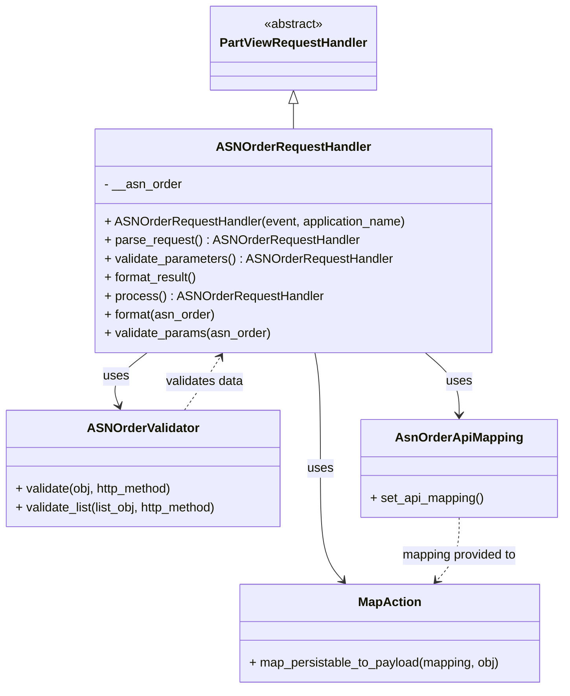

# Diagram: partview_core/partview_service/partview_service/api/asn_order/handlers/asn_order_handler.py


> Auto-generated by Obscura crawlers

## Diagram 1



### SVG

<svg id="container" width="727.875" xmlns="http://www.w3.org/2000/svg" class="classDiagram" height="886" viewBox="0 0 727.875 886" role="graphics-document document" aria-roledescription="class"><style>#container{font-family:"trebuchet ms",verdana,arial,sans-serif;font-size:16px;fill:#333;}@keyframes edge-animation-frame{from{stroke-dashoffset:0;}}@keyframes dash{to{stroke-dashoffset:0;}}#container .edge-animation-slow{stroke-dasharray:9,5!important;stroke-dashoffset:900;animation:dash 50s linear infinite;stroke-linecap:round;}#container .edge-animation-fast{stroke-dasharray:9,5!important;stroke-dashoffset:900;animation:dash 20s linear infinite;stroke-linecap:round;}#container .error-icon{fill:#552222;}#container .error-text{fill:#552222;stroke:#552222;}#container .edge-thickness-normal{stroke-width:1px;}#container .edge-thickness-thick{stroke-width:3.5px;}#container .edge-pattern-solid{stroke-dasharray:0;}#container .edge-thickness-invisible{stroke-width:0;fill:none;}#container .edge-pattern-dashed{stroke-dasharray:3;}#container .edge-pattern-dotted{stroke-dasharray:2;}#container .marker{fill:#333333;stroke:#333333;}#container .marker.cross{stroke:#333333;}#container svg{font-family:"trebuchet ms",verdana,arial,sans-serif;font-size:16px;}#container p{margin:0;}#container g.classGroup text{fill:#9370DB;stroke:none;font-family:"trebuchet ms",verdana,arial,sans-serif;font-size:10px;}#container g.classGroup text .title{font-weight:bolder;}#container .nodeLabel,#container .edgeLabel{color:#131300;}#container .edgeLabel .label rect{fill:#ECECFF;}#container .label text{fill:#131300;}#container .labelBkg{background:#ECECFF;}#container .edgeLabel .label span{background:#ECECFF;}#container .classTitle{font-weight:bolder;}#container .node rect,#container .node circle,#container .node ellipse,#container .node polygon,#container .node path{fill:#ECECFF;stroke:#9370DB;stroke-width:1px;}#container .divider{stroke:#9370DB;stroke-width:1;}#container g.clickable{cursor:pointer;}#container g.classGroup rect{fill:#ECECFF;stroke:#9370DB;}#container g.classGroup line{stroke:#9370DB;stroke-width:1;}#container .classLabel .box{stroke:none;stroke-width:0;fill:#ECECFF;opacity:0.5;}#container .classLabel .label{fill:#9370DB;font-size:10px;}#container .relation{stroke:#333333;stroke-width:1;fill:none;}#container .dashed-line{stroke-dasharray:3;}#container .dotted-line{stroke-dasharray:1 2;}#container #compositionStart,#container .composition{fill:#333333!important;stroke:#333333!important;stroke-width:1;}#container #compositionEnd,#container .composition{fill:#333333!important;stroke:#333333!important;stroke-width:1;}#container #dependencyStart,#container .dependency{fill:#333333!important;stroke:#333333!important;stroke-width:1;}#container #dependencyStart,#container .dependency{fill:#333333!important;stroke:#333333!important;stroke-width:1;}#container #extensionStart,#container .extension{fill:transparent!important;stroke:#333333!important;stroke-width:1;}#container #extensionEnd,#container .extension{fill:transparent!important;stroke:#333333!important;stroke-width:1;}#container #aggregationStart,#container .aggregation{fill:transparent!important;stroke:#333333!important;stroke-width:1;}#container #aggregationEnd,#container .aggregation{fill:transparent!important;stroke:#333333!important;stroke-width:1;}#container #lollipopStart,#container .lollipop{fill:#ECECFF!important;stroke:#333333!important;stroke-width:1;}#container #lollipopEnd,#container .lollipop{fill:#ECECFF!important;stroke:#333333!important;stroke-width:1;}#container .edgeTerminals{font-size:11px;line-height:initial;}#container .classTitleText{text-anchor:middle;font-size:18px;fill:#333;}#container .label-icon{display:inline-block;height:1em;overflow:visible;vertical-align:-0.125em;}#container .node .label-icon path{fill:currentColor;stroke:revert;stroke-width:revert;}#container :root{--mermaid-font-family:"trebuchet ms",verdana,arial,sans-serif;}</style><g><defs><marker id="container_class-aggregationStart" class="marker aggregation class" refX="18" refY="7" markerWidth="190" markerHeight="240" orient="auto"><path d="M 18,7 L9,13 L1,7 L9,1 Z"></path></marker></defs><defs><marker id="container_class-aggregationEnd" class="marker aggregation class" refX="1" refY="7" markerWidth="20" markerHeight="28" orient="auto"><path d="M 18,7 L9,13 L1,7 L9,1 Z"></path></marker></defs><defs><marker id="container_class-extensionStart" class="marker extension class" refX="18" refY="7" markerWidth="190" markerHeight="240" orient="auto"><path d="M 1,7 L18,13 V 1 Z"></path></marker></defs><defs><marker id="container_class-extensionEnd" class="marker extension class" refX="1" refY="7" markerWidth="20" markerHeight="28" orient="auto"><path d="M 1,1 V 13 L18,7 Z"></path></marker></defs><defs><marker id="container_class-compositionStart" class="marker composition class" refX="18" refY="7" markerWidth="190" markerHeight="240" orient="auto"><path d="M 18,7 L9,13 L1,7 L9,1 Z"></path></marker></defs><defs><marker id="container_class-compositionEnd" class="marker composition class" refX="1" refY="7" markerWidth="20" markerHeight="28" orient="auto"><path d="M 18,7 L9,13 L1,7 L9,1 Z"></path></marker></defs><defs><marker id="container_class-dependencyStart" class="marker dependency class" refX="6" refY="7" markerWidth="190" markerHeight="240" orient="auto"><path d="M 5,7 L9,13 L1,7 L9,1 Z"></path></marker></defs><defs><marker id="container_class-dependencyEnd" class="marker dependency class" refX="13" refY="7" markerWidth="20" markerHeight="28" orient="auto"><path d="M 18,7 L9,13 L14,7 L9,1 Z"></path></marker></defs><defs><marker id="container_class-lollipopStart" class="marker lollipop class" refX="13" refY="7" markerWidth="190" markerHeight="240" orient="auto"><circle stroke="black" fill="transparent" cx="7" cy="7" r="6"></circle></marker></defs><defs><marker id="container_class-lollipopEnd" class="marker lollipop class" refX="1" refY="7" markerWidth="190" markerHeight="240" orient="auto"><circle stroke="black" fill="transparent" cx="7" cy="7" r="6"></circle></marker></defs><g class="root"><g class="clusters"></g><g class="edgePaths"><path d="M384.203,133.25L384.203,134.542C384.203,135.833,384.203,138.417,384.203,143.875C384.203,149.333,384.203,157.667,384.203,161.833L384.203,166" id="id_PartViewRequestHandler_ASNOrderRequestHandler_1" class="edge-thickness-normal edge-pattern-solid relation" style=";;;" data-edge="true" data-et="edge" data-id="id_PartViewRequestHandler_ASNOrderRequestHandler_1" data-points="W3sieCI6Mzg0LjIwMzEyNSwieSI6MTE2fSx7IngiOjM4NC4yMDMxMjUsInkiOjE0MX0seyJ4IjozODQuMjAzMTI1LCJ5IjoxNjZ9XQ==" marker-start="url(#container_class-extensionStart)"></path><path d="M193.363,454L185.191,460.167C177.018,466.333,160.673,478.667,154.548,490.069C148.424,501.471,152.519,511.941,154.567,517.177L156.615,522.412" id="id_ASNOrderRequestHandler_ASNOrderValidator_2" class="edge-thickness-normal edge-pattern-solid relation" style=";;;" data-edge="true" data-et="edge" data-id="id_ASNOrderRequestHandler_ASNOrderValidator_2" data-points="W3sieCI6MTkzLjM2MzM0NTk5NDQ3NTE0LCJ5Ijo0NTR9LHsieCI6MTQ0LjMyODEyNSwieSI6NDkxfSx7IngiOjE1OC44MDA2MDY4NjM4MzkyOCwieSI6NTI4fV0=" marker-end="url(#container_class-dependencyEnd)"></path><path d="M552.36,454L559.561,460.167C566.762,466.333,581.164,478.667,588.365,492C595.566,505.333,595.566,519.667,595.566,526.833L595.566,534" id="id_ASNOrderRequestHandler_AsnOrderApiMapping_3" class="edge-thickness-normal edge-pattern-solid relation" style=";;;" data-edge="true" data-et="edge" data-id="id_ASNOrderRequestHandler_AsnOrderApiMapping_3" data-points="W3sieCI6NTUyLjM1OTU0NzY1MTkzMzcsInkiOjQ1NH0seyJ4Ijo1OTUuNTY2NDA2MjUsInkiOjQ5MX0seyJ4Ijo1OTUuNTY2NDA2MjUsInkiOjU0MH1d" marker-end="url(#container_class-dependencyEnd)"></path><path d="M412.496,454L413.708,460.167C414.919,466.333,417.342,478.667,418.554,503.5C419.766,528.333,419.766,565.667,419.766,603C419.766,640.333,419.766,677.667,424.526,701.749C429.286,725.831,438.807,736.662,443.567,742.078L448.328,747.493" id="id_ASNOrderRequestHandler_MapAction_4" class="edge-thickness-normal edge-pattern-solid relation" style=";;;" data-edge="true" data-et="edge" data-id="id_ASNOrderRequestHandler_MapAction_4" data-points="W3sieCI6NDEyLjQ5NTk0MjY3OTU1OCwieSI6NDU0fSx7IngiOjQxOS43NjU2MjUsInkiOjQ5MX0seyJ4Ijo0MTkuNzY1NjI1LCJ5Ijo2MDN9LHsieCI6NDE5Ljc2NTYyNSwieSI6NzE1fSx7IngiOjQ1Mi4yODg3Njk1MzEyNSwieSI6NzUyfV0=" marker-end="url(#container_class-dependencyEnd)"></path><path d="M241.877,528L246.296,521.833C250.714,515.667,259.551,503.333,267.377,491.842C275.202,480.351,282.016,469.703,285.423,464.378L288.83,459.054" id="id_ASNOrderValidator_ASNOrderRequestHandler_5" class="edge-thickness-normal edge-pattern-dashed relation" style=";;;" data-edge="true" data-et="edge" data-id="id_ASNOrderValidator_ASNOrderRequestHandler_5" data-points="W3sieCI6MjQxLjg3Njg2NTkzMTkxOTY0LCJ5Ijo1Mjh9LHsieCI6MjY4LjM4ODY3MTg3NSwieSI6NDkxfSx7IngiOjI5Mi4wNjM0NDk1ODU2MzUzNCwieSI6NDU0fV0=" marker-end="url(#container_class-dependencyEnd)"></path><path d="M595.566,666L595.566,674.167C595.566,682.333,595.566,698.667,590.806,712.249C586.046,725.831,576.525,736.662,571.765,742.078L567.004,747.493" id="id_AsnOrderApiMapping_MapAction_6" class="edge-thickness-normal edge-pattern-dashed relation" style=";;;" data-edge="true" data-et="edge" data-id="id_AsnOrderApiMapping_MapAction_6" data-points="W3sieCI6NTk1LjU2NjQwNjI1LCJ5Ijo2NjZ9LHsieCI6NTk1LjU2NjQwNjI1LCJ5Ijo3MTV9LHsieCI6NTYzLjA0MzI2MTcxODc1LCJ5Ijo3NTJ9XQ==" marker-end="url(#container_class-dependencyEnd)"></path></g><g class="edgeLabels"><g class="edgeLabel"><g class="label" data-id="id_PartViewRequestHandler_ASNOrderRequestHandler_1" transform="translate(0, 0)"><foreignObject width="0" height="0"><div xmlns="http://www.w3.org/1999/xhtml" class="labelBkg" style="display: table-cell; white-space: nowrap; line-height: 1.5; max-width: 200px; text-align: center;"><span class="edgeLabel"></span></div></foreignObject></g></g><g class="edgeLabel" transform="translate(152.98861, 484.46515)"><g class="label" data-id="id_ASNOrderRequestHandler_ASNOrderValidator_2" transform="translate(-16.4921875, -12)"><foreignObject width="32.984375" height="24"><div xmlns="http://www.w3.org/1999/xhtml" class="labelBkg" style="display: table-cell; white-space: nowrap; line-height: 1.5; max-width: 200px; text-align: center;"><span class="edgeLabel"><p>uses</p></span></div></foreignObject></g></g><g class="edgeLabel" transform="translate(595.56640625, 491)"><g class="label" data-id="id_ASNOrderRequestHandler_AsnOrderApiMapping_3" transform="translate(-16.4921875, -12)"><foreignObject width="32.984375" height="24"><div xmlns="http://www.w3.org/1999/xhtml" class="labelBkg" style="display: table-cell; white-space: nowrap; line-height: 1.5; max-width: 200px; text-align: center;"><span class="edgeLabel"><p>uses</p></span></div></foreignObject></g></g><g class="edgeLabel" transform="translate(419.765625, 603)"><g class="label" data-id="id_ASNOrderRequestHandler_MapAction_4" transform="translate(-16.4921875, -12)"><foreignObject width="32.984375" height="24"><div xmlns="http://www.w3.org/1999/xhtml" class="labelBkg" style="display: table-cell; white-space: nowrap; line-height: 1.5; max-width: 200px; text-align: center;"><span class="edgeLabel"><p>uses</p></span></div></foreignObject></g></g><g class="edgeLabel" transform="translate(267.92509, 491.64698)"><g class="label" data-id="id_ASNOrderValidator_ASNOrderRequestHandler_5" transform="translate(-51.125, -12)"><foreignObject width="102.25" height="24"><div xmlns="http://www.w3.org/1999/xhtml" class="labelBkg" style="display: table-cell; white-space: nowrap; line-height: 1.5; max-width: 200px; text-align: center;"><span class="edgeLabel"><p>validates data</p></span></div></foreignObject></g></g><g class="edgeLabel" transform="translate(595.56640625, 715)"><g class="label" data-id="id_AsnOrderApiMapping_MapAction_6" transform="translate(-75.859375, -12)"><foreignObject width="151.71875" height="24"><div xmlns="http://www.w3.org/1999/xhtml" class="labelBkg" style="display: table-cell; white-space: nowrap; line-height: 1.5; max-width: 200px; text-align: center;"><span class="edgeLabel"><p>mapping provided to</p></span></div></foreignObject></g></g></g><g class="nodes"><g class="node default" id="classId-PartViewRequestHandler-0" transform="translate(384.203125, 62)"><g class="basic label-container"><path d="M-103.359375 -54 L103.359375 -54 L103.359375 54 L-103.359375 54" stroke="none" stroke-width="0" fill="#ECECFF" style=""></path><path d="M-103.359375 -54 C-21.749303616339887 -54, 59.860767767320226 -54, 103.359375 -54 M-103.359375 -54 C-60.53407186172947 -54, -17.708768723458945 -54, 103.359375 -54 M103.359375 -54 C103.359375 -17.501031531800592, 103.359375 18.997936936398816, 103.359375 54 M103.359375 -54 C103.359375 -25.636340174929625, 103.359375 2.7273196501407497, 103.359375 54 M103.359375 54 C44.147522993845584 54, -15.064329012308832 54, -103.359375 54 M103.359375 54 C46.69451322721447 54, -9.970348545571056 54, -103.359375 54 M-103.359375 54 C-103.359375 15.121498710521635, -103.359375 -23.75700257895673, -103.359375 -54 M-103.359375 54 C-103.359375 18.7195897857368, -103.359375 -16.560820428526398, -103.359375 -54" stroke="#9370DB" stroke-width="1.3" fill="none" stroke-dasharray="0 0" style=""></path></g><g class="annotation-group text" transform="translate(-38.609375, -30)"><g class="label" style="" transform="translate(0,-12)"><foreignObject width="77.21875" height="24"><div xmlns="http://www.w3.org/1999/xhtml" style="display: table-cell; white-space: nowrap; line-height: 1.5; max-width: 127px; text-align: center;"><span class="nodeLabel markdown-node-label" style=""><p>«abstract»</p></span></div></foreignObject></g></g><g class="label-group text" transform="translate(-91.359375, -6)"><g class="label" style="font-weight: bolder" transform="translate(0,-12)"><foreignObject width="182.71875" height="24"><div xmlns="http://www.w3.org/1999/xhtml" style="display: table-cell; white-space: nowrap; line-height: 1.5; max-width: 231px; text-align: center;"><span class="nodeLabel markdown-node-label" style=""><p>PartViewRequestHandler</p></span></div></foreignObject></g></g><g class="members-group text" transform="translate(-91.359375, 42)"></g><g class="methods-group text" transform="translate(-91.359375, 72)"></g><g class="divider" style=""><path d="M-103.359375 18 C-48.08759137355604 18, 7.184192252887925 18, 103.359375 18 M-103.359375 18 C-23.414105869933636 18, 56.53116326013273 18, 103.359375 18" stroke="#9370DB" stroke-width="1.3" fill="none" stroke-dasharray="0 0" style=""></path></g><g class="divider" style=""><path d="M-103.359375 36 C-57.65029023866883 36, -11.941205477337661 36, 103.359375 36 M-103.359375 36 C-56.06498773081955 36, -8.770600461639106 36, 103.359375 36" stroke="#9370DB" stroke-width="1.3" fill="none" stroke-dasharray="0 0" style=""></path></g></g><g class="node default" id="classId-ASNOrderRequestHandler-1" transform="translate(384.203125, 310)"><g class="basic label-container"><path d="M-253.84765625 -144 L253.84765625 -144 L253.84765625 144 L-253.84765625 144" stroke="none" stroke-width="0" fill="#ECECFF" style=""></path><path d="M-253.84765625 -144 C-63.65956287374499 -144, 126.52853050251002 -144, 253.84765625 -144 M-253.84765625 -144 C-144.26380157139064 -144, -34.67994689278129 -144, 253.84765625 -144 M253.84765625 -144 C253.84765625 -72.1586963127063, 253.84765625 -0.3173926254125945, 253.84765625 144 M253.84765625 -144 C253.84765625 -60.39638733012181, 253.84765625 23.207225339756377, 253.84765625 144 M253.84765625 144 C150.3433232209593 144, 46.838990191918555 144, -253.84765625 144 M253.84765625 144 C120.87440762581525 144, -12.098840998369496 144, -253.84765625 144 M-253.84765625 144 C-253.84765625 76.42951578188583, -253.84765625 8.859031563771651, -253.84765625 -144 M-253.84765625 144 C-253.84765625 39.28427362240534, -253.84765625 -65.43145275518933, -253.84765625 -144" stroke="#9370DB" stroke-width="1.3" fill="none" stroke-dasharray="0 0" style=""></path></g><g class="annotation-group text" transform="translate(0, -120)"></g><g class="label-group text" transform="translate(-94.5859375, -120)"><g class="label" style="font-weight: bolder" transform="translate(0,-12)"><foreignObject width="189.171875" height="24"><div xmlns="http://www.w3.org/1999/xhtml" style="display: table-cell; white-space: nowrap; line-height: 1.5; max-width: 238px; text-align: center;"><span class="nodeLabel markdown-node-label" style=""><p>ASNOrderRequestHandler</p></span></div></foreignObject></g></g><g class="members-group text" transform="translate(-241.84765625, -72)"><g class="label" style="" transform="translate(0,-12)"><foreignObject width="99.75" height="24"><div xmlns="http://www.w3.org/1999/xhtml" style="display: table-cell; white-space: nowrap; line-height: 1.5; max-width: 158px; text-align: center;"><span class="nodeLabel markdown-node-label" style=""><p>- __asn_order</p></span></div></foreignObject></g></g><g class="methods-group text" transform="translate(-241.84765625, -24)"><g class="label" style="" transform="translate(0,-12)"><foreignObject width="389.109375" height="24"><div xmlns="http://www.w3.org/1999/xhtml" style="display: table-cell; white-space: nowrap; line-height: 1.5; max-width: 446px; text-align: center;"><span class="nodeLabel markdown-node-label" style=""><p>+ ASNOrderRequestHandler(event, application_name)</p></span></div></foreignObject></g><g class="label" style="" transform="translate(0,12)"><foreignObject width="325.453125" height="24"><div xmlns="http://www.w3.org/1999/xhtml" style="display: table-cell; white-space: nowrap; line-height: 1.5; max-width: 384px; text-align: center;"><span class="nodeLabel markdown-node-label" style=""><p>+ parse_request() : ASNOrderRequestHandler</p></span></div></foreignObject></g><g class="label" style="" transform="translate(0,36)"><foreignObject width="370.359375" height="24"><div xmlns="http://www.w3.org/1999/xhtml" style="display: table-cell; white-space: nowrap; line-height: 1.5; max-width: 429px; text-align: center;"><span class="nodeLabel markdown-node-label" style=""><p>+ validate_parameters() : ASNOrderRequestHandler</p></span></div></foreignObject></g><g class="label" style="" transform="translate(0,60)"><foreignObject width="121.5" height="24"><div xmlns="http://www.w3.org/1999/xhtml" style="display: table-cell; white-space: nowrap; line-height: 1.5; max-width: 179px; text-align: center;"><span class="nodeLabel markdown-node-label" style=""><p>+ format_result()</p></span></div></foreignObject></g><g class="label" style="" transform="translate(0,84)"><foreignObject width="277.390625" height="24"><div xmlns="http://www.w3.org/1999/xhtml" style="display: table-cell; white-space: nowrap; line-height: 1.5; max-width: 336px; text-align: center;"><span class="nodeLabel markdown-node-label" style=""><p>+ process() : ASNOrderRequestHandler</p></span></div></foreignObject></g><g class="label" style="" transform="translate(0,108)"><foreignObject width="144.40625" height="24"><div xmlns="http://www.w3.org/1999/xhtml" style="display: table-cell; white-space: nowrap; line-height: 1.5; max-width: 202px; text-align: center;"><span class="nodeLabel markdown-node-label" style=""><p>+ format(asn_order)</p></span></div></foreignObject></g><g class="label" style="" transform="translate(0,132)"><foreignObject width="214.9375" height="24"><div xmlns="http://www.w3.org/1999/xhtml" style="display: table-cell; white-space: nowrap; line-height: 1.5; max-width: 272px; text-align: center;"><span class="nodeLabel markdown-node-label" style=""><p>+ validate_params(asn_order)</p></span></div></foreignObject></g></g><g class="divider" style=""><path d="M-253.84765625 -96 C-142.16966037605738 -96, -30.491664502114787 -96, 253.84765625 -96 M-253.84765625 -96 C-51.80340322437996 -96, 150.24084980124007 -96, 253.84765625 -96" stroke="#9370DB" stroke-width="1.3" fill="none" stroke-dasharray="0 0" style=""></path></g><g class="divider" style=""><path d="M-253.84765625 -48 C-98.18172572182195 -48, 57.484204806356104 -48, 253.84765625 -48 M-253.84765625 -48 C-94.92798924914135 -48, 63.991677751717305 -48, 253.84765625 -48" stroke="#9370DB" stroke-width="1.3" fill="none" stroke-dasharray="0 0" style=""></path></g></g><g class="node default" id="classId-ASNOrderValidator-2" transform="translate(188.13671875, 603)"><g class="basic label-container"><path d="M-180.13671875 -75 L180.13671875 -75 L180.13671875 75 L-180.13671875 75" stroke="none" stroke-width="0" fill="#ECECFF" style=""></path><path d="M-180.13671875 -75 C-65.14422179087788 -75, 49.84827516824424 -75, 180.13671875 -75 M-180.13671875 -75 C-48.16203218444437 -75, 83.81265438111126 -75, 180.13671875 -75 M180.13671875 -75 C180.13671875 -25.427305758874716, 180.13671875 24.145388482250567, 180.13671875 75 M180.13671875 -75 C180.13671875 -15.802691326029588, 180.13671875 43.39461734794082, 180.13671875 75 M180.13671875 75 C91.83562118239465 75, 3.5345236147892933 75, -180.13671875 75 M180.13671875 75 C62.86121562640402 75, -54.414287497191964 75, -180.13671875 75 M-180.13671875 75 C-180.13671875 22.64232936821402, -180.13671875 -29.715341263571958, -180.13671875 -75 M-180.13671875 75 C-180.13671875 32.371956948020845, -180.13671875 -10.25608610395831, -180.13671875 -75" stroke="#9370DB" stroke-width="1.3" fill="none" stroke-dasharray="0 0" style=""></path></g><g class="annotation-group text" transform="translate(0, -51)"></g><g class="label-group text" transform="translate(-68.7109375, -51)"><g class="label" style="font-weight: bolder" transform="translate(0,-12)"><foreignObject width="137.421875" height="24"><div xmlns="http://www.w3.org/1999/xhtml" style="display: table-cell; white-space: nowrap; line-height: 1.5; max-width: 186px; text-align: center;"><span class="nodeLabel markdown-node-label" style=""><p>ASNOrderValidator</p></span></div></foreignObject></g></g><g class="members-group text" transform="translate(-168.13671875, -3)"></g><g class="methods-group text" transform="translate(-168.13671875, 27)"><g class="label" style="" transform="translate(0,-12)"><foreignObject width="206.828125" height="24"><div xmlns="http://www.w3.org/1999/xhtml" style="display: table-cell; white-space: nowrap; line-height: 1.5; max-width: 264px; text-align: center;"><span class="nodeLabel markdown-node-label" style=""><p>+ validate(obj, http_method)</p></span></div></foreignObject></g><g class="label" style="" transform="translate(0,12)"><foreignObject width="267.5625" height="24"><div xmlns="http://www.w3.org/1999/xhtml" style="display: table-cell; white-space: nowrap; line-height: 1.5; max-width: 325px; text-align: center;"><span class="nodeLabel markdown-node-label" style=""><p>+ validate_list(list_obj, http_method)</p></span></div></foreignObject></g></g><g class="divider" style=""><path d="M-180.13671875 -27 C-87.12256278071976 -27, 5.891593188560478 -27, 180.13671875 -27 M-180.13671875 -27 C-68.83310890090146 -27, 42.47050094819707 -27, 180.13671875 -27" stroke="#9370DB" stroke-width="1.3" fill="none" stroke-dasharray="0 0" style=""></path></g><g class="divider" style=""><path d="M-180.13671875 -3 C-103.81877416070444 -3, -27.50082957140887 -3, 180.13671875 -3 M-180.13671875 -3 C-102.10233963466858 -3, -24.067960519337163 -3, 180.13671875 -3" stroke="#9370DB" stroke-width="1.3" fill="none" stroke-dasharray="0 0" style=""></path></g></g><g class="node default" id="classId-AsnOrderApiMapping-3" transform="translate(595.56640625, 603)"><g class="basic label-container"><path d="M-124.30859375 -63 L124.30859375 -63 L124.30859375 63 L-124.30859375 63" stroke="none" stroke-width="0" fill="#ECECFF" style=""></path><path d="M-124.30859375 -63 C-24.908108660579217 -63, 74.49237642884157 -63, 124.30859375 -63 M-124.30859375 -63 C-37.70676277903665 -63, 48.8950681919267 -63, 124.30859375 -63 M124.30859375 -63 C124.30859375 -15.166617675107759, 124.30859375 32.66676464978448, 124.30859375 63 M124.30859375 -63 C124.30859375 -32.576370905698916, 124.30859375 -2.1527418113978314, 124.30859375 63 M124.30859375 63 C73.91200372085173 63, 23.515413691703458 63, -124.30859375 63 M124.30859375 63 C48.94021358671107 63, -26.428166576577865 63, -124.30859375 63 M-124.30859375 63 C-124.30859375 16.734987817153545, -124.30859375 -29.53002436569291, -124.30859375 -63 M-124.30859375 63 C-124.30859375 18.61874402079048, -124.30859375 -25.76251195841904, -124.30859375 -63" stroke="#9370DB" stroke-width="1.3" fill="none" stroke-dasharray="0 0" style=""></path></g><g class="annotation-group text" transform="translate(0, -39)"></g><g class="label-group text" transform="translate(-77.3828125, -39)"><g class="label" style="font-weight: bolder" transform="translate(0,-12)"><foreignObject width="154.765625" height="24"><div xmlns="http://www.w3.org/1999/xhtml" style="display: table-cell; white-space: nowrap; line-height: 1.5; max-width: 203px; text-align: center;"><span class="nodeLabel markdown-node-label" style=""><p>AsnOrderApiMapping</p></span></div></foreignObject></g></g><g class="members-group text" transform="translate(-112.30859375, 9)"></g><g class="methods-group text" transform="translate(-112.30859375, 39)"><g class="label" style="" transform="translate(0,-12)"><foreignObject width="147.234375" height="24"><div xmlns="http://www.w3.org/1999/xhtml" style="display: table-cell; white-space: nowrap; line-height: 1.5; max-width: 205px; text-align: center;"><span class="nodeLabel markdown-node-label" style=""><p>+ set_api_mapping()</p></span></div></foreignObject></g></g><g class="divider" style=""><path d="M-124.30859375 -15 C-40.52874158457357 -15, 43.25111058085287 -15, 124.30859375 -15 M-124.30859375 -15 C-47.23549663087964 -15, 29.837600488240724 -15, 124.30859375 -15" stroke="#9370DB" stroke-width="1.3" fill="none" stroke-dasharray="0 0" style=""></path></g><g class="divider" style=""><path d="M-124.30859375 9 C-40.892543211722156 9, 42.52350732655569 9, 124.30859375 9 M-124.30859375 9 C-58.97575494026012 9, 6.357083869479766 9, 124.30859375 9" stroke="#9370DB" stroke-width="1.3" fill="none" stroke-dasharray="0 0" style=""></path></g></g><g class="node default" id="classId-MapAction-4" transform="translate(507.666015625, 815)"><g class="basic label-container"><path d="M-194.66015625 -63 L194.66015625 -63 L194.66015625 63 L-194.66015625 63" stroke="none" stroke-width="0" fill="#ECECFF" style=""></path><path d="M-194.66015625 -63 C-74.2338455904471 -63, 46.19246506910579 -63, 194.66015625 -63 M-194.66015625 -63 C-114.66909954168517 -63, -34.67804283337034 -63, 194.66015625 -63 M194.66015625 -63 C194.66015625 -30.142196698706336, 194.66015625 2.7156066025873287, 194.66015625 63 M194.66015625 -63 C194.66015625 -32.240570366508905, 194.66015625 -1.48114073301781, 194.66015625 63 M194.66015625 63 C58.29410295782915 63, -78.0719503343417 63, -194.66015625 63 M194.66015625 63 C85.87053211648725 63, -22.91909201702549 63, -194.66015625 63 M-194.66015625 63 C-194.66015625 28.115166185116827, -194.66015625 -6.769667629766346, -194.66015625 -63 M-194.66015625 63 C-194.66015625 32.399170087051104, -194.66015625 1.7983401741022078, -194.66015625 -63" stroke="#9370DB" stroke-width="1.3" fill="none" stroke-dasharray="0 0" style=""></path></g><g class="annotation-group text" transform="translate(0, -39)"></g><g class="label-group text" transform="translate(-38.6328125, -39)"><g class="label" style="font-weight: bolder" transform="translate(0,-12)"><foreignObject width="77.265625" height="24"><div xmlns="http://www.w3.org/1999/xhtml" style="display: table-cell; white-space: nowrap; line-height: 1.5; max-width: 126px; text-align: center;"><span class="nodeLabel markdown-node-label" style=""><p>MapAction</p></span></div></foreignObject></g></g><g class="members-group text" transform="translate(-182.66015625, 9)"></g><g class="methods-group text" transform="translate(-182.66015625, 39)"><g class="label" style="" transform="translate(0,-12)"><foreignObject width="326.6875" height="24"><div xmlns="http://www.w3.org/1999/xhtml" style="display: table-cell; white-space: nowrap; line-height: 1.5; max-width: 384px; text-align: center;"><span class="nodeLabel markdown-node-label" style=""><p>+ map_persistable_to_payload(mapping, obj)</p></span></div></foreignObject></g></g><g class="divider" style=""><path d="M-194.66015625 -15 C-59.144328869698654 -15, 76.37149851060269 -15, 194.66015625 -15 M-194.66015625 -15 C-113.60722464105496 -15, -32.55429303210991 -15, 194.66015625 -15" stroke="#9370DB" stroke-width="1.3" fill="none" stroke-dasharray="0 0" style=""></path></g><g class="divider" style=""><path d="M-194.66015625 9 C-92.59811535713523 9, 9.463925535729544 9, 194.66015625 9 M-194.66015625 9 C-87.76073171163071 9, 19.138692826738577 9, 194.66015625 9" stroke="#9370DB" stroke-width="1.3" fill="none" stroke-dasharray="0 0" style=""></path></g></g></g></g></g></svg>

## Diagram 2

```mermaid
flowchart TD
    A[Incoming Request] --> B[ASNOrderRequestHandler.__init__]
    B --> C[parse_request()]
    C --> D{__asn_order present?}
    D -- Yes --> E[validate_parameters()]
    E --> F[ASNOrderValidator.validate(...) or validate_list(...)]
    F --> G[process()]
    G --> H[format_result() -> MapAction.map_persistable_to_payload]
    H --> I[200 OK with payload]
    D -- No --> J[format_result() returns {}, 404]
    J --> K[404 Not Found]
```

> SVG rendering failed for this diagram.
