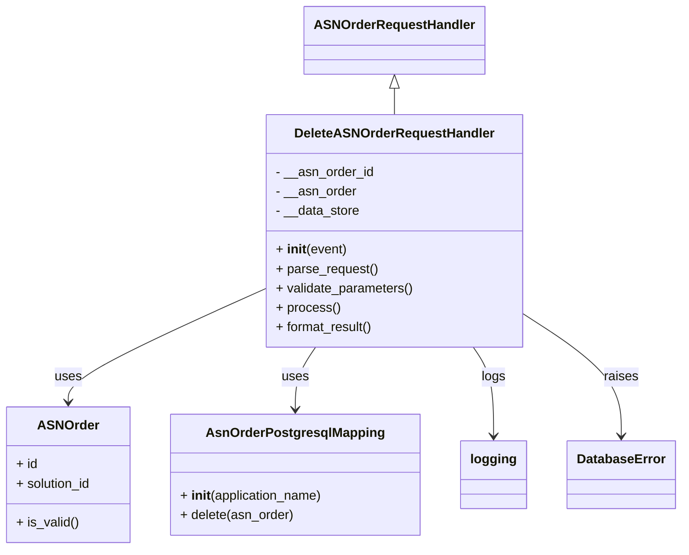

# Diagram: partview_core/partview_service/partview_service/api/asn_order/handlers/delete_asn_order.py


> Auto-generated by Obscura crawlers

## Diagram 1



### SVG

<svg id="container" width="833.421875" xmlns="http://www.w3.org/2000/svg" class="classDiagram" height="680" viewBox="0 0 833.421875 680" role="graphics-document document" aria-roledescription="class"><style>#container{font-family:"trebuchet ms",verdana,arial,sans-serif;font-size:16px;fill:#333;}@keyframes edge-animation-frame{from{stroke-dashoffset:0;}}@keyframes dash{to{stroke-dashoffset:0;}}#container .edge-animation-slow{stroke-dasharray:9,5!important;stroke-dashoffset:900;animation:dash 50s linear infinite;stroke-linecap:round;}#container .edge-animation-fast{stroke-dasharray:9,5!important;stroke-dashoffset:900;animation:dash 20s linear infinite;stroke-linecap:round;}#container .error-icon{fill:#552222;}#container .error-text{fill:#552222;stroke:#552222;}#container .edge-thickness-normal{stroke-width:1px;}#container .edge-thickness-thick{stroke-width:3.5px;}#container .edge-pattern-solid{stroke-dasharray:0;}#container .edge-thickness-invisible{stroke-width:0;fill:none;}#container .edge-pattern-dashed{stroke-dasharray:3;}#container .edge-pattern-dotted{stroke-dasharray:2;}#container .marker{fill:#333333;stroke:#333333;}#container .marker.cross{stroke:#333333;}#container svg{font-family:"trebuchet ms",verdana,arial,sans-serif;font-size:16px;}#container p{margin:0;}#container g.classGroup text{fill:#9370DB;stroke:none;font-family:"trebuchet ms",verdana,arial,sans-serif;font-size:10px;}#container g.classGroup text .title{font-weight:bolder;}#container .nodeLabel,#container .edgeLabel{color:#131300;}#container .edgeLabel .label rect{fill:#ECECFF;}#container .label text{fill:#131300;}#container .labelBkg{background:#ECECFF;}#container .edgeLabel .label span{background:#ECECFF;}#container .classTitle{font-weight:bolder;}#container .node rect,#container .node circle,#container .node ellipse,#container .node polygon,#container .node path{fill:#ECECFF;stroke:#9370DB;stroke-width:1px;}#container .divider{stroke:#9370DB;stroke-width:1;}#container g.clickable{cursor:pointer;}#container g.classGroup rect{fill:#ECECFF;stroke:#9370DB;}#container g.classGroup line{stroke:#9370DB;stroke-width:1;}#container .classLabel .box{stroke:none;stroke-width:0;fill:#ECECFF;opacity:0.5;}#container .classLabel .label{fill:#9370DB;font-size:10px;}#container .relation{stroke:#333333;stroke-width:1;fill:none;}#container .dashed-line{stroke-dasharray:3;}#container .dotted-line{stroke-dasharray:1 2;}#container #compositionStart,#container .composition{fill:#333333!important;stroke:#333333!important;stroke-width:1;}#container #compositionEnd,#container .composition{fill:#333333!important;stroke:#333333!important;stroke-width:1;}#container #dependencyStart,#container .dependency{fill:#333333!important;stroke:#333333!important;stroke-width:1;}#container #dependencyStart,#container .dependency{fill:#333333!important;stroke:#333333!important;stroke-width:1;}#container #extensionStart,#container .extension{fill:transparent!important;stroke:#333333!important;stroke-width:1;}#container #extensionEnd,#container .extension{fill:transparent!important;stroke:#333333!important;stroke-width:1;}#container #aggregationStart,#container .aggregation{fill:transparent!important;stroke:#333333!important;stroke-width:1;}#container #aggregationEnd,#container .aggregation{fill:transparent!important;stroke:#333333!important;stroke-width:1;}#container #lollipopStart,#container .lollipop{fill:#ECECFF!important;stroke:#333333!important;stroke-width:1;}#container #lollipopEnd,#container .lollipop{fill:#ECECFF!important;stroke:#333333!important;stroke-width:1;}#container .edgeTerminals{font-size:11px;line-height:initial;}#container .classTitleText{text-anchor:middle;font-size:18px;fill:#333;}#container .label-icon{display:inline-block;height:1em;overflow:visible;vertical-align:-0.125em;}#container .node .label-icon path{fill:currentColor;stroke:revert;stroke-width:revert;}#container :root{--mermaid-font-family:"trebuchet ms",verdana,arial,sans-serif;}</style><g><defs><marker id="container_class-aggregationStart" class="marker aggregation class" refX="18" refY="7" markerWidth="190" markerHeight="240" orient="auto"><path d="M 18,7 L9,13 L1,7 L9,1 Z"></path></marker></defs><defs><marker id="container_class-aggregationEnd" class="marker aggregation class" refX="1" refY="7" markerWidth="20" markerHeight="28" orient="auto"><path d="M 18,7 L9,13 L1,7 L9,1 Z"></path></marker></defs><defs><marker id="container_class-extensionStart" class="marker extension class" refX="18" refY="7" markerWidth="190" markerHeight="240" orient="auto"><path d="M 1,7 L18,13 V 1 Z"></path></marker></defs><defs><marker id="container_class-extensionEnd" class="marker extension class" refX="1" refY="7" markerWidth="20" markerHeight="28" orient="auto"><path d="M 1,1 V 13 L18,7 Z"></path></marker></defs><defs><marker id="container_class-compositionStart" class="marker composition class" refX="18" refY="7" markerWidth="190" markerHeight="240" orient="auto"><path d="M 18,7 L9,13 L1,7 L9,1 Z"></path></marker></defs><defs><marker id="container_class-compositionEnd" class="marker composition class" refX="1" refY="7" markerWidth="20" markerHeight="28" orient="auto"><path d="M 18,7 L9,13 L1,7 L9,1 Z"></path></marker></defs><defs><marker id="container_class-dependencyStart" class="marker dependency class" refX="6" refY="7" markerWidth="190" markerHeight="240" orient="auto"><path d="M 5,7 L9,13 L1,7 L9,1 Z"></path></marker></defs><defs><marker id="container_class-dependencyEnd" class="marker dependency class" refX="13" refY="7" markerWidth="20" markerHeight="28" orient="auto"><path d="M 18,7 L9,13 L14,7 L9,1 Z"></path></marker></defs><defs><marker id="container_class-lollipopStart" class="marker lollipop class" refX="13" refY="7" markerWidth="190" markerHeight="240" orient="auto"><circle stroke="black" fill="transparent" cx="7" cy="7" r="6"></circle></marker></defs><defs><marker id="container_class-lollipopEnd" class="marker lollipop class" refX="1" refY="7" markerWidth="190" markerHeight="240" orient="auto"><circle stroke="black" fill="transparent" cx="7" cy="7" r="6"></circle></marker></defs><g class="root"><g class="clusters"></g><g class="edgePaths"><path d="M486.412,109.25L486.412,110.542C486.412,111.833,486.412,114.417,486.412,119.875C486.412,125.333,486.412,133.667,486.412,137.833L486.412,142" id="id_ASNOrderRequestHandler_DeleteASNOrderRequestHandler_1" class="edge-thickness-normal edge-pattern-solid relation" style=";;;" data-edge="true" data-et="edge" data-id="id_ASNOrderRequestHandler_DeleteASNOrderRequestHandler_1" data-points="W3sieCI6NDg2LjQxMjEwOTM3NSwieSI6OTJ9LHsieCI6NDg2LjQxMjEwOTM3NSwieSI6MTE3fSx7IngiOjQ4Ni40MTIxMDkzNzUsInkiOjE0Mn1d" marker-start="url(#container_class-extensionStart)"></path><path d="M329.775,356.627L288.978,375.022C248.18,393.418,166.584,430.209,125.786,453.771C84.988,477.333,84.988,487.667,84.988,492.833L84.988,498" id="id_DeleteASNOrderRequestHandler_ASNOrder_2" class="edge-thickness-normal edge-pattern-solid relation" style=";;;" data-edge="true" data-et="edge" data-id="id_DeleteASNOrderRequestHandler_ASNOrder_2" data-points="W3sieCI6MzI5Ljc3NTM5MDYyNSwieSI6MzU2LjYyNjcxNDQ3ODI0ODh9LHsieCI6ODQuOTg4MjgxMjUsInkiOjQ2N30seyJ4Ijo4NC45ODgyODEyNSwieSI6NTA0fV0=" marker-end="url(#container_class-dependencyEnd)"></path><path d="M390.002,430L385.874,436.167C381.745,442.333,373.488,454.667,369.359,467.5C365.23,480.333,365.23,493.667,365.23,500.333L365.23,507" id="id_DeleteASNOrderRequestHandler_AsnOrderPostgresqlMapping_3" class="edge-thickness-normal edge-pattern-solid relation" style=";;;" data-edge="true" data-et="edge" data-id="id_DeleteASNOrderRequestHandler_AsnOrderPostgresqlMapping_3" data-points="W3sieCI6MzkwLjAwMjQwNjMzNjMyNiwieSI6NDMwfSx7IngiOjM2NS4yMzA0Njg3NSwieSI6NDY3fSx7IngiOjM2NS4yMzA0Njg3NSwieSI6NTEzfV0=" marker-end="url(#container_class-dependencyEnd)"></path><path d="M582.822,430L586.95,436.167C591.079,442.333,599.336,454.667,603.465,473C607.594,491.333,607.594,515.667,607.594,527.833L607.594,540" id="id_DeleteASNOrderRequestHandler_logging_4" class="edge-thickness-normal edge-pattern-solid relation" style=";;;" data-edge="true" data-et="edge" data-id="id_DeleteASNOrderRequestHandler_logging_4" data-points="W3sieCI6NTgyLjgyMTgxMjQxMzY3NCwieSI6NDMwfSx7IngiOjYwNy41OTM3NSwieSI6NDY3fSx7IngiOjYwNy41OTM3NSwieSI6NTQ2fV0=" marker-end="url(#container_class-dependencyEnd)"></path><path d="M643.049,389.227L662.718,402.189C682.387,415.151,721.725,441.076,741.394,466.204C761.063,491.333,761.063,515.667,761.063,527.833L761.063,540" id="id_DeleteASNOrderRequestHandler_DatabaseError_5" class="edge-thickness-normal edge-pattern-solid relation" style=";;;" data-edge="true" data-et="edge" data-id="id_DeleteASNOrderRequestHandler_DatabaseError_5" data-points="W3sieCI6NjQzLjA0ODgyODEyNSwieSI6Mzg5LjIyNjY3MzExNDI1NzQ0fSx7IngiOjc2MS4wNjI1LCJ5Ijo0Njd9LHsieCI6NzYxLjA2MjUsInkiOjU0Nn1d" marker-end="url(#container_class-dependencyEnd)"></path></g><g class="edgeLabels"><g class="edgeLabel"><g class="label" data-id="id_ASNOrderRequestHandler_DeleteASNOrderRequestHandler_1" transform="translate(0, 0)"><foreignObject width="0" height="0"><div xmlns="http://www.w3.org/1999/xhtml" class="labelBkg" style="display: table-cell; white-space: nowrap; line-height: 1.5; max-width: 200px; text-align: center;"><span class="edgeLabel"></span></div></foreignObject></g></g><g class="edgeLabel" transform="translate(84.98828125, 467)"><g class="label" data-id="id_DeleteASNOrderRequestHandler_ASNOrder_2" transform="translate(-16.4921875, -12)"><foreignObject width="32.984375" height="24"><div xmlns="http://www.w3.org/1999/xhtml" class="labelBkg" style="display: table-cell; white-space: nowrap; line-height: 1.5; max-width: 200px; text-align: center;"><span class="edgeLabel"><p>uses</p></span></div></foreignObject></g></g><g class="edgeLabel" transform="translate(365.23046875, 467)"><g class="label" data-id="id_DeleteASNOrderRequestHandler_AsnOrderPostgresqlMapping_3" transform="translate(-16.4921875, -12)"><foreignObject width="32.984375" height="24"><div xmlns="http://www.w3.org/1999/xhtml" class="labelBkg" style="display: table-cell; white-space: nowrap; line-height: 1.5; max-width: 200px; text-align: center;"><span class="edgeLabel"><p>uses</p></span></div></foreignObject></g></g><g class="edgeLabel" transform="translate(607.59375, 467)"><g class="label" data-id="id_DeleteASNOrderRequestHandler_logging_4" transform="translate(-14.8203125, -12)"><foreignObject width="29.640625" height="24"><div xmlns="http://www.w3.org/1999/xhtml" class="labelBkg" style="display: table-cell; white-space: nowrap; line-height: 1.5; max-width: 200px; text-align: center;"><span class="edgeLabel"><p>logs</p></span></div></foreignObject></g></g><g class="edgeLabel" transform="translate(761.0625, 467)"><g class="label" data-id="id_DeleteASNOrderRequestHandler_DatabaseError_5" transform="translate(-21.25, -12)"><foreignObject width="42.5" height="24"><div xmlns="http://www.w3.org/1999/xhtml" class="labelBkg" style="display: table-cell; white-space: nowrap; line-height: 1.5; max-width: 200px; text-align: center;"><span class="edgeLabel"><p>raises</p></span></div></foreignObject></g></g></g><g class="nodes"><g class="node default" id="classId-ASNOrderRequestHandler-0" transform="translate(486.412109375, 50)"><g class="basic label-container"><path d="M-106.5859375 -42 L106.5859375 -42 L106.5859375 42 L-106.5859375 42" stroke="none" stroke-width="0" fill="#ECECFF" style=""></path><path d="M-106.5859375 -42 C-63.7764361741576 -42, -20.966934848315205 -42, 106.5859375 -42 M-106.5859375 -42 C-40.39276946583348 -42, 25.800398568333037 -42, 106.5859375 -42 M106.5859375 -42 C106.5859375 -9.521687784766534, 106.5859375 22.95662443046693, 106.5859375 42 M106.5859375 -42 C106.5859375 -20.003229447137734, 106.5859375 1.9935411057245318, 106.5859375 42 M106.5859375 42 C59.31944440731921 42, 12.05295131463842 42, -106.5859375 42 M106.5859375 42 C47.147430255119716 42, -12.291076989760569 42, -106.5859375 42 M-106.5859375 42 C-106.5859375 11.085344990363513, -106.5859375 -19.829310019272974, -106.5859375 -42 M-106.5859375 42 C-106.5859375 17.31931645947508, -106.5859375 -7.361367081049842, -106.5859375 -42" stroke="#9370DB" stroke-width="1.3" fill="none" stroke-dasharray="0 0" style=""></path></g><g class="annotation-group text" transform="translate(0, -18)"></g><g class="label-group text" transform="translate(-94.5859375, -18)"><g class="label" style="font-weight: bolder" transform="translate(0,-12)"><foreignObject width="189.171875" height="24"><div xmlns="http://www.w3.org/1999/xhtml" style="display: table-cell; white-space: nowrap; line-height: 1.5; max-width: 238px; text-align: center;"><span class="nodeLabel markdown-node-label" style=""><p>ASNOrderRequestHandler</p></span></div></foreignObject></g></g><g class="members-group text" transform="translate(-94.5859375, 30)"></g><g class="methods-group text" transform="translate(-94.5859375, 60)"></g><g class="divider" style=""><path d="M-106.5859375 6 C-44.15372045533179 6, 18.278496589336413 6, 106.5859375 6 M-106.5859375 6 C-47.30567400669793 6, 11.974589486604145 6, 106.5859375 6" stroke="#9370DB" stroke-width="1.3" fill="none" stroke-dasharray="0 0" style=""></path></g><g class="divider" style=""><path d="M-106.5859375 24 C-28.471338501528763 24, 49.643260496942474 24, 106.5859375 24 M-106.5859375 24 C-38.29982365200431 24, 29.986290195991387 24, 106.5859375 24" stroke="#9370DB" stroke-width="1.3" fill="none" stroke-dasharray="0 0" style=""></path></g></g><g class="node default" id="classId-DeleteASNOrderRequestHandler-1" transform="translate(486.412109375, 286)"><g class="basic label-container"><path d="M-156.63671875 -144 L156.63671875 -144 L156.63671875 144 L-156.63671875 144" stroke="none" stroke-width="0" fill="#ECECFF" style=""></path><path d="M-156.63671875 -144 C-64.40653635686574 -144, 27.823646036268514 -144, 156.63671875 -144 M-156.63671875 -144 C-46.77567488467568 -144, 63.08536898064864 -144, 156.63671875 -144 M156.63671875 -144 C156.63671875 -47.49348167445103, 156.63671875 49.013036651097934, 156.63671875 144 M156.63671875 -144 C156.63671875 -64.39911706493152, 156.63671875 15.201765870136967, 156.63671875 144 M156.63671875 144 C42.60587180910488 144, -71.42497513179023 144, -156.63671875 144 M156.63671875 144 C85.66757839518016 144, 14.698438040360315 144, -156.63671875 144 M-156.63671875 144 C-156.63671875 30.66991940850866, -156.63671875 -82.66016118298268, -156.63671875 -144 M-156.63671875 144 C-156.63671875 31.283720023539004, -156.63671875 -81.43255995292199, -156.63671875 -144" stroke="#9370DB" stroke-width="1.3" fill="none" stroke-dasharray="0 0" style=""></path></g><g class="annotation-group text" transform="translate(0, -120)"></g><g class="label-group text" transform="translate(-118.3203125, -120)"><g class="label" style="font-weight: bolder" transform="translate(0,-12)"><foreignObject width="236.640625" height="24"><div xmlns="http://www.w3.org/1999/xhtml" style="display: table-cell; white-space: nowrap; line-height: 1.5; max-width: 285px; text-align: center;"><span class="nodeLabel markdown-node-label" style=""><p>DeleteASNOrderRequestHandler</p></span></div></foreignObject></g></g><g class="members-group text" transform="translate(-144.63671875, -72)"><g class="label" style="" transform="translate(0,-12)"><foreignObject width="120.875" height="24"><div xmlns="http://www.w3.org/1999/xhtml" style="display: table-cell; white-space: nowrap; line-height: 1.5; max-width: 178px; text-align: center;"><span class="nodeLabel markdown-node-label" style=""><p>- __asn_order_id</p></span></div></foreignObject></g><g class="label" style="" transform="translate(0,12)"><foreignObject width="99.75" height="24"><div xmlns="http://www.w3.org/1999/xhtml" style="display: table-cell; white-space: nowrap; line-height: 1.5; max-width: 158px; text-align: center;"><span class="nodeLabel markdown-node-label" style=""><p>- __asn_order</p></span></div></foreignObject></g><g class="label" style="" transform="translate(0,36)"><foreignObject width="104.578125" height="24"><div xmlns="http://www.w3.org/1999/xhtml" style="display: table-cell; white-space: nowrap; line-height: 1.5; max-width: 162px; text-align: center;"><span class="nodeLabel markdown-node-label" style=""><p>- __data_store</p></span></div></foreignObject></g></g><g class="methods-group text" transform="translate(-144.63671875, 24)"><g class="label" style="" transform="translate(0,-12)"><foreignObject width="87.390625" height="24"><div xmlns="http://www.w3.org/1999/xhtml" style="display: table-cell; white-space: nowrap; line-height: 1.5; max-width: 177px; text-align: center;"><span class="nodeLabel markdown-node-label" style=""><p>+ <strong>init</strong>(event)</p></span></div></foreignObject></g><g class="label" style="" transform="translate(0,12)"><foreignObject width="126.046875" height="24"><div xmlns="http://www.w3.org/1999/xhtml" style="display: table-cell; white-space: nowrap; line-height: 1.5; max-width: 183px; text-align: center;"><span class="nodeLabel markdown-node-label" style=""><p>+ parse_request()</p></span></div></foreignObject></g><g class="label" style="" transform="translate(0,36)"><foreignObject width="170.953125" height="24"><div xmlns="http://www.w3.org/1999/xhtml" style="display: table-cell; white-space: nowrap; line-height: 1.5; max-width: 228px; text-align: center;"><span class="nodeLabel markdown-node-label" style=""><p>+ validate_parameters()</p></span></div></foreignObject></g><g class="label" style="" transform="translate(0,60)"><foreignObject width="77.96875" height="24"><div xmlns="http://www.w3.org/1999/xhtml" style="display: table-cell; white-space: nowrap; line-height: 1.5; max-width: 135px; text-align: center;"><span class="nodeLabel markdown-node-label" style=""><p>+ process()</p></span></div></foreignObject></g><g class="label" style="" transform="translate(0,84)"><foreignObject width="121.5" height="24"><div xmlns="http://www.w3.org/1999/xhtml" style="display: table-cell; white-space: nowrap; line-height: 1.5; max-width: 179px; text-align: center;"><span class="nodeLabel markdown-node-label" style=""><p>+ format_result()</p></span></div></foreignObject></g></g><g class="divider" style=""><path d="M-156.63671875 -96 C-38.55479922687363 -96, 79.52712029625275 -96, 156.63671875 -96 M-156.63671875 -96 C-41.21708551990709 -96, 74.20254771018583 -96, 156.63671875 -96" stroke="#9370DB" stroke-width="1.3" fill="none" stroke-dasharray="0 0" style=""></path></g><g class="divider" style=""><path d="M-156.63671875 0 C-82.27522303163956 0, -7.913727313279111 0, 156.63671875 0 M-156.63671875 0 C-75.08306245865333 0, 6.470593832693339 0, 156.63671875 0" stroke="#9370DB" stroke-width="1.3" fill="none" stroke-dasharray="0 0" style=""></path></g></g><g class="node default" id="classId-ASNOrder-2" transform="translate(84.98828125, 588)"><g class="basic label-container"><path d="M-76.98828125 -84 L76.98828125 -84 L76.98828125 84 L-76.98828125 84" stroke="none" stroke-width="0" fill="#ECECFF" style=""></path><path d="M-76.98828125 -84 C-29.293613918697183 -84, 18.401053412605634 -84, 76.98828125 -84 M-76.98828125 -84 C-30.997376728050128 -84, 14.993527793899744 -84, 76.98828125 -84 M76.98828125 -84 C76.98828125 -25.536577395778806, 76.98828125 32.92684520844239, 76.98828125 84 M76.98828125 -84 C76.98828125 -44.301454233851906, 76.98828125 -4.602908467703813, 76.98828125 84 M76.98828125 84 C40.704739297919645 84, 4.421197345839289 84, -76.98828125 84 M76.98828125 84 C36.05477357579336 84, -4.878734098413275 84, -76.98828125 84 M-76.98828125 84 C-76.98828125 35.54459409857295, -76.98828125 -12.910811802854099, -76.98828125 -84 M-76.98828125 84 C-76.98828125 27.44803403296556, -76.98828125 -29.103931934068882, -76.98828125 -84" stroke="#9370DB" stroke-width="1.3" fill="none" stroke-dasharray="0 0" style=""></path></g><g class="annotation-group text" transform="translate(0, -60)"></g><g class="label-group text" transform="translate(-35.5234375, -60)"><g class="label" style="font-weight: bolder" transform="translate(0,-12)"><foreignObject width="71.046875" height="24"><div xmlns="http://www.w3.org/1999/xhtml" style="display: table-cell; white-space: nowrap; line-height: 1.5; max-width: 121px; text-align: center;"><span class="nodeLabel markdown-node-label" style=""><p>ASNOrder</p></span></div></foreignObject></g></g><g class="members-group text" transform="translate(-64.98828125, -12)"><g class="label" style="" transform="translate(0,-12)"><foreignObject width="26.3125" height="24"><div xmlns="http://www.w3.org/1999/xhtml" style="display: table-cell; white-space: nowrap; line-height: 1.5; max-width: 84px; text-align: center;"><span class="nodeLabel markdown-node-label" style=""><p>+ id</p></span></div></foreignObject></g><g class="label" style="" transform="translate(0,12)"><foreignObject width="94.453125" height="24"><div xmlns="http://www.w3.org/1999/xhtml" style="display: table-cell; white-space: nowrap; line-height: 1.5; max-width: 152px; text-align: center;"><span class="nodeLabel markdown-node-label" style=""><p>+ solution_id</p></span></div></foreignObject></g></g><g class="methods-group text" transform="translate(-64.98828125, 60)"><g class="label" style="" transform="translate(0,-12)"><foreignObject width="77.03125" height="24"><div xmlns="http://www.w3.org/1999/xhtml" style="display: table-cell; white-space: nowrap; line-height: 1.5; max-width: 134px; text-align: center;"><span class="nodeLabel markdown-node-label" style=""><p>+ is_valid()</p></span></div></foreignObject></g></g><g class="divider" style=""><path d="M-76.98828125 -36 C-22.633643177455575 -36, 31.72099489508885 -36, 76.98828125 -36 M-76.98828125 -36 C-40.528216884631654 -36, -4.0681525192633075 -36, 76.98828125 -36" stroke="#9370DB" stroke-width="1.3" fill="none" stroke-dasharray="0 0" style=""></path></g><g class="divider" style=""><path d="M-76.98828125 36 C-29.466451710966197 36, 18.055377828067606 36, 76.98828125 36 M-76.98828125 36 C-19.95869613106077 36, 37.07088898787846 36, 76.98828125 36" stroke="#9370DB" stroke-width="1.3" fill="none" stroke-dasharray="0 0" style=""></path></g></g><g class="node default" id="classId-AsnOrderPostgresqlMapping-3" transform="translate(365.23046875, 588)"><g class="basic label-container"><path d="M-153.25390625 -75 L153.25390625 -75 L153.25390625 75 L-153.25390625 75" stroke="none" stroke-width="0" fill="#ECECFF" style=""></path><path d="M-153.25390625 -75 C-47.868527344879354 -75, 57.51685156024129 -75, 153.25390625 -75 M-153.25390625 -75 C-59.142791252063176 -75, 34.96832374587365 -75, 153.25390625 -75 M153.25390625 -75 C153.25390625 -21.622030415162854, 153.25390625 31.755939169674292, 153.25390625 75 M153.25390625 -75 C153.25390625 -43.198209408198466, 153.25390625 -11.396418816396931, 153.25390625 75 M153.25390625 75 C36.84518037295909 75, -79.56354550408182 75, -153.25390625 75 M153.25390625 75 C42.326142367207765 75, -68.60162151558447 75, -153.25390625 75 M-153.25390625 75 C-153.25390625 37.17071083986902, -153.25390625 -0.6585783202619666, -153.25390625 -75 M-153.25390625 75 C-153.25390625 38.48128235436194, -153.25390625 1.9625647087238747, -153.25390625 -75" stroke="#9370DB" stroke-width="1.3" fill="none" stroke-dasharray="0 0" style=""></path></g><g class="annotation-group text" transform="translate(0, -51)"></g><g class="label-group text" transform="translate(-104.5234375, -51)"><g class="label" style="font-weight: bolder" transform="translate(0,-12)"><foreignObject width="209.046875" height="24"><div xmlns="http://www.w3.org/1999/xhtml" style="display: table-cell; white-space: nowrap; line-height: 1.5; max-width: 256px; text-align: center;"><span class="nodeLabel markdown-node-label" style=""><p>AsnOrderPostgresqlMapping</p></span></div></foreignObject></g></g><g class="members-group text" transform="translate(-141.25390625, -3)"></g><g class="methods-group text" transform="translate(-141.25390625, 27)"><g class="label" style="" transform="translate(0,-12)"><foreignObject width="177.984375" height="24"><div xmlns="http://www.w3.org/1999/xhtml" style="display: table-cell; white-space: nowrap; line-height: 1.5; max-width: 268px; text-align: center;"><span class="nodeLabel markdown-node-label" style=""><p>+ <strong>init</strong>(application_name)</p></span></div></foreignObject></g><g class="label" style="" transform="translate(0,12)"><foreignObject width="141.375" height="24"><div xmlns="http://www.w3.org/1999/xhtml" style="display: table-cell; white-space: nowrap; line-height: 1.5; max-width: 199px; text-align: center;"><span class="nodeLabel markdown-node-label" style=""><p>+ delete(asn_order)</p></span></div></foreignObject></g></g><g class="divider" style=""><path d="M-153.25390625 -27 C-84.14866579156285 -27, -15.043425333125697 -27, 153.25390625 -27 M-153.25390625 -27 C-91.62502135499159 -27, -29.996136459983163 -27, 153.25390625 -27" stroke="#9370DB" stroke-width="1.3" fill="none" stroke-dasharray="0 0" style=""></path></g><g class="divider" style=""><path d="M-153.25390625 -3 C-33.45315025938139 -3, 86.34760573123722 -3, 153.25390625 -3 M-153.25390625 -3 C-89.42290654148586 -3, -25.591906832971716 -3, 153.25390625 -3" stroke="#9370DB" stroke-width="1.3" fill="none" stroke-dasharray="0 0" style=""></path></g></g><g class="node default" id="classId-DatabaseError-4" transform="translate(761.0625, 588)"><g class="basic label-container"><path d="M-64.359375 -42 L64.359375 -42 L64.359375 42 L-64.359375 42" stroke="none" stroke-width="0" fill="#ECECFF" style=""></path><path d="M-64.359375 -42 C-32.594223493737445 -42, -0.8290719874748973 -42, 64.359375 -42 M-64.359375 -42 C-13.665131334009025 -42, 37.02911233198195 -42, 64.359375 -42 M64.359375 -42 C64.359375 -9.001832071655684, 64.359375 23.99633585668863, 64.359375 42 M64.359375 -42 C64.359375 -15.881765194305562, 64.359375 10.236469611388877, 64.359375 42 M64.359375 42 C32.61390010473163 42, 0.868425209463247 42, -64.359375 42 M64.359375 42 C29.22170982097085 42, -5.915955358058298 42, -64.359375 42 M-64.359375 42 C-64.359375 15.216231489796819, -64.359375 -11.567537020406363, -64.359375 -42 M-64.359375 42 C-64.359375 9.140839958065996, -64.359375 -23.718320083868008, -64.359375 -42" stroke="#9370DB" stroke-width="1.3" fill="none" stroke-dasharray="0 0" style=""></path></g><g class="annotation-group text" transform="translate(0, -18)"></g><g class="label-group text" transform="translate(-52.359375, -18)"><g class="label" style="font-weight: bolder" transform="translate(0,-12)"><foreignObject width="104.71875" height="24"><div xmlns="http://www.w3.org/1999/xhtml" style="display: table-cell; white-space: nowrap; line-height: 1.5; max-width: 154px; text-align: center;"><span class="nodeLabel markdown-node-label" style=""><p>DatabaseError</p></span></div></foreignObject></g></g><g class="members-group text" transform="translate(-52.359375, 30)"></g><g class="methods-group text" transform="translate(-52.359375, 60)"></g><g class="divider" style=""><path d="M-64.359375 6 C-13.325046144008184 6, 37.70928271198363 6, 64.359375 6 M-64.359375 6 C-21.316642319876266 6, 21.72609036024747 6, 64.359375 6" stroke="#9370DB" stroke-width="1.3" fill="none" stroke-dasharray="0 0" style=""></path></g><g class="divider" style=""><path d="M-64.359375 24 C-21.967732961436887 24, 20.423909077126225 24, 64.359375 24 M-64.359375 24 C-35.123856181035904 24, -5.888337362071802 24, 64.359375 24" stroke="#9370DB" stroke-width="1.3" fill="none" stroke-dasharray="0 0" style=""></path></g></g><g class="node default" id="classId-logging-5" transform="translate(607.59375, 588)"><g class="basic label-container"><path d="M-39.109375 -42 L39.109375 -42 L39.109375 42 L-39.109375 42" stroke="none" stroke-width="0" fill="#ECECFF" style=""></path><path d="M-39.109375 -42 C-13.387891646659433 -42, 12.333591706681133 -42, 39.109375 -42 M-39.109375 -42 C-11.639192121681916 -42, 15.830990756636169 -42, 39.109375 -42 M39.109375 -42 C39.109375 -20.232014609545082, 39.109375 1.5359707809098353, 39.109375 42 M39.109375 -42 C39.109375 -11.332173851331323, 39.109375 19.335652297337354, 39.109375 42 M39.109375 42 C18.861761622298015 42, -1.3858517554039693 42, -39.109375 42 M39.109375 42 C17.642793147889602 42, -3.823788704220796 42, -39.109375 42 M-39.109375 42 C-39.109375 12.14159378799038, -39.109375 -17.71681242401924, -39.109375 -42 M-39.109375 42 C-39.109375 21.57676506840163, -39.109375 1.153530136803262, -39.109375 -42" stroke="#9370DB" stroke-width="1.3" fill="none" stroke-dasharray="0 0" style=""></path></g><g class="annotation-group text" transform="translate(0, -18)"></g><g class="label-group text" transform="translate(-27.109375, -18)"><g class="label" style="font-weight: bolder" transform="translate(0,-12)"><foreignObject width="54.21875" height="24"><div xmlns="http://www.w3.org/1999/xhtml" style="display: table-cell; white-space: nowrap; line-height: 1.5; max-width: 103px; text-align: center;"><span class="nodeLabel markdown-node-label" style=""><p>logging</p></span></div></foreignObject></g></g><g class="members-group text" transform="translate(-27.109375, 30)"></g><g class="methods-group text" transform="translate(-27.109375, 60)"></g><g class="divider" style=""><path d="M-39.109375 6 C-10.777245859617373 6, 17.554883280765253 6, 39.109375 6 M-39.109375 6 C-20.231853496046888 6, -1.3543319920937762 6, 39.109375 6" stroke="#9370DB" stroke-width="1.3" fill="none" stroke-dasharray="0 0" style=""></path></g><g class="divider" style=""><path d="M-39.109375 24 C-22.4074861458943 24, -5.7055972917885995 24, 39.109375 24 M-39.109375 24 C-12.165878339617056 24, 14.777618320765889 24, 39.109375 24" stroke="#9370DB" stroke-width="1.3" fill="none" stroke-dasharray="0 0" style=""></path></g></g></g></g></g></svg>

## Diagram 2

```mermaid
flowchart TD
    Start([Start]) --> Parse[/"parse_request()\\nget_required_path_parameter('id')\\ncreate ASNOrder and set solution_id"/]
    Parse --> Validate["validate_parameters()\\nvalidate_params(self.__asn_order)"]
    Validate --> Process["process()\\n__data_store.delete(__asn_order)"]
    Process --> Check{ "asn_order.is_valid()?" }
    Check -->|Yes| Format["format_result()\\nformat(self.__asn_order)"]
    Check -->|No| Error[[DatabaseError raised\\n'Failed to validate result']]
    Format --> End([End])
    Error --> End
```

> SVG rendering failed for this diagram.
