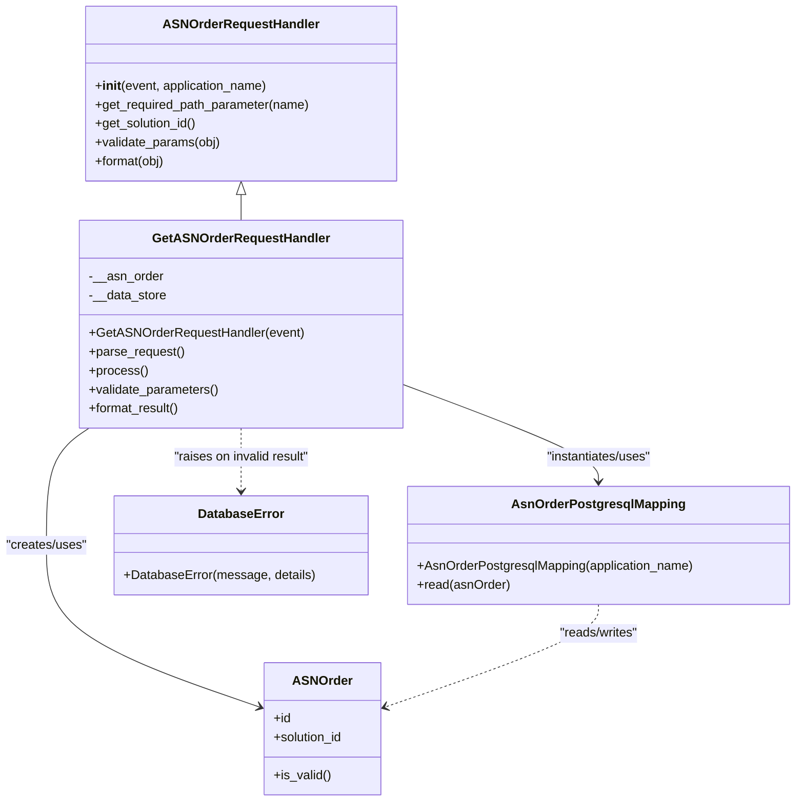

# Diagram: partview_core/partview_service/partview_service/api/asn_order/handlers/get_asn_order.py

> Auto-generated by Obscura crawlers

## Mermaid

### SVG

<svg id="container" width="1006.8828125" xmlns="http://www.w3.org/2000/svg" class="classDiagram" height="1018" viewBox="0 0 1006.8828125 1018" role="graphics-document document" aria-roledescription="class"><g><defs><marker id="container_class-aggregationStart" class="marker aggregation class" refX="18" refY="7" markerWidth="190" markerHeight="240" orient="auto"><path d="M 18,7 L9,13 L1,7 L9,1 Z"></path></marker></defs><defs><marker id="container_class-aggregationEnd" class="marker aggregation class" refX="1" refY="7" markerWidth="20" markerHeight="28" orient="auto"><path d="M 18,7 L9,13 L1,7 L9,1 Z"></path></marker></defs><defs><marker id="container_class-extensionStart" class="marker extension class" refX="18" refY="7" markerWidth="190" markerHeight="240" orient="auto"><path d="M 1,7 L18,13 V 1 Z"></path></marker></defs><defs><marker id="container_class-extensionEnd" class="marker extension class" refX="1" refY="7" markerWidth="20" markerHeight="28" orient="auto"><path d="M 1,1 V 13 L18,7 Z"></path></marker></defs><defs><marker id="container_class-compositionStart" class="marker composition class" refX="18" refY="7" markerWidth="190" markerHeight="240" orient="auto"><path d="M 18,7 L9,13 L1,7 L9,1 Z"></path></marker></defs><defs><marker id="container_class-compositionEnd" class="marker composition class" refX="1" refY="7" markerWidth="20" markerHeight="28" orient="auto"><path d="M 18,7 L9,13 L1,7 L9,1 Z"></path></marker></defs><defs><marker id="container_class-dependencyStart" class="marker dependency class" refX="6" refY="7" markerWidth="190" markerHeight="240" orient="auto"><path d="M 5,7 L9,13 L1,7 L9,1 Z"></path></marker></defs><defs><marker id="container_class-dependencyEnd" class="marker dependency class" refX="13" refY="7" markerWidth="20" markerHeight="28" orient="auto"><path d="M 18,7 L9,13 L14,7 L9,1 Z"></path></marker></defs><defs><marker id="container_class-lollipopStart" class="marker lollipop class" refX="13" refY="7" markerWidth="190" markerHeight="240" orient="auto"><circle stroke="black" fill="transparent" cx="7" cy="7" r="6"></circle></marker></defs><defs><marker id="container_class-lollipopEnd" class="marker lollipop class" refX="1" refY="7" markerWidth="190" markerHeight="240" orient="auto"><circle stroke="black" fill="transparent" cx="7" cy="7" r="6"></circle></marker></defs><g class="root"><g class="clusters"></g><g class="edgePaths"><path d="M307.25,247.25L307.25,248.542C307.25,249.833,307.25,252.417,307.25,257.875C307.25,263.333,307.25,271.667,307.25,275.833L307.25,280" id="id_ASNOrderRequestHandler_GetASNOrderRequestHandler_1" class="edge-thickness-normal edge-pattern-solid relation" style=";;;" data-edge="true" data-et="edge" data-id="id_ASNOrderRequestHandler_GetASNOrderRequestHandler_1" data-points="W3sieCI6MzA3LjI1LCJ5IjoyMzB9LHsieCI6MzA3LjI1LCJ5IjoyNTV9LHsieCI6MzA3LjI1LCJ5IjoyODB9XQ==" marker-start="url(#container_class-extensionStart)"></path><path d="M114.73,544L105.736,550.167C96.742,556.333,78.754,568.667,69.76,593.5C60.766,618.333,60.766,655.667,60.766,693C60.766,730.333,60.766,767.667,105.397,801.837C150.029,836.008,239.293,867.015,283.925,882.519L328.557,898.023" id="id_GetASNOrderRequestHandler_ASNOrder_2" class="edge-thickness-normal edge-pattern-solid relation" style=";;;" data-edge="true" data-et="edge" data-id="id_GetASNOrderRequestHandler_ASNOrder_2" data-points="W3sieCI6MTE0LjcyOTY1OTc2MzMxMzYsInkiOjU0NH0seyJ4Ijo2MC43NjU2MjUsInkiOjU4MX0seyJ4Ijo2MC43NjU2MjUsInkiOjY5M30seyJ4Ijo2MC43NjU2MjUsInkiOjgwNX0seyJ4IjozMzQuMjI0NjA5Mzc1LCJ5Ijo4OTkuOTkxOTAzMzMzNDI2OH1d" marker-end="url(#container_class-dependencyEnd)"></path><path d="M508.063,487.387L549.623,502.989C591.184,518.591,674.305,549.796,715.865,570.564C757.426,591.333,757.426,601.667,757.426,606.833L757.426,612" id="id_GetASNOrderRequestHandler_AsnOrderPostgresqlMapping_3" class="edge-thickness-normal edge-pattern-solid relation" style=";;;" data-edge="true" data-et="edge" data-id="id_GetASNOrderRequestHandler_AsnOrderPostgresqlMapping_3" data-points="W3sieCI6NTA4LjA2MjUsInkiOjQ4Ny4zODY4MDIwMzA0NTY4Nn0seyJ4Ijo3NTcuNDI1NzgxMjUsInkiOjU4MX0seyJ4Ijo3NTcuNDI1NzgxMjUsInkiOjYxOH1d" marker-end="url(#container_class-dependencyEnd)"></path><path d="M307.25,544L307.25,550.167C307.25,556.333,307.25,568.667,307.25,582C307.25,595.333,307.25,609.667,307.25,616.833L307.25,624" id="id_GetASNOrderRequestHandler_DatabaseError_4" class="edge-thickness-normal edge-pattern-dashed relation" style=";;;" data-edge="true" data-et="edge" data-id="id_GetASNOrderRequestHandler_DatabaseError_4" data-points="W3sieCI6MzA3LjI1LCJ5Ijo1NDR9LHsieCI6MzA3LjI1LCJ5Ijo1ODF9LHsieCI6MzA3LjI1LCJ5Ijo2MzB9XQ==" marker-end="url(#container_class-dependencyEnd)"></path><path d="M757.426,768L757.426,774.167C757.426,780.333,757.426,792.667,712.794,814.337C668.162,836.008,578.898,867.015,534.266,882.519L489.635,898.023" id="id_AsnOrderPostgresqlMapping_ASNOrder_5" class="edge-thickness-normal edge-pattern-dashed relation" style=";;;" data-edge="true" data-et="edge" data-id="id_AsnOrderPostgresqlMapping_ASNOrder_5" data-points="W3sieCI6NzU3LjQyNTc4MTI1LCJ5Ijo3Njh9LHsieCI6NzU3LjQyNTc4MTI1LCJ5Ijo4MDV9LHsieCI6NDgzLjk2Njc5Njg3NSwieSI6ODk5Ljk5MTkwMzMzMzQyNjh9XQ==" marker-end="url(#container_class-dependencyEnd)"></path></g><g class="edgeLabels"><g class="edgeLabel"><g class="label" data-id="id_ASNOrderRequestHandler_GetASNOrderRequestHandler_1" transform="translate(0, 0)"><foreignObject width="0" height="0">

</foreignObject></g></g><g class="edgeLabel" transform="translate(60.765625, 693)"><g class="label" data-id="id_GetASNOrderRequestHandler_ASNOrder_2" transform="translate(-52.765625, -12)"><foreignObject width="105.53125" height="24">

"creates/uses"

</foreignObject></g></g><g class="edgeLabel" transform="translate(757.42578125, 581)"><g class="label" data-id="id_GetASNOrderRequestHandler_AsnOrderPostgresqlMapping_3" transform="translate(-69.5859375, -12)"><foreignObject width="139.171875" height="24">

"instantiates/uses"

</foreignObject></g></g><g class="edgeLabel" transform="translate(307.25, 581)"><g class="label" data-id="id_GetASNOrderRequestHandler_DatabaseError_4" transform="translate(-88.421875, -12)"><foreignObject width="176.84375" height="24">

"raises on invalid result"

</foreignObject></g></g><g class="edgeLabel" transform="translate(757.42578125, 805)"><g class="label" data-id="id_AsnOrderPostgresqlMapping_ASNOrder_5" transform="translate(-52.2109375, -12)"><foreignObject width="104.421875" height="24">

"reads/writes"

</foreignObject></g></g></g><g class="nodes"><g class="node default" id="classId-ASNOrder-0" transform="translate(409.095703125, 926)"><g class="basic label-container"><path d="M-74.87109375 -84 L74.87109375 -84 L74.87109375 84 L-74.87109375 84" stroke="none" stroke-width="0" fill="#ECECFF" style=""></path><path d="M-74.87109375 -84 C-32.14686280499576 -84, 10.577368140008474 -84, 74.87109375 -84 M-74.87109375 -84 C-44.90630869874534 -84, -14.941523647490683 -84, 74.87109375 -84 M74.87109375 -84 C74.87109375 -38.36472921749548, 74.87109375 7.27054156500904, 74.87109375 84 M74.87109375 -84 C74.87109375 -43.376744016461124, 74.87109375 -2.753488032922249, 74.87109375 84 M74.87109375 84 C24.334403338549613 84, -26.202287072900774 84, -74.87109375 84 M74.87109375 84 C23.623780870920534 84, -27.623532008158932 84, -74.87109375 84 M-74.87109375 84 C-74.87109375 17.853820031044492, -74.87109375 -48.292359937911016, -74.87109375 -84 M-74.87109375 84 C-74.87109375 29.302161696489115, -74.87109375 -25.39567660702177, -74.87109375 -84" stroke="#9370DB" stroke-width="1.3" fill="none" stroke-dasharray="0 0" style=""></path></g><g class="annotation-group text" transform="translate(0, -60)"></g><g class="label-group text" transform="translate(-35.5234375, -60)"><g class="label" style="font-weight: bolder" transform="translate(0,-12)"><foreignObject width="71.046875" height="24">

ASNOrder

</foreignObject></g></g><g class="members-group text" transform="translate(-62.87109375, -12)"><g class="label" style="" transform="translate(0,-12)"><foreignObject width="22.078125" height="24">

+id

</foreignObject></g><g class="label" style="" transform="translate(0,12)"><foreignObject width="90.21875" height="24">

+solution_id

</foreignObject></g></g><g class="methods-group text" transform="translate(-62.87109375, 60)"><g class="label" style="" transform="translate(0,-12)"><foreignObject width="72.796875" height="24">

+is_valid()

</foreignObject></g></g><g class="divider" style=""><path d="M-74.87109375 -36 C-22.755869689570673 -36, 29.359354370858654 -36, 74.87109375 -36 M-74.87109375 -36 C-31.12223845529587 -36, 12.626616839408257 -36, 74.87109375 -36" stroke="#9370DB" stroke-width="1.3" fill="none" stroke-dasharray="0 0" style=""></path></g><g class="divider" style=""><path d="M-74.87109375 36 C-44.449577034736876 36, -14.028060319473752 36, 74.87109375 36 M-74.87109375 36 C-31.825218268181224 36, 11.220657213637551 36, 74.87109375 36" stroke="#9370DB" stroke-width="1.3" fill="none" stroke-dasharray="0 0" style=""></path></g></g><g class="node default" id="classId-AsnOrderPostgresqlMapping-1" transform="translate(757.42578125, 693)"><g class="basic label-container"><path d="M-241.45703125 -75 L241.45703125 -75 L241.45703125 75 L-241.45703125 75" stroke="none" stroke-width="0" fill="#ECECFF" style=""></path><path d="M-241.45703125 -75 C-101.5097523109877 -75, 38.437526628024614 -75, 241.45703125 -75 M-241.45703125 -75 C-79.43655169292899 -75, 82.58392786414203 -75, 241.45703125 -75 M241.45703125 -75 C241.45703125 -24.13721821271973, 241.45703125 26.72556357456054, 241.45703125 75 M241.45703125 -75 C241.45703125 -25.78116773701631, 241.45703125 23.437664525967378, 241.45703125 75 M241.45703125 75 C120.5324253809661 75, -0.39218048806779393 75, -241.45703125 75 M241.45703125 75 C106.25488626539061 75, -28.94725871921878 75, -241.45703125 75 M-241.45703125 75 C-241.45703125 41.725227659102636, -241.45703125 8.450455318205272, -241.45703125 -75 M-241.45703125 75 C-241.45703125 24.80749198890809, -241.45703125 -25.38501602218382, -241.45703125 -75" stroke="#9370DB" stroke-width="1.3" fill="none" stroke-dasharray="0 0" style=""></path></g><g class="annotation-group text" transform="translate(0, -51)"></g><g class="label-group text" transform="translate(-104.5234375, -51)"><g class="label" style="font-weight: bolder" transform="translate(0,-12)"><foreignObject width="209.046875" height="24">

AsnOrderPostgresqlMapping

</foreignObject></g></g><g class="members-group text" transform="translate(-229.45703125, -3)"></g><g class="methods-group text" transform="translate(-229.45703125, 27)"><g class="label" style="" transform="translate(0,-12)"><foreignObject width="354.390625" height="24">

+AsnOrderPostgresqlMapping(application_name)

</foreignObject></g><g class="label" style="" transform="translate(0,12)"><foreignObject width="117.515625" height="24">

+read(asnOrder)

</foreignObject></g></g><g class="divider" style=""><path d="M-241.45703125 -27 C-103.46461865379132 -27, 34.52779394241736 -27, 241.45703125 -27 M-241.45703125 -27 C-143.02431421547584 -27, -44.59159718095171 -27, 241.45703125 -27" stroke="#9370DB" stroke-width="1.3" fill="none" stroke-dasharray="0 0" style=""></path></g><g class="divider" style=""><path d="M-241.45703125 -3 C-68.40930823999531 -3, 104.63841477000938 -3, 241.45703125 -3 M-241.45703125 -3 C-119.23251180826139 -3, 2.9920076334772148 -3, 241.45703125 -3" stroke="#9370DB" stroke-width="1.3" fill="none" stroke-dasharray="0 0" style=""></path></g></g><g class="node default" id="classId-DatabaseError-2" transform="translate(307.25, 693)"><g class="basic label-container"><path d="M-158.71875 -63 L158.71875 -63 L158.71875 63 L-158.71875 63" stroke="none" stroke-width="0" fill="#ECECFF" style=""></path><path d="M-158.71875 -63 C-89.5863928861675 -63, -20.454035772335004 -63, 158.71875 -63 M-158.71875 -63 C-78.71859882263875 -63, 1.2815523547224927 -63, 158.71875 -63 M158.71875 -63 C158.71875 -34.67714652191992, 158.71875 -6.354293043839846, 158.71875 63 M158.71875 -63 C158.71875 -20.073440963905654, 158.71875 22.853118072188693, 158.71875 63 M158.71875 63 C71.09085187993706 63, -16.537046240125875 63, -158.71875 63 M158.71875 63 C88.01210006156094 63, 17.305450123121886 63, -158.71875 63 M-158.71875 63 C-158.71875 22.45903870781546, -158.71875 -18.08192258436908, -158.71875 -63 M-158.71875 63 C-158.71875 17.078161020483194, -158.71875 -28.843677959033613, -158.71875 -63" stroke="#9370DB" stroke-width="1.3" fill="none" stroke-dasharray="0 0" style=""></path></g><g class="annotation-group text" transform="translate(0, -39)"></g><g class="label-group text" transform="translate(-52.359375, -39)"><g class="label" style="font-weight: bolder" transform="translate(0,-12)"><foreignObject width="104.71875" height="24">

DatabaseError

</foreignObject></g></g><g class="members-group text" transform="translate(-146.71875, 9)"></g><g class="methods-group text" transform="translate(-146.71875, 39)"><g class="label" style="" transform="translate(0,-12)"><foreignObject width="241.078125" height="24">

+DatabaseError(message, details)

</foreignObject></g></g><g class="divider" style=""><path d="M-158.71875 -15 C-60.19415063655792 -15, 38.33044872688416 -15, 158.71875 -15 M-158.71875 -15 C-90.65132781865762 -15, -22.58390563731524 -15, 158.71875 -15" stroke="#9370DB" stroke-width="1.3" fill="none" stroke-dasharray="0 0" style=""></path></g><g class="divider" style=""><path d="M-158.71875 9 C-89.12424929578107 9, -19.52974859156214 9, 158.71875 9 M-158.71875 9 C-33.33917891001285 9, 92.0403921799743 9, 158.71875 9" stroke="#9370DB" stroke-width="1.3" fill="none" stroke-dasharray="0 0" style=""></path></g></g><g class="node default" id="classId-ASNOrderRequestHandler-3" transform="translate(307.25, 119)"><g class="basic label-container"><path d="M-197.59765625 -111 L197.59765625 -111 L197.59765625 111 L-197.59765625 111" stroke="none" stroke-width="0" fill="#ECECFF" style=""></path><path d="M-197.59765625 -111 C-79.57730337358016 -111, 38.44304950283967 -111, 197.59765625 -111 M-197.59765625 -111 C-92.81686329351024 -111, 11.963929662979524 -111, 197.59765625 -111 M197.59765625 -111 C197.59765625 -55.44298897951641, 197.59765625 0.11402204096718549, 197.59765625 111 M197.59765625 -111 C197.59765625 -56.652285889696024, 197.59765625 -2.304571779392049, 197.59765625 111 M197.59765625 111 C42.139626236888915 111, -113.31840377622217 111, -197.59765625 111 M197.59765625 111 C44.9798926312983 111, -107.6378709874034 111, -197.59765625 111 M-197.59765625 111 C-197.59765625 60.97610342210021, -197.59765625 10.952206844200418, -197.59765625 -111 M-197.59765625 111 C-197.59765625 62.87661732698441, -197.59765625 14.753234653968818, -197.59765625 -111" stroke="#9370DB" stroke-width="1.3" fill="none" stroke-dasharray="0 0" style=""></path></g><g class="annotation-group text" transform="translate(0, -87)"></g><g class="label-group text" transform="translate(-94.5859375, -87)"><g class="label" style="font-weight: bolder" transform="translate(0,-12)"><foreignObject width="189.171875" height="24">

ASNOrderRequestHandler

</foreignObject></g></g><g class="members-group text" transform="translate(-185.59765625, -39)"></g><g class="methods-group text" transform="translate(-185.59765625, -9)"><g class="label" style="" transform="translate(0,-12)"><foreignObject width="222.21875" height="24">

+<strong>init</strong>(event, application_name)

</foreignObject></g><g class="label" style="" transform="translate(0,12)"><foreignObject width="276.609375" height="24">

+get_required_path_parameter(name)

</foreignObject></g><g class="label" style="" transform="translate(0,36)"><foreignObject width="131.46875" height="24">

+get_solution_id()

</foreignObject></g><g class="label" style="" transform="translate(0,60)"><foreignObject width="160.96875" height="24">

+validate_params(obj)

</foreignObject></g><g class="label" style="" transform="translate(0,84)"><foreignObject width="90.359375" height="24">

+format(obj)

</foreignObject></g></g><g class="divider" style=""><path d="M-197.59765625 -63 C-53.48007796469372 -63, 90.63750032061256 -63, 197.59765625 -63 M-197.59765625 -63 C-83.945946238875 -63, 29.70576377225001 -63, 197.59765625 -63" stroke="#9370DB" stroke-width="1.3" fill="none" stroke-dasharray="0 0" style=""></path></g><g class="divider" style=""><path d="M-197.59765625 -39 C-104.44060935691886 -39, -11.283562463837711 -39, 197.59765625 -39 M-197.59765625 -39 C-47.32940108674231 -39, 102.93885407651538 -39, 197.59765625 -39" stroke="#9370DB" stroke-width="1.3" fill="none" stroke-dasharray="0 0" style=""></path></g></g><g class="node default" id="classId-GetASNOrderRequestHandler-4" transform="translate(307.25, 412)"><g class="basic label-container"><path d="M-200.8125 -132 L200.8125 -132 L200.8125 132 L-200.8125 132" stroke="none" stroke-width="0" fill="#ECECFF" style=""></path><path d="M-200.8125 -132 C-81.6683856149486 -132, 37.47572877010279 -132, 200.8125 -132 M-200.8125 -132 C-120.2630373691219 -132, -39.71357473824381 -132, 200.8125 -132 M200.8125 -132 C200.8125 -61.95834424443059, 200.8125 8.083311511138817, 200.8125 132 M200.8125 -132 C200.8125 -61.9849173315735, 200.8125 8.030165336853003, 200.8125 132 M200.8125 132 C73.55763321795219 132, -53.697233564095626 132, -200.8125 132 M200.8125 132 C62.6348345626478 132, -75.5428308747044 132, -200.8125 132 M-200.8125 132 C-200.8125 57.93437398885264, -200.8125 -16.131252022294717, -200.8125 -132 M-200.8125 132 C-200.8125 40.3052691290613, -200.8125 -51.3894617418774, -200.8125 -132" stroke="#9370DB" stroke-width="1.3" fill="none" stroke-dasharray="0 0" style=""></path></g><g class="annotation-group text" transform="translate(0, -108)"></g><g class="label-group text" transform="translate(-107.25, -108)"><g class="label" style="font-weight: bolder" transform="translate(0,-12)"><foreignObject width="214.5" height="24">

GetASNOrderRequestHandler

</foreignObject></g></g><g class="members-group text" transform="translate(-188.8125, -60)"><g class="label" style="" transform="translate(0,-12)"><foreignObject width="94.234375" height="24">

-__asn_order

</foreignObject></g><g class="label" style="" transform="translate(0,12)"><foreignObject width="99.0625" height="24">

-__data_store

</foreignObject></g></g><g class="methods-group text" transform="translate(-188.8125, 12)"><g class="label" style="" transform="translate(0,-12)"><foreignObject width="270.375" height="24">

+GetASNOrderRequestHandler(event)

</foreignObject></g><g class="label" style="" transform="translate(0,12)"><foreignObject width="121.796875" height="24">

+parse_request()

</foreignObject></g><g class="label" style="" transform="translate(0,36)"><foreignObject width="73.734375" height="24">

+process()

</foreignObject></g><g class="label" style="" transform="translate(0,60)"><foreignObject width="166.546875" height="24">

+validate_parameters()

</foreignObject></g><g class="label" style="" transform="translate(0,84)"><foreignObject width="117.015625" height="24">

+format_result()

</foreignObject></g></g><g class="divider" style=""><path d="M-200.8125 -84 C-95.89961302206797 -84, 9.013273955864065 -84, 200.8125 -84 M-200.8125 -84 C-118.53914197107872 -84, -36.26578394215744 -84, 200.8125 -84" stroke="#9370DB" stroke-width="1.3" fill="none" stroke-dasharray="0 0" style=""></path></g><g class="divider" style=""><path d="M-200.8125 -12 C-94.33103011382674 -12, 12.150439772346516 -12, 200.8125 -12 M-200.8125 -12 C-53.59461872371887 -12, 93.62326255256227 -12, 200.8125 -12" stroke="#9370DB" stroke-width="1.3" fill="none" stroke-dasharray="0 0" style=""></path></g></g></g></g></g></svg>
