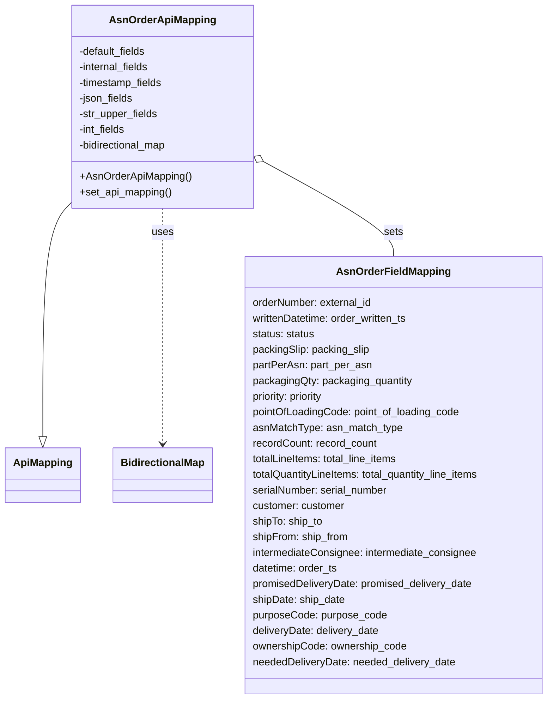

# Diagram: partview_core/partview_service/partview_service/api/asn_order/handlers/mapping/AsnOrderApiMapping.py

> Auto-generated by Obscura crawlers

## Mermaid

### SVG

<svg id="container" width="842.4921875" xmlns="http://www.w3.org/2000/svg" class="classDiagram" height="1074" viewBox="0 0 842.4921875 1074" role="graphics-document document" aria-roledescription="class"><g><defs><marker id="container_class-aggregationStart" class="marker aggregation class" refX="18" refY="7" markerWidth="190" markerHeight="240" orient="auto"><path d="M 18,7 L9,13 L1,7 L9,1 Z"></path></marker></defs><defs><marker id="container_class-aggregationEnd" class="marker aggregation class" refX="1" refY="7" markerWidth="20" markerHeight="28" orient="auto"><path d="M 18,7 L9,13 L1,7 L9,1 Z"></path></marker></defs><defs><marker id="container_class-extensionStart" class="marker extension class" refX="18" refY="7" markerWidth="190" markerHeight="240" orient="auto"><path d="M 1,7 L18,13 V 1 Z"></path></marker></defs><defs><marker id="container_class-extensionEnd" class="marker extension class" refX="1" refY="7" markerWidth="20" markerHeight="28" orient="auto"><path d="M 1,1 V 13 L18,7 Z"></path></marker></defs><defs><marker id="container_class-compositionStart" class="marker composition class" refX="18" refY="7" markerWidth="190" markerHeight="240" orient="auto"><path d="M 18,7 L9,13 L1,7 L9,1 Z"></path></marker></defs><defs><marker id="container_class-compositionEnd" class="marker composition class" refX="1" refY="7" markerWidth="20" markerHeight="28" orient="auto"><path d="M 18,7 L9,13 L1,7 L9,1 Z"></path></marker></defs><defs><marker id="container_class-dependencyStart" class="marker dependency class" refX="6" refY="7" markerWidth="190" markerHeight="240" orient="auto"><path d="M 5,7 L9,13 L1,7 L9,1 Z"></path></marker></defs><defs><marker id="container_class-dependencyEnd" class="marker dependency class" refX="13" refY="7" markerWidth="20" markerHeight="28" orient="auto"><path d="M 18,7 L9,13 L14,7 L9,1 Z"></path></marker></defs><defs><marker id="container_class-lollipopStart" class="marker lollipop class" refX="13" refY="7" markerWidth="190" markerHeight="240" orient="auto"><circle stroke="black" fill="transparent" cx="7" cy="7" r="6"></circle></marker></defs><defs><marker id="container_class-lollipopEnd" class="marker lollipop class" refX="1" refY="7" markerWidth="190" markerHeight="240" orient="auto"><circle stroke="black" fill="transparent" cx="7" cy="7" r="6"></circle></marker></defs><g class="root"><g class="clusters"></g><g class="edgePaths"><path d="M106.551,310.447L99.335,318.206C92.12,325.965,77.689,341.482,70.473,401.533C63.258,461.583,63.258,566.167,63.258,618.458L63.258,670.75" id="id_AsnOrderApiMapping_ApiMapping_1" class="edge-thickness-normal edge-pattern-solid relation" style=";;;" data-edge="true" data-et="edge" data-id="id_AsnOrderApiMapping_ApiMapping_1" data-points="W3sieCI6MTA2LjU1MDc4MTI1LCJ5IjozMTAuNDQ2OTYxNzgyODg1fSx7IngiOjYzLjI1NzgxMjUsInkiOjM1N30seyJ4Ijo2My4yNTc4MTI1LCJ5Ijo2ODh9XQ==" marker-end="url(#container_class-extensionEnd)"></path><path d="M242.742,320L242.742,326.167C242.742,332.333,242.742,344.667,242.742,405C242.742,465.333,242.742,573.667,242.742,627.833L242.742,682" id="id_AsnOrderApiMapping_BidirectionalMap_2" class="edge-thickness-normal edge-pattern-dashed relation" style=";;;" data-edge="true" data-et="edge" data-id="id_AsnOrderApiMapping_BidirectionalMap_2" data-points="W3sieCI6MjQyLjc0MjE4NzUsInkiOjMyMH0seyJ4IjoyNDIuNzQyMTg3NSwieSI6MzU3fSx7IngiOjI0Mi43NDIxODc1LCJ5Ijo2ODh9XQ==" marker-end="url(#container_class-dependencyEnd)"></path><path d="M394.118,245.61L428.553,264.175C462.989,282.74,531.859,319.87,566.295,344.602C600.73,369.333,600.73,381.667,600.73,387.833L600.73,394" id="id_AsnOrderApiMapping_AsnOrderFieldMapping_3" class="edge-thickness-normal edge-pattern-solid relation" style=";;;" data-edge="true" data-et="edge" data-id="id_AsnOrderApiMapping_AsnOrderFieldMapping_3" data-points="W3sieCI6Mzc4LjkzMzU5Mzc1LCJ5IjoyMzcuNDI0MDI3NDk3NDA4NDd9LHsieCI6NjAwLjczMDQ2ODc1LCJ5IjozNTd9LHsieCI6NjAwLjczMDQ2ODc1LCJ5IjozOTR9XQ==" marker-start="url(#container_class-aggregationStart)"></path></g><g class="edgeLabels"><g class="edgeLabel"><g class="label" data-id="id_AsnOrderApiMapping_ApiMapping_1" transform="translate(0, 0)"><foreignObject width="0" height="0">

</foreignObject></g></g><g class="edgeLabel" transform="translate(242.7421875, 357)"><g class="label" data-id="id_AsnOrderApiMapping_BidirectionalMap_2" transform="translate(-16.4921875, -12)"><foreignObject width="32.984375" height="24">

uses

</foreignObject></g></g><g class="edgeLabel" transform="translate(600.73046875, 357)"><g class="label" data-id="id_AsnOrderApiMapping_AsnOrderFieldMapping_3" transform="translate(-14.7265625, -12)"><foreignObject width="29.453125" height="24">

sets

</foreignObject></g></g></g><g class="nodes"><g class="node default" id="classId-ApiMapping-0" transform="translate(63.2578125, 730)"><g class="basic label-container"><path d="M-55.2578125 -42 L55.2578125 -42 L55.2578125 42 L-55.2578125 42" stroke="none" stroke-width="0" fill="#ECECFF" style=""></path><path d="M-55.2578125 -42 C-24.098424042022724 -42, 7.060964415954551 -42, 55.2578125 -42 M-55.2578125 -42 C-20.117419286326324 -42, 15.022973927347351 -42, 55.2578125 -42 M55.2578125 -42 C55.2578125 -8.856107619290782, 55.2578125 24.287784761418436, 55.2578125 42 M55.2578125 -42 C55.2578125 -19.138558504467532, 55.2578125 3.7228829910649353, 55.2578125 42 M55.2578125 42 C14.524565616763006 42, -26.208681266473988 42, -55.2578125 42 M55.2578125 42 C20.496872553331087 42, -14.264067393337825 42, -55.2578125 42 M-55.2578125 42 C-55.2578125 18.240672350318555, -55.2578125 -5.518655299362891, -55.2578125 -42 M-55.2578125 42 C-55.2578125 19.724016732199715, -55.2578125 -2.5519665356005703, -55.2578125 -42" stroke="#9370DB" stroke-width="1.3" fill="none" stroke-dasharray="0 0" style=""></path></g><g class="annotation-group text" transform="translate(0, -18)"></g><g class="label-group text" transform="translate(-43.2578125, -18)"><g class="label" style="font-weight: bolder" transform="translate(0,-12)"><foreignObject width="86.515625" height="24">

ApiMapping

</foreignObject></g></g><g class="members-group text" transform="translate(-43.2578125, 30)"></g><g class="methods-group text" transform="translate(-43.2578125, 60)"></g><g class="divider" style=""><path d="M-55.2578125 6 C-12.181116761922574 6, 30.89557897615485 6, 55.2578125 6 M-55.2578125 6 C-28.752747834691863 6, -2.247683169383727 6, 55.2578125 6" stroke="#9370DB" stroke-width="1.3" fill="none" stroke-dasharray="0 0" style=""></path></g><g class="divider" style=""><path d="M-55.2578125 24 C-19.338969859322553 24, 16.579872781354894 24, 55.2578125 24 M-55.2578125 24 C-19.97126626819007 24, 15.315279963619858 24, 55.2578125 24" stroke="#9370DB" stroke-width="1.3" fill="none" stroke-dasharray="0 0" style=""></path></g></g><g class="node default" id="classId-BidirectionalMap-1" transform="translate(242.7421875, 730)"><g class="basic label-container"><path d="M-74.2265625 -42 L74.2265625 -42 L74.2265625 42 L-74.2265625 42" stroke="none" stroke-width="0" fill="#ECECFF" style=""></path><path d="M-74.2265625 -42 C-40.238310709233346 -42, -6.250058918466692 -42, 74.2265625 -42 M-74.2265625 -42 C-44.18760162334568 -42, -14.148640746691356 -42, 74.2265625 -42 M74.2265625 -42 C74.2265625 -24.680866896169782, 74.2265625 -7.361733792339564, 74.2265625 42 M74.2265625 -42 C74.2265625 -22.567449072856252, 74.2265625 -3.134898145712505, 74.2265625 42 M74.2265625 42 C43.069901185689744 42, 11.913239871379496 42, -74.2265625 42 M74.2265625 42 C26.07277904116303 42, -22.081004417673938 42, -74.2265625 42 M-74.2265625 42 C-74.2265625 18.213083959371453, -74.2265625 -5.573832081257095, -74.2265625 -42 M-74.2265625 42 C-74.2265625 18.25604616807773, -74.2265625 -5.487907663844538, -74.2265625 -42" stroke="#9370DB" stroke-width="1.3" fill="none" stroke-dasharray="0 0" style=""></path></g><g class="annotation-group text" transform="translate(0, -18)"></g><g class="label-group text" transform="translate(-62.2265625, -18)"><g class="label" style="font-weight: bolder" transform="translate(0,-12)"><foreignObject width="124.453125" height="24">

BidirectionalMap

</foreignObject></g></g><g class="members-group text" transform="translate(-62.2265625, 30)"></g><g class="methods-group text" transform="translate(-62.2265625, 60)"></g><g class="divider" style=""><path d="M-74.2265625 6 C-35.10820033166559 6, 4.010161836668814 6, 74.2265625 6 M-74.2265625 6 C-16.753482798556263 6, 40.719596902887474 6, 74.2265625 6" stroke="#9370DB" stroke-width="1.3" fill="none" stroke-dasharray="0 0" style=""></path></g><g class="divider" style=""><path d="M-74.2265625 24 C-38.58054316659664 24, -2.934523833193282 24, 74.2265625 24 M-74.2265625 24 C-26.339763522342253 24, 21.547035455315495 24, 74.2265625 24" stroke="#9370DB" stroke-width="1.3" fill="none" stroke-dasharray="0 0" style=""></path></g></g><g class="node default" id="classId-AsnOrderApiMapping-2" transform="translate(242.7421875, 164)"><g class="basic label-container"><path d="M-136.19140625 -156 L136.19140625 -156 L136.19140625 156 L-136.19140625 156" stroke="none" stroke-width="0" fill="#ECECFF" style=""></path><path d="M-136.19140625 -156 C-52.944816762914954 -156, 30.301772724170092 -156, 136.19140625 -156 M-136.19140625 -156 C-51.781085291058474 -156, 32.62923566788305 -156, 136.19140625 -156 M136.19140625 -156 C136.19140625 -70.54837108355332, 136.19140625 14.90325783289336, 136.19140625 156 M136.19140625 -156 C136.19140625 -39.74564116123159, 136.19140625 76.50871767753682, 136.19140625 156 M136.19140625 156 C41.96847308605538 156, -52.254460077889235 156, -136.19140625 156 M136.19140625 156 C42.48489335748336 156, -51.221619535033284 156, -136.19140625 156 M-136.19140625 156 C-136.19140625 56.7755278443767, -136.19140625 -42.448944311246606, -136.19140625 -156 M-136.19140625 156 C-136.19140625 46.34485810388266, -136.19140625 -63.310283792234685, -136.19140625 -156" stroke="#9370DB" stroke-width="1.3" fill="none" stroke-dasharray="0 0" style=""></path></g><g class="annotation-group text" transform="translate(0, -132)"></g><g class="label-group text" transform="translate(-77.3828125, -132)"><g class="label" style="font-weight: bolder" transform="translate(0,-12)"><foreignObject width="154.765625" height="24">

AsnOrderApiMapping

</foreignObject></g></g><g class="members-group text" transform="translate(-124.19140625, -84)"><g class="label" style="" transform="translate(0,-12)"><foreignObject width="105.796875" height="24">

-default_fields

</foreignObject></g><g class="label" style="" transform="translate(0,12)"><foreignObject width="110.953125" height="24">

-internal_fields

</foreignObject></g><g class="label" style="" transform="translate(0,36)"><foreignObject width="131.40625" height="24">

-timestamp_fields

</foreignObject></g><g class="label" style="" transform="translate(0,60)"><foreignObject width="84.53125" height="24">

-json_fields

</foreignObject></g><g class="label" style="" transform="translate(0,84)"><foreignObject width="122.109375" height="24">

-str_upper_fields

</foreignObject></g><g class="label" style="" transform="translate(0,108)"><foreignObject width="73.6875" height="24">

-int_fields

</foreignObject></g><g class="label" style="" transform="translate(0,132)"><foreignObject width="139.09375" height="24">

-bidirectional_map

</foreignObject></g></g><g class="methods-group text" transform="translate(-124.19140625, 108)"><g class="label" style="" transform="translate(0,-12)"><foreignObject width="171" height="24">

+AsnOrderApiMapping()

</foreignObject></g><g class="label" style="" transform="translate(0,12)"><foreignObject width="143" height="24">

+set_api_mapping()

</foreignObject></g></g><g class="divider" style=""><path d="M-136.19140625 -108 C-55.29940654808341 -108, 25.592593153833178 -108, 136.19140625 -108 M-136.19140625 -108 C-59.47597910404741 -108, 17.239448041905177 -108, 136.19140625 -108" stroke="#9370DB" stroke-width="1.3" fill="none" stroke-dasharray="0 0" style=""></path></g><g class="divider" style=""><path d="M-136.19140625 84 C-67.19310289571581 84, 1.805200458568379 84, 136.19140625 84 M-136.19140625 84 C-57.2101730824712 84, 21.7710600850576 84, 136.19140625 84" stroke="#9370DB" stroke-width="1.3" fill="none" stroke-dasharray="0 0" style=""></path></g></g><g class="node default" id="classId-AsnOrderFieldMapping-3" transform="translate(600.73046875, 730)"><g class="basic label-container"><path d="M-233.76171875 -336 L233.76171875 -336 L233.76171875 336 L-233.76171875 336" stroke="none" stroke-width="0" fill="#ECECFF" style=""></path><path d="M-233.76171875 -336 C-107.6175028567481 -336, 18.526713036503793 -336, 233.76171875 -336 M-233.76171875 -336 C-68.2694548561222 -336, 97.22280903775561 -336, 233.76171875 -336 M233.76171875 -336 C233.76171875 -81.26265012491217, 233.76171875 173.47469975017566, 233.76171875 336 M233.76171875 -336 C233.76171875 -173.90557941387988, 233.76171875 -11.811158827759755, 233.76171875 336 M233.76171875 336 C136.15200552367634 336, 38.542292297352674 336, -233.76171875 336 M233.76171875 336 C98.91079060428802 336, -35.94013754142395 336, -233.76171875 336 M-233.76171875 336 C-233.76171875 98.54206894529804, -233.76171875 -138.91586210940392, -233.76171875 -336 M-233.76171875 336 C-233.76171875 68.15081497957539, -233.76171875 -199.69837004084923, -233.76171875 -336" stroke="#9370DB" stroke-width="1.3" fill="none" stroke-dasharray="0 0" style=""></path></g><g class="annotation-group text" transform="translate(0, -312)"></g><g class="label-group text" transform="translate(-83.1015625, -312)"><g class="label" style="font-weight: bolder" transform="translate(0,-12)"><foreignObject width="166.203125" height="24">

AsnOrderFieldMapping

</foreignObject></g></g><g class="members-group text" transform="translate(-221.76171875, -264)"><g class="label" style="" transform="translate(0,-12)"><foreignObject width="187.875" height="24">

orderNumber: external_id

</foreignObject></g><g class="label" style="" transform="translate(0,12)"><foreignObject width="244.515625" height="24">

writtenDatetime: order_written_ts

</foreignObject></g><g class="label" style="" transform="translate(0,36)"><foreignObject width="96.890625" height="24">

status: status

</foreignObject></g><g class="label" style="" transform="translate(0,60)"><foreignObject width="182.265625" height="24">

packingSlip: packing_slip

</foreignObject></g><g class="label" style="" transform="translate(0,84)"><foreignObject width="182.640625" height="24">

partPerAsn: part_per_asn

</foreignObject></g><g class="label" style="" transform="translate(0,108)"><foreignObject width="247.09375" height="24">

packagingQty: packaging_quantity

</foreignObject></g><g class="label" style="" transform="translate(0,132)"><foreignObject width="115.734375" height="24">

priority: priority

</foreignObject></g><g class="label" style="" transform="translate(0,156)"><foreignObject width="322.734375" height="24">

pointOfLoadingCode: point_of_loading_code

</foreignObject></g><g class="label" style="" transform="translate(0,180)"><foreignObject width="229.40625" height="24">

asnMatchType: asn_match_type

</foreignObject></g><g class="label" style="" transform="translate(0,204)"><foreignObject width="192.4375" height="24">

recordCount: record_count

</foreignObject></g><g class="label" style="" transform="translate(0,228)"><foreignObject width="229.78125" height="24">

totalLineItems: total_line_items

</foreignObject></g><g class="label" style="" transform="translate(0,252)"><foreignObject width="360.421875" height="24">

totalQuantityLineItems: total_quantity_line_items

</foreignObject></g><g class="label" style="" transform="translate(0,276)"><foreignObject width="211.9375" height="24">

serialNumber: serial_number

</foreignObject></g><g class="label" style="" transform="translate(0,300)"><foreignObject width="143.765625" height="24">

customer: customer

</foreignObject></g><g class="label" style="" transform="translate(0,324)"><foreignObject width="109.109375" height="24">

shipTo: ship_to

</foreignObject></g><g class="label" style="" transform="translate(0,348)"><foreignObject width="147.65625" height="24">

shipFrom: ship_from

</foreignObject></g><g class="label" style="" transform="translate(0,372)"><foreignObject width="351" height="24">

intermediateConsignee: intermediate_consignee

</foreignObject></g><g class="label" style="" transform="translate(0,396)"><foreignObject width="132.8125" height="24">

datetime: order_ts

</foreignObject></g><g class="label" style="" transform="translate(0,420)"><foreignObject width="343.15625" height="24">

promisedDeliveryDate: promised_delivery_date

</foreignObject></g><g class="label" style="" transform="translate(0,444)"><foreignObject width="143.125" height="24">

shipDate: ship_date

</foreignObject></g><g class="label" style="" transform="translate(0,468)"><foreignObject width="207.0625" height="24">

purposeCode: purpose_code

</foreignObject></g><g class="label" style="" transform="translate(0,492)"><foreignObject width="197.375" height="24">

deliveryDate: delivery_date

</foreignObject></g><g class="label" style="" transform="translate(0,516)"><foreignObject width="238.421875" height="24">

ownershipCode: ownership_code

</foreignObject></g><g class="label" style="" transform="translate(0,540)"><foreignObject width="315.453125" height="24">

neededDeliveryDate: needed_delivery_date

</foreignObject></g></g><g class="methods-group text" transform="translate(-221.76171875, 336)"></g><g class="divider" style=""><path d="M-233.76171875 -288 C-96.70664305840091 -288, 40.34843263319817 -288, 233.76171875 -288 M-233.76171875 -288 C-115.14181201995056 -288, 3.4780947100988726 -288, 233.76171875 -288" stroke="#9370DB" stroke-width="1.3" fill="none" stroke-dasharray="0 0" style=""></path></g><g class="divider" style=""><path d="M-233.76171875 312 C-131.1661358383462 312, -28.570552926692415 312, 233.76171875 312 M-233.76171875 312 C-111.8308160853589 312, 10.100086579282191 312, 233.76171875 312" stroke="#9370DB" stroke-width="1.3" fill="none" stroke-dasharray="0 0" style=""></path></g></g></g></g></g></svg>
