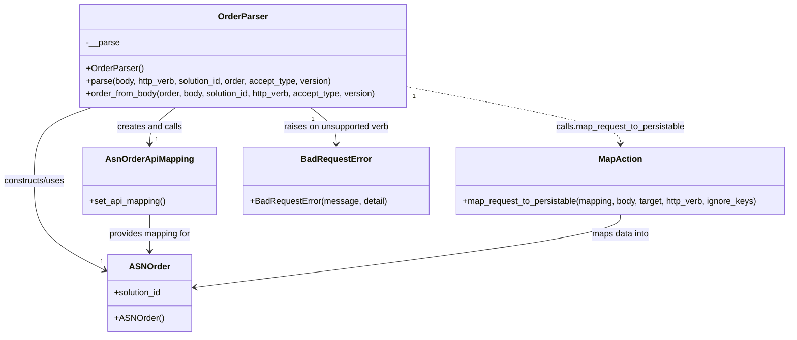

# Diagram: partview_core/partview_service/partview_service/api/asn_order/handlers/parse/OrderParser.py

> Auto-generated by Obscura crawlers

## Mermaid

### SVG

<svg id="container" width="1469.796875" xmlns="http://www.w3.org/2000/svg" class="classDiagram" height="626" viewBox="0 0 1469.796875 626" role="graphics-document document" aria-roledescription="class"><g><defs><marker id="container_class-aggregationStart" class="marker aggregation class" refX="18" refY="7" markerWidth="190" markerHeight="240" orient="auto"><path d="M 18,7 L9,13 L1,7 L9,1 Z"></path></marker></defs><defs><marker id="container_class-aggregationEnd" class="marker aggregation class" refX="1" refY="7" markerWidth="20" markerHeight="28" orient="auto"><path d="M 18,7 L9,13 L1,7 L9,1 Z"></path></marker></defs><defs><marker id="container_class-extensionStart" class="marker extension class" refX="18" refY="7" markerWidth="190" markerHeight="240" orient="auto"><path d="M 1,7 L18,13 V 1 Z"></path></marker></defs><defs><marker id="container_class-extensionEnd" class="marker extension class" refX="1" refY="7" markerWidth="20" markerHeight="28" orient="auto"><path d="M 1,1 V 13 L18,7 Z"></path></marker></defs><defs><marker id="container_class-compositionStart" class="marker composition class" refX="18" refY="7" markerWidth="190" markerHeight="240" orient="auto"><path d="M 18,7 L9,13 L1,7 L9,1 Z"></path></marker></defs><defs><marker id="container_class-compositionEnd" class="marker composition class" refX="1" refY="7" markerWidth="20" markerHeight="28" orient="auto"><path d="M 18,7 L9,13 L1,7 L9,1 Z"></path></marker></defs><defs><marker id="container_class-dependencyStart" class="marker dependency class" refX="6" refY="7" markerWidth="190" markerHeight="240" orient="auto"><path d="M 5,7 L9,13 L1,7 L9,1 Z"></path></marker></defs><defs><marker id="container_class-dependencyEnd" class="marker dependency class" refX="13" refY="7" markerWidth="20" markerHeight="28" orient="auto"><path d="M 18,7 L9,13 L14,7 L9,1 Z"></path></marker></defs><defs><marker id="container_class-lollipopStart" class="marker lollipop class" refX="13" refY="7" markerWidth="190" markerHeight="240" orient="auto"><circle stroke="black" fill="transparent" cx="7" cy="7" r="6"></circle></marker></defs><defs><marker id="container_class-lollipopEnd" class="marker lollipop class" refX="1" refY="7" markerWidth="190" markerHeight="240" orient="auto"><circle stroke="black" fill="transparent" cx="7" cy="7" r="6"></circle></marker></defs><g class="root"><g class="clusters"></g><g class="edgePaths"><path d="M173.756,200L155.838,206.167C137.92,212.333,102.085,224.667,84.168,247.5C66.25,270.333,66.25,303.667,66.25,337C66.25,370.333,66.25,403.667,88.786,431.735C111.322,459.804,156.394,482.607,178.93,494.009L201.467,505.411" id="id_OrderParser_ASNOrder_1" class="edge-thickness-normal edge-pattern-solid relation" style=";;;" data-edge="true" data-et="edge" data-id="id_OrderParser_ASNOrder_1" data-points="W3sieCI6MTczLjc1NTcxMjUyMzQ5NjI0LCJ5IjoyMDB9LHsieCI6NjYuMjUsInkiOjIzN30seyJ4Ijo2Ni4yNSwieSI6MzM3fSx7IngiOjY2LjI1LCJ5Ijo0Mzd9LHsieCI6MjA2LjgyMDMxMjUsInkiOjUwOC4xMTk4NjY1NTMwNDM0fV0=" marker-end="url(#container_class-dependencyEnd)"></path><path d="M329.262,200L321.334,206.167C313.405,212.333,297.548,224.667,289.62,236C281.691,247.333,281.691,257.667,281.691,262.833L281.691,268" id="id_OrderParser_AsnOrderApiMapping_2" class="edge-thickness-normal edge-pattern-solid relation" style=";;;" data-edge="true" data-et="edge" data-id="id_OrderParser_AsnOrderApiMapping_2" data-points="W3sieCI6MzI5LjI2MjI5MTQ3MDg2NDcsInkiOjIwMH0seyJ4IjoyODEuNjkxNDA2MjUsInkiOjIzN30seyJ4IjoyODEuNjkxNDA2MjUsInkiOjI3NH1d" marker-end="url(#container_class-dependencyEnd)"></path><path d="M761.811,162.737L826.95,175.114C892.089,187.491,1022.367,212.246,1087.506,229.789C1152.645,247.333,1152.645,257.667,1152.645,262.833L1152.645,268" id="id_OrderParser_MapAction_3" class="edge-thickness-normal edge-pattern-dashed relation" style=";;;" data-edge="true" data-et="edge" data-id="id_OrderParser_MapAction_3" data-points="W3sieCI6NzYxLjgxMDU0Njg3NSwieSI6MTYyLjczNjc3NzE5MjczMjh9LHsieCI6MTE1Mi42NDQ1MzEyNSwieSI6MjM3fSx7IngiOjExNTIuNjQ0NTMxMjUsInkiOjI3NH1d" marker-end="url(#container_class-dependencyEnd)"></path><path d="M576.117,200L584.045,206.167C591.974,212.333,607.831,224.667,615.759,236C623.688,247.333,623.688,257.667,623.688,262.833L623.688,268" id="id_OrderParser_BadRequestError_4" class="edge-thickness-normal edge-pattern-solid relation" style=";;;" data-edge="true" data-et="edge" data-id="id_OrderParser_BadRequestError_4" data-points="W3sieCI6NTc2LjExNjYxNDc3OTEzNTQsInkiOjIwMH0seyJ4Ijo2MjMuNjg3NSwieSI6MjM3fSx7IngiOjYyMy42ODc1LCJ5IjoyNzR9XQ==" marker-end="url(#container_class-dependencyEnd)"></path><path d="M281.691,400L281.691,406.167C281.691,412.333,281.691,424.667,281.691,436C281.691,447.333,281.691,457.667,281.691,462.833L281.691,468" id="id_AsnOrderApiMapping_ASNOrder_5" class="edge-thickness-normal edge-pattern-solid relation" style=";;;" data-edge="true" data-et="edge" data-id="id_AsnOrderApiMapping_ASNOrder_5" data-points="W3sieCI6MjgxLjY5MTQwNjI1LCJ5Ijo0MDB9LHsieCI6MjgxLjY5MTQwNjI1LCJ5Ijo0Mzd9LHsieCI6MjgxLjY5MTQwNjI1LCJ5Ijo0NzR9XQ==" marker-end="url(#container_class-dependencyEnd)"></path><path d="M1152.645,400L1152.645,406.167C1152.645,412.333,1152.645,424.667,1020.956,447.314C889.268,469.962,625.892,502.923,494.204,519.404L362.516,535.885" id="id_MapAction_ASNOrder_6" class="edge-thickness-normal edge-pattern-solid relation" style=";;;" data-edge="true" data-et="edge" data-id="id_MapAction_ASNOrder_6" data-points="W3sieCI6MTE1Mi42NDQ1MzEyNSwieSI6NDAwfSx7IngiOjExNTIuNjQ0NTMxMjUsInkiOjQzN30seyJ4IjozNTYuNTYyNSwieSI6NTM2LjYyOTg2NDAxMzkyMTV9XQ==" marker-end="url(#container_class-dependencyEnd)"></path></g><g class="edgeLabels"><g class="edgeLabel" transform="translate(66.25, 337)"><g class="label" data-id="id_OrderParser_ASNOrder_1" transform="translate(-58.25, -12)"><foreignObject width="116.5" height="24">

constructs/uses

</foreignObject></g></g><g class="edgeLabel" transform="translate(281.69140625, 237)"><g class="label" data-id="id_OrderParser_AsnOrderApiMapping_2" transform="translate(-60.6796875, -12)"><foreignObject width="121.359375" height="24">

creates and calls

</foreignObject></g></g><g class="edgeLabel" transform="translate(1152.64453125, 237)"><g class="label" data-id="id_OrderParser_MapAction_3" transform="translate(-121.8046875, -12)"><foreignObject width="243.609375" height="24">

calls.map_request_to_persistable

</foreignObject></g></g><g class="edgeLabel" transform="translate(623.6875, 237)"><g class="label" data-id="id_OrderParser_BadRequestError_4" transform="translate(-99.984375, -12)"><foreignObject width="199.96875" height="24">

raises on unsupported verb

</foreignObject></g></g><g class="edgeLabel" transform="translate(281.69140625, 437)"><g class="label" data-id="id_AsnOrderApiMapping_ASNOrder_5" transform="translate(-77.734375, -12)"><foreignObject width="155.46875" height="24">

provides mapping for

</foreignObject></g></g><g class="edgeLabel" transform="translate(1152.64453125, 437)"><g class="label" data-id="id_MapAction_ASNOrder_6" transform="translate(-54.640625, -12)"><foreignObject width="109.28125" height="24">

maps data into

</foreignObject></g></g><g class="edgeTerminals" transform="translate(152.3268248662642, 191.51160394718147)"><g class="inner" transform="translate(0, 0)"><foreignObject style="width: 9px; height: 12px;">
1
</foreignObject></g></g><g class="edgeTerminals" transform="translate(306.2395127504165, 198.9038013480802)"><g class="inner" transform="translate(0, 0)"><foreignObject style="width: 9px; height: 12px;">
1
</foreignObject></g></g><g class="edgeTerminals" transform="translate(776.2028574981947, 180.73987283298507)"><g class="inner" transform="translate(0, 0)"><foreignObject style="width: 9px; height: 12px;">
1
</foreignObject></g></g><g class="edgeTerminals" transform="translate(580.7210431064711, 222.58426764229017)"><g class="inner" transform="translate(0, 0)"><foreignObject style="width: 9px; height: 12px;">
1
</foreignObject></g></g><g class="edgeTerminals" transform="translate(192.97681109893887, 481.83507169313543)"><g class="inner" transform="translate(0, 0)"></g><foreignObject style="width: 9px; height: 12px;">
1
</foreignObject></g><g class="edgeTerminals" transform="translate(291.6914081249999, 251.50000160714285)"><g class="inner" transform="translate(0, 0)"></g><foreignObject style="width: 9px; height: 12px;">
1
</foreignObject></g></g><g class="nodes"><g class="node default" id="classId-OrderParser-0" transform="translate(452.689453125, 104)"><g class="basic label-container"><path d="M-309.12109375 -96 L309.12109375 -96 L309.12109375 96 L-309.12109375 96" stroke="none" stroke-width="0" fill="#ECECFF" style=""></path><path d="M-309.12109375 -96 C-137.62687073018955 -96, 33.8673522896209 -96, 309.12109375 -96 M-309.12109375 -96 C-93.22141915013717 -96, 122.67825544972567 -96, 309.12109375 -96 M309.12109375 -96 C309.12109375 -38.71276926705719, 309.12109375 18.57446146588562, 309.12109375 96 M309.12109375 -96 C309.12109375 -53.80592081984799, 309.12109375 -11.611841639695982, 309.12109375 96 M309.12109375 96 C127.88685124012753 96, -53.347391269744946 96, -309.12109375 96 M309.12109375 96 C85.95069615849553 96, -137.21970143300894 96, -309.12109375 96 M-309.12109375 96 C-309.12109375 21.748786767952083, -309.12109375 -52.502426464095834, -309.12109375 -96 M-309.12109375 96 C-309.12109375 39.04971278217528, -309.12109375 -17.900574435649446, -309.12109375 -96" stroke="#9370DB" stroke-width="1.3" fill="none" stroke-dasharray="0 0" style=""></path></g><g class="annotation-group text" transform="translate(0, -72)"></g><g class="label-group text" transform="translate(-44.2890625, -72)"><g class="label" style="font-weight: bolder" transform="translate(0,-12)"><foreignObject width="88.578125" height="24">

OrderParser

</foreignObject></g></g><g class="members-group text" transform="translate(-297.12109375, -24)"><g class="label" style="" transform="translate(0,-12)"><foreignObject width="61.828125" height="24">

-__parse

</foreignObject></g></g><g class="methods-group text" transform="translate(-297.12109375, 24)"><g class="label" style="" transform="translate(0,-12)"><foreignObject width="105.015625" height="24">

+OrderParser()

</foreignObject></g><g class="label" style="" transform="translate(0,12)"><foreignObject width="465.1875" height="24">

+parse(body, http_verb, solution_id, order, accept_type, version)

</foreignObject></g><g class="label" style="" transform="translate(0,36)"><foreignObject width="549.953125" height="24">

+order_from_body(order, body, solution_id, http_verb, accept_type, version)

</foreignObject></g></g><g class="divider" style=""><path d="M-309.12109375 -48 C-163.06108863944416 -48, -17.00108352888833 -48, 309.12109375 -48 M-309.12109375 -48 C-150.5042416480438 -48, 8.112610453912396 -48, 309.12109375 -48" stroke="#9370DB" stroke-width="1.3" fill="none" stroke-dasharray="0 0" style=""></path></g><g class="divider" style=""><path d="M-309.12109375 0 C-129.19610302752457 0, 50.728887694950856 0, 309.12109375 0 M-309.12109375 0 C-176.9796293212207 0, -44.8381648924414 0, 309.12109375 0" stroke="#9370DB" stroke-width="1.3" fill="none" stroke-dasharray="0 0" style=""></path></g></g><g class="node default" id="classId-ASNOrder-1" transform="translate(281.69140625, 546)"><g class="basic label-container"><path d="M-74.87109375 -72 L74.87109375 -72 L74.87109375 72 L-74.87109375 72" stroke="none" stroke-width="0" fill="#ECECFF" style=""></path><path d="M-74.87109375 -72 C-44.12972634264169 -72, -13.388358935283378 -72, 74.87109375 -72 M-74.87109375 -72 C-26.150973294971443 -72, 22.569147160057113 -72, 74.87109375 -72 M74.87109375 -72 C74.87109375 -41.80512269127369, 74.87109375 -11.610245382547376, 74.87109375 72 M74.87109375 -72 C74.87109375 -29.485517819189866, 74.87109375 13.028964361620268, 74.87109375 72 M74.87109375 72 C18.862928109516126 72, -37.14523753096775 72, -74.87109375 72 M74.87109375 72 C23.82389467957092 72, -27.22330439085816 72, -74.87109375 72 M-74.87109375 72 C-74.87109375 31.400237898791815, -74.87109375 -9.19952420241637, -74.87109375 -72 M-74.87109375 72 C-74.87109375 36.51810095571685, -74.87109375 1.0362019114336931, -74.87109375 -72" stroke="#9370DB" stroke-width="1.3" fill="none" stroke-dasharray="0 0" style=""></path></g><g class="annotation-group text" transform="translate(0, -48)"></g><g class="label-group text" transform="translate(-35.5234375, -48)"><g class="label" style="font-weight: bolder" transform="translate(0,-12)"><foreignObject width="71.046875" height="24">

ASNOrder

</foreignObject></g></g><g class="members-group text" transform="translate(-62.87109375, 0)"><g class="label" style="" transform="translate(0,-12)"><foreignObject width="90.21875" height="24">

+solution_id

</foreignObject></g></g><g class="methods-group text" transform="translate(-62.87109375, 48)"><g class="label" style="" transform="translate(0,-12)"><foreignObject width="88.25" height="24">

+ASNOrder()

</foreignObject></g></g><g class="divider" style=""><path d="M-74.87109375 -24 C-39.18277622451171 -24, -3.4944586990234257 -24, 74.87109375 -24 M-74.87109375 -24 C-40.20422766770198 -24, -5.537361585403957 -24, 74.87109375 -24" stroke="#9370DB" stroke-width="1.3" fill="none" stroke-dasharray="0 0" style=""></path></g><g class="divider" style=""><path d="M-74.87109375 24 C-30.819641238574455 24, 13.23181127285109 24, 74.87109375 24 M-74.87109375 24 C-37.28951902701531 24, 0.2920556959693812 24, 74.87109375 24" stroke="#9370DB" stroke-width="1.3" fill="none" stroke-dasharray="0 0" style=""></path></g></g><g class="node default" id="classId-AsnOrderApiMapping-2" transform="translate(281.69140625, 337)"><g class="basic label-container"><path d="M-122.19140625 -63 L122.19140625 -63 L122.19140625 63 L-122.19140625 63" stroke="none" stroke-width="0" fill="#ECECFF" style=""></path><path d="M-122.19140625 -63 C-48.381752183797275 -63, 25.42790188240545 -63, 122.19140625 -63 M-122.19140625 -63 C-60.95788797854686 -63, 0.2756302929062855 -63, 122.19140625 -63 M122.19140625 -63 C122.19140625 -20.982547197732472, 122.19140625 21.034905604535055, 122.19140625 63 M122.19140625 -63 C122.19140625 -17.24856887408366, 122.19140625 28.50286225183268, 122.19140625 63 M122.19140625 63 C65.33150078361936 63, 8.471595317238709 63, -122.19140625 63 M122.19140625 63 C52.606576032776374 63, -16.978254184447252 63, -122.19140625 63 M-122.19140625 63 C-122.19140625 25.761120354875295, -122.19140625 -11.47775929024941, -122.19140625 -63 M-122.19140625 63 C-122.19140625 14.781551683158476, -122.19140625 -33.43689663368305, -122.19140625 -63" stroke="#9370DB" stroke-width="1.3" fill="none" stroke-dasharray="0 0" style=""></path></g><g class="annotation-group text" transform="translate(0, -39)"></g><g class="label-group text" transform="translate(-77.3828125, -39)"><g class="label" style="font-weight: bolder" transform="translate(0,-12)"><foreignObject width="154.765625" height="24">

AsnOrderApiMapping

</foreignObject></g></g><g class="members-group text" transform="translate(-110.19140625, 9)"></g><g class="methods-group text" transform="translate(-110.19140625, 39)"><g class="label" style="" transform="translate(0,-12)"><foreignObject width="143" height="24">

+set_api_mapping()

</foreignObject></g></g><g class="divider" style=""><path d="M-122.19140625 -15 C-52.845997290992756 -15, 16.49941166801449 -15, 122.19140625 -15 M-122.19140625 -15 C-46.16557940463112 -15, 29.860247440737766 -15, 122.19140625 -15" stroke="#9370DB" stroke-width="1.3" fill="none" stroke-dasharray="0 0" style=""></path></g><g class="divider" style=""><path d="M-122.19140625 9 C-31.768419212361593 9, 58.654567825276814 9, 122.19140625 9 M-122.19140625 9 C-58.428135086469396 9, 5.3351360770612075 9, 122.19140625 9" stroke="#9370DB" stroke-width="1.3" fill="none" stroke-dasharray="0 0" style=""></path></g></g><g class="node default" id="classId-MapAction-3" transform="translate(1152.64453125, 337)"><g class="basic label-container"><path d="M-309.15234375 -63 L309.15234375 -63 L309.15234375 63 L-309.15234375 63" stroke="none" stroke-width="0" fill="#ECECFF" style=""></path><path d="M-309.15234375 -63 C-95.66831816033684 -63, 117.81570742932632 -63, 309.15234375 -63 M-309.15234375 -63 C-90.51220504594238 -63, 128.12793365811524 -63, 309.15234375 -63 M309.15234375 -63 C309.15234375 -31.496869128502127, 309.15234375 0.0062617429957469994, 309.15234375 63 M309.15234375 -63 C309.15234375 -17.432133880970525, 309.15234375 28.13573223805895, 309.15234375 63 M309.15234375 63 C155.41246404486117 63, 1.6725843397223343 63, -309.15234375 63 M309.15234375 63 C177.9280257565029 63, 46.70370776300581 63, -309.15234375 63 M-309.15234375 63 C-309.15234375 33.75115723981247, -309.15234375 4.502314479624943, -309.15234375 -63 M-309.15234375 63 C-309.15234375 35.94634784948528, -309.15234375 8.892695698970563, -309.15234375 -63" stroke="#9370DB" stroke-width="1.3" fill="none" stroke-dasharray="0 0" style=""></path></g><g class="annotation-group text" transform="translate(0, -39)"></g><g class="label-group text" transform="translate(-38.6328125, -39)"><g class="label" style="font-weight: bolder" transform="translate(0,-12)"><foreignObject width="77.265625" height="24">

MapAction

</foreignObject></g></g><g class="members-group text" transform="translate(-297.15234375, 9)"></g><g class="methods-group text" transform="translate(-297.15234375, 39)"><g class="label" style="" transform="translate(0,-12)"><foreignObject width="555.671875" height="24">

+map_request_to_persistable(mapping, body, target, http_verb, ignore_keys)

</foreignObject></g></g><g class="divider" style=""><path d="M-309.15234375 -15 C-64.0557506024557 -15, 181.0408425450886 -15, 309.15234375 -15 M-309.15234375 -15 C-115.13777380097287 -15, 78.87679614805427 -15, 309.15234375 -15" stroke="#9370DB" stroke-width="1.3" fill="none" stroke-dasharray="0 0" style=""></path></g><g class="divider" style=""><path d="M-309.15234375 9 C-150.22698358486792 9, 8.698376580264153 9, 309.15234375 9 M-309.15234375 9 C-151.24394025634163 9, 6.664463237316738 9, 309.15234375 9" stroke="#9370DB" stroke-width="1.3" fill="none" stroke-dasharray="0 0" style=""></path></g></g><g class="node default" id="classId-BadRequestError-4" transform="translate(623.6875, 337)"><g class="basic label-container"><path d="M-169.8046875 -63 L169.8046875 -63 L169.8046875 63 L-169.8046875 63" stroke="none" stroke-width="0" fill="#ECECFF" style=""></path><path d="M-169.8046875 -63 C-79.54512970155021 -63, 10.714428096899582 -63, 169.8046875 -63 M-169.8046875 -63 C-95.03276112323738 -63, -20.260834746474757 -63, 169.8046875 -63 M169.8046875 -63 C169.8046875 -29.38366845261411, 169.8046875 4.23266309477178, 169.8046875 63 M169.8046875 -63 C169.8046875 -20.979854327723032, 169.8046875 21.040291344553935, 169.8046875 63 M169.8046875 63 C48.85987559207473 63, -72.08493631585054 63, -169.8046875 63 M169.8046875 63 C61.914416976464324 63, -45.97585354707135 63, -169.8046875 63 M-169.8046875 63 C-169.8046875 27.22117824707783, -169.8046875 -8.55764350584434, -169.8046875 -63 M-169.8046875 63 C-169.8046875 27.93383034304776, -169.8046875 -7.132339313904481, -169.8046875 -63" stroke="#9370DB" stroke-width="1.3" fill="none" stroke-dasharray="0 0" style=""></path></g><g class="annotation-group text" transform="translate(0, -39)"></g><g class="label-group text" transform="translate(-62.28125, -39)"><g class="label" style="font-weight: bolder" transform="translate(0,-12)"><foreignObject width="124.5625" height="24">

BadRequestError

</foreignObject></g></g><g class="members-group text" transform="translate(-157.8046875, 9)"></g><g class="methods-group text" transform="translate(-157.8046875, 39)"><g class="label" style="" transform="translate(0,-12)"><foreignObject width="253.328125" height="24">

+BadRequestError(message, detail)

</foreignObject></g></g><g class="divider" style=""><path d="M-169.8046875 -15 C-41.85362736578172 -15, 86.09743276843656 -15, 169.8046875 -15 M-169.8046875 -15 C-46.2921122572281 -15, 77.2204629855438 -15, 169.8046875 -15" stroke="#9370DB" stroke-width="1.3" fill="none" stroke-dasharray="0 0" style=""></path></g><g class="divider" style=""><path d="M-169.8046875 9 C-79.09273254603777 9, 11.619222407924468 9, 169.8046875 9 M-169.8046875 9 C-47.155191835499295 9, 75.49430382900141 9, 169.8046875 9" stroke="#9370DB" stroke-width="1.3" fill="none" stroke-dasharray="0 0" style=""></path></g></g></g></g></g></svg>
