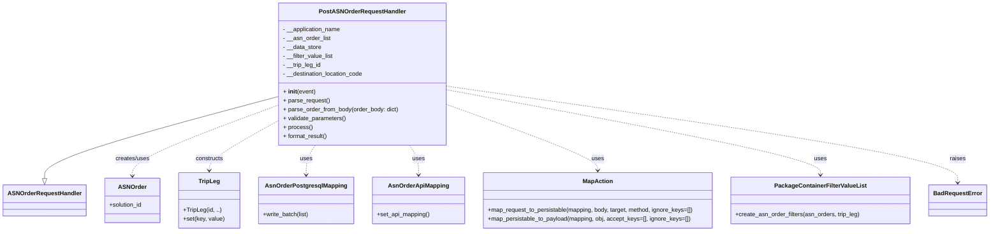
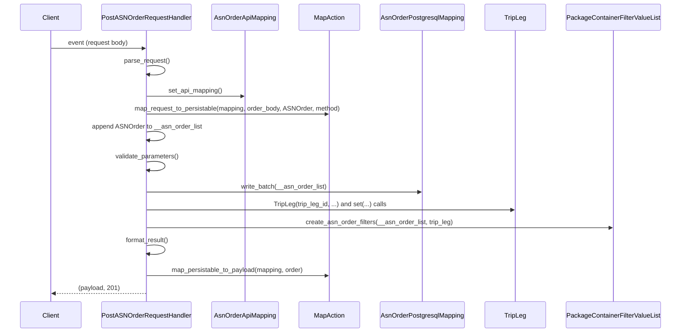

# Diagram: partview_core/partview_service/partview_service/api/asn_order/handlers/post_asn_order.py

> Auto-generated by Obscura crawlers

## Diagram 1

### SVG

<svg id="container" width="2638.859375" xmlns="http://www.w3.org/2000/svg" class="classDiagram" height="624" viewBox="0 0 2638.859375 624" role="graphics-document document" aria-roledescription="class"><g><defs><marker id="container_class-aggregationStart" class="marker aggregation class" refX="18" refY="7" markerWidth="190" markerHeight="240" orient="auto"><path d="M 18,7 L9,13 L1,7 L9,1 Z"></path></marker></defs><defs><marker id="container_class-aggregationEnd" class="marker aggregation class" refX="1" refY="7" markerWidth="20" markerHeight="28" orient="auto"><path d="M 18,7 L9,13 L1,7 L9,1 Z"></path></marker></defs><defs><marker id="container_class-extensionStart" class="marker extension class" refX="18" refY="7" markerWidth="190" markerHeight="240" orient="auto"><path d="M 1,7 L18,13 V 1 Z"></path></marker></defs><defs><marker id="container_class-extensionEnd" class="marker extension class" refX="1" refY="7" markerWidth="20" markerHeight="28" orient="auto"><path d="M 1,1 V 13 L18,7 Z"></path></marker></defs><defs><marker id="container_class-compositionStart" class="marker composition class" refX="18" refY="7" markerWidth="190" markerHeight="240" orient="auto"><path d="M 18,7 L9,13 L1,7 L9,1 Z"></path></marker></defs><defs><marker id="container_class-compositionEnd" class="marker composition class" refX="1" refY="7" markerWidth="20" markerHeight="28" orient="auto"><path d="M 18,7 L9,13 L1,7 L9,1 Z"></path></marker></defs><defs><marker id="container_class-dependencyStart" class="marker dependency class" refX="6" refY="7" markerWidth="190" markerHeight="240" orient="auto"><path d="M 5,7 L9,13 L1,7 L9,1 Z"></path></marker></defs><defs><marker id="container_class-dependencyEnd" class="marker dependency class" refX="13" refY="7" markerWidth="20" markerHeight="28" orient="auto"><path d="M 18,7 L9,13 L14,7 L9,1 Z"></path></marker></defs><defs><marker id="container_class-lollipopStart" class="marker lollipop class" refX="13" refY="7" markerWidth="190" markerHeight="240" orient="auto"><circle stroke="black" fill="transparent" cx="7" cy="7" r="6"></circle></marker></defs><defs><marker id="container_class-lollipopEnd" class="marker lollipop class" refX="1" refY="7" markerWidth="190" markerHeight="240" orient="auto"><circle stroke="black" fill="transparent" cx="7" cy="7" r="6"></circle></marker></defs><g class="root"><g class="clusters"></g><g class="edgePaths"><path d="M735.723,260.76L632.2,288.8C528.677,316.84,321.632,372.92,218.109,409.752C114.586,446.583,114.586,464.167,114.586,472.958L114.586,481.75" id="id_PostASNOrderRequestHandler_ASNOrderRequestHandler_1" class="edge-thickness-normal edge-pattern-solid relation" style=";;;" data-edge="true" data-et="edge" data-id="id_PostASNOrderRequestHandler_ASNOrderRequestHandler_1" data-points="W3sieCI6NzM1LjcyMjY1NjI1LCJ5IjoyNjAuNzYwMDQ2NzU3MDM4OTR9LHsieCI6MTE0LjU4NTkzNzUsInkiOjQyOX0seyJ4IjoxMTQuNTg1OTM3NSwieSI6NDk5fV0=" marker-end="url(#container_class-extensionEnd)"></path><path d="M735.723,283.664L670.776,307.887C605.829,332.11,475.936,380.555,410.99,412.444C346.043,444.333,346.043,459.667,346.043,467.333L346.043,475" id="id_PostASNOrderRequestHandler_ASNOrder_2" class="edge-thickness-normal edge-pattern-dashed relation" style=";;;" data-edge="true" data-et="edge" data-id="id_PostASNOrderRequestHandler_ASNOrder_2" data-points="W3sieCI6NzM1LjcyMjY1NjI1LCJ5IjoyODMuNjY0MzYzNjQ3OTMwNzd9LHsieCI6MzQ2LjA0Mjk2ODc1LCJ5Ijo0Mjl9LHsieCI6MzQ2LjA0Mjk2ODc1LCJ5Ijo0ODF9XQ==" marker-end="url(#container_class-dependencyEnd)"></path><path d="M735.723,325.909L705.111,343.091C674.499,360.272,613.275,394.636,582.663,416.985C552.051,439.333,552.051,449.667,552.051,454.833L552.051,460" id="id_PostASNOrderRequestHandler_TripLeg_3" class="edge-thickness-normal edge-pattern-dashed relation" style=";;;" data-edge="true" data-et="edge" data-id="id_PostASNOrderRequestHandler_TripLeg_3" data-points="W3sieCI6NzM1LjcyMjY1NjI1LCJ5IjozMjUuOTA4NjcxMzgzNTcyNTR9LHsieCI6NTUyLjA1MDc4MTI1LCJ5Ijo0Mjl9LHsieCI6NTUyLjA1MDc4MTI1LCJ5Ijo0NjZ9XQ==" marker-end="url(#container_class-dependencyEnd)"></path><path d="M834.548,392L830.517,398.167C826.486,404.333,818.425,416.667,814.394,430C810.363,443.333,810.363,457.667,810.363,464.833L810.363,472" id="id_PostASNOrderRequestHandler_AsnOrderPostgresqlMapping_4" class="edge-thickness-normal edge-pattern-dashed relation" style=";;;" data-edge="true" data-et="edge" data-id="id_PostASNOrderRequestHandler_AsnOrderPostgresqlMapping_4" data-points="W3sieCI6ODM0LjU0Nzk2NjcwMzA1NjgsInkiOjM5Mn0seyJ4Ijo4MTAuMzYzMjgxMjUsInkiOjQyOX0seyJ4Ijo4MTAuMzYzMjgxMjUsInkiOjQ3OH1d" marker-end="url(#container_class-dependencyEnd)"></path><path d="M1085.546,392L1089.577,398.167C1093.607,404.333,1101.669,416.667,1105.7,430C1109.73,443.333,1109.73,457.667,1109.73,464.833L1109.73,472" id="id_PostASNOrderRequestHandler_AsnOrderApiMapping_5" class="edge-thickness-normal edge-pattern-dashed relation" style=";;;" data-edge="true" data-et="edge" data-id="id_PostASNOrderRequestHandler_AsnOrderApiMapping_5" data-points="W3sieCI6MTA4NS41NDU3ODMyOTY5NDMyLCJ5IjozOTJ9LHsieCI6MTEwOS43MzA0Njg3NSwieSI6NDI5fSx7IngiOjExMDkuNzMwNDY4NzUsInkiOjQ3OH1d" marker-end="url(#container_class-dependencyEnd)"></path><path d="M1184.371,281.099L1252.555,305.749C1320.738,330.399,1457.105,379.7,1525.289,409.517C1593.473,439.333,1593.473,449.667,1593.473,454.833L1593.473,460" id="id_PostASNOrderRequestHandler_MapAction_6" class="edge-thickness-normal edge-pattern-dashed relation" style=";;;" data-edge="true" data-et="edge" data-id="id_PostASNOrderRequestHandler_MapAction_6" data-points="W3sieCI6MTE4NC4zNzEwOTM3NSwieSI6MjgxLjA5OTA3NjgyMDYxMjE0fSx7IngiOjE1OTMuNDcyNjU2MjUsInkiOjQyOX0seyJ4IjoxNTkzLjQ3MjY1NjI1LCJ5Ijo0NjZ9XQ==" marker-end="url(#container_class-dependencyEnd)"></path><path d="M1184.371,241.642L1352.586,272.868C1520.801,304.095,1857.23,366.547,2025.445,404.94C2193.66,443.333,2193.66,457.667,2193.66,464.833L2193.66,472" id="id_PostASNOrderRequestHandler_PackageContainerFilterValueList_7" class="edge-thickness-normal edge-pattern-dashed relation" style=";;;" data-edge="true" data-et="edge" data-id="id_PostASNOrderRequestHandler_PackageContainerFilterValueList_7" data-points="W3sieCI6MTE4NC4zNzEwOTM3NSwieSI6MjQxLjY0MjA5ODc2MzQ3NzQ2fSx7IngiOjIxOTMuNjYwMTU2MjUsInkiOjQyOX0seyJ4IjoyMTkzLjY2MDE1NjI1LCJ5Ijo0Nzh9XQ==" marker-end="url(#container_class-dependencyEnd)"></path><path d="M1184.371,232.176L1413.072,264.98C1641.773,297.784,2099.176,363.392,2327.877,406.863C2556.578,450.333,2556.578,471.667,2556.578,482.333L2556.578,493" id="id_PostASNOrderRequestHandler_BadRequestError_8" class="edge-thickness-normal edge-pattern-dashed relation" style=";;;" data-edge="true" data-et="edge" data-id="id_PostASNOrderRequestHandler_BadRequestError_8" data-points="W3sieCI6MTE4NC4zNzEwOTM3NSwieSI6MjMyLjE3NjE2MDcxOTUyODY3fSx7IngiOjI1NTYuNTc4MTI1LCJ5Ijo0Mjl9LHsieCI6MjU1Ni41NzgxMjUsInkiOjQ5OX1d" marker-end="url(#container_class-dependencyEnd)"></path></g><g class="edgeLabels"><g class="edgeLabel"><g class="label" data-id="id_PostASNOrderRequestHandler_ASNOrderRequestHandler_1" transform="translate(0, 0)"><foreignObject width="0" height="0">

</foreignObject></g></g><g class="edgeLabel" transform="translate(346.04296875, 429)"><g class="label" data-id="id_PostASNOrderRequestHandler_ASNOrder_2" transform="translate(-46.578125, -12)"><foreignObject width="93.15625" height="24">

creates/uses

</foreignObject></g></g><g class="edgeLabel" transform="translate(552.05078125, 429)"><g class="label" data-id="id_PostASNOrderRequestHandler_TripLeg_3" transform="translate(-37.84375, -12)"><foreignObject width="75.6875" height="24">

constructs

</foreignObject></g></g><g class="edgeLabel" transform="translate(810.36328125, 429)"><g class="label" data-id="id_PostASNOrderRequestHandler_AsnOrderPostgresqlMapping_4" transform="translate(-16.4921875, -12)"><foreignObject width="32.984375" height="24">

uses

</foreignObject></g></g><g class="edgeLabel" transform="translate(1109.73046875, 429)"><g class="label" data-id="id_PostASNOrderRequestHandler_AsnOrderApiMapping_5" transform="translate(-16.4921875, -12)"><foreignObject width="32.984375" height="24">

uses

</foreignObject></g></g><g class="edgeLabel" transform="translate(1593.47265625, 429)"><g class="label" data-id="id_PostASNOrderRequestHandler_MapAction_6" transform="translate(-16.4921875, -12)"><foreignObject width="32.984375" height="24">

uses

</foreignObject></g></g><g class="edgeLabel" transform="translate(2193.66015625, 429)"><g class="label" data-id="id_PostASNOrderRequestHandler_PackageContainerFilterValueList_7" transform="translate(-16.4921875, -12)"><foreignObject width="32.984375" height="24">

uses

</foreignObject></g></g><g class="edgeLabel" transform="translate(2556.578125, 429)"><g class="label" data-id="id_PostASNOrderRequestHandler_BadRequestError_8" transform="translate(-21.25, -12)"><foreignObject width="42.5" height="24">

raises

</foreignObject></g></g></g><g class="nodes"><g class="node default" id="classId-PostASNOrderRequestHandler-0" transform="translate(960.046875, 200)"><g class="basic label-container"><path d="M-224.32421875 -192 L224.32421875 -192 L224.32421875 192 L-224.32421875 192" stroke="none" stroke-width="0" fill="#ECECFF" style=""></path><path d="M-224.32421875 -192 C-97.57092476818777 -192, 29.18236921362447 -192, 224.32421875 -192 M-224.32421875 -192 C-76.39403423302028 -192, 71.53615028395944 -192, 224.32421875 -192 M224.32421875 -192 C224.32421875 -106.64396734322568, 224.32421875 -21.287934686451365, 224.32421875 192 M224.32421875 -192 C224.32421875 -53.66574890899193, 224.32421875 84.66850218201614, 224.32421875 192 M224.32421875 192 C80.10518166892547 192, -64.11385541214906 192, -224.32421875 192 M224.32421875 192 C103.83224389825179 192, -16.65973095349642 192, -224.32421875 192 M-224.32421875 192 C-224.32421875 52.85307476895022, -224.32421875 -86.29385046209956, -224.32421875 -192 M-224.32421875 192 C-224.32421875 53.70642276000143, -224.32421875 -84.58715447999714, -224.32421875 -192" stroke="#9370DB" stroke-width="1.3" fill="none" stroke-dasharray="0 0" style=""></path></g><g class="annotation-group text" transform="translate(0, -168)"></g><g class="label-group text" transform="translate(-110.7734375, -168)"><g class="label" style="font-weight: bolder" transform="translate(0,-12)"><foreignObject width="221.546875" height="24">

PostASNOrderRequestHandler

</foreignObject></g></g><g class="members-group text" transform="translate(-212.32421875, -120)"><g class="label" style="" transform="translate(0,-12)"><foreignObject width="157.796875" height="24">

- __application_name

</foreignObject></g><g class="label" style="" transform="translate(0,12)"><foreignObject width="129.078125" height="24">

- __asn_order_list

</foreignObject></g><g class="label" style="" transform="translate(0,36)"><foreignObject width="104.578125" height="24">

- __data_store

</foreignObject></g><g class="label" style="" transform="translate(0,60)"><foreignObject width="136.90625" height="24">

- __filter_value_list

</foreignObject></g><g class="label" style="" transform="translate(0,84)"><foreignObject width="104.78125" height="24">

- __trip_leg_id

</foreignObject></g><g class="label" style="" transform="translate(0,108)"><foreignObject width="220.265625" height="24">

- __destination_location_code

</foreignObject></g></g><g class="methods-group text" transform="translate(-212.32421875, 48)"><g class="label" style="" transform="translate(0,-12)"><foreignObject width="87.390625" height="24">

+ <strong>init</strong>(event)

</foreignObject></g><g class="label" style="" transform="translate(0,12)"><foreignObject width="126.046875" height="24">

+ parse_request()

</foreignObject></g><g class="label" style="" transform="translate(0,36)"><foreignObject width="313.875" height="24">

+ parse_order_from_body(order_body: dict)

</foreignObject></g><g class="label" style="" transform="translate(0,60)"><foreignObject width="170.953125" height="24">

+ validate_parameters()

</foreignObject></g><g class="label" style="" transform="translate(0,84)"><foreignObject width="77.96875" height="24">

+ process()

</foreignObject></g><g class="label" style="" transform="translate(0,108)"><foreignObject width="121.5" height="24">

+ format_result()

</foreignObject></g></g><g class="divider" style=""><path d="M-224.32421875 -144 C-101.3505386536449 -144, 21.623141442710192 -144, 224.32421875 -144 M-224.32421875 -144 C-108.855542835526 -144, 6.61313307894801 -144, 224.32421875 -144" stroke="#9370DB" stroke-width="1.3" fill="none" stroke-dasharray="0 0" style=""></path></g><g class="divider" style=""><path d="M-224.32421875 24 C-130.12049262546523 24, -35.916766500930464 24, 224.32421875 24 M-224.32421875 24 C-80.59472925043929 24, 63.13476024912143 24, 224.32421875 24" stroke="#9370DB" stroke-width="1.3" fill="none" stroke-dasharray="0 0" style=""></path></g></g><g class="node default" id="classId-ASNOrderRequestHandler-1" transform="translate(114.5859375, 541)"><g class="basic label-container"><path d="M-106.5859375 -42 L106.5859375 -42 L106.5859375 42 L-106.5859375 42" stroke="none" stroke-width="0" fill="#ECECFF" style=""></path><path d="M-106.5859375 -42 C-53.186604398392795 -42, 0.21272870321440962 -42, 106.5859375 -42 M-106.5859375 -42 C-60.49238073731659 -42, -14.398823974633174 -42, 106.5859375 -42 M106.5859375 -42 C106.5859375 -19.711286860573193, 106.5859375 2.577426278853615, 106.5859375 42 M106.5859375 -42 C106.5859375 -17.468467352709844, 106.5859375 7.063065294580312, 106.5859375 42 M106.5859375 42 C59.234123353881955 42, 11.88230920776391 42, -106.5859375 42 M106.5859375 42 C48.27968326199756 42, -10.026570976004876 42, -106.5859375 42 M-106.5859375 42 C-106.5859375 24.78335947005318, -106.5859375 7.566718940106362, -106.5859375 -42 M-106.5859375 42 C-106.5859375 24.809173479780227, -106.5859375 7.618346959560455, -106.5859375 -42" stroke="#9370DB" stroke-width="1.3" fill="none" stroke-dasharray="0 0" style=""></path></g><g class="annotation-group text" transform="translate(0, -18)"></g><g class="label-group text" transform="translate(-94.5859375, -18)"><g class="label" style="font-weight: bolder" transform="translate(0,-12)"><foreignObject width="189.171875" height="24">

ASNOrderRequestHandler

</foreignObject></g></g><g class="members-group text" transform="translate(-94.5859375, 30)"></g><g class="methods-group text" transform="translate(-94.5859375, 60)"></g><g class="divider" style=""><path d="M-106.5859375 6 C-39.174943414168624 6, 28.236050671662753 6, 106.5859375 6 M-106.5859375 6 C-59.00126373191295 6, -11.4165899638259 6, 106.5859375 6" stroke="#9370DB" stroke-width="1.3" fill="none" stroke-dasharray="0 0" style=""></path></g><g class="divider" style=""><path d="M-106.5859375 24 C-29.219163274567208 24, 48.147610950865584 24, 106.5859375 24 M-106.5859375 24 C-40.560715332329295 24, 25.46450683534141 24, 106.5859375 24" stroke="#9370DB" stroke-width="1.3" fill="none" stroke-dasharray="0 0" style=""></path></g></g><g class="node default" id="classId-ASNOrder-2" transform="translate(346.04296875, 541)"><g class="basic label-container"><path d="M-74.87109375 -60 L74.87109375 -60 L74.87109375 60 L-74.87109375 60" stroke="none" stroke-width="0" fill="#ECECFF" style=""></path><path d="M-74.87109375 -60 C-24.74450890608304 -60, 25.382075937833918 -60, 74.87109375 -60 M-74.87109375 -60 C-33.12228026743151 -60, 8.626533215136973 -60, 74.87109375 -60 M74.87109375 -60 C74.87109375 -15.675253208726737, 74.87109375 28.649493582546526, 74.87109375 60 M74.87109375 -60 C74.87109375 -25.9624603285245, 74.87109375 8.075079342951, 74.87109375 60 M74.87109375 60 C23.37678586367157 60, -28.117522022656857 60, -74.87109375 60 M74.87109375 60 C15.08804149108974 60, -44.69501076782052 60, -74.87109375 60 M-74.87109375 60 C-74.87109375 27.96877876046983, -74.87109375 -4.062442479060337, -74.87109375 -60 M-74.87109375 60 C-74.87109375 13.440371914801048, -74.87109375 -33.119256170397904, -74.87109375 -60" stroke="#9370DB" stroke-width="1.3" fill="none" stroke-dasharray="0 0" style=""></path></g><g class="annotation-group text" transform="translate(0, -36)"></g><g class="label-group text" transform="translate(-35.5234375, -36)"><g class="label" style="font-weight: bolder" transform="translate(0,-12)"><foreignObject width="71.046875" height="24">

ASNOrder

</foreignObject></g></g><g class="members-group text" transform="translate(-62.87109375, 12)"><g class="label" style="" transform="translate(0,-12)"><foreignObject width="90.21875" height="24">

+solution_id

</foreignObject></g></g><g class="methods-group text" transform="translate(-62.87109375, 60)"></g><g class="divider" style=""><path d="M-74.87109375 -12 C-42.09706836912198 -12, -9.323042988243955 -12, 74.87109375 -12 M-74.87109375 -12 C-38.9432696467374 -12, -3.0154455434747973 -12, 74.87109375 -12" stroke="#9370DB" stroke-width="1.3" fill="none" stroke-dasharray="0 0" style=""></path></g><g class="divider" style=""><path d="M-74.87109375 36 C-21.05556617856368 36, 32.75996139287264 36, 74.87109375 36 M-74.87109375 36 C-32.84085986895989 36, 9.189374012080222 36, 74.87109375 36" stroke="#9370DB" stroke-width="1.3" fill="none" stroke-dasharray="0 0" style=""></path></g></g><g class="node default" id="classId-TripLeg-3" transform="translate(552.05078125, 541)"><g class="basic label-container"><path d="M-81.13671875 -75 L81.13671875 -75 L81.13671875 75 L-81.13671875 75" stroke="none" stroke-width="0" fill="#ECECFF" style=""></path><path d="M-81.13671875 -75 C-30.484172705115526 -75, 20.168373339768948 -75, 81.13671875 -75 M-81.13671875 -75 C-44.535946185853696 -75, -7.935173621707392 -75, 81.13671875 -75 M81.13671875 -75 C81.13671875 -37.1012429297693, 81.13671875 0.7975141404614021, 81.13671875 75 M81.13671875 -75 C81.13671875 -37.51008116709675, 81.13671875 -0.020162334193500442, 81.13671875 75 M81.13671875 75 C41.57872215790437 75, 2.020725565808746 75, -81.13671875 75 M81.13671875 75 C43.99560935493057 75, 6.854499959861144 75, -81.13671875 75 M-81.13671875 75 C-81.13671875 40.65758683319573, -81.13671875 6.315173666391459, -81.13671875 -75 M-81.13671875 75 C-81.13671875 31.7784369793645, -81.13671875 -11.443126041271, -81.13671875 -75" stroke="#9370DB" stroke-width="1.3" fill="none" stroke-dasharray="0 0" style=""></path></g><g class="annotation-group text" transform="translate(0, -51)"></g><g class="label-group text" transform="translate(-27.0546875, -51)"><g class="label" style="font-weight: bolder" transform="translate(0,-12)"><foreignObject width="54.109375" height="24">

TripLeg

</foreignObject></g></g><g class="members-group text" transform="translate(-69.13671875, -3)"></g><g class="methods-group text" transform="translate(-69.13671875, 27)"><g class="label" style="" transform="translate(0,-12)"><foreignObject width="99.984375" height="24">

+TripLeg(id, ..)

</foreignObject></g><g class="label" style="" transform="translate(0,12)"><foreignObject width="111.21875" height="24">

+set(key, value)

</foreignObject></g></g><g class="divider" style=""><path d="M-81.13671875 -27 C-30.865170638575954 -27, 19.406377472848092 -27, 81.13671875 -27 M-81.13671875 -27 C-27.714336058889202 -27, 25.708046632221595 -27, 81.13671875 -27" stroke="#9370DB" stroke-width="1.3" fill="none" stroke-dasharray="0 0" style=""></path></g><g class="divider" style=""><path d="M-81.13671875 -3 C-25.926552926455287 -3, 29.283612897089426 -3, 81.13671875 -3 M-81.13671875 -3 C-25.251976207223755 -3, 30.63276633555249 -3, 81.13671875 -3" stroke="#9370DB" stroke-width="1.3" fill="none" stroke-dasharray="0 0" style=""></path></g></g><g class="node default" id="classId-AsnOrderPostgresqlMapping-4" transform="translate(810.36328125, 541)"><g class="basic label-container"><path d="M-127.17578125 -63 L127.17578125 -63 L127.17578125 63 L-127.17578125 63" stroke="none" stroke-width="0" fill="#ECECFF" style=""></path><path d="M-127.17578125 -63 C-34.17616846370336 -63, 58.823444322593275 -63, 127.17578125 -63 M-127.17578125 -63 C-42.295194464267425 -63, 42.58539232146515 -63, 127.17578125 -63 M127.17578125 -63 C127.17578125 -19.795608383183065, 127.17578125 23.40878323363387, 127.17578125 63 M127.17578125 -63 C127.17578125 -20.660274799384403, 127.17578125 21.679450401231193, 127.17578125 63 M127.17578125 63 C33.086630043497266 63, -61.00252116300547 63, -127.17578125 63 M127.17578125 63 C51.942500606237445 63, -23.29078003752511 63, -127.17578125 63 M-127.17578125 63 C-127.17578125 28.832451555314037, -127.17578125 -5.3350968893719255, -127.17578125 -63 M-127.17578125 63 C-127.17578125 21.731378812152435, -127.17578125 -19.53724237569513, -127.17578125 -63" stroke="#9370DB" stroke-width="1.3" fill="none" stroke-dasharray="0 0" style=""></path></g><g class="annotation-group text" transform="translate(0, -39)"></g><g class="label-group text" transform="translate(-104.5234375, -39)"><g class="label" style="font-weight: bolder" transform="translate(0,-12)"><foreignObject width="209.046875" height="24">

AsnOrderPostgresqlMapping

</foreignObject></g></g><g class="members-group text" transform="translate(-115.17578125, 9)"></g><g class="methods-group text" transform="translate(-115.17578125, 39)"><g class="label" style="" transform="translate(0,-12)"><foreignObject width="125.828125" height="24">

+write_batch(list)

</foreignObject></g></g><g class="divider" style=""><path d="M-127.17578125 -15 C-43.87296359064506 -15, 39.429854068709886 -15, 127.17578125 -15 M-127.17578125 -15 C-26.581943078509852 -15, 74.0118950929803 -15, 127.17578125 -15" stroke="#9370DB" stroke-width="1.3" fill="none" stroke-dasharray="0 0" style=""></path></g><g class="divider" style=""><path d="M-127.17578125 9 C-31.092464190135573 9, 64.99085286972885 9, 127.17578125 9 M-127.17578125 9 C-31.11939130411146 9, 64.93699864177708 9, 127.17578125 9" stroke="#9370DB" stroke-width="1.3" fill="none" stroke-dasharray="0 0" style=""></path></g></g><g class="node default" id="classId-AsnOrderApiMapping-5" transform="translate(1109.73046875, 541)"><g class="basic label-container"><path d="M-122.19140625 -63 L122.19140625 -63 L122.19140625 63 L-122.19140625 63" stroke="none" stroke-width="0" fill="#ECECFF" style=""></path><path d="M-122.19140625 -63 C-39.51811074444673 -63, 43.15518476110654 -63, 122.19140625 -63 M-122.19140625 -63 C-67.82055910016868 -63, -13.449711950337345 -63, 122.19140625 -63 M122.19140625 -63 C122.19140625 -20.22368421845016, 122.19140625 22.55263156309968, 122.19140625 63 M122.19140625 -63 C122.19140625 -36.337199793929884, 122.19140625 -9.674399587859767, 122.19140625 63 M122.19140625 63 C62.249397524869586 63, 2.307388799739172 63, -122.19140625 63 M122.19140625 63 C40.51218634174232 63, -41.16703356651536 63, -122.19140625 63 M-122.19140625 63 C-122.19140625 15.917950559420824, -122.19140625 -31.164098881158353, -122.19140625 -63 M-122.19140625 63 C-122.19140625 17.832211331138105, -122.19140625 -27.33557733772379, -122.19140625 -63" stroke="#9370DB" stroke-width="1.3" fill="none" stroke-dasharray="0 0" style=""></path></g><g class="annotation-group text" transform="translate(0, -39)"></g><g class="label-group text" transform="translate(-77.3828125, -39)"><g class="label" style="font-weight: bolder" transform="translate(0,-12)"><foreignObject width="154.765625" height="24">

AsnOrderApiMapping

</foreignObject></g></g><g class="members-group text" transform="translate(-110.19140625, 9)"></g><g class="methods-group text" transform="translate(-110.19140625, 39)"><g class="label" style="" transform="translate(0,-12)"><foreignObject width="143" height="24">

+set_api_mapping()

</foreignObject></g></g><g class="divider" style=""><path d="M-122.19140625 -15 C-26.71158395113649 -15, 68.76823834772702 -15, 122.19140625 -15 M-122.19140625 -15 C-52.43617295512361 -15, 17.31906033975278 -15, 122.19140625 -15" stroke="#9370DB" stroke-width="1.3" fill="none" stroke-dasharray="0 0" style=""></path></g><g class="divider" style=""><path d="M-122.19140625 9 C-38.305602036908454 9, 45.58020217618309 9, 122.19140625 9 M-122.19140625 9 C-72.7477865544776 9, -23.3041668589552 9, 122.19140625 9" stroke="#9370DB" stroke-width="1.3" fill="none" stroke-dasharray="0 0" style=""></path></g></g><g class="node default" id="classId-MapAction-6" transform="translate(1593.47265625, 541)"><g class="basic label-container"><path d="M-311.55078125 -75 L311.55078125 -75 L311.55078125 75 L-311.55078125 75" stroke="none" stroke-width="0" fill="#ECECFF" style=""></path><path d="M-311.55078125 -75 C-166.54315900571058 -75, -21.535536761421156 -75, 311.55078125 -75 M-311.55078125 -75 C-89.4089497722857 -75, 132.7328817054286 -75, 311.55078125 -75 M311.55078125 -75 C311.55078125 -39.86086495761621, 311.55078125 -4.721729915232416, 311.55078125 75 M311.55078125 -75 C311.55078125 -32.12723416799052, 311.55078125 10.745531664018955, 311.55078125 75 M311.55078125 75 C110.30539793255718 75, -90.93998538488563 75, -311.55078125 75 M311.55078125 75 C161.08017943267515 75, 10.609577615350304 75, -311.55078125 75 M-311.55078125 75 C-311.55078125 43.5895970961019, -311.55078125 12.179194192203802, -311.55078125 -75 M-311.55078125 75 C-311.55078125 24.824916068557506, -311.55078125 -25.350167862884987, -311.55078125 -75" stroke="#9370DB" stroke-width="1.3" fill="none" stroke-dasharray="0 0" style=""></path></g><g class="annotation-group text" transform="translate(0, -51)"></g><g class="label-group text" transform="translate(-38.6328125, -51)"><g class="label" style="font-weight: bolder" transform="translate(0,-12)"><foreignObject width="77.265625" height="24">

MapAction

</foreignObject></g></g><g class="members-group text" transform="translate(-299.55078125, -3)"></g><g class="methods-group text" transform="translate(-299.55078125, 27)"><g class="label" style="" transform="translate(0,-12)"><foreignObject width="560.46875" height="24">

+map_request_to_persistable(mapping, body, target, method, ignore_keys=[])

</foreignObject></g><g class="label" style="" transform="translate(0,12)"><foreignObject width="548.734375" height="24">

+map_persistable_to_payload(mapping, obj, accept_keys=[], ignore_keys=[])

</foreignObject></g></g><g class="divider" style=""><path d="M-311.55078125 -27 C-165.84353387424835 -27, -20.136286498496702 -27, 311.55078125 -27 M-311.55078125 -27 C-167.5937364533358 -27, -23.636691656671587 -27, 311.55078125 -27" stroke="#9370DB" stroke-width="1.3" fill="none" stroke-dasharray="0 0" style=""></path></g><g class="divider" style=""><path d="M-311.55078125 -3 C-102.66868297797893 -3, 106.21341529404214 -3, 311.55078125 -3 M-311.55078125 -3 C-69.42563728230613 -3, 172.69950668538775 -3, 311.55078125 -3" stroke="#9370DB" stroke-width="1.3" fill="none" stroke-dasharray="0 0" style=""></path></g></g><g class="node default" id="classId-BadRequestError-7" transform="translate(2556.578125, 541)"><g class="basic label-container"><path d="M-74.28125 -42 L74.28125 -42 L74.28125 42 L-74.28125 42" stroke="none" stroke-width="0" fill="#ECECFF" style=""></path><path d="M-74.28125 -42 C-19.575405548378072 -42, 35.130438903243856 -42, 74.28125 -42 M-74.28125 -42 C-14.951597512812974 -42, 44.37805497437405 -42, 74.28125 -42 M74.28125 -42 C74.28125 -9.31895603042566, 74.28125 23.36208793914868, 74.28125 42 M74.28125 -42 C74.28125 -13.314696050993035, 74.28125 15.37060789801393, 74.28125 42 M74.28125 42 C26.60849995224443 42, -21.06425009551114 42, -74.28125 42 M74.28125 42 C19.8891199735976 42, -34.5030100528048 42, -74.28125 42 M-74.28125 42 C-74.28125 23.809063851438967, -74.28125 5.618127702877935, -74.28125 -42 M-74.28125 42 C-74.28125 24.33459426584346, -74.28125 6.66918853168692, -74.28125 -42" stroke="#9370DB" stroke-width="1.3" fill="none" stroke-dasharray="0 0" style=""></path></g><g class="annotation-group text" transform="translate(0, -18)"></g><g class="label-group text" transform="translate(-62.28125, -18)"><g class="label" style="font-weight: bolder" transform="translate(0,-12)"><foreignObject width="124.5625" height="24">

BadRequestError

</foreignObject></g></g><g class="members-group text" transform="translate(-62.28125, 30)"></g><g class="methods-group text" transform="translate(-62.28125, 60)"></g><g class="divider" style=""><path d="M-74.28125 6 C-24.469082208745853 6, 25.343085582508294 6, 74.28125 6 M-74.28125 6 C-35.12591470219292 6, 4.029420595614155 6, 74.28125 6" stroke="#9370DB" stroke-width="1.3" fill="none" stroke-dasharray="0 0" style=""></path></g><g class="divider" style=""><path d="M-74.28125 24 C-44.247849832738055 24, -14.214449665476117 24, 74.28125 24 M-74.28125 24 C-25.05424804410594 24, 24.17275391178812 24, 74.28125 24" stroke="#9370DB" stroke-width="1.3" fill="none" stroke-dasharray="0 0" style=""></path></g></g><g class="node default" id="classId-PackageContainerFilterValueList-8" transform="translate(2193.66015625, 541)"><g class="basic label-container"><path d="M-238.63671875 -63 L238.63671875 -63 L238.63671875 63 L-238.63671875 63" stroke="none" stroke-width="0" fill="#ECECFF" style=""></path><path d="M-238.63671875 -63 C-111.50068034603014 -63, 15.635358057939726 -63, 238.63671875 -63 M-238.63671875 -63 C-109.1440818284346 -63, 20.348555093130813 -63, 238.63671875 -63 M238.63671875 -63 C238.63671875 -12.62743329224837, 238.63671875 37.74513341550326, 238.63671875 63 M238.63671875 -63 C238.63671875 -21.58109409271008, 238.63671875 19.837811814579837, 238.63671875 63 M238.63671875 63 C78.09871995289183 63, -82.43927884421635 63, -238.63671875 63 M238.63671875 63 C89.75305770242076 63, -59.13060334515848 63, -238.63671875 63 M-238.63671875 63 C-238.63671875 23.603946412598113, -238.63671875 -15.792107174803775, -238.63671875 -63 M-238.63671875 63 C-238.63671875 36.6504721642131, -238.63671875 10.300944328426198, -238.63671875 -63" stroke="#9370DB" stroke-width="1.3" fill="none" stroke-dasharray="0 0" style=""></path></g><g class="annotation-group text" transform="translate(0, -39)"></g><g class="label-group text" transform="translate(-117.5390625, -39)"><g class="label" style="font-weight: bolder" transform="translate(0,-12)"><foreignObject width="235.078125" height="24">

PackageContainerFilterValueList

</foreignObject></g></g><g class="members-group text" transform="translate(-226.63671875, 9)"></g><g class="methods-group text" transform="translate(-226.63671875, 39)"><g class="label" style="" transform="translate(0,-12)"><foreignObject width="335.734375" height="24">

+create_asn_order_filters(asn_orders, trip_leg)

</foreignObject></g></g><g class="divider" style=""><path d="M-238.63671875 -15 C-98.94513961259469 -15, 40.746439524810626 -15, 238.63671875 -15 M-238.63671875 -15 C-97.46021333071565 -15, 43.71629208856871 -15, 238.63671875 -15" stroke="#9370DB" stroke-width="1.3" fill="none" stroke-dasharray="0 0" style=""></path></g><g class="divider" style=""><path d="M-238.63671875 9 C-99.69629961798361 9, 39.244119514032775 9, 238.63671875 9 M-238.63671875 9 C-132.9243009315652 9, -27.211883113130398 9, 238.63671875 9" stroke="#9370DB" stroke-width="1.3" fill="none" stroke-dasharray="0 0" style=""></path></g></g></g></g></g></svg>

## Diagram 2

### SVG

<svg id="container" width="1739" xmlns="http://www.w3.org/2000/svg" height="867" viewBox="-50 -10 1739 867" role="graphics-document document" aria-roledescription="sequence"><g><rect x="1388" y="781" fill="#eaeaea" stroke="#666" width="251" height="65" name="FilterList" rx="3" ry="3" class="actor actor-bottom"></rect><text x="1513.5" y="813.5" dominant-baseline="central" alignment-baseline="central" class="actor actor-box" style="text-anchor: middle; font-size: 16px; font-weight: 400;"><tspan x="1513.5" dy="0">PackageContainerFilterValueList</tspan></text></g><g><rect x="1188" y="781" fill="#eaeaea" stroke="#666" width="150" height="65" name="TripLegClass" rx="3" ry="3" class="actor actor-bottom"></rect><text x="1263" y="813.5" dominant-baseline="central" alignment-baseline="central" class="actor actor-box" style="text-anchor: middle; font-size: 16px; font-weight: 400;"><tspan x="1263" dy="0">TripLeg</tspan></text></g><g><rect x="912" y="781" fill="#eaeaea" stroke="#666" width="226" height="65" name="DataStore" rx="3" ry="3" class="actor actor-bottom"></rect><text x="1025" y="813.5" dominant-baseline="central" alignment-baseline="central" class="actor actor-box" style="text-anchor: middle; font-size: 16px; font-weight: 400;"><tspan x="1025" dy="0">AsnOrderPostgresqlMapping</tspan></text></g><g><rect x="712" y="781" fill="#eaeaea" stroke="#666" width="150" height="65" name="Mapper" rx="3" ry="3" class="actor actor-bottom"></rect><text x="787" y="813.5" dominant-baseline="central" alignment-baseline="central" class="actor actor-box" style="text-anchor: middle; font-size: 16px; font-weight: 400;"><tspan x="787" dy="0">MapAction</tspan></text></g><g><rect x="489" y="781" fill="#eaeaea" stroke="#666" width="173" height="65" name="Mapping" rx="3" ry="3" class="actor actor-bottom"></rect><text x="575.5" y="813.5" dominant-baseline="central" alignment-baseline="central" class="actor actor-box" style="text-anchor: middle; font-size: 16px; font-weight: 400;"><tspan x="575.5" dy="0">AsnOrderApiMapping</tspan></text></g><g><rect x="200" y="781" fill="#eaeaea" stroke="#666" width="239" height="65" name="Handler" rx="3" ry="3" class="actor actor-bottom"></rect><text x="319.5" y="813.5" dominant-baseline="central" alignment-baseline="central" class="actor actor-box" style="text-anchor: middle; font-size: 16px; font-weight: 400;"><tspan x="319.5" dy="0">PostASNOrderRequestHandler</tspan></text></g><g><rect x="0" y="781" fill="#eaeaea" stroke="#666" width="150" height="65" name="Client" rx="3" ry="3" class="actor actor-bottom"></rect><text x="75" y="813.5" dominant-baseline="central" alignment-baseline="central" class="actor actor-box" style="text-anchor: middle; font-size: 16px; font-weight: 400;"><tspan x="75" dy="0">Client</tspan></text></g><g><line id="actor6" x1="1513.5" y1="65" x2="1513.5" y2="781" class="actor-line 200" stroke-width="0.5px" stroke="#999" name="FilterList"></line><g id="root-6"><rect x="1388" y="0" fill="#eaeaea" stroke="#666" width="251" height="65" name="FilterList" rx="3" ry="3" class="actor actor-top"></rect><text x="1513.5" y="32.5" dominant-baseline="central" alignment-baseline="central" class="actor actor-box" style="text-anchor: middle; font-size: 16px; font-weight: 400;"><tspan x="1513.5" dy="0">PackageContainerFilterValueList</tspan></text></g></g><g><line id="actor5" x1="1263" y1="65" x2="1263" y2="781" class="actor-line 200" stroke-width="0.5px" stroke="#999" name="TripLegClass"></line><g id="root-5"><rect x="1188" y="0" fill="#eaeaea" stroke="#666" width="150" height="65" name="TripLegClass" rx="3" ry="3" class="actor actor-top"></rect><text x="1263" y="32.5" dominant-baseline="central" alignment-baseline="central" class="actor actor-box" style="text-anchor: middle; font-size: 16px; font-weight: 400;"><tspan x="1263" dy="0">TripLeg</tspan></text></g></g><g><line id="actor4" x1="1025" y1="65" x2="1025" y2="781" class="actor-line 200" stroke-width="0.5px" stroke="#999" name="DataStore"></line><g id="root-4"><rect x="912" y="0" fill="#eaeaea" stroke="#666" width="226" height="65" name="DataStore" rx="3" ry="3" class="actor actor-top"></rect><text x="1025" y="32.5" dominant-baseline="central" alignment-baseline="central" class="actor actor-box" style="text-anchor: middle; font-size: 16px; font-weight: 400;"><tspan x="1025" dy="0">AsnOrderPostgresqlMapping</tspan></text></g></g><g><line id="actor3" x1="787" y1="65" x2="787" y2="781" class="actor-line 200" stroke-width="0.5px" stroke="#999" name="Mapper"></line><g id="root-3"><rect x="712" y="0" fill="#eaeaea" stroke="#666" width="150" height="65" name="Mapper" rx="3" ry="3" class="actor actor-top"></rect><text x="787" y="32.5" dominant-baseline="central" alignment-baseline="central" class="actor actor-box" style="text-anchor: middle; font-size: 16px; font-weight: 400;"><tspan x="787" dy="0">MapAction</tspan></text></g></g><g><line id="actor2" x1="575.5" y1="65" x2="575.5" y2="781" class="actor-line 200" stroke-width="0.5px" stroke="#999" name="Mapping"></line><g id="root-2"><rect x="489" y="0" fill="#eaeaea" stroke="#666" width="173" height="65" name="Mapping" rx="3" ry="3" class="actor actor-top"></rect><text x="575.5" y="32.5" dominant-baseline="central" alignment-baseline="central" class="actor actor-box" style="text-anchor: middle; font-size: 16px; font-weight: 400;"><tspan x="575.5" dy="0">AsnOrderApiMapping</tspan></text></g></g><g><line id="actor1" x1="319.5" y1="65" x2="319.5" y2="781" class="actor-line 200" stroke-width="0.5px" stroke="#999" name="Handler"></line><g id="root-1"><rect x="200" y="0" fill="#eaeaea" stroke="#666" width="239" height="65" name="Handler" rx="3" ry="3" class="actor actor-top"></rect><text x="319.5" y="32.5" dominant-baseline="central" alignment-baseline="central" class="actor actor-box" style="text-anchor: middle; font-size: 16px; font-weight: 400;"><tspan x="319.5" dy="0">PostASNOrderRequestHandler</tspan></text></g></g><g><line id="actor0" x1="75" y1="65" x2="75" y2="781" class="actor-line 200" stroke-width="0.5px" stroke="#999" name="Client"></line><g id="root-0"><rect x="0" y="0" fill="#eaeaea" stroke="#666" width="150" height="65" name="Client" rx="3" ry="3" class="actor actor-top"></rect><text x="75" y="32.5" dominant-baseline="central" alignment-baseline="central" class="actor actor-box" style="text-anchor: middle; font-size: 16px; font-weight: 400;"><tspan x="75" dy="0">Client</tspan></text></g></g><g></g><defs><symbol id="computer" width="24" height="24"><path transform="scale(.5)" d="M2 2v13h20v-13h-20zm18 11h-16v-9h16v9zm-10.228 6l.466-1h3.524l.467 1h-4.457zm14.228 3h-24l2-6h2.104l-1.33 4h18.45l-1.297-4h2.073l2 6zm-5-10h-14v-7h14v7z"></path></symbol></defs><defs><symbol id="database" fill-rule="evenodd" clip-rule="evenodd"><path transform="scale(.5)" d="M12.258.001l.256.004.255.005.253.008.251.01.249.012.247.015.246.016.242.019.241.02.239.023.236.024.233.027.231.028.229.031.225.032.223.034.22.036.217.038.214.04.211.041.208.043.205.045.201.046.198.048.194.05.191.051.187.053.183.054.18.056.175.057.172.059.168.06.163.061.16.063.155.064.15.066.074.033.073.033.071.034.07.034.069.035.068.035.067.035.066.035.064.036.064.036.062.036.06.036.06.037.058.037.058.037.055.038.055.038.053.038.052.038.051.039.05.039.048.039.047.039.045.04.044.04.043.04.041.04.04.041.039.041.037.041.036.041.034.041.033.042.032.042.03.042.029.042.027.042.026.043.024.043.023.043.021.043.02.043.018.044.017.043.015.044.013.044.012.044.011.045.009.044.007.045.006.045.004.045.002.045.001.045v17l-.001.045-.002.045-.004.045-.006.045-.007.045-.009.044-.011.045-.012.044-.013.044-.015.044-.017.043-.018.044-.02.043-.021.043-.023.043-.024.043-.026.043-.027.042-.029.042-.03.042-.032.042-.033.042-.034.041-.036.041-.037.041-.039.041-.04.041-.041.04-.043.04-.044.04-.045.04-.047.039-.048.039-.05.039-.051.039-.052.038-.053.038-.055.038-.055.038-.058.037-.058.037-.06.037-.06.036-.062.036-.064.036-.064.036-.066.035-.067.035-.068.035-.069.035-.07.034-.071.034-.073.033-.074.033-.15.066-.155.064-.16.063-.163.061-.168.06-.172.059-.175.057-.18.056-.183.054-.187.053-.191.051-.194.05-.198.048-.201.046-.205.045-.208.043-.211.041-.214.04-.217.038-.22.036-.223.034-.225.032-.229.031-.231.028-.233.027-.236.024-.239.023-.241.02-.242.019-.246.016-.247.015-.249.012-.251.01-.253.008-.255.005-.256.004-.258.001-.258-.001-.256-.004-.255-.005-.253-.008-.251-.01-.249-.012-.247-.015-.245-.016-.243-.019-.241-.02-.238-.023-.236-.024-.234-.027-.231-.028-.228-.031-.226-.032-.223-.034-.22-.036-.217-.038-.214-.04-.211-.041-.208-.043-.204-.045-.201-.046-.198-.048-.195-.05-.19-.051-.187-.053-.184-.054-.179-.056-.176-.057-.172-.059-.167-.06-.164-.061-.159-.063-.155-.064-.151-.066-.074-.033-.072-.033-.072-.034-.07-.034-.069-.035-.068-.035-.067-.035-.066-.035-.064-.036-.063-.036-.062-.036-.061-.036-.06-.037-.058-.037-.057-.037-.056-.038-.055-.038-.053-.038-.052-.038-.051-.039-.049-.039-.049-.039-.046-.039-.046-.04-.044-.04-.043-.04-.041-.04-.04-.041-.039-.041-.037-.041-.036-.041-.034-.041-.033-.042-.032-.042-.03-.042-.029-.042-.027-.042-.026-.043-.024-.043-.023-.043-.021-.043-.02-.043-.018-.044-.017-.043-.015-.044-.013-.044-.012-.044-.011-.045-.009-.044-.007-.045-.006-.045-.004-.045-.002-.045-.001-.045v-17l.001-.045.002-.045.004-.045.006-.045.007-.045.009-.044.011-.045.012-.044.013-.044.015-.044.017-.043.018-.044.02-.043.021-.043.023-.043.024-.043.026-.043.027-.042.029-.042.03-.042.032-.042.033-.042.034-.041.036-.041.037-.041.039-.041.04-.041.041-.04.043-.04.044-.04.046-.04.046-.039.049-.039.049-.039.051-.039.052-.038.053-.038.055-.038.056-.038.057-.037.058-.037.06-.037.061-.036.062-.036.063-.036.064-.036.066-.035.067-.035.068-.035.069-.035.07-.034.072-.034.072-.033.074-.033.151-.066.155-.064.159-.063.164-.061.167-.06.172-.059.176-.057.179-.056.184-.054.187-.053.19-.051.195-.05.198-.048.201-.046.204-.045.208-.043.211-.041.214-.04.217-.038.22-.036.223-.034.226-.032.228-.031.231-.028.234-.027.236-.024.238-.023.241-.02.243-.019.245-.016.247-.015.249-.012.251-.01.253-.008.255-.005.256-.004.258-.001.258.001zm-9.258 20.499v.01l.001.021.003.021.004.022.005.021.006.022.007.022.009.023.01.022.011.023.012.023.013.023.015.023.016.024.017.023.018.024.019.024.021.024.022.025.023.024.024.025.052.049.056.05.061.051.066.051.07.051.075.051.079.052.084.052.088.052.092.052.097.052.102.051.105.052.11.052.114.051.119.051.123.051.127.05.131.05.135.05.139.048.144.049.147.047.152.047.155.047.16.045.163.045.167.043.171.043.176.041.178.041.183.039.187.039.19.037.194.035.197.035.202.033.204.031.209.03.212.029.216.027.219.025.222.024.226.021.23.02.233.018.236.016.24.015.243.012.246.01.249.008.253.005.256.004.259.001.26-.001.257-.004.254-.005.25-.008.247-.011.244-.012.241-.014.237-.016.233-.018.231-.021.226-.021.224-.024.22-.026.216-.027.212-.028.21-.031.205-.031.202-.034.198-.034.194-.036.191-.037.187-.039.183-.04.179-.04.175-.042.172-.043.168-.044.163-.045.16-.046.155-.046.152-.047.148-.048.143-.049.139-.049.136-.05.131-.05.126-.05.123-.051.118-.052.114-.051.11-.052.106-.052.101-.052.096-.052.092-.052.088-.053.083-.051.079-.052.074-.052.07-.051.065-.051.06-.051.056-.05.051-.05.023-.024.023-.025.021-.024.02-.024.019-.024.018-.024.017-.024.015-.023.014-.024.013-.023.012-.023.01-.023.01-.022.008-.022.006-.022.006-.022.004-.022.004-.021.001-.021.001-.021v-4.127l-.077.055-.08.053-.083.054-.085.053-.087.052-.09.052-.093.051-.095.05-.097.05-.1.049-.102.049-.105.048-.106.047-.109.047-.111.046-.114.045-.115.045-.118.044-.12.043-.122.042-.124.042-.126.041-.128.04-.13.04-.132.038-.134.038-.135.037-.138.037-.139.035-.142.035-.143.034-.144.033-.147.032-.148.031-.15.03-.151.03-.153.029-.154.027-.156.027-.158.026-.159.025-.161.024-.162.023-.163.022-.165.021-.166.02-.167.019-.169.018-.169.017-.171.016-.173.015-.173.014-.175.013-.175.012-.177.011-.178.01-.179.008-.179.008-.181.006-.182.005-.182.004-.184.003-.184.002h-.37l-.184-.002-.184-.003-.182-.004-.182-.005-.181-.006-.179-.008-.179-.008-.178-.01-.176-.011-.176-.012-.175-.013-.173-.014-.172-.015-.171-.016-.17-.017-.169-.018-.167-.019-.166-.02-.165-.021-.163-.022-.162-.023-.161-.024-.159-.025-.157-.026-.156-.027-.155-.027-.153-.029-.151-.03-.15-.03-.148-.031-.146-.032-.145-.033-.143-.034-.141-.035-.14-.035-.137-.037-.136-.037-.134-.038-.132-.038-.13-.04-.128-.04-.126-.041-.124-.042-.122-.042-.12-.044-.117-.043-.116-.045-.113-.045-.112-.046-.109-.047-.106-.047-.105-.048-.102-.049-.1-.049-.097-.05-.095-.05-.093-.052-.09-.051-.087-.052-.085-.053-.083-.054-.08-.054-.077-.054v4.127zm0-5.654v.011l.001.021.003.021.004.021.005.022.006.022.007.022.009.022.01.022.011.023.012.023.013.023.015.024.016.023.017.024.018.024.019.024.021.024.022.024.023.025.024.024.052.05.056.05.061.05.066.051.07.051.075.052.079.051.084.052.088.052.092.052.097.052.102.052.105.052.11.051.114.051.119.052.123.05.127.051.131.05.135.049.139.049.144.048.147.048.152.047.155.046.16.045.163.045.167.044.171.042.176.042.178.04.183.04.187.038.19.037.194.036.197.034.202.033.204.032.209.03.212.028.216.027.219.025.222.024.226.022.23.02.233.018.236.016.24.014.243.012.246.01.249.008.253.006.256.003.259.001.26-.001.257-.003.254-.006.25-.008.247-.01.244-.012.241-.015.237-.016.233-.018.231-.02.226-.022.224-.024.22-.025.216-.027.212-.029.21-.03.205-.032.202-.033.198-.035.194-.036.191-.037.187-.039.183-.039.179-.041.175-.042.172-.043.168-.044.163-.045.16-.045.155-.047.152-.047.148-.048.143-.048.139-.05.136-.049.131-.05.126-.051.123-.051.118-.051.114-.052.11-.052.106-.052.101-.052.096-.052.092-.052.088-.052.083-.052.079-.052.074-.051.07-.052.065-.051.06-.05.056-.051.051-.049.023-.025.023-.024.021-.025.02-.024.019-.024.018-.024.017-.024.015-.023.014-.023.013-.024.012-.022.01-.023.01-.023.008-.022.006-.022.006-.022.004-.021.004-.022.001-.021.001-.021v-4.139l-.077.054-.08.054-.083.054-.085.052-.087.053-.09.051-.093.051-.095.051-.097.05-.1.049-.102.049-.105.048-.106.047-.109.047-.111.046-.114.045-.115.044-.118.044-.12.044-.122.042-.124.042-.126.041-.128.04-.13.039-.132.039-.134.038-.135.037-.138.036-.139.036-.142.035-.143.033-.144.033-.147.033-.148.031-.15.03-.151.03-.153.028-.154.028-.156.027-.158.026-.159.025-.161.024-.162.023-.163.022-.165.021-.166.02-.167.019-.169.018-.169.017-.171.016-.173.015-.173.014-.175.013-.175.012-.177.011-.178.009-.179.009-.179.007-.181.007-.182.005-.182.004-.184.003-.184.002h-.37l-.184-.002-.184-.003-.182-.004-.182-.005-.181-.007-.179-.007-.179-.009-.178-.009-.176-.011-.176-.012-.175-.013-.173-.014-.172-.015-.171-.016-.17-.017-.169-.018-.167-.019-.166-.02-.165-.021-.163-.022-.162-.023-.161-.024-.159-.025-.157-.026-.156-.027-.155-.028-.153-.028-.151-.03-.15-.03-.148-.031-.146-.033-.145-.033-.143-.033-.141-.035-.14-.036-.137-.036-.136-.037-.134-.038-.132-.039-.13-.039-.128-.04-.126-.041-.124-.042-.122-.043-.12-.043-.117-.044-.116-.044-.113-.046-.112-.046-.109-.046-.106-.047-.105-.048-.102-.049-.1-.049-.097-.05-.095-.051-.093-.051-.09-.051-.087-.053-.085-.052-.083-.054-.08-.054-.077-.054v4.139zm0-5.666v.011l.001.02.003.022.004.021.005.022.006.021.007.022.009.023.01.022.011.023.012.023.013.023.015.023.016.024.017.024.018.023.019.024.021.025.022.024.023.024.024.025.052.05.056.05.061.05.066.051.07.051.075.052.079.051.084.052.088.052.092.052.097.052.102.052.105.051.11.052.114.051.119.051.123.051.127.05.131.05.135.05.139.049.144.048.147.048.152.047.155.046.16.045.163.045.167.043.171.043.176.042.178.04.183.04.187.038.19.037.194.036.197.034.202.033.204.032.209.03.212.028.216.027.219.025.222.024.226.021.23.02.233.018.236.017.24.014.243.012.246.01.249.008.253.006.256.003.259.001.26-.001.257-.003.254-.006.25-.008.247-.01.244-.013.241-.014.237-.016.233-.018.231-.02.226-.022.224-.024.22-.025.216-.027.212-.029.21-.03.205-.032.202-.033.198-.035.194-.036.191-.037.187-.039.183-.039.179-.041.175-.042.172-.043.168-.044.163-.045.16-.045.155-.047.152-.047.148-.048.143-.049.139-.049.136-.049.131-.051.126-.05.123-.051.118-.052.114-.051.11-.052.106-.052.101-.052.096-.052.092-.052.088-.052.083-.052.079-.052.074-.052.07-.051.065-.051.06-.051.056-.05.051-.049.023-.025.023-.025.021-.024.02-.024.019-.024.018-.024.017-.024.015-.023.014-.024.013-.023.012-.023.01-.022.01-.023.008-.022.006-.022.006-.022.004-.022.004-.021.001-.021.001-.021v-4.153l-.077.054-.08.054-.083.053-.085.053-.087.053-.09.051-.093.051-.095.051-.097.05-.1.049-.102.048-.105.048-.106.048-.109.046-.111.046-.114.046-.115.044-.118.044-.12.043-.122.043-.124.042-.126.041-.128.04-.13.039-.132.039-.134.038-.135.037-.138.036-.139.036-.142.034-.143.034-.144.033-.147.032-.148.032-.15.03-.151.03-.153.028-.154.028-.156.027-.158.026-.159.024-.161.024-.162.023-.163.023-.165.021-.166.02-.167.019-.169.018-.169.017-.171.016-.173.015-.173.014-.175.013-.175.012-.177.01-.178.01-.179.009-.179.007-.181.006-.182.006-.182.004-.184.003-.184.001-.185.001-.185-.001-.184-.001-.184-.003-.182-.004-.182-.006-.181-.006-.179-.007-.179-.009-.178-.01-.176-.01-.176-.012-.175-.013-.173-.014-.172-.015-.171-.016-.17-.017-.169-.018-.167-.019-.166-.02-.165-.021-.163-.023-.162-.023-.161-.024-.159-.024-.157-.026-.156-.027-.155-.028-.153-.028-.151-.03-.15-.03-.148-.032-.146-.032-.145-.033-.143-.034-.141-.034-.14-.036-.137-.036-.136-.037-.134-.038-.132-.039-.13-.039-.128-.041-.126-.041-.124-.041-.122-.043-.12-.043-.117-.044-.116-.044-.113-.046-.112-.046-.109-.046-.106-.048-.105-.048-.102-.048-.1-.05-.097-.049-.095-.051-.093-.051-.09-.052-.087-.052-.085-.053-.083-.053-.08-.054-.077-.054v4.153zm8.74-8.179l-.257.004-.254.005-.25.008-.247.011-.244.012-.241.014-.237.016-.233.018-.231.021-.226.022-.224.023-.22.026-.216.027-.212.028-.21.031-.205.032-.202.033-.198.034-.194.036-.191.038-.187.038-.183.04-.179.041-.175.042-.172.043-.168.043-.163.045-.16.046-.155.046-.152.048-.148.048-.143.048-.139.049-.136.05-.131.05-.126.051-.123.051-.118.051-.114.052-.11.052-.106.052-.101.052-.096.052-.092.052-.088.052-.083.052-.079.052-.074.051-.07.052-.065.051-.06.05-.056.05-.051.05-.023.025-.023.024-.021.024-.02.025-.019.024-.018.024-.017.023-.015.024-.014.023-.013.023-.012.023-.01.023-.01.022-.008.022-.006.023-.006.021-.004.022-.004.021-.001.021-.001.021.001.021.001.021.004.021.004.022.006.021.006.023.008.022.01.022.01.023.012.023.013.023.014.023.015.024.017.023.018.024.019.024.02.025.021.024.023.024.023.025.051.05.056.05.06.05.065.051.07.052.074.051.079.052.083.052.088.052.092.052.096.052.101.052.106.052.11.052.114.052.118.051.123.051.126.051.131.05.136.05.139.049.143.048.148.048.152.048.155.046.16.046.163.045.168.043.172.043.175.042.179.041.183.04.187.038.191.038.194.036.198.034.202.033.205.032.21.031.212.028.216.027.22.026.224.023.226.022.231.021.233.018.237.016.241.014.244.012.247.011.25.008.254.005.257.004.26.001.26-.001.257-.004.254-.005.25-.008.247-.011.244-.012.241-.014.237-.016.233-.018.231-.021.226-.022.224-.023.22-.026.216-.027.212-.028.21-.031.205-.032.202-.033.198-.034.194-.036.191-.038.187-.038.183-.04.179-.041.175-.042.172-.043.168-.043.163-.045.16-.046.155-.046.152-.048.148-.048.143-.048.139-.049.136-.05.131-.05.126-.051.123-.051.118-.051.114-.052.11-.052.106-.052.101-.052.096-.052.092-.052.088-.052.083-.052.079-.052.074-.051.07-.052.065-.051.06-.05.056-.05.051-.05.023-.025.023-.024.021-.024.02-.025.019-.024.018-.024.017-.023.015-.024.014-.023.013-.023.012-.023.01-.023.01-.022.008-.022.006-.023.006-.021.004-.022.004-.021.001-.021.001-.021-.001-.021-.001-.021-.004-.021-.004-.022-.006-.021-.006-.023-.008-.022-.01-.022-.01-.023-.012-.023-.013-.023-.014-.023-.015-.024-.017-.023-.018-.024-.019-.024-.02-.025-.021-.024-.023-.024-.023-.025-.051-.05-.056-.05-.06-.05-.065-.051-.07-.052-.074-.051-.079-.052-.083-.052-.088-.052-.092-.052-.096-.052-.101-.052-.106-.052-.11-.052-.114-.052-.118-.051-.123-.051-.126-.051-.131-.05-.136-.05-.139-.049-.143-.048-.148-.048-.152-.048-.155-.046-.16-.046-.163-.045-.168-.043-.172-.043-.175-.042-.179-.041-.183-.04-.187-.038-.191-.038-.194-.036-.198-.034-.202-.033-.205-.032-.21-.031-.212-.028-.216-.027-.22-.026-.224-.023-.226-.022-.231-.021-.233-.018-.237-.016-.241-.014-.244-.012-.247-.011-.25-.008-.254-.005-.257-.004-.26-.001-.26.001z"></path></symbol></defs><defs><symbol id="clock" width="24" height="24"><path transform="scale(.5)" d="M12 2c5.514 0 10 4.486 10 10s-4.486 10-10 10-10-4.486-10-10 4.486-10 10-10zm0-2c-6.627 0-12 5.373-12 12s5.373 12 12 12 12-5.373 12-12-5.373-12-12-12zm5.848 12.459c.202.038.202.333.001.372-1.907.361-6.045 1.111-6.547 1.111-.719 0-1.301-.582-1.301-1.301 0-.512.77-5.447 1.125-7.445.034-.192.312-.181.343.014l.985 6.238 5.394 1.011z"></path></symbol></defs><defs><marker id="arrowhead" refX="7.9" refY="5" markerUnits="userSpaceOnUse" markerWidth="12" markerHeight="12" orient="auto-start-reverse"><path d="M -1 0 L 10 5 L 0 10 z"></path></marker></defs><defs><marker id="crosshead" markerWidth="15" markerHeight="8" orient="auto" refX="4" refY="4.5"><path fill="none" stroke="#000000" stroke-width="1pt" d="M 1,2 L 6,7 M 6,2 L 1,7" style="stroke-dasharray: 0, 0;"></path></marker></defs><defs><marker id="filled-head" refX="15.5" refY="7" markerWidth="20" markerHeight="28" orient="auto"><path d="M 18,7 L9,13 L14,7 L9,1 Z"></path></marker></defs><defs><marker id="sequencenumber" refX="15" refY="15" markerWidth="60" markerHeight="40" orient="auto"><circle cx="15" cy="15" r="6"></circle></marker></defs><text x="196" y="80" text-anchor="middle" dominant-baseline="middle" alignment-baseline="middle" class="messageText" dy="1em" style="font-size: 16px; font-weight: 400;">event (request body)</text><line x1="76" y1="113" x2="315.5" y2="113" class="messageLine0" stroke-width="2" stroke="none" marker-end="url(#arrowhead)" style="fill: none;"></line><text x="321" y="128" text-anchor="middle" dominant-baseline="middle" alignment-baseline="middle" class="messageText" dy="1em" style="font-size: 16px; font-weight: 400;">parse_request()</text><path d="M 320.5,161 C 380.5,151 380.5,191 320.5,181" class="messageLine0" stroke-width="2" stroke="none" marker-end="url(#arrowhead)" style="fill: none;"></path><text x="446" y="206" text-anchor="middle" dominant-baseline="middle" alignment-baseline="middle" class="messageText" dy="1em" style="font-size: 16px; font-weight: 400;">set_api_mapping()</text><line x1="320.5" y1="239" x2="571.5" y2="239" class="messageLine0" stroke-width="2" stroke="none" marker-end="url(#arrowhead)" style="fill: none;"></line><text x="552" y="254" text-anchor="middle" dominant-baseline="middle" alignment-baseline="middle" class="messageText" dy="1em" style="font-size: 16px; font-weight: 400;">map_request_to_persistable(mapping, order_body, ASNOrder, method)</text><line x1="320.5" y1="287" x2="783" y2="287" class="messageLine0" stroke-width="2" stroke="none" marker-end="url(#arrowhead)" style="fill: none;"></line><text x="321" y="302" text-anchor="middle" dominant-baseline="middle" alignment-baseline="middle" class="messageText" dy="1em" style="font-size: 16px; font-weight: 400;">append ASNOrder to __asn_order_list</text><path d="M 320.5,335 C 380.5,325 380.5,365 320.5,355" class="messageLine0" stroke-width="2" stroke="none" marker-end="url(#arrowhead)" style="fill: none;"></path><text x="321" y="380" text-anchor="middle" dominant-baseline="middle" alignment-baseline="middle" class="messageText" dy="1em" style="font-size: 16px; font-weight: 400;">validate_parameters()</text><path d="M 320.5,413 C 380.5,403 380.5,443 320.5,433" class="messageLine0" stroke-width="2" stroke="none" marker-end="url(#arrowhead)" style="fill: none;"></path><text x="671" y="458" text-anchor="middle" dominant-baseline="middle" alignment-baseline="middle" class="messageText" dy="1em" style="font-size: 16px; font-weight: 400;">write_batch(__asn_order_list)</text><line x1="320.5" y1="491" x2="1021" y2="491" class="messageLine0" stroke-width="2" stroke="none" marker-end="url(#arrowhead)" style="fill: none;"></line><text x="790" y="506" text-anchor="middle" dominant-baseline="middle" alignment-baseline="middle" class="messageText" dy="1em" style="font-size: 16px; font-weight: 400;">TripLeg(trip_leg_id, ...) and set(...) calls</text><line x1="320.5" y1="539" x2="1259" y2="539" class="messageLine0" stroke-width="2" stroke="none" marker-end="url(#arrowhead)" style="fill: none;"></line><text x="915" y="554" text-anchor="middle" dominant-baseline="middle" alignment-baseline="middle" class="messageText" dy="1em" style="font-size: 16px; font-weight: 400;">create_asn_order_filters(__asn_order_list, trip_leg)</text><line x1="320.5" y1="587" x2="1509.5" y2="587" class="messageLine0" stroke-width="2" stroke="none" marker-end="url(#arrowhead)" style="fill: none;"></line><text x="321" y="602" text-anchor="middle" dominant-baseline="middle" alignment-baseline="middle" class="messageText" dy="1em" style="font-size: 16px; font-weight: 400;">format_result()</text><path d="M 320.5,635 C 380.5,625 380.5,665 320.5,655" class="messageLine0" stroke-width="2" stroke="none" marker-end="url(#arrowhead)" style="fill: none;"></path><text x="552" y="680" text-anchor="middle" dominant-baseline="middle" alignment-baseline="middle" class="messageText" dy="1em" style="font-size: 16px; font-weight: 400;">map_persistable_to_payload(mapping, order)</text><line x1="320.5" y1="713" x2="783" y2="713" class="messageLine0" stroke-width="2" stroke="none" marker-end="url(#arrowhead)" style="fill: none;"></line><text x="199" y="728" text-anchor="middle" dominant-baseline="middle" alignment-baseline="middle" class="messageText" dy="1em" style="font-size: 16px; font-weight: 400;">(payload, 201)</text><line x1="318.5" y1="761" x2="79" y2="761" class="messageLine1" stroke-width="2" stroke="none" marker-end="url(#arrowhead)" style="stroke-dasharray: 3, 3; fill: none;"></line></svg>
