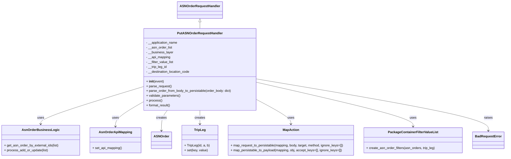

# Diagram: partview_core/partview_service/partview_service/api/asn_order/handlers/put_asn_order.py

> Auto-generated by Obscura crawlers

## Mermaid

### SVG

<svg id="container" width="2470.9375" xmlns="http://www.w3.org/2000/svg" class="classDiagram" height="782" viewBox="0 0 2470.9375 782" role="graphics-document document" aria-roledescription="class"><g><defs><marker id="container_class-aggregationStart" class="marker aggregation class" refX="18" refY="7" markerWidth="190" markerHeight="240" orient="auto"><path d="M 18,7 L9,13 L1,7 L9,1 Z"></path></marker></defs><defs><marker id="container_class-aggregationEnd" class="marker aggregation class" refX="1" refY="7" markerWidth="20" markerHeight="28" orient="auto"><path d="M 18,7 L9,13 L1,7 L9,1 Z"></path></marker></defs><defs><marker id="container_class-extensionStart" class="marker extension class" refX="18" refY="7" markerWidth="190" markerHeight="240" orient="auto"><path d="M 1,7 L18,13 V 1 Z"></path></marker></defs><defs><marker id="container_class-extensionEnd" class="marker extension class" refX="1" refY="7" markerWidth="20" markerHeight="28" orient="auto"><path d="M 1,1 V 13 L18,7 Z"></path></marker></defs><defs><marker id="container_class-compositionStart" class="marker composition class" refX="18" refY="7" markerWidth="190" markerHeight="240" orient="auto"><path d="M 18,7 L9,13 L1,7 L9,1 Z"></path></marker></defs><defs><marker id="container_class-compositionEnd" class="marker composition class" refX="1" refY="7" markerWidth="20" markerHeight="28" orient="auto"><path d="M 18,7 L9,13 L1,7 L9,1 Z"></path></marker></defs><defs><marker id="container_class-dependencyStart" class="marker dependency class" refX="6" refY="7" markerWidth="190" markerHeight="240" orient="auto"><path d="M 5,7 L9,13 L1,7 L9,1 Z"></path></marker></defs><defs><marker id="container_class-dependencyEnd" class="marker dependency class" refX="13" refY="7" markerWidth="20" markerHeight="28" orient="auto"><path d="M 18,7 L9,13 L14,7 L9,1 Z"></path></marker></defs><defs><marker id="container_class-lollipopStart" class="marker lollipop class" refX="13" refY="7" markerWidth="190" markerHeight="240" orient="auto"><circle stroke="black" fill="transparent" cx="7" cy="7" r="6"></circle></marker></defs><defs><marker id="container_class-lollipopEnd" class="marker lollipop class" refX="1" refY="7" markerWidth="190" markerHeight="240" orient="auto"><circle stroke="black" fill="transparent" cx="7" cy="7" r="6"></circle></marker></defs><g class="root"><g class="clusters"></g><g class="edgePaths"><path d="M968.168,109.25L968.168,110.542C968.168,111.833,968.168,114.417,968.168,119.875C968.168,125.333,968.168,133.667,968.168,137.833L968.168,142" id="id_ASNOrderRequestHandler_PutASNOrderRequestHandler_1" class="edge-thickness-normal edge-pattern-solid relation" style=";;;" data-edge="true" data-et="edge" data-id="id_ASNOrderRequestHandler_PutASNOrderRequestHandler_1" data-points="W3sieCI6OTY4LjE2Nzk2ODc1LCJ5Ijo5Mn0seyJ4Ijo5NjguMTY3OTY4NzUsInkiOjExN30seyJ4Ijo5NjguMTY3OTY4NzUsInkiOjE0Mn1d" marker-start="url(#container_class-extensionStart)"></path><path d="M690.199,432.934L608.096,458.612C525.992,484.289,361.785,535.645,279.682,566.489C197.578,597.333,197.578,607.667,197.578,612.833L197.578,618" id="id_PutASNOrderRequestHandler_AsnOrderBusinessLogic_2" class="edge-thickness-normal edge-pattern-solid relation" style=";;;" data-edge="true" data-et="edge" data-id="id_PutASNOrderRequestHandler_AsnOrderBusinessLogic_2" data-points="W3sieCI6NjkwLjE5OTIxODc1LCJ5Ijo0MzIuOTM0MDE0NjI5NjIxMn0seyJ4IjoxOTcuNTc4MTI1LCJ5Ijo1ODd9LHsieCI6MTk3LjU3ODEyNSwieSI6NjI0fV0=" marker-end="url(#container_class-dependencyEnd)"></path><path d="M690.199,510.716L668.743,523.43C647.288,536.144,604.376,561.572,582.921,581.453C561.465,601.333,561.465,615.667,561.465,622.833L561.465,630" id="id_PutASNOrderRequestHandler_AsnOrderApiMapping_3" class="edge-thickness-normal edge-pattern-solid relation" style=";;;" data-edge="true" data-et="edge" data-id="id_PutASNOrderRequestHandler_AsnOrderApiMapping_3" data-points="W3sieCI6NjkwLjE5OTIxODc1LCJ5Ijo1MTAuNzE1ODkzODEwNzQ5NTV9LHsieCI6NTYxLjQ2NDg0Mzc1LCJ5Ijo1ODd9LHsieCI6NTYxLjQ2NDg0Mzc1LCJ5Ijo2MzZ9XQ==" marker-end="url(#container_class-dependencyEnd)"></path><path d="M811.68,550L806.949,556.167C802.219,562.333,792.758,574.667,788.027,591.5C783.297,608.333,783.297,629.667,783.297,640.333L783.297,651" id="id_PutASNOrderRequestHandler_ASNOrder_4" class="edge-thickness-normal edge-pattern-solid relation" style=";;;" data-edge="true" data-et="edge" data-id="id_PutASNOrderRequestHandler_ASNOrder_4" data-points="W3sieCI6ODExLjY3OTU3NDA0MDQ1NjQsInkiOjU1MH0seyJ4Ijo3ODMuMjk2ODc1LCJ5Ijo1ODd9LHsieCI6NzgzLjI5Njg3NSwieSI6NjU3fV0=" marker-end="url(#container_class-dependencyEnd)"></path><path d="M968.168,550L968.168,556.167C968.168,562.333,968.168,574.667,968.168,586C968.168,597.333,968.168,607.667,968.168,612.833L968.168,618" id="id_PutASNOrderRequestHandler_TripLeg_5" class="edge-thickness-normal edge-pattern-solid relation" style=";;;" data-edge="true" data-et="edge" data-id="id_PutASNOrderRequestHandler_TripLeg_5" data-points="W3sieCI6OTY4LjE2Nzk2ODc1LCJ5Ijo1NTB9LHsieCI6OTY4LjE2Nzk2ODc1LCJ5Ijo1ODd9LHsieCI6OTY4LjE2Nzk2ODc1LCJ5Ijo2MjR9XQ==" marker-end="url(#container_class-dependencyEnd)"></path><path d="M1246.137,494.53L1274.979,509.942C1303.822,525.353,1361.507,556.177,1390.349,576.755C1419.191,597.333,1419.191,607.667,1419.191,612.833L1419.191,618" id="id_PutASNOrderRequestHandler_MapAction_6" class="edge-thickness-normal edge-pattern-solid relation" style=";;;" data-edge="true" data-et="edge" data-id="id_PutASNOrderRequestHandler_MapAction_6" data-points="W3sieCI6MTI0Ni4xMzY3MTg3NSwieSI6NDk0LjUyOTkwNTk0MzA4MDg1fSx7IngiOjE0MTkuMTkxNDA2MjUsInkiOjU4N30seyJ4IjoxNDE5LjE5MTQwNjI1LCJ5Ijo2MjR9XQ==" marker-end="url(#container_class-dependencyEnd)"></path><path d="M1246.137,409.471L1375.717,439.059C1505.298,468.647,1764.46,527.824,1894.04,564.578C2023.621,601.333,2023.621,615.667,2023.621,622.833L2023.621,630" id="id_PutASNOrderRequestHandler_PackageContainerFilterValueList_7" class="edge-thickness-normal edge-pattern-solid relation" style=";;;" data-edge="true" data-et="edge" data-id="id_PutASNOrderRequestHandler_PackageContainerFilterValueList_7" data-points="W3sieCI6MTI0Ni4xMzY3MTg3NSwieSI6NDA5LjQ3MDgxMzc3OTYyNjZ9LHsieCI6MjAyMy42MjEwOTM3NSwieSI6NTg3fSx7IngiOjIwMjMuNjIxMDkzNzUsInkiOjYzNn1d" marker-end="url(#container_class-dependencyEnd)"></path><path d="M1246.137,393.16L1436.557,425.467C1626.977,457.773,2007.816,522.387,2198.236,565.36C2388.656,608.333,2388.656,629.667,2388.656,640.333L2388.656,651" id="id_PutASNOrderRequestHandler_BadRequestError_8" class="edge-thickness-normal edge-pattern-solid relation" style=";;;" data-edge="true" data-et="edge" data-id="id_PutASNOrderRequestHandler_BadRequestError_8" data-points="W3sieCI6MTI0Ni4xMzY3MTg3NSwieSI6MzkzLjE2MDE2OTk0NTk2Mzh9LHsieCI6MjM4OC42NTYyNSwieSI6NTg3fSx7IngiOjIzODguNjU2MjUsInkiOjY1N31d" marker-end="url(#container_class-dependencyEnd)"></path></g><g class="edgeLabels"><g class="edgeLabel"><g class="label" data-id="id_ASNOrderRequestHandler_PutASNOrderRequestHandler_1" transform="translate(0, 0)"><foreignObject width="0" height="0">

</foreignObject></g></g><g class="edgeLabel" transform="translate(197.578125, 587)"><g class="label" data-id="id_PutASNOrderRequestHandler_AsnOrderBusinessLogic_2" transform="translate(-16.4921875, -12)"><foreignObject width="32.984375" height="24">

uses

</foreignObject></g></g><g class="edgeLabel" transform="translate(561.46484375, 587)"><g class="label" data-id="id_PutASNOrderRequestHandler_AsnOrderApiMapping_3" transform="translate(-16.4921875, -12)"><foreignObject width="32.984375" height="24">

uses

</foreignObject></g></g><g class="edgeLabel" transform="translate(783.296875, 587)"><g class="label" data-id="id_PutASNOrderRequestHandler_ASNOrder_4" transform="translate(-26.171875, -12)"><foreignObject width="52.34375" height="24">

creates

</foreignObject></g></g><g class="edgeLabel" transform="translate(968.16796875, 587)"><g class="label" data-id="id_PutASNOrderRequestHandler_TripLeg_5" transform="translate(-26.171875, -12)"><foreignObject width="52.34375" height="24">

creates

</foreignObject></g></g><g class="edgeLabel" transform="translate(1419.19140625, 587)"><g class="label" data-id="id_PutASNOrderRequestHandler_MapAction_6" transform="translate(-16.4921875, -12)"><foreignObject width="32.984375" height="24">

uses

</foreignObject></g></g><g class="edgeLabel" transform="translate(2023.62109375, 587)"><g class="label" data-id="id_PutASNOrderRequestHandler_PackageContainerFilterValueList_7" transform="translate(-16.4921875, -12)"><foreignObject width="32.984375" height="24">

uses

</foreignObject></g></g><g class="edgeLabel" transform="translate(2388.65625, 587)"><g class="label" data-id="id_PutASNOrderRequestHandler_BadRequestError_8" transform="translate(-21.25, -12)"><foreignObject width="42.5" height="24">

raises

</foreignObject></g></g></g><g class="nodes"><g class="node default" id="classId-ASNOrderRequestHandler-0" transform="translate(968.16796875, 50)"><g class="basic label-container"><path d="M-106.5859375 -42 L106.5859375 -42 L106.5859375 42 L-106.5859375 42" stroke="none" stroke-width="0" fill="#ECECFF" style=""></path><path d="M-106.5859375 -42 C-29.952953908216188 -42, 46.680029683567625 -42, 106.5859375 -42 M-106.5859375 -42 C-46.16285140117574 -42, 14.260234697648514 -42, 106.5859375 -42 M106.5859375 -42 C106.5859375 -16.332339685911936, 106.5859375 9.335320628176127, 106.5859375 42 M106.5859375 -42 C106.5859375 -24.02028881481252, 106.5859375 -6.040577629625041, 106.5859375 42 M106.5859375 42 C58.026641180979865 42, 9.467344861959731 42, -106.5859375 42 M106.5859375 42 C58.25029754124847 42, 9.914657582496943 42, -106.5859375 42 M-106.5859375 42 C-106.5859375 24.721808095692303, -106.5859375 7.443616191384606, -106.5859375 -42 M-106.5859375 42 C-106.5859375 21.54998485212505, -106.5859375 1.0999697042500998, -106.5859375 -42" stroke="#9370DB" stroke-width="1.3" fill="none" stroke-dasharray="0 0" style=""></path></g><g class="annotation-group text" transform="translate(0, -18)"></g><g class="label-group text" transform="translate(-94.5859375, -18)"><g class="label" style="font-weight: bolder" transform="translate(0,-12)"><foreignObject width="189.171875" height="24">

ASNOrderRequestHandler

</foreignObject></g></g><g class="members-group text" transform="translate(-94.5859375, 30)"></g><g class="methods-group text" transform="translate(-94.5859375, 60)"></g><g class="divider" style=""><path d="M-106.5859375 6 C-52.39070376086833 6, 1.8045299782633464 6, 106.5859375 6 M-106.5859375 6 C-42.272565396392736 6, 22.04080670721453 6, 106.5859375 6" stroke="#9370DB" stroke-width="1.3" fill="none" stroke-dasharray="0 0" style=""></path></g><g class="divider" style=""><path d="M-106.5859375 24 C-21.442096654759297 24, 63.701744190481406 24, 106.5859375 24 M-106.5859375 24 C-44.27709925231889 24, 18.03173899536222 24, 106.5859375 24" stroke="#9370DB" stroke-width="1.3" fill="none" stroke-dasharray="0 0" style=""></path></g></g><g class="node default" id="classId-PutASNOrderRequestHandler-1" transform="translate(968.16796875, 346)"><g class="basic label-container"><path d="M-277.96875 -204 L277.96875 -204 L277.96875 204 L-277.96875 204" stroke="none" stroke-width="0" fill="#ECECFF" style=""></path><path d="M-277.96875 -204 C-110.60594271267874 -204, 56.75686457464252 -204, 277.96875 -204 M-277.96875 -204 C-88.40710946776343 -204, 101.15453106447313 -204, 277.96875 -204 M277.96875 -204 C277.96875 -64.9288743202012, 277.96875 74.1422513595976, 277.96875 204 M277.96875 -204 C277.96875 -78.63683674578586, 277.96875 46.726326508428286, 277.96875 204 M277.96875 204 C156.90662344363855 204, 35.8444968872771 204, -277.96875 204 M277.96875 204 C153.43583844839173 204, 28.90292689678347 204, -277.96875 204 M-277.96875 204 C-277.96875 118.79403461405533, -277.96875 33.58806922811067, -277.96875 -204 M-277.96875 204 C-277.96875 73.50129612611198, -277.96875 -56.99740774777604, -277.96875 -204" stroke="#9370DB" stroke-width="1.3" fill="none" stroke-dasharray="0 0" style=""></path></g><g class="annotation-group text" transform="translate(0, -180)"></g><g class="label-group text" transform="translate(-106.84375, -180)"><g class="label" style="font-weight: bolder" transform="translate(0,-12)"><foreignObject width="213.6875" height="24">

PutASNOrderRequestHandler

</foreignObject></g></g><g class="members-group text" transform="translate(-265.96875, -132)"><g class="label" style="" transform="translate(0,-12)"><foreignObject width="157.796875" height="24">

- __application_name

</foreignObject></g><g class="label" style="" transform="translate(0,12)"><foreignObject width="129.078125" height="24">

- __asn_order_list

</foreignObject></g><g class="label" style="" transform="translate(0,36)"><foreignObject width="134.46875" height="24">

- __business_layer

</foreignObject></g><g class="label" style="" transform="translate(0,60)"><foreignObject width="121.53125" height="24">

- __api_mapping

</foreignObject></g><g class="label" style="" transform="translate(0,84)"><foreignObject width="136.90625" height="24">

- __filter_value_list

</foreignObject></g><g class="label" style="" transform="translate(0,108)"><foreignObject width="104.78125" height="24">

- __trip_leg_id

</foreignObject></g><g class="label" style="" transform="translate(0,132)"><foreignObject width="220.265625" height="24">

- __destination_location_code

</foreignObject></g></g><g class="methods-group text" transform="translate(-265.96875, 60)"><g class="label" style="" transform="translate(0,-12)"><foreignObject width="87.390625" height="24">

+ <strong>init</strong>(event)

</foreignObject></g><g class="label" style="" transform="translate(0,12)"><foreignObject width="126.046875" height="24">

+ parse_request()

</foreignObject></g><g class="label" style="" transform="translate(0,36)"><foreignObject width="425.09375" height="24">

+ parse_order_from_body_to_persistable(order_body: dict)

</foreignObject></g><g class="label" style="" transform="translate(0,60)"><foreignObject width="170.953125" height="24">

+ validate_parameters()

</foreignObject></g><g class="label" style="" transform="translate(0,84)"><foreignObject width="77.96875" height="24">

+ process()

</foreignObject></g><g class="label" style="" transform="translate(0,108)"><foreignObject width="121.5" height="24">

+ format_result()

</foreignObject></g></g><g class="divider" style=""><path d="M-277.96875 -156 C-128.74664416095592 -156, 20.475461678088152 -156, 277.96875 -156 M-277.96875 -156 C-56.32426919021216 -156, 165.32021161957567 -156, 277.96875 -156" stroke="#9370DB" stroke-width="1.3" fill="none" stroke-dasharray="0 0" style=""></path></g><g class="divider" style=""><path d="M-277.96875 36 C-74.10596577593083 36, 129.75681844813835 36, 277.96875 36 M-277.96875 36 C-80.11094537255761 36, 117.74685925488478 36, 277.96875 36" stroke="#9370DB" stroke-width="1.3" fill="none" stroke-dasharray="0 0" style=""></path></g></g><g class="node default" id="classId-AsnOrderBusinessLogic-2" transform="translate(197.578125, 699)"><g class="basic label-container"><path d="M-189.578125 -75 L189.578125 -75 L189.578125 75 L-189.578125 75" stroke="none" stroke-width="0" fill="#ECECFF" style=""></path><path d="M-189.578125 -75 C-42.96004207165572 -75, 103.65804085668856 -75, 189.578125 -75 M-189.578125 -75 C-62.95522539045221 -75, 63.667674219095574 -75, 189.578125 -75 M189.578125 -75 C189.578125 -23.36050922318401, 189.578125 28.27898155363198, 189.578125 75 M189.578125 -75 C189.578125 -32.48276893525414, 189.578125 10.034462129491715, 189.578125 75 M189.578125 75 C75.63247278252416 75, -38.31317943495168 75, -189.578125 75 M189.578125 75 C64.74493186260574 75, -60.08826127478852 75, -189.578125 75 M-189.578125 75 C-189.578125 37.06529596990379, -189.578125 -0.869408060192427, -189.578125 -75 M-189.578125 75 C-189.578125 39.138683820447476, -189.578125 3.2773676408949513, -189.578125 -75" stroke="#9370DB" stroke-width="1.3" fill="none" stroke-dasharray="0 0" style=""></path></g><g class="annotation-group text" transform="translate(0, -51)"></g><g class="label-group text" transform="translate(-85.53125, -51)"><g class="label" style="font-weight: bolder" transform="translate(0,-12)"><foreignObject width="171.0625" height="24">

AsnOrderBusinessLogic

</foreignObject></g></g><g class="members-group text" transform="translate(-177.578125, -3)"></g><g class="methods-group text" transform="translate(-177.578125, 27)"><g class="label" style="" transform="translate(0,-12)"><foreignObject width="269.625" height="24">

+ get_asn_order_by_external_ids(list)

</foreignObject></g><g class="label" style="" transform="translate(0,12)"><foreignObject width="217.53125" height="24">

+ process_add_or_update(list)

</foreignObject></g></g><g class="divider" style=""><path d="M-189.578125 -27 C-82.8050470246586 -27, 23.968030950682788 -27, 189.578125 -27 M-189.578125 -27 C-85.10659076904012 -27, 19.36494346191975 -27, 189.578125 -27" stroke="#9370DB" stroke-width="1.3" fill="none" stroke-dasharray="0 0" style=""></path></g><g class="divider" style=""><path d="M-189.578125 -3 C-93.48839343599174 -3, 2.601338128016522 -3, 189.578125 -3 M-189.578125 -3 C-107.68450343845026 -3, -25.790881876900528 -3, 189.578125 -3" stroke="#9370DB" stroke-width="1.3" fill="none" stroke-dasharray="0 0" style=""></path></g></g><g class="node default" id="classId-AsnOrderApiMapping-3" transform="translate(561.46484375, 699)"><g class="basic label-container"><path d="M-124.30859375 -63 L124.30859375 -63 L124.30859375 63 L-124.30859375 63" stroke="none" stroke-width="0" fill="#ECECFF" style=""></path><path d="M-124.30859375 -63 C-31.69493190774159 -63, 60.91872993451682 -63, 124.30859375 -63 M-124.30859375 -63 C-46.6239808368464 -63, 31.0606320763072 -63, 124.30859375 -63 M124.30859375 -63 C124.30859375 -18.126548859013653, 124.30859375 26.746902281972694, 124.30859375 63 M124.30859375 -63 C124.30859375 -28.98349845718488, 124.30859375 5.0330030856302415, 124.30859375 63 M124.30859375 63 C50.5965135052879 63, -23.115566739424196 63, -124.30859375 63 M124.30859375 63 C60.446706018882416 63, -3.4151817122351673 63, -124.30859375 63 M-124.30859375 63 C-124.30859375 27.126087061564434, -124.30859375 -8.747825876871133, -124.30859375 -63 M-124.30859375 63 C-124.30859375 18.757716176998947, -124.30859375 -25.484567646002105, -124.30859375 -63" stroke="#9370DB" stroke-width="1.3" fill="none" stroke-dasharray="0 0" style=""></path></g><g class="annotation-group text" transform="translate(0, -39)"></g><g class="label-group text" transform="translate(-77.3828125, -39)"><g class="label" style="font-weight: bolder" transform="translate(0,-12)"><foreignObject width="154.765625" height="24">

AsnOrderApiMapping

</foreignObject></g></g><g class="members-group text" transform="translate(-112.30859375, 9)"></g><g class="methods-group text" transform="translate(-112.30859375, 39)"><g class="label" style="" transform="translate(0,-12)"><foreignObject width="147.234375" height="24">

+ set_api_mapping()

</foreignObject></g></g><g class="divider" style=""><path d="M-124.30859375 -15 C-30.336839212341005 -15, 63.63491532531799 -15, 124.30859375 -15 M-124.30859375 -15 C-69.38908216728973 -15, -14.469570584579444 -15, 124.30859375 -15" stroke="#9370DB" stroke-width="1.3" fill="none" stroke-dasharray="0 0" style=""></path></g><g class="divider" style=""><path d="M-124.30859375 9 C-34.919869266808234 9, 54.46885521638353 9, 124.30859375 9 M-124.30859375 9 C-67.87241339444714 9, -11.436233038894258 9, 124.30859375 9" stroke="#9370DB" stroke-width="1.3" fill="none" stroke-dasharray="0 0" style=""></path></g></g><g class="node default" id="classId-ASNOrder-4" transform="translate(783.296875, 699)"><g class="basic label-container"><path d="M-47.5234375 -42 L47.5234375 -42 L47.5234375 42 L-47.5234375 42" stroke="none" stroke-width="0" fill="#ECECFF" style=""></path><path d="M-47.5234375 -42 C-24.466760832356744 -42, -1.4100841647134885 -42, 47.5234375 -42 M-47.5234375 -42 C-23.593818652394493 -42, 0.33580019521101434 -42, 47.5234375 -42 M47.5234375 -42 C47.5234375 -16.94726005032675, 47.5234375 8.105479899346498, 47.5234375 42 M47.5234375 -42 C47.5234375 -13.3582190247615, 47.5234375 15.283561950477, 47.5234375 42 M47.5234375 42 C10.509611951162285 42, -26.50421359767543 42, -47.5234375 42 M47.5234375 42 C23.385813378007583 42, -0.7518107439848336 42, -47.5234375 42 M-47.5234375 42 C-47.5234375 12.236657051252198, -47.5234375 -17.526685897495604, -47.5234375 -42 M-47.5234375 42 C-47.5234375 20.195769695390982, -47.5234375 -1.6084606092180351, -47.5234375 -42" stroke="#9370DB" stroke-width="1.3" fill="none" stroke-dasharray="0 0" style=""></path></g><g class="annotation-group text" transform="translate(0, -18)"></g><g class="label-group text" transform="translate(-35.5234375, -18)"><g class="label" style="font-weight: bolder" transform="translate(0,-12)"><foreignObject width="71.046875" height="24">

ASNOrder

</foreignObject></g></g><g class="members-group text" transform="translate(-35.5234375, 30)"></g><g class="methods-group text" transform="translate(-35.5234375, 60)"></g><g class="divider" style=""><path d="M-47.5234375 6 C-26.56671380683606 6, -5.609990113672119 6, 47.5234375 6 M-47.5234375 6 C-12.628058264166825 6, 22.26732097166635 6, 47.5234375 6" stroke="#9370DB" stroke-width="1.3" fill="none" stroke-dasharray="0 0" style=""></path></g><g class="divider" style=""><path d="M-47.5234375 24 C-13.753296410381665 24, 20.01684467923667 24, 47.5234375 24 M-47.5234375 24 C-23.74350972452573 24, 0.03641805094854078 24, 47.5234375 24" stroke="#9370DB" stroke-width="1.3" fill="none" stroke-dasharray="0 0" style=""></path></g></g><g class="node default" id="classId-TripLeg-5" transform="translate(968.16796875, 699)"><g class="basic label-container"><path d="M-87.34765625 -75 L87.34765625 -75 L87.34765625 75 L-87.34765625 75" stroke="none" stroke-width="0" fill="#ECECFF" style=""></path><path d="M-87.34765625 -75 C-32.98511029425047 -75, 21.377435661499064 -75, 87.34765625 -75 M-87.34765625 -75 C-25.82560595768159 -75, 35.69644433463682 -75, 87.34765625 -75 M87.34765625 -75 C87.34765625 -22.13260548755617, 87.34765625 30.73478902488766, 87.34765625 75 M87.34765625 -75 C87.34765625 -41.86022869562416, 87.34765625 -8.720457391248317, 87.34765625 75 M87.34765625 75 C50.48075439887497 75, 13.613852547749943 75, -87.34765625 75 M87.34765625 75 C43.62962460073911 75, -0.08840704852177339 75, -87.34765625 75 M-87.34765625 75 C-87.34765625 32.16644133796006, -87.34765625 -10.667117324079882, -87.34765625 -75 M-87.34765625 75 C-87.34765625 33.18052173020115, -87.34765625 -8.6389565395977, -87.34765625 -75" stroke="#9370DB" stroke-width="1.3" fill="none" stroke-dasharray="0 0" style=""></path></g><g class="annotation-group text" transform="translate(0, -51)"></g><g class="label-group text" transform="translate(-27.0546875, -51)"><g class="label" style="font-weight: bolder" transform="translate(0,-12)"><foreignObject width="54.109375" height="24">

TripLeg

</foreignObject></g></g><g class="members-group text" transform="translate(-75.34765625, -3)"></g><g class="methods-group text" transform="translate(-75.34765625, 27)"><g class="label" style="" transform="translate(0,-12)"><foreignObject width="123.640625" height="24">

+ TripLeg(id, a, b)

</foreignObject></g><g class="label" style="" transform="translate(0,12)"><foreignObject width="115.46875" height="24">

+ set(key, value)

</foreignObject></g></g><g class="divider" style=""><path d="M-87.34765625 -27 C-18.55547994740394 -27, 50.23669635519212 -27, 87.34765625 -27 M-87.34765625 -27 C-50.14293127833583 -27, -12.93820630667166 -27, 87.34765625 -27" stroke="#9370DB" stroke-width="1.3" fill="none" stroke-dasharray="0 0" style=""></path></g><g class="divider" style=""><path d="M-87.34765625 -3 C-30.66030202102081 -3, 26.027052207958377 -3, 87.34765625 -3 M-87.34765625 -3 C-40.03393651498431 -3, 7.279783220031376 -3, 87.34765625 -3" stroke="#9370DB" stroke-width="1.3" fill="none" stroke-dasharray="0 0" style=""></path></g></g><g class="node default" id="classId-MapAction-6" transform="translate(1419.19140625, 699)"><g class="basic label-container"><path d="M-313.67578125 -75 L313.67578125 -75 L313.67578125 75 L-313.67578125 75" stroke="none" stroke-width="0" fill="#ECECFF" style=""></path><path d="M-313.67578125 -75 C-88.00680503258224 -75, 137.66217118483553 -75, 313.67578125 -75 M-313.67578125 -75 C-65.08017443651605 -75, 183.5154323769679 -75, 313.67578125 -75 M313.67578125 -75 C313.67578125 -17.87274783518386, 313.67578125 39.25450432963228, 313.67578125 75 M313.67578125 -75 C313.67578125 -41.74676260364349, 313.67578125 -8.493525207286979, 313.67578125 75 M313.67578125 75 C177.8488235844246 75, 42.02186591884919 75, -313.67578125 75 M313.67578125 75 C113.9712071658196 75, -85.73336691836079 75, -313.67578125 75 M-313.67578125 75 C-313.67578125 17.274035614295755, -313.67578125 -40.45192877140849, -313.67578125 -75 M-313.67578125 75 C-313.67578125 41.14307091415177, -313.67578125 7.286141828303542, -313.67578125 -75" stroke="#9370DB" stroke-width="1.3" fill="none" stroke-dasharray="0 0" style=""></path></g><g class="annotation-group text" transform="translate(0, -51)"></g><g class="label-group text" transform="translate(-38.6328125, -51)"><g class="label" style="font-weight: bolder" transform="translate(0,-12)"><foreignObject width="77.265625" height="24">

MapAction

</foreignObject></g></g><g class="members-group text" transform="translate(-301.67578125, -3)"></g><g class="methods-group text" transform="translate(-301.67578125, 27)"><g class="label" style="" transform="translate(0,-12)"><foreignObject width="564.71875" height="24">

+ map_request_to_persistable(mapping, body, target, method, ignore_keys=[])

</foreignObject></g><g class="label" style="" transform="translate(0,12)"><foreignObject width="552.96875" height="24">

+ map_persistable_to_payload(mapping, obj, accept_keys=[], ignore_keys=[])

</foreignObject></g></g><g class="divider" style=""><path d="M-313.67578125 -27 C-93.35081652354077 -27, 126.97414820291846 -27, 313.67578125 -27 M-313.67578125 -27 C-86.20341281553459 -27, 141.26895561893082 -27, 313.67578125 -27" stroke="#9370DB" stroke-width="1.3" fill="none" stroke-dasharray="0 0" style=""></path></g><g class="divider" style=""><path d="M-313.67578125 -3 C-147.63115827444423 -3, 18.413464701111536 -3, 313.67578125 -3 M-313.67578125 -3 C-99.80183248756387 -3, 114.07211627487226 -3, 313.67578125 -3" stroke="#9370DB" stroke-width="1.3" fill="none" stroke-dasharray="0 0" style=""></path></g></g><g class="node default" id="classId-PackageContainerFilterValueList-7" transform="translate(2023.62109375, 699)"><g class="basic label-container"><path d="M-240.75390625 -63 L240.75390625 -63 L240.75390625 63 L-240.75390625 63" stroke="none" stroke-width="0" fill="#ECECFF" style=""></path><path d="M-240.75390625 -63 C-98.83734216641844 -63, 43.079221917163125 -63, 240.75390625 -63 M-240.75390625 -63 C-128.81121619569717 -63, -16.86852614139437 -63, 240.75390625 -63 M240.75390625 -63 C240.75390625 -34.436718869069495, 240.75390625 -5.873437738138989, 240.75390625 63 M240.75390625 -63 C240.75390625 -37.268707115332, 240.75390625 -11.537414230663998, 240.75390625 63 M240.75390625 63 C68.87510799531796 63, -103.00369025936408 63, -240.75390625 63 M240.75390625 63 C110.33231197657045 63, -20.089282296859096 63, -240.75390625 63 M-240.75390625 63 C-240.75390625 28.09701250953198, -240.75390625 -6.805974980936043, -240.75390625 -63 M-240.75390625 63 C-240.75390625 30.05878662400714, -240.75390625 -2.8824267519857187, -240.75390625 -63" stroke="#9370DB" stroke-width="1.3" fill="none" stroke-dasharray="0 0" style=""></path></g><g class="annotation-group text" transform="translate(0, -39)"></g><g class="label-group text" transform="translate(-117.5390625, -39)"><g class="label" style="font-weight: bolder" transform="translate(0,-12)"><foreignObject width="235.078125" height="24">

PackageContainerFilterValueList

</foreignObject></g></g><g class="members-group text" transform="translate(-228.75390625, 9)"></g><g class="methods-group text" transform="translate(-228.75390625, 39)"><g class="label" style="" transform="translate(0,-12)"><foreignObject width="339.96875" height="24">

+ create_asn_order_filters(asn_orders, trip_leg)

</foreignObject></g></g><g class="divider" style=""><path d="M-240.75390625 -15 C-92.30784531698731 -15, 56.13821561602538 -15, 240.75390625 -15 M-240.75390625 -15 C-133.34053833700344 -15, -25.927170424006874 -15, 240.75390625 -15" stroke="#9370DB" stroke-width="1.3" fill="none" stroke-dasharray="0 0" style=""></path></g><g class="divider" style=""><path d="M-240.75390625 9 C-108.56603801532972 9, 23.621830219340552 9, 240.75390625 9 M-240.75390625 9 C-62.85284887757686 9, 115.04820849484628 9, 240.75390625 9" stroke="#9370DB" stroke-width="1.3" fill="none" stroke-dasharray="0 0" style=""></path></g></g><g class="node default" id="classId-BadRequestError-8" transform="translate(2388.65625, 699)"><g class="basic label-container"><path d="M-74.28125 -42 L74.28125 -42 L74.28125 42 L-74.28125 42" stroke="none" stroke-width="0" fill="#ECECFF" style=""></path><path d="M-74.28125 -42 C-17.349574417449595 -42, 39.58210116510081 -42, 74.28125 -42 M-74.28125 -42 C-27.4611639933047 -42, 19.358922013390597 -42, 74.28125 -42 M74.28125 -42 C74.28125 -21.583541457692572, 74.28125 -1.1670829153851443, 74.28125 42 M74.28125 -42 C74.28125 -12.549433143567295, 74.28125 16.90113371286541, 74.28125 42 M74.28125 42 C26.196251881935375 42, -21.88874623612925 42, -74.28125 42 M74.28125 42 C42.61647963017518 42, 10.951709260350349 42, -74.28125 42 M-74.28125 42 C-74.28125 18.140025198393367, -74.28125 -5.719949603213266, -74.28125 -42 M-74.28125 42 C-74.28125 13.917878228648544, -74.28125 -14.164243542702913, -74.28125 -42" stroke="#9370DB" stroke-width="1.3" fill="none" stroke-dasharray="0 0" style=""></path></g><g class="annotation-group text" transform="translate(0, -18)"></g><g class="label-group text" transform="translate(-62.28125, -18)"><g class="label" style="font-weight: bolder" transform="translate(0,-12)"><foreignObject width="124.5625" height="24">

BadRequestError

</foreignObject></g></g><g class="members-group text" transform="translate(-62.28125, 30)"></g><g class="methods-group text" transform="translate(-62.28125, 60)"></g><g class="divider" style=""><path d="M-74.28125 6 C-42.150549304264835 6, -10.01984860852967 6, 74.28125 6 M-74.28125 6 C-18.96014201222949 6, 36.36096597554102 6, 74.28125 6" stroke="#9370DB" stroke-width="1.3" fill="none" stroke-dasharray="0 0" style=""></path></g><g class="divider" style=""><path d="M-74.28125 24 C-41.39913441252393 24, -8.517018825047856 24, 74.28125 24 M-74.28125 24 C-35.10176577903668 24, 4.077718441926635 24, 74.28125 24" stroke="#9370DB" stroke-width="1.3" fill="none" stroke-dasharray="0 0" style=""></path></g></g></g></g></g></svg>
