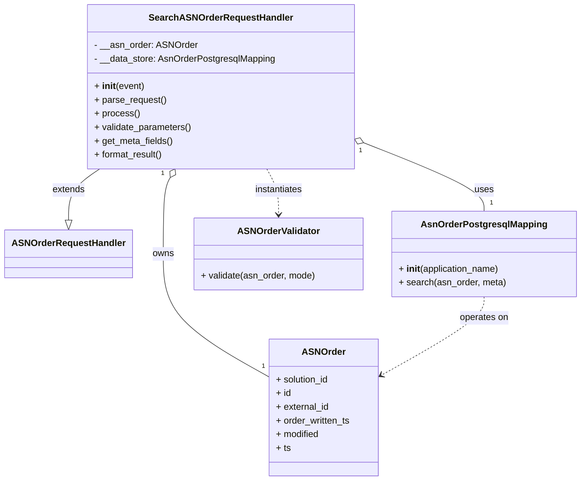

# Diagram: partview_core/partview_service/partview_service/api/asn_order/handlers/search_asn_order.py

> Auto-generated by Obscura crawlers

## Mermaid

### SVG

<svg id="container" width="996.15625" xmlns="http://www.w3.org/2000/svg" class="classDiagram" height="842" viewBox="0 0 996.15625 842" role="graphics-document document" aria-roledescription="class"><g><defs><marker id="container_class-aggregationStart" class="marker aggregation class" refX="18" refY="7" markerWidth="190" markerHeight="240" orient="auto"><path d="M 18,7 L9,13 L1,7 L9,1 Z"></path></marker></defs><defs><marker id="container_class-aggregationEnd" class="marker aggregation class" refX="1" refY="7" markerWidth="20" markerHeight="28" orient="auto"><path d="M 18,7 L9,13 L1,7 L9,1 Z"></path></marker></defs><defs><marker id="container_class-extensionStart" class="marker extension class" refX="18" refY="7" markerWidth="190" markerHeight="240" orient="auto"><path d="M 1,7 L18,13 V 1 Z"></path></marker></defs><defs><marker id="container_class-extensionEnd" class="marker extension class" refX="1" refY="7" markerWidth="20" markerHeight="28" orient="auto"><path d="M 1,1 V 13 L18,7 Z"></path></marker></defs><defs><marker id="container_class-compositionStart" class="marker composition class" refX="18" refY="7" markerWidth="190" markerHeight="240" orient="auto"><path d="M 18,7 L9,13 L1,7 L9,1 Z"></path></marker></defs><defs><marker id="container_class-compositionEnd" class="marker composition class" refX="1" refY="7" markerWidth="20" markerHeight="28" orient="auto"><path d="M 18,7 L9,13 L1,7 L9,1 Z"></path></marker></defs><defs><marker id="container_class-dependencyStart" class="marker dependency class" refX="6" refY="7" markerWidth="190" markerHeight="240" orient="auto"><path d="M 5,7 L9,13 L1,7 L9,1 Z"></path></marker></defs><defs><marker id="container_class-dependencyEnd" class="marker dependency class" refX="13" refY="7" markerWidth="20" markerHeight="28" orient="auto"><path d="M 18,7 L9,13 L14,7 L9,1 Z"></path></marker></defs><defs><marker id="container_class-lollipopStart" class="marker lollipop class" refX="13" refY="7" markerWidth="190" markerHeight="240" orient="auto"><circle stroke="black" fill="transparent" cx="7" cy="7" r="6"></circle></marker></defs><defs><marker id="container_class-lollipopEnd" class="marker lollipop class" refX="1" refY="7" markerWidth="190" markerHeight="240" orient="auto"><circle stroke="black" fill="transparent" cx="7" cy="7" r="6"></circle></marker></defs><g class="root"><g class="clusters"></g><g class="edgePaths"><path d="M167.919,296L159.03,302.167C150.141,308.333,132.364,320.667,123.475,335.625C114.586,350.583,114.586,368.167,114.586,376.958L114.586,385.75" id="id_SearchASNOrderRequestHandler_ASNOrderRequestHandler_1" class="edge-thickness-normal edge-pattern-solid relation" style=";;;" data-edge="true" data-et="edge" data-id="id_SearchASNOrderRequestHandler_ASNOrderRequestHandler_1" data-points="W3sieCI6MTY3LjkxOTE2NjUyMjc5MDA1LCJ5IjoyOTZ9LHsieCI6MTE0LjU4NTkzNzUsInkiOjMzM30seyJ4IjoxMTQuNTg1OTM3NSwieSI6NDAzfV0=" marker-end="url(#container_class-extensionEnd)"></path><path d="M287.175,311.082L285.147,314.735C283.119,318.388,279.064,325.694,277.036,348.014C275.008,370.333,275.008,407.667,275.008,445C275.008,482.333,275.008,519.667,305.41,555.515C335.812,591.363,396.616,625.726,427.018,642.907L457.42,660.089" id="id_SearchASNOrderRequestHandler_ASNOrder_2" class="edge-thickness-normal edge-pattern-solid relation" style=";;;" data-edge="true" data-et="edge" data-id="id_SearchASNOrderRequestHandler_ASNOrder_2" data-points="W3sieCI6Mjk1LjU0NzYxOTU2MTQ2NDEsInkiOjI5Nn0seyJ4IjoyNzUuMDA3ODEyNSwieSI6MzMzfSx7IngiOjI3NS4wMDc4MTI1LCJ5Ijo0NDV9LHsieCI6Mjc1LjAwNzgxMjUsInkiOjU1N30seyJ4Ijo0NTcuNDE5OTIxODc1LCJ5Ijo2NjAuMDg4NjEyNjY3NTl9XQ==" marker-start="url(#container_class-aggregationStart)"></path><path d="M622.117,250.081L656.868,263.901C691.618,277.721,761.12,305.36,795.87,325.347C830.621,345.333,830.621,357.667,830.621,363.833L830.621,370" id="id_SearchASNOrderRequestHandler_AsnOrderPostgresqlMapping_3" class="edge-thickness-normal edge-pattern-solid relation" style=";;;" data-edge="true" data-et="edge" data-id="id_SearchASNOrderRequestHandler_AsnOrderPostgresqlMapping_3" data-points="W3sieCI6NjA2LjA4Nzg5MDYyNSwieSI6MjQzLjcwNjY0NTk1MzkzNzA4fSx7IngiOjgzMC42MjEwOTM3NSwieSI6MzMzfSx7IngiOjgzMC42MjEwOTM3NSwieSI6MzcwfV0=" marker-start="url(#container_class-aggregationStart)"></path><path d="M455.425,296L458.848,302.167C462.272,308.333,469.118,320.667,472.542,334C475.965,347.333,475.965,361.667,475.965,368.833L475.965,376" id="id_SearchASNOrderRequestHandler_ASNOrderValidator_4" class="edge-thickness-normal edge-pattern-dashed relation" style=";;;" data-edge="true" data-et="edge" data-id="id_SearchASNOrderRequestHandler_ASNOrderValidator_4" data-points="W3sieCI6NDU1LjQyNTAzNjY4ODUzNTksInkiOjI5Nn0seyJ4Ijo0NzUuOTY0ODQzNzUsInkiOjMzM30seyJ4Ijo0NzUuOTY0ODQzNzUsInkiOjM4Mn1d" marker-end="url(#container_class-dependencyEnd)"></path><path d="M830.621,520L830.621,526.167C830.621,532.333,830.621,544.667,801.09,567.523C771.558,590.379,712.495,623.758,682.964,640.447L653.433,657.137" id="id_AsnOrderPostgresqlMapping_ASNOrder_5" class="edge-thickness-normal edge-pattern-dashed relation" style=";;;" data-edge="true" data-et="edge" data-id="id_AsnOrderPostgresqlMapping_ASNOrder_5" data-points="W3sieCI6ODMwLjYyMTA5Mzc1LCJ5Ijo1MjB9LHsieCI6ODMwLjYyMTA5Mzc1LCJ5Ijo1NTd9LHsieCI6NjQ4LjIwODk4NDM3NSwieSI6NjYwLjA4ODYxMjY2NzU5fV0=" marker-end="url(#container_class-dependencyEnd)"></path></g><g class="edgeLabels"><g class="edgeLabel" transform="translate(114.5859375, 333)"><g class="label" data-id="id_SearchASNOrderRequestHandler_ASNOrderRequestHandler_1" transform="translate(-28.5078125, -12)"><foreignObject width="57.015625" height="24">

extends

</foreignObject></g></g><g class="edgeLabel" transform="translate(275.0078125, 445)"><g class="label" data-id="id_SearchASNOrderRequestHandler_ASNOrder_2" transform="translate(-18.8359375, -12)"><foreignObject width="37.671875" height="24">

owns

</foreignObject></g></g><g class="edgeLabel" transform="translate(830.62109375, 333)"><g class="label" data-id="id_SearchASNOrderRequestHandler_AsnOrderPostgresqlMapping_3" transform="translate(-16.4921875, -12)"><foreignObject width="32.984375" height="24">

uses

</foreignObject></g></g><g class="edgeLabel" transform="translate(475.96484375, 333)"><g class="label" data-id="id_SearchASNOrderRequestHandler_ASNOrderValidator_4" transform="translate(-42.9140625, -12)"><foreignObject width="85.828125" height="24">

instantiates

</foreignObject></g></g><g class="edgeLabel" transform="translate(830.62109375, 557)"><g class="label" data-id="id_AsnOrderPostgresqlMapping_ASNOrder_5" transform="translate(-43.2890625, -12)"><foreignObject width="86.578125" height="24">

operates on

</foreignObject></g></g><g class="edgeTerminals" transform="translate(273.93911698034043, 304.0201362514983)"><g class="inner" transform="translate(0, 0)"><foreignObject style="width: 9px; height: 12px;">
1
</foreignObject></g></g><g class="edgeTerminals" transform="translate(616.8061608058434, 264.11176035374103)"><g class="inner" transform="translate(0, 0)"><foreignObject style="width: 9px; height: 12px;">
1
</foreignObject></g></g><g class="edgeTerminals" transform="translate(444.56468047748115, 633.4196224325866)"><g class="inner" transform="translate(0, 0)"></g><foreignObject style="width: 9px; height: 12px;">
1
</foreignObject></g><g class="edgeTerminals" transform="translate(840.6210918749999, 347.49999839285715)"><g class="inner" transform="translate(0, 0)"></g><foreignObject style="width: 9px; height: 12px;">
1
</foreignObject></g></g><g class="nodes"><g class="node default" id="classId-SearchASNOrderRequestHandler-0" transform="translate(375.486328125, 152)"><g class="basic label-container"><path d="M-230.6015625 -144 L230.6015625 -144 L230.6015625 144 L-230.6015625 144" stroke="none" stroke-width="0" fill="#ECECFF" style=""></path><path d="M-230.6015625 -144 C-64.94434161591298 -144, 100.71287926817405 -144, 230.6015625 -144 M-230.6015625 -144 C-96.79611790614646 -144, 37.00932668770707 -144, 230.6015625 -144 M230.6015625 -144 C230.6015625 -86.3139159733905, 230.6015625 -28.627831946780987, 230.6015625 144 M230.6015625 -144 C230.6015625 -35.26713144495427, 230.6015625 73.46573711009145, 230.6015625 144 M230.6015625 144 C83.33077083145284 144, -63.94002083709432 144, -230.6015625 144 M230.6015625 144 C96.0804788967155 144, -38.44060470656899 144, -230.6015625 144 M-230.6015625 144 C-230.6015625 65.20498656061615, -230.6015625 -13.590026878767702, -230.6015625 -144 M-230.6015625 144 C-230.6015625 56.812954873545436, -230.6015625 -30.374090252909127, -230.6015625 -144" stroke="#9370DB" stroke-width="1.3" fill="none" stroke-dasharray="0 0" style=""></path></g><g class="annotation-group text" transform="translate(0, -120)"></g><g class="label-group text" transform="translate(-119.296875, -120)"><g class="label" style="font-weight: bolder" transform="translate(0,-12)"><foreignObject width="238.59375" height="24">

SearchASNOrderRequestHandler

</foreignObject></g></g><g class="members-group text" transform="translate(-218.6015625, -72)"><g class="label" style="" transform="translate(0,-12)"><foreignObject width="178.046875" height="24">

- __asn_order: ASNOrder

</foreignObject></g><g class="label" style="" transform="translate(0,12)"><foreignObject width="317.90625" height="24">

- __data_store: AsnOrderPostgresqlMapping

</foreignObject></g></g><g class="methods-group text" transform="translate(-218.6015625, 0)"><g class="label" style="" transform="translate(0,-12)"><foreignObject width="87.390625" height="24">

+ <strong>init</strong>(event)

</foreignObject></g><g class="label" style="" transform="translate(0,12)"><foreignObject width="126.046875" height="24">

+ parse_request()

</foreignObject></g><g class="label" style="" transform="translate(0,36)"><foreignObject width="77.96875" height="24">

+ process()

</foreignObject></g><g class="label" style="" transform="translate(0,60)"><foreignObject width="170.953125" height="24">

+ validate_parameters()

</foreignObject></g><g class="label" style="" transform="translate(0,84)"><foreignObject width="137.84375" height="24">

+ get_meta_fields()

</foreignObject></g><g class="label" style="" transform="translate(0,108)"><foreignObject width="121.5" height="24">

+ format_result()

</foreignObject></g></g><g class="divider" style=""><path d="M-230.6015625 -96 C-132.7751073203449 -96, -34.9486521406898 -96, 230.6015625 -96 M-230.6015625 -96 C-102.20533115467032 -96, 26.190900190659363 -96, 230.6015625 -96" stroke="#9370DB" stroke-width="1.3" fill="none" stroke-dasharray="0 0" style=""></path></g><g class="divider" style=""><path d="M-230.6015625 -24 C-107.70047026843957 -24, 15.200621963120852 -24, 230.6015625 -24 M-230.6015625 -24 C-129.00260381216182 -24, -27.403645124323646 -24, 230.6015625 -24" stroke="#9370DB" stroke-width="1.3" fill="none" stroke-dasharray="0 0" style=""></path></g></g><g class="node default" id="classId-ASNOrderRequestHandler-1" transform="translate(114.5859375, 445)"><g class="basic label-container"><path d="M-106.5859375 -42 L106.5859375 -42 L106.5859375 42 L-106.5859375 42" stroke="none" stroke-width="0" fill="#ECECFF" style=""></path><path d="M-106.5859375 -42 C-47.840709999178266 -42, 10.904517501643468 -42, 106.5859375 -42 M-106.5859375 -42 C-35.51568311065881 -42, 35.554571278682374 -42, 106.5859375 -42 M106.5859375 -42 C106.5859375 -14.818133475697707, 106.5859375 12.363733048604587, 106.5859375 42 M106.5859375 -42 C106.5859375 -18.35653684901307, 106.5859375 5.286926301973857, 106.5859375 42 M106.5859375 42 C45.259558510881334 42, -16.066820478237332 42, -106.5859375 42 M106.5859375 42 C55.96793938154663 42, 5.349941263093257 42, -106.5859375 42 M-106.5859375 42 C-106.5859375 18.94341316498059, -106.5859375 -4.113173670038819, -106.5859375 -42 M-106.5859375 42 C-106.5859375 16.678031790139194, -106.5859375 -8.643936419721612, -106.5859375 -42" stroke="#9370DB" stroke-width="1.3" fill="none" stroke-dasharray="0 0" style=""></path></g><g class="annotation-group text" transform="translate(0, -18)"></g><g class="label-group text" transform="translate(-94.5859375, -18)"><g class="label" style="font-weight: bolder" transform="translate(0,-12)"><foreignObject width="189.171875" height="24">

ASNOrderRequestHandler

</foreignObject></g></g><g class="members-group text" transform="translate(-94.5859375, 30)"></g><g class="methods-group text" transform="translate(-94.5859375, 60)"></g><g class="divider" style=""><path d="M-106.5859375 6 C-60.849861944106124 6, -15.113786388212247 6, 106.5859375 6 M-106.5859375 6 C-33.889471875348804 6, 38.80699374930239 6, 106.5859375 6" stroke="#9370DB" stroke-width="1.3" fill="none" stroke-dasharray="0 0" style=""></path></g><g class="divider" style=""><path d="M-106.5859375 24 C-36.43297620484563 24, 33.71998509030874 24, 106.5859375 24 M-106.5859375 24 C-26.45388514747333 24, 53.67816720505334 24, 106.5859375 24" stroke="#9370DB" stroke-width="1.3" fill="none" stroke-dasharray="0 0" style=""></path></g></g><g class="node default" id="classId-ASNOrder-2" transform="translate(552.814453125, 714)"><g class="basic label-container"><path d="M-95.39453125 -120 L95.39453125 -120 L95.39453125 120 L-95.39453125 120" stroke="none" stroke-width="0" fill="#ECECFF" style=""></path><path d="M-95.39453125 -120 C-22.561452393047006 -120, 50.27162646390599 -120, 95.39453125 -120 M-95.39453125 -120 C-30.922249670877193 -120, 33.550031908245614 -120, 95.39453125 -120 M95.39453125 -120 C95.39453125 -68.92869626470602, 95.39453125 -17.857392529412053, 95.39453125 120 M95.39453125 -120 C95.39453125 -58.136527577132426, 95.39453125 3.7269448457351473, 95.39453125 120 M95.39453125 120 C24.139923523322736 120, -47.11468420335453 120, -95.39453125 120 M95.39453125 120 C19.979804679319344 120, -55.43492189136131 120, -95.39453125 120 M-95.39453125 120 C-95.39453125 53.221573720567335, -95.39453125 -13.55685255886533, -95.39453125 -120 M-95.39453125 120 C-95.39453125 53.09144777408764, -95.39453125 -13.817104451824719, -95.39453125 -120" stroke="#9370DB" stroke-width="1.3" fill="none" stroke-dasharray="0 0" style=""></path></g><g class="annotation-group text" transform="translate(0, -96)"></g><g class="label-group text" transform="translate(-35.5234375, -96)"><g class="label" style="font-weight: bolder" transform="translate(0,-12)"><foreignObject width="71.046875" height="24">

ASNOrder

</foreignObject></g></g><g class="members-group text" transform="translate(-83.39453125, -48)"><g class="label" style="" transform="translate(0,-12)"><foreignObject width="94.453125" height="24">

+ solution_id

</foreignObject></g><g class="label" style="" transform="translate(0,12)"><foreignObject width="26.3125" height="24">

+ id

</foreignObject></g><g class="label" style="" transform="translate(0,36)"><foreignObject width="94.015625" height="24">

+ external_id

</foreignObject></g><g class="label" style="" transform="translate(0,60)"><foreignObject width="131.265625" height="24">

+ order_written_ts

</foreignObject></g><g class="label" style="" transform="translate(0,84)"><foreignObject width="76.859375" height="24">

+ modified

</foreignObject></g><g class="label" style="" transform="translate(0,108)"><foreignObject width="25.484375" height="24">

+ ts

</foreignObject></g></g><g class="methods-group text" transform="translate(-83.39453125, 120)"></g><g class="divider" style=""><path d="M-95.39453125 -72 C-51.13710637079635 -72, -6.879681491592706 -72, 95.39453125 -72 M-95.39453125 -72 C-35.8770044921084 -72, 23.640522265783204 -72, 95.39453125 -72" stroke="#9370DB" stroke-width="1.3" fill="none" stroke-dasharray="0 0" style=""></path></g><g class="divider" style=""><path d="M-95.39453125 96 C-30.69915300711523 96, 33.99622523576954 96, 95.39453125 96 M-95.39453125 96 C-31.253357858095825 96, 32.88781553380835 96, 95.39453125 96" stroke="#9370DB" stroke-width="1.3" fill="none" stroke-dasharray="0 0" style=""></path></g></g><g class="node default" id="classId-AsnOrderPostgresqlMapping-3" transform="translate(830.62109375, 445)"><g class="basic label-container"><path d="M-157.53515625 -75 L157.53515625 -75 L157.53515625 75 L-157.53515625 75" stroke="none" stroke-width="0" fill="#ECECFF" style=""></path><path d="M-157.53515625 -75 C-66.0224832321035 -75, 25.490189785793007 -75, 157.53515625 -75 M-157.53515625 -75 C-33.648738010839594 -75, 90.23768022832081 -75, 157.53515625 -75 M157.53515625 -75 C157.53515625 -36.48863446205458, 157.53515625 2.022731075890846, 157.53515625 75 M157.53515625 -75 C157.53515625 -15.30954436836231, 157.53515625 44.38091126327538, 157.53515625 75 M157.53515625 75 C69.05232780625767 75, -19.43050063748467 75, -157.53515625 75 M157.53515625 75 C83.94499436593355 75, 10.354832481867106 75, -157.53515625 75 M-157.53515625 75 C-157.53515625 16.6466261605079, -157.53515625 -41.7067476789842, -157.53515625 -75 M-157.53515625 75 C-157.53515625 17.876214028861114, -157.53515625 -39.24757194227777, -157.53515625 -75" stroke="#9370DB" stroke-width="1.3" fill="none" stroke-dasharray="0 0" style=""></path></g><g class="annotation-group text" transform="translate(0, -51)"></g><g class="label-group text" transform="translate(-104.5234375, -51)"><g class="label" style="font-weight: bolder" transform="translate(0,-12)"><foreignObject width="209.046875" height="24">

AsnOrderPostgresqlMapping

</foreignObject></g></g><g class="members-group text" transform="translate(-145.53515625, -3)"></g><g class="methods-group text" transform="translate(-145.53515625, 27)"><g class="label" style="" transform="translate(0,-12)"><foreignObject width="177.984375" height="24">

+ <strong>init</strong>(application_name)

</foreignObject></g><g class="label" style="" transform="translate(0,12)"><foreignObject width="186.546875" height="24">

+ search(asn_order, meta)

</foreignObject></g></g><g class="divider" style=""><path d="M-157.53515625 -27 C-90.65164277604421 -27, -23.768129302088425 -27, 157.53515625 -27 M-157.53515625 -27 C-37.172490101266305 -27, 83.19017604746739 -27, 157.53515625 -27" stroke="#9370DB" stroke-width="1.3" fill="none" stroke-dasharray="0 0" style=""></path></g><g class="divider" style=""><path d="M-157.53515625 -3 C-48.585534220825025 -3, 60.36408780834995 -3, 157.53515625 -3 M-157.53515625 -3 C-70.53386641392497 -3, 16.467423422150063 -3, 157.53515625 -3" stroke="#9370DB" stroke-width="1.3" fill="none" stroke-dasharray="0 0" style=""></path></g></g><g class="node default" id="classId-ASNOrderValidator-4" transform="translate(475.96484375, 445)"><g class="basic label-container"><path d="M-147.12109375 -63 L147.12109375 -63 L147.12109375 63 L-147.12109375 63" stroke="none" stroke-width="0" fill="#ECECFF" style=""></path><path d="M-147.12109375 -63 C-36.3210970576761 -63, 74.4788996346478 -63, 147.12109375 -63 M-147.12109375 -63 C-60.06827167235613 -63, 26.984550405287735 -63, 147.12109375 -63 M147.12109375 -63 C147.12109375 -19.367161959092684, 147.12109375 24.265676081814632, 147.12109375 63 M147.12109375 -63 C147.12109375 -25.26215925325571, 147.12109375 12.47568149348858, 147.12109375 63 M147.12109375 63 C74.71698408558653 63, 2.3128744211730634 63, -147.12109375 63 M147.12109375 63 C62.43134246024509 63, -22.25840882950982 63, -147.12109375 63 M-147.12109375 63 C-147.12109375 35.075121014647436, -147.12109375 7.150242029294866, -147.12109375 -63 M-147.12109375 63 C-147.12109375 18.082101940135544, -147.12109375 -26.83579611972891, -147.12109375 -63" stroke="#9370DB" stroke-width="1.3" fill="none" stroke-dasharray="0 0" style=""></path></g><g class="annotation-group text" transform="translate(0, -39)"></g><g class="label-group text" transform="translate(-68.7109375, -39)"><g class="label" style="font-weight: bolder" transform="translate(0,-12)"><foreignObject width="137.421875" height="24">

ASNOrderValidator

</foreignObject></g></g><g class="members-group text" transform="translate(-135.12109375, 9)"></g><g class="methods-group text" transform="translate(-135.12109375, 39)"><g class="label" style="" transform="translate(0,-12)"><foreignObject width="201.53125" height="24">

+ validate(asn_order, mode)

</foreignObject></g></g><g class="divider" style=""><path d="M-147.12109375 -15 C-61.93419413188364 -15, 23.252705486232713 -15, 147.12109375 -15 M-147.12109375 -15 C-61.42426714868711 -15, 24.272559452625785 -15, 147.12109375 -15" stroke="#9370DB" stroke-width="1.3" fill="none" stroke-dasharray="0 0" style=""></path></g><g class="divider" style=""><path d="M-147.12109375 9 C-33.540340888653006 9, 80.04041197269399 9, 147.12109375 9 M-147.12109375 9 C-52.82128075661065 9, 41.478532236778705 9, 147.12109375 9" stroke="#9370DB" stroke-width="1.3" fill="none" stroke-dasharray="0 0" style=""></path></g></g></g></g></g></svg>
