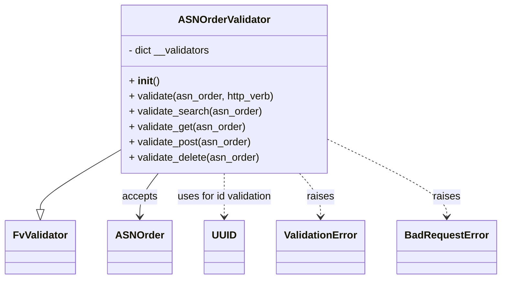

# Diagram: partview_core/partview_service/partview_service/api/asn_order/handlers/validate/ASNOrderValidator.py

> Auto-generated by Obscura crawlers

## Mermaid

### SVG

<svg id="container" width="759.71875" xmlns="http://www.w3.org/2000/svg" class="classDiagram" height="438" viewBox="0 0 759.71875 438" role="graphics-document document" aria-roledescription="class"><g><defs><marker id="container_class-aggregationStart" class="marker aggregation class" refX="18" refY="7" markerWidth="190" markerHeight="240" orient="auto"><path d="M 18,7 L9,13 L1,7 L9,1 Z"></path></marker></defs><defs><marker id="container_class-aggregationEnd" class="marker aggregation class" refX="1" refY="7" markerWidth="20" markerHeight="28" orient="auto"><path d="M 18,7 L9,13 L1,7 L9,1 Z"></path></marker></defs><defs><marker id="container_class-extensionStart" class="marker extension class" refX="18" refY="7" markerWidth="190" markerHeight="240" orient="auto"><path d="M 1,7 L18,13 V 1 Z"></path></marker></defs><defs><marker id="container_class-extensionEnd" class="marker extension class" refX="1" refY="7" markerWidth="20" markerHeight="28" orient="auto"><path d="M 1,1 V 13 L18,7 Z"></path></marker></defs><defs><marker id="container_class-compositionStart" class="marker composition class" refX="18" refY="7" markerWidth="190" markerHeight="240" orient="auto"><path d="M 18,7 L9,13 L1,7 L9,1 Z"></path></marker></defs><defs><marker id="container_class-compositionEnd" class="marker composition class" refX="1" refY="7" markerWidth="20" markerHeight="28" orient="auto"><path d="M 18,7 L9,13 L1,7 L9,1 Z"></path></marker></defs><defs><marker id="container_class-dependencyStart" class="marker dependency class" refX="6" refY="7" markerWidth="190" markerHeight="240" orient="auto"><path d="M 5,7 L9,13 L1,7 L9,1 Z"></path></marker></defs><defs><marker id="container_class-dependencyEnd" class="marker dependency class" refX="13" refY="7" markerWidth="20" markerHeight="28" orient="auto"><path d="M 18,7 L9,13 L14,7 L9,1 Z"></path></marker></defs><defs><marker id="container_class-lollipopStart" class="marker lollipop class" refX="13" refY="7" markerWidth="190" markerHeight="240" orient="auto"><circle stroke="black" fill="transparent" cx="7" cy="7" r="6"></circle></marker></defs><defs><marker id="container_class-lollipopEnd" class="marker lollipop class" refX="1" refY="7" markerWidth="190" markerHeight="240" orient="auto"><circle stroke="black" fill="transparent" cx="7" cy="7" r="6"></circle></marker></defs><g class="root"><g class="clusters"></g><g class="edgePaths"><path d="M177.301,238.222L157.902,250.019C138.503,261.815,99.704,285.407,80.305,300.495C60.906,315.583,60.906,322.167,60.906,325.458L60.906,328.75" id="id_ASNOrderValidator_FvValidator_1" class="edge-thickness-normal edge-pattern-solid relation" style=";;;" data-edge="true" data-et="edge" data-id="id_ASNOrderValidator_FvValidator_1" data-points="W3sieCI6MTc3LjMwMDc4MTI1LCJ5IjoyMzguMjIyMjgzMTI4MTI3M30seyJ4Ijo2MC45MDYyNSwieSI6MzA5fSx7IngiOjYwLjkwNjI1LCJ5IjozNDZ9XQ==" marker-end="url(#container_class-extensionEnd)"></path><path d="M239.248,272L234.596,278.167C229.944,284.333,220.64,296.667,215.988,308C211.336,319.333,211.336,329.667,211.336,334.833L211.336,340" id="id_ASNOrderValidator_ASNOrder_2" class="edge-thickness-normal edge-pattern-solid relation" style=";;;" data-edge="true" data-et="edge" data-id="id_ASNOrderValidator_ASNOrder_2" data-points="W3sieCI6MjM5LjI0ODQyODI1NDQzNzg3LCJ5IjoyNzJ9LHsieCI6MjExLjMzNTkzNzUsInkiOjMwOX0seyJ4IjoyMTEuMzM1OTM3NSwieSI6MzQ2fV0=" marker-end="url(#container_class-dependencyEnd)"></path><path d="M338.828,272L338.828,278.167C338.828,284.333,338.828,296.667,338.828,308C338.828,319.333,338.828,329.667,338.828,334.833L338.828,340" id="id_ASNOrderValidator_UUID_3" class="edge-thickness-normal edge-pattern-dashed relation" style=";;;" data-edge="true" data-et="edge" data-id="id_ASNOrderValidator_UUID_3" data-points="W3sieCI6MzM4LjgyODEyNSwieSI6MjcyfSx7IngiOjMzOC44MjgxMjUsInkiOjMwOX0seyJ4IjozMzguODI4MTI1LCJ5IjozNDZ9XQ==" marker-end="url(#container_class-dependencyEnd)"></path><path d="M453.761,272L459.13,278.167C464.499,284.333,475.238,296.667,480.607,308C485.977,319.333,485.977,329.667,485.977,334.833L485.977,340" id="id_ASNOrderValidator_ValidationError_4" class="edge-thickness-normal edge-pattern-dashed relation" style=";;;" data-edge="true" data-et="edge" data-id="id_ASNOrderValidator_ValidationError_4" data-points="W3sieCI6NDUzLjc2MDYzMjM5NjQ0OTcsInkiOjI3Mn0seyJ4Ijo0ODUuOTc2NTYyNSwieSI6MzA5fSx7IngiOjQ4NS45NzY1NjI1LCJ5IjozNDZ9XQ==" marker-end="url(#container_class-dependencyEnd)"></path><path d="M500.355,220.618L529.869,235.349C559.383,250.079,618.41,279.539,647.924,299.436C677.438,319.333,677.438,329.667,677.438,334.833L677.438,340" id="id_ASNOrderValidator_BadRequestError_5" class="edge-thickness-normal edge-pattern-dashed relation" style=";;;" data-edge="true" data-et="edge" data-id="id_ASNOrderValidator_BadRequestError_5" data-points="W3sieCI6NTAwLjM1NTQ2ODc1LCJ5IjoyMjAuNjE4MzI2MzM0NzMzMDd9LHsieCI6Njc3LjQzNzUsInkiOjMwOX0seyJ4Ijo2NzcuNDM3NSwieSI6MzQ2fV0=" marker-end="url(#container_class-dependencyEnd)"></path></g><g class="edgeLabels"><g class="edgeLabel"><g class="label" data-id="id_ASNOrderValidator_FvValidator_1" transform="translate(0, 0)"><foreignObject width="0" height="0">

</foreignObject></g></g><g class="edgeLabel" transform="translate(211.3359375, 309)"><g class="label" data-id="id_ASNOrderValidator_ASNOrder_2" transform="translate(-27.421875, -12)"><foreignObject width="54.84375" height="24">

accepts

</foreignObject></g></g><g class="edgeLabel" transform="translate(338.828125, 309)"><g class="label" data-id="id_ASNOrderValidator_UUID_3" transform="translate(-76.5703125, -12)"><foreignObject width="153.140625" height="24">

uses for id validation

</foreignObject></g></g><g class="edgeLabel" transform="translate(485.9765625, 309)"><g class="label" data-id="id_ASNOrderValidator_ValidationError_4" transform="translate(-21.25, -12)"><foreignObject width="42.5" height="24">

raises

</foreignObject></g></g><g class="edgeLabel" transform="translate(677.4375, 309)"><g class="label" data-id="id_ASNOrderValidator_BadRequestError_5" transform="translate(-21.25, -12)"><foreignObject width="42.5" height="24">

raises

</foreignObject></g></g></g><g class="nodes"><g class="node default" id="classId-ASNOrderValidator-0" transform="translate(338.828125, 140)"><g class="basic label-container"><path d="M-161.52734375 -132 L161.52734375 -132 L161.52734375 132 L-161.52734375 132" stroke="none" stroke-width="0" fill="#ECECFF" style=""></path><path d="M-161.52734375 -132 C-54.3905915445327 -132, 52.746160660934606 -132, 161.52734375 -132 M-161.52734375 -132 C-69.54396476967754 -132, 22.439414210644912 -132, 161.52734375 -132 M161.52734375 -132 C161.52734375 -57.335248344387296, 161.52734375 17.32950331122541, 161.52734375 132 M161.52734375 -132 C161.52734375 -74.97912577479065, 161.52734375 -17.958251549581277, 161.52734375 132 M161.52734375 132 C46.92001172474352 132, -67.68732030051297 132, -161.52734375 132 M161.52734375 132 C74.56988949685501 132, -12.387564756289976 132, -161.52734375 132 M-161.52734375 132 C-161.52734375 35.59420373949608, -161.52734375 -60.81159252100784, -161.52734375 -132 M-161.52734375 132 C-161.52734375 72.22587146402182, -161.52734375 12.451742928043629, -161.52734375 -132" stroke="#9370DB" stroke-width="1.3" fill="none" stroke-dasharray="0 0" style=""></path></g><g class="annotation-group text" transform="translate(0, -108)"></g><g class="label-group text" transform="translate(-68.7109375, -108)"><g class="label" style="font-weight: bolder" transform="translate(0,-12)"><foreignObject width="137.421875" height="24">

ASNOrderValidator

</foreignObject></g></g><g class="members-group text" transform="translate(-149.52734375, -60)"><g class="label" style="" transform="translate(0,-12)"><foreignObject width="130.359375" height="24">

- dict __validators

</foreignObject></g></g><g class="methods-group text" transform="translate(-149.52734375, -12)"><g class="label" style="" transform="translate(0,-12)"><foreignObject width="47.046875" height="24">

+ <strong>init</strong>()

</foreignObject></g><g class="label" style="" transform="translate(0,12)"><foreignObject width="230.34375" height="24">

+ validate(asn_order, http_verb)

</foreignObject></g><g class="label" style="" transform="translate(0,36)"><foreignObject width="208.84375" height="24">

+ validate_search(asn_order)

</foreignObject></g><g class="label" style="" transform="translate(0,60)"><foreignObject width="184.09375" height="24">

+ validate_get(asn_order)

</foreignObject></g><g class="label" style="" transform="translate(0,84)"><foreignObject width="193.484375" height="24">

+ validate_post(asn_order)

</foreignObject></g><g class="label" style="" transform="translate(0,108)"><foreignObject width="206.9375" height="24">

+ validate_delete(asn_order)

</foreignObject></g></g><g class="divider" style=""><path d="M-161.52734375 -84 C-72.51528673702731 -84, 16.49677027594538 -84, 161.52734375 -84 M-161.52734375 -84 C-37.84453517994177 -84, 85.83827339011646 -84, 161.52734375 -84" stroke="#9370DB" stroke-width="1.3" fill="none" stroke-dasharray="0 0" style=""></path></g><g class="divider" style=""><path d="M-161.52734375 -36 C-71.12217619039764 -36, 19.282991369204723 -36, 161.52734375 -36 M-161.52734375 -36 C-46.252395417840674 -36, 69.02255291431865 -36, 161.52734375 -36" stroke="#9370DB" stroke-width="1.3" fill="none" stroke-dasharray="0 0" style=""></path></g></g><g class="node default" id="classId-FvValidator-1" transform="translate(60.90625, 388)"><g class="basic label-container"><path d="M-52.90625 -42 L52.90625 -42 L52.90625 42 L-52.90625 42" stroke="none" stroke-width="0" fill="#ECECFF" style=""></path><path d="M-52.90625 -42 C-14.226534850274973 -42, 24.453180299450054 -42, 52.90625 -42 M-52.90625 -42 C-18.565918199838592 -42, 15.774413600322816 -42, 52.90625 -42 M52.90625 -42 C52.90625 -19.860323113213205, 52.90625 2.2793537735735896, 52.90625 42 M52.90625 -42 C52.90625 -23.322324565758883, 52.90625 -4.644649131517767, 52.90625 42 M52.90625 42 C11.48119349643136 42, -29.94386300713728 42, -52.90625 42 M52.90625 42 C28.211927345736658 42, 3.5176046914733163 42, -52.90625 42 M-52.90625 42 C-52.90625 23.6057820391466, -52.90625 5.2115640782932005, -52.90625 -42 M-52.90625 42 C-52.90625 23.190116964178173, -52.90625 4.380233928356347, -52.90625 -42" stroke="#9370DB" stroke-width="1.3" fill="none" stroke-dasharray="0 0" style=""></path></g><g class="annotation-group text" transform="translate(0, -18)"></g><g class="label-group text" transform="translate(-40.90625, -18)"><g class="label" style="font-weight: bolder" transform="translate(0,-12)"><foreignObject width="81.8125" height="24">

FvValidator

</foreignObject></g></g><g class="members-group text" transform="translate(-40.90625, 30)"></g><g class="methods-group text" transform="translate(-40.90625, 60)"></g><g class="divider" style=""><path d="M-52.90625 6 C-17.55783547491528 6, 17.79057905016944 6, 52.90625 6 M-52.90625 6 C-17.820401319665166 6, 17.26544736066967 6, 52.90625 6" stroke="#9370DB" stroke-width="1.3" fill="none" stroke-dasharray="0 0" style=""></path></g><g class="divider" style=""><path d="M-52.90625 24 C-12.290434393462071 24, 28.325381213075858 24, 52.90625 24 M-52.90625 24 C-27.10627353612268 24, -1.306297072245357 24, 52.90625 24" stroke="#9370DB" stroke-width="1.3" fill="none" stroke-dasharray="0 0" style=""></path></g></g><g class="node default" id="classId-ASNOrder-2" transform="translate(211.3359375, 388)"><g class="basic label-container"><path d="M-47.5234375 -42 L47.5234375 -42 L47.5234375 42 L-47.5234375 42" stroke="none" stroke-width="0" fill="#ECECFF" style=""></path><path d="M-47.5234375 -42 C-24.814646297663455 -42, -2.105855095326909 -42, 47.5234375 -42 M-47.5234375 -42 C-18.930851250622624 -42, 9.661734998754753 -42, 47.5234375 -42 M47.5234375 -42 C47.5234375 -16.665119381286964, 47.5234375 8.669761237426073, 47.5234375 42 M47.5234375 -42 C47.5234375 -14.081134455677827, 47.5234375 13.837731088644347, 47.5234375 42 M47.5234375 42 C27.05543701167274 42, 6.587436523345481 42, -47.5234375 42 M47.5234375 42 C17.45041215047791 42, -12.622613199044181 42, -47.5234375 42 M-47.5234375 42 C-47.5234375 21.161214387492222, -47.5234375 0.322428774984445, -47.5234375 -42 M-47.5234375 42 C-47.5234375 22.01793239902964, -47.5234375 2.0358647980592792, -47.5234375 -42" stroke="#9370DB" stroke-width="1.3" fill="none" stroke-dasharray="0 0" style=""></path></g><g class="annotation-group text" transform="translate(0, -18)"></g><g class="label-group text" transform="translate(-35.5234375, -18)"><g class="label" style="font-weight: bolder" transform="translate(0,-12)"><foreignObject width="71.046875" height="24">

ASNOrder

</foreignObject></g></g><g class="members-group text" transform="translate(-35.5234375, 30)"></g><g class="methods-group text" transform="translate(-35.5234375, 60)"></g><g class="divider" style=""><path d="M-47.5234375 6 C-21.962355397064567 6, 3.5987267058708667 6, 47.5234375 6 M-47.5234375 6 C-22.87174073848554 6, 1.779956023028923 6, 47.5234375 6" stroke="#9370DB" stroke-width="1.3" fill="none" stroke-dasharray="0 0" style=""></path></g><g class="divider" style=""><path d="M-47.5234375 24 C-20.324803767041026 24, 6.873829965917949 24, 47.5234375 24 M-47.5234375 24 C-26.44187170999932 24, -5.360305919998638 24, 47.5234375 24" stroke="#9370DB" stroke-width="1.3" fill="none" stroke-dasharray="0 0" style=""></path></g></g><g class="node default" id="classId-ValidationError-3" transform="translate(485.9765625, 388)"><g class="basic label-container"><path d="M-67.1796875 -42 L67.1796875 -42 L67.1796875 42 L-67.1796875 42" stroke="none" stroke-width="0" fill="#ECECFF" style=""></path><path d="M-67.1796875 -42 C-23.69812990773452 -42, 19.783427684530963 -42, 67.1796875 -42 M-67.1796875 -42 C-30.79641645147847 -42, 5.586854597043057 -42, 67.1796875 -42 M67.1796875 -42 C67.1796875 -23.502068893389456, 67.1796875 -5.004137786778912, 67.1796875 42 M67.1796875 -42 C67.1796875 -20.90312994058123, 67.1796875 0.19374011883753894, 67.1796875 42 M67.1796875 42 C17.688695558264236 42, -31.80229638347153 42, -67.1796875 42 M67.1796875 42 C24.236191165935814 42, -18.70730516812837 42, -67.1796875 42 M-67.1796875 42 C-67.1796875 15.392245893872147, -67.1796875 -11.215508212255706, -67.1796875 -42 M-67.1796875 42 C-67.1796875 15.287630417466104, -67.1796875 -11.424739165067791, -67.1796875 -42" stroke="#9370DB" stroke-width="1.3" fill="none" stroke-dasharray="0 0" style=""></path></g><g class="annotation-group text" transform="translate(0, -18)"></g><g class="label-group text" transform="translate(-55.1796875, -18)"><g class="label" style="font-weight: bolder" transform="translate(0,-12)"><foreignObject width="110.359375" height="24">

ValidationError

</foreignObject></g></g><g class="members-group text" transform="translate(-55.1796875, 30)"></g><g class="methods-group text" transform="translate(-55.1796875, 60)"></g><g class="divider" style=""><path d="M-67.1796875 6 C-38.19817517225277 6, -9.216662844505535 6, 67.1796875 6 M-67.1796875 6 C-31.983743382575312 6, 3.2122007348493753 6, 67.1796875 6" stroke="#9370DB" stroke-width="1.3" fill="none" stroke-dasharray="0 0" style=""></path></g><g class="divider" style=""><path d="M-67.1796875 24 C-13.728633848821083 24, 39.722419802357834 24, 67.1796875 24 M-67.1796875 24 C-40.08284615230289 24, -12.986004804605777 24, 67.1796875 24" stroke="#9370DB" stroke-width="1.3" fill="none" stroke-dasharray="0 0" style=""></path></g></g><g class="node default" id="classId-BadRequestError-4" transform="translate(677.4375, 388)"><g class="basic label-container"><path d="M-74.28125 -42 L74.28125 -42 L74.28125 42 L-74.28125 42" stroke="none" stroke-width="0" fill="#ECECFF" style=""></path><path d="M-74.28125 -42 C-19.069213081495455 -42, 36.14282383700909 -42, 74.28125 -42 M-74.28125 -42 C-42.82202270323468 -42, -11.362795406469367 -42, 74.28125 -42 M74.28125 -42 C74.28125 -8.953436598042593, 74.28125 24.093126803914814, 74.28125 42 M74.28125 -42 C74.28125 -17.448761644403692, 74.28125 7.102476711192615, 74.28125 42 M74.28125 42 C26.88116562198381 42, -20.518918756032377 42, -74.28125 42 M74.28125 42 C22.594378974723973 42, -29.092492050552053 42, -74.28125 42 M-74.28125 42 C-74.28125 20.430326487050152, -74.28125 -1.1393470258996956, -74.28125 -42 M-74.28125 42 C-74.28125 17.701684785785094, -74.28125 -6.596630428429812, -74.28125 -42" stroke="#9370DB" stroke-width="1.3" fill="none" stroke-dasharray="0 0" style=""></path></g><g class="annotation-group text" transform="translate(0, -18)"></g><g class="label-group text" transform="translate(-62.28125, -18)"><g class="label" style="font-weight: bolder" transform="translate(0,-12)"><foreignObject width="124.5625" height="24">

BadRequestError

</foreignObject></g></g><g class="members-group text" transform="translate(-62.28125, 30)"></g><g class="methods-group text" transform="translate(-62.28125, 60)"></g><g class="divider" style=""><path d="M-74.28125 6 C-18.747794196253366 6, 36.78566160749327 6, 74.28125 6 M-74.28125 6 C-39.95916643411645 6, -5.637082868232895 6, 74.28125 6" stroke="#9370DB" stroke-width="1.3" fill="none" stroke-dasharray="0 0" style=""></path></g><g class="divider" style=""><path d="M-74.28125 24 C-31.948760663784533 24, 10.383728672430934 24, 74.28125 24 M-74.28125 24 C-25.649495684099293 24, 22.982258631801415 24, 74.28125 24" stroke="#9370DB" stroke-width="1.3" fill="none" stroke-dasharray="0 0" style=""></path></g></g><g class="node default" id="classId-UUID-5" transform="translate(338.828125, 388)"><g class="basic label-container"><path d="M-29.96875 -42 L29.96875 -42 L29.96875 42 L-29.96875 42" stroke="none" stroke-width="0" fill="#ECECFF" style=""></path><path d="M-29.96875 -42 C-6.963520566279755 -42, 16.04170886744049 -42, 29.96875 -42 M-29.96875 -42 C-16.591333081376 -42, -3.213916162752003 -42, 29.96875 -42 M29.96875 -42 C29.96875 -15.84213821325309, 29.96875 10.31572357349382, 29.96875 42 M29.96875 -42 C29.96875 -15.881794539087497, 29.96875 10.236410921825005, 29.96875 42 M29.96875 42 C9.159331315242536 42, -11.650087369514928 42, -29.96875 42 M29.96875 42 C9.316579470429783 42, -11.335591059140434 42, -29.96875 42 M-29.96875 42 C-29.96875 23.447475592719066, -29.96875 4.894951185438131, -29.96875 -42 M-29.96875 42 C-29.96875 21.55590648348557, -29.96875 1.1118129669711365, -29.96875 -42" stroke="#9370DB" stroke-width="1.3" fill="none" stroke-dasharray="0 0" style=""></path></g><g class="annotation-group text" transform="translate(0, -18)"></g><g class="label-group text" transform="translate(-17.96875, -18)"><g class="label" style="font-weight: bolder" transform="translate(0,-12)"><foreignObject width="35.9375" height="24">

UUID

</foreignObject></g></g><g class="members-group text" transform="translate(-17.96875, 30)"></g><g class="methods-group text" transform="translate(-17.96875, 60)"></g><g class="divider" style=""><path d="M-29.96875 6 C-11.818663896223363 6, 6.331422207553274 6, 29.96875 6 M-29.96875 6 C-16.855241769325772 6, -3.7417335386515482 6, 29.96875 6" stroke="#9370DB" stroke-width="1.3" fill="none" stroke-dasharray="0 0" style=""></path></g><g class="divider" style=""><path d="M-29.96875 24 C-8.579913268058199 24, 12.808923463883602 24, 29.96875 24 M-29.96875 24 C-13.810310740010198 24, 2.3481285199796034 24, 29.96875 24" stroke="#9370DB" stroke-width="1.3" fill="none" stroke-dasharray="0 0" style=""></path></g></g></g></g></g></svg>
