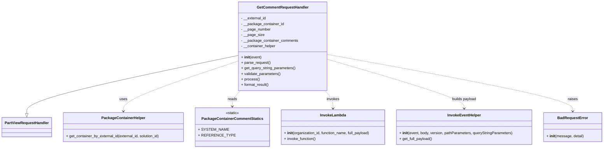

# Diagram: partview_core/partview_service/partview_service/api/comments/handlers/get_comments.py


> Auto-generated by Obscura crawlers

## Diagram 1



### SVG

<svg id="container" width="2560.90625" xmlns="http://www.w3.org/2000/svg" class="classDiagram" height="642" viewBox="0 0 2560.90625 642" role="graphics-document document" aria-roledescription="class"><style>#container{font-family:"trebuchet ms",verdana,arial,sans-serif;font-size:16px;fill:#333;}@keyframes edge-animation-frame{from{stroke-dashoffset:0;}}@keyframes dash{to{stroke-dashoffset:0;}}#container .edge-animation-slow{stroke-dasharray:9,5!important;stroke-dashoffset:900;animation:dash 50s linear infinite;stroke-linecap:round;}#container .edge-animation-fast{stroke-dasharray:9,5!important;stroke-dashoffset:900;animation:dash 20s linear infinite;stroke-linecap:round;}#container .error-icon{fill:#552222;}#container .error-text{fill:#552222;stroke:#552222;}#container .edge-thickness-normal{stroke-width:1px;}#container .edge-thickness-thick{stroke-width:3.5px;}#container .edge-pattern-solid{stroke-dasharray:0;}#container .edge-thickness-invisible{stroke-width:0;fill:none;}#container .edge-pattern-dashed{stroke-dasharray:3;}#container .edge-pattern-dotted{stroke-dasharray:2;}#container .marker{fill:#333333;stroke:#333333;}#container .marker.cross{stroke:#333333;}#container svg{font-family:"trebuchet ms",verdana,arial,sans-serif;font-size:16px;}#container p{margin:0;}#container g.classGroup text{fill:#9370DB;stroke:none;font-family:"trebuchet ms",verdana,arial,sans-serif;font-size:10px;}#container g.classGroup text .title{font-weight:bolder;}#container .nodeLabel,#container .edgeLabel{color:#131300;}#container .edgeLabel .label rect{fill:#ECECFF;}#container .label text{fill:#131300;}#container .labelBkg{background:#ECECFF;}#container .edgeLabel .label span{background:#ECECFF;}#container .classTitle{font-weight:bolder;}#container .node rect,#container .node circle,#container .node ellipse,#container .node polygon,#container .node path{fill:#ECECFF;stroke:#9370DB;stroke-width:1px;}#container .divider{stroke:#9370DB;stroke-width:1;}#container g.clickable{cursor:pointer;}#container g.classGroup rect{fill:#ECECFF;stroke:#9370DB;}#container g.classGroup line{stroke:#9370DB;stroke-width:1;}#container .classLabel .box{stroke:none;stroke-width:0;fill:#ECECFF;opacity:0.5;}#container .classLabel .label{fill:#9370DB;font-size:10px;}#container .relation{stroke:#333333;stroke-width:1;fill:none;}#container .dashed-line{stroke-dasharray:3;}#container .dotted-line{stroke-dasharray:1 2;}#container #compositionStart,#container .composition{fill:#333333!important;stroke:#333333!important;stroke-width:1;}#container #compositionEnd,#container .composition{fill:#333333!important;stroke:#333333!important;stroke-width:1;}#container #dependencyStart,#container .dependency{fill:#333333!important;stroke:#333333!important;stroke-width:1;}#container #dependencyStart,#container .dependency{fill:#333333!important;stroke:#333333!important;stroke-width:1;}#container #extensionStart,#container .extension{fill:transparent!important;stroke:#333333!important;stroke-width:1;}#container #extensionEnd,#container .extension{fill:transparent!important;stroke:#333333!important;stroke-width:1;}#container #aggregationStart,#container .aggregation{fill:transparent!important;stroke:#333333!important;stroke-width:1;}#container #aggregationEnd,#container .aggregation{fill:transparent!important;stroke:#333333!important;stroke-width:1;}#container #lollipopStart,#container .lollipop{fill:#ECECFF!important;stroke:#333333!important;stroke-width:1;}#container #lollipopEnd,#container .lollipop{fill:#ECECFF!important;stroke:#333333!important;stroke-width:1;}#container .edgeTerminals{font-size:11px;line-height:initial;}#container .classTitleText{text-anchor:middle;font-size:18px;fill:#333;}#container .label-icon{display:inline-block;height:1em;overflow:visible;vertical-align:-0.125em;}#container .node .label-icon path{fill:currentColor;stroke:revert;stroke-width:revert;}#container :root{--mermaid-font-family:"trebuchet ms",verdana,arial,sans-serif;}</style><g><defs><marker id="container_class-aggregationStart" class="marker aggregation class" refX="18" refY="7" markerWidth="190" markerHeight="240" orient="auto"><path d="M 18,7 L9,13 L1,7 L9,1 Z"></path></marker></defs><defs><marker id="container_class-aggregationEnd" class="marker aggregation class" refX="1" refY="7" markerWidth="20" markerHeight="28" orient="auto"><path d="M 18,7 L9,13 L1,7 L9,1 Z"></path></marker></defs><defs><marker id="container_class-extensionStart" class="marker extension class" refX="18" refY="7" markerWidth="190" markerHeight="240" orient="auto"><path d="M 1,7 L18,13 V 1 Z"></path></marker></defs><defs><marker id="container_class-extensionEnd" class="marker extension class" refX="1" refY="7" markerWidth="20" markerHeight="28" orient="auto"><path d="M 1,1 V 13 L18,7 Z"></path></marker></defs><defs><marker id="container_class-compositionStart" class="marker composition class" refX="18" refY="7" markerWidth="190" markerHeight="240" orient="auto"><path d="M 18,7 L9,13 L1,7 L9,1 Z"></path></marker></defs><defs><marker id="container_class-compositionEnd" class="marker composition class" refX="1" refY="7" markerWidth="20" markerHeight="28" orient="auto"><path d="M 18,7 L9,13 L1,7 L9,1 Z"></path></marker></defs><defs><marker id="container_class-dependencyStart" class="marker dependency class" refX="6" refY="7" markerWidth="190" markerHeight="240" orient="auto"><path d="M 5,7 L9,13 L1,7 L9,1 Z"></path></marker></defs><defs><marker id="container_class-dependencyEnd" class="marker dependency class" refX="13" refY="7" markerWidth="20" markerHeight="28" orient="auto"><path d="M 18,7 L9,13 L14,7 L9,1 Z"></path></marker></defs><defs><marker id="container_class-lollipopStart" class="marker lollipop class" refX="13" refY="7" markerWidth="190" markerHeight="240" orient="auto"><circle stroke="black" fill="transparent" cx="7" cy="7" r="6"></circle></marker></defs><defs><marker id="container_class-lollipopEnd" class="marker lollipop class" refX="1" refY="7" markerWidth="190" markerHeight="240" orient="auto"><circle stroke="black" fill="transparent" cx="7" cy="7" r="6"></circle></marker></defs><g class="root"><g class="clusters"></g><g class="edgePaths"><path d="M1001.1,239.918L852.81,271.431C704.52,302.945,407.939,365.973,259.649,407.778C111.359,449.583,111.359,470.167,111.359,480.458L111.359,490.75" id="id_GetCommentRequestHandler_PartViewRequestHandler_1" class="edge-thickness-normal edge-pattern-solid relation" style=";;;" data-edge="true" data-et="edge" data-id="id_GetCommentRequestHandler_PartViewRequestHandler_1" data-points="W3sieCI6MTAwMS4wOTk2MDkzNzUsInkiOjIzOS45MTc3NjI0ODQxNjMxMn0seyJ4IjoxMTEuMzU5Mzc1LCJ5Ijo0Mjl9LHsieCI6MTExLjM1OTM3NSwieSI6NTA4fV0=" marker-end="url(#container_class-extensionEnd)"></path><path d="M1001.1,264.86L921.875,292.217C842.65,319.574,684.2,374.287,604.975,410.31C525.75,446.333,525.75,463.667,525.75,472.333L525.75,481" id="id_GetCommentRequestHandler_PackageContainerHelper_2" class="edge-thickness-normal edge-pattern-dashed relation" style=";;;" data-edge="true" data-et="edge" data-id="id_GetCommentRequestHandler_PackageContainerHelper_2" data-points="W3sieCI6MTAwMS4wOTk2MDkzNzUsInkiOjI2NC44NjAzMjQzNjk1MzUxfSx7IngiOjUyNS43NSwieSI6NDI5fSx7IngiOjUyNS43NSwieSI6NDg3fV0=" marker-end="url(#container_class-dependencyEnd)"></path><path d="M1013.251,392L1007.608,398.167C1001.965,404.333,990.68,416.667,985.037,428C979.395,439.333,979.395,449.667,979.395,454.833L979.395,460" id="id_GetCommentRequestHandler_PackageContainerCommentStatics_3" class="edge-thickness-normal edge-pattern-dashed relation" style=";;;" data-edge="true" data-et="edge" data-id="id_GetCommentRequestHandler_PackageContainerCommentStatics_3" data-points="W3sieCI6MTAxMy4yNTA1MDMyMDY4Nzc3LCJ5IjozOTJ9LHsieCI6OTc5LjM5NDUzMTI1LCJ5Ijo0Mjl9LHsieCI6OTc5LjM5NDUzMTI1LCJ5Ijo0NjZ9XQ==" marker-end="url(#container_class-dependencyEnd)"></path><path d="M1364.621,392L1370.263,398.167C1375.906,404.333,1387.191,416.667,1392.834,429.5C1398.477,442.333,1398.477,455.667,1398.477,462.333L1398.477,469" id="id_GetCommentRequestHandler_InvokeLambda_4" class="edge-thickness-normal edge-pattern-dashed relation" style=";;;" data-edge="true" data-et="edge" data-id="id_GetCommentRequestHandler_InvokeLambda_4" data-points="W3sieCI6MTM2NC42MjA1OTA1NDMxMjIzLCJ5IjozOTJ9LHsieCI6MTM5OC40NzY1NjI1LCJ5Ijo0Mjl9LHsieCI6MTM5OC40NzY1NjI1LCJ5Ijo0NzV9XQ==" marker-end="url(#container_class-dependencyEnd)"></path><path d="M1376.771,255.342L1475.007,284.285C1573.242,313.228,1769.713,371.114,1867.948,406.724C1966.184,442.333,1966.184,455.667,1966.184,462.333L1966.184,469" id="id_GetCommentRequestHandler_InvokeEventHelper_5" class="edge-thickness-normal edge-pattern-dashed relation" style=";;;" data-edge="true" data-et="edge" data-id="id_GetCommentRequestHandler_InvokeEventHelper_5" data-points="W3sieCI6MTM3Ni43NzE0ODQzNzUsInkiOjI1NS4zNDE5NTkxODU5Mjk5fSx7IngiOjE5NjYuMTgzNTkzNzUsInkiOjQyOX0seyJ4IjoxOTY2LjE4MzU5Mzc1LCJ5Ijo0NzV9XQ==" marker-end="url(#container_class-dependencyEnd)"></path><path d="M1376.771,234.655L1552.337,267.046C1727.902,299.436,2079.033,364.218,2254.599,405.276C2430.164,446.333,2430.164,463.667,2430.164,472.333L2430.164,481" id="id_GetCommentRequestHandler_BadRequestError_6" class="edge-thickness-normal edge-pattern-dashed relation" style=";;;" data-edge="true" data-et="edge" data-id="id_GetCommentRequestHandler_BadRequestError_6" data-points="W3sieCI6MTM3Ni43NzE0ODQzNzUsInkiOjIzNC42NTQ3MjI0MzUwODc0OH0seyJ4IjoyNDMwLjE2NDA2MjUsInkiOjQyOX0seyJ4IjoyNDMwLjE2NDA2MjUsInkiOjQ4N31d" marker-end="url(#container_class-dependencyEnd)"></path></g><g class="edgeLabels"><g class="edgeLabel"><g class="label" data-id="id_GetCommentRequestHandler_PartViewRequestHandler_1" transform="translate(0, 0)"><foreignObject width="0" height="0"><div xmlns="http://www.w3.org/1999/xhtml" class="labelBkg" style="display: table-cell; white-space: nowrap; line-height: 1.5; max-width: 200px; text-align: center;"><span class="edgeLabel"></span></div></foreignObject></g></g><g class="edgeLabel" transform="translate(525.75, 429)"><g class="label" data-id="id_GetCommentRequestHandler_PackageContainerHelper_2" transform="translate(-16.4921875, -12)"><foreignObject width="32.984375" height="24"><div xmlns="http://www.w3.org/1999/xhtml" class="labelBkg" style="display: table-cell; white-space: nowrap; line-height: 1.5; max-width: 200px; text-align: center;"><span class="edgeLabel"><p>uses</p></span></div></foreignObject></g></g><g class="edgeLabel" transform="translate(979.39453125, 429)"><g class="label" data-id="id_GetCommentRequestHandler_PackageContainerCommentStatics_3" transform="translate(-20.0078125, -12)"><foreignObject width="40.015625" height="24"><div xmlns="http://www.w3.org/1999/xhtml" class="labelBkg" style="display: table-cell; white-space: nowrap; line-height: 1.5; max-width: 200px; text-align: center;"><span class="edgeLabel"><p>reads</p></span></div></foreignObject></g></g><g class="edgeLabel" transform="translate(1398.4765625, 429)"><g class="label" data-id="id_GetCommentRequestHandler_InvokeLambda_4" transform="translate(-27.5859375, -12)"><foreignObject width="55.171875" height="24"><div xmlns="http://www.w3.org/1999/xhtml" class="labelBkg" style="display: table-cell; white-space: nowrap; line-height: 1.5; max-width: 200px; text-align: center;"><span class="edgeLabel"><p>invokes</p></span></div></foreignObject></g></g><g class="edgeLabel" transform="translate(1966.18359375, 429)"><g class="label" data-id="id_GetCommentRequestHandler_InvokeEventHelper_5" transform="translate(-53.484375, -12)"><foreignObject width="106.96875" height="24"><div xmlns="http://www.w3.org/1999/xhtml" class="labelBkg" style="display: table-cell; white-space: nowrap; line-height: 1.5; max-width: 200px; text-align: center;"><span class="edgeLabel"><p>builds payload</p></span></div></foreignObject></g></g><g class="edgeLabel" transform="translate(2430.1640625, 429)"><g class="label" data-id="id_GetCommentRequestHandler_BadRequestError_6" transform="translate(-21.25, -12)"><foreignObject width="42.5" height="24"><div xmlns="http://www.w3.org/1999/xhtml" class="labelBkg" style="display: table-cell; white-space: nowrap; line-height: 1.5; max-width: 200px; text-align: center;"><span class="edgeLabel"><p>raises</p></span></div></foreignObject></g></g></g><g class="nodes"><g class="node default" id="classId-PartViewRequestHandler-0" transform="translate(111.359375, 550)"><g class="basic label-container"><path d="M-103.359375 -42 L103.359375 -42 L103.359375 42 L-103.359375 42" stroke="none" stroke-width="0" fill="#ECECFF" style=""></path><path d="M-103.359375 -42 C-48.25363677649845 -42, 6.852101447003093 -42, 103.359375 -42 M-103.359375 -42 C-55.21724177349819 -42, -7.0751085469963755 -42, 103.359375 -42 M103.359375 -42 C103.359375 -16.393722630047442, 103.359375 9.212554739905116, 103.359375 42 M103.359375 -42 C103.359375 -24.178861307731573, 103.359375 -6.357722615463146, 103.359375 42 M103.359375 42 C26.634188171283284 42, -50.09099865743343 42, -103.359375 42 M103.359375 42 C56.91121702117079 42, 10.463059042341584 42, -103.359375 42 M-103.359375 42 C-103.359375 9.938080781488459, -103.359375 -22.123838437023082, -103.359375 -42 M-103.359375 42 C-103.359375 11.64534181878112, -103.359375 -18.70931636243776, -103.359375 -42" stroke="#9370DB" stroke-width="1.3" fill="none" stroke-dasharray="0 0" style=""></path></g><g class="annotation-group text" transform="translate(0, -18)"></g><g class="label-group text" transform="translate(-91.359375, -18)"><g class="label" style="font-weight: bolder" transform="translate(0,-12)"><foreignObject width="182.71875" height="24"><div xmlns="http://www.w3.org/1999/xhtml" style="display: table-cell; white-space: nowrap; line-height: 1.5; max-width: 231px; text-align: center;"><span class="nodeLabel markdown-node-label" style=""><p>PartViewRequestHandler</p></span></div></foreignObject></g></g><g class="members-group text" transform="translate(-91.359375, 30)"></g><g class="methods-group text" transform="translate(-91.359375, 60)"></g><g class="divider" style=""><path d="M-103.359375 6 C-49.63852865552205 6, 4.0823176889558965 6, 103.359375 6 M-103.359375 6 C-56.33187691933865 6, -9.304378838677295 6, 103.359375 6" stroke="#9370DB" stroke-width="1.3" fill="none" stroke-dasharray="0 0" style=""></path></g><g class="divider" style=""><path d="M-103.359375 24 C-47.632472842863656 24, 8.094429314272688 24, 103.359375 24 M-103.359375 24 C-57.73938837765406 24, -12.119401755308118 24, 103.359375 24" stroke="#9370DB" stroke-width="1.3" fill="none" stroke-dasharray="0 0" style=""></path></g></g><g class="node default" id="classId-GetCommentRequestHandler-1" transform="translate(1188.935546875, 200)"><g class="basic label-container"><path d="M-187.8359375 -192 L187.8359375 -192 L187.8359375 192 L-187.8359375 192" stroke="none" stroke-width="0" fill="#ECECFF" style=""></path><path d="M-187.8359375 -192 C-103.74169788870353 -192, -19.647458277407054 -192, 187.8359375 -192 M-187.8359375 -192 C-99.89928630961454 -192, -11.962635119229077 -192, 187.8359375 -192 M187.8359375 -192 C187.8359375 -55.012859579822674, 187.8359375 81.97428084035465, 187.8359375 192 M187.8359375 -192 C187.8359375 -92.27367712238794, 187.8359375 7.452645755224125, 187.8359375 192 M187.8359375 192 C109.09710060835593 192, 30.35826371671186 192, -187.8359375 192 M187.8359375 192 C54.51309270094538 192, -78.80975209810924 192, -187.8359375 192 M-187.8359375 192 C-187.8359375 66.71131298276332, -187.8359375 -58.577374034473365, -187.8359375 -192 M-187.8359375 192 C-187.8359375 51.9300327464525, -187.8359375 -88.139934507095, -187.8359375 -192" stroke="#9370DB" stroke-width="1.3" fill="none" stroke-dasharray="0 0" style=""></path></g><g class="annotation-group text" transform="translate(0, -168)"></g><g class="label-group text" transform="translate(-106.484375, -168)"><g class="label" style="font-weight: bolder" transform="translate(0,-12)"><foreignObject width="212.96875" height="24"><div xmlns="http://www.w3.org/1999/xhtml" style="display: table-cell; white-space: nowrap; line-height: 1.5; max-width: 262px; text-align: center;"><span class="nodeLabel markdown-node-label" style=""><p>GetCommentRequestHandler</p></span></div></foreignObject></g></g><g class="members-group text" transform="translate(-175.8359375, -120)"><g class="label" style="" transform="translate(0,-12)"><foreignObject width="108.625" height="24"><div xmlns="http://www.w3.org/1999/xhtml" style="display: table-cell; white-space: nowrap; line-height: 1.5; max-width: 166px; text-align: center;"><span class="nodeLabel markdown-node-label" style=""><p>- __external_id</p></span></div></foreignObject></g><g class="label" style="" transform="translate(0,12)"><foreignObject width="184.15625" height="24"><div xmlns="http://www.w3.org/1999/xhtml" style="display: table-cell; white-space: nowrap; line-height: 1.5; max-width: 242px; text-align: center;"><span class="nodeLabel markdown-node-label" style=""><p>- __package_container_id</p></span></div></foreignObject></g><g class="label" style="" transform="translate(0,36)"><foreignObject width="126.640625" height="24"><div xmlns="http://www.w3.org/1999/xhtml" style="display: table-cell; white-space: nowrap; line-height: 1.5; max-width: 185px; text-align: center;"><span class="nodeLabel markdown-node-label" style=""><p>- __page_number</p></span></div></foreignObject></g><g class="label" style="" transform="translate(0,60)"><foreignObject width="97.4375" height="24"><div xmlns="http://www.w3.org/1999/xhtml" style="display: table-cell; white-space: nowrap; line-height: 1.5; max-width: 155px; text-align: center;"><span class="nodeLabel markdown-node-label" style=""><p>- __page_size</p></span></div></foreignObject></g><g class="label" style="" transform="translate(0,84)"><foreignObject width="245.1875" height="24"><div xmlns="http://www.w3.org/1999/xhtml" style="display: table-cell; white-space: nowrap; line-height: 1.5; max-width: 303px; text-align: center;"><span class="nodeLabel markdown-node-label" style=""><p>- __package_container_comments</p></span></div></foreignObject></g><g class="label" style="" transform="translate(0,108)"><foreignObject width="150.28125" height="24"><div xmlns="http://www.w3.org/1999/xhtml" style="display: table-cell; white-space: nowrap; line-height: 1.5; max-width: 208px; text-align: center;"><span class="nodeLabel markdown-node-label" style=""><p>- __container_helper</p></span></div></foreignObject></g></g><g class="methods-group text" transform="translate(-175.8359375, 48)"><g class="label" style="" transform="translate(0,-12)"><foreignObject width="87.390625" height="24"><div xmlns="http://www.w3.org/1999/xhtml" style="display: table-cell; white-space: nowrap; line-height: 1.5; max-width: 177px; text-align: center;"><span class="nodeLabel markdown-node-label" style=""><p>+ <strong>init</strong>(event)</p></span></div></foreignObject></g><g class="label" style="" transform="translate(0,12)"><foreignObject width="126.046875" height="24"><div xmlns="http://www.w3.org/1999/xhtml" style="display: table-cell; white-space: nowrap; line-height: 1.5; max-width: 183px; text-align: center;"><span class="nodeLabel markdown-node-label" style=""><p>+ parse_request()</p></span></div></foreignObject></g><g class="label" style="" transform="translate(0,36)"><foreignObject width="235.125" height="24"><div xmlns="http://www.w3.org/1999/xhtml" style="display: table-cell; white-space: nowrap; line-height: 1.5; max-width: 292px; text-align: center;"><span class="nodeLabel markdown-node-label" style=""><p>+ get_query_string_parameters()</p></span></div></foreignObject></g><g class="label" style="" transform="translate(0,60)"><foreignObject width="170.953125" height="24"><div xmlns="http://www.w3.org/1999/xhtml" style="display: table-cell; white-space: nowrap; line-height: 1.5; max-width: 228px; text-align: center;"><span class="nodeLabel markdown-node-label" style=""><p>+ validate_parameters()</p></span></div></foreignObject></g><g class="label" style="" transform="translate(0,84)"><foreignObject width="77.96875" height="24"><div xmlns="http://www.w3.org/1999/xhtml" style="display: table-cell; white-space: nowrap; line-height: 1.5; max-width: 135px; text-align: center;"><span class="nodeLabel markdown-node-label" style=""><p>+ process()</p></span></div></foreignObject></g><g class="label" style="" transform="translate(0,108)"><foreignObject width="121.5" height="24"><div xmlns="http://www.w3.org/1999/xhtml" style="display: table-cell; white-space: nowrap; line-height: 1.5; max-width: 179px; text-align: center;"><span class="nodeLabel markdown-node-label" style=""><p>+ format_result()</p></span></div></foreignObject></g></g><g class="divider" style=""><path d="M-187.8359375 -144 C-63.861247676933246 -144, 60.11344214613351 -144, 187.8359375 -144 M-187.8359375 -144 C-41.82568023137972 -144, 104.18457703724056 -144, 187.8359375 -144" stroke="#9370DB" stroke-width="1.3" fill="none" stroke-dasharray="0 0" style=""></path></g><g class="divider" style=""><path d="M-187.8359375 24 C-100.2320842551299 24, -12.62823101025981 24, 187.8359375 24 M-187.8359375 24 C-62.40404662131124 24, 63.027844257377524 24, 187.8359375 24" stroke="#9370DB" stroke-width="1.3" fill="none" stroke-dasharray="0 0" style=""></path></g></g><g class="node default" id="classId-PackageContainerHelper-2" transform="translate(525.75, 550)"><g class="basic label-container"><path d="M-261.03125 -63 L261.03125 -63 L261.03125 63 L-261.03125 63" stroke="none" stroke-width="0" fill="#ECECFF" style=""></path><path d="M-261.03125 -63 C-104.7284378319263 -63, 51.5743743361474 -63, 261.03125 -63 M-261.03125 -63 C-61.359317754447176 -63, 138.31261449110565 -63, 261.03125 -63 M261.03125 -63 C261.03125 -25.519184293944022, 261.03125 11.961631412111956, 261.03125 63 M261.03125 -63 C261.03125 -27.596078558332046, 261.03125 7.807842883335908, 261.03125 63 M261.03125 63 C97.49708355445333 63, -66.03708289109335 63, -261.03125 63 M261.03125 63 C154.8081547592367 63, 48.58505951847337 63, -261.03125 63 M-261.03125 63 C-261.03125 23.378669166231134, -261.03125 -16.24266166753773, -261.03125 -63 M-261.03125 63 C-261.03125 36.30258807160939, -261.03125 9.605176143218792, -261.03125 -63" stroke="#9370DB" stroke-width="1.3" fill="none" stroke-dasharray="0 0" style=""></path></g><g class="annotation-group text" transform="translate(0, -39)"></g><g class="label-group text" transform="translate(-89.96875, -39)"><g class="label" style="font-weight: bolder" transform="translate(0,-12)"><foreignObject width="179.9375" height="24"><div xmlns="http://www.w3.org/1999/xhtml" style="display: table-cell; white-space: nowrap; line-height: 1.5; max-width: 228px; text-align: center;"><span class="nodeLabel markdown-node-label" style=""><p>PackageContainerHelper</p></span></div></foreignObject></g></g><g class="members-group text" transform="translate(-249.03125, 9)"></g><g class="methods-group text" transform="translate(-249.03125, 39)"><g class="label" style="" transform="translate(0,-12)"><foreignObject width="408.09375" height="24"><div xmlns="http://www.w3.org/1999/xhtml" style="display: table-cell; white-space: nowrap; line-height: 1.5; max-width: 465px; text-align: center;"><span class="nodeLabel markdown-node-label" style=""><p>+ get_container_by_external_id(external_id, solution_id)</p></span></div></foreignObject></g></g><g class="divider" style=""><path d="M-261.03125 -15 C-154.79205790877987 -15, -48.552865817559734 -15, 261.03125 -15 M-261.03125 -15 C-76.32637665130778 -15, 108.37849669738443 -15, 261.03125 -15" stroke="#9370DB" stroke-width="1.3" fill="none" stroke-dasharray="0 0" style=""></path></g><g class="divider" style=""><path d="M-261.03125 9 C-89.82546027750345 9, 81.3803294449931 9, 261.03125 9 M-261.03125 9 C-140.39045295862485 9, -19.749655917249697 9, 261.03125 9" stroke="#9370DB" stroke-width="1.3" fill="none" stroke-dasharray="0 0" style=""></path></g></g><g class="node default" id="classId-InvokeLambda-3" transform="translate(1398.4765625, 550)"><g class="basic label-container"><path d="M-226.46875 -75 L226.46875 -75 L226.46875 75 L-226.46875 75" stroke="none" stroke-width="0" fill="#ECECFF" style=""></path><path d="M-226.46875 -75 C-107.81792675055624 -75, 10.832896498887521 -75, 226.46875 -75 M-226.46875 -75 C-101.81936388646831 -75, 22.83002222706338 -75, 226.46875 -75 M226.46875 -75 C226.46875 -18.338887842709667, 226.46875 38.322224314580666, 226.46875 75 M226.46875 -75 C226.46875 -30.84178652441546, 226.46875 13.316426951169078, 226.46875 75 M226.46875 75 C131.50005659076604 75, 36.53136318153207 75, -226.46875 75 M226.46875 75 C60.705686386248686 75, -105.05737722750263 75, -226.46875 75 M-226.46875 75 C-226.46875 19.775615232371784, -226.46875 -35.44876953525643, -226.46875 -75 M-226.46875 75 C-226.46875 40.70959023368308, -226.46875 6.419180467366161, -226.46875 -75" stroke="#9370DB" stroke-width="1.3" fill="none" stroke-dasharray="0 0" style=""></path></g><g class="annotation-group text" transform="translate(0, -51)"></g><g class="label-group text" transform="translate(-53.484375, -51)"><g class="label" style="font-weight: bolder" transform="translate(0,-12)"><foreignObject width="106.96875" height="24"><div xmlns="http://www.w3.org/1999/xhtml" style="display: table-cell; white-space: nowrap; line-height: 1.5; max-width: 156px; text-align: center;"><span class="nodeLabel markdown-node-label" style=""><p>InvokeLambda</p></span></div></foreignObject></g></g><g class="members-group text" transform="translate(-214.46875, -3)"></g><g class="methods-group text" transform="translate(-214.46875, 27)"><g class="label" style="" transform="translate(0,-12)"><foreignObject width="375.453125" height="24"><div xmlns="http://www.w3.org/1999/xhtml" style="display: table-cell; white-space: nowrap; line-height: 1.5; max-width: 466px; text-align: center;"><span class="nodeLabel markdown-node-label" style=""><p>+ <strong>init</strong>(organization_id, function_name, full_payload)</p></span></div></foreignObject></g><g class="label" style="" transform="translate(0,12)"><foreignObject width="138.6875" height="24"><div xmlns="http://www.w3.org/1999/xhtml" style="display: table-cell; white-space: nowrap; line-height: 1.5; max-width: 196px; text-align: center;"><span class="nodeLabel markdown-node-label" style=""><p>+ invoke_function()</p></span></div></foreignObject></g></g><g class="divider" style=""><path d="M-226.46875 -27 C-52.409026487343056 -27, 121.65069702531389 -27, 226.46875 -27 M-226.46875 -27 C-62.92719328982892 -27, 100.61436342034216 -27, 226.46875 -27" stroke="#9370DB" stroke-width="1.3" fill="none" stroke-dasharray="0 0" style=""></path></g><g class="divider" style=""><path d="M-226.46875 -3 C-133.83932794787233 -3, -41.2099058957447 -3, 226.46875 -3 M-226.46875 -3 C-63.673001334474236 -3, 99.12274733105153 -3, 226.46875 -3" stroke="#9370DB" stroke-width="1.3" fill="none" stroke-dasharray="0 0" style=""></path></g></g><g class="node default" id="classId-InvokeEventHelper-4" transform="translate(1966.18359375, 550)"><g class="basic label-container"><path d="M-291.23828125 -75 L291.23828125 -75 L291.23828125 75 L-291.23828125 75" stroke="none" stroke-width="0" fill="#ECECFF" style=""></path><path d="M-291.23828125 -75 C-112.49937823225912 -75, 66.23952478548176 -75, 291.23828125 -75 M-291.23828125 -75 C-116.50401285941973 -75, 58.23025553116054 -75, 291.23828125 -75 M291.23828125 -75 C291.23828125 -29.448944592754557, 291.23828125 16.102110814490885, 291.23828125 75 M291.23828125 -75 C291.23828125 -23.22670966753237, 291.23828125 28.546580664935263, 291.23828125 75 M291.23828125 75 C105.12734162285375 75, -80.9835980042925 75, -291.23828125 75 M291.23828125 75 C173.67160492942077 75, 56.104928608841504 75, -291.23828125 75 M-291.23828125 75 C-291.23828125 32.83921266994636, -291.23828125 -9.321574660107274, -291.23828125 -75 M-291.23828125 75 C-291.23828125 20.87498918579685, -291.23828125 -33.2500216284063, -291.23828125 -75" stroke="#9370DB" stroke-width="1.3" fill="none" stroke-dasharray="0 0" style=""></path></g><g class="annotation-group text" transform="translate(0, -51)"></g><g class="label-group text" transform="translate(-69.0859375, -51)"><g class="label" style="font-weight: bolder" transform="translate(0,-12)"><foreignObject width="138.171875" height="24"><div xmlns="http://www.w3.org/1999/xhtml" style="display: table-cell; white-space: nowrap; line-height: 1.5; max-width: 187px; text-align: center;"><span class="nodeLabel markdown-node-label" style=""><p>InvokeEventHelper</p></span></div></foreignObject></g></g><g class="members-group text" transform="translate(-279.23828125, -3)"></g><g class="methods-group text" transform="translate(-279.23828125, 27)"><g class="label" style="" transform="translate(0,-12)"><foreignObject width="489.390625" height="24"><div xmlns="http://www.w3.org/1999/xhtml" style="display: table-cell; white-space: nowrap; line-height: 1.5; max-width: 579px; text-align: center;"><span class="nodeLabel markdown-node-label" style=""><p>+ <strong>init</strong>(event, body, version, pathParameters, queryStringParameters)</p></span></div></foreignObject></g><g class="label" style="" transform="translate(0,12)"><foreignObject width="143.265625" height="24"><div xmlns="http://www.w3.org/1999/xhtml" style="display: table-cell; white-space: nowrap; line-height: 1.5; max-width: 201px; text-align: center;"><span class="nodeLabel markdown-node-label" style=""><p>+ get_full_payload()</p></span></div></foreignObject></g></g><g class="divider" style=""><path d="M-291.23828125 -27 C-139.36155833955237 -27, 12.515164570895251 -27, 291.23828125 -27 M-291.23828125 -27 C-81.90666996757264 -27, 127.42494131485472 -27, 291.23828125 -27" stroke="#9370DB" stroke-width="1.3" fill="none" stroke-dasharray="0 0" style=""></path></g><g class="divider" style=""><path d="M-291.23828125 -3 C-119.39602414675846 -3, 52.44623295648307 -3, 291.23828125 -3 M-291.23828125 -3 C-151.8505255717586 -3, -12.46276989351719 -3, 291.23828125 -3" stroke="#9370DB" stroke-width="1.3" fill="none" stroke-dasharray="0 0" style=""></path></g></g><g class="node default" id="classId-PackageContainerCommentStatics-5" transform="translate(979.39453125, 550)"><g class="basic label-container"><path d="M-142.61328125 -84 L142.61328125 -84 L142.61328125 84 L-142.61328125 84" stroke="none" stroke-width="0" fill="#ECECFF" style=""></path><path d="M-142.61328125 -84 C-32.992651458615384 -84, 76.62797833276923 -84, 142.61328125 -84 M-142.61328125 -84 C-85.2527164828679 -84, -27.892151715735793 -84, 142.61328125 -84 M142.61328125 -84 C142.61328125 -23.908363931377124, 142.61328125 36.18327213724575, 142.61328125 84 M142.61328125 -84 C142.61328125 -50.01584035913952, 142.61328125 -16.031680718279034, 142.61328125 84 M142.61328125 84 C44.18578886124618 84, -54.24170352750764 84, -142.61328125 84 M142.61328125 84 C65.08931864766612 84, -12.434643954667763 84, -142.61328125 84 M-142.61328125 84 C-142.61328125 30.778677078498518, -142.61328125 -22.442645843002964, -142.61328125 -84 M-142.61328125 84 C-142.61328125 44.679616470227046, -142.61328125 5.359232940454092, -142.61328125 -84" stroke="#9370DB" stroke-width="1.3" fill="none" stroke-dasharray="0 0" style=""></path></g><g class="annotation-group text" transform="translate(-29.0234375, -60)"><g class="label" style="" transform="translate(0,-12)"><foreignObject width="58.046875" height="24"><div xmlns="http://www.w3.org/1999/xhtml" style="display: table-cell; white-space: nowrap; line-height: 1.5; max-width: 108px; text-align: center;"><span class="nodeLabel markdown-node-label" style=""><p>«static»</p></span></div></foreignObject></g></g><g class="label-group text" transform="translate(-125.1953125, -36)"><g class="label" style="font-weight: bolder" transform="translate(0,-12)"><foreignObject width="250.390625" height="24"><div xmlns="http://www.w3.org/1999/xhtml" style="display: table-cell; white-space: nowrap; line-height: 1.5; max-width: 296px; text-align: center;"><span class="nodeLabel markdown-node-label" style=""><p>PackageContainerCommentStatics</p></span></div></foreignObject></g></g><g class="members-group text" transform="translate(-130.61328125, 12)"><g class="label" style="" transform="translate(0,-12)"><foreignObject width="116.1875" height="24"><div xmlns="http://www.w3.org/1999/xhtml" style="display: table-cell; white-space: nowrap; line-height: 1.5; max-width: 174px; text-align: center;"><span class="nodeLabel markdown-node-label" style=""><p>+ SYSTEM_NAME</p></span></div></foreignObject></g><g class="label" style="" transform="translate(0,12)"><foreignObject width="136.03125" height="24"><div xmlns="http://www.w3.org/1999/xhtml" style="display: table-cell; white-space: nowrap; line-height: 1.5; max-width: 193px; text-align: center;"><span class="nodeLabel markdown-node-label" style=""><p>+ REFERENCE_TYPE</p></span></div></foreignObject></g></g><g class="methods-group text" transform="translate(-130.61328125, 84)"></g><g class="divider" style=""><path d="M-142.61328125 -12 C-42.69481392177394 -12, 57.223653406452115 -12, 142.61328125 -12 M-142.61328125 -12 C-78.78557669776882 -12, -14.957872145537635 -12, 142.61328125 -12" stroke="#9370DB" stroke-width="1.3" fill="none" stroke-dasharray="0 0" style=""></path></g><g class="divider" style=""><path d="M-142.61328125 60 C-75.67080894842503 60, -8.728336646850067 60, 142.61328125 60 M-142.61328125 60 C-81.63232684741821 60, -20.651372444836426 60, 142.61328125 60" stroke="#9370DB" stroke-width="1.3" fill="none" stroke-dasharray="0 0" style=""></path></g></g><g class="node default" id="classId-BadRequestError-6" transform="translate(2430.1640625, 550)"><g class="basic label-container"><path d="M-122.7421875 -63 L122.7421875 -63 L122.7421875 63 L-122.7421875 63" stroke="none" stroke-width="0" fill="#ECECFF" style=""></path><path d="M-122.7421875 -63 C-59.44012203577104 -63, 3.86194342845792 -63, 122.7421875 -63 M-122.7421875 -63 C-39.881081873618555 -63, 42.98002375276289 -63, 122.7421875 -63 M122.7421875 -63 C122.7421875 -33.411523877199734, 122.7421875 -3.823047754399468, 122.7421875 63 M122.7421875 -63 C122.7421875 -34.45979331116969, 122.7421875 -5.919586622339381, 122.7421875 63 M122.7421875 63 C53.46060066397412 63, -15.82098617205176 63, -122.7421875 63 M122.7421875 63 C46.432693269571956 63, -29.876800960856087 63, -122.7421875 63 M-122.7421875 63 C-122.7421875 29.817529088446435, -122.7421875 -3.364941823107131, -122.7421875 -63 M-122.7421875 63 C-122.7421875 28.375400548515493, -122.7421875 -6.249198902969013, -122.7421875 -63" stroke="#9370DB" stroke-width="1.3" fill="none" stroke-dasharray="0 0" style=""></path></g><g class="annotation-group text" transform="translate(0, -39)"></g><g class="label-group text" transform="translate(-62.28125, -39)"><g class="label" style="font-weight: bolder" transform="translate(0,-12)"><foreignObject width="124.5625" height="24"><div xmlns="http://www.w3.org/1999/xhtml" style="display: table-cell; white-space: nowrap; line-height: 1.5; max-width: 174px; text-align: center;"><span class="nodeLabel markdown-node-label" style=""><p>BadRequestError</p></span></div></foreignObject></g></g><g class="members-group text" transform="translate(-110.7421875, 9)"></g><g class="methods-group text" transform="translate(-110.7421875, 39)"><g class="label" style="" transform="translate(0,-12)"><foreignObject width="159.203125" height="24"><div xmlns="http://www.w3.org/1999/xhtml" style="display: table-cell; white-space: nowrap; line-height: 1.5; max-width: 249px; text-align: center;"><span class="nodeLabel markdown-node-label" style=""><p>+ <strong>init</strong>(message, detail)</p></span></div></foreignObject></g></g><g class="divider" style=""><path d="M-122.7421875 -15 C-26.20150565327738 -15, 70.33917619344524 -15, 122.7421875 -15 M-122.7421875 -15 C-36.6402266336987 -15, 49.461734232602595 -15, 122.7421875 -15" stroke="#9370DB" stroke-width="1.3" fill="none" stroke-dasharray="0 0" style=""></path></g><g class="divider" style=""><path d="M-122.7421875 9 C-48.81216646753728 9, 25.117854564925437 9, 122.7421875 9 M-122.7421875 9 C-42.873371388905625 9, 36.99544472218875 9, 122.7421875 9" stroke="#9370DB" stroke-width="1.3" fill="none" stroke-dasharray="0 0" style=""></path></g></g></g></g></g></svg>

## Diagram 2

```mermaid
flowchart TD
    A[Incoming Event] --> B[GetCommentRequestHandler.__init__]
    B --> C[parse_request]
    C --> D{external_id present?}
    D -- no --> E[raise BadRequestError: External ID missing]
    D -- yes --> F[get_container_by_external_id]
    F --> G{container found?}
    G -- no --> H[raise BadRequestError: Container not found]
    G -- yes --> I[get_query_string_parameters]
    I --> J[process]
    J --> K[InvokeLambda(comment_list) via InvokeEventHelper]
    K --> L[receive response -> __package_container_comments]
    L --> M[format_result]
    M --> N[Return payload, HTTP 200]
```

> SVG rendering failed for this diagram.
