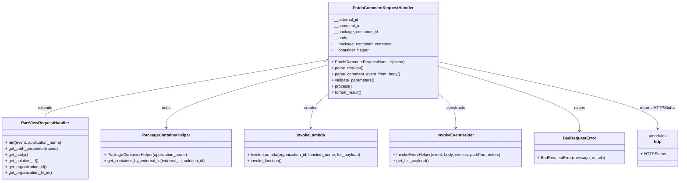

# Diagram: partview_core/partview_service/partview_service/api/comments/handlers/patch_comment.py

> Auto-generated by Obscura crawlers

## Mermaid

### SVG

<svg id="container" width="2690.859375" xmlns="http://www.w3.org/2000/svg" class="classDiagram" height="720" viewBox="0 0 2690.859375 720" role="graphics-document document" aria-roledescription="class"><g><defs><marker id="container_class-aggregationStart" class="marker aggregation class" refX="18" refY="7" markerWidth="190" markerHeight="240" orient="auto"><path d="M 18,7 L9,13 L1,7 L9,1 Z"></path></marker></defs><defs><marker id="container_class-aggregationEnd" class="marker aggregation class" refX="1" refY="7" markerWidth="20" markerHeight="28" orient="auto"><path d="M 18,7 L9,13 L1,7 L9,1 Z"></path></marker></defs><defs><marker id="container_class-extensionStart" class="marker extension class" refX="18" refY="7" markerWidth="190" markerHeight="240" orient="auto"><path d="M 1,7 L18,13 V 1 Z"></path></marker></defs><defs><marker id="container_class-extensionEnd" class="marker extension class" refX="1" refY="7" markerWidth="20" markerHeight="28" orient="auto"><path d="M 1,1 V 13 L18,7 Z"></path></marker></defs><defs><marker id="container_class-compositionStart" class="marker composition class" refX="18" refY="7" markerWidth="190" markerHeight="240" orient="auto"><path d="M 18,7 L9,13 L1,7 L9,1 Z"></path></marker></defs><defs><marker id="container_class-compositionEnd" class="marker composition class" refX="1" refY="7" markerWidth="20" markerHeight="28" orient="auto"><path d="M 18,7 L9,13 L1,7 L9,1 Z"></path></marker></defs><defs><marker id="container_class-dependencyStart" class="marker dependency class" refX="6" refY="7" markerWidth="190" markerHeight="240" orient="auto"><path d="M 5,7 L9,13 L1,7 L9,1 Z"></path></marker></defs><defs><marker id="container_class-dependencyEnd" class="marker dependency class" refX="13" refY="7" markerWidth="20" markerHeight="28" orient="auto"><path d="M 18,7 L9,13 L14,7 L9,1 Z"></path></marker></defs><defs><marker id="container_class-lollipopStart" class="marker lollipop class" refX="13" refY="7" markerWidth="190" markerHeight="240" orient="auto"><circle stroke="black" fill="transparent" cx="7" cy="7" r="6"></circle></marker></defs><defs><marker id="container_class-lollipopEnd" class="marker lollipop class" refX="1" refY="7" markerWidth="190" markerHeight="240" orient="auto"><circle stroke="black" fill="transparent" cx="7" cy="7" r="6"></circle></marker></defs><g class="root"><g class="clusters"></g><g class="edgePaths"><path d="M1297.316,239.126L1110.915,270.772C924.515,302.418,551.715,365.709,365.314,403.521C178.914,441.333,178.914,453.667,178.914,459.833L178.914,466" id="id_PatchCommentRequestHandler_PartViewRequestHandler_1" class="edge-thickness-normal edge-pattern-solid relation" style=";;;" data-edge="true" data-et="edge" data-id="id_PatchCommentRequestHandler_PartViewRequestHandler_1" data-points="W3sieCI6MTMxNC4zMjIyNjU2MjUsInkiOjIzNi4yMzkwOTg1NDc4MjQ0OH0seyJ4IjoxNzguOTE0MDYyNSwieSI6NDI5fSx7IngiOjE3OC45MTQwNjI1LCJ5Ijo0NjZ9XQ==" marker-start="url(#container_class-extensionStart)"></path><path d="M1314.322,256.385L1205.412,285.155C1096.501,313.924,878.68,371.462,769.77,413.398C660.859,455.333,660.859,481.667,660.859,494.833L660.859,508" id="id_PatchCommentRequestHandler_PackageContainerHelper_2" class="edge-thickness-normal edge-pattern-solid relation" style=";;;" data-edge="true" data-et="edge" data-id="id_PatchCommentRequestHandler_PackageContainerHelper_2" data-points="W3sieCI6MTMxNC4zMjIyNjU2MjUsInkiOjI1Ni4zODU0Mzg3NTAyNDV9LHsieCI6NjYwLjg1OTM3NSwieSI6NDI5fSx7IngiOjY2MC44NTkzNzUsInkiOjUxNH1d" marker-end="url(#container_class-dependencyEnd)"></path><path d="M1314.322,369.32L1301.783,379.267C1289.243,389.214,1264.165,409.107,1251.625,432.22C1239.086,455.333,1239.086,481.667,1239.086,494.833L1239.086,508" id="id_PatchCommentRequestHandler_InvokeLambda_3" class="edge-thickness-normal edge-pattern-solid relation" style=";;;" data-edge="true" data-et="edge" data-id="id_PatchCommentRequestHandler_InvokeLambda_3" data-points="W3sieCI6MTMxNC4zMjIyNjU2MjUsInkiOjM2OS4zMjAzNDgyODI2MDQxM30seyJ4IjoxMjM5LjA4NTkzNzUsInkiOjQyOX0seyJ4IjoxMjM5LjA4NTkzNzUsInkiOjUxNH1d" marker-end="url(#container_class-dependencyEnd)"></path><path d="M1741.236,369.32L1753.776,379.267C1766.315,389.214,1791.394,409.107,1803.933,432.22C1816.473,455.333,1816.473,481.667,1816.473,494.833L1816.473,508" id="id_PatchCommentRequestHandler_InvokeEventHelper_4" class="edge-thickness-normal edge-pattern-solid relation" style=";;;" data-edge="true" data-et="edge" data-id="id_PatchCommentRequestHandler_InvokeEventHelper_4" data-points="W3sieCI6MTc0MS4yMzYzMjgxMjUsInkiOjM2OS4zMjAzNDgyODI2MDQxM30seyJ4IjoxODE2LjQ3MjY1NjI1LCJ5Ijo0Mjl9LHsieCI6MTgxNi40NzI2NTYyNSwieSI6NTE0fV0=" marker-end="url(#container_class-dependencyEnd)"></path><path d="M1741.236,263.11L1834.75,290.759C1928.264,318.407,2115.292,373.703,2208.806,416.518C2302.32,459.333,2302.32,489.667,2302.32,504.833L2302.32,520" id="id_PatchCommentRequestHandler_BadRequestError_5" class="edge-thickness-normal edge-pattern-solid relation" style=";;;" data-edge="true" data-et="edge" data-id="id_PatchCommentRequestHandler_BadRequestError_5" data-points="W3sieCI6MTc0MS4yMzYzMjgxMjUsInkiOjI2My4xMTA0ODYzMDExMTA3N30seyJ4IjoyMzAyLjMyMDMxMjUsInkiOjQyOX0seyJ4IjoyMzAyLjMyMDMxMjUsInkiOjUyNn1d" marker-end="url(#container_class-dependencyEnd)"></path><path d="M1741.236,245.36L1885.267,275.967C2029.297,306.573,2317.357,367.787,2461.388,412.06C2605.418,456.333,2605.418,483.667,2605.418,497.333L2605.418,511" id="id_PatchCommentRequestHandler_http_6" class="edge-thickness-normal edge-pattern-solid relation" style=";;;" data-edge="true" data-et="edge" data-id="id_PatchCommentRequestHandler_http_6" data-points="W3sieCI6MTc0MS4yMzYzMjgxMjUsInkiOjI0NS4zNTk5NzIxNjEzNTU0fSx7IngiOjI2MDUuNDE3OTY4NzUsInkiOjQyOX0seyJ4IjoyNjA1LjQxNzk2ODc1LCJ5Ijo1MTd9XQ==" marker-end="url(#container_class-dependencyEnd)"></path></g><g class="edgeLabels"><g class="edgeLabel" transform="translate(178.9140625, 429)"><g class="label" data-id="id_PatchCommentRequestHandler_PartViewRequestHandler_1" transform="translate(-28.5078125, -12)"><foreignObject width="57.015625" height="24">

extends

</foreignObject></g></g><g class="edgeLabel" transform="translate(660.859375, 429)"><g class="label" data-id="id_PatchCommentRequestHandler_PackageContainerHelper_2" transform="translate(-16.4921875, -12)"><foreignObject width="32.984375" height="24">

uses

</foreignObject></g></g><g class="edgeLabel" transform="translate(1239.0859375, 429)"><g class="label" data-id="id_PatchCommentRequestHandler_InvokeLambda_3" transform="translate(-26.171875, -12)"><foreignObject width="52.34375" height="24">

creates

</foreignObject></g></g><g class="edgeLabel" transform="translate(1816.47265625, 429)"><g class="label" data-id="id_PatchCommentRequestHandler_InvokeEventHelper_4" transform="translate(-37.84375, -12)"><foreignObject width="75.6875" height="24">

constructs

</foreignObject></g></g><g class="edgeLabel" transform="translate(2302.3203125, 429)"><g class="label" data-id="id_PatchCommentRequestHandler_BadRequestError_5" transform="translate(-21.25, -12)"><foreignObject width="42.5" height="24">

raises

</foreignObject></g></g><g class="edgeLabel" transform="translate(2605.41796875, 429)"><g class="label" data-id="id_PatchCommentRequestHandler_http_6" transform="translate(-69.4140625, -12)"><foreignObject width="138.828125" height="24">

returns HTTPStatus

</foreignObject></g></g></g><g class="nodes"><g class="node default" id="classId-PatchCommentRequestHandler-0" transform="translate(1527.779296875, 200)"><g class="basic label-container"><path d="M-213.45703125 -192 L213.45703125 -192 L213.45703125 192 L-213.45703125 192" stroke="none" stroke-width="0" fill="#ECECFF" style=""></path><path d="M-213.45703125 -192 C-71.41400444640158 -192, 70.62902235719685 -192, 213.45703125 -192 M-213.45703125 -192 C-63.821244909539615 -192, 85.81454143092077 -192, 213.45703125 -192 M213.45703125 -192 C213.45703125 -100.91450484596177, 213.45703125 -9.829009691923545, 213.45703125 192 M213.45703125 -192 C213.45703125 -77.12962898811907, 213.45703125 37.74074202376187, 213.45703125 192 M213.45703125 192 C113.21972528672609 192, 12.982419323452177 192, -213.45703125 192 M213.45703125 192 C74.40882798107538 192, -64.63937528784925 192, -213.45703125 192 M-213.45703125 192 C-213.45703125 95.43383063702652, -213.45703125 -1.1323387259469655, -213.45703125 -192 M-213.45703125 192 C-213.45703125 38.94852068890083, -213.45703125 -114.10295862219834, -213.45703125 -192" stroke="#9370DB" stroke-width="1.3" fill="none" stroke-dasharray="0 0" style=""></path></g><g class="annotation-group text" transform="translate(0, -168)"></g><g class="label-group text" transform="translate(-113.9765625, -168)"><g class="label" style="font-weight: bolder" transform="translate(0,-12)"><foreignObject width="227.953125" height="24">

PatchCommentRequestHandler

</foreignObject></g></g><g class="members-group text" transform="translate(-201.45703125, -120)"><g class="label" style="" transform="translate(0,-12)"><foreignObject width="108.625" height="24">

- __external_id

</foreignObject></g><g class="label" style="" transform="translate(0,12)"><foreignObject width="117.21875" height="24">

- __comment_id

</foreignObject></g><g class="label" style="" transform="translate(0,36)"><foreignObject width="184.15625" height="24">

- __package_container_id

</foreignObject></g><g class="label" style="" transform="translate(0,60)"><foreignObject width="63.46875" height="24">

- __body

</foreignObject></g><g class="label" style="" transform="translate(0,84)"><foreignObject width="237.71875" height="24">

- __package_container_comment

</foreignObject></g><g class="label" style="" transform="translate(0,108)"><foreignObject width="150.28125" height="24">

- __container_helper

</foreignObject></g></g><g class="methods-group text" transform="translate(-201.45703125, 48)"><g class="label" style="" transform="translate(0,-12)"><foreignObject width="288.9375" height="24">

+ PatchCommentRequestHandler(event)

</foreignObject></g><g class="label" style="" transform="translate(0,12)"><foreignObject width="126.046875" height="24">

+ parse_request()

</foreignObject></g><g class="label" style="" transform="translate(0,36)"><foreignObject width="273.484375" height="24">

+ parse_comment_event_from_body()

</foreignObject></g><g class="label" style="" transform="translate(0,60)"><foreignObject width="170.953125" height="24">

+ validate_parameters()

</foreignObject></g><g class="label" style="" transform="translate(0,84)"><foreignObject width="77.96875" height="24">

+ process()

</foreignObject></g><g class="label" style="" transform="translate(0,108)"><foreignObject width="121.5" height="24">

+ format_result()

</foreignObject></g></g><g class="divider" style=""><path d="M-213.45703125 -144 C-77.56628405685109 -144, 58.32446313629782 -144, 213.45703125 -144 M-213.45703125 -144 C-50.494345170326454 -144, 112.46834090934709 -144, 213.45703125 -144" stroke="#9370DB" stroke-width="1.3" fill="none" stroke-dasharray="0 0" style=""></path></g><g class="divider" style=""><path d="M-213.45703125 24 C-48.471737459936264 24, 116.51355633012747 24, 213.45703125 24 M-213.45703125 24 C-80.60012020324692 24, 52.25679084350617 24, 213.45703125 24" stroke="#9370DB" stroke-width="1.3" fill="none" stroke-dasharray="0 0" style=""></path></g></g><g class="node default" id="classId-PartViewRequestHandler-1" transform="translate(178.9140625, 589)"><g class="basic label-container"><path d="M-170.9140625 -123 L170.9140625 -123 L170.9140625 123 L-170.9140625 123" stroke="none" stroke-width="0" fill="#ECECFF" style=""></path><path d="M-170.9140625 -123 C-97.00799059572071 -123, -23.101918691441426 -123, 170.9140625 -123 M-170.9140625 -123 C-67.90740204358235 -123, 35.0992584128353 -123, 170.9140625 -123 M170.9140625 -123 C170.9140625 -43.75917287353509, 170.9140625 35.481654252929815, 170.9140625 123 M170.9140625 -123 C170.9140625 -70.24418434235787, 170.9140625 -17.488368684715752, 170.9140625 123 M170.9140625 123 C73.95563629205571 123, -23.00278991588857 123, -170.9140625 123 M170.9140625 123 C37.23343005714918 123, -96.44720238570164 123, -170.9140625 123 M-170.9140625 123 C-170.9140625 46.09141124742118, -170.9140625 -30.817177505157645, -170.9140625 -123 M-170.9140625 123 C-170.9140625 25.414394640177306, -170.9140625 -72.17121071964539, -170.9140625 -123" stroke="#9370DB" stroke-width="1.3" fill="none" stroke-dasharray="0 0" style=""></path></g><g class="annotation-group text" transform="translate(0, -99)"></g><g class="label-group text" transform="translate(-91.359375, -99)"><g class="label" style="font-weight: bolder" transform="translate(0,-12)"><foreignObject width="182.71875" height="24">

PartViewRequestHandler

</foreignObject></g></g><g class="members-group text" transform="translate(-158.9140625, -51)"></g><g class="methods-group text" transform="translate(-158.9140625, -21)"><g class="label" style="" transform="translate(0,-12)"><foreignObject width="226.46875" height="24">

+ <strong>init</strong>(event, application_name)

</foreignObject></g><g class="label" style="" transform="translate(0,12)"><foreignObject width="210.75" height="24">

+ get_path_parameter(name)

</foreignObject></g><g class="label" style="" transform="translate(0,36)"><foreignObject width="89.765625" height="24">

+ get_body()

</foreignObject></g><g class="label" style="" transform="translate(0,60)"><foreignObject width="135.703125" height="24">

+ get_solution_id()

</foreignObject></g><g class="label" style="" transform="translate(0,84)"><foreignObject width="165.90625" height="24">

+ get_organization_id()

</foreignObject></g><g class="label" style="" transform="translate(0,108)"><foreignObject width="186.671875" height="24">

+ get_organization_fv_id()

</foreignObject></g></g><g class="divider" style=""><path d="M-170.9140625 -75 C-37.914064323408695 -75, 95.08593385318261 -75, 170.9140625 -75 M-170.9140625 -75 C-72.03149019517316 -75, 26.851082109653674 -75, 170.9140625 -75" stroke="#9370DB" stroke-width="1.3" fill="none" stroke-dasharray="0 0" style=""></path></g><g class="divider" style=""><path d="M-170.9140625 -51 C-97.59037297818443 -51, -24.266683456368867 -51, 170.9140625 -51 M-170.9140625 -51 C-65.46850752804194 -51, 39.97704744391612 -51, 170.9140625 -51" stroke="#9370DB" stroke-width="1.3" fill="none" stroke-dasharray="0 0" style=""></path></g></g><g class="node default" id="classId-PackageContainerHelper-2" transform="translate(660.859375, 589)"><g class="basic label-container"><path d="M-261.03125 -75 L261.03125 -75 L261.03125 75 L-261.03125 75" stroke="none" stroke-width="0" fill="#ECECFF" style=""></path><path d="M-261.03125 -75 C-143.79328714367435 -75, -26.555324287348697 -75, 261.03125 -75 M-261.03125 -75 C-75.5447755155144 -75, 109.9416989689712 -75, 261.03125 -75 M261.03125 -75 C261.03125 -30.17687423582592, 261.03125 14.64625152834816, 261.03125 75 M261.03125 -75 C261.03125 -24.435956046261417, 261.03125 26.128087907477166, 261.03125 75 M261.03125 75 C132.58021177362087 75, 4.129173547241749 75, -261.03125 75 M261.03125 75 C127.3845381597354 75, -6.262173680529202 75, -261.03125 75 M-261.03125 75 C-261.03125 29.000822173536086, -261.03125 -16.998355652927827, -261.03125 -75 M-261.03125 75 C-261.03125 16.363806362470292, -261.03125 -42.272387275059415, -261.03125 -75" stroke="#9370DB" stroke-width="1.3" fill="none" stroke-dasharray="0 0" style=""></path></g><g class="annotation-group text" transform="translate(0, -51)"></g><g class="label-group text" transform="translate(-89.96875, -51)"><g class="label" style="font-weight: bolder" transform="translate(0,-12)"><foreignObject width="179.9375" height="24">

PackageContainerHelper

</foreignObject></g></g><g class="members-group text" transform="translate(-249.03125, -3)"></g><g class="methods-group text" transform="translate(-249.03125, 27)"><g class="label" style="" transform="translate(0,-12)"><foreignObject width="330.796875" height="24">

+ PackageContainerHelper(application_name)

</foreignObject></g><g class="label" style="" transform="translate(0,12)"><foreignObject width="408.09375" height="24">

+ get_container_by_external_id(external_id, solution_id)

</foreignObject></g></g><g class="divider" style=""><path d="M-261.03125 -27 C-119.66446650344147 -27, 21.70231699311705 -27, 261.03125 -27 M-261.03125 -27 C-95.34889201118062 -27, 70.33346597763875 -27, 261.03125 -27" stroke="#9370DB" stroke-width="1.3" fill="none" stroke-dasharray="0 0" style=""></path></g><g class="divider" style=""><path d="M-261.03125 -3 C-113.95495727115025 -3, 33.1213354576995 -3, 261.03125 -3 M-261.03125 -3 C-90.18009370180664 -3, 80.67106259638672 -3, 261.03125 -3" stroke="#9370DB" stroke-width="1.3" fill="none" stroke-dasharray="0 0" style=""></path></g></g><g class="node default" id="classId-InvokeLambda-3" transform="translate(1239.0859375, 589)"><g class="basic label-container"><path d="M-267.1953125 -75 L267.1953125 -75 L267.1953125 75 L-267.1953125 75" stroke="none" stroke-width="0" fill="#ECECFF" style=""></path><path d="M-267.1953125 -75 C-102.16712981869924 -75, 62.861052862601525 -75, 267.1953125 -75 M-267.1953125 -75 C-105.5972550325233 -75, 56.000802434953414 -75, 267.1953125 -75 M267.1953125 -75 C267.1953125 -28.34219074677833, 267.1953125 18.315618506443343, 267.1953125 75 M267.1953125 -75 C267.1953125 -39.92548547940878, 267.1953125 -4.850970958817555, 267.1953125 75 M267.1953125 75 C87.04757960793631 75, -93.10015328412737 75, -267.1953125 75 M267.1953125 75 C78.41170102949695 75, -110.3719104410061 75, -267.1953125 75 M-267.1953125 75 C-267.1953125 38.836660386785056, -267.1953125 2.6733207735701114, -267.1953125 -75 M-267.1953125 75 C-267.1953125 38.38504815147266, -267.1953125 1.7700963029453192, -267.1953125 -75" stroke="#9370DB" stroke-width="1.3" fill="none" stroke-dasharray="0 0" style=""></path></g><g class="annotation-group text" transform="translate(0, -51)"></g><g class="label-group text" transform="translate(-53.484375, -51)"><g class="label" style="font-weight: bolder" transform="translate(0,-12)"><foreignObject width="106.96875" height="24">

InvokeLambda

</foreignObject></g></g><g class="members-group text" transform="translate(-255.1953125, -3)"></g><g class="methods-group text" transform="translate(-255.1953125, 27)"><g class="label" style="" transform="translate(0,-12)"><foreignObject width="456.90625" height="24">

+ InvokeLambda(organization_id, function_name, full_payload)

</foreignObject></g><g class="label" style="" transform="translate(0,12)"><foreignObject width="138.6875" height="24">

+ invoke_function()

</foreignObject></g></g><g class="divider" style=""><path d="M-267.1953125 -27 C-63.49475919799872 -27, 140.20579410400256 -27, 267.1953125 -27 M-267.1953125 -27 C-65.83790138801709 -27, 135.51950972396583 -27, 267.1953125 -27" stroke="#9370DB" stroke-width="1.3" fill="none" stroke-dasharray="0 0" style=""></path></g><g class="divider" style=""><path d="M-267.1953125 -3 C-120.48522500292677 -3, 26.224862494146464 -3, 267.1953125 -3 M-267.1953125 -3 C-82.78785435388576 -3, 101.61960379222847 -3, 267.1953125 -3" stroke="#9370DB" stroke-width="1.3" fill="none" stroke-dasharray="0 0" style=""></path></g></g><g class="node default" id="classId-InvokeEventHelper-4" transform="translate(1816.47265625, 589)"><g class="basic label-container"><path d="M-260.19140625 -75 L260.19140625 -75 L260.19140625 75 L-260.19140625 75" stroke="none" stroke-width="0" fill="#ECECFF" style=""></path><path d="M-260.19140625 -75 C-145.6582183019235 -75, -31.125030353847023 -75, 260.19140625 -75 M-260.19140625 -75 C-63.727528088945064 -75, 132.73635007210987 -75, 260.19140625 -75 M260.19140625 -75 C260.19140625 -39.02899244681016, 260.19140625 -3.057984893620315, 260.19140625 75 M260.19140625 -75 C260.19140625 -16.390092649508958, 260.19140625 42.219814700982084, 260.19140625 75 M260.19140625 75 C54.72876661636869 75, -150.73387301726262 75, -260.19140625 75 M260.19140625 75 C97.4402989365592 75, -65.3108083768816 75, -260.19140625 75 M-260.19140625 75 C-260.19140625 26.646654550397066, -260.19140625 -21.706690899205867, -260.19140625 -75 M-260.19140625 75 C-260.19140625 36.02789608036603, -260.19140625 -2.9442078392679463, -260.19140625 -75" stroke="#9370DB" stroke-width="1.3" fill="none" stroke-dasharray="0 0" style=""></path></g><g class="annotation-group text" transform="translate(0, -51)"></g><g class="label-group text" transform="translate(-69.0859375, -51)"><g class="label" style="font-weight: bolder" transform="translate(0,-12)"><foreignObject width="138.171875" height="24">

InvokeEventHelper

</foreignObject></g></g><g class="members-group text" transform="translate(-248.19140625, -3)"></g><g class="methods-group text" transform="translate(-248.19140625, 27)"><g class="label" style="" transform="translate(0,-12)"><foreignObject width="427.296875" height="24">

+ InvokeEventHelper(event, body, version, pathParameters)

</foreignObject></g><g class="label" style="" transform="translate(0,12)"><foreignObject width="143.265625" height="24">

+ get_full_payload()

</foreignObject></g></g><g class="divider" style=""><path d="M-260.19140625 -27 C-65.63040296607457 -27, 128.93060031785086 -27, 260.19140625 -27 M-260.19140625 -27 C-137.6713246368003 -27, -15.151243023600642 -27, 260.19140625 -27" stroke="#9370DB" stroke-width="1.3" fill="none" stroke-dasharray="0 0" style=""></path></g><g class="divider" style=""><path d="M-260.19140625 -3 C-112.15086741750491 -3, 35.889671414990175 -3, 260.19140625 -3 M-260.19140625 -3 C-76.93759606479026 -3, 106.31621412041949 -3, 260.19140625 -3" stroke="#9370DB" stroke-width="1.3" fill="none" stroke-dasharray="0 0" style=""></path></g></g><g class="node default" id="classId-BadRequestError-5" transform="translate(2302.3203125, 589)"><g class="basic label-container"><path d="M-175.65625 -63 L175.65625 -63 L175.65625 63 L-175.65625 63" stroke="none" stroke-width="0" fill="#ECECFF" style=""></path><path d="M-175.65625 -63 C-52.876732279987124 -63, 69.90278544002575 -63, 175.65625 -63 M-175.65625 -63 C-38.46803976441586 -63, 98.72017047116827 -63, 175.65625 -63 M175.65625 -63 C175.65625 -16.786100254255224, 175.65625 29.42779949148955, 175.65625 63 M175.65625 -63 C175.65625 -36.32175430739787, 175.65625 -9.643508614795728, 175.65625 63 M175.65625 63 C41.5164751785953 63, -92.6232996428094 63, -175.65625 63 M175.65625 63 C55.487847221962866 63, -64.68055555607427 63, -175.65625 63 M-175.65625 63 C-175.65625 20.298158837710147, -175.65625 -22.403682324579705, -175.65625 -63 M-175.65625 63 C-175.65625 27.509215926586066, -175.65625 -7.981568146827868, -175.65625 -63" stroke="#9370DB" stroke-width="1.3" fill="none" stroke-dasharray="0 0" style=""></path></g><g class="annotation-group text" transform="translate(0, -39)"></g><g class="label-group text" transform="translate(-62.28125, -39)"><g class="label" style="font-weight: bolder" transform="translate(0,-12)"><foreignObject width="124.5625" height="24">

BadRequestError

</foreignObject></g></g><g class="members-group text" transform="translate(-163.65625, 9)"></g><g class="methods-group text" transform="translate(-163.65625, 39)"><g class="label" style="" transform="translate(0,-12)"><foreignObject width="265.03125" height="24">

+ BadRequestError(message, details)

</foreignObject></g></g><g class="divider" style=""><path d="M-175.65625 -15 C-58.02215902892044 -15, 59.61193194215912 -15, 175.65625 -15 M-175.65625 -15 C-58.09852966103439 -15, 59.45919067793122 -15, 175.65625 -15" stroke="#9370DB" stroke-width="1.3" fill="none" stroke-dasharray="0 0" style=""></path></g><g class="divider" style=""><path d="M-175.65625 9 C-91.1865044441978 9, -6.716758888395589 9, 175.65625 9 M-175.65625 9 C-101.85192143468328 9, -28.047592869366554 9, 175.65625 9" stroke="#9370DB" stroke-width="1.3" fill="none" stroke-dasharray="0 0" style=""></path></g></g><g class="node default" id="classId-http-6" transform="translate(2605.41796875, 589)"><g class="basic label-container"><path d="M-77.44140625 -72 L77.44140625 -72 L77.44140625 72 L-77.44140625 72" stroke="none" stroke-width="0" fill="#ECECFF" style=""></path><path d="M-77.44140625 -72 C-18.456392858375324 -72, 40.52862053324935 -72, 77.44140625 -72 M-77.44140625 -72 C-42.39756084255455 -72, -7.353715435109095 -72, 77.44140625 -72 M77.44140625 -72 C77.44140625 -26.930863521738374, 77.44140625 18.138272956523252, 77.44140625 72 M77.44140625 -72 C77.44140625 -23.219797436821928, 77.44140625 25.560405126356144, 77.44140625 72 M77.44140625 72 C19.796120363297874 72, -37.84916552340425 72, -77.44140625 72 M77.44140625 72 C16.156183797739594 72, -45.12903865452081 72, -77.44140625 72 M-77.44140625 72 C-77.44140625 19.341007977879826, -77.44140625 -33.31798404424035, -77.44140625 -72 M-77.44140625 72 C-77.44140625 14.8382397942095, -77.44140625 -42.323520411581, -77.44140625 -72" stroke="#9370DB" stroke-width="1.3" fill="none" stroke-dasharray="0 0" style=""></path></g><g class="annotation-group text" transform="translate(-36.6015625, -48)"><g class="label" style="" transform="translate(0,-12)"><foreignObject width="73.203125" height="24">

«module»

</foreignObject></g></g><g class="label-group text" transform="translate(-15.5703125, -24)"><g class="label" style="font-weight: bolder" transform="translate(0,-12)"><foreignObject width="31.140625" height="24">

http

</foreignObject></g></g><g class="members-group text" transform="translate(-65.44140625, 24)"><g class="label" style="" transform="translate(0,-12)"><foreignObject width="94.28125" height="24">

+ HTTPStatus

</foreignObject></g></g><g class="methods-group text" transform="translate(-65.44140625, 72)"></g><g class="divider" style=""><path d="M-77.44140625 0 C-35.896457545983885 0, 5.648491158032229 0, 77.44140625 0 M-77.44140625 0 C-35.057693926734146 0, 7.326018396531708 0, 77.44140625 0" stroke="#9370DB" stroke-width="1.3" fill="none" stroke-dasharray="0 0" style=""></path></g><g class="divider" style=""><path d="M-77.44140625 48 C-25.074238427822394 48, 27.292929394355212 48, 77.44140625 48 M-77.44140625 48 C-32.814457778679945 48, 11.812490692640111 48, 77.44140625 48" stroke="#9370DB" stroke-width="1.3" fill="none" stroke-dasharray="0 0" style=""></path></g></g></g></g></g></svg>
