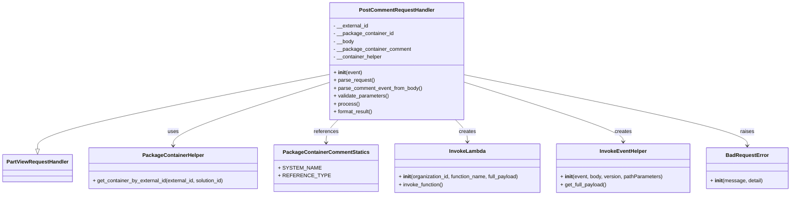

# Diagram: partview_core/partview_service/partview_service/api/comments/handlers/post_comment.py


> Auto-generated by Obscura crawlers

## Diagram 1



### SVG

<svg id="container" width="2386.75" xmlns="http://www.w3.org/2000/svg" class="classDiagram" height="600" viewBox="0 0 2386.75 600" role="graphics-document document" aria-roledescription="class"><style>#container{font-family:"trebuchet ms",verdana,arial,sans-serif;font-size:16px;fill:#333;}@keyframes edge-animation-frame{from{stroke-dashoffset:0;}}@keyframes dash{to{stroke-dashoffset:0;}}#container .edge-animation-slow{stroke-dasharray:9,5!important;stroke-dashoffset:900;animation:dash 50s linear infinite;stroke-linecap:round;}#container .edge-animation-fast{stroke-dasharray:9,5!important;stroke-dashoffset:900;animation:dash 20s linear infinite;stroke-linecap:round;}#container .error-icon{fill:#552222;}#container .error-text{fill:#552222;stroke:#552222;}#container .edge-thickness-normal{stroke-width:1px;}#container .edge-thickness-thick{stroke-width:3.5px;}#container .edge-pattern-solid{stroke-dasharray:0;}#container .edge-thickness-invisible{stroke-width:0;fill:none;}#container .edge-pattern-dashed{stroke-dasharray:3;}#container .edge-pattern-dotted{stroke-dasharray:2;}#container .marker{fill:#333333;stroke:#333333;}#container .marker.cross{stroke:#333333;}#container svg{font-family:"trebuchet ms",verdana,arial,sans-serif;font-size:16px;}#container p{margin:0;}#container g.classGroup text{fill:#9370DB;stroke:none;font-family:"trebuchet ms",verdana,arial,sans-serif;font-size:10px;}#container g.classGroup text .title{font-weight:bolder;}#container .nodeLabel,#container .edgeLabel{color:#131300;}#container .edgeLabel .label rect{fill:#ECECFF;}#container .label text{fill:#131300;}#container .labelBkg{background:#ECECFF;}#container .edgeLabel .label span{background:#ECECFF;}#container .classTitle{font-weight:bolder;}#container .node rect,#container .node circle,#container .node ellipse,#container .node polygon,#container .node path{fill:#ECECFF;stroke:#9370DB;stroke-width:1px;}#container .divider{stroke:#9370DB;stroke-width:1;}#container g.clickable{cursor:pointer;}#container g.classGroup rect{fill:#ECECFF;stroke:#9370DB;}#container g.classGroup line{stroke:#9370DB;stroke-width:1;}#container .classLabel .box{stroke:none;stroke-width:0;fill:#ECECFF;opacity:0.5;}#container .classLabel .label{fill:#9370DB;font-size:10px;}#container .relation{stroke:#333333;stroke-width:1;fill:none;}#container .dashed-line{stroke-dasharray:3;}#container .dotted-line{stroke-dasharray:1 2;}#container #compositionStart,#container .composition{fill:#333333!important;stroke:#333333!important;stroke-width:1;}#container #compositionEnd,#container .composition{fill:#333333!important;stroke:#333333!important;stroke-width:1;}#container #dependencyStart,#container .dependency{fill:#333333!important;stroke:#333333!important;stroke-width:1;}#container #dependencyStart,#container .dependency{fill:#333333!important;stroke:#333333!important;stroke-width:1;}#container #extensionStart,#container .extension{fill:transparent!important;stroke:#333333!important;stroke-width:1;}#container #extensionEnd,#container .extension{fill:transparent!important;stroke:#333333!important;stroke-width:1;}#container #aggregationStart,#container .aggregation{fill:transparent!important;stroke:#333333!important;stroke-width:1;}#container #aggregationEnd,#container .aggregation{fill:transparent!important;stroke:#333333!important;stroke-width:1;}#container #lollipopStart,#container .lollipop{fill:#ECECFF!important;stroke:#333333!important;stroke-width:1;}#container #lollipopEnd,#container .lollipop{fill:#ECECFF!important;stroke:#333333!important;stroke-width:1;}#container .edgeTerminals{font-size:11px;line-height:initial;}#container .classTitleText{text-anchor:middle;font-size:18px;fill:#333;}#container .label-icon{display:inline-block;height:1em;overflow:visible;vertical-align:-0.125em;}#container .node .label-icon path{fill:currentColor;stroke:revert;stroke-width:revert;}#container :root{--mermaid-font-family:"trebuchet ms",verdana,arial,sans-serif;}</style><g><defs><marker id="container_class-aggregationStart" class="marker aggregation class" refX="18" refY="7" markerWidth="190" markerHeight="240" orient="auto"><path d="M 18,7 L9,13 L1,7 L9,1 Z"></path></marker></defs><defs><marker id="container_class-aggregationEnd" class="marker aggregation class" refX="1" refY="7" markerWidth="20" markerHeight="28" orient="auto"><path d="M 18,7 L9,13 L1,7 L9,1 Z"></path></marker></defs><defs><marker id="container_class-extensionStart" class="marker extension class" refX="18" refY="7" markerWidth="190" markerHeight="240" orient="auto"><path d="M 1,7 L18,13 V 1 Z"></path></marker></defs><defs><marker id="container_class-extensionEnd" class="marker extension class" refX="1" refY="7" markerWidth="20" markerHeight="28" orient="auto"><path d="M 1,1 V 13 L18,7 Z"></path></marker></defs><defs><marker id="container_class-compositionStart" class="marker composition class" refX="18" refY="7" markerWidth="190" markerHeight="240" orient="auto"><path d="M 18,7 L9,13 L1,7 L9,1 Z"></path></marker></defs><defs><marker id="container_class-compositionEnd" class="marker composition class" refX="1" refY="7" markerWidth="20" markerHeight="28" orient="auto"><path d="M 18,7 L9,13 L1,7 L9,1 Z"></path></marker></defs><defs><marker id="container_class-dependencyStart" class="marker dependency class" refX="6" refY="7" markerWidth="190" markerHeight="240" orient="auto"><path d="M 5,7 L9,13 L1,7 L9,1 Z"></path></marker></defs><defs><marker id="container_class-dependencyEnd" class="marker dependency class" refX="13" refY="7" markerWidth="20" markerHeight="28" orient="auto"><path d="M 18,7 L9,13 L14,7 L9,1 Z"></path></marker></defs><defs><marker id="container_class-lollipopStart" class="marker lollipop class" refX="13" refY="7" markerWidth="190" markerHeight="240" orient="auto"><circle stroke="black" fill="transparent" cx="7" cy="7" r="6"></circle></marker></defs><defs><marker id="container_class-lollipopEnd" class="marker lollipop class" refX="1" refY="7" markerWidth="190" markerHeight="240" orient="auto"><circle stroke="black" fill="transparent" cx="7" cy="7" r="6"></circle></marker></defs><g class="root"><g class="clusters"></g><g class="edgePaths"><path d="M985.189,229.03L839.551,258.358C693.913,287.687,402.636,346.343,256.998,384.463C111.359,422.583,111.359,440.167,111.359,448.958L111.359,457.75" id="id_PostCommentRequestHandler_PartViewRequestHandler_1" class="edge-thickness-normal edge-pattern-solid relation" style=";;;" data-edge="true" data-et="edge" data-id="id_PostCommentRequestHandler_PartViewRequestHandler_1" data-points="W3sieCI6OTg1LjE4OTQ1MzEyNSwieSI6MjI5LjAyOTk1NTQ2NjQ2MDI4fSx7IngiOjExMS4zNTkzNzUsInkiOjQwNX0seyJ4IjoxMTEuMzU5Mzc1LCJ5Ijo0NzV9XQ==" marker-end="url(#container_class-extensionEnd)"></path><path d="M985.189,254.667L908.616,279.723C832.043,304.778,678.896,354.889,602.323,387.111C525.75,419.333,525.75,433.667,525.75,440.833L525.75,448" id="id_PostCommentRequestHandler_PackageContainerHelper_2" class="edge-thickness-normal edge-pattern-solid relation" style=";;;" data-edge="true" data-et="edge" data-id="id_PostCommentRequestHandler_PackageContainerHelper_2" data-points="W3sieCI6OTg1LjE4OTQ1MzEyNSwieSI6MjU0LjY2NzQ2OTY4NzkxMTR9LHsieCI6NTI1Ljc1LCJ5Ijo0MDV9LHsieCI6NTI1Ljc1LCJ5Ijo0NTR9XQ==" marker-end="url(#container_class-dependencyEnd)"></path><path d="M1015.123,368L1009.168,374.167C1003.213,380.333,991.304,392.667,985.349,404.5C979.395,416.333,979.395,427.667,979.395,433.333L979.395,439" id="id_PostCommentRequestHandler_PackageContainerCommentStatics_3" class="edge-thickness-normal edge-pattern-solid relation" style=";;;" data-edge="true" data-et="edge" data-id="id_PostCommentRequestHandler_PackageContainerCommentStatics_3" data-points="W3sieCI6MTAxNS4xMjI3MjI4NTQyNjI2LCJ5IjozNjh9LHsieCI6OTc5LjM5NDUzMTI1LCJ5Ijo0MDV9LHsieCI6OTc5LjM5NDUzMTI1LCJ5Ijo0NDV9XQ==" marker-end="url(#container_class-dependencyEnd)"></path><path d="M1362.748,368L1368.703,374.167C1374.658,380.333,1386.567,392.667,1392.522,404C1398.477,415.333,1398.477,425.667,1398.477,430.833L1398.477,436" id="id_PostCommentRequestHandler_InvokeLambda_4" class="edge-thickness-normal edge-pattern-solid relation" style=";;;" data-edge="true" data-et="edge" data-id="id_PostCommentRequestHandler_InvokeLambda_4" data-points="W3sieCI6MTM2Mi43NDgzNzA4OTU3MzczLCJ5IjozNjh9LHsieCI6MTM5OC40NzY1NjI1LCJ5Ijo0MDV9LHsieCI6MTM5OC40NzY1NjI1LCJ5Ijo0NDJ9XQ==" marker-end="url(#container_class-dependencyEnd)"></path><path d="M1392.682,252.061L1473.752,277.551C1554.823,303.041,1716.964,354.02,1798.035,384.677C1879.105,415.333,1879.105,425.667,1879.105,430.833L1879.105,436" id="id_PostCommentRequestHandler_InvokeEventHelper_5" class="edge-thickness-normal edge-pattern-solid relation" style=";;;" data-edge="true" data-et="edge" data-id="id_PostCommentRequestHandler_InvokeEventHelper_5" data-points="W3sieCI6MTM5Mi42ODE2NDA2MjUsInkiOjI1Mi4wNjA4OTQxOTc4MTd9LHsieCI6MTg3OS4xMDU0Njg3NSwieSI6NDA1fSx7IngiOjE4NzkuMTA1NDY4NzUsInkiOjQ0Mn1d" marker-end="url(#container_class-dependencyEnd)"></path><path d="M1392.682,229.434L1536.569,258.695C1680.457,287.956,1968.232,346.478,2112.12,382.906C2256.008,419.333,2256.008,433.667,2256.008,440.833L2256.008,448" id="id_PostCommentRequestHandler_BadRequestError_6" class="edge-thickness-normal edge-pattern-solid relation" style=";;;" data-edge="true" data-et="edge" data-id="id_PostCommentRequestHandler_BadRequestError_6" data-points="W3sieCI6MTM5Mi42ODE2NDA2MjUsInkiOjIyOS40MzM4NDA3Njk3NzU2Nn0seyJ4IjoyMjU2LjAwNzgxMjUsInkiOjQwNX0seyJ4IjoyMjU2LjAwNzgxMjUsInkiOjQ1NH1d" marker-end="url(#container_class-dependencyEnd)"></path></g><g class="edgeLabels"><g class="edgeLabel"><g class="label" data-id="id_PostCommentRequestHandler_PartViewRequestHandler_1" transform="translate(0, 0)"><foreignObject width="0" height="0"><div xmlns="http://www.w3.org/1999/xhtml" class="labelBkg" style="display: table-cell; white-space: nowrap; line-height: 1.5; max-width: 200px; text-align: center;"><span class="edgeLabel"></span></div></foreignObject></g></g><g class="edgeLabel" transform="translate(525.75, 405)"><g class="label" data-id="id_PostCommentRequestHandler_PackageContainerHelper_2" transform="translate(-16.4921875, -12)"><foreignObject width="32.984375" height="24"><div xmlns="http://www.w3.org/1999/xhtml" class="labelBkg" style="display: table-cell; white-space: nowrap; line-height: 1.5; max-width: 200px; text-align: center;"><span class="edgeLabel"><p>uses</p></span></div></foreignObject></g></g><g class="edgeLabel" transform="translate(979.39453125, 405)"><g class="label" data-id="id_PostCommentRequestHandler_PackageContainerCommentStatics_3" transform="translate(-37.828125, -12)"><foreignObject width="75.65625" height="24"><div xmlns="http://www.w3.org/1999/xhtml" class="labelBkg" style="display: table-cell; white-space: nowrap; line-height: 1.5; max-width: 200px; text-align: center;"><span class="edgeLabel"><p>references</p></span></div></foreignObject></g></g><g class="edgeLabel" transform="translate(1398.4765625, 405)"><g class="label" data-id="id_PostCommentRequestHandler_InvokeLambda_4" transform="translate(-26.171875, -12)"><foreignObject width="52.34375" height="24"><div xmlns="http://www.w3.org/1999/xhtml" class="labelBkg" style="display: table-cell; white-space: nowrap; line-height: 1.5; max-width: 200px; text-align: center;"><span class="edgeLabel"><p>creates</p></span></div></foreignObject></g></g><g class="edgeLabel" transform="translate(1879.10546875, 405)"><g class="label" data-id="id_PostCommentRequestHandler_InvokeEventHelper_5" transform="translate(-26.171875, -12)"><foreignObject width="52.34375" height="24"><div xmlns="http://www.w3.org/1999/xhtml" class="labelBkg" style="display: table-cell; white-space: nowrap; line-height: 1.5; max-width: 200px; text-align: center;"><span class="edgeLabel"><p>creates</p></span></div></foreignObject></g></g><g class="edgeLabel" transform="translate(2256.0078125, 405)"><g class="label" data-id="id_PostCommentRequestHandler_BadRequestError_6" transform="translate(-21.25, -12)"><foreignObject width="42.5" height="24"><div xmlns="http://www.w3.org/1999/xhtml" class="labelBkg" style="display: table-cell; white-space: nowrap; line-height: 1.5; max-width: 200px; text-align: center;"><span class="edgeLabel"><p>raises</p></span></div></foreignObject></g></g></g><g class="nodes"><g class="node default" id="classId-PartViewRequestHandler-0" transform="translate(111.359375, 517)"><g class="basic label-container"><path d="M-103.359375 -42 L103.359375 -42 L103.359375 42 L-103.359375 42" stroke="none" stroke-width="0" fill="#ECECFF" style=""></path><path d="M-103.359375 -42 C-40.95387629429873 -42, 21.45162241140254 -42, 103.359375 -42 M-103.359375 -42 C-32.639128176445354 -42, 38.08111864710929 -42, 103.359375 -42 M103.359375 -42 C103.359375 -14.188566879713779, 103.359375 13.622866240572442, 103.359375 42 M103.359375 -42 C103.359375 -8.703643843275657, 103.359375 24.592712313448686, 103.359375 42 M103.359375 42 C31.50836403219826 42, -40.34264693560348 42, -103.359375 42 M103.359375 42 C30.42052006774844 42, -42.51833486450312 42, -103.359375 42 M-103.359375 42 C-103.359375 9.204762784586144, -103.359375 -23.59047443082771, -103.359375 -42 M-103.359375 42 C-103.359375 10.62404094852846, -103.359375 -20.75191810294308, -103.359375 -42" stroke="#9370DB" stroke-width="1.3" fill="none" stroke-dasharray="0 0" style=""></path></g><g class="annotation-group text" transform="translate(0, -18)"></g><g class="label-group text" transform="translate(-91.359375, -18)"><g class="label" style="font-weight: bolder" transform="translate(0,-12)"><foreignObject width="182.71875" height="24"><div xmlns="http://www.w3.org/1999/xhtml" style="display: table-cell; white-space: nowrap; line-height: 1.5; max-width: 231px; text-align: center;"><span class="nodeLabel markdown-node-label" style=""><p>PartViewRequestHandler</p></span></div></foreignObject></g></g><g class="members-group text" transform="translate(-91.359375, 30)"></g><g class="methods-group text" transform="translate(-91.359375, 60)"></g><g class="divider" style=""><path d="M-103.359375 6 C-58.125103735179664 6, -12.890832470359328 6, 103.359375 6 M-103.359375 6 C-29.31094388397696 6, 44.73748723204608 6, 103.359375 6" stroke="#9370DB" stroke-width="1.3" fill="none" stroke-dasharray="0 0" style=""></path></g><g class="divider" style=""><path d="M-103.359375 24 C-59.915613756784346 24, -16.47185251356869 24, 103.359375 24 M-103.359375 24 C-43.85121730177183 24, 15.656940396456335 24, 103.359375 24" stroke="#9370DB" stroke-width="1.3" fill="none" stroke-dasharray="0 0" style=""></path></g></g><g class="node default" id="classId-PostCommentRequestHandler-1" transform="translate(1188.935546875, 188)"><g class="basic label-container"><path d="M-203.74609375 -180 L203.74609375 -180 L203.74609375 180 L-203.74609375 180" stroke="none" stroke-width="0" fill="#ECECFF" style=""></path><path d="M-203.74609375 -180 C-91.08460833070785 -180, 21.576877088584297 -180, 203.74609375 -180 M-203.74609375 -180 C-82.19280789789715 -180, 39.36047795420569 -180, 203.74609375 -180 M203.74609375 -180 C203.74609375 -38.521234103972574, 203.74609375 102.95753179205485, 203.74609375 180 M203.74609375 -180 C203.74609375 -60.76195287726901, 203.74609375 58.47609424546198, 203.74609375 180 M203.74609375 180 C42.02265464951668 180, -119.70078445096664 180, -203.74609375 180 M203.74609375 180 C56.26296898608004 180, -91.22015577783992 180, -203.74609375 180 M-203.74609375 180 C-203.74609375 75.76679080077066, -203.74609375 -28.46641839845867, -203.74609375 -180 M-203.74609375 180 C-203.74609375 53.62929972029042, -203.74609375 -72.74140055941916, -203.74609375 -180" stroke="#9370DB" stroke-width="1.3" fill="none" stroke-dasharray="0 0" style=""></path></g><g class="annotation-group text" transform="translate(0, -156)"></g><g class="label-group text" transform="translate(-110.0078125, -156)"><g class="label" style="font-weight: bolder" transform="translate(0,-12)"><foreignObject width="220.015625" height="24"><div xmlns="http://www.w3.org/1999/xhtml" style="display: table-cell; white-space: nowrap; line-height: 1.5; max-width: 269px; text-align: center;"><span class="nodeLabel markdown-node-label" style=""><p>PostCommentRequestHandler</p></span></div></foreignObject></g></g><g class="members-group text" transform="translate(-191.74609375, -108)"><g class="label" style="" transform="translate(0,-12)"><foreignObject width="108.625" height="24"><div xmlns="http://www.w3.org/1999/xhtml" style="display: table-cell; white-space: nowrap; line-height: 1.5; max-width: 166px; text-align: center;"><span class="nodeLabel markdown-node-label" style=""><p>- __external_id</p></span></div></foreignObject></g><g class="label" style="" transform="translate(0,12)"><foreignObject width="184.15625" height="24"><div xmlns="http://www.w3.org/1999/xhtml" style="display: table-cell; white-space: nowrap; line-height: 1.5; max-width: 242px; text-align: center;"><span class="nodeLabel markdown-node-label" style=""><p>- __package_container_id</p></span></div></foreignObject></g><g class="label" style="" transform="translate(0,36)"><foreignObject width="63.46875" height="24"><div xmlns="http://www.w3.org/1999/xhtml" style="display: table-cell; white-space: nowrap; line-height: 1.5; max-width: 121px; text-align: center;"><span class="nodeLabel markdown-node-label" style=""><p>- __body</p></span></div></foreignObject></g><g class="label" style="" transform="translate(0,60)"><foreignObject width="237.71875" height="24"><div xmlns="http://www.w3.org/1999/xhtml" style="display: table-cell; white-space: nowrap; line-height: 1.5; max-width: 295px; text-align: center;"><span class="nodeLabel markdown-node-label" style=""><p>- __package_container_comment</p></span></div></foreignObject></g><g class="label" style="" transform="translate(0,84)"><foreignObject width="150.28125" height="24"><div xmlns="http://www.w3.org/1999/xhtml" style="display: table-cell; white-space: nowrap; line-height: 1.5; max-width: 208px; text-align: center;"><span class="nodeLabel markdown-node-label" style=""><p>- __container_helper</p></span></div></foreignObject></g></g><g class="methods-group text" transform="translate(-191.74609375, 36)"><g class="label" style="" transform="translate(0,-12)"><foreignObject width="87.390625" height="24"><div xmlns="http://www.w3.org/1999/xhtml" style="display: table-cell; white-space: nowrap; line-height: 1.5; max-width: 177px; text-align: center;"><span class="nodeLabel markdown-node-label" style=""><p>+ <strong>init</strong>(event)</p></span></div></foreignObject></g><g class="label" style="" transform="translate(0,12)"><foreignObject width="126.046875" height="24"><div xmlns="http://www.w3.org/1999/xhtml" style="display: table-cell; white-space: nowrap; line-height: 1.5; max-width: 183px; text-align: center;"><span class="nodeLabel markdown-node-label" style=""><p>+ parse_request()</p></span></div></foreignObject></g><g class="label" style="" transform="translate(0,36)"><foreignObject width="273.484375" height="24"><div xmlns="http://www.w3.org/1999/xhtml" style="display: table-cell; white-space: nowrap; line-height: 1.5; max-width: 331px; text-align: center;"><span class="nodeLabel markdown-node-label" style=""><p>+ parse_comment_event_from_body()</p></span></div></foreignObject></g><g class="label" style="" transform="translate(0,60)"><foreignObject width="170.953125" height="24"><div xmlns="http://www.w3.org/1999/xhtml" style="display: table-cell; white-space: nowrap; line-height: 1.5; max-width: 228px; text-align: center;"><span class="nodeLabel markdown-node-label" style=""><p>+ validate_parameters()</p></span></div></foreignObject></g><g class="label" style="" transform="translate(0,84)"><foreignObject width="77.96875" height="24"><div xmlns="http://www.w3.org/1999/xhtml" style="display: table-cell; white-space: nowrap; line-height: 1.5; max-width: 135px; text-align: center;"><span class="nodeLabel markdown-node-label" style=""><p>+ process()</p></span></div></foreignObject></g><g class="label" style="" transform="translate(0,108)"><foreignObject width="121.5" height="24"><div xmlns="http://www.w3.org/1999/xhtml" style="display: table-cell; white-space: nowrap; line-height: 1.5; max-width: 179px; text-align: center;"><span class="nodeLabel markdown-node-label" style=""><p>+ format_result()</p></span></div></foreignObject></g></g><g class="divider" style=""><path d="M-203.74609375 -132 C-109.39918500040798 -132, -15.052276250815964 -132, 203.74609375 -132 M-203.74609375 -132 C-77.79964027057596 -132, 48.14681320884807 -132, 203.74609375 -132" stroke="#9370DB" stroke-width="1.3" fill="none" stroke-dasharray="0 0" style=""></path></g><g class="divider" style=""><path d="M-203.74609375 12 C-73.46790474892902 12, 56.81028425214197 12, 203.74609375 12 M-203.74609375 12 C-80.92552000556836 12, 41.89505373886328 12, 203.74609375 12" stroke="#9370DB" stroke-width="1.3" fill="none" stroke-dasharray="0 0" style=""></path></g></g><g class="node default" id="classId-PackageContainerHelper-2" transform="translate(525.75, 517)"><g class="basic label-container"><path d="M-261.03125 -63 L261.03125 -63 L261.03125 63 L-261.03125 63" stroke="none" stroke-width="0" fill="#ECECFF" style=""></path><path d="M-261.03125 -63 C-82.75269334942143 -63, 95.52586330115713 -63, 261.03125 -63 M-261.03125 -63 C-148.77669440501435 -63, -36.52213881002871 -63, 261.03125 -63 M261.03125 -63 C261.03125 -17.143006829118477, 261.03125 28.713986341763047, 261.03125 63 M261.03125 -63 C261.03125 -14.35128154919078, 261.03125 34.29743690161844, 261.03125 63 M261.03125 63 C122.76471386205696 63, -15.50182227588607 63, -261.03125 63 M261.03125 63 C129.08932638867353 63, -2.852597222652946 63, -261.03125 63 M-261.03125 63 C-261.03125 15.523372982582721, -261.03125 -31.953254034834558, -261.03125 -63 M-261.03125 63 C-261.03125 23.697224810232875, -261.03125 -15.60555037953425, -261.03125 -63" stroke="#9370DB" stroke-width="1.3" fill="none" stroke-dasharray="0 0" style=""></path></g><g class="annotation-group text" transform="translate(0, -39)"></g><g class="label-group text" transform="translate(-89.96875, -39)"><g class="label" style="font-weight: bolder" transform="translate(0,-12)"><foreignObject width="179.9375" height="24"><div xmlns="http://www.w3.org/1999/xhtml" style="display: table-cell; white-space: nowrap; line-height: 1.5; max-width: 228px; text-align: center;"><span class="nodeLabel markdown-node-label" style=""><p>PackageContainerHelper</p></span></div></foreignObject></g></g><g class="members-group text" transform="translate(-249.03125, 9)"></g><g class="methods-group text" transform="translate(-249.03125, 39)"><g class="label" style="" transform="translate(0,-12)"><foreignObject width="408.09375" height="24"><div xmlns="http://www.w3.org/1999/xhtml" style="display: table-cell; white-space: nowrap; line-height: 1.5; max-width: 465px; text-align: center;"><span class="nodeLabel markdown-node-label" style=""><p>+ get_container_by_external_id(external_id, solution_id)</p></span></div></foreignObject></g></g><g class="divider" style=""><path d="M-261.03125 -15 C-80.9385274758651 -15, 99.1541950482698 -15, 261.03125 -15 M-261.03125 -15 C-54.610778195787645 -15, 151.8096936084247 -15, 261.03125 -15" stroke="#9370DB" stroke-width="1.3" fill="none" stroke-dasharray="0 0" style=""></path></g><g class="divider" style=""><path d="M-261.03125 9 C-95.32560885023864 9, 70.38003229952272 9, 261.03125 9 M-261.03125 9 C-58.320271679945535 9, 144.39070664010893 9, 261.03125 9" stroke="#9370DB" stroke-width="1.3" fill="none" stroke-dasharray="0 0" style=""></path></g></g><g class="node default" id="classId-PackageContainerCommentStatics-3" transform="translate(979.39453125, 517)"><g class="basic label-container"><path d="M-142.61328125 -72 L142.61328125 -72 L142.61328125 72 L-142.61328125 72" stroke="none" stroke-width="0" fill="#ECECFF" style=""></path><path d="M-142.61328125 -72 C-38.86948790263662 -72, 64.87430544472676 -72, 142.61328125 -72 M-142.61328125 -72 C-54.345329025243956 -72, 33.92262319951209 -72, 142.61328125 -72 M142.61328125 -72 C142.61328125 -30.672059706990566, 142.61328125 10.655880586018867, 142.61328125 72 M142.61328125 -72 C142.61328125 -17.227806079800096, 142.61328125 37.54438784039981, 142.61328125 72 M142.61328125 72 C37.94230964963717 72, -66.72866195072567 72, -142.61328125 72 M142.61328125 72 C32.45397601282019 72, -77.70532922435962 72, -142.61328125 72 M-142.61328125 72 C-142.61328125 33.772681631187915, -142.61328125 -4.4546367376241705, -142.61328125 -72 M-142.61328125 72 C-142.61328125 39.83422249019824, -142.61328125 7.668444980396487, -142.61328125 -72" stroke="#9370DB" stroke-width="1.3" fill="none" stroke-dasharray="0 0" style=""></path></g><g class="annotation-group text" transform="translate(0, -48)"></g><g class="label-group text" transform="translate(-125.1953125, -48)"><g class="label" style="font-weight: bolder" transform="translate(0,-12)"><foreignObject width="250.390625" height="24"><div xmlns="http://www.w3.org/1999/xhtml" style="display: table-cell; white-space: nowrap; line-height: 1.5; max-width: 296px; text-align: center;"><span class="nodeLabel markdown-node-label" style=""><p>PackageContainerCommentStatics</p></span></div></foreignObject></g></g><g class="members-group text" transform="translate(-130.61328125, 0)"><g class="label" style="" transform="translate(0,-12)"><foreignObject width="116.1875" height="24"><div xmlns="http://www.w3.org/1999/xhtml" style="display: table-cell; white-space: nowrap; line-height: 1.5; max-width: 174px; text-align: center;"><span class="nodeLabel markdown-node-label" style=""><p>+ SYSTEM_NAME</p></span></div></foreignObject></g><g class="label" style="" transform="translate(0,12)"><foreignObject width="136.03125" height="24"><div xmlns="http://www.w3.org/1999/xhtml" style="display: table-cell; white-space: nowrap; line-height: 1.5; max-width: 193px; text-align: center;"><span class="nodeLabel markdown-node-label" style=""><p>+ REFERENCE_TYPE</p></span></div></foreignObject></g></g><g class="methods-group text" transform="translate(-130.61328125, 72)"></g><g class="divider" style=""><path d="M-142.61328125 -24 C-30.938264832336785 -24, 80.73675158532643 -24, 142.61328125 -24 M-142.61328125 -24 C-72.4106366167601 -24, -2.207991983520202 -24, 142.61328125 -24" stroke="#9370DB" stroke-width="1.3" fill="none" stroke-dasharray="0 0" style=""></path></g><g class="divider" style=""><path d="M-142.61328125 48 C-77.46154557494918 48, -12.309809899898369 48, 142.61328125 48 M-142.61328125 48 C-50.559493905051866 48, 41.49429343989627 48, 142.61328125 48" stroke="#9370DB" stroke-width="1.3" fill="none" stroke-dasharray="0 0" style=""></path></g></g><g class="node default" id="classId-InvokeLambda-4" transform="translate(1398.4765625, 517)"><g class="basic label-container"><path d="M-226.46875 -75 L226.46875 -75 L226.46875 75 L-226.46875 75" stroke="none" stroke-width="0" fill="#ECECFF" style=""></path><path d="M-226.46875 -75 C-88.39860062688373 -75, 49.67154874623253 -75, 226.46875 -75 M-226.46875 -75 C-69.70366890782259 -75, 87.06141218435482 -75, 226.46875 -75 M226.46875 -75 C226.46875 -36.77988195685711, 226.46875 1.440236086285779, 226.46875 75 M226.46875 -75 C226.46875 -42.72146906054568, 226.46875 -10.442938121091359, 226.46875 75 M226.46875 75 C122.48404682808899 75, 18.499343656177984 75, -226.46875 75 M226.46875 75 C127.6659864857374 75, 28.863222971474812 75, -226.46875 75 M-226.46875 75 C-226.46875 26.74317010023043, -226.46875 -21.51365979953914, -226.46875 -75 M-226.46875 75 C-226.46875 22.584862492701724, -226.46875 -29.830275014596552, -226.46875 -75" stroke="#9370DB" stroke-width="1.3" fill="none" stroke-dasharray="0 0" style=""></path></g><g class="annotation-group text" transform="translate(0, -51)"></g><g class="label-group text" transform="translate(-53.484375, -51)"><g class="label" style="font-weight: bolder" transform="translate(0,-12)"><foreignObject width="106.96875" height="24"><div xmlns="http://www.w3.org/1999/xhtml" style="display: table-cell; white-space: nowrap; line-height: 1.5; max-width: 156px; text-align: center;"><span class="nodeLabel markdown-node-label" style=""><p>InvokeLambda</p></span></div></foreignObject></g></g><g class="members-group text" transform="translate(-214.46875, -3)"></g><g class="methods-group text" transform="translate(-214.46875, 27)"><g class="label" style="" transform="translate(0,-12)"><foreignObject width="375.453125" height="24"><div xmlns="http://www.w3.org/1999/xhtml" style="display: table-cell; white-space: nowrap; line-height: 1.5; max-width: 466px; text-align: center;"><span class="nodeLabel markdown-node-label" style=""><p>+ <strong>init</strong>(organization_id, function_name, full_payload)</p></span></div></foreignObject></g><g class="label" style="" transform="translate(0,12)"><foreignObject width="138.6875" height="24"><div xmlns="http://www.w3.org/1999/xhtml" style="display: table-cell; white-space: nowrap; line-height: 1.5; max-width: 196px; text-align: center;"><span class="nodeLabel markdown-node-label" style=""><p>+ invoke_function()</p></span></div></foreignObject></g></g><g class="divider" style=""><path d="M-226.46875 -27 C-75.17679211027487 -27, 76.11516577945025 -27, 226.46875 -27 M-226.46875 -27 C-56.48473777086025 -27, 113.4992744582795 -27, 226.46875 -27" stroke="#9370DB" stroke-width="1.3" fill="none" stroke-dasharray="0 0" style=""></path></g><g class="divider" style=""><path d="M-226.46875 -3 C-76.03555800877263 -3, 74.39763398245475 -3, 226.46875 -3 M-226.46875 -3 C-47.71146597776075 -3, 131.0458180444785 -3, 226.46875 -3" stroke="#9370DB" stroke-width="1.3" fill="none" stroke-dasharray="0 0" style=""></path></g></g><g class="node default" id="classId-InvokeEventHelper-5" transform="translate(1879.10546875, 517)"><g class="basic label-container"><path d="M-204.16015625 -75 L204.16015625 -75 L204.16015625 75 L-204.16015625 75" stroke="none" stroke-width="0" fill="#ECECFF" style=""></path><path d="M-204.16015625 -75 C-76.1070980450848 -75, 51.945960159830406 -75, 204.16015625 -75 M-204.16015625 -75 C-101.38239392961339 -75, 1.3953683907732284 -75, 204.16015625 -75 M204.16015625 -75 C204.16015625 -35.68414148149446, 204.16015625 3.631717037011086, 204.16015625 75 M204.16015625 -75 C204.16015625 -31.883004821878316, 204.16015625 11.233990356243368, 204.16015625 75 M204.16015625 75 C68.67762197461676 75, -66.80491230076649 75, -204.16015625 75 M204.16015625 75 C81.59347094622862 75, -40.97321435754276 75, -204.16015625 75 M-204.16015625 75 C-204.16015625 40.374216559599176, -204.16015625 5.748433119198353, -204.16015625 -75 M-204.16015625 75 C-204.16015625 17.770816730368345, -204.16015625 -39.45836653926331, -204.16015625 -75" stroke="#9370DB" stroke-width="1.3" fill="none" stroke-dasharray="0 0" style=""></path></g><g class="annotation-group text" transform="translate(0, -51)"></g><g class="label-group text" transform="translate(-69.0859375, -51)"><g class="label" style="font-weight: bolder" transform="translate(0,-12)"><foreignObject width="138.171875" height="24"><div xmlns="http://www.w3.org/1999/xhtml" style="display: table-cell; white-space: nowrap; line-height: 1.5; max-width: 187px; text-align: center;"><span class="nodeLabel markdown-node-label" style=""><p>InvokeEventHelper</p></span></div></foreignObject></g></g><g class="members-group text" transform="translate(-192.16015625, -3)"></g><g class="methods-group text" transform="translate(-192.16015625, 27)"><g class="label" style="" transform="translate(0,-12)"><foreignObject width="315.234375" height="24"><div xmlns="http://www.w3.org/1999/xhtml" style="display: table-cell; white-space: nowrap; line-height: 1.5; max-width: 405px; text-align: center;"><span class="nodeLabel markdown-node-label" style=""><p>+ <strong>init</strong>(event, body, version, pathParameters)</p></span></div></foreignObject></g><g class="label" style="" transform="translate(0,12)"><foreignObject width="143.265625" height="24"><div xmlns="http://www.w3.org/1999/xhtml" style="display: table-cell; white-space: nowrap; line-height: 1.5; max-width: 201px; text-align: center;"><span class="nodeLabel markdown-node-label" style=""><p>+ get_full_payload()</p></span></div></foreignObject></g></g><g class="divider" style=""><path d="M-204.16015625 -27 C-115.76169918217374 -27, -27.363242114347486 -27, 204.16015625 -27 M-204.16015625 -27 C-84.70662476175308 -27, 34.74690672649385 -27, 204.16015625 -27" stroke="#9370DB" stroke-width="1.3" fill="none" stroke-dasharray="0 0" style=""></path></g><g class="divider" style=""><path d="M-204.16015625 -3 C-114.36756205011055 -3, -24.5749678502211 -3, 204.16015625 -3 M-204.16015625 -3 C-84.93806913129876 -3, 34.28401798740248 -3, 204.16015625 -3" stroke="#9370DB" stroke-width="1.3" fill="none" stroke-dasharray="0 0" style=""></path></g></g><g class="node default" id="classId-BadRequestError-6" transform="translate(2256.0078125, 517)"><g class="basic label-container"><path d="M-122.7421875 -63 L122.7421875 -63 L122.7421875 63 L-122.7421875 63" stroke="none" stroke-width="0" fill="#ECECFF" style=""></path><path d="M-122.7421875 -63 C-30.88456193367645 -63, 60.9730636326471 -63, 122.7421875 -63 M-122.7421875 -63 C-33.167641798864665 -63, 56.40690390227067 -63, 122.7421875 -63 M122.7421875 -63 C122.7421875 -24.536717987524874, 122.7421875 13.926564024950252, 122.7421875 63 M122.7421875 -63 C122.7421875 -25.27226961611889, 122.7421875 12.455460767762219, 122.7421875 63 M122.7421875 63 C50.86984678667922 63, -21.002493926641563 63, -122.7421875 63 M122.7421875 63 C50.564887265414 63, -21.612412969172 63, -122.7421875 63 M-122.7421875 63 C-122.7421875 27.81614453406698, -122.7421875 -7.367710931866043, -122.7421875 -63 M-122.7421875 63 C-122.7421875 22.152989462058727, -122.7421875 -18.694021075882546, -122.7421875 -63" stroke="#9370DB" stroke-width="1.3" fill="none" stroke-dasharray="0 0" style=""></path></g><g class="annotation-group text" transform="translate(0, -39)"></g><g class="label-group text" transform="translate(-62.28125, -39)"><g class="label" style="font-weight: bolder" transform="translate(0,-12)"><foreignObject width="124.5625" height="24"><div xmlns="http://www.w3.org/1999/xhtml" style="display: table-cell; white-space: nowrap; line-height: 1.5; max-width: 174px; text-align: center;"><span class="nodeLabel markdown-node-label" style=""><p>BadRequestError</p></span></div></foreignObject></g></g><g class="members-group text" transform="translate(-110.7421875, 9)"></g><g class="methods-group text" transform="translate(-110.7421875, 39)"><g class="label" style="" transform="translate(0,-12)"><foreignObject width="159.203125" height="24"><div xmlns="http://www.w3.org/1999/xhtml" style="display: table-cell; white-space: nowrap; line-height: 1.5; max-width: 249px; text-align: center;"><span class="nodeLabel markdown-node-label" style=""><p>+ <strong>init</strong>(message, detail)</p></span></div></foreignObject></g></g><g class="divider" style=""><path d="M-122.7421875 -15 C-44.134553744910406 -15, 34.47308001017919 -15, 122.7421875 -15 M-122.7421875 -15 C-35.81633794292027 -15, 51.10951161415946 -15, 122.7421875 -15" stroke="#9370DB" stroke-width="1.3" fill="none" stroke-dasharray="0 0" style=""></path></g><g class="divider" style=""><path d="M-122.7421875 9 C-67.66951341806562 9, -12.59683933613124 9, 122.7421875 9 M-122.7421875 9 C-36.30652452686651 9, 50.12913844626698 9, 122.7421875 9" stroke="#9370DB" stroke-width="1.3" fill="none" stroke-dasharray="0 0" style=""></path></g></g></g></g></g></svg>

## Diagram 2

```mermaid
sequenceDiagram
participant Client
participant Handler as PostCommentRequestHandler
participant Helper as PackageContainerHelper
participant Statics as PackageContainerCommentStatics
participant EventHelper as InvokeEventHelper
participant Lambda as InvokeLambda
participant Backend as comment_post (Lambda)

Client->>Handler: instantiate with event
Handler->>Handler: parse_request()
Handler->>Helper: get_container_by_external_id(externalId, solutionId)
Helper-->>Handler: package_container_id
Handler->>Handler: parse_comment_event_from_body()
Handler->>Statics: read SYSTEM_NAME/REFERENCE_TYPE
Handler->>Handler: validate_parameters()
alt invalid external id or container
    Handler->>Client: raise BadRequestError
else valid
    Handler->>EventHelper: build full payload(body, version, pathParameters)
    EventHelper-->>Handler: full_payload
    Handler->>Lambda: create InvokeLambda(organization_id, function_name, full_payload)
    Lambda->>Backend: invoke_function()
    Backend-->>Lambda: status_code, response
    Lambda-->>Handler: status_code, response
    Handler->>Handler: format_result()
    Handler-->>Client: return payload, 201
```

> SVG rendering failed for this diagram.
