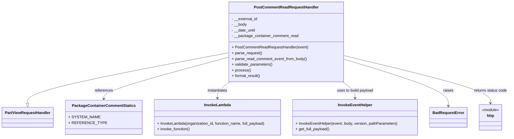

# Diagram: partview_core/partview_service/partview_service/api/comments/handlers/post_comment_read.py

> Auto-generated by Obscura crawlers

## Mermaid

```mermaid
classDiagram
class PostCommentReadRequestHandler {
  - __external_id
  - __body
  - __date_until
  - __package_container_comment_read
  + PostCommentReadRequestHandler(event)
  + parse_request()
  + parse_read_comment_event_from_body()
  + validate_parameters()
  + process()
  + format_result()
}
class PartViewRequestHandler
class PackageContainerCommentStatics {
  + SYSTEM_NAME
  + REFERENCE_TYPE
}
class InvokeLambda {
  + InvokeLambda(organization_id, function_name, full_payload)
  + invoke_function()
}
class InvokeEventHelper {
  + InvokeEventHelper(event, body, version, pathParameters)
  + get_full_payload()
}
class BadRequestError
class http <<module>>

PostCommentReadRequestHandler --|> PartViewRequestHandler
PostCommentReadRequestHandler --> PackageContainerCommentStatics : references
PostCommentReadRequestHandler --> InvokeLambda : instantiates
PostCommentReadRequestHandler --> InvokeEventHelper : uses to build payload
PostCommentReadRequestHandler --> BadRequestError : raises
PostCommentReadRequestHandler --> http : returns status code
```

> SVG rendering failed for this diagram.
