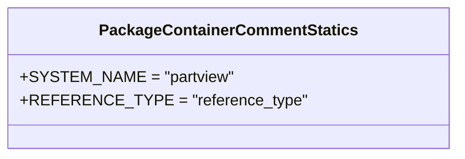

# Diagram: partview_core/partview_service/partview_service/api/comments/handlers/statics/package_container_comment_statics.py

> Auto-generated by Obscura crawlers

## Mermaid

### SVG

<svg id="container" width="433.7109375" xmlns="http://www.w3.org/2000/svg" class="classDiagram" height="160" viewBox="0 0 433.7109375 160" role="graphics-document document" aria-roledescription="class"><g><defs><marker id="container_class-aggregationStart" class="marker aggregation class" refX="18" refY="7" markerWidth="190" markerHeight="240" orient="auto"><path d="M 18,7 L9,13 L1,7 L9,1 Z"></path></marker></defs><defs><marker id="container_class-aggregationEnd" class="marker aggregation class" refX="1" refY="7" markerWidth="20" markerHeight="28" orient="auto"><path d="M 18,7 L9,13 L1,7 L9,1 Z"></path></marker></defs><defs><marker id="container_class-extensionStart" class="marker extension class" refX="18" refY="7" markerWidth="190" markerHeight="240" orient="auto"><path d="M 1,7 L18,13 V 1 Z"></path></marker></defs><defs><marker id="container_class-extensionEnd" class="marker extension class" refX="1" refY="7" markerWidth="20" markerHeight="28" orient="auto"><path d="M 1,1 V 13 L18,7 Z"></path></marker></defs><defs><marker id="container_class-compositionStart" class="marker composition class" refX="18" refY="7" markerWidth="190" markerHeight="240" orient="auto"><path d="M 18,7 L9,13 L1,7 L9,1 Z"></path></marker></defs><defs><marker id="container_class-compositionEnd" class="marker composition class" refX="1" refY="7" markerWidth="20" markerHeight="28" orient="auto"><path d="M 18,7 L9,13 L1,7 L9,1 Z"></path></marker></defs><defs><marker id="container_class-dependencyStart" class="marker dependency class" refX="6" refY="7" markerWidth="190" markerHeight="240" orient="auto"><path d="M 5,7 L9,13 L1,7 L9,1 Z"></path></marker></defs><defs><marker id="container_class-dependencyEnd" class="marker dependency class" refX="13" refY="7" markerWidth="20" markerHeight="28" orient="auto"><path d="M 18,7 L9,13 L14,7 L9,1 Z"></path></marker></defs><defs><marker id="container_class-lollipopStart" class="marker lollipop class" refX="13" refY="7" markerWidth="190" markerHeight="240" orient="auto"><circle stroke="black" fill="transparent" cx="7" cy="7" r="6"></circle></marker></defs><defs><marker id="container_class-lollipopEnd" class="marker lollipop class" refX="1" refY="7" markerWidth="190" markerHeight="240" orient="auto"><circle stroke="black" fill="transparent" cx="7" cy="7" r="6"></circle></marker></defs><g class="root"><g class="clusters"></g><g class="edgePaths"></g><g class="edgeLabels"></g><g class="nodes"><g class="node default" id="classId-PackageContainerCommentStatics-0" transform="translate(216.85546875, 80)"><g class="basic label-container"><path d="M-208.85546875 -72 L208.85546875 -72 L208.85546875 72 L-208.85546875 72" stroke="none" stroke-width="0" fill="#ECECFF" style=""></path><path d="M-208.85546875 -72 C-103.49088510378974 -72, 1.8736985424205272 -72, 208.85546875 -72 M-208.85546875 -72 C-89.27369935620719 -72, 30.308070037585622 -72, 208.85546875 -72 M208.85546875 -72 C208.85546875 -36.73318367269278, 208.85546875 -1.4663673453855637, 208.85546875 72 M208.85546875 -72 C208.85546875 -18.21341296592628, 208.85546875 35.57317406814744, 208.85546875 72 M208.85546875 72 C106.0283838462188 72, 3.201298942437603 72, -208.85546875 72 M208.85546875 72 C112.74442230008745 72, 16.6333758501749 72, -208.85546875 72 M-208.85546875 72 C-208.85546875 21.73568264104786, -208.85546875 -28.528634717904282, -208.85546875 -72 M-208.85546875 72 C-208.85546875 41.760630650361264, -208.85546875 11.521261300722529, -208.85546875 -72" stroke="#9370DB" stroke-width="1.3" fill="none" stroke-dasharray="0 0" style=""></path></g><g class="annotation-group text" transform="translate(0, -48)"></g><g class="label-group text" transform="translate(-125.1953125, -48)"><g class="label" style="font-weight: bolder" transform="translate(0,-12)"><foreignObject width="250.390625" height="24">

PackageContainerCommentStatics

</foreignObject></g></g><g class="members-group text" transform="translate(-196.85546875, 0)"><g class="label" style="" transform="translate(0,-12)"><foreignObject width="203.046875" height="24">

+SYSTEM_NAME = "partview"

</foreignObject></g><g class="label" style="" transform="translate(0,12)"><foreignObject width="268.515625" height="24">

+REFERENCE_TYPE = "reference_type"

</foreignObject></g></g><g class="methods-group text" transform="translate(-196.85546875, 72)"></g><g class="divider" style=""><path d="M-208.85546875 -24 C-48.10461279391737 -24, 112.64624316216526 -24, 208.85546875 -24 M-208.85546875 -24 C-59.7575410213382 -24, 89.3403867073236 -24, 208.85546875 -24" stroke="#9370DB" stroke-width="1.3" fill="none" stroke-dasharray="0 0" style=""></path></g><g class="divider" style=""><path d="M-208.85546875 48 C-116.58394730557865 48, -24.312425861157294 48, 208.85546875 48 M-208.85546875 48 C-95.00007089418423 48, 18.855326961631533 48, 208.85546875 48" stroke="#9370DB" stroke-width="1.3" fill="none" stroke-dasharray="0 0" style=""></path></g></g></g></g></g></svg>
