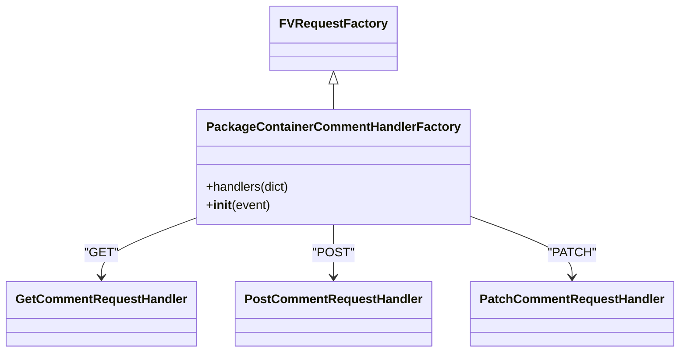
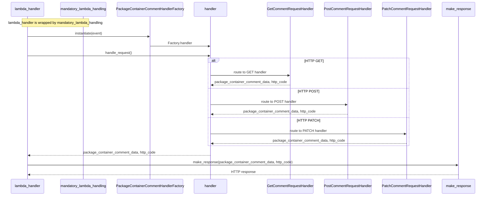

# Diagram: partview_core/partview_service/partview_service/api/comments/package_container_comments.py

> Auto-generated by Obscura crawlers

## Diagram 1

### SVG

<svg id="container" width="848.9375" xmlns="http://www.w3.org/2000/svg" class="classDiagram" height="458" viewBox="0 0 848.9375 458" role="graphics-document document" aria-roledescription="class"><g><defs><marker id="container_class-aggregationStart" class="marker aggregation class" refX="18" refY="7" markerWidth="190" markerHeight="240" orient="auto"><path d="M 18,7 L9,13 L1,7 L9,1 Z"></path></marker></defs><defs><marker id="container_class-aggregationEnd" class="marker aggregation class" refX="1" refY="7" markerWidth="20" markerHeight="28" orient="auto"><path d="M 18,7 L9,13 L1,7 L9,1 Z"></path></marker></defs><defs><marker id="container_class-extensionStart" class="marker extension class" refX="18" refY="7" markerWidth="190" markerHeight="240" orient="auto"><path d="M 1,7 L18,13 V 1 Z"></path></marker></defs><defs><marker id="container_class-extensionEnd" class="marker extension class" refX="1" refY="7" markerWidth="20" markerHeight="28" orient="auto"><path d="M 1,1 V 13 L18,7 Z"></path></marker></defs><defs><marker id="container_class-compositionStart" class="marker composition class" refX="18" refY="7" markerWidth="190" markerHeight="240" orient="auto"><path d="M 18,7 L9,13 L1,7 L9,1 Z"></path></marker></defs><defs><marker id="container_class-compositionEnd" class="marker composition class" refX="1" refY="7" markerWidth="20" markerHeight="28" orient="auto"><path d="M 18,7 L9,13 L1,7 L9,1 Z"></path></marker></defs><defs><marker id="container_class-dependencyStart" class="marker dependency class" refX="6" refY="7" markerWidth="190" markerHeight="240" orient="auto"><path d="M 5,7 L9,13 L1,7 L9,1 Z"></path></marker></defs><defs><marker id="container_class-dependencyEnd" class="marker dependency class" refX="13" refY="7" markerWidth="20" markerHeight="28" orient="auto"><path d="M 18,7 L9,13 L14,7 L9,1 Z"></path></marker></defs><defs><marker id="container_class-lollipopStart" class="marker lollipop class" refX="13" refY="7" markerWidth="190" markerHeight="240" orient="auto"><circle stroke="black" fill="transparent" cx="7" cy="7" r="6"></circle></marker></defs><defs><marker id="container_class-lollipopEnd" class="marker lollipop class" refX="1" refY="7" markerWidth="190" markerHeight="240" orient="auto"><circle stroke="black" fill="transparent" cx="7" cy="7" r="6"></circle></marker></defs><g class="root"><g class="clusters"></g><g class="edgePaths"><path d="M416.977,109.25L416.977,110.542C416.977,111.833,416.977,114.417,416.977,119.875C416.977,125.333,416.977,133.667,416.977,137.833L416.977,142" id="id_FVRequestFactory_PackageContainerCommentHandlerFactory_1" class="edge-thickness-normal edge-pattern-solid relation" style=";;;" data-edge="true" data-et="edge" data-id="id_FVRequestFactory_PackageContainerCommentHandlerFactory_1" data-points="W3sieCI6NDE2Ljk3NjU2MjUsInkiOjkyfSx7IngiOjQxNi45NzY1NjI1LCJ5IjoxMTd9LHsieCI6NDE2Ljk3NjU2MjUsInkiOjE0Mn1d" marker-start="url(#container_class-extensionStart)"></path><path d="M249.086,281.731L228.652,289.609C208.219,297.487,167.352,313.244,146.918,326.288C126.484,339.333,126.484,349.667,126.484,354.833L126.484,360" id="id_PackageContainerCommentHandlerFactory_GetCommentRequestHandler_2" class="edge-thickness-normal edge-pattern-solid relation" style=";;;" data-edge="true" data-et="edge" data-id="id_PackageContainerCommentHandlerFactory_GetCommentRequestHandler_2" data-points="W3sieCI6MjQ5LjA4NTkzNzUsInkiOjI4MS43MzA2NTY0ODI4MDEzfSx7IngiOjEyNi40ODQzNzUsInkiOjMyOX0seyJ4IjoxMjYuNDg0Mzc1LCJ5IjozNjZ9XQ==" marker-end="url(#container_class-dependencyEnd)"></path><path d="M416.977,292L416.977,298.167C416.977,304.333,416.977,316.667,416.977,328C416.977,339.333,416.977,349.667,416.977,354.833L416.977,360" id="id_PackageContainerCommentHandlerFactory_PostCommentRequestHandler_3" class="edge-thickness-normal edge-pattern-solid relation" style=";;;" data-edge="true" data-et="edge" data-id="id_PackageContainerCommentHandlerFactory_PostCommentRequestHandler_3" data-points="W3sieCI6NDE2Ljk3NjU2MjUsInkiOjI5Mn0seyJ4Ijo0MTYuOTc2NTYyNSwieSI6MzI5fSx7IngiOjQxNi45NzY1NjI1LCJ5IjozNjZ9XQ==" marker-end="url(#container_class-dependencyEnd)"></path><path d="M584.867,280.103L606.549,288.253C628.232,296.402,671.596,312.701,693.279,326.017C714.961,339.333,714.961,349.667,714.961,354.833L714.961,360" id="id_PackageContainerCommentHandlerFactory_PatchCommentRequestHandler_4" class="edge-thickness-normal edge-pattern-solid relation" style=";;;" data-edge="true" data-et="edge" data-id="id_PackageContainerCommentHandlerFactory_PatchCommentRequestHandler_4" data-points="W3sieCI6NTg0Ljg2NzE4NzUsInkiOjI4MC4xMDMxNDA4OTQ1NTE5fSx7IngiOjcxNC45NjA5Mzc1LCJ5IjozMjl9LHsieCI6NzE0Ljk2MDkzNzUsInkiOjM2Nn1d" marker-end="url(#container_class-dependencyEnd)"></path></g><g class="edgeLabels"><g class="edgeLabel"><g class="label" data-id="id_FVRequestFactory_PackageContainerCommentHandlerFactory_1" transform="translate(0, 0)"><foreignObject width="0" height="0">

</foreignObject></g></g><g class="edgeLabel" transform="translate(126.484375, 329)"><g class="label" data-id="id_PackageContainerCommentHandlerFactory_GetCommentRequestHandler_2" transform="translate(-19.9296875, -12)"><foreignObject width="39.859375" height="24">

"GET"

</foreignObject></g></g><g class="edgeLabel" transform="translate(416.9765625, 329)"><g class="label" data-id="id_PackageContainerCommentHandlerFactory_PostCommentRequestHandler_3" transform="translate(-24.96875, -12)"><foreignObject width="49.9375" height="24">

"POST"

</foreignObject></g></g><g class="edgeLabel" transform="translate(714.9609375, 329)"><g class="label" data-id="id_PackageContainerCommentHandlerFactory_PatchCommentRequestHandler_4" transform="translate(-28.515625, -12)"><foreignObject width="57.03125" height="24">

"PATCH"

</foreignObject></g></g></g><g class="nodes"><g class="node default" id="classId-FVRequestFactory-0" transform="translate(416.9765625, 50)"><g class="basic label-container"><path d="M-77.0390625 -42 L77.0390625 -42 L77.0390625 42 L-77.0390625 42" stroke="none" stroke-width="0" fill="#ECECFF" style=""></path><path d="M-77.0390625 -42 C-19.487005599594873 -42, 38.065051300810254 -42, 77.0390625 -42 M-77.0390625 -42 C-29.029197619391454 -42, 18.980667261217093 -42, 77.0390625 -42 M77.0390625 -42 C77.0390625 -23.385280258618288, 77.0390625 -4.770560517236575, 77.0390625 42 M77.0390625 -42 C77.0390625 -21.382496840913717, 77.0390625 -0.7649936818274341, 77.0390625 42 M77.0390625 42 C18.512823957341006 42, -40.01341458531799 42, -77.0390625 42 M77.0390625 42 C41.69325612038499 42, 6.347449740769974 42, -77.0390625 42 M-77.0390625 42 C-77.0390625 24.317724379331146, -77.0390625 6.635448758662292, -77.0390625 -42 M-77.0390625 42 C-77.0390625 11.1787539779992, -77.0390625 -19.6424920440016, -77.0390625 -42" stroke="#9370DB" stroke-width="1.3" fill="none" stroke-dasharray="0 0" style=""></path></g><g class="annotation-group text" transform="translate(0, -18)"></g><g class="label-group text" transform="translate(-65.0390625, -18)"><g class="label" style="font-weight: bolder" transform="translate(0,-12)"><foreignObject width="130.078125" height="24">

FVRequestFactory

</foreignObject></g></g><g class="members-group text" transform="translate(-65.0390625, 30)"></g><g class="methods-group text" transform="translate(-65.0390625, 60)"></g><g class="divider" style=""><path d="M-77.0390625 6 C-42.37585153990055 6, -7.7126405798011035 6, 77.0390625 6 M-77.0390625 6 C-18.573581241002074 6, 39.89190001799585 6, 77.0390625 6" stroke="#9370DB" stroke-width="1.3" fill="none" stroke-dasharray="0 0" style=""></path></g><g class="divider" style=""><path d="M-77.0390625 24 C-43.30263427497216 24, -9.566206049944313 24, 77.0390625 24 M-77.0390625 24 C-39.74106781716094 24, -2.443073134321878 24, 77.0390625 24" stroke="#9370DB" stroke-width="1.3" fill="none" stroke-dasharray="0 0" style=""></path></g></g><g class="node default" id="classId-PackageContainerCommentHandlerFactory-1" transform="translate(416.9765625, 217)"><g class="basic label-container"><path d="M-167.890625 -75 L167.890625 -75 L167.890625 75 L-167.890625 75" stroke="none" stroke-width="0" fill="#ECECFF" style=""></path><path d="M-167.890625 -75 C-85.44905917770221 -75, -3.0074933554044208 -75, 167.890625 -75 M-167.890625 -75 C-36.741050509903346 -75, 94.40852398019331 -75, 167.890625 -75 M167.890625 -75 C167.890625 -43.912574383011076, 167.890625 -12.825148766022146, 167.890625 75 M167.890625 -75 C167.890625 -44.860386595546046, 167.890625 -14.720773191092093, 167.890625 75 M167.890625 75 C58.685580896313496 75, -50.51946320737301 75, -167.890625 75 M167.890625 75 C83.37875330374305 75, -1.133118392513893 75, -167.890625 75 M-167.890625 75 C-167.890625 15.624489252978037, -167.890625 -43.751021494043925, -167.890625 -75 M-167.890625 75 C-167.890625 40.92674353597125, -167.890625 6.853487071942496, -167.890625 -75" stroke="#9370DB" stroke-width="1.3" fill="none" stroke-dasharray="0 0" style=""></path></g><g class="annotation-group text" transform="translate(0, -51)"></g><g class="label-group text" transform="translate(-155.890625, -51)"><g class="label" style="font-weight: bolder" transform="translate(0,-12)"><foreignObject width="311.78125" height="24">

PackageContainerCommentHandlerFactory

</foreignObject></g></g><g class="members-group text" transform="translate(-155.890625, -3)"></g><g class="methods-group text" transform="translate(-155.890625, 27)"><g class="label" style="" transform="translate(0,-12)"><foreignObject width="109.625" height="24">

+handlers(dict)

</foreignObject></g><g class="label" style="" transform="translate(0,12)"><foreignObject width="83.140625" height="24">

+<strong>init</strong>(event)

</foreignObject></g></g><g class="divider" style=""><path d="M-167.890625 -27 C-42.77567688801349 -27, 82.33927122397301 -27, 167.890625 -27 M-167.890625 -27 C-42.31583418468024 -27, 83.25895663063952 -27, 167.890625 -27" stroke="#9370DB" stroke-width="1.3" fill="none" stroke-dasharray="0 0" style=""></path></g><g class="divider" style=""><path d="M-167.890625 -3 C-87.85290600544697 -3, -7.815187010893936 -3, 167.890625 -3 M-167.890625 -3 C-100.47783610322314 -3, -33.06504720644628 -3, 167.890625 -3" stroke="#9370DB" stroke-width="1.3" fill="none" stroke-dasharray="0 0" style=""></path></g></g><g class="node default" id="classId-GetCommentRequestHandler-2" transform="translate(126.484375, 408)"><g class="basic label-container"><path d="M-118.484375 -42 L118.484375 -42 L118.484375 42 L-118.484375 42" stroke="none" stroke-width="0" fill="#ECECFF" style=""></path><path d="M-118.484375 -42 C-68.61304866814321 -42, -18.741722336286415 -42, 118.484375 -42 M-118.484375 -42 C-53.623263625126086 -42, 11.237847749747829 -42, 118.484375 -42 M118.484375 -42 C118.484375 -11.661915084205305, 118.484375 18.67616983158939, 118.484375 42 M118.484375 -42 C118.484375 -14.004934734057521, 118.484375 13.990130531884958, 118.484375 42 M118.484375 42 C60.71371654970568 42, 2.9430580994113598 42, -118.484375 42 M118.484375 42 C52.76615140923617 42, -12.952072181527654 42, -118.484375 42 M-118.484375 42 C-118.484375 12.495244781364448, -118.484375 -17.009510437271103, -118.484375 -42 M-118.484375 42 C-118.484375 21.272057394185794, -118.484375 0.5441147883715871, -118.484375 -42" stroke="#9370DB" stroke-width="1.3" fill="none" stroke-dasharray="0 0" style=""></path></g><g class="annotation-group text" transform="translate(0, -18)"></g><g class="label-group text" transform="translate(-106.484375, -18)"><g class="label" style="font-weight: bolder" transform="translate(0,-12)"><foreignObject width="212.96875" height="24">

GetCommentRequestHandler

</foreignObject></g></g><g class="members-group text" transform="translate(-106.484375, 30)"></g><g class="methods-group text" transform="translate(-106.484375, 60)"></g><g class="divider" style=""><path d="M-118.484375 6 C-48.833674812485114 6, 20.817025375029772 6, 118.484375 6 M-118.484375 6 C-48.57990289643158 6, 21.324569207136847 6, 118.484375 6" stroke="#9370DB" stroke-width="1.3" fill="none" stroke-dasharray="0 0" style=""></path></g><g class="divider" style=""><path d="M-118.484375 24 C-31.936118404249257 24, 54.61213819150149 24, 118.484375 24 M-118.484375 24 C-69.16077169525387 24, -19.837168390507742 24, 118.484375 24" stroke="#9370DB" stroke-width="1.3" fill="none" stroke-dasharray="0 0" style=""></path></g></g><g class="node default" id="classId-PostCommentRequestHandler-3" transform="translate(416.9765625, 408)"><g class="basic label-container"><path d="M-122.0078125 -42 L122.0078125 -42 L122.0078125 42 L-122.0078125 42" stroke="none" stroke-width="0" fill="#ECECFF" style=""></path><path d="M-122.0078125 -42 C-61.62140204291054 -42, -1.2349915858210778 -42, 122.0078125 -42 M-122.0078125 -42 C-32.89519760086607 -42, 56.21741729826786 -42, 122.0078125 -42 M122.0078125 -42 C122.0078125 -22.389115596740687, 122.0078125 -2.778231193481375, 122.0078125 42 M122.0078125 -42 C122.0078125 -8.830071808751747, 122.0078125 24.339856382496507, 122.0078125 42 M122.0078125 42 C34.77098076680663 42, -52.46585096638674 42, -122.0078125 42 M122.0078125 42 C65.18270626548156 42, 8.357600030963098 42, -122.0078125 42 M-122.0078125 42 C-122.0078125 20.306734218141628, -122.0078125 -1.3865315637167441, -122.0078125 -42 M-122.0078125 42 C-122.0078125 25.170027787254792, -122.0078125 8.340055574509584, -122.0078125 -42" stroke="#9370DB" stroke-width="1.3" fill="none" stroke-dasharray="0 0" style=""></path></g><g class="annotation-group text" transform="translate(0, -18)"></g><g class="label-group text" transform="translate(-110.0078125, -18)"><g class="label" style="font-weight: bolder" transform="translate(0,-12)"><foreignObject width="220.015625" height="24">

PostCommentRequestHandler

</foreignObject></g></g><g class="members-group text" transform="translate(-110.0078125, 30)"></g><g class="methods-group text" transform="translate(-110.0078125, 60)"></g><g class="divider" style=""><path d="M-122.0078125 6 C-37.538990467549425 6, 46.92983156490115 6, 122.0078125 6 M-122.0078125 6 C-37.280792320173305 6, 47.44622785965339 6, 122.0078125 6" stroke="#9370DB" stroke-width="1.3" fill="none" stroke-dasharray="0 0" style=""></path></g><g class="divider" style=""><path d="M-122.0078125 24 C-38.809624235601206 24, 44.38856402879759 24, 122.0078125 24 M-122.0078125 24 C-71.44321069536296 24, -20.87860889072593 24, 122.0078125 24" stroke="#9370DB" stroke-width="1.3" fill="none" stroke-dasharray="0 0" style=""></path></g></g><g class="node default" id="classId-PatchCommentRequestHandler-4" transform="translate(714.9609375, 408)"><g class="basic label-container"><path d="M-125.9765625 -42 L125.9765625 -42 L125.9765625 42 L-125.9765625 42" stroke="none" stroke-width="0" fill="#ECECFF" style=""></path><path d="M-125.9765625 -42 C-35.95657444308324 -42, 54.06341361383352 -42, 125.9765625 -42 M-125.9765625 -42 C-58.894120760259995 -42, 8.188320979480011 -42, 125.9765625 -42 M125.9765625 -42 C125.9765625 -12.272569053389763, 125.9765625 17.454861893220475, 125.9765625 42 M125.9765625 -42 C125.9765625 -18.997592001420454, 125.9765625 4.004815997159092, 125.9765625 42 M125.9765625 42 C63.811558988555994 42, 1.6465554771119884 42, -125.9765625 42 M125.9765625 42 C62.82451669966091 42, -0.3275291006781771 42, -125.9765625 42 M-125.9765625 42 C-125.9765625 12.104765060394044, -125.9765625 -17.790469879211912, -125.9765625 -42 M-125.9765625 42 C-125.9765625 16.75526633120642, -125.9765625 -8.489467337587158, -125.9765625 -42" stroke="#9370DB" stroke-width="1.3" fill="none" stroke-dasharray="0 0" style=""></path></g><g class="annotation-group text" transform="translate(0, -18)"></g><g class="label-group text" transform="translate(-113.9765625, -18)"><g class="label" style="font-weight: bolder" transform="translate(0,-12)"><foreignObject width="227.953125" height="24">

PatchCommentRequestHandler

</foreignObject></g></g><g class="members-group text" transform="translate(-113.9765625, 30)"></g><g class="methods-group text" transform="translate(-113.9765625, 60)"></g><g class="divider" style=""><path d="M-125.9765625 6 C-41.70437387091425 6, 42.567814758171494 6, 125.9765625 6 M-125.9765625 6 C-29.693343332501925 6, 66.58987583499615 6, 125.9765625 6" stroke="#9370DB" stroke-width="1.3" fill="none" stroke-dasharray="0 0" style=""></path></g><g class="divider" style=""><path d="M-125.9765625 24 C-33.696539160685504 24, 58.58348417862899 24, 125.9765625 24 M-125.9765625 24 C-67.16227509543575 24, -8.347987690871491 24, 125.9765625 24" stroke="#9370DB" stroke-width="1.3" fill="none" stroke-dasharray="0 0" style=""></path></g></g></g></g></g></svg>

## Diagram 2

### SVG

<svg id="container" width="2380.5" xmlns="http://www.w3.org/2000/svg" height="941" viewBox="-50 -10 2380.5 941" role="graphics-document document" aria-roledescription="sequence"><g><rect x="2130.5" y="855" fill="#eaeaea" stroke="#666" width="150" height="65" name="Response" rx="3" ry="3" class="actor actor-bottom"></rect><text x="2205.5" y="887.5" dominant-baseline="central" alignment-baseline="central" class="actor actor-box" style="text-anchor: middle; font-size: 16px; font-weight: 400;"><tspan x="2205.5" dy="0">make_response</tspan></text></g><g><rect x="1833.5" y="855" fill="#eaeaea" stroke="#666" width="247" height="65" name="PatchH" rx="3" ry="3" class="actor actor-bottom"></rect><text x="1957" y="887.5" dominant-baseline="central" alignment-baseline="central" class="actor actor-box" style="text-anchor: middle; font-size: 16px; font-weight: 400;"><tspan x="1957" dy="0">PatchCommentRequestHandler</tspan></text></g><g><rect x="1544.5" y="855" fill="#eaeaea" stroke="#666" width="239" height="65" name="PostH" rx="3" ry="3" class="actor actor-bottom"></rect><text x="1664" y="887.5" dominant-baseline="central" alignment-baseline="central" class="actor actor-box" style="text-anchor: middle; font-size: 16px; font-weight: 400;"><tspan x="1664" dy="0">PostCommentRequestHandler</tspan></text></g><g><rect x="1262.5" y="855" fill="#eaeaea" stroke="#666" width="232" height="65" name="GetH" rx="3" ry="3" class="actor actor-bottom"></rect><text x="1378.5" y="887.5" dominant-baseline="central" alignment-baseline="central" class="actor actor-box" style="text-anchor: middle; font-size: 16px; font-weight: 400;"><tspan x="1378.5" dy="0">GetCommentRequestHandler</tspan></text></g><g><rect x="901.5" y="855" fill="#eaeaea" stroke="#666" width="150" height="65" name="Handler" rx="3" ry="3" class="actor actor-bottom"></rect><text x="976.5" y="887.5" dominant-baseline="central" alignment-baseline="central" class="actor actor-box" style="text-anchor: middle; font-size: 16px; font-weight: 400;"><tspan x="976.5" dy="0">handler</tspan></text></g><g><rect x="523.5" y="855" fill="#eaeaea" stroke="#666" width="328" height="65" name="Factory" rx="3" ry="3" class="actor actor-bottom"></rect><text x="687.5" y="887.5" dominant-baseline="central" alignment-baseline="central" class="actor actor-box" style="text-anchor: middle; font-size: 16px; font-weight: 400;"><tspan x="687.5" dy="0">PackageContainerCommentHandlerFactory</tspan></text></g><g><rect x="239.5" y="855" fill="#eaeaea" stroke="#666" width="234" height="65" name="Decorator" rx="3" ry="3" class="actor actor-bottom"></rect><text x="356.5" y="887.5" dominant-baseline="central" alignment-baseline="central" class="actor actor-box" style="text-anchor: middle; font-size: 16px; font-weight: 400;"><tspan x="356.5" dy="0">mandatory_lambda_handling</tspan></text></g><g><rect x="0" y="855" fill="#eaeaea" stroke="#666" width="150" height="65" name="Lambda" rx="3" ry="3" class="actor actor-bottom"></rect><text x="75" y="887.5" dominant-baseline="central" alignment-baseline="central" class="actor actor-box" style="text-anchor: middle; font-size: 16px; font-weight: 400;"><tspan x="75" dy="0">lambda_handler</tspan></text></g><g><line id="actor7" x1="2205.5" y1="65" x2="2205.5" y2="855" class="actor-line 200" stroke-width="0.5px" stroke="#999" name="Response"></line><g id="root-7"><rect x="2130.5" y="0" fill="#eaeaea" stroke="#666" width="150" height="65" name="Response" rx="3" ry="3" class="actor actor-top"></rect><text x="2205.5" y="32.5" dominant-baseline="central" alignment-baseline="central" class="actor actor-box" style="text-anchor: middle; font-size: 16px; font-weight: 400;"><tspan x="2205.5" dy="0">make_response</tspan></text></g></g><g><line id="actor6" x1="1957" y1="65" x2="1957" y2="855" class="actor-line 200" stroke-width="0.5px" stroke="#999" name="PatchH"></line><g id="root-6"><rect x="1833.5" y="0" fill="#eaeaea" stroke="#666" width="247" height="65" name="PatchH" rx="3" ry="3" class="actor actor-top"></rect><text x="1957" y="32.5" dominant-baseline="central" alignment-baseline="central" class="actor actor-box" style="text-anchor: middle; font-size: 16px; font-weight: 400;"><tspan x="1957" dy="0">PatchCommentRequestHandler</tspan></text></g></g><g><line id="actor5" x1="1664" y1="65" x2="1664" y2="855" class="actor-line 200" stroke-width="0.5px" stroke="#999" name="PostH"></line><g id="root-5"><rect x="1544.5" y="0" fill="#eaeaea" stroke="#666" width="239" height="65" name="PostH" rx="3" ry="3" class="actor actor-top"></rect><text x="1664" y="32.5" dominant-baseline="central" alignment-baseline="central" class="actor actor-box" style="text-anchor: middle; font-size: 16px; font-weight: 400;"><tspan x="1664" dy="0">PostCommentRequestHandler</tspan></text></g></g><g><line id="actor4" x1="1378.5" y1="65" x2="1378.5" y2="855" class="actor-line 200" stroke-width="0.5px" stroke="#999" name="GetH"></line><g id="root-4"><rect x="1262.5" y="0" fill="#eaeaea" stroke="#666" width="232" height="65" name="GetH" rx="3" ry="3" class="actor actor-top"></rect><text x="1378.5" y="32.5" dominant-baseline="central" alignment-baseline="central" class="actor actor-box" style="text-anchor: middle; font-size: 16px; font-weight: 400;"><tspan x="1378.5" dy="0">GetCommentRequestHandler</tspan></text></g></g><g><line id="actor3" x1="976.5" y1="65" x2="976.5" y2="855" class="actor-line 200" stroke-width="0.5px" stroke="#999" name="Handler"></line><g id="root-3"><rect x="901.5" y="0" fill="#eaeaea" stroke="#666" width="150" height="65" name="Handler" rx="3" ry="3" class="actor actor-top"></rect><text x="976.5" y="32.5" dominant-baseline="central" alignment-baseline="central" class="actor actor-box" style="text-anchor: middle; font-size: 16px; font-weight: 400;"><tspan x="976.5" dy="0">handler</tspan></text></g></g><g><line id="actor2" x1="687.5" y1="65" x2="687.5" y2="855" class="actor-line 200" stroke-width="0.5px" stroke="#999" name="Factory"></line><g id="root-2"><rect x="523.5" y="0" fill="#eaeaea" stroke="#666" width="328" height="65" name="Factory" rx="3" ry="3" class="actor actor-top"></rect><text x="687.5" y="32.5" dominant-baseline="central" alignment-baseline="central" class="actor actor-box" style="text-anchor: middle; font-size: 16px; font-weight: 400;"><tspan x="687.5" dy="0">PackageContainerCommentHandlerFactory</tspan></text></g></g><g><line id="actor1" x1="356.5" y1="65" x2="356.5" y2="855" class="actor-line 200" stroke-width="0.5px" stroke="#999" name="Decorator"></line><g id="root-1"><rect x="239.5" y="0" fill="#eaeaea" stroke="#666" width="234" height="65" name="Decorator" rx="3" ry="3" class="actor actor-top"></rect><text x="356.5" y="32.5" dominant-baseline="central" alignment-baseline="central" class="actor actor-box" style="text-anchor: middle; font-size: 16px; font-weight: 400;"><tspan x="356.5" dy="0">mandatory_lambda_handling</tspan></text></g></g><g><line id="actor0" x1="75" y1="65" x2="75" y2="855" class="actor-line 200" stroke-width="0.5px" stroke="#999" name="Lambda"></line><g id="root-0"><rect x="0" y="0" fill="#eaeaea" stroke="#666" width="150" height="65" name="Lambda" rx="3" ry="3" class="actor actor-top"></rect><text x="75" y="32.5" dominant-baseline="central" alignment-baseline="central" class="actor actor-box" style="text-anchor: middle; font-size: 16px; font-weight: 400;"><tspan x="75" dy="0">lambda_handler</tspan></text></g></g><g></g><defs><symbol id="computer" width="24" height="24"><path transform="scale(.5)" d="M2 2v13h20v-13h-20zm18 11h-16v-9h16v9zm-10.228 6l.466-1h3.524l.467 1h-4.457zm14.228 3h-24l2-6h2.104l-1.33 4h18.45l-1.297-4h2.073l2 6zm-5-10h-14v-7h14v7z"></path></symbol></defs><defs><symbol id="database" fill-rule="evenodd" clip-rule="evenodd"><path transform="scale(.5)" d="M12.258.001l.256.004.255.005.253.008.251.01.249.012.247.015.246.016.242.019.241.02.239.023.236.024.233.027.231.028.229.031.225.032.223.034.22.036.217.038.214.04.211.041.208.043.205.045.201.046.198.048.194.05.191.051.187.053.183.054.18.056.175.057.172.059.168.06.163.061.16.063.155.064.15.066.074.033.073.033.071.034.07.034.069.035.068.035.067.035.066.035.064.036.064.036.062.036.06.036.06.037.058.037.058.037.055.038.055.038.053.038.052.038.051.039.05.039.048.039.047.039.045.04.044.04.043.04.041.04.04.041.039.041.037.041.036.041.034.041.033.042.032.042.03.042.029.042.027.042.026.043.024.043.023.043.021.043.02.043.018.044.017.043.015.044.013.044.012.044.011.045.009.044.007.045.006.045.004.045.002.045.001.045v17l-.001.045-.002.045-.004.045-.006.045-.007.045-.009.044-.011.045-.012.044-.013.044-.015.044-.017.043-.018.044-.02.043-.021.043-.023.043-.024.043-.026.043-.027.042-.029.042-.03.042-.032.042-.033.042-.034.041-.036.041-.037.041-.039.041-.04.041-.041.04-.043.04-.044.04-.045.04-.047.039-.048.039-.05.039-.051.039-.052.038-.053.038-.055.038-.055.038-.058.037-.058.037-.06.037-.06.036-.062.036-.064.036-.064.036-.066.035-.067.035-.068.035-.069.035-.07.034-.071.034-.073.033-.074.033-.15.066-.155.064-.16.063-.163.061-.168.06-.172.059-.175.057-.18.056-.183.054-.187.053-.191.051-.194.05-.198.048-.201.046-.205.045-.208.043-.211.041-.214.04-.217.038-.22.036-.223.034-.225.032-.229.031-.231.028-.233.027-.236.024-.239.023-.241.02-.242.019-.246.016-.247.015-.249.012-.251.01-.253.008-.255.005-.256.004-.258.001-.258-.001-.256-.004-.255-.005-.253-.008-.251-.01-.249-.012-.247-.015-.245-.016-.243-.019-.241-.02-.238-.023-.236-.024-.234-.027-.231-.028-.228-.031-.226-.032-.223-.034-.22-.036-.217-.038-.214-.04-.211-.041-.208-.043-.204-.045-.201-.046-.198-.048-.195-.05-.19-.051-.187-.053-.184-.054-.179-.056-.176-.057-.172-.059-.167-.06-.164-.061-.159-.063-.155-.064-.151-.066-.074-.033-.072-.033-.072-.034-.07-.034-.069-.035-.068-.035-.067-.035-.066-.035-.064-.036-.063-.036-.062-.036-.061-.036-.06-.037-.058-.037-.057-.037-.056-.038-.055-.038-.053-.038-.052-.038-.051-.039-.049-.039-.049-.039-.046-.039-.046-.04-.044-.04-.043-.04-.041-.04-.04-.041-.039-.041-.037-.041-.036-.041-.034-.041-.033-.042-.032-.042-.03-.042-.029-.042-.027-.042-.026-.043-.024-.043-.023-.043-.021-.043-.02-.043-.018-.044-.017-.043-.015-.044-.013-.044-.012-.044-.011-.045-.009-.044-.007-.045-.006-.045-.004-.045-.002-.045-.001-.045v-17l.001-.045.002-.045.004-.045.006-.045.007-.045.009-.044.011-.045.012-.044.013-.044.015-.044.017-.043.018-.044.02-.043.021-.043.023-.043.024-.043.026-.043.027-.042.029-.042.03-.042.032-.042.033-.042.034-.041.036-.041.037-.041.039-.041.04-.041.041-.04.043-.04.044-.04.046-.04.046-.039.049-.039.049-.039.051-.039.052-.038.053-.038.055-.038.056-.038.057-.037.058-.037.06-.037.061-.036.062-.036.063-.036.064-.036.066-.035.067-.035.068-.035.069-.035.07-.034.072-.034.072-.033.074-.033.151-.066.155-.064.159-.063.164-.061.167-.06.172-.059.176-.057.179-.056.184-.054.187-.053.19-.051.195-.05.198-.048.201-.046.204-.045.208-.043.211-.041.214-.04.217-.038.22-.036.223-.034.226-.032.228-.031.231-.028.234-.027.236-.024.238-.023.241-.02.243-.019.245-.016.247-.015.249-.012.251-.01.253-.008.255-.005.256-.004.258-.001.258.001zm-9.258 20.499v.01l.001.021.003.021.004.022.005.021.006.022.007.022.009.023.01.022.011.023.012.023.013.023.015.023.016.024.017.023.018.024.019.024.021.024.022.025.023.024.024.025.052.049.056.05.061.051.066.051.07.051.075.051.079.052.084.052.088.052.092.052.097.052.102.051.105.052.11.052.114.051.119.051.123.051.127.05.131.05.135.05.139.048.144.049.147.047.152.047.155.047.16.045.163.045.167.043.171.043.176.041.178.041.183.039.187.039.19.037.194.035.197.035.202.033.204.031.209.03.212.029.216.027.219.025.222.024.226.021.23.02.233.018.236.016.24.015.243.012.246.01.249.008.253.005.256.004.259.001.26-.001.257-.004.254-.005.25-.008.247-.011.244-.012.241-.014.237-.016.233-.018.231-.021.226-.021.224-.024.22-.026.216-.027.212-.028.21-.031.205-.031.202-.034.198-.034.194-.036.191-.037.187-.039.183-.04.179-.04.175-.042.172-.043.168-.044.163-.045.16-.046.155-.046.152-.047.148-.048.143-.049.139-.049.136-.05.131-.05.126-.05.123-.051.118-.052.114-.051.11-.052.106-.052.101-.052.096-.052.092-.052.088-.053.083-.051.079-.052.074-.052.07-.051.065-.051.06-.051.056-.05.051-.05.023-.024.023-.025.021-.024.02-.024.019-.024.018-.024.017-.024.015-.023.014-.024.013-.023.012-.023.01-.023.01-.022.008-.022.006-.022.006-.022.004-.022.004-.021.001-.021.001-.021v-4.127l-.077.055-.08.053-.083.054-.085.053-.087.052-.09.052-.093.051-.095.05-.097.05-.1.049-.102.049-.105.048-.106.047-.109.047-.111.046-.114.045-.115.045-.118.044-.12.043-.122.042-.124.042-.126.041-.128.04-.13.04-.132.038-.134.038-.135.037-.138.037-.139.035-.142.035-.143.034-.144.033-.147.032-.148.031-.15.03-.151.03-.153.029-.154.027-.156.027-.158.026-.159.025-.161.024-.162.023-.163.022-.165.021-.166.02-.167.019-.169.018-.169.017-.171.016-.173.015-.173.014-.175.013-.175.012-.177.011-.178.01-.179.008-.179.008-.181.006-.182.005-.182.004-.184.003-.184.002h-.37l-.184-.002-.184-.003-.182-.004-.182-.005-.181-.006-.179-.008-.179-.008-.178-.01-.176-.011-.176-.012-.175-.013-.173-.014-.172-.015-.171-.016-.17-.017-.169-.018-.167-.019-.166-.02-.165-.021-.163-.022-.162-.023-.161-.024-.159-.025-.157-.026-.156-.027-.155-.027-.153-.029-.151-.03-.15-.03-.148-.031-.146-.032-.145-.033-.143-.034-.141-.035-.14-.035-.137-.037-.136-.037-.134-.038-.132-.038-.13-.04-.128-.04-.126-.041-.124-.042-.122-.042-.12-.044-.117-.043-.116-.045-.113-.045-.112-.046-.109-.047-.106-.047-.105-.048-.102-.049-.1-.049-.097-.05-.095-.05-.093-.052-.09-.051-.087-.052-.085-.053-.083-.054-.08-.054-.077-.054v4.127zm0-5.654v.011l.001.021.003.021.004.021.005.022.006.022.007.022.009.022.01.022.011.023.012.023.013.023.015.024.016.023.017.024.018.024.019.024.021.024.022.024.023.025.024.024.052.05.056.05.061.05.066.051.07.051.075.052.079.051.084.052.088.052.092.052.097.052.102.052.105.052.11.051.114.051.119.052.123.05.127.051.131.05.135.049.139.049.144.048.147.048.152.047.155.046.16.045.163.045.167.044.171.042.176.042.178.04.183.04.187.038.19.037.194.036.197.034.202.033.204.032.209.03.212.028.216.027.219.025.222.024.226.022.23.02.233.018.236.016.24.014.243.012.246.01.249.008.253.006.256.003.259.001.26-.001.257-.003.254-.006.25-.008.247-.01.244-.012.241-.015.237-.016.233-.018.231-.02.226-.022.224-.024.22-.025.216-.027.212-.029.21-.03.205-.032.202-.033.198-.035.194-.036.191-.037.187-.039.183-.039.179-.041.175-.042.172-.043.168-.044.163-.045.16-.045.155-.047.152-.047.148-.048.143-.048.139-.05.136-.049.131-.05.126-.051.123-.051.118-.051.114-.052.11-.052.106-.052.101-.052.096-.052.092-.052.088-.052.083-.052.079-.052.074-.051.07-.052.065-.051.06-.05.056-.051.051-.049.023-.025.023-.024.021-.025.02-.024.019-.024.018-.024.017-.024.015-.023.014-.023.013-.024.012-.022.01-.023.01-.023.008-.022.006-.022.006-.022.004-.021.004-.022.001-.021.001-.021v-4.139l-.077.054-.08.054-.083.054-.085.052-.087.053-.09.051-.093.051-.095.051-.097.05-.1.049-.102.049-.105.048-.106.047-.109.047-.111.046-.114.045-.115.044-.118.044-.12.044-.122.042-.124.042-.126.041-.128.04-.13.039-.132.039-.134.038-.135.037-.138.036-.139.036-.142.035-.143.033-.144.033-.147.033-.148.031-.15.03-.151.03-.153.028-.154.028-.156.027-.158.026-.159.025-.161.024-.162.023-.163.022-.165.021-.166.02-.167.019-.169.018-.169.017-.171.016-.173.015-.173.014-.175.013-.175.012-.177.011-.178.009-.179.009-.179.007-.181.007-.182.005-.182.004-.184.003-.184.002h-.37l-.184-.002-.184-.003-.182-.004-.182-.005-.181-.007-.179-.007-.179-.009-.178-.009-.176-.011-.176-.012-.175-.013-.173-.014-.172-.015-.171-.016-.17-.017-.169-.018-.167-.019-.166-.02-.165-.021-.163-.022-.162-.023-.161-.024-.159-.025-.157-.026-.156-.027-.155-.028-.153-.028-.151-.03-.15-.03-.148-.031-.146-.033-.145-.033-.143-.033-.141-.035-.14-.036-.137-.036-.136-.037-.134-.038-.132-.039-.13-.039-.128-.04-.126-.041-.124-.042-.122-.043-.12-.043-.117-.044-.116-.044-.113-.046-.112-.046-.109-.046-.106-.047-.105-.048-.102-.049-.1-.049-.097-.05-.095-.051-.093-.051-.09-.051-.087-.053-.085-.052-.083-.054-.08-.054-.077-.054v4.139zm0-5.666v.011l.001.02.003.022.004.021.005.022.006.021.007.022.009.023.01.022.011.023.012.023.013.023.015.023.016.024.017.024.018.023.019.024.021.025.022.024.023.024.024.025.052.05.056.05.061.05.066.051.07.051.075.052.079.051.084.052.088.052.092.052.097.052.102.052.105.051.11.052.114.051.119.051.123.051.127.05.131.05.135.05.139.049.144.048.147.048.152.047.155.046.16.045.163.045.167.043.171.043.176.042.178.04.183.04.187.038.19.037.194.036.197.034.202.033.204.032.209.03.212.028.216.027.219.025.222.024.226.021.23.02.233.018.236.017.24.014.243.012.246.01.249.008.253.006.256.003.259.001.26-.001.257-.003.254-.006.25-.008.247-.01.244-.013.241-.014.237-.016.233-.018.231-.02.226-.022.224-.024.22-.025.216-.027.212-.029.21-.03.205-.032.202-.033.198-.035.194-.036.191-.037.187-.039.183-.039.179-.041.175-.042.172-.043.168-.044.163-.045.16-.045.155-.047.152-.047.148-.048.143-.049.139-.049.136-.049.131-.051.126-.05.123-.051.118-.052.114-.051.11-.052.106-.052.101-.052.096-.052.092-.052.088-.052.083-.052.079-.052.074-.052.07-.051.065-.051.06-.051.056-.05.051-.049.023-.025.023-.025.021-.024.02-.024.019-.024.018-.024.017-.024.015-.023.014-.024.013-.023.012-.023.01-.022.01-.023.008-.022.006-.022.006-.022.004-.022.004-.021.001-.021.001-.021v-4.153l-.077.054-.08.054-.083.053-.085.053-.087.053-.09.051-.093.051-.095.051-.097.05-.1.049-.102.048-.105.048-.106.048-.109.046-.111.046-.114.046-.115.044-.118.044-.12.043-.122.043-.124.042-.126.041-.128.04-.13.039-.132.039-.134.038-.135.037-.138.036-.139.036-.142.034-.143.034-.144.033-.147.032-.148.032-.15.03-.151.03-.153.028-.154.028-.156.027-.158.026-.159.024-.161.024-.162.023-.163.023-.165.021-.166.02-.167.019-.169.018-.169.017-.171.016-.173.015-.173.014-.175.013-.175.012-.177.01-.178.01-.179.009-.179.007-.181.006-.182.006-.182.004-.184.003-.184.001-.185.001-.185-.001-.184-.001-.184-.003-.182-.004-.182-.006-.181-.006-.179-.007-.179-.009-.178-.01-.176-.01-.176-.012-.175-.013-.173-.014-.172-.015-.171-.016-.17-.017-.169-.018-.167-.019-.166-.02-.165-.021-.163-.023-.162-.023-.161-.024-.159-.024-.157-.026-.156-.027-.155-.028-.153-.028-.151-.03-.15-.03-.148-.032-.146-.032-.145-.033-.143-.034-.141-.034-.14-.036-.137-.036-.136-.037-.134-.038-.132-.039-.13-.039-.128-.041-.126-.041-.124-.041-.122-.043-.12-.043-.117-.044-.116-.044-.113-.046-.112-.046-.109-.046-.106-.048-.105-.048-.102-.048-.1-.05-.097-.049-.095-.051-.093-.051-.09-.052-.087-.052-.085-.053-.083-.053-.08-.054-.077-.054v4.153zm8.74-8.179l-.257.004-.254.005-.25.008-.247.011-.244.012-.241.014-.237.016-.233.018-.231.021-.226.022-.224.023-.22.026-.216.027-.212.028-.21.031-.205.032-.202.033-.198.034-.194.036-.191.038-.187.038-.183.04-.179.041-.175.042-.172.043-.168.043-.163.045-.16.046-.155.046-.152.048-.148.048-.143.048-.139.049-.136.05-.131.05-.126.051-.123.051-.118.051-.114.052-.11.052-.106.052-.101.052-.096.052-.092.052-.088.052-.083.052-.079.052-.074.051-.07.052-.065.051-.06.05-.056.05-.051.05-.023.025-.023.024-.021.024-.02.025-.019.024-.018.024-.017.023-.015.024-.014.023-.013.023-.012.023-.01.023-.01.022-.008.022-.006.023-.006.021-.004.022-.004.021-.001.021-.001.021.001.021.001.021.004.021.004.022.006.021.006.023.008.022.01.022.01.023.012.023.013.023.014.023.015.024.017.023.018.024.019.024.02.025.021.024.023.024.023.025.051.05.056.05.06.05.065.051.07.052.074.051.079.052.083.052.088.052.092.052.096.052.101.052.106.052.11.052.114.052.118.051.123.051.126.051.131.05.136.05.139.049.143.048.148.048.152.048.155.046.16.046.163.045.168.043.172.043.175.042.179.041.183.04.187.038.191.038.194.036.198.034.202.033.205.032.21.031.212.028.216.027.22.026.224.023.226.022.231.021.233.018.237.016.241.014.244.012.247.011.25.008.254.005.257.004.26.001.26-.001.257-.004.254-.005.25-.008.247-.011.244-.012.241-.014.237-.016.233-.018.231-.021.226-.022.224-.023.22-.026.216-.027.212-.028.21-.031.205-.032.202-.033.198-.034.194-.036.191-.038.187-.038.183-.04.179-.041.175-.042.172-.043.168-.043.163-.045.16-.046.155-.046.152-.048.148-.048.143-.048.139-.049.136-.05.131-.05.126-.051.123-.051.118-.051.114-.052.11-.052.106-.052.101-.052.096-.052.092-.052.088-.052.083-.052.079-.052.074-.051.07-.052.065-.051.06-.05.056-.05.051-.05.023-.025.023-.024.021-.024.02-.025.019-.024.018-.024.017-.023.015-.024.014-.023.013-.023.012-.023.01-.023.01-.022.008-.022.006-.023.006-.021.004-.022.004-.021.001-.021.001-.021-.001-.021-.001-.021-.004-.021-.004-.022-.006-.021-.006-.023-.008-.022-.01-.022-.01-.023-.012-.023-.013-.023-.014-.023-.015-.024-.017-.023-.018-.024-.019-.024-.02-.025-.021-.024-.023-.024-.023-.025-.051-.05-.056-.05-.06-.05-.065-.051-.07-.052-.074-.051-.079-.052-.083-.052-.088-.052-.092-.052-.096-.052-.101-.052-.106-.052-.11-.052-.114-.052-.118-.051-.123-.051-.126-.051-.131-.05-.136-.05-.139-.049-.143-.048-.148-.048-.152-.048-.155-.046-.16-.046-.163-.045-.168-.043-.172-.043-.175-.042-.179-.041-.183-.04-.187-.038-.191-.038-.194-.036-.198-.034-.202-.033-.205-.032-.21-.031-.212-.028-.216-.027-.22-.026-.224-.023-.226-.022-.231-.021-.233-.018-.237-.016-.241-.014-.244-.012-.247-.011-.25-.008-.254-.005-.257-.004-.26-.001-.26.001z"></path></symbol></defs><defs><symbol id="clock" width="24" height="24"><path transform="scale(.5)" d="M12 2c5.514 0 10 4.486 10 10s-4.486 10-10 10-10-4.486-10-10 4.486-10 10-10zm0-2c-6.627 0-12 5.373-12 12s5.373 12 12 12 12-5.373 12-12-5.373-12-12-12zm5.848 12.459c.202.038.202.333.001.372-1.907.361-6.045 1.111-6.547 1.111-.719 0-1.301-.582-1.301-1.301 0-.512.77-5.447 1.125-7.445.034-.192.312-.181.343.014l.985 6.238 5.394 1.011z"></path></symbol></defs><defs><marker id="arrowhead" refX="7.9" refY="5" markerUnits="userSpaceOnUse" markerWidth="12" markerHeight="12" orient="auto-start-reverse"><path d="M -1 0 L 10 5 L 0 10 z"></path></marker></defs><defs><marker id="crosshead" markerWidth="15" markerHeight="8" orient="auto" refX="4" refY="4.5"><path fill="none" stroke="#000000" stroke-width="1pt" d="M 1,2 L 6,7 M 6,2 L 1,7" style="stroke-dasharray: 0, 0;"></path></marker></defs><defs><marker id="filled-head" refX="15.5" refY="7" markerWidth="20" markerHeight="28" orient="auto"><path d="M 18,7 L9,13 L14,7 L9,1 Z"></path></marker></defs><defs><marker id="sequencenumber" refX="15" refY="15" markerWidth="60" markerHeight="40" orient="auto"><circle cx="15" cy="15" r="6"></circle></marker></defs><g><rect x="50" y="75" fill="#EDF2AE" stroke="#666" width="331.5" height="39" class="note"></rect><text x="216" y="80" text-anchor="middle" dominant-baseline="middle" alignment-baseline="middle" class="noteText" dy="1em" style="font-size: 16px; font-weight: 400;"><tspan x="216">lambda_handler is wrapped by mandatory_lambda_handling</tspan></text></g><g><line x1="965.5" y1="268" x2="1968" y2="268" class="loopLine"></line><line x1="1968" y1="268" x2="1968" y2="691" class="loopLine"></line><line x1="965.5" y1="691" x2="1968" y2="691" class="loopLine"></line><line x1="965.5" y1="268" x2="965.5" y2="691" class="loopLine"></line><line x1="965.5" y1="414" x2="1968" y2="414" class="loopLine" style="stroke-dasharray: 3, 3;"></line><line x1="965.5" y1="555" x2="1968" y2="555" class="loopLine" style="stroke-dasharray: 3, 3;"></line><polygon points="965.5,268 1015.5,268 1015.5,281 1007.1,288 965.5,288" class="labelBox"></polygon><text x="991" y="281" text-anchor="middle" dominant-baseline="middle" alignment-baseline="middle" class="labelText" style="font-size: 16px; font-weight: 400;">alt</text><text x="1491.75" y="286" text-anchor="middle" class="loopText" style="font-size: 16px; font-weight: 400;"><tspan x="1491.75">[HTTP GET]</tspan></text><text x="1466.75" y="432" text-anchor="middle" class="loopText" style="font-size: 16px; font-weight: 400;">[HTTP POST]</text><text x="1466.75" y="573" text-anchor="middle" class="loopText" style="font-size: 16px; font-weight: 400;">[HTTP PATCH]</text></g><text x="380" y="129" text-anchor="middle" dominant-baseline="middle" alignment-baseline="middle" class="messageText" dy="1em" style="font-size: 16px; font-weight: 400;">instantiate(event)</text><line x1="76" y1="162" x2="683.5" y2="162" class="messageLine0" stroke-width="2" stroke="none" marker-end="url(#arrowhead)" style="fill: none;"></line><text x="831" y="177" text-anchor="middle" dominant-baseline="middle" alignment-baseline="middle" class="messageText" dy="1em" style="font-size: 16px; font-weight: 400;">Factory.handler</text><line x1="688.5" y1="210" x2="972.5" y2="210" class="messageLine0" stroke-width="2" stroke="none" marker-end="url(#arrowhead)" style="fill: none;"></line><text x="524" y="225" text-anchor="middle" dominant-baseline="middle" alignment-baseline="middle" class="messageText" dy="1em" style="font-size: 16px; font-weight: 400;">handle_request()</text><line x1="76" y1="258" x2="972.5" y2="258" class="messageLine0" stroke-width="2" stroke="none" marker-end="url(#arrowhead)" style="fill: none;"></line><text x="1176" y="318" text-anchor="middle" dominant-baseline="middle" alignment-baseline="middle" class="messageText" dy="1em" style="font-size: 16px; font-weight: 400;">route to GET handler</text><line x1="977.5" y1="351" x2="1374.5" y2="351" class="messageLine0" stroke-width="2" stroke="none" marker-end="url(#arrowhead)" style="fill: none;"></line><text x="1179" y="366" text-anchor="middle" dominant-baseline="middle" alignment-baseline="middle" class="messageText" dy="1em" style="font-size: 16px; font-weight: 400;">package_container_comment_data, http_code</text><line x1="1377.5" y1="399" x2="980.5" y2="399" class="messageLine1" stroke-width="2" stroke="none" marker-end="url(#arrowhead)" style="stroke-dasharray: 3, 3; fill: none;"></line><text x="1319" y="459" text-anchor="middle" dominant-baseline="middle" alignment-baseline="middle" class="messageText" dy="1em" style="font-size: 16px; font-weight: 400;">route to POST handler</text><line x1="977.5" y1="492" x2="1660" y2="492" class="messageLine0" stroke-width="2" stroke="none" marker-end="url(#arrowhead)" style="fill: none;"></line><text x="1322" y="507" text-anchor="middle" dominant-baseline="middle" alignment-baseline="middle" class="messageText" dy="1em" style="font-size: 16px; font-weight: 400;">package_container_comment_data, http_code</text><line x1="1663" y1="540" x2="980.5" y2="540" class="messageLine1" stroke-width="2" stroke="none" marker-end="url(#arrowhead)" style="stroke-dasharray: 3, 3; fill: none;"></line><text x="1465" y="600" text-anchor="middle" dominant-baseline="middle" alignment-baseline="middle" class="messageText" dy="1em" style="font-size: 16px; font-weight: 400;">route to PATCH handler</text><line x1="977.5" y1="633" x2="1953" y2="633" class="messageLine0" stroke-width="2" stroke="none" marker-end="url(#arrowhead)" style="fill: none;"></line><text x="1468" y="648" text-anchor="middle" dominant-baseline="middle" alignment-baseline="middle" class="messageText" dy="1em" style="font-size: 16px; font-weight: 400;">package_container_comment_data, http_code</text><line x1="1956" y1="681" x2="980.5" y2="681" class="messageLine1" stroke-width="2" stroke="none" marker-end="url(#arrowhead)" style="stroke-dasharray: 3, 3; fill: none;"></line><text x="527" y="706" text-anchor="middle" dominant-baseline="middle" alignment-baseline="middle" class="messageText" dy="1em" style="font-size: 16px; font-weight: 400;">package_container_comment_data, http_code</text><line x1="975.5" y1="739" x2="79" y2="739" class="messageLine1" stroke-width="2" stroke="none" marker-end="url(#arrowhead)" style="stroke-dasharray: 3, 3; fill: none;"></line><text x="1139" y="754" text-anchor="middle" dominant-baseline="middle" alignment-baseline="middle" class="messageText" dy="1em" style="font-size: 16px; font-weight: 400;">make_response(package_container_comment_data, http_code)</text><line x1="76" y1="787" x2="2201.5" y2="787" class="messageLine0" stroke-width="2" stroke="none" marker-end="url(#arrowhead)" style="fill: none;"></line><text x="1142" y="802" text-anchor="middle" dominant-baseline="middle" alignment-baseline="middle" class="messageText" dy="1em" style="font-size: 16px; font-weight: 400;">HTTP response</text><line x1="2204.5" y1="835" x2="79" y2="835" class="messageLine1" stroke-width="2" stroke="none" marker-end="url(#arrowhead)" style="stroke-dasharray: 3, 3; fill: none;"></line></svg>
