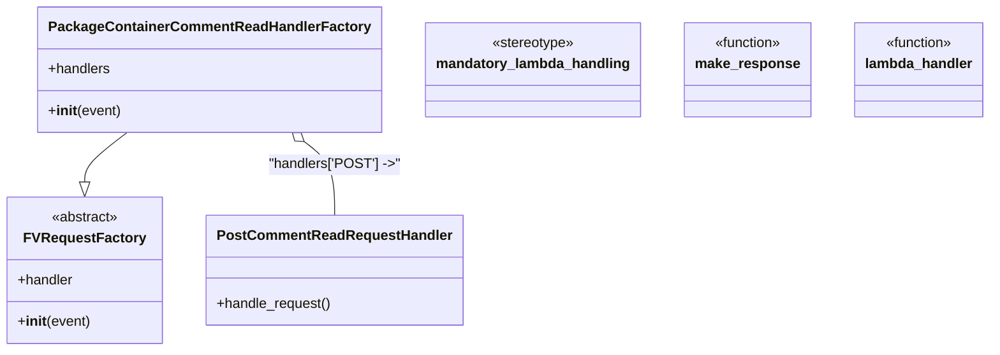

# Diagram: partview_core/partview_service/partview_service/api/comments/package_container_read.py


> Auto-generated by Obscura crawlers

## Diagram 1



> SVG rendering failed for this diagram.

## Diagram 2

```mermaid
flowchart LR
    A[lambda_handler(event, context, audit_refs)] --> B[PackageContainerCommentReadHandlerFactory(event)]
    B --> C[request_handler = .handler]
    C --> D[request_handler.handle_request()]
    D --> E[package_container_comment_read_data, http_code]
    E --> F[make_response(package_container_comment_read_data, http_code)]
    A -.decorated by .-> G[mandatory_lambda_handling decorator]
    G --> A
```

> SVG rendering failed for this diagram.
