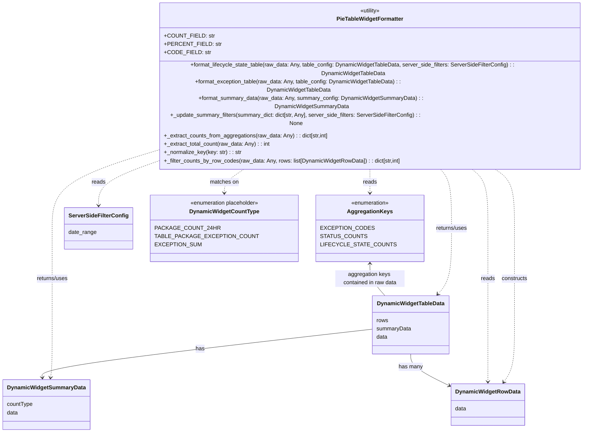

# Diagram: partview_core/partview_service/partview_service/api/dashboard/dynamic_widget/formatters/pie_table_widget_formatter.py

> Auto-generated by Obscura crawlers

## Mermaid

### SVG

<svg id="container" width="1614.7265625" xmlns="http://www.w3.org/2000/svg" class="classDiagram" height="1150" viewBox="0 0 1614.7265625 1150" role="graphics-document document" aria-roledescription="class"><g><defs><marker id="container_class-aggregationStart" class="marker aggregation class" refX="18" refY="7" markerWidth="190" markerHeight="240" orient="auto"><path d="M 18,7 L9,13 L1,7 L9,1 Z"></path></marker></defs><defs><marker id="container_class-aggregationEnd" class="marker aggregation class" refX="1" refY="7" markerWidth="20" markerHeight="28" orient="auto"><path d="M 18,7 L9,13 L1,7 L9,1 Z"></path></marker></defs><defs><marker id="container_class-extensionStart" class="marker extension class" refX="18" refY="7" markerWidth="190" markerHeight="240" orient="auto"><path d="M 1,7 L18,13 V 1 Z"></path></marker></defs><defs><marker id="container_class-extensionEnd" class="marker extension class" refX="1" refY="7" markerWidth="20" markerHeight="28" orient="auto"><path d="M 1,1 V 13 L18,7 Z"></path></marker></defs><defs><marker id="container_class-compositionStart" class="marker composition class" refX="18" refY="7" markerWidth="190" markerHeight="240" orient="auto"><path d="M 18,7 L9,13 L1,7 L9,1 Z"></path></marker></defs><defs><marker id="container_class-compositionEnd" class="marker composition class" refX="1" refY="7" markerWidth="20" markerHeight="28" orient="auto"><path d="M 18,7 L9,13 L1,7 L9,1 Z"></path></marker></defs><defs><marker id="container_class-dependencyStart" class="marker dependency class" refX="6" refY="7" markerWidth="190" markerHeight="240" orient="auto"><path d="M 5,7 L9,13 L1,7 L9,1 Z"></path></marker></defs><defs><marker id="container_class-dependencyEnd" class="marker dependency class" refX="13" refY="7" markerWidth="20" markerHeight="28" orient="auto"><path d="M 18,7 L9,13 L14,7 L9,1 Z"></path></marker></defs><defs><marker id="container_class-lollipopStart" class="marker lollipop class" refX="13" refY="7" markerWidth="190" markerHeight="240" orient="auto"><circle stroke="black" fill="transparent" cx="7" cy="7" r="6"></circle></marker></defs><defs><marker id="container_class-lollipopEnd" class="marker lollipop class" refX="1" refY="7" markerWidth="190" markerHeight="240" orient="auto"><circle stroke="black" fill="transparent" cx="7" cy="7" r="6"></circle></marker></defs><g class="root"><g class="clusters"></g><g class="edgePaths"><path d="M985.969,392L985.969,398.167C985.969,404.333,985.969,416.667,985.969,428C985.969,439.333,985.969,449.667,985.969,454.833L985.969,460" id="id_PieTableWidgetFormatter_AggregationKeys_1" class="edge-thickness-normal edge-pattern-dashed relation" style=";;;" data-edge="true" data-et="edge" data-id="id_PieTableWidgetFormatter_AggregationKeys_1" data-points="W3sieCI6OTg1Ljk2ODc1LCJ5IjozOTJ9LHsieCI6OTg1Ljk2ODc1LCJ5Ijo0Mjl9LHsieCI6OTg1Ljk2ODc1LCJ5Ijo0NjZ9XQ==" marker-end="url(#container_class-dependencyEnd)"></path><path d="M1168.229,392L1174.082,398.167C1179.936,404.333,1191.644,416.667,1197.498,445C1203.352,473.333,1203.352,517.667,1203.352,564C1203.352,610.333,1203.352,658.667,1197.31,690.226C1191.269,721.785,1179.187,736.569,1173.145,743.962L1167.104,751.354" id="id_PieTableWidgetFormatter_DynamicWidgetTableData_2" class="edge-thickness-normal edge-pattern-dashed relation" style=";;;" data-edge="true" data-et="edge" data-id="id_PieTableWidgetFormatter_DynamicWidgetTableData_2" data-points="W3sieCI6MTE2OC4yMjg1NzUzMjc1MTEsInkiOjM5Mn0seyJ4IjoxMjAzLjM1MTU2MjUsInkiOjQyOX0seyJ4IjoxMjAzLjM1MTU2MjUsInkiOjU2Mn0seyJ4IjoxMjAzLjM1MTU2MjUsInkiOjcwN30seyJ4IjoxMTYzLjMwNzM2MDE5NzM2ODMsInkiOjc1Nn1d" marker-end="url(#container_class-dependencyEnd)"></path><path d="M1321.754,392L1332.539,398.167C1343.324,404.333,1364.893,416.667,1375.678,445C1386.463,473.333,1386.463,517.667,1386.463,564C1386.463,610.333,1386.463,658.667,1386.463,705C1386.463,751.333,1386.463,795.667,1386.463,838C1386.463,880.333,1386.463,920.667,1381.211,948.186C1375.959,975.706,1365.456,990.412,1360.204,997.765L1354.953,1005.117" id="id_PieTableWidgetFormatter_DynamicWidgetRowData_3" class="edge-thickness-normal edge-pattern-dashed relation" style=";;;" data-edge="true" data-et="edge" data-id="id_PieTableWidgetFormatter_DynamicWidgetRowData_3" data-points="W3sieCI6MTMyMS43NTQyMzAzNDkzNDUsInkiOjM5Mn0seyJ4IjoxMzg2LjQ2Mjg5MDYyNSwieSI6NDI5fSx7IngiOjEzODYuNDYyODkwNjI1LCJ5Ijo1NjJ9LHsieCI6MTM4Ni40NjI4OTA2MjUsInkiOjcwN30seyJ4IjoxMzg2LjQ2Mjg5MDYyNSwieSI6ODQwfSx7IngiOjEzODYuNDYyODkwNjI1LCJ5Ijo5NjF9LHsieCI6MTM1MS40NjUzOTkyMjU5MTc1LCJ5IjoxMDEwfV0=" marker-end="url(#container_class-dependencyEnd)"></path><path d="M365.211,368.919L328.413,378.933C291.615,388.946,218.018,408.973,181.22,441.153C144.422,473.333,144.422,517.667,144.422,564C144.422,610.333,144.422,658.667,144.422,705C144.422,751.333,144.422,795.667,144.422,838C144.422,880.333,144.422,920.667,143.645,946.011C142.868,971.355,141.315,981.711,140.538,986.889L139.761,992.066" id="id_PieTableWidgetFormatter_DynamicWidgetSummaryData_4" class="edge-thickness-normal edge-pattern-dashed relation" style=";;;" data-edge="true" data-et="edge" data-id="id_PieTableWidgetFormatter_DynamicWidgetSummaryData_4" data-points="W3sieCI6MzY1LjIxMDkzNzUsInkiOjM2OC45MTkzMzU2NzI3NzUyfSx7IngiOjE0NC40MjE4NzUsInkiOjQyOX0seyJ4IjoxNDQuNDIxODc1LCJ5Ijo1NjJ9LHsieCI6MTQ0LjQyMTg3NSwieSI6NzA3fSx7IngiOjE0NC40MjE4NzUsInkiOjg0MH0seyJ4IjoxNDQuNDIxODc1LCJ5Ijo5NjF9LHsieCI6MTM4Ljg3MTM0NDYxMDA5MTc0LCJ5Ijo5OTh9XQ==" marker-end="url(#container_class-dependencyEnd)"></path><path d="M388.307,392L369.111,398.167C349.916,404.333,311.524,416.667,292.329,434C273.133,451.333,273.133,473.667,273.133,484.833L273.133,496" id="id_PieTableWidgetFormatter_ServerSideFilterConfig_5" class="edge-thickness-normal edge-pattern-dashed relation" style=";;;" data-edge="true" data-et="edge" data-id="id_PieTableWidgetFormatter_ServerSideFilterConfig_5" data-points="W3sieCI6Mzg4LjMwNzE3Nzk0NzU5ODIzLCJ5IjozOTJ9LHsieCI6MjczLjEzMjgxMjUsInkiOjQyOX0seyJ4IjoyNzMuMTMyODEyNSwieSI6NTAyfV0=" marker-end="url(#container_class-dependencyEnd)"></path><path d="M669.534,392L659.371,398.167C649.208,404.333,628.881,416.667,618.718,428C608.555,439.333,608.555,449.667,608.555,454.833L608.555,460" id="id_PieTableWidgetFormatter_DynamicWidgetCountType_6" class="edge-thickness-normal edge-pattern-dashed relation" style=";;;" data-edge="true" data-et="edge" data-id="id_PieTableWidgetFormatter_DynamicWidgetCountType_6" data-points="W3sieCI6NjY5LjUzNDI1MjE4MzQwNjEsInkiOjM5Mn0seyJ4Ijo2MDguNTU0Njg3NSwieSI6NDI5fSx7IngiOjYwOC41NTQ2ODc1LCJ5Ijo0NjZ9XQ==" marker-end="url(#container_class-dependencyEnd)"></path><path d="M1256.481,392L1265.17,398.167C1273.858,404.333,1291.235,416.667,1299.923,445C1308.611,473.333,1308.611,517.667,1308.611,564C1308.611,610.333,1308.611,658.667,1308.611,705C1308.611,751.333,1308.611,795.667,1308.611,838C1308.611,880.333,1308.611,920.667,1308.611,948C1308.611,975.333,1308.611,989.667,1308.611,996.833L1308.611,1004" id="id_PieTableWidgetFormatter_DynamicWidgetRowData_7" class="edge-thickness-normal edge-pattern-dashed relation" style=";;;" data-edge="true" data-et="edge" data-id="id_PieTableWidgetFormatter_DynamicWidgetRowData_7" data-points="W3sieCI6MTI1Ni40ODEzMDQ1ODUxNTI5LCJ5IjozOTJ9LHsieCI6MTMwOC42MTEzMjgxMjUsInkiOjQyOX0seyJ4IjoxMzA4LjYxMTMyODEyNSwieSI6NTYyfSx7IngiOjEzMDguNjExMzI4MTI1LCJ5Ijo3MDd9LHsieCI6MTMwOC42MTEzMjgxMjUsInkiOjg0MH0seyJ4IjoxMzA4LjYxMTMyODEyNSwieSI6OTYxfSx7IngiOjEzMDguNjExMzI4MTI1LCJ5IjoxMDEwfV0=" marker-end="url(#container_class-dependencyEnd)"></path><path d="M985.969,664L985.969,671.167C985.969,678.333,985.969,692.667,992.643,708C999.317,723.333,1012.665,739.667,1019.339,747.833L1026.013,756" id="id_AggregationKeys_DynamicWidgetTableData_8" class="edge-thickness-normal edge-pattern-solid relation" style=";;;" data-edge="true" data-et="edge" data-id="id_AggregationKeys_DynamicWidgetTableData_8" data-points="W3sieCI6OTg1Ljk2ODc1LCJ5Ijo2NTh9LHsieCI6OTg1Ljk2ODc1LCJ5Ijo3MDd9LHsieCI6MTAyNi4wMTI5NTIzMDI2MzE3LCJ5Ijo3NTZ9XQ==" marker-start="url(#container_class-dependencyStart)"></path><path d="M985.82,853.398L840.137,871.332C694.453,889.265,403.086,925.133,258.179,948.244C113.272,971.355,114.826,981.711,115.602,986.889L116.379,992.066" id="id_DynamicWidgetTableData_DynamicWidgetSummaryData_9" class="edge-thickness-normal edge-pattern-solid relation" style=";;;" data-edge="true" data-et="edge" data-id="id_DynamicWidgetTableData_DynamicWidgetSummaryData_9" data-points="W3sieCI6OTg1LjgyMDMxMjUsInkiOjg1My4zOTgxNzUxMjAxMTU0fSx7IngiOjExMS43MTg3NSwieSI6OTYxfSx7IngiOjExNy4yNjkyODAzODk5MDgyNiwieSI6OTk4fV0=" marker-end="url(#container_class-dependencyEnd)"></path><path d="M1094.66,924L1094.66,930.167C1094.66,936.333,1094.66,948.667,1112.571,963.958C1130.482,979.25,1166.303,997.499,1184.214,1006.624L1202.125,1015.749" id="id_DynamicWidgetTableData_DynamicWidgetRowData_10" class="edge-thickness-normal edge-pattern-solid relation" style=";;;" data-edge="true" data-et="edge" data-id="id_DynamicWidgetTableData_DynamicWidgetRowData_10" data-points="W3sieCI6MTA5NC42NjAxNTYyNSwieSI6OTI0fSx7IngiOjEwOTQuNjYwMTU2MjUsInkiOjk2MX0seyJ4IjoxMjA3LjQ3MDcwMzEyNSwieSI6MTAxOC40NzI2OTEwODkzNDM5fV0=" marker-end="url(#container_class-dependencyEnd)"></path></g><g class="edgeLabels"><g class="edgeLabel" transform="translate(985.96875, 429)"><g class="label" data-id="id_PieTableWidgetFormatter_AggregationKeys_1" transform="translate(-20.0078125, -12)"><foreignObject width="40.015625" height="24">

reads

</foreignObject></g></g><g class="edgeLabel" transform="translate(1203.3515625, 562)"><g class="label" data-id="id_PieTableWidgetFormatter_DynamicWidgetTableData_2" transform="translate(-46.6796875, -12)"><foreignObject width="93.359375" height="24">

returns/uses

</foreignObject></g></g><g class="edgeLabel" transform="translate(1386.462890625, 707)"><g class="label" data-id="id_PieTableWidgetFormatter_DynamicWidgetRowData_3" transform="translate(-37.84375, -12)"><foreignObject width="75.6875" height="24">

constructs

</foreignObject></g></g><g class="edgeLabel" transform="translate(144.421875, 707)"><g class="label" data-id="id_PieTableWidgetFormatter_DynamicWidgetSummaryData_4" transform="translate(-46.6796875, -12)"><foreignObject width="93.359375" height="24">

returns/uses

</foreignObject></g></g><g class="edgeLabel" transform="translate(273.1328125, 429)"><g class="label" data-id="id_PieTableWidgetFormatter_ServerSideFilterConfig_5" transform="translate(-20.0078125, -12)"><foreignObject width="40.015625" height="24">

reads

</foreignObject></g></g><g class="edgeLabel" transform="translate(608.5546875, 429)"><g class="label" data-id="id_PieTableWidgetFormatter_DynamicWidgetCountType_6" transform="translate(-42.0703125, -12)"><foreignObject width="84.140625" height="24">

matches on

</foreignObject></g></g><g class="edgeLabel" transform="translate(1308.611328125, 707)"><g class="label" data-id="id_PieTableWidgetFormatter_DynamicWidgetRowData_7" transform="translate(-20.0078125, -12)"><foreignObject width="40.015625" height="24">

reads

</foreignObject></g></g><g class="edgeLabel" transform="translate(985.96875, 707)"><g class="label" data-id="id_AggregationKeys_DynamicWidgetTableData_8" transform="translate(-100, -24)"><foreignObject width="200" height="48">

aggregation keys contained in raw data

</foreignObject></g></g><g class="edgeLabel" transform="translate(530.20267, 909.48467)"><g class="label" data-id="id_DynamicWidgetTableData_DynamicWidgetSummaryData_9" transform="translate(-12.703125, -12)"><foreignObject width="25.40625" height="24">

has

</foreignObject></g></g><g class="edgeLabel" transform="translate(1094.66015625, 961)"><g class="label" data-id="id_DynamicWidgetTableData_DynamicWidgetRowData_10" transform="translate(-34.59375, -12)"><foreignObject width="69.1875" height="24">

has many

</foreignObject></g></g></g><g class="nodes"><g class="node default" id="classId-AggregationKeys-0" transform="translate(985.96875, 562)"><g class="basic label-container"><path d="M-135.703125 -96 L135.703125 -96 L135.703125 96 L-135.703125 96" stroke="none" stroke-width="0" fill="#ECECFF" style=""></path><path d="M-135.703125 -96 C-39.17047566579107 -96, 57.36217366841785 -96, 135.703125 -96 M-135.703125 -96 C-64.72311932326143 -96, 6.256886353477142 -96, 135.703125 -96 M135.703125 -96 C135.703125 -50.72473974073504, 135.703125 -5.449479481470078, 135.703125 96 M135.703125 -96 C135.703125 -47.80112307163489, 135.703125 0.397753856730219, 135.703125 96 M135.703125 96 C75.37110145804641 96, 15.039077916092808 96, -135.703125 96 M135.703125 96 C42.4942519358533 96, -50.7146211282934 96, -135.703125 96 M-135.703125 96 C-135.703125 33.5494190914359, -135.703125 -28.901161817128198, -135.703125 -96 M-135.703125 96 C-135.703125 52.86041487605871, -135.703125 9.720829752117425, -135.703125 -96" stroke="#9370DB" stroke-width="1.3" fill="none" stroke-dasharray="0 0" style=""></path></g><g class="annotation-group text" transform="translate(-55.5546875, -72)"><g class="label" style="" transform="translate(0,-12)"><foreignObject width="111.109375" height="24">

«enumeration»

</foreignObject></g></g><g class="label-group text" transform="translate(-61.375, -48)"><g class="label" style="font-weight: bolder" transform="translate(0,-12)"><foreignObject width="122.75" height="24">

AggregationKeys

</foreignObject></g></g><g class="members-group text" transform="translate(-123.703125, 0)"><g class="label" style="" transform="translate(0,-12)"><foreignObject width="133.203125" height="24">

EXCEPTION_CODES

</foreignObject></g><g class="label" style="" transform="translate(0,12)"><foreignObject width="116.796875" height="24">

STATUS_COUNTS

</foreignObject></g><g class="label" style="" transform="translate(0,36)"><foreignObject width="186.03125" height="24">

LIFECYCLE_STATE_COUNTS

</foreignObject></g></g><g class="methods-group text" transform="translate(-123.703125, 96)"></g><g class="divider" style=""><path d="M-135.703125 -24 C-34.18477639464031 -24, 67.33357221071938 -24, 135.703125 -24 M-135.703125 -24 C-50.75836521666527 -24, 34.18639456666946 -24, 135.703125 -24" stroke="#9370DB" stroke-width="1.3" fill="none" stroke-dasharray="0 0" style=""></path></g><g class="divider" style=""><path d="M-135.703125 72 C-53.98210603848928 72, 27.738912923021445 72, 135.703125 72 M-135.703125 72 C-80.69923039610205 72, -25.69533579220409 72, 135.703125 72" stroke="#9370DB" stroke-width="1.3" fill="none" stroke-dasharray="0 0" style=""></path></g></g><g class="node default" id="classId-PieTableWidgetFormatter-1" transform="translate(985.96875, 200)"><g class="basic label-container"><path d="M-620.7578125 -192 L620.7578125 -192 L620.7578125 192 L-620.7578125 192" stroke="none" stroke-width="0" fill="#ECECFF" style=""></path><path d="M-620.7578125 -192 C-358.370272507626 -192, -95.982732515252 -192, 620.7578125 -192 M-620.7578125 -192 C-223.72062195892914 -192, 173.3165685821417 -192, 620.7578125 -192 M620.7578125 -192 C620.7578125 -66.71539904153529, 620.7578125 58.569201916929416, 620.7578125 192 M620.7578125 -192 C620.7578125 -66.07397338642895, 620.7578125 59.85205322714211, 620.7578125 192 M620.7578125 192 C212.86284192003143 192, -195.03212865993714 192, -620.7578125 192 M620.7578125 192 C153.28316556434226 192, -314.1914813713155 192, -620.7578125 192 M-620.7578125 192 C-620.7578125 74.71575463976747, -620.7578125 -42.568490720465064, -620.7578125 -192 M-620.7578125 192 C-620.7578125 89.26580637164447, -620.7578125 -13.468387256711054, -620.7578125 -192" stroke="#9370DB" stroke-width="1.3" fill="none" stroke-dasharray="0 0" style=""></path></g><g class="annotation-group text" transform="translate(-30.3125, -168)"><g class="label" style="" transform="translate(0,-12)"><foreignObject width="60.625" height="24">

«utility»

</foreignObject></g></g><g class="label-group text" transform="translate(-93.171875, -144)"><g class="label" style="font-weight: bolder" transform="translate(0,-12)"><foreignObject width="186.34375" height="24">

PieTableWidgetFormatter

</foreignObject></g></g><g class="members-group text" transform="translate(-608.7578125, -96)"><g class="label" style="" transform="translate(0,-12)"><foreignObject width="131.921875" height="24">

+COUNT_FIELD: str

</foreignObject></g><g class="label" style="" transform="translate(0,12)"><foreignObject width="146.53125" height="24">

+PERCENT_FIELD: str

</foreignObject></g><g class="label" style="" transform="translate(0,36)"><foreignObject width="121.796875" height="24">

+CODE_FIELD: str

</foreignObject></g></g><g class="methods-group text" transform="translate(-608.7578125, 0)"><g class="label" style="" transform="translate(0,-12)"><foreignObject width="1124.34375" height="24">

+format_lifecycle_state_table(raw_data: Any, table_config: DynamicWidgetTableData, server_side_filters: ServerSideFilterConfig) : : DynamicWidgetTableData

</foreignObject></g><g class="label" style="" transform="translate(0,12)"><foreignObject width="784.1875" height="24">

+format_exception_table(raw_data: Any, table_config: DynamicWidgetTableData) : : DynamicWidgetTableData

</foreignObject></g><g class="label" style="" transform="translate(0,36)"><foreignObject width="863.671875" height="24">

+format_summary_data(raw_data: Any, summary_config: DynamicWidgetSummaryData) : : DynamicWidgetSummaryData

</foreignObject></g><g class="label" style="" transform="translate(0,60)"><foreignObject width="767.109375" height="24">

+_update_summary_filters(summary_dict: dict[str, Any], server_side_filters: ServerSideFilterConfig) : : None

</foreignObject></g><g class="label" style="" transform="translate(0,84)"><foreignObject width="474.5625" height="24">

+_extract_counts_from_aggregations(raw_data: Any) : : dict[str,int]

</foreignObject></g><g class="label" style="" transform="translate(0,108)"><foreignObject width="306.328125" height="24">

+_extract_total_count(raw_data: Any) : : int

</foreignObject></g><g class="label" style="" transform="translate(0,132)"><foreignObject width="221.890625" height="24">

+_normalize_key(key: str) : : str

</foreignObject></g><g class="label" style="" transform="translate(0,156)"><foreignObject width="682.65625" height="24">

+_filter_counts_by_row_codes(raw_data: Any, rows: list[DynamicWidgetRowData]) : : dict[str,int]

</foreignObject></g></g><g class="divider" style=""><path d="M-620.7578125 -120 C-176.0487217786424 -120, 268.6603689427152 -120, 620.7578125 -120 M-620.7578125 -120 C-318.47649160373595 -120, -16.195170707471902 -120, 620.7578125 -120" stroke="#9370DB" stroke-width="1.3" fill="none" stroke-dasharray="0 0" style=""></path></g><g class="divider" style=""><path d="M-620.7578125 -24 C-275.4249951639423 -24, 69.9078221721154 -24, 620.7578125 -24 M-620.7578125 -24 C-142.33222227570656 -24, 336.0933679485869 -24, 620.7578125 -24" stroke="#9370DB" stroke-width="1.3" fill="none" stroke-dasharray="0 0" style=""></path></g></g><g class="node default" id="classId-DynamicWidgetTableData-2" transform="translate(1094.66015625, 840)"><g class="basic label-container"><path d="M-108.83984375 -84 L108.83984375 -84 L108.83984375 84 L-108.83984375 84" stroke="none" stroke-width="0" fill="#ECECFF" style=""></path><path d="M-108.83984375 -84 C-48.83878376070545 -84, 11.162276228589107 -84, 108.83984375 -84 M-108.83984375 -84 C-45.553554207669116 -84, 17.73273533466177 -84, 108.83984375 -84 M108.83984375 -84 C108.83984375 -27.368909023353012, 108.83984375 29.262181953293975, 108.83984375 84 M108.83984375 -84 C108.83984375 -18.84332811417012, 108.83984375 46.31334377165976, 108.83984375 84 M108.83984375 84 C48.140566035077605 84, -12.55871167984479 84, -108.83984375 84 M108.83984375 84 C22.734306321427454 84, -63.37123110714509 84, -108.83984375 84 M-108.83984375 84 C-108.83984375 33.21630160897295, -108.83984375 -17.567396782054104, -108.83984375 -84 M-108.83984375 84 C-108.83984375 49.620130969211935, -108.83984375 15.24026193842387, -108.83984375 -84" stroke="#9370DB" stroke-width="1.3" fill="none" stroke-dasharray="0 0" style=""></path></g><g class="annotation-group text" transform="translate(0, -60)"></g><g class="label-group text" transform="translate(-93.4921875, -60)"><g class="label" style="font-weight: bolder" transform="translate(0,-12)"><foreignObject width="186.984375" height="24">

DynamicWidgetTableData

</foreignObject></g></g><g class="members-group text" transform="translate(-96.83984375, -12)"><g class="label" style="" transform="translate(0,-12)"><foreignObject width="33.984375" height="24">

rows

</foreignObject></g><g class="label" style="" transform="translate(0,12)"><foreignObject width="100.1875" height="24">

summaryData

</foreignObject></g><g class="label" style="" transform="translate(0,36)"><foreignObject width="32.640625" height="24">

data

</foreignObject></g></g><g class="methods-group text" transform="translate(-96.83984375, 84)"></g><g class="divider" style=""><path d="M-108.83984375 -36 C-38.30670556142806 -36, 32.22643262714388 -36, 108.83984375 -36 M-108.83984375 -36 C-52.73221218646557 -36, 3.375419377068866 -36, 108.83984375 -36" stroke="#9370DB" stroke-width="1.3" fill="none" stroke-dasharray="0 0" style=""></path></g><g class="divider" style=""><path d="M-108.83984375 60 C-32.940832786493516 60, 42.95817817701297 60, 108.83984375 60 M-108.83984375 60 C-41.08115013882954 60, 26.677543472340915 60, 108.83984375 60" stroke="#9370DB" stroke-width="1.3" fill="none" stroke-dasharray="0 0" style=""></path></g></g><g class="node default" id="classId-DynamicWidgetRowData-3" transform="translate(1308.611328125, 1070)"><g class="basic label-container"><path d="M-101.140625 -60 L101.140625 -60 L101.140625 60 L-101.140625 60" stroke="none" stroke-width="0" fill="#ECECFF" style=""></path><path d="M-101.140625 -60 C-28.033400111834297 -60, 45.073824776331406 -60, 101.140625 -60 M-101.140625 -60 C-45.99307792075689 -60, 9.154469158486222 -60, 101.140625 -60 M101.140625 -60 C101.140625 -12.923182973560529, 101.140625 34.15363405287894, 101.140625 60 M101.140625 -60 C101.140625 -28.936269750656397, 101.140625 2.1274604986872063, 101.140625 60 M101.140625 60 C25.49898868276283 60, -50.14264763447434 60, -101.140625 60 M101.140625 60 C44.614189431472845 60, -11.91224613705431 60, -101.140625 60 M-101.140625 60 C-101.140625 15.653543501220973, -101.140625 -28.692912997558054, -101.140625 -60 M-101.140625 60 C-101.140625 29.627797613718666, -101.140625 -0.7444047725626675, -101.140625 -60" stroke="#9370DB" stroke-width="1.3" fill="none" stroke-dasharray="0 0" style=""></path></g><g class="annotation-group text" transform="translate(0, -36)"></g><g class="label-group text" transform="translate(-89.140625, -36)"><g class="label" style="font-weight: bolder" transform="translate(0,-12)"><foreignObject width="178.28125" height="24">

DynamicWidgetRowData

</foreignObject></g></g><g class="members-group text" transform="translate(-89.140625, 12)"><g class="label" style="" transform="translate(0,-12)"><foreignObject width="32.640625" height="24">

data

</foreignObject></g></g><g class="methods-group text" transform="translate(-89.140625, 60)"></g><g class="divider" style=""><path d="M-101.140625 -12 C-54.771023137413906 -12, -8.401421274827811 -12, 101.140625 -12 M-101.140625 -12 C-48.83584764744147 -12, 3.4689297051170627 -12, 101.140625 -12" stroke="#9370DB" stroke-width="1.3" fill="none" stroke-dasharray="0 0" style=""></path></g><g class="divider" style=""><path d="M-101.140625 36 C-51.60259187364753 36, -2.0645587472950666 36, 101.140625 36 M-101.140625 36 C-39.300603215064264 36, 22.539418569871472 36, 101.140625 36" stroke="#9370DB" stroke-width="1.3" fill="none" stroke-dasharray="0 0" style=""></path></g></g><g class="node default" id="classId-DynamicWidgetSummaryData-4" transform="translate(128.0703125, 1070)"><g class="basic label-container"><path d="M-120.0703125 -72 L120.0703125 -72 L120.0703125 72 L-120.0703125 72" stroke="none" stroke-width="0" fill="#ECECFF" style=""></path><path d="M-120.0703125 -72 C-33.32457619181527 -72, 53.421160116369464 -72, 120.0703125 -72 M-120.0703125 -72 C-65.13061721491842 -72, -10.190921929836833 -72, 120.0703125 -72 M120.0703125 -72 C120.0703125 -16.198892199780367, 120.0703125 39.602215600439266, 120.0703125 72 M120.0703125 -72 C120.0703125 -37.894958496724115, 120.0703125 -3.78991699344823, 120.0703125 72 M120.0703125 72 C31.547767564874334 72, -56.97477737025133 72, -120.0703125 72 M120.0703125 72 C25.960173322111388 72, -68.14996585577722 72, -120.0703125 72 M-120.0703125 72 C-120.0703125 33.63673713342007, -120.0703125 -4.7265257331598605, -120.0703125 -72 M-120.0703125 72 C-120.0703125 26.565069519138596, -120.0703125 -18.869860961722807, -120.0703125 -72" stroke="#9370DB" stroke-width="1.3" fill="none" stroke-dasharray="0 0" style=""></path></g><g class="annotation-group text" transform="translate(0, -48)"></g><g class="label-group text" transform="translate(-108.0703125, -48)"><g class="label" style="font-weight: bolder" transform="translate(0,-12)"><foreignObject width="216.140625" height="24">

DynamicWidgetSummaryData

</foreignObject></g></g><g class="members-group text" transform="translate(-108.0703125, 0)"><g class="label" style="" transform="translate(0,-12)"><foreignObject width="74.875" height="24">

countType

</foreignObject></g><g class="label" style="" transform="translate(0,12)"><foreignObject width="32.640625" height="24">

data

</foreignObject></g></g><g class="methods-group text" transform="translate(-108.0703125, 72)"></g><g class="divider" style=""><path d="M-120.0703125 -24 C-49.98991330441768 -24, 20.090485891164633 -24, 120.0703125 -24 M-120.0703125 -24 C-61.2156140906373 -24, -2.360915681274605 -24, 120.0703125 -24" stroke="#9370DB" stroke-width="1.3" fill="none" stroke-dasharray="0 0" style=""></path></g><g class="divider" style=""><path d="M-120.0703125 48 C-31.646163272917192 48, 56.777985954165615 48, 120.0703125 48 M-120.0703125 48 C-38.98068544266873 48, 42.10894161466254 48, 120.0703125 48" stroke="#9370DB" stroke-width="1.3" fill="none" stroke-dasharray="0 0" style=""></path></g></g><g class="node default" id="classId-ServerSideFilterConfig-5" transform="translate(273.1328125, 562)"><g class="basic label-container"><path d="M-93.7109375 -60 L93.7109375 -60 L93.7109375 60 L-93.7109375 60" stroke="none" stroke-width="0" fill="#ECECFF" style=""></path><path d="M-93.7109375 -60 C-51.397840028745385 -60, -9.08474255749077 -60, 93.7109375 -60 M-93.7109375 -60 C-48.768379499901776 -60, -3.8258214998035527 -60, 93.7109375 -60 M93.7109375 -60 C93.7109375 -18.26573977237031, 93.7109375 23.46852045525938, 93.7109375 60 M93.7109375 -60 C93.7109375 -16.963556534508385, 93.7109375 26.07288693098323, 93.7109375 60 M93.7109375 60 C34.08392575993841 60, -25.54308598012318 60, -93.7109375 60 M93.7109375 60 C24.94536048852956 60, -43.82021652294088 60, -93.7109375 60 M-93.7109375 60 C-93.7109375 32.06705331772849, -93.7109375 4.134106635456973, -93.7109375 -60 M-93.7109375 60 C-93.7109375 12.61421350221655, -93.7109375 -34.7715729955669, -93.7109375 -60" stroke="#9370DB" stroke-width="1.3" fill="none" stroke-dasharray="0 0" style=""></path></g><g class="annotation-group text" transform="translate(0, -36)"></g><g class="label-group text" transform="translate(-81.7109375, -36)"><g class="label" style="font-weight: bolder" transform="translate(0,-12)"><foreignObject width="163.421875" height="24">

ServerSideFilterConfig

</foreignObject></g></g><g class="members-group text" transform="translate(-81.7109375, 12)"><g class="label" style="" transform="translate(0,-12)"><foreignObject width="81.015625" height="24">

date_range

</foreignObject></g></g><g class="methods-group text" transform="translate(-81.7109375, 60)"></g><g class="divider" style=""><path d="M-93.7109375 -12 C-37.1653216755559 -12, 19.380294148888197 -12, 93.7109375 -12 M-93.7109375 -12 C-36.07753330878251 -12, 21.555870882434974 -12, 93.7109375 -12" stroke="#9370DB" stroke-width="1.3" fill="none" stroke-dasharray="0 0" style=""></path></g><g class="divider" style=""><path d="M-93.7109375 36 C-54.74273733699577 36, -15.774537173991547 36, 93.7109375 36 M-93.7109375 36 C-20.847039353228737 36, 52.016858793542525 36, 93.7109375 36" stroke="#9370DB" stroke-width="1.3" fill="none" stroke-dasharray="0 0" style=""></path></g></g><g class="node default" id="classId-DynamicWidgetCountType-6" transform="translate(608.5546875, 562)"><g class="basic label-container"><path d="M-191.7109375 -96 L191.7109375 -96 L191.7109375 96 L-191.7109375 96" stroke="none" stroke-width="0" fill="#ECECFF" style=""></path><path d="M-191.7109375 -96 C-96.98410668002036 -96, -2.2572758600407212 -96, 191.7109375 -96 M-191.7109375 -96 C-40.617719759976836 -96, 110.47549798004633 -96, 191.7109375 -96 M191.7109375 -96 C191.7109375 -24.5746668293268, 191.7109375 46.8506663413464, 191.7109375 96 M191.7109375 -96 C191.7109375 -54.810307068391396, 191.7109375 -13.620614136782791, 191.7109375 96 M191.7109375 96 C111.56439229834021 96, 31.41784709668042 96, -191.7109375 96 M191.7109375 96 C83.62649589228775 96, -24.4579457154245 96, -191.7109375 96 M-191.7109375 96 C-191.7109375 30.13737435705427, -191.7109375 -35.72525128589146, -191.7109375 -96 M-191.7109375 96 C-191.7109375 51.16244186534121, -191.7109375 6.324883730682416, -191.7109375 -96" stroke="#9370DB" stroke-width="1.3" fill="none" stroke-dasharray="0 0" style=""></path></g><g class="annotation-group text" transform="translate(-100.921875, -72)"><g class="label" style="" transform="translate(0,-12)"><foreignObject width="201.84375" height="24">

«enumeration placeholder»

</foreignObject></g></g><g class="label-group text" transform="translate(-95.5, -48)"><g class="label" style="font-weight: bolder" transform="translate(0,-12)"><foreignObject width="191" height="24">

DynamicWidgetCountType

</foreignObject></g></g><g class="members-group text" transform="translate(-179.7109375, 0)"><g class="label" style="" transform="translate(0,-12)"><foreignObject width="164.671875" height="24">

PACKAGE_COUNT_24HR

</foreignObject></g><g class="label" style="" transform="translate(0,12)"><foreignObject width="258.5" height="24">

TABLE_PACKAGE_EXCEPTION_COUNT

</foreignObject></g><g class="label" style="" transform="translate(0,36)"><foreignObject width="118.15625" height="24">

EXCEPTION_SUM

</foreignObject></g></g><g class="methods-group text" transform="translate(-179.7109375, 96)"></g><g class="divider" style=""><path d="M-191.7109375 -24 C-41.85504681976977 -24, 108.00084386046046 -24, 191.7109375 -24 M-191.7109375 -24 C-78.09814621745691 -24, 35.51464506508617 -24, 191.7109375 -24" stroke="#9370DB" stroke-width="1.3" fill="none" stroke-dasharray="0 0" style=""></path></g><g class="divider" style=""><path d="M-191.7109375 72 C-40.54363696357095 72, 110.6236635728581 72, 191.7109375 72 M-191.7109375 72 C-96.55771827838457 72, -1.40449905676914 72, 191.7109375 72" stroke="#9370DB" stroke-width="1.3" fill="none" stroke-dasharray="0 0" style=""></path></g></g></g></g></g></svg>
