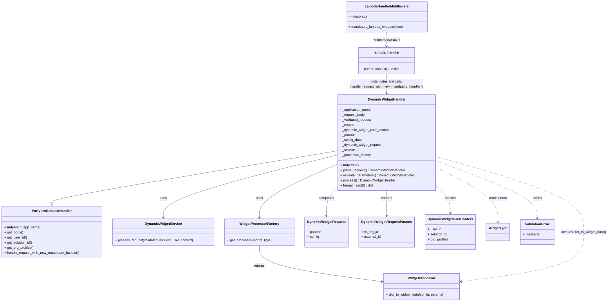

# Diagram: partview_core/partview_service/partview_service/api/dashboard/dynamic_widget/handler.py

> Auto-generated by Obscura crawlers

## Mermaid

### SVG

<svg id="container" width="2840.5078125" xmlns="http://www.w3.org/2000/svg" class="classDiagram" height="1434" viewBox="0 0 2840.5078125 1434" role="graphics-document document" aria-roledescription="class"><g><defs><marker id="container_class-aggregationStart" class="marker aggregation class" refX="18" refY="7" markerWidth="190" markerHeight="240" orient="auto"><path d="M 18,7 L9,13 L1,7 L9,1 Z"></path></marker></defs><defs><marker id="container_class-aggregationEnd" class="marker aggregation class" refX="1" refY="7" markerWidth="20" markerHeight="28" orient="auto"><path d="M 18,7 L9,13 L1,7 L9,1 Z"></path></marker></defs><defs><marker id="container_class-extensionStart" class="marker extension class" refX="18" refY="7" markerWidth="190" markerHeight="240" orient="auto"><path d="M 1,7 L18,13 V 1 Z"></path></marker></defs><defs><marker id="container_class-extensionEnd" class="marker extension class" refX="1" refY="7" markerWidth="20" markerHeight="28" orient="auto"><path d="M 1,1 V 13 L18,7 Z"></path></marker></defs><defs><marker id="container_class-compositionStart" class="marker composition class" refX="18" refY="7" markerWidth="190" markerHeight="240" orient="auto"><path d="M 18,7 L9,13 L1,7 L9,1 Z"></path></marker></defs><defs><marker id="container_class-compositionEnd" class="marker composition class" refX="1" refY="7" markerWidth="20" markerHeight="28" orient="auto"><path d="M 18,7 L9,13 L1,7 L9,1 Z"></path></marker></defs><defs><marker id="container_class-dependencyStart" class="marker dependency class" refX="6" refY="7" markerWidth="190" markerHeight="240" orient="auto"><path d="M 5,7 L9,13 L1,7 L9,1 Z"></path></marker></defs><defs><marker id="container_class-dependencyEnd" class="marker dependency class" refX="13" refY="7" markerWidth="20" markerHeight="28" orient="auto"><path d="M 18,7 L9,13 L14,7 L9,1 Z"></path></marker></defs><defs><marker id="container_class-lollipopStart" class="marker lollipop class" refX="13" refY="7" markerWidth="190" markerHeight="240" orient="auto"><circle stroke="black" fill="transparent" cx="7" cy="7" r="6"></circle></marker></defs><defs><marker id="container_class-lollipopEnd" class="marker lollipop class" refX="1" refY="7" markerWidth="190" markerHeight="240" orient="auto"><circle stroke="black" fill="transparent" cx="7" cy="7" r="6"></circle></marker></defs><g class="root"><g class="clusters"></g><g class="edgePaths"><path d="M1583.648,717.155L1361.036,754.796C1138.424,792.437,693.201,867.718,470.589,908.651C247.977,949.583,247.977,956.167,247.977,959.458L247.977,962.75" id="id_DynamicWidgetHandler_PartViewRequestHandler_1" class="edge-thickness-normal edge-pattern-solid relation" style=";;;" data-edge="true" data-et="edge" data-id="id_DynamicWidgetHandler_PartViewRequestHandler_1" data-points="W3sieCI6MTU4My42NDg0Mzc1LCJ5Ijo3MTcuMTU1NDg4MDkzNjM1OH0seyJ4IjoyNDcuOTc2NTYyNSwieSI6OTQzfSx7IngiOjI0Ny45NzY1NjI1LCJ5Ijo5ODB9XQ==" marker-end="url(#container_class-extensionEnd)"></path><path d="M1583.648,737.16L1449.361,771.466C1315.073,805.773,1046.497,874.387,912.21,923.86C777.922,973.333,777.922,1003.667,777.922,1018.833L777.922,1034" id="id_DynamicWidgetHandler_DynamicWidgetService_2" class="edge-thickness-normal edge-pattern-solid relation" style=";;;" data-edge="true" data-et="edge" data-id="id_DynamicWidgetHandler_DynamicWidgetService_2" data-points="W3sieCI6MTU4My42NDg0Mzc1LCJ5Ijo3MzcuMTU5NjYyMjgzMjc4M30seyJ4Ijo3NzcuOTIxODc1LCJ5Ijo5NDN9LHsieCI6Nzc3LjkyMTg3NSwieSI6MTA0MH1d" marker-end="url(#container_class-dependencyEnd)"></path><path d="M1583.648,782.874L1524.72,809.562C1465.792,836.249,1347.935,889.625,1289.007,931.479C1230.078,973.333,1230.078,1003.667,1230.078,1018.833L1230.078,1034" id="id_DynamicWidgetHandler_WidgetProcessorFactory_3" class="edge-thickness-normal edge-pattern-solid relation" style=";;;" data-edge="true" data-et="edge" data-id="id_DynamicWidgetHandler_WidgetProcessorFactory_3" data-points="W3sieCI6MTU4My42NDg0Mzc1LCJ5Ijo3ODIuODc0MTYyMTkzOTE3MX0seyJ4IjoxMjMwLjA3ODEyNSwieSI6OTQzfSx7IngiOjEyMzAuMDc4MTI1LCJ5IjoxMDQwfV0=" marker-end="url(#container_class-dependencyEnd)"></path><path d="M1583.648,901.798L1576.543,908.665C1569.438,915.532,1555.227,929.266,1548.121,949.8C1541.016,970.333,1541.016,997.667,1541.016,1011.333L1541.016,1025" id="id_DynamicWidgetHandler_DynamicWidgetRequest_4" class="edge-thickness-normal edge-pattern-solid relation" style=";;;" data-edge="true" data-et="edge" data-id="id_DynamicWidgetHandler_DynamicWidgetRequest_4" data-points="W3sieCI6MTU4My42NDg0Mzc1LCJ5Ijo5MDEuNzk4MDc5NjYyNjU4OX0seyJ4IjoxNTQxLjAxNTYyNSwieSI6OTQzfSx7IngiOjE1NDEuMDE1NjI1LCJ5IjoxMDMxfV0=" marker-end="url(#container_class-dependencyEnd)"></path><path d="M2046.789,890.305L2056.368,899.088C2065.948,907.87,2085.107,925.435,2094.686,945.884C2104.266,966.333,2104.266,989.667,2104.266,1001.333L2104.266,1013" id="id_DynamicWidgetHandler_DynamicWidgetUserContext_5" class="edge-thickness-normal edge-pattern-solid relation" style=";;;" data-edge="true" data-et="edge" data-id="id_DynamicWidgetHandler_DynamicWidgetUserContext_5" data-points="W3sieCI6MjA0Ni43ODkwNjI1LCJ5Ijo4OTAuMzA1MTI0NjAxMzI5OH0seyJ4IjoyMTA0LjI2NTYyNSwieSI6OTQzfSx7IngiOjIxMDQuMjY1NjI1LCJ5IjoxMDE5fV0=" marker-end="url(#container_class-dependencyEnd)"></path><path d="M1815.219,906L1815.219,912.167C1815.219,918.333,1815.219,930.667,1815.219,950.5C1815.219,970.333,1815.219,997.667,1815.219,1011.333L1815.219,1025" id="id_DynamicWidgetHandler_DynamicWidgetRequestParams_6" class="edge-thickness-normal edge-pattern-solid relation" style=";;;" data-edge="true" data-et="edge" data-id="id_DynamicWidgetHandler_DynamicWidgetRequestParams_6" data-points="W3sieCI6MTgxNS4yMTg3NSwieSI6OTA2fSx7IngiOjE4MTUuMjE4NzUsInkiOjk0M30seyJ4IjoxODE1LjIxODc1LCJ5IjoxMDMxfV0=" marker-end="url(#container_class-dependencyEnd)"></path><path d="M1230.078,1166L1230.078,1182.167C1230.078,1198.333,1230.078,1230.667,1323.612,1259.351C1417.147,1288.036,1604.215,1313.072,1697.749,1325.59L1791.283,1338.107" id="id_WidgetProcessorFactory_WidgetProcessor_7" class="edge-thickness-normal edge-pattern-solid relation" style=";;;" data-edge="true" data-et="edge" data-id="id_WidgetProcessorFactory_WidgetProcessor_7" data-points="W3sieCI6MTIzMC4wNzgxMjUsInkiOjExNjZ9LHsieCI6MTIzMC4wNzgxMjUsInkiOjEyNjN9LHsieCI6MTc5Ny4yMzA0Njg3NSwieSI6MTMzOC45MDMzNjg4MTI4NjQ4fV0=" marker-end="url(#container_class-dependencyEnd)"></path><path d="M2046.789,745.49L2159.738,778.408C2272.688,811.327,2498.586,877.163,2611.535,936.748C2724.484,996.333,2724.484,1049.667,2724.484,1103C2724.484,1156.333,2724.484,1209.667,2630.95,1248.851C2537.416,1288.036,2350.347,1313.072,2256.813,1325.59L2163.279,1338.107" id="id_DynamicWidgetHandler_WidgetProcessor_8" class="edge-thickness-normal edge-pattern-dashed relation" style=";;;" data-edge="true" data-et="edge" data-id="id_DynamicWidgetHandler_WidgetProcessor_8" data-points="W3sieCI6MjA0Ni43ODkwNjI1LCJ5Ijo3NDUuNDg5Nzc1NDAyNTM5OX0seyJ4IjoyNzI0LjQ4NDM3NSwieSI6OTQzfSx7IngiOjI3MjQuNDg0Mzc1LCJ5IjoxMTAzfSx7IngiOjI3MjQuNDg0Mzc1LCJ5IjoxMjYzfSx7IngiOjIxNTcuMzMyMDMxMjUsInkiOjEzMzguOTAzMzY4ODEyODY0OH1d" marker-end="url(#container_class-dependencyEnd)"></path><path d="M2046.789,798.907L2092.785,822.923C2138.781,846.938,2230.773,894.969,2276.77,937.651C2322.766,980.333,2322.766,1017.667,2322.766,1036.333L2322.766,1055" id="id_DynamicWidgetHandler_WidgetType_9" class="edge-thickness-normal edge-pattern-dashed relation" style=";;;" data-edge="true" data-et="edge" data-id="id_DynamicWidgetHandler_WidgetType_9" data-points="W3sieCI6MjA0Ni43ODkwNjI1LCJ5Ijo3OTguOTA3MzIwNzUyMzkzNn0seyJ4IjoyMzIyLjc2NTYyNSwieSI6OTQzfSx7IngiOjIzMjIuNzY1NjI1LCJ5IjoxMDYxfV0=" marker-end="url(#container_class-dependencyEnd)"></path><path d="M2046.789,767.021L2123.085,796.35C2199.382,825.68,2351.974,884.34,2428.27,929.337C2504.566,974.333,2504.566,1005.667,2504.566,1021.333L2504.566,1037" id="id_DynamicWidgetHandler_ValidationError_10" class="edge-thickness-normal edge-pattern-dashed relation" style=";;;" data-edge="true" data-et="edge" data-id="id_DynamicWidgetHandler_ValidationError_10" data-points="W3sieCI6MjA0Ni43ODkwNjI1LCJ5Ijo3NjcuMDIwNTg2NzE4NjQ4MX0seyJ4IjoyNTA0LjU2NjQwNjI1LCJ5Ijo5NDN9LHsieCI6MjUwNC41NjY0MDYyNSwieSI6MTA0M31d" marker-end="url(#container_class-dependencyEnd)"></path><path d="M1815.219,352L1815.219,360.167C1815.219,368.333,1815.219,384.667,1815.219,400C1815.219,415.333,1815.219,429.667,1815.219,436.833L1815.219,444" id="id_lambda_handler_DynamicWidgetHandler_11" class="edge-thickness-normal edge-pattern-solid relation" style=";;;" data-edge="true" data-et="edge" data-id="id_lambda_handler_DynamicWidgetHandler_11" data-points="W3sieCI6MTgxNS4yMTg3NSwieSI6MzUyfSx7IngiOjE4MTUuMjE4NzUsInkiOjQwMX0seyJ4IjoxODE1LjIxODc1LCJ5Ijo0NTB9XQ==" marker-end="url(#container_class-dependencyEnd)"></path><path d="M1815.219,152L1815.219,158.167C1815.219,164.333,1815.219,176.667,1815.219,188C1815.219,199.333,1815.219,209.667,1815.219,214.833L1815.219,220" id="id_LambdaHandlerMiddleware_lambda_handler_12" class="edge-thickness-normal edge-pattern-dashed relation" style=";;;" data-edge="true" data-et="edge" data-id="id_LambdaHandlerMiddleware_lambda_handler_12" data-points="W3sieCI6MTgxNS4yMTg3NSwieSI6MTUyfSx7IngiOjE4MTUuMjE4NzUsInkiOjE4OX0seyJ4IjoxODE1LjIxODc1LCJ5IjoyMjZ9XQ==" marker-end="url(#container_class-dependencyEnd)"></path></g><g class="edgeLabels"><g class="edgeLabel"><g class="label" data-id="id_DynamicWidgetHandler_PartViewRequestHandler_1" transform="translate(0, 0)"><foreignObject width="0" height="0">

</foreignObject></g></g><g class="edgeLabel" transform="translate(777.921875, 943)"><g class="label" data-id="id_DynamicWidgetHandler_DynamicWidgetService_2" transform="translate(-16.4921875, -12)"><foreignObject width="32.984375" height="24">

uses

</foreignObject></g></g><g class="edgeLabel" transform="translate(1230.078125, 943)"><g class="label" data-id="id_DynamicWidgetHandler_WidgetProcessorFactory_3" transform="translate(-16.4921875, -12)"><foreignObject width="32.984375" height="24">

uses

</foreignObject></g></g><g class="edgeLabel" transform="translate(1541.015625, 943)"><g class="label" data-id="id_DynamicWidgetHandler_DynamicWidgetRequest_4" transform="translate(-36.453125, -12)"><foreignObject width="72.90625" height="24">

composes

</foreignObject></g></g><g class="edgeLabel" transform="translate(2104.265625, 943)"><g class="label" data-id="id_DynamicWidgetHandler_DynamicWidgetUserContext_5" transform="translate(-26.171875, -12)"><foreignObject width="52.34375" height="24">

creates

</foreignObject></g></g><g class="edgeLabel" transform="translate(1815.21875, 943)"><g class="label" data-id="id_DynamicWidgetHandler_DynamicWidgetRequestParams_6" transform="translate(-26.171875, -12)"><foreignObject width="52.34375" height="24">

creates

</foreignObject></g></g><g class="edgeLabel" transform="translate(1230.078125, 1263)"><g class="label" data-id="id_WidgetProcessorFactory_WidgetProcessor_7" transform="translate(-26.265625, -12)"><foreignObject width="52.53125" height="24">

returns

</foreignObject></g></g><g class="edgeLabel" transform="translate(2724.484375, 1103)"><g class="label" data-id="id_DynamicWidgetHandler_WidgetProcessor_8" transform="translate(-108.0234375, -12)"><foreignObject width="216.046875" height="24">

invokes.dict_to_widget_data()

</foreignObject></g></g><g class="edgeLabel" transform="translate(2322.765625, 943)"><g class="label" data-id="id_DynamicWidgetHandler_WidgetType_9" transform="translate(-42.6875, -12)"><foreignObject width="85.375" height="24">

reads enum

</foreignObject></g></g><g class="edgeLabel" transform="translate(2504.56640625, 943)"><g class="label" data-id="id_DynamicWidgetHandler_ValidationError_10" transform="translate(-21.25, -12)"><foreignObject width="42.5" height="24">

raises

</foreignObject></g></g><g class="edgeLabel" transform="translate(1815.21875, 401)"><g class="label" data-id="id_lambda_handler_DynamicWidgetHandler_11" transform="translate(-176.1875, -24)"><foreignObject width="352.375" height="48">

instantiates and calls handle_request_with_new_mandatory_handler()

</foreignObject></g></g><g class="edgeLabel" transform="translate(1815.21875, 189)"><g class="label" data-id="id_LambdaHandlerMiddleware_lambda_handler_12" transform="translate(-63.859375, -12)"><foreignObject width="127.71875" height="24">

wraps (decorator)

</foreignObject></g></g></g><g class="nodes"><g class="node default" id="classId-DynamicWidgetHandler-0" transform="translate(1815.21875, 678)"><g class="basic label-container"><path d="M-231.5703125 -228 L231.5703125 -228 L231.5703125 228 L-231.5703125 228" stroke="none" stroke-width="0" fill="#ECECFF" style=""></path><path d="M-231.5703125 -228 C-78.74225379547812 -228, 74.08580490904376 -228, 231.5703125 -228 M-231.5703125 -228 C-126.65119990317379 -228, -21.73208730634758 -228, 231.5703125 -228 M231.5703125 -228 C231.5703125 -123.72698670505345, 231.5703125 -19.453973410106897, 231.5703125 228 M231.5703125 -228 C231.5703125 -46.85033361026825, 231.5703125 134.2993327794635, 231.5703125 228 M231.5703125 228 C97.01607881916217 228, -37.53815486167565 228, -231.5703125 228 M231.5703125 228 C114.51186393431038 228, -2.5465846313792326 228, -231.5703125 228 M-231.5703125 228 C-231.5703125 80.59743564075131, -231.5703125 -66.80512871849737, -231.5703125 -228 M-231.5703125 228 C-231.5703125 101.11960807089037, -231.5703125 -25.76078385821927, -231.5703125 -228" stroke="#9370DB" stroke-width="1.3" fill="none" stroke-dasharray="0 0" style=""></path></g><g class="annotation-group text" transform="translate(0, -204)"></g><g class="label-group text" transform="translate(-85.859375, -204)"><g class="label" style="font-weight: bolder" transform="translate(0,-12)"><foreignObject width="171.71875" height="24">

DynamicWidgetHandler

</foreignObject></g></g><g class="members-group text" transform="translate(-219.5703125, -156)"><g class="label" style="" transform="translate(0,-12)"><foreignObject width="149.640625" height="24">

- _application_name

</foreignObject></g><g class="label" style="" transform="translate(0,12)"><foreignObject width="118.890625" height="24">

- _request_body

</foreignObject></g><g class="label" style="" transform="translate(0,36)"><foreignObject width="149.578125" height="24">

- _validated_request

</foreignObject></g><g class="label" style="" transform="translate(0,60)"><foreignObject width="68.15625" height="24">

- _results

</foreignObject></g><g class="label" style="" transform="translate(0,84)"><foreignObject width="236.296875" height="24">

- _dynamic_widget_user_context

</foreignObject></g><g class="label" style="" transform="translate(0,108)"><foreignObject width="72.5625" height="24">

- _params

</foreignObject></g><g class="label" style="" transform="translate(0,132)"><foreignObject width="102.96875" height="24">

- _config_data

</foreignObject></g><g class="label" style="" transform="translate(0,156)"><foreignObject width="199.78125" height="24">

- _dynamic_widget_request

</foreignObject></g><g class="label" style="" transform="translate(0,180)"><foreignObject width="69.8125" height="24">

- _service

</foreignObject></g><g class="label" style="" transform="translate(0,204)"><foreignObject width="146.921875" height="24">

- _processor_factory

</foreignObject></g></g><g class="methods-group text" transform="translate(-219.5703125, 108)"><g class="label" style="" transform="translate(0,-12)"><foreignObject width="87.390625" height="24">

+ <strong>init</strong>(event)

</foreignObject></g><g class="label" style="" transform="translate(0,12)"><foreignObject width="308.375" height="24">

+ parse_request() : DynamicWidgetHandler

</foreignObject></g><g class="label" style="" transform="translate(0,36)"><foreignObject width="353.28125" height="24">

+ validate_parameters() : DynamicWidgetHandler

</foreignObject></g><g class="label" style="" transform="translate(0,60)"><foreignObject width="260.3125" height="24">

+ process() : DynamicWidgetHandler

</foreignObject></g><g class="label" style="" transform="translate(0,84)"><foreignObject width="161.3125" height="24">

+ format_result() : dict

</foreignObject></g></g><g class="divider" style=""><path d="M-231.5703125 -180 C-66.76030550474005 -180, 98.04970149051991 -180, 231.5703125 -180 M-231.5703125 -180 C-60.2412181851777 -180, 111.0878761296446 -180, 231.5703125 -180" stroke="#9370DB" stroke-width="1.3" fill="none" stroke-dasharray="0 0" style=""></path></g><g class="divider" style=""><path d="M-231.5703125 84 C-114.10869399132777 84, 3.352924517344462 84, 231.5703125 84 M-231.5703125 84 C-54.06604778907948 84, 123.43821692184105 84, 231.5703125 84" stroke="#9370DB" stroke-width="1.3" fill="none" stroke-dasharray="0 0" style=""></path></g></g><g class="node default" id="classId-PartViewRequestHandler-1" transform="translate(247.9765625, 1103)"><g class="basic label-container"><path d="M-239.9765625 -123 L239.9765625 -123 L239.9765625 123 L-239.9765625 123" stroke="none" stroke-width="0" fill="#ECECFF" style=""></path><path d="M-239.9765625 -123 C-114.63600894091043 -123, 10.704544618179142 -123, 239.9765625 -123 M-239.9765625 -123 C-102.96605148939307 -123, 34.04445952121387 -123, 239.9765625 -123 M239.9765625 -123 C239.9765625 -63.45578268213525, 239.9765625 -3.9115653642705013, 239.9765625 123 M239.9765625 -123 C239.9765625 -43.3875327739342, 239.9765625 36.224934452131606, 239.9765625 123 M239.9765625 123 C83.51004183378188 123, -72.95647883243623 123, -239.9765625 123 M239.9765625 123 C65.47122477809361 123, -109.03411294381277 123, -239.9765625 123 M-239.9765625 123 C-239.9765625 70.70768902973472, -239.9765625 18.415378059469433, -239.9765625 -123 M-239.9765625 123 C-239.9765625 46.28966710053777, -239.9765625 -30.42066579892446, -239.9765625 -123" stroke="#9370DB" stroke-width="1.3" fill="none" stroke-dasharray="0 0" style=""></path></g><g class="annotation-group text" transform="translate(0, -99)"></g><g class="label-group text" transform="translate(-91.359375, -99)"><g class="label" style="font-weight: bolder" transform="translate(0,-12)"><foreignObject width="182.71875" height="24">

PartViewRequestHandler

</foreignObject></g></g><g class="members-group text" transform="translate(-227.9765625, -51)"></g><g class="methods-group text" transform="translate(-227.9765625, -21)"><g class="label" style="" transform="translate(0,-12)"><foreignObject width="171.75" height="24">

+ <strong>init</strong>(event, app_name)

</foreignObject></g><g class="label" style="" transform="translate(0,12)"><foreignObject width="89.765625" height="24">

+ get_body()

</foreignObject></g><g class="label" style="" transform="translate(0,36)"><foreignObject width="105.953125" height="24">

+ get_user_id()

</foreignObject></g><g class="label" style="" transform="translate(0,60)"><foreignObject width="135.703125" height="24">

+ get_solution_id()

</foreignObject></g><g class="label" style="" transform="translate(0,84)"><foreignObject width="139.6875" height="24">

+ get_org_profiles()

</foreignObject></g><g class="label" style="" transform="translate(0,108)"><foreignObject width="364.59375" height="24">

+ handle_request_with_new_mandatory_handler()

</foreignObject></g></g><g class="divider" style=""><path d="M-239.9765625 -75 C-133.25808294276726 -75, -26.53960338553452 -75, 239.9765625 -75 M-239.9765625 -75 C-53.71444095810247 -75, 132.54768058379506 -75, 239.9765625 -75" stroke="#9370DB" stroke-width="1.3" fill="none" stroke-dasharray="0 0" style=""></path></g><g class="divider" style=""><path d="M-239.9765625 -51 C-96.12436316746579 -51, 47.727836165068425 -51, 239.9765625 -51 M-239.9765625 -51 C-113.13456806098124 -51, 13.707426378037525 -51, 239.9765625 -51" stroke="#9370DB" stroke-width="1.3" fill="none" stroke-dasharray="0 0" style=""></path></g></g><g class="node default" id="classId-DynamicWidgetService-2" transform="translate(777.921875, 1103)"><g class="basic label-container"><path d="M-239.96875 -63 L239.96875 -63 L239.96875 63 L-239.96875 63" stroke="none" stroke-width="0" fill="#ECECFF" style=""></path><path d="M-239.96875 -63 C-97.44746770114998 -63, 45.07381459770005 -63, 239.96875 -63 M-239.96875 -63 C-49.53230096124312 -63, 140.90414807751375 -63, 239.96875 -63 M239.96875 -63 C239.96875 -13.970345705021849, 239.96875 35.0593085899563, 239.96875 63 M239.96875 -63 C239.96875 -28.41451826245177, 239.96875 6.170963475096457, 239.96875 63 M239.96875 63 C92.76934704128962 63, -54.43005591742076 63, -239.96875 63 M239.96875 63 C59.97816450181219 63, -120.01242099637562 63, -239.96875 63 M-239.96875 63 C-239.96875 21.582051982000998, -239.96875 -19.835896035998005, -239.96875 -63 M-239.96875 63 C-239.96875 30.474817597694397, -239.96875 -2.050364804611206, -239.96875 -63" stroke="#9370DB" stroke-width="1.3" fill="none" stroke-dasharray="0 0" style=""></path></g><g class="annotation-group text" transform="translate(0, -39)"></g><g class="label-group text" transform="translate(-83.421875, -39)"><g class="label" style="font-weight: bolder" transform="translate(0,-12)"><foreignObject width="166.84375" height="24">

DynamicWidgetService

</foreignObject></g></g><g class="members-group text" transform="translate(-227.96875, 9)"></g><g class="methods-group text" transform="translate(-227.96875, 39)"><g class="label" style="" transform="translate(0,-12)"><foreignObject width="372.515625" height="24">

+ process_request(validated_request, user_context)

</foreignObject></g></g><g class="divider" style=""><path d="M-239.96875 -15 C-77.25970646407197 -15, 85.44933707185606 -15, 239.96875 -15 M-239.96875 -15 C-93.56332461167395 -15, 52.8421007766521 -15, 239.96875 -15" stroke="#9370DB" stroke-width="1.3" fill="none" stroke-dasharray="0 0" style=""></path></g><g class="divider" style=""><path d="M-239.96875 9 C-104.26330870361264 9, 31.442132592774726 9, 239.96875 9 M-239.96875 9 C-92.56181065143662 9, 54.84512869712677 9, 239.96875 9" stroke="#9370DB" stroke-width="1.3" fill="none" stroke-dasharray="0 0" style=""></path></g></g><g class="node default" id="classId-WidgetProcessorFactory-3" transform="translate(1230.078125, 1103)"><g class="basic label-container"><path d="M-162.1875 -63 L162.1875 -63 L162.1875 63 L-162.1875 63" stroke="none" stroke-width="0" fill="#ECECFF" style=""></path><path d="M-162.1875 -63 C-55.16000648724662 -63, 51.86748702550676 -63, 162.1875 -63 M-162.1875 -63 C-78.4810662348994 -63, 5.225367530201197 -63, 162.1875 -63 M162.1875 -63 C162.1875 -31.88816092110416, 162.1875 -0.7763218422083185, 162.1875 63 M162.1875 -63 C162.1875 -15.876114971991392, 162.1875 31.247770056017217, 162.1875 63 M162.1875 63 C73.12497182282955 63, -15.937556354340899 63, -162.1875 63 M162.1875 63 C70.91178992950229 63, -20.36392014099542 63, -162.1875 63 M-162.1875 63 C-162.1875 29.638282084390184, -162.1875 -3.723435831219632, -162.1875 -63 M-162.1875 63 C-162.1875 37.20237589303873, -162.1875 11.404751786077455, -162.1875 -63" stroke="#9370DB" stroke-width="1.3" fill="none" stroke-dasharray="0 0" style=""></path></g><g class="annotation-group text" transform="translate(0, -39)"></g><g class="label-group text" transform="translate(-88.09375, -39)"><g class="label" style="font-weight: bolder" transform="translate(0,-12)"><foreignObject width="176.1875" height="24">

WidgetProcessorFactory

</foreignObject></g></g><g class="members-group text" transform="translate(-150.1875, 9)"></g><g class="methods-group text" transform="translate(-150.1875, 39)"><g class="label" style="" transform="translate(0,-12)"><foreignObject width="212.28125" height="24">

+ get_processor(widget_type)

</foreignObject></g></g><g class="divider" style=""><path d="M-162.1875 -15 C-61.671519443188515 -15, 38.84446111362297 -15, 162.1875 -15 M-162.1875 -15 C-36.84551488685524 -15, 88.49647022628952 -15, 162.1875 -15" stroke="#9370DB" stroke-width="1.3" fill="none" stroke-dasharray="0 0" style=""></path></g><g class="divider" style=""><path d="M-162.1875 9 C-72.66655392071861 9, 16.854392158562774 9, 162.1875 9 M-162.1875 9 C-90.97365589206912 9, -19.759811784138236 9, 162.1875 9" stroke="#9370DB" stroke-width="1.3" fill="none" stroke-dasharray="0 0" style=""></path></g></g><g class="node default" id="classId-WidgetProcessor-4" transform="translate(1977.28125, 1363)"><g class="basic label-container"><path d="M-180.05078125 -63 L180.05078125 -63 L180.05078125 63 L-180.05078125 63" stroke="none" stroke-width="0" fill="#ECECFF" style=""></path><path d="M-180.05078125 -63 C-91.28352369291065 -63, -2.516266135821297 -63, 180.05078125 -63 M-180.05078125 -63 C-83.04952408462901 -63, 13.951733080741974 -63, 180.05078125 -63 M180.05078125 -63 C180.05078125 -17.705805317241726, 180.05078125 27.588389365516548, 180.05078125 63 M180.05078125 -63 C180.05078125 -14.876838822734108, 180.05078125 33.246322354531785, 180.05078125 63 M180.05078125 63 C105.77227745563572 63, 31.493773661271433 63, -180.05078125 63 M180.05078125 63 C67.61370408011271 63, -44.82337308977458 63, -180.05078125 63 M-180.05078125 63 C-180.05078125 34.43970086026189, -180.05078125 5.879401720523774, -180.05078125 -63 M-180.05078125 63 C-180.05078125 15.481260125202255, -180.05078125 -32.03747974959549, -180.05078125 -63" stroke="#9370DB" stroke-width="1.3" fill="none" stroke-dasharray="0 0" style=""></path></g><g class="annotation-group text" transform="translate(0, -39)"></g><g class="label-group text" transform="translate(-61.4921875, -39)"><g class="label" style="font-weight: bolder" transform="translate(0,-12)"><foreignObject width="122.984375" height="24">

WidgetProcessor

</foreignObject></g></g><g class="members-group text" transform="translate(-168.05078125, 9)"></g><g class="methods-group text" transform="translate(-168.05078125, 39)"><g class="label" style="" transform="translate(0,-12)"><foreignObject width="274.609375" height="24">

+ dict_to_widget_data(config, params)

</foreignObject></g></g><g class="divider" style=""><path d="M-180.05078125 -15 C-40.49403874920415 -15, 99.0627037515917 -15, 180.05078125 -15 M-180.05078125 -15 C-107.10728831062183 -15, -34.16379537124365 -15, 180.05078125 -15" stroke="#9370DB" stroke-width="1.3" fill="none" stroke-dasharray="0 0" style=""></path></g><g class="divider" style=""><path d="M-180.05078125 9 C-75.78061676132911 9, 28.489547727341773 9, 180.05078125 9 M-180.05078125 9 C-88.0471974335254 9, 3.956386382949205 9, 180.05078125 9" stroke="#9370DB" stroke-width="1.3" fill="none" stroke-dasharray="0 0" style=""></path></g></g><g class="node default" id="classId-DynamicWidgetRequest-5" transform="translate(1541.015625, 1103)"><g class="basic label-container"><path d="M-98.75 -72 L98.75 -72 L98.75 72 L-98.75 72" stroke="none" stroke-width="0" fill="#ECECFF" style=""></path><path d="M-98.75 -72 C-31.808472422638744 -72, 35.13305515472251 -72, 98.75 -72 M-98.75 -72 C-47.11567385153218 -72, 4.518652296935642 -72, 98.75 -72 M98.75 -72 C98.75 -21.540912388292277, 98.75 28.918175223415446, 98.75 72 M98.75 -72 C98.75 -18.797757658009637, 98.75 34.404484683980726, 98.75 72 M98.75 72 C20.588796576546258 72, -57.572406846907484 72, -98.75 72 M98.75 72 C23.33707292492865 72, -52.0758541501427 72, -98.75 72 M-98.75 72 C-98.75 26.042829625228364, -98.75 -19.91434074954327, -98.75 -72 M-98.75 72 C-98.75 15.162810786337907, -98.75 -41.674378427324186, -98.75 -72" stroke="#9370DB" stroke-width="1.3" fill="none" stroke-dasharray="0 0" style=""></path></g><g class="annotation-group text" transform="translate(0, -48)"></g><g class="label-group text" transform="translate(-86.75, -48)"><g class="label" style="font-weight: bolder" transform="translate(0,-12)"><foreignObject width="173.5" height="24">

DynamicWidgetRequest

</foreignObject></g></g><g class="members-group text" transform="translate(-86.75, 0)"><g class="label" style="" transform="translate(0,-12)"><foreignObject width="65.78125" height="24">

+ params

</foreignObject></g><g class="label" style="" transform="translate(0,12)"><foreignObject width="55.796875" height="24">

+ config

</foreignObject></g></g><g class="methods-group text" transform="translate(-86.75, 72)"></g><g class="divider" style=""><path d="M-98.75 -24 C-36.75320937478613 -24, 25.243581250427738 -24, 98.75 -24 M-98.75 -24 C-58.488586142533215 -24, -18.22717228506643 -24, 98.75 -24" stroke="#9370DB" stroke-width="1.3" fill="none" stroke-dasharray="0 0" style=""></path></g><g class="divider" style=""><path d="M-98.75 48 C-23.27193540816083 48, 52.20612918367834 48, 98.75 48 M-98.75 48 C-46.78349479057555 48, 5.183010418848895 48, 98.75 48" stroke="#9370DB" stroke-width="1.3" fill="none" stroke-dasharray="0 0" style=""></path></g></g><g class="node default" id="classId-DynamicWidgetRequestParams-6" transform="translate(1815.21875, 1103)"><g class="basic label-container"><path d="M-125.453125 -72 L125.453125 -72 L125.453125 72 L-125.453125 72" stroke="none" stroke-width="0" fill="#ECECFF" style=""></path><path d="M-125.453125 -72 C-71.94730432601679 -72, -18.44148365203357 -72, 125.453125 -72 M-125.453125 -72 C-68.59753156232267 -72, -11.741938124645358 -72, 125.453125 -72 M125.453125 -72 C125.453125 -16.856813121995145, 125.453125 38.28637375600971, 125.453125 72 M125.453125 -72 C125.453125 -17.74374480811378, 125.453125 36.51251038377244, 125.453125 72 M125.453125 72 C57.79586311895817 72, -9.861398762083667 72, -125.453125 72 M125.453125 72 C74.93993427441363 72, 24.42674354882726 72, -125.453125 72 M-125.453125 72 C-125.453125 37.7895120055366, -125.453125 3.5790240110732015, -125.453125 -72 M-125.453125 72 C-125.453125 16.851374639517985, -125.453125 -38.29725072096403, -125.453125 -72" stroke="#9370DB" stroke-width="1.3" fill="none" stroke-dasharray="0 0" style=""></path></g><g class="annotation-group text" transform="translate(0, -48)"></g><g class="label-group text" transform="translate(-113.453125, -48)"><g class="label" style="font-weight: bolder" transform="translate(0,-12)"><foreignObject width="226.90625" height="24">

DynamicWidgetRequestParams

</foreignObject></g></g><g class="members-group text" transform="translate(-113.453125, 0)"><g class="label" style="" transform="translate(0,-12)"><foreignObject width="79.046875" height="24">

+ fv_org_id

</foreignObject></g><g class="label" style="" transform="translate(0,12)"><foreignObject width="94.015625" height="24">

+ external_id

</foreignObject></g></g><g class="methods-group text" transform="translate(-113.453125, 72)"></g><g class="divider" style=""><path d="M-125.453125 -24 C-35.14337740754827 -24, 55.16637018490346 -24, 125.453125 -24 M-125.453125 -24 C-57.36526550558119 -24, 10.722593988837616 -24, 125.453125 -24" stroke="#9370DB" stroke-width="1.3" fill="none" stroke-dasharray="0 0" style=""></path></g><g class="divider" style=""><path d="M-125.453125 48 C-48.557085000182184 48, 28.338954999635632 48, 125.453125 48 M-125.453125 48 C-59.59737438039912 48, 6.258376239201766 48, 125.453125 48" stroke="#9370DB" stroke-width="1.3" fill="none" stroke-dasharray="0 0" style=""></path></g></g><g class="node default" id="classId-DynamicWidgetUserContext-7" transform="translate(2104.265625, 1103)"><g class="basic label-container"><path d="M-113.59375 -84 L113.59375 -84 L113.59375 84 L-113.59375 84" stroke="none" stroke-width="0" fill="#ECECFF" style=""></path><path d="M-113.59375 -84 C-47.75703509145863 -84, 18.079679817082734 -84, 113.59375 -84 M-113.59375 -84 C-42.00602618165931 -84, 29.581697636681383 -84, 113.59375 -84 M113.59375 -84 C113.59375 -23.306010356630203, 113.59375 37.38797928673959, 113.59375 84 M113.59375 -84 C113.59375 -28.051770179893488, 113.59375 27.896459640213024, 113.59375 84 M113.59375 84 C54.3915020639866 84, -4.8107458720268 84, -113.59375 84 M113.59375 84 C46.78620171883337 84, -20.021346562333264 84, -113.59375 84 M-113.59375 84 C-113.59375 36.08131582638278, -113.59375 -11.837368347234445, -113.59375 -84 M-113.59375 84 C-113.59375 18.131250322686242, -113.59375 -47.737499354627516, -113.59375 -84" stroke="#9370DB" stroke-width="1.3" fill="none" stroke-dasharray="0 0" style=""></path></g><g class="annotation-group text" transform="translate(0, -60)"></g><g class="label-group text" transform="translate(-101.59375, -60)"><g class="label" style="font-weight: bolder" transform="translate(0,-12)"><foreignObject width="203.1875" height="24">

DynamicWidgetUserContext

</foreignObject></g></g><g class="members-group text" transform="translate(-101.59375, -12)"><g class="label" style="" transform="translate(0,-12)"><foreignObject width="65.03125" height="24">

+ user_id

</foreignObject></g><g class="label" style="" transform="translate(0,12)"><foreignObject width="94.453125" height="24">

+ solution_id

</foreignObject></g><g class="label" style="" transform="translate(0,36)"><foreignObject width="98.765625" height="24">

+ org_profiles

</foreignObject></g></g><g class="methods-group text" transform="translate(-101.59375, 84)"></g><g class="divider" style=""><path d="M-113.59375 -36 C-48.22488322529493 -36, 17.143983549410137 -36, 113.59375 -36 M-113.59375 -36 C-67.39553086514168 -36, -21.19731173028336 -36, 113.59375 -36" stroke="#9370DB" stroke-width="1.3" fill="none" stroke-dasharray="0 0" style=""></path></g><g class="divider" style=""><path d="M-113.59375 60 C-52.595636049184606 60, 8.402477901630789 60, 113.59375 60 M-113.59375 60 C-57.824005355550135 60, -2.0542607111002695 60, 113.59375 60" stroke="#9370DB" stroke-width="1.3" fill="none" stroke-dasharray="0 0" style=""></path></g></g><g class="node default" id="classId-WidgetType-8" transform="translate(2322.765625, 1103)"><g class="basic label-container"><path d="M-54.90625 -42 L54.90625 -42 L54.90625 42 L-54.90625 42" stroke="none" stroke-width="0" fill="#ECECFF" style=""></path><path d="M-54.90625 -42 C-15.990329875339881 -42, 22.925590249320237 -42, 54.90625 -42 M-54.90625 -42 C-24.007004441861035 -42, 6.89224111627793 -42, 54.90625 -42 M54.90625 -42 C54.90625 -11.559649680871825, 54.90625 18.88070063825635, 54.90625 42 M54.90625 -42 C54.90625 -14.929095045065331, 54.90625 12.141809909869338, 54.90625 42 M54.90625 42 C21.354724456829132 42, -12.196801086341736 42, -54.90625 42 M54.90625 42 C20.95499229231916 42, -12.996265415361677 42, -54.90625 42 M-54.90625 42 C-54.90625 18.54022075594783, -54.90625 -4.919558488104343, -54.90625 -42 M-54.90625 42 C-54.90625 18.185057243342186, -54.90625 -5.629885513315628, -54.90625 -42" stroke="#9370DB" stroke-width="1.3" fill="none" stroke-dasharray="0 0" style=""></path></g><g class="annotation-group text" transform="translate(0, -18)"></g><g class="label-group text" transform="translate(-42.90625, -18)"><g class="label" style="font-weight: bolder" transform="translate(0,-12)"><foreignObject width="85.8125" height="24">

WidgetType

</foreignObject></g></g><g class="members-group text" transform="translate(-42.90625, 30)"></g><g class="methods-group text" transform="translate(-42.90625, 60)"></g><g class="divider" style=""><path d="M-54.90625 6 C-18.311771647641955 6, 18.28270670471609 6, 54.90625 6 M-54.90625 6 C-12.941719630360154 6, 29.02281073927969 6, 54.90625 6" stroke="#9370DB" stroke-width="1.3" fill="none" stroke-dasharray="0 0" style=""></path></g><g class="divider" style=""><path d="M-54.90625 24 C-30.583994429817686 24, -6.261738859635372 24, 54.90625 24 M-54.90625 24 C-22.786378915252882 24, 9.333492169494235 24, 54.90625 24" stroke="#9370DB" stroke-width="1.3" fill="none" stroke-dasharray="0 0" style=""></path></g></g><g class="node default" id="classId-ValidationError-9" transform="translate(2504.56640625, 1103)"><g class="basic label-container"><path d="M-76.89453125 -60 L76.89453125 -60 L76.89453125 60 L-76.89453125 60" stroke="none" stroke-width="0" fill="#ECECFF" style=""></path><path d="M-76.89453125 -60 C-22.666017817189562 -60, 31.562495615620875 -60, 76.89453125 -60 M-76.89453125 -60 C-17.576698730159222 -60, 41.741133789681555 -60, 76.89453125 -60 M76.89453125 -60 C76.89453125 -23.527005136051805, 76.89453125 12.94598972789639, 76.89453125 60 M76.89453125 -60 C76.89453125 -35.25982708338725, 76.89453125 -10.519654166774501, 76.89453125 60 M76.89453125 60 C26.9686889743991 60, -22.9571533012018 60, -76.89453125 60 M76.89453125 60 C28.133429483488534 60, -20.62767228302293 60, -76.89453125 60 M-76.89453125 60 C-76.89453125 27.577138406169396, -76.89453125 -4.845723187661207, -76.89453125 -60 M-76.89453125 60 C-76.89453125 32.76469931236091, -76.89453125 5.529398624721821, -76.89453125 -60" stroke="#9370DB" stroke-width="1.3" fill="none" stroke-dasharray="0 0" style=""></path></g><g class="annotation-group text" transform="translate(0, -36)"></g><g class="label-group text" transform="translate(-55.1796875, -36)"><g class="label" style="font-weight: bolder" transform="translate(0,-12)"><foreignObject width="110.359375" height="24">

ValidationError

</foreignObject></g></g><g class="members-group text" transform="translate(-64.89453125, 12)"><g class="label" style="" transform="translate(0,-12)"><foreignObject width="74.609375" height="24">

+ message

</foreignObject></g></g><g class="methods-group text" transform="translate(-64.89453125, 60)"></g><g class="divider" style=""><path d="M-76.89453125 -12 C-36.01021965273352 -12, 4.874091944532964 -12, 76.89453125 -12 M-76.89453125 -12 C-29.432909773839 -12, 18.028711702322 -12, 76.89453125 -12" stroke="#9370DB" stroke-width="1.3" fill="none" stroke-dasharray="0 0" style=""></path></g><g class="divider" style=""><path d="M-76.89453125 36 C-29.494319628170246 36, 17.90589199365951 36, 76.89453125 36 M-76.89453125 36 C-26.122210477154667 36, 24.650110295690666 36, 76.89453125 36" stroke="#9370DB" stroke-width="1.3" fill="none" stroke-dasharray="0 0" style=""></path></g></g><g class="node default" id="classId-LambdaHandlerMiddleware-10" transform="translate(1815.21875, 80)"><g class="basic label-container"><path d="M-194.1171875 -72 L194.1171875 -72 L194.1171875 72 L-194.1171875 72" stroke="none" stroke-width="0" fill="#ECECFF" style=""></path><path d="M-194.1171875 -72 C-84.83139910463186 -72, 24.454389290736287 -72, 194.1171875 -72 M-194.1171875 -72 C-49.03068330266615 -72, 96.0558208946677 -72, 194.1171875 -72 M194.1171875 -72 C194.1171875 -14.89190371228721, 194.1171875 42.21619257542558, 194.1171875 72 M194.1171875 -72 C194.1171875 -20.13167997943512, 194.1171875 31.73664004112976, 194.1171875 72 M194.1171875 72 C39.03016358048828 72, -116.05686033902344 72, -194.1171875 72 M194.1171875 72 C79.74794616421539 72, -34.621295171569216 72, -194.1171875 72 M-194.1171875 72 C-194.1171875 35.414050462907944, -194.1171875 -1.171899074184111, -194.1171875 -72 M-194.1171875 72 C-194.1171875 17.238357253789722, -194.1171875 -37.523285492420555, -194.1171875 -72" stroke="#9370DB" stroke-width="1.3" fill="none" stroke-dasharray="0 0" style=""></path></g><g class="annotation-group text" transform="translate(0, -48)"></g><g class="label-group text" transform="translate(-100.765625, -48)"><g class="label" style="font-weight: bolder" transform="translate(0,-12)"><foreignObject width="201.53125" height="24">

LambdaHandlerMiddleware

</foreignObject></g></g><g class="members-group text" transform="translate(-182.1171875, 0)"><g class="label" style="" transform="translate(0,-12)"><foreignObject width="90.578125" height="24">

&lt;&gt; decorator

</foreignObject></g></g><g class="methods-group text" transform="translate(-182.1171875, 48)"><g class="label" style="" transform="translate(0,-12)"><foreignObject width="263.46875" height="24">

+ mandatory_lambda_wrapper(func)

</foreignObject></g></g><g class="divider" style=""><path d="M-194.1171875 -24 C-73.48782664826152 -24, 47.141534203476965 -24, 194.1171875 -24 M-194.1171875 -24 C-85.35604194251677 -24, 23.405103614966464 -24, 194.1171875 -24" stroke="#9370DB" stroke-width="1.3" fill="none" stroke-dasharray="0 0" style=""></path></g><g class="divider" style=""><path d="M-194.1171875 24 C-116.25444124678582 24, -38.39169499357163 24, 194.1171875 24 M-194.1171875 24 C-108.19966961270595 24, -22.282151725411893 24, 194.1171875 24" stroke="#9370DB" stroke-width="1.3" fill="none" stroke-dasharray="0 0" style=""></path></g></g><g class="node default" id="classId-lambda_handler-11" transform="translate(1815.21875, 289)"><g class="basic label-container"><path d="M-133.62890625 -63 L133.62890625 -63 L133.62890625 63 L-133.62890625 63" stroke="none" stroke-width="0" fill="#ECECFF" style=""></path><path d="M-133.62890625 -63 C-49.90166174457404 -63, 33.825582760851916 -63, 133.62890625 -63 M-133.62890625 -63 C-52.214625002875835 -63, 29.19965624424833 -63, 133.62890625 -63 M133.62890625 -63 C133.62890625 -32.70209681437517, 133.62890625 -2.4041936287503347, 133.62890625 63 M133.62890625 -63 C133.62890625 -27.5103877644547, 133.62890625 7.979224471090603, 133.62890625 63 M133.62890625 63 C28.42573242027774 63, -76.77744140944452 63, -133.62890625 63 M133.62890625 63 C32.86616479275544 63, -67.89657666448912 63, -133.62890625 63 M-133.62890625 63 C-133.62890625 27.0912404613618, -133.62890625 -8.817519077276401, -133.62890625 -63 M-133.62890625 63 C-133.62890625 30.46915647256911, -133.62890625 -2.0616870548617783, -133.62890625 -63" stroke="#9370DB" stroke-width="1.3" fill="none" stroke-dasharray="0 0" style=""></path></g><g class="annotation-group text" transform="translate(0, -39)"></g><g class="label-group text" transform="translate(-59.9765625, -39)"><g class="label" style="font-weight: bolder" transform="translate(0,-12)"><foreignObject width="119.953125" height="24">

lambda_handler

</foreignObject></g></g><g class="members-group text" transform="translate(-121.62890625, 9)"></g><g class="methods-group text" transform="translate(-121.62890625, 39)"><g class="label" style="" transform="translate(0,-12)"><foreignObject width="183.28125" height="24">

+ (event, context) : -&gt; dict

</foreignObject></g></g><g class="divider" style=""><path d="M-133.62890625 -15 C-69.58206153874401 -15, -5.5352168274880285 -15, 133.62890625 -15 M-133.62890625 -15 C-42.96493429927851 -15, 47.69903765144298 -15, 133.62890625 -15" stroke="#9370DB" stroke-width="1.3" fill="none" stroke-dasharray="0 0" style=""></path></g><g class="divider" style=""><path d="M-133.62890625 9 C-57.84670723192984 9, 17.935491786140318 9, 133.62890625 9 M-133.62890625 9 C-55.79450350264558 9, 22.039899244708835 9, 133.62890625 9" stroke="#9370DB" stroke-width="1.3" fill="none" stroke-dasharray="0 0" style=""></path></g></g></g></g></g></svg>
