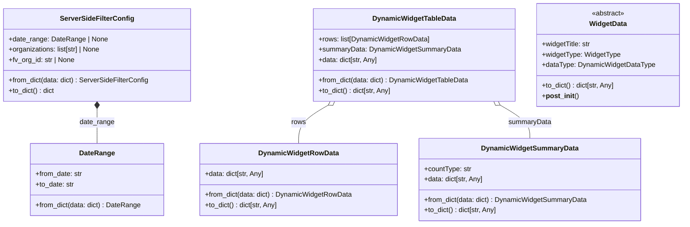

# Diagram: partview_core/partview_service/partview_service/api/dashboard/dynamic_widget/models/common.py

> Auto-generated by Obscura crawlers

## Mermaid

```mermaid
classDiagram
class DateRange {
  +from_date: str
  +to_date: str
  +from_dict(data: dict) DateRange
}
class ServerSideFilterConfig {
  +date_range: DateRange | None
  +organizations: list[str] | None
  +fv_org_id: str | None
  +from_dict(data: dict) ServerSideFilterConfig
  +to_dict() dict
}
class DynamicWidgetRowData {
  +data: dict[str, Any]
  +from_dict(data: dict) DynamicWidgetRowData
  +to_dict() dict[str, Any]
}
class DynamicWidgetSummaryData {
  +countType: str
  +data: dict[str, Any]
  +from_dict(data: dict) DynamicWidgetSummaryData
  +to_dict() dict[str, Any]
}
class DynamicWidgetTableData {
  +rows: list[DynamicWidgetRowData]
  +summaryData: DynamicWidgetSummaryData
  +data: dict[str, Any]
  +from_dict(data: dict) DynamicWidgetTableData
  +to_dict() dict[str, Any]
}
class WidgetData <<abstract>> {
  +widgetTitle: str
  +widgetType: WidgetType
  +dataType: DynamicWidgetDataType
  +to_dict() dict[str, Any]
  +__post_init__()
}
ServerSideFilterConfig *-- DateRange : date_range
DynamicWidgetTableData o-- DynamicWidgetRowData : rows
DynamicWidgetTableData o-- DynamicWidgetSummaryData : summaryData
```

> SVG rendering failed for this diagram.
