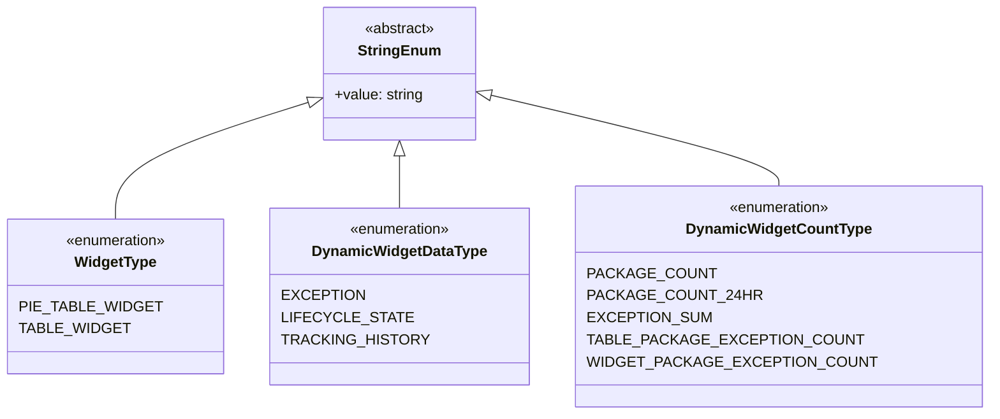

# Diagram: partview_core/partview_service/partview_service/api/dashboard/dynamic_widget/models/enums.py

> Auto-generated by Obscura crawlers

## Mermaid

### SVG

<svg id="container" width="975.78125" xmlns="http://www.w3.org/2000/svg" class="classDiagram" height="450" viewBox="0 0 975.78125 450" role="graphics-document document" aria-roledescription="class"><g><defs><marker id="container_class-aggregationStart" class="marker aggregation class" refX="18" refY="7" markerWidth="190" markerHeight="240" orient="auto"><path d="M 18,7 L9,13 L1,7 L9,1 Z"></path></marker></defs><defs><marker id="container_class-aggregationEnd" class="marker aggregation class" refX="1" refY="7" markerWidth="20" markerHeight="28" orient="auto"><path d="M 18,7 L9,13 L1,7 L9,1 Z"></path></marker></defs><defs><marker id="container_class-extensionStart" class="marker extension class" refX="18" refY="7" markerWidth="190" markerHeight="240" orient="auto"><path d="M 1,7 L18,13 V 1 Z"></path></marker></defs><defs><marker id="container_class-extensionEnd" class="marker extension class" refX="1" refY="7" markerWidth="20" markerHeight="28" orient="auto"><path d="M 1,1 V 13 L18,7 Z"></path></marker></defs><defs><marker id="container_class-compositionStart" class="marker composition class" refX="18" refY="7" markerWidth="190" markerHeight="240" orient="auto"><path d="M 18,7 L9,13 L1,7 L9,1 Z"></path></marker></defs><defs><marker id="container_class-compositionEnd" class="marker composition class" refX="1" refY="7" markerWidth="20" markerHeight="28" orient="auto"><path d="M 18,7 L9,13 L1,7 L9,1 Z"></path></marker></defs><defs><marker id="container_class-dependencyStart" class="marker dependency class" refX="6" refY="7" markerWidth="190" markerHeight="240" orient="auto"><path d="M 5,7 L9,13 L1,7 L9,1 Z"></path></marker></defs><defs><marker id="container_class-dependencyEnd" class="marker dependency class" refX="13" refY="7" markerWidth="20" markerHeight="28" orient="auto"><path d="M 18,7 L9,13 L14,7 L9,1 Z"></path></marker></defs><defs><marker id="container_class-lollipopStart" class="marker lollipop class" refX="13" refY="7" markerWidth="190" markerHeight="240" orient="auto"><circle stroke="black" fill="transparent" cx="7" cy="7" r="6"></circle></marker></defs><defs><marker id="container_class-lollipopEnd" class="marker lollipop class" refX="1" refY="7" markerWidth="190" markerHeight="240" orient="auto"><circle stroke="black" fill="transparent" cx="7" cy="7" r="6"></circle></marker></defs><g class="root"><g class="clusters"></g><g class="edgePaths"><path d="M303.04,113.22L271.791,123.85C240.541,134.48,178.042,155.74,146.792,176.537C115.543,197.333,115.543,217.667,115.543,227.833L115.543,238" id="id_StringEnum_WidgetType_1" class="edge-thickness-normal edge-pattern-solid relation" style=";;;" data-edge="true" data-et="edge" data-id="id_StringEnum_WidgetType_1" data-points="W3sieCI6MzE5LjM3MTA5Mzc1LCJ5IjoxMDcuNjY0OTMxNTA2ODQ5MzF9LHsieCI6MTE1LjU0Mjk2ODc1LCJ5IjoxNzd9LHsieCI6MTE1LjU0Mjk2ODc1LCJ5IjoyMzh9XQ==" marker-start="url(#container_class-extensionStart)"></path><path d="M400.699,169.25L400.699,170.542C400.699,171.833,400.699,174.417,400.699,183.875C400.699,193.333,400.699,209.667,400.699,217.833L400.699,226" id="id_StringEnum_DynamicWidgetDataType_2" class="edge-thickness-normal edge-pattern-solid relation" style=";;;" data-edge="true" data-et="edge" data-id="id_StringEnum_DynamicWidgetDataType_2" data-points="W3sieCI6NDAwLjY5OTIxODc1LCJ5IjoxNTJ9LHsieCI6NDAwLjY5OTIxODc1LCJ5IjoxNzd9LHsieCI6NDAwLjY5OTIxODc1LCJ5IjoyMjZ9XQ==" marker-start="url(#container_class-extensionStart)"></path><path d="M498.72,105.535L544.441,117.446C590.162,129.357,681.605,153.178,727.326,169.256C773.047,185.333,773.047,193.667,773.047,197.833L773.047,202" id="id_StringEnum_DynamicWidgetCountType_3" class="edge-thickness-normal edge-pattern-solid relation" style=";;;" data-edge="true" data-et="edge" data-id="id_StringEnum_DynamicWidgetCountType_3" data-points="W3sieCI6NDgyLjAyNzM0Mzc1LCJ5IjoxMDEuMTg2NzI2OTU0MTg2Mzh9LHsieCI6NzczLjA0Njg3NSwieSI6MTc3fSx7IngiOjc3My4wNDY4NzUsInkiOjIwMn1d" marker-start="url(#container_class-extensionStart)"></path></g><g class="edgeLabels"><g class="edgeLabel"><g class="label" data-id="id_StringEnum_WidgetType_1" transform="translate(0, 0)"><foreignObject width="0" height="0">

</foreignObject></g></g><g class="edgeLabel"><g class="label" data-id="id_StringEnum_DynamicWidgetDataType_2" transform="translate(0, 0)"><foreignObject width="0" height="0">

</foreignObject></g></g><g class="edgeLabel"><g class="label" data-id="id_StringEnum_DynamicWidgetCountType_3" transform="translate(0, 0)"><foreignObject width="0" height="0">

</foreignObject></g></g></g><g class="nodes"><g class="node default" id="classId-StringEnum-0" transform="translate(400.69921875, 80)"><g class="basic label-container"><path d="M-81.328125 -72 L81.328125 -72 L81.328125 72 L-81.328125 72" stroke="none" stroke-width="0" fill="#ECECFF" style=""></path><path d="M-81.328125 -72 C-23.46363026490544 -72, 34.40086447018912 -72, 81.328125 -72 M-81.328125 -72 C-46.64283441774331 -72, -11.957543835486618 -72, 81.328125 -72 M81.328125 -72 C81.328125 -37.84357692472841, 81.328125 -3.68715384945682, 81.328125 72 M81.328125 -72 C81.328125 -30.509880908530747, 81.328125 10.980238182938507, 81.328125 72 M81.328125 72 C18.085291997563594 72, -45.15754100487281 72, -81.328125 72 M81.328125 72 C22.277996717012307 72, -36.772131565975386 72, -81.328125 72 M-81.328125 72 C-81.328125 28.25326231236651, -81.328125 -15.493475375266982, -81.328125 -72 M-81.328125 72 C-81.328125 40.575947088666894, -81.328125 9.151894177333787, -81.328125 -72" stroke="#9370DB" stroke-width="1.3" fill="none" stroke-dasharray="0 0" style=""></path></g><g class="annotation-group text" transform="translate(-38.609375, -48)"><g class="label" style="" transform="translate(0,-12)"><foreignObject width="77.21875" height="24">

«abstract»

</foreignObject></g></g><g class="label-group text" transform="translate(-42.234375, -24)"><g class="label" style="font-weight: bolder" transform="translate(0,-12)"><foreignObject width="84.46875" height="24">

StringEnum

</foreignObject></g></g><g class="members-group text" transform="translate(-69.328125, 24)"><g class="label" style="" transform="translate(0,-12)"><foreignObject width="96.421875" height="24">

+value: string

</foreignObject></g></g><g class="methods-group text" transform="translate(-69.328125, 72)"></g><g class="divider" style=""><path d="M-81.328125 0 C-48.39774947631906 0, -15.467373952638127 0, 81.328125 0 M-81.328125 0 C-41.60019746357841 0, -1.8722699271568217 0, 81.328125 0" stroke="#9370DB" stroke-width="1.3" fill="none" stroke-dasharray="0 0" style=""></path></g><g class="divider" style=""><path d="M-81.328125 48 C-29.341558027353678 48, 22.645008945292645 48, 81.328125 48 M-81.328125 48 C-38.56543696367629 48, 4.197251072647418 48, 81.328125 48" stroke="#9370DB" stroke-width="1.3" fill="none" stroke-dasharray="0 0" style=""></path></g></g><g class="node default" id="classId-WidgetType-1" transform="translate(115.54296875, 322)"><g class="basic label-container"><path d="M-107.54296875 -84 L107.54296875 -84 L107.54296875 84 L-107.54296875 84" stroke="none" stroke-width="0" fill="#ECECFF" style=""></path><path d="M-107.54296875 -84 C-40.84152222252 -84, 25.859924304960003 -84, 107.54296875 -84 M-107.54296875 -84 C-45.68050285643779 -84, 16.18196303712442 -84, 107.54296875 -84 M107.54296875 -84 C107.54296875 -31.71750344156827, 107.54296875 20.564993116863462, 107.54296875 84 M107.54296875 -84 C107.54296875 -21.078740183676146, 107.54296875 41.84251963264771, 107.54296875 84 M107.54296875 84 C43.070603125264014 84, -21.40176249947197 84, -107.54296875 84 M107.54296875 84 C58.08424448743139 84, 8.625520224862782 84, -107.54296875 84 M-107.54296875 84 C-107.54296875 17.217459125538696, -107.54296875 -49.56508174892261, -107.54296875 -84 M-107.54296875 84 C-107.54296875 25.828406392458533, -107.54296875 -32.343187215082935, -107.54296875 -84" stroke="#9370DB" stroke-width="1.3" fill="none" stroke-dasharray="0 0" style=""></path></g><g class="annotation-group text" transform="translate(-55.5546875, -60)"><g class="label" style="" transform="translate(0,-12)"><foreignObject width="111.109375" height="24">

«enumeration»

</foreignObject></g></g><g class="label-group text" transform="translate(-42.90625, -36)"><g class="label" style="font-weight: bolder" transform="translate(0,-12)"><foreignObject width="85.8125" height="24">

WidgetType

</foreignObject></g></g><g class="members-group text" transform="translate(-95.54296875, 12)"><g class="label" style="" transform="translate(0,-12)"><foreignObject width="135.53125" height="24">

PIE_TABLE_WIDGET

</foreignObject></g><g class="label" style="" transform="translate(0,12)"><foreignObject width="105.4375" height="24">

TABLE_WIDGET

</foreignObject></g></g><g class="methods-group text" transform="translate(-95.54296875, 84)"></g><g class="divider" style=""><path d="M-107.54296875 -12 C-32.99162471301776 -12, 41.55971932396449 -12, 107.54296875 -12 M-107.54296875 -12 C-50.659470494278786 -12, 6.224027761442429 -12, 107.54296875 -12" stroke="#9370DB" stroke-width="1.3" fill="none" stroke-dasharray="0 0" style=""></path></g><g class="divider" style=""><path d="M-107.54296875 60 C-52.86041080157908 60, 1.8221471468418429 60, 107.54296875 60 M-107.54296875 60 C-27.584029492383095 60, 52.37490976523381 60, 107.54296875 60" stroke="#9370DB" stroke-width="1.3" fill="none" stroke-dasharray="0 0" style=""></path></g></g><g class="node default" id="classId-DynamicWidgetDataType-2" transform="translate(400.69921875, 322)"><g class="basic label-container"><path d="M-127.61328125 -96 L127.61328125 -96 L127.61328125 96 L-127.61328125 96" stroke="none" stroke-width="0" fill="#ECECFF" style=""></path><path d="M-127.61328125 -96 C-71.76559820965983 -96, -15.91791516931967 -96, 127.61328125 -96 M-127.61328125 -96 C-45.157322881449076 -96, 37.29863548710185 -96, 127.61328125 -96 M127.61328125 -96 C127.61328125 -23.62878995595385, 127.61328125 48.7424200880923, 127.61328125 96 M127.61328125 -96 C127.61328125 -30.80527443976075, 127.61328125 34.3894511204785, 127.61328125 96 M127.61328125 96 C52.64536192850274 96, -22.322557392994526 96, -127.61328125 96 M127.61328125 96 C49.265382073898934 96, -29.082517102202132 96, -127.61328125 96 M-127.61328125 96 C-127.61328125 53.15009140156468, -127.61328125 10.30018280312936, -127.61328125 -96 M-127.61328125 96 C-127.61328125 55.6766101213203, -127.61328125 15.353220242640603, -127.61328125 -96" stroke="#9370DB" stroke-width="1.3" fill="none" stroke-dasharray="0 0" style=""></path></g><g class="annotation-group text" transform="translate(-55.5546875, -72)"><g class="label" style="" transform="translate(0,-12)"><foreignObject width="111.109375" height="24">

«enumeration»

</foreignObject></g></g><g class="label-group text" transform="translate(-90.9921875, -48)"><g class="label" style="font-weight: bolder" transform="translate(0,-12)"><foreignObject width="181.984375" height="24">

DynamicWidgetDataType

</foreignObject></g></g><g class="members-group text" transform="translate(-115.61328125, 0)"><g class="label" style="" transform="translate(0,-12)"><foreignObject width="78.390625" height="24">

EXCEPTION

</foreignObject></g><g class="label" style="" transform="translate(0,12)"><foreignObject width="120.4375" height="24">

LIFECYCLE_STATE

</foreignObject></g><g class="label" style="" transform="translate(0,36)"><foreignObject width="140.234375" height="24">

TRACKING_HISTORY

</foreignObject></g></g><g class="methods-group text" transform="translate(-115.61328125, 96)"></g><g class="divider" style=""><path d="M-127.61328125 -24 C-55.58029921933124 -24, 16.452682811337525 -24, 127.61328125 -24 M-127.61328125 -24 C-31.949085288514738 -24, 63.715110672970525 -24, 127.61328125 -24" stroke="#9370DB" stroke-width="1.3" fill="none" stroke-dasharray="0 0" style=""></path></g><g class="divider" style=""><path d="M-127.61328125 72 C-63.195179593312204 72, 1.2229220633755915 72, 127.61328125 72 M-127.61328125 72 C-28.784359653415436 72, 70.04456194316913 72, 127.61328125 72" stroke="#9370DB" stroke-width="1.3" fill="none" stroke-dasharray="0 0" style=""></path></g></g><g class="node default" id="classId-DynamicWidgetCountType-3" transform="translate(773.046875, 322)"><g class="basic label-container"><path d="M-194.734375 -120 L194.734375 -120 L194.734375 120 L-194.734375 120" stroke="none" stroke-width="0" fill="#ECECFF" style=""></path><path d="M-194.734375 -120 C-110.56377686277172 -120, -26.393178725543436 -120, 194.734375 -120 M-194.734375 -120 C-88.98426262897559 -120, 16.76584974204883 -120, 194.734375 -120 M194.734375 -120 C194.734375 -30.168853413540248, 194.734375 59.662293172919505, 194.734375 120 M194.734375 -120 C194.734375 -67.82341731670179, 194.734375 -15.646834633403586, 194.734375 120 M194.734375 120 C45.31797623697787 120, -104.09842252604426 120, -194.734375 120 M194.734375 120 C101.22467681165534 120, 7.714978623310685 120, -194.734375 120 M-194.734375 120 C-194.734375 65.57020277944753, -194.734375 11.140405558895054, -194.734375 -120 M-194.734375 120 C-194.734375 41.21615076598053, -194.734375 -37.56769846803894, -194.734375 -120" stroke="#9370DB" stroke-width="1.3" fill="none" stroke-dasharray="0 0" style=""></path></g><g class="annotation-group text" transform="translate(-55.5546875, -96)"><g class="label" style="" transform="translate(0,-12)"><foreignObject width="111.109375" height="24">

«enumeration»

</foreignObject></g></g><g class="label-group text" transform="translate(-95.5, -72)"><g class="label" style="font-weight: bolder" transform="translate(0,-12)"><foreignObject width="191" height="24">

DynamicWidgetCountType

</foreignObject></g></g><g class="members-group text" transform="translate(-182.734375, -24)"><g class="label" style="" transform="translate(0,-12)"><foreignObject width="120.578125" height="24">

PACKAGE_COUNT

</foreignObject></g><g class="label" style="" transform="translate(0,12)"><foreignObject width="164.671875" height="24">

PACKAGE_COUNT_24HR

</foreignObject></g><g class="label" style="" transform="translate(0,36)"><foreignObject width="118.15625" height="24">

EXCEPTION_SUM

</foreignObject></g><g class="label" style="" transform="translate(0,60)"><foreignObject width="258.5" height="24">

TABLE_PACKAGE_EXCEPTION_COUNT

</foreignObject></g><g class="label" style="" transform="translate(0,84)"><foreignObject width="269.96875" height="24">

WIDGET_PACKAGE_EXCEPTION_COUNT

</foreignObject></g></g><g class="methods-group text" transform="translate(-182.734375, 120)"></g><g class="divider" style=""><path d="M-194.734375 -48 C-65.00253545025112 -48, 64.72930409949777 -48, 194.734375 -48 M-194.734375 -48 C-65.5946076092512 -48, 63.5451597814976 -48, 194.734375 -48" stroke="#9370DB" stroke-width="1.3" fill="none" stroke-dasharray="0 0" style=""></path></g><g class="divider" style=""><path d="M-194.734375 96 C-97.74113233525665 96, -0.7478896705133025 96, 194.734375 96 M-194.734375 96 C-40.27394233400403 96, 114.18649033199193 96, 194.734375 96" stroke="#9370DB" stroke-width="1.3" fill="none" stroke-dasharray="0 0" style=""></path></g></g></g></g></g></svg>
