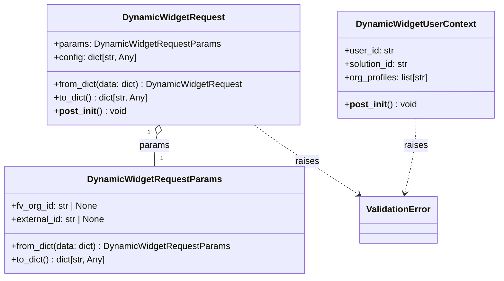

# Diagram: partview_core/partview_service/partview_service/api/dashboard/dynamic_widget/models/request.py

> Auto-generated by Obscura crawlers

## Mermaid

### SVG

<svg id="container" width="884.6484375" xmlns="http://www.w3.org/2000/svg" class="classDiagram" height="498" viewBox="0 0 884.6484375 498" role="graphics-document document" aria-roledescription="class"><g><defs><marker id="container_class-aggregationStart" class="marker aggregation class" refX="18" refY="7" markerWidth="190" markerHeight="240" orient="auto"><path d="M 18,7 L9,13 L1,7 L9,1 Z"></path></marker></defs><defs><marker id="container_class-aggregationEnd" class="marker aggregation class" refX="1" refY="7" markerWidth="20" markerHeight="28" orient="auto"><path d="M 18,7 L9,13 L1,7 L9,1 Z"></path></marker></defs><defs><marker id="container_class-extensionStart" class="marker extension class" refX="18" refY="7" markerWidth="190" markerHeight="240" orient="auto"><path d="M 1,7 L18,13 V 1 Z"></path></marker></defs><defs><marker id="container_class-extensionEnd" class="marker extension class" refX="1" refY="7" markerWidth="20" markerHeight="28" orient="auto"><path d="M 1,1 V 13 L18,7 Z"></path></marker></defs><defs><marker id="container_class-compositionStart" class="marker composition class" refX="18" refY="7" markerWidth="190" markerHeight="240" orient="auto"><path d="M 18,7 L9,13 L1,7 L9,1 Z"></path></marker></defs><defs><marker id="container_class-compositionEnd" class="marker composition class" refX="1" refY="7" markerWidth="20" markerHeight="28" orient="auto"><path d="M 18,7 L9,13 L1,7 L9,1 Z"></path></marker></defs><defs><marker id="container_class-dependencyStart" class="marker dependency class" refX="6" refY="7" markerWidth="190" markerHeight="240" orient="auto"><path d="M 5,7 L9,13 L1,7 L9,1 Z"></path></marker></defs><defs><marker id="container_class-dependencyEnd" class="marker dependency class" refX="13" refY="7" markerWidth="20" markerHeight="28" orient="auto"><path d="M 18,7 L9,13 L14,7 L9,1 Z"></path></marker></defs><defs><marker id="container_class-lollipopStart" class="marker lollipop class" refX="13" refY="7" markerWidth="190" markerHeight="240" orient="auto"><circle stroke="black" fill="transparent" cx="7" cy="7" r="6"></circle></marker></defs><defs><marker id="container_class-lollipopEnd" class="marker lollipop class" refX="1" refY="7" markerWidth="190" markerHeight="240" orient="auto"><circle stroke="black" fill="transparent" cx="7" cy="7" r="6"></circle></marker></defs><g class="root"><g class="clusters"></g><g class="edgePaths"><path d="M277.412,240.794L276.622,244.162C275.832,247.529,274.252,254.265,273.462,263.799C272.672,273.333,272.672,285.667,272.672,291.833L272.672,298" id="id_DynamicWidgetRequest_DynamicWidgetRequestParams_1" class="edge-thickness-normal edge-pattern-solid relation" style=";;;" data-edge="true" data-et="edge" data-id="id_DynamicWidgetRequest_DynamicWidgetRequestParams_1" data-points="W3sieCI6MjgxLjM1MTcyNDEzNzkzMTA2LCJ5IjoyMjR9LHsieCI6MjcyLjY3MTg3NSwieSI6MjYxfSx7IngiOjI3Mi42NzE4NzUsInkiOjI5OH1d" marker-start="url(#container_class-aggregationStart)"></path><path d="M448.894,224L457.014,230.167C465.134,236.333,481.374,248.667,512.325,269.461C543.276,290.254,588.939,319.509,611.77,334.136L634.602,348.763" id="id_DynamicWidgetRequest_ValidationError_2" class="edge-thickness-normal edge-pattern-dashed relation" style=";;;" data-edge="true" data-et="edge" data-id="id_DynamicWidgetRequest_ValidationError_2" data-points="W3sieCI6NDQ4Ljg5NDI4ODc5MzEwMzQ0LCJ5IjoyMjR9LHsieCI6NDk3LjYxMzI4MTI1LCJ5IjoyNjF9LHsieCI6NjM5LjY1Mzc4Mjg5NDczNjksInkiOjM1Mn1d" marker-end="url(#container_class-dependencyEnd)"></path><path d="M736.461,212L736.461,220.167C736.461,228.333,736.461,244.667,733.126,267.027C729.791,289.386,723.121,317.773,719.787,331.966L716.452,346.159" id="id_DynamicWidgetUserContext_ValidationError_3" class="edge-thickness-normal edge-pattern-dashed relation" style=";;;" data-edge="true" data-et="edge" data-id="id_DynamicWidgetUserContext_ValidationError_3" data-points="W3sieCI6NzM2LjQ2MDkzNzUsInkiOjIxMn0seyJ4Ijo3MzYuNDYwOTM3NSwieSI6MjYxfSx7IngiOjcxNS4wNzkzNTg1NTI2MzE2LCJ5IjozNTJ9XQ==" marker-end="url(#container_class-dependencyEnd)"></path></g><g class="edgeLabels"><g class="edgeLabel" transform="translate(272.671875, 261)"><g class="label" data-id="id_DynamicWidgetRequest_DynamicWidgetRequestParams_1" transform="translate(-26.78125, -12)"><foreignObject width="53.5625" height="24">

params

</foreignObject></g></g><g class="edgeLabel" transform="translate(542.87775, 289.99924)"><g class="label" data-id="id_DynamicWidgetRequest_ValidationError_2" transform="translate(-21.25, -12)"><foreignObject width="42.5" height="24">

raises

</foreignObject></g></g><g class="edgeLabel" transform="translate(736.4609375, 261)"><g class="label" data-id="id_DynamicWidgetUserContext_ValidationError_3" transform="translate(-21.25, -12)"><foreignObject width="42.5" height="24">

raises

</foreignObject></g></g><g class="edgeTerminals" transform="translate(262.7513516078902, 237.61161828600171)"><g class="inner" transform="translate(0, 0)"><foreignObject style="width: 9px; height: 12px;">
1
</foreignObject></g></g><g class="edgeTerminals" transform="translate(282.6718774999998, 275.5000021428571)"><g class="inner" transform="translate(0, 0)"></g><foreignObject style="width: 9px; height: 12px;">
1
</foreignObject></g></g><g class="nodes"><g class="node default" id="classId-DynamicWidgetRequestParams-0" transform="translate(272.671875, 394)"><g class="basic label-container"><path d="M-264.671875 -96 L264.671875 -96 L264.671875 96 L-264.671875 96" stroke="none" stroke-width="0" fill="#ECECFF" style=""></path><path d="M-264.671875 -96 C-96.20883108784852 -96, 72.25421282430295 -96, 264.671875 -96 M-264.671875 -96 C-97.36847969840943 -96, 69.93491560318114 -96, 264.671875 -96 M264.671875 -96 C264.671875 -24.150903789696628, 264.671875 47.698192420606745, 264.671875 96 M264.671875 -96 C264.671875 -20.783444661947954, 264.671875 54.43311067610409, 264.671875 96 M264.671875 96 C56.84194971552324 96, -150.98797556895352 96, -264.671875 96 M264.671875 96 C153.85457973497444 96, 43.03728446994887 96, -264.671875 96 M-264.671875 96 C-264.671875 46.55620458060104, -264.671875 -2.8875908387979194, -264.671875 -96 M-264.671875 96 C-264.671875 47.24300908205154, -264.671875 -1.5139818358969137, -264.671875 -96" stroke="#9370DB" stroke-width="1.3" fill="none" stroke-dasharray="0 0" style=""></path></g><g class="annotation-group text" transform="translate(0, -72)"></g><g class="label-group text" transform="translate(-113.453125, -72)"><g class="label" style="font-weight: bolder" transform="translate(0,-12)"><foreignObject width="226.90625" height="24">

DynamicWidgetRequestParams

</foreignObject></g></g><g class="members-group text" transform="translate(-252.671875, -24)"><g class="label" style="" transform="translate(0,-12)"><foreignObject width="155.375" height="24">

+fv_org_id: str | None

</foreignObject></g><g class="label" style="" transform="translate(0,12)"><foreignObject width="170.5625" height="24">

+external_id: str | None

</foreignObject></g></g><g class="methods-group text" transform="translate(-252.671875, 48)"><g class="label" style="" transform="translate(0,-12)"><foreignObject width="391.890625" height="24">

+from_dict(data: dict) : DynamicWidgetRequestParams

</foreignObject></g><g class="label" style="" transform="translate(0,12)"><foreignObject width="171" height="24">

+to_dict() : dict[str, Any]

</foreignObject></g></g><g class="divider" style=""><path d="M-264.671875 -48 C-73.50285066472009 -48, 117.66617367055983 -48, 264.671875 -48 M-264.671875 -48 C-110.67211329711367 -48, 43.32764840577266 -48, 264.671875 -48" stroke="#9370DB" stroke-width="1.3" fill="none" stroke-dasharray="0 0" style=""></path></g><g class="divider" style=""><path d="M-264.671875 24 C-139.67390932327535 24, -14.675943646550706 24, 264.671875 24 M-264.671875 24 C-99.15170304652813 24, 66.36846890694375 24, 264.671875 24" stroke="#9370DB" stroke-width="1.3" fill="none" stroke-dasharray="0 0" style=""></path></g></g><g class="node default" id="classId-DynamicWidgetRequest-1" transform="translate(306.6875, 116)"><g class="basic label-container"><path d="M-225.0078125 -108 L225.0078125 -108 L225.0078125 108 L-225.0078125 108" stroke="none" stroke-width="0" fill="#ECECFF" style=""></path><path d="M-225.0078125 -108 C-98.11775132269197 -108, 28.772309854616054 -108, 225.0078125 -108 M-225.0078125 -108 C-91.67459639168112 -108, 41.65861971663776 -108, 225.0078125 -108 M225.0078125 -108 C225.0078125 -43.80465911770109, 225.0078125 20.390681764597815, 225.0078125 108 M225.0078125 -108 C225.0078125 -45.35195125116525, 225.0078125 17.296097497669507, 225.0078125 108 M225.0078125 108 C56.29336451143567 108, -112.42108347712866 108, -225.0078125 108 M225.0078125 108 C128.48415954447682 108, 31.96050658895362 108, -225.0078125 108 M-225.0078125 108 C-225.0078125 44.798372145411335, -225.0078125 -18.40325570917733, -225.0078125 -108 M-225.0078125 108 C-225.0078125 64.50242413751408, -225.0078125 21.004848275028166, -225.0078125 -108" stroke="#9370DB" stroke-width="1.3" fill="none" stroke-dasharray="0 0" style=""></path></g><g class="annotation-group text" transform="translate(0, -84)"></g><g class="label-group text" transform="translate(-86.75, -84)"><g class="label" style="font-weight: bolder" transform="translate(0,-12)"><foreignObject width="173.5" height="24">

DynamicWidgetRequest

</foreignObject></g></g><g class="members-group text" transform="translate(-213.0078125, -36)"><g class="label" style="" transform="translate(0,-12)"><foreignObject width="293.234375" height="24">

+params: DynamicWidgetRequestParams

</foreignObject></g><g class="label" style="" transform="translate(0,12)"><foreignObject width="149.96875" height="24">

+config: dict[str, Any]

</foreignObject></g></g><g class="methods-group text" transform="translate(-213.0078125, 36)"><g class="label" style="" transform="translate(0,-12)"><foreignObject width="339.265625" height="24">

+from_dict(data: dict) : DynamicWidgetRequest

</foreignObject></g><g class="label" style="" transform="translate(0,12)"><foreignObject width="171" height="24">

+to_dict() : dict[str, Any]

</foreignObject></g><g class="label" style="" transform="translate(0,36)"><foreignObject width="127.46875" height="24">

+<strong>post_init</strong>() : void

</foreignObject></g></g><g class="divider" style=""><path d="M-225.0078125 -60 C-64.83423192730103 -60, 95.33934864539793 -60, 225.0078125 -60 M-225.0078125 -60 C-127.90799105841002 -60, -30.808169616820038 -60, 225.0078125 -60" stroke="#9370DB" stroke-width="1.3" fill="none" stroke-dasharray="0 0" style=""></path></g><g class="divider" style=""><path d="M-225.0078125 12 C-98.51141846046016 12, 27.984975579079673 12, 225.0078125 12 M-225.0078125 12 C-61.148646198603416 12, 102.71052010279317 12, 225.0078125 12" stroke="#9370DB" stroke-width="1.3" fill="none" stroke-dasharray="0 0" style=""></path></g></g><g class="node default" id="classId-DynamicWidgetUserContext-2" transform="translate(736.4609375, 116)"><g class="basic label-container"><path d="M-140.1875 -96 L140.1875 -96 L140.1875 96 L-140.1875 96" stroke="none" stroke-width="0" fill="#ECECFF" style=""></path><path d="M-140.1875 -96 C-54.716488331190945 -96, 30.75452333761811 -96, 140.1875 -96 M-140.1875 -96 C-35.60216277530644 -96, 68.98317444938712 -96, 140.1875 -96 M140.1875 -96 C140.1875 -31.88537403637261, 140.1875 32.22925192725478, 140.1875 96 M140.1875 -96 C140.1875 -55.36835167979554, 140.1875 -14.736703359591075, 140.1875 96 M140.1875 96 C40.098382364690565 96, -59.99073527061887 96, -140.1875 96 M140.1875 96 C44.13464987235518 96, -51.918200255289634 96, -140.1875 96 M-140.1875 96 C-140.1875 33.144104421577794, -140.1875 -29.711791156844413, -140.1875 -96 M-140.1875 96 C-140.1875 38.35633354670121, -140.1875 -19.287332906597584, -140.1875 -96" stroke="#9370DB" stroke-width="1.3" fill="none" stroke-dasharray="0 0" style=""></path></g><g class="annotation-group text" transform="translate(0, -72)"></g><g class="label-group text" transform="translate(-101.59375, -72)"><g class="label" style="font-weight: bolder" transform="translate(0,-12)"><foreignObject width="203.1875" height="24">

DynamicWidgetUserContext

</foreignObject></g></g><g class="members-group text" transform="translate(-128.1875, -24)"><g class="label" style="" transform="translate(0,-12)"><foreignObject width="88.296875" height="24">

+user_id: str

</foreignObject></g><g class="label" style="" transform="translate(0,12)"><foreignObject width="117.71875" height="24">

+solution_id: str

</foreignObject></g><g class="label" style="" transform="translate(0,36)"><foreignObject width="154.78125" height="24">

+org_profiles: list[str]

</foreignObject></g></g><g class="methods-group text" transform="translate(-128.1875, 72)"><g class="label" style="" transform="translate(0,-12)"><foreignObject width="127.46875" height="24">

+<strong>post_init</strong>() : void

</foreignObject></g></g><g class="divider" style=""><path d="M-140.1875 -48 C-66.76057226452748 -48, 6.666355470945035 -48, 140.1875 -48 M-140.1875 -48 C-77.66526929230096 -48, -15.14303858460191 -48, 140.1875 -48" stroke="#9370DB" stroke-width="1.3" fill="none" stroke-dasharray="0 0" style=""></path></g><g class="divider" style=""><path d="M-140.1875 48 C-69.45157252987524 48, 1.2843549402495285 48, 140.1875 48 M-140.1875 48 C-81.33845190598076 48, -22.489403811961523 48, 140.1875 48" stroke="#9370DB" stroke-width="1.3" fill="none" stroke-dasharray="0 0" style=""></path></g></g><g class="node default" id="classId-ValidationError-3" transform="translate(705.2109375, 394)"><g class="basic label-container"><path d="M-67.1796875 -42 L67.1796875 -42 L67.1796875 42 L-67.1796875 42" stroke="none" stroke-width="0" fill="#ECECFF" style=""></path><path d="M-67.1796875 -42 C-39.42308162223699 -42, -11.666475744473978 -42, 67.1796875 -42 M-67.1796875 -42 C-39.83421098985184 -42, -12.488734479703687 -42, 67.1796875 -42 M67.1796875 -42 C67.1796875 -11.565733142920667, 67.1796875 18.868533714158666, 67.1796875 42 M67.1796875 -42 C67.1796875 -19.013433952390113, 67.1796875 3.973132095219775, 67.1796875 42 M67.1796875 42 C36.77247185115335 42, 6.365256202306696 42, -67.1796875 42 M67.1796875 42 C34.710573018509834 42, 2.2414585370196676 42, -67.1796875 42 M-67.1796875 42 C-67.1796875 24.02291406599811, -67.1796875 6.045828131996217, -67.1796875 -42 M-67.1796875 42 C-67.1796875 13.456256099505723, -67.1796875 -15.087487800988555, -67.1796875 -42" stroke="#9370DB" stroke-width="1.3" fill="none" stroke-dasharray="0 0" style=""></path></g><g class="annotation-group text" transform="translate(0, -18)"></g><g class="label-group text" transform="translate(-55.1796875, -18)"><g class="label" style="font-weight: bolder" transform="translate(0,-12)"><foreignObject width="110.359375" height="24">

ValidationError

</foreignObject></g></g><g class="members-group text" transform="translate(-55.1796875, 30)"></g><g class="methods-group text" transform="translate(-55.1796875, 60)"></g><g class="divider" style=""><path d="M-67.1796875 6 C-32.312139405468784 6, 2.555408689062432 6, 67.1796875 6 M-67.1796875 6 C-21.47253743649172 6, 24.23461262701656 6, 67.1796875 6" stroke="#9370DB" stroke-width="1.3" fill="none" stroke-dasharray="0 0" style=""></path></g><g class="divider" style=""><path d="M-67.1796875 24 C-27.96387025231595 24, 11.251946995368101 24, 67.1796875 24 M-67.1796875 24 C-23.08962979240119 24, 21.00042791519762 24, 67.1796875 24" stroke="#9370DB" stroke-width="1.3" fill="none" stroke-dasharray="0 0" style=""></path></g></g></g></g></g></svg>
