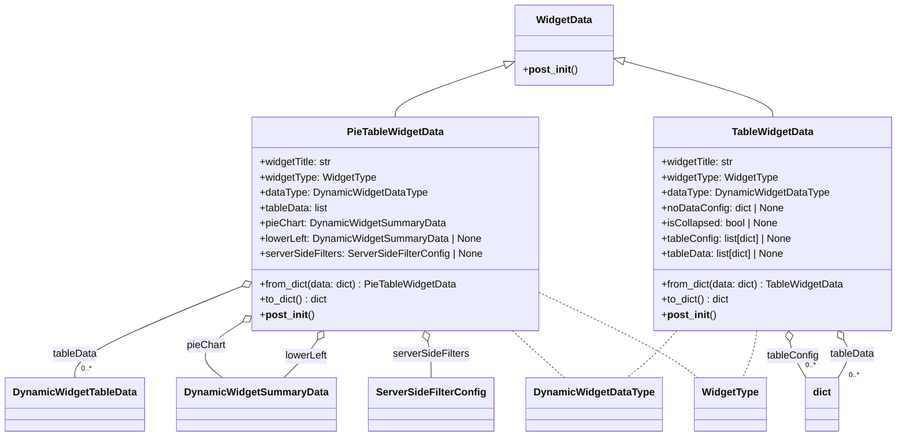

# Diagram: partview_core/partview_service/partview_service/api/dashboard/dynamic_widget/models/widgets.py

> Auto-generated by Obscura crawlers

## Mermaid

### SVG

<svg id="container" width="1369.203125" xmlns="http://www.w3.org/2000/svg" class="classDiagram" height="686" viewBox="0 0 1369.203125 686" role="graphics-document document" aria-roledescription="class"><g><defs><marker id="container_class-aggregationStart" class="marker aggregation class" refX="18" refY="7" markerWidth="190" markerHeight="240" orient="auto"><path d="M 18,7 L9,13 L1,7 L9,1 Z"></path></marker></defs><defs><marker id="container_class-aggregationEnd" class="marker aggregation class" refX="1" refY="7" markerWidth="20" markerHeight="28" orient="auto"><path d="M 18,7 L9,13 L1,7 L9,1 Z"></path></marker></defs><defs><marker id="container_class-extensionStart" class="marker extension class" refX="18" refY="7" markerWidth="190" markerHeight="240" orient="auto"><path d="M 1,7 L18,13 V 1 Z"></path></marker></defs><defs><marker id="container_class-extensionEnd" class="marker extension class" refX="1" refY="7" markerWidth="20" markerHeight="28" orient="auto"><path d="M 1,1 V 13 L18,7 Z"></path></marker></defs><defs><marker id="container_class-compositionStart" class="marker composition class" refX="18" refY="7" markerWidth="190" markerHeight="240" orient="auto"><path d="M 18,7 L9,13 L1,7 L9,1 Z"></path></marker></defs><defs><marker id="container_class-compositionEnd" class="marker composition class" refX="1" refY="7" markerWidth="20" markerHeight="28" orient="auto"><path d="M 18,7 L9,13 L1,7 L9,1 Z"></path></marker></defs><defs><marker id="container_class-dependencyStart" class="marker dependency class" refX="6" refY="7" markerWidth="190" markerHeight="240" orient="auto"><path d="M 5,7 L9,13 L1,7 L9,1 Z"></path></marker></defs><defs><marker id="container_class-dependencyEnd" class="marker dependency class" refX="13" refY="7" markerWidth="20" markerHeight="28" orient="auto"><path d="M 18,7 L9,13 L14,7 L9,1 Z"></path></marker></defs><defs><marker id="container_class-lollipopStart" class="marker lollipop class" refX="13" refY="7" markerWidth="190" markerHeight="240" orient="auto"><circle stroke="black" fill="transparent" cx="7" cy="7" r="6"></circle></marker></defs><defs><marker id="container_class-lollipopEnd" class="marker lollipop class" refX="1" refY="7" markerWidth="190" markerHeight="240" orient="auto"><circle stroke="black" fill="transparent" cx="7" cy="7" r="6"></circle></marker></defs><g class="root"><g class="clusters"></g><g class="edgePaths"><path d="M762.015,102.236L734.297,111.697C706.579,121.158,651.143,140.079,623.425,153.706C595.707,167.333,595.707,175.667,595.707,179.833L595.707,184" id="id_WidgetData_PieTableWidgetData_1" class="edge-thickness-normal edge-pattern-solid relation" style=";;;" data-edge="true" data-et="edge" data-id="id_WidgetData_PieTableWidgetData_1" data-points="W3sieCI6Nzc4LjMzOTg0Mzc1LCJ5Ijo5Ni42NjQxNjY3ODAyOTc4Nn0seyJ4Ijo1OTUuNzA3MDMxMjUsInkiOjE1OX0seyJ4Ijo1OTUuNzA3MDMxMjUsInkiOjE4NH1d" marker-start="url(#container_class-extensionStart)"></path><path d="M945.353,96.303L983.274,106.752C1021.195,117.202,1097.037,138.101,1134.958,152.717C1172.879,167.333,1172.879,175.667,1172.879,179.833L1172.879,184" id="id_WidgetData_TableWidgetData_2" class="edge-thickness-normal edge-pattern-solid relation" style=";;;" data-edge="true" data-et="edge" data-id="id_WidgetData_TableWidgetData_2" data-points="W3sieCI6OTI4LjcyMjY1NjI1LCJ5Ijo5MS43MTk4NzU3MjMyMTUwNX0seyJ4IjoxMTcyLjg3ODkwNjI1LCJ5IjoxNTl9LHsieCI6MTE3Mi44Nzg5MDYyNSwieSI6MTg0fV0=" marker-start="url(#container_class-extensionStart)"></path><path d="M355.66,454.049L315.299,471.208C274.937,488.366,194.215,522.683,153.854,546.008C113.492,569.333,113.492,581.667,113.492,587.833L113.492,594" id="id_PieTableWidgetData_DynamicWidgetTableData_3" class="edge-thickness-normal edge-pattern-solid relation" style=";;;" data-edge="true" data-et="edge" data-id="id_PieTableWidgetData_DynamicWidgetTableData_3" data-points="W3sieCI6MzcxLjUzNTE1NjI1LCJ5Ijo0NDcuMzAwMzMxMzE2MjczNH0seyJ4IjoxMTMuNDkyMTg3NSwieSI6NTU3fSx7IngiOjExMy40OTIxODc1LCJ5Ijo1OTR9XQ==" marker-start="url(#container_class-aggregationStart)"></path><path d="M357.271,514.156L346.772,521.297C336.272,528.437,315.273,542.719,312.172,556.026C309.071,569.333,323.868,581.667,331.266,587.833L338.665,594" id="id_PieTableWidgetData_DynamicWidgetSummaryData_4" class="edge-thickness-normal edge-pattern-solid relation" style=";;;" data-edge="true" data-et="edge" data-id="id_PieTableWidgetData_DynamicWidgetSummaryData_4" data-points="W3sieCI6MzcxLjUzNTE1NjI1LCJ5Ijo1MDQuNDU1NTgzMzQ1MjEyM30seyJ4IjoyOTQuMjczNDM3NSwieSI6NTU3fSx7IngiOjMzOC42NjQ2NTU4NTQ0MzA0LCJ5Ijo1OTR9XQ==" marker-start="url(#container_class-aggregationStart)"></path><path d="M478.288,534.507L475.876,538.256C473.464,542.005,468.64,549.502,460.392,559.418C452.145,569.333,440.473,581.667,434.637,587.833L428.801,594" id="id_PieTableWidgetData_DynamicWidgetSummaryData_5" class="edge-thickness-normal edge-pattern-solid relation" style=";;;" data-edge="true" data-et="edge" data-id="id_PieTableWidgetData_DynamicWidgetSummaryData_5" data-points="W3sieCI6NDg3LjYyMTA1NTY0MDI0Mzg3LCJ5Ijo1MjB9LHsieCI6NDYzLjgxNjQwNjI1LCJ5Ijo1NTd9LHsieCI6NDI4LjgwMTQyNDA1MDYzMjkzLCJ5Ijo1OTR9XQ==" marker-start="url(#container_class-aggregationStart)"></path><path d="M647.156,536.617L648.102,540.014C649.049,543.411,650.942,550.206,651.889,559.769C652.836,569.333,652.836,581.667,652.836,587.833L652.836,594" id="id_PieTableWidgetData_ServerSideFilterConfig_6" class="edge-thickness-normal edge-pattern-solid relation" style=";;;" data-edge="true" data-et="edge" data-id="id_PieTableWidgetData_ServerSideFilterConfig_6" data-points="W3sieCI6NjQyLjUyNDg2NjYxNTg1MzYsInkiOjUyMH0seyJ4Ijo2NTIuODM1OTM3NSwieSI6NTU3fSx7IngiOjY1Mi44MzU5Mzc1LCJ5Ijo1OTR9XQ==" marker-start="url(#container_class-aggregationStart)"></path><path d="M1200.434,537.062L1200.928,540.385C1201.423,543.708,1202.413,550.354,1206.664,559.844C1210.916,569.333,1218.43,581.667,1222.187,587.833L1225.944,594" id="id_TableWidgetData_dict_7" class="edge-thickness-normal edge-pattern-solid relation" style=";;;" data-edge="true" data-et="edge" data-id="id_TableWidgetData_dict_7" data-points="W3sieCI6MTE5Ny44OTMyMzU1MTgyOTI2LCJ5Ijo1MjB9LHsieCI6MTIwMy40MDIzNDM3NSwieSI6NTU3fSx7IngiOjEyMjUuOTQzNzMwMjIxNTE5LCJ5Ijo1OTR9XQ==" marker-start="url(#container_class-aggregationStart)"></path><path d="M1285.851,534.671L1288.152,538.393C1290.454,542.114,1295.057,549.557,1293.602,559.445C1292.146,569.333,1284.633,581.667,1280.876,587.833L1277.119,594" id="id_TableWidgetData_dict_8" class="edge-thickness-normal edge-pattern-solid relation" style=";;;" data-edge="true" data-et="edge" data-id="id_TableWidgetData_dict_8" data-points="W3sieCI6MTI3Ni43Nzc2ODY3Mzc4MDUsInkiOjUyMH0seyJ4IjoxMjk5LjY2MDE1NjI1LCJ5Ijo1NTd9LHsieCI6MTI3Ny4xMTg3Njk3Nzg0ODEsInkiOjU5NH1d" marker-start="url(#container_class-aggregationStart)"></path><path d="M776.55,520L783.188,526.167C789.827,532.333,803.103,544.667,816.232,557C829.362,569.333,842.345,581.667,848.836,587.833L855.327,594" id="id_PieTableWidgetData_DynamicWidgetDataType_9" class="edge-thickness-normal edge-pattern-dashed relation" style=";;;" data-edge="true" data-et="edge" data-id="id_PieTableWidgetData_DynamicWidgetDataType_9" data-points="W3sieCI6Nzc2LjU1MDMyMzkzMjkyNjksInkiOjUyMH0seyJ4Ijo4MTYuMzc4OTA2MjUsInkiOjU1N30seyJ4Ijo4NTUuMzI3MzMzODYwNzU5NSwieSI6NTk0fV0="></path><path d="M1025.866,520L1020.47,526.167C1015.073,532.333,1004.281,544.667,991.551,557C978.821,569.333,964.154,581.667,956.82,587.833L949.487,594" id="id_TableWidgetData_DynamicWidgetDataType_10" class="edge-thickness-normal edge-pattern-dashed relation" style=";;;" data-edge="true" data-et="edge" data-id="id_TableWidgetData_DynamicWidgetDataType_10" data-points="W3sieCI6MTAyNS44NjYxMDEzNzE5NTExLCJ5Ijo1MjB9LHsieCI6OTkzLjQ4ODI4MTI1LCJ5Ijo1NTd9LHsieCI6OTQ5LjQ4Njc0ODQxNzcyMTUsInkiOjU5NH1d"></path><path d="M819.879,461.998L852.147,477.832C884.415,493.666,948.952,525.333,988.554,547.333C1028.155,569.333,1042.823,581.667,1050.156,587.833L1057.49,594" id="id_PieTableWidgetData_WidgetType_11" class="edge-thickness-normal edge-pattern-dashed relation" style=";;;" data-edge="true" data-et="edge" data-id="id_PieTableWidgetData_WidgetType_11" data-points="W3sieCI6ODE5Ljg3ODkwNjI1LCJ5Ijo0NjEuOTk4MzE3MDAyMDE5Nn0seyJ4IjoxMDEzLjQ4ODI4MTI1LCJ5Ijo1NTd9LHsieCI6MTA1Ny40ODk4MTQwODIyNzg0LCJ5Ijo1OTR9XQ=="></path><path d="M1147.865,520L1146.946,526.167C1146.028,532.333,1144.192,544.667,1140.548,557C1136.904,569.333,1131.453,581.667,1128.727,587.833L1126.001,594" id="id_TableWidgetData_WidgetType_12" class="edge-thickness-normal edge-pattern-dashed relation" style=";;;" data-edge="true" data-et="edge" data-id="id_TableWidgetData_WidgetType_12" data-points="W3sieCI6MTE0Ny44NjQ1NzY5ODE3MDc0LCJ5Ijo1MjB9LHsieCI6MTE0Mi4zNTU0Njg3NSwieSI6NTU3fSx7IngiOjExMjYuMDAxNDgzMzg2MDc2LCJ5Ijo1OTR9XQ=="></path></g><g class="edgeLabels"><g class="edgeLabel"><g class="label" data-id="id_WidgetData_PieTableWidgetData_1" transform="translate(0, 0)"><foreignObject width="0" height="0">

</foreignObject></g></g><g class="edgeLabel"><g class="label" data-id="id_WidgetData_TableWidgetData_2" transform="translate(0, 0)"><foreignObject width="0" height="0">

</foreignObject></g></g><g class="edgeLabel" transform="translate(113.4921875, 557)"><g class="label" data-id="id_PieTableWidgetData_DynamicWidgetTableData_3" transform="translate(-35.2109375, -12)"><foreignObject width="70.421875" height="24">

tableData

</foreignObject></g></g><g class="edgeLabel" transform="translate(309.01155, 546.97685)"><g class="label" data-id="id_PieTableWidgetData_DynamicWidgetSummaryData_4" transform="translate(-30.7890625, -12)"><foreignObject width="61.578125" height="24">

pieChart

</foreignObject></g></g><g class="edgeLabel" transform="translate(461.4294, 559.52232)"><g class="label" data-id="id_PieTableWidgetData_DynamicWidgetSummaryData_5" transform="translate(-33.875, -12)"><foreignObject width="67.75" height="24">

lowerLeft

</foreignObject></g></g><g class="edgeLabel" transform="translate(652.8359375, 557)"><g class="label" data-id="id_PieTableWidgetData_ServerSideFilterConfig_6" transform="translate(-60.3828125, -12)"><foreignObject width="120.765625" height="24">

serverSideFilters

</foreignObject></g></g><g class="edgeLabel" transform="translate(1204.94179, 559.52689)"><g class="label" data-id="id_TableWidgetData_dict_7" transform="translate(-41.046875, -12)"><foreignObject width="82.09375" height="24">

tableConfig

</foreignObject></g></g><g class="edgeLabel" transform="translate(1299.61323, 556.92412)"><g class="label" data-id="id_TableWidgetData_dict_8" transform="translate(-35.2109375, -12)"><foreignObject width="70.421875" height="24">

tableData

</foreignObject></g></g><g class="edgeLabel"><g class="label" data-id="id_PieTableWidgetData_DynamicWidgetDataType_9" transform="translate(0, 0)"><foreignObject width="0" height="0">

</foreignObject></g></g><g class="edgeLabel"><g class="label" data-id="id_TableWidgetData_DynamicWidgetDataType_10" transform="translate(0, 0)"><foreignObject width="0" height="0">

</foreignObject></g></g><g class="edgeLabel"><g class="label" data-id="id_PieTableWidgetData_WidgetType_11" transform="translate(0, 0)"><foreignObject width="0" height="0">

</foreignObject></g></g><g class="edgeLabel"><g class="label" data-id="id_TableWidgetData_WidgetType_12" transform="translate(0, 0)"><foreignObject width="0" height="0">

</foreignObject></g></g><g class="edgeTerminals" transform="translate(123.49218874999997, 571.5000010714285)"><g class="inner" transform="translate(0, 0)"></g><foreignObject style="width: 36px; height: 12px;">
0..*
</foreignObject></g><g class="edgeTerminals" transform="translate(1224.6488270833959, 566.2508842944806)"><g class="inner" transform="translate(0, 0)"></g><foreignObject style="width: 36px; height: 12px;">
0..*
</foreignObject></g><g class="edgeTerminals" transform="translate(1294.033586861877, 581.8592157055193)"><g class="inner" transform="translate(0, 0)"></g><foreignObject style="width: 36px; height: 12px;">
0..*
</foreignObject></g></g><g class="nodes"><g class="node default" id="classId-WidgetData-0" transform="translate(853.53125, 71)"><g class="basic label-container"><path d="M-75.19140625 -63 L75.19140625 -63 L75.19140625 63 L-75.19140625 63" stroke="none" stroke-width="0" fill="#ECECFF" style=""></path><path d="M-75.19140625 -63 C-39.62058427492875 -63, -4.049762299857505 -63, 75.19140625 -63 M-75.19140625 -63 C-33.27972706810762 -63, 8.631952113784763 -63, 75.19140625 -63 M75.19140625 -63 C75.19140625 -12.759198798478046, 75.19140625 37.48160240304391, 75.19140625 63 M75.19140625 -63 C75.19140625 -15.85668002033858, 75.19140625 31.28663995932284, 75.19140625 63 M75.19140625 63 C38.35155880653298 63, 1.511711363065956 63, -75.19140625 63 M75.19140625 63 C32.27825765988621 63, -10.634890930227584 63, -75.19140625 63 M-75.19140625 63 C-75.19140625 36.10855792644405, -75.19140625 9.2171158528881, -75.19140625 -63 M-75.19140625 63 C-75.19140625 27.0334533624831, -75.19140625 -8.933093275033798, -75.19140625 -63" stroke="#9370DB" stroke-width="1.3" fill="none" stroke-dasharray="0 0" style=""></path></g><g class="annotation-group text" transform="translate(0, -39)"></g><g class="label-group text" transform="translate(-42.4609375, -39)"><g class="label" style="font-weight: bolder" transform="translate(0,-12)"><foreignObject width="84.921875" height="24">

WidgetData

</foreignObject></g></g><g class="members-group text" transform="translate(-63.19140625, 9)"></g><g class="methods-group text" transform="translate(-63.19140625, 39)"><g class="label" style="" transform="translate(0,-12)"><foreignObject width="83.921875" height="24">

+<strong>post_init</strong>()

</foreignObject></g></g><g class="divider" style=""><path d="M-75.19140625 -15 C-17.614195302236844 -15, 39.96301564552631 -15, 75.19140625 -15 M-75.19140625 -15 C-27.65267655921445 -15, 19.886053131571103 -15, 75.19140625 -15" stroke="#9370DB" stroke-width="1.3" fill="none" stroke-dasharray="0 0" style=""></path></g><g class="divider" style=""><path d="M-75.19140625 9 C-38.07522180455358 9, -0.9590373591071568 9, 75.19140625 9 M-75.19140625 9 C-43.04547517403866 9, -10.899544098077314 9, 75.19140625 9" stroke="#9370DB" stroke-width="1.3" fill="none" stroke-dasharray="0 0" style=""></path></g></g><g class="node default" id="classId-PieTableWidgetData-1" transform="translate(595.70703125, 352)"><g class="basic label-container"><path d="M-224.171875 -168 L224.171875 -168 L224.171875 168 L-224.171875 168" stroke="none" stroke-width="0" fill="#ECECFF" style=""></path><path d="M-224.171875 -168 C-90.10597146142274 -168, 43.95993207715452 -168, 224.171875 -168 M-224.171875 -168 C-122.27776156275088 -168, -20.383648125501765 -168, 224.171875 -168 M224.171875 -168 C224.171875 -91.37042389782036, 224.171875 -14.740847795640718, 224.171875 168 M224.171875 -168 C224.171875 -68.33363521301376, 224.171875 31.332729573972472, 224.171875 168 M224.171875 168 C63.930346006637706 168, -96.31118298672459 168, -224.171875 168 M224.171875 168 C87.40001268158977 168, -49.37184963682046 168, -224.171875 168 M-224.171875 168 C-224.171875 48.47069859024769, -224.171875 -71.05860281950461, -224.171875 -168 M-224.171875 168 C-224.171875 97.86980841861404, -224.171875 27.739616837228084, -224.171875 -168" stroke="#9370DB" stroke-width="1.3" fill="none" stroke-dasharray="0 0" style=""></path></g><g class="annotation-group text" transform="translate(0, -144)"></g><g class="label-group text" transform="translate(-73.765625, -144)"><g class="label" style="font-weight: bolder" transform="translate(0,-12)"><foreignObject width="147.53125" height="24">

PieTableWidgetData

</foreignObject></g></g><g class="members-group text" transform="translate(-212.171875, -96)"><g class="label" style="" transform="translate(0,-12)"><foreignObject width="115.34375" height="24">

+widgetTitle: str

</foreignObject></g><g class="label" style="" transform="translate(0,12)"><foreignObject width="181.5" height="24">

+widgetType: WidgetType

</foreignObject></g><g class="label" style="" transform="translate(0,36)"><foreignObject width="261.375" height="24">

+dataType: DynamicWidgetDataType

</foreignObject></g><g class="label" style="" transform="translate(0,60)"><foreignObject width="108.859375" height="24">

+tableData: list

</foreignObject></g><g class="label" style="" transform="translate(0,84)"><foreignObject width="291.109375" height="24">

+pieChart: DynamicWidgetSummaryData

</foreignObject></g><g class="label" style="" transform="translate(0,108)"><foreignObject width="350.578125" height="24">

+lowerLeft: DynamicWidgetSummaryData | None

</foreignObject></g><g class="label" style="" transform="translate(0,132)"><foreignObject width="349.765625" height="24">

+serverSideFilters: ServerSideFilterConfig | None

</foreignObject></g></g><g class="methods-group text" transform="translate(-212.171875, 96)"><g class="label" style="" transform="translate(0,-12)"><foreignObject width="312.890625" height="24">

+from_dict(data: dict) : PieTableWidgetData

</foreignObject></g><g class="label" style="" transform="translate(0,12)"><foreignObject width="108.171875" height="24">

+to_dict() : dict

</foreignObject></g><g class="label" style="" transform="translate(0,36)"><foreignObject width="83.921875" height="24">

+<strong>post_init</strong>()

</foreignObject></g></g><g class="divider" style=""><path d="M-224.171875 -120 C-123.87417846651314 -120, -23.576481933026287 -120, 224.171875 -120 M-224.171875 -120 C-79.42915495201117 -120, 65.31356509597765 -120, 224.171875 -120" stroke="#9370DB" stroke-width="1.3" fill="none" stroke-dasharray="0 0" style=""></path></g><g class="divider" style=""><path d="M-224.171875 72 C-54.98423911178574 72, 114.20339677642852 72, 224.171875 72 M-224.171875 72 C-126.04116960712093 72, -27.91046421424187 72, 224.171875 72" stroke="#9370DB" stroke-width="1.3" fill="none" stroke-dasharray="0 0" style=""></path></g></g><g class="node default" id="classId-TableWidgetData-2" transform="translate(1172.87890625, 352)"><g class="basic label-container"><path d="M-188.32421875 -168 L188.32421875 -168 L188.32421875 168 L-188.32421875 168" stroke="none" stroke-width="0" fill="#ECECFF" style=""></path><path d="M-188.32421875 -168 C-75.99914358047528 -168, 36.325931589049446 -168, 188.32421875 -168 M-188.32421875 -168 C-99.64919981152394 -168, -10.974180873047885 -168, 188.32421875 -168 M188.32421875 -168 C188.32421875 -80.79448293660093, 188.32421875 6.4110341267981426, 188.32421875 168 M188.32421875 -168 C188.32421875 -90.25143648306299, 188.32421875 -12.502872966125977, 188.32421875 168 M188.32421875 168 C60.92761465518787 168, -66.46898943962427 168, -188.32421875 168 M188.32421875 168 C102.52179451115103 168, 16.719370272302058 168, -188.32421875 168 M-188.32421875 168 C-188.32421875 65.31331478471641, -188.32421875 -37.37337043056718, -188.32421875 -168 M-188.32421875 168 C-188.32421875 51.637884980152265, -188.32421875 -64.72423003969547, -188.32421875 -168" stroke="#9370DB" stroke-width="1.3" fill="none" stroke-dasharray="0 0" style=""></path></g><g class="annotation-group text" transform="translate(0, -144)"></g><g class="label-group text" transform="translate(-62.2890625, -144)"><g class="label" style="font-weight: bolder" transform="translate(0,-12)"><foreignObject width="124.578125" height="24">

TableWidgetData

</foreignObject></g></g><g class="members-group text" transform="translate(-176.32421875, -96)"><g class="label" style="" transform="translate(0,-12)"><foreignObject width="115.34375" height="24">

+widgetTitle: str

</foreignObject></g><g class="label" style="" transform="translate(0,12)"><foreignObject width="181.5" height="24">

+widgetType: WidgetType

</foreignObject></g><g class="label" style="" transform="translate(0,36)"><foreignObject width="261.375" height="24">

+dataType: DynamicWidgetDataType

</foreignObject></g><g class="label" style="" transform="translate(0,60)"><foreignObject width="193.6875" height="24">

+noDataConfig: dict | None

</foreignObject></g><g class="label" style="" transform="translate(0,84)"><foreignObject width="185.484375" height="24">

+isCollapsed: bool | None

</foreignObject></g><g class="label" style="" transform="translate(0,108)"><foreignObject width="211.78125" height="24">

+tableConfig: list[dict] | None

</foreignObject></g><g class="label" style="" transform="translate(0,132)"><foreignObject width="200.125" height="24">

+tableData: list[dict] | None

</foreignObject></g></g><g class="methods-group text" transform="translate(-176.32421875, 96)"><g class="label" style="" transform="translate(0,-12)"><foreignObject width="290.359375" height="24">

+from_dict(data: dict) : TableWidgetData

</foreignObject></g><g class="label" style="" transform="translate(0,12)"><foreignObject width="108.171875" height="24">

+to_dict() : dict

</foreignObject></g><g class="label" style="" transform="translate(0,36)"><foreignObject width="83.921875" height="24">

+<strong>post_init</strong>()

</foreignObject></g></g><g class="divider" style=""><path d="M-188.32421875 -120 C-98.19174552601034 -120, -8.059272302020673 -120, 188.32421875 -120 M-188.32421875 -120 C-43.5023322396074 -120, 101.3195542707852 -120, 188.32421875 -120" stroke="#9370DB" stroke-width="1.3" fill="none" stroke-dasharray="0 0" style=""></path></g><g class="divider" style=""><path d="M-188.32421875 72 C-76.4382524168107 72, 35.4477139163786 72, 188.32421875 72 M-188.32421875 72 C-100.05057182529046 72, -11.776924900580923 72, 188.32421875 72" stroke="#9370DB" stroke-width="1.3" fill="none" stroke-dasharray="0 0" style=""></path></g></g><g class="node default" id="classId-DynamicWidgetTableData-3" transform="translate(113.4921875, 636)"><g class="basic label-container"><path d="M-105.4921875 -42 L105.4921875 -42 L105.4921875 42 L-105.4921875 42" stroke="none" stroke-width="0" fill="#ECECFF" style=""></path><path d="M-105.4921875 -42 C-49.9419187632431 -42, 5.608349973513796 -42, 105.4921875 -42 M-105.4921875 -42 C-49.60804810451074 -42, 6.276091290978513 -42, 105.4921875 -42 M105.4921875 -42 C105.4921875 -12.411433754033538, 105.4921875 17.177132491932923, 105.4921875 42 M105.4921875 -42 C105.4921875 -19.62034578957344, 105.4921875 2.7593084208531167, 105.4921875 42 M105.4921875 42 C60.312782996550624 42, 15.133378493101247 42, -105.4921875 42 M105.4921875 42 C42.918243958079564 42, -19.65569958384087 42, -105.4921875 42 M-105.4921875 42 C-105.4921875 14.822165641492198, -105.4921875 -12.355668717015604, -105.4921875 -42 M-105.4921875 42 C-105.4921875 20.297554940763625, -105.4921875 -1.4048901184727498, -105.4921875 -42" stroke="#9370DB" stroke-width="1.3" fill="none" stroke-dasharray="0 0" style=""></path></g><g class="annotation-group text" transform="translate(0, -18)"></g><g class="label-group text" transform="translate(-93.4921875, -18)"><g class="label" style="font-weight: bolder" transform="translate(0,-12)"><foreignObject width="186.984375" height="24">

DynamicWidgetTableData

</foreignObject></g></g><g class="members-group text" transform="translate(-93.4921875, 30)"></g><g class="methods-group text" transform="translate(-93.4921875, 60)"></g><g class="divider" style=""><path d="M-105.4921875 6 C-50.95666801313237 6, 3.5788514737352557 6, 105.4921875 6 M-105.4921875 6 C-25.65457675139436 6, 54.18303399721128 6, 105.4921875 6" stroke="#9370DB" stroke-width="1.3" fill="none" stroke-dasharray="0 0" style=""></path></g><g class="divider" style=""><path d="M-105.4921875 24 C-33.30577980246912 24, 38.880627895061764 24, 105.4921875 24 M-105.4921875 24 C-29.92338083371949 24, 45.64542583256102 24, 105.4921875 24" stroke="#9370DB" stroke-width="1.3" fill="none" stroke-dasharray="0 0" style=""></path></g></g><g class="node default" id="classId-DynamicWidgetSummaryData-4" transform="translate(389.0546875, 636)"><g class="basic label-container"><path d="M-120.0703125 -42 L120.0703125 -42 L120.0703125 42 L-120.0703125 42" stroke="none" stroke-width="0" fill="#ECECFF" style=""></path><path d="M-120.0703125 -42 C-68.667360691579 -42, -17.264408883157998 -42, 120.0703125 -42 M-120.0703125 -42 C-33.54880689913129 -42, 52.972698701737414 -42, 120.0703125 -42 M120.0703125 -42 C120.0703125 -23.069024277851746, 120.0703125 -4.138048555703492, 120.0703125 42 M120.0703125 -42 C120.0703125 -22.42558341499358, 120.0703125 -2.8511668299871573, 120.0703125 42 M120.0703125 42 C70.47937151941261 42, 20.888430538825233 42, -120.0703125 42 M120.0703125 42 C63.49190623229144 42, 6.913499964582883 42, -120.0703125 42 M-120.0703125 42 C-120.0703125 13.720856740740103, -120.0703125 -14.558286518519793, -120.0703125 -42 M-120.0703125 42 C-120.0703125 19.369007342339145, -120.0703125 -3.2619853153217093, -120.0703125 -42" stroke="#9370DB" stroke-width="1.3" fill="none" stroke-dasharray="0 0" style=""></path></g><g class="annotation-group text" transform="translate(0, -18)"></g><g class="label-group text" transform="translate(-108.0703125, -18)"><g class="label" style="font-weight: bolder" transform="translate(0,-12)"><foreignObject width="216.140625" height="24">

DynamicWidgetSummaryData

</foreignObject></g></g><g class="members-group text" transform="translate(-108.0703125, 30)"></g><g class="methods-group text" transform="translate(-108.0703125, 60)"></g><g class="divider" style=""><path d="M-120.0703125 6 C-46.64406928787055 6, 26.7821739242589 6, 120.0703125 6 M-120.0703125 6 C-25.885154939037477 6, 68.30000262192505 6, 120.0703125 6" stroke="#9370DB" stroke-width="1.3" fill="none" stroke-dasharray="0 0" style=""></path></g><g class="divider" style=""><path d="M-120.0703125 24 C-46.83453378094664 24, 26.401244938106714 24, 120.0703125 24 M-120.0703125 24 C-65.37159977376245 24, -10.672887047524895 24, 120.0703125 24" stroke="#9370DB" stroke-width="1.3" fill="none" stroke-dasharray="0 0" style=""></path></g></g><g class="node default" id="classId-ServerSideFilterConfig-5" transform="translate(652.8359375, 636)"><g class="basic label-container"><path d="M-93.7109375 -42 L93.7109375 -42 L93.7109375 42 L-93.7109375 42" stroke="none" stroke-width="0" fill="#ECECFF" style=""></path><path d="M-93.7109375 -42 C-43.20645268144152 -42, 7.298032137116962 -42, 93.7109375 -42 M-93.7109375 -42 C-37.5496411148737 -42, 18.611655270252598 -42, 93.7109375 -42 M93.7109375 -42 C93.7109375 -17.261507268852597, 93.7109375 7.476985462294806, 93.7109375 42 M93.7109375 -42 C93.7109375 -16.649894570691252, 93.7109375 8.700210858617496, 93.7109375 42 M93.7109375 42 C28.148248365932147 42, -37.414440768135705 42, -93.7109375 42 M93.7109375 42 C54.228147849930465 42, 14.74535819986093 42, -93.7109375 42 M-93.7109375 42 C-93.7109375 24.363826053736606, -93.7109375 6.727652107473212, -93.7109375 -42 M-93.7109375 42 C-93.7109375 12.952595554496682, -93.7109375 -16.094808891006636, -93.7109375 -42" stroke="#9370DB" stroke-width="1.3" fill="none" stroke-dasharray="0 0" style=""></path></g><g class="annotation-group text" transform="translate(0, -18)"></g><g class="label-group text" transform="translate(-81.7109375, -18)"><g class="label" style="font-weight: bolder" transform="translate(0,-12)"><foreignObject width="163.421875" height="24">

ServerSideFilterConfig

</foreignObject></g></g><g class="members-group text" transform="translate(-81.7109375, 30)"></g><g class="methods-group text" transform="translate(-81.7109375, 60)"></g><g class="divider" style=""><path d="M-93.7109375 6 C-49.82600779205494 6, -5.941078084109876 6, 93.7109375 6 M-93.7109375 6 C-31.308838967225938 6, 31.093259565548124 6, 93.7109375 6" stroke="#9370DB" stroke-width="1.3" fill="none" stroke-dasharray="0 0" style=""></path></g><g class="divider" style=""><path d="M-93.7109375 24 C-27.991666853551592 24, 37.727603792896815 24, 93.7109375 24 M-93.7109375 24 C-19.859146415008013 24, 53.992644669983974 24, 93.7109375 24" stroke="#9370DB" stroke-width="1.3" fill="none" stroke-dasharray="0 0" style=""></path></g></g><g class="node default" id="classId-DynamicWidgetDataType-6" transform="translate(899.5390625, 636)"><g class="basic label-container"><path d="M-102.9921875 -42 L102.9921875 -42 L102.9921875 42 L-102.9921875 42" stroke="none" stroke-width="0" fill="#ECECFF" style=""></path><path d="M-102.9921875 -42 C-58.84431249312064 -42, -14.69643748624128 -42, 102.9921875 -42 M-102.9921875 -42 C-41.33017087338411 -42, 20.331845753231775 -42, 102.9921875 -42 M102.9921875 -42 C102.9921875 -16.870627027972574, 102.9921875 8.258745944054851, 102.9921875 42 M102.9921875 -42 C102.9921875 -10.49938901205618, 102.9921875 21.00122197588764, 102.9921875 42 M102.9921875 42 C29.881951718744403 42, -43.22828406251119 42, -102.9921875 42 M102.9921875 42 C58.96526084407191 42, 14.938334188143827 42, -102.9921875 42 M-102.9921875 42 C-102.9921875 23.34315769034966, -102.9921875 4.68631538069932, -102.9921875 -42 M-102.9921875 42 C-102.9921875 23.504651195302948, -102.9921875 5.009302390605896, -102.9921875 -42" stroke="#9370DB" stroke-width="1.3" fill="none" stroke-dasharray="0 0" style=""></path></g><g class="annotation-group text" transform="translate(0, -18)"></g><g class="label-group text" transform="translate(-90.9921875, -18)"><g class="label" style="font-weight: bolder" transform="translate(0,-12)"><foreignObject width="181.984375" height="24">

DynamicWidgetDataType

</foreignObject></g></g><g class="members-group text" transform="translate(-90.9921875, 30)"></g><g class="methods-group text" transform="translate(-90.9921875, 60)"></g><g class="divider" style=""><path d="M-102.9921875 6 C-38.48884697302965 6, 26.014493553940696 6, 102.9921875 6 M-102.9921875 6 C-58.91797765556323 6, -14.843767811126455 6, 102.9921875 6" stroke="#9370DB" stroke-width="1.3" fill="none" stroke-dasharray="0 0" style=""></path></g><g class="divider" style=""><path d="M-102.9921875 24 C-59.814660298283464 24, -16.637133096566927 24, 102.9921875 24 M-102.9921875 24 C-21.177135446232285 24, 60.63791660753543 24, 102.9921875 24" stroke="#9370DB" stroke-width="1.3" fill="none" stroke-dasharray="0 0" style=""></path></g></g><g class="node default" id="classId-WidgetType-7" transform="translate(1107.4375, 636)"><g class="basic label-container"><path d="M-54.90625 -42 L54.90625 -42 L54.90625 42 L-54.90625 42" stroke="none" stroke-width="0" fill="#ECECFF" style=""></path><path d="M-54.90625 -42 C-12.41399462405009 -42, 30.07826075189982 -42, 54.90625 -42 M-54.90625 -42 C-26.970557140361848 -42, 0.9651357192763044 -42, 54.90625 -42 M54.90625 -42 C54.90625 -17.530226050747714, 54.90625 6.939547898504571, 54.90625 42 M54.90625 -42 C54.90625 -8.728127887616012, 54.90625 24.543744224767977, 54.90625 42 M54.90625 42 C25.55181011185667 42, -3.8026297762866577 42, -54.90625 42 M54.90625 42 C15.988580875354756 42, -22.929088249290487 42, -54.90625 42 M-54.90625 42 C-54.90625 12.21111913483659, -54.90625 -17.57776173032682, -54.90625 -42 M-54.90625 42 C-54.90625 12.101658396378902, -54.90625 -17.796683207242197, -54.90625 -42" stroke="#9370DB" stroke-width="1.3" fill="none" stroke-dasharray="0 0" style=""></path></g><g class="annotation-group text" transform="translate(0, -18)"></g><g class="label-group text" transform="translate(-42.90625, -18)"><g class="label" style="font-weight: bolder" transform="translate(0,-12)"><foreignObject width="85.8125" height="24">

WidgetType

</foreignObject></g></g><g class="members-group text" transform="translate(-42.90625, 30)"></g><g class="methods-group text" transform="translate(-42.90625, 60)"></g><g class="divider" style=""><path d="M-54.90625 6 C-17.847110893315694 6, 19.21202821336861 6, 54.90625 6 M-54.90625 6 C-26.861083961817943 6, 1.1840820763641133 6, 54.90625 6" stroke="#9370DB" stroke-width="1.3" fill="none" stroke-dasharray="0 0" style=""></path></g><g class="divider" style=""><path d="M-54.90625 24 C-15.274873893533766 24, 24.35650221293247 24, 54.90625 24 M-54.90625 24 C-13.113590208394072 24, 28.679069583211856 24, 54.90625 24" stroke="#9370DB" stroke-width="1.3" fill="none" stroke-dasharray="0 0" style=""></path></g></g><g class="node default" id="classId-dict-8" transform="translate(1251.53125, 636)"><g class="basic label-container"><path d="M-25.9765625 -42 L25.9765625 -42 L25.9765625 42 L-25.9765625 42" stroke="none" stroke-width="0" fill="#ECECFF" style=""></path><path d="M-25.9765625 -42 C-7.80427187155496 -42, 10.36801875689008 -42, 25.9765625 -42 M-25.9765625 -42 C-11.809862698321478 -42, 2.3568371033570443 -42, 25.9765625 -42 M25.9765625 -42 C25.9765625 -10.464412033713419, 25.9765625 21.071175932573162, 25.9765625 42 M25.9765625 -42 C25.9765625 -20.876989161730776, 25.9765625 0.2460216765384473, 25.9765625 42 M25.9765625 42 C5.414545191310474 42, -15.147472117379053 42, -25.9765625 42 M25.9765625 42 C7.466659529057345 42, -11.04324344188531 42, -25.9765625 42 M-25.9765625 42 C-25.9765625 18.72309705242666, -25.9765625 -4.553805895146681, -25.9765625 -42 M-25.9765625 42 C-25.9765625 18.83367698274178, -25.9765625 -4.3326460345164435, -25.9765625 -42" stroke="#9370DB" stroke-width="1.3" fill="none" stroke-dasharray="0 0" style=""></path></g><g class="annotation-group text" transform="translate(0, -18)"></g><g class="label-group text" transform="translate(-13.9765625, -18)"><g class="label" style="font-weight: bolder" transform="translate(0,-12)"><foreignObject width="27.953125" height="24">

dict

</foreignObject></g></g><g class="members-group text" transform="translate(-13.9765625, 30)"></g><g class="methods-group text" transform="translate(-13.9765625, 60)"></g><g class="divider" style=""><path d="M-25.9765625 6 C-15.432751659121719 6, -4.888940818243437 6, 25.9765625 6 M-25.9765625 6 C-5.8888431456578445 6, 14.198876208684311 6, 25.9765625 6" stroke="#9370DB" stroke-width="1.3" fill="none" stroke-dasharray="0 0" style=""></path></g><g class="divider" style=""><path d="M-25.9765625 24 C-10.459349147828219 24, 5.057864204343563 24, 25.9765625 24 M-25.9765625 24 C-9.308500328232952 24, 7.359561843534095 24, 25.9765625 24" stroke="#9370DB" stroke-width="1.3" fill="none" stroke-dasharray="0 0" style=""></path></g></g></g></g></g></svg>
