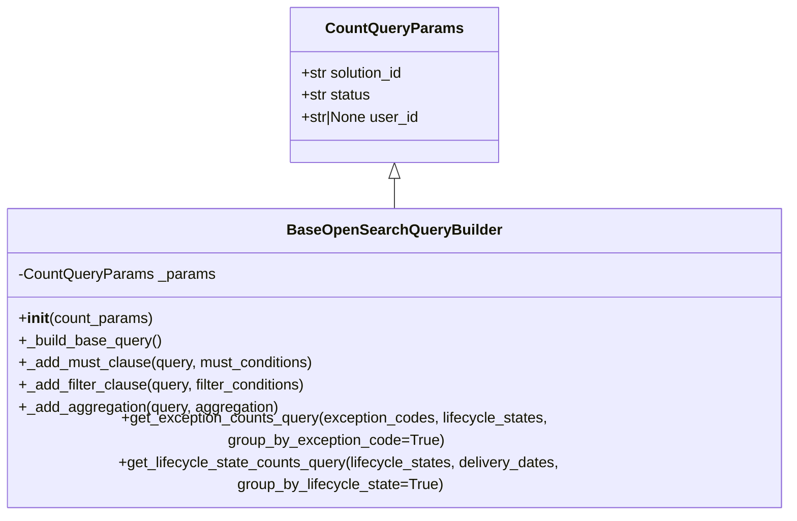

# Diagram: partview_core/partview_service/partview_service/api/dashboard/dynamic_widget/query_builders/base_open_search.py


> Auto-generated by Obscura crawlers

## Diagram 1



### SVG

<svg id="container" width="859.9921875" xmlns="http://www.w3.org/2000/svg" class="classDiagram" height="522" viewBox="0 0 859.9921875 522" role="graphics-document document" aria-roledescription="class"><style>#container{font-family:"trebuchet ms",verdana,arial,sans-serif;font-size:16px;fill:#333;}@keyframes edge-animation-frame{from{stroke-dashoffset:0;}}@keyframes dash{to{stroke-dashoffset:0;}}#container .edge-animation-slow{stroke-dasharray:9,5!important;stroke-dashoffset:900;animation:dash 50s linear infinite;stroke-linecap:round;}#container .edge-animation-fast{stroke-dasharray:9,5!important;stroke-dashoffset:900;animation:dash 20s linear infinite;stroke-linecap:round;}#container .error-icon{fill:#552222;}#container .error-text{fill:#552222;stroke:#552222;}#container .edge-thickness-normal{stroke-width:1px;}#container .edge-thickness-thick{stroke-width:3.5px;}#container .edge-pattern-solid{stroke-dasharray:0;}#container .edge-thickness-invisible{stroke-width:0;fill:none;}#container .edge-pattern-dashed{stroke-dasharray:3;}#container .edge-pattern-dotted{stroke-dasharray:2;}#container .marker{fill:#333333;stroke:#333333;}#container .marker.cross{stroke:#333333;}#container svg{font-family:"trebuchet ms",verdana,arial,sans-serif;font-size:16px;}#container p{margin:0;}#container g.classGroup text{fill:#9370DB;stroke:none;font-family:"trebuchet ms",verdana,arial,sans-serif;font-size:10px;}#container g.classGroup text .title{font-weight:bolder;}#container .nodeLabel,#container .edgeLabel{color:#131300;}#container .edgeLabel .label rect{fill:#ECECFF;}#container .label text{fill:#131300;}#container .labelBkg{background:#ECECFF;}#container .edgeLabel .label span{background:#ECECFF;}#container .classTitle{font-weight:bolder;}#container .node rect,#container .node circle,#container .node ellipse,#container .node polygon,#container .node path{fill:#ECECFF;stroke:#9370DB;stroke-width:1px;}#container .divider{stroke:#9370DB;stroke-width:1;}#container g.clickable{cursor:pointer;}#container g.classGroup rect{fill:#ECECFF;stroke:#9370DB;}#container g.classGroup line{stroke:#9370DB;stroke-width:1;}#container .classLabel .box{stroke:none;stroke-width:0;fill:#ECECFF;opacity:0.5;}#container .classLabel .label{fill:#9370DB;font-size:10px;}#container .relation{stroke:#333333;stroke-width:1;fill:none;}#container .dashed-line{stroke-dasharray:3;}#container .dotted-line{stroke-dasharray:1 2;}#container #compositionStart,#container .composition{fill:#333333!important;stroke:#333333!important;stroke-width:1;}#container #compositionEnd,#container .composition{fill:#333333!important;stroke:#333333!important;stroke-width:1;}#container #dependencyStart,#container .dependency{fill:#333333!important;stroke:#333333!important;stroke-width:1;}#container #dependencyStart,#container .dependency{fill:#333333!important;stroke:#333333!important;stroke-width:1;}#container #extensionStart,#container .extension{fill:transparent!important;stroke:#333333!important;stroke-width:1;}#container #extensionEnd,#container .extension{fill:transparent!important;stroke:#333333!important;stroke-width:1;}#container #aggregationStart,#container .aggregation{fill:transparent!important;stroke:#333333!important;stroke-width:1;}#container #aggregationEnd,#container .aggregation{fill:transparent!important;stroke:#333333!important;stroke-width:1;}#container #lollipopStart,#container .lollipop{fill:#ECECFF!important;stroke:#333333!important;stroke-width:1;}#container #lollipopEnd,#container .lollipop{fill:#ECECFF!important;stroke:#333333!important;stroke-width:1;}#container .edgeTerminals{font-size:11px;line-height:initial;}#container .classTitleText{text-anchor:middle;font-size:18px;fill:#333;}#container .label-icon{display:inline-block;height:1em;overflow:visible;vertical-align:-0.125em;}#container .node .label-icon path{fill:currentColor;stroke:revert;stroke-width:revert;}#container :root{--mermaid-font-family:"trebuchet ms",verdana,arial,sans-serif;}</style><g><defs><marker id="container_class-aggregationStart" class="marker aggregation class" refX="18" refY="7" markerWidth="190" markerHeight="240" orient="auto"><path d="M 18,7 L9,13 L1,7 L9,1 Z"></path></marker></defs><defs><marker id="container_class-aggregationEnd" class="marker aggregation class" refX="1" refY="7" markerWidth="20" markerHeight="28" orient="auto"><path d="M 18,7 L9,13 L1,7 L9,1 Z"></path></marker></defs><defs><marker id="container_class-extensionStart" class="marker extension class" refX="18" refY="7" markerWidth="190" markerHeight="240" orient="auto"><path d="M 1,7 L18,13 V 1 Z"></path></marker></defs><defs><marker id="container_class-extensionEnd" class="marker extension class" refX="1" refY="7" markerWidth="20" markerHeight="28" orient="auto"><path d="M 1,1 V 13 L18,7 Z"></path></marker></defs><defs><marker id="container_class-compositionStart" class="marker composition class" refX="18" refY="7" markerWidth="190" markerHeight="240" orient="auto"><path d="M 18,7 L9,13 L1,7 L9,1 Z"></path></marker></defs><defs><marker id="container_class-compositionEnd" class="marker composition class" refX="1" refY="7" markerWidth="20" markerHeight="28" orient="auto"><path d="M 18,7 L9,13 L1,7 L9,1 Z"></path></marker></defs><defs><marker id="container_class-dependencyStart" class="marker dependency class" refX="6" refY="7" markerWidth="190" markerHeight="240" orient="auto"><path d="M 5,7 L9,13 L1,7 L9,1 Z"></path></marker></defs><defs><marker id="container_class-dependencyEnd" class="marker dependency class" refX="13" refY="7" markerWidth="20" markerHeight="28" orient="auto"><path d="M 18,7 L9,13 L14,7 L9,1 Z"></path></marker></defs><defs><marker id="container_class-lollipopStart" class="marker lollipop class" refX="13" refY="7" markerWidth="190" markerHeight="240" orient="auto"><circle stroke="black" fill="transparent" cx="7" cy="7" r="6"></circle></marker></defs><defs><marker id="container_class-lollipopEnd" class="marker lollipop class" refX="1" refY="7" markerWidth="190" markerHeight="240" orient="auto"><circle stroke="black" fill="transparent" cx="7" cy="7" r="6"></circle></marker></defs><g class="root"><g class="clusters"></g><g class="edgePaths"><path d="M429.996,193.25L429.996,194.542C429.996,195.833,429.996,198.417,429.996,203.875C429.996,209.333,429.996,217.667,429.996,221.833L429.996,226" id="id_CountQueryParams_BaseOpenSearchQueryBuilder_1" class="edge-thickness-normal edge-pattern-solid relation" style=";;;" data-edge="true" data-et="edge" data-id="id_CountQueryParams_BaseOpenSearchQueryBuilder_1" data-points="W3sieCI6NDI5Ljk5NjA5Mzc1LCJ5IjoxNzZ9LHsieCI6NDI5Ljk5NjA5Mzc1LCJ5IjoyMDF9LHsieCI6NDI5Ljk5NjA5Mzc1LCJ5IjoyMjZ9XQ==" marker-start="url(#container_class-extensionStart)"></path></g><g class="edgeLabels"><g class="edgeLabel"><g class="label" data-id="id_CountQueryParams_BaseOpenSearchQueryBuilder_1" transform="translate(0, 0)"><foreignObject width="0" height="0"><div xmlns="http://www.w3.org/1999/xhtml" class="labelBkg" style="display: table-cell; white-space: nowrap; line-height: 1.5; max-width: 200px; text-align: center;"><span class="edgeLabel"></span></div></foreignObject></g></g></g><g class="nodes"><g class="node default" id="classId-CountQueryParams-0" transform="translate(429.99609375, 92)"><g class="basic label-container"><path d="M-111.61328125 -84 L111.61328125 -84 L111.61328125 84 L-111.61328125 84" stroke="none" stroke-width="0" fill="#ECECFF" style=""></path><path d="M-111.61328125 -84 C-37.542171315702504 -84, 36.52893861859499 -84, 111.61328125 -84 M-111.61328125 -84 C-61.1241730243124 -84, -10.635064798624796 -84, 111.61328125 -84 M111.61328125 -84 C111.61328125 -49.20726452264001, 111.61328125 -14.41452904528002, 111.61328125 84 M111.61328125 -84 C111.61328125 -37.323419930345295, 111.61328125 9.35316013930941, 111.61328125 84 M111.61328125 84 C61.4361994279691 84, 11.2591176059382 84, -111.61328125 84 M111.61328125 84 C44.95843714996495 84, -21.6964069500701 84, -111.61328125 84 M-111.61328125 84 C-111.61328125 36.94215104978619, -111.61328125 -10.11569790042762, -111.61328125 -84 M-111.61328125 84 C-111.61328125 28.167648410532777, -111.61328125 -27.664703178934445, -111.61328125 -84" stroke="#9370DB" stroke-width="1.3" fill="none" stroke-dasharray="0 0" style=""></path></g><g class="annotation-group text" transform="translate(0, -60)"></g><g class="label-group text" transform="translate(-69.9609375, -60)"><g class="label" style="font-weight: bolder" transform="translate(0,-12)"><foreignObject width="139.921875" height="24"><div xmlns="http://www.w3.org/1999/xhtml" style="display: table-cell; white-space: nowrap; line-height: 1.5; max-width: 188px; text-align: center;"><span class="nodeLabel markdown-node-label" style=""><p>CountQueryParams</p></span></div></foreignObject></g></g><g class="members-group text" transform="translate(-99.61328125, -12)"><g class="label" style="" transform="translate(0,-12)"><foreignObject width="113.875" height="24"><div xmlns="http://www.w3.org/1999/xhtml" style="display: table-cell; white-space: nowrap; line-height: 1.5; max-width: 171px; text-align: center;"><span class="nodeLabel markdown-node-label" style=""><p>+str solution_id</p></span></div></foreignObject></g><g class="label" style="" transform="translate(0,12)"><foreignObject width="76.0625" height="24"><div xmlns="http://www.w3.org/1999/xhtml" style="display: table-cell; white-space: nowrap; line-height: 1.5; max-width: 133px; text-align: center;"><span class="nodeLabel markdown-node-label" style=""><p>+str status</p></span></div></foreignObject></g><g class="label" style="" transform="translate(0,36)"><foreignObject width="129.265625" height="24"><div xmlns="http://www.w3.org/1999/xhtml" style="display: table-cell; white-space: nowrap; line-height: 1.5; max-width: 187px; text-align: center;"><span class="nodeLabel markdown-node-label" style=""><p>+str|None user_id</p></span></div></foreignObject></g></g><g class="methods-group text" transform="translate(-99.61328125, 84)"></g><g class="divider" style=""><path d="M-111.61328125 -36 C-62.4453764540899 -36, -13.277471658179806 -36, 111.61328125 -36 M-111.61328125 -36 C-51.14384020393133 -36, 9.325600842137334 -36, 111.61328125 -36" stroke="#9370DB" stroke-width="1.3" fill="none" stroke-dasharray="0 0" style=""></path></g><g class="divider" style=""><path d="M-111.61328125 60 C-30.073847489863482 60, 51.465586270273036 60, 111.61328125 60 M-111.61328125 60 C-58.51954277616723 60, -5.4258043023344555 60, 111.61328125 60" stroke="#9370DB" stroke-width="1.3" fill="none" stroke-dasharray="0 0" style=""></path></g></g><g class="node default" id="classId-BaseOpenSearchQueryBuilder-1" transform="translate(429.99609375, 370)"><g class="basic label-container"><path d="M-421.99609375 -144 L421.99609375 -144 L421.99609375 144 L-421.99609375 144" stroke="none" stroke-width="0" fill="#ECECFF" style=""></path><path d="M-421.99609375 -144 C-120.6786605893879 -144, 180.6387725712242 -144, 421.99609375 -144 M-421.99609375 -144 C-165.73115250449365 -144, 90.5337887410127 -144, 421.99609375 -144 M421.99609375 -144 C421.99609375 -78.14196098021877, 421.99609375 -12.283921960437539, 421.99609375 144 M421.99609375 -144 C421.99609375 -62.00298035292262, 421.99609375 19.99403929415476, 421.99609375 144 M421.99609375 144 C97.02085320510326 144, -227.95438733979347 144, -421.99609375 144 M421.99609375 144 C90.51163991585298 144, -240.97281391829404 144, -421.99609375 144 M-421.99609375 144 C-421.99609375 72.35802975707168, -421.99609375 0.7160595141433532, -421.99609375 -144 M-421.99609375 144 C-421.99609375 60.141588809138966, -421.99609375 -23.716822381722068, -421.99609375 -144" stroke="#9370DB" stroke-width="1.3" fill="none" stroke-dasharray="0 0" style=""></path></g><g class="annotation-group text" transform="translate(0, -120)"></g><g class="label-group text" transform="translate(-109.9609375, -120)"><g class="label" style="font-weight: bolder" transform="translate(0,-12)"><foreignObject width="219.921875" height="24"><div xmlns="http://www.w3.org/1999/xhtml" style="display: table-cell; white-space: nowrap; line-height: 1.5; max-width: 268px; text-align: center;"><span class="nodeLabel markdown-node-label" style=""><p>BaseOpenSearchQueryBuilder</p></span></div></foreignObject></g></g><g class="members-group text" transform="translate(-409.99609375, -72)"><g class="label" style="" transform="translate(0,-12)"><foreignObject width="210.78125" height="24"><div xmlns="http://www.w3.org/1999/xhtml" style="display: table-cell; white-space: nowrap; line-height: 1.5; max-width: 268px; text-align: center;"><span class="nodeLabel markdown-node-label" style=""><p>-CountQueryParams _params</p></span></div></foreignObject></g></g><g class="methods-group text" transform="translate(-409.99609375, -24)"><g class="label" style="" transform="translate(0,-12)"><foreignObject width="145.8125" height="24"><div xmlns="http://www.w3.org/1999/xhtml" style="display: table-cell; white-space: nowrap; line-height: 1.5; max-width: 235px; text-align: center;"><span class="nodeLabel markdown-node-label" style=""><p>+<strong>init</strong>(count_params)</p></span></div></foreignObject></g><g class="label" style="" transform="translate(0,12)"><foreignObject width="154.625" height="24"><div xmlns="http://www.w3.org/1999/xhtml" style="display: table-cell; white-space: nowrap; line-height: 1.5; max-width: 212px; text-align: center;"><span class="nodeLabel markdown-node-label" style=""><p>+_build_base_query()</p></span></div></foreignObject></g><g class="label" style="" transform="translate(0,36)"><foreignObject width="321.9375" height="24"><div xmlns="http://www.w3.org/1999/xhtml" style="display: table-cell; white-space: nowrap; line-height: 1.5; max-width: 379px; text-align: center;"><span class="nodeLabel markdown-node-label" style=""><p>+_add_must_clause(query, must_conditions)</p></span></div></foreignObject></g><g class="label" style="" transform="translate(0,60)"><foreignObject width="315.15625" height="24"><div xmlns="http://www.w3.org/1999/xhtml" style="display: table-cell; white-space: nowrap; line-height: 1.5; max-width: 373px; text-align: center;"><span class="nodeLabel markdown-node-label" style=""><p>+_add_filter_clause(query, filter_conditions)</p></span></div></foreignObject></g><g class="label" style="" transform="translate(0,84)"><foreignObject width="280.671875" height="24"><div xmlns="http://www.w3.org/1999/xhtml" style="display: table-cell; white-space: nowrap; line-height: 1.5; max-width: 338px; text-align: center;"><span class="nodeLabel markdown-node-label" style=""><p>+_add_aggregation(query, aggregation)</p></span></div></foreignObject></g><g class="label" style="" transform="translate(0,108)"><foreignObject width="702.796875" height="24"><div xmlns="http://www.w3.org/1999/xhtml" style="display: table-cell; white-space: nowrap; line-height: 1.5; max-width: 760px; text-align: center;"><span class="nodeLabel markdown-node-label" style=""><p>+get_exception_counts_query(exception_codes, lifecycle_states, group_by_exception_code=True)</p></span></div></foreignObject></g><g class="label" style="" transform="translate(0,132)"><foreignObject width="710.03125" height="24"><div xmlns="http://www.w3.org/1999/xhtml" style="display: table-cell; white-space: nowrap; line-height: 1.5; max-width: 767px; text-align: center;"><span class="nodeLabel markdown-node-label" style=""><p>+get_lifecycle_state_counts_query(lifecycle_states, delivery_dates, group_by_lifecycle_state=True)</p></span></div></foreignObject></g></g><g class="divider" style=""><path d="M-421.99609375 -96 C-228.62462301248286 -96, -35.253152274965714 -96, 421.99609375 -96 M-421.99609375 -96 C-146.83512570793653 -96, 128.32584233412695 -96, 421.99609375 -96" stroke="#9370DB" stroke-width="1.3" fill="none" stroke-dasharray="0 0" style=""></path></g><g class="divider" style=""><path d="M-421.99609375 -48 C-145.35763334243336 -48, 131.28082706513328 -48, 421.99609375 -48 M-421.99609375 -48 C-139.87154469821263 -48, 142.25300435357474 -48, 421.99609375 -48" stroke="#9370DB" stroke-width="1.3" fill="none" stroke-dasharray="0 0" style=""></path></g></g></g></g></g></svg>

## Diagram 2

```mermaid
flowchart TD
    A[Instantiate CountQueryParams] --> B[BaseOpenSearchQueryBuilder.__init__]
    B --> C[_build_base_query]
    C --> D{Add filters?}
    D -->|exception_codes| E[_add_filter_clause (terms activeExceptions.reasonCode)]
    D -->|lifecycle_states| F[_add_filter_clause (terms lifecycleState)]
    C --> G{Add delivery date range?}
    G -->|yes| H[_add_must_clause (range destinationDetail.arrivalTs)]
    E --> I{Group by exception code?}
    I -->|yes| J[_add_aggregation (EXCEPTION_CODES terms)]
    F --> K{Group by lifecycle state?}
    K -->|yes| L[_add_aggregation (LIFECYCLE_STATE_COUNTS terms)]
    H --> K
    J --> M[Return aggregated query]
    L --> M
    I -->|no| N[Return query without aggregation]
    K -->|no| N
    N --> M
```

> SVG rendering failed for this diagram.
