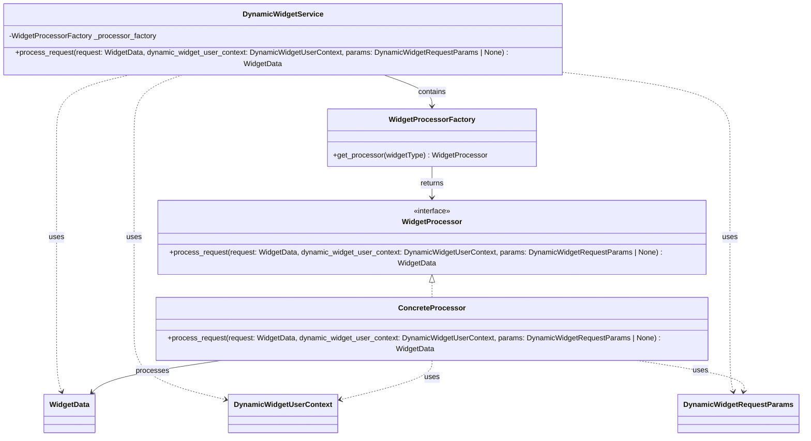

# Diagram: partview_core/partview_service/partview_service/api/dashboard/dynamic_widget/service.py

> Auto-generated by Obscura crawlers

## Mermaid

### SVG

<svg id="container" width="1803.849609375" xmlns="http://www.w3.org/2000/svg" class="classDiagram" height="918" viewBox="0 0 1803.849609375 918" role="graphics-document document" aria-roledescription="class"><g><defs><marker id="container_class-aggregationStart" class="marker aggregation class" refX="18" refY="7" markerWidth="190" markerHeight="240" orient="auto"><path d="M 18,7 L9,13 L1,7 L9,1 Z"></path></marker></defs><defs><marker id="container_class-aggregationEnd" class="marker aggregation class" refX="1" refY="7" markerWidth="20" markerHeight="28" orient="auto"><path d="M 18,7 L9,13 L1,7 L9,1 Z"></path></marker></defs><defs><marker id="container_class-extensionStart" class="marker extension class" refX="18" refY="7" markerWidth="190" markerHeight="240" orient="auto"><path d="M 1,7 L18,13 V 1 Z"></path></marker></defs><defs><marker id="container_class-extensionEnd" class="marker extension class" refX="1" refY="7" markerWidth="20" markerHeight="28" orient="auto"><path d="M 1,1 V 13 L18,7 Z"></path></marker></defs><defs><marker id="container_class-compositionStart" class="marker composition class" refX="18" refY="7" markerWidth="190" markerHeight="240" orient="auto"><path d="M 18,7 L9,13 L1,7 L9,1 Z"></path></marker></defs><defs><marker id="container_class-compositionEnd" class="marker composition class" refX="1" refY="7" markerWidth="20" markerHeight="28" orient="auto"><path d="M 18,7 L9,13 L1,7 L9,1 Z"></path></marker></defs><defs><marker id="container_class-dependencyStart" class="marker dependency class" refX="6" refY="7" markerWidth="190" markerHeight="240" orient="auto"><path d="M 5,7 L9,13 L1,7 L9,1 Z"></path></marker></defs><defs><marker id="container_class-dependencyEnd" class="marker dependency class" refX="13" refY="7" markerWidth="20" markerHeight="28" orient="auto"><path d="M 18,7 L9,13 L14,7 L9,1 Z"></path></marker></defs><defs><marker id="container_class-lollipopStart" class="marker lollipop class" refX="13" refY="7" markerWidth="190" markerHeight="240" orient="auto"><circle stroke="black" fill="transparent" cx="7" cy="7" r="6"></circle></marker></defs><defs><marker id="container_class-lollipopEnd" class="marker lollipop class" refX="1" refY="7" markerWidth="190" markerHeight="240" orient="auto"><circle stroke="black" fill="transparent" cx="7" cy="7" r="6"></circle></marker></defs><g class="root"><g class="clusters"></g><g class="edgePaths"><path d="M863.907,152L882.969,158.167C902.031,164.333,940.155,176.667,959.217,188C978.279,199.333,978.279,209.667,978.279,214.833L978.279,220" id="id_DynamicWidgetService_WidgetProcessorFactory_1" class="edge-thickness-normal edge-pattern-solid relation" style=";;;" data-edge="true" data-et="edge" data-id="id_DynamicWidgetService_WidgetProcessorFactory_1" data-points="W3sieCI6ODYzLjkwNjY4MDA0NTg3MTYsInkiOjE1Mn0seyJ4Ijo5NzguMjc5Mjk2ODc1LCJ5IjoxODl9LHsieCI6OTc4LjI3OTI5Njg3NSwieSI6MjI2fV0=" marker-end="url(#container_class-dependencyEnd)"></path><path d="M309.911,152L281.525,158.167C253.138,164.333,196.365,176.667,167.978,199.5C139.592,222.333,139.592,255.667,139.592,289C139.592,322.333,139.592,355.667,139.592,391C139.592,426.333,139.592,463.667,139.592,499C139.592,534.333,139.592,567.667,139.592,599C139.592,630.333,139.592,659.667,139.592,691C139.592,722.333,139.592,755.667,141.436,777.557C143.281,799.447,146.97,809.895,148.814,815.119L150.659,820.342" id="id_DynamicWidgetService_WidgetData_2" class="edge-thickness-normal edge-pattern-dashed relation" style=";;;" data-edge="true" data-et="edge" data-id="id_DynamicWidgetService_WidgetData_2" data-points="W3sieCI6MzA5LjkxMTI2NzIwMTgzNDg1LCJ5IjoxNTJ9LHsieCI6MTM5LjU5MTc5Njg3NSwieSI6MTg5fSx7IngiOjEzOS41OTE3OTY4NzUsInkiOjI4OX0seyJ4IjoxMzkuNTkxNzk2ODc1LCJ5IjozODl9LHsieCI6MTM5LjU5MTc5Njg3NSwieSI6NTAxfSx7IngiOjEzOS41OTE3OTY4NzUsInkiOjYwMX0seyJ4IjoxMzkuNTkxNzk2ODc1LCJ5Ijo2ODl9LHsieCI6MTM5LjU5MTc5Njg3NSwieSI6Nzg5fSx7IngiOjE1Mi42NTYzMjQxNjkzMDM4LCJ5Ijo4MjZ9XQ==" marker-end="url(#container_class-dependencyEnd)"></path><path d="M418.781,152L399.719,158.167C380.657,164.333,342.532,176.667,323.47,199.5C304.408,222.333,304.408,255.667,304.408,289C304.408,322.333,304.408,355.667,304.408,391C304.408,426.333,304.408,463.667,304.408,499C304.408,534.333,304.408,567.667,304.408,599C304.408,630.333,304.408,659.667,304.408,691C304.408,722.333,304.408,755.667,340.658,780.833C376.908,805.999,449.408,822.998,485.658,831.497L521.908,839.996" id="id_DynamicWidgetService_DynamicWidgetUserContext_3" class="edge-thickness-normal edge-pattern-dashed relation" style=";;;" data-edge="true" data-et="edge" data-id="id_DynamicWidgetService_DynamicWidgetUserContext_3" data-points="W3sieCI6NDE4Ljc4MDgxOTk1NDEyODQ1LCJ5IjoxNTJ9LHsieCI6MzA0LjQwODIwMzEyNSwieSI6MTg5fSx7IngiOjMwNC40MDgyMDMxMjUsInkiOjI4OX0seyJ4IjozMDQuNDA4MjAzMTI1LCJ5IjozODl9LHsieCI6MzA0LjQwODIwMzEyNSwieSI6NTAxfSx7IngiOjMwNC40MDgyMDMxMjUsInkiOjYwMX0seyJ4IjozMDQuNDA4MjAzMTI1LCJ5Ijo2ODl9LHsieCI6MzA0LjQwODIwMzEyNSwieSI6Nzg5fSx7IngiOjUyNy43NSwieSI6ODQxLjM2NjEwNDE5MDQ1NzV9XQ==" marker-end="url(#container_class-dependencyEnd)"></path><path d="M1274.688,148.296L1337.598,155.08C1400.508,161.864,1526.329,175.432,1589.24,198.883C1652.15,222.333,1652.15,255.667,1652.15,289C1652.15,322.333,1652.15,355.667,1652.15,391C1652.15,426.333,1652.15,463.667,1652.15,499C1652.15,534.333,1652.15,567.667,1652.15,599C1652.15,630.333,1652.15,659.667,1652.15,691C1652.15,722.333,1652.15,755.667,1653.35,777.526C1654.549,799.385,1656.947,809.769,1658.147,814.962L1659.346,820.154" id="id_DynamicWidgetService_DynamicWidgetRequestParams_4" class="edge-thickness-normal edge-pattern-dashed relation" style=";;;" data-edge="true" data-et="edge" data-id="id_DynamicWidgetService_DynamicWidgetRequestParams_4" data-points="W3sieCI6MTI3NC42ODc1LCJ5IjoxNDguMjk2NDEzOTQ4NDgyNX0seyJ4IjoxNjUyLjE1MDM5MDYyNSwieSI6MTg5fSx7IngiOjE2NTIuMTUwMzkwNjI1LCJ5IjoyODl9LHsieCI6MTY1Mi4xNTAzOTA2MjUsInkiOjM4OX0seyJ4IjoxNjUyLjE1MDM5MDYyNSwieSI6NTAxfSx7IngiOjE2NTIuMTUwMzkwNjI1LCJ5Ijo2MDF9LHsieCI6MTY1Mi4xNTAzOTA2MjUsInkiOjY4OX0seyJ4IjoxNjUyLjE1MDM5MDYyNSwieSI6Nzg5fSx7IngiOjE2NjAuNjk2MDI5NDY5OTM2OCwieSI6ODI2fV0=" marker-end="url(#container_class-dependencyEnd)"></path><path d="M978.279,352L978.279,358.167C978.279,364.333,978.279,376.667,978.279,388C978.279,399.333,978.279,409.667,978.279,414.833L978.279,420" id="id_WidgetProcessorFactory_WidgetProcessor_5" class="edge-thickness-normal edge-pattern-solid relation" style=";;;" data-edge="true" data-et="edge" data-id="id_WidgetProcessorFactory_WidgetProcessor_5" data-points="W3sieCI6OTc4LjI3OTI5Njg3NSwieSI6MzUyfSx7IngiOjk3OC4yNzkyOTY4NzUsInkiOjM4OX0seyJ4Ijo5NzguMjc5Mjk2ODc1LCJ5Ijo0MjZ9XQ==" marker-end="url(#container_class-dependencyEnd)"></path><path d="M978.279,593.25L978.279,594.542C978.279,595.833,978.279,598.417,978.279,603.875C978.279,609.333,978.279,617.667,978.279,621.833L978.279,626" id="id_WidgetProcessor_ConcreteProcessor_6" class="edge-thickness-normal edge-pattern-dashed relation" style=";;;" data-edge="true" data-et="edge" data-id="id_WidgetProcessor_ConcreteProcessor_6" data-points="W3sieCI6OTc4LjI3OTI5Njg3NSwieSI6NTc2fSx7IngiOjk3OC4yNzkyOTY4NzUsInkiOjYwMX0seyJ4Ijo5NzguMjc5Mjk2ODc1LCJ5Ijo2MjZ9XQ==" marker-start="url(#container_class-extensionStart)"></path><path d="M518.593,752L473.598,758.167C428.602,764.333,338.611,776.667,287.998,788.302C237.386,799.938,226.152,810.876,220.536,816.345L214.919,821.814" id="id_ConcreteProcessor_WidgetData_7" class="edge-thickness-normal edge-pattern-solid relation" style=";;;" data-edge="true" data-et="edge" data-id="id_ConcreteProcessor_WidgetData_7" data-points="W3sieCI6NTE4LjU5MzM5ODQzNzUsInkiOjc1Mn0seyJ4IjoyNDguNjE5MTQwNjI1LCJ5Ijo3ODl9LHsieCI6MjEwLjYyMDIyODQ0MTQ1NTcsInkiOjgyNn1d" marker-end="url(#container_class-dependencyEnd)"></path><path d="M978.279,752L978.279,758.167C978.279,764.333,978.279,776.667,942.029,791.333C905.779,805.999,833.279,822.998,797.029,831.497L760.779,839.996" id="id_ConcreteProcessor_DynamicWidgetUserContext_8" class="edge-thickness-normal edge-pattern-dashed relation" style=";;;" data-edge="true" data-et="edge" data-id="id_ConcreteProcessor_DynamicWidgetUserContext_8" data-points="W3sieCI6OTc4LjI3OTI5Njg3NSwieSI6NzUyfSx7IngiOjk3OC4yNzkyOTY4NzUsInkiOjc4OX0seyJ4Ijo3NTQuOTM3NSwieSI6ODQxLjM2NjEwNDE5MDQ1NzV9XQ==" marker-end="url(#container_class-dependencyEnd)"></path><path d="M1425.808,752L1469.614,758.167C1513.42,764.333,1601.031,776.667,1643.638,788.026C1686.244,799.385,1683.846,809.769,1682.646,814.962L1681.447,820.154" id="id_ConcreteProcessor_DynamicWidgetRequestParams_9" class="edge-thickness-normal edge-pattern-dashed relation" style=";;;" data-edge="true" data-et="edge" data-id="id_ConcreteProcessor_DynamicWidgetRequestParams_9" data-points="W3sieCI6MTQyNS44MDgxNjQwNjI1LCJ5Ijo3NTJ9LHsieCI6MTY4OC42NDI1NzgxMjUsInkiOjc4OX0seyJ4IjoxNjgwLjA5NjkzOTI4MDA2MzIsInkiOjgyNn1d" marker-end="url(#container_class-dependencyEnd)"></path></g><g class="edgeLabels"><g class="edgeLabel" transform="translate(978.279296875, 189)"><g class="label" data-id="id_DynamicWidgetService_WidgetProcessorFactory_1" transform="translate(-30.890625, -12)"><foreignObject width="61.78125" height="24">

contains

</foreignObject></g></g><g class="edgeLabel" transform="translate(139.591796875, 501)"><g class="label" data-id="id_DynamicWidgetService_WidgetData_2" transform="translate(-16.4921875, -12)"><foreignObject width="32.984375" height="24">

uses

</foreignObject></g></g><g class="edgeLabel" transform="translate(304.408203125, 501)"><g class="label" data-id="id_DynamicWidgetService_DynamicWidgetUserContext_3" transform="translate(-16.4921875, -12)"><foreignObject width="32.984375" height="24">

uses

</foreignObject></g></g><g class="edgeLabel" transform="translate(1652.150390625, 501)"><g class="label" data-id="id_DynamicWidgetService_DynamicWidgetRequestParams_4" transform="translate(-16.4921875, -12)"><foreignObject width="32.984375" height="24">

uses

</foreignObject></g></g><g class="edgeLabel" transform="translate(978.279296875, 389)"><g class="label" data-id="id_WidgetProcessorFactory_WidgetProcessor_5" transform="translate(-26.265625, -12)"><foreignObject width="52.53125" height="24">

returns

</foreignObject></g></g><g class="edgeLabel"><g class="label" data-id="id_WidgetProcessor_ConcreteProcessor_6" transform="translate(0, 0)"><foreignObject width="0" height="0">

</foreignObject></g></g><g class="edgeLabel" transform="translate(357.33339, 774.1007)"><g class="label" data-id="id_ConcreteProcessor_WidgetData_7" transform="translate(-35.7890625, -12)"><foreignObject width="71.578125" height="24">

processes

</foreignObject></g></g><g class="edgeLabel" transform="translate(978.279296875, 789)"><g class="label" data-id="id_ConcreteProcessor_DynamicWidgetUserContext_8" transform="translate(-16.4921875, -12)"><foreignObject width="32.984375" height="24">

uses

</foreignObject></g></g><g class="edgeLabel" transform="translate(1576.02701, 773.14676)"><g class="label" data-id="id_ConcreteProcessor_DynamicWidgetRequestParams_9" transform="translate(-16.4921875, -12)"><foreignObject width="32.984375" height="24">

uses

</foreignObject></g></g></g><g class="nodes"><g class="node default" id="classId-DynamicWidgetService-0" transform="translate(641.34375, 80)"><g class="basic label-container"><path d="M-633.34375 -72 L633.34375 -72 L633.34375 72 L-633.34375 72" stroke="none" stroke-width="0" fill="#ECECFF" style=""></path><path d="M-633.34375 -72 C-250.38600459186847 -72, 132.57174081626306 -72, 633.34375 -72 M-633.34375 -72 C-213.67963389245642 -72, 205.98448221508716 -72, 633.34375 -72 M633.34375 -72 C633.34375 -36.00747862616307, 633.34375 -0.014957252326141202, 633.34375 72 M633.34375 -72 C633.34375 -31.588708375291922, 633.34375 8.822583249416155, 633.34375 72 M633.34375 72 C141.93209538791956 72, -349.4795592241609 72, -633.34375 72 M633.34375 72 C167.0504751287063 72, -299.2427997425874 72, -633.34375 72 M-633.34375 72 C-633.34375 31.86525015438155, -633.34375 -8.269499691236902, -633.34375 -72 M-633.34375 72 C-633.34375 37.91399034311914, -633.34375 3.827980686238277, -633.34375 -72" stroke="#9370DB" stroke-width="1.3" fill="none" stroke-dasharray="0 0" style=""></path></g><g class="annotation-group text" transform="translate(0, -48)"></g><g class="label-group text" transform="translate(-83.421875, -48)"><g class="label" style="font-weight: bolder" transform="translate(0,-12)"><foreignObject width="166.84375" height="24">

DynamicWidgetService

</foreignObject></g></g><g class="members-group text" transform="translate(-621.34375, 0)"><g class="label" style="" transform="translate(0,-12)"><foreignObject width="319.328125" height="24">

-WidgetProcessorFactory _processor_factory

</foreignObject></g></g><g class="methods-group text" transform="translate(-621.34375, 48)"><g class="label" style="" transform="translate(0,-12)"><foreignObject width="1159.265625" height="24">

+process_request(request: WidgetData, dynamic_widget_user_context: DynamicWidgetUserContext, params: DynamicWidgetRequestParams | None) : WidgetData

</foreignObject></g></g><g class="divider" style=""><path d="M-633.34375 -24 C-242.85013648285883 -24, 147.64347703428234 -24, 633.34375 -24 M-633.34375 -24 C-130.2039886995314 -24, 372.9357726009372 -24, 633.34375 -24" stroke="#9370DB" stroke-width="1.3" fill="none" stroke-dasharray="0 0" style=""></path></g><g class="divider" style=""><path d="M-633.34375 24 C-126.92794876376757 24, 379.48785247246485 24, 633.34375 24 M-633.34375 24 C-133.26268987970928 24, 366.81837024058143 24, 633.34375 24" stroke="#9370DB" stroke-width="1.3" fill="none" stroke-dasharray="0 0" style=""></path></g></g><g class="node default" id="classId-WidgetProcessorFactory-1" transform="translate(978.279296875, 289)"><g class="basic label-container"><path d="M-223.3046875 -63 L223.3046875 -63 L223.3046875 63 L-223.3046875 63" stroke="none" stroke-width="0" fill="#ECECFF" style=""></path><path d="M-223.3046875 -63 C-53.16745840040491 -63, 116.96977069919018 -63, 223.3046875 -63 M-223.3046875 -63 C-54.624747147525085 -63, 114.05519320494983 -63, 223.3046875 -63 M223.3046875 -63 C223.3046875 -13.742872008471942, 223.3046875 35.51425598305612, 223.3046875 63 M223.3046875 -63 C223.3046875 -15.928883483438796, 223.3046875 31.14223303312241, 223.3046875 63 M223.3046875 63 C82.43732658427388 63, -58.43003433145225 63, -223.3046875 63 M223.3046875 63 C90.2364381827889 63, -42.831811134422196 63, -223.3046875 63 M-223.3046875 63 C-223.3046875 29.222156851587293, -223.3046875 -4.555686296825414, -223.3046875 -63 M-223.3046875 63 C-223.3046875 30.93237434137511, -223.3046875 -1.1352513172497822, -223.3046875 -63" stroke="#9370DB" stroke-width="1.3" fill="none" stroke-dasharray="0 0" style=""></path></g><g class="annotation-group text" transform="translate(0, -39)"></g><g class="label-group text" transform="translate(-88.09375, -39)"><g class="label" style="font-weight: bolder" transform="translate(0,-12)"><foreignObject width="176.1875" height="24">

WidgetProcessorFactory

</foreignObject></g></g><g class="members-group text" transform="translate(-211.3046875, 9)"></g><g class="methods-group text" transform="translate(-211.3046875, 39)"><g class="label" style="" transform="translate(0,-12)"><foreignObject width="334.515625" height="24">

+get_processor(widgetType) : WidgetProcessor

</foreignObject></g></g><g class="divider" style=""><path d="M-223.3046875 -15 C-82.13202133749866 -15, 59.04064482500269 -15, 223.3046875 -15 M-223.3046875 -15 C-74.06781336141051 -15, 75.16906077717897 -15, 223.3046875 -15" stroke="#9370DB" stroke-width="1.3" fill="none" stroke-dasharray="0 0" style=""></path></g><g class="divider" style=""><path d="M-223.3046875 9 C-120.7139412016481 9, -18.123194903296195 9, 223.3046875 9 M-223.3046875 9 C-97.83853224659703 9, 27.627623006805948 9, 223.3046875 9" stroke="#9370DB" stroke-width="1.3" fill="none" stroke-dasharray="0 0" style=""></path></g></g><g class="node default" id="classId-WidgetProcessor-2" transform="translate(978.279296875, 501)"><g class="basic label-container"><path d="M-622.37890625 -75 L622.37890625 -75 L622.37890625 75 L-622.37890625 75" stroke="none" stroke-width="0" fill="#ECECFF" style=""></path><path d="M-622.37890625 -75 C-292.81897549211084 -75, 36.740955265778325 -75, 622.37890625 -75 M-622.37890625 -75 C-275.3238779348372 -75, 71.73115038032563 -75, 622.37890625 -75 M622.37890625 -75 C622.37890625 -37.07521053937939, 622.37890625 0.8495789212412177, 622.37890625 75 M622.37890625 -75 C622.37890625 -35.800472627996655, 622.37890625 3.3990547440066905, 622.37890625 75 M622.37890625 75 C141.70635920044282 75, -338.96618784911436 75, -622.37890625 75 M622.37890625 75 C141.0830342792628 75, -340.2128376914744 75, -622.37890625 75 M-622.37890625 75 C-622.37890625 25.646991324079174, -622.37890625 -23.706017351841652, -622.37890625 -75 M-622.37890625 75 C-622.37890625 35.57084592450451, -622.37890625 -3.858308150990979, -622.37890625 -75" stroke="#9370DB" stroke-width="1.3" fill="none" stroke-dasharray="0 0" style=""></path></g><g class="annotation-group text" transform="translate(-41.015625, -51)"><g class="label" style="" transform="translate(0,-12)"><foreignObject width="82.03125" height="24">

«interface»

</foreignObject></g></g><g class="label-group text" transform="translate(-61.4921875, -27)"><g class="label" style="font-weight: bolder" transform="translate(0,-12)"><foreignObject width="122.984375" height="24">

WidgetProcessor

</foreignObject></g></g><g class="members-group text" transform="translate(-610.37890625, 21)"></g><g class="methods-group text" transform="translate(-610.37890625, 51)"><g class="label" style="" transform="translate(0,-12)"><foreignObject width="1159.265625" height="24">

+process_request(request: WidgetData, dynamic_widget_user_context: DynamicWidgetUserContext, params: DynamicWidgetRequestParams | None) : WidgetData

</foreignObject></g></g><g class="divider" style=""><path d="M-622.37890625 -3 C-211.5236151153215 -3, 199.33167601935702 -3, 622.37890625 -3 M-622.37890625 -3 C-365.80241004800706 -3, -109.22591384601412 -3, 622.37890625 -3" stroke="#9370DB" stroke-width="1.3" fill="none" stroke-dasharray="0 0" style=""></path></g><g class="divider" style=""><path d="M-622.37890625 21 C-357.5559589394003 21, -92.73301162880057 21, 622.37890625 21 M-622.37890625 21 C-371.3296327248165 21, -120.2803591996331 21, 622.37890625 21" stroke="#9370DB" stroke-width="1.3" fill="none" stroke-dasharray="0 0" style=""></path></g></g><g class="node default" id="classId-ConcreteProcessor-3" transform="translate(978.279296875, 689)"><g class="basic label-container"><path d="M-625.74609375 -63 L625.74609375 -63 L625.74609375 63 L-625.74609375 63" stroke="none" stroke-width="0" fill="#ECECFF" style=""></path><path d="M-625.74609375 -63 C-356.0425314407928 -63, -86.3389691315856 -63, 625.74609375 -63 M-625.74609375 -63 C-128.56268400417116 -63, 368.6207257416577 -63, 625.74609375 -63 M625.74609375 -63 C625.74609375 -30.866434317204494, 625.74609375 1.2671313655910126, 625.74609375 63 M625.74609375 -63 C625.74609375 -26.543584715138316, 625.74609375 9.912830569723369, 625.74609375 63 M625.74609375 63 C148.7964248098748 63, -328.1532441302504 63, -625.74609375 63 M625.74609375 63 C229.46142680392467 63, -166.82324014215067 63, -625.74609375 63 M-625.74609375 63 C-625.74609375 19.23959133315745, -625.74609375 -24.520817333685102, -625.74609375 -63 M-625.74609375 63 C-625.74609375 26.262758535408423, -625.74609375 -10.474482929183154, -625.74609375 -63" stroke="#9370DB" stroke-width="1.3" fill="none" stroke-dasharray="0 0" style=""></path></g><g class="annotation-group text" transform="translate(0, -39)"></g><g class="label-group text" transform="translate(-68.2265625, -39)"><g class="label" style="font-weight: bolder" transform="translate(0,-12)"><foreignObject width="136.453125" height="24">

ConcreteProcessor

</foreignObject></g></g><g class="members-group text" transform="translate(-613.74609375, 9)"></g><g class="methods-group text" transform="translate(-613.74609375, 39)"><g class="label" style="" transform="translate(0,-12)"><foreignObject width="1159.265625" height="24">

+process_request(request: WidgetData, dynamic_widget_user_context: DynamicWidgetUserContext, params: DynamicWidgetRequestParams | None) : WidgetData

</foreignObject></g></g><g class="divider" style=""><path d="M-625.74609375 -15 C-243.5328421452408 -15, 138.6804094595184 -15, 625.74609375 -15 M-625.74609375 -15 C-370.90147342448176 -15, -116.05685309896347 -15, 625.74609375 -15" stroke="#9370DB" stroke-width="1.3" fill="none" stroke-dasharray="0 0" style=""></path></g><g class="divider" style=""><path d="M-625.74609375 9 C-333.6023830294828 9, -41.45867230896556 9, 625.74609375 9 M-625.74609375 9 C-255.07945685049873 9, 115.58718004900254 9, 625.74609375 9" stroke="#9370DB" stroke-width="1.3" fill="none" stroke-dasharray="0 0" style=""></path></g></g><g class="node default" id="classId-WidgetData-4" transform="translate(167.486328125, 868)"><g class="basic label-container"><path d="M-54.4609375 -42 L54.4609375 -42 L54.4609375 42 L-54.4609375 42" stroke="none" stroke-width="0" fill="#ECECFF" style=""></path><path d="M-54.4609375 -42 C-32.301788587512746 -42, -10.142639675025485 -42, 54.4609375 -42 M-54.4609375 -42 C-11.963649556175149 -42, 30.533638387649702 -42, 54.4609375 -42 M54.4609375 -42 C54.4609375 -16.94712037583791, 54.4609375 8.105759248324183, 54.4609375 42 M54.4609375 -42 C54.4609375 -21.772273862821415, 54.4609375 -1.544547725642829, 54.4609375 42 M54.4609375 42 C14.431661601369271 42, -25.597614297261458 42, -54.4609375 42 M54.4609375 42 C14.818189149701666 42, -24.824559200596667 42, -54.4609375 42 M-54.4609375 42 C-54.4609375 11.266917686469068, -54.4609375 -19.466164627061865, -54.4609375 -42 M-54.4609375 42 C-54.4609375 14.557606285900551, -54.4609375 -12.884787428198898, -54.4609375 -42" stroke="#9370DB" stroke-width="1.3" fill="none" stroke-dasharray="0 0" style=""></path></g><g class="annotation-group text" transform="translate(0, -18)"></g><g class="label-group text" transform="translate(-42.4609375, -18)"><g class="label" style="font-weight: bolder" transform="translate(0,-12)"><foreignObject width="84.921875" height="24">

WidgetData

</foreignObject></g></g><g class="members-group text" transform="translate(-42.4609375, 30)"></g><g class="methods-group text" transform="translate(-42.4609375, 60)"></g><g class="divider" style=""><path d="M-54.4609375 6 C-30.40682101607378 6, -6.352704532147563 6, 54.4609375 6 M-54.4609375 6 C-15.537855155888145 6, 23.38522718822371 6, 54.4609375 6" stroke="#9370DB" stroke-width="1.3" fill="none" stroke-dasharray="0 0" style=""></path></g><g class="divider" style=""><path d="M-54.4609375 24 C-21.479241637518008 24, 11.502454224963984 24, 54.4609375 24 M-54.4609375 24 C-30.401228660968744 24, -6.341519821937489 24, 54.4609375 24" stroke="#9370DB" stroke-width="1.3" fill="none" stroke-dasharray="0 0" style=""></path></g></g><g class="node default" id="classId-DynamicWidgetUserContext-5" transform="translate(641.34375, 868)"><g class="basic label-container"><path d="M-113.59375 -42 L113.59375 -42 L113.59375 42 L-113.59375 42" stroke="none" stroke-width="0" fill="#ECECFF" style=""></path><path d="M-113.59375 -42 C-45.30357099965454 -42, 22.98660800069092 -42, 113.59375 -42 M-113.59375 -42 C-53.2051315633734 -42, 7.183486873253202 -42, 113.59375 -42 M113.59375 -42 C113.59375 -16.236576890288763, 113.59375 9.526846219422474, 113.59375 42 M113.59375 -42 C113.59375 -16.88709268052106, 113.59375 8.225814638957878, 113.59375 42 M113.59375 42 C30.6346652090658 42, -52.3244195818684 42, -113.59375 42 M113.59375 42 C66.92068587327134 42, 20.24762174654269 42, -113.59375 42 M-113.59375 42 C-113.59375 21.386762668408327, -113.59375 0.7735253368166539, -113.59375 -42 M-113.59375 42 C-113.59375 21.175659081419315, -113.59375 0.3513181628386306, -113.59375 -42" stroke="#9370DB" stroke-width="1.3" fill="none" stroke-dasharray="0 0" style=""></path></g><g class="annotation-group text" transform="translate(0, -18)"></g><g class="label-group text" transform="translate(-101.59375, -18)"><g class="label" style="font-weight: bolder" transform="translate(0,-12)"><foreignObject width="203.1875" height="24">

DynamicWidgetUserContext

</foreignObject></g></g><g class="members-group text" transform="translate(-101.59375, 30)"></g><g class="methods-group text" transform="translate(-101.59375, 60)"></g><g class="divider" style=""><path d="M-113.59375 6 C-28.006599475390686 6, 57.58055104921863 6, 113.59375 6 M-113.59375 6 C-30.217800990022297 6, 53.158148019955405 6, 113.59375 6" stroke="#9370DB" stroke-width="1.3" fill="none" stroke-dasharray="0 0" style=""></path></g><g class="divider" style=""><path d="M-113.59375 24 C-29.508272352118496 24, 54.57720529576301 24, 113.59375 24 M-113.59375 24 C-34.205440569982954 24, 45.18286886003409 24, 113.59375 24" stroke="#9370DB" stroke-width="1.3" fill="none" stroke-dasharray="0 0" style=""></path></g></g><g class="node default" id="classId-DynamicWidgetRequestParams-6" transform="translate(1670.396484375, 868)"><g class="basic label-container"><path d="M-125.453125 -42 L125.453125 -42 L125.453125 42 L-125.453125 42" stroke="none" stroke-width="0" fill="#ECECFF" style=""></path><path d="M-125.453125 -42 C-55.96065387027976 -42, 13.531817259440487 -42, 125.453125 -42 M-125.453125 -42 C-37.167388632561256 -42, 51.11834773487749 -42, 125.453125 -42 M125.453125 -42 C125.453125 -16.07464091815571, 125.453125 9.850718163688583, 125.453125 42 M125.453125 -42 C125.453125 -18.785473222597282, 125.453125 4.429053554805435, 125.453125 42 M125.453125 42 C48.71443391685351 42, -28.024257166292983 42, -125.453125 42 M125.453125 42 C39.17043600464717 42, -47.112252990705656 42, -125.453125 42 M-125.453125 42 C-125.453125 9.195830325459362, -125.453125 -23.608339349081277, -125.453125 -42 M-125.453125 42 C-125.453125 22.787091256378318, -125.453125 3.574182512756636, -125.453125 -42" stroke="#9370DB" stroke-width="1.3" fill="none" stroke-dasharray="0 0" style=""></path></g><g class="annotation-group text" transform="translate(0, -18)"></g><g class="label-group text" transform="translate(-113.453125, -18)"><g class="label" style="font-weight: bolder" transform="translate(0,-12)"><foreignObject width="226.90625" height="24">

DynamicWidgetRequestParams

</foreignObject></g></g><g class="members-group text" transform="translate(-113.453125, 30)"></g><g class="methods-group text" transform="translate(-113.453125, 60)"></g><g class="divider" style=""><path d="M-125.453125 6 C-58.38514038853762 6, 8.682844222924757 6, 125.453125 6 M-125.453125 6 C-68.59766347373676 6, -11.742201947473532 6, 125.453125 6" stroke="#9370DB" stroke-width="1.3" fill="none" stroke-dasharray="0 0" style=""></path></g><g class="divider" style=""><path d="M-125.453125 24 C-68.91867045256042 24, -12.38421590512084 24, 125.453125 24 M-125.453125 24 C-36.76253571984765 24, 51.928053560304704 24, 125.453125 24" stroke="#9370DB" stroke-width="1.3" fill="none" stroke-dasharray="0 0" style=""></path></g></g></g></g></g></svg>
