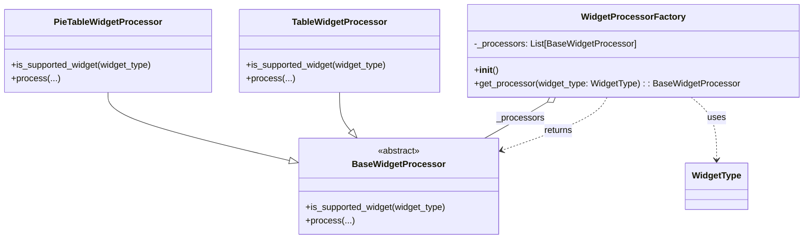

# Diagram: partview_core/partview_service/partview_service/api/dashboard/dynamic_widget/widget_processors/factory.py

> Auto-generated by Obscura crawlers

## Mermaid

### SVG

<svg id="container" width="1440.0078125" xmlns="http://www.w3.org/2000/svg" class="classDiagram" height="432" viewBox="0 0 1440.0078125 432" role="graphics-document document" aria-roledescription="class"><g><defs><marker id="container_class-aggregationStart" class="marker aggregation class" refX="18" refY="7" markerWidth="190" markerHeight="240" orient="auto"><path d="M 18,7 L9,13 L1,7 L9,1 Z"></path></marker></defs><defs><marker id="container_class-aggregationEnd" class="marker aggregation class" refX="1" refY="7" markerWidth="20" markerHeight="28" orient="auto"><path d="M 18,7 L9,13 L1,7 L9,1 Z"></path></marker></defs><defs><marker id="container_class-extensionStart" class="marker extension class" refX="18" refY="7" markerWidth="190" markerHeight="240" orient="auto"><path d="M 1,7 L18,13 V 1 Z"></path></marker></defs><defs><marker id="container_class-extensionEnd" class="marker extension class" refX="1" refY="7" markerWidth="20" markerHeight="28" orient="auto"><path d="M 1,1 V 13 L18,7 Z"></path></marker></defs><defs><marker id="container_class-compositionStart" class="marker composition class" refX="18" refY="7" markerWidth="190" markerHeight="240" orient="auto"><path d="M 18,7 L9,13 L1,7 L9,1 Z"></path></marker></defs><defs><marker id="container_class-compositionEnd" class="marker composition class" refX="1" refY="7" markerWidth="20" markerHeight="28" orient="auto"><path d="M 18,7 L9,13 L1,7 L9,1 Z"></path></marker></defs><defs><marker id="container_class-dependencyStart" class="marker dependency class" refX="6" refY="7" markerWidth="190" markerHeight="240" orient="auto"><path d="M 5,7 L9,13 L1,7 L9,1 Z"></path></marker></defs><defs><marker id="container_class-dependencyEnd" class="marker dependency class" refX="13" refY="7" markerWidth="20" markerHeight="28" orient="auto"><path d="M 18,7 L9,13 L14,7 L9,1 Z"></path></marker></defs><defs><marker id="container_class-lollipopStart" class="marker lollipop class" refX="13" refY="7" markerWidth="190" markerHeight="240" orient="auto"><circle stroke="black" fill="transparent" cx="7" cy="7" r="6"></circle></marker></defs><defs><marker id="container_class-lollipopEnd" class="marker lollipop class" refX="1" refY="7" markerWidth="190" markerHeight="240" orient="auto"><circle stroke="black" fill="transparent" cx="7" cy="7" r="6"></circle></marker></defs><g class="root"><g class="clusters"></g><g class="edgePaths"><path d="M195.148,167L195.148,174.667C195.148,182.333,195.148,197.667,250.023,218.262C304.898,238.858,414.648,264.716,469.522,277.645L524.397,290.574" id="id_PieTableWidgetProcessor_BaseWidgetProcessor_1" class="edge-thickness-normal edge-pattern-solid relation" style=";;;" data-edge="true" data-et="edge" data-id="id_PieTableWidgetProcessor_BaseWidgetProcessor_1" data-points="W3sieCI6MTk1LjE0ODQzNzUsInkiOjE2N30seyJ4IjoxOTUuMTQ4NDM3NSwieSI6MjEzfSx7IngiOjU0MS4xODc1LCJ5IjoyOTQuNTI5NzMzMDk5NzgzMjR9XQ==" marker-end="url(#container_class-extensionEnd)"></path><path d="M613.707,167L613.707,174.667C613.707,182.333,613.707,197.667,617.179,209.33C620.652,220.993,627.596,228.986,631.069,232.982L634.541,236.978" id="id_TableWidgetProcessor_BaseWidgetProcessor_2" class="edge-thickness-normal edge-pattern-solid relation" style=";;;" data-edge="true" data-et="edge" data-id="id_TableWidgetProcessor_BaseWidgetProcessor_2" data-points="W3sieCI6NjEzLjcwNzAzMTI1LCJ5IjoxNjd9LHsieCI6NjEzLjcwNzAzMTI1LCJ5IjoyMTN9LHsieCI6NjQ1Ljg1NDc0NDIwMzYyOSwieSI6MjUwfV0=" marker-end="url(#container_class-extensionEnd)"></path><path d="M985.363,184.948L977.657,189.623C969.951,194.298,954.539,203.649,936.007,214.491C917.476,225.333,895.825,237.667,884.999,243.833L874.174,250" id="id_WidgetProcessorFactory_BaseWidgetProcessor_3" class="edge-thickness-normal edge-pattern-solid relation" style=";;;" data-edge="true" data-et="edge" data-id="id_WidgetProcessorFactory_BaseWidgetProcessor_3" data-points="W3sieCI6MTAwMC4xMTEzNzY1NDk1ODY4LCJ5IjoxNzZ9LHsieCI6OTM5LjEyNjk1MzEyNSwieSI6MjEzfSx7IngiOjg3NC4xNzM1NjAzNTc4NjI5LCJ5IjoyNTB9XQ==" marker-start="url(#container_class-aggregationStart)"></path><path d="M1244.257,176L1252.016,182.167C1259.775,188.333,1275.294,200.667,1283.053,219.5C1290.813,238.333,1290.813,263.667,1290.813,276.333L1290.813,289" id="id_WidgetProcessorFactory_WidgetType_4" class="edge-thickness-normal edge-pattern-dashed relation" style=";;;" data-edge="true" data-et="edge" data-id="id_WidgetProcessorFactory_WidgetType_4" data-points="W3sieCI6MTI0NC4yNTY3MTQ4NzYwMzMxLCJ5IjoxNzZ9LHsieCI6MTI5MC44MTI1LCJ5IjoyMTN9LHsieCI6MTI5MC44MTI1LCJ5IjoyOTV9XQ==" marker-end="url(#container_class-dependencyEnd)"></path><path d="M1092.427,176L1089.04,182.167C1085.653,188.333,1078.879,200.667,1048.035,216.543C1017.19,232.419,962.275,251.838,934.817,261.548L907.36,271.257" id="id_WidgetProcessorFactory_BaseWidgetProcessor_5" class="edge-thickness-normal edge-pattern-dashed relation" style=";;;" data-edge="true" data-et="edge" data-id="id_WidgetProcessorFactory_BaseWidgetProcessor_5" data-points="W3sieCI6MTA5Mi40MjcwNDAyODkyNTYyLCJ5IjoxNzZ9LHsieCI6MTA3Mi4xMDU0Njg3NSwieSI6MjEzfSx7IngiOjkwMS43MDMxMjUsInkiOjI3My4yNTc0NjA4MTYwOTQ2NH1d" marker-end="url(#container_class-dependencyEnd)"></path></g><g class="edgeLabels"><g class="edgeLabel"><g class="label" data-id="id_PieTableWidgetProcessor_BaseWidgetProcessor_1" transform="translate(0, 0)"><foreignObject width="0" height="0">

</foreignObject></g></g><g class="edgeLabel"><g class="label" data-id="id_TableWidgetProcessor_BaseWidgetProcessor_2" transform="translate(0, 0)"><foreignObject width="0" height="0">

</foreignObject></g></g><g class="edgeLabel" transform="translate(937.64041, 213.8468)"><g class="label" data-id="id_WidgetProcessorFactory_BaseWidgetProcessor_3" transform="translate(-43.2265625, -12)"><foreignObject width="86.453125" height="24">

_processors

</foreignObject></g></g><g class="edgeLabel" transform="translate(1290.8125, 213)"><g class="label" data-id="id_WidgetProcessorFactory_WidgetType_4" transform="translate(-16.4921875, -12)"><foreignObject width="32.984375" height="24">

uses

</foreignObject></g></g><g class="edgeLabel" transform="translate(1006.80345, 236.09202)"><g class="label" data-id="id_WidgetProcessorFactory_BaseWidgetProcessor_5" transform="translate(-26.265625, -12)"><foreignObject width="52.53125" height="24">

returns

</foreignObject></g></g><g class="edgeTerminals" transform="translate(977.3691010325202, 172.25314845774534)"><g class="inner" transform="translate(0, 0)"><foreignObject style="width: 9px; height: 12px;">
1
</foreignObject></g></g><g class="edgeTerminals" transform="translate(891.8040156898021, 249.37177199738895)"><g class="inner" transform="translate(0, 0)"></g><foreignObject style="width: 9px; height: 12px;">
*
</foreignObject></g></g><g class="nodes"><g class="node default" id="classId-BaseWidgetProcessor-0" transform="translate(721.4453125, 337)"><g class="basic label-container"><path d="M-180.2578125 -87 L180.2578125 -87 L180.2578125 87 L-180.2578125 87" stroke="none" stroke-width="0" fill="#ECECFF" style=""></path><path d="M-180.2578125 -87 C-84.82705352104556 -87, 10.603705457908887 -87, 180.2578125 -87 M-180.2578125 -87 C-48.23867740649024 -87, 83.78045768701952 -87, 180.2578125 -87 M180.2578125 -87 C180.2578125 -33.08201259664493, 180.2578125 20.83597480671014, 180.2578125 87 M180.2578125 -87 C180.2578125 -18.400655110659258, 180.2578125 50.198689778681484, 180.2578125 87 M180.2578125 87 C58.88158878888716 87, -62.494634922225686 87, -180.2578125 87 M180.2578125 87 C82.80020163703088 87, -14.657409225938238 87, -180.2578125 87 M-180.2578125 87 C-180.2578125 20.618738606808606, -180.2578125 -45.76252278638279, -180.2578125 -87 M-180.2578125 87 C-180.2578125 39.57586814015471, -180.2578125 -7.8482637196905785, -180.2578125 -87" stroke="#9370DB" stroke-width="1.3" fill="none" stroke-dasharray="0 0" style=""></path></g><g class="annotation-group text" transform="translate(-38.609375, -63)"><g class="label" style="" transform="translate(0,-12)"><foreignObject width="77.21875" height="24">

«abstract»

</foreignObject></g></g><g class="label-group text" transform="translate(-79.015625, -39)"><g class="label" style="font-weight: bolder" transform="translate(0,-12)"><foreignObject width="158.03125" height="24">

BaseWidgetProcessor

</foreignObject></g></g><g class="members-group text" transform="translate(-168.2578125, 9)"></g><g class="methods-group text" transform="translate(-168.2578125, 39)"><g class="label" style="" transform="translate(0,-12)"><foreignObject width="257.5" height="24">

+is_supported_widget(widget_type)

</foreignObject></g><g class="label" style="" transform="translate(0,12)"><foreignObject width="85.25" height="24">

+process(...)

</foreignObject></g></g><g class="divider" style=""><path d="M-180.2578125 -15 C-59.1953614492118 -15, 61.867089601576396 -15, 180.2578125 -15 M-180.2578125 -15 C-37.02365003109128 -15, 106.21051243781744 -15, 180.2578125 -15" stroke="#9370DB" stroke-width="1.3" fill="none" stroke-dasharray="0 0" style=""></path></g><g class="divider" style=""><path d="M-180.2578125 9 C-63.351502500800876 9, 53.55480749839825 9, 180.2578125 9 M-180.2578125 9 C-47.303828345910006 9, 85.65015580817999 9, 180.2578125 9" stroke="#9370DB" stroke-width="1.3" fill="none" stroke-dasharray="0 0" style=""></path></g></g><g class="node default" id="classId-PieTableWidgetProcessor-1" transform="translate(195.1484375, 92)"><g class="basic label-container"><path d="M-187.1484375 -75 L187.1484375 -75 L187.1484375 75 L-187.1484375 75" stroke="none" stroke-width="0" fill="#ECECFF" style=""></path><path d="M-187.1484375 -75 C-62.09849084097978 -75, 62.95145581804044 -75, 187.1484375 -75 M-187.1484375 -75 C-63.65005285084119 -75, 59.848331798317616 -75, 187.1484375 -75 M187.1484375 -75 C187.1484375 -21.18275910334313, 187.1484375 32.63448179331374, 187.1484375 75 M187.1484375 -75 C187.1484375 -26.820975651669862, 187.1484375 21.358048696660276, 187.1484375 75 M187.1484375 75 C95.16807447664748 75, 3.187711453294952 75, -187.1484375 75 M187.1484375 75 C72.3219718597083 75, -42.5044937805834 75, -187.1484375 75 M-187.1484375 75 C-187.1484375 21.446772889584473, -187.1484375 -32.106454220831054, -187.1484375 -75 M-187.1484375 75 C-187.1484375 37.35978480057401, -187.1484375 -0.2804303988519763, -187.1484375 -75" stroke="#9370DB" stroke-width="1.3" fill="none" stroke-dasharray="0 0" style=""></path></g><g class="annotation-group text" transform="translate(0, -51)"></g><g class="label-group text" transform="translate(-92.796875, -51)"><g class="label" style="font-weight: bolder" transform="translate(0,-12)"><foreignObject width="185.59375" height="24">

PieTableWidgetProcessor

</foreignObject></g></g><g class="members-group text" transform="translate(-175.1484375, -3)"></g><g class="methods-group text" transform="translate(-175.1484375, 27)"><g class="label" style="" transform="translate(0,-12)"><foreignObject width="257.5" height="24">

+is_supported_widget(widget_type)

</foreignObject></g><g class="label" style="" transform="translate(0,12)"><foreignObject width="85.25" height="24">

+process(...)

</foreignObject></g></g><g class="divider" style=""><path d="M-187.1484375 -27 C-111.34062657091266 -27, -35.53281564182532 -27, 187.1484375 -27 M-187.1484375 -27 C-49.737047708100874 -27, 87.67434208379825 -27, 187.1484375 -27" stroke="#9370DB" stroke-width="1.3" fill="none" stroke-dasharray="0 0" style=""></path></g><g class="divider" style=""><path d="M-187.1484375 -3 C-73.99719109275763 -3, 39.15405531448474 -3, 187.1484375 -3 M-187.1484375 -3 C-86.9088634139785 -3, 13.330710672043011 -3, 187.1484375 -3" stroke="#9370DB" stroke-width="1.3" fill="none" stroke-dasharray="0 0" style=""></path></g></g><g class="node default" id="classId-TableWidgetProcessor-2" transform="translate(613.70703125, 92)"><g class="basic label-container"><path d="M-181.41015625 -75 L181.41015625 -75 L181.41015625 75 L-181.41015625 75" stroke="none" stroke-width="0" fill="#ECECFF" style=""></path><path d="M-181.41015625 -75 C-38.52143158208568 -75, 104.36729308582863 -75, 181.41015625 -75 M-181.41015625 -75 C-94.70501975437777 -75, -7.9998832587555455 -75, 181.41015625 -75 M181.41015625 -75 C181.41015625 -22.263608133413953, 181.41015625 30.472783733172093, 181.41015625 75 M181.41015625 -75 C181.41015625 -43.081514442943615, 181.41015625 -11.163028885887236, 181.41015625 75 M181.41015625 75 C103.40546590941113 75, 25.40077556882227 75, -181.41015625 75 M181.41015625 75 C45.34897971353101 75, -90.71219682293798 75, -181.41015625 75 M-181.41015625 75 C-181.41015625 40.58014088440471, -181.41015625 6.160281768809426, -181.41015625 -75 M-181.41015625 75 C-181.41015625 20.227254658313456, -181.41015625 -34.54549068337309, -181.41015625 -75" stroke="#9370DB" stroke-width="1.3" fill="none" stroke-dasharray="0 0" style=""></path></g><g class="annotation-group text" transform="translate(0, -51)"></g><g class="label-group text" transform="translate(-81.3203125, -51)"><g class="label" style="font-weight: bolder" transform="translate(0,-12)"><foreignObject width="162.640625" height="24">

TableWidgetProcessor

</foreignObject></g></g><g class="members-group text" transform="translate(-169.41015625, -3)"></g><g class="methods-group text" transform="translate(-169.41015625, 27)"><g class="label" style="" transform="translate(0,-12)"><foreignObject width="257.5" height="24">

+is_supported_widget(widget_type)

</foreignObject></g><g class="label" style="" transform="translate(0,12)"><foreignObject width="85.25" height="24">

+process(...)

</foreignObject></g></g><g class="divider" style=""><path d="M-181.41015625 -27 C-52.64176094900742 -27, 76.12663435198516 -27, 181.41015625 -27 M-181.41015625 -27 C-45.9621401629756 -27, 89.4858759240488 -27, 181.41015625 -27" stroke="#9370DB" stroke-width="1.3" fill="none" stroke-dasharray="0 0" style=""></path></g><g class="divider" style=""><path d="M-181.41015625 -3 C-92.85686161922682 -3, -4.303566988453639 -3, 181.41015625 -3 M-181.41015625 -3 C-59.73523912049714 -3, 61.93967800900572 -3, 181.41015625 -3" stroke="#9370DB" stroke-width="1.3" fill="none" stroke-dasharray="0 0" style=""></path></g></g><g class="node default" id="classId-WidgetProcessorFactory-3" transform="translate(1138.5625, 92)"><g class="basic label-container"><path d="M-293.4453125 -84 L293.4453125 -84 L293.4453125 84 L-293.4453125 84" stroke="none" stroke-width="0" fill="#ECECFF" style=""></path><path d="M-293.4453125 -84 C-67.5933632161391 -84, 158.2585860677218 -84, 293.4453125 -84 M-293.4453125 -84 C-102.7440420095414 -84, 87.9572284809172 -84, 293.4453125 -84 M293.4453125 -84 C293.4453125 -36.838201107881325, 293.4453125 10.32359778423735, 293.4453125 84 M293.4453125 -84 C293.4453125 -29.13338485261832, 293.4453125 25.73323029476336, 293.4453125 84 M293.4453125 84 C80.58611688204823 84, -132.27307873590354 84, -293.4453125 84 M293.4453125 84 C167.9318161828376 84, 42.41831986567519 84, -293.4453125 84 M-293.4453125 84 C-293.4453125 47.50136198155627, -293.4453125 11.002723963112544, -293.4453125 -84 M-293.4453125 84 C-293.4453125 33.6812365390411, -293.4453125 -16.637526921917797, -293.4453125 -84" stroke="#9370DB" stroke-width="1.3" fill="none" stroke-dasharray="0 0" style=""></path></g><g class="annotation-group text" transform="translate(0, -60)"></g><g class="label-group text" transform="translate(-88.09375, -60)"><g class="label" style="font-weight: bolder" transform="translate(0,-12)"><foreignObject width="176.1875" height="24">

WidgetProcessorFactory

</foreignObject></g></g><g class="members-group text" transform="translate(-281.4453125, -12)"><g class="label" style="" transform="translate(0,-12)"><foreignObject width="290.421875" height="24">

-_processors: List[BaseWidgetProcessor]

</foreignObject></g></g><g class="methods-group text" transform="translate(-281.4453125, 36)"><g class="label" style="" transform="translate(0,-12)"><foreignObject width="42.796875" height="24">

+<strong>init</strong>()

</foreignObject></g><g class="label" style="" transform="translate(0,12)"><foreignObject width="474.796875" height="24">

+get_processor(widget_type: WidgetType) : : BaseWidgetProcessor

</foreignObject></g></g><g class="divider" style=""><path d="M-293.4453125 -36 C-154.19044316205398 -36, -14.935573824107962 -36, 293.4453125 -36 M-293.4453125 -36 C-59.28869706771036 -36, 174.86791836457928 -36, 293.4453125 -36" stroke="#9370DB" stroke-width="1.3" fill="none" stroke-dasharray="0 0" style=""></path></g><g class="divider" style=""><path d="M-293.4453125 12 C-124.94666049833418 12, 43.551991503331635 12, 293.4453125 12 M-293.4453125 12 C-62.49210783120367 12, 168.46109683759266 12, 293.4453125 12" stroke="#9370DB" stroke-width="1.3" fill="none" stroke-dasharray="0 0" style=""></path></g></g><g class="node default" id="classId-WidgetType-4" transform="translate(1290.8125, 337)"><g class="basic label-container"><path d="M-54.90625 -42 L54.90625 -42 L54.90625 42 L-54.90625 42" stroke="none" stroke-width="0" fill="#ECECFF" style=""></path><path d="M-54.90625 -42 C-14.333093973524967 -42, 26.240062052950066 -42, 54.90625 -42 M-54.90625 -42 C-32.7344427245435 -42, -10.562635449086997 -42, 54.90625 -42 M54.90625 -42 C54.90625 -18.597684391665076, 54.90625 4.804631216669847, 54.90625 42 M54.90625 -42 C54.90625 -11.681936207353516, 54.90625 18.636127585292968, 54.90625 42 M54.90625 42 C31.428245326709362 42, 7.950240653418724 42, -54.90625 42 M54.90625 42 C24.051067922648237 42, -6.804114154703527 42, -54.90625 42 M-54.90625 42 C-54.90625 11.175398176565636, -54.90625 -19.649203646868727, -54.90625 -42 M-54.90625 42 C-54.90625 11.183712809095542, -54.90625 -19.632574381808915, -54.90625 -42" stroke="#9370DB" stroke-width="1.3" fill="none" stroke-dasharray="0 0" style=""></path></g><g class="annotation-group text" transform="translate(0, -18)"></g><g class="label-group text" transform="translate(-42.90625, -18)"><g class="label" style="font-weight: bolder" transform="translate(0,-12)"><foreignObject width="85.8125" height="24">

WidgetType

</foreignObject></g></g><g class="members-group text" transform="translate(-42.90625, 30)"></g><g class="methods-group text" transform="translate(-42.90625, 60)"></g><g class="divider" style=""><path d="M-54.90625 6 C-11.40006196143272 6, 32.10612607713456 6, 54.90625 6 M-54.90625 6 C-29.925580225842666 6, -4.944910451685331 6, 54.90625 6" stroke="#9370DB" stroke-width="1.3" fill="none" stroke-dasharray="0 0" style=""></path></g><g class="divider" style=""><path d="M-54.90625 24 C-16.727803377504742 24, 21.450643244990516 24, 54.90625 24 M-54.90625 24 C-22.8463169000958 24, 9.2136161998084 24, 54.90625 24" stroke="#9370DB" stroke-width="1.3" fill="none" stroke-dasharray="0 0" style=""></path></g></g></g></g></g></svg>
