# Diagram: partview_core/partview_service/partview_service/api/dashboard/dynamic_widget/widget_processors/pie_table_widget_processor.py

> Auto-generated by Obscura crawlers

## Mermaid

```mermaid
classDiagram
class PieTableWidgetProcessor {
  - PartviewCountsMapping _data_store
  - PieTableWidgetFormatter _formatter
  + is_supported_widget(widget_type)
  + dict_to_widget_data(config_data, params)
  + process_request(request, dynamic_widget_user_context, params)
  - _fetch_table_data(query_builder, table_config, data_type, server_side_filters)
  - _fetch_summary_data(query_builder, summary_config, pie_table_widget_request, server_side_filters)
  - _generate_24hr_date_range()
  - _get_codes_from_table_data(table_data, filter_key)
  - _extract_filter_values_from_rows(table_data, filter_key)
  - _extract_values_from_row_filters(row, filter_key)
  - _extract_filter_values_from_summary(summary_data, filter_key)
}
class BaseWidgetProcessor {
}
class PartviewCountsMapping {
  + search(query)
}
class PieTableWidgetFormatter {
  + format_exception_table(raw_data, table_config)
  + format_lifecycle_state_table(raw_data, table_config, server_side_filters)
  + format_summary_data(raw_data, summary_config)
}
class BaseOpenSearchQueryBuilder {
  + get_exception_counts_query(exception_codes, lifecycle_states, group_by_exception_code)
  + get_lifecycle_state_counts_query(lifecycle_states, group_by_lifecycle_state, delivery_dates)
}
class CountQueryParams {
  + user_id
  + solution_id
  + status
}
class DynamicWidgetTableData
class DynamicWidgetSummaryData
class DynamicWidgetRowData
class PieTableWidgetData
class ServerSideFilterConfig
class DynamicWidgetRequestParams
class DynamicWidgetUserContext
class DynamicWidgetDataType
class DynamicWidgetCountType
class WidgetType
class ValidationError
class Datetime
class DateRange

PieTableWidgetProcessor --|> BaseWidgetProcessor
PieTableWidgetProcessor --> PartviewCountsMapping : _data_store
PieTableWidgetProcessor --> PieTableWidgetFormatter : _formatter
PieTableWidgetProcessor --> BaseOpenSearchQueryBuilder : uses
BaseOpenSearchQueryBuilder --> CountQueryParams
PieTableWidgetProcessor --> DynamicWidgetTableData
PieTableWidgetProcessor --> DynamicWidgetSummaryData
PieTableWidgetProcessor --> DynamicWidgetRowData
PieTableWidgetProcessor --> PieTableWidgetData
PieTableWidgetProcessor --> ServerSideFilterConfig
PieTableWidgetProcessor --> DynamicWidgetRequestParams
PieTableWidgetProcessor --> DynamicWidgetUserContext
PieTableWidgetProcessor --> DynamicWidgetDataType
PieTableWidgetProcessor --> DynamicWidgetCountType
PieTableWidgetProcessor --> WidgetType
PieTableWidgetProcessor --> ValidationError
PieTableWidgetProcessor --> Datetime
PieTableWidgetProcessor --> DateRange
```

### SVG

<svg id="container" width="5027.15625" xmlns="http://www.w3.org/2000/svg" class="classDiagram" height="866" viewBox="0 0 5027.15625 866" role="graphics-document document" aria-roledescription="class"><g><defs><marker id="container_class-aggregationStart" class="marker aggregation class" refX="18" refY="7" markerWidth="190" markerHeight="240" orient="auto"><path d="M 18,7 L9,13 L1,7 L9,1 Z"></path></marker></defs><defs><marker id="container_class-aggregationEnd" class="marker aggregation class" refX="1" refY="7" markerWidth="20" markerHeight="28" orient="auto"><path d="M 18,7 L9,13 L1,7 L9,1 Z"></path></marker></defs><defs><marker id="container_class-extensionStart" class="marker extension class" refX="18" refY="7" markerWidth="190" markerHeight="240" orient="auto"><path d="M 1,7 L18,13 V 1 Z"></path></marker></defs><defs><marker id="container_class-extensionEnd" class="marker extension class" refX="1" refY="7" markerWidth="20" markerHeight="28" orient="auto"><path d="M 1,1 V 13 L18,7 Z"></path></marker></defs><defs><marker id="container_class-compositionStart" class="marker composition class" refX="18" refY="7" markerWidth="190" markerHeight="240" orient="auto"><path d="M 18,7 L9,13 L1,7 L9,1 Z"></path></marker></defs><defs><marker id="container_class-compositionEnd" class="marker composition class" refX="1" refY="7" markerWidth="20" markerHeight="28" orient="auto"><path d="M 18,7 L9,13 L1,7 L9,1 Z"></path></marker></defs><defs><marker id="container_class-dependencyStart" class="marker dependency class" refX="6" refY="7" markerWidth="190" markerHeight="240" orient="auto"><path d="M 5,7 L9,13 L1,7 L9,1 Z"></path></marker></defs><defs><marker id="container_class-dependencyEnd" class="marker dependency class" refX="13" refY="7" markerWidth="20" markerHeight="28" orient="auto"><path d="M 18,7 L9,13 L14,7 L9,1 Z"></path></marker></defs><defs><marker id="container_class-lollipopStart" class="marker lollipop class" refX="13" refY="7" markerWidth="190" markerHeight="240" orient="auto"><circle stroke="black" fill="transparent" cx="7" cy="7" r="6"></circle></marker></defs><defs><marker id="container_class-lollipopEnd" class="marker lollipop class" refX="1" refY="7" markerWidth="190" markerHeight="240" orient="auto"><circle stroke="black" fill="transparent" cx="7" cy="7" r="6"></circle></marker></defs><g class="root"><g class="clusters"></g><g class="edgePaths"><path d="M2758.961,231.847L2315.637,264.706C1872.313,297.565,985.664,363.282,542.34,406.933C99.016,450.583,99.016,472.167,99.016,482.958L99.016,493.75" id="id_PieTableWidgetProcessor_BaseWidgetProcessor_1" class="edge-thickness-normal edge-pattern-solid relation" style=";;;" data-edge="true" data-et="edge" data-id="id_PieTableWidgetProcessor_BaseWidgetProcessor_1" data-points="W3sieCI6Mjc1OC45NjA5Mzc1LCJ5IjoyMzEuODQ2OTQyMDAwODA0MTJ9LHsieCI6OTkuMDE1NjI1LCJ5Ijo0Mjl9LHsieCI6OTkuMDE1NjI1LCJ5Ijo1MTF9XQ==" marker-end="url(#container_class-extensionEnd)"></path><path d="M2758.961,234.689L2357.827,267.074C1956.694,299.459,1154.427,364.23,753.294,405.782C352.16,447.333,352.16,465.667,352.16,474.833L352.16,484" id="id_PieTableWidgetProcessor_PartviewCountsMapping_2" class="edge-thickness-normal edge-pattern-solid relation" style=";;;" data-edge="true" data-et="edge" data-id="id_PieTableWidgetProcessor_PartviewCountsMapping_2" data-points="W3sieCI6Mjc1OC45NjA5Mzc1LCJ5IjoyMzQuNjg5MTYxOTYyNTQ5Nzh9LHsieCI6MzUyLjE2MDE1NjI1LCJ5Ijo0Mjl9LHsieCI6MzUyLjE2MDE1NjI1LCJ5Ijo0OTB9XQ==" marker-end="url(#container_class-dependencyEnd)"></path><path d="M2758.961,241.861L2438.818,273.051C2118.674,304.24,1478.388,366.62,1158.245,402.977C838.102,439.333,838.102,449.667,838.102,454.833L838.102,460" id="id_PieTableWidgetProcessor_PieTableWidgetFormatter_3" class="edge-thickness-normal edge-pattern-solid relation" style=";;;" data-edge="true" data-et="edge" data-id="id_PieTableWidgetProcessor_PieTableWidgetFormatter_3" data-points="W3sieCI6Mjc1OC45NjA5Mzc1LCJ5IjoyNDEuODYwNjg5NzM3NjkyMjd9LHsieCI6ODM4LjEwMTU2MjUsInkiOjQyOX0seyJ4Ijo4MzguMTAxNTYyNSwieSI6NDY2fV0=" marker-end="url(#container_class-dependencyEnd)"></path><path d="M2758.961,262.565L2568.459,290.304C2377.957,318.043,1996.953,373.522,1806.451,408.427C1615.949,443.333,1615.949,457.667,1615.949,464.833L1615.949,472" id="id_PieTableWidgetProcessor_BaseOpenSearchQueryBuilder_4" class="edge-thickness-normal edge-pattern-solid relation" style=";;;" data-edge="true" data-et="edge" data-id="id_PieTableWidgetProcessor_BaseOpenSearchQueryBuilder_4" data-points="W3sieCI6Mjc1OC45NjA5Mzc1LCJ5IjoyNjIuNTY0OTQyOTg0MTAxMX0seyJ4IjoxNjE1Ljk0OTIxODc1LCJ5Ijo0Mjl9LHsieCI6MTYxNS45NDkyMTg3NSwieSI6NDc4fV0=" marker-end="url(#container_class-dependencyEnd)"></path><path d="M1615.949,628L1615.949,634.167C1615.949,640.333,1615.949,652.667,1615.949,662C1615.949,671.333,1615.949,677.667,1615.949,680.833L1615.949,684" id="id_BaseOpenSearchQueryBuilder_CountQueryParams_5" class="edge-thickness-normal edge-pattern-solid relation" style=";;;" data-edge="true" data-et="edge" data-id="id_BaseOpenSearchQueryBuilder_CountQueryParams_5" data-points="W3sieCI6MTYxNS45NDkyMTg3NSwieSI6NjI4fSx7IngiOjE2MTUuOTQ5MjE4NzUsInkiOjY2NX0seyJ4IjoxNjE1Ljk0OTIxODc1LCJ5Ijo2OTB9XQ==" marker-end="url(#container_class-dependencyEnd)"></path><path d="M2758.961,297.117L2661.714,319.098C2564.466,341.078,2369.971,385.039,2272.724,419.686C2175.477,454.333,2175.477,479.667,2175.477,492.333L2175.477,505" id="id_PieTableWidgetProcessor_DynamicWidgetTableData_6" class="edge-thickness-normal edge-pattern-solid relation" style=";;;" data-edge="true" data-et="edge" data-id="id_PieTableWidgetProcessor_DynamicWidgetTableData_6" data-points="W3sieCI6Mjc1OC45NjA5Mzc1LCJ5IjoyOTcuMTE3MTYxNzE2MTcxNn0seyJ4IjoyMTc1LjQ3NjU2MjUsInkiOjQyOX0seyJ4IjoyMTc1LjQ3NjU2MjUsInkiOjUxMX1d" marker-end="url(#container_class-dependencyEnd)"></path><path d="M2758.961,333.4L2707.641,349.333C2656.32,365.267,2553.68,397.133,2502.359,425.733C2451.039,454.333,2451.039,479.667,2451.039,492.333L2451.039,505" id="id_PieTableWidgetProcessor_DynamicWidgetSummaryData_7" class="edge-thickness-normal edge-pattern-solid relation" style=";;;" data-edge="true" data-et="edge" data-id="id_PieTableWidgetProcessor_DynamicWidgetSummaryData_7" data-points="W3sieCI6Mjc1OC45NjA5Mzc1LCJ5IjozMzMuMzk5ODAwODcyNzcwNH0seyJ4IjoyNDUxLjAzOTA2MjUsInkiOjQyOX0seyJ4IjoyNDUxLjAzOTA2MjUsInkiOjUxMX1d" marker-end="url(#container_class-dependencyEnd)"></path><path d="M2797.604,392L2785.045,398.167C2772.486,404.333,2747.368,416.667,2734.809,435.5C2722.25,454.333,2722.25,479.667,2722.25,492.333L2722.25,505" id="id_PieTableWidgetProcessor_DynamicWidgetRowData_8" class="edge-thickness-normal edge-pattern-solid relation" style=";;;" data-edge="true" data-et="edge" data-id="id_PieTableWidgetProcessor_DynamicWidgetRowData_8" data-points="W3sieCI6Mjc5Ny42MDQ0MjgyMjA1MjQsInkiOjM5Mn0seyJ4IjoyNzIyLjI1LCJ5Ijo0Mjl9LHsieCI6MjcyMi4yNSwieSI6NTExfV0=" marker-end="url(#container_class-dependencyEnd)"></path><path d="M2996.233,392L2990.054,398.167C2983.874,404.333,2971.515,416.667,2965.336,435.5C2959.156,454.333,2959.156,479.667,2959.156,492.333L2959.156,505" id="id_PieTableWidgetProcessor_PieTableWidgetData_9" class="edge-thickness-normal edge-pattern-solid relation" style=";;;" data-edge="true" data-et="edge" data-id="id_PieTableWidgetProcessor_PieTableWidgetData_9" data-points="W3sieCI6Mjk5Ni4yMzMyNDkxODEyMjI2LCJ5IjozOTJ9LHsieCI6Mjk1OS4xNTYyNSwieSI6NDI5fSx7IngiOjI5NTkuMTU2MjUsInkiOjUxMX1d" marker-end="url(#container_class-dependencyEnd)"></path><path d="M3188.633,392L3188.633,398.167C3188.633,404.333,3188.633,416.667,3188.633,435.5C3188.633,454.333,3188.633,479.667,3188.633,492.333L3188.633,505" id="id_PieTableWidgetProcessor_ServerSideFilterConfig_10" class="edge-thickness-normal edge-pattern-solid relation" style=";;;" data-edge="true" data-et="edge" data-id="id_PieTableWidgetProcessor_ServerSideFilterConfig_10" data-points="W3sieCI6MzE4OC42MzI4MTI1LCJ5IjozOTJ9LHsieCI6MzE4OC42MzI4MTI1LCJ5Ijo0Mjl9LHsieCI6MzE4OC42MzI4MTI1LCJ5Ijo1MTF9XQ==" marker-end="url(#container_class-dependencyEnd)"></path><path d="M3414.307,392L3421.556,398.167C3428.804,404.333,3443.3,416.667,3450.549,435.5C3457.797,454.333,3457.797,479.667,3457.797,492.333L3457.797,505" id="id_PieTableWidgetProcessor_DynamicWidgetRequestParams_11" class="edge-thickness-normal edge-pattern-solid relation" style=";;;" data-edge="true" data-et="edge" data-id="id_PieTableWidgetProcessor_DynamicWidgetRequestParams_11" data-points="W3sieCI6MzQxNC4zMDc0ODQ5ODkwODMsInkiOjM5Mn0seyJ4IjozNDU3Ljc5Njg3NSwieSI6NDI5fSx7IngiOjM0NTcuNzk2ODc1LCJ5Ijo1MTF9XQ==" marker-end="url(#container_class-dependencyEnd)"></path><path d="M3618.305,376.268L3639.728,385.057C3661.151,393.845,3703.997,411.423,3725.421,432.878C3746.844,454.333,3746.844,479.667,3746.844,492.333L3746.844,505" id="id_PieTableWidgetProcessor_DynamicWidgetUserContext_12" class="edge-thickness-normal edge-pattern-solid relation" style=";;;" data-edge="true" data-et="edge" data-id="id_PieTableWidgetProcessor_DynamicWidgetUserContext_12" data-points="W3sieCI6MzYxOC4zMDQ2ODc1LCJ5IjozNzYuMjY4MjM5NzcyNzExMzV9LHsieCI6Mzc0Ni44NDM3NSwieSI6NDI5fSx7IngiOjM3NDYuODQzNzUsInkiOjUxMX1d" marker-end="url(#container_class-dependencyEnd)"></path><path d="M3618.305,319.296L3684.159,337.58C3750.013,355.864,3881.721,392.432,3947.576,423.383C4013.43,454.333,4013.43,479.667,4013.43,492.333L4013.43,505" id="id_PieTableWidgetProcessor_DynamicWidgetDataType_13" class="edge-thickness-normal edge-pattern-solid relation" style=";;;" data-edge="true" data-et="edge" data-id="id_PieTableWidgetProcessor_DynamicWidgetDataType_13" data-points="W3sieCI6MzYxOC4zMDQ2ODc1LCJ5IjozMTkuMjk1ODY4MzAwOTA3NH0seyJ4Ijo0MDEzLjQyOTY4NzUsInkiOjQyOX0seyJ4Ijo0MDEzLjQyOTY4NzUsInkiOjUxMX1d" marker-end="url(#container_class-dependencyEnd)"></path><path d="M3618.305,290.662L3727.574,313.719C3836.844,336.775,4055.383,382.887,4164.652,418.61C4273.922,454.333,4273.922,479.667,4273.922,492.333L4273.922,505" id="id_PieTableWidgetProcessor_DynamicWidgetCountType_14" class="edge-thickness-normal edge-pattern-solid relation" style=";;;" data-edge="true" data-et="edge" data-id="id_PieTableWidgetProcessor_DynamicWidgetCountType_14" data-points="W3sieCI6MzYxOC4zMDQ2ODc1LCJ5IjoyOTAuNjYyMzUyMzM5ODg2NH0seyJ4Ijo0MjczLjkyMTg3NSwieSI6NDI5fSx7IngiOjQyNzMuOTIxODc1LCJ5Ijo1MTF9XQ==" marker-end="url(#container_class-dependencyEnd)"></path><path d="M3618.305,275.823L3762.975,301.352C3907.646,326.882,4196.987,377.941,4341.658,416.137C4486.328,454.333,4486.328,479.667,4486.328,492.333L4486.328,505" id="id_PieTableWidgetProcessor_WidgetType_15" class="edge-thickness-normal edge-pattern-solid relation" style=";;;" data-edge="true" data-et="edge" data-id="id_PieTableWidgetProcessor_WidgetType_15" data-points="W3sieCI6MzYxOC4zMDQ2ODc1LCJ5IjoyNzUuODIyNzc0NzUwOTEwNn0seyJ4Ijo0NDg2LjMyODEyNSwieSI6NDI5fSx7IngiOjQ0ODYuMzI4MTI1LCJ5Ijo1MTF9XQ==" marker-end="url(#container_class-dependencyEnd)"></path><path d="M3618.305,266.945L3791.656,293.954C3965.008,320.963,4311.711,374.982,4485.063,414.658C4658.414,454.333,4658.414,479.667,4658.414,492.333L4658.414,505" id="id_PieTableWidgetProcessor_ValidationError_16" class="edge-thickness-normal edge-pattern-solid relation" style=";;;" data-edge="true" data-et="edge" data-id="id_PieTableWidgetProcessor_ValidationError_16" data-points="W3sieCI6MzYxOC4zMDQ2ODc1LCJ5IjoyNjYuOTQ1MjQwNTc1NzY2fSx7IngiOjQ2NTguNDE0MDYyNSwieSI6NDI5fSx7IngiOjQ2NTguNDE0MDYyNSwieSI6NTExfV0=" marker-end="url(#container_class-dependencyEnd)"></path><path d="M3618.305,260.278L3818.753,288.398C4019.201,316.518,4420.096,372.759,4620.544,413.546C4820.992,454.333,4820.992,479.667,4820.992,492.333L4820.992,505" id="id_PieTableWidgetProcessor_Datetime_17" class="edge-thickness-normal edge-pattern-solid relation" style=";;;" data-edge="true" data-et="edge" data-id="id_PieTableWidgetProcessor_Datetime_17" data-points="W3sieCI6MzYxOC4zMDQ2ODc1LCJ5IjoyNjAuMjc3Njk0Mjg4MzY3MX0seyJ4Ijo0ODIwLjk5MjE4NzUsInkiOjQyOX0seyJ4Ijo0ODIwLjk5MjE4NzUsInkiOjUxMX1d" marker-end="url(#container_class-dependencyEnd)"></path><path d="M3618.305,255.305L3843.216,284.254C4068.128,313.203,4517.951,371.102,4742.862,412.717C4967.773,454.333,4967.773,479.667,4967.773,492.333L4967.773,505" id="id_PieTableWidgetProcessor_DateRange_18" class="edge-thickness-normal edge-pattern-solid relation" style=";;;" data-edge="true" data-et="edge" data-id="id_PieTableWidgetProcessor_DateRange_18" data-points="W3sieCI6MzYxOC4zMDQ2ODc1LCJ5IjoyNTUuMzA0NzExNzIwMDE5MzN9LHsieCI6NDk2Ny43NzM0Mzc1LCJ5Ijo0Mjl9LHsieCI6NDk2Ny43NzM0Mzc1LCJ5Ijo1MTF9XQ==" marker-end="url(#container_class-dependencyEnd)"></path></g><g class="edgeLabels"><g class="edgeLabel"><g class="label" data-id="id_PieTableWidgetProcessor_BaseWidgetProcessor_1" transform="translate(0, 0)"><foreignObject width="0" height="0">

</foreignObject></g></g><g class="edgeLabel" transform="translate(352.16015625, 429)"><g class="label" data-id="id_PieTableWidgetProcessor_PartviewCountsMapping_2" transform="translate(-42.8671875, -12)"><foreignObject width="85.734375" height="24">

_data_store

</foreignObject></g></g><g class="edgeLabel" transform="translate(838.1015625, 429)"><g class="label" data-id="id_PieTableWidgetProcessor_PieTableWidgetFormatter_3" transform="translate(-38.6796875, -12)"><foreignObject width="77.359375" height="24">

_formatter

</foreignObject></g></g><g class="edgeLabel" transform="translate(1615.94921875, 429)"><g class="label" data-id="id_PieTableWidgetProcessor_BaseOpenSearchQueryBuilder_4" transform="translate(-16.4921875, -12)"><foreignObject width="32.984375" height="24">

uses

</foreignObject></g></g><g class="edgeLabel"><g class="label" data-id="id_BaseOpenSearchQueryBuilder_CountQueryParams_5" transform="translate(0, 0)"><foreignObject width="0" height="0">

</foreignObject></g></g><g class="edgeLabel"><g class="label" data-id="id_PieTableWidgetProcessor_DynamicWidgetTableData_6" transform="translate(0, 0)"><foreignObject width="0" height="0">

</foreignObject></g></g><g class="edgeLabel"><g class="label" data-id="id_PieTableWidgetProcessor_DynamicWidgetSummaryData_7" transform="translate(0, 0)"><foreignObject width="0" height="0">

</foreignObject></g></g><g class="edgeLabel"><g class="label" data-id="id_PieTableWidgetProcessor_DynamicWidgetRowData_8" transform="translate(0, 0)"><foreignObject width="0" height="0">

</foreignObject></g></g><g class="edgeLabel"><g class="label" data-id="id_PieTableWidgetProcessor_PieTableWidgetData_9" transform="translate(0, 0)"><foreignObject width="0" height="0">

</foreignObject></g></g><g class="edgeLabel"><g class="label" data-id="id_PieTableWidgetProcessor_ServerSideFilterConfig_10" transform="translate(0, 0)"><foreignObject width="0" height="0">

</foreignObject></g></g><g class="edgeLabel"><g class="label" data-id="id_PieTableWidgetProcessor_DynamicWidgetRequestParams_11" transform="translate(0, 0)"><foreignObject width="0" height="0">

</foreignObject></g></g><g class="edgeLabel"><g class="label" data-id="id_PieTableWidgetProcessor_DynamicWidgetUserContext_12" transform="translate(0, 0)"><foreignObject width="0" height="0">

</foreignObject></g></g><g class="edgeLabel"><g class="label" data-id="id_PieTableWidgetProcessor_DynamicWidgetDataType_13" transform="translate(0, 0)"><foreignObject width="0" height="0">

</foreignObject></g></g><g class="edgeLabel"><g class="label" data-id="id_PieTableWidgetProcessor_DynamicWidgetCountType_14" transform="translate(0, 0)"><foreignObject width="0" height="0">

</foreignObject></g></g><g class="edgeLabel"><g class="label" data-id="id_PieTableWidgetProcessor_WidgetType_15" transform="translate(0, 0)"><foreignObject width="0" height="0">

</foreignObject></g></g><g class="edgeLabel"><g class="label" data-id="id_PieTableWidgetProcessor_ValidationError_16" transform="translate(0, 0)"><foreignObject width="0" height="0">

</foreignObject></g></g><g class="edgeLabel"><g class="label" data-id="id_PieTableWidgetProcessor_Datetime_17" transform="translate(0, 0)"><foreignObject width="0" height="0">

</foreignObject></g></g><g class="edgeLabel"><g class="label" data-id="id_PieTableWidgetProcessor_DateRange_18" transform="translate(0, 0)"><foreignObject width="0" height="0">

</foreignObject></g></g></g><g class="nodes"><g class="node default" id="classId-PieTableWidgetProcessor-0" transform="translate(3188.6328125, 200)"><g class="basic label-container"><path d="M-429.671875 -192 L429.671875 -192 L429.671875 192 L-429.671875 192" stroke="none" stroke-width="0" fill="#ECECFF" style=""></path><path d="M-429.671875 -192 C-92.3564463622497 -192, 244.9589822755006 -192, 429.671875 -192 M-429.671875 -192 C-95.30238072728253 -192, 239.06711354543495 -192, 429.671875 -192 M429.671875 -192 C429.671875 -60.370980212753636, 429.671875 71.25803957449273, 429.671875 192 M429.671875 -192 C429.671875 -81.20052711604521, 429.671875 29.598945767909584, 429.671875 192 M429.671875 192 C97.31270772032207 192, -235.04645955935587 192, -429.671875 192 M429.671875 192 C130.1118891098718 192, -169.44809678025638 192, -429.671875 192 M-429.671875 192 C-429.671875 96.43842866209764, -429.671875 0.8768573241952708, -429.671875 -192 M-429.671875 192 C-429.671875 78.02802118757211, -429.671875 -35.943957624855784, -429.671875 -192" stroke="#9370DB" stroke-width="1.3" fill="none" stroke-dasharray="0 0" style=""></path></g><g class="annotation-group text" transform="translate(0, -168)"></g><g class="label-group text" transform="translate(-92.796875, -168)"><g class="label" style="font-weight: bolder" transform="translate(0,-12)"><foreignObject width="185.59375" height="24">

PieTableWidgetProcessor

</foreignObject></g></g><g class="members-group text" transform="translate(-417.671875, -120)"><g class="label" style="" transform="translate(0,-12)"><foreignObject width="274.515625" height="24">

- PartviewCountsMapping _data_store

</foreignObject></g><g class="label" style="" transform="translate(0,12)"><foreignObject width="275.109375" height="24">

- PieTableWidgetFormatter _formatter

</foreignObject></g></g><g class="methods-group text" transform="translate(-417.671875, -48)"><g class="label" style="" transform="translate(0,-12)"><foreignObject width="261.734375" height="24">

+ is_supported_widget(widget_type)

</foreignObject></g><g class="label" style="" transform="translate(0,12)"><foreignObject width="315.328125" height="24">

+ dict_to_widget_data(config_data, params)

</foreignObject></g><g class="label" style="" transform="translate(0,36)"><foreignObject width="483.9375" height="24">

+ process_request(request, dynamic_widget_user_context, params)

</foreignObject></g><g class="label" style="" transform="translate(0,60)"><foreignObject width="568.25" height="24">

- _fetch_table_data(query_builder, table_config, data_type, server_side_filters)

</foreignObject></g><g class="label" style="" transform="translate(0,84)"><foreignObject width="742.546875" height="24">

- _fetch_summary_data(query_builder, summary_config, pie_table_widget_request, server_side_filters)

</foreignObject></g><g class="label" style="" transform="translate(0,108)"><foreignObject width="220.265625" height="24">

- _generate_24hr_date_range()

</foreignObject></g><g class="label" style="" transform="translate(0,132)"><foreignObject width="381.375" height="24">

- _get_codes_from_table_data(table_data, filter_key)

</foreignObject></g><g class="label" style="" transform="translate(0,156)"><foreignObject width="409.78125" height="24">

- _extract_filter_values_from_rows(table_data, filter_key)

</foreignObject></g><g class="label" style="" transform="translate(0,180)"><foreignObject width="359.171875" height="24">

- _extract_values_from_row_filters(row, filter_key)

</foreignObject></g><g class="label" style="" transform="translate(0,204)"><foreignObject width="472.359375" height="24">

- _extract_filter_values_from_summary(summary_data, filter_key)

</foreignObject></g></g><g class="divider" style=""><path d="M-429.671875 -144 C-251.91083065586054 -144, -74.14978631172107 -144, 429.671875 -144 M-429.671875 -144 C-256.93005264274564 -144, -84.18823028549127 -144, 429.671875 -144" stroke="#9370DB" stroke-width="1.3" fill="none" stroke-dasharray="0 0" style=""></path></g><g class="divider" style=""><path d="M-429.671875 -72 C-253.7165020029083 -72, -77.7611290058166 -72, 429.671875 -72 M-429.671875 -72 C-203.98186602022403 -72, 21.708142959551935 -72, 429.671875 -72" stroke="#9370DB" stroke-width="1.3" fill="none" stroke-dasharray="0 0" style=""></path></g></g><g class="node default" id="classId-BaseWidgetProcessor-1" transform="translate(99.015625, 553)"><g class="basic label-container"><path d="M-91.015625 -42 L91.015625 -42 L91.015625 42 L-91.015625 42" stroke="none" stroke-width="0" fill="#ECECFF" style=""></path><path d="M-91.015625 -42 C-32.98065639821123 -42, 25.05431220357754 -42, 91.015625 -42 M-91.015625 -42 C-22.76242628891785 -42, 45.4907724221643 -42, 91.015625 -42 M91.015625 -42 C91.015625 -20.497503850058084, 91.015625 1.0049922998838312, 91.015625 42 M91.015625 -42 C91.015625 -16.581284920356538, 91.015625 8.837430159286924, 91.015625 42 M91.015625 42 C34.61110516589138 42, -21.79341466821724 42, -91.015625 42 M91.015625 42 C35.17512202764078 42, -20.665380944718436 42, -91.015625 42 M-91.015625 42 C-91.015625 22.383023721103605, -91.015625 2.76604744220721, -91.015625 -42 M-91.015625 42 C-91.015625 17.819921211410495, -91.015625 -6.3601575771790095, -91.015625 -42" stroke="#9370DB" stroke-width="1.3" fill="none" stroke-dasharray="0 0" style=""></path></g><g class="annotation-group text" transform="translate(0, -18)"></g><g class="label-group text" transform="translate(-79.015625, -18)"><g class="label" style="font-weight: bolder" transform="translate(0,-12)"><foreignObject width="158.03125" height="24">

BaseWidgetProcessor

</foreignObject></g></g><g class="members-group text" transform="translate(-79.015625, 30)"></g><g class="methods-group text" transform="translate(-79.015625, 60)"></g><g class="divider" style=""><path d="M-91.015625 6 C-45.33523174824646 6, 0.34516150350708585 6, 91.015625 6 M-91.015625 6 C-37.15001957422186 6, 16.715585851556284 6, 91.015625 6" stroke="#9370DB" stroke-width="1.3" fill="none" stroke-dasharray="0 0" style=""></path></g><g class="divider" style=""><path d="M-91.015625 24 C-51.16892480905027 24, -11.322224618100535 24, 91.015625 24 M-91.015625 24 C-40.65494258807787 24, 9.705739823844254 24, 91.015625 24" stroke="#9370DB" stroke-width="1.3" fill="none" stroke-dasharray="0 0" style=""></path></g></g><g class="node default" id="classId-PartviewCountsMapping-2" transform="translate(352.16015625, 553)"><g class="basic label-container"><path d="M-112.12890625 -63 L112.12890625 -63 L112.12890625 63 L-112.12890625 63" stroke="none" stroke-width="0" fill="#ECECFF" style=""></path><path d="M-112.12890625 -63 C-62.353888325412754 -63, -12.578870400825508 -63, 112.12890625 -63 M-112.12890625 -63 C-62.00912850441415 -63, -11.8893507588283 -63, 112.12890625 -63 M112.12890625 -63 C112.12890625 -17.79375862011237, 112.12890625 27.41248275977526, 112.12890625 63 M112.12890625 -63 C112.12890625 -33.84016112411501, 112.12890625 -4.680322248230034, 112.12890625 63 M112.12890625 63 C66.13916740082547 63, 20.149428551650928 63, -112.12890625 63 M112.12890625 63 C38.9326656713765 63, -34.263574907247005 63, -112.12890625 63 M-112.12890625 63 C-112.12890625 32.171581949143544, -112.12890625 1.343163898287095, -112.12890625 -63 M-112.12890625 63 C-112.12890625 32.584047609130636, -112.12890625 2.1680952182612643, -112.12890625 -63" stroke="#9370DB" stroke-width="1.3" fill="none" stroke-dasharray="0 0" style=""></path></g><g class="annotation-group text" transform="translate(0, -39)"></g><g class="label-group text" transform="translate(-88.5546875, -39)"><g class="label" style="font-weight: bolder" transform="translate(0,-12)"><foreignObject width="177.109375" height="24">

PartviewCountsMapping

</foreignObject></g></g><g class="members-group text" transform="translate(-100.12890625, 9)"></g><g class="methods-group text" transform="translate(-100.12890625, 39)"><g class="label" style="" transform="translate(0,-12)"><foreignObject width="111.703125" height="24">

+ search(query)

</foreignObject></g></g><g class="divider" style=""><path d="M-112.12890625 -15 C-37.29557765240216 -15, 37.53775094519568 -15, 112.12890625 -15 M-112.12890625 -15 C-61.66397564250022 -15, -11.199045035000438 -15, 112.12890625 -15" stroke="#9370DB" stroke-width="1.3" fill="none" stroke-dasharray="0 0" style=""></path></g><g class="divider" style=""><path d="M-112.12890625 9 C-43.694305147940355 9, 24.74029595411929 9, 112.12890625 9 M-112.12890625 9 C-32.90282771885873 9, 46.32325081228254 9, 112.12890625 9" stroke="#9370DB" stroke-width="1.3" fill="none" stroke-dasharray="0 0" style=""></path></g></g><g class="node default" id="classId-PieTableWidgetFormatter-3" transform="translate(838.1015625, 553)"><g class="basic label-container"><path d="M-323.8125 -87 L323.8125 -87 L323.8125 87 L-323.8125 87" stroke="none" stroke-width="0" fill="#ECECFF" style=""></path><path d="M-323.8125 -87 C-149.91850087482428 -87, 23.97549825035145 -87, 323.8125 -87 M-323.8125 -87 C-180.2045495133915 -87, -36.596599026783 -87, 323.8125 -87 M323.8125 -87 C323.8125 -33.166406041974405, 323.8125 20.66718791605119, 323.8125 87 M323.8125 -87 C323.8125 -40.19139209207198, 323.8125 6.617215815856042, 323.8125 87 M323.8125 87 C81.14718591875132 87, -161.51812816249736 87, -323.8125 87 M323.8125 87 C164.38218477956252 87, 4.9518695591250435 87, -323.8125 87 M-323.8125 87 C-323.8125 17.78700345773605, -323.8125 -51.4259930845279, -323.8125 -87 M-323.8125 87 C-323.8125 20.449665321837543, -323.8125 -46.100669356324914, -323.8125 -87" stroke="#9370DB" stroke-width="1.3" fill="none" stroke-dasharray="0 0" style=""></path></g><g class="annotation-group text" transform="translate(0, -63)"></g><g class="label-group text" transform="translate(-93.171875, -63)"><g class="label" style="font-weight: bolder" transform="translate(0,-12)"><foreignObject width="186.34375" height="24">

PieTableWidgetFormatter

</foreignObject></g></g><g class="members-group text" transform="translate(-311.8125, -15)"></g><g class="methods-group text" transform="translate(-311.8125, 15)"><g class="label" style="" transform="translate(0,-12)"><foreignObject width="358.03125" height="24">

+ format_exception_table(raw_data, table_config)

</foreignObject></g><g class="label" style="" transform="translate(0,12)"><foreignObject width="530.453125" height="24">

+ format_lifecycle_state_table(raw_data, table_config, server_side_filters)

</foreignObject></g><g class="label" style="" transform="translate(0,36)"><foreignObject width="379.109375" height="24">

+ format_summary_data(raw_data, summary_config)

</foreignObject></g></g><g class="divider" style=""><path d="M-323.8125 -39 C-183.07601181946833 -39, -42.33952363893667 -39, 323.8125 -39 M-323.8125 -39 C-160.08455615046663 -39, 3.64338769906675 -39, 323.8125 -39" stroke="#9370DB" stroke-width="1.3" fill="none" stroke-dasharray="0 0" style=""></path></g><g class="divider" style=""><path d="M-323.8125 -15 C-161.56573176120773 -15, 0.6810364775845414 -15, 323.8125 -15 M-323.8125 -15 C-186.41748943333758 -15, -49.02247886667516 -15, 323.8125 -15" stroke="#9370DB" stroke-width="1.3" fill="none" stroke-dasharray="0 0" style=""></path></g></g><g class="node default" id="classId-BaseOpenSearchQueryBuilder-4" transform="translate(1615.94921875, 553)"><g class="basic label-container"><path d="M-404.03515625 -75 L404.03515625 -75 L404.03515625 75 L-404.03515625 75" stroke="none" stroke-width="0" fill="#ECECFF" style=""></path><path d="M-404.03515625 -75 C-188.45043415172805 -75, 27.134287946543907 -75, 404.03515625 -75 M-404.03515625 -75 C-199.53768176995493 -75, 4.9597927100901416 -75, 404.03515625 -75 M404.03515625 -75 C404.03515625 -23.374714179019605, 404.03515625 28.25057164196079, 404.03515625 75 M404.03515625 -75 C404.03515625 -39.08227481831331, 404.03515625 -3.1645496366266173, 404.03515625 75 M404.03515625 75 C206.13307100977056 75, 8.230985769541121 75, -404.03515625 75 M404.03515625 75 C139.77081083678064 75, -124.49353457643872 75, -404.03515625 75 M-404.03515625 75 C-404.03515625 16.792940082501488, -404.03515625 -41.414119834997024, -404.03515625 -75 M-404.03515625 75 C-404.03515625 41.255863131624906, -404.03515625 7.5117262632498125, -404.03515625 -75" stroke="#9370DB" stroke-width="1.3" fill="none" stroke-dasharray="0 0" style=""></path></g><g class="annotation-group text" transform="translate(0, -51)"></g><g class="label-group text" transform="translate(-109.9609375, -51)"><g class="label" style="font-weight: bolder" transform="translate(0,-12)"><foreignObject width="219.921875" height="24">

BaseOpenSearchQueryBuilder

</foreignObject></g></g><g class="members-group text" transform="translate(-392.03515625, -3)"></g><g class="methods-group text" transform="translate(-392.03515625, 27)"><g class="label" style="" transform="translate(0,-12)"><foreignObject width="667.03125" height="24">

+ get_exception_counts_query(exception_codes, lifecycle_states, group_by_exception_code)

</foreignObject></g><g class="label" style="" transform="translate(0,12)"><foreignObject width="674.109375" height="24">

+ get_lifecycle_state_counts_query(lifecycle_states, group_by_lifecycle_state, delivery_dates)

</foreignObject></g></g><g class="divider" style=""><path d="M-404.03515625 -27 C-117.8064211881213 -27, 168.4223138737574 -27, 404.03515625 -27 M-404.03515625 -27 C-120.20998998444213 -27, 163.61517628111574 -27, 404.03515625 -27" stroke="#9370DB" stroke-width="1.3" fill="none" stroke-dasharray="0 0" style=""></path></g><g class="divider" style=""><path d="M-404.03515625 -3 C-216.8465872629073 -3, -29.658018275814584 -3, 404.03515625 -3 M-404.03515625 -3 C-104.53608123272414 -3, 194.9629937845517 -3, 404.03515625 -3" stroke="#9370DB" stroke-width="1.3" fill="none" stroke-dasharray="0 0" style=""></path></g></g><g class="node default" id="classId-CountQueryParams-5" transform="translate(1615.94921875, 774)"><g class="basic label-container"><path d="M-94.20703125 -84 L94.20703125 -84 L94.20703125 84 L-94.20703125 84" stroke="none" stroke-width="0" fill="#ECECFF" style=""></path><path d="M-94.20703125 -84 C-27.967434155644767 -84, 38.272162938710466 -84, 94.20703125 -84 M-94.20703125 -84 C-27.31088901779559 -84, 39.58525321440882 -84, 94.20703125 -84 M94.20703125 -84 C94.20703125 -25.66758149398619, 94.20703125 32.66483701202762, 94.20703125 84 M94.20703125 -84 C94.20703125 -29.256796112335472, 94.20703125 25.486407775329056, 94.20703125 84 M94.20703125 84 C37.95548664222099 84, -18.29605796555802 84, -94.20703125 84 M94.20703125 84 C48.20263634772404 84, 2.198241445448076 84, -94.20703125 84 M-94.20703125 84 C-94.20703125 39.38287465227627, -94.20703125 -5.234250695447457, -94.20703125 -84 M-94.20703125 84 C-94.20703125 22.96131252417645, -94.20703125 -38.0773749516471, -94.20703125 -84" stroke="#9370DB" stroke-width="1.3" fill="none" stroke-dasharray="0 0" style=""></path></g><g class="annotation-group text" transform="translate(0, -60)"></g><g class="label-group text" transform="translate(-69.9609375, -60)"><g class="label" style="font-weight: bolder" transform="translate(0,-12)"><foreignObject width="139.921875" height="24">

CountQueryParams

</foreignObject></g></g><g class="members-group text" transform="translate(-82.20703125, -12)"><g class="label" style="" transform="translate(0,-12)"><foreignObject width="65.03125" height="24">

+ user_id

</foreignObject></g><g class="label" style="" transform="translate(0,12)"><foreignObject width="94.453125" height="24">

+ solution_id

</foreignObject></g><g class="label" style="" transform="translate(0,36)"><foreignObject width="56.625" height="24">

+ status

</foreignObject></g></g><g class="methods-group text" transform="translate(-82.20703125, 84)"></g><g class="divider" style=""><path d="M-94.20703125 -36 C-42.84848202014386 -36, 8.510067209712275 -36, 94.20703125 -36 M-94.20703125 -36 C-31.31509581557831 -36, 31.57683961884338 -36, 94.20703125 -36" stroke="#9370DB" stroke-width="1.3" fill="none" stroke-dasharray="0 0" style=""></path></g><g class="divider" style=""><path d="M-94.20703125 60 C-41.789306060830725 60, 10.62841912833855 60, 94.20703125 60 M-94.20703125 60 C-34.399484057304434 60, 25.40806313539113 60, 94.20703125 60" stroke="#9370DB" stroke-width="1.3" fill="none" stroke-dasharray="0 0" style=""></path></g></g><g class="node default" id="classId-DynamicWidgetTableData-6" transform="translate(2175.4765625, 553)"><g class="basic label-container"><path d="M-105.4921875 -42 L105.4921875 -42 L105.4921875 42 L-105.4921875 42" stroke="none" stroke-width="0" fill="#ECECFF" style=""></path><path d="M-105.4921875 -42 C-21.65827095587288 -42, 62.17564558825424 -42, 105.4921875 -42 M-105.4921875 -42 C-35.35511129757292 -42, 34.78196490485416 -42, 105.4921875 -42 M105.4921875 -42 C105.4921875 -17.02449372486928, 105.4921875 7.951012550261439, 105.4921875 42 M105.4921875 -42 C105.4921875 -10.842130114713523, 105.4921875 20.315739770572954, 105.4921875 42 M105.4921875 42 C34.81941652001646 42, -35.85335445996708 42, -105.4921875 42 M105.4921875 42 C41.58522275653178 42, -22.321741986936445 42, -105.4921875 42 M-105.4921875 42 C-105.4921875 16.587650976112926, -105.4921875 -8.824698047774149, -105.4921875 -42 M-105.4921875 42 C-105.4921875 25.134961377156785, -105.4921875 8.26992275431357, -105.4921875 -42" stroke="#9370DB" stroke-width="1.3" fill="none" stroke-dasharray="0 0" style=""></path></g><g class="annotation-group text" transform="translate(0, -18)"></g><g class="label-group text" transform="translate(-93.4921875, -18)"><g class="label" style="font-weight: bolder" transform="translate(0,-12)"><foreignObject width="186.984375" height="24">

DynamicWidgetTableData

</foreignObject></g></g><g class="members-group text" transform="translate(-93.4921875, 30)"></g><g class="methods-group text" transform="translate(-93.4921875, 60)"></g><g class="divider" style=""><path d="M-105.4921875 6 C-39.362942011124545 6, 26.76630347775091 6, 105.4921875 6 M-105.4921875 6 C-55.6100046592459 6, -5.727821818491805 6, 105.4921875 6" stroke="#9370DB" stroke-width="1.3" fill="none" stroke-dasharray="0 0" style=""></path></g><g class="divider" style=""><path d="M-105.4921875 24 C-36.59345478132366 24, 32.305277937352685 24, 105.4921875 24 M-105.4921875 24 C-35.30267334276181 24, 34.886840814476386 24, 105.4921875 24" stroke="#9370DB" stroke-width="1.3" fill="none" stroke-dasharray="0 0" style=""></path></g></g><g class="node default" id="classId-DynamicWidgetSummaryData-7" transform="translate(2451.0390625, 553)"><g class="basic label-container"><path d="M-120.0703125 -42 L120.0703125 -42 L120.0703125 42 L-120.0703125 42" stroke="none" stroke-width="0" fill="#ECECFF" style=""></path><path d="M-120.0703125 -42 C-41.072987846462 -42, 37.924336807076 -42, 120.0703125 -42 M-120.0703125 -42 C-70.16099741726146 -42, -20.251682334522926 -42, 120.0703125 -42 M120.0703125 -42 C120.0703125 -13.324419114345133, 120.0703125 15.351161771309734, 120.0703125 42 M120.0703125 -42 C120.0703125 -8.998036273216044, 120.0703125 24.00392745356791, 120.0703125 42 M120.0703125 42 C44.55272256316056 42, -30.964867373678885 42, -120.0703125 42 M120.0703125 42 C56.24103060368205 42, -7.588251292635903 42, -120.0703125 42 M-120.0703125 42 C-120.0703125 12.64173407068677, -120.0703125 -16.71653185862646, -120.0703125 -42 M-120.0703125 42 C-120.0703125 11.983143710793929, -120.0703125 -18.033712578412143, -120.0703125 -42" stroke="#9370DB" stroke-width="1.3" fill="none" stroke-dasharray="0 0" style=""></path></g><g class="annotation-group text" transform="translate(0, -18)"></g><g class="label-group text" transform="translate(-108.0703125, -18)"><g class="label" style="font-weight: bolder" transform="translate(0,-12)"><foreignObject width="216.140625" height="24">

DynamicWidgetSummaryData

</foreignObject></g></g><g class="members-group text" transform="translate(-108.0703125, 30)"></g><g class="methods-group text" transform="translate(-108.0703125, 60)"></g><g class="divider" style=""><path d="M-120.0703125 6 C-56.00995383984791 6, 8.05040482030418 6, 120.0703125 6 M-120.0703125 6 C-43.93527855850952 6, 32.19975538298095 6, 120.0703125 6" stroke="#9370DB" stroke-width="1.3" fill="none" stroke-dasharray="0 0" style=""></path></g><g class="divider" style=""><path d="M-120.0703125 24 C-42.05453249606515 24, 35.9612475078697 24, 120.0703125 24 M-120.0703125 24 C-41.97032312526214 24, 36.12966624947572 24, 120.0703125 24" stroke="#9370DB" stroke-width="1.3" fill="none" stroke-dasharray="0 0" style=""></path></g></g><g class="node default" id="classId-DynamicWidgetRowData-8" transform="translate(2722.25, 553)"><g class="basic label-container"><path d="M-101.140625 -42 L101.140625 -42 L101.140625 42 L-101.140625 42" stroke="none" stroke-width="0" fill="#ECECFF" style=""></path><path d="M-101.140625 -42 C-27.900302264811998 -42, 45.340020470376004 -42, 101.140625 -42 M-101.140625 -42 C-40.03151151981742 -42, 21.077601960365158 -42, 101.140625 -42 M101.140625 -42 C101.140625 -12.334945547736151, 101.140625 17.330108904527698, 101.140625 42 M101.140625 -42 C101.140625 -17.18435998476064, 101.140625 7.63128003047872, 101.140625 42 M101.140625 42 C58.36381575996991 42, 15.58700651993982 42, -101.140625 42 M101.140625 42 C42.41793382085863 42, -16.304757358282743 42, -101.140625 42 M-101.140625 42 C-101.140625 20.916231876927004, -101.140625 -0.1675362461459926, -101.140625 -42 M-101.140625 42 C-101.140625 24.380754938165314, -101.140625 6.761509876330628, -101.140625 -42" stroke="#9370DB" stroke-width="1.3" fill="none" stroke-dasharray="0 0" style=""></path></g><g class="annotation-group text" transform="translate(0, -18)"></g><g class="label-group text" transform="translate(-89.140625, -18)"><g class="label" style="font-weight: bolder" transform="translate(0,-12)"><foreignObject width="178.28125" height="24">

DynamicWidgetRowData

</foreignObject></g></g><g class="members-group text" transform="translate(-89.140625, 30)"></g><g class="methods-group text" transform="translate(-89.140625, 60)"></g><g class="divider" style=""><path d="M-101.140625 6 C-60.68388036600861 6, -20.227135732017217 6, 101.140625 6 M-101.140625 6 C-51.659396564986146 6, -2.178168129972292 6, 101.140625 6" stroke="#9370DB" stroke-width="1.3" fill="none" stroke-dasharray="0 0" style=""></path></g><g class="divider" style=""><path d="M-101.140625 24 C-29.784993960876676 24, 41.57063707824665 24, 101.140625 24 M-101.140625 24 C-57.43624660650041 24, -13.731868213000823 24, 101.140625 24" stroke="#9370DB" stroke-width="1.3" fill="none" stroke-dasharray="0 0" style=""></path></g></g><g class="node default" id="classId-PieTableWidgetData-9" transform="translate(2959.15625, 553)"><g class="basic label-container"><path d="M-85.765625 -42 L85.765625 -42 L85.765625 42 L-85.765625 42" stroke="none" stroke-width="0" fill="#ECECFF" style=""></path><path d="M-85.765625 -42 C-43.194015002801876 -42, -0.6224050056037527 -42, 85.765625 -42 M-85.765625 -42 C-29.99062399065039 -42, 25.784377018699217 -42, 85.765625 -42 M85.765625 -42 C85.765625 -14.138335421218088, 85.765625 13.723329157563825, 85.765625 42 M85.765625 -42 C85.765625 -9.254820148579917, 85.765625 23.490359702840166, 85.765625 42 M85.765625 42 C31.19785423624696 42, -23.369916527506078 42, -85.765625 42 M85.765625 42 C17.9147196422103 42, -49.9361857155794 42, -85.765625 42 M-85.765625 42 C-85.765625 22.9163516606845, -85.765625 3.832703321369003, -85.765625 -42 M-85.765625 42 C-85.765625 18.15640800523451, -85.765625 -5.687183989530979, -85.765625 -42" stroke="#9370DB" stroke-width="1.3" fill="none" stroke-dasharray="0 0" style=""></path></g><g class="annotation-group text" transform="translate(0, -18)"></g><g class="label-group text" transform="translate(-73.765625, -18)"><g class="label" style="font-weight: bolder" transform="translate(0,-12)"><foreignObject width="147.53125" height="24">

PieTableWidgetData

</foreignObject></g></g><g class="members-group text" transform="translate(-73.765625, 30)"></g><g class="methods-group text" transform="translate(-73.765625, 60)"></g><g class="divider" style=""><path d="M-85.765625 6 C-36.30651544967359 6, 13.15259410065282 6, 85.765625 6 M-85.765625 6 C-21.840616377080963 6, 42.084392245838075 6, 85.765625 6" stroke="#9370DB" stroke-width="1.3" fill="none" stroke-dasharray="0 0" style=""></path></g><g class="divider" style=""><path d="M-85.765625 24 C-50.47997258577587 24, -15.194320171551738 24, 85.765625 24 M-85.765625 24 C-23.883021900241012 24, 37.999581199517976 24, 85.765625 24" stroke="#9370DB" stroke-width="1.3" fill="none" stroke-dasharray="0 0" style=""></path></g></g><g class="node default" id="classId-ServerSideFilterConfig-10" transform="translate(3188.6328125, 553)"><g class="basic label-container"><path d="M-93.7109375 -42 L93.7109375 -42 L93.7109375 42 L-93.7109375 42" stroke="none" stroke-width="0" fill="#ECECFF" style=""></path><path d="M-93.7109375 -42 C-51.612994102580544 -42, -9.515050705161087 -42, 93.7109375 -42 M-93.7109375 -42 C-53.22454462417763 -42, -12.738151748355264 -42, 93.7109375 -42 M93.7109375 -42 C93.7109375 -16.958370362418204, 93.7109375 8.083259275163591, 93.7109375 42 M93.7109375 -42 C93.7109375 -18.49544868111142, 93.7109375 5.009102637777161, 93.7109375 42 M93.7109375 42 C27.066470569492566 42, -39.57799636101487 42, -93.7109375 42 M93.7109375 42 C34.01046047336333 42, -25.690016553273338 42, -93.7109375 42 M-93.7109375 42 C-93.7109375 15.606180876373006, -93.7109375 -10.787638247253987, -93.7109375 -42 M-93.7109375 42 C-93.7109375 18.32635991857871, -93.7109375 -5.34728016284258, -93.7109375 -42" stroke="#9370DB" stroke-width="1.3" fill="none" stroke-dasharray="0 0" style=""></path></g><g class="annotation-group text" transform="translate(0, -18)"></g><g class="label-group text" transform="translate(-81.7109375, -18)"><g class="label" style="font-weight: bolder" transform="translate(0,-12)"><foreignObject width="163.421875" height="24">

ServerSideFilterConfig

</foreignObject></g></g><g class="members-group text" transform="translate(-81.7109375, 30)"></g><g class="methods-group text" transform="translate(-81.7109375, 60)"></g><g class="divider" style=""><path d="M-93.7109375 6 C-27.992716221874446 6, 37.72550505625111 6, 93.7109375 6 M-93.7109375 6 C-24.03117465187964 6, 45.64858819624072 6, 93.7109375 6" stroke="#9370DB" stroke-width="1.3" fill="none" stroke-dasharray="0 0" style=""></path></g><g class="divider" style=""><path d="M-93.7109375 24 C-29.755768218774257 24, 34.199401062451486 24, 93.7109375 24 M-93.7109375 24 C-19.62933798894366 24, 54.45226152211268 24, 93.7109375 24" stroke="#9370DB" stroke-width="1.3" fill="none" stroke-dasharray="0 0" style=""></path></g></g><g class="node default" id="classId-DynamicWidgetRequestParams-11" transform="translate(3457.796875, 553)"><g class="basic label-container"><path d="M-125.453125 -42 L125.453125 -42 L125.453125 42 L-125.453125 42" stroke="none" stroke-width="0" fill="#ECECFF" style=""></path><path d="M-125.453125 -42 C-50.79757819557332 -42, 23.857968608853355 -42, 125.453125 -42 M-125.453125 -42 C-45.744705783601475 -42, 33.96371343279705 -42, 125.453125 -42 M125.453125 -42 C125.453125 -12.754806256321721, 125.453125 16.490387487356557, 125.453125 42 M125.453125 -42 C125.453125 -13.530308529448803, 125.453125 14.939382941102394, 125.453125 42 M125.453125 42 C56.005761311822 42, -13.441602376356002 42, -125.453125 42 M125.453125 42 C40.24646356304483 42, -44.960197873910346 42, -125.453125 42 M-125.453125 42 C-125.453125 14.210777617702497, -125.453125 -13.578444764595005, -125.453125 -42 M-125.453125 42 C-125.453125 9.069646408853885, -125.453125 -23.86070718229223, -125.453125 -42" stroke="#9370DB" stroke-width="1.3" fill="none" stroke-dasharray="0 0" style=""></path></g><g class="annotation-group text" transform="translate(0, -18)"></g><g class="label-group text" transform="translate(-113.453125, -18)"><g class="label" style="font-weight: bolder" transform="translate(0,-12)"><foreignObject width="226.90625" height="24">

DynamicWidgetRequestParams

</foreignObject></g></g><g class="members-group text" transform="translate(-113.453125, 30)"></g><g class="methods-group text" transform="translate(-113.453125, 60)"></g><g class="divider" style=""><path d="M-125.453125 6 C-25.685652843235033 6, 74.08181931352993 6, 125.453125 6 M-125.453125 6 C-44.463876738228564 6, 36.52537152354287 6, 125.453125 6" stroke="#9370DB" stroke-width="1.3" fill="none" stroke-dasharray="0 0" style=""></path></g><g class="divider" style=""><path d="M-125.453125 24 C-59.3713707970671 24, 6.710383405865798 24, 125.453125 24 M-125.453125 24 C-68.55279977176805 24, -11.652474543536101 24, 125.453125 24" stroke="#9370DB" stroke-width="1.3" fill="none" stroke-dasharray="0 0" style=""></path></g></g><g class="node default" id="classId-DynamicWidgetUserContext-12" transform="translate(3746.84375, 553)"><g class="basic label-container"><path d="M-113.59375 -42 L113.59375 -42 L113.59375 42 L-113.59375 42" stroke="none" stroke-width="0" fill="#ECECFF" style=""></path><path d="M-113.59375 -42 C-26.162312678984136 -42, 61.26912464203173 -42, 113.59375 -42 M-113.59375 -42 C-35.610967064837695 -42, 42.37181587032461 -42, 113.59375 -42 M113.59375 -42 C113.59375 -16.439086732697557, 113.59375 9.121826534604885, 113.59375 42 M113.59375 -42 C113.59375 -18.287081949616216, 113.59375 5.425836100767569, 113.59375 42 M113.59375 42 C25.840596682157624 42, -61.91255663568475 42, -113.59375 42 M113.59375 42 C33.038328500252135 42, -47.51709299949573 42, -113.59375 42 M-113.59375 42 C-113.59375 8.720627713176498, -113.59375 -24.558744573647004, -113.59375 -42 M-113.59375 42 C-113.59375 16.696635551555318, -113.59375 -8.606728896889365, -113.59375 -42" stroke="#9370DB" stroke-width="1.3" fill="none" stroke-dasharray="0 0" style=""></path></g><g class="annotation-group text" transform="translate(0, -18)"></g><g class="label-group text" transform="translate(-101.59375, -18)"><g class="label" style="font-weight: bolder" transform="translate(0,-12)"><foreignObject width="203.1875" height="24">

DynamicWidgetUserContext

</foreignObject></g></g><g class="members-group text" transform="translate(-101.59375, 30)"></g><g class="methods-group text" transform="translate(-101.59375, 60)"></g><g class="divider" style=""><path d="M-113.59375 6 C-26.20359853989035 6, 61.1865529202193 6, 113.59375 6 M-113.59375 6 C-51.59901962728105 6, 10.395710745437896 6, 113.59375 6" stroke="#9370DB" stroke-width="1.3" fill="none" stroke-dasharray="0 0" style=""></path></g><g class="divider" style=""><path d="M-113.59375 24 C-51.66218960607069 24, 10.26937078785862 24, 113.59375 24 M-113.59375 24 C-36.595742640077944 24, 40.40226471984411 24, 113.59375 24" stroke="#9370DB" stroke-width="1.3" fill="none" stroke-dasharray="0 0" style=""></path></g></g><g class="node default" id="classId-DynamicWidgetDataType-13" transform="translate(4013.4296875, 553)"><g class="basic label-container"><path d="M-102.9921875 -42 L102.9921875 -42 L102.9921875 42 L-102.9921875 42" stroke="none" stroke-width="0" fill="#ECECFF" style=""></path><path d="M-102.9921875 -42 C-38.74086883828264 -42, 25.510449823434726 -42, 102.9921875 -42 M-102.9921875 -42 C-25.858097667408913 -42, 51.275992165182174 -42, 102.9921875 -42 M102.9921875 -42 C102.9921875 -13.235080321423169, 102.9921875 15.529839357153662, 102.9921875 42 M102.9921875 -42 C102.9921875 -10.65105694201209, 102.9921875 20.69788611597582, 102.9921875 42 M102.9921875 42 C53.0425228600601 42, 3.092858220120206 42, -102.9921875 42 M102.9921875 42 C41.50397247183397 42, -19.984242556332063 42, -102.9921875 42 M-102.9921875 42 C-102.9921875 13.711853344450788, -102.9921875 -14.576293311098425, -102.9921875 -42 M-102.9921875 42 C-102.9921875 10.336541653212294, -102.9921875 -21.326916693575413, -102.9921875 -42" stroke="#9370DB" stroke-width="1.3" fill="none" stroke-dasharray="0 0" style=""></path></g><g class="annotation-group text" transform="translate(0, -18)"></g><g class="label-group text" transform="translate(-90.9921875, -18)"><g class="label" style="font-weight: bolder" transform="translate(0,-12)"><foreignObject width="181.984375" height="24">

DynamicWidgetDataType

</foreignObject></g></g><g class="members-group text" transform="translate(-90.9921875, 30)"></g><g class="methods-group text" transform="translate(-90.9921875, 60)"></g><g class="divider" style=""><path d="M-102.9921875 6 C-48.973010670617725 6, 5.046166158764549 6, 102.9921875 6 M-102.9921875 6 C-50.649458580960214 6, 1.6932703380795715 6, 102.9921875 6" stroke="#9370DB" stroke-width="1.3" fill="none" stroke-dasharray="0 0" style=""></path></g><g class="divider" style=""><path d="M-102.9921875 24 C-26.603394793885656 24, 49.78539791222869 24, 102.9921875 24 M-102.9921875 24 C-55.69689186895499 24, -8.401596237909985 24, 102.9921875 24" stroke="#9370DB" stroke-width="1.3" fill="none" stroke-dasharray="0 0" style=""></path></g></g><g class="node default" id="classId-DynamicWidgetCountType-14" transform="translate(4273.921875, 553)"><g class="basic label-container"><path d="M-107.5 -42 L107.5 -42 L107.5 42 L-107.5 42" stroke="none" stroke-width="0" fill="#ECECFF" style=""></path><path d="M-107.5 -42 C-31.52743902312703 -42, 44.44512195374594 -42, 107.5 -42 M-107.5 -42 C-46.81405184857403 -42, 13.871896302851937 -42, 107.5 -42 M107.5 -42 C107.5 -22.862086873143042, 107.5 -3.724173746286084, 107.5 42 M107.5 -42 C107.5 -19.399916871497165, 107.5 3.2001662570056695, 107.5 42 M107.5 42 C32.26781738073491 42, -42.96436523853018 42, -107.5 42 M107.5 42 C37.331169588814475 42, -32.83766082237105 42, -107.5 42 M-107.5 42 C-107.5 16.60256395952461, -107.5 -8.794872080950782, -107.5 -42 M-107.5 42 C-107.5 18.856948103945815, -107.5 -4.286103792108371, -107.5 -42" stroke="#9370DB" stroke-width="1.3" fill="none" stroke-dasharray="0 0" style=""></path></g><g class="annotation-group text" transform="translate(0, -18)"></g><g class="label-group text" transform="translate(-95.5, -18)"><g class="label" style="font-weight: bolder" transform="translate(0,-12)"><foreignObject width="191" height="24">

DynamicWidgetCountType

</foreignObject></g></g><g class="members-group text" transform="translate(-95.5, 30)"></g><g class="methods-group text" transform="translate(-95.5, 60)"></g><g class="divider" style=""><path d="M-107.5 6 C-34.79857302239394 6, 37.90285395521212 6, 107.5 6 M-107.5 6 C-33.81521098955817 6, 39.869578020883665 6, 107.5 6" stroke="#9370DB" stroke-width="1.3" fill="none" stroke-dasharray="0 0" style=""></path></g><g class="divider" style=""><path d="M-107.5 24 C-53.601793940724306 24, 0.2964121185513875 24, 107.5 24 M-107.5 24 C-31.309144326596396 24, 44.88171134680721 24, 107.5 24" stroke="#9370DB" stroke-width="1.3" fill="none" stroke-dasharray="0 0" style=""></path></g></g><g class="node default" id="classId-WidgetType-15" transform="translate(4486.328125, 553)"><g class="basic label-container"><path d="M-54.90625 -42 L54.90625 -42 L54.90625 42 L-54.90625 42" stroke="none" stroke-width="0" fill="#ECECFF" style=""></path><path d="M-54.90625 -42 C-23.471097533980686 -42, 7.9640549320386285 -42, 54.90625 -42 M-54.90625 -42 C-13.096300585773555 -42, 28.71364882845289 -42, 54.90625 -42 M54.90625 -42 C54.90625 -21.226049573685664, 54.90625 -0.45209914737132806, 54.90625 42 M54.90625 -42 C54.90625 -17.442173119045083, 54.90625 7.115653761909833, 54.90625 42 M54.90625 42 C14.732341601095392 42, -25.441566797809216 42, -54.90625 42 M54.90625 42 C25.290387304660534 42, -4.325475390678932 42, -54.90625 42 M-54.90625 42 C-54.90625 12.48729666806791, -54.90625 -17.02540666386418, -54.90625 -42 M-54.90625 42 C-54.90625 22.683408679203232, -54.90625 3.3668173584064647, -54.90625 -42" stroke="#9370DB" stroke-width="1.3" fill="none" stroke-dasharray="0 0" style=""></path></g><g class="annotation-group text" transform="translate(0, -18)"></g><g class="label-group text" transform="translate(-42.90625, -18)"><g class="label" style="font-weight: bolder" transform="translate(0,-12)"><foreignObject width="85.8125" height="24">

WidgetType

</foreignObject></g></g><g class="members-group text" transform="translate(-42.90625, 30)"></g><g class="methods-group text" transform="translate(-42.90625, 60)"></g><g class="divider" style=""><path d="M-54.90625 6 C-14.135050014046769 6, 26.636149971906462 6, 54.90625 6 M-54.90625 6 C-19.515878725865846 6, 15.874492548268307 6, 54.90625 6" stroke="#9370DB" stroke-width="1.3" fill="none" stroke-dasharray="0 0" style=""></path></g><g class="divider" style=""><path d="M-54.90625 24 C-11.410730926255951 24, 32.0847881474881 24, 54.90625 24 M-54.90625 24 C-17.663530511882406 24, 19.579188976235187 24, 54.90625 24" stroke="#9370DB" stroke-width="1.3" fill="none" stroke-dasharray="0 0" style=""></path></g></g><g class="node default" id="classId-ValidationError-16" transform="translate(4658.4140625, 553)"><g class="basic label-container"><path d="M-67.1796875 -42 L67.1796875 -42 L67.1796875 42 L-67.1796875 42" stroke="none" stroke-width="0" fill="#ECECFF" style=""></path><path d="M-67.1796875 -42 C-18.393589357220996 -42, 30.392508785558007 -42, 67.1796875 -42 M-67.1796875 -42 C-22.83069995378426 -42, 21.518287592431477 -42, 67.1796875 -42 M67.1796875 -42 C67.1796875 -24.096529297021892, 67.1796875 -6.193058594043784, 67.1796875 42 M67.1796875 -42 C67.1796875 -14.384295987052255, 67.1796875 13.23140802589549, 67.1796875 42 M67.1796875 42 C14.31445764859344 42, -38.55077220281312 42, -67.1796875 42 M67.1796875 42 C31.805337259607455 42, -3.5690129807850894 42, -67.1796875 42 M-67.1796875 42 C-67.1796875 15.621383381708661, -67.1796875 -10.757233236582678, -67.1796875 -42 M-67.1796875 42 C-67.1796875 12.269889529110998, -67.1796875 -17.460220941778005, -67.1796875 -42" stroke="#9370DB" stroke-width="1.3" fill="none" stroke-dasharray="0 0" style=""></path></g><g class="annotation-group text" transform="translate(0, -18)"></g><g class="label-group text" transform="translate(-55.1796875, -18)"><g class="label" style="font-weight: bolder" transform="translate(0,-12)"><foreignObject width="110.359375" height="24">

ValidationError

</foreignObject></g></g><g class="members-group text" transform="translate(-55.1796875, 30)"></g><g class="methods-group text" transform="translate(-55.1796875, 60)"></g><g class="divider" style=""><path d="M-67.1796875 6 C-30.78048271836643 6, 5.618722063267143 6, 67.1796875 6 M-67.1796875 6 C-31.785275199827133 6, 3.609137100345734 6, 67.1796875 6" stroke="#9370DB" stroke-width="1.3" fill="none" stroke-dasharray="0 0" style=""></path></g><g class="divider" style=""><path d="M-67.1796875 24 C-30.920606686683143 24, 5.338474126633713 24, 67.1796875 24 M-67.1796875 24 C-38.64602189778135 24, -10.112356295562712 24, 67.1796875 24" stroke="#9370DB" stroke-width="1.3" fill="none" stroke-dasharray="0 0" style=""></path></g></g><g class="node default" id="classId-Datetime-17" transform="translate(4820.9921875, 553)"><g class="basic label-container"><path d="M-45.3984375 -42 L45.3984375 -42 L45.3984375 42 L-45.3984375 42" stroke="none" stroke-width="0" fill="#ECECFF" style=""></path><path d="M-45.3984375 -42 C-19.49649143526455 -42, 6.405454629470903 -42, 45.3984375 -42 M-45.3984375 -42 C-26.851245552919227 -42, -8.304053605838455 -42, 45.3984375 -42 M45.3984375 -42 C45.3984375 -21.186459869782066, 45.3984375 -0.37291973956413216, 45.3984375 42 M45.3984375 -42 C45.3984375 -19.62797824089587, 45.3984375 2.744043518208258, 45.3984375 42 M45.3984375 42 C9.750230563972515 42, -25.89797637205497 42, -45.3984375 42 M45.3984375 42 C20.95805788613027 42, -3.4823217277394605 42, -45.3984375 42 M-45.3984375 42 C-45.3984375 13.943768129205843, -45.3984375 -14.112463741588314, -45.3984375 -42 M-45.3984375 42 C-45.3984375 19.71386390711972, -45.3984375 -2.5722721857605606, -45.3984375 -42" stroke="#9370DB" stroke-width="1.3" fill="none" stroke-dasharray="0 0" style=""></path></g><g class="annotation-group text" transform="translate(0, -18)"></g><g class="label-group text" transform="translate(-33.3984375, -18)"><g class="label" style="font-weight: bolder" transform="translate(0,-12)"><foreignObject width="66.796875" height="24">

Datetime

</foreignObject></g></g><g class="members-group text" transform="translate(-33.3984375, 30)"></g><g class="methods-group text" transform="translate(-33.3984375, 60)"></g><g class="divider" style=""><path d="M-45.3984375 6 C-13.64756191273909 6, 18.10331367452182 6, 45.3984375 6 M-45.3984375 6 C-18.557779748056053 6, 8.282878003887895 6, 45.3984375 6" stroke="#9370DB" stroke-width="1.3" fill="none" stroke-dasharray="0 0" style=""></path></g><g class="divider" style=""><path d="M-45.3984375 24 C-10.291513899016444 24, 24.815409701967113 24, 45.3984375 24 M-45.3984375 24 C-16.848495638202245 24, 11.70144622359551 24, 45.3984375 24" stroke="#9370DB" stroke-width="1.3" fill="none" stroke-dasharray="0 0" style=""></path></g></g><g class="node default" id="classId-DateRange-18" transform="translate(4967.7734375, 553)"><g class="basic label-container"><path d="M-51.3828125 -42 L51.3828125 -42 L51.3828125 42 L-51.3828125 42" stroke="none" stroke-width="0" fill="#ECECFF" style=""></path><path d="M-51.3828125 -42 C-25.347947936521685 -42, 0.6869166269566307 -42, 51.3828125 -42 M-51.3828125 -42 C-18.882956398202474 -42, 13.616899703595053 -42, 51.3828125 -42 M51.3828125 -42 C51.3828125 -23.55431627147188, 51.3828125 -5.108632542943759, 51.3828125 42 M51.3828125 -42 C51.3828125 -24.538986256133782, 51.3828125 -7.077972512267564, 51.3828125 42 M51.3828125 42 C26.53905512453345 42, 1.6952977490669028 42, -51.3828125 42 M51.3828125 42 C15.030842018388611 42, -21.321128463222777 42, -51.3828125 42 M-51.3828125 42 C-51.3828125 13.567438444261523, -51.3828125 -14.865123111476954, -51.3828125 -42 M-51.3828125 42 C-51.3828125 13.308664738213487, -51.3828125 -15.382670523573026, -51.3828125 -42" stroke="#9370DB" stroke-width="1.3" fill="none" stroke-dasharray="0 0" style=""></path></g><g class="annotation-group text" transform="translate(0, -18)"></g><g class="label-group text" transform="translate(-39.3828125, -18)"><g class="label" style="font-weight: bolder" transform="translate(0,-12)"><foreignObject width="78.765625" height="24">

DateRange

</foreignObject></g></g><g class="members-group text" transform="translate(-39.3828125, 30)"></g><g class="methods-group text" transform="translate(-39.3828125, 60)"></g><g class="divider" style=""><path d="M-51.3828125 6 C-15.61947380917109 6, 20.14386488165782 6, 51.3828125 6 M-51.3828125 6 C-13.346945083744806 6, 24.688922332510387 6, 51.3828125 6" stroke="#9370DB" stroke-width="1.3" fill="none" stroke-dasharray="0 0" style=""></path></g><g class="divider" style=""><path d="M-51.3828125 24 C-27.584818331363255 24, -3.7868241627265107 24, 51.3828125 24 M-51.3828125 24 C-29.148203239593077 24, -6.913593979186153 24, 51.3828125 24" stroke="#9370DB" stroke-width="1.3" fill="none" stroke-dasharray="0 0" style=""></path></g></g></g></g></g></svg>
