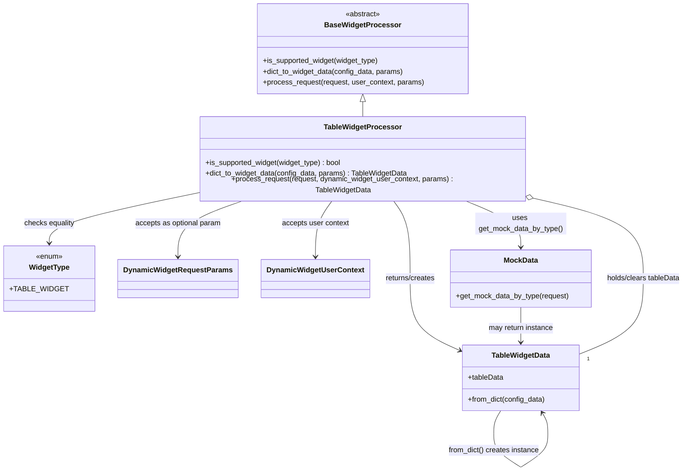

# Diagram: partview_core/partview_service/partview_service/api/dashboard/dynamic_widget/widget_processors/table_widget_processor.py

> Auto-generated by Obscura crawlers

## Mermaid

### SVG

<svg id="container" width="1465.5703125" xmlns="http://www.w3.org/2000/svg" class="classDiagram" height="1046.25" viewBox="0 0 1465.5703125 1046.25" role="graphics-document document" aria-roledescription="class"><g><defs><marker id="container_class-aggregationStart" class="marker aggregation class" refX="18" refY="7" markerWidth="190" markerHeight="240" orient="auto"><path d="M 18,7 L9,13 L1,7 L9,1 Z"></path></marker></defs><defs><marker id="container_class-aggregationEnd" class="marker aggregation class" refX="1" refY="7" markerWidth="20" markerHeight="28" orient="auto"><path d="M 18,7 L9,13 L1,7 L9,1 Z"></path></marker></defs><defs><marker id="container_class-extensionStart" class="marker extension class" refX="18" refY="7" markerWidth="190" markerHeight="240" orient="auto"><path d="M 1,7 L18,13 V 1 Z"></path></marker></defs><defs><marker id="container_class-extensionEnd" class="marker extension class" refX="1" refY="7" markerWidth="20" markerHeight="28" orient="auto"><path d="M 1,1 V 13 L18,7 Z"></path></marker></defs><defs><marker id="container_class-compositionStart" class="marker composition class" refX="18" refY="7" markerWidth="190" markerHeight="240" orient="auto"><path d="M 18,7 L9,13 L1,7 L9,1 Z"></path></marker></defs><defs><marker id="container_class-compositionEnd" class="marker composition class" refX="1" refY="7" markerWidth="20" markerHeight="28" orient="auto"><path d="M 18,7 L9,13 L1,7 L9,1 Z"></path></marker></defs><defs><marker id="container_class-dependencyStart" class="marker dependency class" refX="6" refY="7" markerWidth="190" markerHeight="240" orient="auto"><path d="M 5,7 L9,13 L1,7 L9,1 Z"></path></marker></defs><defs><marker id="container_class-dependencyEnd" class="marker dependency class" refX="13" refY="7" markerWidth="20" markerHeight="28" orient="auto"><path d="M 18,7 L9,13 L14,7 L9,1 Z"></path></marker></defs><defs><marker id="container_class-lollipopStart" class="marker lollipop class" refX="13" refY="7" markerWidth="190" markerHeight="240" orient="auto"><circle stroke="black" fill="transparent" cx="7" cy="7" r="6"></circle></marker></defs><defs><marker id="container_class-lollipopEnd" class="marker lollipop class" refX="1" refY="7" markerWidth="190" markerHeight="240" orient="auto"><circle stroke="black" fill="transparent" cx="7" cy="7" r="6"></circle></marker></defs><g class="root"><g class="clusters"></g><g class="edgePaths"><path d="M754.41,223.25L754.41,224.542C754.41,225.833,754.41,228.417,754.41,233.875C754.41,239.333,754.41,247.667,754.41,251.833L754.41,256" id="id_BaseWidgetProcessor_TableWidgetProcessor_1" class="edge-thickness-normal edge-pattern-solid relation" style=";;;" data-edge="true" data-et="edge" data-id="id_BaseWidgetProcessor_TableWidgetProcessor_1" data-points="W3sieCI6NzU0LjQxMDE1NjI1LCJ5IjoyMDZ9LHsieCI6NzU0LjQxMDE1NjI1LCJ5IjoyMzF9LHsieCI6NzU0LjQxMDE1NjI1LCJ5IjoyNTZ9XQ==" marker-start="url(#container_class-extensionStart)"></path><path d="M819.913,430L826.061,438.167C832.21,446.333,844.507,462.667,850.656,491C856.805,519.333,856.805,559.667,856.805,598C856.805,636.333,856.805,672.667,875.322,699.047C893.838,725.427,930.872,741.853,949.389,750.067L967.906,758.28" id="id_TableWidgetProcessor_TableWidgetData_2" class="edge-thickness-normal edge-pattern-solid relation" style=";;;" data-edge="true" data-et="edge" data-id="id_TableWidgetProcessor_TableWidgetData_2" data-points="W3sieCI6ODE5LjkxMjU0MDIxMTM5NzEsInkiOjQzMH0seyJ4Ijo4NTYuODA0Njg3NSwieSI6NDc5fSx7IngiOjg1Ni44MDQ2ODc1LCJ5Ijo2MDB9LHsieCI6ODU2LjgwNDY4NzUsInkiOjcwOX0seyJ4Ijo5NzMuMzkwNjI1LCJ5Ijo3NjAuNzEzMDE0MDM2MTQ3NX1d" marker-end="url(#container_class-dependencyEnd)"></path><path d="M977.113,430L998.018,438.167C1018.923,446.333,1060.733,462.667,1081.638,479.5C1102.543,496.333,1102.543,513.667,1102.543,522.333L1102.543,531" id="id_TableWidgetProcessor_MockData_3" class="edge-thickness-normal edge-pattern-solid relation" style=";;;" data-edge="true" data-et="edge" data-id="id_TableWidgetProcessor_MockData_3" data-points="W3sieCI6OTc3LjExMjc2NDI0NjMyMzUsInkiOjQzMH0seyJ4IjoxMTAyLjU0Mjk2ODc1LCJ5Ijo0Nzl9LHsieCI6MTEwMi41NDI5Njg3NSwieSI6NTM3fV0=" marker-end="url(#container_class-dependencyEnd)"></path><path d="M394.695,417.501L345.206,427.751C295.716,438.001,196.737,458.5,147.247,475.917C97.758,493.333,97.758,507.667,97.758,514.833L97.758,522" id="id_TableWidgetProcessor_WidgetType_4" class="edge-thickness-normal edge-pattern-solid relation" style=";;;" data-edge="true" data-et="edge" data-id="id_TableWidgetProcessor_WidgetType_4" data-points="W3sieCI6Mzk0LjY5NTMxMjUsInkiOjQxNy41MDA5NDI4NzQzMDkyfSx7IngiOjk3Ljc1NzgxMjUsInkiOjQ3OX0seyJ4Ijo5Ny43NTc4MTI1LCJ5Ijo1Mjh9XQ==" marker-end="url(#container_class-dependencyEnd)"></path><path d="M504.003,430L480.497,438.167C456.991,446.333,409.98,462.667,386.474,483C362.969,503.333,362.969,527.667,362.969,539.833L362.969,552" id="id_TableWidgetProcessor_DynamicWidgetRequestParams_5" class="edge-thickness-normal edge-pattern-solid relation" style=";;;" data-edge="true" data-et="edge" data-id="id_TableWidgetProcessor_DynamicWidgetRequestParams_5" data-points="W3sieCI6NTA0LjAwMjc4NjA3NTM2NzcsInkiOjQzMH0seyJ4IjozNjIuOTY4NzUsInkiOjQ3OX0seyJ4IjozNjIuOTY4NzUsInkiOjU1OH1d" marker-end="url(#container_class-dependencyEnd)"></path><path d="M688.908,430L682.759,438.167C676.61,446.333,664.313,462.667,658.164,483C652.016,503.333,652.016,527.667,652.016,539.833L652.016,552" id="id_TableWidgetProcessor_DynamicWidgetUserContext_6" class="edge-thickness-normal edge-pattern-solid relation" style=";;;" data-edge="true" data-et="edge" data-id="id_TableWidgetProcessor_DynamicWidgetUserContext_6" data-points="W3sieCI6Njg4LjkwNzc3MjI4ODYwMjksInkiOjQzMH0seyJ4Ijo2NTIuMDE1NjI1LCJ5Ijo0Nzl9LHsieCI6NjUyLjAxNTYyNSwieSI6NTU4fV0=" marker-end="url(#container_class-dependencyEnd)"></path><path d="M1058.007,890L1055.43,894.167C1052.852,898.333,1047.698,906.667,1045.12,915C1042.543,923.333,1042.543,931.667,1042.543,935.833L1042.543,940" id="TableWidgetData-cyclic-special-1" class="edge-thickness-normal edge-pattern-solid relation" style=";;;" data-edge="true" data-et="edge" data-id="TableWidgetData-cyclic-special-1" data-points="W3sieCI6MTA1OC4wMDY4ODYyNzU3NzMyLCJ5Ijo4OTB9LHsieCI6MTA0Mi41NDI5Njg3NSwieSI6OTE1fSx7IngiOjEwNDIuNTQyOTY4NzUsInkiOjk0MH1d"></path><path d="M1042.543,940.1L1042.543,948.267C1042.543,956.433,1042.543,972.767,1052.535,989.102C1062.526,1005.436,1082.51,1021.773,1092.501,1029.941L1102.493,1038.109" id="TableWidgetData-cyclic-special-mid" class="edge-thickness-normal edge-pattern-solid relation" style=";;;" data-edge="true" data-et="edge" data-id="TableWidgetData-cyclic-special-mid" data-points="W3sieCI6MTA0Mi41NDI5Njg3NSwieSI6OTQwLjEwMDAwMDAwMTQ5MDF9LHsieCI6MTA0Mi41NDI5Njg3NSwieSI6OTg5LjEwMDAwMDAwMTQ5MDF9LHsieCI6MTEwMi40OTI5Njg3NDkyNTUsInkiOjEwMzguMTA5MTI1MDAxNjI1NH1d"></path><path d="M1102.593,1038.109L1112.585,1029.941C1122.576,1021.773,1142.56,1005.436,1152.551,989.093C1162.543,972.75,1162.543,956.4,1162.543,944.05C1162.543,931.7,1162.543,923.35,1160.492,915.859C1158.44,908.368,1154.338,901.735,1152.287,898.419L1150.235,895.103" id="TableWidgetData-cyclic-special-2" class="edge-thickness-normal edge-pattern-solid relation" style=";;;" data-edge="true" data-et="edge" data-id="TableWidgetData-cyclic-special-2" data-points="W3sieCI6MTEwMi41OTI5Njg3NTA3NDUsInkiOjEwMzguMTA5MTI1MDAxNjI1NH0seyJ4IjoxMTYyLjU0Mjk2ODc1LCJ5Ijo5ODkuMTAwMDAwMDAxNDkwMX0seyJ4IjoxMTYyLjU0Mjk2ODc1LCJ5Ijo5NDAuMDUwMDAwMDAwNzQ1MX0seyJ4IjoxMTYyLjU0Mjk2ODc1LCJ5Ijo5MTV9LHsieCI6MTE0Ny4wNzkwNTEyMjQyMjY4LCJ5Ijo4OTB9XQ==" marker-end="url(#container_class-dependencyEnd)"></path><path d="M1102.543,663L1102.543,670.667C1102.543,678.333,1102.543,693.667,1102.543,706.5C1102.543,719.333,1102.543,729.667,1102.543,734.833L1102.543,740" id="id_MockData_TableWidgetData_8" class="edge-thickness-normal edge-pattern-solid relation" style=";;;" data-edge="true" data-et="edge" data-id="id_MockData_TableWidgetData_8" data-points="W3sieCI6MTEwMi41NDI5Njg3NSwieSI6NjYzfSx7IngiOjExMDIuNTQyOTY4NzUsInkiOjcwOX0seyJ4IjoxMTAyLjU0Mjk2ODc1LCJ5Ijo3NDZ9XQ==" marker-end="url(#container_class-dependencyEnd)"></path><path d="M1130.975,425.546L1171.617,434.455C1212.259,443.364,1293.544,461.182,1334.186,490.258C1374.828,519.333,1374.828,559.667,1374.828,598C1374.828,636.333,1374.828,672.667,1350.973,700.383C1327.117,728.099,1279.406,747.199,1255.551,756.749L1231.695,766.298" id="id_TableWidgetProcessor_TableWidgetData_9" class="edge-thickness-normal edge-pattern-solid relation" style=";;;" data-edge="true" data-et="edge" data-id="id_TableWidgetProcessor_TableWidgetData_9" data-points="W3sieCI6MTExNC4xMjUsInkiOjQyMS44NTIwMzM5NzQwNzI0fSx7IngiOjEzNzQuODI4MTI1LCJ5Ijo0Nzl9LHsieCI6MTM3NC44MjgxMjUsInkiOjYwMH0seyJ4IjoxMzc0LjgyODEyNSwieSI6NzA5fSx7IngiOjEyMzEuNjk1MzEyNSwieSI6NzY2LjI5ODI5OTk3ODQ4MDd9XQ==" marker-start="url(#container_class-aggregationStart)"></path></g><g class="edgeLabels"><g class="edgeLabel"><g class="label" data-id="id_BaseWidgetProcessor_TableWidgetProcessor_1" transform="translate(0, 0)"><foreignObject width="0" height="0">

</foreignObject></g></g><g class="edgeLabel" transform="translate(856.8046875, 600)"><g class="label" data-id="id_TableWidgetProcessor_TableWidgetData_2" transform="translate(-56.1953125, -12)"><foreignObject width="112.390625" height="24">

returns/creates

</foreignObject></g></g><g class="edgeLabel" transform="translate(1102.54296875, 479)"><g class="label" data-id="id_TableWidgetProcessor_MockData_3" transform="translate(-100, -24)"><foreignObject width="200" height="48">

uses get_mock_data_by_type()

</foreignObject></g></g><g class="edgeLabel" transform="translate(97.7578125, 479)"><g class="label" data-id="id_TableWidgetProcessor_WidgetType_4" transform="translate(-56.0703125, -12)"><foreignObject width="112.140625" height="24">

checks equality

</foreignObject></g></g><g class="edgeLabel" transform="translate(362.96875, 479)"><g class="label" data-id="id_TableWidgetProcessor_DynamicWidgetRequestParams_5" transform="translate(-95.375, -12)"><foreignObject width="190.75" height="24">

accepts as optional param

</foreignObject></g></g><g class="edgeLabel" transform="translate(652.015625, 479)"><g class="label" data-id="id_TableWidgetProcessor_DynamicWidgetUserContext_6" transform="translate(-74.3515625, -12)"><foreignObject width="148.703125" height="24">

accepts user context

</foreignObject></g></g><g class="edgeLabel"><g class="label" data-id="TableWidgetData-cyclic-special-1" transform="translate(0, 0)"><foreignObject width="0" height="0">

</foreignObject></g></g><g class="edgeLabel" transform="translate(1042.54296875, 989.1000000014901)"><g class="label" data-id="TableWidgetData-cyclic-special-mid" transform="translate(-100, -24)"><foreignObject width="200" height="48">

from_dict() creates instance

</foreignObject></g></g><g class="edgeLabel"><g class="label" data-id="TableWidgetData-cyclic-special-2" transform="translate(0, 0)"><foreignObject width="0" height="0">

</foreignObject></g></g><g class="edgeLabel" transform="translate(1102.54296875, 709)"><g class="label" data-id="id_MockData_TableWidgetData_8" transform="translate(-72.375, -12)"><foreignObject width="144.75" height="24">

may return instance

</foreignObject></g></g><g class="edgeLabel" transform="translate(1374.828125, 600)"><g class="label" data-id="id_TableWidgetProcessor_TableWidgetData_9" transform="translate(-82.7421875, -12)"><foreignObject width="165.484375" height="24">

holds/clears tableData

</foreignObject></g></g><g class="edgeTerminals" transform="translate(1248.516533496727, 768.7201799146059)"><g class="inner" transform="translate(0, 0)"></g><foreignObject style="width: 9px; height: 12px;">
1
</foreignObject></g></g><g class="nodes"><g class="node default" id="classId-BaseWidgetProcessor-0" transform="translate(754.41015625, 107)"><g class="basic label-container"><path d="M-228.609375 -99 L228.609375 -99 L228.609375 99 L-228.609375 99" stroke="none" stroke-width="0" fill="#ECECFF" style=""></path><path d="M-228.609375 -99 C-59.837666948625866 -99, 108.93404110274827 -99, 228.609375 -99 M-228.609375 -99 C-57.569767646120084 -99, 113.46983970775983 -99, 228.609375 -99 M228.609375 -99 C228.609375 -49.097133350871225, 228.609375 0.8057332982575502, 228.609375 99 M228.609375 -99 C228.609375 -38.61474921477154, 228.609375 21.770501570456915, 228.609375 99 M228.609375 99 C91.94474239422084 99, -44.71989021155832 99, -228.609375 99 M228.609375 99 C85.19614694619824 99, -58.21708110760352 99, -228.609375 99 M-228.609375 99 C-228.609375 52.50100938988651, -228.609375 6.0020187797730244, -228.609375 -99 M-228.609375 99 C-228.609375 47.80840678429274, -228.609375 -3.383186431414515, -228.609375 -99" stroke="#9370DB" stroke-width="1.3" fill="none" stroke-dasharray="0 0" style=""></path></g><g class="annotation-group text" transform="translate(-38.609375, -75)"><g class="label" style="" transform="translate(0,-12)"><foreignObject width="77.21875" height="24">

«abstract»

</foreignObject></g></g><g class="label-group text" transform="translate(-79.015625, -51)"><g class="label" style="font-weight: bolder" transform="translate(0,-12)"><foreignObject width="158.03125" height="24">

BaseWidgetProcessor

</foreignObject></g></g><g class="members-group text" transform="translate(-216.609375, -3)"></g><g class="methods-group text" transform="translate(-216.609375, 27)"><g class="label" style="" transform="translate(0,-12)"><foreignObject width="257.5" height="24">

+is_supported_widget(widget_type)

</foreignObject></g><g class="label" style="" transform="translate(0,12)"><foreignObject width="311.078125" height="24">

+dict_to_widget_data(config_data, params)

</foreignObject></g><g class="label" style="" transform="translate(0,36)"><foreignObject width="354.203125" height="24">

+process_request(request, user_context, params)

</foreignObject></g></g><g class="divider" style=""><path d="M-228.609375 -27 C-102.70197639466066 -27, 23.205422210678677 -27, 228.609375 -27 M-228.609375 -27 C-116.44870727477532 -27, -4.288039549550632 -27, 228.609375 -27" stroke="#9370DB" stroke-width="1.3" fill="none" stroke-dasharray="0 0" style=""></path></g><g class="divider" style=""><path d="M-228.609375 -3 C-133.48376818406797 -3, -38.35816136813597 -3, 228.609375 -3 M-228.609375 -3 C-104.23576514944371 -3, 20.137844701112584 -3, 228.609375 -3" stroke="#9370DB" stroke-width="1.3" fill="none" stroke-dasharray="0 0" style=""></path></g></g><g class="node default" id="classId-TableWidgetData-1" transform="translate(1102.54296875, 818)"><g class="basic label-container"><path d="M-129.15234375 -72 L129.15234375 -72 L129.15234375 72 L-129.15234375 72" stroke="none" stroke-width="0" fill="#ECECFF" style=""></path><path d="M-129.15234375 -72 C-39.720786845532245 -72, 49.71077005893551 -72, 129.15234375 -72 M-129.15234375 -72 C-38.31690380054144 -72, 52.51853614891712 -72, 129.15234375 -72 M129.15234375 -72 C129.15234375 -30.777054227605035, 129.15234375 10.44589154478993, 129.15234375 72 M129.15234375 -72 C129.15234375 -30.680005086433546, 129.15234375 10.639989827132908, 129.15234375 72 M129.15234375 72 C76.5243138595104 72, 23.8962839690208 72, -129.15234375 72 M129.15234375 72 C48.04091756085654 72, -33.070508628286916 72, -129.15234375 72 M-129.15234375 72 C-129.15234375 41.92308913201107, -129.15234375 11.846178264022143, -129.15234375 -72 M-129.15234375 72 C-129.15234375 28.407997633456574, -129.15234375 -15.184004733086852, -129.15234375 -72" stroke="#9370DB" stroke-width="1.3" fill="none" stroke-dasharray="0 0" style=""></path></g><g class="annotation-group text" transform="translate(0, -48)"></g><g class="label-group text" transform="translate(-62.2890625, -48)"><g class="label" style="font-weight: bolder" transform="translate(0,-12)"><foreignObject width="124.578125" height="24">

TableWidgetData

</foreignObject></g></g><g class="members-group text" transform="translate(-117.15234375, 0)"><g class="label" style="" transform="translate(0,-12)"><foreignObject width="78.328125" height="24">

+tableData

</foreignObject></g></g><g class="methods-group text" transform="translate(-117.15234375, 48)"><g class="label" style="" transform="translate(0,-12)"><foreignObject width="172.015625" height="24">

+from_dict(config_data)

</foreignObject></g></g><g class="divider" style=""><path d="M-129.15234375 -24 C-59.62642018258076 -24, 9.899503384838482 -24, 129.15234375 -24 M-129.15234375 -24 C-75.49080739422405 -24, -21.829271038448113 -24, 129.15234375 -24" stroke="#9370DB" stroke-width="1.3" fill="none" stroke-dasharray="0 0" style=""></path></g><g class="divider" style=""><path d="M-129.15234375 24 C-74.17943734783003 24, -19.206530945660077 24, 129.15234375 24 M-129.15234375 24 C-53.06301615799859 24, 23.02631143400282 24, 129.15234375 24" stroke="#9370DB" stroke-width="1.3" fill="none" stroke-dasharray="0 0" style=""></path></g></g><g class="node default" id="classId-TableWidgetProcessor-2" transform="translate(754.41015625, 343)"><g class="basic label-container"><path d="M-359.71484375 -87 L359.71484375 -87 L359.71484375 87 L-359.71484375 87" stroke="none" stroke-width="0" fill="#ECECFF" style=""></path><path d="M-359.71484375 -87 C-175.59277215591015 -87, 8.529299438179692 -87, 359.71484375 -87 M-359.71484375 -87 C-119.54493478163172 -87, 120.62497418673655 -87, 359.71484375 -87 M359.71484375 -87 C359.71484375 -51.149819653912694, 359.71484375 -15.299639307825387, 359.71484375 87 M359.71484375 -87 C359.71484375 -35.61007096560967, 359.71484375 15.779858068780655, 359.71484375 87 M359.71484375 87 C99.52830977326397 87, -160.65822420347206 87, -359.71484375 87 M359.71484375 87 C83.71780374629748 87, -192.27923625740505 87, -359.71484375 87 M-359.71484375 87 C-359.71484375 43.48528547156505, -359.71484375 -0.02942905686990116, -359.71484375 -87 M-359.71484375 87 C-359.71484375 38.111650561672704, -359.71484375 -10.776698876654592, -359.71484375 -87" stroke="#9370DB" stroke-width="1.3" fill="none" stroke-dasharray="0 0" style=""></path></g><g class="annotation-group text" transform="translate(0, -63)"></g><g class="label-group text" transform="translate(-81.3203125, -63)"><g class="label" style="font-weight: bolder" transform="translate(0,-12)"><foreignObject width="162.640625" height="24">

TableWidgetProcessor

</foreignObject></g></g><g class="members-group text" transform="translate(-347.71484375, -15)"></g><g class="methods-group text" transform="translate(-347.71484375, 15)"><g class="label" style="" transform="translate(0,-12)"><foreignObject width="302.703125" height="24">

+is_supported_widget(widget_type) : bool

</foreignObject></g><g class="label" style="" transform="translate(0,12)"><foreignObject width="445.484375" height="24">

+dict_to_widget_data(config_data, params) : TableWidgetData

</foreignObject></g><g class="label" style="" transform="translate(0,36)"><foreignObject width="614.109375" height="24">

+process_request(request, dynamic_widget_user_context, params) : TableWidgetData

</foreignObject></g></g><g class="divider" style=""><path d="M-359.71484375 -39 C-92.53758910951797 -39, 174.63966553096407 -39, 359.71484375 -39 M-359.71484375 -39 C-110.02601437005211 -39, 139.66281500989578 -39, 359.71484375 -39" stroke="#9370DB" stroke-width="1.3" fill="none" stroke-dasharray="0 0" style=""></path></g><g class="divider" style=""><path d="M-359.71484375 -15 C-176.98779862328206 -15, 5.739246503435879 -15, 359.71484375 -15 M-359.71484375 -15 C-119.6705809816475 -15, 120.37368178670499 -15, 359.71484375 -15" stroke="#9370DB" stroke-width="1.3" fill="none" stroke-dasharray="0 0" style=""></path></g></g><g class="node default" id="classId-WidgetType-3" transform="translate(97.7578125, 600)"><g class="basic label-container"><path d="M-89.7578125 -72 L89.7578125 -72 L89.7578125 72 L-89.7578125 72" stroke="none" stroke-width="0" fill="#ECECFF" style=""></path><path d="M-89.7578125 -72 C-20.068489434499227 -72, 49.620833631001545 -72, 89.7578125 -72 M-89.7578125 -72 C-42.045384714142365 -72, 5.66704307171527 -72, 89.7578125 -72 M89.7578125 -72 C89.7578125 -27.5114987079209, 89.7578125 16.9770025841582, 89.7578125 72 M89.7578125 -72 C89.7578125 -24.995244017372592, 89.7578125 22.009511965254816, 89.7578125 72 M89.7578125 72 C41.81624481017368 72, -6.125322879652643 72, -89.7578125 72 M89.7578125 72 C34.3863947092138 72, -20.985023081572393 72, -89.7578125 72 M-89.7578125 72 C-89.7578125 31.09492712623986, -89.7578125 -9.81014574752028, -89.7578125 -72 M-89.7578125 72 C-89.7578125 31.021573717947803, -89.7578125 -9.956852564104395, -89.7578125 -72" stroke="#9370DB" stroke-width="1.3" fill="none" stroke-dasharray="0 0" style=""></path></g><g class="annotation-group text" transform="translate(-29.53125, -48)"><g class="label" style="" transform="translate(0,-12)"><foreignObject width="59.0625" height="24">

«enum»

</foreignObject></g></g><g class="label-group text" transform="translate(-42.90625, -24)"><g class="label" style="font-weight: bolder" transform="translate(0,-12)"><foreignObject width="85.8125" height="24">

WidgetType

</foreignObject></g></g><g class="members-group text" transform="translate(-77.7578125, 24)"><g class="label" style="" transform="translate(0,-12)"><foreignObject width="112.609375" height="24">

+TABLE_WIDGET

</foreignObject></g></g><g class="methods-group text" transform="translate(-77.7578125, 72)"></g><g class="divider" style=""><path d="M-89.7578125 0 C-43.78484090938336 0, 2.1881306812332753 0, 89.7578125 0 M-89.7578125 0 C-32.952273901809676 0, 23.85326469638065 0, 89.7578125 0" stroke="#9370DB" stroke-width="1.3" fill="none" stroke-dasharray="0 0" style=""></path></g><g class="divider" style=""><path d="M-89.7578125 48 C-19.65281863444521 48, 50.45217523110958 48, 89.7578125 48 M-89.7578125 48 C-41.9855055666538 48, 5.786801366692401 48, 89.7578125 48" stroke="#9370DB" stroke-width="1.3" fill="none" stroke-dasharray="0 0" style=""></path></g></g><g class="node default" id="classId-DynamicWidgetRequestParams-4" transform="translate(362.96875, 600)"><g class="basic label-container"><path d="M-125.453125 -42 L125.453125 -42 L125.453125 42 L-125.453125 42" stroke="none" stroke-width="0" fill="#ECECFF" style=""></path><path d="M-125.453125 -42 C-33.14545356702246 -42, 59.162217865955085 -42, 125.453125 -42 M-125.453125 -42 C-65.79351357471887 -42, -6.133902149437759 -42, 125.453125 -42 M125.453125 -42 C125.453125 -24.74017254405447, 125.453125 -7.48034508810894, 125.453125 42 M125.453125 -42 C125.453125 -10.736740747555714, 125.453125 20.52651850488857, 125.453125 42 M125.453125 42 C37.711237512338315 42, -50.03064997532337 42, -125.453125 42 M125.453125 42 C31.184460037223616 42, -63.08420492555277 42, -125.453125 42 M-125.453125 42 C-125.453125 15.846984915311072, -125.453125 -10.306030169377856, -125.453125 -42 M-125.453125 42 C-125.453125 24.055080076624964, -125.453125 6.110160153249929, -125.453125 -42" stroke="#9370DB" stroke-width="1.3" fill="none" stroke-dasharray="0 0" style=""></path></g><g class="annotation-group text" transform="translate(0, -18)"></g><g class="label-group text" transform="translate(-113.453125, -18)"><g class="label" style="font-weight: bolder" transform="translate(0,-12)"><foreignObject width="226.90625" height="24">

DynamicWidgetRequestParams

</foreignObject></g></g><g class="members-group text" transform="translate(-113.453125, 30)"></g><g class="methods-group text" transform="translate(-113.453125, 60)"></g><g class="divider" style=""><path d="M-125.453125 6 C-73.00768378240902 6, -20.562242564818035 6, 125.453125 6 M-125.453125 6 C-31.319275827089044 6, 62.81457334582191 6, 125.453125 6" stroke="#9370DB" stroke-width="1.3" fill="none" stroke-dasharray="0 0" style=""></path></g><g class="divider" style=""><path d="M-125.453125 24 C-33.73608923506974 24, 57.98094652986052 24, 125.453125 24 M-125.453125 24 C-62.2890056688238 24, 0.8751136623524047 24, 125.453125 24" stroke="#9370DB" stroke-width="1.3" fill="none" stroke-dasharray="0 0" style=""></path></g></g><g class="node default" id="classId-DynamicWidgetUserContext-5" transform="translate(652.015625, 600)"><g class="basic label-container"><path d="M-113.59375 -42 L113.59375 -42 L113.59375 42 L-113.59375 42" stroke="none" stroke-width="0" fill="#ECECFF" style=""></path><path d="M-113.59375 -42 C-40.054094537992796 -42, 33.48556092401441 -42, 113.59375 -42 M-113.59375 -42 C-27.02332069530145 -42, 59.5471086093971 -42, 113.59375 -42 M113.59375 -42 C113.59375 -13.953412443623957, 113.59375 14.093175112752085, 113.59375 42 M113.59375 -42 C113.59375 -9.83925586039544, 113.59375 22.32148827920912, 113.59375 42 M113.59375 42 C49.11166289452014 42, -15.370424210959726 42, -113.59375 42 M113.59375 42 C26.95656825810086 42, -59.68061348379828 42, -113.59375 42 M-113.59375 42 C-113.59375 18.304928747446215, -113.59375 -5.390142505107569, -113.59375 -42 M-113.59375 42 C-113.59375 18.97557863749445, -113.59375 -4.048842725011099, -113.59375 -42" stroke="#9370DB" stroke-width="1.3" fill="none" stroke-dasharray="0 0" style=""></path></g><g class="annotation-group text" transform="translate(0, -18)"></g><g class="label-group text" transform="translate(-101.59375, -18)"><g class="label" style="font-weight: bolder" transform="translate(0,-12)"><foreignObject width="203.1875" height="24">

DynamicWidgetUserContext

</foreignObject></g></g><g class="members-group text" transform="translate(-101.59375, 30)"></g><g class="methods-group text" transform="translate(-101.59375, 60)"></g><g class="divider" style=""><path d="M-113.59375 6 C-50.949375662574475 6, 11.69499867485105 6, 113.59375 6 M-113.59375 6 C-44.1212269912149 6, 25.351296017570206 6, 113.59375 6" stroke="#9370DB" stroke-width="1.3" fill="none" stroke-dasharray="0 0" style=""></path></g><g class="divider" style=""><path d="M-113.59375 24 C-65.86452078224984 24, -18.13529156449968 24, 113.59375 24 M-113.59375 24 C-26.693525616473423 24, 60.206698767053155 24, 113.59375 24" stroke="#9370DB" stroke-width="1.3" fill="none" stroke-dasharray="0 0" style=""></path></g></g><g class="node default" id="classId-MockData-6" transform="translate(1102.54296875, 600)"><g class="basic label-container"><path d="M-154.54296875 -63 L154.54296875 -63 L154.54296875 63 L-154.54296875 63" stroke="none" stroke-width="0" fill="#ECECFF" style=""></path><path d="M-154.54296875 -63 C-58.673188887417865 -63, 37.19659097516427 -63, 154.54296875 -63 M-154.54296875 -63 C-36.63178728406423 -63, 81.27939418187154 -63, 154.54296875 -63 M154.54296875 -63 C154.54296875 -14.069189544346564, 154.54296875 34.86162091130687, 154.54296875 63 M154.54296875 -63 C154.54296875 -14.17591553399707, 154.54296875 34.64816893200586, 154.54296875 63 M154.54296875 63 C40.98837528482929 63, -72.56621818034142 63, -154.54296875 63 M154.54296875 63 C61.62608145731939 63, -31.290805835361226 63, -154.54296875 63 M-154.54296875 63 C-154.54296875 28.51188709632501, -154.54296875 -5.9762258073499765, -154.54296875 -63 M-154.54296875 63 C-154.54296875 35.203694786378364, -154.54296875 7.407389572756735, -154.54296875 -63" stroke="#9370DB" stroke-width="1.3" fill="none" stroke-dasharray="0 0" style=""></path></g><g class="annotation-group text" transform="translate(0, -39)"></g><g class="label-group text" transform="translate(-36.1015625, -39)"><g class="label" style="font-weight: bolder" transform="translate(0,-12)"><foreignObject width="72.203125" height="24">

MockData

</foreignObject></g></g><g class="members-group text" transform="translate(-142.54296875, 9)"></g><g class="methods-group text" transform="translate(-142.54296875, 39)"><g class="label" style="" transform="translate(0,-12)"><foreignObject width="248.984375" height="24">

+get_mock_data_by_type(request)

</foreignObject></g></g><g class="divider" style=""><path d="M-154.54296875 -15 C-44.37615058202802 -15, 65.79066758594396 -15, 154.54296875 -15 M-154.54296875 -15 C-68.71344599112288 -15, 17.116076767754237 -15, 154.54296875 -15" stroke="#9370DB" stroke-width="1.3" fill="none" stroke-dasharray="0 0" style=""></path></g><g class="divider" style=""><path d="M-154.54296875 9 C-35.03822748764148 9, 84.46651377471704 9, 154.54296875 9 M-154.54296875 9 C-64.6872980465681 9, 25.168372656863795 9, 154.54296875 9" stroke="#9370DB" stroke-width="1.3" fill="none" stroke-dasharray="0 0" style=""></path></g></g><g class="label edgeLabel" id="TableWidgetData---TableWidgetData---1" transform="translate(1042.54296875, 940.0500000007451)"><rect width="0.1" height="0.1"></rect><g class="label" style="" transform="translate(0, 0)"><rect></rect><foreignObject width="0" height="0">

</foreignObject></g></g><g class="label edgeLabel" id="TableWidgetData---TableWidgetData---2" transform="translate(1102.54296875, 1038.1500000022352)"><rect width="0.1" height="0.1"></rect><g class="label" style="" transform="translate(0, 0)"><rect></rect><foreignObject width="0" height="0">

</foreignObject></g></g></g></g></g></svg>
