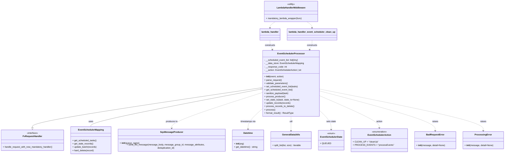

# Diagram: partview_core/partview_service/partview_service/api/event_scheduler/EventSchedulerProcessor.py

> Auto-generated by Obscura crawlers

## Mermaid

### SVG

<svg id="container" width="3608.75" xmlns="http://www.w3.org/2000/svg" class="classDiagram" height="1126" viewBox="0 0 3608.75 1126" role="graphics-document document" aria-roledescription="class"><g><defs><marker id="container_class-aggregationStart" class="marker aggregation class" refX="18" refY="7" markerWidth="190" markerHeight="240" orient="auto"><path d="M 18,7 L9,13 L1,7 L9,1 Z"></path></marker></defs><defs><marker id="container_class-aggregationEnd" class="marker aggregation class" refX="1" refY="7" markerWidth="20" markerHeight="28" orient="auto"><path d="M 18,7 L9,13 L1,7 L9,1 Z"></path></marker></defs><defs><marker id="container_class-extensionStart" class="marker extension class" refX="18" refY="7" markerWidth="190" markerHeight="240" orient="auto"><path d="M 1,7 L18,13 V 1 Z"></path></marker></defs><defs><marker id="container_class-extensionEnd" class="marker extension class" refX="1" refY="7" markerWidth="20" markerHeight="28" orient="auto"><path d="M 1,1 V 13 L18,7 Z"></path></marker></defs><defs><marker id="container_class-compositionStart" class="marker composition class" refX="18" refY="7" markerWidth="190" markerHeight="240" orient="auto"><path d="M 18,7 L9,13 L1,7 L9,1 Z"></path></marker></defs><defs><marker id="container_class-compositionEnd" class="marker composition class" refX="1" refY="7" markerWidth="20" markerHeight="28" orient="auto"><path d="M 18,7 L9,13 L1,7 L9,1 Z"></path></marker></defs><defs><marker id="container_class-dependencyStart" class="marker dependency class" refX="6" refY="7" markerWidth="190" markerHeight="240" orient="auto"><path d="M 5,7 L9,13 L1,7 L9,1 Z"></path></marker></defs><defs><marker id="container_class-dependencyEnd" class="marker dependency class" refX="13" refY="7" markerWidth="20" markerHeight="28" orient="auto"><path d="M 18,7 L9,13 L14,7 L9,1 Z"></path></marker></defs><defs><marker id="container_class-lollipopStart" class="marker lollipop class" refX="13" refY="7" markerWidth="190" markerHeight="240" orient="auto"><circle stroke="black" fill="transparent" cx="7" cy="7" r="6"></circle></marker></defs><defs><marker id="container_class-lollipopEnd" class="marker lollipop class" refX="1" refY="7" markerWidth="190" markerHeight="240" orient="auto"><circle stroke="black" fill="transparent" cx="7" cy="7" r="6"></circle></marker></defs><g class="root"><g class="clusters"></g><g class="edgePaths"><path d="M1919.879,635.711L1639.181,676.926C1358.483,718.141,797.087,800.57,516.389,849.077C235.691,897.583,235.691,912.167,235.691,919.458L235.691,926.75" id="id_EventSchedulerProcessor_FvRequestHandler_1" class="edge-thickness-normal edge-pattern-solid relation" style=";;;" data-edge="true" data-et="edge" data-id="id_EventSchedulerProcessor_FvRequestHandler_1" data-points="W3sieCI6MTkxOS44Nzg5MDYyNSwieSI6NjM1LjcxMTIyMzAxNTAyODR9LHsieCI6MjM1LjY5MTQwNjI1LCJ5Ijo4ODN9LHsieCI6MjM1LjY5MTQwNjI1LCJ5Ijo5NDR9XQ==" marker-end="url(#container_class-extensionEnd)"></path><path d="M1902.929,647.482L1695.411,686.735C1487.892,725.988,1072.854,804.494,865.335,849.914C657.816,895.333,657.816,907.667,657.816,913.833L657.816,920" id="id_EventSchedulerProcessor_EventSchedulerMapping_2" class="edge-thickness-normal edge-pattern-solid relation" style=";;;" data-edge="true" data-et="edge" data-id="id_EventSchedulerProcessor_EventSchedulerMapping_2" data-points="W3sieCI6MTkxOS44Nzg5MDYyNSwieSI6NjQ0LjI3NTYzODE4NzIwMTZ9LHsieCI6NjU3LjgxNjQwNjI1LCJ5Ijo4ODN9LHsieCI6NjU3LjgxNjQwNjI1LCJ5Ijo5MjB9XQ==" marker-start="url(#container_class-aggregationStart)"></path><path d="M1919.879,670.111L1807.889,705.592C1695.9,741.074,1471.921,812.037,1359.931,856.685C1247.941,901.333,1247.941,919.667,1247.941,928.833L1247.941,938" id="id_EventSchedulerProcessor_SqsMessageProducer_3" class="edge-thickness-normal edge-pattern-dashed relation" style=";;;" data-edge="true" data-et="edge" data-id="id_EventSchedulerProcessor_SqsMessageProducer_3" data-points="W3sieCI6MTkxOS44Nzg5MDYyNSwieSI6NjcwLjExMDgxMzI1MDA1MTR9LHsieCI6MTI0Ny45NDE0MDYyNSwieSI6ODgzfSx7IngiOjEyNDcuOTQxNDA2MjUsInkiOjk0NH1d" marker-end="url(#container_class-dependencyEnd)"></path><path d="M1919.879,784.668L1901.318,801.056C1882.757,817.445,1845.634,850.223,1827.073,875.778C1808.512,901.333,1808.512,919.667,1808.512,928.833L1808.512,938" id="id_EventSchedulerProcessor_Datetime_4" class="edge-thickness-normal edge-pattern-dashed relation" style=";;;" data-edge="true" data-et="edge" data-id="id_EventSchedulerProcessor_Datetime_4" data-points="W3sieCI6MTkxOS44Nzg5MDYyNSwieSI6Nzg0LjY2NzYyMTI3NzAxOTZ9LHsieCI6MTgwOC41MTE3MTg3NSwieSI6ODgzfSx7IngiOjE4MDguNTExNzE4NzUsInkiOjk0NH1d" marker-end="url(#container_class-dependencyEnd)"></path><path d="M2122.23,846L2122.23,852.167C2122.23,858.333,2122.23,870.667,2122.23,888C2122.23,905.333,2122.23,927.667,2122.23,938.833L2122.23,950" id="id_EventSchedulerProcessor_GeneralDataUtils_5" class="edge-thickness-normal edge-pattern-dashed relation" style=";;;" data-edge="true" data-et="edge" data-id="id_EventSchedulerProcessor_GeneralDataUtils_5" data-points="W3sieCI6MjEyMi4yMzA0Njg3NSwieSI6ODQ2fSx7IngiOjIxMjIuMjMwNDY4NzUsInkiOjg4M30seyJ4IjoyMTIyLjIzMDQ2ODc1LCJ5Ijo5NTZ9XQ==" marker-end="url(#container_class-dependencyEnd)"></path><path d="M2324.582,801.208L2338.713,814.84C2352.844,828.472,2381.105,855.736,2395.236,879.035C2409.367,902.333,2409.367,921.667,2409.367,931.333L2409.367,941" id="id_EventSchedulerProcessor_EventSchedulerState_6" class="edge-thickness-normal edge-pattern-dashed relation" style=";;;" data-edge="true" data-et="edge" data-id="id_EventSchedulerProcessor_EventSchedulerState_6" data-points="W3sieCI6MjMyNC41ODIwMzEyNSwieSI6ODAxLjIwNzk5Mzc5NjUwOTJ9LHsieCI6MjQwOS4zNjcxODc1LCJ5Ijo4ODN9LHsieCI6MjQwOS4zNjcxODc1LCJ5Ijo5NDd9XQ==" marker-end="url(#container_class-dependencyEnd)"></path><path d="M2324.582,697.512L2392.941,728.427C2461.299,759.341,2598.017,821.171,2666.376,859.752C2734.734,898.333,2734.734,913.667,2734.734,921.333L2734.734,929" id="id_EventSchedulerProcessor_EventSchedulerAction_7" class="edge-thickness-normal edge-pattern-dashed relation" style=";;;" data-edge="true" data-et="edge" data-id="id_EventSchedulerProcessor_EventSchedulerAction_7" data-points="W3sieCI6MjMyNC41ODIwMzEyNSwieSI6Njk3LjUxMTg3ODExMzAyMjJ9LHsieCI6MjczNC43MzQzNzUsInkiOjg4M30seyJ4IjoyNzM0LjczNDM3NSwieSI6OTM1fV0=" marker-end="url(#container_class-dependencyEnd)"></path><path d="M2324.582,662.305L2456.774,699.087C2588.966,735.87,2853.35,809.435,2985.542,857.384C3117.734,905.333,3117.734,927.667,3117.734,938.833L3117.734,950" id="id_EventSchedulerProcessor_BadRequestError_8" class="edge-thickness-normal edge-pattern-dashed relation" style=";;;" data-edge="true" data-et="edge" data-id="id_EventSchedulerProcessor_BadRequestError_8" data-points="W3sieCI6MjMyNC41ODIwMzEyNSwieSI6NjYyLjMwNDUzMzI3MjY0Mzh9LHsieCI6MzExNy43MzQzNzUsInkiOjg4M30seyJ4IjozMTE3LjczNDM3NSwieSI6OTU2fV0=" marker-end="url(#container_class-dependencyEnd)"></path><path d="M2324.582,647.987L2513.353,687.156C2702.124,726.325,3079.665,804.662,3268.436,854.998C3457.207,905.333,3457.207,927.667,3457.207,938.833L3457.207,950" id="id_EventSchedulerProcessor_ProcessingError_9" class="edge-thickness-normal edge-pattern-dashed relation" style=";;;" data-edge="true" data-et="edge" data-id="id_EventSchedulerProcessor_ProcessingError_9" data-points="W3sieCI6MjMyNC41ODIwMzEyNSwieSI6NjQ3Ljk4Njc5MTY2ODg2MTJ9LHsieCI6MzQ1Ny4yMDcwMzEyNSwieSI6ODgzfSx7IngiOjM0NTcuMjA3MDMxMjUsInkiOjk1Nn1d" marker-end="url(#container_class-dependencyEnd)"></path><path d="M1975.098,292L1975.098,298.167C1975.098,304.333,1975.098,316.667,1977.904,328.117C1980.711,339.567,1986.323,350.134,1989.13,355.418L1991.936,360.701" id="id_lambda_handler_EventSchedulerProcessor_10" class="edge-thickness-normal edge-pattern-dashed relation" style=";;;" data-edge="true" data-et="edge" data-id="id_lambda_handler_EventSchedulerProcessor_10" data-points="W3sieCI6MTk3NS4wOTc2NTYyNSwieSI6MjkyfSx7IngiOjE5NzUuMDk3NjU2MjUsInkiOjMyOX0seyJ4IjoxOTk0Ljc1MDc3NTYwOTIwNTcsInkiOjM2Nn1d" marker-end="url(#container_class-dependencyEnd)"></path><path d="M2269.363,292L2269.363,298.167C2269.363,304.333,2269.363,316.667,2266.557,328.117C2263.75,339.567,2258.138,350.134,2255.331,355.418L2252.525,360.701" id="id_lambda_handler_event_scheduler_clean_up_EventSchedulerProcessor_11" class="edge-thickness-normal edge-pattern-dashed relation" style=";;;" data-edge="true" data-et="edge" data-id="id_lambda_handler_event_scheduler_clean_up_EventSchedulerProcessor_11" data-points="W3sieCI6MjI2OS4zNjMyODEyNSwieSI6MjkyfSx7IngiOjIyNjkuMzYzMjgxMjUsInkiOjMyOX0seyJ4IjoyMjQ5LjcxMDE2MTg5MDc5NCwieSI6MzY2fV0=" marker-end="url(#container_class-dependencyEnd)"></path><path d="M2011.881,158L2005.75,162.167C1999.62,166.333,1987.359,174.667,1981.228,182C1975.098,189.333,1975.098,195.667,1975.098,198.833L1975.098,202" id="id_LambdaHandlerMiddleware_lambda_handler_12" class="edge-thickness-normal edge-pattern-dashed relation" style=";;;" data-edge="true" data-et="edge" data-id="id_LambdaHandlerMiddleware_lambda_handler_12" data-points="W3sieCI6MjAxMS44ODA4NTkzNzUsInkiOjE1OH0seyJ4IjoxOTc1LjA5NzY1NjI1LCJ5IjoxODN9LHsieCI6MTk3NS4wOTc2NTYyNSwieSI6MjA4fV0=" marker-end="url(#container_class-dependencyEnd)"></path><path d="M2232.58,158L2238.711,162.167C2244.841,166.333,2257.102,174.667,2263.233,182C2269.363,189.333,2269.363,195.667,2269.363,198.833L2269.363,202" id="id_LambdaHandlerMiddleware_lambda_handler_event_scheduler_clean_up_13" class="edge-thickness-normal edge-pattern-dashed relation" style=";;;" data-edge="true" data-et="edge" data-id="id_LambdaHandlerMiddleware_lambda_handler_event_scheduler_clean_up_13" data-points="W3sieCI6MjIzMi41ODAwNzgxMjUsInkiOjE1OH0seyJ4IjoyMjY5LjM2MzI4MTI1LCJ5IjoxODN9LHsieCI6MjI2OS4zNjMyODEyNSwieSI6MjA4fV0=" marker-end="url(#container_class-dependencyEnd)"></path></g><g class="edgeLabels"><g class="edgeLabel"><g class="label" data-id="id_EventSchedulerProcessor_FvRequestHandler_1" transform="translate(0, 0)"><foreignObject width="0" height="0">

</foreignObject></g></g><g class="edgeLabel" transform="translate(657.81640625, 883)"><g class="label" data-id="id_EventSchedulerProcessor_EventSchedulerMapping_2" transform="translate(-16.4921875, -12)"><foreignObject width="32.984375" height="24">

uses

</foreignObject></g></g><g class="edgeLabel" transform="translate(1247.94140625, 883)"><g class="label" data-id="id_EventSchedulerProcessor_SqsMessageProducer_3" transform="translate(-43.0390625, -12)"><foreignObject width="86.078125" height="24">

produces to

</foreignObject></g></g><g class="edgeLabel" transform="translate(1808.51171875, 883)"><g class="label" data-id="id_EventSchedulerProcessor_Datetime_4" transform="translate(-55.2890625, -12)"><foreignObject width="110.578125" height="24">

timestamps via

</foreignObject></g></g><g class="edgeLabel" transform="translate(2122.23046875, 883)"><g class="label" data-id="id_EventSchedulerProcessor_GeneralDataUtils_5" transform="translate(-12.1484375, -12)"><foreignObject width="24.296875" height="24">

util

</foreignObject></g></g><g class="edgeLabel" transform="translate(2409.3671875, 883)"><g class="label" data-id="id_EventSchedulerProcessor_EventSchedulerState_6" transform="translate(-34.890625, -12)"><foreignObject width="69.78125" height="24">

sets state

</foreignObject></g></g><g class="edgeLabel" transform="translate(2734.734375, 883)"><g class="label" data-id="id_EventSchedulerProcessor_EventSchedulerAction_7" transform="translate(-22.6875, -12)"><foreignObject width="45.375" height="24">

action

</foreignObject></g></g><g class="edgeLabel" transform="translate(3117.734375, 883)"><g class="label" data-id="id_EventSchedulerProcessor_BadRequestError_8" transform="translate(-21.25, -12)"><foreignObject width="42.5" height="24">

raises

</foreignObject></g></g><g class="edgeLabel" transform="translate(3457.20703125, 883)"><g class="label" data-id="id_EventSchedulerProcessor_ProcessingError_9" transform="translate(-21.25, -12)"><foreignObject width="42.5" height="24">

raises

</foreignObject></g></g><g class="edgeLabel" transform="translate(1975.09765625, 329)"><g class="label" data-id="id_lambda_handler_EventSchedulerProcessor_10" transform="translate(-37.84375, -12)"><foreignObject width="75.6875" height="24">

constructs

</foreignObject></g></g><g class="edgeLabel" transform="translate(2269.36328125, 329)"><g class="label" data-id="id_lambda_handler_event_scheduler_clean_up_EventSchedulerProcessor_11" transform="translate(-37.84375, -12)"><foreignObject width="75.6875" height="24">

constructs

</foreignObject></g></g><g class="edgeLabel"><g class="label" data-id="id_LambdaHandlerMiddleware_lambda_handler_12" transform="translate(0, 0)"><foreignObject width="0" height="0">

</foreignObject></g></g><g class="edgeLabel"><g class="label" data-id="id_LambdaHandlerMiddleware_lambda_handler_event_scheduler_clean_up_13" transform="translate(0, 0)"><foreignObject width="0" height="0">

</foreignObject></g></g></g><g class="nodes"><g class="node default" id="classId-EventSchedulerProcessor-0" transform="translate(2122.23046875, 606)"><g class="basic label-container"><path d="M-202.3515625 -240 L202.3515625 -240 L202.3515625 240 L-202.3515625 240" stroke="none" stroke-width="0" fill="#ECECFF" style=""></path><path d="M-202.3515625 -240 C-105.41653616939932 -240, -8.481509838798644 -240, 202.3515625 -240 M-202.3515625 -240 C-90.34447611609083 -240, 21.662610267818337 -240, 202.3515625 -240 M202.3515625 -240 C202.3515625 -133.42287044541354, 202.3515625 -26.845740890827074, 202.3515625 240 M202.3515625 -240 C202.3515625 -86.32613767656625, 202.3515625 67.3477246468675, 202.3515625 240 M202.3515625 240 C108.69507471401522 240, 15.03858692803044 240, -202.3515625 240 M202.3515625 240 C117.7586772189745 240, 33.165791937948995 240, -202.3515625 240 M-202.3515625 240 C-202.3515625 98.26697844102378, -202.3515625 -43.46604311795244, -202.3515625 -240 M-202.3515625 240 C-202.3515625 99.19412731587445, -202.3515625 -41.61174536825109, -202.3515625 -240" stroke="#9370DB" stroke-width="1.3" fill="none" stroke-dasharray="0 0" style=""></path></g><g class="annotation-group text" transform="translate(0, -216)"></g><g class="label-group text" transform="translate(-92.90625, -216)"><g class="label" style="font-weight: bolder" transform="translate(0,-12)"><foreignObject width="185.8125" height="24">

EventSchedulerProcessor

</foreignObject></g></g><g class="members-group text" transform="translate(-190.3515625, -168)"><g class="label" style="" transform="translate(0,-12)"><foreignObject width="248.453125" height="24">

- __scheduled_event_list: list[Any]

</foreignObject></g><g class="label" style="" transform="translate(0,12)"><foreignObject width="287.796875" height="24">

- __data_store: EventSchedulerMapping

</foreignObject></g><g class="label" style="" transform="translate(0,36)"><foreignObject width="163.859375" height="24">

- __response_code: int

</foreignObject></g><g class="label" style="" transform="translate(0,60)"><foreignObject width="273.234375" height="24">

- __action: EventSchedulerAction | str

</foreignObject></g></g><g class="methods-group text" transform="translate(-190.3515625, -48)"><g class="label" style="" transform="translate(0,-12)"><foreignObject width="140.890625" height="24">

+ <strong>init</strong>(event, action)

</foreignObject></g><g class="label" style="" transform="translate(0,12)"><foreignObject width="126.046875" height="24">

+ parse_request()

</foreignObject></g><g class="label" style="" transform="translate(0,36)"><foreignObject width="170.953125" height="24">

+ validate_parameters()

</foreignObject></g><g class="label" style="" transform="translate(0,60)"><foreignObject width="244.09375" height="24">

+ set_scheduled_event_list(tasks)

</foreignObject></g><g class="label" style="" transform="translate(0,84)"><foreignObject width="207.421875" height="24">

+ get_scheduled_event_list()

</foreignObject></g><g class="label" style="" transform="translate(0,108)"><foreignObject width="174.015625" height="24">

+ sanitize_payload(task)

</foreignObject></g><g class="label" style="" transform="translate(0,132)"><foreignObject width="151.625" height="24">

+ process_producer()

</foreignObject></g><g class="label" style="" transform="translate(0,156)"><foreignObject width="251.328125" height="24">

+ set_state_ts(task, state_ts=None)

</foreignObject></g><g class="label" style="" transform="translate(0,180)"><foreignObject width="189.59375" height="24">

+ update_records(records)

</foreignObject></g><g class="label" style="" transform="translate(0,204)"><foreignObject width="215.90625" height="24">

+ process_records_to_delete()

</foreignObject></g><g class="label" style="" transform="translate(0,228)"><foreignObject width="77.96875" height="24">

+ process()

</foreignObject></g><g class="label" style="" transform="translate(0,252)"><foreignObject width="212.953125" height="24">

+ format_result() : ResultType

</foreignObject></g></g><g class="divider" style=""><path d="M-202.3515625 -192 C-100.1491121327028 -192, 2.0533382345944062 -192, 202.3515625 -192 M-202.3515625 -192 C-120.3142629280782 -192, -38.27696335615639 -192, 202.3515625 -192" stroke="#9370DB" stroke-width="1.3" fill="none" stroke-dasharray="0 0" style=""></path></g><g class="divider" style=""><path d="M-202.3515625 -72 C-106.71019457395275 -72, -11.068826647905496 -72, 202.3515625 -72 M-202.3515625 -72 C-107.01347800947111 -72, -11.67539351894223 -72, 202.3515625 -72" stroke="#9370DB" stroke-width="1.3" fill="none" stroke-dasharray="0 0" style=""></path></g></g><g class="node default" id="classId-FvRequestHandler-1" transform="translate(235.69140625, 1019)"><g class="basic label-container"><path d="M-227.69140625 -75 L227.69140625 -75 L227.69140625 75 L-227.69140625 75" stroke="none" stroke-width="0" fill="#ECECFF" style=""></path><path d="M-227.69140625 -75 C-80.88022111167717 -75, 65.93096402664565 -75, 227.69140625 -75 M-227.69140625 -75 C-59.02501188515396 -75, 109.64138247969208 -75, 227.69140625 -75 M227.69140625 -75 C227.69140625 -37.05678145688075, 227.69140625 0.8864370862385016, 227.69140625 75 M227.69140625 -75 C227.69140625 -25.668160800436688, 227.69140625 23.663678399126624, 227.69140625 75 M227.69140625 75 C116.36714797682713 75, 5.042889703654254 75, -227.69140625 75 M227.69140625 75 C113.93588890968891 75, 0.18037156937782584 75, -227.69140625 75 M-227.69140625 75 C-227.69140625 39.522651786116306, -227.69140625 4.045303572232612, -227.69140625 -75 M-227.69140625 75 C-227.69140625 25.631674881816494, -227.69140625 -23.736650236367012, -227.69140625 -75" stroke="#9370DB" stroke-width="1.3" fill="none" stroke-dasharray="0 0" style=""></path></g><g class="annotation-group text" transform="translate(-41.015625, -51)"><g class="label" style="" transform="translate(0,-12)"><foreignObject width="82.03125" height="24">

«interface»

</foreignObject></g></g><g class="label-group text" transform="translate(-66.7890625, -27)"><g class="label" style="font-weight: bolder" transform="translate(0,-12)"><foreignObject width="133.578125" height="24">

FvRequestHandler

</foreignObject></g></g><g class="members-group text" transform="translate(-215.69140625, 21)"></g><g class="methods-group text" transform="translate(-215.69140625, 51)"><g class="label" style="" transform="translate(0,-12)"><foreignObject width="364.59375" height="24">

+ handle_request_with_new_mandatory_handler()

</foreignObject></g></g><g class="divider" style=""><path d="M-227.69140625 -3 C-109.30242757326086 -3, 9.086551103478286 -3, 227.69140625 -3 M-227.69140625 -3 C-84.13932439656617 -3, 59.412757456867666 -3, 227.69140625 -3" stroke="#9370DB" stroke-width="1.3" fill="none" stroke-dasharray="0 0" style=""></path></g><g class="divider" style=""><path d="M-227.69140625 21 C-93.93232685631278 21, 39.82675253737443 21, 227.69140625 21 M-227.69140625 21 C-124.93538762697136 21, -22.179369003942725 21, 227.69140625 21" stroke="#9370DB" stroke-width="1.3" fill="none" stroke-dasharray="0 0" style=""></path></g></g><g class="node default" id="classId-EventSchedulerMapping-2" transform="translate(657.81640625, 1019)"><g class="basic label-container"><path d="M-144.43359375 -99 L144.43359375 -99 L144.43359375 99 L-144.43359375 99" stroke="none" stroke-width="0" fill="#ECECFF" style=""></path><path d="M-144.43359375 -99 C-53.105352954343076 -99, 38.22288784131385 -99, 144.43359375 -99 M-144.43359375 -99 C-76.71229538789734 -99, -8.990997025794684 -99, 144.43359375 -99 M144.43359375 -99 C144.43359375 -32.0150467709214, 144.43359375 34.9699064581572, 144.43359375 99 M144.43359375 -99 C144.43359375 -20.980352532631372, 144.43359375 57.039294934737256, 144.43359375 99 M144.43359375 99 C39.50310452977493 99, -65.42738469045014 99, -144.43359375 99 M144.43359375 99 C66.81586831850136 99, -10.801857112997283 99, -144.43359375 99 M-144.43359375 99 C-144.43359375 49.27453778717862, -144.43359375 -0.4509244256427536, -144.43359375 -99 M-144.43359375 99 C-144.43359375 30.109605662774058, -144.43359375 -38.780788674451884, -144.43359375 -99" stroke="#9370DB" stroke-width="1.3" fill="none" stroke-dasharray="0 0" style=""></path></g><g class="annotation-group text" transform="translate(0, -75)"></g><g class="label-group text" transform="translate(-88.4921875, -75)"><g class="label" style="font-weight: bolder" transform="translate(0,-12)"><foreignObject width="176.984375" height="24">

EventSchedulerMapping

</foreignObject></g></g><g class="members-group text" transform="translate(-132.43359375, -27)"></g><g class="methods-group text" transform="translate(-132.43359375, 3)"><g class="label" style="" transform="translate(0,-12)"><foreignObject width="173.734375" height="24">

+ get_scheduled_tasks()

</foreignObject></g><g class="label" style="" transform="translate(0,12)"><foreignObject width="150.3125" height="24">

+ get_stale_records()

</foreignObject></g><g class="label" style="" transform="translate(0,36)"><foreignObject width="176.375" height="24">

+ update_batch(records)

</foreignObject></g><g class="label" style="" transform="translate(0,60)"><foreignObject width="156.171875" height="24">

+ hard_delete(record)

</foreignObject></g></g><g class="divider" style=""><path d="M-144.43359375 -51 C-79.22809326687174 -51, -14.022592783743477 -51, 144.43359375 -51 M-144.43359375 -51 C-36.07419583217465 -51, 72.2852020856507 -51, 144.43359375 -51" stroke="#9370DB" stroke-width="1.3" fill="none" stroke-dasharray="0 0" style=""></path></g><g class="divider" style=""><path d="M-144.43359375 -27 C-69.47053355399777 -27, 5.492526642004464 -27, 144.43359375 -27 M-144.43359375 -27 C-75.39845161020044 -27, -6.363309470400878 -27, 144.43359375 -27" stroke="#9370DB" stroke-width="1.3" fill="none" stroke-dasharray="0 0" style=""></path></g></g><g class="node default" id="classId-SqsMessageProducer-3" transform="translate(1247.94140625, 1019)"><g class="basic label-container"><path d="M-395.69140625 -75 L395.69140625 -75 L395.69140625 75 L-395.69140625 75" stroke="none" stroke-width="0" fill="#ECECFF" style=""></path><path d="M-395.69140625 -75 C-100.32447473302705 -75, 195.0424567839459 -75, 395.69140625 -75 M-395.69140625 -75 C-207.1735672715886 -75, -18.65572829317722 -75, 395.69140625 -75 M395.69140625 -75 C395.69140625 -34.58799747583579, 395.69140625 5.8240050483284165, 395.69140625 75 M395.69140625 -75 C395.69140625 -19.88189298835163, 395.69140625 35.23621402329674, 395.69140625 75 M395.69140625 75 C94.55109285951823 75, -206.58922053096353 75, -395.69140625 75 M395.69140625 75 C210.13774815425086 75, 24.584090058501715 75, -395.69140625 75 M-395.69140625 75 C-395.69140625 18.50836232077583, -395.69140625 -37.98327535844834, -395.69140625 -75 M-395.69140625 75 C-395.69140625 30.98557745256756, -395.69140625 -13.028845094864877, -395.69140625 -75" stroke="#9370DB" stroke-width="1.3" fill="none" stroke-dasharray="0 0" style=""></path></g><g class="annotation-group text" transform="translate(0, -51)"></g><g class="label-group text" transform="translate(-77.4453125, -51)"><g class="label" style="font-weight: bolder" transform="translate(0,-12)"><foreignObject width="154.890625" height="24">

SqsMessageProducer

</foreignObject></g></g><g class="members-group text" transform="translate(-383.69140625, -3)"></g><g class="methods-group text" transform="translate(-383.69140625, 27)"><g class="label" style="" transform="translate(0,-12)"><foreignObject width="141.1875" height="24">

+ <strong>init</strong>(queue_name)

</foreignObject></g><g class="label" style="" transform="translate(0,12)"><foreignObject width="689.9375" height="24">

+ send_fifo_message(message_body, message_group_id, message_attributes, deduplication_id)

</foreignObject></g></g><g class="divider" style=""><path d="M-395.69140625 -27 C-85.05529664880476 -27, 225.5808129523905 -27, 395.69140625 -27 M-395.69140625 -27 C-83.51090569866216 -27, 228.6695948526757 -27, 395.69140625 -27" stroke="#9370DB" stroke-width="1.3" fill="none" stroke-dasharray="0 0" style=""></path></g><g class="divider" style=""><path d="M-395.69140625 -3 C-199.2557845171496 -3, -2.820162784299214 -3, 395.69140625 -3 M-395.69140625 -3 C-93.66913595537164 -3, 208.3531343392567 -3, 395.69140625 -3" stroke="#9370DB" stroke-width="1.3" fill="none" stroke-dasharray="0 0" style=""></path></g></g><g class="node default" id="classId-Datetime-4" transform="translate(1808.51171875, 1019)"><g class="basic label-container"><path d="M-114.87890625 -75 L114.87890625 -75 L114.87890625 75 L-114.87890625 75" stroke="none" stroke-width="0" fill="#ECECFF" style=""></path><path d="M-114.87890625 -75 C-64.78867588185331 -75, -14.698445513706616 -75, 114.87890625 -75 M-114.87890625 -75 C-44.62538508858198 -75, 25.628136072836043 -75, 114.87890625 -75 M114.87890625 -75 C114.87890625 -16.953367495782686, 114.87890625 41.09326500843463, 114.87890625 75 M114.87890625 -75 C114.87890625 -25.955956845089766, 114.87890625 23.08808630982047, 114.87890625 75 M114.87890625 75 C36.60519648355968 75, -41.66851328288064 75, -114.87890625 75 M114.87890625 75 C34.3703037051518 75, -46.138298839696404 75, -114.87890625 75 M-114.87890625 75 C-114.87890625 29.03485277600023, -114.87890625 -16.930294447999543, -114.87890625 -75 M-114.87890625 75 C-114.87890625 35.00434762185968, -114.87890625 -4.991304756280641, -114.87890625 -75" stroke="#9370DB" stroke-width="1.3" fill="none" stroke-dasharray="0 0" style=""></path></g><g class="annotation-group text" transform="translate(0, -51)"></g><g class="label-group text" transform="translate(-33.3984375, -51)"><g class="label" style="font-weight: bolder" transform="translate(0,-12)"><foreignObject width="66.796875" height="24">

Datetime

</foreignObject></g></g><g class="members-group text" transform="translate(-102.87890625, -3)"></g><g class="methods-group text" transform="translate(-102.87890625, 27)"><g class="label" style="" transform="translate(0,-12)"><foreignObject width="70" height="24">

+ <strong>init</strong>(arg)

</foreignObject></g><g class="label" style="" transform="translate(0,12)"><foreignObject width="172.359375" height="24">

+ get_datetime() : string

</foreignObject></g></g><g class="divider" style=""><path d="M-114.87890625 -27 C-57.591963449946434 -27, -0.30502064989286737 -27, 114.87890625 -27 M-114.87890625 -27 C-36.81936481882538 -27, 41.240176612349245 -27, 114.87890625 -27" stroke="#9370DB" stroke-width="1.3" fill="none" stroke-dasharray="0 0" style=""></path></g><g class="divider" style=""><path d="M-114.87890625 -3 C-43.89953361411962 -3, 27.079839021760762 -3, 114.87890625 -3 M-114.87890625 -3 C-27.364671106726533 -3, 60.149564036546934 -3, 114.87890625 -3" stroke="#9370DB" stroke-width="1.3" fill="none" stroke-dasharray="0 0" style=""></path></g></g><g class="node default" id="classId-GeneralDataUtils-5" transform="translate(2122.23046875, 1019)"><g class="basic label-container"><path d="M-148.83984375 -63 L148.83984375 -63 L148.83984375 63 L-148.83984375 63" stroke="none" stroke-width="0" fill="#ECECFF" style=""></path><path d="M-148.83984375 -63 C-74.66613490136957 -63, -0.4924260527391482 -63, 148.83984375 -63 M-148.83984375 -63 C-84.20302319508609 -63, -19.56620264017218 -63, 148.83984375 -63 M148.83984375 -63 C148.83984375 -36.99054081255012, 148.83984375 -10.981081625100252, 148.83984375 63 M148.83984375 -63 C148.83984375 -24.369037941194208, 148.83984375 14.261924117611585, 148.83984375 63 M148.83984375 63 C37.43352880270464 63, -73.97278614459071 63, -148.83984375 63 M148.83984375 63 C46.03289955766813 63, -56.77404463466374 63, -148.83984375 63 M-148.83984375 63 C-148.83984375 26.133998688812746, -148.83984375 -10.732002622374509, -148.83984375 -63 M-148.83984375 63 C-148.83984375 27.854859206332982, -148.83984375 -7.290281587334036, -148.83984375 -63" stroke="#9370DB" stroke-width="1.3" fill="none" stroke-dasharray="0 0" style=""></path></g><g class="annotation-group text" transform="translate(0, -39)"></g><g class="label-group text" transform="translate(-61.8984375, -39)"><g class="label" style="font-weight: bolder" transform="translate(0,-12)"><foreignObject width="123.796875" height="24">

GeneralDataUtils

</foreignObject></g></g><g class="members-group text" transform="translate(-136.83984375, 9)"></g><g class="methods-group text" transform="translate(-136.83984375, 39)"><g class="label" style="" transform="translate(0,-12)"><foreignObject width="211.78125" height="24">

+ split_list(list, size) : Iterable

</foreignObject></g></g><g class="divider" style=""><path d="M-148.83984375 -15 C-42.56542771342377 -15, 63.708988323152454 -15, 148.83984375 -15 M-148.83984375 -15 C-41.89401723778886 -15, 65.05180927442228 -15, 148.83984375 -15" stroke="#9370DB" stroke-width="1.3" fill="none" stroke-dasharray="0 0" style=""></path></g><g class="divider" style=""><path d="M-148.83984375 9 C-60.578285302244495 9, 27.68327314551101 9, 148.83984375 9 M-148.83984375 9 C-32.44719594152653 9, 83.94545186694694 9, 148.83984375 9" stroke="#9370DB" stroke-width="1.3" fill="none" stroke-dasharray="0 0" style=""></path></g></g><g class="node default" id="classId-LambdaHandlerMiddleware-6" transform="translate(2122.23046875, 83)"><g class="basic label-container"><path d="M-194.1171875 -75 L194.1171875 -75 L194.1171875 75 L-194.1171875 75" stroke="none" stroke-width="0" fill="#ECECFF" style=""></path><path d="M-194.1171875 -75 C-38.97256683530179 -75, 116.17205382939642 -75, 194.1171875 -75 M-194.1171875 -75 C-85.48046458285938 -75, 23.156258334281233 -75, 194.1171875 -75 M194.1171875 -75 C194.1171875 -16.75294929032917, 194.1171875 41.49410141934166, 194.1171875 75 M194.1171875 -75 C194.1171875 -24.781939117266127, 194.1171875 25.436121765467746, 194.1171875 75 M194.1171875 75 C78.60673755854363 75, -36.903712382912744 75, -194.1171875 75 M194.1171875 75 C95.45253989760764 75, -3.212107704784728 75, -194.1171875 75 M-194.1171875 75 C-194.1171875 15.401115476717514, -194.1171875 -44.19776904656497, -194.1171875 -75 M-194.1171875 75 C-194.1171875 26.69353983658732, -194.1171875 -21.61292032682536, -194.1171875 -75" stroke="#9370DB" stroke-width="1.3" fill="none" stroke-dasharray="0 0" style=""></path></g><g class="annotation-group text" transform="translate(-30.3125, -51)"><g class="label" style="" transform="translate(0,-12)"><foreignObject width="60.625" height="24">

«utility»

</foreignObject></g></g><g class="label-group text" transform="translate(-100.765625, -27)"><g class="label" style="font-weight: bolder" transform="translate(0,-12)"><foreignObject width="201.53125" height="24">

LambdaHandlerMiddleware

</foreignObject></g></g><g class="members-group text" transform="translate(-182.1171875, 21)"></g><g class="methods-group text" transform="translate(-182.1171875, 51)"><g class="label" style="" transform="translate(0,-12)"><foreignObject width="263.46875" height="24">

+ mandatory_lambda_wrapper(func)

</foreignObject></g></g><g class="divider" style=""><path d="M-194.1171875 -3 C-101.11968122011359 -3, -8.122174940227183 -3, 194.1171875 -3 M-194.1171875 -3 C-78.1435675671375 -3, 37.83005236572501 -3, 194.1171875 -3" stroke="#9370DB" stroke-width="1.3" fill="none" stroke-dasharray="0 0" style=""></path></g><g class="divider" style=""><path d="M-194.1171875 21 C-87.41755649281934 21, 19.282074514361312 21, 194.1171875 21 M-194.1171875 21 C-106.14889836810318 21, -18.18060923620635 21, 194.1171875 21" stroke="#9370DB" stroke-width="1.3" fill="none" stroke-dasharray="0 0" style=""></path></g></g><g class="node default" id="classId-EventSchedulerState-7" transform="translate(2409.3671875, 1019)"><g class="basic label-container"><path d="M-88.296875 -72 L88.296875 -72 L88.296875 72 L-88.296875 72" stroke="none" stroke-width="0" fill="#ECECFF" style=""></path><path d="M-88.296875 -72 C-24.372049125117975 -72, 39.55277674976405 -72, 88.296875 -72 M-88.296875 -72 C-22.669422801585185 -72, 42.95802939682963 -72, 88.296875 -72 M88.296875 -72 C88.296875 -18.036624016861055, 88.296875 35.92675196627789, 88.296875 72 M88.296875 -72 C88.296875 -29.73993138566773, 88.296875 12.520137228664538, 88.296875 72 M88.296875 72 C29.86501685521076 72, -28.566841289578477 72, -88.296875 72 M88.296875 72 C48.246354562691515 72, 8.19583412538303 72, -88.296875 72 M-88.296875 72 C-88.296875 19.25452079489986, -88.296875 -33.49095841020028, -88.296875 -72 M-88.296875 72 C-88.296875 38.195151626849956, -88.296875 4.390303253699912, -88.296875 -72" stroke="#9370DB" stroke-width="1.3" fill="none" stroke-dasharray="0 0" style=""></path></g><g class="annotation-group text" transform="translate(-29.53125, -48)"><g class="label" style="" transform="translate(0,-12)"><foreignObject width="59.0625" height="24">

«enum»

</foreignObject></g></g><g class="label-group text" transform="translate(-76.296875, -24)"><g class="label" style="font-weight: bolder" transform="translate(0,-12)"><foreignObject width="152.59375" height="24">

EventSchedulerState

</foreignObject></g></g><g class="members-group text" transform="translate(-76.296875, 24)"><g class="label" style="" transform="translate(0,-12)"><foreignObject width="71.890625" height="24">

+ QUEUED

</foreignObject></g></g><g class="methods-group text" transform="translate(-76.296875, 72)"></g><g class="divider" style=""><path d="M-88.296875 0 C-37.86910615044734 0, 12.558662699105327 0, 88.296875 0 M-88.296875 0 C-32.33705015506789 0, 23.622774689864215 0, 88.296875 0" stroke="#9370DB" stroke-width="1.3" fill="none" stroke-dasharray="0 0" style=""></path></g><g class="divider" style=""><path d="M-88.296875 48 C-33.20137020053994 48, 21.894134598920118 48, 88.296875 48 M-88.296875 48 C-42.16138310812911 48, 3.9741087837417837 48, 88.296875 48" stroke="#9370DB" stroke-width="1.3" fill="none" stroke-dasharray="0 0" style=""></path></g></g><g class="node default" id="classId-EventSchedulerAction-8" transform="translate(2734.734375, 1019)"><g class="basic label-container"><path d="M-187.0703125 -84 L187.0703125 -84 L187.0703125 84 L-187.0703125 84" stroke="none" stroke-width="0" fill="#ECECFF" style=""></path><path d="M-187.0703125 -84 C-68.94988011014959 -84, 49.170552279700814 -84, 187.0703125 -84 M-187.0703125 -84 C-108.86498127098056 -84, -30.65965004196113 -84, 187.0703125 -84 M187.0703125 -84 C187.0703125 -50.054945056476605, 187.0703125 -16.10989011295321, 187.0703125 84 M187.0703125 -84 C187.0703125 -26.06715999114426, 187.0703125 31.865680017711483, 187.0703125 84 M187.0703125 84 C57.16217020799047 84, -72.74597208401906 84, -187.0703125 84 M187.0703125 84 C104.41027792088363 84, 21.75024334176726 84, -187.0703125 84 M-187.0703125 84 C-187.0703125 27.856990166529506, -187.0703125 -28.286019666940987, -187.0703125 -84 M-187.0703125 84 C-187.0703125 43.56790904840655, -187.0703125 3.1358180968130966, -187.0703125 -84" stroke="#9370DB" stroke-width="1.3" fill="none" stroke-dasharray="0 0" style=""></path></g><g class="annotation-group text" transform="translate(-55.5546875, -60)"><g class="label" style="" transform="translate(0,-12)"><foreignObject width="111.109375" height="24">

«enumeration»

</foreignObject></g></g><g class="label-group text" transform="translate(-80.171875, -36)"><g class="label" style="font-weight: bolder" transform="translate(0,-12)"><foreignObject width="160.34375" height="24">

EventSchedulerAction

</foreignObject></g></g><g class="members-group text" transform="translate(-175.0703125, 12)"><g class="label" style="" transform="translate(0,-12)"><foreignObject width="173.46875" height="24">

+ CLEAN_UP = "cleanUp"

</foreignObject></g><g class="label" style="" transform="translate(0,12)"><foreignObject width="269.96875" height="24">

+ PROCESS_EVENTS = "processEvents"

</foreignObject></g></g><g class="methods-group text" transform="translate(-175.0703125, 84)"></g><g class="divider" style=""><path d="M-187.0703125 -12 C-60.590115120978965 -12, 65.89008225804207 -12, 187.0703125 -12 M-187.0703125 -12 C-41.690798063717466 -12, 103.68871637256507 -12, 187.0703125 -12" stroke="#9370DB" stroke-width="1.3" fill="none" stroke-dasharray="0 0" style=""></path></g><g class="divider" style=""><path d="M-187.0703125 60 C-105.91269788394631 60, -24.755083267892616 60, 187.0703125 60 M-187.0703125 60 C-85.31132854208661 60, 16.447655415826773 60, 187.0703125 60" stroke="#9370DB" stroke-width="1.3" fill="none" stroke-dasharray="0 0" style=""></path></g></g><g class="node default" id="classId-BadRequestError-9" transform="translate(3117.734375, 1019)"><g class="basic label-container"><path d="M-145.9296875 -63 L145.9296875 -63 L145.9296875 63 L-145.9296875 63" stroke="none" stroke-width="0" fill="#ECECFF" style=""></path><path d="M-145.9296875 -63 C-43.03725115603643 -63, 59.855185187927134 -63, 145.9296875 -63 M-145.9296875 -63 C-30.04048572087052 -63, 85.84871605825896 -63, 145.9296875 -63 M145.9296875 -63 C145.9296875 -17.460203935495315, 145.9296875 28.07959212900937, 145.9296875 63 M145.9296875 -63 C145.9296875 -18.48762098666039, 145.9296875 26.024758026679223, 145.9296875 63 M145.9296875 63 C63.92285843742715 63, -18.083970625145696 63, -145.9296875 63 M145.9296875 63 C48.895390836109485 63, -48.13890582778103 63, -145.9296875 63 M-145.9296875 63 C-145.9296875 16.54209129905321, -145.9296875 -29.915817401893577, -145.9296875 -63 M-145.9296875 63 C-145.9296875 27.57553888528102, -145.9296875 -7.84892222943796, -145.9296875 -63" stroke="#9370DB" stroke-width="1.3" fill="none" stroke-dasharray="0 0" style=""></path></g><g class="annotation-group text" transform="translate(0, -39)"></g><g class="label-group text" transform="translate(-62.28125, -39)"><g class="label" style="font-weight: bolder" transform="translate(0,-12)"><foreignObject width="124.5625" height="24">

BadRequestError

</foreignObject></g></g><g class="members-group text" transform="translate(-133.9296875, 9)"></g><g class="methods-group text" transform="translate(-133.9296875, 39)"><g class="label" style="" transform="translate(0,-12)"><foreignObject width="205.578125" height="24">

+ <strong>init</strong>(message, detail=None)

</foreignObject></g></g><g class="divider" style=""><path d="M-145.9296875 -15 C-61.387544642590456 -15, 23.15459821481909 -15, 145.9296875 -15 M-145.9296875 -15 C-57.223832582240306 -15, 31.48202233551939 -15, 145.9296875 -15" stroke="#9370DB" stroke-width="1.3" fill="none" stroke-dasharray="0 0" style=""></path></g><g class="divider" style=""><path d="M-145.9296875 9 C-67.80295012805296 9, 10.323787243894088 9, 145.9296875 9 M-145.9296875 9 C-58.86618886788749 9, 28.197309764225025 9, 145.9296875 9" stroke="#9370DB" stroke-width="1.3" fill="none" stroke-dasharray="0 0" style=""></path></g></g><g class="node default" id="classId-ProcessingError-10" transform="translate(3457.20703125, 1019)"><g class="basic label-container"><path d="M-143.54296875 -63 L143.54296875 -63 L143.54296875 63 L-143.54296875 63" stroke="none" stroke-width="0" fill="#ECECFF" style=""></path><path d="M-143.54296875 -63 C-75.75814238643478 -63, -7.973316022869568 -63, 143.54296875 -63 M-143.54296875 -63 C-42.60189932936514 -63, 58.33917009126972 -63, 143.54296875 -63 M143.54296875 -63 C143.54296875 -20.411032338345912, 143.54296875 22.177935323308176, 143.54296875 63 M143.54296875 -63 C143.54296875 -32.876440837128484, 143.54296875 -2.7528816742569617, 143.54296875 63 M143.54296875 63 C72.3582376289776 63, 1.17350650795521 63, -143.54296875 63 M143.54296875 63 C53.44176320475742 63, -36.65944234048516 63, -143.54296875 63 M-143.54296875 63 C-143.54296875 15.044663753195579, -143.54296875 -32.91067249360884, -143.54296875 -63 M-143.54296875 63 C-143.54296875 35.029481261309556, -143.54296875 7.058962522619105, -143.54296875 -63" stroke="#9370DB" stroke-width="1.3" fill="none" stroke-dasharray="0 0" style=""></path></g><g class="annotation-group text" transform="translate(0, -39)"></g><g class="label-group text" transform="translate(-57.5078125, -39)"><g class="label" style="font-weight: bolder" transform="translate(0,-12)"><foreignObject width="115.015625" height="24">

ProcessingError

</foreignObject></g></g><g class="members-group text" transform="translate(-131.54296875, 9)"></g><g class="methods-group text" transform="translate(-131.54296875, 39)"><g class="label" style="" transform="translate(0,-12)"><foreignObject width="205.578125" height="24">

+ <strong>init</strong>(message, detail=None)

</foreignObject></g></g><g class="divider" style=""><path d="M-143.54296875 -15 C-71.14344543364344 -15, 1.2560778827131287 -15, 143.54296875 -15 M-143.54296875 -15 C-73.53159763350533 -15, -3.5202265170106557 -15, 143.54296875 -15" stroke="#9370DB" stroke-width="1.3" fill="none" stroke-dasharray="0 0" style=""></path></g><g class="divider" style=""><path d="M-143.54296875 9 C-59.98749161999113 9, 23.567985510017735 9, 143.54296875 9 M-143.54296875 9 C-84.78764578627487 9, -26.03232282254973 9, 143.54296875 9" stroke="#9370DB" stroke-width="1.3" fill="none" stroke-dasharray="0 0" style=""></path></g></g><g class="node default" id="classId-lambda_handler-11" transform="translate(1975.09765625, 250)"><g class="basic label-container"><path d="M-71.9765625 -42 L71.9765625 -42 L71.9765625 42 L-71.9765625 42" stroke="none" stroke-width="0" fill="#ECECFF" style=""></path><path d="M-71.9765625 -42 C-18.503485619038848 -42, 34.969591261922304 -42, 71.9765625 -42 M-71.9765625 -42 C-27.713207117278017 -42, 16.550148265443966 -42, 71.9765625 -42 M71.9765625 -42 C71.9765625 -10.741745198405258, 71.9765625 20.516509603189483, 71.9765625 42 M71.9765625 -42 C71.9765625 -19.865111539655697, 71.9765625 2.2697769206886065, 71.9765625 42 M71.9765625 42 C29.868193006057922 42, -12.240176487884156 42, -71.9765625 42 M71.9765625 42 C35.30032481060821 42, -1.3759128787835806 42, -71.9765625 42 M-71.9765625 42 C-71.9765625 24.425956311298275, -71.9765625 6.851912622596551, -71.9765625 -42 M-71.9765625 42 C-71.9765625 21.222346070456254, -71.9765625 0.4446921409125082, -71.9765625 -42" stroke="#9370DB" stroke-width="1.3" fill="none" stroke-dasharray="0 0" style=""></path></g><g class="annotation-group text" transform="translate(0, -18)"></g><g class="label-group text" transform="translate(-59.9765625, -18)"><g class="label" style="font-weight: bolder" transform="translate(0,-12)"><foreignObject width="119.953125" height="24">

lambda_handler

</foreignObject></g></g><g class="members-group text" transform="translate(-59.9765625, 30)"></g><g class="methods-group text" transform="translate(-59.9765625, 60)"></g><g class="divider" style=""><path d="M-71.9765625 6 C-40.35608721591524 6, -8.735611931830476 6, 71.9765625 6 M-71.9765625 6 C-33.18324006722539 6, 5.610082365549218 6, 71.9765625 6" stroke="#9370DB" stroke-width="1.3" fill="none" stroke-dasharray="0 0" style=""></path></g><g class="divider" style=""><path d="M-71.9765625 24 C-39.548802279376645 24, -7.121042058753289 24, 71.9765625 24 M-71.9765625 24 C-38.46670381607569 24, -4.956845132151386 24, 71.9765625 24" stroke="#9370DB" stroke-width="1.3" fill="none" stroke-dasharray="0 0" style=""></path></g></g><g class="node default" id="classId-lambda_handler_event_scheduler_clean_up-12" transform="translate(2269.36328125, 250)"><g class="basic label-container"><path d="M-172.2890625 -42 L172.2890625 -42 L172.2890625 42 L-172.2890625 42" stroke="none" stroke-width="0" fill="#ECECFF" style=""></path><path d="M-172.2890625 -42 C-61.248685580915065 -42, 49.79169133816987 -42, 172.2890625 -42 M-172.2890625 -42 C-40.767220623778 -42, 90.754621252444 -42, 172.2890625 -42 M172.2890625 -42 C172.2890625 -12.240528256622316, 172.2890625 17.51894348675537, 172.2890625 42 M172.2890625 -42 C172.2890625 -8.667730627911205, 172.2890625 24.66453874417759, 172.2890625 42 M172.2890625 42 C87.36560921326192 42, 2.4421559265238386 42, -172.2890625 42 M172.2890625 42 C35.563008516166036 42, -101.16304546766793 42, -172.2890625 42 M-172.2890625 42 C-172.2890625 20.38601076771779, -172.2890625 -1.2279784645644227, -172.2890625 -42 M-172.2890625 42 C-172.2890625 14.675871351158914, -172.2890625 -12.648257297682171, -172.2890625 -42" stroke="#9370DB" stroke-width="1.3" fill="none" stroke-dasharray="0 0" style=""></path></g><g class="annotation-group text" transform="translate(0, -18)"></g><g class="label-group text" transform="translate(-160.2890625, -18)"><g class="label" style="font-weight: bolder" transform="translate(0,-12)"><foreignObject width="320.578125" height="24">

lambda_handler_event_scheduler_clean_up

</foreignObject></g></g><g class="members-group text" transform="translate(-160.2890625, 30)"></g><g class="methods-group text" transform="translate(-160.2890625, 60)"></g><g class="divider" style=""><path d="M-172.2890625 6 C-50.808025661542985 6, 70.67301117691403 6, 172.2890625 6 M-172.2890625 6 C-62.890805387799546 6, 46.50745172440091 6, 172.2890625 6" stroke="#9370DB" stroke-width="1.3" fill="none" stroke-dasharray="0 0" style=""></path></g><g class="divider" style=""><path d="M-172.2890625 24 C-97.27453698983777 24, -22.26001147967554 24, 172.2890625 24 M-172.2890625 24 C-68.17429556238248 24, 35.940471375235035 24, 172.2890625 24" stroke="#9370DB" stroke-width="1.3" fill="none" stroke-dasharray="0 0" style=""></path></g></g></g></g></g></svg>
