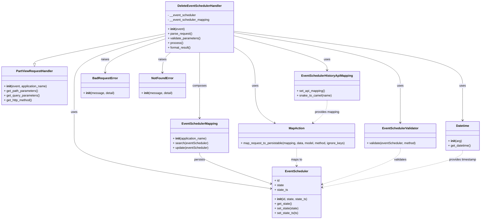

# Diagram: partview_core/partview_service/partview_service/api/event_scheduler/handler/DeleteEventSchedulerHandler.py

> Auto-generated by Obscura crawlers

## Mermaid

### SVG

<svg id="container" width="2487.44921875" xmlns="http://www.w3.org/2000/svg" class="classDiagram" height="1138" viewBox="0 0 2487.44921875 1138" role="graphics-document document" aria-roledescription="class"><g><defs><marker id="container_class-aggregationStart" class="marker aggregation class" refX="18" refY="7" markerWidth="190" markerHeight="240" orient="auto"><path d="M 18,7 L9,13 L1,7 L9,1 Z"></path></marker></defs><defs><marker id="container_class-aggregationEnd" class="marker aggregation class" refX="1" refY="7" markerWidth="20" markerHeight="28" orient="auto"><path d="M 18,7 L9,13 L1,7 L9,1 Z"></path></marker></defs><defs><marker id="container_class-extensionStart" class="marker extension class" refX="18" refY="7" markerWidth="190" markerHeight="240" orient="auto"><path d="M 1,7 L18,13 V 1 Z"></path></marker></defs><defs><marker id="container_class-extensionEnd" class="marker extension class" refX="1" refY="7" markerWidth="20" markerHeight="28" orient="auto"><path d="M 1,1 V 13 L18,7 Z"></path></marker></defs><defs><marker id="container_class-compositionStart" class="marker composition class" refX="18" refY="7" markerWidth="190" markerHeight="240" orient="auto"><path d="M 18,7 L9,13 L1,7 L9,1 Z"></path></marker></defs><defs><marker id="container_class-compositionEnd" class="marker composition class" refX="1" refY="7" markerWidth="20" markerHeight="28" orient="auto"><path d="M 18,7 L9,13 L1,7 L9,1 Z"></path></marker></defs><defs><marker id="container_class-dependencyStart" class="marker dependency class" refX="6" refY="7" markerWidth="190" markerHeight="240" orient="auto"><path d="M 5,7 L9,13 L1,7 L9,1 Z"></path></marker></defs><defs><marker id="container_class-dependencyEnd" class="marker dependency class" refX="13" refY="7" markerWidth="20" markerHeight="28" orient="auto"><path d="M 18,7 L9,13 L14,7 L9,1 Z"></path></marker></defs><defs><marker id="container_class-lollipopStart" class="marker lollipop class" refX="13" refY="7" markerWidth="190" markerHeight="240" orient="auto"><circle stroke="black" fill="transparent" cx="7" cy="7" r="6"></circle></marker></defs><defs><marker id="container_class-lollipopEnd" class="marker lollipop class" refX="1" refY="7" markerWidth="190" markerHeight="240" orient="auto"><circle stroke="black" fill="transparent" cx="7" cy="7" r="6"></circle></marker></defs><g class="root"><g class="clusters"></g><g class="edgePaths"><path d="M847.703,175.177L736.238,197.481C624.773,219.784,401.844,264.392,290.379,289.988C178.914,315.583,178.914,322.167,178.914,325.458L178.914,328.75" id="id_DeleteEventSchedulerHandler_PartViewRequestHandler_1" class="edge-thickness-normal edge-pattern-solid relation" style=";;;" data-edge="true" data-et="edge" data-id="id_DeleteEventSchedulerHandler_PartViewRequestHandler_1" data-points="W3sieCI6ODQ3LjcwMzEyNSwieSI6MTc1LjE3NjYxMjA2MDI3MzZ9LHsieCI6MTc4LjkxNDA2MjUsInkiOjMwOX0seyJ4IjoxNzguOTE0MDYyNSwieSI6MzQ2fV0=" marker-end="url(#container_class-extensionEnd)"></path><path d="M847.703,186.518L770.557,206.932C693.411,227.345,539.12,268.173,461.974,311.253C384.828,354.333,384.828,399.667,384.828,445C384.828,490.333,384.828,535.667,384.828,579C384.828,622.333,384.828,663.667,384.828,705C384.828,746.333,384.828,787.667,553.416,833.258C722.003,878.85,1059.178,928.7,1227.766,953.625L1396.354,978.55" id="id_DeleteEventSchedulerHandler_EventScheduler_2" class="edge-thickness-normal edge-pattern-solid relation" style=";;;" data-edge="true" data-et="edge" data-id="id_DeleteEventSchedulerHandler_EventScheduler_2" data-points="W3sieCI6ODQ3LjcwMzEyNSwieSI6MTg2LjUxNzg5NjAyNDQ2NDg1fSx7IngiOjM4NC44MjgxMjUsInkiOjMwOX0seyJ4IjozODQuODI4MTI1LCJ5Ijo0NDV9LHsieCI6Mzg0LjgyODEyNSwieSI6NTgxfSx7IngiOjM4NC44MjgxMjUsInkiOjcwNX0seyJ4IjozODQuODI4MTI1LCJ5Ijo4Mjl9LHsieCI6MTQwMi4yODkwNjI1LCJ5Ijo5NzkuNDI3OTQ5NDc4NTE4OH1d" marker-end="url(#container_class-dependencyEnd)"></path><path d="M1023.5,272L1023.5,278.167C1023.5,284.333,1023.5,296.667,1023.5,325.5C1023.5,354.333,1023.5,399.667,1023.5,445C1023.5,490.333,1023.5,535.667,1023.5,563.5C1023.5,591.333,1023.5,601.667,1023.5,606.833L1023.5,612" id="id_DeleteEventSchedulerHandler_EventSchedulerMapping_3" class="edge-thickness-normal edge-pattern-solid relation" style=";;;" data-edge="true" data-et="edge" data-id="id_DeleteEventSchedulerHandler_EventSchedulerMapping_3" data-points="W3sieCI6MTAyMy41LCJ5IjoyNzJ9LHsieCI6MTAyMy41LCJ5IjozMDl9LHsieCI6MTAyMy41LCJ5Ijo0NDV9LHsieCI6MTAyMy41LCJ5Ijo1ODF9LHsieCI6MTAyMy41LCJ5Ijo2MTh9XQ==" marker-end="url(#container_class-dependencyEnd)"></path><path d="M1199.297,184.587L1281.053,205.322C1362.809,226.058,1526.32,267.529,1608.076,297.431C1689.832,327.333,1689.832,345.667,1689.832,354.833L1689.832,364" id="id_DeleteEventSchedulerHandler_EventSchedulerHistoryApiMapping_4" class="edge-thickness-normal edge-pattern-solid relation" style=";;;" data-edge="true" data-et="edge" data-id="id_DeleteEventSchedulerHandler_EventSchedulerHistoryApiMapping_4" data-points="W3sieCI6MTE5OS4yOTY4NzUsInkiOjE4NC41ODY4ODgzNDA0MzY1fSx7IngiOjE2ODkuODMyMDMxMjUsInkiOjMwOX0seyJ4IjoxNjg5LjgzMjAzMTI1LCJ5IjozNzB9XQ==" marker-end="url(#container_class-dependencyEnd)"></path><path d="M1199.297,242.917L1218.11,253.931C1236.923,264.945,1274.549,286.972,1293.363,320.653C1312.176,354.333,1312.176,399.667,1312.176,445C1312.176,490.333,1312.176,535.667,1328.996,568.002C1345.817,600.337,1379.458,619.673,1396.279,629.342L1413.099,639.01" id="id_DeleteEventSchedulerHandler_MapAction_5" class="edge-thickness-normal edge-pattern-solid relation" style=";;;" data-edge="true" data-et="edge" data-id="id_DeleteEventSchedulerHandler_MapAction_5" data-points="W3sieCI6MTE5OS4yOTY4NzUsInkiOjI0Mi45MTcwOTE3ODQ5NTU1NX0seyJ4IjoxMzEyLjE3NTc4MTI1LCJ5IjozMDl9LHsieCI6MTMxMi4xNzU3ODEyNSwieSI6NDQ1fSx7IngiOjEzMTIuMTc1NzgxMjUsInkiOjU4MX0seyJ4IjoxNDE4LjMwMTI1Mzc4MDI0MiwieSI6NjQyfV0=" marker-end="url(#container_class-dependencyEnd)"></path><path d="M1199.297,168.442L1344.093,191.868C1488.889,215.295,1778.482,262.147,1923.278,308.24C2068.074,354.333,2068.074,399.667,2068.074,445C2068.074,490.333,2068.074,535.667,2068.074,567.5C2068.074,599.333,2068.074,617.667,2068.074,626.833L2068.074,636" id="id_DeleteEventSchedulerHandler_EventSchedulerValidator_6" class="edge-thickness-normal edge-pattern-solid relation" style=";;;" data-edge="true" data-et="edge" data-id="id_DeleteEventSchedulerHandler_EventSchedulerValidator_6" data-points="W3sieCI6MTE5OS4yOTY4NzUsInkiOjE2OC40NDE4OTY1NTYyMzc0fSx7IngiOjIwNjguMDc0MjE4NzUsInkiOjMwOX0seyJ4IjoyMDY4LjA3NDIxODc1LCJ5Ijo0NDV9LHsieCI6MjA2OC4wNzQyMTg3NSwieSI6NTgxfSx7IngiOjIwNjguMDc0MjE4NzUsInkiOjY0Mn1d" marker-end="url(#container_class-dependencyEnd)"></path><path d="M1199.297,161.717L1398.005,186.264C1596.714,210.811,1994.13,259.906,2192.839,307.119C2391.547,354.333,2391.547,399.667,2391.547,445C2391.547,490.333,2391.547,535.667,2391.547,565.5C2391.547,595.333,2391.547,609.667,2391.547,616.833L2391.547,624" id="id_DeleteEventSchedulerHandler_Datetime_7" class="edge-thickness-normal edge-pattern-solid relation" style=";;;" data-edge="true" data-et="edge" data-id="id_DeleteEventSchedulerHandler_Datetime_7" data-points="W3sieCI6MTE5OS4yOTY4NzUsInkiOjE2MS43MTY4NTIyNjQyOTEwMn0seyJ4IjoyMzkxLjU0Njg3NSwieSI6MzA5fSx7IngiOjIzOTEuNTQ2ODc1LCJ5Ijo0NDV9LHsieCI6MjM5MS41NDY4NzUsInkiOjU4MX0seyJ4IjoyMzkxLjU0Njg3NSwieSI6NjMwfV0=" marker-end="url(#container_class-dependencyEnd)"></path><path d="M847.703,201.775L796.848,219.646C745.992,237.517,644.281,273.258,593.426,302.296C542.57,331.333,542.57,353.667,542.57,364.833L542.57,376" id="id_DeleteEventSchedulerHandler_BadRequestError_8" class="edge-thickness-normal edge-pattern-solid relation" style=";;;" data-edge="true" data-et="edge" data-id="id_DeleteEventSchedulerHandler_BadRequestError_8" data-points="W3sieCI6ODQ3LjcwMzEyNSwieSI6MjAxLjc3NTQ5OTkyNjg5OTM5fSx7IngiOjU0Mi41NzAzMTI1LCJ5IjozMDl9LHsieCI6NTQyLjU3MDMxMjUsInkiOjM4Mn1d" marker-end="url(#container_class-dependencyEnd)"></path><path d="M875.238,272L868.312,278.167C861.385,284.333,847.532,296.667,840.606,314C833.68,331.333,833.68,353.667,833.68,364.833L833.68,376" id="id_DeleteEventSchedulerHandler_NotFoundError_9" class="edge-thickness-normal edge-pattern-solid relation" style=";;;" data-edge="true" data-et="edge" data-id="id_DeleteEventSchedulerHandler_NotFoundError_9" data-points="W3sieCI6ODc1LjIzNzk4MDc2OTIzMDcsInkiOjI3Mn0seyJ4Ijo4MzMuNjc5Njg3NSwieSI6MzA5fSx7IngiOjgzMy42Nzk2ODc1LCJ5IjozODJ9XQ==" marker-end="url(#container_class-dependencyEnd)"></path><path d="M1023.5,792L1023.5,798.167C1023.5,804.333,1023.5,816.667,1085.683,843.668C1147.867,870.669,1272.233,912.337,1334.417,933.172L1396.6,954.006" id="id_EventSchedulerMapping_EventScheduler_10" class="edge-thickness-normal edge-pattern-solid relation" style=";;;" data-edge="true" data-et="edge" data-id="id_EventSchedulerMapping_EventScheduler_10" data-points="W3sieCI6MTAyMy41LCJ5Ijo3OTJ9LHsieCI6MTAyMy41LCJ5Ijo4Mjl9LHsieCI6MTQwMi4yODkwNjI1LCJ5Ijo5NTUuOTEyMjg4NTgxODcyM31d" marker-end="url(#container_class-dependencyEnd)"></path><path d="M1527.906,768L1527.906,778.167C1527.906,788.333,1527.906,808.667,1527.906,824C1527.906,839.333,1527.906,849.667,1527.906,854.833L1527.906,860" id="id_MapAction_EventScheduler_11" class="edge-thickness-normal edge-pattern-dashed relation" style=";;;" data-edge="true" data-et="edge" data-id="id_MapAction_EventScheduler_11" data-points="W3sieCI6MTUyNy45MDYyNSwieSI6NzY4fSx7IngiOjE1MjcuOTA2MjUsInkiOjgyOX0seyJ4IjoxNTI3LjkwNjI1LCJ5Ijo4NjZ9XQ==" marker-end="url(#container_class-dependencyEnd)"></path><path d="M1689.832,520L1689.832,530.167C1689.832,540.333,1689.832,560.667,1677.35,580.392C1664.868,600.117,1639.903,619.235,1627.421,628.793L1614.939,638.352" id="id_EventSchedulerHistoryApiMapping_MapAction_12" class="edge-thickness-normal edge-pattern-dashed relation" style=";;;" data-edge="true" data-et="edge" data-id="id_EventSchedulerHistoryApiMapping_MapAction_12" data-points="W3sieCI6MTY4OS44MzIwMzEyNSwieSI6NTIwfSx7IngiOjE2ODkuODMyMDMxMjUsInkiOjU4MX0seyJ4IjoxNjEwLjE3NDk5MzY5OTU5NjgsInkiOjY0Mn1d" marker-end="url(#container_class-dependencyEnd)"></path><path d="M2068.074,768L2068.074,778.167C2068.074,788.333,2068.074,808.667,1999.937,840.151C1931.799,871.636,1795.525,914.271,1727.387,935.589L1659.25,956.907" id="id_EventSchedulerValidator_EventScheduler_13" class="edge-thickness-normal edge-pattern-dashed relation" style=";;;" data-edge="true" data-et="edge" data-id="id_EventSchedulerValidator_EventScheduler_13" data-points="W3sieCI6MjA2OC4wNzQyMTg3NSwieSI6NzY4fSx7IngiOjIwNjguMDc0MjE4NzUsInkiOjgyOX0seyJ4IjoxNjUzLjUyMzQzNzUsInkiOjk1OC42OTg2OTc1OTg0MDMyfV0=" marker-end="url(#container_class-dependencyEnd)"></path><path d="M2391.547,780L2391.547,788.167C2391.547,796.333,2391.547,812.667,2269.524,844.711C2147.502,876.756,1903.457,924.511,1781.434,948.389L1659.412,972.267" id="id_Datetime_EventScheduler_14" class="edge-thickness-normal edge-pattern-dashed relation" style=";;;" data-edge="true" data-et="edge" data-id="id_Datetime_EventScheduler_14" data-points="W3sieCI6MjM5MS41NDY4NzUsInkiOjc4MH0seyJ4IjoyMzkxLjU0Njg3NSwieSI6ODI5fSx7IngiOjE2NTMuNTIzNDM3NSwieSI6OTczLjQxODgyMTEyNDIzNzl9XQ==" marker-end="url(#container_class-dependencyEnd)"></path></g><g class="edgeLabels"><g class="edgeLabel"><g class="label" data-id="id_DeleteEventSchedulerHandler_PartViewRequestHandler_1" transform="translate(0, 0)"><foreignObject width="0" height="0">

</foreignObject></g></g><g class="edgeLabel" transform="translate(384.828125, 581)"><g class="label" data-id="id_DeleteEventSchedulerHandler_EventScheduler_2" transform="translate(-16.4921875, -12)"><foreignObject width="32.984375" height="24">

uses

</foreignObject></g></g><g class="edgeLabel" transform="translate(1023.5, 445)"><g class="label" data-id="id_DeleteEventSchedulerHandler_EventSchedulerMapping_3" transform="translate(-36.453125, -12)"><foreignObject width="72.90625" height="24">

composes

</foreignObject></g></g><g class="edgeLabel" transform="translate(1689.83203125, 309)"><g class="label" data-id="id_DeleteEventSchedulerHandler_EventSchedulerHistoryApiMapping_4" transform="translate(-16.4921875, -12)"><foreignObject width="32.984375" height="24">

uses

</foreignObject></g></g><g class="edgeLabel" transform="translate(1312.17578125, 445)"><g class="label" data-id="id_DeleteEventSchedulerHandler_MapAction_5" transform="translate(-16.4921875, -12)"><foreignObject width="32.984375" height="24">

uses

</foreignObject></g></g><g class="edgeLabel" transform="translate(2068.07421875, 445)"><g class="label" data-id="id_DeleteEventSchedulerHandler_EventSchedulerValidator_6" transform="translate(-16.4921875, -12)"><foreignObject width="32.984375" height="24">

uses

</foreignObject></g></g><g class="edgeLabel" transform="translate(2391.546875, 445)"><g class="label" data-id="id_DeleteEventSchedulerHandler_Datetime_7" transform="translate(-16.4921875, -12)"><foreignObject width="32.984375" height="24">

uses

</foreignObject></g></g><g class="edgeLabel" transform="translate(542.5703125, 309)"><g class="label" data-id="id_DeleteEventSchedulerHandler_BadRequestError_8" transform="translate(-21.25, -12)"><foreignObject width="42.5" height="24">

raises

</foreignObject></g></g><g class="edgeLabel" transform="translate(833.6796875, 309)"><g class="label" data-id="id_DeleteEventSchedulerHandler_NotFoundError_9" transform="translate(-21.25, -12)"><foreignObject width="42.5" height="24">

raises

</foreignObject></g></g><g class="edgeLabel" transform="translate(1023.5, 829)"><g class="label" data-id="id_EventSchedulerMapping_EventScheduler_10" transform="translate(-28.4375, -12)"><foreignObject width="56.875" height="24">

persists

</foreignObject></g></g><g class="edgeLabel" transform="translate(1527.90625, 829)"><g class="label" data-id="id_MapAction_EventScheduler_11" transform="translate(-29.2578125, -12)"><foreignObject width="58.515625" height="24">

maps to

</foreignObject></g></g><g class="edgeLabel" transform="translate(1689.83203125, 581)"><g class="label" data-id="id_EventSchedulerHistoryApiMapping_MapAction_12" transform="translate(-65.25, -12)"><foreignObject width="130.5" height="24">

provides mapping

</foreignObject></g></g><g class="edgeLabel" transform="translate(2068.07421875, 829)"><g class="label" data-id="id_EventSchedulerValidator_EventScheduler_13" transform="translate(-32.6875, -12)"><foreignObject width="65.375" height="24">

validates

</foreignObject></g></g><g class="edgeLabel" transform="translate(2391.546875, 829)"><g class="label" data-id="id_Datetime_EventScheduler_14" transform="translate(-72.3203125, -12)"><foreignObject width="144.640625" height="24">

provides timestamp

</foreignObject></g></g></g><g class="nodes"><g class="node default" id="classId-DeleteEventSchedulerHandler-0" transform="translate(1023.5, 140)"><g class="basic label-container"><path d="M-175.796875 -132 L175.796875 -132 L175.796875 132 L-175.796875 132" stroke="none" stroke-width="0" fill="#ECECFF" style=""></path><path d="M-175.796875 -132 C-89.01500360215766 -132, -2.233132204315325 -132, 175.796875 -132 M-175.796875 -132 C-69.66885203436665 -132, 36.4591709312667 -132, 175.796875 -132 M175.796875 -132 C175.796875 -31.991714054969506, 175.796875 68.01657189006099, 175.796875 132 M175.796875 -132 C175.796875 -33.57711448846398, 175.796875 64.84577102307205, 175.796875 132 M175.796875 132 C95.17742393561524 132, 14.557972871230476 132, -175.796875 132 M175.796875 132 C40.62585845696441 132, -94.54515808607118 132, -175.796875 132 M-175.796875 132 C-175.796875 72.78929491184893, -175.796875 13.578589823697854, -175.796875 -132 M-175.796875 132 C-175.796875 64.84386768105551, -175.796875 -2.3122646378889726, -175.796875 -132" stroke="#9370DB" stroke-width="1.3" fill="none" stroke-dasharray="0 0" style=""></path></g><g class="annotation-group text" transform="translate(0, -108)"></g><g class="label-group text" transform="translate(-109.8125, -108)"><g class="label" style="font-weight: bolder" transform="translate(0,-12)"><foreignObject width="219.625" height="24">

DeleteEventSchedulerHandler

</foreignObject></g></g><g class="members-group text" transform="translate(-163.796875, -60)"><g class="label" style="" transform="translate(0,-12)"><foreignObject width="147.109375" height="24">

- __event_scheduler

</foreignObject></g><g class="label" style="" transform="translate(0,12)"><foreignObject width="217.78125" height="24">

- __event_scheduler_mapping

</foreignObject></g></g><g class="methods-group text" transform="translate(-163.796875, 12)"><g class="label" style="" transform="translate(0,-12)"><foreignObject width="87.390625" height="24">

+ <strong>init</strong>(event)

</foreignObject></g><g class="label" style="" transform="translate(0,12)"><foreignObject width="126.046875" height="24">

+ parse_request()

</foreignObject></g><g class="label" style="" transform="translate(0,36)"><foreignObject width="170.953125" height="24">

+ validate_parameters()

</foreignObject></g><g class="label" style="" transform="translate(0,60)"><foreignObject width="77.96875" height="24">

+ process()

</foreignObject></g><g class="label" style="" transform="translate(0,84)"><foreignObject width="121.5" height="24">

+ format_result()

</foreignObject></g></g><g class="divider" style=""><path d="M-175.796875 -84 C-90.02824103451998 -84, -4.259607069039959 -84, 175.796875 -84 M-175.796875 -84 C-41.229575150508936 -84, 93.33772469898213 -84, 175.796875 -84" stroke="#9370DB" stroke-width="1.3" fill="none" stroke-dasharray="0 0" style=""></path></g><g class="divider" style=""><path d="M-175.796875 -12 C-60.736416031496304 -12, 54.32404293700739 -12, 175.796875 -12 M-175.796875 -12 C-40.3896708828392 -12, 95.0175332343216 -12, 175.796875 -12" stroke="#9370DB" stroke-width="1.3" fill="none" stroke-dasharray="0 0" style=""></path></g></g><g class="node default" id="classId-PartViewRequestHandler-1" transform="translate(178.9140625, 445)"><g class="basic label-container"><path d="M-170.9140625 -99 L170.9140625 -99 L170.9140625 99 L-170.9140625 99" stroke="none" stroke-width="0" fill="#ECECFF" style=""></path><path d="M-170.9140625 -99 C-63.42730509275195 -99, 44.0594523144961 -99, 170.9140625 -99 M-170.9140625 -99 C-65.40449722352402 -99, 40.105068052951964 -99, 170.9140625 -99 M170.9140625 -99 C170.9140625 -39.97950625557404, 170.9140625 19.040987488851925, 170.9140625 99 M170.9140625 -99 C170.9140625 -34.276162164458384, 170.9140625 30.447675671083232, 170.9140625 99 M170.9140625 99 C49.865470479061855 99, -71.18312154187629 99, -170.9140625 99 M170.9140625 99 C42.26174058210859 99, -86.39058133578283 99, -170.9140625 99 M-170.9140625 99 C-170.9140625 51.83349085480367, -170.9140625 4.666981709607342, -170.9140625 -99 M-170.9140625 99 C-170.9140625 27.347814367199064, -170.9140625 -44.30437126560187, -170.9140625 -99" stroke="#9370DB" stroke-width="1.3" fill="none" stroke-dasharray="0 0" style=""></path></g><g class="annotation-group text" transform="translate(0, -75)"></g><g class="label-group text" transform="translate(-91.359375, -75)"><g class="label" style="font-weight: bolder" transform="translate(0,-12)"><foreignObject width="182.71875" height="24">

PartViewRequestHandler

</foreignObject></g></g><g class="members-group text" transform="translate(-158.9140625, -27)"></g><g class="methods-group text" transform="translate(-158.9140625, 3)"><g class="label" style="" transform="translate(0,-12)"><foreignObject width="226.46875" height="24">

+ <strong>init</strong>(event, application_name)

</foreignObject></g><g class="label" style="" transform="translate(0,12)"><foreignObject width="177.46875" height="24">

+ get_path_parameters()

</foreignObject></g><g class="label" style="" transform="translate(0,36)"><foreignObject width="185.109375" height="24">

+ get_query_parameters()

</foreignObject></g><g class="label" style="" transform="translate(0,60)"><foreignObject width="148.40625" height="24">

+ get_http_method()

</foreignObject></g></g><g class="divider" style=""><path d="M-170.9140625 -51 C-90.81613719687046 -51, -10.718211893740914 -51, 170.9140625 -51 M-170.9140625 -51 C-57.592870650832225 -51, 55.72832119833555 -51, 170.9140625 -51" stroke="#9370DB" stroke-width="1.3" fill="none" stroke-dasharray="0 0" style=""></path></g><g class="divider" style=""><path d="M-170.9140625 -27 C-80.13288458307406 -27, 10.648293333851882 -27, 170.9140625 -27 M-170.9140625 -27 C-92.01236647186725 -27, -13.110670443734506 -27, 170.9140625 -27" stroke="#9370DB" stroke-width="1.3" fill="none" stroke-dasharray="0 0" style=""></path></g></g><g class="node default" id="classId-EventScheduler-2" transform="translate(1527.90625, 998)"><g class="basic label-container"><path d="M-125.6171875 -132 L125.6171875 -132 L125.6171875 132 L-125.6171875 132" stroke="none" stroke-width="0" fill="#ECECFF" style=""></path><path d="M-125.6171875 -132 C-42.38709665655011 -132, 40.84299418689977 -132, 125.6171875 -132 M-125.6171875 -132 C-69.67764266623477 -132, -13.738097832469549 -132, 125.6171875 -132 M125.6171875 -132 C125.6171875 -41.97118197898412, 125.6171875 48.05763604203176, 125.6171875 132 M125.6171875 -132 C125.6171875 -65.22015242006086, 125.6171875 1.559695159878288, 125.6171875 132 M125.6171875 132 C32.25951167190739 132, -61.09816415618522 132, -125.6171875 132 M125.6171875 132 C70.31839242130971 132, 15.019597342619406 132, -125.6171875 132 M-125.6171875 132 C-125.6171875 67.97424412727742, -125.6171875 3.9484882545548317, -125.6171875 -132 M-125.6171875 132 C-125.6171875 54.06459983914003, -125.6171875 -23.87080032171994, -125.6171875 -132" stroke="#9370DB" stroke-width="1.3" fill="none" stroke-dasharray="0 0" style=""></path></g><g class="annotation-group text" transform="translate(0, -108)"></g><g class="label-group text" transform="translate(-56.984375, -108)"><g class="label" style="font-weight: bolder" transform="translate(0,-12)"><foreignObject width="113.96875" height="24">

EventScheduler

</foreignObject></g></g><g class="members-group text" transform="translate(-113.6171875, -60)"><g class="label" style="" transform="translate(0,-12)"><foreignObject width="26.3125" height="24">

+ id

</foreignObject></g><g class="label" style="" transform="translate(0,12)"><foreignObject width="48.328125" height="24">

+ state

</foreignObject></g><g class="label" style="" transform="translate(0,36)"><foreignObject width="69.25" height="24">

+ state_ts

</foreignObject></g></g><g class="methods-group text" transform="translate(-113.6171875, 36)"><g class="label" style="" transform="translate(0,-12)"><foreignObject width="170.25" height="24">

+ <strong>init</strong>(id, state, state_ts)

</foreignObject></g><g class="label" style="" transform="translate(0,12)"><foreignObject width="89.578125" height="24">

+ get_state()

</foreignObject></g><g class="label" style="" transform="translate(0,36)"><foreignObject width="125.078125" height="24">

+ set_state(state)

</foreignObject></g><g class="label" style="" transform="translate(0,60)"><foreignObject width="123.15625" height="24">

+ set_state_ts(ts)

</foreignObject></g></g><g class="divider" style=""><path d="M-125.6171875 -84 C-44.5293339467233 -84, 36.5585196065534 -84, 125.6171875 -84 M-125.6171875 -84 C-26.157120195402413 -84, 73.30294710919517 -84, 125.6171875 -84" stroke="#9370DB" stroke-width="1.3" fill="none" stroke-dasharray="0 0" style=""></path></g><g class="divider" style=""><path d="M-125.6171875 12 C-33.5481602673683 12, 58.520866965263394 12, 125.6171875 12 M-125.6171875 12 C-61.22070943325471 12, 3.175768633490577 12, 125.6171875 12" stroke="#9370DB" stroke-width="1.3" fill="none" stroke-dasharray="0 0" style=""></path></g></g><g class="node default" id="classId-EventSchedulerMapping-3" transform="translate(1023.5, 705)"><g class="basic label-container"><path d="M-149.80859375 -87 L149.80859375 -87 L149.80859375 87 L-149.80859375 87" stroke="none" stroke-width="0" fill="#ECECFF" style=""></path><path d="M-149.80859375 -87 C-52.753612377168395 -87, 44.30136899566321 -87, 149.80859375 -87 M-149.80859375 -87 C-62.27190583963582 -87, 25.26478207072836 -87, 149.80859375 -87 M149.80859375 -87 C149.80859375 -25.985830999347407, 149.80859375 35.02833800130519, 149.80859375 87 M149.80859375 -87 C149.80859375 -34.612782644577806, 149.80859375 17.77443471084439, 149.80859375 87 M149.80859375 87 C62.658450832457945 87, -24.49169208508411 87, -149.80859375 87 M149.80859375 87 C63.86658075738934 87, -22.075432235221314 87, -149.80859375 87 M-149.80859375 87 C-149.80859375 23.82875786590614, -149.80859375 -39.34248426818772, -149.80859375 -87 M-149.80859375 87 C-149.80859375 28.845006112313484, -149.80859375 -29.30998777537303, -149.80859375 -87" stroke="#9370DB" stroke-width="1.3" fill="none" stroke-dasharray="0 0" style=""></path></g><g class="annotation-group text" transform="translate(0, -63)"></g><g class="label-group text" transform="translate(-88.4921875, -63)"><g class="label" style="font-weight: bolder" transform="translate(0,-12)"><foreignObject width="176.984375" height="24">

EventSchedulerMapping

</foreignObject></g></g><g class="members-group text" transform="translate(-137.80859375, -15)"></g><g class="methods-group text" transform="translate(-137.80859375, 15)"><g class="label" style="" transform="translate(0,-12)"><foreignObject width="177.984375" height="24">

+ <strong>init</strong>(application_name)

</foreignObject></g><g class="label" style="" transform="translate(0,12)"><foreignObject width="183.234375" height="24">

+ search(eventScheduler)

</foreignObject></g><g class="label" style="" transform="translate(0,36)"><foreignObject width="187.125" height="24">

+ update(eventScheduler)

</foreignObject></g></g><g class="divider" style=""><path d="M-149.80859375 -39 C-57.520868178537825 -39, 34.76685739292435 -39, 149.80859375 -39 M-149.80859375 -39 C-34.014386138492014 -39, 81.77982147301597 -39, 149.80859375 -39" stroke="#9370DB" stroke-width="1.3" fill="none" stroke-dasharray="0 0" style=""></path></g><g class="divider" style=""><path d="M-149.80859375 -15 C-83.72221956379168 -15, -17.635845377583365 -15, 149.80859375 -15 M-149.80859375 -15 C-70.0754384405695 -15, 9.657716868861002 -15, 149.80859375 -15" stroke="#9370DB" stroke-width="1.3" fill="none" stroke-dasharray="0 0" style=""></path></g></g><g class="node default" id="classId-MapAction-4" transform="translate(1527.90625, 705)"><g class="basic label-container"><path d="M-304.59765625 -63 L304.59765625 -63 L304.59765625 63 L-304.59765625 63" stroke="none" stroke-width="0" fill="#ECECFF" style=""></path><path d="M-304.59765625 -63 C-101.31214098583266 -63, 101.97337427833469 -63, 304.59765625 -63 M-304.59765625 -63 C-115.70235102327104 -63, 73.19295420345793 -63, 304.59765625 -63 M304.59765625 -63 C304.59765625 -18.67582126034538, 304.59765625 25.64835747930924, 304.59765625 63 M304.59765625 -63 C304.59765625 -24.377408664611075, 304.59765625 14.24518267077785, 304.59765625 63 M304.59765625 63 C101.15829452369769 63, -102.28106720260462 63, -304.59765625 63 M304.59765625 63 C61.13144738977567 63, -182.33476147044865 63, -304.59765625 63 M-304.59765625 63 C-304.59765625 25.822523503692963, -304.59765625 -11.354952992614074, -304.59765625 -63 M-304.59765625 63 C-304.59765625 31.646167933706653, -304.59765625 0.29233586741330697, -304.59765625 -63" stroke="#9370DB" stroke-width="1.3" fill="none" stroke-dasharray="0 0" style=""></path></g><g class="annotation-group text" transform="translate(0, -39)"></g><g class="label-group text" transform="translate(-38.6328125, -39)"><g class="label" style="font-weight: bolder" transform="translate(0,-12)"><foreignObject width="77.265625" height="24">

MapAction

</foreignObject></g></g><g class="members-group text" transform="translate(-292.59765625, 9)"></g><g class="methods-group text" transform="translate(-292.59765625, 39)"><g class="label" style="" transform="translate(0,-12)"><foreignObject width="546.5625" height="24">

+ map_request_to_persistable(mapping, data, model, method, ignore_keys)

</foreignObject></g></g><g class="divider" style=""><path d="M-304.59765625 -15 C-90.75708554546443 -15, 123.08348515907113 -15, 304.59765625 -15 M-304.59765625 -15 C-117.24643473014649 -15, 70.10478678970702 -15, 304.59765625 -15" stroke="#9370DB" stroke-width="1.3" fill="none" stroke-dasharray="0 0" style=""></path></g><g class="divider" style=""><path d="M-304.59765625 9 C-141.4686465995039 9, 21.660363050992203 9, 304.59765625 9 M-304.59765625 9 C-178.09653620242332 9, -51.595416154846646 9, 304.59765625 9" stroke="#9370DB" stroke-width="1.3" fill="none" stroke-dasharray="0 0" style=""></path></g></g><g class="node default" id="classId-EventSchedulerHistoryApiMapping-5" transform="translate(1689.83203125, 445)"><g class="basic label-container"><path d="M-164.82421875 -75 L164.82421875 -75 L164.82421875 75 L-164.82421875 75" stroke="none" stroke-width="0" fill="#ECECFF" style=""></path><path d="M-164.82421875 -75 C-85.48931162532422 -75, -6.15440450064844 -75, 164.82421875 -75 M-164.82421875 -75 C-45.39630395660366 -75, 74.03161083679268 -75, 164.82421875 -75 M164.82421875 -75 C164.82421875 -40.5146974978859, 164.82421875 -6.029394995771796, 164.82421875 75 M164.82421875 -75 C164.82421875 -17.718688571050514, 164.82421875 39.56262285789897, 164.82421875 75 M164.82421875 75 C74.97465424082546 75, -14.874910268349083 75, -164.82421875 75 M164.82421875 75 C60.782242761142044 75, -43.25973322771591 75, -164.82421875 75 M-164.82421875 75 C-164.82421875 15.501828867190497, -164.82421875 -43.996342265619006, -164.82421875 -75 M-164.82421875 75 C-164.82421875 34.40380136425066, -164.82421875 -6.1923972714986775, -164.82421875 -75" stroke="#9370DB" stroke-width="1.3" fill="none" stroke-dasharray="0 0" style=""></path></g><g class="annotation-group text" transform="translate(0, -51)"></g><g class="label-group text" transform="translate(-126.6640625, -51)"><g class="label" style="font-weight: bolder" transform="translate(0,-12)"><foreignObject width="253.328125" height="24">

EventSchedulerHistoryApiMapping

</foreignObject></g></g><g class="members-group text" transform="translate(-152.82421875, -3)"></g><g class="methods-group text" transform="translate(-152.82421875, 27)"><g class="label" style="" transform="translate(0,-12)"><foreignObject width="147.234375" height="24">

+ set_api_mapping()

</foreignObject></g><g class="label" style="" transform="translate(0,12)"><foreignObject width="178.984375" height="24">

+ snake_to_camel(name)

</foreignObject></g></g><g class="divider" style=""><path d="M-164.82421875 -27 C-92.45887141930992 -27, -20.09352408861983 -27, 164.82421875 -27 M-164.82421875 -27 C-40.21818210555767 -27, 84.38785453888465 -27, 164.82421875 -27" stroke="#9370DB" stroke-width="1.3" fill="none" stroke-dasharray="0 0" style=""></path></g><g class="divider" style=""><path d="M-164.82421875 -3 C-38.547438988679005 -3, 87.72934077264199 -3, 164.82421875 -3 M-164.82421875 -3 C-61.125270949761656 -3, 42.57367685047669 -3, 164.82421875 -3" stroke="#9370DB" stroke-width="1.3" fill="none" stroke-dasharray="0 0" style=""></path></g></g><g class="node default" id="classId-EventSchedulerValidator-6" transform="translate(2068.07421875, 705)"><g class="basic label-container"><path d="M-185.5703125 -63 L185.5703125 -63 L185.5703125 63 L-185.5703125 63" stroke="none" stroke-width="0" fill="#ECECFF" style=""></path><path d="M-185.5703125 -63 C-74.44147575735383 -63, 36.687360985292344 -63, 185.5703125 -63 M-185.5703125 -63 C-59.69108311330011 -63, 66.18814627339978 -63, 185.5703125 -63 M185.5703125 -63 C185.5703125 -35.11190360204424, 185.5703125 -7.223807204088473, 185.5703125 63 M185.5703125 -63 C185.5703125 -21.276139653708384, 185.5703125 20.447720692583232, 185.5703125 63 M185.5703125 63 C107.67929812316613 63, 29.78828374633227 63, -185.5703125 63 M185.5703125 63 C88.24099070749489 63, -9.088331085010225 63, -185.5703125 63 M-185.5703125 63 C-185.5703125 29.50249447974732, -185.5703125 -3.9950110405053607, -185.5703125 -63 M-185.5703125 63 C-185.5703125 20.655273597094983, -185.5703125 -21.689452805810035, -185.5703125 -63" stroke="#9370DB" stroke-width="1.3" fill="none" stroke-dasharray="0 0" style=""></path></g><g class="annotation-group text" transform="translate(0, -39)"></g><g class="label-group text" transform="translate(-90.171875, -39)"><g class="label" style="font-weight: bolder" transform="translate(0,-12)"><foreignObject width="180.34375" height="24">

EventSchedulerValidator

</foreignObject></g></g><g class="members-group text" transform="translate(-173.5703125, 9)"></g><g class="methods-group text" transform="translate(-173.5703125, 39)"><g class="label" style="" transform="translate(0,-12)"><foreignObject width="256.96875" height="24">

+ validate(eventScheduler, method)

</foreignObject></g></g><g class="divider" style=""><path d="M-185.5703125 -15 C-78.80847405767673 -15, 27.953364384646534 -15, 185.5703125 -15 M-185.5703125 -15 C-106.55284521928404 -15, -27.535377938568075 -15, 185.5703125 -15" stroke="#9370DB" stroke-width="1.3" fill="none" stroke-dasharray="0 0" style=""></path></g><g class="divider" style=""><path d="M-185.5703125 9 C-78.45399451964744 9, 28.662323460705124 9, 185.5703125 9 M-185.5703125 9 C-95.71298756412911 9, -5.855662628258216 9, 185.5703125 9" stroke="#9370DB" stroke-width="1.3" fill="none" stroke-dasharray="0 0" style=""></path></g></g><g class="node default" id="classId-Datetime-7" transform="translate(2391.546875, 705)"><g class="basic label-container"><path d="M-87.90234375 -75 L87.90234375 -75 L87.90234375 75 L-87.90234375 75" stroke="none" stroke-width="0" fill="#ECECFF" style=""></path><path d="M-87.90234375 -75 C-40.962420023426034 -75, 5.9775037031479314 -75, 87.90234375 -75 M-87.90234375 -75 C-30.253308203765897 -75, 27.395727342468206 -75, 87.90234375 -75 M87.90234375 -75 C87.90234375 -42.2579020152248, 87.90234375 -9.515804030449601, 87.90234375 75 M87.90234375 -75 C87.90234375 -41.635316309192696, 87.90234375 -8.270632618385392, 87.90234375 75 M87.90234375 75 C22.69698525714682 75, -42.50837323570636 75, -87.90234375 75 M87.90234375 75 C35.33250629566506 75, -17.237331158669875 75, -87.90234375 75 M-87.90234375 75 C-87.90234375 22.014447389989833, -87.90234375 -30.971105220020334, -87.90234375 -75 M-87.90234375 75 C-87.90234375 37.27870407394883, -87.90234375 -0.4425918521023391, -87.90234375 -75" stroke="#9370DB" stroke-width="1.3" fill="none" stroke-dasharray="0 0" style=""></path></g><g class="annotation-group text" transform="translate(0, -51)"></g><g class="label-group text" transform="translate(-33.3984375, -51)"><g class="label" style="font-weight: bolder" transform="translate(0,-12)"><foreignObject width="66.796875" height="24">

Datetime

</foreignObject></g></g><g class="members-group text" transform="translate(-75.90234375, -3)"></g><g class="methods-group text" transform="translate(-75.90234375, 27)"><g class="label" style="" transform="translate(0,-12)"><foreignObject width="70" height="24">

+ <strong>init</strong>(arg)

</foreignObject></g><g class="label" style="" transform="translate(0,12)"><foreignObject width="118.40625" height="24">

+ get_datetime()

</foreignObject></g></g><g class="divider" style=""><path d="M-87.90234375 -27 C-28.055503934940546 -27, 31.791335880118908 -27, 87.90234375 -27 M-87.90234375 -27 C-51.95642146419282 -27, -16.010499178385643 -27, 87.90234375 -27" stroke="#9370DB" stroke-width="1.3" fill="none" stroke-dasharray="0 0" style=""></path></g><g class="divider" style=""><path d="M-87.90234375 -3 C-44.97402921778576 -3, -2.045714685571525 -3, 87.90234375 -3 M-87.90234375 -3 C-47.78713336143284 -3, -7.671922972865687 -3, 87.90234375 -3" stroke="#9370DB" stroke-width="1.3" fill="none" stroke-dasharray="0 0" style=""></path></g></g><g class="node default" id="classId-BadRequestError-8" transform="translate(542.5703125, 445)"><g class="basic label-container"><path d="M-122.7421875 -63 L122.7421875 -63 L122.7421875 63 L-122.7421875 63" stroke="none" stroke-width="0" fill="#ECECFF" style=""></path><path d="M-122.7421875 -63 C-47.19104831055773 -63, 28.360090878884535 -63, 122.7421875 -63 M-122.7421875 -63 C-47.2559026789005 -63, 28.230382142199005 -63, 122.7421875 -63 M122.7421875 -63 C122.7421875 -17.745950543077925, 122.7421875 27.50809891384415, 122.7421875 63 M122.7421875 -63 C122.7421875 -14.300694875144394, 122.7421875 34.39861024971121, 122.7421875 63 M122.7421875 63 C72.3341878821965 63, 21.926188264393005 63, -122.7421875 63 M122.7421875 63 C33.766428486658654 63, -55.20933052668269 63, -122.7421875 63 M-122.7421875 63 C-122.7421875 30.411811425163478, -122.7421875 -2.176377149673044, -122.7421875 -63 M-122.7421875 63 C-122.7421875 36.90505500441707, -122.7421875 10.810110008834144, -122.7421875 -63" stroke="#9370DB" stroke-width="1.3" fill="none" stroke-dasharray="0 0" style=""></path></g><g class="annotation-group text" transform="translate(0, -39)"></g><g class="label-group text" transform="translate(-62.28125, -39)"><g class="label" style="font-weight: bolder" transform="translate(0,-12)"><foreignObject width="124.5625" height="24">

BadRequestError

</foreignObject></g></g><g class="members-group text" transform="translate(-110.7421875, 9)"></g><g class="methods-group text" transform="translate(-110.7421875, 39)"><g class="label" style="" transform="translate(0,-12)"><foreignObject width="159.203125" height="24">

+ <strong>init</strong>(message, detail)

</foreignObject></g></g><g class="divider" style=""><path d="M-122.7421875 -15 C-40.14019220403625 -15, 42.46180309192749 -15, 122.7421875 -15 M-122.7421875 -15 C-68.95205610199986 -15, -15.16192470399973 -15, 122.7421875 -15" stroke="#9370DB" stroke-width="1.3" fill="none" stroke-dasharray="0 0" style=""></path></g><g class="divider" style=""><path d="M-122.7421875 9 C-44.0231074872255 9, 34.695972525548996 9, 122.7421875 9 M-122.7421875 9 C-26.764998980472654 9, 69.21218953905469 9, 122.7421875 9" stroke="#9370DB" stroke-width="1.3" fill="none" stroke-dasharray="0 0" style=""></path></g></g><g class="node default" id="classId-NotFoundError-9" transform="translate(833.6796875, 445)"><g class="basic label-container"><path d="M-118.3671875 -63 L118.3671875 -63 L118.3671875 63 L-118.3671875 63" stroke="none" stroke-width="0" fill="#ECECFF" style=""></path><path d="M-118.3671875 -63 C-52.504814945363336 -63, 13.357557609273329 -63, 118.3671875 -63 M-118.3671875 -63 C-27.145249892963506 -63, 64.07668771407299 -63, 118.3671875 -63 M118.3671875 -63 C118.3671875 -25.510785886699402, 118.3671875 11.978428226601196, 118.3671875 63 M118.3671875 -63 C118.3671875 -18.799552998723165, 118.3671875 25.40089400255367, 118.3671875 63 M118.3671875 63 C38.892535244566176 63, -40.58211701086765 63, -118.3671875 63 M118.3671875 63 C59.071285248779375 63, -0.22461700244124927 63, -118.3671875 63 M-118.3671875 63 C-118.3671875 26.493698731349298, -118.3671875 -10.012602537301404, -118.3671875 -63 M-118.3671875 63 C-118.3671875 16.163769560445182, -118.3671875 -30.672460879109636, -118.3671875 -63" stroke="#9370DB" stroke-width="1.3" fill="none" stroke-dasharray="0 0" style=""></path></g><g class="annotation-group text" transform="translate(0, -39)"></g><g class="label-group text" transform="translate(-53.53125, -39)"><g class="label" style="font-weight: bolder" transform="translate(0,-12)"><foreignObject width="107.0625" height="24">

NotFoundError

</foreignObject></g></g><g class="members-group text" transform="translate(-106.3671875, 9)"></g><g class="methods-group text" transform="translate(-106.3671875, 39)"><g class="label" style="" transform="translate(0,-12)"><foreignObject width="159.203125" height="24">

+ <strong>init</strong>(message, detail)

</foreignObject></g></g><g class="divider" style=""><path d="M-118.3671875 -15 C-46.9897623820071 -15, 24.3876627359858 -15, 118.3671875 -15 M-118.3671875 -15 C-62.99344133624335 -15, -7.619695172486701 -15, 118.3671875 -15" stroke="#9370DB" stroke-width="1.3" fill="none" stroke-dasharray="0 0" style=""></path></g><g class="divider" style=""><path d="M-118.3671875 9 C-29.028625353058814 9, 60.30993679388237 9, 118.3671875 9 M-118.3671875 9 C-60.84502382484435 9, -3.322860149688694 9, 118.3671875 9" stroke="#9370DB" stroke-width="1.3" fill="none" stroke-dasharray="0 0" style=""></path></g></g></g></g></g></svg>
