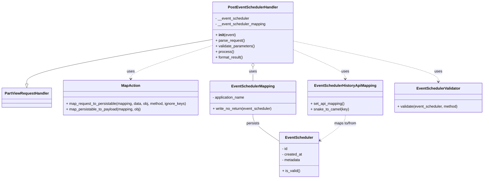
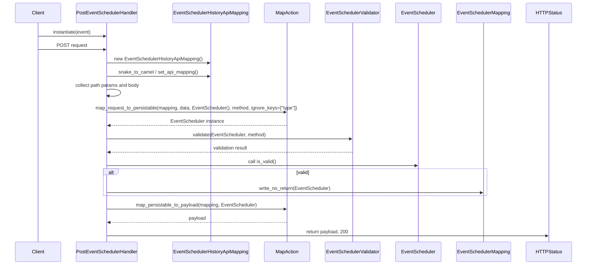

# Diagram: partview_core/partview_service/partview_service/api/event_scheduler/handler/PostEventSchedulerHandler.py

> Auto-generated by Obscura crawlers

## Diagram 1

### SVG

<svg id="container" width="2072.6171875" xmlns="http://www.w3.org/2000/svg" class="classDiagram" height="770" viewBox="0 0 2072.6171875 770" role="graphics-document document" aria-roledescription="class"><g><defs><marker id="container_class-aggregationStart" class="marker aggregation class" refX="18" refY="7" markerWidth="190" markerHeight="240" orient="auto"><path d="M 18,7 L9,13 L1,7 L9,1 Z"></path></marker></defs><defs><marker id="container_class-aggregationEnd" class="marker aggregation class" refX="1" refY="7" markerWidth="20" markerHeight="28" orient="auto"><path d="M 18,7 L9,13 L1,7 L9,1 Z"></path></marker></defs><defs><marker id="container_class-extensionStart" class="marker extension class" refX="18" refY="7" markerWidth="190" markerHeight="240" orient="auto"><path d="M 1,7 L18,13 V 1 Z"></path></marker></defs><defs><marker id="container_class-extensionEnd" class="marker extension class" refX="1" refY="7" markerWidth="20" markerHeight="28" orient="auto"><path d="M 1,1 V 13 L18,7 Z"></path></marker></defs><defs><marker id="container_class-compositionStart" class="marker composition class" refX="18" refY="7" markerWidth="190" markerHeight="240" orient="auto"><path d="M 18,7 L9,13 L1,7 L9,1 Z"></path></marker></defs><defs><marker id="container_class-compositionEnd" class="marker composition class" refX="1" refY="7" markerWidth="20" markerHeight="28" orient="auto"><path d="M 18,7 L9,13 L1,7 L9,1 Z"></path></marker></defs><defs><marker id="container_class-dependencyStart" class="marker dependency class" refX="6" refY="7" markerWidth="190" markerHeight="240" orient="auto"><path d="M 5,7 L9,13 L1,7 L9,1 Z"></path></marker></defs><defs><marker id="container_class-dependencyEnd" class="marker dependency class" refX="13" refY="7" markerWidth="20" markerHeight="28" orient="auto"><path d="M 18,7 L9,13 L14,7 L9,1 Z"></path></marker></defs><defs><marker id="container_class-lollipopStart" class="marker lollipop class" refX="13" refY="7" markerWidth="190" markerHeight="240" orient="auto"><circle stroke="black" fill="transparent" cx="7" cy="7" r="6"></circle></marker></defs><defs><marker id="container_class-lollipopEnd" class="marker lollipop class" refX="1" refY="7" markerWidth="190" markerHeight="240" orient="auto"><circle stroke="black" fill="transparent" cx="7" cy="7" r="6"></circle></marker></defs><g class="root"><g class="clusters"></g><g class="edgePaths"><path d="M914.898,169.8L780.975,193C647.052,216.2,379.206,262.6,245.283,294.592C111.359,326.583,111.359,344.167,111.359,352.958L111.359,361.75" id="id_PostEventSchedulerHandler_PartViewRequestHandler_1" class="edge-thickness-normal edge-pattern-solid relation" style=";;;" data-edge="true" data-et="edge" data-id="id_PostEventSchedulerHandler_PartViewRequestHandler_1" data-points="W3sieCI6OTE0Ljg5ODQzNzUsInkiOjE2OS43OTk2NDYwMzYxMjUxM30seyJ4IjoxMTEuMzU5Mzc1LCJ5IjozMDl9LHsieCI6MTExLjM1OTM3NSwieSI6Mzc5fV0=" marker-end="url(#container_class-extensionEnd)"></path><path d="M1086.918,289.25L1086.918,292.542C1086.918,295.833,1086.918,302.417,1086.918,312.375C1086.918,322.333,1086.918,335.667,1086.918,342.333L1086.918,349" id="id_PostEventSchedulerHandler_EventSchedulerMapping_2" class="edge-thickness-normal edge-pattern-solid relation" style=";;;" data-edge="true" data-et="edge" data-id="id_PostEventSchedulerHandler_EventSchedulerMapping_2" data-points="W3sieCI6MTA4Ni45MTc5Njg3NSwieSI6MjcyfSx7IngiOjEwODYuOTE3OTY4NzUsInkiOjMwOX0seyJ4IjoxMDg2LjkxNzk2ODc1LCJ5IjozNDl9XQ==" marker-start="url(#container_class-aggregationStart)"></path><path d="M1258.938,214.043L1295.705,229.87C1332.473,245.696,1406.008,277.348,1442.775,298.341C1479.543,319.333,1479.543,329.667,1479.543,334.833L1479.543,340" id="id_PostEventSchedulerHandler_EventSchedulerHistoryApiMapping_3" class="edge-thickness-normal edge-pattern-dashed relation" style=";;;" data-edge="true" data-et="edge" data-id="id_PostEventSchedulerHandler_EventSchedulerHistoryApiMapping_3" data-points="W3sieCI6MTI1OC45Mzc1LCJ5IjoyMTQuMDQzNDI3NjUwNDI5OH0seyJ4IjoxNDc5LjU0Mjk2ODc1LCJ5IjozMDl9LHsieCI6MTQ3OS41NDI5Njg3NSwieSI6MzQ2fV0=" marker-end="url(#container_class-dependencyEnd)"></path><path d="M914.898,194.957L855.404,213.964C795.91,232.971,676.922,270.986,617.428,295.159C557.934,319.333,557.934,329.667,557.934,334.833L557.934,340" id="id_PostEventSchedulerHandler_MapAction_4" class="edge-thickness-normal edge-pattern-dashed relation" style=";;;" data-edge="true" data-et="edge" data-id="id_PostEventSchedulerHandler_MapAction_4" data-points="W3sieCI6OTE0Ljg5ODQzNzUsInkiOjE5NC45NTY4MjMyMTY2NTkyN30seyJ4Ijo1NTcuOTMzNTkzNzUsInkiOjMwOX0seyJ4Ijo1NTcuOTMzNTkzNzUsInkiOjM0Nn1d" marker-end="url(#container_class-dependencyEnd)"></path><path d="M1258.938,176.865L1361.699,198.887C1464.461,220.91,1669.984,264.955,1772.746,294.144C1875.508,323.333,1875.508,337.667,1875.508,344.833L1875.508,352" id="id_PostEventSchedulerHandler_EventSchedulerValidator_5" class="edge-thickness-normal edge-pattern-dashed relation" style=";;;" data-edge="true" data-et="edge" data-id="id_PostEventSchedulerHandler_EventSchedulerValidator_5" data-points="W3sieCI6MTI1OC45Mzc1LCJ5IjoxNzYuODY0OTE5MDg1MTk0Nn0seyJ4IjoxODc1LjUwNzgxMjUsInkiOjMwOX0seyJ4IjoxODc1LjUwNzgxMjUsInkiOjM1OH1d" marker-end="url(#container_class-dependencyEnd)"></path><path d="M1086.918,493L1086.918,499.667C1086.918,506.333,1086.918,519.667,1105.587,538.982C1124.257,558.297,1161.595,583.593,1180.264,596.241L1198.934,608.89" id="id_EventSchedulerMapping_EventScheduler_6" class="edge-thickness-normal edge-pattern-solid relation" style=";;;" data-edge="true" data-et="edge" data-id="id_EventSchedulerMapping_EventScheduler_6" data-points="W3sieCI6MTA4Ni45MTc5Njg3NSwieSI6NDkzfSx7IngiOjEwODYuOTE3OTY4NzUsInkiOjUzM30seyJ4IjoxMTk4LjkzMzU5Mzc1LCJ5Ijo2MDguODg5NjA1MjIxMjY3MX1d"></path><path d="M1479.543,496L1479.543,502.167C1479.543,508.333,1479.543,520.667,1461.702,538.921C1443.86,557.175,1408.177,581.35,1390.336,593.437L1372.495,605.524" id="id_EventSchedulerHistoryApiMapping_EventScheduler_7" class="edge-thickness-normal edge-pattern-dashed relation" style=";;;" data-edge="true" data-et="edge" data-id="id_EventSchedulerHistoryApiMapping_EventScheduler_7" data-points="W3sieCI6MTQ3OS41NDI5Njg3NSwieSI6NDk2fSx7IngiOjE0NzkuNTQyOTY4NzUsInkiOjUzM30seyJ4IjoxMzY3LjUyNzM0Mzc1LCJ5Ijo2MDguODg5NjA1MjIxMjY3MX1d" marker-end="url(#container_class-dependencyEnd)"></path></g><g class="edgeLabels"><g class="edgeLabel"><g class="label" data-id="id_PostEventSchedulerHandler_PartViewRequestHandler_1" transform="translate(0, 0)"><foreignObject width="0" height="0">

</foreignObject></g></g><g class="edgeLabel" transform="translate(1086.91796875, 309)"><g class="label" data-id="id_PostEventSchedulerHandler_EventSchedulerMapping_2" transform="translate(-16.4921875, -12)"><foreignObject width="32.984375" height="24">

uses

</foreignObject></g></g><g class="edgeLabel" transform="translate(1479.54296875, 309)"><g class="label" data-id="id_PostEventSchedulerHandler_EventSchedulerHistoryApiMapping_3" transform="translate(-16.4921875, -12)"><foreignObject width="32.984375" height="24">

uses

</foreignObject></g></g><g class="edgeLabel" transform="translate(557.93359375, 309)"><g class="label" data-id="id_PostEventSchedulerHandler_MapAction_4" transform="translate(-16.4921875, -12)"><foreignObject width="32.984375" height="24">

uses

</foreignObject></g></g><g class="edgeLabel" transform="translate(1875.5078125, 309)"><g class="label" data-id="id_PostEventSchedulerHandler_EventSchedulerValidator_5" transform="translate(-16.4921875, -12)"><foreignObject width="32.984375" height="24">

uses

</foreignObject></g></g><g class="edgeLabel" transform="translate(1086.91796875, 533)"><g class="label" data-id="id_EventSchedulerMapping_EventScheduler_6" transform="translate(-28.4375, -12)"><foreignObject width="56.875" height="24">

persists

</foreignObject></g></g><g class="edgeLabel" transform="translate(1479.54296875, 533)"><g class="label" data-id="id_EventSchedulerHistoryApiMapping_EventScheduler_7" transform="translate(-50.234375, -12)"><foreignObject width="100.46875" height="24">

maps to/from

</foreignObject></g></g></g><g class="nodes"><g class="node default" id="classId-PostEventSchedulerHandler-0" transform="translate(1086.91796875, 140)"><g class="basic label-container"><path d="M-172.01953125 -132 L172.01953125 -132 L172.01953125 132 L-172.01953125 132" stroke="none" stroke-width="0" fill="#ECECFF" style=""></path><path d="M-172.01953125 -132 C-54.39849914160243 -132, 63.22253296679514 -132, 172.01953125 -132 M-172.01953125 -132 C-78.9186843627931 -132, 14.182162524413798 -132, 172.01953125 -132 M172.01953125 -132 C172.01953125 -57.605998958350625, 172.01953125 16.78800208329875, 172.01953125 132 M172.01953125 -132 C172.01953125 -75.36189435735481, 172.01953125 -18.723788714709627, 172.01953125 132 M172.01953125 132 C53.800108689445295 132, -64.41931387110941 132, -172.01953125 132 M172.01953125 132 C83.7104188404384 132, -4.598693569123213 132, -172.01953125 132 M-172.01953125 132 C-172.01953125 65.97652282144307, -172.01953125 -0.04695435711386153, -172.01953125 -132 M-172.01953125 132 C-172.01953125 64.21283538708452, -172.01953125 -3.574329225830951, -172.01953125 -132" stroke="#9370DB" stroke-width="1.3" fill="none" stroke-dasharray="0 0" style=""></path></g><g class="annotation-group text" transform="translate(0, -108)"></g><g class="label-group text" transform="translate(-102.2578125, -108)"><g class="label" style="font-weight: bolder" transform="translate(0,-12)"><foreignObject width="204.515625" height="24">

PostEventSchedulerHandler

</foreignObject></g></g><g class="members-group text" transform="translate(-160.01953125, -60)"><g class="label" style="" transform="translate(0,-12)"><foreignObject width="147.109375" height="24">

- __event_scheduler

</foreignObject></g><g class="label" style="" transform="translate(0,12)"><foreignObject width="217.78125" height="24">

- __event_scheduler_mapping

</foreignObject></g></g><g class="methods-group text" transform="translate(-160.01953125, 12)"><g class="label" style="" transform="translate(0,-12)"><foreignObject width="87.390625" height="24">

+ <strong>init</strong>(event)

</foreignObject></g><g class="label" style="" transform="translate(0,12)"><foreignObject width="126.046875" height="24">

+ parse_request()

</foreignObject></g><g class="label" style="" transform="translate(0,36)"><foreignObject width="170.953125" height="24">

+ validate_parameters()

</foreignObject></g><g class="label" style="" transform="translate(0,60)"><foreignObject width="77.96875" height="24">

+ process()

</foreignObject></g><g class="label" style="" transform="translate(0,84)"><foreignObject width="121.5" height="24">

+ format_result()

</foreignObject></g></g><g class="divider" style=""><path d="M-172.01953125 -84 C-75.82541722094874 -84, 20.368696808102527 -84, 172.01953125 -84 M-172.01953125 -84 C-98.36556483842217 -84, -24.711598426844347 -84, 172.01953125 -84" stroke="#9370DB" stroke-width="1.3" fill="none" stroke-dasharray="0 0" style=""></path></g><g class="divider" style=""><path d="M-172.01953125 -12 C-46.60556709302472 -12, 78.80839706395057 -12, 172.01953125 -12 M-172.01953125 -12 C-39.34474270139057 -12, 93.33004584721886 -12, 172.01953125 -12" stroke="#9370DB" stroke-width="1.3" fill="none" stroke-dasharray="0 0" style=""></path></g></g><g class="node default" id="classId-PartViewRequestHandler-1" transform="translate(111.359375, 421)"><g class="basic label-container"><path d="M-103.359375 -42 L103.359375 -42 L103.359375 42 L-103.359375 42" stroke="none" stroke-width="0" fill="#ECECFF" style=""></path><path d="M-103.359375 -42 C-23.521232662870787 -42, 56.316909674258426 -42, 103.359375 -42 M-103.359375 -42 C-35.94599236076242 -42, 31.467390278475165 -42, 103.359375 -42 M103.359375 -42 C103.359375 -12.258717131655558, 103.359375 17.482565736688883, 103.359375 42 M103.359375 -42 C103.359375 -10.673693857116923, 103.359375 20.652612285766153, 103.359375 42 M103.359375 42 C47.00604066671728 42, -9.347293666565434 42, -103.359375 42 M103.359375 42 C52.733979423192956 42, 2.108583846385912 42, -103.359375 42 M-103.359375 42 C-103.359375 12.98311818495069, -103.359375 -16.03376363009862, -103.359375 -42 M-103.359375 42 C-103.359375 12.235533934450736, -103.359375 -17.52893213109853, -103.359375 -42" stroke="#9370DB" stroke-width="1.3" fill="none" stroke-dasharray="0 0" style=""></path></g><g class="annotation-group text" transform="translate(0, -18)"></g><g class="label-group text" transform="translate(-91.359375, -18)"><g class="label" style="font-weight: bolder" transform="translate(0,-12)"><foreignObject width="182.71875" height="24">

PartViewRequestHandler

</foreignObject></g></g><g class="members-group text" transform="translate(-91.359375, 30)"></g><g class="methods-group text" transform="translate(-91.359375, 60)"></g><g class="divider" style=""><path d="M-103.359375 6 C-43.46242031316113 6, 16.434534373677735 6, 103.359375 6 M-103.359375 6 C-28.022489223801458 6, 47.314396552397085 6, 103.359375 6" stroke="#9370DB" stroke-width="1.3" fill="none" stroke-dasharray="0 0" style=""></path></g><g class="divider" style=""><path d="M-103.359375 24 C-53.871538023743554 24, -4.383701047487108 24, 103.359375 24 M-103.359375 24 C-26.76335809349628 24, 49.83265881300744 24, 103.359375 24" stroke="#9370DB" stroke-width="1.3" fill="none" stroke-dasharray="0 0" style=""></path></g></g><g class="node default" id="classId-MapAction-2" transform="translate(557.93359375, 421)"><g class="basic label-container"><path d="M-293.21484375 -75 L293.21484375 -75 L293.21484375 75 L-293.21484375 75" stroke="none" stroke-width="0" fill="#ECECFF" style=""></path><path d="M-293.21484375 -75 C-58.71130104396491 -75, 175.79224166207018 -75, 293.21484375 -75 M-293.21484375 -75 C-92.86476392079328 -75, 107.48531590841344 -75, 293.21484375 -75 M293.21484375 -75 C293.21484375 -21.212774782486335, 293.21484375 32.57445043502733, 293.21484375 75 M293.21484375 -75 C293.21484375 -26.381475782857116, 293.21484375 22.237048434285768, 293.21484375 75 M293.21484375 75 C145.04482106469143 75, -3.1252016206171334 75, -293.21484375 75 M293.21484375 75 C126.62703684916426 75, -39.96077005167149 75, -293.21484375 75 M-293.21484375 75 C-293.21484375 25.799246272255495, -293.21484375 -23.40150745548901, -293.21484375 -75 M-293.21484375 75 C-293.21484375 20.273745415515947, -293.21484375 -34.452509168968106, -293.21484375 -75" stroke="#9370DB" stroke-width="1.3" fill="none" stroke-dasharray="0 0" style=""></path></g><g class="annotation-group text" transform="translate(0, -51)"></g><g class="label-group text" transform="translate(-38.6328125, -51)"><g class="label" style="font-weight: bolder" transform="translate(0,-12)"><foreignObject width="77.265625" height="24">

MapAction

</foreignObject></g></g><g class="members-group text" transform="translate(-281.21484375, -3)"></g><g class="methods-group text" transform="translate(-281.21484375, 27)"><g class="label" style="" transform="translate(0,-12)"><foreignObject width="523.796875" height="24">

+ map_request_to_persistable(mapping, data, obj, method, ignore_keys)

</foreignObject></g><g class="label" style="" transform="translate(0,12)"><foreignObject width="326.6875" height="24">

+ map_persistable_to_payload(mapping, obj)

</foreignObject></g></g><g class="divider" style=""><path d="M-293.21484375 -27 C-164.36486185514727 -27, -35.514879960294536 -27, 293.21484375 -27 M-293.21484375 -27 C-84.22726521393133 -27, 124.76031332213734 -27, 293.21484375 -27" stroke="#9370DB" stroke-width="1.3" fill="none" stroke-dasharray="0 0" style=""></path></g><g class="divider" style=""><path d="M-293.21484375 -3 C-145.64837447676882 -3, 1.9180947964623556 -3, 293.21484375 -3 M-293.21484375 -3 C-162.37505527436966 -3, -31.535266798739315 -3, 293.21484375 -3" stroke="#9370DB" stroke-width="1.3" fill="none" stroke-dasharray="0 0" style=""></path></g></g><g class="node default" id="classId-EventScheduler-3" transform="translate(1283.23046875, 666)"><g class="basic label-container"><path d="M-84.296875 -96 L84.296875 -96 L84.296875 96 L-84.296875 96" stroke="none" stroke-width="0" fill="#ECECFF" style=""></path><path d="M-84.296875 -96 C-31.11021623360029 -96, 22.07644253279942 -96, 84.296875 -96 M-84.296875 -96 C-50.049210387408976 -96, -15.801545774817953 -96, 84.296875 -96 M84.296875 -96 C84.296875 -52.61210245745967, 84.296875 -9.22420491491934, 84.296875 96 M84.296875 -96 C84.296875 -57.037215675252696, 84.296875 -18.074431350505392, 84.296875 96 M84.296875 96 C45.034753357765915 96, 5.77263171553183 96, -84.296875 96 M84.296875 96 C33.002199551476956 96, -18.29247589704609 96, -84.296875 96 M-84.296875 96 C-84.296875 23.809784653396832, -84.296875 -48.380430693206335, -84.296875 -96 M-84.296875 96 C-84.296875 30.66094398123215, -84.296875 -34.6781120375357, -84.296875 -96" stroke="#9370DB" stroke-width="1.3" fill="none" stroke-dasharray="0 0" style=""></path></g><g class="annotation-group text" transform="translate(0, -72)"></g><g class="label-group text" transform="translate(-56.984375, -72)"><g class="label" style="font-weight: bolder" transform="translate(0,-12)"><foreignObject width="113.96875" height="24">

EventScheduler

</foreignObject></g></g><g class="members-group text" transform="translate(-72.296875, -24)"><g class="label" style="" transform="translate(0,-12)"><foreignObject width="24.78125" height="24">

- id

</foreignObject></g><g class="label" style="" transform="translate(0,12)"><foreignObject width="87.609375" height="24">

- created_at

</foreignObject></g><g class="label" style="" transform="translate(0,36)"><foreignObject width="80.140625" height="24">

- metadata

</foreignObject></g></g><g class="methods-group text" transform="translate(-72.296875, 72)"><g class="label" style="" transform="translate(0,-12)"><foreignObject width="77.03125" height="24">

+ is_valid()

</foreignObject></g></g><g class="divider" style=""><path d="M-84.296875 -48 C-18.707579223882945 -48, 46.88171655223411 -48, 84.296875 -48 M-84.296875 -48 C-28.057355870695027 -48, 28.182163258609947 -48, 84.296875 -48" stroke="#9370DB" stroke-width="1.3" fill="none" stroke-dasharray="0 0" style=""></path></g><g class="divider" style=""><path d="M-84.296875 48 C-27.390452804289815 48, 29.51596939142037 48, 84.296875 48 M-84.296875 48 C-45.06809205252859 48, -5.839309105057183 48, 84.296875 48" stroke="#9370DB" stroke-width="1.3" fill="none" stroke-dasharray="0 0" style=""></path></g></g><g class="node default" id="classId-EventSchedulerMapping-4" transform="translate(1086.91796875, 421)"><g class="basic label-container"><path d="M-185.76953125 -72 L185.76953125 -72 L185.76953125 72 L-185.76953125 72" stroke="none" stroke-width="0" fill="#ECECFF" style=""></path><path d="M-185.76953125 -72 C-64.12442844038904 -72, 57.52067436922192 -72, 185.76953125 -72 M-185.76953125 -72 C-71.07570327282369 -72, 43.618124704352624 -72, 185.76953125 -72 M185.76953125 -72 C185.76953125 -16.23277304765854, 185.76953125 39.53445390468292, 185.76953125 72 M185.76953125 -72 C185.76953125 -35.42215719514737, 185.76953125 1.1556856097052588, 185.76953125 72 M185.76953125 72 C44.1800196623351 72, -97.4094919253298 72, -185.76953125 72 M185.76953125 72 C90.33306761984888 72, -5.103396010302248 72, -185.76953125 72 M-185.76953125 72 C-185.76953125 26.457258981403967, -185.76953125 -19.085482037192065, -185.76953125 -72 M-185.76953125 72 C-185.76953125 27.33920047378416, -185.76953125 -17.32159905243168, -185.76953125 -72" stroke="#9370DB" stroke-width="1.3" fill="none" stroke-dasharray="0 0" style=""></path></g><g class="annotation-group text" transform="translate(0, -48)"></g><g class="label-group text" transform="translate(-88.4921875, -48)"><g class="label" style="font-weight: bolder" transform="translate(0,-12)"><foreignObject width="176.984375" height="24">

EventSchedulerMapping

</foreignObject></g></g><g class="members-group text" transform="translate(-173.76953125, 0)"><g class="label" style="" transform="translate(0,-12)"><foreignObject width="141.640625" height="24">

- application_name

</foreignObject></g></g><g class="methods-group text" transform="translate(-173.76953125, 48)"><g class="label" style="" transform="translate(0,-12)"><foreignObject width="259.046875" height="24">

+ write_no_return(event_scheduler)

</foreignObject></g></g><g class="divider" style=""><path d="M-185.76953125 -24 C-85.44660138597011 -24, 14.876328478059776 -24, 185.76953125 -24 M-185.76953125 -24 C-57.64662742756863 -24, 70.47627639486274 -24, 185.76953125 -24" stroke="#9370DB" stroke-width="1.3" fill="none" stroke-dasharray="0 0" style=""></path></g><g class="divider" style=""><path d="M-185.76953125 24 C-65.7541461621486 24, 54.2612389257028 24, 185.76953125 24 M-185.76953125 24 C-102.68464329100675 24, -19.5997553320135 24, 185.76953125 24" stroke="#9370DB" stroke-width="1.3" fill="none" stroke-dasharray="0 0" style=""></path></g></g><g class="node default" id="classId-EventSchedulerHistoryApiMapping-5" transform="translate(1479.54296875, 421)"><g class="basic label-container"><path d="M-156.85546875 -75 L156.85546875 -75 L156.85546875 75 L-156.85546875 75" stroke="none" stroke-width="0" fill="#ECECFF" style=""></path><path d="M-156.85546875 -75 C-85.40316254869612 -75, -13.950856347392232 -75, 156.85546875 -75 M-156.85546875 -75 C-46.79417010055184 -75, 63.26712854889632 -75, 156.85546875 -75 M156.85546875 -75 C156.85546875 -18.792661738929276, 156.85546875 37.41467652214145, 156.85546875 75 M156.85546875 -75 C156.85546875 -44.33923801343944, 156.85546875 -13.678476026878876, 156.85546875 75 M156.85546875 75 C64.98930371697742 75, -26.876861316045165 75, -156.85546875 75 M156.85546875 75 C50.39014589043555 75, -56.075176969128904 75, -156.85546875 75 M-156.85546875 75 C-156.85546875 32.14924251224882, -156.85546875 -10.701514975502363, -156.85546875 -75 M-156.85546875 75 C-156.85546875 15.597734704917649, -156.85546875 -43.8045305901647, -156.85546875 -75" stroke="#9370DB" stroke-width="1.3" fill="none" stroke-dasharray="0 0" style=""></path></g><g class="annotation-group text" transform="translate(0, -51)"></g><g class="label-group text" transform="translate(-126.6640625, -51)"><g class="label" style="font-weight: bolder" transform="translate(0,-12)"><foreignObject width="253.328125" height="24">

EventSchedulerHistoryApiMapping

</foreignObject></g></g><g class="members-group text" transform="translate(-144.85546875, -3)"></g><g class="methods-group text" transform="translate(-144.85546875, 27)"><g class="label" style="" transform="translate(0,-12)"><foreignObject width="147.234375" height="24">

+ set_api_mapping()

</foreignObject></g><g class="label" style="" transform="translate(0,12)"><foreignObject width="163.046875" height="24">

+ snake_to_camel(key)

</foreignObject></g></g><g class="divider" style=""><path d="M-156.85546875 -27 C-87.54896594942181 -27, -18.242463148843626 -27, 156.85546875 -27 M-156.85546875 -27 C-79.38622852459567 -27, -1.9169882991913312 -27, 156.85546875 -27" stroke="#9370DB" stroke-width="1.3" fill="none" stroke-dasharray="0 0" style=""></path></g><g class="divider" style=""><path d="M-156.85546875 -3 C-46.241161425298 -3, 64.373145899404 -3, 156.85546875 -3 M-156.85546875 -3 C-77.13831268217707 -3, 2.578843385645854 -3, 156.85546875 -3" stroke="#9370DB" stroke-width="1.3" fill="none" stroke-dasharray="0 0" style=""></path></g></g><g class="node default" id="classId-EventSchedulerValidator-6" transform="translate(1875.5078125, 421)"><g class="basic label-container"><path d="M-189.109375 -63 L189.109375 -63 L189.109375 63 L-189.109375 63" stroke="none" stroke-width="0" fill="#ECECFF" style=""></path><path d="M-189.109375 -63 C-72.62432466376055 -63, 43.86072567247891 -63, 189.109375 -63 M-189.109375 -63 C-73.11627545901946 -63, 42.876824081961075 -63, 189.109375 -63 M189.109375 -63 C189.109375 -23.529581329012935, 189.109375 15.940837341974131, 189.109375 63 M189.109375 -63 C189.109375 -23.16473298862328, 189.109375 16.670534022753444, 189.109375 63 M189.109375 63 C111.99320966925485 63, 34.877044338509705 63, -189.109375 63 M189.109375 63 C61.10066639024677 63, -66.90804221950646 63, -189.109375 63 M-189.109375 63 C-189.109375 34.73654729880131, -189.109375 6.473094597602618, -189.109375 -63 M-189.109375 63 C-189.109375 27.582153086191333, -189.109375 -7.835693827617334, -189.109375 -63" stroke="#9370DB" stroke-width="1.3" fill="none" stroke-dasharray="0 0" style=""></path></g><g class="annotation-group text" transform="translate(0, -39)"></g><g class="label-group text" transform="translate(-90.171875, -39)"><g class="label" style="font-weight: bolder" transform="translate(0,-12)"><foreignObject width="180.34375" height="24">

EventSchedulerValidator

</foreignObject></g></g><g class="members-group text" transform="translate(-177.109375, 9)"></g><g class="methods-group text" transform="translate(-177.109375, 39)"><g class="label" style="" transform="translate(0,-12)"><foreignObject width="264.046875" height="24">

+ validate(event_scheduler, method)

</foreignObject></g></g><g class="divider" style=""><path d="M-189.109375 -15 C-72.39422296293883 -15, 44.32092907412235 -15, 189.109375 -15 M-189.109375 -15 C-109.01636750939714 -15, -28.923360018794284 -15, 189.109375 -15" stroke="#9370DB" stroke-width="1.3" fill="none" stroke-dasharray="0 0" style=""></path></g><g class="divider" style=""><path d="M-189.109375 9 C-97.30341048443233 9, -5.4974459688646675 9, 189.109375 9 M-189.109375 9 C-98.529433554467 9, -7.94949210893401 9, 189.109375 9" stroke="#9370DB" stroke-width="1.3" fill="none" stroke-dasharray="0 0" style=""></path></g></g></g></g></g></svg>

## Diagram 2

### SVG

<svg id="container" width="2006" xmlns="http://www.w3.org/2000/svg" height="928" viewBox="-50 -10 2006 928" role="graphics-document document" aria-roledescription="sequence"><g><rect x="1756" y="842" fill="#eaeaea" stroke="#666" width="150" height="65" name="HTTP" rx="3" ry="3" class="actor actor-bottom"></rect><text x="1831" y="874.5" dominant-baseline="central" alignment-baseline="central" class="actor actor-box" style="text-anchor: middle; font-size: 16px; font-weight: 400;"><tspan x="1831" dy="0">HTTPStatus</tspan></text></g><g><rect x="1510" y="842" fill="#eaeaea" stroke="#666" width="196" height="65" name="Persist" rx="3" ry="3" class="actor actor-bottom"></rect><text x="1608" y="874.5" dominant-baseline="central" alignment-baseline="central" class="actor actor-box" style="text-anchor: middle; font-size: 16px; font-weight: 400;"><tspan x="1608" dy="0">EventSchedulerMapping</tspan></text></g><g><rect x="1310" y="842" fill="#eaeaea" stroke="#666" width="150" height="65" name="Model" rx="3" ry="3" class="actor actor-bottom"></rect><text x="1385" y="874.5" dominant-baseline="central" alignment-baseline="central" class="actor actor-box" style="text-anchor: middle; font-size: 16px; font-weight: 400;"><tspan x="1385" dy="0">EventScheduler</tspan></text></g><g><rect x="1061" y="842" fill="#eaeaea" stroke="#666" width="199" height="65" name="Validator" rx="3" ry="3" class="actor actor-bottom"></rect><text x="1160.5" y="874.5" dominant-baseline="central" alignment-baseline="central" class="actor actor-box" style="text-anchor: middle; font-size: 16px; font-weight: 400;"><tspan x="1160.5" dy="0">EventSchedulerValidator</tspan></text></g><g><rect x="861" y="842" fill="#eaeaea" stroke="#666" width="150" height="65" name="Mapper" rx="3" ry="3" class="actor actor-bottom"></rect><text x="936" y="874.5" dominant-baseline="central" alignment-baseline="central" class="actor actor-box" style="text-anchor: middle; font-size: 16px; font-weight: 400;"><tspan x="936" dy="0">MapAction</tspan></text></g><g><rect x="540" y="842" fill="#eaeaea" stroke="#666" width="271" height="65" name="ApiMap" rx="3" ry="3" class="actor actor-bottom"></rect><text x="675.5" y="874.5" dominant-baseline="central" alignment-baseline="central" class="actor actor-box" style="text-anchor: middle; font-size: 16px; font-weight: 400;"><tspan x="675.5" dy="0">EventSchedulerHistoryApiMapping</tspan></text></g><g><rect x="200" y="842" fill="#eaeaea" stroke="#666" width="223" height="65" name="Handler" rx="3" ry="3" class="actor actor-bottom"></rect><text x="311.5" y="874.5" dominant-baseline="central" alignment-baseline="central" class="actor actor-box" style="text-anchor: middle; font-size: 16px; font-weight: 400;"><tspan x="311.5" dy="0">PostEventSchedulerHandler</tspan></text></g><g><rect x="0" y="842" fill="#eaeaea" stroke="#666" width="150" height="65" name="Client" rx="3" ry="3" class="actor actor-bottom"></rect><text x="75" y="874.5" dominant-baseline="central" alignment-baseline="central" class="actor actor-box" style="text-anchor: middle; font-size: 16px; font-weight: 400;"><tspan x="75" dy="0">Client</tspan></text></g><g><line id="actor7" x1="1831" y1="65" x2="1831" y2="842" class="actor-line 200" stroke-width="0.5px" stroke="#999" name="HTTP"></line><g id="root-7"><rect x="1756" y="0" fill="#eaeaea" stroke="#666" width="150" height="65" name="HTTP" rx="3" ry="3" class="actor actor-top"></rect><text x="1831" y="32.5" dominant-baseline="central" alignment-baseline="central" class="actor actor-box" style="text-anchor: middle; font-size: 16px; font-weight: 400;"><tspan x="1831" dy="0">HTTPStatus</tspan></text></g></g><g><line id="actor6" x1="1608" y1="65" x2="1608" y2="842" class="actor-line 200" stroke-width="0.5px" stroke="#999" name="Persist"></line><g id="root-6"><rect x="1510" y="0" fill="#eaeaea" stroke="#666" width="196" height="65" name="Persist" rx="3" ry="3" class="actor actor-top"></rect><text x="1608" y="32.5" dominant-baseline="central" alignment-baseline="central" class="actor actor-box" style="text-anchor: middle; font-size: 16px; font-weight: 400;"><tspan x="1608" dy="0">EventSchedulerMapping</tspan></text></g></g><g><line id="actor5" x1="1385" y1="65" x2="1385" y2="842" class="actor-line 200" stroke-width="0.5px" stroke="#999" name="Model"></line><g id="root-5"><rect x="1310" y="0" fill="#eaeaea" stroke="#666" width="150" height="65" name="Model" rx="3" ry="3" class="actor actor-top"></rect><text x="1385" y="32.5" dominant-baseline="central" alignment-baseline="central" class="actor actor-box" style="text-anchor: middle; font-size: 16px; font-weight: 400;"><tspan x="1385" dy="0">EventScheduler</tspan></text></g></g><g><line id="actor4" x1="1160.5" y1="65" x2="1160.5" y2="842" class="actor-line 200" stroke-width="0.5px" stroke="#999" name="Validator"></line><g id="root-4"><rect x="1061" y="0" fill="#eaeaea" stroke="#666" width="199" height="65" name="Validator" rx="3" ry="3" class="actor actor-top"></rect><text x="1160.5" y="32.5" dominant-baseline="central" alignment-baseline="central" class="actor actor-box" style="text-anchor: middle; font-size: 16px; font-weight: 400;"><tspan x="1160.5" dy="0">EventSchedulerValidator</tspan></text></g></g><g><line id="actor3" x1="936" y1="65" x2="936" y2="842" class="actor-line 200" stroke-width="0.5px" stroke="#999" name="Mapper"></line><g id="root-3"><rect x="861" y="0" fill="#eaeaea" stroke="#666" width="150" height="65" name="Mapper" rx="3" ry="3" class="actor actor-top"></rect><text x="936" y="32.5" dominant-baseline="central" alignment-baseline="central" class="actor actor-box" style="text-anchor: middle; font-size: 16px; font-weight: 400;"><tspan x="936" dy="0">MapAction</tspan></text></g></g><g><line id="actor2" x1="675.5" y1="65" x2="675.5" y2="842" class="actor-line 200" stroke-width="0.5px" stroke="#999" name="ApiMap"></line><g id="root-2"><rect x="540" y="0" fill="#eaeaea" stroke="#666" width="271" height="65" name="ApiMap" rx="3" ry="3" class="actor actor-top"></rect><text x="675.5" y="32.5" dominant-baseline="central" alignment-baseline="central" class="actor actor-box" style="text-anchor: middle; font-size: 16px; font-weight: 400;"><tspan x="675.5" dy="0">EventSchedulerHistoryApiMapping</tspan></text></g></g><g><line id="actor1" x1="311.5" y1="65" x2="311.5" y2="842" class="actor-line 200" stroke-width="0.5px" stroke="#999" name="Handler"></line><g id="root-1"><rect x="200" y="0" fill="#eaeaea" stroke="#666" width="223" height="65" name="Handler" rx="3" ry="3" class="actor actor-top"></rect><text x="311.5" y="32.5" dominant-baseline="central" alignment-baseline="central" class="actor actor-box" style="text-anchor: middle; font-size: 16px; font-weight: 400;"><tspan x="311.5" dy="0">PostEventSchedulerHandler</tspan></text></g></g><g><line id="actor0" x1="75" y1="65" x2="75" y2="842" class="actor-line 200" stroke-width="0.5px" stroke="#999" name="Client"></line><g id="root-0"><rect x="0" y="0" fill="#eaeaea" stroke="#666" width="150" height="65" name="Client" rx="3" ry="3" class="actor actor-top"></rect><text x="75" y="32.5" dominant-baseline="central" alignment-baseline="central" class="actor actor-box" style="text-anchor: middle; font-size: 16px; font-weight: 400;"><tspan x="75" dy="0">Client</tspan></text></g></g><g></g><defs><symbol id="computer" width="24" height="24"><path transform="scale(.5)" d="M2 2v13h20v-13h-20zm18 11h-16v-9h16v9zm-10.228 6l.466-1h3.524l.467 1h-4.457zm14.228 3h-24l2-6h2.104l-1.33 4h18.45l-1.297-4h2.073l2 6zm-5-10h-14v-7h14v7z"></path></symbol></defs><defs><symbol id="database" fill-rule="evenodd" clip-rule="evenodd"><path transform="scale(.5)" d="M12.258.001l.256.004.255.005.253.008.251.01.249.012.247.015.246.016.242.019.241.02.239.023.236.024.233.027.231.028.229.031.225.032.223.034.22.036.217.038.214.04.211.041.208.043.205.045.201.046.198.048.194.05.191.051.187.053.183.054.18.056.175.057.172.059.168.06.163.061.16.063.155.064.15.066.074.033.073.033.071.034.07.034.069.035.068.035.067.035.066.035.064.036.064.036.062.036.06.036.06.037.058.037.058.037.055.038.055.038.053.038.052.038.051.039.05.039.048.039.047.039.045.04.044.04.043.04.041.04.04.041.039.041.037.041.036.041.034.041.033.042.032.042.03.042.029.042.027.042.026.043.024.043.023.043.021.043.02.043.018.044.017.043.015.044.013.044.012.044.011.045.009.044.007.045.006.045.004.045.002.045.001.045v17l-.001.045-.002.045-.004.045-.006.045-.007.045-.009.044-.011.045-.012.044-.013.044-.015.044-.017.043-.018.044-.02.043-.021.043-.023.043-.024.043-.026.043-.027.042-.029.042-.03.042-.032.042-.033.042-.034.041-.036.041-.037.041-.039.041-.04.041-.041.04-.043.04-.044.04-.045.04-.047.039-.048.039-.05.039-.051.039-.052.038-.053.038-.055.038-.055.038-.058.037-.058.037-.06.037-.06.036-.062.036-.064.036-.064.036-.066.035-.067.035-.068.035-.069.035-.07.034-.071.034-.073.033-.074.033-.15.066-.155.064-.16.063-.163.061-.168.06-.172.059-.175.057-.18.056-.183.054-.187.053-.191.051-.194.05-.198.048-.201.046-.205.045-.208.043-.211.041-.214.04-.217.038-.22.036-.223.034-.225.032-.229.031-.231.028-.233.027-.236.024-.239.023-.241.02-.242.019-.246.016-.247.015-.249.012-.251.01-.253.008-.255.005-.256.004-.258.001-.258-.001-.256-.004-.255-.005-.253-.008-.251-.01-.249-.012-.247-.015-.245-.016-.243-.019-.241-.02-.238-.023-.236-.024-.234-.027-.231-.028-.228-.031-.226-.032-.223-.034-.22-.036-.217-.038-.214-.04-.211-.041-.208-.043-.204-.045-.201-.046-.198-.048-.195-.05-.19-.051-.187-.053-.184-.054-.179-.056-.176-.057-.172-.059-.167-.06-.164-.061-.159-.063-.155-.064-.151-.066-.074-.033-.072-.033-.072-.034-.07-.034-.069-.035-.068-.035-.067-.035-.066-.035-.064-.036-.063-.036-.062-.036-.061-.036-.06-.037-.058-.037-.057-.037-.056-.038-.055-.038-.053-.038-.052-.038-.051-.039-.049-.039-.049-.039-.046-.039-.046-.04-.044-.04-.043-.04-.041-.04-.04-.041-.039-.041-.037-.041-.036-.041-.034-.041-.033-.042-.032-.042-.03-.042-.029-.042-.027-.042-.026-.043-.024-.043-.023-.043-.021-.043-.02-.043-.018-.044-.017-.043-.015-.044-.013-.044-.012-.044-.011-.045-.009-.044-.007-.045-.006-.045-.004-.045-.002-.045-.001-.045v-17l.001-.045.002-.045.004-.045.006-.045.007-.045.009-.044.011-.045.012-.044.013-.044.015-.044.017-.043.018-.044.02-.043.021-.043.023-.043.024-.043.026-.043.027-.042.029-.042.03-.042.032-.042.033-.042.034-.041.036-.041.037-.041.039-.041.04-.041.041-.04.043-.04.044-.04.046-.04.046-.039.049-.039.049-.039.051-.039.052-.038.053-.038.055-.038.056-.038.057-.037.058-.037.06-.037.061-.036.062-.036.063-.036.064-.036.066-.035.067-.035.068-.035.069-.035.07-.034.072-.034.072-.033.074-.033.151-.066.155-.064.159-.063.164-.061.167-.06.172-.059.176-.057.179-.056.184-.054.187-.053.19-.051.195-.05.198-.048.201-.046.204-.045.208-.043.211-.041.214-.04.217-.038.22-.036.223-.034.226-.032.228-.031.231-.028.234-.027.236-.024.238-.023.241-.02.243-.019.245-.016.247-.015.249-.012.251-.01.253-.008.255-.005.256-.004.258-.001.258.001zm-9.258 20.499v.01l.001.021.003.021.004.022.005.021.006.022.007.022.009.023.01.022.011.023.012.023.013.023.015.023.016.024.017.023.018.024.019.024.021.024.022.025.023.024.024.025.052.049.056.05.061.051.066.051.07.051.075.051.079.052.084.052.088.052.092.052.097.052.102.051.105.052.11.052.114.051.119.051.123.051.127.05.131.05.135.05.139.048.144.049.147.047.152.047.155.047.16.045.163.045.167.043.171.043.176.041.178.041.183.039.187.039.19.037.194.035.197.035.202.033.204.031.209.03.212.029.216.027.219.025.222.024.226.021.23.02.233.018.236.016.24.015.243.012.246.01.249.008.253.005.256.004.259.001.26-.001.257-.004.254-.005.25-.008.247-.011.244-.012.241-.014.237-.016.233-.018.231-.021.226-.021.224-.024.22-.026.216-.027.212-.028.21-.031.205-.031.202-.034.198-.034.194-.036.191-.037.187-.039.183-.04.179-.04.175-.042.172-.043.168-.044.163-.045.16-.046.155-.046.152-.047.148-.048.143-.049.139-.049.136-.05.131-.05.126-.05.123-.051.118-.052.114-.051.11-.052.106-.052.101-.052.096-.052.092-.052.088-.053.083-.051.079-.052.074-.052.07-.051.065-.051.06-.051.056-.05.051-.05.023-.024.023-.025.021-.024.02-.024.019-.024.018-.024.017-.024.015-.023.014-.024.013-.023.012-.023.01-.023.01-.022.008-.022.006-.022.006-.022.004-.022.004-.021.001-.021.001-.021v-4.127l-.077.055-.08.053-.083.054-.085.053-.087.052-.09.052-.093.051-.095.05-.097.05-.1.049-.102.049-.105.048-.106.047-.109.047-.111.046-.114.045-.115.045-.118.044-.12.043-.122.042-.124.042-.126.041-.128.04-.13.04-.132.038-.134.038-.135.037-.138.037-.139.035-.142.035-.143.034-.144.033-.147.032-.148.031-.15.03-.151.03-.153.029-.154.027-.156.027-.158.026-.159.025-.161.024-.162.023-.163.022-.165.021-.166.02-.167.019-.169.018-.169.017-.171.016-.173.015-.173.014-.175.013-.175.012-.177.011-.178.01-.179.008-.179.008-.181.006-.182.005-.182.004-.184.003-.184.002h-.37l-.184-.002-.184-.003-.182-.004-.182-.005-.181-.006-.179-.008-.179-.008-.178-.01-.176-.011-.176-.012-.175-.013-.173-.014-.172-.015-.171-.016-.17-.017-.169-.018-.167-.019-.166-.02-.165-.021-.163-.022-.162-.023-.161-.024-.159-.025-.157-.026-.156-.027-.155-.027-.153-.029-.151-.03-.15-.03-.148-.031-.146-.032-.145-.033-.143-.034-.141-.035-.14-.035-.137-.037-.136-.037-.134-.038-.132-.038-.13-.04-.128-.04-.126-.041-.124-.042-.122-.042-.12-.044-.117-.043-.116-.045-.113-.045-.112-.046-.109-.047-.106-.047-.105-.048-.102-.049-.1-.049-.097-.05-.095-.05-.093-.052-.09-.051-.087-.052-.085-.053-.083-.054-.08-.054-.077-.054v4.127zm0-5.654v.011l.001.021.003.021.004.021.005.022.006.022.007.022.009.022.01.022.011.023.012.023.013.023.015.024.016.023.017.024.018.024.019.024.021.024.022.024.023.025.024.024.052.05.056.05.061.05.066.051.07.051.075.052.079.051.084.052.088.052.092.052.097.052.102.052.105.052.11.051.114.051.119.052.123.05.127.051.131.05.135.049.139.049.144.048.147.048.152.047.155.046.16.045.163.045.167.044.171.042.176.042.178.04.183.04.187.038.19.037.194.036.197.034.202.033.204.032.209.03.212.028.216.027.219.025.222.024.226.022.23.02.233.018.236.016.24.014.243.012.246.01.249.008.253.006.256.003.259.001.26-.001.257-.003.254-.006.25-.008.247-.01.244-.012.241-.015.237-.016.233-.018.231-.02.226-.022.224-.024.22-.025.216-.027.212-.029.21-.03.205-.032.202-.033.198-.035.194-.036.191-.037.187-.039.183-.039.179-.041.175-.042.172-.043.168-.044.163-.045.16-.045.155-.047.152-.047.148-.048.143-.048.139-.05.136-.049.131-.05.126-.051.123-.051.118-.051.114-.052.11-.052.106-.052.101-.052.096-.052.092-.052.088-.052.083-.052.079-.052.074-.051.07-.052.065-.051.06-.05.056-.051.051-.049.023-.025.023-.024.021-.025.02-.024.019-.024.018-.024.017-.024.015-.023.014-.023.013-.024.012-.022.01-.023.01-.023.008-.022.006-.022.006-.022.004-.021.004-.022.001-.021.001-.021v-4.139l-.077.054-.08.054-.083.054-.085.052-.087.053-.09.051-.093.051-.095.051-.097.05-.1.049-.102.049-.105.048-.106.047-.109.047-.111.046-.114.045-.115.044-.118.044-.12.044-.122.042-.124.042-.126.041-.128.04-.13.039-.132.039-.134.038-.135.037-.138.036-.139.036-.142.035-.143.033-.144.033-.147.033-.148.031-.15.03-.151.03-.153.028-.154.028-.156.027-.158.026-.159.025-.161.024-.162.023-.163.022-.165.021-.166.02-.167.019-.169.018-.169.017-.171.016-.173.015-.173.014-.175.013-.175.012-.177.011-.178.009-.179.009-.179.007-.181.007-.182.005-.182.004-.184.003-.184.002h-.37l-.184-.002-.184-.003-.182-.004-.182-.005-.181-.007-.179-.007-.179-.009-.178-.009-.176-.011-.176-.012-.175-.013-.173-.014-.172-.015-.171-.016-.17-.017-.169-.018-.167-.019-.166-.02-.165-.021-.163-.022-.162-.023-.161-.024-.159-.025-.157-.026-.156-.027-.155-.028-.153-.028-.151-.03-.15-.03-.148-.031-.146-.033-.145-.033-.143-.033-.141-.035-.14-.036-.137-.036-.136-.037-.134-.038-.132-.039-.13-.039-.128-.04-.126-.041-.124-.042-.122-.043-.12-.043-.117-.044-.116-.044-.113-.046-.112-.046-.109-.046-.106-.047-.105-.048-.102-.049-.1-.049-.097-.05-.095-.051-.093-.051-.09-.051-.087-.053-.085-.052-.083-.054-.08-.054-.077-.054v4.139zm0-5.666v.011l.001.02.003.022.004.021.005.022.006.021.007.022.009.023.01.022.011.023.012.023.013.023.015.023.016.024.017.024.018.023.019.024.021.025.022.024.023.024.024.025.052.05.056.05.061.05.066.051.07.051.075.052.079.051.084.052.088.052.092.052.097.052.102.052.105.051.11.052.114.051.119.051.123.051.127.05.131.05.135.05.139.049.144.048.147.048.152.047.155.046.16.045.163.045.167.043.171.043.176.042.178.04.183.04.187.038.19.037.194.036.197.034.202.033.204.032.209.03.212.028.216.027.219.025.222.024.226.021.23.02.233.018.236.017.24.014.243.012.246.01.249.008.253.006.256.003.259.001.26-.001.257-.003.254-.006.25-.008.247-.01.244-.013.241-.014.237-.016.233-.018.231-.02.226-.022.224-.024.22-.025.216-.027.212-.029.21-.03.205-.032.202-.033.198-.035.194-.036.191-.037.187-.039.183-.039.179-.041.175-.042.172-.043.168-.044.163-.045.16-.045.155-.047.152-.047.148-.048.143-.049.139-.049.136-.049.131-.051.126-.05.123-.051.118-.052.114-.051.11-.052.106-.052.101-.052.096-.052.092-.052.088-.052.083-.052.079-.052.074-.052.07-.051.065-.051.06-.051.056-.05.051-.049.023-.025.023-.025.021-.024.02-.024.019-.024.018-.024.017-.024.015-.023.014-.024.013-.023.012-.023.01-.022.01-.023.008-.022.006-.022.006-.022.004-.022.004-.021.001-.021.001-.021v-4.153l-.077.054-.08.054-.083.053-.085.053-.087.053-.09.051-.093.051-.095.051-.097.05-.1.049-.102.048-.105.048-.106.048-.109.046-.111.046-.114.046-.115.044-.118.044-.12.043-.122.043-.124.042-.126.041-.128.04-.13.039-.132.039-.134.038-.135.037-.138.036-.139.036-.142.034-.143.034-.144.033-.147.032-.148.032-.15.03-.151.03-.153.028-.154.028-.156.027-.158.026-.159.024-.161.024-.162.023-.163.023-.165.021-.166.02-.167.019-.169.018-.169.017-.171.016-.173.015-.173.014-.175.013-.175.012-.177.01-.178.01-.179.009-.179.007-.181.006-.182.006-.182.004-.184.003-.184.001-.185.001-.185-.001-.184-.001-.184-.003-.182-.004-.182-.006-.181-.006-.179-.007-.179-.009-.178-.01-.176-.01-.176-.012-.175-.013-.173-.014-.172-.015-.171-.016-.17-.017-.169-.018-.167-.019-.166-.02-.165-.021-.163-.023-.162-.023-.161-.024-.159-.024-.157-.026-.156-.027-.155-.028-.153-.028-.151-.03-.15-.03-.148-.032-.146-.032-.145-.033-.143-.034-.141-.034-.14-.036-.137-.036-.136-.037-.134-.038-.132-.039-.13-.039-.128-.041-.126-.041-.124-.041-.122-.043-.12-.043-.117-.044-.116-.044-.113-.046-.112-.046-.109-.046-.106-.048-.105-.048-.102-.048-.1-.05-.097-.049-.095-.051-.093-.051-.09-.052-.087-.052-.085-.053-.083-.053-.08-.054-.077-.054v4.153zm8.74-8.179l-.257.004-.254.005-.25.008-.247.011-.244.012-.241.014-.237.016-.233.018-.231.021-.226.022-.224.023-.22.026-.216.027-.212.028-.21.031-.205.032-.202.033-.198.034-.194.036-.191.038-.187.038-.183.04-.179.041-.175.042-.172.043-.168.043-.163.045-.16.046-.155.046-.152.048-.148.048-.143.048-.139.049-.136.05-.131.05-.126.051-.123.051-.118.051-.114.052-.11.052-.106.052-.101.052-.096.052-.092.052-.088.052-.083.052-.079.052-.074.051-.07.052-.065.051-.06.05-.056.05-.051.05-.023.025-.023.024-.021.024-.02.025-.019.024-.018.024-.017.023-.015.024-.014.023-.013.023-.012.023-.01.023-.01.022-.008.022-.006.023-.006.021-.004.022-.004.021-.001.021-.001.021.001.021.001.021.004.021.004.022.006.021.006.023.008.022.01.022.01.023.012.023.013.023.014.023.015.024.017.023.018.024.019.024.02.025.021.024.023.024.023.025.051.05.056.05.06.05.065.051.07.052.074.051.079.052.083.052.088.052.092.052.096.052.101.052.106.052.11.052.114.052.118.051.123.051.126.051.131.05.136.05.139.049.143.048.148.048.152.048.155.046.16.046.163.045.168.043.172.043.175.042.179.041.183.04.187.038.191.038.194.036.198.034.202.033.205.032.21.031.212.028.216.027.22.026.224.023.226.022.231.021.233.018.237.016.241.014.244.012.247.011.25.008.254.005.257.004.26.001.26-.001.257-.004.254-.005.25-.008.247-.011.244-.012.241-.014.237-.016.233-.018.231-.021.226-.022.224-.023.22-.026.216-.027.212-.028.21-.031.205-.032.202-.033.198-.034.194-.036.191-.038.187-.038.183-.04.179-.041.175-.042.172-.043.168-.043.163-.045.16-.046.155-.046.152-.048.148-.048.143-.048.139-.049.136-.05.131-.05.126-.051.123-.051.118-.051.114-.052.11-.052.106-.052.101-.052.096-.052.092-.052.088-.052.083-.052.079-.052.074-.051.07-.052.065-.051.06-.05.056-.05.051-.05.023-.025.023-.024.021-.024.02-.025.019-.024.018-.024.017-.023.015-.024.014-.023.013-.023.012-.023.01-.023.01-.022.008-.022.006-.023.006-.021.004-.022.004-.021.001-.021.001-.021-.001-.021-.001-.021-.004-.021-.004-.022-.006-.021-.006-.023-.008-.022-.01-.022-.01-.023-.012-.023-.013-.023-.014-.023-.015-.024-.017-.023-.018-.024-.019-.024-.02-.025-.021-.024-.023-.024-.023-.025-.051-.05-.056-.05-.06-.05-.065-.051-.07-.052-.074-.051-.079-.052-.083-.052-.088-.052-.092-.052-.096-.052-.101-.052-.106-.052-.11-.052-.114-.052-.118-.051-.123-.051-.126-.051-.131-.05-.136-.05-.139-.049-.143-.048-.148-.048-.152-.048-.155-.046-.16-.046-.163-.045-.168-.043-.172-.043-.175-.042-.179-.041-.183-.04-.187-.038-.191-.038-.194-.036-.198-.034-.202-.033-.205-.032-.21-.031-.212-.028-.216-.027-.22-.026-.224-.023-.226-.022-.231-.021-.233-.018-.237-.016-.241-.014-.244-.012-.247-.011-.25-.008-.254-.005-.257-.004-.26-.001-.26.001z"></path></symbol></defs><defs><symbol id="clock" width="24" height="24"><path transform="scale(.5)" d="M12 2c5.514 0 10 4.486 10 10s-4.486 10-10 10-10-4.486-10-10 4.486-10 10-10zm0-2c-6.627 0-12 5.373-12 12s5.373 12 12 12 12-5.373 12-12-5.373-12-12-12zm5.848 12.459c.202.038.202.333.001.372-1.907.361-6.045 1.111-6.547 1.111-.719 0-1.301-.582-1.301-1.301 0-.512.77-5.447 1.125-7.445.034-.192.312-.181.343.014l.985 6.238 5.394 1.011z"></path></symbol></defs><defs><marker id="arrowhead" refX="7.9" refY="5" markerUnits="userSpaceOnUse" markerWidth="12" markerHeight="12" orient="auto-start-reverse"><path d="M -1 0 L 10 5 L 0 10 z"></path></marker></defs><defs><marker id="crosshead" markerWidth="15" markerHeight="8" orient="auto" refX="4" refY="4.5"><path fill="none" stroke="#000000" stroke-width="1pt" d="M 1,2 L 6,7 M 6,2 L 1,7" style="stroke-dasharray: 0, 0;"></path></marker></defs><defs><marker id="filled-head" refX="15.5" refY="7" markerWidth="20" markerHeight="28" orient="auto"><path d="M 18,7 L9,13 L14,7 L9,1 Z"></path></marker></defs><defs><marker id="sequencenumber" refX="15" refY="15" markerWidth="60" markerHeight="40" orient="auto"><circle cx="15" cy="15" r="6"></circle></marker></defs><g><line x1="300.5" y1="585" x2="1619" y2="585" class="loopLine"></line><line x1="1619" y1="585" x2="1619" y2="678" class="loopLine"></line><line x1="300.5" y1="678" x2="1619" y2="678" class="loopLine"></line><line x1="300.5" y1="585" x2="300.5" y2="678" class="loopLine"></line><polygon points="300.5,585 350.5,585 350.5,598 342.1,605 300.5,605" class="labelBox"></polygon><text x="326" y="598" text-anchor="middle" dominant-baseline="middle" alignment-baseline="middle" class="labelText" style="font-size: 16px; font-weight: 400;">alt</text><text x="984.75" y="603" text-anchor="middle" class="loopText" style="font-size: 16px; font-weight: 400;"><tspan x="984.75">[valid]</tspan></text></g><text x="192" y="80" text-anchor="middle" dominant-baseline="middle" alignment-baseline="middle" class="messageText" dy="1em" style="font-size: 16px; font-weight: 400;">instantiate(event)</text><line x1="76" y1="113" x2="307.5" y2="113" class="messageLine0" stroke-width="2" stroke="none" marker-end="url(#arrowhead)" style="fill: none;"></line><text x="192" y="128" text-anchor="middle" dominant-baseline="middle" alignment-baseline="middle" class="messageText" dy="1em" style="font-size: 16px; font-weight: 400;">POST request</text><line x1="76" y1="161" x2="307.5" y2="161" class="messageLine0" stroke-width="2" stroke="none" marker-end="url(#arrowhead)" style="fill: none;"></line><text x="492" y="176" text-anchor="middle" dominant-baseline="middle" alignment-baseline="middle" class="messageText" dy="1em" style="font-size: 16px; font-weight: 400;">new EventSchedulerHistoryApiMapping()</text><line x1="312.5" y1="209" x2="671.5" y2="209" class="messageLine0" stroke-width="2" stroke="none" marker-end="url(#arrowhead)" style="fill: none;"></line><text x="492" y="224" text-anchor="middle" dominant-baseline="middle" alignment-baseline="middle" class="messageText" dy="1em" style="font-size: 16px; font-weight: 400;">snake_to_camel / set_api_mapping()</text><line x1="312.5" y1="257" x2="671.5" y2="257" class="messageLine0" stroke-width="2" stroke="none" marker-end="url(#arrowhead)" style="fill: none;"></line><text x="313" y="272" text-anchor="middle" dominant-baseline="middle" alignment-baseline="middle" class="messageText" dy="1em" style="font-size: 16px; font-weight: 400;">collect path params and body</text><path d="M 312.5,305 C 372.5,295 372.5,335 312.5,325" class="messageLine0" stroke-width="2" stroke="none" marker-end="url(#arrowhead)" style="fill: none;"></path><text x="622" y="350" text-anchor="middle" dominant-baseline="middle" alignment-baseline="middle" class="messageText" dy="1em" style="font-size: 16px; font-weight: 400;">map_request_to_persistable(mapping, data, EventScheduler(), method, ignore_keys=["type"])</text><line x1="312.5" y1="383" x2="932" y2="383" class="messageLine0" stroke-width="2" stroke="none" marker-end="url(#arrowhead)" style="fill: none;"></line><text x="625" y="398" text-anchor="middle" dominant-baseline="middle" alignment-baseline="middle" class="messageText" dy="1em" style="font-size: 16px; font-weight: 400;">EventScheduler instance</text><line x1="935" y1="431" x2="315.5" y2="431" class="messageLine1" stroke-width="2" stroke="none" marker-end="url(#arrowhead)" style="stroke-dasharray: 3, 3; fill: none;"></line><text x="735" y="446" text-anchor="middle" dominant-baseline="middle" alignment-baseline="middle" class="messageText" dy="1em" style="font-size: 16px; font-weight: 400;">validate(EventScheduler, method)</text><line x1="312.5" y1="479" x2="1156.5" y2="479" class="messageLine0" stroke-width="2" stroke="none" marker-end="url(#arrowhead)" style="fill: none;"></line><text x="738" y="494" text-anchor="middle" dominant-baseline="middle" alignment-baseline="middle" class="messageText" dy="1em" style="font-size: 16px; font-weight: 400;">validation result</text><line x1="1159.5" y1="527" x2="315.5" y2="527" class="messageLine1" stroke-width="2" stroke="none" marker-end="url(#arrowhead)" style="stroke-dasharray: 3, 3; fill: none;"></line><text x="847" y="542" text-anchor="middle" dominant-baseline="middle" alignment-baseline="middle" class="messageText" dy="1em" style="font-size: 16px; font-weight: 400;">call is_valid()</text><line x1="312.5" y1="575" x2="1381" y2="575" class="messageLine0" stroke-width="2" stroke="none" marker-end="url(#arrowhead)" style="fill: none;"></line><text x="958" y="635" text-anchor="middle" dominant-baseline="middle" alignment-baseline="middle" class="messageText" dy="1em" style="font-size: 16px; font-weight: 400;">write_no_return(EventScheduler)</text><line x1="312.5" y1="668" x2="1604" y2="668" class="messageLine0" stroke-width="2" stroke="none" marker-end="url(#arrowhead)" style="fill: none;"></line><text x="622" y="693" text-anchor="middle" dominant-baseline="middle" alignment-baseline="middle" class="messageText" dy="1em" style="font-size: 16px; font-weight: 400;">map_persistable_to_payload(mapping, EventScheduler)</text><line x1="312.5" y1="726" x2="932" y2="726" class="messageLine0" stroke-width="2" stroke="none" marker-end="url(#arrowhead)" style="fill: none;"></line><text x="625" y="741" text-anchor="middle" dominant-baseline="middle" alignment-baseline="middle" class="messageText" dy="1em" style="font-size: 16px; font-weight: 400;">payload</text><line x1="935" y1="774" x2="315.5" y2="774" class="messageLine1" stroke-width="2" stroke="none" marker-end="url(#arrowhead)" style="stroke-dasharray: 3, 3; fill: none;"></line><text x="1070" y="789" text-anchor="middle" dominant-baseline="middle" alignment-baseline="middle" class="messageText" dy="1em" style="font-size: 16px; font-weight: 400;">return payload, 200</text><line x1="312.5" y1="822" x2="1827" y2="822" class="messageLine0" stroke-width="2" stroke="none" marker-end="url(#arrowhead)" style="fill: none;"></line></svg>
