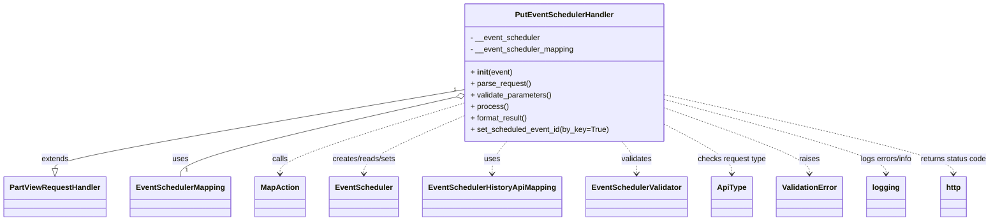

# Diagram: partview_core/partview_service/partview_service/api/event_scheduler/handler/PutEventSchedulerHandler.py


> Auto-generated by Obscura crawlers

## Diagram 1



### SVG

<svg id="container" width="2017.625" xmlns="http://www.w3.org/2000/svg" class="classDiagram" height="462" viewBox="0 0 2017.625 462" role="graphics-document document" aria-roledescription="class"><style>#container{font-family:"trebuchet ms",verdana,arial,sans-serif;font-size:16px;fill:#333;}@keyframes edge-animation-frame{from{stroke-dashoffset:0;}}@keyframes dash{to{stroke-dashoffset:0;}}#container .edge-animation-slow{stroke-dasharray:9,5!important;stroke-dashoffset:900;animation:dash 50s linear infinite;stroke-linecap:round;}#container .edge-animation-fast{stroke-dasharray:9,5!important;stroke-dashoffset:900;animation:dash 20s linear infinite;stroke-linecap:round;}#container .error-icon{fill:#552222;}#container .error-text{fill:#552222;stroke:#552222;}#container .edge-thickness-normal{stroke-width:1px;}#container .edge-thickness-thick{stroke-width:3.5px;}#container .edge-pattern-solid{stroke-dasharray:0;}#container .edge-thickness-invisible{stroke-width:0;fill:none;}#container .edge-pattern-dashed{stroke-dasharray:3;}#container .edge-pattern-dotted{stroke-dasharray:2;}#container .marker{fill:#333333;stroke:#333333;}#container .marker.cross{stroke:#333333;}#container svg{font-family:"trebuchet ms",verdana,arial,sans-serif;font-size:16px;}#container p{margin:0;}#container g.classGroup text{fill:#9370DB;stroke:none;font-family:"trebuchet ms",verdana,arial,sans-serif;font-size:10px;}#container g.classGroup text .title{font-weight:bolder;}#container .nodeLabel,#container .edgeLabel{color:#131300;}#container .edgeLabel .label rect{fill:#ECECFF;}#container .label text{fill:#131300;}#container .labelBkg{background:#ECECFF;}#container .edgeLabel .label span{background:#ECECFF;}#container .classTitle{font-weight:bolder;}#container .node rect,#container .node circle,#container .node ellipse,#container .node polygon,#container .node path{fill:#ECECFF;stroke:#9370DB;stroke-width:1px;}#container .divider{stroke:#9370DB;stroke-width:1;}#container g.clickable{cursor:pointer;}#container g.classGroup rect{fill:#ECECFF;stroke:#9370DB;}#container g.classGroup line{stroke:#9370DB;stroke-width:1;}#container .classLabel .box{stroke:none;stroke-width:0;fill:#ECECFF;opacity:0.5;}#container .classLabel .label{fill:#9370DB;font-size:10px;}#container .relation{stroke:#333333;stroke-width:1;fill:none;}#container .dashed-line{stroke-dasharray:3;}#container .dotted-line{stroke-dasharray:1 2;}#container #compositionStart,#container .composition{fill:#333333!important;stroke:#333333!important;stroke-width:1;}#container #compositionEnd,#container .composition{fill:#333333!important;stroke:#333333!important;stroke-width:1;}#container #dependencyStart,#container .dependency{fill:#333333!important;stroke:#333333!important;stroke-width:1;}#container #dependencyStart,#container .dependency{fill:#333333!important;stroke:#333333!important;stroke-width:1;}#container #extensionStart,#container .extension{fill:transparent!important;stroke:#333333!important;stroke-width:1;}#container #extensionEnd,#container .extension{fill:transparent!important;stroke:#333333!important;stroke-width:1;}#container #aggregationStart,#container .aggregation{fill:transparent!important;stroke:#333333!important;stroke-width:1;}#container #aggregationEnd,#container .aggregation{fill:transparent!important;stroke:#333333!important;stroke-width:1;}#container #lollipopStart,#container .lollipop{fill:#ECECFF!important;stroke:#333333!important;stroke-width:1;}#container #lollipopEnd,#container .lollipop{fill:#ECECFF!important;stroke:#333333!important;stroke-width:1;}#container .edgeTerminals{font-size:11px;line-height:initial;}#container .classTitleText{text-anchor:middle;font-size:18px;fill:#333;}#container .label-icon{display:inline-block;height:1em;overflow:visible;vertical-align:-0.125em;}#container .node .label-icon path{fill:currentColor;stroke:revert;stroke-width:revert;}#container :root{--mermaid-font-family:"trebuchet ms",verdana,arial,sans-serif;}</style><g><defs><marker id="container_class-aggregationStart" class="marker aggregation class" refX="18" refY="7" markerWidth="190" markerHeight="240" orient="auto"><path d="M 18,7 L9,13 L1,7 L9,1 Z"></path></marker></defs><defs><marker id="container_class-aggregationEnd" class="marker aggregation class" refX="1" refY="7" markerWidth="20" markerHeight="28" orient="auto"><path d="M 18,7 L9,13 L1,7 L9,1 Z"></path></marker></defs><defs><marker id="container_class-extensionStart" class="marker extension class" refX="18" refY="7" markerWidth="190" markerHeight="240" orient="auto"><path d="M 1,7 L18,13 V 1 Z"></path></marker></defs><defs><marker id="container_class-extensionEnd" class="marker extension class" refX="1" refY="7" markerWidth="20" markerHeight="28" orient="auto"><path d="M 1,1 V 13 L18,7 Z"></path></marker></defs><defs><marker id="container_class-compositionStart" class="marker composition class" refX="18" refY="7" markerWidth="190" markerHeight="240" orient="auto"><path d="M 18,7 L9,13 L1,7 L9,1 Z"></path></marker></defs><defs><marker id="container_class-compositionEnd" class="marker composition class" refX="1" refY="7" markerWidth="20" markerHeight="28" orient="auto"><path d="M 18,7 L9,13 L1,7 L9,1 Z"></path></marker></defs><defs><marker id="container_class-dependencyStart" class="marker dependency class" refX="6" refY="7" markerWidth="190" markerHeight="240" orient="auto"><path d="M 5,7 L9,13 L1,7 L9,1 Z"></path></marker></defs><defs><marker id="container_class-dependencyEnd" class="marker dependency class" refX="13" refY="7" markerWidth="20" markerHeight="28" orient="auto"><path d="M 18,7 L9,13 L14,7 L9,1 Z"></path></marker></defs><defs><marker id="container_class-lollipopStart" class="marker lollipop class" refX="13" refY="7" markerWidth="190" markerHeight="240" orient="auto"><circle stroke="black" fill="transparent" cx="7" cy="7" r="6"></circle></marker></defs><defs><marker id="container_class-lollipopEnd" class="marker lollipop class" refX="1" refY="7" markerWidth="190" markerHeight="240" orient="auto"><circle stroke="black" fill="transparent" cx="7" cy="7" r="6"></circle></marker></defs><g class="root"><g class="clusters"></g><g class="edgePaths"><path d="M933.68,188.166L796.626,212.305C659.573,236.444,385.466,284.722,248.413,312.153C111.359,339.583,111.359,346.167,111.359,349.458L111.359,352.75" id="id_PutEventSchedulerHandler_PartViewRequestHandler_1" class="edge-thickness-normal edge-pattern-solid relation" style=";;;" data-edge="true" data-et="edge" data-id="id_PutEventSchedulerHandler_PartViewRequestHandler_1" data-points="W3sieCI6OTMzLjY3OTY4NzUsInkiOjE4OC4xNjYxNTAzNDkxMzJ9LHsieCI6MTExLjM1OTM3NSwieSI6MzMzfSx7IngiOjExMS4zNTkzNzUsInkiOjM3MH1d" marker-end="url(#container_class-extensionEnd)"></path><path d="M916.883,203.959L824.938,225.466C732.992,246.973,549.102,289.986,457.156,317.66C365.211,345.333,365.211,357.667,365.211,363.833L365.211,370" id="id_PutEventSchedulerHandler_EventSchedulerMapping_2" class="edge-thickness-normal edge-pattern-solid relation" style=";;;" data-edge="true" data-et="edge" data-id="id_PutEventSchedulerHandler_EventSchedulerMapping_2" data-points="W3sieCI6OTMzLjY3OTY4NzUsInkiOjIwMC4wMzA2MjY3MTk1MDMyNn0seyJ4IjozNjUuMjEwOTM3NSwieSI6MzMzfSx7IngiOjM2NS4yMTA5Mzc1LCJ5IjozNzB9XQ==" marker-start="url(#container_class-aggregationStart)"></path><path d="M933.68,216.899L872.456,236.249C811.232,255.599,688.784,294.3,627.56,318.816C566.336,343.333,566.336,353.667,566.336,358.833L566.336,364" id="id_PutEventSchedulerHandler_MapAction_3" class="edge-thickness-normal edge-pattern-dashed relation" style=";;;" data-edge="true" data-et="edge" data-id="id_PutEventSchedulerHandler_MapAction_3" data-points="W3sieCI6OTMzLjY3OTY4NzUsInkiOjIxNi44OTg4NTg4NTM5NDI4NH0seyJ4Ijo1NjYuMzM1OTM3NSwieSI6MzMzfSx7IngiOjU2Ni4zMzU5Mzc1LCJ5IjozNzB9XQ==" marker-end="url(#container_class-dependencyEnd)"></path><path d="M933.68,244.209L900.725,259.008C867.771,273.806,801.862,303.403,768.908,323.368C735.953,343.333,735.953,353.667,735.953,358.833L735.953,364" id="id_PutEventSchedulerHandler_EventScheduler_4" class="edge-thickness-normal edge-pattern-dashed relation" style=";;;" data-edge="true" data-et="edge" data-id="id_PutEventSchedulerHandler_EventScheduler_4" data-points="W3sieCI6OTMzLjY3OTY4NzUsInkiOjI0NC4yMDk0MDA1OTExNzEyfSx7IngiOjczNS45NTMxMjUsInkiOjMzM30seyJ4Ijo3MzUuOTUzMTI1LCJ5IjozNzB9XQ==" marker-end="url(#container_class-dependencyEnd)"></path><path d="M1023.328,296L1018.374,302.167C1013.419,308.333,1003.51,320.667,998.556,332C993.602,343.333,993.602,353.667,993.602,358.833L993.602,364" id="id_PutEventSchedulerHandler_EventSchedulerHistoryApiMapping_5" class="edge-thickness-normal edge-pattern-dashed relation" style=";;;" data-edge="true" data-et="edge" data-id="id_PutEventSchedulerHandler_EventSchedulerHistoryApiMapping_5" data-points="W3sieCI6MTAyMy4zMjc4ODc2MDM1OTEyLCJ5IjoyOTZ9LHsieCI6OTkzLjYwMTU2MjUsInkiOjMzM30seyJ4Ijo5OTMuNjAxNTYyNSwieSI6MzcwfV0=" marker-end="url(#container_class-dependencyEnd)"></path><path d="M1254.711,296L1259.666,302.167C1264.62,308.333,1274.529,320.667,1279.483,332C1284.438,343.333,1284.438,353.667,1284.438,358.833L1284.438,364" id="id_PutEventSchedulerHandler_EventSchedulerValidator_6" class="edge-thickness-normal edge-pattern-dashed relation" style=";;;" data-edge="true" data-et="edge" data-id="id_PutEventSchedulerHandler_EventSchedulerValidator_6" data-points="W3sieCI6MTI1NC43MTExNzQ4OTY0MDksInkiOjI5Nn0seyJ4IjoxMjg0LjQzNzUsInkiOjMzM30seyJ4IjoxMjg0LjQzNzUsInkiOjM3MH1d" marker-end="url(#container_class-dependencyEnd)"></path><path d="M1344.359,261.738L1366.583,273.615C1388.807,285.492,1433.255,309.246,1455.479,326.29C1477.703,343.333,1477.703,353.667,1477.703,358.833L1477.703,364" id="id_PutEventSchedulerHandler_ApiType_7" class="edge-thickness-normal edge-pattern-dashed relation" style=";;;" data-edge="true" data-et="edge" data-id="id_PutEventSchedulerHandler_ApiType_7" data-points="W3sieCI6MTM0NC4zNTkzNzUsInkiOjI2MS43MzgxNTIwODIzOTYyNX0seyJ4IjoxNDc3LjcwMzEyNSwieSI6MzMzfSx7IngiOjE0NzcuNzAzMTI1LCJ5IjozNzB9XQ==" marker-end="url(#container_class-dependencyEnd)"></path><path d="M1344.359,226.788L1392.962,244.49C1441.565,262.192,1538.771,297.596,1587.374,320.465C1635.977,343.333,1635.977,353.667,1635.977,358.833L1635.977,364" id="id_PutEventSchedulerHandler_ValidationError_8" class="edge-thickness-normal edge-pattern-dashed relation" style=";;;" data-edge="true" data-et="edge" data-id="id_PutEventSchedulerHandler_ValidationError_8" data-points="W3sieCI6MTM0NC4zNTkzNzUsInkiOjIyNi43ODgxNzk2MjQ0MzMwN30seyJ4IjoxNjM1Ljk3NjU2MjUsInkiOjMzM30seyJ4IjoxNjM1Ljk3NjU2MjUsInkiOjM3MH1d" marker-end="url(#container_class-dependencyEnd)"></path><path d="M1344.359,208.895L1419.01,229.579C1493.661,250.263,1642.964,291.632,1717.615,317.483C1792.266,343.333,1792.266,353.667,1792.266,358.833L1792.266,364" id="id_PutEventSchedulerHandler_logging_9" class="edge-thickness-normal edge-pattern-dashed relation" style=";;;" data-edge="true" data-et="edge" data-id="id_PutEventSchedulerHandler_logging_9" data-points="W3sieCI6MTM0NC4zNTkzNzUsInkiOjIwOC44OTUxMTUxNDAxMzU1fSx7IngiOjE3OTIuMjY1NjI1LCJ5IjozMzN9LHsieCI6MTc5Mi4yNjU2MjUsInkiOjM3MH1d" marker-end="url(#container_class-dependencyEnd)"></path><path d="M1344.359,198.434L1443.539,220.862C1542.719,243.289,1741.078,288.145,1840.258,315.739C1939.438,343.333,1939.438,353.667,1939.438,358.833L1939.438,364" id="id_PutEventSchedulerHandler_http_10" class="edge-thickness-normal edge-pattern-dashed relation" style=";;;" data-edge="true" data-et="edge" data-id="id_PutEventSchedulerHandler_http_10" data-points="W3sieCI6MTM0NC4zNTkzNzUsInkiOjE5OC40MzM4Nzk3NjAwODYyOH0seyJ4IjoxOTM5LjQzNzUsInkiOjMzM30seyJ4IjoxOTM5LjQzNzUsInkiOjM3MH1d" marker-end="url(#container_class-dependencyEnd)"></path></g><g class="edgeLabels"><g class="edgeLabel" transform="translate(111.359375, 333)"><g class="label" data-id="id_PutEventSchedulerHandler_PartViewRequestHandler_1" transform="translate(-28.5078125, -12)"><foreignObject width="57.015625" height="24"><div xmlns="http://www.w3.org/1999/xhtml" class="labelBkg" style="display: table-cell; white-space: nowrap; line-height: 1.5; max-width: 200px; text-align: center;"><span class="edgeLabel"><p>extends</p></span></div></foreignObject></g></g><g class="edgeLabel" transform="translate(365.2109375, 333)"><g class="label" data-id="id_PutEventSchedulerHandler_EventSchedulerMapping_2" transform="translate(-16.4921875, -12)"><foreignObject width="32.984375" height="24"><div xmlns="http://www.w3.org/1999/xhtml" class="labelBkg" style="display: table-cell; white-space: nowrap; line-height: 1.5; max-width: 200px; text-align: center;"><span class="edgeLabel"><p>uses</p></span></div></foreignObject></g></g><g class="edgeLabel" transform="translate(566.3359375, 333)"><g class="label" data-id="id_PutEventSchedulerHandler_MapAction_3" transform="translate(-16.4453125, -12)"><foreignObject width="32.890625" height="24"><div xmlns="http://www.w3.org/1999/xhtml" class="labelBkg" style="display: table-cell; white-space: nowrap; line-height: 1.5; max-width: 200px; text-align: center;"><span class="edgeLabel"><p>calls</p></span></div></foreignObject></g></g><g class="edgeLabel" transform="translate(735.953125, 333)"><g class="label" data-id="id_PutEventSchedulerHandler_EventScheduler_4" transform="translate(-68.734375, -12)"><foreignObject width="137.46875" height="24"><div xmlns="http://www.w3.org/1999/xhtml" class="labelBkg" style="display: table-cell; white-space: nowrap; line-height: 1.5; max-width: 200px; text-align: center;"><span class="edgeLabel"><p>creates/reads/sets</p></span></div></foreignObject></g></g><g class="edgeLabel" transform="translate(993.6015625, 333)"><g class="label" data-id="id_PutEventSchedulerHandler_EventSchedulerHistoryApiMapping_5" transform="translate(-16.4921875, -12)"><foreignObject width="32.984375" height="24"><div xmlns="http://www.w3.org/1999/xhtml" class="labelBkg" style="display: table-cell; white-space: nowrap; line-height: 1.5; max-width: 200px; text-align: center;"><span class="edgeLabel"><p>uses</p></span></div></foreignObject></g></g><g class="edgeLabel" transform="translate(1284.4375, 333)"><g class="label" data-id="id_PutEventSchedulerHandler_EventSchedulerValidator_6" transform="translate(-32.6875, -12)"><foreignObject width="65.375" height="24"><div xmlns="http://www.w3.org/1999/xhtml" class="labelBkg" style="display: table-cell; white-space: nowrap; line-height: 1.5; max-width: 200px; text-align: center;"><span class="edgeLabel"><p>validates</p></span></div></foreignObject></g></g><g class="edgeLabel" transform="translate(1477.703125, 333)"><g class="label" data-id="id_PutEventSchedulerHandler_ApiType_7" transform="translate(-72.2578125, -12)"><foreignObject width="144.515625" height="24"><div xmlns="http://www.w3.org/1999/xhtml" class="labelBkg" style="display: table-cell; white-space: nowrap; line-height: 1.5; max-width: 200px; text-align: center;"><span class="edgeLabel"><p>checks request type</p></span></div></foreignObject></g></g><g class="edgeLabel" transform="translate(1635.9765625, 333)"><g class="label" data-id="id_PutEventSchedulerHandler_ValidationError_8" transform="translate(-21.25, -12)"><foreignObject width="42.5" height="24"><div xmlns="http://www.w3.org/1999/xhtml" class="labelBkg" style="display: table-cell; white-space: nowrap; line-height: 1.5; max-width: 200px; text-align: center;"><span class="edgeLabel"><p>raises</p></span></div></foreignObject></g></g><g class="edgeLabel" transform="translate(1792.265625, 333)"><g class="label" data-id="id_PutEventSchedulerHandler_logging_9" transform="translate(-56.984375, -12)"><foreignObject width="113.96875" height="24"><div xmlns="http://www.w3.org/1999/xhtml" class="labelBkg" style="display: table-cell; white-space: nowrap; line-height: 1.5; max-width: 200px; text-align: center;"><span class="edgeLabel"><p>logs errors/info</p></span></div></foreignObject></g></g><g class="edgeLabel" transform="translate(1939.4375, 333)"><g class="label" data-id="id_PutEventSchedulerHandler_http_10" transform="translate(-70.1875, -12)"><foreignObject width="140.375" height="24"><div xmlns="http://www.w3.org/1999/xhtml" class="labelBkg" style="display: table-cell; white-space: nowrap; line-height: 1.5; max-width: 200px; text-align: center;"><span class="edgeLabel"><p>returns status code</p></span></div></foreignObject></g></g><g class="edgeTerminals" transform="translate(913.2232326035424, 189.4106691118904)"><g class="inner" transform="translate(0, 0)"><foreignObject style="width: 9px; height: 12px;"><div xmlns="http://www.w3.org/1999/xhtml" style="display: inline-block; padding-right: 1px; white-space: nowrap;"><span class="edgeLabel">1</span></div></foreignObject></g></g><g class="edgeTerminals" transform="translate(375.2109387499999, 347.5000010714286)"><g class="inner" transform="translate(0, 0)"></g><foreignObject style="width: 9px; height: 12px;"><div xmlns="http://www.w3.org/1999/xhtml" style="display: inline-block; padding-right: 1px; white-space: nowrap;"><span class="edgeLabel">1</span></div></foreignObject></g></g><g class="nodes"><g class="node default" id="classId-PutEventSchedulerHandler-0" transform="translate(1139.01953125, 152)"><g class="basic label-container"><path d="M-205.33984375 -144 L205.33984375 -144 L205.33984375 144 L-205.33984375 144" stroke="none" stroke-width="0" fill="#ECECFF" style=""></path><path d="M-205.33984375 -144 C-49.475841436840426 -144, 106.38816087631915 -144, 205.33984375 -144 M-205.33984375 -144 C-54.93580279198696 -144, 95.46823816602608 -144, 205.33984375 -144 M205.33984375 -144 C205.33984375 -45.622489515363, 205.33984375 52.755020969274, 205.33984375 144 M205.33984375 -144 C205.33984375 -49.15834440202184, 205.33984375 45.68331119595632, 205.33984375 144 M205.33984375 144 C72.47585158163395 144, -60.388140586732106 144, -205.33984375 144 M205.33984375 144 C91.33031816351972 144, -22.67920742296056 144, -205.33984375 144 M-205.33984375 144 C-205.33984375 78.54507483070813, -205.33984375 13.090149661416262, -205.33984375 -144 M-205.33984375 144 C-205.33984375 77.76712552594705, -205.33984375 11.534251051894103, -205.33984375 -144" stroke="#9370DB" stroke-width="1.3" fill="none" stroke-dasharray="0 0" style=""></path></g><g class="annotation-group text" transform="translate(0, -120)"></g><g class="label-group text" transform="translate(-98.3359375, -120)"><g class="label" style="font-weight: bolder" transform="translate(0,-12)"><foreignObject width="196.671875" height="24"><div xmlns="http://www.w3.org/1999/xhtml" style="display: table-cell; white-space: nowrap; line-height: 1.5; max-width: 246px; text-align: center;"><span class="nodeLabel markdown-node-label" style=""><p>PutEventSchedulerHandler</p></span></div></foreignObject></g></g><g class="members-group text" transform="translate(-193.33984375, -72)"><g class="label" style="" transform="translate(0,-12)"><foreignObject width="147.109375" height="24"><div xmlns="http://www.w3.org/1999/xhtml" style="display: table-cell; white-space: nowrap; line-height: 1.5; max-width: 205px; text-align: center;"><span class="nodeLabel markdown-node-label" style=""><p>- __event_scheduler</p></span></div></foreignObject></g><g class="label" style="" transform="translate(0,12)"><foreignObject width="217.78125" height="24"><div xmlns="http://www.w3.org/1999/xhtml" style="display: table-cell; white-space: nowrap; line-height: 1.5; max-width: 276px; text-align: center;"><span class="nodeLabel markdown-node-label" style=""><p>- __event_scheduler_mapping</p></span></div></foreignObject></g></g><g class="methods-group text" transform="translate(-193.33984375, 0)"><g class="label" style="" transform="translate(0,-12)"><foreignObject width="87.390625" height="24"><div xmlns="http://www.w3.org/1999/xhtml" style="display: table-cell; white-space: nowrap; line-height: 1.5; max-width: 177px; text-align: center;"><span class="nodeLabel markdown-node-label" style=""><p>+ <strong>init</strong>(event)</p></span></div></foreignObject></g><g class="label" style="" transform="translate(0,12)"><foreignObject width="126.046875" height="24"><div xmlns="http://www.w3.org/1999/xhtml" style="display: table-cell; white-space: nowrap; line-height: 1.5; max-width: 183px; text-align: center;"><span class="nodeLabel markdown-node-label" style=""><p>+ parse_request()</p></span></div></foreignObject></g><g class="label" style="" transform="translate(0,36)"><foreignObject width="170.953125" height="24"><div xmlns="http://www.w3.org/1999/xhtml" style="display: table-cell; white-space: nowrap; line-height: 1.5; max-width: 228px; text-align: center;"><span class="nodeLabel markdown-node-label" style=""><p>+ validate_parameters()</p></span></div></foreignObject></g><g class="label" style="" transform="translate(0,60)"><foreignObject width="77.96875" height="24"><div xmlns="http://www.w3.org/1999/xhtml" style="display: table-cell; white-space: nowrap; line-height: 1.5; max-width: 135px; text-align: center;"><span class="nodeLabel markdown-node-label" style=""><p>+ process()</p></span></div></foreignObject></g><g class="label" style="" transform="translate(0,84)"><foreignObject width="121.5" height="24"><div xmlns="http://www.w3.org/1999/xhtml" style="display: table-cell; white-space: nowrap; line-height: 1.5; max-width: 179px; text-align: center;"><span class="nodeLabel markdown-node-label" style=""><p>+ format_result()</p></span></div></foreignObject></g><g class="label" style="" transform="translate(0,108)"><foreignObject width="288.34375" height="24"><div xmlns="http://www.w3.org/1999/xhtml" style="display: table-cell; white-space: nowrap; line-height: 1.5; max-width: 346px; text-align: center;"><span class="nodeLabel markdown-node-label" style=""><p>+ set_scheduled_event_id(by_key=True)</p></span></div></foreignObject></g></g><g class="divider" style=""><path d="M-205.33984375 -96 C-87.00430803009357 -96, 31.331227689812863 -96, 205.33984375 -96 M-205.33984375 -96 C-93.10981450501293 -96, 19.12021473997413 -96, 205.33984375 -96" stroke="#9370DB" stroke-width="1.3" fill="none" stroke-dasharray="0 0" style=""></path></g><g class="divider" style=""><path d="M-205.33984375 -24 C-69.8504393595646 -24, 65.63896503087079 -24, 205.33984375 -24 M-205.33984375 -24 C-97.35371074742339 -24, 10.632422255153216 -24, 205.33984375 -24" stroke="#9370DB" stroke-width="1.3" fill="none" stroke-dasharray="0 0" style=""></path></g></g><g class="node default" id="classId-PartViewRequestHandler-1" transform="translate(111.359375, 412)"><g class="basic label-container"><path d="M-103.359375 -42 L103.359375 -42 L103.359375 42 L-103.359375 42" stroke="none" stroke-width="0" fill="#ECECFF" style=""></path><path d="M-103.359375 -42 C-36.14556157674458 -42, 31.068251846510833 -42, 103.359375 -42 M-103.359375 -42 C-45.86127429827786 -42, 11.636826403444275 -42, 103.359375 -42 M103.359375 -42 C103.359375 -15.718333568597792, 103.359375 10.563332862804415, 103.359375 42 M103.359375 -42 C103.359375 -24.142221671672342, 103.359375 -6.284443343344684, 103.359375 42 M103.359375 42 C27.29791659564475 42, -48.7635418087105 42, -103.359375 42 M103.359375 42 C22.408451078951998 42, -58.542472842096004 42, -103.359375 42 M-103.359375 42 C-103.359375 13.706390401935245, -103.359375 -14.58721919612951, -103.359375 -42 M-103.359375 42 C-103.359375 10.049973713987452, -103.359375 -21.900052572025096, -103.359375 -42" stroke="#9370DB" stroke-width="1.3" fill="none" stroke-dasharray="0 0" style=""></path></g><g class="annotation-group text" transform="translate(0, -18)"></g><g class="label-group text" transform="translate(-91.359375, -18)"><g class="label" style="font-weight: bolder" transform="translate(0,-12)"><foreignObject width="182.71875" height="24"><div xmlns="http://www.w3.org/1999/xhtml" style="display: table-cell; white-space: nowrap; line-height: 1.5; max-width: 231px; text-align: center;"><span class="nodeLabel markdown-node-label" style=""><p>PartViewRequestHandler</p></span></div></foreignObject></g></g><g class="members-group text" transform="translate(-91.359375, 30)"></g><g class="methods-group text" transform="translate(-91.359375, 60)"></g><g class="divider" style=""><path d="M-103.359375 6 C-54.694217201793634 6, -6.029059403587269 6, 103.359375 6 M-103.359375 6 C-20.80372482596961 6, 61.75192534806078 6, 103.359375 6" stroke="#9370DB" stroke-width="1.3" fill="none" stroke-dasharray="0 0" style=""></path></g><g class="divider" style=""><path d="M-103.359375 24 C-32.39018023094398 24, 38.579014538112034 24, 103.359375 24 M-103.359375 24 C-33.09063493604022 24, 37.178105127919565 24, 103.359375 24" stroke="#9370DB" stroke-width="1.3" fill="none" stroke-dasharray="0 0" style=""></path></g></g><g class="node default" id="classId-EventSchedulerMapping-2" transform="translate(365.2109375, 412)"><g class="basic label-container"><path d="M-100.4921875 -42 L100.4921875 -42 L100.4921875 42 L-100.4921875 42" stroke="none" stroke-width="0" fill="#ECECFF" style=""></path><path d="M-100.4921875 -42 C-33.67450410878935 -42, 33.1431792824213 -42, 100.4921875 -42 M-100.4921875 -42 C-54.36933788037597 -42, -8.246488260751946 -42, 100.4921875 -42 M100.4921875 -42 C100.4921875 -15.631415844943948, 100.4921875 10.737168310112104, 100.4921875 42 M100.4921875 -42 C100.4921875 -16.38695867816393, 100.4921875 9.226082643672143, 100.4921875 42 M100.4921875 42 C41.67442824662735 42, -17.1433310067453 42, -100.4921875 42 M100.4921875 42 C22.282510952886838 42, -55.927165594226324 42, -100.4921875 42 M-100.4921875 42 C-100.4921875 16.33638042718079, -100.4921875 -9.327239145638423, -100.4921875 -42 M-100.4921875 42 C-100.4921875 13.550539438457513, -100.4921875 -14.898921123084975, -100.4921875 -42" stroke="#9370DB" stroke-width="1.3" fill="none" stroke-dasharray="0 0" style=""></path></g><g class="annotation-group text" transform="translate(0, -18)"></g><g class="label-group text" transform="translate(-88.4921875, -18)"><g class="label" style="font-weight: bolder" transform="translate(0,-12)"><foreignObject width="176.984375" height="24"><div xmlns="http://www.w3.org/1999/xhtml" style="display: table-cell; white-space: nowrap; line-height: 1.5; max-width: 226px; text-align: center;"><span class="nodeLabel markdown-node-label" style=""><p>EventSchedulerMapping</p></span></div></foreignObject></g></g><g class="members-group text" transform="translate(-88.4921875, 30)"></g><g class="methods-group text" transform="translate(-88.4921875, 60)"></g><g class="divider" style=""><path d="M-100.4921875 6 C-58.93523236944523 6, -17.378277238890462 6, 100.4921875 6 M-100.4921875 6 C-40.28590951080995 6, 19.920368478380098 6, 100.4921875 6" stroke="#9370DB" stroke-width="1.3" fill="none" stroke-dasharray="0 0" style=""></path></g><g class="divider" style=""><path d="M-100.4921875 24 C-58.17496441126644 24, -15.857741322532874 24, 100.4921875 24 M-100.4921875 24 C-29.326927789162042 24, 41.838331921675916 24, 100.4921875 24" stroke="#9370DB" stroke-width="1.3" fill="none" stroke-dasharray="0 0" style=""></path></g></g><g class="node default" id="classId-MapAction-3" transform="translate(566.3359375, 412)"><g class="basic label-container"><path d="M-50.6328125 -42 L50.6328125 -42 L50.6328125 42 L-50.6328125 42" stroke="none" stroke-width="0" fill="#ECECFF" style=""></path><path d="M-50.6328125 -42 C-19.352802406416323 -42, 11.927207687167353 -42, 50.6328125 -42 M-50.6328125 -42 C-10.500061015929475 -42, 29.63269046814105 -42, 50.6328125 -42 M50.6328125 -42 C50.6328125 -10.746259711901935, 50.6328125 20.50748057619613, 50.6328125 42 M50.6328125 -42 C50.6328125 -24.532373462932046, 50.6328125 -7.0647469258640925, 50.6328125 42 M50.6328125 42 C16.424059997831634 42, -17.784692504336732 42, -50.6328125 42 M50.6328125 42 C20.59294661580604 42, -9.446919268387923 42, -50.6328125 42 M-50.6328125 42 C-50.6328125 21.744777546444855, -50.6328125 1.4895550928897094, -50.6328125 -42 M-50.6328125 42 C-50.6328125 24.69142643413965, -50.6328125 7.382852868279301, -50.6328125 -42" stroke="#9370DB" stroke-width="1.3" fill="none" stroke-dasharray="0 0" style=""></path></g><g class="annotation-group text" transform="translate(0, -18)"></g><g class="label-group text" transform="translate(-38.6328125, -18)"><g class="label" style="font-weight: bolder" transform="translate(0,-12)"><foreignObject width="77.265625" height="24"><div xmlns="http://www.w3.org/1999/xhtml" style="display: table-cell; white-space: nowrap; line-height: 1.5; max-width: 126px; text-align: center;"><span class="nodeLabel markdown-node-label" style=""><p>MapAction</p></span></div></foreignObject></g></g><g class="members-group text" transform="translate(-38.6328125, 30)"></g><g class="methods-group text" transform="translate(-38.6328125, 60)"></g><g class="divider" style=""><path d="M-50.6328125 6 C-22.24628326160771 6, 6.140245976784577 6, 50.6328125 6 M-50.6328125 6 C-25.84987070658908 6, -1.0669289131781596 6, 50.6328125 6" stroke="#9370DB" stroke-width="1.3" fill="none" stroke-dasharray="0 0" style=""></path></g><g class="divider" style=""><path d="M-50.6328125 24 C-12.370540160472991 24, 25.891732179054017 24, 50.6328125 24 M-50.6328125 24 C-17.814592290059764 24, 15.003627919880472 24, 50.6328125 24" stroke="#9370DB" stroke-width="1.3" fill="none" stroke-dasharray="0 0" style=""></path></g></g><g class="node default" id="classId-EventScheduler-4" transform="translate(735.953125, 412)"><g class="basic label-container"><path d="M-68.984375 -42 L68.984375 -42 L68.984375 42 L-68.984375 42" stroke="none" stroke-width="0" fill="#ECECFF" style=""></path><path d="M-68.984375 -42 C-21.559644287515688 -42, 25.865086424968624 -42, 68.984375 -42 M-68.984375 -42 C-25.21038282476772 -42, 18.56360935046456 -42, 68.984375 -42 M68.984375 -42 C68.984375 -24.124434454437456, 68.984375 -6.248868908874911, 68.984375 42 M68.984375 -42 C68.984375 -13.175849662002012, 68.984375 15.648300675995976, 68.984375 42 M68.984375 42 C31.10365978477376 42, -6.777055430452478 42, -68.984375 42 M68.984375 42 C16.2166889054487 42, -36.5509971891026 42, -68.984375 42 M-68.984375 42 C-68.984375 8.985515965640694, -68.984375 -24.028968068718612, -68.984375 -42 M-68.984375 42 C-68.984375 19.926474432536367, -68.984375 -2.147051134927267, -68.984375 -42" stroke="#9370DB" stroke-width="1.3" fill="none" stroke-dasharray="0 0" style=""></path></g><g class="annotation-group text" transform="translate(0, -18)"></g><g class="label-group text" transform="translate(-56.984375, -18)"><g class="label" style="font-weight: bolder" transform="translate(0,-12)"><foreignObject width="113.96875" height="24"><div xmlns="http://www.w3.org/1999/xhtml" style="display: table-cell; white-space: nowrap; line-height: 1.5; max-width: 164px; text-align: center;"><span class="nodeLabel markdown-node-label" style=""><p>EventScheduler</p></span></div></foreignObject></g></g><g class="members-group text" transform="translate(-56.984375, 30)"></g><g class="methods-group text" transform="translate(-56.984375, 60)"></g><g class="divider" style=""><path d="M-68.984375 6 C-16.415887941824906 6, 36.15259911635019 6, 68.984375 6 M-68.984375 6 C-15.163100066039249 6, 38.6581748679215 6, 68.984375 6" stroke="#9370DB" stroke-width="1.3" fill="none" stroke-dasharray="0 0" style=""></path></g><g class="divider" style=""><path d="M-68.984375 24 C-24.98130975867747 24, 19.021755482645062 24, 68.984375 24 M-68.984375 24 C-29.933492730837152 24, 9.117389538325696 24, 68.984375 24" stroke="#9370DB" stroke-width="1.3" fill="none" stroke-dasharray="0 0" style=""></path></g></g><g class="node default" id="classId-EventSchedulerHistoryApiMapping-5" transform="translate(993.6015625, 412)"><g class="basic label-container"><path d="M-138.6640625 -42 L138.6640625 -42 L138.6640625 42 L-138.6640625 42" stroke="none" stroke-width="0" fill="#ECECFF" style=""></path><path d="M-138.6640625 -42 C-37.880290982648575 -42, 62.90348053470285 -42, 138.6640625 -42 M-138.6640625 -42 C-63.25174825481997 -42, 12.160565990360055 -42, 138.6640625 -42 M138.6640625 -42 C138.6640625 -9.290185795656349, 138.6640625 23.419628408687302, 138.6640625 42 M138.6640625 -42 C138.6640625 -24.653319311073812, 138.6640625 -7.306638622147624, 138.6640625 42 M138.6640625 42 C71.21292846397112 42, 3.761794427942249 42, -138.6640625 42 M138.6640625 42 C36.361805923126724 42, -65.94045065374655 42, -138.6640625 42 M-138.6640625 42 C-138.6640625 17.247791796587034, -138.6640625 -7.504416406825932, -138.6640625 -42 M-138.6640625 42 C-138.6640625 23.932466164540987, -138.6640625 5.864932329081974, -138.6640625 -42" stroke="#9370DB" stroke-width="1.3" fill="none" stroke-dasharray="0 0" style=""></path></g><g class="annotation-group text" transform="translate(0, -18)"></g><g class="label-group text" transform="translate(-126.6640625, -18)"><g class="label" style="font-weight: bolder" transform="translate(0,-12)"><foreignObject width="253.328125" height="24"><div xmlns="http://www.w3.org/1999/xhtml" style="display: table-cell; white-space: nowrap; line-height: 1.5; max-width: 301px; text-align: center;"><span class="nodeLabel markdown-node-label" style=""><p>EventSchedulerHistoryApiMapping</p></span></div></foreignObject></g></g><g class="members-group text" transform="translate(-126.6640625, 30)"></g><g class="methods-group text" transform="translate(-126.6640625, 60)"></g><g class="divider" style=""><path d="M-138.6640625 6 C-74.8439904057542 6, -11.023918311508382 6, 138.6640625 6 M-138.6640625 6 C-41.10595508655396 6, 56.452152326892076 6, 138.6640625 6" stroke="#9370DB" stroke-width="1.3" fill="none" stroke-dasharray="0 0" style=""></path></g><g class="divider" style=""><path d="M-138.6640625 24 C-64.63706433388863 24, 9.389933832222738 24, 138.6640625 24 M-138.6640625 24 C-64.26460951965986 24, 10.134843460680287 24, 138.6640625 24" stroke="#9370DB" stroke-width="1.3" fill="none" stroke-dasharray="0 0" style=""></path></g></g><g class="node default" id="classId-EventSchedulerValidator-6" transform="translate(1284.4375, 412)"><g class="basic label-container"><path d="M-102.171875 -42 L102.171875 -42 L102.171875 42 L-102.171875 42" stroke="none" stroke-width="0" fill="#ECECFF" style=""></path><path d="M-102.171875 -42 C-46.458253918326214 -42, 9.255367163347572 -42, 102.171875 -42 M-102.171875 -42 C-59.06965663419538 -42, -15.967438268390765 -42, 102.171875 -42 M102.171875 -42 C102.171875 -15.240836245662603, 102.171875 11.518327508674794, 102.171875 42 M102.171875 -42 C102.171875 -12.699055020579706, 102.171875 16.601889958840587, 102.171875 42 M102.171875 42 C58.574671926740486 42, 14.977468853480971 42, -102.171875 42 M102.171875 42 C38.60941895271543 42, -24.95303709456914 42, -102.171875 42 M-102.171875 42 C-102.171875 11.57898661239862, -102.171875 -18.84202677520276, -102.171875 -42 M-102.171875 42 C-102.171875 18.61046513049078, -102.171875 -4.779069739018439, -102.171875 -42" stroke="#9370DB" stroke-width="1.3" fill="none" stroke-dasharray="0 0" style=""></path></g><g class="annotation-group text" transform="translate(0, -18)"></g><g class="label-group text" transform="translate(-90.171875, -18)"><g class="label" style="font-weight: bolder" transform="translate(0,-12)"><foreignObject width="180.34375" height="24"><div xmlns="http://www.w3.org/1999/xhtml" style="display: table-cell; white-space: nowrap; line-height: 1.5; max-width: 229px; text-align: center;"><span class="nodeLabel markdown-node-label" style=""><p>EventSchedulerValidator</p></span></div></foreignObject></g></g><g class="members-group text" transform="translate(-90.171875, 30)"></g><g class="methods-group text" transform="translate(-90.171875, 60)"></g><g class="divider" style=""><path d="M-102.171875 6 C-27.936596649464647 6, 46.298681701070706 6, 102.171875 6 M-102.171875 6 C-21.82034875297431 6, 58.53117749405138 6, 102.171875 6" stroke="#9370DB" stroke-width="1.3" fill="none" stroke-dasharray="0 0" style=""></path></g><g class="divider" style=""><path d="M-102.171875 24 C-34.43070931411893 24, 33.31045637176214 24, 102.171875 24 M-102.171875 24 C-61.19309947472602 24, -20.214323949452037 24, 102.171875 24" stroke="#9370DB" stroke-width="1.3" fill="none" stroke-dasharray="0 0" style=""></path></g></g><g class="node default" id="classId-ApiType-7" transform="translate(1477.703125, 412)"><g class="basic label-container"><path d="M-41.09375 -42 L41.09375 -42 L41.09375 42 L-41.09375 42" stroke="none" stroke-width="0" fill="#ECECFF" style=""></path><path d="M-41.09375 -42 C-17.823393700674043 -42, 5.446962598651915 -42, 41.09375 -42 M-41.09375 -42 C-10.162347642532644 -42, 20.76905471493471 -42, 41.09375 -42 M41.09375 -42 C41.09375 -15.568578227716767, 41.09375 10.862843544566466, 41.09375 42 M41.09375 -42 C41.09375 -9.29930243315583, 41.09375 23.40139513368834, 41.09375 42 M41.09375 42 C11.07833474812443 42, -18.93708050375114 42, -41.09375 42 M41.09375 42 C21.117967620470093 42, 1.1421852409401865 42, -41.09375 42 M-41.09375 42 C-41.09375 19.905768295164776, -41.09375 -2.1884634096704474, -41.09375 -42 M-41.09375 42 C-41.09375 19.81356704185717, -41.09375 -2.3728659162856616, -41.09375 -42" stroke="#9370DB" stroke-width="1.3" fill="none" stroke-dasharray="0 0" style=""></path></g><g class="annotation-group text" transform="translate(0, -18)"></g><g class="label-group text" transform="translate(-29.09375, -18)"><g class="label" style="font-weight: bolder" transform="translate(0,-12)"><foreignObject width="58.1875" height="24"><div xmlns="http://www.w3.org/1999/xhtml" style="display: table-cell; white-space: nowrap; line-height: 1.5; max-width: 107px; text-align: center;"><span class="nodeLabel markdown-node-label" style=""><p>ApiType</p></span></div></foreignObject></g></g><g class="members-group text" transform="translate(-29.09375, 30)"></g><g class="methods-group text" transform="translate(-29.09375, 60)"></g><g class="divider" style=""><path d="M-41.09375 6 C-13.666139511513897 6, 13.761470976972205 6, 41.09375 6 M-41.09375 6 C-14.400949247563481 6, 12.291851504873037 6, 41.09375 6" stroke="#9370DB" stroke-width="1.3" fill="none" stroke-dasharray="0 0" style=""></path></g><g class="divider" style=""><path d="M-41.09375 24 C-15.897678516093883 24, 9.298392967812234 24, 41.09375 24 M-41.09375 24 C-18.155672594526663 24, 4.782404810946673 24, 41.09375 24" stroke="#9370DB" stroke-width="1.3" fill="none" stroke-dasharray="0 0" style=""></path></g></g><g class="node default" id="classId-ValidationError-8" transform="translate(1635.9765625, 412)"><g class="basic label-container"><path d="M-67.1796875 -42 L67.1796875 -42 L67.1796875 42 L-67.1796875 42" stroke="none" stroke-width="0" fill="#ECECFF" style=""></path><path d="M-67.1796875 -42 C-18.69221238127036 -42, 29.795262737459282 -42, 67.1796875 -42 M-67.1796875 -42 C-28.224169461875007 -42, 10.731348576249985 -42, 67.1796875 -42 M67.1796875 -42 C67.1796875 -20.93346287571837, 67.1796875 0.13307424856326122, 67.1796875 42 M67.1796875 -42 C67.1796875 -22.158083727679486, 67.1796875 -2.316167455358972, 67.1796875 42 M67.1796875 42 C15.712728556286706 42, -35.75423038742659 42, -67.1796875 42 M67.1796875 42 C17.83594748912725 42, -31.5077925217455 42, -67.1796875 42 M-67.1796875 42 C-67.1796875 14.139857558820207, -67.1796875 -13.720284882359586, -67.1796875 -42 M-67.1796875 42 C-67.1796875 11.119672267568031, -67.1796875 -19.760655464863937, -67.1796875 -42" stroke="#9370DB" stroke-width="1.3" fill="none" stroke-dasharray="0 0" style=""></path></g><g class="annotation-group text" transform="translate(0, -18)"></g><g class="label-group text" transform="translate(-55.1796875, -18)"><g class="label" style="font-weight: bolder" transform="translate(0,-12)"><foreignObject width="110.359375" height="24"><div xmlns="http://www.w3.org/1999/xhtml" style="display: table-cell; white-space: nowrap; line-height: 1.5; max-width: 160px; text-align: center;"><span class="nodeLabel markdown-node-label" style=""><p>ValidationError</p></span></div></foreignObject></g></g><g class="members-group text" transform="translate(-55.1796875, 30)"></g><g class="methods-group text" transform="translate(-55.1796875, 60)"></g><g class="divider" style=""><path d="M-67.1796875 6 C-13.490604750052576 6, 40.19847799989485 6, 67.1796875 6 M-67.1796875 6 C-18.460319824588503 6, 30.259047850822995 6, 67.1796875 6" stroke="#9370DB" stroke-width="1.3" fill="none" stroke-dasharray="0 0" style=""></path></g><g class="divider" style=""><path d="M-67.1796875 24 C-20.092505671266714 24, 26.99467615746657 24, 67.1796875 24 M-67.1796875 24 C-34.8561322945023 24, -2.5325770890046044 24, 67.1796875 24" stroke="#9370DB" stroke-width="1.3" fill="none" stroke-dasharray="0 0" style=""></path></g></g><g class="node default" id="classId-logging-9" transform="translate(1792.265625, 412)"><g class="basic label-container"><path d="M-39.109375 -42 L39.109375 -42 L39.109375 42 L-39.109375 42" stroke="none" stroke-width="0" fill="#ECECFF" style=""></path><path d="M-39.109375 -42 C-22.70523615954968 -42, -6.301097319099362 -42, 39.109375 -42 M-39.109375 -42 C-18.176808597944596 -42, 2.7557578041108073 -42, 39.109375 -42 M39.109375 -42 C39.109375 -9.936649393199296, 39.109375 22.126701213601407, 39.109375 42 M39.109375 -42 C39.109375 -21.620022104012, 39.109375 -1.2400442080240026, 39.109375 42 M39.109375 42 C10.502117330637095 42, -18.10514033872581 42, -39.109375 42 M39.109375 42 C8.91816056773023 42, -21.27305386453954 42, -39.109375 42 M-39.109375 42 C-39.109375 13.705348729494766, -39.109375 -14.589302541010468, -39.109375 -42 M-39.109375 42 C-39.109375 21.839461076059255, -39.109375 1.6789221521185098, -39.109375 -42" stroke="#9370DB" stroke-width="1.3" fill="none" stroke-dasharray="0 0" style=""></path></g><g class="annotation-group text" transform="translate(0, -18)"></g><g class="label-group text" transform="translate(-27.109375, -18)"><g class="label" style="font-weight: bolder" transform="translate(0,-12)"><foreignObject width="54.21875" height="24"><div xmlns="http://www.w3.org/1999/xhtml" style="display: table-cell; white-space: nowrap; line-height: 1.5; max-width: 103px; text-align: center;"><span class="nodeLabel markdown-node-label" style=""><p>logging</p></span></div></foreignObject></g></g><g class="members-group text" transform="translate(-27.109375, 30)"></g><g class="methods-group text" transform="translate(-27.109375, 60)"></g><g class="divider" style=""><path d="M-39.109375 6 C-17.945267038782454 6, 3.218840922435092 6, 39.109375 6 M-39.109375 6 C-10.635937290690006 6, 17.83750041861999 6, 39.109375 6" stroke="#9370DB" stroke-width="1.3" fill="none" stroke-dasharray="0 0" style=""></path></g><g class="divider" style=""><path d="M-39.109375 24 C-10.397030081275659 24, 18.315314837448682 24, 39.109375 24 M-39.109375 24 C-8.753624710245546 24, 21.602125579508908 24, 39.109375 24" stroke="#9370DB" stroke-width="1.3" fill="none" stroke-dasharray="0 0" style=""></path></g></g><g class="node default" id="classId-http-10" transform="translate(1939.4375, 412)"><g class="basic label-container"><path d="M-27.5703125 -42 L27.5703125 -42 L27.5703125 42 L-27.5703125 42" stroke="none" stroke-width="0" fill="#ECECFF" style=""></path><path d="M-27.5703125 -42 C-10.354939140973212 -42, 6.860434218053577 -42, 27.5703125 -42 M-27.5703125 -42 C-5.787560861155729 -42, 15.995190777688542 -42, 27.5703125 -42 M27.5703125 -42 C27.5703125 -14.45488263151394, 27.5703125 13.090234736972121, 27.5703125 42 M27.5703125 -42 C27.5703125 -8.736903936421669, 27.5703125 24.526192127156662, 27.5703125 42 M27.5703125 42 C8.12478520109648 42, -11.320742097807042 42, -27.5703125 42 M27.5703125 42 C16.381700756652094 42, 5.1930890133041885 42, -27.5703125 42 M-27.5703125 42 C-27.5703125 18.75474010634732, -27.5703125 -4.4905197873053595, -27.5703125 -42 M-27.5703125 42 C-27.5703125 17.381529267993507, -27.5703125 -7.236941464012986, -27.5703125 -42" stroke="#9370DB" stroke-width="1.3" fill="none" stroke-dasharray="0 0" style=""></path></g><g class="annotation-group text" transform="translate(0, -18)"></g><g class="label-group text" transform="translate(-15.5703125, -18)"><g class="label" style="font-weight: bolder" transform="translate(0,-12)"><foreignObject width="31.140625" height="24"><div xmlns="http://www.w3.org/1999/xhtml" style="display: table-cell; white-space: nowrap; line-height: 1.5; max-width: 80px; text-align: center;"><span class="nodeLabel markdown-node-label" style=""><p>http</p></span></div></foreignObject></g></g><g class="members-group text" transform="translate(-15.5703125, 30)"></g><g class="methods-group text" transform="translate(-15.5703125, 60)"></g><g class="divider" style=""><path d="M-27.5703125 6 C-7.219399689338331 6, 13.131513121323337 6, 27.5703125 6 M-27.5703125 6 C-10.312552514762508 6, 6.945207470474983 6, 27.5703125 6" stroke="#9370DB" stroke-width="1.3" fill="none" stroke-dasharray="0 0" style=""></path></g><g class="divider" style=""><path d="M-27.5703125 24 C-9.091501941699065 24, 9.38730861660187 24, 27.5703125 24 M-27.5703125 24 C-16.494595777547964 24, -5.418879055095932 24, 27.5703125 24" stroke="#9370DB" stroke-width="1.3" fill="none" stroke-dasharray="0 0" style=""></path></g></g></g></g></g></svg>

## Diagram 2

```mermaid
flowchart TD
    A[parse_request] --> B[validate_parameters]
    B --> C{path parameter "key" present?}
    C -- yes --> D{request type == EXTERNAL_ID?}
    C -- no --> E{request type == INTERNAL_ID?}
    D -- key supplied in body --> F[raise ValidationError]
    D -- else --> G[continue]
    E -- key missing in body --> F
    E -- else --> G
    G --> H[process]
    H --> I[set_scheduled_event_id(by_key=?)]
    I --> J{by_key true?}
    J -- true --> K[search by key/queue/reason]
    K --> L{found?}
    L -- yes --> M[set __event_scheduler.id from found record]
    L -- no --> N[proceed to create/update]
    J -- false --> O[read by id or search by body key]
    O --> P{found?}
    P -- yes --> M
    P -- no --> N
    N --> Q{__event_scheduler.id exists?}
    Q -- yes --> R[update via EventSchedulerMapping.update()]
    Q -- no --> S[write via EventSchedulerMapping.write_no_return()]
    S --> T{exception?}
    T -- yes --> U[logging.error(...)]
    T -- no --> V[__event_scheduler set]
    R --> V
    M --> V
    V --> W[format_result -> payload, HTTPStatus.OK]
```

> SVG rendering failed for this diagram.
